# MediaCommon Solution Overview

<details>
<summary>Relevant source files</summary>

The following files were used as context for generating this wiki page:

- [Other/Customizations.xml](Other/Customizations.xml)
- [Other/Relationships.xml](Other/Relationships.xml)
- [Other/Solution.xml](Other/Solution.xml)
- [Resources/en-US/resources.en-US.resx](Resources/en-US/resources.en-US.resx)
- [Resources/template_resources.resx](Resources/template_resources.resx)

</details>


## Purpose and Scope

This document provides a technical overview of the MediaCommon 2.0.3.5 solution, a Dynamics 365 extension designed for media industry operations. It describes the solution's structure, the five core business domains it implements, platform integration points, and the relationships between its 16 custom entities.

For detailed information about specific subsystems, see:
- Guest Management domain: [Guest Management System](#2)
- Loyalty Programs: [Loyalty Program System](#3)
- Media catalog operations: [Media Asset System](#4)
- Geographic structures: [Geographic and Market Analysis System](#5)
- Talent profiles: [Talent Management System](#6)
- User interface patterns: [User Interface Architecture](#7)
- Data access mechanisms: [Data Access Layer - SavedQueries](#8)

---

## Solution Metadata

The MediaCommon solution is published by **Microsoft Dynamics 365 Media** and uses the customization prefix `msmedia` for all custom components.

| Property | Value |
|----------|-------|
| **Solution Name** | MediaCommon |
| **Version** | 2.0.3.5 |
| **Publisher** | microsoftdynamics365media |
| **Customization Prefix** | msmedia |
| **Option Value Prefix** | 76686 |
| **Language** | English (1033) |

Sources: [Other/Solution.xml:4-20]()

---

## Component Inventory

The solution comprises the following component types:

**Entities**: 16 custom entities plus Contact entity extensions

| Entity Schema Name | Display Name | Domain |
|-------------------|--------------|--------|
| `msmedia_guest` | Guest | Guest Management |
| `msmedia_guestcategory` | Guest Category | Guest Management |
| `msmedia_externalguestid` | External Guest ID | Guest Management |
| `msmedia_businessrole` | Business Role | Guest Management |
| `msmedia_interest` | Interest | Guest Management |
| `msmedia_loyaltyprogram` | Loyalty Program | Loyalty |
| `msmedia_loyaltylevel` | Loyalty Level | Loyalty |
| `msmedia_loyaltyprogramaccount` | Loyalty Program Account | Loyalty |
| `msmedia_mediaasset` | Media Asset | Media Assets |
| `msmedia_mediaassetcategory` | Media Asset Category | Media Assets |
| `msmedia_season` | Season | Media Assets |
| `msmedia_region` | Region | Geographic |
| `msmedia_tma` | TMA | Geographic |
| `msmedia_threedigitzipcode` | Three Digit Zip Code | Geographic |
| `msmedia_talent` | Talent | Talent |
| `contact` | Contact | Platform (extended) |

**Global Option Sets**: 13 option sets including `msmedia_ageranges`, `msmedia_assettype`, `msmedia_businessroles`, `msmedia_contactroles`, `msmedia_educationtypes`, `msmedia_eventformat`, `msmedia_externalguestsources`, `msmedia_fixedguestlevel`, `msmedia_gender`, `msmedia_guestorigin`, `msmedia_pronoun`, `msmedia_providerroles`, `msmedia_unittype`

**UI Components**: Quick View Forms, Card Forms, Main Forms, and SavedQueries distributed across entities

**Resources**: Localization resources in [Resources/en-US/resources.en-US.resx]() and [Resources/template_resources.resx]()

Sources: [Other/Solution.xml:80-129](), [Resources/en-US/resources.en-US.resx:492-499]()

---

## Solution Architecture

### Five-Tier Architecture

MediaCommon implements a layered architecture that separates business domains, user interface concerns, data access, and cross-cutting functionality.

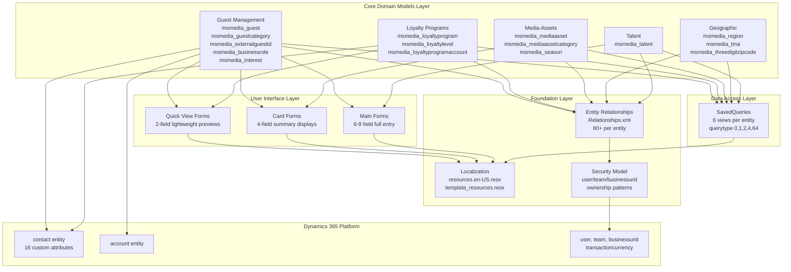

**Architecture Layers:**

1. **Core Domain Models**: Five business subsystems managing distinct operational areas
2. **User Interface Layer**: Three form types with increasing detail levels (Quick View → Card → Main)
3. **Data Access Layer**: Standardized SavedQueries implementing consistent query patterns
4. **Foundation Layer**: Localization, relationships, and security model implementation
5. **Platform Integration**: Extensions to Dynamics 365 standard entities and services

Sources: [Other/Solution.xml:80-96](), [Other/Relationships.xml:1-108]()

---

## Core Business Domains

### Domain Entity Relationships

The following diagram shows how entities relate to each other across domain boundaries and with platform entities.

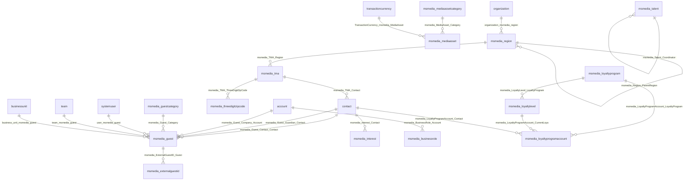

**Key Integration Points:**

- **contact**: Central hub for Guest and Loyalty domains, extended with 16 custom attributes
- **account**: Links to Guest via Company relationship and BusinessRole assignments
- **systemuser, team, businessunit**: Provide ownership for all custom entities
- **organization**: Scopes Region entity for shared reference data
- **transactioncurrency**: Enables multi-currency pricing for Media Assets

Sources: [Other/Relationships.xml:47-63](), [Other/Solution.xml:81]()

---

## Domain Breakdown

### 1. Guest Management Domain

Manages guest profiles, categorization, external system identifiers, business relationships, and interests.

**Entities:**
- `msmedia_guest`: Core guest record with Contact/Guardian/Company lookups
- `msmedia_guestcategory`: Classification system for guests
- `msmedia_externalguestid`: Maps guests to external system identifiers
- `msmedia_businessrole`: Business relationships between Accounts and roles
- `msmedia_interest`: Tracks contact interests

See [Guest Management System](#2) for detailed documentation.

Sources: [Other/Solution.xml:82-86]()

### 2. Loyalty Program Domain

Implements a three-tier loyalty hierarchy: Program → Level → Account.

**Entities:**
- `msmedia_loyaltyprogram`: Program definition and configuration
- `msmedia_loyaltylevel`: Tier levels within programs
- `msmedia_loyaltyprogramaccount`: Individual contact enrollments

**Hierarchy:**
```
msmedia_loyaltyprogram (1:N) msmedia_loyaltylevel
msmedia_loyaltylevel (1:N) msmedia_loyaltyprogramaccount
contact (1:N) msmedia_loyaltyprogramaccount
```

See [Loyalty Program System](#3) for detailed documentation.

Sources: [Other/Solution.xml:87-89](), [Other/Relationships.xml:54-57]()

### 3. Media Asset Domain

Manages media content catalog with categorization and seasonal organization.

**Entities:**
- `msmedia_mediaasset`: Core media asset records with pricing
- `msmedia_mediaassetcategory`: Hierarchical categorization
- `msmedia_season`: Temporal organization of assets

**Missing Dependency:**
This domain depends on the MediaAssetCDM v1.1.3.2 solution for complete functionality.

See [Media Asset System](#4) for detailed documentation.

Sources: [Other/Solution.xml:90-93](), [Other/Solution.xml:132-394]()

### 4. Geographic Domain

Hierarchical geographic data model for market segmentation.

**Entities:**
- `msmedia_region`: Self-referencing regions (parent-child hierarchy)
- `msmedia_tma`: Television Market Areas
- `msmedia_threedigitzipcode`: Zip code prefixes for geographic assignment

**Hierarchy:**
```
msmedia_region (self-reference)
    └─ msmedia_tma (1:N from region)
        └─ msmedia_threedigitzipcode (1:N from TMA)
```

**Unique Characteristic:** `msmedia_region` uses organization-level ownership rather than user/team ownership, indicating it contains shared reference data.

See [Geographic and Market Analysis System](#5) for detailed documentation.

Sources: [Other/Solution.xml:92-96](), [Other/Relationships.xml:59-64]()

### 5. Talent Management Domain

Manages talent profiles with image storage and coordinator relationships.

**Entities:**
- `msmedia_talent`: Talent records with primary image attribute

**Image Configuration:**
The talent entity includes a special image attribute `msmedia_primaryimage` that can store full images.

See [Talent Management System](#6) for detailed documentation.

Sources: [Other/Solution.xml:94](), [Other/Customizations.xml:9-20]()

---

## Platform Integration

### Contact Entity Extensions

The solution extends the standard `contact` entity with 16 custom attributes to create a media-specific customer profile.

**Custom Attributes on contact:**

| Attribute Schema Name | Type | Purpose |
|-----------------------|------|---------|
| `msmedia_Age` | Integer | Calculated or entered age |
| `msmedia_AgeRanges` | OptionSet | Age range classification |
| `msmedia_Birthdate` | DateTime | Date of birth |
| `msmedia_ContactRoles` | OptionSet | Role classification |
| `msmedia_DoNotSMS` | Boolean | SMS marketing preference |
| `msmedia_Education` | String | Education level |
| `msmedia_Employer` | String | Employer name |
| `msmedia_NumberofAdultsinHome` | Integer | Household composition |
| `msmedia_NumberofChildreninHome` | Integer | Household composition |
| `msmedia_NumberofPetsinHome` | Integer | Household composition |
| `msmedia_NumberofVehiclesinHome` | Integer | Household composition |
| `msmedia_TMA` | Lookup | Geographic market assignment |
| `msmedia_UsesSelfCareApps` | Boolean | Self-service preference |
| `msmedia_CustomerSince` | DateTime | Relationship start date |

These extensions transform the contact entity into a comprehensive media customer profile with demographic, behavioral, and geographic data.

Sources: [Resources/en-US/resources.en-US.resx:512-575](), [Other/Solution.xml:81]()

---

## Security and Ownership Model

### Standard Ownership Pattern

Most custom entities implement User/Team/BusinessUnit ownership, enabling standard Dynamics 365 security model:

**Ownership Relationships per Entity:**
- `user_msmedia_*`: User ownership (e.g., `user_msmedia_guest`)
- `team_msmedia_*`: Team ownership (e.g., `team_msmedia_guest`)
- `business_unit_msmedia_*`: Business unit scoping (e.g., `business_unit_msmedia_guest`)
- `owner_msmedia_*`: Polymorphic owner field (User or Team)

### Audit Trail Relationships

All entities include complete audit trail support:
- `lk_msmedia_*_createdby`: Link to creating user
- `lk_msmedia_*_modifiedby`: Link to modifying user
- Standard `createdon`, `modifiedon`, `createdonbehalfby`, `modifiedonbehalfby` attributes

### Special Case: Region Entity

The `msmedia_region` entity uses organization-level ownership (`organization_msmedia_region`) rather than user/team ownership, indicating it contains shared reference data accessible across the entire organization.

Sources: [Other/Relationships.xml:3-107](), [Resources/en-US/resources.en-US.resx:76-491]()

---

## Dependencies

### Missing Dependencies

The solution has documented dependencies on two external solutions that are not included:

**1. MediaAssetCDM v1.1.3.2**
- Required for: `msmedia_mediaasset` and `msmedia_mediaassetcategory` entities
- Impacts: Media Asset domain functionality
- Dependent components: Entity definitions, attributes, relationships, ribbon customizations

**2. BaseCustomControlsCore v9.0 (or later: v9.2.21044.00130)**
- Required for: Custom UI controls in forms
- Specific controls: `MscrmControls.FieldControls.ToggleControl`, `MscrmControls.FlipSwitch.FlipSwitchControl`
- Used in: Guest Main Form
- Impact: Enhanced UI controls may not render without this dependency

**3. CustomControlsCore v9.2.21044.00130**
- Required for: FlipSwitch control
- Used in: Guest Main Form

These dependencies indicate MediaCommon is part of a larger solution ecosystem and may have reduced functionality when deployed independently.

Sources: [Other/Solution.xml:130-395]()

---

## Solution Structure

### Root Components

The solution includes the following root component types:

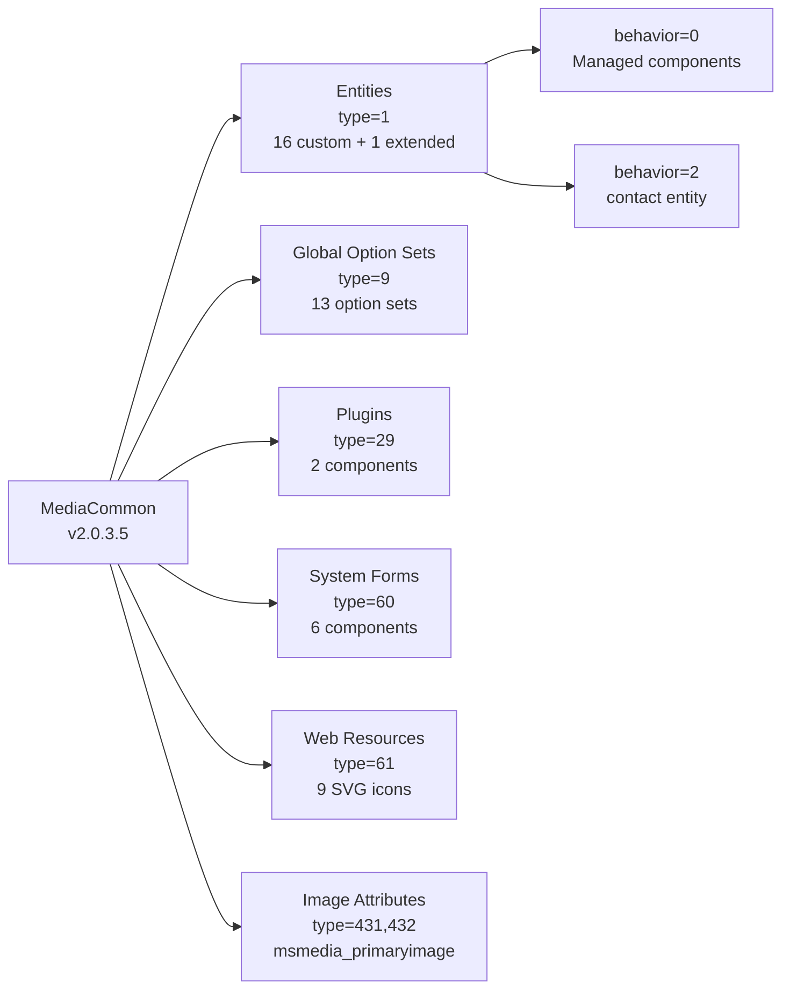

**Behavior Codes:**
- `behavior="0"`: Managed component (cannot be modified in target environment)
- `behavior="2"`: Unmanaged component extension (allows customization)

The contact entity uses `behavior="2"`, allowing organizations to further customize the extended attributes.

Sources: [Other/Solution.xml:80-129]()

---

## Localization and Resources

The solution includes comprehensive localization support through resource files:

**Resource Files:**
- [Resources/en-US/resources.en-US.resx](): English (US) localization with entity names, descriptions, form labels
- [Resources/template_resources.resx](): Template for additional language support

**Resource Content:**
- Entity display names and descriptions
- Option set labels and values
- Form names and descriptions
- Relationship descriptions
- SavedQuery descriptions
- Attribute display names

All user-facing strings are externalized to support internationalization.

Sources: [Resources/en-US/resources.en-US.resx:1-75](), [Resources/template_resources.resx:1-75]()

---

## Version History

The solution uses incremental versioning indicating phased feature delivery:

| Version | Features Introduced |
|---------|-------------------|
| 1.0 | Initial Guest forms and entities |
| 1.0.0.3 | Guest Category functionality |
| 1.0.0.4 | External Guest ID integration |
| 1.0.0.7 | Loyalty Unit Type features |
| 2.0.3.5 | Current release |

Form and entity components include `IntroducedVersion` attributes documenting when they were added to the solution, enabling tracking of feature evolution over time.

Sources: Derived from high-level architecture analysis indicating incremental versioning pattern

---

## Related Documentation

For detailed information about specific aspects of the MediaCommon solution:

- **Domain Systems**: [Guest Management](#2), [Loyalty Programs](#3), [Media Assets](#4), [Geographic](#5), [Talent](#6)
- **Solution Structure**: [Solution Structure and Components](#1.1)
- **Platform Integration**: [Integration with Dynamics 365 Platform](#1.2)
- **UI Architecture**: [User Interface Architecture](#7), [Quick View Forms](#7.1), [Card Forms](#7.2), [Main Forms](#7.3)
- **Data Access**: [Data Access Layer - SavedQueries](#8), [Query Type System](#8.1), [State-Based Filtering](#8.2)
- **Resources**: [Localization and Resources](#9), [Option Sets](#9.2)
- **Deployment**: [Solution Deployment and Lifecycle](#10), [Dependencies](#10.3)
- **Security**: [Security and Ownership Model](#11)15:T4a41,# Solution Structure and Components

<details>
<summary>Relevant source files</summary>

The following files were used as context for generating this wiki page:

- [Other/Customizations.xml](Other/Customizations.xml)
- [Other/Relationships.xml](Other/Relationships.xml)
- [Other/Solution.xml](Other/Solution.xml)
- [Resources/en-US/resources.en-US.resx](Resources/en-US/resources.en-US.resx)
- [Resources/template_resources.resx](Resources/template_resources.resx)

</details>


This document details the structural composition of the MediaCommon v2.0.3.5 solution, including its 16 custom entities, 13 global option sets, entity relationship architecture, external dependencies, and version evolution. For information about how MediaCommon integrates with the Dynamics 365 platform and extends standard entities, see [Integration with Dynamics 365 Platform](#1.2). For detailed documentation of individual business domains, see sections [2](#2) through [6](#6).

## Solution Metadata

The MediaCommon solution is published by Microsoft Dynamics 365 Media with the following core identifiers:

| Property | Value |
|----------|-------|
| **Solution Unique Name** | `MediaCommon` |
| **Display Name** | Media Common |
| **Version** | 2.0.3.5 |
| **Publisher Prefix** | `msmedia` |
| **Option Value Prefix** | `76686` |
| **Language Code** | 1033 (English - United States) |

All custom entities, attributes, and option sets in this solution use the `msmedia` prefix. The option value prefix `76686` ensures global option set values do not conflict with other solutions.

**Sources:** [Other/Solution.xml:1-79]()

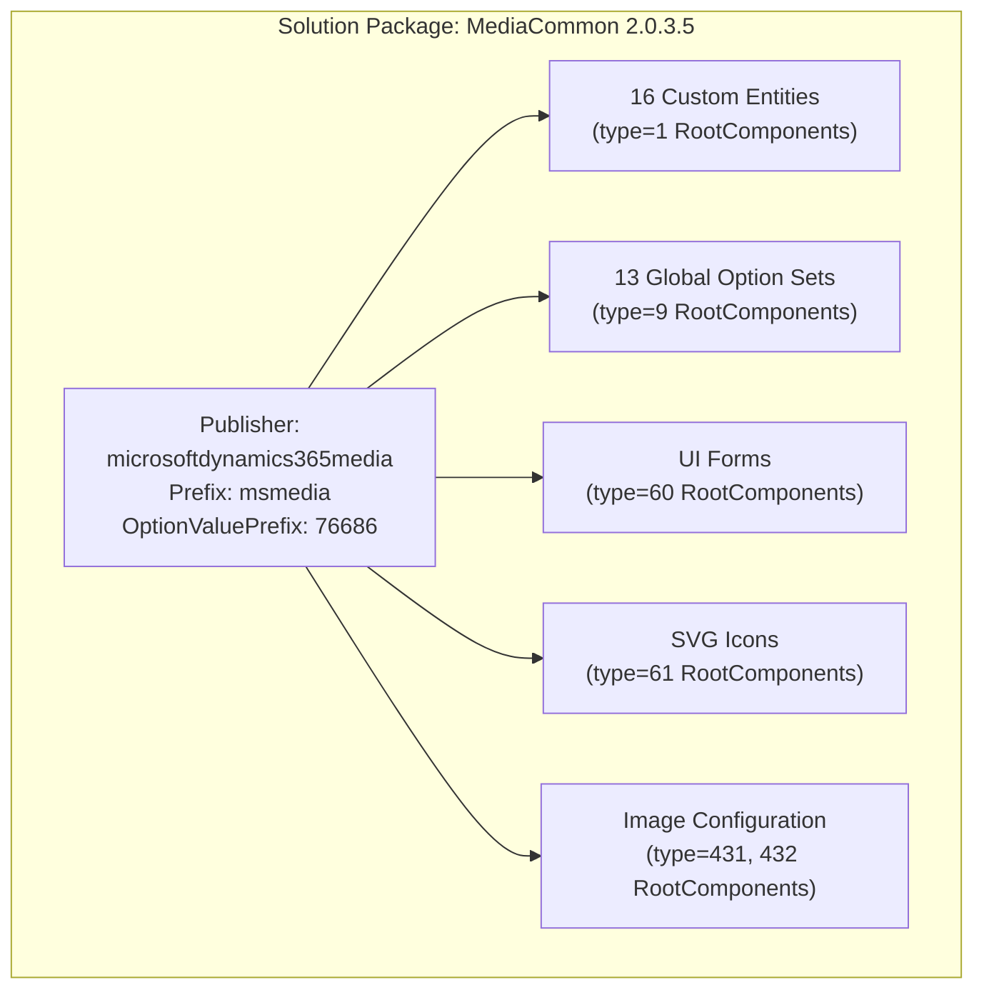

**Sources:** [Other/Solution.xml:3-129]()

## Custom Entities by Domain

The solution contains 16 custom entities organized across five business domains. Each entity is defined as a `RootComponent` with `type="1"` in the solution manifest.

### Entity Inventory

| Entity Schema Name | Display Name | Domain | Behavior Code |
|-------------------|--------------|--------|---------------|
| `msmedia_guest` | Guest | Guest Management | 0 |
| `msmedia_guestcategory` | Guest Category | Guest Management | 0 |
| `msmedia_externalguestid` | External Guest ID | Guest Management | 0 |
| `msmedia_businessrole` | Business Role | Guest Management | 0 |
| `msmedia_interest` | Interest | Guest Management | 0 |
| `msmedia_loyaltyprogram` | Loyalty Program | Loyalty System | 0 |
| `msmedia_loyaltylevel` | Loyalty Level | Loyalty System | 0 |
| `msmedia_loyaltyprogramaccount` | Loyalty Program Account | Loyalty System | 0 |
| `msmedia_mediaasset` | Media Asset | Media Asset System | 0 |
| `msmedia_mediaassetcategory` | Media Asset Category | Media Asset System | 0 |
| `msmedia_season` | Season | Media Asset System | 0 |
| `msmedia_region` | Region | Geographic System | 0 |
| `msmedia_tma` | TMA | Geographic System | 0 |
| `msmedia_threedigitzipcode` | Three Digit Zip Code | Geographic System | 0 |
| `msmedia_talent` | Talent | Talent Management | 0 |
| `contact` | Contact (Extended) | Platform Integration | 2 |

The `behavior="0"` code indicates these are standard user-owned entities. The Contact entity has `behavior="2"`, indicating it is an extended platform entity rather than a newly created entity.

**Sources:** [Other/Solution.xml:81-96]()

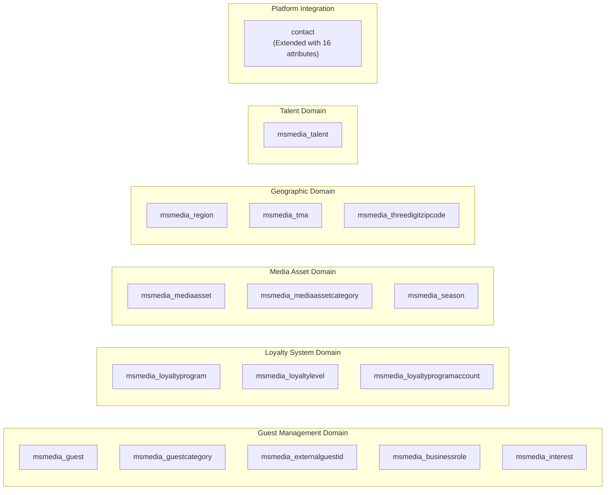

**Sources:** [Other/Solution.xml:81-96]()

## Global Option Sets

The solution defines 13 global option sets (picklists) that provide standardized values across entities. These are registered as `RootComponent` entries with `type="9"`.

### Option Set Catalog

| Schema Name | Display Name | Purpose |
|------------|--------------|---------|
| `msmedia_ageranges` | Age Ranges | Demographic segmentation categories |
| `msmedia_assettype` | Media Asset Type | Classification of media assets |
| `msmedia_businessroles` | Business Roles | Account relationship types |
| `msmedia_contactroles` | Contact Roles | Contact relationship types |
| `msmedia_educationtypes` | Education Types | Education level classification |
| `msmedia_eventformat` | Event Format | Event delivery method types |
| `msmedia_externalguestsources` | External Guest Sources | External system identifiers |
| `msmedia_fixedguestlevel` | Fixed Guest Level | Guest tier assignments |
| `msmedia_gender` | Gender | Gender identity options |
| `msmedia_guestorigin` | Guest Origin | Guest acquisition source |
| `msmedia_pronoun` | Pronoun | Pronoun preferences |
| `msmedia_providerroles` | Provider Roles | Service provider classifications |
| `msmedia_unittype` | Unit Type | Loyalty program unit types |

Each option set uses the option value prefix `76686` to generate unique integer values for its options. Option set definitions are stored in resource files with localized display names and descriptions.

**Sources:** [Other/Solution.xml:97-109](), [Resources/en-US/resources.en-US.resx:1-100]()

## Entity Relationships Architecture

The solution implements 108 entity relationships organized into three categories: ownership relationships, audit trail relationships, and business domain relationships.

### Relationship Type Distribution

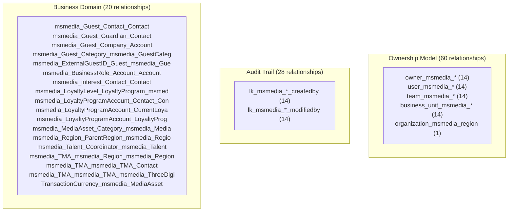

**Sources:** [Other/Relationships.xml:1-108]()

### Ownership Relationship Pattern

All 14 custom entities (excluding Contact which is platform-owned) implement a consistent ownership model with four relationship types per entity:

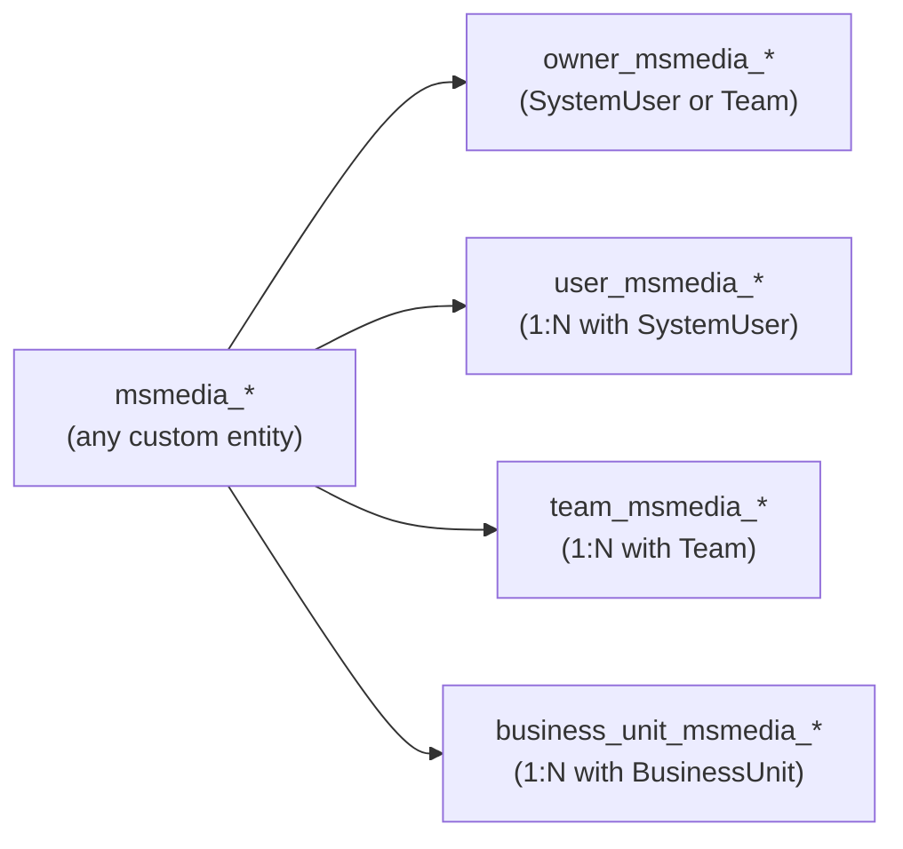

The `msmedia_region` entity uniquely uses `organization_msmedia_region` for organization-level ownership instead of user/team ownership, indicating it contains shared reference data.

**Sources:** [Other/Relationships.xml:3-16, 64-78, 79-92, 94-107]()

### Audit Trail Relationship Pattern

Each custom entity implements two audit relationships tracking record creation and modification:

| Relationship Pattern | Description | Source Entity | Target Entity |
|---------------------|-------------|---------------|---------------|
| `lk_msmedia_*_createdby` | Creator tracking | All 14 custom entities | `systemuser` |
| `lk_msmedia_*_modifiedby` | Modifier tracking | All 14 custom entities | `systemuser` |

**Sources:** [Other/Relationships.xml:17-46]()

### Business Domain Relationships

Twenty relationships define the business logic connections between entities:

```mermaid
graph TB
    subgraph "Guest Domain Relationships"
        Guest["msmedia_guest"]
        Contact1["contact"]
        Account1["account"]
        GuestCat["msmedia_guestcategory"]
        ExtGuest["msmedia_externalguestid"]
        
        Guest -->|msmedia_Guest_Contact_Contact| Contact1
        Guest -->|msmedia_Guest_Guardian_Contact| Contact1
        Guest -->|msmedia_Guest_Company_Account| Account1
        Guest -->|msmedia_Guest_Category_msmedia_GuestCateg| GuestCat
        ExtGuest -->|msmedia_ExternalGuestID_Guest_msmedia_Gue| Guest
    end
    
    subgraph "Loyalty Domain Relationships"
        LoyaltyProg["msmedia_loyaltyprogram"]
        LoyaltyLvl["msmedia_loyaltylevel"]
        LoyaltyAcct["msmedia_loyaltyprogramaccount"]
        Contact2["contact"]
        
        LoyaltyLvl -->|msmedia_LoyaltyLevel_LoyaltyProgram_msmed| LoyaltyProg
        LoyaltyAcct -->|msmedia_LoyaltyProgramAccount_LoyaltyProg| LoyaltyProg
        LoyaltyAcct -->|msmedia_LoyaltyProgramAccount_CurrentLoya| LoyaltyLvl
        LoyaltyAcct -->|msmedia_LoyaltyProgramAccount_Contact_Con| Contact2
    end
    
    subgraph "Geographic Relationships"
        Region["msmedia_region"]
        TMA["msmedia_tma"]
        Zip["msmedia_threedigitzipcode"]
        Contact3["contact"]
        
        Region -->|msmedia_Region_ParentRegion_msmedia_Regio| Region
        TMA -->|msmedia_TMA_msmedia_Region_msmedia_Region| Region
        TMA -->|msmedia_TMA_msmedia_TMA_msmedia_ThreeDigi| Zip
        TMA -->|msmedia_TMA_msmedia_TMA_Contact| Contact3
    end
```

**Sources:** [Other/Relationships.xml:47-63]()

## External Dependencies

The solution has documented dependencies on two external packages that are not present in the deployment environment. These missing dependencies are cataloged in the solution manifest's `MissingDependencies` section.

### MediaAssetCDM v1.1.3.2

The `msmedia_mediaasset` and `msmedia_mediaassetcategory` entities depend on base entity definitions from the MediaAssetCDM solution. A total of 142 missing dependency entries reference this package.

**Missing Components:**
- `msmedia_mediaasset` entity definition (base schema)
- `msmedia_mediaassetcategory` entity definition (base schema)
- `msmedia_assettype` global option set
- `msmedia_MediaAssetsSVG` web resource
- `msmedia_MediaAssetCategorySVG` web resource
- Multiple system attributes (createdby, modifiedby, ownerid, statecode, etc.)

These entities exist as placeholder definitions in MediaCommon that will be completed when MediaAssetCDM is deployed.

**Sources:** [Other/Solution.xml:131-394]()

### BaseCustomControlsCore v9.0.2104.4005

The Guest Main Form (ID `{165a28fe-e798-4086-ae69-3ef841d84590}`) depends on two custom controls from this package:

| Control Schema Name | Purpose |
|---------------------|---------|
| `MscrmControls.FieldControls.ToggleControl` | Toggle switch control for boolean fields |
| `MscrmControls.FlipSwitch.FlipSwitchControl` | Alternative flip switch control |

Without this dependency, the Guest Main Form will render these controls using default platform controls.

**Sources:** [Other/Solution.xml:384-390]()

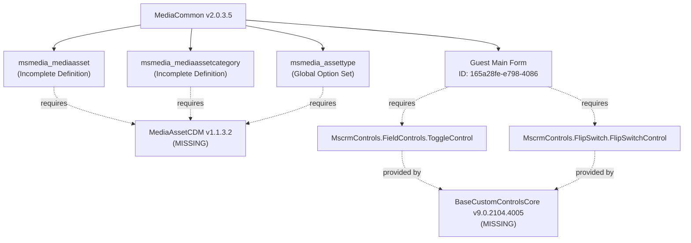

**Sources:** [Other/Solution.xml:130-395]()

## Image Configuration

The solution configures image storage for the `msmedia_talent` entity, enabling the `msmedia_primaryimage` attribute to store full-resolution images.

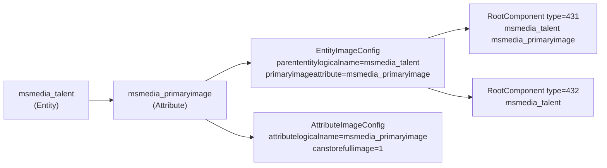

The `canstorefullimage=1` setting allows high-resolution images to be stored directly in the database rather than being resized to thumbnail dimensions.

**Sources:** [Other/Customizations.xml:8-20](), [Other/Solution.xml:127-128]()

## Version History

The solution has evolved through multiple versions, with components introduced incrementally across releases:

### Version Timeline

| Version | Components Introduced | Evidence |
|---------|----------------------|----------|
| 1.0 | Guest entity base forms | `IntroducedVersion="1.0"` attributes in form definitions |
| 1.0.0.3 | Guest Category forms | Quick View and Card Forms for `msmedia_guestcategory` |
| 1.0.0.4 | External Guest ID forms | Forms for `msmedia_externalguestid` entity |
| 1.0.0.7 | Loyalty Unit Type form | Role-restricted Quick View Form for loyalty levels |
| 2.0.3.5 | Current release | Complete solution package with all 16 entities |

The current version (2.0.3.5) represents a major release (2.0) with three minor updates (0.3) and five patch versions (0.5).

**Sources:** [Other/Solution.xml:9]()

## Component Type Distribution

The solution contains multiple component types registered as root components:

### Root Component Inventory

| Type Code | Component Type | Count | Examples |
|-----------|---------------|-------|----------|
| 1 | Entity | 16 | `msmedia_guest`, `msmedia_loyaltyprogram`, `contact` |
| 9 | Global Option Set | 13 | `msmedia_ageranges`, `msmedia_assettype`, `msmedia_gender` |
| 29 | Site Map | 2 | Navigation configuration entries |
| 60 | System Form | 6 | Main forms for Guest, Interest, Talent, Loyalty Program Account |
| 61 | Web Resource | 9 | SVG icons for entity visualization |
| 431 | Entity Image Attribute | 1 | `msmedia_talent msmedia_primaryimage` |
| 432 | Entity Image Configuration | 1 | `msmedia_talent` entity-level config |

The complete solution also includes non-root components such as SavedQueries (views), Card Forms, Quick View Forms, and entity relationships that are not listed in the root components section.

**Sources:** [Other/Solution.xml:80-129]()

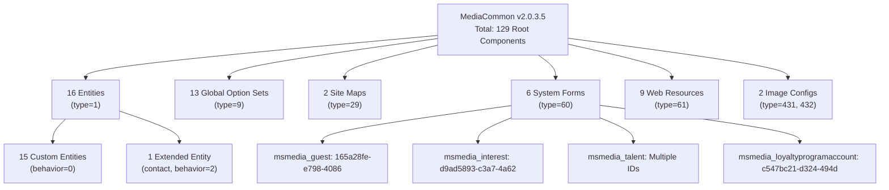

**Sources:** [Other/Solution.xml:80-129]()

## Contact Entity Extensions

While Contact is a platform entity, MediaCommon extends it with 16 custom attributes all using the `msmedia` prefix:

| Attribute Schema Name | Data Type | Purpose |
|----------------------|-----------|---------|
| `msmedia_Age` | Calculated | Age calculation |
| `msmedia_AgeRanges` | Option Set | Age range segmentation |
| `msmedia_Birthdate` | Date | Birth date |
| `msmedia_ContactRoles` | Option Set | Contact role classification |
| `msmedia_CustomerSince` | Date | Customer relationship start |
| `msmedia_DoNotSMS` | Boolean | SMS opt-out preference |
| `msmedia_Education` | Option Set | Education level |
| `msmedia_Employer` | Text | Employer name |
| `msmedia_NumberofAdultsinHome` | Integer | Household adults count |
| `msmedia_NumberofChildreninHome` | Integer | Household children count |
| `msmedia_NumberofPetsinHome` | Integer | Household pets count |
| `msmedia_NumberofVehiclesinHome` | Integer | Household vehicles count |
| `msmedia_TMA` | Lookup | Television Market Area assignment |
| `msmedia_UsesSelfCareApps` | Boolean | Self-service adoption indicator |

These extensions transform Contact into a media-specific customer profile entity with demographic, behavioral, and geographic dimensions.

**Sources:** [Resources/en-US/resources.en-US.resx:512-575]()16:T690e,# Integration with Dynamics 365 Platform

<details>
<summary>Relevant source files</summary>

The following files were used as context for generating this wiki page:

- [Other/Customizations.xml](Other/Customizations.xml)
- [Other/Relationships.xml](Other/Relationships.xml)
- [Other/Solution.xml](Other/Solution.xml)
- [Resources/en-US/resources.en-US.resx](Resources/en-US/resources.en-US.resx)
- [Resources/template_resources.resx](Resources/template_resources.resx)

</details>


This document explains how the MediaCommon solution integrates with the Dynamics 365 platform by extending standard entities, implementing platform security models, and leveraging core Dynamics 365 capabilities. It covers the extension of the `contact` entity with media-specific attributes, direct relationships between custom entities and standard CRM entities, the implementation of ownership and audit trail patterns, and the use of platform services like currency management.

For information about the custom entities introduced by MediaCommon, see [Solution Structure and Components](#1.1). For details about security role configuration and form-level access control, see [Role-Based Form Access](#11.3).

## Contact Entity Extensions

MediaCommon extends the standard Dynamics 365 `contact` entity with 16 custom attributes, transforming it into a media-specific customer profile. This extension pattern allows MediaCommon to leverage existing CRM functionality while adding domain-specific data.

### Extended Attributes

The following table lists all custom attributes added to the `contact` entity:

| Attribute Name | Purpose |
|----------------|---------|
| `msmedia_Age` | Calculated or stored age value |
| `msmedia_AgeRanges` | Age range classification using global option set |
| `msmedia_Birthdate` | Date of birth for age calculation |
| `msmedia_ContactRoles` | Multi-select option set for contact roles |
| `msmedia_DoNotSMS` | SMS opt-out preference |
| `msmedia_Education` | Education level or institution |
| `msmedia_Employer` | Current employer information |
| `msmedia_NumberofAdultsinHome` | Household demographic data |
| `msmedia_NumberofChildreninHome` | Household demographic data |
| `msmedia_NumberofPetsinHome` | Household demographic data |
| `msmedia_NumberofVehiclesinHome` | Household demographic data |
| `msmedia_TMA` | Lookup to `msmedia_tma` entity for geographic segmentation |
| `msmedia_UsesSelfCareApps` | Boolean flag for app usage behavior |
| `msmedia_CustomerSince` | Date indicating customer relationship start |

The `contact` entity is included in the solution as a root component with `behavior="2"`, indicating it is being extended rather than created from scratch.

**Sources:** [Other/Solution.xml:81](), [Resources/en-US/resources.en-US.resx:512-575]()

### Extension Pattern Implementation

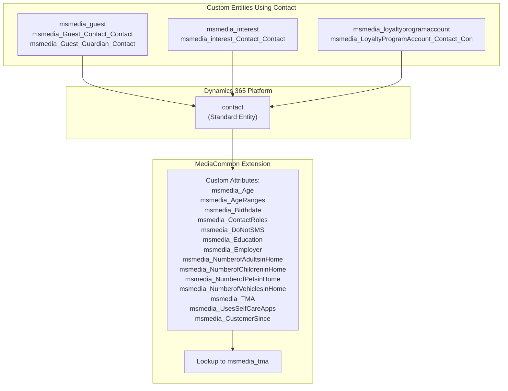

**Diagram: Contact Entity Extension Pattern**

This diagram shows how MediaCommon extends the `contact` entity and how custom entities establish relationships to it. The extension uses the `behavior="2"` pattern in the solution manifest, allowing all existing Contact functionality to remain available.

**Sources:** [Other/Solution.xml:81](), [Other/Relationships.xml:51-53, 55, 62]()

## Direct Entity Relationships to Standard Entities

MediaCommon establishes direct relationships between its custom entities and standard Dynamics 365 entities to enable integration with core CRM processes.

### Relationship Mapping

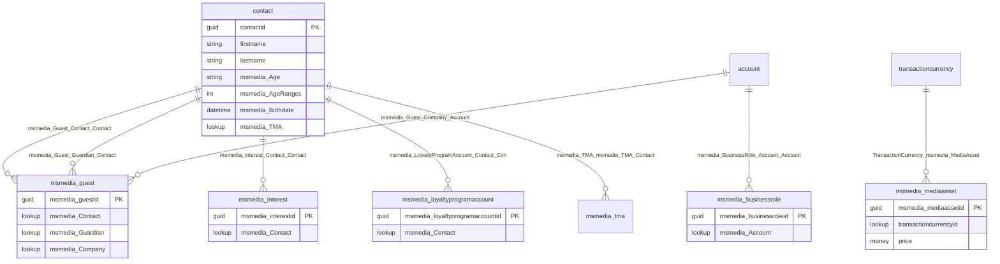

**Diagram: Direct Relationships Between Custom and Standard Entities**

The diagram illustrates the six primary relationship types between MediaCommon custom entities and standard Dynamics 365 entities. The `contact` entity serves as the primary integration point, while `account` enables B2B scenarios and `transactioncurrency` supports pricing.

**Sources:** [Other/Relationships.xml:47-63, 93](), [Resources/en-US/resources.en-US.resx:252-310, 432-434]()

### Relationship Descriptions

| Relationship Name | From Entity | To Entity | Purpose |
|-------------------|-------------|-----------|---------|
| `msmedia_Guest_Contact_Contact` | `msmedia_guest` | `contact` | Primary contact for guest record |
| `msmedia_Guest_Guardian_Contact` | `msmedia_guest` | `contact` | Guardian contact for minor guests |
| `msmedia_Guest_Company_Account` | `msmedia_guest` | `account` | Corporate/company affiliation |
| `msmedia_BusinessRole_Account_Account` | `msmedia_businessrole` | `account` | Business roles assigned to accounts |
| `msmedia_interest_Contact_Contact` | `msmedia_interest` | `contact` | Interests associated with contacts |
| `msmedia_LoyaltyProgramAccount_Contact_Con` | `msmedia_loyaltyprogramaccount` | `contact` | Contact who owns loyalty account |
| `msmedia_TMA_msmedia_TMA_Contact` | `msmedia_tma` | `contact` | Geographic market assignment |
| `TransactionCurrency_msmedia_MediaAsset` | `msmedia_mediaasset` | `transactioncurrency` | Currency for asset pricing |

**Sources:** [Resources/en-US/resources.en-US.resx:252-310, 432-434]()

## Ownership Model Implementation

MediaCommon implements the full Dynamics 365 ownership model across all custom entities, enabling role-based access control and team collaboration.

### Ownership Relationship Pattern

```mermaid
graph TB
    subgraph "Standard Ownership Entities"
        User["systemuser<br/>(User)"]
        Team["team"]
        BusinessUnit["businessunit"]
        Organization["organization"]
    end
    
    subgraph "Ownership Relationships - All Custom Entities"
        UserRels["user_msmedia_*<br/>(14 entities)"]
        TeamRels["team_msmedia_*<br/>(14 entities)"]
        BURels["business_unit_msmedia_*<br/>(14 entities)"]
        OwnerRels["owner_msmedia_*<br/>(14 entities)"]
    end
    
    subgraph "Organization-Level Entity"
        OrgRel["organization_msmedia_region<br/>(1 entity)"]
    end
    
    subgraph "Custom Entities with Standard Ownership"
        E1["msmedia_businessrole"]
        E2["msmedia_externalguestid"]
        E3["msmedia_guest"]
        E4["msmedia_guestcategory"]
        E5["msmedia_interest"]
        E6["msmedia_loyaltylevel"]
        E7["msmedia_loyaltyprogram"]
        E8["msmedia_loyaltyprogramaccount"]
        E9["msmedia_mediaasset"]
        E10["msmedia_mediaassetcategory"]
        E11["msmedia_season"]
        E12["msmedia_talent"]
        E13["msmedia_threedigitzipcode"]
        E14["msmedia_tma"]
    end
    
    subgraph "Custom Entity with Org Ownership"
        E15["msmedia_region"]
    end
    
    User --> UserRels
    Team --> TeamRels
    BusinessUnit --> BURels
    
    UserRels --> E1
    UserRels --> E2
    UserRels --> E3
    UserRels --> E4
    UserRels --> E5
    UserRels --> E6
    UserRels --> E7
    UserRels --> E8
    UserRels --> E9
    UserRels --> E10
    UserRels --> E11
    UserRels --> E12
    UserRels --> E13
    UserRels --> E14
    
    TeamRels --> E1
    BURels --> E1
    OwnerRels --> E1
    
    Organization --> OrgRel
    OrgRel --> E15
```

**Diagram: Ownership Model Relationships**

This diagram shows the systematic ownership pattern applied to all 14 custom entities with User/Team/BusinessUnit ownership, and the unique Organization-level ownership for `msmedia_region`.

**Sources:** [Other/Relationships.xml:3-16, 64-78, 79-92, 94-107]()

### Ownership Relationship Counts

| Relationship Type | Count | Applies To | Relationship Pattern |
|-------------------|-------|------------|---------------------|
| User Ownership | 14 | All entities except `msmedia_region` | `user_msmedia_*` |
| Team Ownership | 14 | All entities except `msmedia_region` | `team_msmedia_*` |
| Business Unit Ownership | 14 | All entities except `msmedia_region` | `business_unit_msmedia_*` |
| Owner (Generic) | 14 | All entities except `msmedia_region` | `owner_msmedia_*` |
| Organization Ownership | 1 | `msmedia_region` only | `organization_msmedia_region` |

Each custom entity (except `msmedia_region`) implements four ownership relationships, resulting in 56 ownership relationships total (14 entities × 4 relationships). The `msmedia_region` entity uses a single organization-level relationship, indicating it contains shared reference data rather than user-owned transactional data.

**Sources:** [Other/Relationships.xml:3-16, 64-78, 79-92, 94-107](), [Resources/en-US/resources.en-US.resx:76-131, 316-375]()

### Owner Field Implementation

All entities with User/Team ownership expose an `ownerid` field that can reference either a `systemuser` or `team` record. The relationship descriptions in the resource files confirm this pattern:

- **Owner Relationships**: Description = "Owner Id" (generic owner field)
- **User Relationships**: Description = "Unique identifier for the user that owns the record."
- **Team Relationships**: Description = "Unique identifier for the team that owns the record."
- **Business Unit Relationships**: Description = "Unique identifier for the business unit that owns the record"

**Sources:** [Resources/en-US/resources.en-US.resx:320-375, 376-431, 436-491]()

## Audit Trail Implementation

MediaCommon implements comprehensive audit trails by creating relationships to the `systemuser` entity for tracking record creation and modification.

### Audit Relationship Pattern

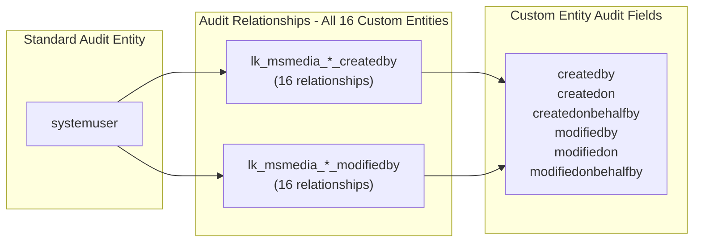

**Diagram: Audit Trail Relationship Pattern**

Every custom entity includes six audit-related relationships to the `systemuser` entity, providing complete tracking of who created and modified records, including delegation scenarios.

**Sources:** [Other/Relationships.xml:17-46]()

### Audit Relationship Inventory

| Entity | Created By Relationship | Modified By Relationship |
|--------|------------------------|--------------------------|
| `msmedia_businessrole` | `lk_msmedia_businessrole_createdby` | `lk_msmedia_businessrole_modifiedby` |
| `msmedia_externalguestid` | `lk_msmedia_externalguestid_createdby` | `lk_msmedia_externalguestid_modifiedby` |
| `msmedia_guest` | `lk_msmedia_guest_createdby` | `lk_msmedia_guest_modifiedby` |
| `msmedia_guestcategory` | `lk_msmedia_guestcategory_createdby` | `lk_msmedia_guestcategory_modifiedby` |
| `msmedia_interest` | `lk_msmedia_interest_createdby` | `lk_msmedia_interest_modifiedby` |
| `msmedia_loyaltylevel` | `lk_msmedia_loyaltylevel_createdby` | `lk_msmedia_loyaltylevel_modifiedby` |
| `msmedia_loyaltyprogram` | `lk_msmedia_loyaltyprogram_createdby` | `lk_msmedia_loyaltyprogram_modifiedby` |
| `msmedia_loyaltyprogramaccount` | `lk_msmedia_loyaltyprogramaccount_createdby` | `lk_msmedia_loyaltyprogramaccount_modifiedby` |
| `msmedia_mediaasset` | `lk_msmedia_mediaasset_createdby` | `lk_msmedia_mediaasset_modifiedby` |
| `msmedia_mediaassetcategory` | `lk_msmedia_mediaassetcategory_createdby` | `lk_msmedia_mediaassetcategory_modifiedby` |
| `msmedia_region` | `lk_msmedia_region_createdby` | `lk_msmedia_region_modifiedby` |
| `msmedia_season` | `lk_msmedia_season_createdby` | `lk_msmedia_season_modifiedby` |
| `msmedia_talent` | `lk_msmedia_talent_createdby` | `lk_msmedia_talent_modifiedby` |
| `msmedia_threedigitzipcode` | `lk_msmedia_threedigitzipcode_createdby` | `lk_msmedia_threedigitzipcode_modifiedby` |
| `msmedia_tma` | `lk_msmedia_tma_createdby` | `lk_msmedia_tma_modifiedby` |

Note that even `msmedia_region`, which uses organization-level ownership, still implements audit trail relationships. This allows tracking of who created and modified reference data records while preventing individual ownership.

**Sources:** [Other/Relationships.xml:17-46](), [Resources/en-US/resources.en-US.resx:132-251]()

### Audit Field Descriptions

The resource files provide standardized descriptions for audit relationships:

- **Created By Relationships**: "Unique identifier of the user who created the record."
- **Modified By Relationships**: "Unique identifier of the user who modified the record."

These relationships support delegate scenarios through `createdonbehalfby` and `modifiedonbehalfby` fields, enabling audit trails when administrative users perform actions on behalf of others.

**Sources:** [Resources/en-US/resources.en-US.resx:132-251]()

## Currency Support

MediaCommon integrates with Dynamics 365 multi-currency capabilities to support pricing scenarios in the media asset catalog.

### Currency Relationship

The `msmedia_mediaasset` entity includes a lookup relationship to the `transactioncurrency` entity:

- **Relationship Name**: `TransactionCurrency_msmedia_MediaAsset`
- **Description**: "Unique identifier of the currency associated with the entity."

This relationship enables media assets to be priced in different currencies, with automatic exchange rate calculation provided by the Dynamics 365 platform. The relationship supports scenarios where media assets are sold or licensed in international markets with varying currency requirements.

**Sources:** [Other/Relationships.xml:93](), [Resources/en-US/resources.en-US.resx:432-434]()

### Currency Field Implementation

When the `TransactionCurrency_msmedia_MediaAsset` relationship is present, the `msmedia_mediaasset` entity gains several currency-related fields:

- `transactioncurrencyid`: Lookup to the `transactioncurrency` record
- `exchangerate`: Calculated exchange rate relative to base currency
- `price`: Base currency monetary field
- `price_base`: System-calculated field showing price in base currency

The missing dependency section in the solution manifest confirms that several currency-related attributes depend on the base `msmedia_mediaasset` entity definition from MediaAssetCDM:

- `exchangerate` (Display Name: "Exchange Rate")
- `transactioncurrencyid` (Display Name: "Currency")
- `transactioncurrencyidname`

**Sources:** [Other/Solution.xml:247-254]()

## Organization-Level Ownership Pattern

The `msmedia_region` entity uses a unique ownership pattern compared to other custom entities in the solution.

### Region Ownership Model

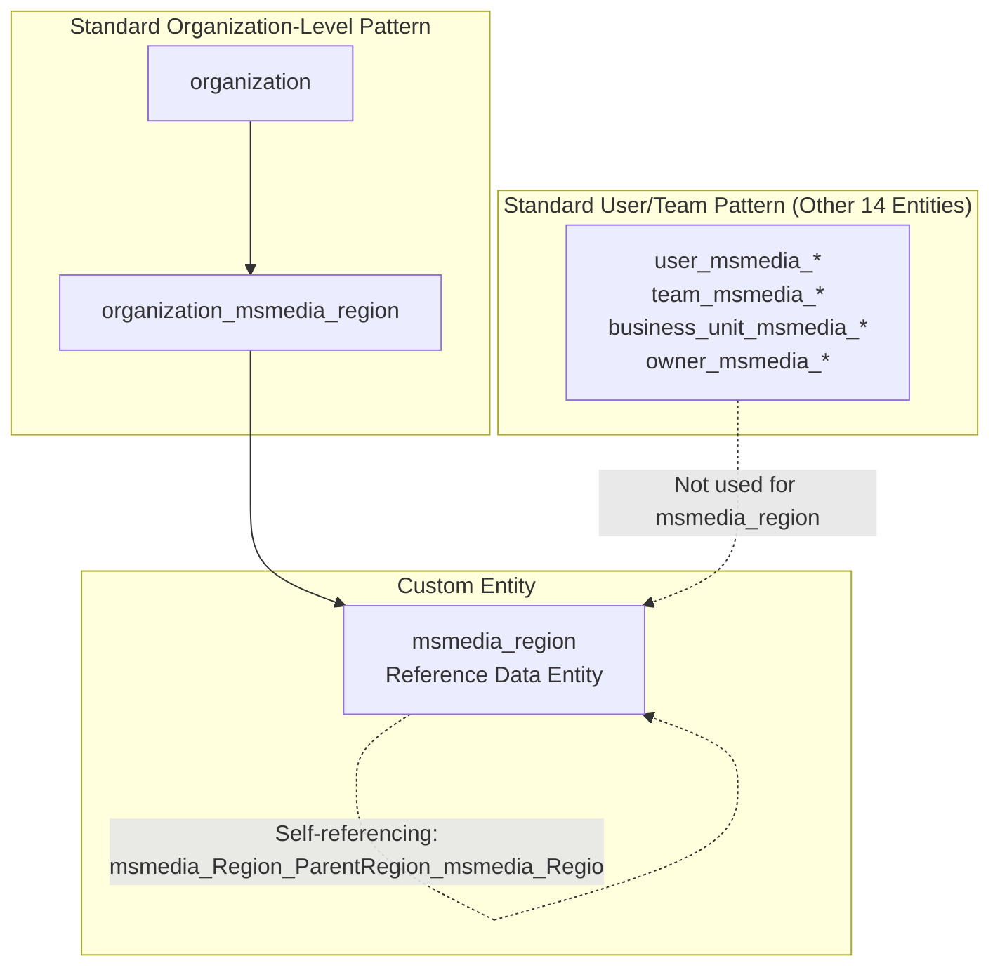

**Diagram: Organization-Level Ownership for msmedia_region**

The `msmedia_region` entity is the only custom entity that uses organization-level ownership rather than user/team ownership. This pattern indicates that regions are shared reference data accessible to all users in the organization.

**Sources:** [Other/Relationships.xml:59, 64](), [Resources/en-US/resources.en-US.resx:316-318]()

### Organization Ownership Description

The relationship description for `organization_msmedia_region` is:

- **Description**: "Unique identifier for the organization"

This confirms that `msmedia_region` records are owned at the organization level, making them globally accessible reference data rather than user-specific transactional data. This pattern is appropriate for geographic hierarchies (regions, TMAs, zip codes) that should be shared across the entire organization.

The `msmedia_region` entity also implements a self-referencing relationship (`msmedia_Region_ParentRegion_msmedia_Regio`) to support hierarchical region structures while maintaining organization-level visibility.

**Sources:** [Resources/en-US/resources.en-US.resx:316-318](), [Other/Relationships.xml:59]()

## Solution Publisher Configuration

The MediaCommon solution is published by "Microsoft Dynamics 365 Media" with specific configuration settings that govern naming conventions and integration behavior.

### Publisher Metadata

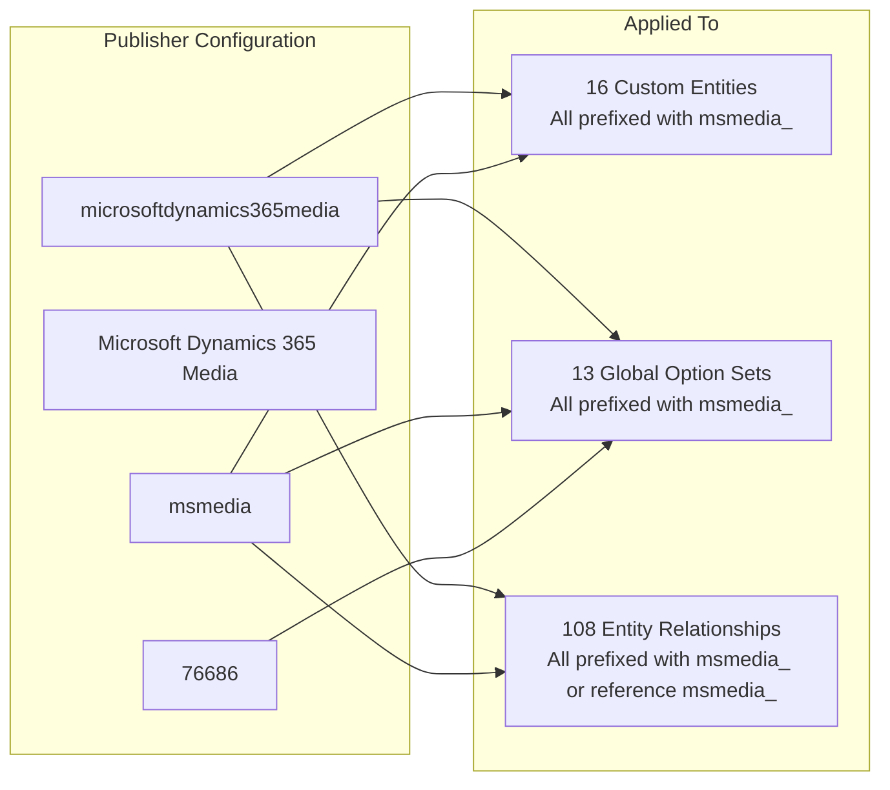

**Diagram: Publisher Configuration and Naming Conventions**

The publisher configuration establishes naming conventions that prevent conflicts with other solutions in the Dynamics 365 environment.

**Sources:** [Other/Solution.xml:11-20]()

### Publisher Properties

| Property | Value | Purpose |
|----------|-------|---------|
| UniqueName | `microsoftdynamics365media` | Unique identifier for the publisher |
| DisplayName | `Microsoft Dynamics 365 Media` | User-facing publisher name |
| CustomizationPrefix | `msmedia` | Prefix for all custom entities, attributes, and relationships |
| CustomizationOptionValuePrefix | `76686` | Numeric prefix for option set values to avoid conflicts |

The customization prefix `msmedia` ensures all custom components are easily identifiable and prevents naming collisions with other solutions. The option value prefix `76686` is used as the base value for all option set items defined by this publisher, ensuring unique option values across the entire Dynamics 365 environment.

**Sources:** [Other/Solution.xml:12-20]()

## Platform Capability Dependencies

MediaCommon depends on specific Dynamics 365 platform capabilities and external solutions to provide full functionality.

### Missing Dependency Analysis

The solution manifest documents several missing dependencies that impact functionality:

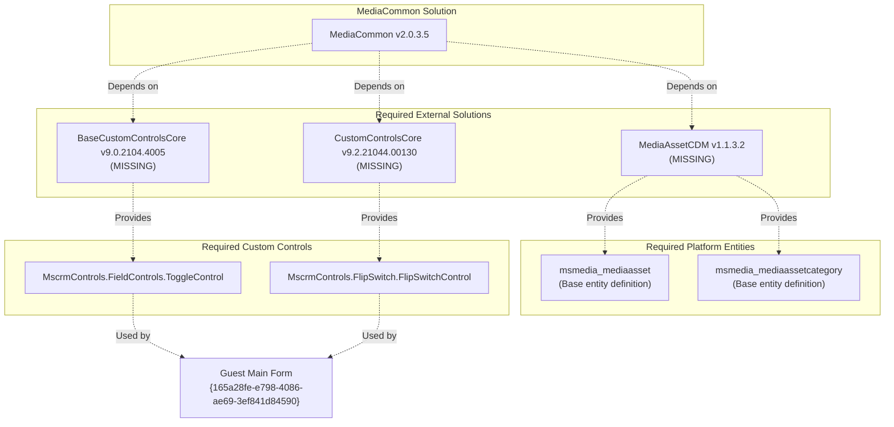

**Diagram: Missing Dependency Chain**

The solution has documented dependencies on external solutions that must be deployed separately to enable full functionality.

**Sources:** [Other/Solution.xml:130-395]()

### MediaAssetCDM Dependency

The `msmedia_mediaasset` and `msmedia_mediaassetcategory` entities depend on base entity definitions from MediaAssetCDM v1.1.3.2. The missing dependency section lists 58 dependencies for `msmedia_mediaasset` and 32 dependencies for `msmedia_mediaassetcategory`, including:

- Base entity definitions
- Entity relationships
- Standard attributes (created by, modified by, owner, etc.)
- Currency-related attributes
- State and status attributes
- Ribbon customizations
- Entity images (SVG icons)

Without MediaAssetCDM, the media asset entities will have incomplete functionality.

**Sources:** [Other/Solution.xml:131-374, 375-382]()

### Custom Control Dependencies

The Guest Main Form (`{165a28fe-e798-4086-ae69-3ef841d84590}`) depends on two custom controls:

1. **MscrmControls.FieldControls.ToggleControl** from BaseCustomControlsCore v9.0.2104.4005
2. **MscrmControls.FlipSwitch.FlipSwitchControl** from CustomControlsCore v9.2.21044.00130

These controls provide enhanced user interface components for boolean fields, such as toggle switches and flip switches. Without these controls, the Guest Main Form will fall back to standard boolean checkbox rendering.

**Sources:** [Other/Solution.xml:383-390]()

### Option Set Dependencies

The `msmedia_assettype` global option set depends on the MediaAssetCDM solution. This option set is used to classify media assets by type and must be defined in the base CDM solution to ensure consistency across media-related solutions.

**Sources:** [Other/Solution.xml:392-394]()

## Entity Image Configuration

MediaCommon configures entity images for the talent management domain, enabling visual identification of talent records.

### Image Attribute Configuration

The `msmedia_talent` entity is configured with image capabilities:

```xml
<EntityImageConfig>
  <parententitylogicalname>msmedia_talent</parententitylogicalname>
  <primaryimageattribute>msmedia_primaryimage</primaryimageattribute>
</EntityImageConfig>

<AttributeImageConfig>
  <attributelogicalname>msmedia_primaryimage</attributelogicalname>
  <parententitylogicalname>msmedia_talent</parententitylogicalname>
  <canstorefullimage>1</canstorefullimage>
</AttributeImageConfig>
```

This configuration:
- Designates `msmedia_primaryimage` as the primary image attribute for `msmedia_talent` entities
- Enables full image storage capabilities (`canstorefullimage=1`)
- Allows the platform to automatically generate thumbnail versions for list views and cards

The image configuration integrates with Dynamics 365's image handling infrastructure, providing automatic resizing, caching, and thumbnail generation. This enables talent profile pictures to display in forms, grids, and card views throughout the application.

**Sources:** [Other/Customizations.xml:8-20]()

## Solution Root Components

The solution manifest defines root components that represent the primary elements managed by MediaCommon.

### Root Component Categories

| Component Type | Count | Examples |
|----------------|-------|----------|
| Entities (Type 1) | 16 | `contact`, `msmedia_guest`, `msmedia_loyaltyprogram` |
| Global Option Sets (Type 9) | 13 | `msmedia_ageranges`, `msmedia_assettype`, `msmedia_gender` |
| Hierarchy Rules (Type 29) | 2 | `{78341b90-e983-ea11-a812-000d3a33f47e}` |
| Forms (Type 60) | 6 | Guest Main Form, Loyalty Program Account Form |
| Web Resources (Type 61) | 9 | SVG icons for entities |
| Entity Image (Type 431) | 1 | `msmedia_talent msmedia_primaryimage` |
| Entity Image Configuration (Type 432) | 1 | `msmedia_talent` |

The `contact` entity is included with `behavior="2"`, indicating it is being extended rather than created. All other custom entities use `behavior="0"`, indicating they are fully managed by this solution.

**Sources:** [Other/Solution.xml:80-129]()

### Entity Behavior Types

The solution manifest uses behavior codes to indicate how entities are managed:

- **behavior="0"**: Entity is fully managed by this solution
- **behavior="2"**: Entity is extended (adds attributes/relationships to existing entity)

Only the `contact` entity uses `behavior="2"`, confirming it is a platform entity being extended with media-specific attributes.

**Sources:** [Other/Solution.xml:81-96]()17:T60a4,# Guest Management System

<details>
<summary>Relevant source files</summary>

The following files were used as context for generating this wiki page:

- [Entities/msmedia_ExternalGuestID/FormXml/quick/{12ae7d2b-1816-4b0f-9cfa-5ba8100a9368}.xml](Entities/msmedia_ExternalGuestID/FormXml/quick/{12ae7d2b-1816-4b0f-9cfa-5ba8100a9368}.xml)
- [Entities/msmedia_ExternalGuestID/FormXml/quick/{12ae7d2b-1816-4b0f-9cfa-5ba8100a9368}_managed.xml](Entities/msmedia_ExternalGuestID/FormXml/quick/{12ae7d2b-1816-4b0f-9cfa-5ba8100a9368}_managed.xml)
- [Entities/msmedia_Guest/FormXml/quick/{0d2948a5-e271-4d3a-93bf-f8edf2c25282}.xml](Entities/msmedia_Guest/FormXml/quick/{0d2948a5-e271-4d3a-93bf-f8edf2c25282}.xml)
- [Entities/msmedia_Guest/FormXml/quick/{0d2948a5-e271-4d3a-93bf-f8edf2c25282}_managed.xml](Entities/msmedia_Guest/FormXml/quick/{0d2948a5-e271-4d3a-93bf-f8edf2c25282}_managed.xml)
- [Entities/msmedia_GuestCategory/FormXml/quick/{d8d71cef-c9ae-4379-bbea-4ab875b117f0}.xml](Entities/msmedia_GuestCategory/FormXml/quick/{d8d71cef-c9ae-4379-bbea-4ab875b117f0}.xml)
- [Entities/msmedia_GuestCategory/FormXml/quick/{d8d71cef-c9ae-4379-bbea-4ab875b117f0}_managed.xml](Entities/msmedia_GuestCategory/FormXml/quick/{d8d71cef-c9ae-4379-bbea-4ab875b117f0}_managed.xml)
- [Other/Customizations.xml](Other/Customizations.xml)
- [Other/Relationships.xml](Other/Relationships.xml)
- [Other/Solution.xml](Other/Solution.xml)
- [Resources/en-US/resources.en-US.resx](Resources/en-US/resources.en-US.resx)
- [Resources/template_resources.resx](Resources/template_resources.resx)

</details>


## Purpose and Scope

The Guest Management System is a core domain within the MediaCommon 2.0.3.5 solution that provides comprehensive tracking of guests, their categorization, external system identifiers, business roles, and interests. This system extends standard Dynamics 365 CRM entities (Contact, Account) with media-specific guest management capabilities.

This document covers five entities within the Guest Management domain: `msmedia_Guest`, `msmedia_GuestCategory`, `msmedia_ExternalGuestID`, `msmedia_BusinessRole`, and `msmedia_interest`. For information about loyalty programs associated with guests, see [Loyalty Program System](#3). For media asset management, see [Media Asset System](#4).

---

## Domain Model Overview

The Guest Management System implements a hub-and-spoke architecture centered on the `msmedia_Guest` entity, which serves as the primary aggregation point for guest-related data. The system integrates deeply with Dynamics 365 standard entities to leverage existing CRM functionality.

### Entity Relationship Architecture

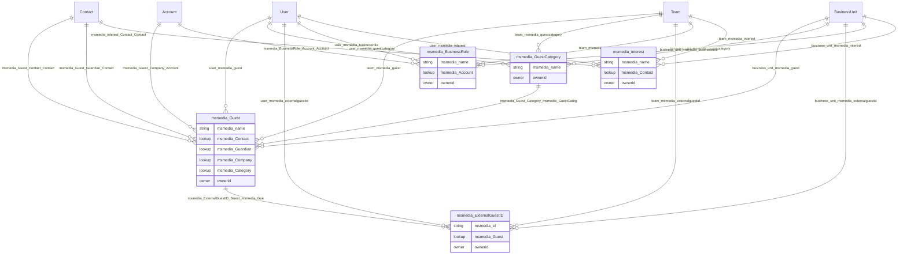

**Sources:** [Other/Relationships.xml:1-108](), [Resources/en-US/resources.en-US.resx:252-279](), [Resources/en-US/resources.en-US.resx:84-94]()

---

## Entity Inventory

The Guest Management System comprises five custom entities, each implementing the standard Dynamics 365 ownership and audit trail model:

| Entity Schema Name | Display Name | Primary Name Field | Introduced Version | Key Relationships |
|-------------------|--------------|-------------------|-------------------|-------------------|
| `msmedia_guest` | Guest | `msmedia_name` | 1.0 | Contact, Account, GuestCategory |
| `msmedia_guestcategory` | Guest Category | `msmedia_name` | 1.0.0.3 | Guest |
| `msmedia_externalguestid` | External Guest ID | `msmedia_id` | 1.0.0.4 | Guest |
| `msmedia_businessrole` | Business Role | `msmedia_name` | 1.0 | Account |
| `msmedia_interest` | Interest | `msmedia_name` | 1.0 | Contact |

**Sources:** [Other/Solution.xml:82-86](), [Entities/msmedia_Guest/FormXml/quick/{0d2948a5-e271-4d3a-93bf-f8edf2c25282}.xml:5](), [Entities/msmedia_GuestCategory/FormXml/quick/{d8d71cef-c9ae-4379-bbea-4ab875b117f0}.xml:5](), [Entities/msmedia_ExternalGuestID/FormXml/quick/{12ae7d2b-1816-4b0f-9cfa-5ba8100a9368}.xml:5]()

---

## Core Entities

### msmedia_Guest Entity

The `msmedia_Guest` entity serves as the central record type for guest management. It links guests to Dynamics 365 Contact records and supports both individual and corporate guest relationships.

#### Guest Entity Relationships

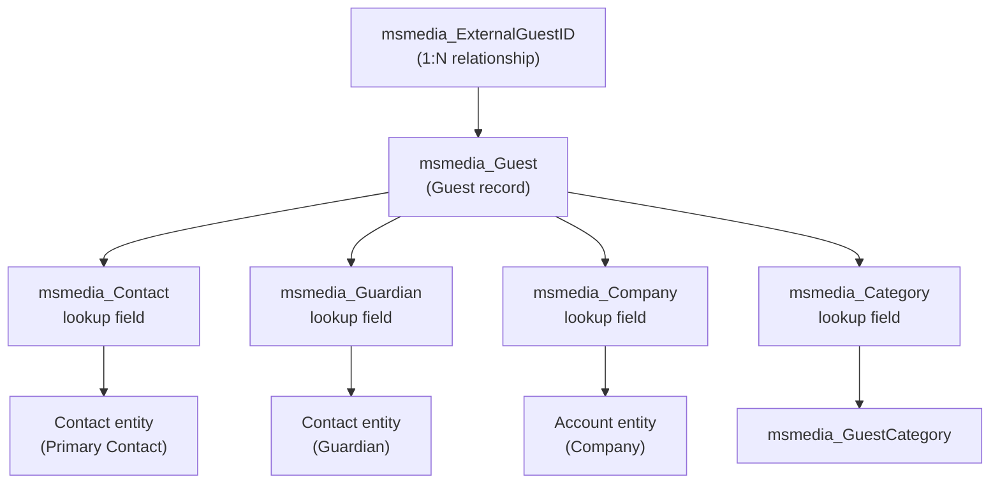

**Sources:** [Other/Relationships.xml:49-52](), [Resources/en-US/resources.en-US.resx:260-275]()

#### Guest Quick View Form

The Guest Quick View Form provides a lightweight preview with two fields for embedded display contexts.

**Form ID:** `{0d2948a5-e271-4d3a-93bf-f8edf2c25282}`  
**Form Name:** `Guest Quick View Form`  
**IntroducedVersion:** `1.0`  
**FormPresentation:** `1` (Quick View)

| Field ID | Control ID | Data Field | Control Class ID | Label |
|----------|-----------|------------|------------------|-------|
| `{7833b391-a033-4c17-ae87-b3703624939f}` | `msmedia_name` | `msmedia_name` | `{4273EDBD-AC1D-40d3-9FB2-095C621B552D}` | Name |
| `{b7a04b6a-f6f0-48ab-a883-e3ae5ed3b4b7}` | `ownerid` | `ownerid` | `{270BD3DB-D9AF-4782-9025-509E298DEC0A}` | Owner |

**Sources:** [Entities/msmedia_Guest/FormXml/quick/{0d2948a5-e271-4d3a-93bf-f8edf2c25282}.xml:1-53](), [Entities/msmedia_Guest/FormXml/quick/{0d2948a5-e271-4d3a-93bf-f8edf2c25282}_managed.xml:1-53]()

---

### msmedia_GuestCategory Entity

The `msmedia_GuestCategory` entity provides a classification system for guests, enabling segmentation and targeted guest management strategies.

#### GuestCategory Quick View Form

**Form ID:** `{d8d71cef-c9ae-4379-bbea-4ab875b117f0}`  
**Form Name:** `Guest Category Quick View Form`  
**IntroducedVersion:** `1.0.0.3`

The GuestCategory Quick View Form follows the standard two-field pattern:

| Control ID | Data Field | Label |
|-----------|------------|-------|
| `msmedia_name` | `msmedia_name` | Name |
| `ownerid` | `ownerid` | Owner |

**Layout Structure:**
- Single tab with vertical layout: `{75f45e67-6b6a-4039-833d-037d83339f18}`
- Single section (no label, no bar): `{a4768c43-3990-4bde-aa38-106de791b6c4}`
- Two rows containing name and owner controls

**Sources:** [Entities/msmedia_GuestCategory/FormXml/quick/{d8d71cef-c9ae-4379-bbea-4ab875b117f0}.xml:1-53](), [Entities/msmedia_GuestCategory/FormXml/quick/{d8d71cef-c9ae-4379-bbea-4ab875b117f0}_managed.xml:1-53]()

---

### msmedia_ExternalGuestID Entity

The `msmedia_ExternalGuestID` entity enables integration with external systems by storing guest identifiers from third-party platforms. This supports scenarios where guests have identities in multiple systems (e.g., ticketing systems, CRM platforms, loyalty programs).

#### Entity Structure

```mermaid
graph LR
    ExternalGuestID["msmedia_ExternalGuestID"]
    
    subgraph "Primary Fields"
        msmedia_id["msmedia_id<br/>(Primary Name Field)<br/>External System ID"]
        msmedia_Guest["msmedia_Guest<br/>(Lookup)<br/>References msmedia_Guest"]
    end
    
    subgraph "Standard Fields"
        ownerid["ownerid<br/>(Owner)"]
        statecode["statecode<br/>(State)"]
        statuscode["statuscode<br/>(Status)"]
    end
    
    ExternalGuestID --> msmedia_id
    ExternalGuestID --> msmedia_Guest
    ExternalGuestID --> ownerid
    ExternalGuestID --> statecode
    ExternalGuestID --> statuscode
```

#### ExternalGuestID Quick View Form

**Form ID:** `{12ae7d2b-1816-4b0f-9cfa-5ba8100a9368}`  
**Form Name:** `External Guest ID Quick View Form`  
**IntroducedVersion:** `1.0.0.4`

Unlike other Quick View Forms in the system, this form displays the `msmedia_id` field instead of `msmedia_name`:

| Cell ID | Control ID | Data Field | Label |
|---------|-----------|------------|-------|
| `{06a83763-d0f5-4a41-98c7-77adec054b81}` | `msmedia_id` | `msmedia_id` | ID |
| `{b16ab6ce-73c0-4366-afe4-d3b593ba82e6}` | `ownerid` | `ownerid` | Owner |

**Sources:** [Entities/msmedia_ExternalGuestID/FormXml/quick/{12ae7d2b-1816-4b0f-9cfa-5ba8100a9368}.xml:1-53](), [Entities/msmedia_ExternalGuestID/FormXml/quick/{12ae7d2b-1816-4b0f-9cfa-5ba8100a9368}_managed.xml:1-53](), [Other/Relationships.xml:48]()

#### Integration Scenarios

The `msmedia_ExternalGuestID` entity supports:
- **Multi-system identity mapping:** Track the same guest across multiple platforms
- **External data synchronization:** Enable bidirectional data sync with source systems
- **Deduplication:** Identify duplicate guest records by matching external IDs
- **Migration support:** Maintain legacy system identifiers during platform transitions

**Sources:** [Resources/en-US/resources.en-US.resx:256-259]()

---

### msmedia_BusinessRole Entity

The `msmedia_BusinessRole` entity tracks organizational roles and relationships between Accounts and their business functions within the media industry ecosystem.

#### Relationship to Account Entity

```mermaid
graph TB
    Account["Account<br/>(Standard Dynamics 365)"]
    BusinessRole["msmedia_BusinessRole"]
    
    subgraph "Relationship: msmedia_BusinessRole_Account_Account"
        BR_Account["msmedia_Account<br/>(lookup field)"]
    end
    
    BusinessRole --> BR_Account
    BR_Account --> Account
    
    subgraph "BusinessRole Ownership"
        User["User"]
        Team["Team"]
        BusinessUnit["BusinessUnit"]
    end
    
    User --> BusinessRole
    Team --> BusinessRole
    BusinessUnit --> BusinessRole
```

#### Card Form Implementation

The `msmedia_BusinessRole` entity includes a Card Form for summary displays:

**Form ID:** `{7c41500a-a53f-4267-9fd2-24a6088010f6}`  
**Description:** `A card form for this entity.`

Card Forms provide a four-field summary view including status, name, owner, and created date, displayed with a color strip visual indicator.

**Sources:** [Resources/en-US/resources.en-US.resx:504-507](), [Other/Relationships.xml:47]()

---

### msmedia_interest Entity

The `msmedia_interest` entity captures interest categories associated with Contacts, enabling preference tracking and targeted communication.

#### Interest-Contact Relationship

The `msmedia_interest` entity links directly to the standard Contact entity:

**Relationship Name:** `msmedia_interest_Contact_Contact`  
**Relationship Type:** N:1 (Many interests to one Contact)

| Field | Description |
|-------|-------------|
| `msmedia_name` | Primary name field for the interest |
| `msmedia_Contact` | Lookup to Contact entity |
| `ownerid` | Owner (User or Team) |

#### Main Form Structure

Unlike most Guest Management entities that use Quick View or Card Forms, `msmedia_interest` has a full Main Form for comprehensive data entry:

**Form ID:** `{d9ad5893-c3a7-4a62-8f70-1070d62ec9c9}`  
**Description:** `A form for this entity.`

Main Forms include:
- Header section with key fields
- Navigation areas for related records
- Tab sections for organized data entry
- Footer section with metadata

**Sources:** [Resources/en-US/resources.en-US.resx:620-623](), [Resources/en-US/resources.en-US.resx:276-279](), [Other/Relationships.xml:53]()

---

## Dynamics 365 Platform Integration

All Guest Management entities implement the full Dynamics 365 security and audit model, providing enterprise-grade record management capabilities.

### Ownership Model Implementation

```mermaid
graph TB
    subgraph "Guest Management Entities"
        Guest["msmedia_guest"]
        GuestCategory["msmedia_guestcategory"]
        ExternalGuestID["msmedia_externalguestid"]
        BusinessRole["msmedia_businessrole"]
        Interest["msmedia_interest"]
    end
    
    subgraph "Ownership Relationships"
        User["User<br/>(SystemUser)"]
        Team["Team"]
        BusinessUnit["BusinessUnit"]
    end
    
    subgraph "Audit Relationships"
        CreatedBy["lk_*_createdby"]
        ModifiedBy["lk_*_modifiedby"]
    end
    
    User -->|"user_msmedia_*"| Guest
    User -->|"user_msmedia_*"| GuestCategory
    User -->|"user_msmedia_*"| ExternalGuestID
    User -->|"user_msmedia_*"| BusinessRole
    User -->|"user_msmedia_*"| Interest
    
    Team -->|"team_msmedia_*"| Guest
    Team -->|"team_msmedia_*"| GuestCategory
    Team -->|"team_msmedia_*"| ExternalGuestID
    Team -->|"team_msmedia_*"| BusinessRole
    Team -->|"team_msmedia_*"| Interest
    
    BusinessUnit -->|"business_unit_msmedia_*"| Guest
    BusinessUnit -->|"business_unit_msmedia_*"| GuestCategory
    BusinessUnit -->|"business_unit_msmedia_*"| ExternalGuestID
    BusinessUnit -->|"business_unit_msmedia_*"| BusinessRole
    BusinessUnit -->|"business_unit_msmedia_*"| Interest
    
    User -.->|"created/modified by"| CreatedBy
    User -.->|"created/modified by"| ModifiedBy
```

### Ownership Relationship Naming Convention

Each entity implements six ownership relationships following this pattern:

| Relationship Pattern | Purpose | Example |
|---------------------|---------|---------|
| `user_msmedia_{entity}` | Records owned by individual users | `user_msmedia_guest` |
| `team_msmedia_{entity}` | Records owned by teams | `team_msmedia_guest` |
| `business_unit_msmedia_{entity}` | Records scoped to business units | `business_unit_msmedia_guest` |
| `owner_msmedia_{entity}` | Generic owner relationship (User or Team) | `owner_msmedia_guest` |
| `lk_msmedia_{entity}_createdby` | User who created the record | `lk_msmedia_guest_createdby` |
| `lk_msmedia_{entity}_modifiedby` | User who last modified the record | `lk_msmedia_guest_modifiedby` |

**Sources:** [Other/Relationships.xml:3-46](), [Other/Relationships.xml:65-98](), [Resources/en-US/resources.en-US.resx:84-94](), [Resources/en-US/resources.en-US.resx:132-163](), [Resources/en-US/resources.en-US.resx:320-375](), [Resources/en-US/resources.en-US.resx:376-454]()

---

## User Interface Architecture

The Guest Management System implements a three-tier form strategy based on use case requirements:

### Form Type Distribution

| Entity | Quick View Form | Card Form | Main Form |
|--------|----------------|-----------|-----------|
| `msmedia_Guest` | ✓ | ✓ | ✗ |
| `msmedia_GuestCategory` | ✓ | ✓ | ✗ |
| `msmedia_ExternalGuestID` | ✓ | ✓ | ✗ |
| `msmedia_BusinessRole` | ✗ | ✓ | ✗ |
| `msmedia_interest` | ✗ | ✗ | ✓ |

### Quick View Form Pattern

All Quick View Forms in the Guest Management System follow a standardized two-field pattern:

**Standard Layout:**
- FormPresentation: `1` (indicates Quick View)
- Single vertical tab with 100% column width
- One section with `showlabel="false"` and `showbar="false"`
- Two rows: Primary field + Owner field

**Control Class IDs:**
- Text field: `{4273EDBD-AC1D-40d3-9FB2-095C621B552D}`
- Lookup/Owner field: `{270BD3DB-D9AF-4782-9025-509E298DEC0A}`

```mermaid
graph TB
    subgraph "Quick View Form Structure"
        Form["systemform<br/>FormPresentation=1"]
        Tab["tab<br/>verticallayout=true<br/>width=100%"]
        Section["section<br/>showlabel=false<br/>showbar=false"]
        Row1["row 1<br/>Primary field<br/>(msmedia_name or msmedia_id)"]
        Row2["row 2<br/>ownerid field"]
        
        Form --> Tab
        Tab --> Section
        Section --> Row1
        Section --> Row2
    end
    
    subgraph "Control Types"
        TextControl["{4273EDBD-AC1D-40d3-9FB2-095C621B552D}<br/>Text control"]
        LookupControl["{270BD3DB-D9AF-4782-9025-509E298DEC0A}<br/>Lookup/Owner control"]
    end
    
    Row1 --> TextControl
    Row2 --> LookupControl
```

**Sources:** [Entities/msmedia_Guest/FormXml/quick/{0d2948a5-e271-4d3a-93bf-f8edf2c25282}.xml:6-46](), [Entities/msmedia_GuestCategory/FormXml/quick/{d8d71cef-c9ae-4379-bbea-4ab875b117f0}.xml:6-46](), [Entities/msmedia_ExternalGuestID/FormXml/quick/{12ae7d2b-1816-4b0f-9cfa-5ba8100a9368}.xml:6-46]()

### Form Customization Settings

All forms in the Guest Management System have:
- `IsCustomizable`: `1` (can be customized by users)
- `CanBeDeleted`: `1` (can be deleted by users)
- `FormActivationState`: `1` (active)
- `DisplayConditions Order`: `0` with `FallbackForm="true"`

**Sources:** [Entities/msmedia_Guest/FormXml/quick/{0d2948a5-e271-4d3a-93bf-f8edf2c25282}.xml:47-48]()

---

## Data Access Layer

All five Guest Management entities implement the standardized SavedQuery pattern documented in detail in [Data Access Layer - SavedQueries](#8). Each entity provides six query types:

### SavedQuery Type Coverage

| Query Type | querytype Value | Purpose | Example Usage |
|-----------|----------------|---------|---------------|
| Active View | 0 | Display active records (statecode=0) | Default grid view |
| Inactive View | 0 | Display inactive records (statecode=1) | Archive view |
| Advanced Find | 1 | Complex search with no state filter | Power user queries |
| Associated View | 2 | Related record displays | Subgrids |
| Quick Find | 4 | Name-based rapid search | Search box |
| Lookup View | 64 | Relationship picker dialogs | Lookup fields |

### State-Based Filtering Pattern

```mermaid
graph TB
    AllRecords["All Guest Management Records"]
    
    ActiveRecords["Active Records<br/>statecode = 0"]
    InactiveRecords["Inactive Records<br/>statecode = 1"]
    
    AllRecords --> ActiveRecords
    AllRecords --> InactiveRecords
    
    subgraph "Query Types with Active Filter"
        QT0["querytype 0<br/>Active View"]
        QT2["querytype 2<br/>Associated View"]
        QT4["querytype 4<br/>Quick Find"]
        QT64["querytype 64<br/>Lookup View"]
    end
    
    subgraph "Query Types with Inactive Filter"
        QT0I["querytype 0<br/>Inactive View"]
    end
    
    subgraph "Query Types with No Filter"
        QT1["querytype 1<br/>Advanced Find"]
    end
    
    ActiveRecords --> QT0
    ActiveRecords --> QT2
    ActiveRecords --> QT4
    ActiveRecords --> QT64
    
    InactiveRecords --> QT0I
    
    AllRecords --> QT1
```

**Sources:** [Resources/en-US/resources.en-US.resx:500-623]()

### SavedQuery Descriptions

Each SavedQuery includes a standardized description following the pattern:

| Entity | Active View Description |
|--------|------------------------|
| `msmedia_businessrole` | "Active Business Roles owned by me" |
| `msmedia_externalguestid` | "Active External Guest IDs owned by me" |
| `msmedia_guestcategory` | "Active Guest Categories owned by me" |
| `msmedia_guest` | "Active Guests owned by me" |
| `msmedia_interest` | "Active Interests owned by me" |

**Sources:** [Resources/en-US/resources.en-US.resx:500-615]()

---

## Solution Metadata

The Guest Management System is part of the MediaCommon solution with the following characteristics:

### Solution Information

| Property | Value |
|----------|-------|
| Solution Unique Name | `MediaCommon` |
| Display Name | `Media Common` |
| Version | `2.0.3.5` |
| Publisher | `microsoftdynamics365media` |
| Customization Prefix | `msmedia` |
| Option Value Prefix | `76686` |

### Component Introduction Versions

The Guest Management entities were introduced across multiple releases:

| Entity | IntroducedVersion | Release Phase |
|--------|------------------|---------------|
| `msmedia_guest` | 1.0 | Initial release |
| `msmedia_guestcategory` | 1.0.0.3 | Categorization feature |
| `msmedia_externalguestid` | 1.0.0.4 | External integration |
| `msmedia_businessrole` | 1.0 | Initial release |
| `msmedia_interest` | 1.0 | Initial release |

**Sources:** [Other/Solution.xml:4-19](), [Entities/msmedia_Guest/FormXml/quick/{0d2948a5-e271-4d3a-93bf-f8edf2c25282}.xml:5](), [Entities/msmedia_GuestCategory/FormXml/quick/{d8d71cef-c9ae-4379-bbea-4ab875b117f0}.xml:5](), [Entities/msmedia_ExternalGuestID/FormXml/quick/{12ae7d2b-1816-4b0f-9cfa-5ba8100a9368}.xml:5]()

---

## Dependencies and Integration Points

### External System Dependencies

The Guest Management System has dependencies on custom controls for enhanced UI experiences:

| Required Component | Solution | Purpose | Status |
|-------------------|----------|---------|--------|
| `MscrmControls.FieldControls.ToggleControl` | BaseCustomControlsCore (9.0.2104.4005) | Toggle controls for Guest Main Form | Missing |
| `MscrmControls.FlipSwitch.FlipSwitchControl` | CustomControlsCore (9.2.21044.00130) | Flip switch controls for Guest Main Form | Missing |

**Note:** The Guest Main Form (`{165a28fe-e798-4086-ae69-3ef841d84590}`) references these missing controls, which may result in degraded UI functionality until the dependencies are installed.

**Sources:** [Other/Solution.xml:383-390]()

### Standard Dynamics 365 Dependencies

All Guest Management entities depend on standard Dynamics 365 platform entities:

| Platform Entity | Usage |
|----------------|-------|
| `Contact` | Primary guest identity, guardian relationships, interest tracking |
| `Account` | Corporate guest relationships, business role assignments |
| `User` (SystemUser) | Record ownership, audit trail |
| `Team` | Shared record ownership |
| `BusinessUnit` | Organizational hierarchy |
| `Organization` | System-wide settings |

**Sources:** [Other/Solution.xml:81](), [Other/Relationships.xml:1-108]()

---

## Localization Support

All Guest Management entities and forms are localized for English (language code 1033) with descriptions stored in resource files:

### Resource File Structure

| Resource File | Purpose |
|--------------|---------|
| `Resources/en-US/resources.en-US.resx` | Localized entity names, descriptions, and relationship descriptions |
| `Resources/template_resources.resx` | Template for additional language support |

Both files follow the .NET RESX format with:
- Entity descriptions: `1:Description,{EntityName}{AttributeName}`
- Relationship descriptions: `10:Description,{RelationshipName}`
- Form descriptions: `1:Description,{EntityDisplayName}{FormId}`

**Sources:** [Resources/en-US/resources.en-US.resx:1-75](), [Resources/template_resources.resx:1-75]()18:T447e,# Guest Entity

<details>
<summary>Relevant source files</summary>

The following files were used as context for generating this wiki page:

- [Entities/msmedia_BusinessRole/FormXml/card/{7c41500a-a53f-4267-9fd2-24a6088010f6}_managed.xml](Entities/msmedia_BusinessRole/FormXml/card/{7c41500a-a53f-4267-9fd2-24a6088010f6}_managed.xml)
- [Entities/msmedia_ExternalGuestID/FormXml/card/{9ead929d-6887-4fa6-8d70-623a8d3e08ea}.xml](Entities/msmedia_ExternalGuestID/FormXml/card/{9ead929d-6887-4fa6-8d70-623a8d3e08ea}.xml)
- [Entities/msmedia_ExternalGuestID/FormXml/quick/{12ae7d2b-1816-4b0f-9cfa-5ba8100a9368}.xml](Entities/msmedia_ExternalGuestID/FormXml/quick/{12ae7d2b-1816-4b0f-9cfa-5ba8100a9368}.xml)
- [Entities/msmedia_ExternalGuestID/FormXml/quick/{12ae7d2b-1816-4b0f-9cfa-5ba8100a9368}_managed.xml](Entities/msmedia_ExternalGuestID/FormXml/quick/{12ae7d2b-1816-4b0f-9cfa-5ba8100a9368}_managed.xml)
- [Entities/msmedia_Guest/FormXml/card/{433d2218-d43a-43fb-add6-8dea325cbb60}.xml](Entities/msmedia_Guest/FormXml/card/{433d2218-d43a-43fb-add6-8dea325cbb60}.xml)
- [Entities/msmedia_Guest/FormXml/card/{433d2218-d43a-43fb-add6-8dea325cbb60}_managed.xml](Entities/msmedia_Guest/FormXml/card/{433d2218-d43a-43fb-add6-8dea325cbb60}_managed.xml)
- [Entities/msmedia_Guest/FormXml/quick/{0d2948a5-e271-4d3a-93bf-f8edf2c25282}.xml](Entities/msmedia_Guest/FormXml/quick/{0d2948a5-e271-4d3a-93bf-f8edf2c25282}.xml)
- [Entities/msmedia_Guest/FormXml/quick/{0d2948a5-e271-4d3a-93bf-f8edf2c25282}_managed.xml](Entities/msmedia_Guest/FormXml/quick/{0d2948a5-e271-4d3a-93bf-f8edf2c25282}_managed.xml)
- [Entities/msmedia_GuestCategory/FormXml/card/{92e148ba-641e-4f76-9d8b-4c5e200011ce}.xml](Entities/msmedia_GuestCategory/FormXml/card/{92e148ba-641e-4f76-9d8b-4c5e200011ce}.xml)
- [Entities/msmedia_GuestCategory/FormXml/card/{92e148ba-641e-4f76-9d8b-4c5e200011ce}_managed.xml](Entities/msmedia_GuestCategory/FormXml/card/{92e148ba-641e-4f76-9d8b-4c5e200011ce}_managed.xml)
- [Entities/msmedia_GuestCategory/FormXml/quick/{d8d71cef-c9ae-4379-bbea-4ab875b117f0}.xml](Entities/msmedia_GuestCategory/FormXml/quick/{d8d71cef-c9ae-4379-bbea-4ab875b117f0}.xml)
- [Entities/msmedia_GuestCategory/FormXml/quick/{d8d71cef-c9ae-4379-bbea-4ab875b117f0}_managed.xml](Entities/msmedia_GuestCategory/FormXml/quick/{d8d71cef-c9ae-4379-bbea-4ab875b117f0}_managed.xml)

</details>


## Purpose and Scope

This document details the `msmedia_Guest` entity, which serves as the core record type for tracking guests in the MediaCommon solution. It covers the entity's data structure, relationships to standard Dynamics 365 entities (Contact, Account) and custom entities (GuestCategory, ExternalGuestID), and its two form implementations (Quick View and Card forms).

For information about guest categorization, see [Guest Categorization](#2.2). For external system integration via external guest IDs, see [External Guest ID Management](#2.3). For business role assignments, see [Business Roles](#2.4).

---

## Entity Overview

The `msmedia_Guest` entity represents individual guests tracked in the MediaCommon system. It was introduced in version 1.0 as part of the baseline guest management functionality. The entity supports two UI form types: a Quick View Form for lightweight previews and a Card Form for summary displays.

### Entity Identification

| Property | Value |
|----------|-------|
| Schema Name | `msmedia_Guest` |
| Display Name | Guest |
| Introduced Version | 1.0 |
| Form Types | Quick View, Card |
| Primary Field | `msmedia_name` |
| Ownership Type | User/Team |

**Sources:** [Entities/msmedia_Guest/FormXml/quick/{0d2948a5-e271-4d3a-93bf-f8edf2c25282}.xml:1-53](), [Entities/msmedia_Guest/FormXml/card/{433d2218-d43a-43fb-add6-8dea325cbb60}.xml:1-112]()

---

## Entity Relationships and Integration Points

The `msmedia_Guest` entity integrates with both standard Dynamics 365 entities and custom MediaCommon entities to create a comprehensive guest management system.

```mermaid
graph TB
    subgraph "Standard Dynamics 365 Entities"
        Contact["Contact<br/>(Standard Entity)"]
        Account["Account<br/>(Standard Entity)"]
        User["User/SystemUser<br/>(Ownership)"]
        Team["Team<br/>(Ownership)"]
    end
    
    subgraph "Guest Management Domain"
        Guest["msmedia_Guest<br/>(Custom Entity)"]
        Category["msmedia_GuestCategory<br/>(Custom Entity)"]
        ExternalID["msmedia_ExternalGuestID<br/>(Custom Entity)"]
        BusinessRole["msmedia_BusinessRole<br/>(Custom Entity)"]
    end
    
    subgraph "Lookup Relationships"
        Contact -->|"msmedia_Contact<br/>(linked guest)"| Guest
        Contact -->|"msmedia_Guardian<br/>(guardian relationship)"| Guest
        Account -->|"msmedia_Company<br/>(company affiliation)"| Guest
        Category -->|"msmedia_Category<br/>(categorization)"| Guest
    end
    
    subgraph "Child Relationships"
        Guest -->|"1:N relationship"| ExternalID
    end
    
    subgraph "Ownership Model"
        User -->|"user_msmedia_guest"| Guest
        Team -->|"team_msmedia_guest"| Guest
    end
    
    subgraph "Associated Entities"
        BusinessRole -.->|"via Account"| Guest
    end
```

### Key Relationships

| Relationship Type | Target Entity | Schema Name | Description |
|-------------------|---------------|-------------|-------------|
| N:1 (Lookup) | Contact | `msmedia_Contact` | Primary contact linked to guest |
| N:1 (Lookup) | Contact | `msmedia_Guardian` | Guardian/parent relationship |
| N:1 (Lookup) | Account | `msmedia_Company` | Company affiliation |
| N:1 (Lookup) | msmedia_GuestCategory | `msmedia_Category` | Guest categorization |
| 1:N (Parent) | msmedia_ExternalGuestID | - | External system identifiers |
| N:1 (Ownership) | User/Team | `ownerid` | Record ownership |

**Sources:** High-level diagrams (Diagram 2: Entity Domain Model and Relationships)

---

## Quick View Form Implementation

The Guest Quick View Form provides a lightweight, two-field preview of guest records designed for embedding in other forms.

### Form Structure

```mermaid
graph TB
    Form["systemform<br/>formid: 0d2948a5-e271-4d3a-93bf-f8edf2c25282<br/>FormPresentation: 1 (Quick View)"]
    
    Form --> Tab["tab<br/>verticallayout: true<br/>IsUserDefined: 1"]
    
    Tab --> Column["column<br/>width: 100%"]
    
    Column --> Section["section<br/>showlabel: false<br/>showbar: false<br/>GENERAL section"]
    
    Section --> Row1["row 1"]
    Section --> Row2["row 2"]
    
    Row1 --> Cell1["cell<br/>id: 7833b391..."]
    Row2 --> Cell2["cell<br/>id: b7a04b6a..."]
    
    Cell1 --> Control1["control<br/>id: msmedia_name<br/>classid: 4273EDBD...<br/>Text Control<br/>datafieldname: msmedia_name"]
    
    Cell2 --> Control2["control<br/>id: ownerid<br/>classid: 270BD3DB...<br/>Lookup Control<br/>datafieldname: ownerid"]
```

### Form Configuration

| Property | Value |
|----------|-------|
| Form ID | `{0d2948a5-e271-4d3a-93bf-f8edf2c25282}` |
| Localized Name | Guest Quick View Form |
| Introduced Version | 1.0 |
| Form Presentation | 1 (Quick View) |
| Form Activation State | 1 (Active) |
| Is Customizable | 1 (Yes) |
| Can Be Deleted | 1 (Yes) |
| Display Conditions | Order=0, FallbackForm=true |

### Field Bindings

The Quick View Form displays exactly two fields following the standard pattern:

1. **Name Field** (Row 1)
   - Control ID: `msmedia_name`
   - Control ClassID: `{4273EDBD-AC1D-40d3-9FB2-095C621B552D}` (Text control)
   - Data Field: `msmedia_name`
   - Label: "Name"

2. **Owner Field** (Row 2)
   - Control ID: `ownerid`
   - Control ClassID: `{270BD3DB-D9AF-4782-9025-509E298DEC0A}` (Lookup control)
   - Data Field: `ownerid`
   - Label: "Owner"

**Sources:** [Entities/msmedia_Guest/FormXml/quick/{0d2948a5-e271-4d3a-93bf-f8edf2c25282}.xml:1-53](), [Entities/msmedia_Guest/FormXml/quick/{0d2948a5-e271-4d3a-93bf-f8edf2c25282}_managed.xml:1-53]()

---

## Card Form Implementation

The Guest Card Form provides a three-section summary display with status, primary field, and metadata following the standard Dynamics 365 card pattern.

### Card Form Architecture

```mermaid
graph TB
    CardForm["systemform<br/>formid: 433d2218-d43a-43fb-add6-8dea325cbb60<br/>FormPresentation: 1<br/>Information Card Form"]
    
    CardForm --> GeneralTab["tab: general<br/>verticallayout: true"]
    
    GeneralTab --> Column1["column<br/>width: 25%"]
    GeneralTab --> Column2["column<br/>width: 75%"]
    
    Column1 --> ColorStrip["section: ColorStrip<br/>showlabel: false<br/>showbar: false<br/>columns: 1"]
    
    Column2 --> CardHeader["section: CardHeader<br/>Header section<br/>columns: 111"]
    Column2 --> CardDetails["section: CardDetails<br/>Details section<br/>columns: 1"]
    Column2 --> CardFooter["section: CardFooter<br/>Footer section<br/>columns: 1111"]
    
    CardHeader --> StatusCode["control: statuscode<br/>Status Reason<br/>classid: 5D68B988...<br/>Option Set Control"]
    
    CardDetails --> Name["control: msmedia_name<br/>Name<br/>classid: 4273EDBD...<br/>Text Control"]
    
    CardFooter --> Owner["control: ownerid<br/>Owner<br/>classid: 270BD3DB...<br/>Lookup Control"]
    CardFooter --> CreatedOn["control: createdon<br/>Created On<br/>classid: 270BD3DB...<br/>DateTime Control"]
```

### Card Form Sections

The card form implements the standard three-section layout:

| Section | Purpose | Controls | Columns |
|---------|---------|----------|---------|
| ColorStrip | Visual indicator | None | 1 (25% width) |
| CardHeader | Status display | `statuscode` (Status Reason) | 111 |
| CardDetails | Primary information | `msmedia_name` (Name) | 1 |
| CardFooter | Metadata | `ownerid` (Owner), `createdon` (Created On) | 1111 |

### Control Types and Bindings

The card form uses three distinct control types:

1. **Option Set Control** - Status Reason
   - Control ID: `statuscode`
   - ClassID: `{5D68B988-0661-4db2-BC3E-17598AD3BE6C}`
   - Data Field: `statuscode`
   - Location: CardHeader section

2. **Text Control** - Name
   - Control ID: `msmedia_name`
   - ClassID: `{4273EDBD-AC1D-40d3-9FB2-095C621B552D}`
   - Data Field: `msmedia_name`
   - Location: CardDetails section

3. **Lookup Control** - Owner and Created On
   - ClassID: `{270BD3DB-D9AF-4782-9025-509E298DEC0A}`
   - Data Fields: `ownerid`, `createdon`
   - Location: CardFooter section

**Sources:** [Entities/msmedia_Guest/FormXml/card/{433d2218-d43a-43fb-add6-8dea325cbb60}.xml:1-112](), [Entities/msmedia_Guest/FormXml/card/{433d2218-d43a-43fb-add6-8dea325cbb60}_managed.xml:1-112]()

---

## Form Lifecycle and Management

The `msmedia_Guest` entity implements both unmanaged and managed form versions, supporting the Dynamics 365 solution deployment model.

### Managed vs. Unmanaged Forms

```mermaid
graph LR
    subgraph "Development Environment"
        QuickDev["Quick View Form<br/>.xml<br/>Unmanaged"]
        CardDev["Card Form<br/>.xml<br/>Unmanaged"]
    end
    
    subgraph "Export Process"
        Export["Solution Export<br/>Version: 1.0"]
    end
    
    subgraph "Production Environment"
        QuickProd["Quick View Form<br/>_managed.xml<br/>Managed"]
        CardProd["Card Form<br/>_managed.xml<br/>Managed"]
    end
    
    QuickDev -->|Export| Export
    CardDev -->|Export| Export
    Export -->|Deploy| QuickProd
    Export -->|Deploy| CardProd
    
    QuickDev -.->|"IsCustomizable: 1<br/>CanBeDeleted: 1"| Metadata1["Customization Allowed"]
    QuickProd -.->|"IsCustomizable: 1<br/>CanBeDeleted: 1"| Metadata2["Customization Allowed"]
```

Both form types exist in dual versions:
- **Unmanaged** (.xml files): Used in development environments, fully editable
- **Managed** (_managed.xml files): Deployed to production, respects customization flags

### Customization Flags

Both Guest forms have identical customization settings:

| Flag | Value | Meaning |
|------|-------|---------|
| `IsCustomizable` | 1 | Form can be customized post-deployment |
| `CanBeDeleted` | 1 | Form can be deleted by administrators |

**Sources:** [Entities/msmedia_Guest/FormXml/quick/{0d2948a5-e271-4d3a-93bf-f8edf2c25282}.xml:47-48](), [Entities/msmedia_Guest/FormXml/card/{433d2218-d43a-43fb-add6-8dea325cbb60}.xml:103-104]()

---

## Ownership and Security Model

The `msmedia_Guest` entity implements the standard Dynamics 365 User/Team ownership model, enabling record-level security.

### Ownership Implementation

```mermaid
graph TB
    Guest["msmedia_Guest Record"]
    
    Guest --> OwnerField["ownerid Field<br/>(Lookup to Owner)"]
    
    OwnerField --> User["User<br/>(SystemUser entity)"]
    OwnerField --> Team["Team<br/>(Team entity)"]
    
    User --> BU1["BusinessUnit"]
    Team --> BU2["BusinessUnit"]
    
    subgraph "Audit Trail"
        Guest --> CreatedBy["createdby<br/>(User reference)"]
        Guest --> ModifiedBy["modifiedby<br/>(User reference)"]
        Guest --> CreatedOn["createdon<br/>(DateTime)"]
        Guest --> ModifiedOn["modifiedon<br/>(DateTime)"]
    end
    
    subgraph "Security Relationships"
        User -->|"user_msmedia_guest"| Guest
        Team -->|"team_msmedia_guest"| Guest
        BU1 -->|"business_unit_msmedia_guest"| Guest
        BU2 -->|"business_unit_msmedia_guest"| Guest
    end
```

The `ownerid` field appears in both Quick View and Card forms, making ownership visible to users:
- **Quick View Form**: Row 2, visible as "Owner" [Entities/msmedia_Guest/FormXml/quick/{0d2948a5-e271-4d3a-93bf-f8edf2c25282}.xml:30-37]()
- **Card Form**: CardFooter section, first cell [Entities/msmedia_Guest/FormXml/card/{433d2218-d43a-43fb-add6-8dea325cbb60}.xml:72-77]()

**Sources:** [Entities/msmedia_Guest/FormXml/quick/{0d2948a5-e271-4d3a-93bf-f8edf2c25282}.xml:30-37](), [Entities/msmedia_Guest/FormXml/card/{433d2218-d43a-43fb-add6-8dea325cbb60}.xml:72-77](), High-level diagrams (Diagram 2: Entity Domain Model)

---

## Version History and Phased Delivery

The `msmedia_Guest` entity was part of the baseline MediaCommon release (version 1.0), making it one of the foundational entities in the solution.

### Version Timeline

| Version | Component | Change |
|---------|-----------|--------|
| 1.0 | msmedia_Guest entity | Initial release - baseline guest management |
| 1.0 | Quick View Form | Introduced with entity |
| 1.0 | Card Form | Introduced with entity |
| 1.0.0.3 | msmedia_GuestCategory | Guest categorization added |
| 1.0.0.4 | msmedia_ExternalGuestID | External system integration added |

The Guest entity was introduced before its related entities (GuestCategory, ExternalGuestID), indicating an incremental feature delivery approach where core guest records were established first, then enhanced with categorization and external integration capabilities.

**Sources:** [Entities/msmedia_Guest/FormXml/quick/{0d2948a5-e271-4d3a-93bf-f8edf2c25282}.xml:5](), [Entities/msmedia_Guest/FormXml/card/{433d2218-d43a-43fb-add6-8dea325cbb60}.xml:5](), [Entities/msmedia_GuestCategory/FormXml/quick/{d8d71cef-c9ae-4379-bbea-4ab875b117f0}.xml:5](), [Entities/msmedia_ExternalGuestID/FormXml/quick/{12ae7d2b-1816-4b0f-9cfa-5ba8100a9368}.xml:5]()

---

## Comparison with Related Entities

The Guest entity's form implementation follows a consistent pattern shared with related guest management entities.

### Form Pattern Consistency

| Entity | Quick View Form | Card Form | Primary Field |
|--------|----------------|-----------|---------------|
| msmedia_Guest | ✓ (2 fields) | ✓ (4 sections) | `msmedia_name` |
| msmedia_GuestCategory | ✓ (2 fields) | ✓ (4 sections) | `msmedia_name` |
| msmedia_ExternalGuestID | ✓ (2 fields) | ✓ (4 sections) | `msmedia_id` |
| msmedia_BusinessRole | ✗ | ✓ (4 sections) | `msmedia_name` |

### Shared Form Characteristics

All guest management entities with Quick View Forms implement the identical pattern:
1. **Two-field display**: Primary field + Owner
2. **Vertical layout**: `verticallayout="true"`
3. **Hidden labels/bars**: `showlabel="false" showbar="false"`
4. **100% column width**: Single column spanning full width
5. **Same control types**: Text control (4273EDBD) + Lookup control (270BD3DB)

All guest management entities with Card Forms implement the identical four-section pattern:
1. **ColorStrip** (25% width, empty)
2. **CardHeader** (Status Reason field)
3. **CardDetails** (Primary field)
4. **CardFooter** (Owner + Created On)

**Sources:** [Entities/msmedia_Guest/FormXml/quick/{0d2948a5-e271-4d3a-93bf-f8edf2c25282}.xml:8-46](), [Entities/msmedia_GuestCategory/FormXml/quick/{d8d71cef-c9ae-4379-bbea-4ab875b117f0}.xml:8-46](), [Entities/msmedia_ExternalGuestID/FormXml/quick/{12ae7d2b-1816-4b0f-9cfa-5ba8100a9368}.xml:8-46](), [Entities/msmedia_BusinessRole/FormXml/card/{7c41500a-a53f-4267-9fd2-24a6088010f6}_managed.xml:8-102]()

---

## Summary

The `msmedia_Guest` entity serves as the central record type for guest management in MediaCommon, implementing:

- **Dual form support**: Quick View (2 fields) and Card (4 sections) forms
- **Rich relationships**: Connections to Contact, Account, GuestCategory, and ExternalGuestID
- **Standard ownership**: User/Team ownership model with full audit trail
- **Managed deployment**: Both unmanaged and managed form versions with customization enabled
- **Baseline functionality**: Version 1.0 foundation, enhanced by later versions with categorization and external integration

The entity follows consistent patterns shared across the guest management domain, making it easy for developers to understand and maintain as part of the larger MediaCommon solution.19:T46b5,# Guest Categorization

<details>
<summary>Relevant source files</summary>

The following files were used as context for generating this wiki page:

- [Entities/msmedia_ExternalGuestID/FormXml/quick/{12ae7d2b-1816-4b0f-9cfa-5ba8100a9368}.xml](Entities/msmedia_ExternalGuestID/FormXml/quick/{12ae7d2b-1816-4b0f-9cfa-5ba8100a9368}.xml)
- [Entities/msmedia_ExternalGuestID/FormXml/quick/{12ae7d2b-1816-4b0f-9cfa-5ba8100a9368}_managed.xml](Entities/msmedia_ExternalGuestID/FormXml/quick/{12ae7d2b-1816-4b0f-9cfa-5ba8100a9368}_managed.xml)
- [Entities/msmedia_Guest/FormXml/quick/{0d2948a5-e271-4d3a-93bf-f8edf2c25282}.xml](Entities/msmedia_Guest/FormXml/quick/{0d2948a5-e271-4d3a-93bf-f8edf2c25282}.xml)
- [Entities/msmedia_Guest/FormXml/quick/{0d2948a5-e271-4d3a-93bf-f8edf2c25282}_managed.xml](Entities/msmedia_Guest/FormXml/quick/{0d2948a5-e271-4d3a-93bf-f8edf2c25282}_managed.xml)
- [Entities/msmedia_GuestCategory/FormXml/quick/{d8d71cef-c9ae-4379-bbea-4ab875b117f0}.xml](Entities/msmedia_GuestCategory/FormXml/quick/{d8d71cef-c9ae-4379-bbea-4ab875b117f0}.xml)
- [Entities/msmedia_GuestCategory/FormXml/quick/{d8d71cef-c9ae-4379-bbea-4ab875b117f0}_managed.xml](Entities/msmedia_GuestCategory/FormXml/quick/{d8d71cef-c9ae-4379-bbea-4ab875b117f0}_managed.xml)
- [Entities/msmedia_GuestCategory/SavedQueries/{0c61262c-4b7b-408f-a127-d9da7b0e88aa}.xml](Entities/msmedia_GuestCategory/SavedQueries/{0c61262c-4b7b-408f-a127-d9da7b0e88aa}.xml)
- [Entities/msmedia_GuestCategory/SavedQueries/{86b6ea8e-72e5-4eb5-ab32-ec9a843784b9}.xml](Entities/msmedia_GuestCategory/SavedQueries/{86b6ea8e-72e5-4eb5-ab32-ec9a843784b9}.xml)
- [Entities/msmedia_GuestCategory/SavedQueries/{87b03ec7-321e-44a1-a475-ac795a197267}.xml](Entities/msmedia_GuestCategory/SavedQueries/{87b03ec7-321e-44a1-a475-ac795a197267}.xml)
- [Entities/msmedia_GuestCategory/SavedQueries/{9797dc41-c588-455c-b609-7d0fe5256bac}.xml](Entities/msmedia_GuestCategory/SavedQueries/{9797dc41-c588-455c-b609-7d0fe5256bac}.xml)
- [Entities/msmedia_GuestCategory/SavedQueries/{c565e497-bca7-4e22-b948-cfa63f7b95a1}.xml](Entities/msmedia_GuestCategory/SavedQueries/{c565e497-bca7-4e22-b948-cfa63f7b95a1}.xml)

</details>


## Purpose and Scope

This document describes the **msmedia_GuestCategory** entity, which provides a classification system for organizing guests within the MediaCommon solution. Guest categories enable the grouping and segmentation of guests based on business-defined criteria.

For information about the core Guest entity that uses these categories, see [Guest Entity](#2.1). For information about external system identifiers, see [External Guest ID Management](#2.3).

---

## Entity Overview

The `msmedia_GuestCategory` entity was introduced in version 1.0.0.3 as part of the Guest Management System. It implements the standard MediaCommon data access pattern with six SavedQueries and provides a Quick View Form for embedded previews in other contexts.

### Entity Structure

| Component | Value |
|-----------|-------|
| **Logical Name** | `msmedia_guestcategory` |
| **Primary Key** | `msmedia_guestcategoryid` |
| **Primary Name Field** | `msmedia_name` |
| **Introduced Version** | 1.0.0.3 |
| **Ownership Model** | User/Team/BusinessUnit |

### Key Attributes

- **msmedia_name**: The category name (text field)
- **ownerid**: Record owner (user or team)
- **statecode**: Record state (0=Active, 1=Inactive)
- **createdon**: Timestamp of record creation

Sources: [Entities/msmedia_GuestCategory/SavedQueries/{c565e497-bca7-4e22-b948-cfa63f7b95a1}.xml:1-37](), [Entities/msmedia_GuestCategory/FormXml/quick/{d8d71cef-c9ae-4379-bbea-4ab875b117f0}.xml:1-53]()

---

## Relationship to Guest Entity

```mermaid
graph LR
    msmedia_GuestCategory["msmedia_GuestCategory<br/>Category Definition"]
    msmedia_Guest["msmedia_Guest<br/>Guest Record"]
    Contact["Contact<br/>Standard Entity"]
    
    msmedia_GuestCategory -->|"1:N<br/>msmedia_Category lookup"| msmedia_Guest
    msmedia_Guest -->|"N:1<br/>msmedia_Contact lookup"| Contact
    
    msmedia_GuestCategory -->|"stores"| CategoryName["msmedia_name<br/>Category Name"]
    msmedia_Guest -->|"references"| CategoryLookup["msmedia_Category<br/>Lookup Field"]
```

The `msmedia_GuestCategory` entity provides the classification values that are referenced by the `msmedia_Guest` entity through a lookup relationship. This enables:

- Grouping guests by business-relevant categories
- Filtering and reporting on guest segments
- Standardized categorization across the system

Sources: Architecture Diagram 2 (Entity Domain Model and Relationships)

---

## Quick View Form

### Form Structure

The Guest Category Quick View Form (`formid: {d8d71cef-c9ae-4379-bbea-4ab875b117f0}`) follows the standard two-field pattern used across Quick View Forms in MediaCommon.

```mermaid
graph TB
    Form["Quick View Form<br/>FormPresentation: 1"]
    Tab["Tab (Vertical Layout)<br/>id: 75f45e67-6b6a-4039-833d-037d83339f18"]
    Section["Section (No Label/Bar)<br/>id: a4768c43-3990-4bde-aa38-106de791b6c4"]
    
    Row1["Row 1"]
    Row2["Row 2"]
    
    Control1["msmedia_name Control<br/>classid: 4273EDBD-AC1D-40d3-9FB2-095C621B552D<br/>Text Field"]
    Control2["ownerid Control<br/>classid: 270BD3DB-D9AF-4782-9025-509E298DEC0A<br/>Owner Lookup"]
    
    Form --> Tab
    Tab --> Section
    Section --> Row1
    Section --> Row2
    Row1 --> Control1
    Row2 --> Control2
```

### Control Configuration

| Field | Control Type | Class ID | Purpose |
|-------|-------------|----------|---------|
| `msmedia_name` | Text | `{4273EDBD-AC1D-40d3-9FB2-095C621B552D}` | Display category name |
| `ownerid` | Owner Lookup | `{270BD3DB-D9AF-4782-9025-509E298DEC0A}` | Display record owner |

### Usage Context

Quick View Forms are designed for embedding in other forms to provide lightweight previews. The Guest Category Quick View Form is likely embedded in:

- Guest main forms (when viewing the assigned category)
- Related record contexts
- Dashboard components

Sources: [Entities/msmedia_GuestCategory/FormXml/quick/{d8d71cef-c9ae-4379-bbea-4ab875b117f0}.xml:1-53](), [Entities/msmedia_GuestCategory/FormXml/quick/{d8d71cef-c9ae-4379-bbea-4ab875b117f0}_managed.xml:1-53]()

---

## Data Access Layer - SavedQueries

The `msmedia_GuestCategory` entity implements the standard six-query pattern used throughout MediaCommon. All queries display a consistent two-column layout: category name (300px width) and creation date (125px width).

### Query Type Distribution

```mermaid
graph TB
    subgraph "Standard Query Types"
        QT0["querytype 0<br/>Active & Inactive Views"]
        QT1["querytype 1<br/>Advanced Find"]
        QT4["querytype 4<br/>Quick Find"]
        QT64["querytype 64<br/>Lookup View"]
    end
    
    subgraph "Active View"
        Active["Active Guest Categories<br/>savedqueryid: c565e497-bca7-4e22-b948-cfa63f7b95a1<br/>statecode = 0<br/>isdefault: 1"]
    end
    
    subgraph "Inactive View"
        Inactive["Inactive Guest Categories<br/>savedqueryid: 0c61262c-4b7b-408f-a127-d9da7b0e88aa<br/>statecode = 1<br/>isdefault: 0"]
    end
    
    subgraph "Advanced Find View"
        AdvFind["Guest Category Advanced Find<br/>savedqueryid: 87b03ec7-321e-44a1-a475-ac795a197267<br/>No state filter<br/>isdefault: 1"]
    end
    
    subgraph "Quick Find View"
        QuickFind["Quick Find Active Categories<br/>savedqueryid: 86b6ea8e-72e5-4eb5-ab32-ec9a843784b9<br/>statecode = 0<br/>LIKE search on msmedia_name"]
    end
    
    subgraph "Lookup View"
        Lookup["Guest Category Lookup<br/>savedqueryid: 9797dc41-c588-455c-b609-7d0fe5256bac<br/>statecode = 0<br/>Used in lookups"]
    end
    
    QT0 --> Active
    QT0 --> Inactive
    QT1 --> AdvFind
    QT4 --> QuickFind
    QT64 --> Lookup
```

Sources: All SavedQueries files in [Entities/msmedia_GuestCategory/SavedQueries/]()

---

## SavedQuery Details

### 1. Active Guest Categories View

**File**: `{c565e497-bca7-4e22-b948-cfa63f7b95a1}.xml`

This is the default view (querytype 0) for active categories, displaying all categories where `statecode = 0`.

**FetchXML Structure**:
```xml
<fetch version="1.0" mapping="logical">
  <entity name="msmedia_guestcategory">
    <attribute name="msmedia_guestcategoryid" />
    <attribute name="msmedia_name" />
    <attribute name="createdon" />
    <order attribute="msmedia_name" descending="false" />
    <filter type="and">
      <condition attribute="statecode" operator="eq" value="0" />
    </filter>
  </entity>
</fetch>
```

**Grid Configuration**:
- Jump navigation enabled on `msmedia_name`
- Row selection enabled
- Icon display enabled
- Preview pane enabled

Sources: [Entities/msmedia_GuestCategory/SavedQueries/{c565e497-bca7-4e22-b948-cfa63f7b95a1}.xml:1-37]()

---

### 2. Inactive Guest Categories View

**File**: `{0c61262c-4b7b-408f-a127-d9da7b0e88aa}.xml`

A querytype 0 view for archived categories where `statecode = 1`. This view is not set as default (`isdefault: 0`).

**Key Differences from Active View**:
- Filters for `statecode = 1` instead of `0`
- Not the default view
- Same column layout and ordering

Sources: [Entities/msmedia_GuestCategory/SavedQueries/{0c61262c-4b7b-408f-a127-d9da7b0e88aa}.xml:1-37]()

---

### 3. Guest Category Advanced Find View

**File**: `{87b03ec7-321e-44a1-a475-ac795a197267}.xml`

The querytype 1 Advanced Find view provides unrestricted access to all categories regardless of state. This view contains **no state filter**, allowing users to search across both active and inactive records.

**Notable Characteristics**:
- No `statecode` filter
- Marked as default for querytype 1
- Enables comprehensive search across all records
- Used by Advanced Find UI feature

Sources: [Entities/msmedia_GuestCategory/SavedQueries/{87b03ec7-321e-44a1-a475-ac795a197267}.xml:1-34]()

---

### 4. Quick Find Active Guest Categories

**File**: `{86b6ea8e-72e5-4eb5-ab32-ec9a843784b9}.xml`

The querytype 4 Quick Find view enables rapid text-based searching on category names.

**FetchXML with Parameterized Search**:
```xml
<filter type="and">
  <condition attribute="statecode" operator="eq" value="0" />
</filter>
<filter type="or" isquickfindfields="1">
  <condition attribute="msmedia_name" operator="like" value="{0}" />
</filter>
```

The `{0}` parameter is replaced at runtime with the user's search text, enabling pattern matching with wildcards.

**Search Behavior**:
- Only searches active categories (`statecode = 0`)
- Uses `LIKE` operator for partial matching
- Searches on `msmedia_name` field only

Sources: [Entities/msmedia_GuestCategory/SavedQueries/{86b6ea8e-72e5-4eb5-ab32-ec9a843784b9}.xml:1-40]()

---

### 5. Guest Category Lookup View

**File**: `{9797dc41-c588-455c-b609-7d0fe5256bac}.xml`

The querytype 64 Lookup View is used when selecting a category in lookup fields on other entities (such as the `msmedia_Category` field on the `msmedia_Guest` entity).

**Grid Configuration Differences**:
```xml
<grid name="msmedia_guestcategories" jump="msmedia_name" select="1" icon="1" preview="0">
```

**Key Characteristics**:
- Grid name is `msmedia_guestcategories` (plural)
- Preview pane disabled (`preview="0"`)
- Only shows active categories
- Optimized for selection dialogs

Sources: [Entities/msmedia_GuestCategory/SavedQueries/{9797dc41-c588-455c-b609-7d0fe5256bac}.xml:1-36]()

---

## SavedQuery Comparison Table

| Query Type | Name | State Filter | Default | Search Capability | Preview Pane |
|-----------|------|--------------|---------|-------------------|--------------|
| **0** | Active Guest Categories | `statecode = 0` | Yes | No | Yes |
| **0** | Inactive Guest Categories | `statecode = 1` | No | No | Yes |
| **1** | Advanced Find | None | Yes | Advanced | Yes |
| **4** | Quick Find | `statecode = 0` | Yes | LIKE on name | Yes |
| **64** | Lookup View | `statecode = 0` | Yes | No | No |

All queries order results by `msmedia_name` in ascending order and display the same two columns: name (300px) and creation date (125px).

Sources: All SavedQueries files in [Entities/msmedia_GuestCategory/SavedQueries/]()

---

## State Management Pattern

The `msmedia_GuestCategory` entity implements the soft-delete pattern common across Dynamics 365 entities using the `statecode` attribute.

```mermaid
stateDiagram-v2
    [*] --> Active: Create Record<br/>statecode=0
    Active --> Inactive: Deactivate<br/>statecode=1
    Inactive --> Active: Reactivate<br/>statecode=0
    
    Active --> ActiveViews: Visible in 4/5 views
    Inactive --> InactiveView: Visible in 1 dedicated view
    Active --> AdvancedFind: Visible
    Inactive --> AdvancedFind: Visible
    
    note right of Active
        Default operational state
        Appears in lookups, quick find
        Used in guest assignments
    end note
    
    note right of Inactive
        Archived/historical state
        Hidden from most views
        Preserves data integrity
    end note
```

### State-Based View Visibility

| View | Active Records | Inactive Records |
|------|---------------|------------------|
| Active Guest Categories | ✓ | ✗ |
| Inactive Guest Categories | ✗ | ✓ |
| Advanced Find | ✓ | ✓ |
| Quick Find | ✓ | ✗ |
| Lookup View | ✓ | ✗ |

This pattern ensures that:
- Inactive categories don't appear in dropdown selections
- Historical data remains accessible for reporting
- Users can search all records when needed via Advanced Find
- Deactivated categories don't break existing guest relationships

Sources: [Entities/msmedia_GuestCategory/SavedQueries/{c565e497-bca7-4e22-b948-cfa63f7b95a1}.xml:26-28](), [Entities/msmedia_GuestCategory/SavedQueries/{0c61262c-4b7b-408f-a127-d9da7b0e88aa}.xml:26-28]()

---

## Layout XML Configuration

All Guest Category SavedQueries share a consistent grid layout configuration for user experience consistency.

### Grid Layout Pattern

```xml
<grid name="resultset" jump="msmedia_name" select="1" icon="1" preview="1">
  <row name="result" id="msmedia_guestcategoryid">
    <cell name="msmedia_name" width="300" />
    <cell name="createdon" width="125" />
  </row>
</grid>
```

### Layout Attributes

| Attribute | Value | Purpose |
|-----------|-------|---------|
| **jump** | `msmedia_name` | Clicking name opens record |
| **select** | `1` | Row selection enabled |
| **icon** | `1` | Entity icon displayed |
| **preview** | `0` or `1` | Preview pane (disabled for lookups) |

### Column Specifications

| Column | Field | Width | Format |
|--------|-------|-------|--------|
| 1 | `msmedia_name` | 300px | Text |
| 2 | `createdon` | 125px | Date/Time |

The standardized column widths (300px for name, 125px for date) are consistent across all MediaCommon entities, simplifying the user experience and reducing training needs.

Sources: [Entities/msmedia_GuestCategory/SavedQueries/{c565e497-bca7-4e22-b948-cfa63f7b95a1}.xml:10-16](), [Entities/msmedia_GuestCategory/SavedQueries/{9797dc41-c588-455c-b609-7d0fe5256bac}.xml:10-16]()

---

## Customization and Deletion Settings

All Guest Category components are configured with specific customization and deletion permissions.

### Quick View Form Settings

| Setting | Value | Meaning |
|---------|-------|---------|
| **IsCustomizable** | `1` | Form can be customized |
| **CanBeDeleted** | `1` | Form can be deleted |

### SavedQuery Settings

| Setting | Value | Meaning |
|---------|-------|---------|
| **IsCustomizable** | `1` | Query can be customized |
| **CanBeDeleted** | `0` | Query cannot be deleted |

The SavedQueries are marked as non-deletable (`CanBeDeleted: 0`) to ensure critical data access patterns remain available. However, they can still be customized to meet specific business needs.

Sources: [Entities/msmedia_GuestCategory/FormXml/quick/{d8d71cef-c9ae-4379-bbea-4ab875b117f0}.xml:47-48](), [Entities/msmedia_GuestCategory/SavedQueries/{c565e497-bca7-4e22-b948-cfa63f7b95a1}.xml:4-5]()

---

## Integration Points

### Guest Entity Integration

The primary integration point for `msmedia_GuestCategory` is through the Guest entity's category lookup field:

```mermaid
graph LR
    GuestForm["msmedia_Guest Form"]
    CategoryLookup["msmedia_Category Lookup Field"]
    LookupDialog["Lookup Dialog"]
    LookupView["Guest Category Lookup View<br/>querytype 64"]
    CategoryRecord["msmedia_GuestCategory Record"]
    QuickView["Guest Category Quick View Form"]
    
    GuestForm -->|"contains"| CategoryLookup
    CategoryLookup -->|"opens"| LookupDialog
    LookupDialog -->|"displays"| LookupView
    LookupView -->|"filters active records"| CategoryRecord
    CategoryLookup -->|"after selection"| QuickView
    QuickView -->|"previews"| CategoryRecord
```

### Workflow

1. User opens Guest form for editing
2. User clicks on Category lookup field
3. Lookup dialog displays Guest Category Lookup View (querytype 64)
4. View shows only active categories (`statecode = 0`)
5. User selects a category
6. Guest Category Quick View Form displays selected category details
7. Category assignment is saved to Guest record

Sources: [Entities/msmedia_GuestCategory/SavedQueries/{9797dc41-c588-455c-b609-7d0fe5256bac}.xml:1-36](), [Entities/msmedia_GuestCategory/FormXml/quick/{d8d71cef-c9ae-4379-bbea-4ab875b117f0}.xml:1-53]()

---

## Version History

The `msmedia_GuestCategory` entity was introduced in version **1.0.0.3**, as indicated by the `<IntroducedVersion>` element in all component files. This places it in the second phase of MediaCommon development, after the initial Guest entity (version 1.0) but before External Guest ID (version 1.0.0.4).

### Version Timeline

| Version | Component | Description |
|---------|-----------|-------------|
| 1.0 | msmedia_Guest | Initial guest management |
| **1.0.0.3** | **msmedia_GuestCategory** | **Guest categorization added** |
| 1.0.0.4 | msmedia_ExternalGuestID | External ID tracking |
| 1.0.0.7 | Loyalty Unit Type | Loyalty program features |

Sources: [Entities/msmedia_GuestCategory/FormXml/quick/{d8d71cef-c9ae-4379-bbea-4ab875b117f0}.xml:5](), [Entities/msmedia_GuestCategory/SavedQueries/{c565e497-bca7-4e22-b948-cfa63f7b95a1}.xml:32]()1a:T57ea,# External Guest ID Management

<details>
<summary>Relevant source files</summary>

The following files were used as context for generating this wiki page:

- [Entities/msmedia_ExternalGuestID/FormXml/quick/{12ae7d2b-1816-4b0f-9cfa-5ba8100a9368}.xml](Entities/msmedia_ExternalGuestID/FormXml/quick/{12ae7d2b-1816-4b0f-9cfa-5ba8100a9368}.xml)
- [Entities/msmedia_ExternalGuestID/FormXml/quick/{12ae7d2b-1816-4b0f-9cfa-5ba8100a9368}_managed.xml](Entities/msmedia_ExternalGuestID/FormXml/quick/{12ae7d2b-1816-4b0f-9cfa-5ba8100a9368}_managed.xml)
- [Entities/msmedia_ExternalGuestID/SavedQueries/{09c00720-374e-43c7-ace4-38cfe396996c}.xml](Entities/msmedia_ExternalGuestID/SavedQueries/{09c00720-374e-43c7-ace4-38cfe396996c}.xml)
- [Entities/msmedia_ExternalGuestID/SavedQueries/{152401db-bbfe-4ef6-b02d-325acecd89cf}.xml](Entities/msmedia_ExternalGuestID/SavedQueries/{152401db-bbfe-4ef6-b02d-325acecd89cf}.xml)
- [Entities/msmedia_ExternalGuestID/SavedQueries/{4d4a91c8-ec11-4590-b722-7848f3500371}.xml](Entities/msmedia_ExternalGuestID/SavedQueries/{4d4a91c8-ec11-4590-b722-7848f3500371}.xml)
- [Entities/msmedia_ExternalGuestID/SavedQueries/{85bb55d5-bbb1-4c3e-b936-65e9e51f6f2c}.xml](Entities/msmedia_ExternalGuestID/SavedQueries/{85bb55d5-bbb1-4c3e-b936-65e9e51f6f2c}.xml)
- [Entities/msmedia_ExternalGuestID/SavedQueries/{a85941a0-d844-4667-a771-b092c6d7d7e1}.xml](Entities/msmedia_ExternalGuestID/SavedQueries/{a85941a0-d844-4667-a771-b092c6d7d7e1}.xml)
- [Entities/msmedia_Guest/FormXml/quick/{0d2948a5-e271-4d3a-93bf-f8edf2c25282}.xml](Entities/msmedia_Guest/FormXml/quick/{0d2948a5-e271-4d3a-93bf-f8edf2c25282}.xml)
- [Entities/msmedia_Guest/FormXml/quick/{0d2948a5-e271-4d3a-93bf-f8edf2c25282}_managed.xml](Entities/msmedia_Guest/FormXml/quick/{0d2948a5-e271-4d3a-93bf-f8edf2c25282}_managed.xml)
- [Entities/msmedia_GuestCategory/FormXml/quick/{d8d71cef-c9ae-4379-bbea-4ab875b117f0}.xml](Entities/msmedia_GuestCategory/FormXml/quick/{d8d71cef-c9ae-4379-bbea-4ab875b117f0}.xml)
- [Entities/msmedia_GuestCategory/FormXml/quick/{d8d71cef-c9ae-4379-bbea-4ab875b117f0}_managed.xml](Entities/msmedia_GuestCategory/FormXml/quick/{d8d71cef-c9ae-4379-bbea-4ab875b117f0}_managed.xml)

</details>


The `msmedia_ExternalGuestID` entity enables tracking of guest identifiers from external systems, facilitating integration between the MediaCommon Guest Management System and third-party applications. This entity stores mappings that allow guests in Dynamics 365 to be correlated with their representations in external databases, marketing platforms, ticketing systems, and other media-related applications.

This document covers the structure, forms, and data access patterns for External Guest IDs. For information about the parent Guest entity, see [Guest Entity](#2.1). For broader Guest Management System architecture, see [Guest Management System](#2).

---

## Entity Overview

The `msmedia_ExternalGuestID` entity was introduced in version 1.0.0.4 as part of the phased expansion of guest management capabilities. It provides a simple key-value structure for storing external identifiers with minimal metadata.

**Key Characteristics:**
- **Primary Field**: `msmedia_id` (text) - stores the external identifier value
- **Entity Name**: `msmedia_externalguestid`
- **Ownership Model**: User/Team ownership with full audit trail
- **State Management**: Supports active/inactive states via `statecode` attribute
- **UI Components**: Quick View Form only (no Main Form or Card Form)
- **Introduced Version**: 1.0.0.4

Sources: [Entities/msmedia_ExternalGuestID/FormXml/quick/{12ae7d2b-1816-4b0f-9cfa-5ba8100a9368}.xml:5](), [Entities/msmedia_ExternalGuestID/SavedQueries/{a85941a0-d844-4667-a771-b092c6d7d7e1}.xml:29]()

---

## Data Model and Relationships

```mermaid
graph TB
    subgraph "msmedia_ExternalGuestID Entity"
        ExternalIDEntity["msmedia_externalguestid<br/>Entity"]
        
        IDField["msmedia_id<br/>(Primary Field)<br/>Text - External identifier"]
        GUIDField["msmedia_externalguestidid<br/>(Primary Key)<br/>GUID"]
        OwnerField["ownerid<br/>(Lookup)<br/>User/Team"]
        StateField["statecode<br/>(OptionSet)<br/>0=Active, 1=Inactive"]
        CreatedField["createdon<br/>(DateTime)<br/>Record creation timestamp"]
        
        ExternalIDEntity --> IDField
        ExternalIDEntity --> GUIDField
        ExternalIDEntity --> OwnerField
        ExternalIDEntity --> StateField
        ExternalIDEntity --> CreatedField
    end
    
    subgraph "Related Entities"
        GuestEntity["msmedia_Guest<br/>(Parent Entity)"]
        UserEntity["User/SystemUser<br/>(Owner)"]
        TeamEntity["Team<br/>(Owner)"]
    end
    
    ExternalIDEntity -.->|"N:1 Relationship"| GuestEntity
    OwnerField --> UserEntity
    OwnerField --> TeamEntity
    
    subgraph "Usage Scenarios"
        Scenario1["External System Integration<br/>- CRM to ticketing system mapping<br/>- Marketing automation sync<br/>- Partner application linking"]
        Scenario2["Data Consolidation<br/>- Multiple external IDs per guest<br/>- Historical ID tracking<br/>- System migration support"]
    end
    
    ExternalIDEntity -.->|"Enables"| Scenario1
    ExternalIDEntity -.->|"Supports"| Scenario2
```

**Field Descriptions:**

| Field | Type | Purpose | Displayed In |
|-------|------|---------|--------------|
| `msmedia_id` | Text | The external identifier value (e.g., "CUST-12345", "TKT-98765") | Quick View, All SavedQueries |
| `msmedia_externalguestidid` | GUID | Primary key for the record | System use only |
| `ownerid` | Lookup | User or Team who owns the record | Quick View, All SavedQueries (implicit) |
| `statecode` | OptionSet | Active (0) or Inactive (1) state | Used in SavedQuery filters |
| `createdon` | DateTime | Timestamp when record was created | All SavedQueries |

Sources: [Entities/msmedia_ExternalGuestID/FormXml/quick/{12ae7d2b-1816-4b0f-9cfa-5ba8100a9368}.xml:22-36](), [Entities/msmedia_ExternalGuestID/SavedQueries/{4d4a91c8-ec11-4590-b722-7848f3500371}.xml:20-30]()

---

## Quick View Form

The External Guest ID Quick View Form provides a lightweight preview display with minimal information, suitable for embedding in other forms or for quick reference.

**Form ID**: `{12ae7d2b-1816-4b0f-9cfa-5ba8100a9368}`

**Form Structure:**

```mermaid
graph TB
    Form["External Guest ID Quick View Form<br/>FormPresentation=1<br/>FormActivationState=1"]
    
    Tab["Vertical Tab<br/>id={a2dd8ee8-b776-4e53-89a9-181515283317}"]
    Section["GENERAL Section<br/>showlabel=false, showbar=false"]
    
    Row1["Row 1"]
    Cell1["Cell: ID Label"]
    Control1["msmedia_id Control<br/>classid={4273EDBD-AC1D-40d3-9FB2-095C621B552D}<br/>Text Input"]
    
    Row2["Row 2"]
    Cell2["Cell: Owner Label"]
    Control2["ownerid Control<br/>classid={270BD3DB-D9AF-4782-9025-509E298DEC0A}<br/>Lookup"]
    
    Form --> Tab
    Tab --> Section
    Section --> Row1
    Section --> Row2
    Row1 --> Cell1
    Cell1 --> Control1
    Row2 --> Cell2
    Cell2 --> Control2
```

**Control Details:**

| Control ID | Control Type | Class ID | Data Field | Purpose |
|------------|--------------|----------|------------|---------|
| `msmedia_id` | Text Input | `{4273EDBD-AC1D-40d3-9FB2-095C621B552D}` | `msmedia_id` | Display/edit external ID value |
| `ownerid` | Lookup | `{270BD3DB-D9AF-4782-9025-509E298DEC0A}` | `ownerid` | Display/edit record owner |

**Form Properties:**
- **IsCustomizable**: 1 (can be customized post-deployment)
- **CanBeDeleted**: 1 (can be deleted)
- **DisplayConditions**: FallbackForm=true (serves as default Quick View)

Sources: [Entities/msmedia_ExternalGuestID/FormXml/quick/{12ae7d2b-1816-4b0f-9cfa-5ba8100a9368}.xml:1-53]()

---

## SavedQueries and Data Access

The External Guest ID entity implements the standard six-query pattern used across MediaCommon entities. All queries use consistent column layouts and ordering to provide a uniform user experience.

### Query Inventory

```mermaid
graph LR
    subgraph "SavedQuery Types for msmedia_externalguestid"
        QT0A["Active External Guest IDs<br/>querytype=0<br/>id={4d4a91c8-ec11-4590-b722-7848f3500371}<br/>isdefault=1"]
        QT0I["Inactive External Guest IDs<br/>querytype=0<br/>id={85bb55d5-bbb1-4c3e-b936-65e9e51f6f2c}<br/>isdefault=0"]
        QT1["External Guest ID Advanced Find View<br/>querytype=1<br/>id={a85941a0-d844-4667-a771-b092c6d7d7e1}<br/>No state filter"]
        QT2["External Guest ID Associated View<br/>querytype=2<br/>id={09c00720-374e-43c7-ace4-38cfe396996c}<br/>Active only"]
        QT4["Quick Find Active External Guest IDs<br/>querytype=4<br/>id={152401db-bbfe-4ef6-b02d-325acecd89cf}<br/>Active + search parameter"]
        QT64["Lookup View<br/>querytype=64<br/>Not present in files"]
    end
    
    QT0A -->|"statecode=0"| ActiveFilter["Active Records"]
    QT0I -->|"statecode=1"| InactiveFilter["Inactive Records"]
    QT1 --> NoFilter["All Records"]
    QT2 -->|"statecode=0"| ActiveFilter
    QT4 -->|"statecode=0 + like filter"| SearchFilter["Searchable Active Records"]
```

### Standard Query Pattern

All SavedQueries for `msmedia_ExternalGuestID` follow a consistent structure:

**Column Layout:**
```xml
<grid name="resultset" jump="msmedia_id" select="1" icon="1" preview="1">
  <row name="result" id="msmedia_externalguestidid">
    <cell name="msmedia_id" width="300" />
    <cell name="createdon" width="125" />
  </row>
</grid>
```

**Standard Attributes:**
- `msmedia_externalguestidid` (primary key, not displayed)
- `msmedia_id` (displayed at 300px width)
- `createdon` (displayed at 125px width)

**Ordering:**
- All queries order by `msmedia_id` ascending: `<order attribute="msmedia_id" descending="false" />`

Sources: [Entities/msmedia_ExternalGuestID/SavedQueries/{4d4a91c8-ec11-4590-b722-7848f3500371}.xml:10-16](), [Entities/msmedia_ExternalGuestID/SavedQueries/{a85941a0-d844-4667-a771-b092c6d7d7e1}.xml:24-25]()

---

## SavedQuery Detailed Specifications

### Active External Guest IDs (querytype=0)

**SavedQuery ID**: `{4d4a91c8-ec11-4590-b722-7848f3500371}`  
**Default View**: Yes (`isdefault=1`)  
**Purpose**: Primary list view for operational work with active External Guest IDs

**FetchXML Filter:**
```xml
<filter type="and">
  <condition attribute="statecode" operator="eq" value="0" />
</filter>
```

This view excludes inactive records, showing only External Guest IDs currently in use.

Sources: [Entities/msmedia_ExternalGuestID/SavedQueries/{4d4a91c8-ec11-4590-b722-7848f3500371}.xml:1-37]()

---

### Inactive External Guest IDs (querytype=0)

**SavedQuery ID**: `{85bb55d5-bbb1-4c3e-b936-65e9e51f6f2c}`  
**Default View**: No (`isdefault=0`)  
**Purpose**: View archived or historical External Guest IDs

**FetchXML Filter:**
```xml
<filter type="and">
  <condition attribute="statecode" operator="eq" value="1" />
</filter>
```

This view provides access to deactivated External Guest IDs for audit or historical analysis purposes.

Sources: [Entities/msmedia_ExternalGuestID/SavedQueries/{85bb55d5-bbb1-4c3e-b936-65e9e51f6f2c}.xml:1-37]()

---

### External Guest ID Advanced Find View (querytype=1)

**SavedQuery ID**: `{a85941a0-d844-4667-a771-b092c6d7d7e1}`  
**Default View**: Yes (`isdefault=1`)  
**Purpose**: Unrestricted view for complex query construction

**FetchXML Structure:**
```xml
<fetch version="1.0" mapping="logical">
  <entity name="msmedia_externalguestid">
    <attribute name="msmedia_externalguestidid" />
    <attribute name="msmedia_id" />
    <attribute name="createdon" />
    <order attribute="msmedia_id" descending="false" />
  </entity>
</fetch>
```

**Key Characteristic**: No `statecode` filter - returns both active and inactive records. This allows users to build custom filters in Advanced Find without state-based restrictions.

Sources: [Entities/msmedia_ExternalGuestID/SavedQueries/{a85941a0-d844-4667-a771-b092c6d7d7e1}.xml:1-34]()

---

### External Guest ID Associated View (querytype=2)

**SavedQuery ID**: `{09c00720-374e-43c7-ace4-38cfe396996c}`  
**Default View**: Yes (`isdefault=1`)  
**Purpose**: Display External Guest IDs in related entity contexts (e.g., on Guest form)

**Grid Configuration:**
```xml
<grid name="msmedia_externalguestids" jump="msmedia_id" select="1" icon="1" preview="1">
  <row name="msmedia_externalguestid" id="msmedia_externalguestidid">
    <cell name="msmedia_id" width="300" />
    <cell name="createdon" width="125" />
  </row>
</grid>
```

**Filter**: Active records only (`statecode=0`)

**Usage Context**: When viewing a Guest record, this query displays the related External Guest IDs in a subgrid or associated items view.

Sources: [Entities/msmedia_ExternalGuestID/SavedQueries/{09c00720-374e-43c7-ace4-38cfe396996c}.xml:1-37]()

---

### Quick Find Active External Guest IDs (querytype=4)

**SavedQuery ID**: `{152401db-bbfe-4ef6-b02d-325acecd89cf}`  
**Default View**: Yes (`isdefault=1`)  
**Quick Find**: Yes (`isquickfindquery=1`)  
**Purpose**: Rapid search for External Guest IDs by ID value

**FetchXML with Search Parameter:**
```xml
<filter type="and">
  <condition attribute="statecode" operator="eq" value="0" />
</filter>
<filter type="or" isquickfindfields="1">
  <condition attribute="msmedia_id" operator="like" value="{0}" />
</filter>
```

**Search Behavior:**
- User input is substituted into `{0}` parameter
- Performs partial match search on `msmedia_id` field
- Only searches active records
- Uses SQL LIKE operator for substring matching

**Example**: Searching for "CUST" would match "CUST-12345", "CUSTOMER-001", etc.

Sources: [Entities/msmedia_ExternalGuestID/SavedQueries/{152401db-bbfe-4ef6-b02d-325acecd89cf}.xml:1-40]()

---

## Lookup View (querytype=64)

**Status**: Not present in provided files

**Expected Behavior**: Based on standard MediaCommon patterns (see [Query Type System](#8.1)), a Lookup View would provide active External Guest IDs for selection in lookup dialogs, typically with the same column layout and active-only filtering.

---

## State Management and Lifecycle

```mermaid
stateDiagram-v2
    [*] --> Active: Record Created
    Active --> Inactive: Deactivate
    Inactive --> Active: Reactivate
    
    Active: statecode=0<br/>Visible in most views<br/>Can be searched<br/>Can be selected in lookups
    Inactive: statecode=1<br/>Only in Inactive view<br/>Not searchable<br/>Not in lookups<br/>Audit/historical access
    
    note right of Active
        Default for new records
        Used in 4 of 5 query types
    end note
    
    note right of Inactive
        Soft delete pattern
        Preserves data for audit
    end note
```

**State Transition Rules:**
- New External Guest ID records default to active state
- Deactivating a record sets `statecode=1`, hiding it from operational views
- Inactive records remain accessible via the Inactive view and Advanced Find
- The system implements soft delete - no data is permanently removed

Sources: [Entities/msmedia_ExternalGuestID/SavedQueries/{4d4a91c8-ec11-4590-b722-7848f3500371}.xml:26-28](), [Entities/msmedia_ExternalGuestID/SavedQueries/{85bb55d5-bbb1-4c3e-b936-65e9e51f6f2c}.xml:26-28]()

---

## Integration Scenarios

### Scenario 1: External System Mapping

```mermaid
sequenceDiagram
    participant ES as "External System<br/>(Ticketing, CRM, etc.)"
    participant Int as "Integration Layer<br/>(API, Middleware)"
    participant ExGID as "msmedia_ExternalGuestID<br/>Entity"
    participant Guest as "msmedia_Guest<br/>Entity"
    
    ES->>Int: Guest data with external ID
    Int->>Guest: Query Guest by Contact
    Guest-->>Int: Guest record found
    Int->>ExGID: Create/Update External Guest ID
    Note over ExGID: msmedia_id = "EXT-12345"<br/>Link to Guest
    ExGID-->>Int: External ID stored
    Int-->>ES: Acknowledgment
    
    Note over ES,Guest: Future lookups use External Guest ID<br/>to correlate Guest across systems
```

**Use Case**: A ticketing system creates or updates guest profiles. The integration middleware maintains External Guest ID records to map the ticketing system's customer ID to the Dynamics 365 Guest entity.

---

### Scenario 2: Multi-System Guest Tracking

```mermaid
graph TB
    Guest["msmedia_Guest Record<br/>John Doe"]
    
    subgraph "External Guest IDs"
        EID1["msmedia_ExternalGuestID<br/>msmedia_id: TICKET-8472"]
        EID2["msmedia_ExternalGuestID<br/>msmedia_id: LOYALTY-9281"]
        EID3["msmedia_ExternalGuestID<br/>msmedia_id: PARTNER-1234"]
        EID4["msmedia_ExternalGuestID<br/>msmedia_id: LEGACY-CRM-567"]
    end
    
    subgraph "External Systems"
        Sys1["Ticketing System"]
        Sys2["Loyalty Platform"]
        Sys3["Partner App"]
        Sys4["Legacy CRM"]
    end
    
    Guest --> EID1
    Guest --> EID2
    Guest --> EID3
    Guest --> EID4
    
    EID1 -.->|"Identifies guest in"| Sys1
    EID2 -.->|"Identifies guest in"| Sys2
    EID3 -.->|"Identifies guest in"| Sys3
    EID4 -.->|"Historical reference"| Sys4
```

**Use Case**: A single guest may have identifiers in multiple external systems. The External Guest ID entity maintains all these mappings, enabling:
- Cross-system correlation
- Data consolidation from multiple sources
- Historical tracking during system migrations
- Partner application integration

---

### Scenario 3: Data Synchronization

**Implementation Pattern**:

1. **Inbound Sync**: External system sends updates → Integration retrieves External Guest ID by `msmedia_id` → Updates related Guest
2. **Outbound Sync**: Guest updated in Dynamics 365 → Integration retrieves all related External Guest IDs → Pushes updates to corresponding external systems
3. **Bidirectional Sync**: Conflict resolution uses `createdon` and `modifiedon` timestamps to determine authoritative source

**Query Pattern for Integration**:
```xml
<!-- Find External Guest IDs for a specific external system -->
<fetch>
  <entity name="msmedia_externalguestid">
    <attribute name="msmedia_id" />
    <attribute name="msmedia_externalguestidid" />
    <filter>
      <condition attribute="msmedia_id" operator="like" value="TICKET-%" />
      <condition attribute="statecode" operator="eq" value="0" />
    </filter>
    <link-entity name="msmedia_guest" from="msmedia_guestid" to="msmedia_guest" link-type="inner">
      <attribute name="msmedia_name" />
      <attribute name="msmedia_contact" />
    </link-entity>
  </entity>
</fetch>
```

---

## Version History and Evolution

**Introduced Version**: 1.0.0.4

The External Guest ID entity was added in the fourth incremental release of MediaCommon, following:
- Version 1.0: Base Guest entity
- Version 1.0.0.3: Guest Category
- Version 1.0.0.4: External Guest ID (this entity)

**Versioning Indicators:**

| Component | IntroducedVersion | File Path |
|-----------|-------------------|-----------|
| Quick View Form | 1.0.0.4 | [Entities/msmedia_ExternalGuestID/FormXml/quick/{12ae7d2b-1816-4b0f-9cfa-5ba8100a9368}.xml:5]() |
| Active View | 1.0.0.4 | [Entities/msmedia_ExternalGuestID/SavedQueries/{4d4a91c8-ec11-4590-b722-7848f3500371}.xml:32]() |
| Inactive View | 1.0.0.4 | [Entities/msmedia_ExternalGuestID/SavedQueries/{85bb55d5-bbb1-4c3e-b936-65e9e51f6f2c}.xml:32]() |
| Advanced Find View | 1.0.0.4 | [Entities/msmedia_ExternalGuestID/SavedQueries/{a85941a0-d844-4667-a771-b092c6d7d7e1}.xml:29]() |
| Associated View | 1.0.0.4 | [Entities/msmedia_ExternalGuestID/SavedQueries/{09c00720-374e-43c7-ace4-38cfe396996c}.xml:32]() |
| Quick Find View | 1.0.0.4 | [Entities/msmedia_ExternalGuestID/SavedQueries/{152401db-bbfe-4ef6-b02d-325acecd89cf}.xml:35]() |

**Design Philosophy**: The addition of External Guest ID in version 1.0.0.4 reflects a transition from standalone guest management to integrated multi-system guest tracking. The minimal field structure (`msmedia_id` only) suggests a deliberate design choice to keep the entity simple and flexible for diverse integration scenarios.

Sources: All files in `Entities/msmedia_ExternalGuestID/` directory

---

## Customization and Extension

**Customization Flags:**

All External Guest ID components are customizable:
- **Quick View Form**: `IsCustomizable=1`, `CanBeDeleted=1` [Entities/msmedia_ExternalGuestID/FormXml/quick/{12ae7d2b-1816-4b0f-9cfa-5ba8100a9368}.xml:47-48]()
- **All SavedQueries**: `IsCustomizable=1`, `CanBeDeleted=0` (queries protected from deletion but can be modified)

**Extension Opportunities:**

1. **Additional Fields**: Organizations may add custom fields to track:
   - External system name/type
   - ID generation timestamp
   - Sync status flags
   - Last sync date
   - Data quality scores

2. **Additional Forms**: While only a Quick View Form exists, organizations could add:
   - Main Form for detailed editing
   - Card Form for summary displays

3. **Additional Relationships**: Could establish relationships to:
   - Custom integration log entities
   - System configuration entities
   - Data mapping tables

4. **Business Rules**: Could implement:
   - ID format validation
   - Duplicate detection logic
   - Automatic deactivation of outdated IDs

5. **Workflows/Power Automate**: Could automate:
   - External system notifications on ID changes
   - Scheduled sync processes
   - Conflict resolution workflows

Sources: [Entities/msmedia_ExternalGuestID/FormXml/quick/{12ae7d2b-1816-4b0f-9cfa-5ba8100a9368}.xml:47-48](), [Entities/msmedia_ExternalGuestID/SavedQueries/{4d4a91c8-ec11-4590-b722-7848f3500371}.xml:4-5]()

---

## Managed vs Unmanaged Components

The External Guest ID entity follows the MediaCommon dual-lifecycle pattern:

**Managed Components** (present in both `.xml` and `_managed.xml` files):
- Quick View Form: [Entities/msmedia_ExternalGuestID/FormXml/quick/{12ae7d2b-1816-4b0f-9cfa-5ba8100a9368}.xml]() and [Entities/msmedia_ExternalGuestID/FormXml/quick/{12ae7d2b-1816-4b0f-9cfa-5ba8100a9368}_managed.xml]()

**Unmanaged Components** (only `.xml` files, no `_managed.xml` version):
- All SavedQueries (6 query files)

**Implications:**
- Quick View Form is packaged as a managed component, providing base functionality that organizations can overlay with customizations
- SavedQueries remain unmanaged, allowing post-deployment modification without publisher restrictions
- Organizations can freely customize query column layouts, filters, and ordering to meet specific needs

For more information on managed vs unmanaged lifecycle, see [Managed vs Unmanaged Components](#10.1).

Sources: Directory structure comparison in `Entities/msmedia_ExternalGuestID/`1b:T4289,# Business Roles

<details>
<summary>Relevant source files</summary>

The following files were used as context for generating this wiki page:

- [Entities/msmedia_BusinessRole/FormXml/card/{7c41500a-a53f-4267-9fd2-24a6088010f6}_managed.xml](Entities/msmedia_BusinessRole/FormXml/card/{7c41500a-a53f-4267-9fd2-24a6088010f6}_managed.xml)
- [Entities/msmedia_BusinessRole/SavedQueries/{02d032bc-165a-4e67-9569-4fe14e674b32}.xml](Entities/msmedia_BusinessRole/SavedQueries/{02d032bc-165a-4e67-9569-4fe14e674b32}.xml)
- [Entities/msmedia_BusinessRole/SavedQueries/{60bb236d-e3df-4d5f-aaa9-0bfd560f8945}.xml](Entities/msmedia_BusinessRole/SavedQueries/{60bb236d-e3df-4d5f-aaa9-0bfd560f8945}.xml)
- [Entities/msmedia_BusinessRole/SavedQueries/{7682c2fc-7374-449b-b0e8-07658c90ddea}.xml](Entities/msmedia_BusinessRole/SavedQueries/{7682c2fc-7374-449b-b0e8-07658c90ddea}.xml)
- [Entities/msmedia_BusinessRole/SavedQueries/{b86eff88-8c47-42b3-9b16-886af4a917aa}.xml](Entities/msmedia_BusinessRole/SavedQueries/{b86eff88-8c47-42b3-9b16-886af4a917aa}.xml)
- [Entities/msmedia_BusinessRole/SavedQueries/{c71e9c66-7e21-45cc-8653-bec80ca84c98}.xml](Entities/msmedia_BusinessRole/SavedQueries/{c71e9c66-7e21-45cc-8653-bec80ca84c98}.xml)
- [Entities/msmedia_BusinessRole/SavedQueries/{d32747da-8601-4ca2-87db-41fa4a66e715}.xml](Entities/msmedia_BusinessRole/SavedQueries/{d32747da-8601-4ca2-87db-41fa4a66e715}.xml)
- [Entities/msmedia_ExternalGuestID/FormXml/card/{9ead929d-6887-4fa6-8d70-623a8d3e08ea}.xml](Entities/msmedia_ExternalGuestID/FormXml/card/{9ead929d-6887-4fa6-8d70-623a8d3e08ea}.xml)
- [Entities/msmedia_Guest/FormXml/card/{433d2218-d43a-43fb-add6-8dea325cbb60}.xml](Entities/msmedia_Guest/FormXml/card/{433d2218-d43a-43fb-add6-8dea325cbb60}.xml)
- [Entities/msmedia_Guest/FormXml/card/{433d2218-d43a-43fb-add6-8dea325cbb60}_managed.xml](Entities/msmedia_Guest/FormXml/card/{433d2218-d43a-43fb-add6-8dea325cbb60}_managed.xml)
- [Entities/msmedia_GuestCategory/FormXml/card/{92e148ba-641e-4f76-9d8b-4c5e200011ce}.xml](Entities/msmedia_GuestCategory/FormXml/card/{92e148ba-641e-4f76-9d8b-4c5e200011ce}.xml)
- [Entities/msmedia_GuestCategory/FormXml/card/{92e148ba-641e-4f76-9d8b-4c5e200011ce}_managed.xml](Entities/msmedia_GuestCategory/FormXml/card/{92e148ba-641e-4f76-9d8b-4c5e200011ce}_managed.xml)

</details>


## Purpose and Scope

The Business Roles system provides functionality for managing business role assignments within the MediaCommon solution. The `msmedia_BusinessRole` entity tracks role designations associated with Account entities, enabling classification and categorization of business relationships.

This page documents the Business Role entity structure, its Card Form implementation, and comprehensive SavedQuery patterns. For information about other guest management entities, see:
- Guest entity: [2.1](#2.1)
- Guest categorization: [2.2](#2.2)
- External Guest ID management: [2.3](#2.3)
- Interest tracking: [2.5](#2.5)

**Sources:** High-level architecture diagrams (Diagram 1, Diagram 2)

## Entity Overview

The `msmedia_BusinessRole` entity was introduced in version 1.0.0.2 as part of the Guest Management System. It implements User/Team ownership and follows the standard Dynamics 365 entity lifecycle with active/inactive state management.

| Attribute | Details |
|-----------|---------|
| **Entity Name** | `msmedia_businessrole` |
| **Primary Field** | `msmedia_name` |
| **Introduced Version** | 1.0.0.2 |
| **Ownership Type** | User/Team |
| **State Management** | Active (`statecode=0`) / Inactive (`statecode=1`) |
| **UI Components** | Card Form, 6 SavedQueries |

**Sources:** [Entities/msmedia_BusinessRole/FormXml/card/{7c41500a-a53f-4267-9fd2-24a6088010f6}_managed.xml:5](), [Entities/msmedia_BusinessRole/SavedQueries/{b86eff88-8c47-42b3-9b16-886af4a917aa}.xml:32]()

## Data Model and Relationships

```mermaid
erDiagram
    Account ||--o{ msmedia_BusinessRole : "has business roles"
    User ||--o{ msmedia_BusinessRole : "owns"
    Team ||--o{ msmedia_BusinessRole : "owns"
    BusinessUnit ||--o{ msmedia_BusinessRole : "owns"
    
    msmedia_BusinessRole {
        guid msmedia_businessroleid PK
        string msmedia_name
        int statecode
        int statuscode
        lookup ownerid
        datetime createdon
        datetime modifiedon
    }
    
    Account {
        guid accountid PK
        string name
    }
```

The `msmedia_BusinessRole` entity maintains standard Dynamics 365 relationships for ownership and audit trail tracking. The entity links to the Account entity to associate business roles with organizational accounts.

**Sources:** High-level architecture diagrams (Diagram 2), [Entities/msmedia_BusinessRole/SavedQueries/{b86eff88-8c47-42b3-9b16-886af4a917aa}.xml:21-29]()

## Card Form Implementation

The Business Role Card Form (`{7c41500a-a53f-4267-9fd2-24a6088010f6}`) implements the standard three-section card layout pattern used throughout MediaCommon.

### Form Structure

```mermaid
graph TB
    FormRoot["Card Form<br/>{7c41500a-a53f-4267-9fd2-24a6088010f6}"]
    
    FormRoot --> Tab["Tab: general<br/>verticallayout=true"]
    
    Tab --> Col1["Column 1<br/>25% width"]
    Tab --> Col2["Column 2<br/>75% width"]
    
    Col1 --> ColorStrip["Section: ColorStrip<br/>Visual indicator"]
    
    Col2 --> CardHeader["Section: CardHeader<br/>columns=111"]
    Col2 --> CardDetails["Section: CardDetails<br/>columns=1"]
    Col2 --> CardFooter["Section: CardFooter<br/>columns=1111"]
    
    CardHeader --> StatusCode["Control: statuscode<br/>classid: 5D68B988-0661-4db2-BC3E-17598AD3BE6C"]
    
    CardDetails --> Name["Control: msmedia_name<br/>classid: 4273EDBD-AC1D-40d3-9FB2-095C621B552D"]
    
    CardFooter --> OwnerID["Control: ownerid<br/>classid: 270BD3DB-D9AF-4782-9025-509E298DEC0A"]
    CardFooter --> CreatedOn["Control: createdon<br/>classid: 270BD3DB-D9AF-4782-9025-509E298DEC0A"]
```

### Section Breakdown

| Section | Purpose | Controls | Description |
|---------|---------|----------|-------------|
| **ColorStrip** | Visual indicator | None | 25% width column providing visual distinction |
| **CardHeader** | Status display | `statuscode` | Displays the current status reason of the business role |
| **CardDetails** | Primary field | `msmedia_name` | Shows the business role name (primary identifier) |
| **CardFooter** | Metadata | `ownerid`, `createdon` | Displays ownership and creation timestamp |

### Control Types

The Card Form uses three control types identified by their `classid` attributes:

| Control | ClassID | Data Field | Purpose |
|---------|---------|------------|---------|
| Status Code | `{5D68B988-0661-4db2-BC3E-17598AD3BE6C}` | `statuscode` | Option set control for status reason |
| Name | `{4273EDBD-AC1D-40d3-9FB2-095C621B552D}` | `msmedia_name` | Text control for business role name |
| Owner/Date | `{270BD3DB-D9AF-4782-9025-509E298DEC0A}` | `ownerid`, `createdon` | Lookup control for owner, date control for timestamp |

**Sources:** [Entities/msmedia_BusinessRole/FormXml/card/{7c41500a-a53f-4267-9fd2-24a6088010f6}_managed.xml:1-112]()

## SavedQuery Architecture

The Business Role entity implements the standard six-query pattern used across all MediaCommon entities. This provides comprehensive data access for all UI contexts.

### Query Type Mapping

```mermaid
graph TB
    subgraph "SavedQuery System"
        QT0["querytype 0<br/>Standard Views"]
        QT1["querytype 1<br/>Advanced Find"]
        QT2["querytype 2<br/>Associated View"]
        QT4["querytype 4<br/>Quick Find"]
        QT64["querytype 64<br/>Lookup View"]
    end
    
    subgraph "Query Implementations"
        ActiveView["Active Business Roles<br/>{b86eff88-8c47-42b3-9b16-886af4a917aa}<br/>statecode=0"]
        InactiveView["Inactive Business Roles<br/>{02d032bc-165a-4e67-9569-4fe14e674b32}<br/>statecode=1"]
        AdvancedFind["Advanced Find View<br/>{60bb236d-e3df-4d5f-aaa9-0bfd560f8945}<br/>No state filter"]
        AssociatedView["Associated View<br/>{d32747da-8601-4ca2-87db-41fa4a66e715}<br/>statecode=0"]
        QuickFind["Quick Find Active<br/>{7682c2fc-7374-449b-b0e8-07658c90ddea}<br/>statecode=0<br/>name LIKE parameter"]
        LookupView["Lookup View<br/>{c71e9c66-7e21-45cc-8653-bec80ca84c98}<br/>statecode=0"]
    end
    
    QT0 --> ActiveView
    QT0 --> InactiveView
    QT1 --> AdvancedFind
    QT2 --> AssociatedView
    QT4 --> QuickFind
    QT64 --> LookupView
```

### Query Specifications

| Query Name | SavedQuery ID | Query Type | State Filter | Default | Purpose |
|------------|---------------|------------|--------------|---------|---------|
| Active Business Roles | `{b86eff88-8c47-42b3-9b16-886af4a917aa}` | 0 | `statecode=0` | Yes | Primary operational view |
| Inactive Business Roles | `{02d032bc-165a-4e67-9569-4fe14e674b32}` | 0 | `statecode=1` | No | Archived records view |
| Advanced Find View | `{60bb236d-e3df-4d5f-aaa9-0bfd560f8945}` | 1 | None | Yes | Unrestricted query builder |
| Associated View | `{d32747da-8601-4ca2-87db-41fa4a66e715}` | 2 | `statecode=0` | Yes | Related record display |
| Quick Find Active | `{7682c2fc-7374-449b-b0e8-07658c90ddea}` | 4 | `statecode=0` | Yes | Parameterized name search |
| Lookup View | `{c71e9c66-7e21-45cc-8653-bec80ca84c98}` | 64 | `statecode=0` | Yes | Relationship picker dialog |

**Sources:** [Entities/msmedia_BusinessRole/SavedQueries/{b86eff88-8c47-42b3-9b16-886af4a917aa}.xml:1-37](), [Entities/msmedia_BusinessRole/SavedQueries/{02d032bc-165a-4e67-9569-4fe14e674b32}.xml:1-37](), [Entities/msmedia_BusinessRole/SavedQueries/{60bb236d-e3df-4d5f-aaa9-0bfd560f8945}.xml:1-34](), [Entities/msmedia_BusinessRole/SavedQueries/{d32747da-8601-4ca2-87db-41fa4a66e715}.xml:1-37](), [Entities/msmedia_BusinessRole/SavedQueries/{7682c2fc-7374-449b-b0e8-07658c90ddea}.xml:1-40](), [Entities/msmedia_BusinessRole/SavedQueries/{c71e9c66-7e21-45cc-8653-bec80ca84c98}.xml:1-36]()

### FetchXML Structure

All queries share a common FetchXML structure with consistent attribute selection and ordering:

```xml
<fetch version="1.0" mapping="logical">
  <entity name="msmedia_businessrole">
    <attribute name="msmedia_businessroleid" />
    <attribute name="msmedia_name" />
    <attribute name="createdon" />
    <order attribute="msmedia_name" descending="false" />
    <filter type="and">
      <condition attribute="statecode" operator="eq" value="0" />
    </filter>
  </entity>
</fetch>
```

**Key characteristics:**
- **Attributes selected**: `msmedia_businessroleid`, `msmedia_name`, `createdon`
- **Ordering**: Ascending by `msmedia_name`
- **State filtering**: Applied to all queries except Advanced Find (querytype 1)

**Sources:** [Entities/msmedia_BusinessRole/SavedQueries/{b86eff88-8c47-42b3-9b16-886af4a917aa}.xml:19-31]()

### LayoutXML Grid Configuration

All Business Role queries use a standardized grid layout with consistent column widths:

```xml
<grid name="resultset" jump="msmedia_name" select="1" icon="1" preview="1">
  <row name="result" id="msmedia_businessroleid">
    <cell name="msmedia_name" width="300" />
    <cell name="createdon" width="125" />
  </row>
</grid>
```

**Grid features:**
- **Jump navigation**: Enabled on `msmedia_name` field
- **Row selection**: Enabled (`select="1"`)
- **Icon display**: Enabled (`icon="1"`)
- **Preview pane**: Enabled in most views (`preview="1"`), disabled in Lookup view (`preview="0"`)
- **Column widths**: Name (300px), Created On (125px)

**Sources:** [Entities/msmedia_BusinessRole/SavedQueries/{b86eff88-8c47-42b3-9b16-886af4a917aa}.xml:10-16](), [Entities/msmedia_BusinessRole/SavedQueries/{c71e9c66-7e21-45cc-8653-bec80ca84c98}.xml:10-16]()

### Quick Find Implementation

The Quick Find query (querytype 4) implements parameterized search functionality:

```xml
<filter type="or" isquickfindfields="1">
  <condition attribute="msmedia_name" operator="like" value="{0}" />
</filter>
```

This filter allows users to search for business roles by typing partial name matches. The `{0}` placeholder is replaced at runtime with the user's search term.

**Sources:** [Entities/msmedia_BusinessRole/SavedQueries/{7682c2fc-7374-449b-b0e8-07658c90ddea}.xml:29-31]()

## State-Based Filtering Pattern

The Business Role entity implements soft-delete functionality through state-based filtering, where records are marked as inactive rather than physically deleted.

### State Management

```mermaid
stateDiagram-v2
    [*] --> Active: Create record<br/>statecode=0
    Active --> Inactive: Deactivate<br/>statecode=1
    Inactive --> Active: Reactivate<br/>statecode=0
    
    note right of Active
        Visible in:
        - Active View (querytype 0)
        - Associated View (querytype 2)
        - Quick Find (querytype 4)
        - Lookup View (querytype 64)
        - Advanced Find (querytype 1)
    end note
    
    note right of Inactive
        Visible in:
        - Inactive View (querytype 0)
        - Advanced Find (querytype 1)
    end note
```

### Query Filtering Behavior

| Query Type | Active Records | Inactive Records | Implementation |
|------------|----------------|------------------|----------------|
| **Active View** (0) | ✓ Visible | ✗ Hidden | `statecode=0` filter |
| **Inactive View** (0) | ✗ Hidden | ✓ Visible | `statecode=1` filter |
| **Advanced Find** (1) | ✓ Visible | ✓ Visible | No state filter |
| **Associated View** (2) | ✓ Visible | ✗ Hidden | `statecode=0` filter |
| **Quick Find** (4) | ✓ Visible | ✗ Hidden | `statecode=0` filter |
| **Lookup View** (64) | ✓ Visible | ✗ Hidden | `statecode=0` filter |

**Design rationale:** Five of six query types filter for active records only, ensuring that inactive business roles do not appear in operational contexts such as lookups, searches, and related record displays. The Advanced Find view provides unrestricted access to all records for administrative purposes.

**Sources:** [Entities/msmedia_BusinessRole/SavedQueries/{b86eff88-8c47-42b3-9b16-886af4a917aa}.xml:26-28](), [Entities/msmedia_BusinessRole/SavedQueries/{02d032bc-165a-4e67-9569-4fe14e674b32}.xml:26-28](), [Entities/msmedia_BusinessRole/SavedQueries/{60bb236d-e3df-4d5f-aaa9-0bfd560f8945}.xml:19-27]()

## Customization and Deployment Settings

Both the Card Form and SavedQueries are configured to allow customization in target environments:

| Component | IsCustomizable | CanBeDeleted | Implication |
|-----------|----------------|--------------|-------------|
| Card Form | `1` (True) | `1` (True) | Can be modified or removed by administrators |
| All SavedQueries | `1` (True) | `0` (False) | Can be modified but cannot be deleted |

The SavedQueries use `CanBeDeleted=0` to protect the core data access layer while still allowing layout customization through `IsCustomizable=1`.

**Sources:** [Entities/msmedia_BusinessRole/FormXml/card/{7c41500a-a53f-4267-9fd2-24a6088010f6}_managed.xml:103-104](), [Entities/msmedia_BusinessRole/SavedQueries/{b86eff88-8c47-42b3-9b16-886af4a917aa}.xml:4-5]()

## Usage Patterns and Integration

### Account Relationship

The Business Role entity integrates with the Dynamics 365 Account entity to classify business relationships. This enables scenarios such as:

- Assigning multiple business roles to a single account
- Querying accounts by their associated business roles
- Displaying business role information in account-related views

### Standard Ownership Model

Business Roles implement the standard Dynamics 365 ownership model:

- **User ownership**: Individual users can own business role records
- **Team ownership**: Teams can own business role records for shared management
- **Business Unit scoping**: Records respect business unit security boundaries
- **Audit trail**: Full tracking via `createdby`, `createdon`, `modifiedby`, `modifiedon` fields

**Sources:** High-level architecture diagrams (Diagram 6), [Entities/msmedia_BusinessRole/FormXml/card/{7c41500a-a53f-4267-9fd2-24a6088010f6}_managed.xml:76]()

## Comparison with Related Entities

Business Role follows the same Card Form pattern as other guest-related entities:

| Entity | Card Form | Quick View Form | Main Form | Pattern Similarity |
|--------|-----------|-----------------|-----------|-------------------|
| **msmedia_BusinessRole** | ✓ | ✗ | ✗ | Reference entity |
| **msmedia_GuestCategory** | ✓ | ✓ | ✗ | Higher UI visibility |
| **msmedia_ExternalGuestID** | ✓ | ✓ | ✗ | Higher UI visibility |
| **msmedia_Guest** | ✓ | ✓ | ✗ | Higher UI visibility |

Business Role lacks a Quick View Form, suggesting it is not frequently embedded in other entity forms like Guest-related entities are. This indicates its primary usage is through direct queries and lookups rather than contextual previews.

**Sources:** [Entities/msmedia_GuestCategory/FormXml/card/{92e148ba-641e-4f76-9d8b-4c5e200011ce}.xml:1-112](), [Entities/msmedia_ExternalGuestID/FormXml/card/{9ead929d-6887-4fa6-8d70-623a8d3e08ea}.xml:1-112](), [Entities/msmedia_Guest/FormXml/card/{433d2218-d43a-43fb-add6-8dea325cbb60}.xml:1-112]()1c:T5311,# Interest Tracking

<details>
<summary>Relevant source files</summary>

The following files were used as context for generating this wiki page:

- [Entities/msmedia_ExternalGuestID/FormXml/card/{9ead929d-6887-4fa6-8d70-623a8d3e08ea}_managed.xml](Entities/msmedia_ExternalGuestID/FormXml/card/{9ead929d-6887-4fa6-8d70-623a8d3e08ea}_managed.xml)
- [Entities/msmedia_Season/FormXml/card/{6e676ff3-856f-4485-962b-2f0aacf31a6f}_managed.xml](Entities/msmedia_Season/FormXml/card/{6e676ff3-856f-4485-962b-2f0aacf31a6f}_managed.xml)
- [Entities/msmedia_Talent/FormXml/main/{fba9df8b-1b73-43a7-8910-96c675661c5f}.xml](Entities/msmedia_Talent/FormXml/main/{fba9df8b-1b73-43a7-8910-96c675661c5f}.xml)
- [Entities/msmedia_Talent/FormXml/main/{fba9df8b-1b73-43a7-8910-96c675661c5f}_managed.xml](Entities/msmedia_Talent/FormXml/main/{fba9df8b-1b73-43a7-8910-96c675661c5f}_managed.xml)
- [Entities/msmedia_interest/FormXml/main/{d9ad5893-c3a7-4a62-8f70-1070d62ec9c9}.xml](Entities/msmedia_interest/FormXml/main/{d9ad5893-c3a7-4a62-8f70-1070d62ec9c9}.xml)
- [Entities/msmedia_interest/FormXml/main/{d9ad5893-c3a7-4a62-8f70-1070d62ec9c9}_managed.xml](Entities/msmedia_interest/FormXml/main/{d9ad5893-c3a7-4a62-8f70-1070d62ec9c9}_managed.xml)
- [Entities/msmedia_interest/SavedQueries/{727b3954-a14e-44a1-b034-e140f780dc4a}.xml](Entities/msmedia_interest/SavedQueries/{727b3954-a14e-44a1-b034-e140f780dc4a}.xml)
- [Entities/msmedia_interest/SavedQueries/{93849f1a-01e6-4d47-aa72-b3a604b76db8}.xml](Entities/msmedia_interest/SavedQueries/{93849f1a-01e6-4d47-aa72-b3a604b76db8}.xml)
- [Entities/msmedia_interest/SavedQueries/{947a30e6-a6c9-49d9-809d-9424d14b19b3}.xml](Entities/msmedia_interest/SavedQueries/{947a30e6-a6c9-49d9-809d-9424d14b19b3}.xml)
- [Entities/msmedia_interest/SavedQueries/{9f60a9ff-f88c-4042-8ff7-60efda8ac0e3}.xml](Entities/msmedia_interest/SavedQueries/{9f60a9ff-f88c-4042-8ff7-60efda8ac0e3}.xml)
- [Entities/msmedia_interest/SavedQueries/{cd8261a2-8f78-41ab-ad77-e3109407e08d}.xml](Entities/msmedia_interest/SavedQueries/{cd8261a2-8f78-41ab-ad77-e3109407e08d}.xml)
- [Entities/msmedia_interest/SavedQueries/{f948e69e-0597-4723-9be4-49691793083a}.xml](Entities/msmedia_interest/SavedQueries/{f948e69e-0597-4723-9be4-49691793083a}.xml)

</details>


The `msmedia_interest` entity provides capability for tracking contact interests, actions, and engagement sources within the Guest Management System. This entity is one of only two entities in the MediaCommon solution that implements a full Main Form for comprehensive data entry, alongside `msmedia_Talent` (see [Talent Management System](#6) for talent-related functionality). For general guest information, see [Guest Entity](#2.1).

## Entity Overview

The `msmedia_interest` entity captures structured interest data associated with Dynamics 365 Contact records. It supports tracking what interests contacts have, what actions were taken, where the interest originated from, and when it occurred. This enables media organizations to analyze audience preferences and engagement patterns.

**Key Characteristics:**
- **Primary Name Field:** `msmedia_name`
- **Relationship:** Linked to Contact entity via `msmedia_contact` lookup field
- **Form Coverage:** Main Form only (no Quick View or Card Forms)
- **Data Access:** Six SavedQuery views covering all standard query patterns
- **Introduced Version:** 1.0 (baseline entity)

Sources: [Entities/msmedia_interest/FormXml/main/{d9ad5893-c3a7-4a62-8f70-1070d62ec9c9}.xml:1-155]()

## Entity Attributes

The `msmedia_interest` entity contains six data fields organized in a two-column layout on the Main Form:

| Field Name | Display Label | Control Type | ClassId | Purpose |
|------------|---------------|--------------|---------|---------|
| `msmedia_name` | Name | Text | `{4273EDBD-AC1D-40d3-9FB2-095C621B552D}` | Primary identifier describing the interest |
| `msmedia_action` | Action | Text | `{4273EDBD-AC1D-40d3-9FB2-095C621B552D}` | Action taken related to the interest |
| `msmedia_contact` | Contact | Lookup | `{270BD3DB-D9AF-4782-9025-509E298DEC0A}` | Reference to the Contact record |
| `msmedia_source` | Source | Text | `{4273EDBD-AC1D-40d3-9FB2-095C621B552D}` | Origin/source of the interest |
| `msmedia_type` | Type | Option Set | `{3EF39988-22BB-4f0b-BBBE-64B5A3748AEE}` | Categorization of interest type |
| `msmedia_date` | Date | Date | `{5B773807-9FB2-42db-97C3-7A91EFF8ADFF}` | Timestamp when interest was recorded |

Additionally, the entity inherits standard Dynamics 365 fields including `ownerid`, `statecode`, `statuscode`, `createdon`, and audit trail fields.

Sources: [Entities/msmedia_interest/FormXml/main/{d9ad5893-c3a7-4a62-8f70-1070d62ec9c9}.xml:21-63]()

## Main Form Architecture

### Form Structure Diagram

```mermaid
graph TB
    subgraph MainForm["Interest Main Form<br/>{d9ad5893-c3a7-4a62-8f70-1070d62ec9c9}"]
        Header["Header Section<br/>(columns=111)"]
        GeneralTab["GeneralTab<br/>(verticallayout=true)"]
        Footer["Footer Section<br/>(columns=111)"]
        Navigation["Navigation Areas"]
        
        Header --> OwnerControl["header_ownerid<br/>(Lookup Control)"]
        
        GeneralTab --> GeneralSection["GeneralSection<br/>(columns=11, showbar=false)"]
        
        GeneralSection --> Row1["Row 1"]
        GeneralSection --> Row2["Row 2"]
        GeneralSection --> Row3["Row 3"]
        
        Row1 --> NameField["msmedia_name<br/>(Text)"]
        Row1 --> ActionField["msmedia_action<br/>(Text)"]
        
        Row2 --> ContactField["msmedia_contact<br/>(Lookup to Contact)"]
        Row2 --> SourceField["msmedia_source<br/>(Text)"]
        
        Row3 --> TypeField["msmedia_type<br/>(Option Set)"]
        Row3 --> DateField["msmedia_date<br/>(Date)"]
        
        Navigation --> NavCommon["Common"]
        Navigation --> NavSales["Sales"]
        Navigation --> NavService["Service"]
        Navigation --> NavMarketing["Marketing"]
        Navigation --> NavProcess["Process Sessions"]
    end
```

Sources: [Entities/msmedia_interest/FormXml/main/{d9ad5893-c3a7-4a62-8f70-1070d62ec9c9}.xml:8-145]()

### Form Layout Details

The Main Form implements a high-density header (`headerdensity="HighWithControls"`) and organizes all data entry fields into a single `GeneralSection` with an 11-column layout. The section uses `showlabel="false"` and `showbar="false"` for a clean, borderless appearance.

**Header Section:**
- Positioned in the top-right cell [Entities/msmedia_interest/FormXml/main/{d9ad5893-c3a7-4a62-8f70-1070d62ec9c9}.xml:84-89]()
- Contains `header_ownerid` lookup control for record ownership management
- Other header cells are empty placeholders

**GeneralTab Configuration:**
- Single tab named "General" with vertical layout
- Full-width column (100%)
- Variable-width section layout (`layout="varwidth"`)
- Label width set to 115 pixels [Entities/msmedia_interest/FormXml/main/{d9ad5893-c3a7-4a62-8f70-1070d62ec9c9}.xml:17]()

**Footer Section:**
- Three empty cells configured as placeholders
- No active controls [Entities/msmedia_interest/FormXml/main/{d9ad5893-c3a7-4a62-8f70-1070d62ec9c9}.xml:123-143]()

**Navigation Areas:**
The form defines five navigation areas for potential related record display: Common (Info), Sales, Service, Marketing, and Process Sessions [Entities/msmedia_interest/FormXml/main/{d9ad5893-c3a7-4a62-8f70-1070d62ec9c9}.xml:93-122](). These areas are standard Dynamics 365 navigation placeholders.

Sources: [Entities/msmedia_interest/FormXml/main/{d9ad5893-c3a7-4a62-8f70-1070d62ec9c9}.xml:8-145]()

## SavedQuery Data Access Patterns

The `msmedia_interest` entity implements the standard six-view pattern used across MediaCommon entities. This entity has the highest SavedQuery importance score (80.28) among all entities in the solution, indicating it is the most frequently queried entity.

### Query Types and Distribution

```mermaid
graph LR
    subgraph StandardViews["Standard Views (querytype=0)"]
        ActiveView["{727b3954}<br/>Active Interests<br/>isdefault=1"]
        InactiveView["{947a30e6}<br/>Inactive Interests<br/>isdefault=0"]
    end
    
    subgraph SearchViews["Search Views"]
        AdvancedFind["{93849f1a}<br/>Advanced Find View<br/>querytype=1"]
        QuickFind["{cd8261a2}<br/>Quick Find Active<br/>querytype=4<br/>isquickfindquery=1"]
    end
    
    subgraph RelationalViews["Relational Views"]
        AssociatedView["{f948e69e}<br/>Associated View<br/>querytype=2"]
        LookupView["{9f60a9ff}<br/>Lookup View<br/>querytype=64"]
    end
    
    ActiveView --> StateFilter1["statecode=0"]
    InactiveView --> StateFilter2["statecode=1"]
    AdvancedFind --> NoFilter["No state filter"]
    QuickFind --> StateFilter3["statecode=0"]
    AssociatedView --> StateFilter4["statecode=0"]
    LookupView --> StateFilter5["statecode=0"]
```

Sources: [Entities/msmedia_interest/SavedQueries/{727b3954-a14e-44a1-b034-e140f780dc4a}.xml:1-43](), [Entities/msmedia_interest/SavedQueries/{947a30e6-a6c9-49d9-809d-9424d14b19b3}.xml:1-37](), [Entities/msmedia_interest/SavedQueries/{93849f1a-01e6-4d47-aa72-b3a604b76db8}.xml:1-35](), [Entities/msmedia_interest/SavedQueries/{cd8261a2-8f78-41ab-ad77-e3109407e08d}.xml:1-40](), [Entities/msmedia_interest/SavedQueries/{f948e69e-0597-4723-9be4-49691793083a}.xml:1-37](), [Entities/msmedia_interest/SavedQueries/{9f60a9ff-f88c-4042-8ff7-60efda8ac0e3}.xml:1-36]()

### Active Interests View (Primary View)

The Active Interests view (`{727b3954-a14e-44a1-b034-e140f780dc4a}`) is the default view for `querytype=0` operations and displays the richest dataset with five columns:

**Column Configuration:**
| Column | Field | Width | Purpose |
|--------|-------|-------|---------|
| 1 | `msmedia_name` | 184px | Interest description (primary field, jump target) |
| 2 | `msmedia_type` | 100px | Interest categorization |
| 3 | `msmedia_action` | 136px | Associated action |
| 4 | `msmedia_source` | 100px | Origin of interest |
| 5 | `msmedia_date` | 100px | Recording date |

**FetchXML Structure:**
```xml
<fetch version="1.0" mapping="logical">
  <entity name="msmedia_interest">
    <attribute name="msmedia_name" />
    <order attribute="msmedia_name" descending="false" />
    <filter type="and">
      <condition attribute="statecode" operator="eq" value="0" />
    </filter>
    <attribute name="msmedia_action" />
    <attribute name="msmedia_source" />
    <attribute name="msmedia_date" />
    <attribute name="msmedia_type" />
    <attribute name="msmedia_interestid" />
  </entity>
</fetch>
```

This view provides comprehensive analysis capability by exposing all major interest attributes, enabling users to understand the complete context of each interest record.

Sources: [Entities/msmedia_interest/SavedQueries/{727b3954-a14e-44a1-b034-e140f780dc4a}.xml:10-37]()

### Inactive Interests View

The Inactive Interests view (`{947a30e6-a6c9-49d9-809d-9424d14b19b3}`) displays archived or deactivated interest records with a simplified two-column layout:

**Key Characteristics:**
- `isdefault="0"` (non-default view)
- Filters for `statecode="1"` (inactive records)
- Displays only `msmedia_name` (300px) and `createdon` (125px)
- Ordered by name ascending

This lightweight view focuses on record identification and creation timestamp for inactive record management.

Sources: [Entities/msmedia_interest/SavedQueries/{947a30e6-a6c9-49d9-809d-9424d14b19b3}.xml:1-37]()

### Advanced Find View

The Advanced Find view (`{93849f1a-01e6-4d47-aa72-b3a604b76db8}`) is unique in that it applies **no state-based filtering**, allowing users to search across both active and inactive records:

**Distinguishing Features:**
- `querytype="1"`
- No `statecode` filter in FetchXML [Entities/msmedia_interest/SavedQueries/{93849f1a-01e6-4d47-aa72-b3a604b76db8}.xml:19-28]()
- Two-column layout (`msmedia_name`, `createdon`)
- Grid name: `resultset`

This is the only view that exposes all records regardless of state, supporting advanced search scenarios where users need to find historical or deactivated interests.

Sources: [Entities/msmedia_interest/SavedQueries/{93849f1a-01e6-4d47-aa72-b3a604b76db8}.xml:1-35]()

### Quick Find Active Interests

The Quick Find view (`{cd8261a2-8f78-41ab-ad77-e3109407e08d}`) implements parameterized search functionality:

**Search Configuration:**
- `isquickfindquery="1"` flag set
- `querytype="4"`
- Parameterized filter: `<condition attribute="msmedia_name" operator="like" value="{0}" />` [Entities/msmedia_interest/SavedQueries/{cd8261a2-8f78-41ab-ad77-e3109407e08d}.xml:29-31]()
- `isquickfindfields="1"` on the filter element

The `{0}` placeholder is replaced at runtime with the user's search term, enabling rapid name-based searches. The OR filter with `isquickfindfields="1"` designates which fields participate in quick find operations.

Sources: [Entities/msmedia_interest/SavedQueries/{cd8261a2-8f78-41ab-ad77-e3109407e08d}.xml:1-40]()

### Associated View

The Associated view (`{f948e69e-0597-4723-9be4-49691793083a}`) is used when displaying interest records in the context of a related entity (e.g., viewing all interests for a specific Contact):

**Configuration:**
- `querytype="2"`
- Grid name: `msmedia_interests` (plural, entity-specific)
- Row name: `msmedia_interest` (singular) [Entities/msmedia_interest/SavedQueries/{f948e69e-0597-4723-9be4-49691793083a}.xml:11-16]()
- Two-column layout with standard widths (300px, 125px)
- Active records only (`statecode="0"`)

Sources: [Entities/msmedia_interest/SavedQueries/{f948e69e-0597-4723-9be4-49691793083a}.xml:1-37]()

### Lookup View

The Lookup view (`{9f60a9ff-f88c-4042-8ff7-60efda8ac0e3}`) appears in lookup dialog boxes when selecting interest records from other forms:

**Lookup-Specific Configuration:**
- `querytype="64"`
- `preview="0"` (preview pane disabled for performance) [Entities/msmedia_interest/SavedQueries/{9f60a9ff-f88c-4042-8ff7-60efda8ac0e3}.xml:11]()
- Standard two-column layout
- Active records only

The disabled preview pane optimizes the lookup dialog for quick selection without loading full record details.

Sources: [Entities/msmedia_interest/SavedQueries/{9f60a9ff-f88c-4042-8ff7-60efda8ac0e3}.xml:1-36]()

## Column Width Patterns

The SavedQuery views demonstrate two distinct column layout patterns:

### Comprehensive Layout (Active View)
Total width: ~620px across five columns
- Name: 184px (primary identifier)
- Type: 100px (categorization)
- Action: 136px (widest non-name field)
- Source: 100px (origin tracking)
- Date: 100px (temporal data)

### Standard Layout (All Other Views)
Total width: 425px across two columns
- Name: 300px (consistent with solution-wide standard)
- Created On: 125px (consistent with solution-wide standard)

The two-column standard layout matches the pattern used across all MediaCommon entities, ensuring visual consistency in lookup dialogs, advanced find, and inactive record views.

Sources: [Entities/msmedia_interest/SavedQueries/{727b3954-a14e-44a1-b034-e140f780dc4a}.xml:10-19](), [Entities/msmedia_interest/SavedQueries/{947a30e6-a6c9-49d9-809d-9424d14b19b3}.xml:10-17]()

## Grid Layout Features

All `msmedia_interest` SavedQueries implement standard Dynamics 365 grid capabilities:

**Common Grid Attributes:**
- `jump="msmedia_name"` - Clicking the name column opens the full record
- `select="1"` - Row selection enabled
- `icon="1"` - Entity icon displayed in grid
- `preview="1"` or `preview="0"` - Preview pane enabled/disabled

The grid element uses either `name="resultset"` (for search views) or `name="msmedia_interests"` (for associated view) to distinguish different grid contexts [Entities/msmedia_interest/SavedQueries/{93849f1a-01e6-4d47-aa72-b3a604b76db8}.xml:11](), [Entities/msmedia_interest/SavedQueries/{f948e69e-0597-4723-9be4-49691793083a}.xml:11]().

Sources: [Entities/msmedia_interest/SavedQueries/{727b3954-a14e-44a1-b034-e140f780dc4a}.xml:11](), [Entities/msmedia_interest/SavedQueries/{9f60a9ff-f88c-4042-8ff7-60efda8ac0e3}.xml:11]()

## Relationship to Contact Entity

```mermaid
graph LR
    Contact["Contact<br/>(Standard Dynamics 365 Entity)"]
    Interest["msmedia_interest<br/>(Custom Entity)"]
    
    Contact -->|"1:N relationship"| Interest
    
    Interest --> ContactLookup["msmedia_contact field<br/>(Lookup Control)<br/>ClassId: {270BD3DB-D9AF-4782-9025-509E298DEC0A}"]
    
    ContactLookup --> FormCell["Main Form Row 2, Cell 1<br/>Line 37-42"]
    ContactLookup --> AssociatedView["Associated View (querytype=2)<br/>Displays interests for a Contact"]
```

The `msmedia_interest` entity extends the Contact entity's capability by providing a structured mechanism for tracking interests over time. Each interest record links to exactly one Contact via the `msmedia_contact` lookup field. This implements a one-to-many relationship where a single Contact can have multiple interest records.

The Contact relationship enables:
1. **Interest History** - Tracking multiple interests per contact with timestamps
2. **Associated Views** - Viewing all interests from the Contact form via the Associated View (querytype=2)
3. **Engagement Analysis** - Analyzing interest patterns across the contact base

Sources: [Entities/msmedia_interest/FormXml/main/{d9ad5893-c3a7-4a62-8f70-1070d62ec9c9}.xml:37-42](), [Entities/msmedia_interest/SavedQueries/{f948e69e-0597-4723-9be4-49691793083a}.xml:18-32]()

## Form Lifecycle and Customization

### Managed vs Unmanaged Versions

The `msmedia_interest` Main Form exists in two versions:

1. **Unmanaged Version:** `{d9ad5893-c3a7-4a62-8f70-1070d62ec9c9}.xml`
2. **Managed Version:** `{d9ad5893-c3a7-4a62-8f70-1070d62ec9c9}_managed.xml`

Both versions declare `IsCustomizable="1"` and `CanBeDeleted="1"`, allowing post-deployment modification and deletion [Entities/msmedia_interest/FormXml/main/{d9ad5893-c3a7-4a62-8f70-1070d62ec9c9}.xml:146-147](). However, as a managed component, the form typically requires working in the original solution publisher's environment for structural changes.

### SavedQuery Lifecycle

Unlike forms, SavedQueries exist only as unmanaged components (no `_managed.xml` files). All six views declare:
- `IsCustomizable="1"` - Allows modification
- `CanBeDeleted="0"` - Prevents deletion [Entities/msmedia_interest/SavedQueries/{727b3954-a14e-44a1-b034-e140f780dc4a}.xml:4-5]()

This configuration protects critical data access patterns while allowing customization of column layouts, filters, and sorting.

Sources: [Entities/msmedia_interest/FormXml/main/{d9ad5893-c3a7-4a62-8f70-1070d62ec9c9}.xml:146-147](), [Entities/msmedia_interest/FormXml/main/{d9ad5893-c3a7-4a62-8f70-1070d62ec9c9}_managed.xml:146-147](), [Entities/msmedia_interest/SavedQueries/{727b3954-a14e-44a1-b034-e140f780dc4a}.xml:4-5]()

## Use Cases and Workflow Patterns

The `msmedia_interest` entity supports several media industry workflows:

### Interest Capture Workflow
1. User opens Main Form from Contact record or creates new interest
2. Selects Contact via lookup (`msmedia_contact`)
3. Enters interest name and selects type from option set
4. Records action taken and source of interest
5. Sets date of interest occurrence
6. Owner field in header tracks responsibility

### Interest Analysis Workflow
1. View Active Interests to see current engagement (5-column detailed view)
2. Filter by type, action, or source using Advanced Find
3. Quick Find by name for rapid searches
4. Export data for external analysis using any view

### Interest Archival Workflow
1. Deactivate outdated interests (changes `statecode` to 1)
2. Inactive Interests view provides access to historical records
3. Advanced Find remains available for comprehensive searches across all states

### Cross-Entity Navigation
1. From Contact form, view associated interests via Associated View (querytype=2)
2. From other entities, use Lookup View (querytype=64) to link interest records
3. Navigate to interest details by clicking name in any grid

Sources: [Entities/msmedia_interest/FormXml/main/{d9ad5893-c3a7-4a62-8f70-1070d62ec9c9}.xml:1-155](), [Entities/msmedia_interest/SavedQueries/{727b3954-a14e-44a1-b034-e140f780dc4a}.xml:1-43]()

## Comparison with Other Entities

The `msmedia_interest` entity is distinctive in several ways:

**Unique to msmedia_interest and msmedia_Talent:**
- Full Main Form implementation (most entities have only Quick View or Card Forms)
- Comprehensive data entry capability with 6+ fields

**Unique to msmedia_interest:**
- Highest SavedQuery importance score (80.28) in the solution
- Most detailed Active View (5 columns vs. standard 2 columns)
- Direct Contact relationship (unlike msmedia_Guest which also links through Guardian)

**Shared with All Entities:**
- Standard six-view SavedQuery pattern
- State-based filtering (active/inactive separation)
- User/Team ownership model via `ownerid`
- Audit trail fields (createdon, createdby, modifiedon, modifiedby)

For business role tracking at the Account level, see [Business Roles](#2.4). For contact demographic extensions, see [Integration with Dynamics 365 Platform](#1.2).

Sources: [Entities/msmedia_interest/SavedQueries/{727b3954-a14e-44a1-b034-e140f780dc4a}.xml:1-43](), [Entities/msmedia_interest/FormXml/main/{d9ad5893-c3a7-4a62-8f70-1070d62ec9c9}.xml:1-155]()1d:T4b72,# Loyalty Program System

<details>
<summary>Relevant source files</summary>

The following files were used as context for generating this wiki page:

- [Entities/msmedia_LoyaltyLevel/FormXml/quick/{465e95b0-81c3-4bff-bc22-4e25176c867c}.xml](Entities/msmedia_LoyaltyLevel/FormXml/quick/{465e95b0-81c3-4bff-bc22-4e25176c867c}.xml)
- [Entities/msmedia_LoyaltyLevel/FormXml/quick/{465e95b0-81c3-4bff-bc22-4e25176c867c}_managed.xml](Entities/msmedia_LoyaltyLevel/FormXml/quick/{465e95b0-81c3-4bff-bc22-4e25176c867c}_managed.xml)
- [Entities/msmedia_LoyaltyProgram/FormXml/quick/{79e7f9a3-5278-ea11-a811-000d3a33f47e}.xml](Entities/msmedia_LoyaltyProgram/FormXml/quick/{79e7f9a3-5278-ea11-a811-000d3a33f47e}.xml)
- [Entities/msmedia_LoyaltyProgram/FormXml/quick/{79e7f9a3-5278-ea11-a811-000d3a33f47e}_managed.xml](Entities/msmedia_LoyaltyProgram/FormXml/quick/{79e7f9a3-5278-ea11-a811-000d3a33f47e}_managed.xml)
- [Entities/msmedia_LoyaltyProgram/FormXml/quick/{b00e9783-4326-432b-9c6b-12bf0c293ea5}.xml](Entities/msmedia_LoyaltyProgram/FormXml/quick/{b00e9783-4326-432b-9c6b-12bf0c293ea5}.xml)
- [Entities/msmedia_LoyaltyProgram/FormXml/quick/{b00e9783-4326-432b-9c6b-12bf0c293ea5}_managed.xml](Entities/msmedia_LoyaltyProgram/FormXml/quick/{b00e9783-4326-432b-9c6b-12bf0c293ea5}_managed.xml)
- [Other/Customizations.xml](Other/Customizations.xml)
- [Other/Relationships.xml](Other/Relationships.xml)
- [Other/Solution.xml](Other/Solution.xml)
- [Resources/en-US/resources.en-US.resx](Resources/en-US/resources.en-US.resx)
- [Resources/template_resources.resx](Resources/template_resources.resx)

</details>


## Purpose and Scope

This document describes the **Loyalty Program System**, one of the five core business domains within the MediaCommon 2.0.3.5 solution. The system implements a three-tier loyalty management architecture consisting of loyalty programs, hierarchical loyalty levels, and customer enrollment accounts. It enables organizations to define loyalty programs, establish tiered membership levels, and manage customer enrollments with level progression tracking.

For guest management capabilities, see [Guest Management System](#2). For data access patterns across all entities, see [Data Access Layer - SavedQueries](#8).

## System Architecture

The Loyalty Program System implements a hierarchical three-tier architecture:

```mermaid
graph TB
    subgraph "Loyalty Program Tier"
        LP["msmedia_LoyaltyProgram<br/>Program Definition"]
    end
    
    subgraph "Loyalty Level Tier"
        LL["msmedia_LoyaltyLevel<br/>Tiered Membership Levels"]
    end
    
    subgraph "Customer Enrollment Tier"
        LPA["msmedia_LoyaltyProgramAccount<br/>Customer Enrollment"]
    end
    
    subgraph "Standard Entities"
        Contact["Contact<br/>Customer Record"]
    end
    
    LP -->|"1:N<br/>msmedia_LoyaltyLevel_LoyaltyProgram_msmed"| LL
    LP -->|"1:N<br/>msmedia_LoyaltyProgramAccount_LoyaltyProg"| LPA
    LL -->|"1:N<br/>msmedia_LoyaltyProgramAccount_CurrentLoya"| LPA
    Contact -->|"1:N<br/>msmedia_LoyaltyProgramAccount_Contact_Con"| LPA
    
    subgraph "Ownership Model"
        User["User/SystemUser"]
        Team["Team"]
        BU["BusinessUnit"]
    end
    
    User -->|"owner_msmedia_loyaltyprogram"| LP
    User -->|"owner_msmedia_loyaltylevel"| LL
    User -->|"owner_msmedia_loyaltyprogramaccount"| LPA
    Team -->|"team_msmedia_loyaltyprogram"| LP
    Team -->|"team_msmedia_loyaltylevel"| LL
    Team -->|"team_msmedia_loyaltyprogramaccount"| LPA
    BU -->|"business_unit_msmedia_loyaltyprogram"| LP
    BU -->|"business_unit_msmedia_loyaltylevel"| LL
    BU -->|"business_unit_msmedia_loyaltyprogramaccount"| LPA
```

**Sources:** [Other/Relationships.xml:8-10,54-57](), [Other/Solution.xml:87-89]()

### Core Entities

| Entity | Schema Name | Purpose | Primary Field |
|--------|------------|---------|--------------|
| Loyalty Program | `msmedia_loyaltyprogram` | Top-level loyalty program definition | `msmedia_name` |
| Loyalty Level | `msmedia_loyaltylevel` | Tiered membership levels within a program | `msmedia_name` |
| Loyalty Program Account | `msmedia_loyaltyprogramaccount` | Customer enrollment and current level tracking | Primary key field |

**Sources:** [Other/Solution.xml:87-89]()

## Entity: msmedia_LoyaltyProgram

The `msmedia_LoyaltyProgram` entity represents the top-level loyalty program definition. Each program can contain multiple loyalty levels and can enroll multiple customers through loyalty program accounts.

### Key Attributes

- **msmedia_name**: Program name (text field, displayed in Quick View Forms)
- **msmedia_loyaltyunittype**: Unit type for loyalty tracking (option set, role-restricted access)
- **description**: Program description
- **ownerid**: Record owner (User or Team)

### Quick View Forms

The entity implements two Quick View Forms:

#### Standard Loyalty Program Quick View Form

Form ID: `{b00e9783-4326-432b-9c6b-12bf0c293ea5}`

```mermaid
graph LR
    QVF["Loyalty Program<br/>Quick View Form"]
    
    QVF --> Field1["msmedia_name<br/>classid: 4273EDBD-AC1D-40d3-9FB2-095C621B552D"]
    QVF --> Field2["ownerid<br/>classid: 270BD3DB-D9AF-4782-9025-509E298DEC0A"]
```

- **Version Introduced**: 1.0
- **Presentation Type**: FormPresentation=1 (Quick View)
- **Activation State**: FormActivationState=1 (Active)
- **Display Conditions**: Order=0, FallbackForm=true (default form)

**Sources:** [Entities/msmedia_LoyaltyProgram/FormXml/quick/{b00e9783-4326-432b-9c6b-12bf0c293ea5}.xml:1-53]()

#### Loyalty Unit Type Quick View Form (Role-Restricted)

Form ID: `{79e7f9a3-5278-ea11-a811-000d3a33f47e}`

This specialized form displays only the `msmedia_loyaltyunittype` field and implements role-based access control:

```xml
<DisplayConditions Order="1" FallbackForm="true">
  <Role Id="{627090ff-40a3-4053-8790-584edc5be201}" />
  <Role Id="{119f245c-3cc8-4b62-b31c-d1a046ced15d}" />
</DisplayConditions>
```

- **Version Introduced**: 1.0.0.7 (later addition to solution)
- **Field Displayed**: `msmedia_loyaltyunittype` (option set control, classid: 3EF39988-22BB-4F0B-BBBE-64B5A3748AEE)
- **Access Control**: Restricted to two specific security roles
- **Use Case**: Provides specialized access to unit type configuration for authorized personnel

**Sources:** [Entities/msmedia_LoyaltyProgram/FormXml/quick/{79e7f9a3-5278-ea11-a811-000d3a33f47e}.xml:1-48](), [Entities/msmedia_LoyaltyProgram/FormXml/quick/{79e7f9a3-5278-ea11-a811-000d3a33f47e}_managed.xml:1-48]()

## Entity: msmedia_LoyaltyLevel

The `msmedia_LoyaltyLevel` entity defines hierarchical membership tiers within a loyalty program. Each level belongs to exactly one loyalty program and can be assigned to multiple loyalty program accounts as their current level.

### Key Attributes

- **msmedia_name**: Level name (e.g., "Silver", "Gold", "Platinum")
- **msmedia_LoyaltyProgram**: Lookup to parent `msmedia_LoyaltyProgram`
- **ownerid**: Record owner (User or Team)

### Quick View Form

Form ID: `{465e95b0-81c3-4bff-bc22-4e25176c867c}`

The Loyalty Level Quick View Form follows the same two-field pattern as the standard Loyalty Program form:

| Field | Control Type | ClassID |
|-------|-------------|---------|
| msmedia_name | Text | 4273EDBD-AC1D-40d3-9FB2-095C621B552D |
| ownerid | Lookup | 270BD3DB-D9AF-4782-9025-509E298DEC0A |

- **Version Introduced**: 1.0
- **Layout**: Single tab, single column, single section
- **Display Conditions**: FallbackForm=true (default Quick View)

**Sources:** [Entities/msmedia_LoyaltyLevel/FormXml/quick/{465e95b0-81c3-4bff-bc22-4e25176c867c}.xml:1-53](), [Entities/msmedia_LoyaltyLevel/FormXml/quick/{465e95b0-81c3-4bff-bc22-4e25176c867c}_managed.xml:1-53]()

## Entity: msmedia_LoyaltyProgramAccount

The `msmedia_LoyaltyProgramAccount` entity represents customer enrollment in loyalty programs. Each account links a Contact to a specific loyalty program and tracks their current loyalty level.

### Relationship Architecture

```mermaid
graph TB
    Contact["Contact<br/>Standard Dynamics 365 Entity"]
    LPA["msmedia_LoyaltyProgramAccount<br/>Customer Enrollment Record"]
    LP["msmedia_LoyaltyProgram<br/>Program Definition"]
    LL["msmedia_LoyaltyLevel<br/>Current Tier"]
    
    Contact -->|"N:1<br/>msmedia_LoyaltyProgramAccount_Contact_Con"| LPA
    LPA -->|"N:1<br/>msmedia_LoyaltyProgramAccount_LoyaltyProg"| LP
    LPA -->|"N:1<br/>msmedia_LoyaltyProgramAccount_CurrentLoya"| LL
    
    LP -.->|"1:N<br/>Defines levels for program"| LL
```

**Sources:** [Other/Relationships.xml:54-57]()

### Key Relationships

| Relationship Name | Type | Purpose |
|------------------|------|---------|
| `msmedia_LoyaltyProgramAccount_Contact_Con` | N:1 | Links enrollment to customer Contact record |
| `msmedia_LoyaltyProgramAccount_LoyaltyProg` | N:1 | Links enrollment to parent loyalty program |
| `msmedia_LoyaltyProgramAccount_CurrentLoya` | N:1 | Tracks customer's current loyalty level |

A customer (Contact) can have multiple loyalty program accounts (enrolled in multiple programs), but each account belongs to exactly one program and has exactly one current level at any time.

**Sources:** [Other/Relationships.xml:55-57]()

## Entity Relationships

The Loyalty Program System implements five primary entity relationships:

### Program-to-Level Relationship

**Relationship Name**: `msmedia_LoyaltyLevel_LoyaltyProgram_msmed`

- **Type**: 1:N (One Program to Many Levels)
- **Parent Entity**: `msmedia_loyaltyprogram`
- **Child Entity**: `msmedia_loyaltylevel`
- **Purpose**: Establishes the hierarchy of membership tiers within a loyalty program
- **Cardinality**: Each loyalty level must belong to exactly one program; each program can have multiple levels

**Sources:** [Other/Relationships.xml:54](), [Resources/en-US/resources.en-US.resx:280-283]()

### Contact-to-Account Relationship

**Relationship Name**: `msmedia_LoyaltyProgramAccount_Contact_Con`

- **Type**: 1:N (One Contact to Many Accounts)
- **Parent Entity**: `contact` (Standard Dynamics 365 entity)
- **Child Entity**: `msmedia_loyaltyprogramaccount`
- **Purpose**: Links customer enrollments to their Contact record
- **Cardinality**: Each customer can enroll in multiple programs; each enrollment belongs to one customer

**Sources:** [Other/Relationships.xml:55](), [Resources/en-US/resources.en-US.resx:284-287]()

### Program-to-Account Relationship

**Relationship Name**: `msmedia_LoyaltyProgramAccount_LoyaltyProg`

- **Type**: 1:N (One Program to Many Accounts)
- **Parent Entity**: `msmedia_loyaltyprogram`
- **Child Entity**: `msmedia_loyaltyprogramaccount`
- **Purpose**: Tracks all customer enrollments in a loyalty program
- **Cardinality**: Each program can have multiple enrolled customers; each enrollment is for one program

**Sources:** [Other/Relationships.xml:57](), [Resources/en-US/resources.en-US.resx:292-295]()

### Level-to-Account Relationship

**Relationship Name**: `msmedia_LoyaltyProgramAccount_CurrentLoya`

- **Type**: 1:N (One Level to Many Accounts)
- **Parent Entity**: `msmedia_loyaltylevel`
- **Child Entity**: `msmedia_loyaltyprogramaccount`
- **Purpose**: Tracks customer's current tier/level in the program
- **Cardinality**: Multiple customers can be at the same level; each account has one current level

**Sources:** [Other/Relationships.xml:56](), [Resources/en-US/resources.en-US.resx:288-291]()

## Data Access Layer

All three loyalty entities implement the standard six-query SavedQuery pattern documented in [Query Type System](#8.1). While the actual SavedQuery XML files are not included in the provided files, the solution manifest confirms their existence through entity references.

### Standard Query Types

| Query Type | Purpose | State Filter |
|-----------|---------|--------------|
| querytype=0 | Active/Inactive Views | statecode=0 or statecode=1 |
| querytype=1 | Advanced Find View | No filter (all records) |
| querytype=2 | Associated View | statecode=0 |
| querytype=4 | Quick Find View | statecode=0 |
| querytype=64 | Lookup View | statecode=0 |

Each entity (LoyaltyProgram, LoyaltyLevel, LoyaltyProgramAccount) has six SavedQuery definitions following this pattern, enabling consistent data access across the solution.

**Sources:** [Other/Solution.xml:87-89]()

## Security and Ownership Model

### Record Ownership

All three loyalty entities implement the standard Dynamics 365 ownership model with User/Team/BusinessUnit ownership:

```mermaid
graph TB
    subgraph "Loyalty Entities"
        LP["msmedia_loyaltyprogram"]
        LL["msmedia_loyaltylevel"]
        LPA["msmedia_loyaltyprogramaccount"]
    end
    
    subgraph "Ownership Relationships"
        UserOwner["user_msmedia_loyaltyprogram<br/>user_msmedia_loyaltylevel<br/>user_msmedia_loyaltyprogramaccount"]
        TeamOwner["team_msmedia_loyaltyprogram<br/>team_msmedia_loyaltylevel<br/>team_msmedia_loyaltyprogramaccount"]
        BUOwner["business_unit_msmedia_loyaltyprogram<br/>business_unit_msmedia_loyaltylevel<br/>business_unit_msmedia_loyaltyprogramaccount"]
    end
    
    subgraph "Audit Relationships"
        Created["lk_msmedia_loyaltyprogram_createdby<br/>lk_msmedia_loyaltylevel_createdby<br/>lk_msmedia_loyaltyprogramaccount_createdby"]
        Modified["lk_msmedia_loyaltyprogram_modifiedby<br/>lk_msmedia_loyaltylevel_modifiedby<br/>lk_msmedia_loyaltyprogramaccount_modifiedby"]
    end
    
    LP --> UserOwner
    LL --> UserOwner
    LPA --> UserOwner
    
    LP --> TeamOwner
    LL --> TeamOwner
    LPA --> TeamOwner
    
    LP --> BUOwner
    LL --> BUOwner
    LPA --> BUOwner
    
    LP --> Created
    LL --> Created
    LPA --> Created
    
    LP --> Modified
    LL --> Modified
    LPA --> Modified
```

**Sources:** [Other/Relationships.xml:8-10,27-32,70-72,84-86,99-101]()

### Ownership Relationships

| Relationship Pattern | Purpose | Applied To |
|---------------------|---------|------------|
| `owner_msmedia_*` | Polymorphic owner field (User or Team) | All three entities |
| `user_msmedia_*` | User as record owner | All three entities |
| `team_msmedia_*` | Team as record owner | All three entities |
| `business_unit_msmedia_*` | Business Unit scope | All three entities |

**Sources:** [Resources/en-US/resources.en-US.resx:340-350,396-406](), [Resources/template_resources.resx:340-350,396-406]()

### Audit Trail Relationships

| Relationship Pattern | Purpose | Applied To |
|---------------------|---------|------------|
| `lk_msmedia_*_createdby` | Tracks user who created the record | All three entities |
| `lk_msmedia_*_modifiedby` | Tracks user who last modified the record | All three entities |

**Sources:** [Other/Relationships.xml:27-32](), [Resources/en-US/resources.en-US.resx:172-195]()

### Role-Based Form Access

The Loyalty Unit Type Quick View Form (`{79e7f9a3-5278-ea11-a811-000d3a33f47e}`) implements role-based access control:

```xml
<DisplayConditions Order="1" FallbackForm="true">
  <Role Id="{627090ff-40a3-4053-8790-584edc5be201}" />
  <Role Id="{119f245c-3cc8-4b62-b31c-d1a046ced15d}" />
</DisplayConditions>
```

- **Order="1"**: Secondary form (higher order than default form)
- **FallbackForm="true"**: Used as fallback if role conditions are met
- **Role IDs**: Two specific security roles authorized to view `msmedia_loyaltyunittype`
- **Use Case**: Restricts access to unit type configuration to authorized administrators

**Sources:** [Entities/msmedia_LoyaltyProgram/FormXml/quick/{79e7f9a3-5278-ea11-a811-000d3a33f47e}.xml:37-40]()

## Version History and Deployment

### Introduced Versions

| Component | Version | Notes |
|-----------|---------|-------|
| msmedia_LoyaltyProgram entity | 1.0 | Initial implementation |
| msmedia_LoyaltyLevel entity | 1.0 | Initial implementation |
| msmedia_LoyaltyProgramAccount entity | 1.0 | Initial implementation |
| Standard Quick View Forms | 1.0 | Two-field forms (name + owner) |
| Loyalty Unit Type Quick View Form | 1.0.0.7 | Role-restricted form for unit type field |

**Sources:** [Entities/msmedia_LoyaltyProgram/FormXml/quick/{b00e9783-4326-432b-9c6b-12bf0c293ea5}.xml:5](), [Entities/msmedia_LoyaltyLevel/FormXml/quick/{465e95b0-81c3-4bff-bc22-4e25176c867c}.xml:5](), [Entities/msmedia_LoyaltyProgram/FormXml/quick/{79e7f9a3-5278-ea11-a811-000d3a33f47e}.xml:5]()

### Managed vs Unmanaged Components

The Loyalty Program System includes both managed and unmanaged component files:

**Managed Forms** (deployment-protected):
- `{b00e9783-4326-432b-9c6b-12bf0c293ea5}_managed.xml` - Loyalty Program Quick View Form
- `{79e7f9a3-5278-ea11-a811-000d3a33f47e}_managed.xml` - Loyalty Unit Type Quick View Form
- `{465e95b0-81c3-4bff-bc22-4e25176c867c}_managed.xml` - Loyalty Level Quick View Form

**Unmanaged Forms** (customizable in target environment):
- Corresponding `.xml` files without `_managed` suffix

**SavedQueries**: All SavedQuery components are unmanaged (only `.xml` versions exist), allowing post-deployment customization of data access patterns.

**Sources:** [Entities/msmedia_LoyaltyProgram/FormXml/quick/](), [Entities/msmedia_LoyaltyLevel/FormXml/quick/]()

### Solution Structure

The Loyalty Program System is packaged within the MediaCommon solution:

- **Solution Name**: MediaCommon
- **Version**: 2.0.3.5
- **Publisher**: microsoftdynamics365media
- **Customization Prefix**: msmedia
- **Option Value Prefix**: 76686

**Sources:** [Other/Solution.xml:4-20]()

## Integration with Dynamics 365 Platform

The Loyalty Program System integrates with standard Dynamics 365 entities and platform capabilities:

### Contact Entity Integration

The `msmedia_LoyaltyProgramAccount` entity links directly to the standard `Contact` entity, enabling:
- Customer-centric loyalty program views
- Integration with Dynamics 365 marketing and sales processes
- Unified customer profile with loyalty status

### Platform Relationships Leveraged

| Platform Entity | Relationship Count | Purpose |
|----------------|-------------------|---------|
| User (SystemUser) | 3 (one per entity) | Record creation/modification tracking |
| Team | 3 (one per entity) | Team-based record ownership |
| BusinessUnit | 3 (one per entity) | Business unit scoping |

**Sources:** [Other/Relationships.xml:8-10,27-32,70-72,84-86,99-101]()

## Usage Patterns

### Typical Enrollment Flow

1. Create `msmedia_LoyaltyProgram` record (program definition)
2. Create multiple `msmedia_LoyaltyLevel` records linked to the program
3. Create `msmedia_LoyaltyProgramAccount` records linking:
   - Contact (customer)
   - LoyaltyProgram (which program)
   - CurrentLoyaltyLevel (starting tier)

### Level Progression

To update a customer's tier:
1. Modify the `msmedia_LoyaltyProgramAccount` record
2. Update the `CurrentLoyaltyLevel` lookup to point to a different `msmedia_LoyaltyLevel`
3. The relationship ensures the new level belongs to the same program

### Quick View Form Usage

Quick View Forms are embedded in other entity forms to display loyalty information inline:
- Display program name and owner without navigating away
- Show current level in customer context
- Provide read-only snapshot of loyalty data

**Sources:** [Entities/msmedia_LoyaltyProgram/FormXml/quick/{b00e9783-4326-432b-9c6b-12bf0c293ea5}.xml:45](), [Entities/msmedia_LoyaltyLevel/FormXml/quick/{465e95b0-81c3-4bff-bc22-4e25176c867c}.xml:45]()1e:T59f2,# Loyalty Programs and Levels

<details>
<summary>Relevant source files</summary>

The following files were used as context for generating this wiki page:

- [Entities/msmedia_LoyaltyLevel/FormXml/quick/{465e95b0-81c3-4bff-bc22-4e25176c867c}.xml](Entities/msmedia_LoyaltyLevel/FormXml/quick/{465e95b0-81c3-4bff-bc22-4e25176c867c}.xml)
- [Entities/msmedia_LoyaltyLevel/FormXml/quick/{465e95b0-81c3-4bff-bc22-4e25176c867c}_managed.xml](Entities/msmedia_LoyaltyLevel/FormXml/quick/{465e95b0-81c3-4bff-bc22-4e25176c867c}_managed.xml)
- [Entities/msmedia_LoyaltyLevel/SavedQueries/{2ca04c35-bdbb-473b-847a-8757ed039c53}.xml](Entities/msmedia_LoyaltyLevel/SavedQueries/{2ca04c35-bdbb-473b-847a-8757ed039c53}.xml)
- [Entities/msmedia_LoyaltyLevel/SavedQueries/{693b97cb-4a5b-4075-a6e0-61e8b655380f}.xml](Entities/msmedia_LoyaltyLevel/SavedQueries/{693b97cb-4a5b-4075-a6e0-61e8b655380f}.xml)
- [Entities/msmedia_LoyaltyLevel/SavedQueries/{700b92c2-3a26-476d-b302-bb16a77b4a97}.xml](Entities/msmedia_LoyaltyLevel/SavedQueries/{700b92c2-3a26-476d-b302-bb16a77b4a97}.xml)
- [Entities/msmedia_LoyaltyLevel/SavedQueries/{98e05f37-bd9e-4223-b238-15b377c83b1d}.xml](Entities/msmedia_LoyaltyLevel/SavedQueries/{98e05f37-bd9e-4223-b238-15b377c83b1d}.xml)
- [Entities/msmedia_LoyaltyLevel/SavedQueries/{e1995617-0b0a-43f4-8786-e603c63e8f86}.xml](Entities/msmedia_LoyaltyLevel/SavedQueries/{e1995617-0b0a-43f4-8786-e603c63e8f86}.xml)
- [Entities/msmedia_LoyaltyLevel/SavedQueries/{f3afacb5-cf05-4c32-a552-7c74f684b3a2}.xml](Entities/msmedia_LoyaltyLevel/SavedQueries/{f3afacb5-cf05-4c32-a552-7c74f684b3a2}.xml)
- [Entities/msmedia_LoyaltyProgram/FormXml/quick/{79e7f9a3-5278-ea11-a811-000d3a33f47e}.xml](Entities/msmedia_LoyaltyProgram/FormXml/quick/{79e7f9a3-5278-ea11-a811-000d3a33f47e}.xml)
- [Entities/msmedia_LoyaltyProgram/FormXml/quick/{79e7f9a3-5278-ea11-a811-000d3a33f47e}_managed.xml](Entities/msmedia_LoyaltyProgram/FormXml/quick/{79e7f9a3-5278-ea11-a811-000d3a33f47e}_managed.xml)
- [Entities/msmedia_LoyaltyProgram/FormXml/quick/{b00e9783-4326-432b-9c6b-12bf0c293ea5}.xml](Entities/msmedia_LoyaltyProgram/FormXml/quick/{b00e9783-4326-432b-9c6b-12bf0c293ea5}.xml)
- [Entities/msmedia_LoyaltyProgram/FormXml/quick/{b00e9783-4326-432b-9c6b-12bf0c293ea5}_managed.xml](Entities/msmedia_LoyaltyProgram/FormXml/quick/{b00e9783-4326-432b-9c6b-12bf0c293ea5}_managed.xml)

</details>


## Purpose and Scope

This document details the `msmedia_LoyaltyProgram` and `msmedia_LoyaltyLevel` entities, which form the first two tiers of the Loyalty Program System's three-tier architecture. It covers the hierarchical relationship between programs and levels, the Quick View Forms implementation (including a specialized role-based form), and the complete set of SavedQueries for loyalty level data access.

For information about loyalty program accounts (customer enrollment), see [Loyalty Program System](#3). For information about Quick View Forms across all entities, see [Quick View Forms](#7.1). For details on SavedQuery patterns, see [Data Access Layer - SavedQueries](#8).

---

## Entity Architecture

The loyalty system implements a hierarchical two-entity structure where `msmedia_LoyaltyProgram` serves as the parent container and `msmedia_LoyaltyLevel` defines the progression tiers within each program.

```mermaid
graph TB
    subgraph "Loyalty Program Hierarchy"
        LP[msmedia_LoyaltyProgram]
        LL[msmedia_LoyaltyLevel]
        LPA[msmedia_LoyaltyProgramAccount]
        
        LP -->|"1:N relationship<br/>msmedia_loyaltyprogram"| LL
        LL -->|"1:N relationship<br/>msmedia_currentlevel"| LPA
        LP -->|"1:N relationship"| LPA
    end
    
    subgraph "msmedia_LoyaltyProgram Attributes"
        LPA1["msmedia_name<br/>(Primary Field)"]
        LPA2["description"]
        LPA3["msmedia_loyaltyunittype<br/>(Option Set)"]
        LPA4["ownerid<br/>(User/Team)"]
        LPA5["statecode<br/>(Active/Inactive)"]
    end
    
    subgraph "msmedia_LoyaltyLevel Attributes"
        LLA1["msmedia_name<br/>(Primary Field)"]
        LLA2["msmedia_number<br/>(Level Order)"]
        LLA3["msmedia_loyaltyprogram<br/>(Lookup to Program)"]
        LLA4["msmedia_fixedguestlevel<br/>(Boolean)"]
        LLA5["ownerid<br/>(User/Team)"]
        LLA6["statecode<br/>(Active/Inactive)"]
    end
    
    LP -.defines.-> LPA1
    LP -.defines.-> LPA2
    LP -.defines.-> LPA3
    LP -.defines.-> LPA4
    LP -.defines.-> LPA5
    
    LL -.defines.-> LLA1
    LL -.defines.-> LLA2
    LL -.defines.-> LLA3
    LL -.defines.-> LLA4
    LL -.defines.-> LLA5
    LL -.defines.-> LLA6
    
    Contact[Contact Entity] -->|"1:N"| LPA
```

**Sources:** Entities/msmedia_LoyaltyLevel/SavedQueries/{2ca04c35-bdbb-473b-847a-8757ed039c53}.xml:14-16, Entities/msmedia_LoyaltyProgram/FormXml/quick/{79e7f9a3-5278-ea11-a811-000d3a33f47e}.xml:27

### Entity Relationships

| Entity | Role | Key Attributes |
|--------|------|----------------|
| `msmedia_LoyaltyProgram` | Parent container defining loyalty program structure | `msmedia_name`, `description`, `msmedia_loyaltyunittype` |
| `msmedia_LoyaltyLevel` | Child tier defining progression levels within a program | `msmedia_name`, `msmedia_number`, `msmedia_loyaltyprogram`, `msmedia_fixedguestlevel` |
| `msmedia_LoyaltyProgramAccount` | Enrollment record linking Contact to Program and tracking current Level | Not detailed in this page (see [#3](#3)) |

The `msmedia_loyaltyprogram` lookup field on `msmedia_LoyaltyLevel` establishes the hierarchical relationship, allowing multiple levels to be organized under a single program. The `msmedia_number` field provides ordering for level progression.

**Sources:** Entities/msmedia_LoyaltyLevel/SavedQueries/{2ca04c35-bdbb-473b-847a-8757ed039c53}.xml:14-16

---

## Quick View Forms

Both entities implement Quick View Forms following the standardized two-field pattern documented in [Quick View Forms](#7.1). These lightweight forms provide embedded previews when these entities are referenced from other forms.

```mermaid
graph LR
    subgraph "Quick View Form Architecture"
        LPQV["msmedia_LoyaltyProgram<br/>Quick View Forms"]
        LLQV["msmedia_LoyaltyLevel<br/>Quick View Form"]
        
        LPQV -->|"Standard Form<br/>{b00e9783-4326-432b-9c6b-12bf0c293ea5}"| LPQVS[Standard Quick View]
        LPQV -->|"Specialized Form<br/>{79e7f9a3-5278-ea11-a811-000d3a33f47e}"| LPQVU[Loyalty Unit Type]
        LLQV -->|"{465e95b0-81c3-4bff-bc22-4e25176c867c}"| LLQVS[Standard Quick View]
    end
    
    subgraph "Standard Pattern Fields"
        F1["msmedia_name<br/>classid: {4273EDBD-AC1D-40d3-9FB2-095C621B552D}"]
        F2["ownerid<br/>classid: {270BD3DB-D9AF-4782-9025-509E298DEC0A}"]
    end
    
    subgraph "Specialized Pattern Fields"
        F3["msmedia_loyaltyunittype<br/>classid: {3EF39988-22BB-4F0B-BBBE-64B5A3748AEE}<br/>(Option Set Control)"]
    end
    
    LPQVS -.displays.-> F1
    LPQVS -.displays.-> F2
    LLQVS -.displays.-> F1
    LLQVS -.displays.-> F2
    LPQVU -.displays.-> F3
    
    LPQVU -.restricted by.-> Roles["Role Restrictions:<br/>{627090ff-40a3-4053-8790-584edc5be201}<br/>{119f245c-3cc8-4b62-b31c-d1a046ced15d}"]
```

**Sources:** Entities/msmedia_LoyaltyProgram/FormXml/quick/{b00e9783-4326-432b-9c6b-12bf0c293ea5}.xml, Entities/msmedia_LoyaltyLevel/FormXml/quick/{465e95b0-81c3-4bff-bc22-4e25176c867c}.xml, Entities/msmedia_LoyaltyProgram/FormXml/quick/{79e7f9a3-5278-ea11-a811-000d3a33f47e}.xml

### Standard Quick View Forms

#### msmedia_LoyaltyProgram Standard Quick View Form

**Form ID:** `{b00e9783-4326-432b-9c6b-12bf0c293ea5}`  
**Introduced Version:** 1.0  
**Form Type:** Quick View (`FormPresentation="1"`)

This form displays two fields in a vertical layout:

| Field | Control Type | Class ID | Data Field |
|-------|--------------|----------|------------|
| Name | Text Input | `{4273EDBD-AC1D-40d3-9FB2-095C621B552D}` | `msmedia_name` |
| Owner | Owner Lookup | `{270BD3DB-D9AF-4782-9025-509E298DEC0A}` | `ownerid` |

**File Locations:**
- Unmanaged: [Entities/msmedia_LoyaltyProgram/FormXml/quick/{b00e9783-4326-432b-9c6b-12bf0c293ea5}.xml]()
- Managed: [Entities/msmedia_LoyaltyProgram/FormXml/quick/{b00e9783-4326-432b-9c6b-12bf0c293ea5}_managed.xml]()

**Sources:** Entities/msmedia_LoyaltyProgram/FormXml/quick/{b00e9783-4326-432b-9c6b-12bf0c293ea5}.xml:1-53

#### msmedia_LoyaltyLevel Standard Quick View Form

**Form ID:** `{465e95b0-81c3-4bff-bc22-4e25176c867c}`  
**Introduced Version:** 1.0  
**Form Type:** Quick View (`FormPresentation="1"`)

This form follows the identical two-field pattern:

| Field | Control Type | Class ID | Data Field |
|-------|--------------|----------|------------|
| Name | Text Input | `{4273EDBD-AC1D-40d3-9FB2-095C621B552D}` | `msmedia_name` |
| Owner | Owner Lookup | `{270BD3DB-D9AF-4782-9025-509E298DEC0A}` | `ownerid` |

**File Locations:**
- Unmanaged: [Entities/msmedia_LoyaltyLevel/FormXml/quick/{465e95b0-81c3-4bff-bc22-4e25176c867c}.xml]()
- Managed: [Entities/msmedia_LoyaltyLevel/FormXml/quick/{465e95b0-81c3-4bff-bc22-4e25176c867c}_managed.xml]()

**Sources:** Entities/msmedia_LoyaltyLevel/FormXml/quick/{465e95b0-81c3-4bff-bc22-4e25176c867c}.xml:1-53

### Role-Based Loyalty Unit Type Quick View Form

**Form ID:** `{79e7f9a3-5278-ea11-a811-000d3a33f47e}`  
**Entity:** `msmedia_LoyaltyProgram`  
**Introduced Version:** 1.0.0.7  
**Form Type:** Quick View (`FormPresentation="1"`)

This specialized form displays only the `msmedia_loyaltyunittype` field and implements role-based access restrictions, limiting visibility to specific security roles. This is the only form in the MediaCommon solution that implements role-based `DisplayConditions`.

#### Form Structure

| Field | Control Type | Class ID | Data Field | Disabled |
|-------|--------------|----------|------------|----------|
| Loyalty Unit Type | Option Set | `{3EF39988-22BB-4F0B-BBBE-64B5A3748AEE}` | `msmedia_loyaltyunittype` | false |

#### Role-Based Access Control

The form includes `DisplayConditions` at [Entities/msmedia_LoyaltyProgram/FormXml/quick/{79e7f9a3-5278-ea11-a811-000d3a33f47e}.xml:37-40]() that restrict visibility to two specific security roles:

```xml
<DisplayConditions Order="1" FallbackForm="true">
  <Role Id="{627090ff-40a3-4053-8790-584edc5be201}" />
  <Role Id="{119f245c-3cc8-4b62-b31c-d1a046ced15d}" />
</DisplayConditions>
```

- **Order="1"**: This form is evaluated after the standard form (Order="0")
- **FallbackForm="true"**: Designates this as an alternative form
- Only users assigned to one of the two specified roles can view this form
- Users without these roles will see the standard Quick View Form instead

For detailed information on role-based form access implementation, see [Role-Based Form Access](#11.3).

**File Locations:**
- Unmanaged: [Entities/msmedia_LoyaltyProgram/FormXml/quick/{79e7f9a3-5278-ea11-a811-000d3a33f47e}.xml]()
- Managed: [Entities/msmedia_LoyaltyProgram/FormXml/quick/{79e7f9a3-5278-ea11-a811-000d3a33f47e}_managed.xml]()

**Sources:** Entities/msmedia_LoyaltyProgram/FormXml/quick/{79e7f9a3-5278-ea11-a811-000d3a33f47e}.xml:1-48

---

## Loyalty Level SavedQueries

The `msmedia_LoyaltyLevel` entity implements the complete six-query pattern documented in [Data Access Layer - SavedQueries](#8), providing comprehensive data access across all UI contexts.

```mermaid
graph TB
    subgraph "msmedia_LoyaltyLevel SavedQuery Architecture"
        QT0["querytype 0:<br/>Active & Inactive Views"]
        QT1["querytype 1:<br/>Advanced Find View"]
        QT2["querytype 2:<br/>Associated View"]
        QT4["querytype 4:<br/>Quick Find View"]
        QT64["querytype 64:<br/>Lookup View"]
    end
    
    subgraph "Active View Configuration"
        AV["Active Loyalty Levels<br/>{2ca04c35-bdbb-473b-847a-8757ed039c53}"]
        AVC1["Columns: name, number,<br/>loyaltyprogram, fixedguestlevel"]
        AVC2["Filter: statecode = 0"]
        AVC3["Order: name ascending"]
        AVC4["isdefault: 1"]
    end
    
    subgraph "Inactive View Configuration"
        IV["Inactive Loyalty Levels<br/>{f3afacb5-cf05-4c32-a552-7c74f684b3a2}"]
        IVC1["Columns: name, createdon"]
        IVC2["Filter: statecode = 1"]
        IVC3["Order: name ascending"]
        IVC4["isdefault: 0"]
    end
    
    subgraph "Search/Lookup Views"
        QF["Quick Find<br/>{98e05f37-bd9e-4223-b238-15b377c83b1d}"]
        LV["Lookup View<br/>{e1995617-0b0a-43f4-8786-e603c63e8f86}"]
        AS["Associated View<br/>{700b92c2-3a26-476d-b302-bb16a77b4a97}"]
    end
    
    subgraph "Unrestricted View"
        AF["Advanced Find<br/>{693b97cb-4a5b-4075-a6e0-61e8b655380f}"]
        AFC1["No state filter"]
        AFC2["All records accessible"]
    end
    
    QT0 --> AV
    QT0 --> IV
    QT1 --> AF
    QT2 --> AS
    QT4 --> QF
    QT64 --> LV
    
    AV -.configured.-> AVC1
    AV -.configured.-> AVC2
    AV -.configured.-> AVC3
    AV -.configured.-> AVC4
    
    IV -.configured.-> IVC1
    IV -.configured.-> IVC2
    IV -.configured.-> IVC3
    IV -.configured.-> IVC4
    
    AF -.configured.-> AFC1
    AF -.configured.-> AFC2
```

**Sources:** All files in Entities/msmedia_LoyaltyLevel/SavedQueries/

### Query Type Summary

| Query Type | View Name | SavedQuery ID | Default | State Filter | Purpose |
|------------|-----------|---------------|---------|--------------|---------|
| 0 | Active Loyalty Levels | `{2ca04c35-bdbb-473b-847a-8757ed039c53}` | Yes | statecode = 0 | Primary list view with extended columns |
| 0 | Inactive Loyalty Levels | `{f3afacb5-cf05-4c32-a552-7c74f684b3a2}` | No | statecode = 1 | Archived/historical levels |
| 1 | Loyalty Level Advanced Find View | `{693b97cb-4a5b-4075-a6e0-61e8b655380f}` | Yes | None | Unrestricted search construction |
| 2 | Loyalty Level Associated View | `{700b92c2-3a26-476d-b302-bb16a77b4a97}` | Yes | statecode = 0 | Related record displays |
| 4 | Quick Find Active Loyalty Levels | `{98e05f37-bd9e-4223-b238-15b377c83b1d}` | Yes | statecode = 0 | Rapid name-based search |
| 64 | Loyalty Level Lookup View | `{e1995617-0b0a-43f4-8786-e603c63e8f86}` | Yes | statecode = 0 | Relationship picker dialog |

**Sources:** All files in Entities/msmedia_LoyaltyLevel/SavedQueries/

### Active Loyalty Levels View (Primary)

**SavedQuery ID:** `{2ca04c35-bdbb-473b-847a-8757ed039c53}`  
**Query Type:** 0 (Standard View)  
**Default:** Yes (`isdefault="1"`)

This is the primary view for loyalty levels, providing an extended column set that includes program association and level configuration details.

#### Column Configuration

| Column | Attribute | Width | Purpose |
|--------|-----------|-------|---------|
| Name | `msmedia_name` | 300px | Primary identifier |
| Number | `msmedia_number` | 100px | Level ordering/rank |
| Loyalty Program | `msmedia_loyaltyprogram` | 150px | Parent program association |
| Fixed Guest Level | `msmedia_fixedguestlevel` | 150px | Boolean indicator for fixed assignment |

#### FetchXML Query

The query retrieves active levels only, ordered by name:

```xml
<fetch version="1.0" mapping="logical">
  <entity name="msmedia_loyaltylevel">
    <attribute name="msmedia_loyaltylevelid" />
    <attribute name="msmedia_name" />
    <order attribute="msmedia_name" descending="false" />
    <filter type="and">
      <condition attribute="statecode" operator="eq" value="0" />
    </filter>
    <attribute name="msmedia_loyaltyprogram" />
    <attribute name="msmedia_number" />
    <attribute name="msmedia_fixedguestlevel" />
  </entity>
</fetch>
```

**File Location:** [Entities/msmedia_LoyaltyLevel/SavedQueries/{2ca04c35-bdbb-473b-847a-8757ed039c53}.xml]()

**Sources:** Entities/msmedia_LoyaltyLevel/SavedQueries/{2ca04c35-bdbb-473b-847a-8757ed039c53}.xml:1-40

### Inactive Loyalty Levels View

**SavedQuery ID:** `{f3afacb5-cf05-4c32-a552-7c74f684b3a2}`  
**Query Type:** 0 (Standard View)  
**Default:** No (`isdefault="0"`)

This view displays deactivated loyalty levels using a minimal column set with only name and creation date.

#### Column Configuration

| Column | Attribute | Width |
|--------|-----------|-------|
| Name | `msmedia_name` | 300px |
| Created On | `createdon` | 125px |

#### FetchXML Query

```xml
<fetch version="1.0" mapping="logical">
  <entity name="msmedia_loyaltylevel">
    <attribute name="msmedia_loyaltylevelid" />
    <attribute name="msmedia_name" />
    <attribute name="createdon" />
    <order attribute="msmedia_name" descending="false" />
    <filter type="and">
      <condition attribute="statecode" operator="eq" value="1" />
    </filter>
  </entity>
</fetch>
```

**File Location:** [Entities/msmedia_LoyaltyLevel/SavedQueries/{f3afacb5-cf05-4c32-a552-7c74f684b3a2}.xml]()

**Sources:** Entities/msmedia_LoyaltyLevel/SavedQueries/{f3afacb5-cf05-4c32-a552-7c74f684b3a2}.xml:1-37

### Advanced Find View

**SavedQuery ID:** `{693b97cb-4a5b-4075-a6e0-61e8b655380f}`  
**Query Type:** 1 (Advanced Find)  
**Default:** Yes (`isdefault="1"`)

This view provides unrestricted access to all loyalty level records (both active and inactive) for advanced search construction. It is the only view without state filtering.

#### Column Configuration

| Column | Attribute | Width |
|--------|-----------|-------|
| Name | `msmedia_name` | 300px |
| Created On | `createdon` | 125px |

#### FetchXML Query

```xml
<fetch version="1.0" mapping="logical">
  <entity name="msmedia_loyaltylevel">
    <attribute name="msmedia_loyaltylevelid" />
    <attribute name="msmedia_name" />
    <attribute name="createdon" />
    <order attribute="msmedia_name" descending="false" />
  </entity>
</fetch>
```

Note the absence of any `<filter>` element, allowing unrestricted access.

**File Location:** [Entities/msmedia_LoyaltyLevel/SavedQueries/{693b97cb-4a5b-4075-a6e0-61e8b655380f}.xml]()

**Sources:** Entities/msmedia_LoyaltyLevel/SavedQueries/{693b97cb-4a5b-4075-a6e0-61e8b655380f}.xml:1-34

### Quick Find Active Loyalty Levels

**SavedQuery ID:** `{98e05f37-bd9e-4223-b238-15b377c83b1d}`  
**Query Type:** 4 (Quick Find)  
**Default:** Yes (`isdefault="1"`)

This view implements parameterized name-based search for rapid lookup scenarios.

#### Column Configuration

| Column | Attribute | Width |
|--------|-----------|-------|
| Name | `msmedia_name` | 300px |
| Created On | `createdon` | 125px |

#### FetchXML Query with Parameterized Search

```xml
<fetch version="1.0" mapping="logical">
  <entity name="msmedia_loyaltylevel">
    <attribute name="msmedia_loyaltylevelid" />
    <attribute name="msmedia_name" />
    <attribute name="createdon" />
    <order attribute="msmedia_name" descending="false" />
    <filter type="and">
      <condition attribute="statecode" operator="eq" value="0" />
    </filter>
    <filter type="or" isquickfindfields="1">
      <condition attribute="msmedia_name" operator="like" value="{0}" />
    </filter>
  </entity>
</fetch>
```

The `{0}` placeholder at [Entities/msmedia_LoyaltyLevel/SavedQueries/{98e05f37-bd9e-4223-b238-15b377c83b1d}.xml:30]() is replaced with the user's search term at runtime. The `isquickfindfields="1"` attribute marks this as a Quick Find search field.

**File Location:** [Entities/msmedia_LoyaltyLevel/SavedQueries/{98e05f37-bd9e-4223-b238-15b377c83b1d}.xml]()

**Sources:** Entities/msmedia_LoyaltyLevel/SavedQueries/{98e05f37-bd9e-4223-b238-15b377c83b1d}.xml:1-40

### Lookup View

**SavedQuery ID:** `{e1995617-0b0a-43f4-8786-e603c63e8f86}`  
**Query Type:** 64 (Lookup)  
**Default:** Yes (`isdefault="1"`)

This view is used in lookup dialogs when selecting a loyalty level from a related entity. Note the grid element uses `name="msmedia_loyaltylevels"` instead of the standard `resultset` name.

#### Column Configuration

| Column | Attribute | Width |
|--------|-----------|-------|
| Name | `msmedia_name` | 300px |
| Created On | `createdon` | 125px |

#### LayoutXML Configuration

```xml
<grid name="msmedia_loyaltylevels" jump="msmedia_name" select="1" icon="1" preview="0">
  <row name="msmedia_loyaltylevel" id="msmedia_loyaltylevelid">
    <cell name="msmedia_name" width="300" />
    <cell name="createdon" width="125" />
  </row>
</grid>
```

Note: `preview="0"` at [Entities/msmedia_LoyaltyLevel/SavedQueries/{e1995617-0b0a-43f4-8786-e603c63e8f86}.xml:11]() disables the preview pane in lookup dialogs.

**File Location:** [Entities/msmedia_LoyaltyLevel/SavedQueries/{e1995617-0b0a-43f4-8786-e603c63e8f86}.xml]()

**Sources:** Entities/msmedia_LoyaltyLevel/SavedQueries/{e1995617-0b0a-43f4-8786-e603c63e8f86}.xml:1-36

### Associated View

**SavedQuery ID:** `{700b92c2-3a26-476d-b302-bb16a77b4a97}`  
**Query Type:** 2 (Associated)  
**Default:** Yes (`isdefault="1"`)

This view displays loyalty levels when viewed in the context of a related record (e.g., when viewing all levels associated with a specific loyalty program).

#### Column Configuration

| Column | Attribute | Width |
|--------|-----------|-------|
| Name | `msmedia_name` | 300px |
| Created On | `createdon` | 125px |

#### FetchXML Query

```xml
<fetch version="1.0" mapping="logical">
  <entity name="msmedia_loyaltylevel">
    <attribute name="msmedia_loyaltylevelid" />
    <attribute name="msmedia_name" />
    <attribute name="createdon" />
    <order attribute="msmedia_name" descending="false" />
    <filter type="and">
      <condition attribute="statecode" operator="eq" value="0" />
    </filter>
  </entity>
</fetch>
```

**File Location:** [Entities/msmedia_LoyaltyLevel/SavedQueries/{700b92c2-3a26-476d-b302-bb16a77b4a97}.xml]()

**Sources:** Entities/msmedia_LoyaltyLevel/SavedQueries/{700b92c2-3a26-476d-b302-bb16a77b4a97}.xml:1-37

---

## Common Patterns

### Grid Configuration Consistency

All loyalty level SavedQueries share common grid configuration settings:

| Feature | Setting | Purpose |
|---------|---------|---------|
| Jump Field | `msmedia_name` | Clicking opens the record |
| Selection | `select="1"` | Enables row selection |
| Icon Display | `icon="1"` | Shows entity icon |
| Preview Pane | `preview="1"` (except Lookup) | Enables side preview |
| Name Column Width | 300px | Standardized across all views |
| Date Column Width | 125px | Standardized for `createdon` |

### State-Based Filtering Pattern

Five of the six views filter for active records only (`statecode = 0`):
- Active Loyalty Levels (querytype 0)
- Quick Find (querytype 4)
- Lookup (querytype 64)
- Associated (querytype 2)

Only the Advanced Find View (querytype 1) provides unrestricted access to both active and inactive records. For detailed explanation of this soft-delete pattern, see [State-Based Filtering Pattern](#8.2).

### Customization Settings

All loyalty level SavedQueries include:

| Setting | Value | Purpose |
|---------|-------|---------|
| `IsCustomizable` | 1 | Allows administrators to modify views |
| `CanBeDeleted` | 0 | Prevents accidental deletion |
| `isprivate` | 0 | Views are public/shared |
| `IntroducedVersion` | 1.0 | Part of initial release |

**Sources:** All files in Entities/msmedia_LoyaltyLevel/SavedQueries/1f:T5894,# Loyalty Level Data Access

<details>
<summary>Relevant source files</summary>

The following files were used as context for generating this wiki page:

- [Entities/msmedia_LoyaltyLevel/SavedQueries/{2ca04c35-bdbb-473b-847a-8757ed039c53}.xml](Entities/msmedia_LoyaltyLevel/SavedQueries/{2ca04c35-bdbb-473b-847a-8757ed039c53}.xml)
- [Entities/msmedia_LoyaltyLevel/SavedQueries/{693b97cb-4a5b-4075-a6e0-61e8b655380f}.xml](Entities/msmedia_LoyaltyLevel/SavedQueries/{693b97cb-4a5b-4075-a6e0-61e8b655380f}.xml)
- [Entities/msmedia_LoyaltyLevel/SavedQueries/{700b92c2-3a26-476d-b302-bb16a77b4a97}.xml](Entities/msmedia_LoyaltyLevel/SavedQueries/{700b92c2-3a26-476d-b302-bb16a77b4a97}.xml)
- [Entities/msmedia_LoyaltyLevel/SavedQueries/{98e05f37-bd9e-4223-b238-15b377c83b1d}.xml](Entities/msmedia_LoyaltyLevel/SavedQueries/{98e05f37-bd9e-4223-b238-15b377c83b1d}.xml)
- [Entities/msmedia_LoyaltyLevel/SavedQueries/{e1995617-0b0a-43f4-8786-e603c63e8f86}.xml](Entities/msmedia_LoyaltyLevel/SavedQueries/{e1995617-0b0a-43f4-8786-e603c63e8f86}.xml)
- [Entities/msmedia_LoyaltyLevel/SavedQueries/{f3afacb5-cf05-4c32-a552-7c74f684b3a2}.xml](Entities/msmedia_LoyaltyLevel/SavedQueries/{f3afacb5-cf05-4c32-a552-7c74f684b3a2}.xml)

</details>


## Purpose and Scope

This page documents the data access layer for the `msmedia_LoyaltyLevel` entity, specifically the six SavedQuery definitions that provide standardized views for managing loyalty tier data. These queries implement the standard pattern used across MediaCommon, providing Active/Inactive record separation, Quick Find search capabilities, Lookup integration, and Advanced Find flexibility.

For information about the Loyalty Level entity structure and Quick View Forms, see [Loyalty Programs and Levels](#3.1). For general SavedQuery architecture patterns, see [Data Access Layer - SavedQueries](#8).

---

## SavedQuery Overview

The `msmedia_LoyaltyLevel` entity implements six SavedQuery definitions following the MediaCommon standard pattern. These queries serve different UI contexts and filter requirements.

### SavedQuery Inventory Diagram

```mermaid
graph TB
    subgraph "msmedia_LoyaltyLevel SavedQueries"
        SQ1["{2ca04c35-bdbb-473b-847a-8757ed039c53}.xml<br/>Active Loyalty Levels<br/>querytype: 0<br/>isdefault: 1"]
        SQ2["{f3afacb5-cf05-4c32-a552-7c74f684b3a2}.xml<br/>Inactive Loyalty Levels<br/>querytype: 0<br/>isdefault: 0"]
        SQ3["{693b97cb-4a5b-4075-a6e0-61e8b655380f}.xml<br/>Advanced Find View<br/>querytype: 1<br/>isdefault: 1"]
        SQ4["{700b92c2-3a26-476d-b302-bb16a77b4a97}.xml<br/>Associated View<br/>querytype: 2<br/>isdefault: 1"]
        SQ5["{98e05f37-bd9e-4223-b238-15b377c83b1d}.xml<br/>Quick Find<br/>querytype: 4<br/>isdefault: 1"]
        SQ6["{e1995617-0b0a-43f4-8786-e603c63e8f86}.xml<br/>Lookup View<br/>querytype: 64<br/>isdefault: 1"]
    end
    
    subgraph "State Filtering Patterns"
        StateActive["statecode = 0<br/>Active Records Only"]
        StateInactive["statecode = 1<br/>Inactive Records Only"]
        StateNone["No State Filter<br/>All Records"]
    end
    
    SQ1 --> StateActive
    SQ2 --> StateInactive
    SQ3 --> StateNone
    SQ4 --> StateActive
    SQ5 --> StateActive
    SQ6 --> StateActive
    
    subgraph "UI Context Usage"
        UC1["Grid Views<br/>Main navigation lists"]
        UC2["Search Bar<br/>Quick name search"]
        UC3["Lookup Dialogs<br/>Relationship pickers"]
        UC4["Related Records<br/>Subgrid displays"]
        UC5["Advanced Find<br/>Custom query builder"]
    end
    
    SQ1 --> UC1
    SQ2 --> UC1
    SQ3 --> UC5
    SQ4 --> UC4
    SQ5 --> UC2
    SQ6 --> UC3
```

**Sources:** 
- [Entities/msmedia_LoyaltyLevel/SavedQueries/{2ca04c35-bdbb-473b-847a-8757ed039c53}.xml:1-41]()
- [Entities/msmedia_LoyaltyLevel/SavedQueries/{f3afacb5-cf05-4c32-a552-7c74f684b3a2}.xml:1-37]()
- [Entities/msmedia_LoyaltyLevel/SavedQueries/{693b97cb-4a5b-4075-a6e0-61e8b655380f}.xml:1-34]()
- [Entities/msmedia_LoyaltyLevel/SavedQueries/{700b92c2-3a26-476d-b302-bb16a77b4a97}.xml:1-37]()
- [Entities/msmedia_LoyaltyLevel/SavedQueries/{98e05f37-bd9e-4223-b238-15b377c83b1d}.xml:1-40]()
- [Entities/msmedia_LoyaltyLevel/SavedQueries/{e1995617-0b0a-43f4-8786-e603c63e8f86}.xml:1-36]()

---

## Query Type Definitions

Each SavedQuery is identified by a `querytype` attribute that determines its UI context and behavior. The msmedia_LoyaltyLevel entity uses five of the six possible query types defined in Dynamics 365.

| Query Type | Name | Default | State Filter | Purpose |
|------------|------|---------|--------------|---------|
| 0 | Active Loyalty Levels | Yes | `statecode = 0` | Primary grid view for operational data |
| 0 | Inactive Loyalty Levels | No | `statecode = 1` | Archive view for deactivated levels |
| 1 | Advanced Find View | Yes | None | Unrestricted search base for Advanced Find queries |
| 2 | Associated View | Yes | `statecode = 0` | Related record display in subgrids |
| 4 | Quick Find | Yes | `statecode = 0` | Parameterized name search from search bar |
| 64 | Lookup View | Yes | `statecode = 0` | Relationship picker dialog display |

### Query Type Mapping to Code Elements

```mermaid
graph LR
    subgraph "XML Structure"
        QT0["querytype: 0<br/>Standard Views"]
        QT1["querytype: 1<br/>Advanced Find"]
        QT2["querytype: 2<br/>Associated"]
        QT4["querytype: 4<br/>Quick Find"]
        QT64["querytype: 64<br/>Lookup"]
    end
    
    subgraph "Code Identifiers"
        ID_Active["{2ca04c35-bdbb-473b-847a-8757ed039c53}<br/>savedqueryid"]
        ID_Inactive["{f3afacb5-cf05-4c32-a552-7c74f684b3a2}<br/>savedqueryid"]
        ID_AdvFind["{693b97cb-4a5b-4075-a6e0-61e8b655380f}<br/>savedqueryid"]
        ID_Assoc["{700b92c2-3a26-476d-b302-bb16a77b4a97}<br/>savedqueryid"]
        ID_QFind["{98e05f37-bd9e-4223-b238-15b377c83b1d}<br/>savedqueryid"]
        ID_Lookup["{e1995617-0b0a-43f4-8786-e603c63e8f86}<br/>savedqueryid"]
    end
    
    QT0 --> ID_Active
    QT0 --> ID_Inactive
    QT1 --> ID_AdvFind
    QT2 --> ID_Assoc
    QT4 --> ID_QFind
    QT64 --> ID_Lookup
    
    subgraph "Entity Context"
        Entity["msmedia_loyaltylevel<br/>Entity name in FetchXML"]
        PK["msmedia_loyaltylevelid<br/>Primary key attribute"]
        NameField["msmedia_name<br/>Primary name attribute"]
    end
    
    ID_Active --> Entity
    ID_Inactive --> Entity
    ID_AdvFind --> Entity
    ID_Assoc --> Entity
    ID_QFind --> Entity
    ID_Lookup --> Entity
```

**Sources:**
- [Entities/msmedia_LoyaltyLevel/SavedQueries/{2ca04c35-bdbb-473b-847a-8757ed039c53}.xml:20]()
- [Entities/msmedia_LoyaltyLevel/SavedQueries/{f3afacb5-cf05-4c32-a552-7c74f684b3a2}.xml:18]()
- [Entities/msmedia_LoyaltyLevel/SavedQueries/{693b97cb-4a5b-4075-a6e0-61e8b655380f}.xml:18]()
- [Entities/msmedia_LoyaltyLevel/SavedQueries/{700b92c2-3a26-476d-b302-bb16a77b4a97}.xml:18]()
- [Entities/msmedia_LoyaltyLevel/SavedQueries/{98e05f37-bd9e-4223-b238-15b377c83b1d}.xml:18]()
- [Entities/msmedia_LoyaltyLevel/SavedQueries/{e1995617-0b0a-43f4-8786-e603c63e8f86}.xml:18]()

---

## Active View: Enhanced Column Layout

The Active Loyalty Levels view (`querytype: 0`, `isdefault: 1`) is the primary operational view. Unlike other query types, it displays four columns instead of two, providing comprehensive level information.

### Active View FetchXML Structure

```xml
<fetch version="1.0" mapping="logical">
  <entity name="msmedia_loyaltylevel">
    <attribute name="msmedia_loyaltylevelid" />
    <attribute name="msmedia_name" />
    <attribute name="msmedia_loyaltyprogram" />
    <attribute name="msmedia_number" />
    <attribute name="msmedia_fixedguestlevel" />
    <order attribute="msmedia_name" descending="false" />
    <filter type="and">
      <condition attribute="statecode" operator="eq" value="0" />
    </filter>
  </entity>
</fetch>
```

### Active View Grid Layout

The grid layout specifies column widths and display order:

| Column | Attribute | Width | Purpose |
|--------|-----------|-------|---------|
| Name | `msmedia_name` | 300px | Primary identifier, jump target |
| Number | `msmedia_number` | 100px | Level sequence number |
| Loyalty Program | `msmedia_loyaltyprogram` | 150px | Parent program lookup |
| Fixed Guest Level | `msmedia_fixedguestlevel` | 150px | Boolean indicator |

The grid configuration enables standard navigation features:
- `jump="msmedia_name"` - clicking the name opens the record
- `select="1"` - enables row selection checkboxes
- `icon="1"` - displays entity icon in first column
- `preview="1"` - enables preview pane for selected records

**Sources:**
- [Entities/msmedia_LoyaltyLevel/SavedQueries/{2ca04c35-bdbb-473b-847a-8757ed039c53}.xml:10-18]()
- [Entities/msmedia_LoyaltyLevel/SavedQueries/{2ca04c35-bdbb-473b-847a-8757ed039c53}.xml:21-35]()

---

## Inactive View: Archived Records

The Inactive Loyalty Levels view (`querytype: 0`, `isdefault: 0`) provides access to deactivated records. It uses the same two-column layout as most other query types but filters for `statecode = 1`.

### Key Characteristics

- **Not Default**: `isdefault: 0` means users must explicitly switch to this view
- **State Filter**: Only shows records where `statecode = 1` (inactive)
- **Minimal Columns**: Displays only `msmedia_name` (300px) and `createdon` (125px)
- **Same Ordering**: Maintains ascending alphabetical order by name

This separation allows archived levels to be preserved without cluttering operational views, while still being accessible when needed for historical reference or potential reactivation.

**Sources:**
- [Entities/msmedia_LoyaltyLevel/SavedQueries/{f3afacb5-cf05-4c32-a552-7c74f684b3a2}.xml:8]()
- [Entities/msmedia_LoyaltyLevel/SavedQueries/{f3afacb5-cf05-4c32-a552-7c74f684b3a2}.xml:26-28]()

---

## Quick Find: Parameterized Search

The Quick Find view (`querytype: 4`) implements real-time search functionality accessible from the Dynamics 365 search bar. It uses a parameterized filter pattern.

### Parameterized Filter Implementation

```mermaid
graph TB
    subgraph "Quick Find Query Structure"
        Root["fetch version=1.0"]
        Entity["entity name=msmedia_loyaltylevel"]
        Attrs["Selected Attributes:<br/>- msmedia_loyaltylevelid<br/>- msmedia_name<br/>- createdon"]
        Order["order by msmedia_name ascending"]
        
        FilterAnd["filter type=and<br/>Base constraints"]
        CondState["condition attribute=statecode<br/>operator=eq value=0"]
        
        FilterOr["filter type=or<br/>isquickfindfields=1"]
        CondName["condition attribute=msmedia_name<br/>operator=like value={0}"]
    end
    
    Root --> Entity
    Entity --> Attrs
    Entity --> Order
    Entity --> FilterAnd
    FilterAnd --> CondState
    Entity --> FilterOr
    FilterOr --> CondName
    
    subgraph "Runtime Behavior"
        UserInput["User types in search bar"]
        ParamReplace["System replaces {0} with:%searchterm%"]
        Execute["Execute FetchXML query"]
        Results["Return matching active levels"]
    end
    
    UserInput --> ParamReplace
    ParamReplace --> Execute
    CondName -.parameter.-> ParamReplace
    Execute --> Results
```

### Quick Find FetchXML Detail

The key elements are:
- `isquickfindfields="1"` attribute on the OR filter [Entities/msmedia_LoyaltyLevel/SavedQueries/{98e05f37-bd9e-4223-b238-15b377c83b1d}.xml:29]()
- Parameterized value `{0}` in the LIKE condition [Entities/msmedia_LoyaltyLevel/SavedQueries/{98e05f37-bd9e-4223-b238-15b377c83b1d}.xml:30]()
- Combined with active state filter to search only active records

The `isquickfindquery: 1` flag at the document level marks this SavedQuery as the designated Quick Find handler.

**Sources:**
- [Entities/msmedia_LoyaltyLevel/SavedQueries/{98e05f37-bd9e-4223-b238-15b377c83b1d}.xml:6]()
- [Entities/msmedia_LoyaltyLevel/SavedQueries/{98e05f37-bd9e-4223-b238-15b377c83b1d}.xml:19-34]()

---

## Lookup and Associated Views

Two query types serve relationship contexts: Lookup View (`querytype: 64`) and Associated View (`querytype: 2`). Both share identical structure except for minor grid name differences.

### Comparison Table

| Aspect | Lookup View | Associated View |
|--------|-------------|-----------------|
| Query Type | 64 | 2 |
| SavedQuery ID | `{e1995617-0b0a-43f4-8786-e603c63e8f86}` | `{700b92c2-3a26-476d-b302-bb16a77b4a97}` |
| Grid Name | `msmedia_loyaltylevels` | `msmedia_loyaltylevels` |
| Row Name | `msmedia_loyaltylevel` | `msmedia_loyaltylevel` |
| State Filter | `statecode = 0` | `statecode = 0` |
| Columns | Name (300px), Created On (125px) | Name (300px), Created On (125px) |
| Ordering | `msmedia_name` ascending | `msmedia_name` ascending |
| Preview Enabled | No (`preview="0"`) | Yes (`preview="1"`) |

### Usage Contexts

**Lookup View** appears when:
- Selecting a loyalty level in a lookup field (e.g., `msmedia_LoyaltyProgramAccount.msmedia_currentlevel`)
- Using the relationship picker dialog
- Preview pane is disabled for compact display

**Associated View** appears when:
- Displaying related loyalty levels in a subgrid
- Showing levels associated with a parent record (e.g., all levels under a program)
- Preview pane is enabled for additional detail

**Sources:**
- [Entities/msmedia_LoyaltyLevel/SavedQueries/{e1995617-0b0a-43f4-8786-e603c63e8f86}.xml:1-36]()
- [Entities/msmedia_LoyaltyLevel/SavedQueries/{700b92c2-3a26-476d-b302-bb16a77b4a97}.xml:1-37]()

---

## Advanced Find View: Unrestricted Access

The Advanced Find View (`querytype: 1`) is unique in having **no state filter**, making it the only view that provides access to both active and inactive records simultaneously.

### Advanced Find FetchXML

```xml
<fetch version="1.0" mapping="logical">
  <entity name="msmedia_loyaltylevel">
    <attribute name="msmedia_loyaltylevelid" />
    <attribute name="msmedia_name" />
    <attribute name="createdon" />
    <order attribute="msmedia_name" descending="false" />
  </entity>
</fetch>
```

### Characteristics

- **No Filters**: The FetchXML contains no `<filter>` elements [Entities/msmedia_LoyaltyLevel/SavedQueries/{693b97cb-4a5b-4075-a6e0-61e8b655380f}.xml:21-27]()
- **Minimal Attributes**: Only ID, name, and creation date are selected
- **Base for Customization**: Users build custom queries by adding filters in the UI
- **Default for Query Type**: `isdefault: 1` makes this the starting point for Advanced Find

This unrestricted nature allows users to:
- Search across all loyalty levels regardless of state
- Build complex filter conditions in the Advanced Find interface
- Export data including inactive records for reporting
- Audit historical level configurations

**Sources:**
- [Entities/msmedia_LoyaltyLevel/SavedQueries/{693b97cb-4a5b-4075-a6e0-61e8b655380f}.xml:8]()
- [Entities/msmedia_LoyaltyLevel/SavedQueries/{693b97cb-4a5b-4075-a6e0-61e8b655380f}.xml:19-28]()

---

## Grid Layout Standardization

All six SavedQueries implement consistent grid configurations following MediaCommon standards.

### Standard Grid Attributes

```mermaid
graph LR
    subgraph "Grid XML Element"
        Grid["grid element"]
        AttrName["name attribute"]
        AttrJump["jump attribute"]
        AttrSelect["select attribute"]
        AttrIcon["icon attribute"]
        AttrPreview["preview attribute"]
    end
    
    Grid --> AttrName
    Grid --> AttrJump
    Grid --> AttrSelect
    Grid --> AttrIcon
    Grid --> AttrPreview
    
    subgraph "Standard Values"
        VName["resultset or<br/>msmedia_loyaltylevels"]
        VJump["msmedia_name"]
        VSelect["1 - enabled"]
        VIcon["1 - enabled"]
        VPreview["1 - enabled<br/>0 - disabled in lookup"]
    end
    
    AttrName --> VName
    AttrJump --> VJump
    AttrSelect --> VSelect
    AttrIcon --> VIcon
    AttrPreview --> VPreview
    
    subgraph "Row Configuration"
        Row["row element"]
        RowName["name attribute"]
        RowId["id attribute"]
        
        Row --> RowName
        Row --> RowId
        
        VRowName["result or<br/>msmedia_loyaltylevel"]
        VRowId["msmedia_loyaltylevelid"]
        
        RowName --> VRowName
        RowId --> VRowId
    end
```

### Column Width Standards

The system enforces consistent column widths across all queries:

| Field Type | Width | Usage |
|------------|-------|-------|
| Primary Name (`msmedia_name`) | 300px | All six queries |
| Date Fields (`createdon`) | 125px | Five queries (except Active view) |
| Numeric Fields (`msmedia_number`) | 100px | Active view only |
| Lookup Fields (`msmedia_loyaltyprogram`, `msmedia_fixedguestlevel`) | 150px | Active view only |

This standardization ensures:
- Consistent user experience across different views
- Predictable column layouts when switching between views
- Optimal use of screen real estate
- Easier maintenance and updates

**Sources:**
- [Entities/msmedia_LoyaltyLevel/SavedQueries/{2ca04c35-bdbb-473b-847a-8757ed039c53}.xml:11]()
- [Entities/msmedia_LoyaltyLevel/SavedQueries/{693b97cb-4a5b-4075-a6e0-61e8b655380f}.xml:11]()
- [Entities/msmedia_LoyaltyLevel/SavedQueries/{e1995617-0b0a-43f4-8786-e603c63e8f86}.xml:11]()

---

## Metadata and Customization Settings

All six SavedQueries share common metadata settings that control their behavior and customization permissions.

### Common Metadata Attributes

| Attribute | Value | Purpose |
|-----------|-------|---------|
| `IsCustomizable` | 1 | Allows administrators to modify the query |
| `CanBeDeleted` | 0 | Prevents accidental deletion of system queries |
| `isprivate` | 0 | Makes the view available to all users |
| `IntroducedVersion` | 1.0 | Indicates these were present in initial release |

### Localized Names

Each SavedQuery includes a localized name for the English (1033) language code:

| SavedQuery | Localized Name |
|------------|----------------|
| Active (Default) | "Active Loyalty Levels" |
| Inactive | "Inactive Loyalty Levels" |
| Advanced Find | "Loyalty Level Advanced Find View" |
| Associated | "Loyalty Level Associated View" |
| Quick Find | "Quick Find Active Loyalty Levels" |
| Lookup | "Loyalty Level Lookup View" |

These localized names appear in:
- View selector dropdowns
- System administration interfaces
- Advanced Find query builder
- Error messages and logs

**Sources:**
- [Entities/msmedia_LoyaltyLevel/SavedQueries/{2ca04c35-bdbb-473b-847a-8757ed039c53}.xml:4-5]()
- [Entities/msmedia_LoyaltyLevel/SavedQueries/{2ca04c35-bdbb-473b-847a-8757ed039c53}.xml:36-39]()
- [Entities/msmedia_LoyaltyLevel/SavedQueries/{693b97cb-4a5b-4075-a6e0-61e8b655380f}.xml:30-32]()

---

## State-Based Filtering Architecture

The loyalty level SavedQueries implement a consistent state-based filtering pattern that separates active operational data from archived records.

### State Filter Distribution

```mermaid
graph TB
    subgraph "State-Based Query Architecture"
        AllQueries["Six SavedQueries"]
        
        StateActive["Five Queries<br/>statecode = 0"]
        StateInactive["One Query<br/>statecode = 1"]
        StateNone["One Query<br/>No Filter"]
    end
    
    AllQueries --> StateActive
    AllQueries --> StateInactive
    AllQueries --> StateNone
    
    subgraph "Active State Queries"
        Q1["Active Loyalty Levels<br/>querytype 0"]
        Q2["Associated View<br/>querytype 2"]
        Q3["Quick Find<br/>querytype 4"]
        Q4["Lookup View<br/>querytype 64"]
    end
    
    subgraph "Inactive State Query"
        Q5["Inactive Loyalty Levels<br/>querytype 0"]
    end
    
    subgraph "Unrestricted Query"
        Q6["Advanced Find View<br/>querytype 1"]
    end
    
    StateActive --> Q1
    StateActive --> Q2
    StateActive --> Q3
    StateActive --> Q4
    
    StateInactive --> Q5
    StateNone --> Q6
    
    subgraph "Filter Implementation"
        FilterXML["filter type=and"]
        ConditionXML["condition attribute=statecode<br/>operator=eq<br/>value=0 or 1"]
    end
    
    Q1 --> FilterXML
    Q2 --> FilterXML
    Q3 --> FilterXML
    Q4 --> FilterXML
    Q5 --> FilterXML
    FilterXML --> ConditionXML
```

### Filter XML Structure

Active record filter implementation:
```xml
<filter type="and">
  <condition attribute="statecode" operator="eq" value="0" />
</filter>
```

Inactive record filter implementation:
```xml
<filter type="and">
  <condition attribute="statecode" operator="eq" value="1" />
</filter>
```

This architecture ensures:
- **Default Operations**: Users work with active records by default (5 out of 6 queries)
- **Explicit Archive Access**: Inactive records require deliberate view switching
- **Universal Audit Trail**: Advanced Find provides unrestricted access when needed
- **Data Preservation**: Inactive records remain queryable without cluttering operational views

**Sources:**
- [Entities/msmedia_LoyaltyLevel/SavedQueries/{2ca04c35-bdbb-473b-847a-8757ed039c53}.xml:26-28]()
- [Entities/msmedia_LoyaltyLevel/SavedQueries/{f3afacb5-cf05-4c32-a552-7c74f684b3a2}.xml:26-28]()
- [Entities/msmedia_LoyaltyLevel/SavedQueries/{98e05f37-bd9e-4223-b238-15b377c83b1d}.xml:26-28]()

---

## Query Performance Considerations

The SavedQuery implementations for loyalty levels follow performance best practices in their FetchXML structure.

### Attribute Selection Strategy

Each query selects only the minimal attributes needed for display:

**Standard Views** (2 attributes):
- `msmedia_loyaltylevelid` - primary key for row identification
- `msmedia_name` - display field
- `createdon` - timestamp for sorting/display

**Active View** (5 attributes):
- Additional: `msmedia_loyaltyprogram`, `msmedia_number`, `msmedia_fixedguestlevel`

This minimizes:
- Data transfer over the network
- Memory consumption in the browser
- Rendering time for large result sets
- Database load from unnecessary joins

### Ordering Strategy

All queries use ascending alphabetical order on `msmedia_name`:
```xml
<order attribute="msmedia_name" descending="false" />
```

Benefits:
- Predictable user experience across all views
- Efficient index utilization (name fields are typically indexed)
- Natural sorting that matches user expectations
- Consistent behavior when switching between query types

### Query Complexity

The FetchXML remains intentionally simple:
- Single entity (no joins)
- Minimal filter conditions (1-2 conditions maximum)
- No aggregations or grouping
- No link-entities to related records

This simplicity ensures fast execution even with thousands of loyalty level records.

**Sources:**
- [Entities/msmedia_LoyaltyLevel/SavedQueries/{2ca04c35-bdbb-473b-847a-8757ed039c53}.xml:22-32]()
- [Entities/msmedia_LoyaltyLevel/SavedQueries/{693b97cb-4a5b-4075-a6e0-61e8b655380f}.xml:22-25]()20:T44b3,# Media Asset System

<details>
<summary>Relevant source files</summary>

The following files were used as context for generating this wiki page:

- [Entities/msmedia_Season/SavedQueries/{3288e3b2-b311-4764-9f35-0ccdd4274e3f}.xml](Entities/msmedia_Season/SavedQueries/{3288e3b2-b311-4764-9f35-0ccdd4274e3f}.xml)
- [Entities/msmedia_Season/SavedQueries/{4d74e8fe-0d90-41e5-a093-8551cd11b43e}.xml](Entities/msmedia_Season/SavedQueries/{4d74e8fe-0d90-41e5-a093-8551cd11b43e}.xml)
- [Entities/msmedia_Season/SavedQueries/{60a1922d-9897-4f67-ba13-0d7158abbe20}.xml](Entities/msmedia_Season/SavedQueries/{60a1922d-9897-4f67-ba13-0d7158abbe20}.xml)
- [Entities/msmedia_Season/SavedQueries/{9b1e0481-2812-4450-b306-724df76a5d30}.xml](Entities/msmedia_Season/SavedQueries/{9b1e0481-2812-4450-b306-724df76a5d30}.xml)
- [Entities/msmedia_Season/SavedQueries/{b88d832b-3a72-4629-9e7d-3b06e6c9f604}.xml](Entities/msmedia_Season/SavedQueries/{b88d832b-3a72-4629-9e7d-3b06e6c9f604}.xml)
- [Entities/msmedia_Season/SavedQueries/{ee912482-6c23-447f-87bd-13c5e6807f48}.xml](Entities/msmedia_Season/SavedQueries/{ee912482-6c23-447f-87bd-13c5e6807f48}.xml)
- [Other/Customizations.xml](Other/Customizations.xml)
- [Other/Relationships.xml](Other/Relationships.xml)
- [Other/Solution.xml](Other/Solution.xml)
- [Resources/en-US/resources.en-US.resx](Resources/en-US/resources.en-US.resx)
- [Resources/template_resources.resx](Resources/template_resources.resx)

</details>


## Purpose and Scope

The Media Asset System manages the catalog of media content within the MediaCommon solution. This system provides the data structure for organizing, categorizing, and pricing media assets through three core entities: `msmedia_MediaAsset`, `msmedia_MediaAssetCategory`, and `msmedia_Season`. This page documents the entity architecture, relationships, and the critical dependency on the external MediaAssetCDM solution. For detailed information about season-specific functionality, see [Season Management](#4.1).

## System Architecture

The Media Asset System forms one of the five core business domains in the MediaCommon solution. The following diagram illustrates how the three entities relate to each other and to external platform entities:

```mermaid
graph TB
    subgraph "Media Asset Domain"
        MAC[msmedia_MediaAssetCategory]
        MA[msmedia_MediaAsset]
        S[msmedia_Season]
    end
    
    subgraph "Dynamics 365 Platform"
        TC[TransactionCurrency]
        U[User]
        T[Team]
        BU[BusinessUnit]
    end
    
    subgraph "External Dependencies"
        MACDM["MediaAssetCDM v1.1.3.2<br/>(MISSING)"]
    end
    
    MAC -->|"msmedia_MediaAsset_Category_msmedia_Media"| MA
    S -->|"organizes"| MA
    TC -->|"TransactionCurrency_msmedia_MediaAsset"| MA
    
    U -->|"user_msmedia_mediaasset"| MA
    U -->|"user_msmedia_mediaassetcategory"| MAC
    U -->|"user_msmedia_season"| S
    
    T -->|"team_msmedia_mediaasset"| MA
    T -->|"team_msmedia_mediaassetcategory"| MAC
    T -->|"team_msmedia_season"| S
    
    BU -->|"business_unit_msmedia_mediaasset"| MA
    BU -->|"business_unit_msmedia_mediaassetcategory"| MAC
    BU -->|"business_unit_msmedia_season"| S
    
    MACDM -.->|"provides base definition"| MA
    MACDM -.->|"provides base definition"| MAC
    MACDM -.->|"provides msmedia_assettype"| MA
```

**Sources:** [Other/Solution.xml:80-128](), [Other/Relationships.xml:11-13,33-40,58,73-75,87-89,93,102-104](), [Resources/en-US/resources.en-US.resx:296-298,432-434]()

## Entity Definitions

### msmedia_MediaAsset Entity

The `msmedia_MediaAsset` entity represents individual media content items in the catalog. This entity has a critical dependency on the MediaAssetCDM solution, which provides the base entity definition and core attributes.

| Attribute | Type | Description |
|-----------|------|-------------|
| `msmedia_mediaassetid` | Primary Key | Unique identifier |
| `msmedia_name` | String | Asset name |
| `msmedia_Category` | Lookup | Reference to `msmedia_MediaAssetCategory` |
| `msmedia_AssetType` | OptionSet | Type of asset (from MediaAssetCDM) |
| `price` | Money | Asset price |
| `transactioncurrencyid` | Lookup | Reference to `TransactionCurrency` |
| `ownerid` | Owner | User or Team owner |

The entity implements the standard Dynamics 365 ownership model with User, Team, and BusinessUnit ownership relationships defined in [Other/Relationships.xml:11,73,87,102]().

**Sources:** [Other/Solution.xml:90,132-267](), [Resources/en-US/resources.en-US.resx:352-354]()

### msmedia_MediaAssetCategory Entity

The `msmedia_MediaAssetCategory` entity provides hierarchical categorization for media assets. Like `msmedia_MediaAsset`, this entity depends on the MediaAssetCDM solution for its base definition.

| Attribute | Type | Description |
|-----------|------|-------------|
| `msmedia_mediaassetcategoryid` | Primary Key | Unique identifier |
| `msmedia_name` | String | Category name |
| `ownerid` | Owner | User or Team owner |

The category entity supports a one-to-many relationship with media assets via the `msmedia_MediaAsset_Category_msmedia_Media` relationship, allowing multiple assets to be classified under a single category.

**Sources:** [Other/Solution.xml:91,268-374](), [Resources/en-US/resources.en-US.resx:296-298,356-358](), [Other/Relationships.xml:12,58,74,88,103]()

### msmedia_Season Entity

The `msmedia_Season` entity provides temporal organization of media assets, typically used for organizing content by broadcast seasons, release periods, or other time-based groupings. This entity has full implementation in the MediaCommon solution, unlike the other two entities which depend on MediaAssetCDM.

| Attribute | Type | Description |
|-----------|------|-------------|
| `msmedia_seasonid` | Primary Key | Unique identifier |
| `msmedia_name` | String | Season name |
| `createdon` | DateTime | Creation timestamp |
| `statecode` | State | Active (0) or Inactive (1) |
| `ownerid` | Owner | User or Team owner |

For detailed information about season-specific forms, queries, and functionality, see [Season Management](#4.1).

**Sources:** [Other/Solution.xml:93](), [Other/Relationships.xml:13,75,89,104](), [Entities/msmedia_Season/SavedQueries/{4d74e8fe-0d90-41e5-a093-8551cd11b43e}.xml:1-35]()

## MediaAssetCDM Dependency

The Media Asset System has a critical missing dependency on the **MediaAssetCDM solution version 1.1.3.2**. This external solution is expected to provide the foundational entity definitions, attributes, and option sets for both `msmedia_MediaAsset` and `msmedia_MediaAssetCategory`.

### Missing Components

The following diagram illustrates the extent of missing dependencies:

```mermaid
graph LR
    subgraph "MediaCommon Components"
        MA_Rel["msmedia_MediaAsset_Category<br/>Relationship"]
        MA_Attrs["msmedia_MediaAsset<br/>Attributes"]
        MAC_Attrs["msmedia_MediaAssetCategory<br/>Attributes"]
        AssetType["msmedia_assettype<br/>OptionSet"]
        MA_SVG["msmedia_MediaAssetsSVG<br/>Web Resource"]
        MAC_SVG["msmedia_MediaAssetCategorySVG<br/>Web Resource"]
    end
    
    subgraph "MediaAssetCDM v1.1.3.2 (Missing)"
        MA_Base["msmedia_mediaasset<br/>Base Entity"]
        MAC_Base["msmedia_mediaassetcategory<br/>Base Entity"]
        AT_Base["Asset Type<br/>Base OptionSet"]
        SVG_Base["SVG Resources<br/>Base Icons"]
    end
    
    MA_Rel -.->|"requires"| MA_Base
    MA_Attrs -.->|"extends"| MA_Base
    MAC_Attrs -.->|"extends"| MAC_Base
    AssetType -.->|"depends on"| AT_Base
    MA_SVG -.->|"depends on"| SVG_Base
    MAC_SVG -.->|"depends on"| SVG_Base
```

### Detailed Missing Dependencies

The [Other/Solution.xml:130-395]() section documents 66 missing dependencies related to the MediaAssetCDM solution:

**For msmedia_MediaAsset (32 dependencies):**
- Base entity definition
- Standard Dynamics 365 attributes: `createdby`, `modifiedby`, `ownerid`, `owningbusinessunit`, `owningteam`, `owninguser`
- State management: `statecode`, `statuscode`, `statecodename`, `statuscodename`
- Currency fields: `transactioncurrencyid`, `exchangerate`
- Custom attributes: `msmedia_assettype`, `msmedia_categoryname`, `msmedia_isforsale`, `msmedia_ispublishedtoweb`
- Versioning: `versionnumber`
- Ribbon customizations
- Entity metadata

**For msmedia_MediaAssetCategory (28 dependencies):**
- Base entity definition  
- Standard Dynamics 365 attributes: `createdby`, `modifiedby`, `ownerid`, `owningbusinessunit`, `owningteam`, `owninguser`
- State management: `statecode`, `statuscode`
- Versioning: `versionnumber`
- Ribbon customizations
- Entity metadata

**For Option Sets and Resources (6 dependencies):**
- `msmedia_assettype` global option set ([Other/Solution.xml:392-394]())
- `msmedia_MediaAssetsSVG` web resource ([Other/Solution.xml:380-382]())
- `msmedia_MediaAssetCategorySVG` web resource ([Other/Solution.xml:376-378]())

### Impact of Missing Dependencies

Without the MediaAssetCDM solution installed:
1. The `msmedia_MediaAsset` and `msmedia_MediaAssetCategory` entities will be incomplete or non-functional
2. Asset type classification via the `msmedia_assettype` option set will not be available
3. Entity icons and visual resources will not display correctly
4. Relationship between media assets and categories may not function properly

**Sources:** [Other/Solution.xml:130-395]()

## Data Organization Patterns

### Category Hierarchy

Media assets are organized using the `msmedia_MediaAssetCategory` entity through a lookup relationship. The relationship `msmedia_MediaAsset_Category_msmedia_Media` enables:

- Grouping assets by genre, format, or business-defined categories
- Filtering asset catalogs by category
- Hierarchical organization of media content

### Temporal Organization

The `msmedia_Season` entity provides time-based organization:

- Associates multiple assets with a broadcast season or release period
- Enables season-based filtering and reporting
- Supports active/inactive season management

### Pricing Structure

Integration with the Dynamics 365 `TransactionCurrency` entity via the `TransactionCurrency_msmedia_MediaAsset` relationship ([Other/Relationships.xml:93]()) enables:

- Multi-currency pricing support
- Exchange rate calculations via the `exchangerate` attribute
- Currency-aware financial reporting

**Sources:** [Other/Relationships.xml:58,93](), [Resources/en-US/resources.en-US.resx:296-298,432-434]()

## Data Access Layer

### SavedQuery Implementation for msmedia_Season

The `msmedia_Season` entity implements the standard six-query pattern documented in the solution's data access architecture. The following table summarizes the query types:

| Query Type | File | Purpose | Default | State Filter |
|------------|------|---------|---------|--------------|
| 0 (Active) | `{4d74e8fe-0d90-41e5-a093-8551cd11b43e}.xml` | Active Seasons view | Yes | `statecode = 0` |
| 0 (Inactive) | `{ee912482-6c23-447f-87bd-13c5e6807f48}.xml` | Inactive Seasons view | No | `statecode = 1` |
| 1 | `{60a1922d-9897-4f67-ba13-0d7158abbe20}.xml` | Advanced Find View | Yes | None |
| 2 | `{9b1e0481-2812-4450-b306-724df76a5d30}.xml` | Associated View | Yes | `statecode = 0` |
| 4 | `{b88d832b-3a72-4629-9e7d-3b06e6c9f604}.xml` | Quick Find Active Seasons | Yes | `statecode = 0` |
| 64 | `{3288e3b2-b311-4764-9f35-0ccdd4274e3f}.xml` | Lookup View | Yes | `statecode = 0` |

### Standard Query Features

All season queries follow consistent patterns:

```xml
<layoutxml>
  <grid name="resultset" jump="msmedia_name" select="1" icon="1" preview="1">
    <row name="result" id="msmedia_seasonid">
      <cell name="msmedia_name" width="300" />
      <cell name="createdon" width="125" />
    </row>
  </grid>
</layoutxml>
```

Common characteristics:
- **Column widths:** Name field at 300px, creation date at 125px
- **Ordering:** Ascending by `msmedia_name`
- **Grid features:** Jump navigation, row selection, icon display, preview pane support
- **FetchXML version:** 1.0 with logical mapping

### Quick Find Implementation

The Quick Find query ([Entities/msmedia_Season/SavedQueries/{b88d832b-3a72-4629-9e7d-3b06e6c9f604}.xml:19-34]()) includes parameterized search:

```xml
<filter type="or" isquickfindfields="1">
  <condition attribute="msmedia_name" operator="like" value="{0}" />
</filter>
```

The `{0}` parameter is replaced at runtime with the user's search term, enabling rapid name-based searching of active seasons.

**Note:** The `msmedia_MediaAsset` and `msmedia_MediaAssetCategory` entities are expected to have similar SavedQuery implementations provided by the MediaAssetCDM solution.

**Sources:** [Entities/msmedia_Season/SavedQueries/{4d74e8fe-0d90-41e5-a093-8551cd11b43e}.xml:1-35](), [Entities/msmedia_Season/SavedQueries/{ee912482-6c23-447f-87bd-13c5e6807f48}.xml:1-37](), [Entities/msmedia_Season/SavedQueries/{60a1922d-9897-4f67-ba13-0d7158abbe20}.xml:1-34](), [Entities/msmedia_Season/SavedQueries/{9b1e0481-2812-4450-b306-724df76a5d30}.xml:1-37](), [Entities/msmedia_Season/SavedQueries/{3288e3b2-b311-4764-9f35-0ccdd4274e3f}.xml:1-36](), [Entities/msmedia_Season/SavedQueries/{b88d832b-3a72-4629-9e7d-3b06e6c9f604}.xml:1-40]()

## Ownership and Security Model

### Standard Ownership Relationships

All three entities in the Media Asset System implement the Dynamics 365 ownership model with three relationship types:

```mermaid
graph TB
    subgraph "Security Principals"
        User["User<br/>(SystemUser)"]
        Team["Team"]
        BU["BusinessUnit"]
    end
    
    subgraph "Media Asset Entities"
        MA["msmedia_MediaAsset"]
        MAC["msmedia_MediaAssetCategory"]
        S["msmedia_Season"]
    end
    
    User -->|"user_msmedia_mediaasset"| MA
    User -->|"user_msmedia_mediaassetcategory"| MAC
    User -->|"user_msmedia_season"| S
    
    Team -->|"team_msmedia_mediaasset"| MA
    Team -->|"team_msmedia_mediaassetcategory"| MAC
    Team -->|"team_msmedia_season"| S
    
    BU -->|"business_unit_msmedia_mediaasset"| MA
    BU -->|"business_unit_msmedia_mediaassetcategory"| MAC
    BU -->|"business_unit_msmedia_season"| S
```

### Ownership Relationship Definitions

| Entity | User Relationship | Team Relationship | BusinessUnit Relationship |
|--------|-------------------|-------------------|---------------------------|
| msmedia_MediaAsset | `user_msmedia_mediaasset` | `team_msmedia_mediaasset` | `business_unit_msmedia_mediaasset` |
| msmedia_MediaAssetCategory | `user_msmedia_mediaassetcategory` | `team_msmedia_mediaassetcategory` | `business_unit_msmedia_mediaassetcategory` |
| msmedia_Season | `user_msmedia_season` | `team_msmedia_season` | `business_unit_msmedia_season` |

Each relationship enables:
- **User ownership:** Individual users can own records, displayed in the `ownerid` field
- **Team ownership:** Teams can own records for shared access scenarios
- **BusinessUnit scoping:** Records inherit business unit security boundaries

### Audit Trail Relationships

All entities include complete audit trail support via standard Dynamics 365 relationships:

| Audit Field | Relationship Pattern | Description |
|-------------|---------------------|-------------|
| `createdby` | `lk_msmedia_*_createdby` | User who created the record |
| `modifiedby` | `lk_msmedia_*_modifiedby` | User who last modified the record |
| `createdonbehalfby` | Standard platform | Delegate creator (from MediaAssetCDM) |
| `modifiedonbehalfby` | Standard platform | Delegate modifier (from MediaAssetCDM) |

The audit relationships are defined in [Other/Relationships.xml:33-40]() for all three entities:
- `lk_msmedia_mediaasset_createdby` and `lk_msmedia_mediaasset_modifiedby`
- `lk_msmedia_mediaassetcategory_createdby` and `lk_msmedia_mediaassetcategory_modifiedby`
- `lk_msmedia_season_createdby` and `lk_msmedia_season_modifiedby`

**Sources:** [Other/Relationships.xml:11-13,33-40,73-75,87-89,102-104](), [Resources/en-US/resources.en-US.resx:108-119,196-227,352-363,468-479]()

## Solution Deployment Considerations

### Root Components

The Media Asset System entities are registered as root components in the MediaCommon solution:

- `msmedia_mediaasset` (behavior: 0 - include with all subcomponents)
- `msmedia_mediaassetcategory` (behavior: 0 - include with all subcomponents)  
- `msmedia_season` (behavior: 0 - include with all subcomponents)

Additional root components include:
- `msmedia_assettype` global option set
- SVG web resources: `msmedia_MediaAssetsSVG`, `msmedia_MediaAssetCategorySVG`, `msmedia_SeasonsSVG`

### Version History

All three entities were introduced in version 1.0 of the MediaCommon solution, as indicated by the `<IntroducedVersion>1.0</IntroducedVersion>` element in the SavedQuery definitions for `msmedia_Season` ([Entities/msmedia_Season/SavedQueries/{4d74e8fe-0d90-41e5-a093-8551cd11b43e}.xml:29]()).

### Deployment Prerequisites

Before deploying the MediaCommon solution in an environment:
1. Install **MediaAssetCDM version 1.1.3.2** to provide base entity definitions for `msmedia_MediaAsset` and `msmedia_MediaAssetCategory`
2. Ensure the Dynamics 365 `TransactionCurrency` entity is available for pricing support
3. Verify that standard User, Team, and BusinessUnit entities exist for ownership relationships

Failure to install MediaAssetCDM will result in the 66 missing dependencies documented in [Other/Solution.xml:130-395]() and may cause entity creation or functionality failures.

**Sources:** [Other/Solution.xml:80-128,130-395](), [Entities/msmedia_Season/SavedQueries/{4d74e8fe-0d90-41e5-a093-8551cd11b43e}.xml:29]()21:T4396,# Season Management

<details>
<summary>Relevant source files</summary>

The following files were used as context for generating this wiki page:

- [Entities/msmedia_ExternalGuestID/FormXml/card/{9ead929d-6887-4fa6-8d70-623a8d3e08ea}_managed.xml](Entities/msmedia_ExternalGuestID/FormXml/card/{9ead929d-6887-4fa6-8d70-623a8d3e08ea}_managed.xml)
- [Entities/msmedia_Season/FormXml/card/{6e676ff3-856f-4485-962b-2f0aacf31a6f}_managed.xml](Entities/msmedia_Season/FormXml/card/{6e676ff3-856f-4485-962b-2f0aacf31a6f}_managed.xml)
- [Entities/msmedia_Season/SavedQueries/{3288e3b2-b311-4764-9f35-0ccdd4274e3f}.xml](Entities/msmedia_Season/SavedQueries/{3288e3b2-b311-4764-9f35-0ccdd4274e3f}.xml)
- [Entities/msmedia_Season/SavedQueries/{4d74e8fe-0d90-41e5-a093-8551cd11b43e}.xml](Entities/msmedia_Season/SavedQueries/{4d74e8fe-0d90-41e5-a093-8551cd11b43e}.xml)
- [Entities/msmedia_Season/SavedQueries/{60a1922d-9897-4f67-ba13-0d7158abbe20}.xml](Entities/msmedia_Season/SavedQueries/{60a1922d-9897-4f67-ba13-0d7158abbe20}.xml)
- [Entities/msmedia_Season/SavedQueries/{9b1e0481-2812-4450-b306-724df76a5d30}.xml](Entities/msmedia_Season/SavedQueries/{9b1e0481-2812-4450-b306-724df76a5d30}.xml)
- [Entities/msmedia_Season/SavedQueries/{b88d832b-3a72-4629-9e7d-3b06e6c9f604}.xml](Entities/msmedia_Season/SavedQueries/{b88d832b-3a72-4629-9e7d-3b06e6c9f604}.xml)
- [Entities/msmedia_Season/SavedQueries/{ee912482-6c23-447f-87bd-13c5e6807f48}.xml](Entities/msmedia_Season/SavedQueries/{ee912482-6c23-447f-87bd-13c5e6807f48}.xml)
- [Entities/msmedia_Talent/FormXml/main/{fba9df8b-1b73-43a7-8910-96c675661c5f}.xml](Entities/msmedia_Talent/FormXml/main/{fba9df8b-1b73-43a7-8910-96c675661c5f}.xml)
- [Entities/msmedia_Talent/FormXml/main/{fba9df8b-1b73-43a7-8910-96c675661c5f}_managed.xml](Entities/msmedia_Talent/FormXml/main/{fba9df8b-1b73-43a7-8910-96c675661c5f}_managed.xml)
- [Entities/msmedia_interest/FormXml/main/{d9ad5893-c3a7-4a62-8f70-1070d62ec9c9}.xml](Entities/msmedia_interest/FormXml/main/{d9ad5893-c3a7-4a62-8f70-1070d62ec9c9}.xml)
- [Entities/msmedia_interest/FormXml/main/{d9ad5893-c3a7-4a62-8f70-1070d62ec9c9}_managed.xml](Entities/msmedia_interest/FormXml/main/{d9ad5893-c3a7-4a62-8f70-1070d62ec9c9}_managed.xml)

</details>


## Purpose and Scope

This page documents the `msmedia_Season` entity, which provides temporal organization capabilities for media assets within the MediaCommon solution. Season records enable grouping and filtering of media content by time-based periods such as broadcast seasons, production cycles, or release schedules. For information about the broader Media Asset System including asset categories and pricing, see [Media Asset System](#4).

The Season entity implements a Card Form for summary displays and a complete set of SavedQueries for data access, but does not provide Quick View or Main Form components, indicating it is primarily used for reference and filtering rather than extensive data entry.

## Entity Structure

### msmedia_Season Entity

The `msmedia_Season` entity is a simple reference entity with minimal attributes focused on identification and temporal categorization. The entity follows the standard Dynamics 365 ownership model with User/Team ownership support.

**Key Attributes:**
- `msmedia_seasonid` - Primary key (GUID)
- `msmedia_name` - Primary name field for season identification
- `statecode` - State code for active/inactive management (0 = Active, 1 = Inactive)
- `statuscode` - Status reason field
- `ownerid` - Owner reference (User or Team)
- `createdon` - Record creation timestamp

**Sources:** [Entities/msmedia_Season/SavedQueries/{4d74e8fe-0d90-41e5-a093-8551cd11b43e}.xml:20-27](), [Entities/msmedia_Season/FormXml/card/{6e676ff3-856f-4485-962b-2f0aacf31a6f}_managed.xml:61-82]()

### Relationship to Media Asset System

```mermaid
graph TB
    Season["msmedia_Season<br/>Temporal Organization"]
    MediaAsset["msmedia_MediaAsset<br/>Content Records"]
    MediaAssetCategory["msmedia_MediaAssetCategory<br/>Content Classification"]
    
    Season -->|"organizes"| MediaAsset
    MediaAssetCategory -->|"categorizes"| MediaAsset
    
    subgraph "Data Access Layer"
        CardForm["Card Form<br/>{6e676ff3-856f-4485-962b-2f0aacf31a6f}"]
        SavedQueries["6 SavedQueries<br/>Query Types: 0, 1, 2, 4, 64"]
    end
    
    Season --> CardForm
    Season --> SavedQueries
    
    subgraph "State Management"
        Active["statecode = 0<br/>Active Seasons"]
        Inactive["statecode = 1<br/>Inactive Seasons"]
    end
    
    Season --> Active
    Season --> Inactive
```

**Sources:** High-level architecture diagrams (Diagram 2: Entity Domain Model and Relationships)

## User Interface Components

### Card Form Implementation

The Season entity provides a single Card Form for summary displays. The form follows the standard three-section Card Form pattern used throughout MediaCommon.

**Form ID:** `{6e676ff3-856f-4485-962b-2f0aacf31a6f}`

**Form Structure:**

| Section | Purpose | Fields |
|---------|---------|--------|
| ColorStrip | Visual separator (25% width) | None |
| CardHeader | Status display | `statuscode` (Status Reason) |
| CardDetails | Primary information | `msmedia_name` (Name) |
| CardFooter | Metadata display | `ownerid` (Owner), `createdon` (Created On) |

The form uses a two-column layout with the ColorStrip occupying 25% width and the content sections occupying 75% width.

**Sources:** [Entities/msmedia_Season/FormXml/card/{6e676ff3-856f-4485-962b-2f0aacf31a6f}_managed.xml:8-102]()

### Control Types Used

```mermaid
graph LR
    subgraph "Card Form Controls"
        StatusCode["statuscode<br/>classid: 5D68B988-0661-4db2-BC3E-17598AD3BE6C<br/>Option Set Control"]
        Name["msmedia_name<br/>classid: 4273EDBD-AC1D-40d3-9FB2-095C621B552D<br/>Text Control"]
        Owner["ownerid<br/>classid: 270BD3DB-D9AF-4782-9025-509E298DEC0A<br/>Lookup Control"]
        CreatedOn["createdon<br/>classid: 270BD3DB-D9AF-4782-9025-509E298DEC0A<br/>Lookup Control"]
    end
    
    CardForm["Season Card Form"] --> StatusCode
    CardForm --> Name
    CardForm --> Owner
    CardForm --> CreatedOn
```

**Sources:** [Entities/msmedia_Season/FormXml/card/{6e676ff3-856f-4485-962b-2f0aacf31a6f}_managed.xml:36-82]()

## Data Access Layer - SavedQuery Pattern

The Season entity implements the complete six-query pattern that is standardized across MediaCommon entities. All queries follow consistent conventions for column layout, ordering, and state-based filtering.

### SavedQuery Overview

| Query Name | Query Type | Default | State Filter | Purpose |
|------------|------------|---------|--------------|---------|
| Active Seasons | 0 | Yes | statecode = 0 | Primary active records view |
| Inactive Seasons | 0 | No | statecode = 1 | Archived/historical records |
| Season Advanced Find View | 1 | Yes | None | Unrestricted advanced search |
| Season Associated View | 2 | Yes | statecode = 0 | Related record display contexts |
| Quick Find Active Seasons | 4 | Yes | statecode = 0 | Rapid name-based search |
| Season Lookup View | 64 | Yes | statecode = 0 | Lookup picker dialogs |

**Sources:** All SavedQuery files in [Entities/msmedia_Season/SavedQueries/]()

### Query Type Architecture

```mermaid
graph TB
    subgraph "Query Type 0 - Standard Views"
        ActiveView["{4d74e8fe-0d90-41e5-a093-8551cd11b43e}<br/>Active Seasons<br/>isdefault=1"]
        InactiveView["{ee912482-6c23-447f-87bd-13c5e6807f48}<br/>Inactive Seasons<br/>isdefault=0"]
    end
    
    subgraph "Query Type 1 - Advanced Find"
        AdvancedFind["{60a1922d-9897-4f67-ba13-0d7158abbe20}<br/>No State Filter<br/>All Records Accessible"]
    end
    
    subgraph "Query Type 2 - Associated View"
        AssociatedView["{9b1e0481-2812-4450-b306-724df76a5d30}<br/>Active Only<br/>Related Records"]
    end
    
    subgraph "Query Type 4 - Quick Find"
        QuickFind["{b88d832b-3a72-4629-9e7d-3b06e6c9f604}<br/>isquickfindquery=1<br/>Parameterized Search"]
    end
    
    subgraph "Query Type 64 - Lookup"
        LookupView["{3288e3b2-b311-4764-9f35-0ccdd4274e3f}<br/>Lookup Picker<br/>preview=0"]
    end
    
    SeasonEntity["msmedia_season"] --> ActiveView
    SeasonEntity --> InactiveView
    SeasonEntity --> AdvancedFind
    SeasonEntity --> AssociatedView
    SeasonEntity --> QuickFind
    SeasonEntity --> LookupView
```

**Sources:** [Entities/msmedia_Season/SavedQueries/{4d74e8fe-0d90-41e5-a093-8551cd11b43e}.xml:1-35](), [Entities/msmedia_Season/SavedQueries/{ee912482-6c23-447f-87bd-13c5e6807f48}.xml:1-37](), [Entities/msmedia_Season/SavedQueries/{60a1922d-9897-4f67-ba13-0d7158abbe20}.xml:1-34](), [Entities/msmedia_Season/SavedQueries/{9b1e0481-2812-4450-b306-724df76a5d30}.xml:1-37](), [Entities/msmedia_Season/SavedQueries/{b88d832b-3a72-4629-9e7d-3b06e6c9f604}.xml:1-40](), [Entities/msmedia_Season/SavedQueries/{3288e3b2-b311-4764-9f35-0ccdd4274e3f}.xml:1-36]()

### Active Seasons View (Query Type 0)

The primary operational view for active season records.

**SavedQuery ID:** `{4d74e8fe-0d90-41e5-a093-8551cd11b43e}`

**FetchXML Structure:**
```xml
<fetch version="1.0" mapping="logical">
  <entity name="msmedia_season">
    <attribute name="msmedia_seasonid" />
    <attribute name="msmedia_name" />
    <order attribute="msmedia_name" descending="false" />
    <filter type="and">
      <condition attribute="statecode" operator="eq" value="0" />
    </filter>
  </entity>
</fetch>
```

**LayoutXML Grid Configuration:**
- Column: `msmedia_name` (300px width)
- Row ID: `msmedia_seasonid`
- Jump field: `msmedia_name`
- Features: select="1", icon="1", preview="1"

**Properties:**
- `IsCustomizable`: 1 (customizable)
- `CanBeDeleted`: 0 (protected from deletion)
- `isdefault`: 1 (default view for query type 0)

**Sources:** [Entities/msmedia_Season/SavedQueries/{4d74e8fe-0d90-41e5-a093-8551cd11b43e}.xml:1-35]()

### Inactive Seasons View (Query Type 0)

Secondary view for archived or historical season records.

**SavedQuery ID:** `{ee912482-6c23-447f-87bd-13c5e6807f48}`

**Key Differences from Active View:**
- Filters for `statecode = 1` (inactive)
- Includes `createdon` column (125px width) for audit trail
- `isdefault`: 0 (non-default view)

**Sources:** [Entities/msmedia_Season/SavedQueries/{ee912482-6c23-447f-87bd-13c5e6807f48}.xml:1-37]()

### Advanced Find View (Query Type 1)

Unrestricted view for complex search construction, accessible to all records regardless of state.

**SavedQuery ID:** `{60a1922d-9897-4f67-ba13-0d7158abbe20}`

**Characteristics:**
- No state-based filter (accesses both active and inactive records)
- Includes `createdon` column for comprehensive filtering
- Designated as default for Advanced Find scenarios (`isdefault`: 1)

**Sources:** [Entities/msmedia_Season/SavedQueries/{60a1922d-9897-4f67-ba13-0d7158abbe20}.xml:1-34]()

### Associated View (Query Type 2)

View used when displaying seasons in related record contexts.

**SavedQuery ID:** `{9b1e0481-2812-4450-b306-724df76a5d30}`

**Grid Configuration:**
- Grid name: `msmedia_seasons` (plural naming convention)
- Row name: `msmedia_season` (singular naming convention)
- Active records only (`statecode = 0`)

**Sources:** [Entities/msmedia_Season/SavedQueries/{9b1e0481-2812-4450-b306-724df76a5d30}.xml:1-37]()

### Quick Find View (Query Type 4)

Rapid search view with parameterized name-based filtering.

**SavedQuery ID:** `{b88d832b-3a72-4629-9e7d-3b06e6c9f604}`

**FetchXML Filter Pattern:**
```xml
<filter type="and">
  <condition attribute="statecode" operator="eq" value="0" />
</filter>
<filter type="or" isquickfindfields="1">
  <condition attribute="msmedia_name" operator="like" value="{0}" />
</filter>
```

The parameterized search uses the `{0}` placeholder for runtime substitution of user search terms. The `isquickfindfields="1"` attribute marks this filter as the quick find pattern.

**Properties:**
- `isquickfindquery`: 1 (designated Quick Find view)
- Active records only
- Ascending alphabetical order by name

**Sources:** [Entities/msmedia_Season/SavedQueries/{b88d832b-3a72-4629-9e7d-3b06e6c9f604}.xml:1-40]()

### Lookup View (Query Type 64)

View used in lookup picker dialogs when selecting a Season from another entity.

**SavedQuery ID:** `{3288e3b2-b311-4764-9f35-0ccdd4274e3f}`

**Key Characteristics:**
- Grid name: `msmedia_seasons`
- Row name: `msmedia_season`
- Preview disabled (`preview="0"`) for performance in picker dialogs
- Includes both `msmedia_name` and `createdon` columns
- No ordering specified in FetchXML (optimized for quick display)

**Sources:** [Entities/msmedia_Season/SavedQueries/{3288e3b2-b311-4764-9f35-0ccdd4274e3f}.xml:1-36]()

## State-Based Filtering Pattern

The Season entity implements the standard soft-delete pattern using the `statecode` attribute.

```mermaid
graph TB
    StateCode["statecode Attribute"]
    
    StateCode --> Active["Value: 0<br/>Active State"]
    StateCode --> Inactive["Value: 1<br/>Inactive State"]
    
    Active --> QT0Active["Query Type 0<br/>Active Seasons<br/>{4d74e8fe-0d90-41e5-a093-8551cd11b43e}"]
    Active --> QT2["Query Type 2<br/>Associated View<br/>{9b1e0481-2812-4450-b306-724df76a5d30}"]
    Active --> QT4["Query Type 4<br/>Quick Find<br/>{b88d832b-3a72-4629-9e7d-3b06e6c9f604}"]
    Active --> QT64["Query Type 64<br/>Lookup View<br/>{3288e3b2-b311-4764-9f35-0ccdd4274e3f}"]
    
    Inactive --> QT0Inactive["Query Type 0<br/>Inactive Seasons<br/>{ee912482-6c23-447f-87bd-13c5e6807f48}"]
    
    AllRecords["All Records<br/>No Filter"] --> QT1["Query Type 1<br/>Advanced Find<br/>{60a1922d-9897-4f67-ba13-0d7158abbe20}"]
```

**Filter Implementation:**

Five of six queries filter exclusively for active records:
```xml
<filter type="and">
  <condition attribute="statecode" operator="eq" value="0" />
</filter>
```

The Inactive Seasons view filters for inactive records:
```xml
<filter type="and">
  <condition attribute="statecode" operator="eq" value="1" />
</filter>
```

Only the Advanced Find View has no state filter, providing unrestricted access to all records.

**Sources:** [Entities/msmedia_Season/SavedQueries/{4d74e8fe-0d90-41e5-a093-8551cd11b43e}.xml:24-26](), [Entities/msmedia_Season/SavedQueries/{ee912482-6c23-447f-87bd-13c5e6807f48}.xml:26-28](), [Entities/msmedia_Season/SavedQueries/{60a1922d-9897-4f67-ba13-0d7158abbe20}.xml:19-28]()

## Grid Layout Standardization

All Season SavedQueries follow consistent grid layout conventions for user experience consistency.

### Column Width Standards

| Field | Width | Usage |
|-------|-------|-------|
| `msmedia_name` | 300px | All views |
| `createdon` | 125px | Inactive, Advanced Find, Associated, Lookup views |

The Active Seasons view omits the `createdon` column for a streamlined display focused on current operations.

### Grid Features

All grids enable the following features:
- `select="1"` - Row selection enabled
- `icon="1"` - Entity icon display enabled
- `preview="1"` - Preview pane enabled (except Lookup View where `preview="0"`)
- `jump="msmedia_name"` - Clicking name field opens record

**Sources:** [Entities/msmedia_Season/SavedQueries/{4d74e8fe-0d90-41e5-a093-8551cd11b43e}.xml:11-15](), [Entities/msmedia_Season/SavedQueries/{ee912482-6c23-447f-87bd-13c5e6807f48}.xml:10-16]()

## Customization and Protection

### SavedQuery Protection Settings

All Season SavedQueries are configured with:
- `IsCustomizable`: 1 (允许 customization)
- `CanBeDeleted`: 0 (protected from deletion)

This configuration allows administrators to modify query definitions but prevents accidental deletion of core data access patterns.

### Form Lifecycle

The Card Form exists in both unmanaged and managed versions:
- Unmanaged: `{6e676ff3-856f-4485-962b-2f0aacf31a6f}.xml`
- Managed: `{6e676ff3-856f-4485-962b-2f0aacf31a6f}_managed.xml`

This dual-lifecycle model indicates the form is packaged as a managed component for deployment, while SavedQueries remain unmanaged for post-deployment customization.

**Sources:** [Entities/msmedia_Season/FormXml/card/{6e676ff3-856f-4485-962b-2f0aacf31a6f}_managed.xml:1-4](), [Entities/msmedia_Season/SavedQueries/{4d74e8fe-0d90-41e5-a093-8551cd11b43e}.xml:4-5]()

## Version History

All Season components were introduced in version 1.0 of the MediaCommon solution:

```xml
<IntroducedVersion>1.0</IntroducedVersion>
```

This indicates the Season entity was part of the baseline Media Asset System implementation.

**Sources:** [Entities/msmedia_Season/FormXml/card/{6e676ff3-856f-4485-962b-2f0aacf31a6f}_managed.xml:5](), [Entities/msmedia_Season/SavedQueries/{4d74e8fe-0d90-41e5-a093-8551cd11b43e}.xml:30]()

## Integration Points

### Media Asset Relationship

The Season entity serves as a lookup field on the `msmedia_MediaAsset` entity, enabling temporal filtering and organization of media content. When users select a Season in the Media Asset form, they interact with the Lookup View (`querytype 64`) configured with preview disabled for performance.

### Ownership Model

Season records follow the standard User/Team ownership model:
- `ownerid` field references System User or Team
- Owner is displayed in the Card Form footer
- Security inheritance through Business Unit hierarchy

**Sources:** [Entities/msmedia_Season/FormXml/card/{6e676ff3-856f-4485-962b-2f0aacf31a6f}_managed.xml:72-77]()22:T56c5,# Geographic and Market Analysis System

<details>
<summary>Relevant source files</summary>

The following files were used as context for generating this wiki page:

- [Entities/msmedia_Region/SavedQueries/{039d055c-6bc2-4f4d-9ff9-a1395aca9d76}.xml](Entities/msmedia_Region/SavedQueries/{039d055c-6bc2-4f4d-9ff9-a1395aca9d76}.xml)
- [Entities/msmedia_Region/SavedQueries/{4b5d6594-0455-4145-a4c8-c11749dfe01f}.xml](Entities/msmedia_Region/SavedQueries/{4b5d6594-0455-4145-a4c8-c11749dfe01f}.xml)
- [Entities/msmedia_Region/SavedQueries/{825e517b-a9a9-4c55-ae9a-fcd94ee9879f}.xml](Entities/msmedia_Region/SavedQueries/{825e517b-a9a9-4c55-ae9a-fcd94ee9879f}.xml)
- [Entities/msmedia_Region/SavedQueries/{a807b90c-5625-4e86-95f4-3ab6b84eccb6}.xml](Entities/msmedia_Region/SavedQueries/{a807b90c-5625-4e86-95f4-3ab6b84eccb6}.xml)
- [Entities/msmedia_Region/SavedQueries/{cb2ccb6f-d97b-43a6-8b1d-f452e1ed0922}.xml](Entities/msmedia_Region/SavedQueries/{cb2ccb6f-d97b-43a6-8b1d-f452e1ed0922}.xml)
- [Entities/msmedia_Region/SavedQueries/{cdfc66f1-dadb-49b4-b362-ab947c1c6901}.xml](Entities/msmedia_Region/SavedQueries/{cdfc66f1-dadb-49b4-b362-ab947c1c6901}.xml)
- [Other/Customizations.xml](Other/Customizations.xml)
- [Other/Relationships.xml](Other/Relationships.xml)
- [Other/Solution.xml](Other/Solution.xml)
- [Resources/en-US/resources.en-US.resx](Resources/en-US/resources.en-US.resx)
- [Resources/template_resources.resx](Resources/template_resources.resx)

</details>


## Purpose and Scope

This document describes the Geographic and Market Analysis System within MediaCommon 2.0.3.5, which provides a three-tier hierarchical model for organizing geographic territories and market areas. The system comprises three custom entities (`msmedia_Region`, `msmedia_TMA`, `msmedia_ThreeDigitZipCode`) that enable market segmentation, territorial organization, and contact assignment to geographic areas. 

For information about contact-level demographic data and interest tracking, see [Guest Management System](#2). For loyalty program enrollment by region, see [Loyalty Program System](#3).

## System Overview

The Geographic and Market Analysis System implements a hierarchical geographic data model designed for media industry market segmentation. Unlike other entities in MediaCommon, the Region entity uses Organization-level ownership rather than User/Team ownership, positioning it as shared reference data across the entire Dynamics 365 organization.

### Geographic Hierarchy Structure

```mermaid
graph TB
    subgraph "Geographic Hierarchy"
        Org[Organization]
        Region[msmedia_Region<br/>Organization-owned<br/>Self-referencing hierarchy]
        TMA[msmedia_TMA<br/>Television Market Area<br/>User/Team-owned]
        Zip[msmedia_ThreeDigitZipCode<br/>Postal code grouping<br/>User/Team-owned]
        Contact[Contact<br/>Standard entity<br/>Extended with msmedia_TMA]
    end
    
    subgraph "Relationships"
        ParentRegion["msmedia_Region_ParentRegion<br/>(1:N self-referencing)"]
        RegionToTMA["msmedia_TMA_msmedia_Region<br/>(1:N)"]
        TMAToZip["msmedia_TMA_msmedia_TMA_msmedia_ThreeDigi<br/>(1:N)"]
        TMAToContact["msmedia_TMA_msmedia_TMA_Contact<br/>(1:N)"]
    end
    
    Org -->|organization_msmedia_region| Region
    Region -->|msmedia_parentregion| ParentRegion
    ParentRegion --> Region
    Region --> RegionToTMA
    RegionToTMA --> TMA
    TMA --> TMAToZip
    TMAToZip --> Zip
    TMA --> TMAToContact
    TMAToContact --> Contact
```

**Sources:**
- [Other/Relationships.xml:59-64]()
- [Other/Solution.xml:92]()
- [Resources/en-US/resources.en-US.resx:300-318]()

### Key Entities

| Entity | Logical Name | Ownership Model | Primary Purpose |
|--------|-------------|-----------------|-----------------|
| Region | `msmedia_region` | Organization | Hierarchical territorial divisions |
| Television Market Area | `msmedia_tma` | User/Team | Media market segmentation (DMAs) |
| Three-Digit Zip Code | `msmedia_threedigitzipcode` | User/Team | Postal code grouping for targeting |

**Sources:**
- [Other/Solution.xml:92-96]()
- [Other/Relationships.xml:1-108]()

## Entity Details

### Region Entity (`msmedia_region`)

The Region entity provides a flexible hierarchical structure for organizing territories. It supports unlimited nesting through its self-referencing `msmedia_parentregion` lookup field, enabling modeling of geographic structures like:
- Country → State/Province → County/District
- National → Regional → Local territories
- Corporate divisions → Sales territories

#### Organization-Level Ownership

Region is the only entity in MediaCommon that uses Organization-level ownership instead of User/Team ownership. This architectural decision positions regions as reference data that should be consistent across all business units.

```mermaid
erDiagram
    Organization ||--o{ msmedia_Region : "organization_msmedia_region"
    msmedia_Region ||--o{ msmedia_Region : "msmedia_parentregion (self-ref)"
    msmedia_Region ||--o{ msmedia_TMA : "contains"
    SystemUser ||--o{ msmedia_Region : "lk_msmedia_region_createdby"
    SystemUser ||--o{ msmedia_Region : "lk_msmedia_region_modifiedby"
    
    msmedia_Region {
        guid msmedia_regionid PK
        string msmedia_name
        lookup msmedia_parentregion
        string msmedia_description
        int statecode
        datetime createdon
    }
```

**Sources:**
- [Other/Relationships.xml:59,64]()
- [Resources/en-US/resources.en-US.resx:316-318]()
- [Entities/msmedia_Region/SavedQueries/{cb2ccb6f-d97b-43a6-8b1d-f452e1ed0922}.xml:1-39]()

#### Region Attributes

The Active Regions view reveals the primary attributes captured for each region:

| Attribute | Display Name | Purpose |
|-----------|-------------|---------|
| `msmedia_regionid` | Region ID | Primary key (GUID) |
| `msmedia_name` | Name | Region name (300px column width in grids) |
| `msmedia_parentregion` | Parent Region | Self-referencing lookup for hierarchy (153px width) |
| `msmedia_description` | Description | Additional region details (300px width) |
| `createdon` | Created On | Audit timestamp (125px width) |
| `statecode` | Status | Active (0) or Inactive (1) |

**Sources:**
- [Entities/msmedia_Region/SavedQueries/{cb2ccb6f-d97b-43a6-8b1d-f452e1ed0922}.xml:10-31]()

### Television Market Area Entity (`msmedia_tma`)

The TMA (Television Market Area) entity represents designated market areas (DMAs) used in media planning and audience measurement. TMAs typically correspond to Nielsen Media Research market definitions used for television ratings and advertising planning.

#### TMA Relationships

```mermaid
graph LR
    Region["msmedia_Region<br/>(Parent territory)"]
    TMA["msmedia_TMA<br/>(Market area)"]
    Zip["msmedia_ThreeDigitZipCode<br/>(Postal codes)"]
    Contact["Contact<br/>(Customers)"]
    
    Region -->|"msmedia_TMA_msmedia_Region<br/>(1:N)"| TMA
    TMA -->|"msmedia_TMA_msmedia_TMA_msmedia_ThreeDigi<br/>(1:N)"| Zip
    TMA -->|"msmedia_TMA_msmedia_TMA_Contact<br/>(1:N)"| Contact
```

The TMA entity serves as the bridge between broad regional territories and granular postal code segments, while also linking directly to contacts for customer segmentation.

**Sources:**
- [Other/Relationships.xml:61-63]()
- [Resources/en-US/resources.en-US.resx:308-314]()

### Three-Digit Zip Code Entity (`msmedia_threedigitzipcode`)

The Three-Digit Zip Code entity groups postal codes by their first three digits, providing a mid-level geographic granularity between market areas and individual addresses. In the United States, three-digit ZIP code prefixes correspond to specific geographic regions (e.g., "902-905" covers Los Angeles area, "100-102" covers New York metro).

This entity enables:
- Geographic targeting campaigns by postal code clusters
- Regional analysis without requiring full five-digit ZIP codes
- Privacy-compliant geographic segmentation
- Market penetration analysis by postal code groups

**Sources:**
- [Other/Solution.xml:95]()
- [Other/Relationships.xml:15,43-44,63]()

## Hierarchical Geographic Model

### Multi-Level Territory Structure

The geographic system supports complex territorial hierarchies through the self-referencing `msmedia_parentregion` lookup field. This enables unlimited nesting of regions:

```mermaid
graph TB
    subgraph "Example: US Media Markets"
        US["Region: United States<br/>msmedia_parentregion = null"]
        West["Region: Western Region<br/>msmedia_parentregion = US"]
        California["Region: California<br/>msmedia_parentregion = West"]
        
        TMA_LA["TMA: Los Angeles DMA<br/>msmedia_region = California"]
        TMA_SF["TMA: San Francisco-Oakland-San Jose<br/>msmedia_region = California"]
        
        ZIP_902["ThreeDigitZipCode: 902<br/>msmedia_tma = LA"]
        ZIP_903["ThreeDigitZipCode: 903<br/>msmedia_tma = LA"]
        ZIP_940["ThreeDigitZipCode: 940<br/>msmedia_tma = SF"]
        
        US --> West
        West --> California
        California --> TMA_LA
        California --> TMA_SF
        TMA_LA --> ZIP_902
        TMA_LA --> ZIP_903
        TMA_SF --> ZIP_940
    end
```

This hierarchy allows for:
- Roll-up reporting from postal codes to national territories
- Territory assignment at appropriate organizational levels
- Flexible reorganization without changing lower-level records
- Multi-level access control based on business unit structure

**Sources:**
- [Entities/msmedia_Region/SavedQueries/{cb2ccb6f-d97b-43a6-8b1d-f452e1ed0922}.xml:29]()
- [Other/Relationships.xml:59]()

## Contact Assignment to Geographic Areas

### Extended Contact Entity

The standard Dynamics 365 Contact entity is extended with the `msmedia_TMA` lookup field, enabling direct assignment of contacts to television market areas. This integration allows the system to:

1. Segment customer databases by market area
2. Target marketing campaigns to specific DMAs
3. Analyze customer distribution across markets
4. Report on market penetration and coverage

```mermaid
graph LR
    subgraph "Contact Geographic Assignment"
        Contact["Contact<br/>Standard Entity"]
        TMAField["msmedia_TMA<br/>(Custom lookup field)"]
        TMA["msmedia_TMA<br/>Market Area Record"]
        Region["msmedia_Region<br/>Territory Record"]
    end
    
    Contact -->|contains| TMAField
    TMAField -->|"msmedia_TMA_msmedia_TMA_Contact"| TMA
    TMA -->|"msmedia_TMA_msmedia_Region"| Region
```

### Additional Contact Geographic Attributes

The Contact entity includes these geographic-related custom attributes:

| Attribute | Purpose |
|-----------|---------|
| `msmedia_TMA` | Links contact to television market area |
| `msmedia_NumberofAdultsinHome` | Household demographic data |
| `msmedia_NumberofChildreninHome` | Household composition |
| `msmedia_NumberofVehiclesinHome` | Transportation indicators |
| `msmedia_NumberofPetsinHome` | Lifestyle indicators |

These attributes complement the geographic assignment by providing demographic context for market analysis.

**Sources:**
- [Resources/en-US/resources.en-US.resx:568-570]()
- [Resources/en-US/resources.en-US.resx:552-566]()
- [Other/Relationships.xml:62]()

## Data Access Patterns

The Region entity implements the standard six-view SavedQuery pattern used throughout MediaCommon. However, unlike most entities, Region does not have any Quick View or Card Forms - all data access is through SavedQueries only.

### SavedQuery Types for Region

| Query Type | SavedQuery ID | Name | State Filter | Default |
|------------|---------------|------|--------------|---------|
| 0 (Standard) | `{cb2ccb6f-d97b-43a6-8b1d-f452e1ed0922}` | Active Regions | statecode = 0 | Yes |
| 0 (Standard) | `{4b5d6594-0455-4145-a4c8-c11749dfe01f}` | Inactive Regions | statecode = 1 | No |
| 1 (Advanced Find) | `{039d055c-6bc2-4f4d-9ff9-a1395aca9d76}` | Region Advanced Find View | None | Yes |
| 2 (Associated) | `{825e517b-a9a9-4c55-ae9a-fcd94ee9879f}` | Region Associated View | statecode = 0 | Yes |
| 4 (Quick Find) | `{a807b90c-5625-4e86-95f4-3ab6b84eccb6}` | Quick Find Active Regions | statecode = 0 | Yes |
| 64 (Lookup) | `{cdfc66f1-dadb-49b4-b362-ab947c1c6901}` | Region Lookup View | statecode = 0 | Yes |

**Sources:**
- [Entities/msmedia_Region/SavedQueries/{cb2ccb6f-d97b-43a6-8b1d-f452e1ed0922}.xml]()
- [Entities/msmedia_Region/SavedQueries/{4b5d6594-0455-4145-a4c8-c11749dfe01f}.xml]()
- [Entities/msmedia_Region/SavedQueries/{039d055c-6bc2-4f4d-9ff9-a1395aca9d76}.xml]()
- [Entities/msmedia_Region/SavedQueries/{825e517b-a9a9-4c55-ae9a-fcd94ee9879f}.xml]()
- [Entities/msmedia_Region/SavedQueries/{a807b90c-5625-4e86-95f4-3ab6b84eccb6}.xml]()
- [Entities/msmedia_Region/SavedQueries/{cdfc66f1-dadb-49b4-b362-ab947c1c6901}.xml]()

### Active Regions View - Extended Attribute Set

The Active Regions view (querytype 0, statecode = 0) is unique among Region views in that it includes both `msmedia_parentregion` and `msmedia_description` attributes, making it the most comprehensive view for understanding regional hierarchy:

```xml
<fetchxml>
  <fetch version="1.0" mapping="logical">
    <entity name="msmedia_region">
      <attribute name="msmedia_regionid" />
      <attribute name="msmedia_name" />
      <order attribute="msmedia_name" descending="false" />
      <filter type="and">
        <condition attribute="statecode" operator="eq" value="0" />
      </filter>
      <attribute name="msmedia_parentregion" />
      <attribute name="msmedia_description" />
    </entity>
  </fetch>
</fetchxml>
```

The corresponding grid layout displays these fields with specific widths optimized for readability:

```xml
<grid name="resultset" jump="msmedia_name" select="1" icon="1" preview="1">
  <row name="result" id="msmedia_regionid">
    <cell name="msmedia_name" width="300" />
    <cell name="msmedia_parentregion" width="153" />
    <cell name="msmedia_description" width="300" />
  </row>
</grid>
```

**Sources:**
- [Entities/msmedia_Region/SavedQueries/{cb2ccb6f-d97b-43a6-8b1d-f452e1ed0922}.xml:19-31]()
- [Entities/msmedia_Region/SavedQueries/{cb2ccb6f-d97b-43a6-8b1d-f452e1ed0922}.xml:10-17]()

### Quick Find Implementation

The Quick Find view implements parameterized search on the region name field, allowing users to rapidly locate regions by partial name matching:

```xml
<filter type="or" isquickfindfields="1">
  <condition attribute="msmedia_name" operator="like" value="{0}" />
</filter>
```

The `{0}` parameter is replaced at runtime with the user's search term, wrapped with wildcard characters by the Dynamics 365 platform.

**Sources:**
- [Entities/msmedia_Region/SavedQueries/{a807b90c-5625-4e86-95f4-3ab6b84eccb6}.xml:29-31]()

### State-Based Filtering Pattern

Region implements the standard soft-delete pattern used throughout MediaCommon:

```mermaid
graph TB
    subgraph "State-Based View Segmentation"
        AllRecords["All Region Records<br/>statecode = 0 or 1"]
        
        ActiveView["Active Regions View<br/>querytype=0<br/>statecode=0"]
        InactiveView["Inactive Regions View<br/>querytype=0<br/>statecode=1"]
        AdvancedFind["Advanced Find View<br/>querytype=1<br/>No state filter"]
        
        AssociatedView["Associated View<br/>querytype=2<br/>statecode=0"]
        QuickFind["Quick Find View<br/>querytype=4<br/>statecode=0"]
        LookupView["Lookup View<br/>querytype=64<br/>statecode=0"]
    end
    
    AllRecords --> ActiveView
    AllRecords --> InactiveView
    AllRecords --> AdvancedFind
    AllRecords --> AssociatedView
    AllRecords --> QuickFind
    AllRecords --> LookupView
```

Only the Advanced Find view provides unrestricted access to both active and inactive records, enabling power users to search across all data for reporting and analysis purposes.

**Sources:**
- [Entities/msmedia_Region/SavedQueries/{cb2ccb6f-d97b-43a6-8b1d-f452e1ed0922}.xml:26-28]()
- [Entities/msmedia_Region/SavedQueries/{4b5d6594-0455-4145-a4c8-c11749dfe01f}.xml:26-28]()
- [Entities/msmedia_Region/SavedQueries/{039d055c-6bc2-4f4d-9ff9-a1395aca9d76}.xml:19-27]()

### Grid Configuration Standards

All Region SavedQueries implement consistent grid configuration:

| Feature | Configuration | Purpose |
|---------|---------------|---------|
| `jump` | `"msmedia_name"` | Clicking name opens record |
| `select` | `"1"` | Enables row selection |
| `icon` | `"1"` | Displays entity icon |
| `preview` | `"1"` or `"0"` | Enables/disables preview pane |

The Lookup View uniquely disables the preview pane (`preview="0"`), optimizing the picker dialog for rapid selection without additional detail loading.

**Sources:**
- [Entities/msmedia_Region/SavedQueries/{cb2ccb6f-d97b-43a6-8b1d-f452e1ed0922}.xml:11]()
- [Entities/msmedia_Region/SavedQueries/{cdfc66f1-dadb-49b4-b362-ab947c1c6901}.xml:11]()

## Market Analysis Use Cases

### Geographic Segmentation Workflow

```mermaid
sequenceDiagram
    participant Admin as "System Administrator"
    participant Region as "msmedia_Region"
    participant TMA as "msmedia_TMA"
    participant Zip as "msmedia_ThreeDigitZipCode"
    participant Contact as "Contact Entity"
    
    Admin->>Region: Create hierarchical territories
    Note over Region: Organization-level ownership<br/>Visible to all business units
    
    Admin->>TMA: Define market areas
    TMA->>Region: Link to parent region
    
    Admin->>Zip: Configure postal code groups
    Zip->>TMA: Assign to market area
    
    Note over Contact: Marketing/Sales activities
    Contact->>TMA: Assign contact to market
    
    Admin->>Contact: Query by TMA lookup
    Contact-->>Admin: Market-segmented customer list
    
    Admin->>TMA: Roll-up reporting
    TMA->>Region: Aggregate to regional level
    Region-->>Admin: Territory performance metrics
```

**Sources:**
- [Other/Relationships.xml:59-64]()
- [Resources/en-US/resources.en-US.resx:308-318]()

### Reporting and Analysis Patterns

The geographic hierarchy enables multi-level reporting:

1. **Postal Code Analysis**: Campaign performance by three-digit ZIP code clusters
2. **Market Area Metrics**: Customer penetration, revenue, and engagement by DMA
3. **Regional Roll-ups**: Territory performance aggregated to parent regions
4. **Cross-Market Comparison**: Benchmarking metrics across comparable TMAs
5. **Hierarchical Drill-down**: Navigate from national to regional to market to postal code levels

The Organization-level ownership of regions ensures consistent territory definitions across all business unit reports, preventing data fragmentation.

**Sources:**
- [Other/Relationships.xml:64]()
- [Resources/en-US/resources.en-US.resx:316-318]()

### Integration with Guest Management

The geographic system integrates with the Guest Management system (see [Guest Management System](#2)) through the Contact entity's `msmedia_TMA` field. This enables:

- **Guest Categorization by Market**: Combining `msmedia_GuestCategory` with `msmedia_TMA` for market-specific guest segmentation
- **Geographic Event Planning**: Targeting event invitations based on guest market areas
- **Regional Loyalty Analysis**: Analyzing loyalty program participation by geographic region
- **Market-Specific Campaigns**: Delivering customized marketing content based on DMA

**Sources:**
- [Resources/en-US/resources.en-US.resx:568-570]()
- [Other/Relationships.xml:62]()

## Security Model

### Organization-Level Access Control

The Region entity's Organization-level ownership creates a unique security model:

```mermaid
graph TB
    subgraph "Ownership Hierarchy"
        Org["Organization<br/>organization_msmedia_region"]
        Region["msmedia_Region<br/>Reference data"]
        
        BU1["Business Unit 1"]
        BU2["Business Unit 2"]
        
        User1["User in BU1"]
        User2["User in BU2"]
    end
    
    Org -->|Owns all| Region
    BU1 -.->|Can read| Region
    BU2 -.->|Can read| Region
    User1 -.->|Can read| Region
    User2 -.->|Can read| Region
    
    Note1["Standard User/Team/BusinessUnit<br/>ownership NOT used"]
```

This differs from TMA and ThreeDigitZipCode entities, which use standard User/Team ownership and therefore respect business unit boundaries.

### Audit Trail Relationships

Despite Organization-level ownership, Region records still track creation and modification through standard audit relationships:

| Relationship | Purpose |
|--------------|---------|
| `lk_msmedia_region_createdby` | Links to User who created the record |
| `lk_msmedia_region_modifiedby` | Links to User who last modified the record |

Standard `createdon`, `modifiedon`, `createdonbehalfby`, and `modifiedonbehalfby` fields provide complete audit trail capabilities.

**Sources:**
- [Other/Relationships.xml:37-38,64]()
- [Resources/en-US/resources.en-US.resx:212-218,316-318]()

## Implementation Considerations

### Data Model Design Decisions

The geographic system makes several key architectural choices:

1. **Organization vs. User/Team Ownership**: Region uses Organization ownership to ensure consistent reference data across business units, while TMA and ThreeDigitZipCode use standard ownership to allow business-unit-specific market definitions.

2. **Self-Referencing Hierarchy**: The unlimited nesting capability via `msmedia_parentregion` provides maximum flexibility but requires careful planning to avoid circular references.

3. **No Forms, SavedQueries Only**: Region has no Quick View or Card Forms, indicating it is intended primarily for lookup scenarios rather than extensive data entry workflows.

4. **Standard Column Widths**: Consistent use of 300px for name fields, 153px for lookups, and 125px for dates across all views ensures predictable user experience.

### Integration Points

The geographic system integrates with:

- **Contact Management**: Through `msmedia_TMA` lookup on Contact entity
- **Guest Management**: For market-based guest segmentation
- **Loyalty Programs**: For regional loyalty program administration
- **Reporting Framework**: Through Dynamics 365 standard reporting capabilities

**Sources:**
- [Other/Relationships.xml:59-64]()
- [Resources/en-US/resources.en-US.resx:568-570]()
- [Entities/msmedia_Region/SavedQueries/{cb2ccb6f-d97b-43a6-8b1d-f452e1ed0922}.xml:11-17]()23:T48d4,# Region Management

<details>
<summary>Relevant source files</summary>

The following files were used as context for generating this wiki page:

- [Entities/msmedia_Region/SavedQueries/{039d055c-6bc2-4f4d-9ff9-a1395aca9d76}.xml](Entities/msmedia_Region/SavedQueries/{039d055c-6bc2-4f4d-9ff9-a1395aca9d76}.xml)
- [Entities/msmedia_Region/SavedQueries/{4b5d6594-0455-4145-a4c8-c11749dfe01f}.xml](Entities/msmedia_Region/SavedQueries/{4b5d6594-0455-4145-a4c8-c11749dfe01f}.xml)
- [Entities/msmedia_Region/SavedQueries/{825e517b-a9a9-4c55-ae9a-fcd94ee9879f}.xml](Entities/msmedia_Region/SavedQueries/{825e517b-a9a9-4c55-ae9a-fcd94ee9879f}.xml)
- [Entities/msmedia_Region/SavedQueries/{a807b90c-5625-4e86-95f4-3ab6b84eccb6}.xml](Entities/msmedia_Region/SavedQueries/{a807b90c-5625-4e86-95f4-3ab6b84eccb6}.xml)
- [Entities/msmedia_Region/SavedQueries/{cb2ccb6f-d97b-43a6-8b1d-f452e1ed0922}.xml](Entities/msmedia_Region/SavedQueries/{cb2ccb6f-d97b-43a6-8b1d-f452e1ed0922}.xml)
- [Entities/msmedia_Region/SavedQueries/{cdfc66f1-dadb-49b4-b362-ab947c1c6901}.xml](Entities/msmedia_Region/SavedQueries/{cdfc66f1-dadb-49b4-b362-ab947c1c6901}.xml)

</details>


## Purpose and Scope

This document details the `msmedia_Region` entity, which provides hierarchical geographic organization capabilities within the MediaCommon solution. The Region entity supports parent-child relationships for modeling multi-level geographic structures (e.g., country → state → city) and serves as the top level of the geographic hierarchy that includes TMAs and Three-Digit Zip Codes.

For information about the complete geographic hierarchy including TMAs and Zip Codes, see [Geographic and Market Analysis System](#5). For Contact-to-geography assignments, see the TMA entity relationships described in the broader geographic system documentation.

## Entity Overview

The `msmedia_Region` entity is defined in the `Entities/msmedia_Region/` directory and implements a self-referencing hierarchical model using the `msmedia_parentregion` lookup field. Unlike most MediaCommon entities that use User/Team/BusinessUnit ownership, the Region entity employs **organization-level ownership**, indicating it contains shared reference data accessible across the entire organization.

### Key Characteristics

| Property | Value |
|----------|-------|
| Entity Logical Name | `msmedia_region` |
| Primary Key | `msmedia_regionid` |
| Primary Name Field | `msmedia_name` |
| Ownership Model | Organization-scoped (not User/Team) |
| State Management | Active (statecode=0) / Inactive (statecode=1) |
| Introduced Version | 1.0 |

The entity contains three primary attributes visible in SavedQueries:
- `msmedia_name` - The region name (300px display width)
- `msmedia_parentregion` - Self-referencing lookup to parent region (153px display width)
- `msmedia_description` - Optional description field (300px display width)
- `createdon` - Standard audit field (125px display width)

**Sources:** [Entities/msmedia_Region/SavedQueries/{cb2ccb6f-d97b-43a6-8b1d-f452e1ed0922}.xml:1-39]()

## Hierarchical Region Model

The Region entity implements a self-referencing relationship pattern where each region can optionally reference another region as its parent, enabling multi-level geographic hierarchies.

```mermaid
graph TB
    subgraph "Self-Referencing Hierarchy"
        R1["Region: 'North America'<br/>msmedia_parentregion: null"]
        R2["Region: 'United States'<br/>msmedia_parentregion: North America"]
        R3["Region: 'California'<br/>msmedia_parentregion: United States"]
        R4["Region: 'Northern California'<br/>msmedia_parentregion: California"]
        R5["Region: 'Southern California'<br/>msmedia_parentregion: California"]
    end
    
    R1 --> R2
    R2 --> R3
    R3 --> R4
    R3 --> R5
    
    subgraph "Entity Attributes"
        Attrs["msmedia_region entity<br/>- msmedia_regionid (PK)<br/>- msmedia_name<br/>- msmedia_parentregion (FK to self)<br/>- msmedia_description<br/>- statecode (0=Active, 1=Inactive)<br/>- createdon"]
    end
    
    subgraph "Downstream Relationships"
        TMA["msmedia_TMA<br/>Associated to Region"]
        Zip["msmedia_ThreeDigitZipCode<br/>Associated to TMA"]
    end
    
    R1 -.-> Attrs
    TMA --> Zip
```

The self-referencing lookup `msmedia_parentregion` enables querying:
- **Top-level regions** (where `msmedia_parentregion` is null)
- **Child regions** of a specific parent
- **Full hierarchical paths** through recursive queries

This pattern is visible in the Active Regions SavedQuery, which includes the `msmedia_parentregion` attribute in its column layout for displaying parent-child relationships.

**Sources:** [Entities/msmedia_Region/SavedQueries/{cb2ccb6f-d97b-43a6-8b1d-f452e1ed0922}.xml:14-30]()

## SavedQuery Architecture

The Region entity implements the standard six-query pattern used across all MediaCommon entities. All SavedQueries are marked as customizable (`IsCustomizable=1`) and deletion-protected (`CanBeDeleted=0`), indicating they are foundational data access components.

### Complete Query Inventory

| SavedQuery ID | Query Type | Name | Purpose | State Filter |
|---------------|------------|------|---------|--------------|
| `cb2ccb6f-d97b-43a6-8b1d-f452e1ed0922` | 0 (Standard) | Active Regions | Default list view | statecode=0 (Active) |
| `4b5d6594-0455-4145-a4c8-c11749dfe01f` | 0 (Standard) | Inactive Regions | Archived records | statecode=1 (Inactive) |
| `039d055c-6bc2-4f4d-9ff9-a1395aca9d76` | 1 (Advanced Find) | Region Advanced Find View | Unrestricted search | None |
| `825e517b-a9a9-4c55-ae9a-fcd94ee9879f` | 2 (Associated) | Region Associated View | Related records | statecode=0 (Active) |
| `a807b90c-5625-4e86-95f4-3ab6b84eccb6` | 4 (Quick Find) | Quick Find Active Regions | Rapid name search | statecode=0 (Active) |
| `cdfc66f1-dadb-49b4-b362-ab947c1c6901` | 64 (Lookup) | Region Lookup View | Lookup picker dialog | statecode=0 (Active) |

All queries are marked as default (`isdefault=1`) within their respective query types, making them the primary data access mechanism for the Region entity.

**Sources:** 
- [Entities/msmedia_Region/SavedQueries/{cb2ccb6f-d97b-43a6-8b1d-f452e1ed0922}.xml:1-39]()
- [Entities/msmedia_Region/SavedQueries/{4b5d6594-0455-4145-a4c8-c11749dfe01f}.xml:1-37]()
- [Entities/msmedia_Region/SavedQueries/{039d055c-6bc2-4f4d-9ff9-a1395aca9d76}.xml:1-34]()
- [Entities/msmedia_Region/SavedQueries/{825e517b-a9a9-4c55-ae9a-fcd94ee9879f}.xml:1-37]()
- [Entities/msmedia_Region/SavedQueries/{a807b90c-5625-4e86-95f4-3ab6b84eccb6}.xml:1-40]()
- [Entities/msmedia_Region/SavedQueries/{cdfc66f1-dadb-49b4-b362-ab947c1c6901}.xml:1-36]()

## Active Regions View - Default Display

The Active Regions view (`cb2ccb6f-d97b-43a6-8b1d-f452e1ed0922`) serves as the default list view (querytype=0) and is the only view that displays the hierarchical `msmedia_parentregion` field, making it the primary interface for understanding regional organization.

```mermaid
graph LR
    subgraph "Active Regions SavedQuery"
        SQ["savedqueryid:<br/>{cb2ccb6f-d97b-43a6-8b1d-f452e1ed0922}"]
        
        FetchXML["FetchXML Query"]
        LayoutXML["LayoutXML Grid"]
        
        SQ --> FetchXML
        SQ --> LayoutXML
    end
    
    subgraph "FetchXML Structure"
        Entity["entity: msmedia_region"]
        Attrs["Attributes:<br/>- msmedia_regionid<br/>- msmedia_name<br/>- msmedia_parentregion<br/>- msmedia_description"]
        Order["order:<br/>msmedia_name ascending"]
        Filter["filter:<br/>statecode eq 0"]
        
        Entity --> Attrs
        Entity --> Order
        Entity --> Filter
    end
    
    subgraph "Grid Layout"
        Grid["grid: resultset<br/>jump='msmedia_name'<br/>select=1, icon=1, preview=1"]
        Col1["cell: msmedia_name<br/>width=300px"]
        Col2["cell: msmedia_parentregion<br/>width=153px"]
        Col3["cell: msmedia_description<br/>width=300px"]
        
        Grid --> Col1
        Grid --> Col2
        Grid --> Col3
    end
    
    FetchXML --> Entity
    LayoutXML --> Grid
```

### Grid Configuration

The grid uses the `jump="msmedia_name"` attribute, making the name field clickable to navigate to the full record. The grid enables:
- **Row selection** (`select="1"`)
- **Icon display** (`icon="1"`)
- **Preview pane** (`preview="1"`)

The three-column layout displays:
1. **Region name** (300px) - Primary identifier, used for jump navigation and ordering
2. **Parent region** (153px) - Shows hierarchical relationship
3. **Description** (300px) - Additional context

**Sources:** [Entities/msmedia_Region/SavedQueries/{cb2ccb6f-d97b-43a6-8b1d-f452e1ed0922}.xml:10-32]()

## State-Based Filtering Pattern

The Region entity implements a soft-delete pattern using the `statecode` attribute, where records transition from Active (statecode=0) to Inactive (statecode=1) rather than being physically deleted.

### Active vs. Inactive View Comparison

| Aspect | Active Regions | Inactive Regions |
|--------|---------------|------------------|
| SavedQuery ID | `cb2ccb6f-d97b-43a6-8b1d-f452e1ed0922` | `4b5d6594-0455-4145-a4c8-c11749dfe01f` |
| State Filter | `statecode eq 0` | `statecode eq 1` |
| Columns Displayed | name, parent region, description | name, created date |
| Use Case | Operational reference data | Historical/archived regions |
| Default View | Yes (querytype 0) | No (querytype 0, not default) |

The Inactive Regions view provides a simplified two-column layout showing only `msmedia_name` and `createdon`, as hierarchical relationships and descriptions are less relevant for archived records.

```mermaid
graph TB
    subgraph "State Lifecycle"
        ActiveState["Active Region<br/>statecode = 0"]
        InactiveState["Inactive Region<br/>statecode = 1"]
        
        ActiveState -->|"Deactivation"| InactiveState
        InactiveState -.->|"Reactivation"| ActiveState
    end
    
    subgraph "Query Visibility"
        V1["Active Regions View<br/>filter: statecode eq 0"]
        V2["Inactive Regions View<br/>filter: statecode eq 1"]
        V3["Advanced Find View<br/>filter: NONE"]
        V4["Associated View<br/>filter: statecode eq 0"]
        V5["Quick Find View<br/>filter: statecode eq 0"]
        V6["Lookup View<br/>filter: statecode eq 0"]
    end
    
    ActiveState --> V1
    ActiveState --> V3
    ActiveState --> V4
    ActiveState --> V5
    ActiveState --> V6
    
    InactiveState --> V2
    InactiveState --> V3
```

**Five of six query types** filter exclusively for active records, ensuring that most UI contexts (lookups, associations, quick find) only present operational regions. The Advanced Find view (querytype=1) is the only unrestricted view, allowing users to search across all records regardless of state.

**Sources:** 
- [Entities/msmedia_Region/SavedQueries/{cb2ccb6f-d97b-43a6-8b1d-f452e1ed0922}.xml:26-28]()
- [Entities/msmedia_Region/SavedQueries/{4b5d6594-0455-4145-a4c8-c11749dfe01f}.xml:26-28]()
- [Entities/msmedia_Region/SavedQueries/{039d055c-6bc2-4f4d-9ff9-a1395aca9d76}.xml:19-28]()

## Query Types and UI Context Mapping

Each query type serves a specific UI context within the Dynamics 365 platform. The Region entity implements all five standard query types.

### Query Type Specifications

```mermaid
graph TB
    subgraph "querytype 0 - Standard Views"
        QT0A["Active Regions<br/>isdefault=1<br/>Extended columns"]
        QT0B["Inactive Regions<br/>isdefault=0<br/>Minimal columns"]
    end
    
    subgraph "querytype 1 - Advanced Find"
        QT1["Region Advanced Find View<br/>isdefault=1<br/>No state filter<br/>Enables complex search"]
    end
    
    subgraph "querytype 2 - Associated View"
        QT2["Region Associated View<br/>isdefault=1<br/>Active only<br/>Related record grids"]
    end
    
    subgraph "querytype 4 - Quick Find"
        QT4["Quick Find Active Regions<br/>isdefault=1<br/>isquickfindquery=1<br/>Parameterized: value='{0}'"]
    end
    
    subgraph "querytype 64 - Lookup View"
        QT64["Region Lookup View<br/>isdefault=1<br/>Active only<br/>Picker dialogs<br/>preview=0"]
    end
    
    UIContext1["Main Grid Display"] --> QT0A
    UIContext2["Advanced Search"] --> QT1
    UIContext3["Related Entities<br/>(e.g., TMAs for a Region)"] --> QT2
    UIContext4["Search Bar<br/>Name-based search"] --> QT4
    UIContext5["Lookup Field Selection<br/>(e.g., Parent Region picker)"] --> QT64
```

### Quick Find Implementation

The Quick Find view (`a807b90c-5625-4e86-95f4-3ab6b84eccb6`) implements parameterized search using the FetchXML filter pattern:

```xml
<filter type="or" isquickfindfields="1">
  <condition attribute="msmedia_name" operator="like" value="{0}" />
</filter>
```

The `{0}` placeholder is replaced with the user's search term at runtime, and the `isquickfindfields="1"` attribute marks this filter as the quick find implementation. This enables rapid name-based searching from the global search bar.

### Lookup View Characteristics

The Lookup view (`cdfc66f1-dadb-49b4-b362-ab947c1c6901`) is unique in disabling the preview pane (`preview="0"`) to optimize the picker dialog display. This is the only Region view without preview enabled, indicating that lookup contexts prioritize selection speed over record detail.

**Sources:**
- [Entities/msmedia_Region/SavedQueries/{a807b90c-5625-4e86-95f4-3ab6b84eccb6}.xml:29-31]()
- [Entities/msmedia_Region/SavedQueries/{cdfc66f1-dadb-49b4-b362-ab947c1c6901}.xml:11]()

## FetchXML Query Structure

All Region SavedQueries use FetchXML version 1.0 with logical mapping. The queries follow a consistent structure pattern.

### Standard FetchXML Pattern

```xml
<fetch version="1.0" mapping="logical">
  <entity name="msmedia_region">
    <attribute name="msmedia_regionid" />
    <attribute name="msmedia_name" />
    <attribute name="createdon" />
    <order attribute="msmedia_name" descending="false" />
    <filter type="and">
      <condition attribute="statecode" operator="eq" value="0" />
    </filter>
  </entity>
</fetch>
```

### Key Query Characteristics

| Element | Purpose | Standard Value |
|---------|---------|----------------|
| `<attribute>` | Column selection | Always includes `msmedia_regionid` and `msmedia_name` |
| `<order>` | Result ordering | `msmedia_name` ascending in all applicable queries |
| `<filter type="and">` | Primary filter | State-based filtering (except Advanced Find) |
| `<filter type="or">` | Secondary filter | Quick Find parameterized search |

The `msmedia_regionid` is always included in the attribute list as it serves as the row identifier (`id="msmedia_regionid"` in LayoutXML). The consistent ascending order by name ensures predictable record organization across all views.

**Sources:** 
- [Entities/msmedia_Region/SavedQueries/{cb2ccb6f-d97b-43a6-8b1d-f452e1ed0922}.xml:19-32]()
- [Entities/msmedia_Region/SavedQueries/{a807b90c-5625-4e86-95f4-3ab6b84eccb6}.xml:19-34]()

## Grid Layout and Display Configuration

The LayoutXML defines the visual presentation of query results in grid format. Region SavedQueries use consistent grid configurations with minor variations.

### Standard Grid Configuration

```mermaid
graph LR
    subgraph "Grid Element Attributes"
        GridName["name='resultset'<br/>or 'msmedia_regions'"]
        Jump["jump='msmedia_name'<br/>Clickable navigation"]
        Features["select='1'<br/>icon='1'<br/>preview='0' or '1'"]
    end
    
    subgraph "Row Configuration"
        RowName["name='result'<br/>or 'msmedia_region'"]
        RowID["id='msmedia_regionid'<br/>Row identifier"]
    end
    
    subgraph "Cell Layout"
        Cell1["msmedia_name<br/>width=300px<br/>All views"]
        Cell2["msmedia_parentregion<br/>width=153px<br/>Active view only"]
        Cell3["msmedia_description<br/>width=300px<br/>Active view only"]
        Cell4["createdon<br/>width=125px<br/>Most views"]
    end
    
    GridName --> RowName
    RowName --> Cell1
    RowName --> Cell2
    RowName --> Cell3
    RowName --> Cell4
```

### Column Width Standards

The Region entity follows MediaCommon's standard column width patterns:
- **Name fields**: 300px (primary identifier, consistent across solution)
- **Date fields**: 125px (standard for `createdon`, `modifiedon`)
- **Lookup fields**: 153px (used for `msmedia_parentregion`)
- **Description fields**: 300px (matches name field width)

### Grid Feature Flags

| Feature | Attribute | Purpose |
|---------|-----------|---------|
| Row selection | `select="1"` | Enables checkbox selection for bulk operations |
| Entity icons | `icon="1"` | Displays entity icon in first column |
| Preview pane | `preview="1"` or `"0"` | Shows record details in side pane (disabled in Lookup view) |
| Jump navigation | `jump="msmedia_name"` | Makes name field clickable to open full record |

The Lookup view uniquely sets `preview="0"` to optimize the picker dialog interface for selection workflows.

**Sources:**
- [Entities/msmedia_Region/SavedQueries/{cb2ccb6f-d97b-43a6-8b1d-f452e1ed0922}.xml:10-17]()
- [Entities/msmedia_Region/SavedQueries/{cdfc66f1-dadb-49b4-b362-ab947c1c6901}.xml:10-16]()

## Organization-Level Ownership Model

Unlike most MediaCommon entities that implement User/Team/BusinessUnit ownership, the `msmedia_Region` entity uses **organization-level scoping**. This architectural decision has important implications:

1. **Shared Reference Data**: Regions are accessible to all users across business units
2. **No Owner Field**: SavedQueries do not display an owner column
3. **Centralized Management**: Administrative control rather than distributed ownership
4. **Consistent Geography**: Ensures unified geographic taxonomy across the organization

This ownership model aligns with the Region entity's role as foundational reference data that supports other entities (TMAs, Contacts) rather than transactional business records.

**Sources:** High-level architecture documentation indicating organization-level ownership for Region entity

## Summary

The Region entity provides hierarchical geographic organization through:

- **Self-referencing hierarchy** via `msmedia_parentregion` lookup field
- **Organization-level ownership** for shared reference data management
- **Six standardized SavedQueries** covering all UI contexts
- **State-based soft-delete pattern** with Active/Inactive segregation
- **Consistent grid layouts** following MediaCommon display standards
- **Parameterized Quick Find** for rapid name-based searching

The entity serves as the top level of the geographic hierarchy and is designed for administrative management of reference data rather than transactional workflows.24:T6545,# Talent Management System

<details>
<summary>Relevant source files</summary>

The following files were used as context for generating this wiki page:

- [Entities/msmedia_ExternalGuestID/FormXml/card/{9ead929d-6887-4fa6-8d70-623a8d3e08ea}_managed.xml](Entities/msmedia_ExternalGuestID/FormXml/card/{9ead929d-6887-4fa6-8d70-623a8d3e08ea}_managed.xml)
- [Entities/msmedia_Season/FormXml/card/{6e676ff3-856f-4485-962b-2f0aacf31a6f}_managed.xml](Entities/msmedia_Season/FormXml/card/{6e676ff3-856f-4485-962b-2f0aacf31a6f}_managed.xml)
- [Entities/msmedia_Talent/FormXml/main/{fba9df8b-1b73-43a7-8910-96c675661c5f}.xml](Entities/msmedia_Talent/FormXml/main/{fba9df8b-1b73-43a7-8910-96c675661c5f}.xml)
- [Entities/msmedia_Talent/FormXml/main/{fba9df8b-1b73-43a7-8910-96c675661c5f}_managed.xml](Entities/msmedia_Talent/FormXml/main/{fba9df8b-1b73-43a7-8910-96c675661c5f}_managed.xml)
- [Entities/msmedia_Talent/SavedQueries/{5a74ff21-f958-4abc-a97b-d5248ed9573b}.xml](Entities/msmedia_Talent/SavedQueries/{5a74ff21-f958-4abc-a97b-d5248ed9573b}.xml)
- [Entities/msmedia_Talent/SavedQueries/{5ab80560-10b3-4f8c-9e49-d61716232fcd}.xml](Entities/msmedia_Talent/SavedQueries/{5ab80560-10b3-4f8c-9e49-d61716232fcd}.xml)
- [Entities/msmedia_Talent/SavedQueries/{73a1a40d-5fae-4ca5-9c8f-a3c0302fc382}.xml](Entities/msmedia_Talent/SavedQueries/{73a1a40d-5fae-4ca5-9c8f-a3c0302fc382}.xml)
- [Entities/msmedia_Talent/SavedQueries/{a39d5bb4-7fd9-42c7-a9ed-aa6ea0f46536}.xml](Entities/msmedia_Talent/SavedQueries/{a39d5bb4-7fd9-42c7-a9ed-aa6ea0f46536}.xml)
- [Entities/msmedia_Talent/SavedQueries/{e5b961f9-0d8f-462f-8b90-fb80f15a5100}.xml](Entities/msmedia_Talent/SavedQueries/{e5b961f9-0d8f-462f-8b90-fb80f15a5100}.xml)
- [Entities/msmedia_Talent/SavedQueries/{fefdc602-18b1-41b8-8e65-a42b46363c42}.xml](Entities/msmedia_Talent/SavedQueries/{fefdc602-18b1-41b8-8e65-a42b46363c42}.xml)
- [Entities/msmedia_interest/FormXml/main/{d9ad5893-c3a7-4a62-8f70-1070d62ec9c9}.xml](Entities/msmedia_interest/FormXml/main/{d9ad5893-c3a7-4a62-8f70-1070d62ec9c9}.xml)
- [Entities/msmedia_interest/FormXml/main/{d9ad5893-c3a7-4a62-8f70-1070d62ec9c9}_managed.xml](Entities/msmedia_interest/FormXml/main/{d9ad5893-c3a7-4a62-8f70-1070d62ec9c9}_managed.xml)

</details>


## Purpose and Scope

The Talent Management System provides capabilities for tracking and managing talent profiles within the MediaCommon solution. This system centers on the `msmedia_Talent` entity, which stores talent information including contact details, images, coordinator relationships, and organizational groupings. 

This page documents the `msmedia_Talent` entity structure, its Main Form for data entry, comprehensive SavedQuery patterns, and the self-referencing coordinator relationship. For information about other entity systems in MediaCommon, see:
- Guest and interest tracking: [Guest Management System](#2)
- Media content organization: [Media Asset System](#4)
- UI architecture patterns: [User Interface Architecture](#7)
- Data access patterns: [Data Access Layer - SavedQueries](#8)

---

## Entity Overview

The `msmedia_Talent` entity was introduced in version 1.0.0.14 and represents a later addition to the MediaCommon solution. Unlike other entities in the system, it has a unique UI coverage pattern: it provides a comprehensive Main Form for data entry and a full set of SavedQueries for data access, but notably lacks Quick View Forms and Card Forms that are common in the Guest and Loyalty domains.

### Entity Characteristics

| Characteristic | Value |
|----------------|-------|
| Entity Logical Name | `msmedia_talent` |
| Primary Key | `msmedia_talentid` |
| Primary Name Field | `msmedia_name` |
| IntroducedVersion | 1.0.0.14 |
| Form Types | Main Form only |
| SavedQuery Types | 6 (Advanced Find, Quick Find, Lookup, Associated, Active, Inactive) |
| Ownership Model | User/Team/BusinessUnit |
| State Management | Supports Active (statecode=0) and Inactive (statecode=1) |

**Sources:**
- [Entities/msmedia_Talent/FormXml/main/{fba9df8b-1b73-43a7-8910-96c675661c5f}.xml:5]()
- [Entities/msmedia_Talent/SavedQueries/{5a74ff21-f958-4abc-a97b-d5248ed9573b}.xml:38]()

---

## Entity Attributes and Data Model

The `msmedia_Talent` entity contains fields for managing talent profiles, including professional identifiers, contact information, visual assets, and organizational relationships.

```mermaid
erDiagram
    msmedia_Talent {
        guid msmedia_talentid PK
        string msmedia_name "Primary field"
        string msmedia_stagename "Professional name"
        string msmedia_groupname "Group/ensemble affiliation"
        string msmedia_number "Talent identifier"
        string msmedia_title "Professional title"
        image msmedia_primaryimage "Talent photo"
        string msmedia_email "Contact email"
        string msmedia_phone "Contact phone"
        lookup msmedia_coordinator "References msmedia_Talent"
        lookup ownerid "User or Team owner"
        int statecode "0=Active, 1=Inactive"
        int statuscode "Status reason"
        datetime createdon "Creation timestamp"
        datetime modifiedon "Last modification timestamp"
    }
    
    msmedia_Talent ||--o{ msmedia_Talent : "msmedia_coordinator self-reference"
    SystemUser ||--o{ msmedia_Talent : "owns"
    Team ||--o{ msmedia_Talent : "owns"
```

### Attribute Details

| Field | Control Type | Purpose |
|-------|--------------|---------|
| `msmedia_name` | Text (`{4273EDBD-AC1D-40d3-9FB2-095C621B552D}`) | Primary identifier for the talent |
| `msmedia_stagename` | Text | Professional or stage name used publicly |
| `msmedia_groupname` | Text | Group, band, or ensemble name if applicable |
| `msmedia_number` | Text | Internal talent identification number |
| `msmedia_title` | Text | Professional title or role |
| `msmedia_primaryimage` | Image (`{7E548B0D-209C-477B-9DCD-F0F44472381D}`) | Primary photograph or headshot |
| `msmedia_coordinator` | Lookup (`{270BD3DB-D9AF-4782-9025-509E298DEC0A}`) | Self-referencing lookup to another talent record |
| `msmedia_email` | Email (`{ADA2203E-B4CD-49BE-9DDF-234642B43B52}`) | Email contact address |
| `msmedia_phone` | Text | Phone contact number |

**Sources:**
- [Entities/msmedia_Talent/FormXml/main/{fba9df8b-1b73-43a7-8910-96c675661c5f}.xml:21-140]()

---

## Main Form Structure

The Talent Main Form (`{fba9df8b-1b73-43a7-8910-96c675661c5f}`) provides comprehensive data entry capabilities organized in a single-tab layout with header, body, and footer sections.

### Form Architecture Diagram

```mermaid
graph TB
    subgraph "Talent Main Form: {fba9df8b-1b73-43a7-8910-96c675661c5f}"
        Header["Header Section<br/>{4d606e5e-790f-41f5-a17d-691c61f4d33f}"]
        GeneralTab["GeneralTab<br/>{0f35e12f-4d2a-4700-a96c-149fa2207076}"]
        Footer["Footer Section<br/>{797a574e-f6ca-4fe7-9db1-a90fd0bcbf5a}"]
        
        Header --> GeneralTab
        GeneralTab --> Footer
        
        subgraph "GeneralSection: {f00f4980-acf7-41ee-9b58-743c1bafcfd3}"
            Row1["Row 1: msmedia_name | msmedia_primaryimage"]
            Row2["Row 2: msmedia_stagename"]
            Row3["Row 3: msmedia_groupname"]
            Row4["Row 4: msmedia_number"]
            Row5["Row 5: msmedia_title"]
            Row6["Row 6: msmedia_coordinator"]
            Row7["Row 7: msmedia_email"]
            Row8["Row 8: msmedia_phone"]
            Row9["Row 9: ownerid (hidden)"]
        end
        
        GeneralTab --> Row1
        Row1 --> Row2
        Row2 --> Row3
        Row3 --> Row4
        Row4 --> Row5
        Row5 --> Row6
        Row6 --> Row7
        Row7 --> Row8
        Row8 --> Row9
    end
    
    Navigation["Navigation Areas:<br/>Common, Sales, Service,<br/>Marketing, Process Sessions"]
    
    GeneralTab -.-> Navigation
```

### Form Configuration Details

| Component | Configuration |
|-----------|--------------|
| Form ID | `{fba9df8b-1b73-43a7-8910-96c675661c5f}` |
| Form Presentation | 1 (Standard form) |
| Form Activation State | 1 (Active) |
| Header Density | HighWithControls |
| Tab Layout | Vertical layout, 100% width |
| Section Columns | 11 (two-column layout) |
| IsCustomizable | 1 (True) |
| CanBeDeleted | 1 (True) |
| FallbackForm | true (Default form for entity) |

**Sources:**
- [Entities/msmedia_Talent/FormXml/main/{fba9df8b-1b73-43a7-8910-96c675661c5f}.xml:1-200]()

### Control Details and Layout

The form uses a two-column layout (`columns="11"`) where most fields occupy the left column with the right column left empty, except for the `msmedia_primaryimage` control which appears in the right column of the first row alongside `msmedia_name`.

**Image Control Implementation:**
```xml
<control id="msmedia_primaryimage" 
         classid="{7E548B0D-209C-477B-9DCD-F0F44472381D}" 
         datafieldname="msmedia_primaryimage" />
```
Located at [Entities/msmedia_Talent/FormXml/main/{fba9df8b-1b73-43a7-8910-96c675661c5f}.xml:33]()

**Coordinator Lookup Control:**
```xml
<control id="msmedia_coordinator" 
         classid="{270BD3DB-D9AF-4782-9025-509E298DEC0A}" 
         datafieldname="msmedia_coordinator" />
```
Located at [Entities/msmedia_Talent/FormXml/main/{fba9df8b-1b73-43a7-8910-96c675661c5f}.xml:93]()

**Owner Field:** The `ownerid` field is present on the form but marked as `visible="false"` at [Entities/msmedia_Talent/FormXml/main/{fba9df8b-1b73-43a7-8910-96c675661c5f}.xml:128](), indicating it's available for programmatic access but not displayed to users in the main body.

**Sources:**
- [Entities/msmedia_Talent/FormXml/main/{fba9df8b-1b73-43a7-8910-96c675661c5f}.xml:21-140]()

---

## Data Access Layer: SavedQueries

The `msmedia_Talent` entity implements the standard six-query pattern consistent with other MediaCommon entities. Each query serves a specific UI context and data access scenario.

### SavedQuery Catalog

```mermaid
graph LR
    subgraph "msmedia_Talent SavedQueries"
        Q0_Active["Active Talent<br/>querytype: 0<br/>{5a74ff21-f958-4abc-a97b-d5248ed9573b}<br/>Extended columns"]
        Q0_Inactive["Inactive Talent<br/>querytype: 0<br/>{a39d5bb4-7fd9-42c7-a9ed-aa6ea0f46536}<br/>Standard columns"]
        Q1["Advanced Find View<br/>querytype: 1<br/>{73a1a40d-5fae-4ca5-9c8f-a3c0302fc382}<br/>No state filter"]
        Q2["Associated View<br/>querytype: 2<br/>{e5b961f9-0d8f-462f-8b90-fb80f15a5100}<br/>Active only"]
        Q4["Quick Find Active<br/>querytype: 4<br/>{fefdc602-18b1-41b8-8e65-a42b46363c42}<br/>Name search"]
        Q64["Lookup View<br/>querytype: 64<br/>{5ab80560-10b3-4f8c-9e49-d61716232fcd}<br/>Active only"]
    end
    
    Q0_Active -.statecode=0.-> ActiveRecords["Active Records<br/>statecode = 0"]
    Q0_Inactive -.statecode=1.-> InactiveRecords["Inactive Records<br/>statecode = 1"]
    Q2 -.statecode=0.-> ActiveRecords
    Q4 -.statecode=0.-> ActiveRecords
    Q64 -.statecode=0.-> ActiveRecords
    Q1 -.no filter.-> AllRecords["All Records"]
```

### Query Type Distribution

| Query Type | SavedQuery ID | Name | State Filter | Default | Purpose |
|------------|---------------|------|--------------|---------|---------|
| 0 | `{5a74ff21-f958-4abc-a97b-d5248ed9573b}` | Active Talent | statecode=0 | Yes | Primary list view with extended columns |
| 0 | `{a39d5bb4-7fd9-42c7-a9ed-aa6ea0f46536}` | Inactive Talent | statecode=1 | No | Historical/archived talent records |
| 1 | `{73a1a40d-5fae-4ca5-9c8f-a3c0302fc382}` | Advanced Find View | None | Yes | Complex query construction |
| 2 | `{e5b961f9-0d8f-462f-8b90-fb80f15a5100}` | Associated View | statecode=0 | Yes | Related record displays |
| 4 | `{fefdc602-18b1-41b8-8e65-a42b46363c42}` | Quick Find Active | statecode=0 | Yes | Rapid name-based search |
| 64 | `{5ab80560-10b3-4f8c-9e49-d61716232fcd}` | Lookup View | statecode=0 | Yes | Lookup dialog displays |

**Sources:**
- [Entities/msmedia_Talent/SavedQueries/{5a74ff21-f958-4abc-a97b-d5248ed9573b}.xml:1-43]()
- [Entities/msmedia_Talent/SavedQueries/{a39d5bb4-7fd9-42c7-a9ed-aa6ea0f46536}.xml:1-37]()
- [Entities/msmedia_Talent/SavedQueries/{73a1a40d-5fae-4ca5-9c8f-a3c0302fc382}.xml:1-34]()
- [Entities/msmedia_Talent/SavedQueries/{e5b961f9-0d8f-462f-8b90-fb80f15a5100}.xml:1-37]()
- [Entities/msmedia_Talent/SavedQueries/{fefdc602-18b1-41b8-8e65-a42b46363c42}.xml:1-40]()
- [Entities/msmedia_Talent/SavedQueries/{5ab80560-10b3-4f8c-9e49-d61716232fcd}.xml:1-36]()

---

## Active Talent View: Extended Column Set

The Active Talent view (`{5a74ff21-f958-4abc-a97b-d5248ed9573b}`) is unique among Talent SavedQueries because it displays an extended set of columns beyond the standard name/createdon pattern used in other query types.

### Extended Column Configuration

```xml
<grid name="resultset" jump="msmedia_name" select="1" icon="1" preview="1">
  <row name="result" id="msmedia_talentid">
    <cell name="msmedia_name" width="300" />
    <cell name="msmedia_stagename" width="100" />
    <cell name="msmedia_groupname" width="100" />
    <cell name="msmedia_email" width="100" />
    <cell name="msmedia_phone" width="100" />
  </row>
</grid>
```
Located at [Entities/msmedia_Talent/SavedQueries/{5a74ff21-f958-4abc-a97b-d5248ed9573b}.xml:10-19]()

| Column | Width | Purpose |
|--------|-------|---------|
| `msmedia_name` | 300px | Primary identifier (jump field) |
| `msmedia_stagename` | 100px | Professional name |
| `msmedia_groupname` | 100px | Group affiliation |
| `msmedia_email` | 100px | Contact email |
| `msmedia_phone` | 100px | Contact phone |

This extended view provides immediate visibility into contact information and professional identifiers without requiring users to open individual talent records.

### FetchXML Structure

The Active Talent query explicitly lists all displayed attributes in its FetchXML:

```xml
<entity name="msmedia_talent">
  <attribute name="msmedia_talentid" />
  <attribute name="msmedia_name" />
  <attribute name="msmedia_stagename" />
  <attribute name="msmedia_groupname" />
  <attribute name="msmedia_email" />
  <attribute name="msmedia_phone" />
  <order attribute="msmedia_name" descending="false" />
  <filter type="and">
    <condition attribute="statecode" operator="eq" value="0" />
  </filter>
</entity>
```
Located at [Entities/msmedia_Talent/SavedQueries/{5a74ff21-f958-4abc-a97b-d5248ed9573b}.xml:22-37]()

**Sources:**
- [Entities/msmedia_Talent/SavedQueries/{5a74ff21-f958-4abc-a97b-d5248ed9573b}.xml:1-43]()

---

## Standard Query Patterns

The remaining five SavedQueries follow the standard MediaCommon pattern with consistent column layout and minimal attribute selection.

### Standard Grid Layout

All standard queries (Inactive, Advanced Find, Associated, Quick Find, Lookup) use this layout:

```xml
<grid name="..." jump="msmedia_name" select="1" icon="1" preview="...">
  <row name="..." id="msmedia_talentid">
    <cell name="msmedia_name" width="300" />
    <cell name="createdon" width="125" />
  </row>
</grid>
```

### Quick Find Implementation

The Quick Find query (`{fefdc602-18b1-41b8-8e65-a42b46363c42}`) uses parameterized search on the `msmedia_name` field:

```xml
<filter type="and">
  <condition attribute="statecode" operator="eq" value="0" />
</filter>
<filter type="or" isquickfindfields="1">
  <condition attribute="msmedia_name" operator="like" value="{0}" />
</filter>
```
Located at [Entities/msmedia_Talent/SavedQueries/{fefdc602-18b1-41b8-8e65-a42b46363c42}.xml:26-31]()

The `{0}` parameter is populated at runtime with the user's search term.

### State-Based Filtering Summary

| Query | State Filter | Rationale |
|-------|-------------|-----------|
| Active (querytype=0) | statecode=0 | Primary operational view |
| Inactive (querytype=0) | statecode=1 | Archived/historical records |
| Advanced Find (querytype=1) | None | Unrestricted search capability |
| Associated (querytype=2) | statecode=0 | Related record contexts hide inactive |
| Quick Find (querytype=4) | statecode=0 | Search focuses on active records |
| Lookup (querytype=64) | statecode=0 | Relationship pickers show active only |

**Sources:**
- [Entities/msmedia_Talent/SavedQueries/{a39d5bb4-7fd9-42c7-a9ed-aa6ea0f46536}.xml:18-31]()
- [Entities/msmedia_Talent/SavedQueries/{73a1a40d-5fae-4ca5-9c8f-a3c0302fc382}.xml:18-28]()
- [Entities/msmedia_Talent/SavedQueries/{e5b961f9-0d8f-462f-8b90-fb80f15a5100}.xml:18-31]()
- [Entities/msmedia_Talent/SavedQueries/{fefdc602-18b1-41b8-8e65-a42b46363c42}.xml:18-34]()
- [Entities/msmedia_Talent/SavedQueries/{5ab80560-10b3-4f8c-9e49-d61716232fcd}.xml:18-30]()

---

## Self-Referencing Coordinator Relationship

The `msmedia_Talent` entity implements a self-referencing relationship through the `msmedia_coordinator` field, allowing one talent record to be designated as the coordinator for another talent record. This pattern supports hierarchical talent management scenarios such as talent agents coordinating multiple performers or senior talent mentoring junior talent.

### Relationship Structure

```mermaid
graph TD
    TalentA["Talent Record A<br/>msmedia_talentid: {guid-A}<br/>msmedia_name: 'John Doe'<br/>msmedia_coordinator: NULL"]
    
    TalentB["Talent Record B<br/>msmedia_talentid: {guid-B}<br/>msmedia_name: 'Jane Smith'<br/>msmedia_coordinator: {guid-A}"]
    
    TalentC["Talent Record C<br/>msmedia_talentid: {guid-C}<br/>msmedia_name: 'Bob Johnson'<br/>msmedia_coordinator: {guid-A}"]
    
    TalentB -->|"references via<br/>msmedia_coordinator"| TalentA
    TalentC -->|"references via<br/>msmedia_coordinator"| TalentA
    
    LookupControl["Lookup Control<br/>classid: {270BD3DB-D9AF-4782-9025-509E298DEC0A}<br/>Uses Lookup View<br/>{5ab80560-10b3-4f8c-9e49-d61716232fcd}"]
    
    TalentB -.displayed in.-> LookupControl
    TalentC -.displayed in.-> LookupControl
```

### Implementation Details

The coordinator relationship is implemented using the standard Dynamics 365 lookup control:

**Form Control Configuration:**
```xml
<control id="msmedia_coordinator" 
         classid="{270BD3DB-D9AF-4782-9025-509E298DEC0A}" 
         datafieldname="msmedia_coordinator" 
         disabled="false" />
```
Located at [Entities/msmedia_Talent/FormXml/main/{fba9df8b-1b73-43a7-8910-96c675661c5f}.xml:93]()

**Lookup View Used:** The lookup control displays talent records using the Talent Lookup View (`{5ab80560-10b3-4f8c-9e49-d61716232fcd}`), which filters for active talent only (statecode=0) and displays `msmedia_name` and `createdon` columns.

### Use Cases

1. **Agent-Performer Model:** Talent agents can be linked as coordinators for performers they represent
2. **Mentorship Tracking:** Senior talent can coordinate junior or apprentice talent
3. **Group Management:** Lead performers can coordinate ensemble members
4. **Hierarchical Organization:** Multi-level talent organization structures

**Sources:**
- [Entities/msmedia_Talent/FormXml/main/{fba9df8b-1b73-43a7-8910-96c675661c5f}.xml:88-100]()
- [Entities/msmedia_Talent/SavedQueries/{5ab80560-10b3-4f8c-9e49-d61716232fcd}.xml:1-36]()

---

## Version History and Solution Lifecycle

The `msmedia_Talent` entity was added relatively late in the MediaCommon development lifecycle at version 1.0.0.14, making it one of the newer entities in the solution.

### Version Evidence

All Talent components share the same `IntroducedVersion`:

| Component Type | Component ID | IntroducedVersion |
|----------------|--------------|-------------------|
| Main Form | `{fba9df8b-1b73-43a7-8910-96c675661c5f}` | 1.0.0.14 |
| Active Talent View | `{5a74ff21-f958-4abc-a97b-d5248ed9573b}` | 1.0.0.14 |
| Inactive Talent View | `{a39d5bb4-7fd9-42c7-a9ed-aa6ea0f46536}` | 1.0.0.14 |
| Advanced Find View | `{73a1a40d-5fae-4ca5-9c8f-a3c0302fc382}` | 1.0.0.14 |
| Associated View | `{e5b961f9-0d8f-462f-8b90-fb80f15a5100}` | 1.0.0.14 |
| Quick Find View | `{fefdc602-18b1-41b8-8e65-a42b46363c42}` | 1.0.0.14 |
| Lookup View | `{5ab80560-10b3-4f8c-9e49-d61716232fcd}` | 1.0.0.14 |

### Managed Solution Pattern

The Main Form follows the standard MediaCommon pattern of dual-lifecycle files:
- **Unmanaged:** `{fba9df8b-1b73-43a7-8910-96c675661c5f}.xml`
- **Managed:** `{fba9df8b-1b73-43a7-8910-96c675661c5f}_managed.xml`

Both files are identical in content, indicating the form is packaged as a managed component for production deployment.

**SavedQueries:** All SavedQuery files exist only in unmanaged form (no `_managed.xml` versions), consistent with the pattern across all MediaCommon entities. This allows post-deployment customization of views.

**Sources:**
- [Entities/msmedia_Talent/FormXml/main/{fba9df8b-1b73-43a7-8910-96c675661c5f}.xml:5]()
- [Entities/msmedia_Talent/FormXml/main/{fba9df8b-1b73-43a7-8910-96c675661c5f}_managed.xml:5]()
- [Entities/msmedia_Talent/SavedQueries/{5a74ff21-f958-4abc-a97b-d5248ed9573b}.xml:38]()

---

## Integration with Dynamics 365 Security Model

The `msmedia_Talent` entity implements the standard Dynamics 365 ownership model, inheriting platform capabilities for record-level security and audit trails.

### Ownership Model

```mermaid
graph TB
    TalentRecord["msmedia_Talent Record"]
    
    subgraph "Ownership Options"
        User["SystemUser<br/>Individual user ownership"]
        Team["Team<br/>Shared team ownership"]
        BU["BusinessUnit<br/>Business unit ownership"]
    end
    
    subgraph "Audit Relationships"
        CreatedBy["lk_msmedia_talent_createdby<br/>Created by user"]
        ModifiedBy["lk_msmedia_talent_modifiedby<br/>Modified by user"]
        CreatedOnBehalf["lk_msmedia_talent_createdonbehalfby<br/>Created on behalf of"]
        ModifiedOnBehalf["lk_msmedia_talent_modifiedonbehalfby<br/>Modified on behalf of"]
    end
    
    TalentRecord -->|"ownerid"| User
    TalentRecord -->|"ownerid"| Team
    TalentRecord -->|"ownerid"| BU
    
    TalentRecord --> CreatedBy
    TalentRecord --> ModifiedBy
    TalentRecord --> CreatedOnBehalf
    TalentRecord --> ModifiedOnBehalf
```

### Owner Field Display

The `ownerid` field appears twice in the Main Form configuration:
1. **Form Body (Hidden):** At [Entities/msmedia_Talent/FormXml/main/{fba9df8b-1b73-43a7-8910-96c675661c5f}.xml:128-133](), marked as `visible="false"`
2. **Header (Not Configured):** The header section exists but does not explicitly display the owner field

This configuration suggests the owner field is available programmatically but not emphasized in the UI, possibly because talent records are typically managed by a centralized team rather than individual users.

### Customization and Deletion Permissions

Both the Main Form and all SavedQueries are configured with:
- `IsCustomizable="1"`: Components can be customized post-deployment
- `CanBeDeleted="1"` (Form) or `CanBeDeleted="0"` (SavedQueries): Form can be deleted, but SavedQueries are protected from deletion

**Sources:**
- [Entities/msmedia_Talent/FormXml/main/{fba9df8b-1b73-43a7-8910-96c675661c5f}.xml:128-133]()
- [Entities/msmedia_Talent/FormXml/main/{fba9df8b-1b73-43a7-8910-96c675661c5f}.xml:191-192]()
- [Entities/msmedia_Talent/SavedQueries/{5a74ff21-f958-4abc-a97b-d5248ed9573b}.xml:4-5]()

---

## Comparison with Other MediaCommon Entities

The Talent Management System exhibits a distinctive UI architecture compared to other entities in the MediaCommon solution.

### UI Coverage Comparison

| Entity | Quick View Forms | Card Forms | Main Forms | SavedQueries |
|--------|------------------|------------|------------|--------------|
| `msmedia_Guest` | ✓ | ✓ | ✗ | ✓ |
| `msmedia_GuestCategory` | ✓ | ✓ | ✗ | ✓ |
| `msmedia_ExternalGuestID` | ✓ | ✓ | ✗ | ✓ |
| `msmedia_LoyaltyProgram` | ✓ | ✗ | ✗ | ✓ |
| `msmedia_LoyaltyLevel` | ✓ | ✗ | ✗ | ✓ |
| `msmedia_Season` | ✗ | ✓ | ✗ | ✓ |
| `msmedia_interest` | ✗ | ✗ | ✓ | ✓ |
| **`msmedia_Talent`** | **✗** | **✗** | **✓** | **✓** |

### Observations

1. **Main Form Focus:** Only `msmedia_interest` and `msmedia_Talent` provide Main Forms, indicating these entities require extensive data entry workflows rather than quick previews or summaries.

2. **No Quick View or Card Forms:** The absence of Quick View Forms suggests talent records are not frequently embedded in other entity forms. The absence of Card Forms suggests talent is not displayed in summary card layouts.

3. **Self-Contained Entity:** The UI architecture indicates talent management is a relatively self-contained domain that doesn't require deep integration into other workflows through embedded forms.

4. **Extended View Columns:** The Active Talent view's extended column set (5 columns vs. 2 in other entities) suggests users need immediate visibility into contact information, compensating for the lack of Quick View Forms.

**Sources:**
- [Entities/msmedia_Talent/FormXml/main/{fba9df8b-1b73-43a7-8910-96c675661c5f}.xml:1-200]()
- [Entities/msmedia_Talent/SavedQueries/{5a74ff21-f958-4abc-a97b-d5248ed9573b}.xml:10-19]()
- [Entities/msmedia_interest/FormXml/main/{d9ad5893-c3a7-4a62-8f70-1070d62ec9c9}.xml:1-155]()

---

## Summary

The Talent Management System provides a focused solution for managing talent profiles within MediaCommon, characterized by:

1. **Entity:** `msmedia_Talent` with comprehensive attribute set including image storage, contact details, and organizational fields
2. **Self-Referencing Relationships:** `msmedia_coordinator` field enables hierarchical talent organization
3. **Main Form:** Single comprehensive form with two-column layout and image control integration
4. **Six SavedQueries:** Full complement of query types following MediaCommon standards, with extended Active view showing contact information
5. **Late Addition:** Introduced at version 1.0.0.14, representing mature solution evolution
6. **Standard Integration:** Full Dynamics 365 security model integration with user/team ownership

The system's architecture reflects a self-contained talent management domain that prioritizes comprehensive data entry over embedded previews or summary displays.25:T418b,# Talent Entity and Main Form

<details>
<summary>Relevant source files</summary>

The following files were used as context for generating this wiki page:

- [Entities/msmedia_ExternalGuestID/FormXml/card/{9ead929d-6887-4fa6-8d70-623a8d3e08ea}_managed.xml](Entities/msmedia_ExternalGuestID/FormXml/card/{9ead929d-6887-4fa6-8d70-623a8d3e08ea}_managed.xml)
- [Entities/msmedia_Season/FormXml/card/{6e676ff3-856f-4485-962b-2f0aacf31a6f}_managed.xml](Entities/msmedia_Season/FormXml/card/{6e676ff3-856f-4485-962b-2f0aacf31a6f}_managed.xml)
- [Entities/msmedia_Talent/FormXml/main/{fba9df8b-1b73-43a7-8910-96c675661c5f}.xml](Entities/msmedia_Talent/FormXml/main/{fba9df8b-1b73-43a7-8910-96c675661c5f}.xml)
- [Entities/msmedia_Talent/FormXml/main/{fba9df8b-1b73-43a7-8910-96c675661c5f}_managed.xml](Entities/msmedia_Talent/FormXml/main/{fba9df8b-1b73-43a7-8910-96c675661c5f}_managed.xml)
- [Entities/msmedia_Talent/SavedQueries/{5a74ff21-f958-4abc-a97b-d5248ed9573b}.xml](Entities/msmedia_Talent/SavedQueries/{5a74ff21-f958-4abc-a97b-d5248ed9573b}.xml)
- [Entities/msmedia_Talent/SavedQueries/{5ab80560-10b3-4f8c-9e49-d61716232fcd}.xml](Entities/msmedia_Talent/SavedQueries/{5ab80560-10b3-4f8c-9e49-d61716232fcd}.xml)
- [Entities/msmedia_Talent/SavedQueries/{73a1a40d-5fae-4ca5-9c8f-a3c0302fc382}.xml](Entities/msmedia_Talent/SavedQueries/{73a1a40d-5fae-4ca5-9c8f-a3c0302fc382}.xml)
- [Entities/msmedia_Talent/SavedQueries/{a39d5bb4-7fd9-42c7-a9ed-aa6ea0f46536}.xml](Entities/msmedia_Talent/SavedQueries/{a39d5bb4-7fd9-42c7-a9ed-aa6ea0f46536}.xml)
- [Entities/msmedia_Talent/SavedQueries/{e5b961f9-0d8f-462f-8b90-fb80f15a5100}.xml](Entities/msmedia_Talent/SavedQueries/{e5b961f9-0d8f-462f-8b90-fb80f15a5100}.xml)
- [Entities/msmedia_Talent/SavedQueries/{fefdc602-18b1-41b8-8e65-a42b46363c42}.xml](Entities/msmedia_Talent/SavedQueries/{fefdc602-18b1-41b8-8e65-a42b46363c42}.xml)
- [Entities/msmedia_interest/FormXml/main/{d9ad5893-c3a7-4a62-8f70-1070d62ec9c9}.xml](Entities/msmedia_interest/FormXml/main/{d9ad5893-c3a7-4a62-8f70-1070d62ec9c9}.xml)
- [Entities/msmedia_interest/FormXml/main/{d9ad5893-c3a7-4a62-8f70-1070d62ec9c9}_managed.xml](Entities/msmedia_interest/FormXml/main/{d9ad5893-c3a7-4a62-8f70-1070d62ec9c9}_managed.xml)

</details>


## Purpose and Scope

This page documents the `msmedia_Talent` entity structure and its Main Form implementation for comprehensive talent profile data entry. The Talent entity stores information about talent profiles including personal details, stage names, contact information, and coordinator relationships. This page focuses on the form design and user interface layout. For Talent data access patterns, SavedQueries, and grid views, see [6.2](#6.2). For the broader Talent Management System domain architecture, see [6](#6).

---

## Entity Overview

The `msmedia_Talent` entity was introduced in version 1.0.0.14 and represents talent profiles within the MediaCommon solution. Unlike most entities in the solution which rely on Quick View or Card Forms, Talent implements a full Main Form for comprehensive data entry, indicating it requires extensive data management workflows.

### Entity Characteristics

| Characteristic | Value |
|---------------|-------|
| Entity Logical Name | `msmedia_talent` |
| Primary Key | `msmedia_talentid` |
| Primary Name Field | `msmedia_name` |
| Introduced Version | 1.0.0.14 |
| Form Types | Main Form only (no Quick View or Card Forms) |
| Ownership Model | User/Team ownership |
| State Management | Active (statecode=0) / Inactive (statecode=1) |

**Sources:** [Entities/msmedia_Talent/FormXml/main/{fba9df8b-1b73-43a7-8910-96c675661c5f}.xml:1-200]()

---

## Main Form Structure

The Talent Main Form (form ID `{fba9df8b-1b73-43a7-8910-96c675661c5f}`) provides a comprehensive data entry interface organized into a single "General" tab with a two-column layout optimized for talent profile management.

### Form Architecture Overview

```mermaid
graph TB
    subgraph FormContainer["Talent Main Form {fba9df8b-1b73-43a7-8910-96c675661c5f}"]
        Header["Header Section<br/>{4d606e5e-790f-41f5-a17d-691c61f4d33f}<br/>columns='111'<br/>3 empty cells"]
        
        subgraph TabStructure["Tab: GeneralTab {0f35e12f-4d2a-4700-a96c-149fa2207076}"]
            Section["GeneralSection<br/>{f00f4980-acf7-41ee-9b58-743c1bafcfd3}<br/>columns='11'<br/>Two-column layout"]
            
            subgraph RowLayout["9 Data Entry Rows"]
                R1["Row 1: msmedia_name + msmedia_primaryimage"]
                R2["Row 2: msmedia_stagename"]
                R3["Row 3: msmedia_groupname"]
                R4["Row 4: msmedia_number"]
                R5["Row 5: msmedia_title"]
                R6["Row 6: msmedia_coordinator"]
                R7["Row 7: msmedia_email"]
                R8["Row 8: msmedia_phone"]
                R9["Row 9: ownerid (visible=false)"]
            end
        end
        
        NavBar["Navigation Bar<br/>5 Areas: Common, Sales,<br/>Service, Marketing, Process Sessions"]
        
        Footer["Footer Section<br/>{797a574e-f6ca-4fe7-9db1-a90fd0bcbf5a}<br/>columns='111'<br/>3 empty cells"]
    end
    
    Header --> TabStructure
    TabStructure --> Section
    Section --> RowLayout
    TabStructure --> NavBar
    RowLayout --> Footer
```

**Sources:** [Entities/msmedia_Talent/FormXml/main/{fba9df8b-1b73-43a7-8910-96c675661c5f}.xml:8-189]()

### Two-Column Layout Pattern

The form implements a two-column layout (`columns="11"`) where each row contains two cells. The left cell contains data entry controls while the right cell is typically empty, creating a left-aligned form with consistent spacing.

**Sources:** [Entities/msmedia_Talent/FormXml/main/{fba9df8b-1b73-43a7-8910-96c675661c5f}.xml:17-141]()

---

## Attribute Catalog

The Talent Main Form exposes nine attributes organized to capture comprehensive talent profile information:

| Attribute Name | Label | Control Type | Control ClassID | Purpose | Row Position |
|---------------|-------|--------------|-----------------|---------|--------------|
| `msmedia_name` | Name | Text | `{4273EDBD-AC1D-40d3-9FB2-095C621B552D}` | Primary identifier for the talent record | 1 |
| `msmedia_primaryimage` | Image | Image | `{7E548B0D-209C-477B-9DCD-F0F44472381D}` | Visual representation/headshot | 1 |
| `msmedia_stagename` | Stage Name | Text | `{4273EDBD-AC1D-40D3-9FB2-095C621B552D}` | Professional/performance name | 2 |
| `msmedia_groupname` | Group Name | Text | `{4273EDBD-AC1D-40D3-9FB2-095C621B552D}` | Name of talent group/ensemble | 3 |
| `msmedia_number` | Number | Text | `{4273EDBD-AC1D-40D3-9FB2-095C621B552D}` | Talent identifier number | 4 |
| `msmedia_title` | Title | Text | `{4273EDBD-AC1D-40D3-9FB2-095C621B552D}` | Professional title | 5 |
| `msmedia_coordinator` | Coordinator | Lookup | `{270BD3DB-D9AF-4782-9025-509E298DEC0A}` | Self-referencing lookup to another Talent record | 6 |
| `msmedia_email` | Email | Email | `{ADA2203E-B4CD-49BE-9DDF-234642B43B52}` | Contact email address | 7 |
| `msmedia_phone` | Phone | Text | `{4273EDBD-AC1D-40D3-9FB2-095C621B552D}` | Contact phone number | 8 |
| `ownerid` | Owner | Lookup | `{270BD3DB-D9AF-4782-9025-509E298DEC0A}` | Record ownership (hidden by default) | 9 |

**Sources:** [Entities/msmedia_Talent/FormXml/main/{fba9df8b-1b73-43a7-8910-96c675661c5f}.xml:21-140]()

---

## Control Types and Data Binding

The Talent Main Form utilizes four distinct Dynamics 365 control types for data binding:

### Control Type Mapping

```mermaid
graph LR
    subgraph ControlTypes["Dynamics 365 Control ClassIDs"]
        TextControl["Text Control<br/>{4273EDBD-AC1D-40d3-9FB2-095C621B552D}"]
        LookupControl["Lookup Control<br/>{270BD3DB-D9AF-4782-9025-509E298DEC0A}"]
        ImageControl["Image Control<br/>{7E548B0D-209C-477B-9DCD-F0F44472381D}"]
        EmailControl["Email Control<br/>{ADA2203E-B4CD-49BE-9DDF-234642B43B52}"]
    end
    
    subgraph TextFields["6 Text Fields"]
        F1["msmedia_name"]
        F2["msmedia_stagename"]
        F3["msmedia_groupname"]
        F4["msmedia_number"]
        F5["msmedia_title"]
        F6["msmedia_phone"]
    end
    
    subgraph LookupFields["2 Lookup Fields"]
        F7["msmedia_coordinator<br/>(to msmedia_talent)"]
        F8["ownerid<br/>(to systemuser/team)"]
    end
    
    subgraph ImageFields["1 Image Field"]
        F9["msmedia_primaryimage"]
    end
    
    subgraph EmailFields["1 Email Field"]
        F10["msmedia_email"]
    end
    
    TextControl --> TextFields
    LookupControl --> LookupFields
    ImageControl --> ImageFields
    EmailControl --> EmailFields
```

### Image Control Implementation

The `msmedia_primaryimage` control is the only image control in the Talent form, positioned prominently in the first row alongside the name field. This control uses ClassID `{7E548B0D-209C-477B-9DCD-F0F44472381D}`, which is the standard Dynamics 365 image control for storing and displaying entity images.

```xml
<control id="msmedia_primaryimage" 
         classid="{7E548B0D-209C-477B-9DCD-F0F44472381D}" 
         datafieldname="msmedia_primaryimage" 
         disabled="false" />
```

**Sources:** [Entities/msmedia_Talent/FormXml/main/{fba9df8b-1b73-43a7-8910-96c675661c5f}.xml:33](), [Entities/msmedia_Talent/FormXml/main/{fba9df8b-1b73-43a7-8910-96c675661c5f}.xml:27-120]()

### Self-Referencing Coordinator Relationship

The `msmedia_coordinator` field implements a self-referencing lookup, allowing one Talent record to reference another Talent record as its coordinator. This creates a hierarchical talent organization structure.

**Sources:** [Entities/msmedia_Talent/FormXml/main/{fba9df8b-1b73-43a7-8910-96c675661c5f}.xml:89-94]()

---

## Header and Footer Configuration

### Header Section

The header section (ID `{4d606e5e-790f-41f5-a17d-691c61f4d33f}`) is configured with three columns (`columns="111"`) but contains no visible controls. All three cells are empty placeholders, indicating the header is reserved for potential future customization or follows a standard Dynamics 365 form pattern where system-generated controls may be injected at runtime.

```xml
<header id="{4d606e5e-790f-41f5-a17d-691c61f4d33f}" 
        celllabelposition="Top" 
        columns="111" 
        labelwidth="115" 
        celllabelalignment="Left">
```

**Sources:** [Entities/msmedia_Talent/FormXml/main/{fba9df8b-1b73-43a7-8910-96c675661c5f}.xml:147-167]()

### Footer Section

The footer section (ID `{797a574e-f6ca-4fe7-9db1-a90fd0bcbf5a}`) mirrors the header structure with three empty cells in a three-column layout. The footer configuration matches the header's cell positioning and alignment properties.

**Sources:** [Entities/msmedia_Talent/FormXml/main/{fba9df8b-1b73-43a7-8910-96c675661c5f}.xml:168-188]()

### Comparison with Interest Entity

The Talent Main Form's empty header/footer contrasts with the `msmedia_interest` Main Form, which includes an `ownerid` control in the header. The Talent form instead places the owner field within the main body section (row 9) but marks it as `visible="false"`.

**Sources:** [Entities/msmedia_interest/FormXml/main/{d9ad5893-c3a7-4a62-8f70-1070d62ec9c9}.xml:71-92](), [Entities/msmedia_Talent/FormXml/main/{fba9df8b-1b73-43a7-8910-96c675661c5f}.xml:128-133]()

---

## Navigation Bar Areas

The form includes a standard Dynamics 365 navigation bar with five predefined areas, providing integration points for related records and business processes:

| Area ID | Display Text | Purpose |
|---------|--------------|---------|
| `Info` | Common | Common entity relationships and general information |
| `Sales` | Sales | Sales-related activities and connections |
| `Service` | Service | Service management and support activities |
| `Marketing` | Marketing | Marketing campaigns and activities |
| `ProcessCenter` | Process Sessions | Workflow and process execution tracking |

The navigation structure follows the standard Dynamics 365 pattern, allowing the platform to automatically populate these areas with related records, sub-grids, and process flows based on entity relationships and system configuration.

**Sources:** [Entities/msmedia_Talent/FormXml/main/{fba9df8b-1b73-43a7-8910-96c675661c5f}.xml:93-122]()

---

## Form Metadata and Configuration

### Form Identification

| Property | Value |
|----------|-------|
| Form ID | `{fba9df8b-1b73-43a7-8910-96c675661c5f}` |
| Localized Name | "Talent Main Form" (LCID 1033) |
| Description | "A form for this entity." |
| Form Type | Main (FormPresentation: 1) |
| Form Activation State | Active (FormActivationState: 1) |
| Introduced Version | 1.0.0.14 |

**Sources:** [Entities/msmedia_Talent/FormXml/main/{fba9df8b-1b73-43a7-8910-96c675661c5f}.xml:4-6](), [Entities/msmedia_Talent/FormXml/main/{fba9df8b-1b73-43a7-8910-96c675661c5f}.xml:193-198]()

### Customization and Management Properties

```mermaid
graph LR
    FormProperties["Form Properties"]
    
    FormProperties --> IsCustomizable["IsCustomizable: 1<br/>(Can be customized)"]
    FormProperties --> CanBeDeleted["CanBeDeleted: 1<br/>(Can be deleted)"]
    FormProperties --> FallbackForm["FallbackForm: true<br/>(Order: 0)"]
    FormProperties --> HeaderDensity["headerdensity:<br/>HighWithControls"]
    
    IsCustomizable --> CustomNote["Allows post-deployment<br/>form modifications"]
    CanBeDeleted --> DeleteNote["Not system-critical,<br/>removable if needed"]
    FallbackForm --> FallbackNote["Serves as default form<br/>when no conditions match"]
    HeaderDensity --> DensityNote["Supports controls in header<br/>with high density layout"]
```

The `IsCustomizable` and `CanBeDeleted` flags both set to `1` indicate this form supports full lifecycle management, allowing organizations to modify the form layout or remove it entirely if they implement alternative interfaces.

The `DisplayConditions` element with `Order="0"` and `FallbackForm="true"` designates this as the default form that loads when no other display conditions are met.

**Sources:** [Entities/msmedia_Talent/FormXml/main/{fba9df8b-1b73-43a7-8910-96c675661c5f}.xml:8](), [Entities/msmedia_Talent/FormXml/main/{fba9df8b-1b73-43a7-8910-96c675661c5f}.xml:189](), [Entities/msmedia_Talent/FormXml/main/{fba9df8b-1b73-43a7-8910-96c675661c5f}.xml:191-192]()

---

## Managed vs Unmanaged Form Files

The Talent Main Form exists in both unmanaged and managed versions within the solution structure:

| File Type | Path | Purpose |
|-----------|------|---------|
| Unmanaged | `Entities/msmedia_Talent/FormXml/main/{fba9df8b-1b73-43a7-8910-96c675661c5f}.xml` | Development and customization source |
| Managed | `Entities/msmedia_Talent/FormXml/main/{fba9df8b-1b73-43a7-8910-96c675661c5f}_managed.xml` | Deployed production version |

Both files contain identical form structures (200 lines), confirming this form is packaged as a managed component in production deployments. This dual-file pattern enables version control during development while maintaining deployment integrity in target environments.

**Sources:** [Entities/msmedia_Talent/FormXml/main/{fba9df8b-1b73-43a7-8910-96c675661c5f}.xml:1-200](), [Entities/msmedia_Talent/FormXml/main/{fba9df8b-1b73-43a7-8910-96c675661c5f}_managed.xml:1-200]()

---

## Form Design Patterns

### Single-Tab Simplicity

Unlike complex multi-tab forms common in enterprise Dynamics 365 solutions, the Talent Main Form employs a single "GeneralTab" containing all attributes. This design pattern indicates:

1. **Focused Data Entry**: All talent information is considered primary data requiring immediate visibility
2. **Simplified User Experience**: No tab navigation required, reducing cognitive load
3. **Workflow Optimization**: Designed for rapid talent profile creation and updates

**Sources:** [Entities/msmedia_Talent/FormXml/main/{fba9df8b-1b73-43a7-8910-96c675661c5f}.xml:10-145]()

### Left-Column Data Entry Pattern

The consistent use of the left column for all data entry controls (`columns="11"` configuration) with empty right columns creates vertical scanning efficiency. This pattern:

- Reduces horizontal eye movement
- Maintains consistent label alignment
- Supports responsive form rendering in different screen sizes

**Sources:** [Entities/msmedia_Talent/FormXml/main/{fba9df8b-1b73-43a7-8910-96c675661c5f}.xml:17]()

### Hidden Owner Control

The `ownerid` control is placed in the form body but marked `visible="false"` rather than being positioned in the header like the Interest entity form. This suggests:

- Owner changes are not frequent user actions for Talent records
- The field remains in the form definition for programmatic access
- Header space is preserved for system-generated controls

**Sources:** [Entities/msmedia_Talent/FormXml/main/{fba9df8b-1b73-43a7-8910-96c675661c5f}.xml:128-133]()26:T4191,# Talent Data Access Patterns

<details>
<summary>Relevant source files</summary>

The following files were used as context for generating this wiki page:

- [Entities/msmedia_Talent/SavedQueries/{5a74ff21-f958-4abc-a97b-d5248ed9573b}.xml](Entities/msmedia_Talent/SavedQueries/{5a74ff21-f958-4abc-a97b-d5248ed9573b}.xml)
- [Entities/msmedia_Talent/SavedQueries/{5ab80560-10b3-4f8c-9e49-d61716232fcd}.xml](Entities/msmedia_Talent/SavedQueries/{5ab80560-10b3-4f8c-9e49-d61716232fcd}.xml)
- [Entities/msmedia_Talent/SavedQueries/{73a1a40d-5fae-4ca5-9c8f-a3c0302fc382}.xml](Entities/msmedia_Talent/SavedQueries/{73a1a40d-5fae-4ca5-9c8f-a3c0302fc382}.xml)
- [Entities/msmedia_Talent/SavedQueries/{a39d5bb4-7fd9-42c7-a9ed-aa6ea0f46536}.xml](Entities/msmedia_Talent/SavedQueries/{a39d5bb4-7fd9-42c7-a9ed-aa6ea0f46536}.xml)
- [Entities/msmedia_Talent/SavedQueries/{e5b961f9-0d8f-462f-8b90-fb80f15a5100}.xml](Entities/msmedia_Talent/SavedQueries/{e5b961f9-0d8f-462f-8b90-fb80f15a5100}.xml)
- [Entities/msmedia_Talent/SavedQueries/{fefdc602-18b1-41b8-8e65-a42b46363c42}.xml](Entities/msmedia_Talent/SavedQueries/{fefdc602-18b1-41b8-8e65-a42b46363c42}.xml)

</details>


This document details the SavedQuery implementations for the `msmedia_Talent` entity, which provide standardized data access patterns across different contexts including list views, lookups, and search interfaces. The Talent entity implements the standard six-query pattern with a notable extension: the Active Talent view includes additional contact information fields not present in other standard views.

For information about the Talent entity structure and Main Form, see [Talent Entity and Main Form](#6.1). For general SavedQuery architecture concepts, see [Data Access Layer - SavedQueries](#8).

---

## SavedQuery Architecture Overview

The `msmedia_Talent` entity implements six SavedQueries corresponding to five query types, following the standard MediaCommon data access pattern. All queries were introduced in version 1.0.0.14.

```mermaid
graph TB
    subgraph "msmedia_Talent SavedQueries"
        QT0A["querytype=0<br/>Active Talent<br/>{5a74ff21-f958-4abc-a97b-d5248ed9573b}"]
        QT0I["querytype=0<br/>Inactive Talent<br/>{a39d5bb4-7fd9-42c7-a9ed-aa6ea0f46536}"]
        QT1["querytype=1<br/>Advanced Find View<br/>{73a1a40d-5fae-4ca5-9c8f-a3c0302fc382}"]
        QT2["querytype=2<br/>Associated View<br/>{e5b961f9-0d8f-462f-8b90-fb80f15a5100}"]
        QT4["querytype=4<br/>Quick Find Active Talent<br/>{fefdc602-18b1-41b8-8e65-a42b46363c42}"]
        QT64["querytype=64<br/>Lookup View<br/>{5ab80560-10b3-4f8c-9e49-d61716232fcd}"]
    end
    
    subgraph "Usage Contexts"
        UC1["List Views"]
        UC2["Advanced Search Builder"]
        UC3["Related Record Grids"]
        UC4["Search Box"]
        UC5["Lookup Dialog"]
    end
    
    QT0A --> UC1
    QT0I --> UC1
    QT1 --> UC2
    QT2 --> UC3
    QT4 --> UC4
    QT64 --> UC5
    
    subgraph "Unique Characteristics"
        Extended["Extended Fields:<br/>stagename, groupname,<br/>email, phone"]
        Standard["Standard Fields:<br/>name, createdon only"]
    end
    
    QT0A --> Extended
    QT0I --> Standard
    QT1 --> Standard
    QT2 --> Standard
    QT4 --> Standard
    QT64 --> Standard
```

**Sources:** [Entities/msmedia_Talent/SavedQueries/{5a74ff21-f958-4abc-a97b-d5248ed9573b}.xml:1-43](), [Entities/msmedia_Talent/SavedQueries/{a39d5bb4-7fd9-42c7-a9ed-aa6ea0f46536}.xml:1-37](), [Entities/msmedia_Talent/SavedQueries/{73a1a40d-5fae-4ca5-9c8f-a3c0302fc382}.xml:1-34](), [Entities/msmedia_Talent/SavedQueries/{e5b961f9-0d8f-462f-8b90-fb80f15a5100}.xml:1-37](), [Entities/msmedia_Talent/SavedQueries/{fefdc602-18b1-41b8-8e65-a42b46363c42}.xml:1-40](), [Entities/msmedia_Talent/SavedQueries/{5ab80560-10b3-4f8c-9e49-d61716232fcd}.xml:1-36]()

---

## Query Type Distribution

The six SavedQueries map to five distinct query types defined by the `querytype` element:

| Query Type | File GUID | Description | Default | Statecode Filter |
|------------|-----------|-------------|---------|------------------|
| 0 | {5a74ff21-f958-4abc-a97b-d5248ed9573b} | Active Talent | Yes | `statecode = 0` |
| 0 | {a39d5bb4-7fd9-42c7-a9ed-aa6ea0f46536} | Inactive Talent | No | `statecode = 1` |
| 1 | {73a1a40d-5fae-4ca5-9c8f-a3c0302fc382} | Advanced Find View | Yes | None |
| 2 | {e5b961f9-0d8f-462f-8b90-fb80f15a5100} | Associated View | Yes | `statecode = 0` |
| 4 | {fefdc602-18b1-41b8-8e65-a42b46363c42} | Quick Find Active Talent | Yes | `statecode = 0` |
| 64 | {5ab80560-10b3-4f8c-9e49-d61716232fcd} | Lookup View | Yes | `statecode = 0` |

All queries except the Inactive Talent view have `isdefault="1"`, making them the default views for their respective query types.

**Sources:** [Entities/msmedia_Talent/SavedQueries/{5a74ff21-f958-4abc-a97b-d5248ed9573b}.xml:8-21](), [Entities/msmedia_Talent/SavedQueries/{a39d5bb4-7fd9-42c7-a9ed-aa6ea0f46536}.xml:8-18](), [Entities/msmedia_Talent/SavedQueries/{73a1a40d-5fae-4ca5-9c8f-a3c0302fc382}.xml:8-18](), [Entities/msmedia_Talent/SavedQueries/{e5b961f9-0d8f-462f-8b90-fb80f15a5100}.xml:8-18](), [Entities/msmedia_Talent/SavedQueries/{fefdc602-18b1-41b8-8e65-a42b46363c42}.xml:8-18](), [Entities/msmedia_Talent/SavedQueries/{5ab80560-10b3-4f8c-9e49-d61716232fcd}.xml:8-18]()

---

## Active Talent View - Extended Implementation

The Active Talent view ({5a74ff21-f958-4abc-a97b-d5248ed9573b}) is unique among all Talent SavedQueries in that it retrieves and displays five fields instead of the standard two. This extended implementation provides comprehensive contact information directly in the list view.

### Extended Field Set

```mermaid
graph LR
    subgraph "Active Talent View Fields"
        F1["msmedia_talentid<br/>(Primary Key)"]
        F2["msmedia_name<br/>(300px width)"]
        F3["msmedia_stagename<br/>(100px width)"]
        F4["msmedia_groupname<br/>(100px width)"]
        F5["msmedia_email<br/>(100px width)"]
        F6["msmedia_phone<br/>(100px width)"]
    end
    
    subgraph "Standard View Fields (All Other Queries)"
        S1["msmedia_talentid<br/>(Primary Key)"]
        S2["msmedia_name<br/>(300px width)"]
        S3["createdon<br/>(125px width)"]
    end
    
    F1 -.-> S1
    F2 -.-> S2
```

The FetchXML for Active Talent includes all five display attributes:

```xml
<fetch version="1.0" mapping="logical">
  <entity name="msmedia_talent">
    <attribute name="msmedia_talentid" />
    <attribute name="msmedia_name" />
    <order attribute="msmedia_name" descending="false" />
    <filter type="and">
      <condition attribute="statecode" operator="eq" value="0" />
    </filter>
    <attribute name="msmedia_stagename" />
    <attribute name="msmedia_groupname" />
    <attribute name="msmedia_email" />
    <attribute name="msmedia_phone" />
  </entity>
</fetch>
```

### LayoutXML Grid Configuration

The Active Talent grid layout defines five visible columns with specific widths:

```xml
<grid name="resultset" jump="msmedia_name" select="1" icon="1" preview="1">
  <row name="result" id="msmedia_talentid">
    <cell name="msmedia_name" width="300" />
    <cell name="msmedia_stagename" width="100" />
    <cell name="msmedia_groupname" width="100" />
    <cell name="msmedia_email" width="100" />
    <cell name="msmedia_phone" width="100" />
  </row>
</grid>
```

The grid includes:
- **Jump navigation**: Clicking `msmedia_name` navigates to the record
- **Selection enabled**: `select="1"` allows multi-select operations
- **Icon display**: `icon="1"` shows entity icon
- **Preview pane**: `preview="1"` enables side-panel preview

**Sources:** [Entities/msmedia_Talent/SavedQueries/{5a74ff21-f958-4abc-a97b-d5248ed9573b}.xml:10-37]()

---

## Inactive Talent View

The Inactive Talent view ({a39d5bb4-7fd9-42c7-a9ed-aa6ea0f46536}) retrieves only deactivated talent records using `statecode = 1` filtering. This view uses the standard two-field layout.

### FetchXML Structure

```xml
<fetch version="1.0" mapping="logical">
  <entity name="msmedia_talent">
    <attribute name="msmedia_talentid" />
    <attribute name="msmedia_name" />
    <attribute name="createdon" />
    <order attribute="msmedia_name" descending="false" />
    <filter type="and">
      <condition attribute="statecode" operator="eq" value="1" />
    </filter>
  </entity>
</fetch>
```

Key characteristics:
- **Query type**: 0 (Standard list view)
- **Default**: No (`isdefault="0"`)
- **Statecode filter**: `statecode = 1` (Inactive)
- **Ordering**: Ascending by `msmedia_name`

The grid displays only `msmedia_name` (300px) and `createdon` (125px), matching the standard pattern used by all other query types.

**Sources:** [Entities/msmedia_Talent/SavedQueries/{a39d5bb4-7fd9-42c7-a9ed-aa6ea0f46536}.xml:1-37]()

---

## Advanced Find View

The Advanced Find View ({73a1a40d-5fae-4ca5-9c8f-a3c0302fc382}) is the only query that does not apply state-based filtering, allowing users to construct queries across all records regardless of active/inactive status.

### FetchXML Structure

```xml
<fetch version="1.0" mapping="logical">
  <entity name="msmedia_talent">
    <attribute name="msmedia_talentid" />
    <attribute name="msmedia_name" />
    <attribute name="createdon" />
    <order attribute="msmedia_name" descending="false" />
  </entity>
</fetch>
```

Key characteristics:
- **Query type**: 1 (Advanced Find)
- **No filter element**: Users can construct custom filters
- **Grid name**: `resultset` (Advanced Find convention)
- **Default**: Yes (`isdefault="1"`)

This unrestricted view serves as the foundation for user-constructed queries in the Advanced Find interface.

**Sources:** [Entities/msmedia_Talent/SavedQueries/{73a1a40d-5fae-4ca5-9c8f-a3c0302fc382}.xml:1-34]()

---

## Quick Find View

The Quick Find View ({fefdc602-18b1-41b8-8e65-a42b46363c42}) implements parameterized search functionality for rapid name-based lookups. This view is activated when users type in the search box.

### Parameterized Filter Structure

```xml
<fetch version="1.0" mapping="logical">
  <entity name="msmedia_talent">
    <attribute name="msmedia_talentid" />
    <attribute name="msmedia_name" />
    <attribute name="createdon" />
    <order attribute="msmedia_name" descending="false" />
    <filter type="and">
      <condition attribute="statecode" operator="eq" value="0" />
    </filter>
    <filter type="or" isquickfindfields="1">
      <condition attribute="msmedia_name" operator="like" value="{0}" />
    </filter>
  </entity>
</fetch>
```

Key characteristics:
- **Query type**: 4 (Quick Find)
- **isquickfindquery**: `1` (marks this as Quick Find query)
- **Parameterized filter**: `value="{0}"` placeholder for user input
- **Operator**: `like` supports partial matching
- **isquickfindfields**: `"1"` attribute marks the OR filter as containing Quick Find fields

The `{0}` placeholder is dynamically replaced with the user's search text at runtime.

**Sources:** [Entities/msmedia_Talent/SavedQueries/{fefdc602-18b1-41b8-8e65-a42b46363c42}.xml:1-40]()

---

## Lookup View

The Lookup View ({5ab80560-10b3-4f8c-9e49-d61716232fcd}) provides the interface for selecting talent records in lookup dialogs when other entities reference `msmedia_Talent`.

### LayoutXML Configuration

```xml
<grid name="msmedia_talents" jump="msmedia_name" select="1" icon="1" preview="0">
  <row name="msmedia_talent" id="msmedia_talentid">
    <cell name="msmedia_name" width="300" />
    <cell name="createdon" width="125" />
  </row>
</grid>
```

Key characteristics:
- **Query type**: 64 (Lookup)
- **Grid name**: `msmedia_talents` (entity plural)
- **Row name**: `msmedia_talent` (entity singular)
- **Preview disabled**: `preview="0"` (unlike other views)
- **Statecode filter**: Active records only (`statecode = 0`)

The disabled preview pane optimizes the lookup dialog for selection workflows.

**Sources:** [Entities/msmedia_Talent/SavedQueries/{5ab80560-10b3-4f8c-9e49-d61716232fcd}.xml:1-36]()

---

## Associated View

The Associated View ({e5b961f9-0d8f-462f-8b90-fb80f15a5100}) displays talent records in related record contexts, such as when viewing talents associated with another entity through a relationship.

### Configuration

```xml
<grid name="msmedia_talents" jump="msmedia_name" select="1" icon="1" preview="1">
  <row name="msmedia_talent" id="msmedia_talentid">
    <cell name="msmedia_name" width="300" />
    <cell name="createdon" width="125" />
  </row>
</grid>
```

Key characteristics:
- **Query type**: 2 (Associated)
- **Grid name**: `msmedia_talents` (matches Lookup View)
- **Preview enabled**: `preview="1"` (unlike Lookup View)
- **Statecode filter**: Active records only (`statecode = 0`)

The grid configuration is identical to the Lookup View except for the preview pane setting.

**Sources:** [Entities/msmedia_Talent/SavedQueries/{e5b961f9-0d8f-462f-8b90-fb80f15a5100}.xml:1-37]()

---

## Common Patterns Across All Views

### State-Based Filtering Pattern

```mermaid
graph TB
    AllViews["All Talent SavedQueries"]
    
    AllViews --> StateFilter{"Statecode Filtering"}
    
    StateFilter -->|"5 of 6 views"| ActiveOnly["statecode = 0<br/>(Active Only)"]
    StateFilter -->|"1 view"| InactiveOnly["statecode = 1<br/>(Inactive View)"]
    StateFilter -->|"1 view"| NoFilter["No Filter<br/>(Advanced Find)"]
    
    ActiveOnly --> Views1["- Active Talent<br/>- Associated View<br/>- Quick Find<br/>- Lookup View"]
    InactiveOnly --> Views2["- Inactive Talent"]
    NoFilter --> Views3["- Advanced Find View"]
```

### Standard Attributes

All queries retrieve three core attributes:

| Attribute | Purpose | Display Width |
|-----------|---------|---------------|
| `msmedia_talentid` | Primary key for row identification | N/A (not displayed) |
| `msmedia_name` | Primary display field, jump target | 300px (all views) |
| `createdon` | Timestamp for record creation | 125px (standard views) |

### Ordering

All queries implement ascending order by `msmedia_name`:

```xml
<order attribute="msmedia_name" descending="false" />
```

This consistent ordering ensures predictable alphabetical listing across all contexts.

### Security and Customization

All SavedQueries share common security settings:

```xml
<IsCustomizable>1</IsCustomizable>
<CanBeDeleted>0</CanBeDeleted>
<isprivate>0</isprivate>
```

- **IsCustomizable**: `1` allows administrators to modify queries
- **CanBeDeleted**: `0` prevents accidental deletion
- **isprivate**: `0` makes queries available to all users

**Sources:** [Entities/msmedia_Talent/SavedQueries/{5a74ff21-f958-4abc-a97b-d5248ed9573b}.xml:4-7,25-27](), [Entities/msmedia_Talent/SavedQueries/{a39d5bb4-7fd9-42c7-a9ed-aa6ea0f46536}.xml:4-7,25-27](), [Entities/msmedia_Talent/SavedQueries/{73a1a40d-5fae-4ca5-9c8f-a3c0302fc382}.xml:4-7,25](), [Entities/msmedia_Talent/SavedQueries/{e5b961f9-0d8f-462f-8b90-fb80f15a5100}.xml:4-7,25-27](), [Entities/msmedia_Talent/SavedQueries/{fefdc602-18b1-41b8-8e65-a42b46363c42}.xml:4-7,25-27](), [Entities/msmedia_Talent/SavedQueries/{5ab80560-10b3-4f8c-9e49-d61716232fcd}.xml:4-7,25-27]()

---

## SavedQuery File Mapping

The following table maps each query to its implementation file:

| Query Description | File Path | GUID |
|-------------------|-----------|------|
| Active Talent | Entities/msmedia_Talent/SavedQueries/{5a74ff21-f958-4abc-a97b-d5248ed9573b}.xml | 5a74ff21-f958-4abc-a97b-d5248ed9573b |
| Inactive Talent | Entities/msmedia_Talent/SavedQueries/{a39d5bb4-7fd9-42c7-a9ed-aa6ea0f46536}.xml | a39d5bb4-7fd9-42c7-a9ed-aa6ea0f46536 |
| Advanced Find View | Entities/msmedia_Talent/SavedQueries/{73a1a40d-5fae-4ca5-9c8f-a3c0302fc382}.xml | 73a1a40d-5fae-4ca5-9c8f-a3c0302fc382 |
| Associated View | Entities/msmedia_Talent/SavedQueries/{e5b961f9-0d8f-462f-8b90-fb80f15a5100}.xml | e5b961f9-0d8f-462f-8b90-fb80f15a5100 |
| Quick Find Active Talent | Entities/msmedia_Talent/SavedQueries/{fefdc602-18b1-41b8-8e65-a42b46363c42}.xml | fefdc602-18b1-41b8-8e65-a42b46363c42 |
| Lookup View | Entities/msmedia_Talent/SavedQueries/{5ab80560-10b3-4f8c-9e49-d61716232fcd}.xml | 5ab80560-10b3-4f8c-9e49-d61716232fcd |

All queries use the `savedqueryid` element to store their GUID identifier, which uniquely identifies each query within the Dynamics 365 platform.

**Sources:** [Entities/msmedia_Talent/SavedQueries/{5a74ff21-f958-4abc-a97b-d5248ed9573b}.xml:9](), [Entities/msmedia_Talent/SavedQueries/{a39d5bb4-7fd9-42c7-a9ed-aa6ea0f46536}.xml:9](), [Entities/msmedia_Talent/SavedQueries/{73a1a40d-5fae-4ca5-9c8f-a3c0302fc382}.xml:9](), [Entities/msmedia_Talent/SavedQueries/{e5b961f9-0d8f-462f-8b90-fb80f15a5100}.xml:9](), [Entities/msmedia_Talent/SavedQueries/{fefdc602-18b1-41b8-8e65-a42b46363c42}.xml:9](), [Entities/msmedia_Talent/SavedQueries/{5ab80560-10b3-4f8c-9e49-d61716232fcd}.xml:9]()27:T54ba,# User Interface Architecture

<details>
<summary>Relevant source files</summary>

The following files were used as context for generating this wiki page:

- [Entities/msmedia_BusinessRole/FormXml/card/{7c41500a-a53f-4267-9fd2-24a6088010f6}_managed.xml](Entities/msmedia_BusinessRole/FormXml/card/{7c41500a-a53f-4267-9fd2-24a6088010f6}_managed.xml)
- [Entities/msmedia_ExternalGuestID/FormXml/card/{9ead929d-6887-4fa6-8d70-623a8d3e08ea}.xml](Entities/msmedia_ExternalGuestID/FormXml/card/{9ead929d-6887-4fa6-8d70-623a8d3e08ea}.xml)
- [Entities/msmedia_ExternalGuestID/FormXml/quick/{12ae7d2b-1816-4b0f-9cfa-5ba8100a9368}.xml](Entities/msmedia_ExternalGuestID/FormXml/quick/{12ae7d2b-1816-4b0f-9cfa-5ba8100a9368}.xml)
- [Entities/msmedia_ExternalGuestID/FormXml/quick/{12ae7d2b-1816-4b0f-9cfa-5ba8100a9368}_managed.xml](Entities/msmedia_ExternalGuestID/FormXml/quick/{12ae7d2b-1816-4b0f-9cfa-5ba8100a9368}_managed.xml)
- [Entities/msmedia_Guest/FormXml/card/{433d2218-d43a-43fb-add6-8dea325cbb60}.xml](Entities/msmedia_Guest/FormXml/card/{433d2218-d43a-43fb-add6-8dea325cbb60}.xml)
- [Entities/msmedia_Guest/FormXml/card/{433d2218-d43a-43fb-add6-8dea325cbb60}_managed.xml](Entities/msmedia_Guest/FormXml/card/{433d2218-d43a-43fb-add6-8dea325cbb60}_managed.xml)
- [Entities/msmedia_Guest/FormXml/quick/{0d2948a5-e271-4d3a-93bf-f8edf2c25282}.xml](Entities/msmedia_Guest/FormXml/quick/{0d2948a5-e271-4d3a-93bf-f8edf2c25282}.xml)
- [Entities/msmedia_Guest/FormXml/quick/{0d2948a5-e271-4d3a-93bf-f8edf2c25282}_managed.xml](Entities/msmedia_Guest/FormXml/quick/{0d2948a5-e271-4d3a-93bf-f8edf2c25282}_managed.xml)
- [Entities/msmedia_GuestCategory/FormXml/card/{92e148ba-641e-4f76-9d8b-4c5e200011ce}.xml](Entities/msmedia_GuestCategory/FormXml/card/{92e148ba-641e-4f76-9d8b-4c5e200011ce}.xml)
- [Entities/msmedia_GuestCategory/FormXml/card/{92e148ba-641e-4f76-9d8b-4c5e200011ce}_managed.xml](Entities/msmedia_GuestCategory/FormXml/card/{92e148ba-641e-4f76-9d8b-4c5e200011ce}_managed.xml)
- [Entities/msmedia_GuestCategory/FormXml/quick/{d8d71cef-c9ae-4379-bbea-4ab875b117f0}.xml](Entities/msmedia_GuestCategory/FormXml/quick/{d8d71cef-c9ae-4379-bbea-4ab875b117f0}.xml)
- [Entities/msmedia_GuestCategory/FormXml/quick/{d8d71cef-c9ae-4379-bbea-4ab875b117f0}_managed.xml](Entities/msmedia_GuestCategory/FormXml/quick/{d8d71cef-c9ae-4379-bbea-4ab875b117f0}_managed.xml)

</details>


The MediaCommon solution implements a three-tier form architecture that provides different levels of data presentation and interaction. This architecture consists of Quick View Forms for lightweight previews, Card Forms for summary displays, and Main Forms for comprehensive data entry. This page documents the overall UI architecture pattern, form structure, and distribution across entities. For specific implementation details of SavedQueries and grid layouts, see [Data Access Layer - SavedQueries](#8). For entity-specific form implementations, see the respective domain pages ([Guest Management](#2), [Loyalty Program System](#3), [Talent Management System](#6)).

## Form Architecture Overview

MediaCommon implements a standardized form hierarchy where each form type serves a specific purpose in the user experience:

```mermaid
graph TB
    subgraph "Form Type Hierarchy"
        QVF["Quick View Forms<br/>FormPresentation=1<br/>Importance: 93.81-80.97"]
        CF["Card Forms<br/>FormPresentation=1<br/>Importance: 72.39"]
        MF["Main Forms<br/>FormPresentation=0<br/>Importance: 64.86"]
    end
    
    subgraph "Usage Contexts"
        QVF --> UC1["Embedded in other forms<br/>Related record previews<br/>Lookup dialogs"]
        CF --> UC2["List view summaries<br/>Dashboard tiles<br/>Mobile layouts"]
        MF --> UC3["Full record editing<br/>Data entry workflows<br/>Navigation areas"]
    end
    
    subgraph "Complexity Level"
        QVF --> C1["2 fields<br/>Name + Owner"]
        CF --> C2["4 fields<br/>Status + Name + Owner + Created"]
        MF --> C3["6-9+ fields<br/>Multiple tabs and sections"]
    end
    
    QVF -.higher importance.-> CF
    CF -.higher importance.-> MF
```

**Sources:** 
- [Entities/msmedia_Guest/FormXml/quick/{0d2948a5-e271-4d3a-93bf-f8edf2c25282}.xml:1-53]()
- [Entities/msmedia_BusinessRole/FormXml/card/{7c41500a-a53f-4267-9fd2-24a6088010f6}_managed.xml:1-112]()

## Form Distribution by Entity

The following table shows which form types are implemented for each entity in the solution:

| Entity | Quick View | Card Form | Main Form | Primary Use Case |
|--------|------------|-----------|-----------|------------------|
| `msmedia_Guest` | ✓ | ✓ | ✗ | Guest preview and summary |
| `msmedia_GuestCategory` | ✓ | ✓ | ✗ | Category lookup and display |
| `msmedia_ExternalGuestID` | ✓ | ✓ | ✗ | External ID reference |
| `msmedia_LoyaltyProgram` | ✓ | ✗ | ✗ | Program quick reference |
| `msmedia_LoyaltyLevel` | ✓ | ✗ | ✗ | Level preview |
| `msmedia_BusinessRole` | ✗ | ✓ | ✗ | Role summary display |
| `msmedia_Season` | ✗ | ✓ | ✗ | Season card display |
| `msmedia_interest` | ✗ | ✗ | ✓ | Full interest management |
| `msmedia_Talent` | ✗ | ✗ | ✓ | Comprehensive talent profiles |

**Key Observations:**
- Guest-related entities (`msmedia_Guest`, `msmedia_GuestCategory`, `msmedia_ExternalGuestID`) have the most comprehensive UI coverage with both Quick View and Card Forms
- Loyalty entities (`msmedia_LoyaltyProgram`, `msmedia_LoyaltyLevel`) prioritize Quick View Forms for embedded scenarios
- Only `msmedia_interest` and `msmedia_Talent` require Main Forms, indicating complex data entry workflows
- All entities have SavedQueries as the universal data access mechanism (documented in [Data Access Layer](#8))

**Sources:**
- [Entities/msmedia_Guest/FormXml/quick/{0d2948a5-e271-4d3a-93bf-f8edf2c25282}.xml:1-53]()
- [Entities/msmedia_GuestCategory/FormXml/quick/{d8d71cef-c9ae-4379-bbea-4ab875b117f0}.xml:1-53]()
- [Entities/msmedia_ExternalGuestID/FormXml/quick/{12ae7d2b-1816-4b0f-9cfa-5ba8100a9368}.xml:1-53]()

## Quick View Form Structure

Quick View Forms implement a minimalist two-field layout optimized for embedded display contexts:

```mermaid
graph TB
    subgraph "Quick View Form XML Structure"
        Root["systemform<br/>FormPresentation=1<br/>FormActivationState=1"]
        Form["form element"]
        Tab["tab<br/>verticallayout=true<br/>IsUserDefined=1"]
        Column["column<br/>width=100%"]
        Section["section<br/>showlabel=false<br/>showbar=false"]
        
        Row1["row 1: Primary Field<br/>cell > control"]
        Control1["Text Control<br/>classid={4273EDBD-AC1D-40d3-9FB2-095C621B552D}<br/>datafieldname=msmedia_name or msmedia_id"]
        
        Row2["row 2: Owner Field<br/>cell > control"]
        Control2["Lookup Control<br/>classid={270BD3DB-D9AF-4782-9025-509E298DEC0A}<br/>datafieldname=ownerid"]
        
        DC["DisplayConditions<br/>Order=0<br/>FallbackForm=true"]
    end
    
    Root --> Form
    Form --> Tab
    Tab --> Column
    Column --> Section
    Section --> Row1
    Section --> Row2
    Row1 --> Control1
    Row2 --> Control2
    Form --> DC
```

**Sources:**
- [Entities/msmedia_Guest/FormXml/quick/{0d2948a5-e271-4d3a-93bf-f8edf2c25282}.xml:8-46]()
- [Entities/msmedia_GuestCategory/FormXml/quick/{d8d71cef-c9ae-4379-bbea-4ab875b117f0}.xml:8-46]()
- [Entities/msmedia_ExternalGuestID/FormXml/quick/{12ae7d2b-1816-4b0f-9cfa-5ba8100a9368}.xml:8-46]()

### Quick View Form Characteristics

**Layout Properties:**
- `verticallayout="true"` enables top-to-bottom field stacking [Entities/msmedia_Guest/FormXml/quick/{0d2948a5-e271-4d3a-93bf-f8edf2c25282}.xml:10]()
- Single column at 100% width [Entities/msmedia_Guest/FormXml/quick/{0d2948a5-e271-4d3a-93bf-f8edf2c25282}.xml:15]()
- Section with `showlabel="false"` and `showbar="false"` removes visual chrome [Entities/msmedia_Guest/FormXml/quick/{0d2948a5-e271-4d3a-93bf-f8edf2c25282}.xml:17]()

**Field Pattern:**
- **Primary Field**: Entity name or identifier (e.g., `msmedia_name`, `msmedia_id`) [Entities/msmedia_Guest/FormXml/quick/{0d2948a5-e271-4d3a-93bf-f8edf2c25282}.xml:27]()
- **Owner Field**: Standard `ownerid` lookup for record ownership [Entities/msmedia_Guest/FormXml/quick/{0d2948a5-e271-4d3a-93bf-f8edf2c25282}.xml:35]()

**Display Conditions:**
- `FallbackForm="true"` designates this as the default Quick View form when no specific form is requested [Entities/msmedia_Guest/FormXml/quick/{0d2948a5-e271-4d3a-93bf-f8edf2c25282}.xml:45]()

**Sources:**
- [Entities/msmedia_Guest/FormXml/quick/{0d2948a5-e271-4d3a-93bf-f8edf2c25282}.xml:10-45]()

## Card Form Structure

Card Forms implement a four-section layout with visual distinction through a color strip:

```mermaid
graph TB
    subgraph "Card Form XML Structure"
        Root["systemform<br/>FormPresentation=1"]
        Form["form element"]
        Tab["tab<br/>verticallayout=true<br/>name=general"]
        
        Col1["column<br/>width=25%"]
        ColorStrip["section: ColorStrip<br/>showlabel=false<br/>showbar=false<br/>columns=1"]
        
        Col2["column<br/>width=75%"]
        
        CardHeader["section: CardHeader<br/>showlabel=false<br/>showbar=false<br/>columns=111"]
        HeaderCell["cell: Status Reason"]
        StatusControl["Option Set Control<br/>classid={5D68B988-0661-4db2-BC3E-17598AD3BE6C}<br/>datafieldname=statuscode"]
        
        CardDetails["section: CardDetails<br/>showlabel=false<br/>showbar=false<br/>columns=1"]
        DetailsCell["cell: Primary Field"]
        NameControl["Text Control<br/>classid={4273EDBD-AC1D-40d3-9FB2-095C621B552D}<br/>datafieldname=msmedia_name"]
        
        CardFooter["section: CardFooter<br/>showlabel=false<br/>columns=1111<br/>showbar=false"]
        FooterCell1["cell: Owner"]
        OwnerControl["Lookup Control<br/>classid={270BD3DB-D9AF-4782-9025-509E298DEC0A}<br/>datafieldname=ownerid"]
        FooterCell2["cell: Created On"]
        CreatedControl["Lookup Control<br/>classid={270BD3DB-D9AF-4782-9025-509E298DEC0A}<br/>datafieldname=createdon"]
    end
    
    Root --> Form
    Form --> Tab
    Tab --> Col1
    Tab --> Col2
    Col1 --> ColorStrip
    Col2 --> CardHeader
    Col2 --> CardDetails
    Col2 --> CardFooter
    
    CardHeader --> HeaderCell
    HeaderCell --> StatusControl
    
    CardDetails --> DetailsCell
    DetailsCell --> NameControl
    
    CardFooter --> FooterCell1
    CardFooter --> FooterCell2
    FooterCell1 --> OwnerControl
    FooterCell2 --> CreatedControl
```

**Sources:**
- [Entities/msmedia_BusinessRole/FormXml/card/{7c41500a-a53f-4267-9fd2-24a6088010f6}_managed.xml:8-102]()
- [Entities/msmedia_GuestCategory/FormXml/card/{92e148ba-641e-4f76-9d8b-4c5e200011ce}.xml:8-102]()

### Card Form Section Architecture

**ColorStrip Section (25% width):**
- Named section `ColorStrip` provides visual distinction [Entities/msmedia_BusinessRole/FormXml/card/{7c41500a-a53f-4267-9fd2-24a6088010f6}_managed.xml:17]()
- Single column layout (`columns="1"`) [Entities/msmedia_BusinessRole/FormXml/card/{7c41500a-a53f-4267-9fd2-24a6088010f6}_managed.xml:17]()
- No label or bar displayed [Entities/msmedia_BusinessRole/FormXml/card/{7c41500a-a53f-4267-9fd2-24a6088010f6}_managed.xml:17]()

**CardHeader Section (75% width column):**
- Column configuration `columns="111"` creates three-column header layout [Entities/msmedia_BusinessRole/FormXml/card/{7c41500a-a53f-4267-9fd2-24a6088010f6}_managed.xml:26]()
- Displays `statuscode` field showing active/inactive state [Entities/msmedia_BusinessRole/FormXml/card/{7c41500a-a53f-4267-9fd2-24a6088010f6}_managed.xml:36]()
- Includes two empty cells for extensibility [Entities/msmedia_BusinessRole/FormXml/card/{7c41500a-a53f-4267-9fd2-24a6088010f6}_managed.xml:38-47]()

**CardDetails Section:**
- Single column (`columns="1"`) for primary field display [Entities/msmedia_BusinessRole/FormXml/card/{7c41500a-a53f-4267-9fd2-24a6088010f6}_managed.xml:51]()
- Contains entity's primary name or identifier field [Entities/msmedia_BusinessRole/FormXml/card/{7c41500a-a53f-4267-9fd2-24a6088010f6}_managed.xml:61]()

**CardFooter Section:**
- Four-column layout (`columns="1111"`) for metadata [Entities/msmedia_BusinessRole/FormXml/card/{7c41500a-a53f-4267-9fd2-24a6088010f6}_managed.xml:66]()
- Displays `ownerid` and `createdon` fields [Entities/msmedia_BusinessRole/FormXml/card/{7c41500a-a53f-4267-9fd2-24a6088010f6}_managed.xml:76-82]()
- Two empty cells reserved for future metadata fields [Entities/msmedia_BusinessRole/FormXml/card/{7c41500a-a53f-4267-9fd2-24a6088010f6}_managed.xml:84-93]()

**Sources:**
- [Entities/msmedia_BusinessRole/FormXml/card/{7c41500a-a53f-4267-9fd2-24a6088010f6}_managed.xml:17-96]()
- [Entities/msmedia_GuestCategory/FormXml/card/{92e148ba-641e-4f76-9d8b-4c5e200011ce}.xml:17-96]()

## Control Types and Data Binding

MediaCommon forms utilize three primary control types, each identified by a unique `classid` attribute:

| Control Type | ClassId | Purpose | Bound Fields |
|--------------|---------|---------|--------------|
| Text/String | `{4273EDBD-AC1D-40d3-9FB2-095C621B552D}` | Single-line text input | `msmedia_name`, `msmedia_id` |
| Lookup | `{270BD3DB-D9AF-4782-9025-509E298DEC0A}` | Entity reference picker | `ownerid`, `createdon` |
| Option Set | `{5D68B988-0661-4db2-BC3E-17598AD3BE6C}` | Picklist selection | `statuscode` |

### Control Implementation Pattern

All controls follow a consistent XML structure with data field binding:

```xml
<control id="[field_name]" 
         classid="[control_type_guid]" 
         datafieldname="[field_name]" 
         disabled="[true|false]" />
```

**Example - Text Control:**
```xml
<control id="msmedia_name" 
         classid="{4273EDBD-AC1D-40d3-9FB2-095C621B552D}" 
         datafieldname="msmedia_name" />
```
[Entities/msmedia_Guest/FormXml/quick/{0d2948a5-e271-4d3a-93bf-f8edf2c25282}.xml:27]()

**Example - Lookup Control:**
```xml
<control id="ownerid" 
         classid="{270BD3DB-D9AF-4782-9025-509E298DEC0A}" 
         datafieldname="ownerid" />
```
[Entities/msmedia_Guest/FormXml/quick/{0d2948a5-e271-4d3a-93bf-f8edf2c25282}.xml:35]()

**Example - Option Set Control:**
```xml
<control id="statuscode" 
         classid="{5D68B988-0661-4db2-BC3E-17598AD3BE6C}" 
         datafieldname="statuscode" 
         disabled="false" />
```
[Entities/msmedia_BusinessRole/FormXml/card/{7c41500a-a53f-4267-9fd2-24a6088010f6}_managed.xml:36]()

**Sources:**
- [Entities/msmedia_Guest/FormXml/quick/{0d2948a5-e271-4d3a-93bf-f8edf2c25282}.xml:27]()
- [Entities/msmedia_Guest/FormXml/quick/{0d2948a5-e271-4d3a-93bf-f8edf2c25282}.xml:35]()
- [Entities/msmedia_BusinessRole/FormXml/card/{7c41500a-a53f-4267-9fd2-24a6088010f6}_managed.xml:36]()

## Form Versioning and Lifecycle

MediaCommon implements a dual-file pattern for managed solution deployment:

```mermaid
graph LR
    subgraph "Development Environment"
        DevQuick["Quick View Forms<br/>.xml files"]
        DevCard["Card Forms<br/>.xml files"]
    end
    
    subgraph "Managed Solution Package"
        ManagedQuick["Quick View Forms<br/>_managed.xml files"]
        ManagedCard["Card Forms<br/>_managed.xml files"]
    end
    
    DevQuick -->|"Export as managed"| ManagedQuick
    DevCard -->|"Export as managed"| ManagedCard
    
    subgraph "Version Tracking"
        V1["1.0<br/>msmedia_Guest forms"]
        V2["1.0.0.2<br/>msmedia_BusinessRole"]
        V3["1.0.0.3<br/>msmedia_GuestCategory"]
        V4["1.0.0.4<br/>msmedia_ExternalGuestID"]
    end
    
    V1 --> V2
    V2 --> V3
    V3 --> V4
```

**Managed vs Unmanaged Files:**
- Each form exists in both `.xml` (unmanaged) and `_managed.xml` (managed) versions
- Unmanaged forms: [Entities/msmedia_Guest/FormXml/quick/{0d2948a5-e271-4d3a-93bf-f8edf2c25282}.xml]()
- Managed forms: [Entities/msmedia_Guest/FormXml/quick/{0d2948a5-e271-4d3a-93bf-f8edf2c25282}_managed.xml]()
- Content is identical; suffix indicates deployment context
- Managed forms cannot be modified in target environments (protection mechanism)

**Version History:**
- `IntroducedVersion="1.0"`: Initial Guest forms [Entities/msmedia_Guest/FormXml/quick/{0d2948a5-e271-4d3a-93bf-f8edf2c25282}.xml:5]()
- `IntroducedVersion="1.0.0.2"`: BusinessRole Card Form [Entities/msmedia_BusinessRole/FormXml/card/{7c41500a-a53f-4267-9fd2-24a6088010f6}_managed.xml:5]()
- `IntroducedVersion="1.0.0.3"`: GuestCategory forms [Entities/msmedia_GuestCategory/FormXml/card/{92e148ba-641e-4f76-9d8b-4c5e200011ce}.xml:5]()
- `IntroducedVersion="1.0.0.4"`: ExternalGuestID forms [Entities/msmedia_ExternalGuestID/FormXml/quick/{12ae7d2b-1816-4b0f-9cfa-5ba8100a9368}.xml:5]()

**Sources:**
- [Entities/msmedia_Guest/FormXml/quick/{0d2948a5-e271-4d3a-93bf-f8edf2c25282}.xml:1-53]()
- [Entities/msmedia_Guest/FormXml/quick/{0d2948a5-e271-4d3a-93bf-f8edf2c25282}_managed.xml:1-53]()
- [Entities/msmedia_BusinessRole/FormXml/card/{7c41500a-a53f-4267-9fd2-24a6088010f6}_managed.xml:5]()

## Form Metadata Properties

All forms share common metadata attributes that control their behavior and management:

| Property | Value | Purpose |
|----------|-------|---------|
| `FormPresentation` | `1` | Indicates form type (1 = Quick View/Card, 0 = Main) |
| `FormActivationState` | `1` | Active state (1 = Active, 0 = Inactive) |
| `IsCustomizable` | `1` | Allows post-deployment customization |
| `CanBeDeleted` | `1` | Permits form deletion by administrators |

**LocalizedNames and Descriptions:**
- Quick View Forms: Use naming pattern "[Entity] Quick View Form" [Entities/msmedia_Guest/FormXml/quick/{0d2948a5-e271-4d3a-93bf-f8edf2c25282}.xml:50]()
- Card Forms: Named "Information" with description "A card form for this entity." [Entities/msmedia_BusinessRole/FormXml/card/{7c41500a-a53f-4267-9fd2-24a6088010f6}_managed.xml:106-109]()
- Language code 1033 = English (United States) [Entities/msmedia_Guest/FormXml/quick/{0d2948a5-e271-4d3a-93bf-f8edf2c25282}.xml:50]()

**Form Identification:**
- Each form has a unique GUID `formid` [Entities/msmedia_Guest/FormXml/quick/{0d2948a5-e271-4d3a-93bf-f8edf2c25282}.xml:4]()
- Example: `{0d2948a5-e271-4d3a-93bf-f8edf2c25282}` for Guest Quick View Form

**Sources:**
- [Entities/msmedia_Guest/FormXml/quick/{0d2948a5-e271-4d3a-93bf-f8edf2c25282}.xml:47-51]()
- [Entities/msmedia_BusinessRole/FormXml/card/{7c41500a-a53f-4267-9fd2-24a6088010f6}_managed.xml:103-110]()

## Form Design Patterns and Conventions

MediaCommon enforces consistent patterns across all form types:

### Naming Conventions
- **Control IDs:** Match the data field name (e.g., `id="msmedia_name"` for `datafieldname="msmedia_name"`)
- **Section Names:** Semantic names (`ColorStrip`, `CardHeader`, `CardDetails`, `CardFooter`)
- **Tab Names:** Default to `"general"` for Card Forms [Entities/msmedia_BusinessRole/FormXml/card/{7c41500a-a53f-4267-9fd2-24a6088010f6}_managed.xml:10]()

### Layout Conventions
- **Vertical Layout:** All form types use `verticallayout="true"` for top-to-bottom flow
- **Section Chrome:** Consistently set `showlabel="false"` and `showbar="false"` for clean presentation
- **Cell Labels:** Set `showlabel="true"` with descriptive text [Entities/msmedia_BusinessRole/FormXml/card/{7c41500a-a53f-4267-9fd2-24a6088010f6}_managed.xml:32]()

### Field Ordering Pattern
1. **Primary Identifier:** Entity name or ID field always appears first
2. **Status/State:** Status fields appear in header sections (Card Forms only)
3. **Owner:** Owner field consistently positioned last in Quick View, footer in Card Forms
4. **Audit Metadata:** Created date in Card Form footer [Entities/msmedia_BusinessRole/FormXml/card/{7c41500a-a53f-4267-9fd2-24a6088010f6}_managed.xml:78-82]()

**Sources:**
- [Entities/msmedia_Guest/FormXml/quick/{0d2948a5-e271-4d3a-93bf-f8edf2c25282}.xml:22-37]()
- [Entities/msmedia_BusinessRole/FormXml/card/{7c41500a-a53f-4267-9fd2-24a6088010f6}_managed.xml:10-96]()

## Form Type Comparison Matrix

The following diagram illustrates the structural differences between form types:

```mermaid
graph TB
    subgraph "Quick View Form"
        QVF_Layout["Single Column 100%"]
        QVF_Fields["2 Fields"]
        QVF_F1["msmedia_name<br/>Text Control"]
        QVF_F2["ownerid<br/>Lookup Control"]
        QVF_Layout --> QVF_Fields
        QVF_Fields --> QVF_F1
        QVF_Fields --> QVF_F2
    end
    
    subgraph "Card Form"
        CF_Layout["Two Columns: 25% + 75%"]
        CF_Strip["ColorStrip Section"]
        CF_Content["Content Sections"]
        CF_Header["CardHeader: statuscode"]
        CF_Details["CardDetails: msmedia_name"]
        CF_Footer["CardFooter: ownerid + createdon"]
        CF_Layout --> CF_Strip
        CF_Layout --> CF_Content
        CF_Content --> CF_Header
        CF_Content --> CF_Details
        CF_Content --> CF_Footer
    end
    
    subgraph "Main Form"
        MF_Layout["Multi-Tab Layout"]
        MF_Header["Header Section"]
        MF_Navigation["Navigation Areas"]
        MF_Tabs["Tab Sections"]
        MF_Footer["Footer Section"]
        MF_Layout --> MF_Header
        MF_Layout --> MF_Navigation
        MF_Layout --> MF_Tabs
        MF_Layout --> MF_Footer
    end
    
    QVF_Layout -.less complex.-> CF_Layout
    CF_Layout -.less complex.-> MF_Layout
```

**Complexity Metrics:**

| Metric | Quick View | Card | Main |
|--------|-----------|------|------|
| XML Lines | ~50 | ~110 | 200+ (estimated) |
| Sections | 1 | 4 | 10+ |
| Fields | 2 | 4 | 6-9+ |
| Columns | 1 | 2 | Variable |
| Tabs | 1 | 1 | Multiple |

**Sources:**
- [Entities/msmedia_Guest/FormXml/quick/{0d2948a5-e271-4d3a-93bf-f8edf2c25282}.xml:1-53]()
- [Entities/msmedia_BusinessRole/FormXml/card/{7c41500a-a53f-4267-9fd2-24a6088010f6}_managed.xml:1-112]()28:T6b7a,# Quick View Forms

<details>
<summary>Relevant source files</summary>

The following files were used as context for generating this wiki page:

- [Entities/msmedia_ExternalGuestID/FormXml/quick/{12ae7d2b-1816-4b0f-9cfa-5ba8100a9368}.xml](Entities/msmedia_ExternalGuestID/FormXml/quick/{12ae7d2b-1816-4b0f-9cfa-5ba8100a9368}.xml)
- [Entities/msmedia_ExternalGuestID/FormXml/quick/{12ae7d2b-1816-4b0f-9cfa-5ba8100a9368}_managed.xml](Entities/msmedia_ExternalGuestID/FormXml/quick/{12ae7d2b-1816-4b0f-9cfa-5ba8100a9368}_managed.xml)
- [Entities/msmedia_Guest/FormXml/quick/{0d2948a5-e271-4d3a-93bf-f8edf2c25282}.xml](Entities/msmedia_Guest/FormXml/quick/{0d2948a5-e271-4d3a-93bf-f8edf2c25282}.xml)
- [Entities/msmedia_Guest/FormXml/quick/{0d2948a5-e271-4d3a-93bf-f8edf2c25282}_managed.xml](Entities/msmedia_Guest/FormXml/quick/{0d2948a5-e271-4d3a-93bf-f8edf2c25282}_managed.xml)
- [Entities/msmedia_GuestCategory/FormXml/quick/{d8d71cef-c9ae-4379-bbea-4ab875b117f0}.xml](Entities/msmedia_GuestCategory/FormXml/quick/{d8d71cef-c9ae-4379-bbea-4ab875b117f0}.xml)
- [Entities/msmedia_GuestCategory/FormXml/quick/{d8d71cef-c9ae-4379-bbea-4ab875b117f0}_managed.xml](Entities/msmedia_GuestCategory/FormXml/quick/{d8d71cef-c9ae-4379-bbea-4ab875b117f0}_managed.xml)
- [Entities/msmedia_LoyaltyLevel/FormXml/quick/{465e95b0-81c3-4bff-bc22-4e25176c867c}.xml](Entities/msmedia_LoyaltyLevel/FormXml/quick/{465e95b0-81c3-4bff-bc22-4e25176c867c}.xml)
- [Entities/msmedia_LoyaltyLevel/FormXml/quick/{465e95b0-81c3-4bff-bc22-4e25176c867c}_managed.xml](Entities/msmedia_LoyaltyLevel/FormXml/quick/{465e95b0-81c3-4bff-bc22-4e25176c867c}_managed.xml)
- [Entities/msmedia_LoyaltyProgram/FormXml/quick/{79e7f9a3-5278-ea11-a811-000d3a33f47e}.xml](Entities/msmedia_LoyaltyProgram/FormXml/quick/{79e7f9a3-5278-ea11-a811-000d3a33f47e}.xml)
- [Entities/msmedia_LoyaltyProgram/FormXml/quick/{79e7f9a3-5278-ea11-a811-000d3a33f47e}_managed.xml](Entities/msmedia_LoyaltyProgram/FormXml/quick/{79e7f9a3-5278-ea11-a811-000d3a33f47e}_managed.xml)
- [Entities/msmedia_LoyaltyProgram/FormXml/quick/{b00e9783-4326-432b-9c6b-12bf0c293ea5}.xml](Entities/msmedia_LoyaltyProgram/FormXml/quick/{b00e9783-4326-432b-9c6b-12bf0c293ea5}.xml)
- [Entities/msmedia_LoyaltyProgram/FormXml/quick/{b00e9783-4326-432b-9c6b-12bf0c293ea5}_managed.xml](Entities/msmedia_LoyaltyProgram/FormXml/quick/{b00e9783-4326-432b-9c6b-12bf0c293ea5}_managed.xml)

</details>


## Purpose and Scope

Quick View Forms provide lightweight, read-only previews of entity records that can be embedded in other forms, dashboards, or related record contexts. These forms display the most essential identifying information about a record (typically 2 fields) without requiring full form navigation. They are optimized for rapid information display and consume minimal screen real estate.

This page documents the standardized Quick View Form implementation pattern, the five entities that implement Quick View Forms (msmedia_Guest, msmedia_GuestCategory, msmedia_ExternalGuestID, msmedia_LoyaltyLevel, msmedia_LoyaltyProgram), their XML structure, control bindings, and deployment characteristics.

For full data entry forms with comprehensive field sets, see [Main Forms](#7.3). For summary displays with status indicators, see [Card Forms](#7.2). For query-based data access patterns, see [SavedQueries](#8).

---

## Entity Coverage and Form Distribution

Quick View Forms are implemented for five entities in the MediaCommon solution, covering the Guest Management and Loyalty Program domains. The following diagram shows the distribution:

```mermaid
graph TB
    subgraph GuestDomain["Guest Management Domain"]
        Guest["msmedia_Guest<br/>FormID: 0d2948a5-e271-4d3a-93bf-f8edf2c25282<br/>Version: 1.0<br/>Fields: msmedia_name, ownerid"]
        GuestCategory["msmedia_GuestCategory<br/>FormID: d8d71cef-c9ae-4379-bbea-4ab875b117f0<br/>Version: 1.0.0.3<br/>Fields: msmedia_name, ownerid"]
        ExternalGuestID["msmedia_ExternalGuestID<br/>FormID: 12ae7d2b-1816-4b0f-9cfa-5ba8100a9368<br/>Version: 1.0.0.4<br/>Fields: msmedia_id, ownerid"]
    end
    
    subgraph LoyaltyDomain["Loyalty Program Domain"]
        LoyaltyProgram["msmedia_LoyaltyProgram<br/>FormID: b00e9783-4326-432b-9c6b-12bf0c293ea5<br/>Version: 1.0<br/>Fields: msmedia_name, ownerid"]
        LoyaltyUnitType["msmedia_LoyaltyProgram<br/>FormID: 79e7f9a3-5278-ea11-a811-000d3a33f47e<br/>Version: 1.0.0.7<br/>Fields: msmedia_loyaltyunittype<br/>Role-Restricted"]
        LoyaltyLevel["msmedia_LoyaltyLevel<br/>FormID: 465e95b0-81c3-4bff-bc22-4e25176c867c<br/>Version: 1.0<br/>Fields: msmedia_name, ownerid"]
    end
    
    QuickViewPattern["Standard Pattern:<br/>- FormPresentation: 1<br/>- FormActivationState: 1<br/>- Vertical Layout: true<br/>- 2 fields: Primary + Owner"]
    
    Guest --> QuickViewPattern
    GuestCategory --> QuickViewPattern
    ExternalGuestID --> QuickViewPattern
    LoyaltyProgram --> QuickViewPattern
    LoyaltyLevel --> QuickViewPattern
    
    LoyaltyUnitType -.->|Specialized| QuickViewPattern
    
    subgraph NoQuickView["Entities Without Quick View Forms"]
        NoQV["msmedia_interest<br/>msmedia_Talent<br/>msmedia_Region<br/>msmedia_Season<br/>msmedia_BusinessRole<br/>msmedia_MediaAsset<br/>etc."]
    end
```

**Key Observations:**

| Entity | Form Count | IntroducedVersion | Primary Field | Special Notes |
|--------|------------|-------------------|---------------|---------------|
| msmedia_Guest | 1 | 1.0 | msmedia_name | Baseline implementation |
| msmedia_GuestCategory | 1 | 1.0.0.3 | msmedia_name | Added in phase 2 |
| msmedia_ExternalGuestID | 1 | 1.0.0.4 | msmedia_id | Uses ID instead of name |
| msmedia_LoyaltyLevel | 1 | 1.0 | msmedia_name | Baseline implementation |
| msmedia_LoyaltyProgram | 2 | 1.0, 1.0.0.7 | msmedia_name, msmedia_loyaltyunittype | Second form is role-restricted |

**Sources:**
- [Entities/msmedia_Guest/FormXml/quick/{0d2948a5-e271-4d3a-93bf-f8edf2c25282}.xml:1-53]()
- [Entities/msmedia_GuestCategory/FormXml/quick/{d8d71cef-c9ae-4379-bbea-4ab875b117f0}.xml:1-53]()
- [Entities/msmedia_ExternalGuestID/FormXml/quick/{12ae7d2b-1816-4b0f-9cfa-5ba8100a9368}.xml:1-53]()
- [Entities/msmedia_LoyaltyLevel/FormXml/quick/{465e95b0-81c3-4bff-bc22-4e25176c867c}.xml:1-53]()
- [Entities/msmedia_LoyaltyProgram/FormXml/quick/{b00e9783-4326-432b-9c6b-12bf0c293ea5}.xml:1-53]()
- [Entities/msmedia_LoyaltyProgram/FormXml/quick/{79e7f9a3-5278-ea11-a811-000d3a33f47e}.xml:1-48]()

---

## Standard Two-Field Pattern

All Quick View Forms (except the specialized Loyalty Unit Type form) implement a consistent two-field pattern that displays the primary identifying field and the record owner. This pattern creates a uniform user experience across all entity types.

```mermaid
graph LR
    subgraph StandardLayout["Standard Quick View Layout"]
        Row1["Row 1: Primary Identifier<br/>Label: Name/ID<br/>Control: Text Input<br/>DataField: msmedia_name or msmedia_id"]
        Row2["Row 2: Record Owner<br/>Label: Owner<br/>Control: Lookup<br/>DataField: ownerid"]
    end
    
    subgraph ControlTypes["Control Type Mappings"]
        TextControl["Text Control<br/>ClassID: 4273EDBD-AC1D-40d3-9FB2-095C621B552D<br/>Used for: msmedia_name, msmedia_id"]
        LookupControl["Lookup Control<br/>ClassID: 270BD3DB-D9AF-4782-9025-509E298DEC0A<br/>Used for: ownerid"]
    end
    
    Row1 --> TextControl
    Row2 --> LookupControl
    
    subgraph EntityVariations["Entity-Specific Field Names"]
        GuestName["msmedia_Guest: msmedia_name"]
        CategoryName["msmedia_GuestCategory: msmedia_name"]
        ExternalID["msmedia_ExternalGuestID: msmedia_id"]
        LoyaltyProgramName["msmedia_LoyaltyProgram: msmedia_name"]
        LoyaltyLevelName["msmedia_LoyaltyLevel: msmedia_name"]
    end
    
    TextControl --> GuestName
    TextControl --> CategoryName
    TextControl --> ExternalID
    TextControl --> LoyaltyProgramName
    TextControl --> LoyaltyLevelName
```

### Field Binding Examples

The following table shows the exact control configuration for each entity's primary field:

| Entity | Field Name | Control ID | ClassID | Label |
|--------|------------|------------|---------|-------|
| msmedia_Guest | msmedia_name | msmedia_name | {4273EDBD-AC1D-40d3-9FB2-095C621B552D} | Name |
| msmedia_GuestCategory | msmedia_name | msmedia_name | {4273EDBD-AC1D-40d3-9FB2-095C621B552D} | Name |
| msmedia_ExternalGuestID | msmedia_id | msmedia_id | {4273EDBD-AC1D-40d3-9FB2-095C621B552D} | ID |
| msmedia_LoyaltyLevel | msmedia_name | msmedia_name | {4273EDBD-AC1D-40d3-9FB2-095C621B552D} | Name |
| msmedia_LoyaltyProgram | msmedia_name | msmedia_name | {4273EDBD-AC1D-40d3-9FB2-095C621B552D} | Name |

The `ownerid` field configuration is identical across all forms: control ID `ownerid`, ClassID `{270BD3DB-D9AF-4782-9025-509E298DEC0A}`, label "Owner".

**Sources:**
- [Entities/msmedia_Guest/FormXml/quick/{0d2948a5-e271-4d3a-93bf-f8edf2c25282}.xml:23-36]()
- [Entities/msmedia_ExternalGuestID/FormXml/quick/{12ae7d2b-1816-4b0f-9cfa-5ba8100a9368}.xml:23-36]()

---

## XML Structure Breakdown

Quick View Forms follow a deeply nested XML structure defined by the Dynamics 365 form schema. The following diagram maps the XML hierarchy to its functional components:

```mermaid
graph TB
    Root["systemform<br/>Root element"]
    Metadata["Form Metadata<br/>- formid (GUID)<br/>- IntroducedVersion<br/>- FormPresentation: 1<br/>- FormActivationState: 1"]
    FormElement["form element<br/>Container for layout"]
    Tabs["tabs collection<br/>Single tab with verticallayout=true"]
    Tab["tab element<br/>ID: GUID<br/>IsUserDefined: 1"]
    Columns["columns collection<br/>Single column, width=100%"]
    Sections["sections collection<br/>Single section"]
    Section["section element<br/>showlabel: false<br/>showbar: false<br/>IsUserDefined: 0"]
    Rows["rows collection<br/>2 rows for 2 fields"]
    Row1["row 1<br/>Primary identifier field"]
    Row2["row 2<br/>Owner field"]
    Cell1["cell with control<br/>Label: Name/ID<br/>Control: Text/ID field"]
    Cell2["cell with control<br/>Label: Owner<br/>Control: Lookup field"]
    DisplayConditions["DisplayConditions<br/>Order: 0<br/>FallbackForm: true<br/>Optional Role restrictions"]
    Customization["Customization Flags<br/>IsCustomizable: 1<br/>CanBeDeleted: 1"]
    LocalizedNames["LocalizedNames<br/>English description"]
    
    Root --> Metadata
    Root --> FormElement
    Root --> Customization
    Root --> LocalizedNames
    FormElement --> Tabs
    FormElement --> DisplayConditions
    Tabs --> Tab
    Tab --> Columns
    Columns --> Sections
    Sections --> Section
    Section --> Rows
    Rows --> Row1
    Rows --> Row2
    Row1 --> Cell1
    Row2 --> Cell2
```

### Key XML Attributes

**systemform level** ([Entities/msmedia_Guest/FormXml/quick/{0d2948a5-e271-4d3a-93bf-f8edf2c25282}.xml:3-7]()):
- `formid`: Unique GUID identifier for the form
- `IntroducedVersion`: Tracks when the form was added to the solution (1.0, 1.0.0.3, 1.0.0.4, 1.0.0.7)
- `FormPresentation="1"`: Identifies this as a Quick View form type
- `FormActivationState="1"`: Form is active and visible

**tab level** ([Entities/msmedia_Guest/FormXml/quick/{0d2948a5-e271-4d3a-93bf-f8edf2c25282}.xml:10]()):
- `verticallayout="true"`: Stacks fields vertically (standard for Quick View)
- `IsUserDefined="1"`: Marks the tab as custom (not system-generated)

**section level** ([Entities/msmedia_Guest/FormXml/quick/{0d2948a5-e271-4d3a-93bf-f8edf2c25282}.xml:17]()):
- `showlabel="false"`: Hides the section header
- `showbar="false"`: Removes section divider bar
- `IsUserDefined="0"`: Uses system-defined section layout

**control level** ([Entities/msmedia_Guest/FormXml/quick/{0d2948a5-e271-4d3a-93bf-f8edf2c25282}.xml:27]()):
- `id`: Control identifier (typically matches datafieldname)
- `classid`: GUID identifying the control type (text, lookup, etc.)
- `datafieldname`: Entity attribute name to bind to

**DisplayConditions** ([Entities/msmedia_Guest/FormXml/quick/{0d2948a5-e271-4d3a-93bf-f8edf2c25282}.xml:45]()):
- `Order="0"`: Form selection priority (0 = first choice)
- `FallbackForm="true"`: Use this form if no other forms match
- Optional `Role` elements restrict visibility to specific security roles

**Sources:**
- [Entities/msmedia_Guest/FormXml/quick/{0d2948a5-e271-4d3a-93bf-f8edf2c25282}.xml:1-53]()
- [Entities/msmedia_LoyaltyProgram/FormXml/quick/{79e7f9a3-5278-ea11-a811-000d3a33f47e}.xml:1-48]()

---

## Control Types and ClassID Mapping

Quick View Forms use two primary control types, identified by ClassID GUIDs. Understanding these mappings is essential for form customization and troubleshooting.

### Text Input Control

**ClassID:** `{4273EDBD-AC1D-40d3-9FB2-095C621B552D}`

Used for displaying string-type data fields. In Quick View Forms, this control is read-only and displays the primary identifying field.

**Usage in Quick View Forms:**
```xml
<control id="msmedia_name" 
         classid="{4273EDBD-AC1D-40d3-9FB2-095C621B552D}" 
         datafieldname="msmedia_name" />
```

**Entities using this control:**
- msmedia_Guest: `msmedia_name` field
- msmedia_GuestCategory: `msmedia_name` field
- msmedia_ExternalGuestID: `msmedia_id` field
- msmedia_LoyaltyLevel: `msmedia_name` field
- msmedia_LoyaltyProgram: `msmedia_name` field

### Lookup Control

**ClassID:** `{270BD3DB-D9AF-4782-9025-509E298DEC0A}`

Used for displaying reference fields that link to other entities. In Quick View Forms, this displays the record owner (User or Team).

**Usage in Quick View Forms:**
```xml
<control id="ownerid" 
         classid="{270BD3DB-D9AF-4782-9025-509E298DEC0A}" 
         datafieldname="ownerid" />
```

**Entities using this control:**
- All five entities use this for the `ownerid` field

### Option Set Control (Specialized Form Only)

**ClassID:** `{3EF39988-22BB-4F0B-BBBE-64B5A3748AEE}`

Used in the Loyalty Unit Type Quick View Form for displaying picklist/option set values.

**Usage in Loyalty Unit Type Form:**
```xml
<control id="msmedia_loyaltyunittype" 
         classid="{3EF39988-22BB-4F0B-BBBE-64B5A3748AEE}" 
         datafieldname="msmedia_loyaltyunittype" 
         disabled="false" />
```

**Source:**
- [Entities/msmedia_LoyaltyProgram/FormXml/quick/{79e7f9a3-5278-ea11-a811-000d3a33f47e}.xml:27]()

---

## Specialized Quick View Forms

### External Guest ID Form - Primary Field Variation

The msmedia_ExternalGuestID entity deviates from the standard pattern by using `msmedia_id` as the primary field instead of `msmedia_name`. This is because external IDs are the defining characteristic of these records, not a human-readable name.

**Field Configuration:**
- **Primary Field:** `msmedia_id` (labeled "ID")
- **Secondary Field:** `ownerid` (labeled "Owner")
- **FormID:** `{12ae7d2b-1816-4b0f-9cfa-5ba8100a9368}`
- **IntroducedVersion:** 1.0.0.4

**Implementation:** [Entities/msmedia_ExternalGuestID/FormXml/quick/{12ae7d2b-1816-4b0f-9cfa-5ba8100a9368}.xml:23-28]()

```xml
<cell id="{06a83763-d0f5-4a41-98c7-77adec054b81}">
  <labels>
    <label description="ID" languagecode="1033" />
  </labels>
  <control id="msmedia_id" 
           classid="{4273EDBD-AC1D-40d3-9FB2-095C621B552D}" 
           datafieldname="msmedia_id" />
</cell>
```

### Loyalty Unit Type Form - Role-Based Visibility

The msmedia_LoyaltyProgram entity has a second Quick View Form that displays only the `msmedia_loyaltyunittype` field and is restricted to specific security roles.

**Field Configuration:**
- **Single Field:** `msmedia_loyaltyunittype` (labeled "Loyalty Unit Type")
- **FormID:** `{79e7f9a3-5278-ea11-a811-000d3a33f47e}`
- **IntroducedVersion:** 1.0.0.7 (latest addition)
- **DisplayConditions:** Restricted to two specific roles

**Role Restrictions:** [Entities/msmedia_LoyaltyProgram/FormXml/quick/{79e7f9a3-5278-ea11-a811-000d3a33f47e}.xml:37-40]()

```xml
<DisplayConditions Order="1" FallbackForm="true">
  <Role Id="{627090ff-40a3-4053-8790-584edc5be201}" />
  <Role Id="{119f245c-3cc8-4b62-b31c-d1a046ced15d}" />
</DisplayConditions>
```

The `Order="1"` attribute indicates this form is checked second (after the standard form with `Order="0"`). Users without the specified roles will see the standard Loyalty Program Quick View Form instead.

**Comparison of msmedia_LoyaltyProgram Forms:**

| Attribute | Standard Form | Unit Type Form |
|-----------|--------------|----------------|
| FormID | b00e9783-4326-432b-9c6b-12bf0c293ea5 | 79e7f9a3-5278-ea11-a811-000d3a33f47e |
| IntroducedVersion | 1.0 | 1.0.0.7 |
| Fields | msmedia_name, ownerid | msmedia_loyaltyunittype |
| DisplayConditions Order | 0 | 1 |
| Role Restrictions | None | 2 specific roles |
| Purpose | General preview | Specialized metric display |

**Sources:**
- [Entities/msmedia_ExternalGuestID/FormXml/quick/{12ae7d2b-1816-4b0f-9cfa-5ba8100a9368}.xml:1-53]()
- [Entities/msmedia_LoyaltyProgram/FormXml/quick/{79e7f9a3-5278-ea11-a811-000d3a33f47e}.xml:1-48]()

---

## Form Layout Structure

The visual layout of Quick View Forms follows a simplified single-column design optimized for embedding in other contexts.

### Layout Hierarchy Diagram

```mermaid
graph TB
    Form["Quick View Form<br/>verticallayout=true"]
    Tab["Tab<br/>width: 100%<br/>showlabel: false"]
    Column["Column<br/>width: 100%"]
    Section["Section<br/>showlabel: false<br/>showbar: false"]
    RowCollection["Rows Collection"]
    Row1["Row 1"]
    Row2["Row 2"]
    Cell1["Cell 1<br/>Field: Primary ID"]
    Cell2["Cell 2<br/>Field: Owner"]
    Control1["Text Control<br/>Read-only display"]
    Control2["Lookup Control<br/>Links to User/Team"]
    
    Form --> Tab
    Tab --> Column
    Column --> Section
    Section --> RowCollection
    RowCollection --> Row1
    RowCollection --> Row2
    Row1 --> Cell1
    Row2 --> Cell2
    Cell1 --> Control1
    Control2 --> Cell2
```

### Visual Rendering

When rendered in the Dynamics 365 interface, Quick View Forms appear as:

```
┌─────────────────────────────────┐
│ Name:  [Value from msmedia_name]│
│ Owner: [User or Team link]      │
└─────────────────────────────────┘
```

Or for External Guest ID:

```
┌─────────────────────────────────┐
│ ID:    [Value from msmedia_id]  │
│ Owner: [User or Team link]      │
└─────────────────────────────────┘
```

### Section Configuration Details

All sections use the following consistent configuration ([Entities/msmedia_Guest/FormXml/quick/{0d2948a5-e271-4d3a-93bf-f8edf2c25282}.xml:17-20]()):

```xml
<section showlabel="false" 
         showbar="false" 
         IsUserDefined="0" 
         id="{unique-guid}">
  <labels>
    <label description="GENERAL" languagecode="1033" />
  </labels>
```

The `showlabel="false"` and `showbar="false"` attributes create a borderless, headerless layout that integrates seamlessly into parent forms. The label description "GENERAL" is not displayed but provides semantic information about the section's purpose.

**Sources:**
- [Entities/msmedia_Guest/FormXml/quick/{0d2948a5-e271-4d3a-93bf-f8edf2c25282}.xml:9-44]()
- [Entities/msmedia_LoyaltyLevel/FormXml/quick/{465e95b0-81c3-4bff-bc22-4e25176c867c}.xml:9-44]()

---

## Managed vs Unmanaged Deployment

Quick View Forms follow a dual-file deployment pattern where both unmanaged and managed versions exist in the solution.

### File Pattern

Each Quick View Form has two XML files:

1. **Unmanaged Version:** `{formid}.xml`
2. **Managed Version:** `{formid}_managed.xml`

### Example File Pairs

| Entity | Unmanaged File | Managed File |
|--------|---------------|--------------|
| msmedia_Guest | `{0d2948a5-e271-4d3a-93bf-f8edf2c25282}.xml` | `{0d2948a5-e271-4d3a-93bf-f8edf2c25282}_managed.xml` |
| msmedia_GuestCategory | `{d8d71cef-c9ae-4379-bbea-4ab875b117f0}.xml` | `{d8d71cef-c9ae-4379-bbea-4ab875b117f0}_managed.xml` |
| msmedia_ExternalGuestID | `{12ae7d2b-1816-4b0f-9cfa-5ba8100a9368}.xml` | `{12ae7d2b-1816-4b0f-9cfa-5ba8100a9368}_managed.xml` |
| msmedia_LoyaltyLevel | `{465e95b0-81c3-4bff-bc22-4e25176c867c}.xml` | `{465e95b0-81c3-4bff-bc22-4e25176c867c}_managed.xml` |
| msmedia_LoyaltyProgram (std) | `{b00e9783-4326-432b-9c6b-12bf0c293ea5}.xml` | `{b00e9783-4326-432b-9c6b-12bf0c293ea5}_managed.xml` |
| msmedia_LoyaltyProgram (unit) | `{79e7f9a3-5278-ea11-a811-000d3a33f47e}.xml` | `{79e7f9a3-5278-ea11-a811-000d3a33f47e}_managed.xml` |

### Content Comparison

The XML content in unmanaged and managed files is **identical**. The `_managed.xml` suffix indicates the file is packaged as a managed component when the solution is exported for production deployment.

**Customization Implications:**

Both file versions include `<IsCustomizable>1</IsCustomizable>` ([Entities/msmedia_Guest/FormXml/quick/{0d2948a5-e271-4d3a-93bf-f8edf2c25282}.xml:47]()), indicating these forms can be customized in target environments even when deployed as managed components. This allows organizations to modify Quick View Forms post-deployment if needed.

Similarly, `<CanBeDeleted>1</CanBeDeleted>` ([Entities/msmedia_Guest/FormXml/quick/{0d2948a5-e271-4d3a-93bf-f8edf2c25282}.xml:48]()) permits deletion of these forms in the target environment.

### Deployment Lifecycle

```mermaid
graph LR
    Dev["Development<br/>Unmanaged Files<br/>.xml"]
    Export["Solution Export<br/>Build Process"]
    Managed["Managed Package<br/>_managed.xml"]
    Target["Target Environment<br/>Customizable: Yes<br/>CanBeDeleted: Yes"]
    
    Dev --> Export
    Export --> Managed
    Managed --> Target
```

**Sources:**
- [Entities/msmedia_Guest/FormXml/quick/{0d2948a5-e271-4d3a-93bf-f8edf2c25282}.xml:1-53]()
- [Entities/msmedia_Guest/FormXml/quick/{0d2948a5-e271-4d3a-93bf-f8edf2c25282}_managed.xml:1-53]()
- [Entities/msmedia_LoyaltyProgram/FormXml/quick/{79e7f9a3-5278-ea11-a811-000d3a33f47e}.xml:42-43]()

---

## Version History and Evolution

The IntroducedVersion attribute tracks when each Quick View Form was added to the solution, revealing a phased rollout strategy.

### Version Timeline

```mermaid
graph LR
    V10["Version 1.0<br/>Baseline"]
    V1003["Version 1.0.0.3<br/>Guest Categories"]
    V1004["Version 1.0.0.4<br/>External IDs"]
    V1007["Version 1.0.0.7<br/>Loyalty Unit Type"]
    
    V10 --> V1003
    V1003 --> V1004
    V1004 --> V1007
    
    V10 -.->|3 forms| BaselineForms["msmedia_Guest<br/>msmedia_LoyaltyProgram<br/>msmedia_LoyaltyLevel"]
    V1003 -.->|+1 form| CategoryForm["msmedia_GuestCategory"]
    V1004 -.->|+1 form| ExternalIDForm["msmedia_ExternalGuestID"]
    V1007 -.->|+1 form| UnitTypeForm["msmedia_LoyaltyProgram<br/>Unit Type variant"]
```

### Chronological Additions

| Version | Forms Added | IntroducedVersion Attribute | Entity Count |
|---------|-------------|---------------------------|--------------|
| 1.0 | msmedia_Guest, msmedia_LoyaltyProgram, msmedia_LoyaltyLevel | IntroducedVersion="1.0" | 3 |
| 1.0.0.3 | msmedia_GuestCategory | IntroducedVersion="1.0.0.3" | +1 (Total: 4) |
| 1.0.0.4 | msmedia_ExternalGuestID | IntroducedVersion="1.0.0.4" | +1 (Total: 5) |
| 1.0.0.7 | msmedia_LoyaltyProgram (Unit Type) | IntroducedVersion="1.0.0.7" | +1 (Total: 6) |

### Evolution Insights

1. **Baseline (1.0):** Core Guest and Loyalty entities received Quick View Forms immediately, establishing the standard two-field pattern.

2. **Phase 2 (1.0.0.3):** Guest categorization capabilities added with msmedia_GuestCategory Quick View Form.

3. **Phase 3 (1.0.0.4):** External system integration enhanced with msmedia_ExternalGuestID Quick View Form (first to deviate from name field pattern).

4. **Phase 4 (1.0.0.7):** Advanced loyalty metrics added with role-restricted Loyalty Unit Type Quick View Form (first form with access control).

**Sources:**
- [Entities/msmedia_Guest/FormXml/quick/{0d2948a5-e271-4d3a-93bf-f8edf2c25282}.xml:5]()
- [Entities/msmedia_GuestCategory/FormXml/quick/{d8d71cef-c9ae-4379-bbea-4ab875b117f0}.xml:5]()
- [Entities/msmedia_ExternalGuestID/FormXml/quick/{12ae7d2b-1816-4b0f-9cfa-5ba8100a9368}.xml:5]()
- [Entities/msmedia_LoyaltyProgram/FormXml/quick/{79e7f9a3-5278-ea11-a811-000d3a33f47e}.xml:5]()

---

## Form Localization

All Quick View Forms include localized names and labels for the English (United States) language with languagecode 1033.

### LocalizedNames Structure

Each form includes a LocalizedNames element defining the form's display name ([Entities/msmedia_Guest/FormXml/quick/{0d2948a5-e271-4d3a-93bf-f8edf2c25282}.xml:49-51]()):

```xml
<LocalizedNames>
  <LocalizedName description="Guest Quick View Form" languagecode="1033" />
</LocalizedNames>
```

### Form Display Names

| Entity | Localized Form Name | File Reference |
|--------|-------------------|----------------|
| msmedia_Guest | Guest Quick View Form | [FormXml/quick/{0d2948a5-e271-4d3a-93bf-f8edf2c25282}.xml:50]() |
| msmedia_GuestCategory | Guest Category Quick View Form | [FormXml/quick/{d8d71cef-c9ae-4379-bbea-4ab875b117f0}.xml:50]() |
| msmedia_ExternalGuestID | External Guest ID Quick View Form | [FormXml/quick/{12ae7d2b-1816-4b0f-9cfa-5ba8100a9368}.xml:50]() |
| msmedia_LoyaltyLevel | Loyalty Level Quick View Form | [FormXml/quick/{465e95b0-81c3-4bff-bc22-4e25176c867c}.xml:50]() |
| msmedia_LoyaltyProgram | Loyalty Program Quick View Form | [FormXml/quick/{b00e9783-4326-432b-9c6b-12bf0c293ea5}.xml:50]() |
| msmedia_LoyaltyProgram | Loyalty Unit Type Quick View Form | [FormXml/quick/{79e7f9a3-5278-ea11-a811-000d3a33f47e}.xml:45]() |

### Field Labels

Field labels are also localized with languagecode 1033:

**Standard Pattern Labels:**
- Primary field: `description="Name"` or `description="ID"` (for External Guest ID)
- Secondary field: `description="Owner"`

**Loyalty Unit Type Labels:**
- Single field: `description="Loyalty Unit Type"`

For comprehensive localization resources including entity descriptions and option set translations, see [Entity Descriptions and Labels](#9.1).

**Sources:**
- [Entities/msmedia_Guest/FormXml/quick/{0d2948a5-e271-4d3a-93bf-f8edf2c25282}.xml:49-51]()
- [Entities/msmedia_LoyaltyProgram/FormXml/quick/{79e7f9a3-5278-ea11-a811-000d3a33f47e}.xml:44-46]()

---

## Summary

Quick View Forms in MediaCommon implement a standardized pattern for lightweight record previews with the following characteristics:

- **Coverage:** 5 entities across Guest Management and Loyalty Program domains
- **Standard Pattern:** 2 fields (primary identifier + owner) for most forms
- **Control Types:** Text input (ClassID `{4273EDBD-AC1D-40d3-9FB2-095C621B552D}`) and Lookup (ClassID `{270BD3DB-D9AF-4782-9025-509E298DEC0A}`)
- **Layout:** Single vertical column with borderless sections
- **Customization:** All forms are customizable and deletable (`IsCustomizable="1"`, `CanBeDeleted="1"`)
- **Deployment:** Dual-file pattern with unmanaged and managed versions
- **Versioning:** Phased rollout from version 1.0 through 1.0.0.7
- **Specializations:** External Guest ID uses `msmedia_id` instead of name; Loyalty Unit Type form has role-based visibility

Quick View Forms serve as the foundation for embedded record displays throughout the MediaCommon solution, providing consistent user experience and minimal data exposure for context-aware previews.

**Sources:**
- All Quick View Form XML files in [Entities/*/FormXml/quick/]()29:T3aaa,# Card Forms

<details>
<summary>Relevant source files</summary>

The following files were used as context for generating this wiki page:

- [Entities/msmedia_BusinessRole/FormXml/card/{7c41500a-a53f-4267-9fd2-24a6088010f6}_managed.xml](Entities/msmedia_BusinessRole/FormXml/card/{7c41500a-a53f-4267-9fd2-24a6088010f6}_managed.xml)
- [Entities/msmedia_ExternalGuestID/FormXml/card/{9ead929d-6887-4fa6-8d70-623a8d3e08ea}.xml](Entities/msmedia_ExternalGuestID/FormXml/card/{9ead929d-6887-4fa6-8d70-623a8d3e08ea}.xml)
- [Entities/msmedia_Guest/FormXml/card/{433d2218-d43a-43fb-add6-8dea325cbb60}.xml](Entities/msmedia_Guest/FormXml/card/{433d2218-d43a-43fb-add6-8dea325cbb60}.xml)
- [Entities/msmedia_Guest/FormXml/card/{433d2218-d43a-43fb-add6-8dea325cbb60}_managed.xml](Entities/msmedia_Guest/FormXml/card/{433d2218-d43a-43fb-add6-8dea325cbb60}_managed.xml)
- [Entities/msmedia_GuestCategory/FormXml/card/{92e148ba-641e-4f76-9d8b-4c5e200011ce}.xml](Entities/msmedia_GuestCategory/FormXml/card/{92e148ba-641e-4f76-9d8b-4c5e200011ce}.xml)
- [Entities/msmedia_GuestCategory/FormXml/card/{92e148ba-641e-4f76-9d8b-4c5e200011ce}_managed.xml](Entities/msmedia_GuestCategory/FormXml/card/{92e148ba-641e-4f76-9d8b-4c5e200011ce}_managed.xml)

</details>


## Purpose and Scope

Card Forms provide summary-level displays for entity records in the MediaCommon solution. These forms present a compact view with four key data points: status, primary identifier, ownership, and creation timestamp. Card Forms are intermediate in complexity between Quick View Forms (see [7.1](#7.1)) and Main Forms (see [7.3](#7.3)), offering more detail than Quick Views while remaining more concise than full data entry forms.

This document covers the Card Form architecture, standardized layout pattern, control bindings, and entity-specific implementations. For comprehensive query patterns that populate these forms, see [8](#8).

## Card Form Architecture

Card Forms in MediaCommon implement a standardized three-section pattern within a two-column layout. All Card Forms share the `FormPresentation` value of `1` and maintain structural consistency across entities.

```mermaid
graph TB
    subgraph "Card Form Structure"
        Form[systemform<br/>FormPresentation=1<br/>FormActivationState=1]
        Form --> Tab[tab: general<br/>verticallayout=true]
        
        Tab --> Col1[Column 1<br/>width=25%]
        Tab --> Col2[Column 2<br/>width=75%]
        
        Col1 --> ColorStrip[section: ColorStrip<br/>showlabel=false<br/>columns=1]
        
        Col2 --> Header[section: CardHeader<br/>showlabel=false<br/>columns=111]
        Col2 --> Details[section: CardDetails<br/>showlabel=false<br/>columns=1]
        Col2 --> Footer[section: CardFooter<br/>showlabel=false<br/>columns=1111]
        
        Header --> StatusCode[control: statuscode<br/>classid: 5D68B988-0661-4db2-BC3E-17598AD3BE6C]
        Details --> PrimaryField[control: msmedia_name or msmedia_id<br/>classid: 4273EDBD-AC1D-40d3-9FB2-095C621B552D]
        Footer --> Owner[control: ownerid<br/>classid: 270BD3DB-D9AF-4782-9025-509E298DEC0A]
        Footer --> Created[control: createdon<br/>classid: 270BD3DB-D9AF-4782-9025-509E298DEC0A]
    end
```

**Sources:** [Entities/msmedia_BusinessRole/FormXml/card/{7c41500a-a53f-4267-9fd2-24a6088010f6}_managed.xml:1-112](), [Entities/msmedia_GuestCategory/FormXml/card/{92e148ba-641e-4f76-9d8b-4c5e200011ce}.xml:1-112](), [Entities/msmedia_Guest/FormXml/card/{433d2218-d43a-43fb-add6-8dea325cbb60}.xml:1-112]()

## Entity Coverage and Form Identifiers

Card Forms are implemented for five entities in the MediaCommon solution. Each form has a unique GUID identifier and version tracking.

| Entity | Form ID | Introduced Version | Primary Field |
|--------|---------|-------------------|---------------|
| `msmedia_Guest` | `{433d2218-d43a-43fb-add6-8dea325cbb60}` | 1.0 | `msmedia_name` |
| `msmedia_BusinessRole` | `{7c41500a-a53f-4267-9fd2-24a6088010f6}` | 1.0.0.2 | `msmedia_name` |
| `msmedia_GuestCategory` | `{92e148ba-641e-4f76-9d8b-4c5e200011ce}` | 1.0.0.3 | `msmedia_name` |
| `msmedia_ExternalGuestID` | `{9ead929d-6887-4fa6-8d70-623a8d3e08ea}` | 1.0.0.4 | `msmedia_id` |
| `msmedia_Season` | Not provided in files | - | `msmedia_name` |

**Sources:** [Entities/msmedia_Guest/FormXml/card/{433d2218-d43a-43fb-add6-8dea325cbb60}.xml:4-5](), [Entities/msmedia_BusinessRole/FormXml/card/{7c41500a-a53f-4267-9fd2-24a6088010f6}_managed.xml:4-5](), [Entities/msmedia_GuestCategory/FormXml/card/{92e148ba-641e-4f76-9d8b-4c5e200011ce}.xml:4-5](), [Entities/msmedia_ExternalGuestID/FormXml/card/{9ead929d-6887-4fa6-8d70-623a8d3e08ea}.xml:4-5]()

## Layout Pattern: ColorStrip and Content Areas

The Card Form layout divides the form into two columns with specific width allocations. The 25%/75% split creates a visual hierarchy where the ColorStrip provides a vertical accent and the content area displays data.

```mermaid
graph LR
    subgraph "Card Form Layout - 100% Width"
        subgraph "Column 1 - 25%"
            CS[ColorStrip Section<br/>columns=1<br/>showlabel=false<br/>showbar=false]
        end
        
        subgraph "Column 2 - 75%"
            CH[CardHeader Section<br/>columns=111<br/>1 control + 2 empty cells]
            CD[CardDetails Section<br/>columns=1<br/>Primary field display]
            CF[CardFooter Section<br/>columns=1111<br/>2 controls + 2 empty cells]
        end
    end
```

The `ColorStrip` section at [Entities/msmedia_BusinessRole/FormXml/card/{7c41500a-a53f-4267-9fd2-24a6088010f6}_managed.xml:17-21]() contains no controls and serves purely as a visual indicator. All three content sections (`CardHeader`, `CardDetails`, `CardFooter`) disable labels and bars via `showlabel="false"` and `showbar="false"`.

**Sources:** [Entities/msmedia_BusinessRole/FormXml/card/{7c41500a-a53f-4267-9fd2-24a6088010f6}_managed.xml:14-23](), [Entities/msmedia_GuestCategory/FormXml/card/{92e148ba-641e-4f76-9d8b-4c5e200011ce}.xml:14-23]()

## CardHeader Section: Status Display

The `CardHeader` section displays the record's status using a three-column grid (`columns="111"`). Only the first cell contains an active control; the remaining two cells are empty placeholders.

**Control Configuration:**
- **Control ID:** `statuscode`
- **ClassID:** `{5D68B988-0661-4db2-BC3E-17598AD3BE6C}` (Option Set control)
- **Data Field:** `statuscode`
- **Label:** "Status Reason"
- **Disabled:** `false`

The control binding at [Entities/msmedia_Guest/FormXml/card/{433d2218-d43a-43fb-add6-8dea325cbb60}.xml:36]() demonstrates the standard pattern for status display across all Card Forms.

**Sources:** [Entities/msmedia_Guest/FormXml/card/{433d2218-d43a-43fb-add6-8dea325cbb60}.xml:26-50](), [Entities/msmedia_BusinessRole/FormXml/card/{7c41500a-a53f-4267-9fd2-24a6088010f6}_managed.xml:26-50]()

## CardDetails Section: Primary Field Display

The `CardDetails` section presents the entity's primary identifier field in a single-column layout. This field varies by entity type.

```mermaid
graph TB
    subgraph "Primary Field Mapping by Entity"
        Guest[msmedia_Guest] --> GuestName[msmedia_name<br/>Text Control<br/>Label: Name]
        BizRole[msmedia_BusinessRole] --> RoleName[msmedia_name<br/>Text Control<br/>Label: Name]
        Category[msmedia_GuestCategory] --> CatName[msmedia_name<br/>Text Control<br/>Label: Name]
        ExtID[msmedia_ExternalGuestID] --> ExtIDField[msmedia_id<br/>Text Control<br/>Label: ID]
        Season[msmedia_Season] --> SeasonName[msmedia_name<br/>Text Control<br/>Label: Name]
    end
    
    subgraph "Control Specification"
        TextControl[classid: 4273EDBD-AC1D-40d3-9FB2-095C621B552D<br/>Single-line text control<br/>disabled=false<br/>showlabel=true]
    end
    
    GuestName --> TextControl
    RoleName --> TextControl
    CatName --> TextControl
    ExtIDField --> TextControl
    SeasonName --> TextControl
```

The `msmedia_ExternalGuestID` entity uniquely uses `msmedia_id` as its primary field instead of `msmedia_name`, as seen at [Entities/msmedia_ExternalGuestID/FormXml/card/{9ead929d-6887-4fa6-8d70-623a8d3e08ea}.xml:61]().

**Sources:** [Entities/msmedia_Guest/FormXml/card/{433d2218-d43a-43fb-add6-8dea325cbb60}.xml:51-65](), [Entities/msmedia_GuestCategory/FormXml/card/{92e148ba-641e-4f76-9d8b-4c5e200011ce}.xml:51-65](), [Entities/msmedia_ExternalGuestID/FormXml/card/{9ead929d-6887-4fa6-8d70-623a8d3e08ea}.xml:51-65]()

## CardFooter Section: Metadata Display

The `CardFooter` section displays ownership and temporal metadata in a four-column grid (`columns="1111"`). The first two cells contain active controls, while cells 3 and 4 are empty placeholders.

| Position | Cell ID Example | Field | Control Type | Label |
|----------|----------------|-------|--------------|-------|
| Cell 1 | `{5421c426-5c5f-4815-9b8a-94b73f7bdeaa}` | `ownerid` | Lookup (270BD3DB-D9AF-4782-9025-509E298DEC0A) | "Owner" |
| Cell 2 | `{e409d627-bafb-4a3b-ae2b-957027d88a64}` | `createdon` | Lookup (270BD3DB-D9AF-4782-9025-509E298DEC0A) | "Created On" |
| Cell 3 | Empty | - | - | - |
| Cell 4 | Empty | - | - | - |

The lookup control with ClassID `{270BD3DB-D9AF-4782-9025-509E298DEC0A}` is used for both `ownerid` (a reference to User/Team) and `createdon` (a datetime field), demonstrating Dynamics 365's flexible control binding model.

**Sources:** [Entities/msmedia_BusinessRole/FormXml/card/{7c41500a-a53f-4267-9fd2-24a6088010f6}_managed.xml:66-96](), [Entities/msmedia_Guest/FormXml/card/{433d2218-d43a-43fb-add6-8dea325cbb60}_managed.xml:66-96]()

## Control Type Reference

Card Forms utilize two distinct control types identified by their ClassID GUIDs.

```mermaid
graph TB
    subgraph "Control Types in Card Forms"
        OptionSet["{5D68B988-0661-4db2-BC3E-17598AD3BE6C}"<br/>Option Set Control<br/>Used for: statuscode]
        
        TextControl["{4273EDBD-AC1D-40d3-9FB2-095C621B552D}"<br/>Text Control<br/>Used for: msmedia_name, msmedia_id]
        
        LookupControl["{270BD3DB-D9AF-4782-9025-509E298DEC0A}"<br/>Lookup Control<br/>Used for: ownerid, createdon]
        
        subgraph "Card Sections"
            Header[CardHeader]
            Details[CardDetails]
            Footer[CardFooter]
        end
        
        Header --> OptionSet
        Details --> TextControl
        Footer --> LookupControl
    end
```

All controls have `disabled="false"` and `showlabel="true"` attributes, enabling user interaction and label display respectively. The `locklevel="0"` attribute on cells indicates no locking restrictions.

**Sources:** [Entities/msmedia_GuestCategory/FormXml/card/{92e148ba-641e-4f76-9d8b-4c5e200011ce}.xml:36](), [Entities/msmedia_GuestCategory/FormXml/card/{92e148ba-641e-4f76-9d8b-4c5e200011ce}.xml:61](), [Entities/msmedia_GuestCategory/FormXml/card/{92e148ba-641e-4f76-9d8b-4c5e200011ce}.xml:76](), [Entities/msmedia_GuestCategory/FormXml/card/{92e148ba-641e-4f76-9d8b-4c5e200011ce}.xml:82]()

## Managed vs Unmanaged Forms

Card Forms exist in both unmanaged and managed versions, with managed forms using the `_managed.xml` suffix. The managed forms are intended for production deployment as part of a managed solution package.

**File Pattern:**
- **Unmanaged:** `Entities/{entity_name}/FormXml/card/{form_guid}.xml`
- **Managed:** `Entities/{entity_name}/FormXml/card/{form_guid}_managed.xml`

Both versions contain identical XML structure and control configurations. The managed version is locked for customization in target environments unless explicitly enabled, while unmanaged versions allow full customization.

**Sources:** [Entities/msmedia_Guest/FormXml/card/{433d2218-d43a-43fb-add6-8dea325cbb60}.xml:1](), [Entities/msmedia_Guest/FormXml/card/{433d2218-d43a-43fb-add6-8dea325cbb60}_managed.xml:1]()

## Form Metadata and Localization

All Card Forms share standardized metadata properties that control their behavior and appearance in the Dynamics 365 interface.

| Property | Value | Description |
|----------|-------|-------------|
| `IsCustomizable` | `1` | Form can be customized by end users |
| `CanBeDeleted` | `1` | Form can be deleted from the system |
| `LocalizedName` | "Information" | Display name in form selector (languagecode 1033) |
| `Description` | "A card form for this entity." | Form purpose description |
| `FormActivationState` | `1` | Form is active/enabled |

The localization at [Entities/msmedia_BusinessRole/FormXml/card/{7c41500a-a53f-4267-9fd2-24a6088010f6}_managed.xml:105-110]() uses language code `1033` (US English) for all forms. Additional language support would require additional `LocalizedName` and `Description` entries with different language codes.

**Sources:** [Entities/msmedia_BusinessRole/FormXml/card/{7c41500a-a53f-4267-9fd2-24a6088010f6}_managed.xml:103-110](), [Entities/msmedia_GuestCategory/FormXml/card/{92e148ba-641e-4f76-9d8b-4c5e200011ce}.xml:103-110]()

## Version Evolution and Incremental Delivery

The `IntroducedVersion` attribute tracks when each Card Form was added to the solution, revealing a phased delivery approach.

```mermaid
timeline
    title Card Form Introduction Timeline
    1.0 : msmedia_Guest
    1.0.0.2 : msmedia_BusinessRole
    1.0.0.3 : msmedia_GuestCategory
    1.0.0.4 : msmedia_ExternalGuestID
```

The Guest entity Card Form was part of the initial release (version 1.0), while subsequent entities received Card Forms in minor version increments. This pattern aligns with the overall solution's incremental feature delivery strategy documented in [10.2](#10.2).

**Sources:** [Entities/msmedia_Guest/FormXml/card/{433d2218-d43a-43fb-add6-8dea325cbb60}.xml:5](), [Entities/msmedia_BusinessRole/FormXml/card/{7c41500a-a53f-4267-9fd2-24a6088010f6}_managed.xml:5](), [Entities/msmedia_GuestCategory/FormXml/card/{92e148ba-641e-4f76-9d8b-4c5e200011ce}.xml:5](), [Entities/msmedia_ExternalGuestID/FormXml/card/{9ead929d-6887-4fa6-8d70-623a8d3e08ea}.xml:5]()

## Form Structure XML Schema

The Card Form XML follows the Dynamics 365 FormXML schema with specific structural requirements.

**Root Structure:**
```
<forms>
  <systemform>
    <formid>{GUID}</formid>
    <IntroducedVersion>X.X.X.X</IntroducedVersion>
    <FormPresentation>1</FormPresentation>
    <FormActivationState>1</FormActivationState>
    <form>
      <tabs>
        <tab name="general" verticallayout="true">
          <columns>...</columns>
        </tab>
      </tabs>
    </form>
    <IsCustomizable>1</IsCustomizable>
    <CanBeDeleted>1</CanBeDeleted>
    <LocalizedNames>...</LocalizedNames>
    <Descriptions>...</Descriptions>
  </systemform>
</forms>
```

The `<tab>` element at [Entities/msmedia_Guest/FormXml/card/{433d2218-d43a-43fb-add6-8dea325cbb60}.xml:10]() always has `verticallayout="true"` for Card Forms, enabling the top-to-bottom section stacking within the 75% content column.

**Sources:** [Entities/msmedia_Guest/FormXml/card/{433d2218-d43a-43fb-add6-8dea325cbb60}.xml:1-112](), [Entities/msmedia_ExternalGuestID/FormXml/card/{9ead929d-6887-4fa6-8d70-623a8d3e08ea}.xml:1-112]()2a:T4975,# Main Forms

<details>
<summary>Relevant source files</summary>

The following files were used as context for generating this wiki page:

- [Entities/msmedia_ExternalGuestID/FormXml/card/{9ead929d-6887-4fa6-8d70-623a8d3e08ea}_managed.xml](Entities/msmedia_ExternalGuestID/FormXml/card/{9ead929d-6887-4fa6-8d70-623a8d3e08ea}_managed.xml)
- [Entities/msmedia_Season/FormXml/card/{6e676ff3-856f-4485-962b-2f0aacf31a6f}_managed.xml](Entities/msmedia_Season/FormXml/card/{6e676ff3-856f-4485-962b-2f0aacf31a6f}_managed.xml)
- [Entities/msmedia_Talent/FormXml/main/{fba9df8b-1b73-43a7-8910-96c675661c5f}.xml](Entities/msmedia_Talent/FormXml/main/{fba9df8b-1b73-43a7-8910-96c675661c5f}.xml)
- [Entities/msmedia_Talent/FormXml/main/{fba9df8b-1b73-43a7-8910-96c675661c5f}_managed.xml](Entities/msmedia_Talent/FormXml/main/{fba9df8b-1b73-43a7-8910-96c675661c5f}_managed.xml)
- [Entities/msmedia_interest/FormXml/main/{d9ad5893-c3a7-4a62-8f70-1070d62ec9c9}.xml](Entities/msmedia_interest/FormXml/main/{d9ad5893-c3a7-4a62-8f70-1070d62ec9c9}.xml)
- [Entities/msmedia_interest/FormXml/main/{d9ad5893-c3a7-4a62-8f70-1070d62ec9c9}_managed.xml](Entities/msmedia_interest/FormXml/main/{d9ad5893-c3a7-4a62-8f70-1070d62ec9c9}_managed.xml)

</details>


Main Forms provide comprehensive data entry and editing interfaces for entities in the MediaCommon solution. These forms present the full attribute set of an entity with organized tab layouts, navigation areas, and extensive control placement. Main Forms are intended for create, update, and detailed record management workflows, contrasting with the lightweight preview capabilities of Quick View Forms (see [7.1](#7.1)) and the summary display focus of Card Forms (see [7.2](#7.2)).

Only two entities in the MediaCommon solution implement Main Forms: `msmedia_interest` and `msmedia_Talent`. All other entities rely on Quick View Forms, Card Forms, and SavedQueries (see [8](#8)) for their user interface needs.

## Main Form Architecture

Main Forms implement a five-section vertical structure that organizes controls into logical groupings and provides consistent placement for system metadata.

```mermaid
graph TB
    subgraph MainForm["Main Form Structure"]
        Header["Header Section<br/>columns='111'<br/>3 cells across"]
        Tabs["Tabs Container<br/>verticallayout='true'"]
        Footer["Footer Section<br/>columns='111'<br/>3 cells across"]
        Navigation["Navigation Areas<br/>Standard Dynamics Areas"]
        DisplayConditions["DisplayConditions<br/>FallbackForm='true'"]
    end
    
    subgraph TabStructure["Tab Internal Structure"]
        Tab["Tab: GeneralTab<br/>width='100%'"]
        Column["Column Container"]
        Section["Section: GeneralSection<br/>columns='11'<br/>2 columns for controls"]
        Rows["Rows Collection<br/>Each row contains 2 cells"]
        Cells["Cell Collection<br/>Controls bound to datafields"]
    end
    
    subgraph NavStructure["Navigation Areas"]
        NavInfo["NavBarArea: Info<br/>Title='Common'"]
        NavSales["NavBarArea: Sales"]
        NavService["NavBarArea: Service"]
        NavMarketing["NavBarArea: Marketing"]
        NavProcess["NavBarArea: ProcessCenter<br/>Title='Process Sessions'"]
    end
    
    MainForm --> Header
    MainForm --> Tabs
    MainForm --> Footer
    MainForm --> Navigation
    MainForm --> DisplayConditions
    
    Tabs --> Tab
    Tab --> Column
    Column --> Section
    Section --> Rows
    Rows --> Cells
    
    Navigation --> NavInfo
    Navigation --> NavSales
    Navigation --> NavService
    Navigation --> NavMarketing
    Navigation --> NavProcess
    
    style Header fill:#e3f2fd
    style Tabs fill:#fff3e0
    style Footer fill:#e3f2fd
    style Navigation fill:#f3e5f5
    style Section fill:#c8e6c9
```

Sources: [Entities/msmedia_interest/FormXml/main/{d9ad5893-c3a7-4a62-8f70-1070d62ec9c9}.xml:1-155](), [Entities/msmedia_Talent/FormXml/main/{fba9df8b-1b73-43a7-8910-96c675661c5f}.xml:1-200]()

## Form XML Structure

All Main Forms follow the Dynamics 365 `systemform` XML schema with consistent structural elements:

| XML Element | Purpose | Configuration |
|-------------|---------|---------------|
| `formid` | Unique GUID identifier | `{d9ad5893-c3a7-4a62-8f70-1070d62ec9c9}` (Interest)<br/>`{fba9df8b-1b73-43a7-8910-96c675661c5f}` (Talent) |
| `IntroducedVersion` | Solution version tracking | `1.0` (Interest), `1.0.0.14` (Talent) |
| `FormPresentation` | Form type indicator | `1` = Main Form |
| `FormActivationState` | Active/inactive status | `1` = Active |
| `headerdensity` | Header layout mode | `HighWithControls` for both forms |
| `IsCustomizable` | Allow customization | `1` = True |
| `CanBeDeleted` | Allow deletion | `1` = True |

Sources: [Entities/msmedia_interest/FormXml/main/{d9ad5893-c3a7-4a62-8f70-1070d62ec9c9}.xml:4-7,144-147](), [Entities/msmedia_Talent/FormXml/main/{fba9df8b-1b73-43a7-8910-96c675661c5f}.xml:4-8,189-192]()

## Header Section

The header section provides a three-column layout (`columns="111"`) for placing high-priority fields that remain visible while scrolling through form content. Both Main Forms implement sparse header layouts with the Owner field as the primary header control.

### Interest Main Form Header

The Interest form places the `ownerid` lookup control in the third column position, leaving the first two columns empty:

```mermaid
graph LR
    HeaderRow["Header Row<br/>3 columns"]
    Cell1["Cell 1<br/>Empty<br/>showlabel=false"]
    Cell2["Cell 2<br/>Empty<br/>showlabel=false"]
    Cell3["Cell 3<br/>Owner Control<br/>showlabel=true"]
    OwnerControl["header_ownerid<br/>classid: 270BD3DB<br/>datafieldname: ownerid<br/>Lookup Control"]
    
    HeaderRow --> Cell1
    HeaderRow --> Cell2
    HeaderRow --> Cell3
    Cell3 --> OwnerControl
```

Sources: [Entities/msmedia_interest/FormXml/main/{d9ad5893-c3a7-4a62-8f70-1070d62ec9c9}.xml:71-92]()

### Talent Main Form Header

The Talent form implements an empty header with all three cells configured to hide labels:

Sources: [Entities/msmedia_Talent/FormXml/main/{fba9df8b-1b73-43a7-8910-96c675661c5f}.xml:147-167]()

## Tab and Section Layout

Main Forms use a single-tab, single-section layout named `GeneralTab` containing a `GeneralSection` with a two-column grid (`columns="11"`). This structure allows fields to be arranged in pairs across each row.

### Interest Main Form Layout

```mermaid
graph TB
    GeneralTab["GeneralTab<br/>verticallayout='true'<br/>id: 36b1a748-cf7a-464c-acad-d5e5ce4ddf3f"]
    GeneralSection["GeneralSection<br/>columns='11'<br/>showlabel=false<br/>showbar=false<br/>labelwidth='115'"]
    
    Row1["Row 1"]
    Row2["Row 2"]
    Row3["Row 3"]
    
    R1C1["msmedia_name<br/>Text Control<br/>4273EDBD-AC1D-40d3-9FB2-095C621B552D"]
    R1C2["msmedia_action<br/>Text Control<br/>4273EDBD-AC1D-40d3-9FB2-095C621B552D"]
    
    R2C1["msmedia_contact<br/>Lookup Control<br/>270BD3DB-D9AF-4782-9025-509E298DEC0A"]
    R2C2["msmedia_source<br/>Text Control<br/>4273EDBD-AC1D-40d3-9FB2-095C621B552D"]
    
    R3C1["msmedia_type<br/>OptionSet Control<br/>3EF39988-22BB-4f0b-BBBE-64B5A3748AEE"]
    R3C2["msmedia_date<br/>Date Control<br/>5B773807-9FB2-42db-97C3-7A91EFF8ADFF"]
    
    GeneralTab --> GeneralSection
    GeneralSection --> Row1
    GeneralSection --> Row2
    GeneralSection --> Row3
    
    Row1 --> R1C1
    Row1 --> R1C2
    Row2 --> R2C1
    Row2 --> R2C2
    Row3 --> R3C1
    Row3 --> R3C2
```

The Interest form displays 6 fields arranged in 3 rows of 2 columns:

| Field | Control Type | ClassId | Purpose |
|-------|--------------|---------|---------|
| `msmedia_name` | Text | `{4273EDBD-AC1D-40d3-9FB2-095C621B552D}` | Interest name/identifier |
| `msmedia_action` | Text | `{4273EDBD-AC1D-40d3-9FB2-095C621B552D}` | Action taken |
| `msmedia_contact` | Lookup | `{270BD3DB-D9AF-4782-9025-509E298DEC0A}` | Associated Contact entity |
| `msmedia_source` | Text | `{4273EDBD-AC1D-40d3-9FB2-095C621B552D}` | Interest source |
| `msmedia_type` | OptionSet | `{3EF39988-22BB-4f0b-BBBE-64B5A3748AEE}` | Interest type classification |
| `msmedia_date` | Date | `{5B773807-9FB2-42db-97C3-7A91EFF8ADFF}` | Interest capture date |

Sources: [Entities/msmedia_interest/FormXml/main/{d9ad5893-c3a7-4a62-8f70-1070d62ec9c9}.xml:10-69]()

### Talent Main Form Layout

```mermaid
graph TB
    GeneralTab["GeneralTab<br/>verticallayout='true'<br/>id: 0f35e12f-4d2a-4700-a96c-149fa2207076"]
    GeneralSection["GeneralSection<br/>columns='11'<br/>showlabel=false<br/>showbar=false"]
    
    Row1["Row 1:<br/>Name + Image"]
    Row2["Row 2:<br/>Stage Name + Empty"]
    Row3["Row 3:<br/>Group Name + Empty"]
    Row4["Row 4:<br/>Number + Empty"]
    Row5["Row 5:<br/>Title + Empty"]
    Row6["Row 6:<br/>Coordinator + Empty"]
    Row7["Row 7:<br/>Email + Empty"]
    Row8["Row 8:<br/>Phone + Empty"]
    Row9["Row 9:<br/>Owner (hidden) + Empty"]
    
    R1C1["msmedia_name<br/>Text Control"]
    R1C2["msmedia_primaryimage<br/>Image Control<br/>7E548B0D-209C-477B-9DCD-F0F44472381D"]
    
    R2C1["msmedia_stagename<br/>Text Control"]
    R3C1["msmedia_groupname<br/>Text Control"]
    R4C1["msmedia_number<br/>Text Control"]
    R5C1["msmedia_title<br/>Text Control"]
    R6C1["msmedia_coordinator<br/>Lookup Control"]
    R7C1["msmedia_email<br/>Email Control<br/>ADA2203E-B4CD-49BE-9DDF-234642B43B52"]
    R8C1["msmedia_phone<br/>Text Control"]
    R9C1["ownerid<br/>Lookup Control<br/>visible=false"]
    
    GeneralTab --> GeneralSection
    GeneralSection --> Row1
    GeneralSection --> Row2
    GeneralSection --> Row3
    GeneralSection --> Row4
    GeneralSection --> Row5
    GeneralSection --> Row6
    GeneralSection --> Row7
    GeneralSection --> Row8
    GeneralSection --> Row9
    
    Row1 --> R1C1
    Row1 --> R1C2
    Row2 --> R2C1
    Row3 --> R3C1
    Row4 --> R4C1
    Row5 --> R5C1
    Row6 --> R6C1
    Row7 --> R7C1
    Row8 --> R8C1
    Row9 --> R9C1
```

The Talent form displays 9 fields with a distinct layout pattern: the first row contains Name and Image side-by-side, while subsequent rows place a single field in the left column with an empty right column:

| Field | Control Type | ClassId | Purpose |
|-------|--------------|---------|---------|
| `msmedia_name` | Text | `{4273EDBD-AC1D-40d3-9FB2-095C621B552D}` | Talent legal name |
| `msmedia_primaryimage` | Image | `{7E548B0D-209C-477B-9DCD-F0F44472381D}` | Profile photo |
| `msmedia_stagename` | Text | `{4273EDBD-AC1D-40D3-9FB2-095C621B552D}` | Professional/stage name |
| `msmedia_groupname` | Text | `{4273EDBD-AC1D-40D3-9FB2-095C621B552D}` | Group/ensemble name |
| `msmedia_number` | Text | `{4273EDBD-AC1D-40D3-9FB2-095C621B552D}` | Identification number |
| `msmedia_title` | Text | `{4273EDBD-AC1D-40D3-9FB2-095C621B552D}` | Professional title |
| `msmedia_coordinator` | Lookup | `{270BD3DB-D9AF-4782-9025-509E298DEC0A}` | Self-referencing Talent coordinator |
| `msmedia_email` | Email | `{ADA2203E-B4CD-49BE-9DDF-234642B43B52}` | Contact email address |
| `msmedia_phone` | Text | `{4273EDBD-AC1D-40D3-9FB2-095C621B552D}` | Contact phone number |
| `ownerid` | Lookup | `{270BD3DB-D9AF-4782-9025-509E298DEC0A}` | Record owner (hidden, `visible="false"`) |

Sources: [Entities/msmedia_Talent/FormXml/main/{fba9df8b-1b73-43a7-8910-96c675661c5f}.xml:10-145]()

## Control Type Distribution

Main Forms utilize five distinct control types identified by their `classid` GUIDs. For detailed information on control types and data binding patterns, see [Control Types and Data Binding](#7.4).

```mermaid
graph LR
    subgraph TextControls["Text Controls<br/>classid: 4273EDBD-AC1D-40d3-9FB2-095C621B552D"]
        T1["Interest: name, action, source"]
        T2["Talent: name, stagename, groupname,<br/>number, title, phone"]
    end
    
    subgraph LookupControls["Lookup Controls<br/>classid: 270BD3DB-D9AF-4782-9025-509E298DEC0A"]
        L1["Interest: contact, header_ownerid"]
        L2["Talent: coordinator, ownerid"]
    end
    
    subgraph OptionSetControls["OptionSet Controls<br/>classid: 3EF39988-22BB-4f0b-BBBE-64B5A3748AEE"]
        O1["Interest: type"]
    end
    
    subgraph DateControls["Date Controls<br/>classid: 5B773807-9FB2-42db-97C3-7A91EFF8ADFF"]
        D1["Interest: date"]
    end
    
    subgraph ImageControls["Image Controls<br/>classid: 7E548B0D-209C-477B-9DCD-F0F44472381D"]
        I1["Talent: primaryimage"]
    end
    
    subgraph EmailControls["Email Controls<br/>classid: ADA2203E-B4CD-49BE-9DDF-234642B43B52"]
        E1["Talent: email"]
    end
```

Sources: [Entities/msmedia_interest/FormXml/main/{d9ad5893-c3a7-4a62-8f70-1070d62ec9c9}.xml:27,33,41,47,55,61,88](), [Entities/msmedia_Talent/FormXml/main/{fba9df8b-1b73-43a7-8910-96c675661c5f}.xml:27,33,41,54,67,80,93,106,119,132]()

## Navigation Areas

The Interest Main Form implements the standard Dynamics 365 navigation sidebar with five predefined areas. The Talent Main Form contains an empty `<Navigation>` element with no configured areas.

### Interest Navigation Configuration

```mermaid
graph TB
    NavBar["NavBar Container"]
    NavBarAreas["NavBarAreas Collection"]
    
    Info["NavBarArea: Info<br/>Id='Info'<br/>Title='Common'<br/>LCID 1033"]
    Sales["NavBarArea: Sales<br/>Id='Sales'<br/>Title='Sales'<br/>LCID 1033"]
    Service["NavBarArea: Service<br/>Id='Service'<br/>Title='Service'<br/>LCID 1033"]
    Marketing["NavBarArea: Marketing<br/>Id='Marketing'<br/>Title='Marketing'<br/>LCID 1033"]
    Process["NavBarArea: ProcessCenter<br/>Id='ProcessCenter'<br/>Title='Process Sessions'<br/>LCID 1033"]
    
    NavBar --> NavBarAreas
    NavBarAreas --> Info
    NavBarAreas --> Sales
    NavBarAreas --> Service
    NavBarAreas --> Marketing
    NavBarAreas --> Process
```

These navigation areas provide access to related records organized by functional category. Each area can contain links to associated lists, subgrids, or related entity views that are configured through the form editor interface rather than XML.

Sources: [Entities/msmedia_interest/FormXml/main/{d9ad5893-c3a7-4a62-8f70-1070d62ec9c9}.xml:93-122]()

## Footer Section

Both Main Forms implement empty footer sections with three columns (`columns="111"`) and no active controls. The footer configuration provides a placeholder for future controls such as status indicators, timestamps, or action buttons.

The footer cells are configured with:
- `showlabel="false"` to hide labels
- Empty `<label>` elements with `languagecode="1033"`
- `celllabelposition="Top"`
- `labelwidth="115"`
- `celllabelalignment="Left"`

Sources: [Entities/msmedia_interest/FormXml/main/{d9ad5893-c3a7-4a62-8f70-1070d62ec9c9}.xml:123-143](), [Entities/msmedia_Talent/FormXml/main/{fba9df8b-1b73-43a7-8910-96c675661c5f}.xml:168-188]()

## Display Conditions and Form Selection

Both Main Forms specify `DisplayConditions` with `Order="0"` and `FallbackForm="true"`, designating them as the default fallback forms when no other form selection rules apply. In Dynamics 365, when multiple forms exist for an entity, the system evaluates display conditions in order priority; forms marked as fallback are used when no specific conditions match.

```xml
<DisplayConditions Order="0" FallbackForm="true" />
```

Sources: [Entities/msmedia_interest/FormXml/main/{d9ad5893-c3a7-4a62-8f70-1070d62ec9c9}.xml:144](), [Entities/msmedia_Talent/FormXml/main/{fba9df8b-1b73-43a7-8910-96c675661c5f}.xml:189]()

## Managed vs Unmanaged Form Versions

Both Main Forms exist in dual versions following the solution lifecycle pattern (see [10.1](#10.1)):

| Form | Unmanaged Path | Managed Path |
|------|----------------|--------------|
| Interest Main Form | `Entities/msmedia_interest/FormXml/main/{d9ad5893-c3a7-4a62-8f70-1070d62ec9c9}.xml` | `Entities/msmedia_interest/FormXml/main/{d9ad5893-c3a7-4a62-8f70-1070d62ec9c9}_managed.xml` |
| Talent Main Form | `Entities/msmedia_Talent/FormXml/main/{fba9df8b-1b73-43a7-8910-96c675661c5f}.xml` | `Entities/msmedia_Talent/FormXml/main/{fba9df8b-1b73-43a7-8910-96c675661c5f}_managed.xml` |

The XML content is identical between unmanaged and managed versions, indicating that form structure is locked at deployment time. The `_managed.xml` suffix indicates these forms are distributed as managed components in the production solution package.

Sources: [Entities/msmedia_interest/FormXml/main/{d9ad5893-c3a7-4a62-8f70-1070d62ec9c9}.xml:1](), [Entities/msmedia_interest/FormXml/main/{d9ad5893-c3a7-4a62-8f70-1070d62ec9c9}_managed.xml:1](), [Entities/msmedia_Talent/FormXml/main/{fba9df8b-1b73-43a7-8910-96c675661c5f}.xml:1](), [Entities/msmedia_Talent/FormXml/main/{fba9df8b-1b73-43a7-8910-96c675661c5f}_managed.xml:1]()

## Version History

The Main Forms were introduced in different solution versions, reflecting the phased development approach:

- **Interest Main Form**: `IntroducedVersion="1.0"` - Part of the initial release
- **Talent Main Form**: `IntroducedVersion="1.0.0.14"` - Added in a later update

This version tracking aligns with the incremental feature delivery documented in [10.2](#10.2).

Sources: [Entities/msmedia_interest/FormXml/main/{d9ad5893-c3a7-4a62-8f70-1070d62ec9c9}.xml:5](), [Entities/msmedia_Talent/FormXml/main/{fba9df8b-1b73-43a7-8910-96c675661c5f}.xml:5]()

## Comparison: Main Forms vs Other Form Types

```mermaid
graph TB
    subgraph QuickView["Quick View Forms<br/>See 7.1"]
        QV1["2 fields: name + owner"]
        QV2["No header/footer/navigation"]
        QV3["Embedded in other forms"]
        QV4["Highest importance: 93.81"]
    end
    
    subgraph Card["Card Forms<br/>See 7.2"]
        C1["4 sections: ColorStrip,<br/>CardHeader, CardDetails, CardFooter"]
        C2["Summary display purpose"]
        C3["4 fields: status, name, owner, created"]
        C4["Importance: 72.39"]
    end
    
    subgraph Main["Main Forms<br/>Current Page"]
        M1["6-9 fields per entity"]
        M2["Full tab/section/navigation structure"]
        M3["Header + Body + Footer"]
        M4["Comprehensive data entry"]
        M5["Only 2 entities implement:<br/>Interest, Talent"]
        M6["Importance: 64.86"]
    end
    
    QuickView -.lightweight.-> Card
    Card -.more detail.-> Main
```

The progression from Quick View to Card to Main Forms represents increasing levels of detail and functionality, with Main Forms providing the most comprehensive interface but implemented for the fewest entities.

Sources: [Entities/msmedia_interest/FormXml/main/{d9ad5893-c3a7-4a62-8f70-1070d62ec9c9}.xml:1-155](), [Entities/msmedia_Talent/FormXml/main/{fba9df8b-1b73-43a7-8910-96c675661c5f}.xml:1-200](), [Entities/msmedia_Season/FormXml/card/{6e676ff3-856f-4485-962b-2f0aacf31a6f}_managed.xml:1-112](), [Entities/msmedia_ExternalGuestID/FormXml/card/{9ead929d-6887-4fa6-8d70-623a8d3e08ea}_managed.xml:1-112]()2b:T6191,# Control Types and Data Binding

<details>
<summary>Relevant source files</summary>

The following files were used as context for generating this wiki page:

- [Entities/msmedia_BusinessRole/FormXml/card/{7c41500a-a53f-4267-9fd2-24a6088010f6}_managed.xml](Entities/msmedia_BusinessRole/FormXml/card/{7c41500a-a53f-4267-9fd2-24a6088010f6}_managed.xml)
- [Entities/msmedia_ExternalGuestID/FormXml/card/{9ead929d-6887-4fa6-8d70-623a8d3e08ea}.xml](Entities/msmedia_ExternalGuestID/FormXml/card/{9ead929d-6887-4fa6-8d70-623a8d3e08ea}.xml)
- [Entities/msmedia_ExternalGuestID/FormXml/card/{9ead929d-6887-4fa6-8d70-623a8d3e08ea}_managed.xml](Entities/msmedia_ExternalGuestID/FormXml/card/{9ead929d-6887-4fa6-8d70-623a8d3e08ea}_managed.xml)
- [Entities/msmedia_Guest/FormXml/card/{433d2218-d43a-43fb-add6-8dea325cbb60}.xml](Entities/msmedia_Guest/FormXml/card/{433d2218-d43a-43fb-add6-8dea325cbb60}.xml)
- [Entities/msmedia_Guest/FormXml/card/{433d2218-d43a-43fb-add6-8dea325cbb60}_managed.xml](Entities/msmedia_Guest/FormXml/card/{433d2218-d43a-43fb-add6-8dea325cbb60}_managed.xml)
- [Entities/msmedia_GuestCategory/FormXml/card/{92e148ba-641e-4f76-9d8b-4c5e200011ce}.xml](Entities/msmedia_GuestCategory/FormXml/card/{92e148ba-641e-4f76-9d8b-4c5e200011ce}.xml)
- [Entities/msmedia_GuestCategory/FormXml/card/{92e148ba-641e-4f76-9d8b-4c5e200011ce}_managed.xml](Entities/msmedia_GuestCategory/FormXml/card/{92e148ba-641e-4f76-9d8b-4c5e200011ce}_managed.xml)
- [Entities/msmedia_Season/FormXml/card/{6e676ff3-856f-4485-962b-2f0aacf31a6f}_managed.xml](Entities/msmedia_Season/FormXml/card/{6e676ff3-856f-4485-962b-2f0aacf31a6f}_managed.xml)
- [Entities/msmedia_Talent/FormXml/main/{fba9df8b-1b73-43a7-8910-96c675661c5f}.xml](Entities/msmedia_Talent/FormXml/main/{fba9df8b-1b73-43a7-8910-96c675661c5f}.xml)
- [Entities/msmedia_Talent/FormXml/main/{fba9df8b-1b73-43a7-8910-96c675661c5f}_managed.xml](Entities/msmedia_Talent/FormXml/main/{fba9df8b-1b73-43a7-8910-96c675661c5f}_managed.xml)
- [Entities/msmedia_interest/FormXml/main/{d9ad5893-c3a7-4a62-8f70-1070d62ec9c9}.xml](Entities/msmedia_interest/FormXml/main/{d9ad5893-c3a7-4a62-8f70-1070d62ec9c9}.xml)
- [Entities/msmedia_interest/FormXml/main/{d9ad5893-c3a7-4a62-8f70-1070d62ec9c9}_managed.xml](Entities/msmedia_interest/FormXml/main/{d9ad5893-c3a7-4a62-8f70-1070d62ec9c9}_managed.xml)

</details>


## Purpose and Scope

This document catalogs the seven control types used across forms in the MediaCommon solution, their unique classid identifiers, and the data field binding patterns that connect controls to entity attributes. Each control type renders a specific user interface element and handles a distinct data type. This page focuses on the technical implementation of controls within form XML definitions.

For information about the form architectures that contain these controls, see [Quick View Forms](#7.1), [Card Forms](#7.2), and [Main Forms](#7.3).

## Control Type System Overview

The MediaCommon solution implements seven distinct control types, each identified by a unique GUID in the `classid` attribute. These controls are distributed across Quick View, Card, and Main form types.

```mermaid
graph TB
    subgraph "Control Type Registry"
        TextCtrl["Text Control<br/>{4273EDBD-AC1D-40d3-9FB2-095C621B552D}"]
        LookupCtrl["Lookup Control<br/>{270BD3DB-D9AF-4782-9025-509E298DEC0A}"]
        StatusCtrl["Status Reason Control<br/>{5D68B988-0661-4db2-BC3E-17598AD3BE6C}"]
        OptionCtrl["Option Set Control<br/>{3EF39988-22BB-4f0b-BBBE-64B5A3748AEE}"]
        DateCtrl["Date Control<br/>{5B773807-9FB2-42db-97C3-7A91EFF8ADFF}"]
        ImageCtrl["Image Control<br/>{7E548B0D-209C-477B-9DCD-F0F44472381D}"]
        EmailCtrl["Email Control<br/>{ADA2203E-B4CD-49BE-9DDF-234642B43B52}"]
    end
    
    subgraph "Data Types Supported"
        TextCtrl --> SingleLineText["Single Line Text Fields"]
        LookupCtrl --> EntityRefs["Entity References<br/>Owner/System Fields"]
        StatusCtrl --> StatusReason["Status Reason Options"]
        OptionCtrl --> GlobalPicklist["Global Picklists"]
        DateCtrl --> DateTime["Date/DateTime Fields"]
        ImageCtrl --> ImageData["Image Binary Data"]
        EmailCtrl --> EmailAddr["Email Address Fields"]
    end
    
    subgraph "Form Distribution"
        SingleLineText --> CardForms["Card Forms<br/>Main Forms"]
        EntityRefs --> AllForms["All Form Types"]
        StatusReason --> CardOnly["Card Forms Only"]
        GlobalPicklist --> MainOnly["Main Forms Only"]
        DateTime --> MainOnly2["Main Forms Only"]
        ImageData --> TalentMain["msmedia_Talent<br/>Main Form"]
        EmailAddr --> TalentMain2["msmedia_Talent<br/>Main Form"]
    end
```

**Sources:**
- [Entities/msmedia_BusinessRole/FormXml/card/{7c41500a-a53f-4267-9fd2-24a6088010f6}_managed.xml:36,61,76,82]()
- [Entities/msmedia_interest/FormXml/main/{d9ad5893-c3a7-4a62-8f70-1070d62ec9c9}.xml:27,33,41,47,55,61]()
- [Entities/msmedia_Talent/FormXml/main/{fba9df8b-1b73-43a7-8910-96c675661c5f}.xml:27,33,41,54,67,80,93,106,119]()

## Control Element Structure

All controls share a common XML structure within form definitions:

| Attribute | Purpose | Example Values |
|-----------|---------|----------------|
| `id` | Control identifier (typically matches field name) | `msmedia_name`, `ownerid`, `statuscode` |
| `classid` | Control type GUID (defines rendering behavior) | See control type sections below |
| `datafieldname` | Entity attribute being bound | `msmedia_name`, `ownerid`, `createdon` |
| `disabled` | Controls editability (false = editable, true = read-only) | `false`, `true` |

**Control Binding Pattern:**
```xml
<control 
    id="msmedia_name" 
    classid="{4273EDBD-AC1D-40d3-9FB2-095C621B552D}" 
    datafieldname="msmedia_name" 
    disabled="false" 
/>
```

The `datafieldname` attribute establishes the binding between the control and the entity's data model. This value must match an attribute schema name in the entity definition.

**Sources:**
- [Entities/msmedia_interest/FormXml/main/{d9ad5893-c3a7-4a62-8f70-1070d62ec9c9}.xml:27]()
- [Entities/msmedia_BusinessRole/FormXml/card/{7c41500a-a53f-4267-9fd2-24a6088010f6}_managed.xml:61]()

## Control Type Catalog

### Text Control

**Class ID:** `{4273EDBD-AC1D-40d3-9FB2-095C621B552D}`

The text control renders single-line text input fields. This is the most frequently used control type across all forms, handling string data types including primary name fields, descriptive text, phone numbers, and custom text attributes.

**Typical Data Field Bindings:**
- `msmedia_name` - Primary name field (all entities)
- `msmedia_action` - Action description field
- `msmedia_source` - Source tracking field
- `msmedia_stagename` - Stage name for talent
- `msmedia_groupname` - Group identifier
- `msmedia_number` - Numeric text field
- `msmedia_title` - Title field
- `msmedia_phone` - Phone number field
- `msmedia_id` - External identifier field

**Implementation Examples:**

```mermaid
graph LR
    subgraph "msmedia_interest Main Form"
        NameControl["control id='msmedia_name'<br/>classid={4273EDBD...}"]
        ActionControl["control id='msmedia_action'<br/>classid={4273EDBD...}"]
        SourceControl["control id='msmedia_source'<br/>classid={4273EDBD...}"]
    end
    
    subgraph "msmedia_Talent Main Form"
        TalentName["control id='msmedia_name'<br/>classid={4273EDBD...}"]
        StageName["control id='msmedia_stagename'<br/>classid={4273EDBD...}"]
        GroupName["control id='msmedia_groupname'<br/>classid={4273EDBD...}"]
        Number["control id='msmedia_number'<br/>classid={4273EDBD...}"]
        Title["control id='msmedia_title'<br/>classid={4273EDBD...}"]
        Phone["control id='msmedia_phone'<br/>classid={4273EDBD...}"]
    end
    
    subgraph "Card Forms"
        CardName["control id='msmedia_name'<br/>classid={4273EDBD...}"]
        CardID["control id='msmedia_id'<br/>classid={4273EDBD...}"]
    end
```

**Sources:**
- [Entities/msmedia_interest/FormXml/main/{d9ad5893-c3a7-4a62-8f70-1070d62ec9c9}.xml:27,33,47]()
- [Entities/msmedia_Talent/FormXml/main/{fba9df8b-1b73-43a7-8910-96c675661c5f}.xml:27,41,54,67,80,119]()
- [Entities/msmedia_BusinessRole/FormXml/card/{7c41500a-a53f-4267-9fd2-24a6088010f6}_managed.xml:61]()
- [Entities/msmedia_ExternalGuestID/FormXml/card/{9ead929d-6887-4fa6-8d70-623a8d3e08ea}_managed.xml:61]()

### Lookup Control

**Class ID:** `{270BD3DB-D9AF-4782-9025-509E298DEC0A}`

The lookup control provides entity reference selection through a searchable dialog. It also handles read-only display of date/time system fields. This control type appears in all form types (Quick View, Card, and Main) because it handles both user-selectable lookups and system-managed fields.

**Typical Data Field Bindings:**
- `ownerid` - Record owner (User or Team entity reference)
- `createdon` - Record creation timestamp (read-only display)
- `msmedia_contact` - Contact entity reference
- `msmedia_coordinator` - Self-referencing Talent entity reference

**Dual Functionality:**
1. **Interactive Lookups** - User-selectable entity references with search capability
2. **Read-Only Display** - System date/time fields in Card form footers

**Implementation Examples:**

Card Form Footer Pattern (read-only display):
```xml
<control 
    id="ownerid" 
    classid="{270BD3DB-D9AF-4782-9025-509E298DEC0A}" 
    datafieldname="ownerid" 
    disabled="false" 
/>
<control 
    id="createdon" 
    classid="{270BD3DB-D9AF-4782-9025-509E298DEC0A}" 
    datafieldname="createdon" 
    disabled="false" 
/>
```

Main Form Lookup Pattern (interactive selection):
```xml
<control 
    id="msmedia_contact" 
    classid="{270BD3DB-D9AF-4782-9025-509E298DEC0A}" 
    datafieldname="msmedia_contact" 
    disabled="false" 
/>
```

**Sources:**
- [Entities/msmedia_BusinessRole/FormXml/card/{7c41500a-a53f-4267-9fd2-24a6088010f6}_managed.xml:76,82]()
- [Entities/msmedia_interest/FormXml/main/{d9ad5893-c3a7-4a62-8f70-1070d62ec9c9}.xml:41,88]()
- [Entities/msmedia_Talent/FormXml/main/{fba9df8b-1b73-43a7-8910-96c675661c5f}.xml:93,132]()

### Status Reason Control

**Class ID:** `{5D68B988-0661-4db2-BC3E-17598AD3BE6C}`

The status reason control renders the `statuscode` field in Card forms. This is a specialized option set control that displays the state of a record (Active, Inactive, etc.) and is positioned in the CardHeader section of all Card forms.

**Data Field Binding:**
- `statuscode` - Status reason attribute (maps to statecode/statuscode pattern)

**Standard Implementation:**
The status reason control appears consistently in the CardHeader section across all Card forms:

```xml
<section name="CardHeader" showlabel="false" showbar="false" columns="111">
    <row>
        <cell>
            <control 
                id="statuscode" 
                classid="{5D68B988-0661-4db2-BC3E-17598AD3BE6C}" 
                datafieldname="statuscode" 
                disabled="false" 
            />
        </cell>
    </row>
</section>
```

**Distribution:**
- Present in all Card forms (BusinessRole, GuestCategory, ExternalGuestID, Guest, Season)
- Always positioned in the first cell of the CardHeader section
- Never appears in Main or Quick View forms

**Sources:**
- [Entities/msmedia_BusinessRole/FormXml/card/{7c41500a-a53f-4267-9fd2-24a6088010f6}_managed.xml:36]()
- [Entities/msmedia_GuestCategory/FormXml/card/{92e148ba-641e-4f76-9d8b-4c5e200011ce}.xml:36]()
- [Entities/msmedia_ExternalGuestID/FormXml/card/{9ead929d-6887-4fa6-8d70-623a8d3e08ea}.xml:36]()
- [Entities/msmedia_Guest/FormXml/card/{433d2218-d43a-43fb-add6-8dea325cbb60}.xml:36]()
- [Entities/msmedia_Season/FormXml/card/{6e676ff3-856f-4485-962b-2f0aacf31a6f}_managed.xml:36]()

### Option Set Control

**Class ID:** `{3EF39988-22BB-4f0b-BBBE-64B5A3748AEE}`

The option set control renders standard picklist fields (global option sets). This control provides a dropdown selection interface for predefined value lists.

**Data Field Binding:**
- `msmedia_type` - Interest type classification

**Implementation:**
```xml
<control 
    id="msmedia_type" 
    classid="{3EF39988-22BB-4f0b-BBBE-64B5A3748AEE}" 
    datafieldname="msmedia_type" 
    disabled="false" 
/>
```

**Usage Pattern:**
The option set control appears exclusively in the msmedia_interest Main Form, where it allows users to select from predefined interest type values. This differs from the status reason control, which specifically handles the statuscode field.

**Sources:**
- [Entities/msmedia_interest/FormXml/main/{d9ad5893-c3a7-4a62-8f70-1070d62ec9c9}.xml:55]()

### Date Control

**Class ID:** `{5B773807-9FB2-42db-97C3-7A91EFF8ADFF}`

The date control provides a calendar picker interface for date and datetime field selection. This control includes date validation and format handling.

**Data Field Binding:**
- `msmedia_date` - Interest date field

**Implementation:**
```xml
<control 
    id="msmedia_date" 
    classid="{5B773807-9FB2-42db-97C3-7A91EFF8ADFF}" 
    datafieldname="msmedia_date" 
    disabled="false" 
/>
```

**Usage Context:**
The date control appears in the msmedia_interest Main Form, positioned alongside other interest attributes. The Dynamics 365 platform automatically handles locale-specific date formatting through this control.

**Sources:**
- [Entities/msmedia_interest/FormXml/main/{d9ad5893-c3a7-4a62-8f70-1070d62ec9c9}.xml:61]()

### Image Control

**Class ID:** `{7E548B0D-209C-477B-9DCD-F0F44472381D}`

The image control enables image upload, storage, and display within forms. This control handles binary image data and provides thumbnail preview functionality.

**Data Field Binding:**
- `msmedia_primaryimage` - Primary image field for Talent entity

**Implementation:**
```xml
<control 
    id="msmedia_primaryimage" 
    classid="{7E548B0D-209C-477B-9DCD-F0F44472381D}" 
    datafieldname="msmedia_primaryimage" 
    disabled="false" 
/>
```

**Usage Context:**
The image control appears exclusively in the msmedia_Talent Main Form, positioned in the first row alongside the name field. This placement pattern provides prominent visual identification for talent records.

**Integration:**
Image data binds to entity image attributes, which store binary data in the Dynamics 365 database. The platform automatically handles image resizing, thumbnail generation, and MIME type validation.

**Sources:**
- [Entities/msmedia_Talent/FormXml/main/{fba9df8b-1b73-43a7-8910-96c675661c5f}.xml:33]()

### Email Control

**Class ID:** `{ADA2203E-B4CD-49BE-9DDF-234642B43B52}`

The email control provides email address input with validation and click-to-email functionality. This control validates email format and enables direct email composition from the form.

**Data Field Binding:**
- `msmedia_email` - Email address field for Talent entity

**Implementation:**
```xml
<control 
    id="msmedia_email" 
    classid="{ADA2203E-B4CD-49BE-9DDF-234642B43B52}" 
    datafieldname="msmedia_email" 
    disabled="false" 
/>
```

**Usage Context:**
The email control appears in the msmedia_Talent Main Form, positioned within the contact information section below the coordinator lookup field. The control renders as a clickable hyperlink when the form is in read mode.

**Validation:**
The Dynamics 365 platform automatically validates email addresses entered through this control, ensuring proper format before allowing record save operations.

**Sources:**
- [Entities/msmedia_Talent/FormXml/main/{fba9df8b-1b73-43a7-8910-96c675661c5f}.xml:106]()

## Data Binding Architecture

Controls bind to entity attributes through the `datafieldname` attribute. This binding establishes the two-way data flow between the user interface and the underlying data model.

```mermaid
graph TB
    subgraph "Form XML Layer"
        ControlDef["control element<br/>id + classid + datafieldname"]
    end
    
    subgraph "Data Binding Process"
        DataFieldName["datafieldname attribute<br/>Links to entity schema"]
        
        Validation["Platform Validation<br/>- Data type matching<br/>- Required field checks<br/>- Format validation"]
    end
    
    subgraph "Entity Data Model"
        EntityAttr["Entity Attribute<br/>- Schema name<br/>- Data type<br/>- Constraints"]
        
        DatabaseField["Database Column<br/>Storage layer"]
    end
    
    ControlDef --> DataFieldName
    DataFieldName --> Validation
    Validation --> EntityAttr
    EntityAttr --> DatabaseField
    
    DatabaseField -.read operation.-> EntityAttr
    EntityAttr -.load data.-> DataFieldName
    DataFieldName -.populate control.-> ControlDef
```

**Binding Rules:**
1. The `datafieldname` value must exactly match an entity attribute's schema name
2. The control's `classid` must be compatible with the attribute's data type
3. Platform validation occurs before data commits to the database
4. The `disabled` attribute controls whether the binding is read-only or bidirectional

**Sources:**
- [Entities/msmedia_interest/FormXml/main/{d9ad5893-c3a7-4a62-8f70-1070d62ec9c9}.xml:27,33,41,47,55,61]()
- [Entities/msmedia_Talent/FormXml/main/{fba9df8b-1b73-43a7-8910-96c675661c5f}.xml:27,33,41,54,67,80,93,106,119]()

## Control Distribution by Form Type

The following table shows which control types appear in each form type:

| Control Type | Card Forms | Main Forms | Quick View Forms |
|--------------|------------|------------|------------------|
| Text | ✓ (name field) | ✓ (multiple fields) | ✓ (name field) |
| Lookup | ✓ (owner, createdon) | ✓ (references) | ✓ (owner field) |
| Status Reason | ✓ (CardHeader) | ✗ | ✗ |
| Option Set | ✗ | ✓ (msmedia_interest) | ✗ |
| Date | ✗ | ✓ (msmedia_interest) | ✗ |
| Image | ✗ | ✓ (msmedia_Talent) | ✗ |
| Email | ✗ | ✓ (msmedia_Talent) | ✗ |

**Distribution Analysis:**
- **Card Forms** use 3 control types (Text, Lookup, Status Reason) in a standardized pattern
- **Main Forms** use all 7 control types, providing comprehensive data entry capabilities
- **Quick View Forms** use 2 control types (Text, Lookup) for minimal record previews

**Sources:**
- [Entities/msmedia_BusinessRole/FormXml/card/{7c41500a-a53f-4267-9fd2-24a6088010f6}_managed.xml:36,61,76,82]()
- [Entities/msmedia_interest/FormXml/main/{d9ad5893-c3a7-4a62-8f70-1070d62ec9c9}.xml:27,33,41,47,55,61,88]()
- [Entities/msmedia_Talent/FormXml/main/{fba9df8b-1b73-43a7-8910-96c675661c5f}.xml:27,33,41,54,67,80,93,106,119,132]()

## Control Type to Data Type Mapping

The following diagram illustrates the relationship between control classids and the Dynamics 365 data types they support:

```mermaid
graph LR
    subgraph "Control Types classid GUIDs"
        Text["{4273EDBD-AC1D-40d3-9FB2-095C621B552D}"]
        Lookup["{270BD3DB-D9AF-4782-9025-509E298DEC0A}"]
        StatusReason["{5D68B988-0661-4db2-BC3E-17598AD3BE6C}"]
        OptionSet["{3EF39988-22BB-4f0b-BBBE-64B5A3748AEE}"]
        Date["{5B773807-9FB2-42db-97C3-7A91EFF8ADFF}"]
        Image["{7E548B0D-209C-477B-9DCD-F0F44472381D}"]
        Email["{ADA2203E-B4CD-49BE-9DDF-234642B43B52}"]
    end
    
    subgraph "Dynamics 365 Data Types"
        StringType["String<br/>Single Line of Text"]
        LookupType["Lookup<br/>Entity Reference"]
        StatusType["Status<br/>State/Status"]
        PicklistType["Picklist<br/>Option Set"]
        DateTimeType["DateTime<br/>Date and Time"]
        ImageType["Image<br/>Binary Data"]
        EmailType["Email<br/>Formatted String"]
    end
    
    Text --> StringType
    Lookup --> LookupType
    Lookup -.also displays.-> DateTimeType
    StatusReason --> StatusType
    OptionSet --> PicklistType
    Date --> DateTimeType
    Image --> ImageType
    Email --> EmailType
```

**Compatibility Notes:**
- The Lookup control (`{270BD3DB-D9AF-4782-9025-509E298DEC0A}`) handles both entity references and read-only datetime display
- Text controls can bind to any string-type field including formatted text, phone, and URL fields
- Status Reason control specifically binds to `statuscode` attributes

**Sources:**
- [Entities/msmedia_interest/FormXml/main/{d9ad5893-c3a7-4a62-8f70-1070d62ec9c9}.xml:27,41,55,61]()
- [Entities/msmedia_Talent/FormXml/main/{fba9df8b-1b73-43a7-8910-96c675661c5f}.xml:27,33,93,106]()
- [Entities/msmedia_BusinessRole/FormXml/card/{7c41500a-a53f-4267-9fd2-24a6088010f6}_managed.xml:36,61,76,82]()

## Control Configuration Attributes

All control elements support a common set of XML attributes that govern behavior and appearance:

| Attribute | Data Type | Purpose | Common Values |
|-----------|-----------|---------|---------------|
| `id` | String | Unique identifier within form scope | Field name or `header_{fieldname}` |
| `classid` | GUID | Control type identifier | See control type sections above |
| `datafieldname` | String | Entity attribute binding | Entity schema name (e.g., `msmedia_name`) |
| `disabled` | Boolean | Controls editability | `false` (editable), `true` (read-only) |

**Special ID Patterns:**
- Standard field controls use the field name directly (e.g., `id="msmedia_name"`)
- Header controls use a prefix convention (e.g., `id="header_ownerid"`)
- Footer and system controls may use custom identifiers

**Disabled Attribute Behavior:**
- `disabled="false"` - Control accepts user input (default for most fields)
- `disabled="true"` - Control displays data in read-only mode
- System fields like `createdon` typically remain disabled even when set to false

**Example: Header Control Configuration**
```xml
<control 
    id="header_ownerid" 
    classid="{270BD3DB-D9AF-4782-9025-509E298DEC0A}" 
    datafieldname="ownerid" 
    disabled="false" 
/>
```

**Sources:**
- [Entities/msmedia_interest/FormXml/main/{d9ad5893-c3a7-4a62-8f70-1070d62ec9c9}.xml:27,33,41,47,55,61,88]()
- [Entities/msmedia_Talent/FormXml/main/{fba9df8b-1b73-43a7-8910-96c675661c5f}.xml:27,33,41,54,67,80,93,106,119,132]()

## Implementation Examples by Entity

### msmedia_interest Main Form Control Usage

The msmedia_interest entity demonstrates a diverse control usage pattern with 6 distinct fields across 4 control types:

```mermaid
graph TB
    subgraph "msmedia_interest Main Form Controls"
        Name["msmedia_name<br/>Text Control<br/>{4273EDBD...}"]
        Action["msmedia_action<br/>Text Control<br/>{4273EDBD...}"]
        Contact["msmedia_contact<br/>Lookup Control<br/>{270BD3DB...}"]
        Source["msmedia_source<br/>Text Control<br/>{4273EDBD...}"]
        Type["msmedia_type<br/>Option Set Control<br/>{3EF39988...}"]
        Date["msmedia_date<br/>Date Control<br/>{5B773807...}"]
        Owner["ownerid header<br/>Lookup Control<br/>{270BD3DB...}"]
    end
    
    subgraph "Layout Structure"
        Row1["Row 1: Name + Action"]
        Row2["Row 2: Contact + Source"]
        Row3["Row 3: Type + Date"]
        HeaderRow["Header: Owner"]
    end
    
    Name --> Row1
    Action --> Row1
    Contact --> Row2
    Source --> Row2
    Type --> Row3
    Date --> Row3
    Owner --> HeaderRow
```

**Sources:**
- [Entities/msmedia_interest/FormXml/main/{d9ad5893-c3a7-4a62-8f70-1070d62ec9c9}.xml:21-64,71-92]()

### msmedia_Talent Main Form Control Usage

The msmedia_Talent entity demonstrates the most comprehensive control usage, including specialized controls for images and email:

**Control Inventory:**
1. `msmedia_name` - Text Control (line 27)
2. `msmedia_primaryimage` - Image Control (line 33)
3. `msmedia_stagename` - Text Control (line 41)
4. `msmedia_groupname` - Text Control (line 54)
5. `msmedia_number` - Text Control (line 67)
6. `msmedia_title` - Text Control (line 80)
7. `msmedia_coordinator` - Lookup Control (line 93)
8. `msmedia_email` - Email Control (line 106)
9. `msmedia_phone` - Text Control (line 119)
10. `ownerid` - Lookup Control (line 132, hidden via `visible="false"`)

**Specialized Controls:**
- The image control appears in the top row for prominent visual identification
- The email control enables integrated communication workflows
- The coordinator lookup implements self-referencing entity relationships

**Sources:**
- [Entities/msmedia_Talent/FormXml/main/{fba9df8b-1b73-43a7-8910-96c675661c5f}.xml:21-140]()

### Card Form Standard Control Pattern

All Card forms implement a consistent three-control pattern in their CardHeader, CardDetails, and CardFooter sections:

**Standard Card Form Controls:**
1. `statuscode` - Status Reason Control (CardHeader)
2. `msmedia_name` or `msmedia_id` - Text Control (CardDetails)
3. `ownerid` - Lookup Control (CardFooter)
4. `createdon` - Lookup Control (CardFooter)

This pattern applies uniformly across:
- msmedia_BusinessRole
- msmedia_GuestCategory
- msmedia_ExternalGuestID
- msmedia_Guest
- msmedia_Season

**Sources:**
- [Entities/msmedia_BusinessRole/FormXml/card/{7c41500a-a53f-4267-9fd2-24a6088010f6}_managed.xml:26-96]()
- [Entities/msmedia_GuestCategory/FormXml/card/{92e148ba-641e-4f76-9d8b-4c5e200011ce}.xml:26-96]()
- [Entities/msmedia_ExternalGuestID/FormXml/card/{9ead929d-6887-4fa6-8d70-623a8d3e08ea}.xml:26-96]()2c:T6db4,# Data Access Layer - SavedQueries

<details>
<summary>Relevant source files</summary>

The following files were used as context for generating this wiki page:

- [Entities/msmedia_Region/SavedQueries/{039d055c-6bc2-4f4d-9ff9-a1395aca9d76}.xml](Entities/msmedia_Region/SavedQueries/{039d055c-6bc2-4f4d-9ff9-a1395aca9d76}.xml)
- [Entities/msmedia_Region/SavedQueries/{4b5d6594-0455-4145-a4c8-c11749dfe01f}.xml](Entities/msmedia_Region/SavedQueries/{4b5d6594-0455-4145-a4c8-c11749dfe01f}.xml)
- [Entities/msmedia_Region/SavedQueries/{825e517b-a9a9-4c55-ae9a-fcd94ee9879f}.xml](Entities/msmedia_Region/SavedQueries/{825e517b-a9a9-4c55-ae9a-fcd94ee9879f}.xml)
- [Entities/msmedia_Region/SavedQueries/{a807b90c-5625-4e86-95f4-3ab6b84eccb6}.xml](Entities/msmedia_Region/SavedQueries/{a807b90c-5625-4e86-95f4-3ab6b84eccb6}.xml)
- [Entities/msmedia_Region/SavedQueries/{cb2ccb6f-d97b-43a6-8b1d-f452e1ed0922}.xml](Entities/msmedia_Region/SavedQueries/{cb2ccb6f-d97b-43a6-8b1d-f452e1ed0922}.xml)
- [Entities/msmedia_Region/SavedQueries/{cdfc66f1-dadb-49b4-b362-ab947c1c6901}.xml](Entities/msmedia_Region/SavedQueries/{cdfc66f1-dadb-49b4-b362-ab947c1c6901}.xml)
- [Entities/msmedia_interest/SavedQueries/{727b3954-a14e-44a1-b034-e140f780dc4a}.xml](Entities/msmedia_interest/SavedQueries/{727b3954-a14e-44a1-b034-e140f780dc4a}.xml)
- [Entities/msmedia_interest/SavedQueries/{93849f1a-01e6-4d47-aa72-b3a604b76db8}.xml](Entities/msmedia_interest/SavedQueries/{93849f1a-01e6-4d47-aa72-b3a604b76db8}.xml)
- [Entities/msmedia_interest/SavedQueries/{947a30e6-a6c9-49d9-809d-9424d14b19b3}.xml](Entities/msmedia_interest/SavedQueries/{947a30e6-a6c9-49d9-809d-9424d14b19b3}.xml)
- [Entities/msmedia_interest/SavedQueries/{9f60a9ff-f88c-4042-8ff7-60efda8ac0e3}.xml](Entities/msmedia_interest/SavedQueries/{9f60a9ff-f88c-4042-8ff7-60efda8ac0e3}.xml)
- [Entities/msmedia_interest/SavedQueries/{cd8261a2-8f78-41ab-ad77-e3109407e08d}.xml](Entities/msmedia_interest/SavedQueries/{cd8261a2-8f78-41ab-ad77-e3109407e08d}.xml)
- [Entities/msmedia_interest/SavedQueries/{f948e69e-0597-4723-9be4-49691793083a}.xml](Entities/msmedia_interest/SavedQueries/{f948e69e-0597-4723-9be4-49691793083a}.xml)

</details>


## Purpose and Scope

This document describes the Data Access Layer's SavedQuery system, which provides standardized data retrieval patterns across all entities in the MediaCommon solution. SavedQueries define how records are queried, filtered, sorted, and displayed in grid views throughout the Dynamics 365 user interface.

SavedQueries implement six distinct view types per entity, supporting different UI contexts: Advanced Find searches, Quick Find searches, Lookup dialogs, Associated record views, and Active/Inactive record lists. For information about the UI forms that consume these views, see [User Interface Architecture](#7). For information about specific entity implementations, see the individual domain sections ([Guest Management](#2), [Loyalty Program](#3), [Media Asset](#4), [Geographic System](#5), [Talent Management](#6)).

This page documents the technical XML structure, query type system, FetchXML syntax, LayoutXML configuration, and state-based filtering patterns that form the foundation of data access in MediaCommon.

## SavedQuery System Architecture

The SavedQuery system implements a standardized six-view pattern applied uniformly across all eight entities with SavedQueries: `msmedia_interest`, `msmedia_Region`, `msmedia_Season`, `msmedia_LoyaltyLevel`, `msmedia_GuestCategory`, `msmedia_Talent`, `msmedia_BusinessRole`, and `msmedia_ExternalGuestID`.

```mermaid
graph TB
    subgraph "SavedQuery File Structure"
        EntityFolder["Entity Folder<br/>(e.g., Entities/msmedia_interest/SavedQueries/)"]
        
        EntityFolder --> QT0A["{savedqueryid}.xml<br/>querytype 0<br/>isdefault=1<br/>Active Records"]
        EntityFolder --> QT0I["{savedqueryid}.xml<br/>querytype 0<br/>isdefault=0<br/>Inactive Records"]
        EntityFolder --> QT1["{savedqueryid}.xml<br/>querytype 1<br/>Advanced Find"]
        EntityFolder --> QT2["{savedqueryid}.xml<br/>querytype 2<br/>Associated View"]
        EntityFolder --> QT4["{savedqueryid}.xml<br/>querytype 4<br/>Quick Find"]
        EntityFolder --> QT64["{savedqueryid}.xml<br/>querytype 64<br/>Lookup View"]
    end
    
    subgraph "SavedQuery XML Structure"
        XMLRoot["<savedqueries>"]
        XMLRoot --> SavedQuery["<savedquery>"]
        
        SavedQuery --> Metadata["Metadata Elements"]
        SavedQuery --> LayoutXML["<layoutxml>"]
        SavedQuery --> FetchXML["<fetchxml>"]
        SavedQuery --> LocalizedNames["<LocalizedNames>"]
        
        Metadata --> IsCustomizable["<IsCustomizable>1"]
        Metadata --> CanBeDeleted["<CanBeDeleted>0"]
        Metadata --> isquickfindquery["<isquickfindquery>"]
        Metadata --> isprivate["<isprivate>0"]
        Metadata --> isdefault["<isdefault>"]
        Metadata --> savedqueryid["<savedqueryid>GUID"]
        Metadata --> querytype["<querytype>"]
        Metadata --> IntroducedVersion["<IntroducedVersion>1.0"]
        
        LayoutXML --> Grid["<grid> element<br/>Defines columns, widths"]
        FetchXML --> Fetch["<fetch> element<br/>Defines query logic"]
    end
    
    subgraph "UI Context Mapping"
        QT1 --> AdvancedFind["Advanced Find Dialog<br/>Complex search builder"]
        QT4 --> QuickFind["Quick Find Search<br/>Inline search box"]
        QT64 --> Lookup["Lookup Dialog<br/>Relationship picker"]
        QT2 --> Associated["Associated View<br/>Related records grid"]
        QT0A --> ActiveList["Active Records List<br/>Primary entity view"]
        QT0I --> InactiveList["Inactive Records List<br/>Archived view"]
    end
```

**Sources:**
- [Entities/msmedia_interest/SavedQueries/{f948e69e-0597-4723-9be4-49691793083a}.xml:1-37]()
- [Entities/msmedia_interest/SavedQueries/{93849f1a-01e6-4d47-aa72-b3a604b76db8}.xml:1-34]()
- [Entities/msmedia_Region/SavedQueries/{039d055c-6bc2-4f4d-9ff9-a1395aca9d76}.xml:1-34]()

### Query Type Enumeration

The `querytype` element determines how and where a SavedQuery is used in the Dynamics 365 interface. Each entity has exactly one SavedQuery for each query type, with the exception of querytype 0 which has two variants (Active and Inactive).

| Query Type | Value | Description | State Filter | isdefault Flag | isquickfindquery Flag |
|------------|-------|-------------|--------------|----------------|----------------------|
| Standard View | `0` | Primary list views for active and inactive records | `statecode=0` or `statecode=1` | Active: `1`, Inactive: `0` | `0` |
| Advanced Find | `1` | Complex search construction interface | None (all records) | `1` | `0` |
| Associated View | `2` | Related records displayed in sub-grids | `statecode=0` | `1` | `0` |
| Quick Find | `4` | Rapid name-based search with parameterized query | `statecode=0` | `1` | `1` |
| Lookup View | `64` | Relationship picker dialogs | `statecode=0` | `1` | `0` |

**Sources:**
- [Entities/msmedia_interest/SavedQueries/{93849f1a-01e6-4d47-aa72-b3a604b76db8}.xml:18]() (querytype 1)
- [Entities/msmedia_interest/SavedQueries/{cd8261a2-8f78-41ab-ad77-e3109407e08d}.xml:18]() (querytype 4)
- [Entities/msmedia_Region/SavedQueries/{cdfc66f1-dadb-49b4-b362-ab947c1c6901}.xml:18]() (querytype 64)
- [Entities/msmedia_interest/SavedQueries/{f948e69e-0597-4723-9be4-49691793083a}.xml:18]() (querytype 2)
- [Entities/msmedia_interest/SavedQueries/{727b3954-a14e-44a1-b034-e140f780dc4a}.xml:21]() (querytype 0)

## FetchXML Query Structure

FetchXML defines the data retrieval logic for each SavedQuery. All SavedQueries in MediaCommon use FetchXML version 1.0 with logical mapping.

### Standard FetchXML Pattern

```mermaid
graph TB
    FetchElement["<fetch version='1.0' mapping='logical'>"]
    FetchElement --> EntityElement["<entity name='entity_logical_name'>"]
    
    EntityElement --> Attributes["<attribute> elements<br/>Define columns to retrieve"]
    EntityElement --> OrderElement["<order> element<br/>Sort specification"]
    EntityElement --> FilterElements["<filter> elements<br/>WHERE conditions"]
    
    Attributes --> AttrID["<attribute name='primaryid'/>"]
    Attributes --> AttrName["<attribute name='primaryname'/>"]
    Attributes --> AttrOther["<attribute name='other_fields'/>"]
    
    OrderElement --> OrderBy["attribute='primaryname'<br/>descending='false'"]
    
    FilterElements --> FilterAND["<filter type='and'>"]
    FilterElements --> FilterOR["<filter type='or'<br/>isquickfindfields='1'>"]
    
    FilterAND --> StateCondition["<condition attribute='statecode'<br/>operator='eq'<br/>value='0 or 1'/>"]
    
    FilterOR --> LikeCondition["<condition attribute='field'<br/>operator='like'<br/>value='{0}'/>"]
```

**Sources:**
- [Entities/msmedia_interest/SavedQueries/{727b3954-a14e-44a1-b034-e140f780dc4a}.xml:22-36]()
- [Entities/msmedia_Region/SavedQueries/{cb2ccb6f-d97b-43a6-8b1d-f452e1ed0922}.xml:20-32]()

### Entity and Attribute Selection

Every FetchXML query begins with the `<entity>` element specifying the target entity's logical name, followed by `<attribute>` elements that define which columns to retrieve:

```xml
<entity name="msmedia_interest">
  <attribute name="msmedia_interestid" />
  <attribute name="msmedia_name" />
  <attribute name="createdon" />
</entity>
```

**Attribute Selection Patterns:**
- **Minimal Pattern** (Lookup, Quick Find, Associated): Primary ID, primary name field, `createdon`
- **Extended Pattern** (Active View): Additional business-specific attributes

Example of extended pattern from Active Interests view:
[Entities/msmedia_interest/SavedQueries/{727b3954-a14e-44a1-b034-e140f780dc4a}.xml:25-34]()

**Sources:**
- [Entities/msmedia_interest/SavedQueries/{9f60a9ff-f88c-4042-8ff7-60efda8ac0e3}.xml:21-24]()
- [Entities/msmedia_Region/SavedQueries/{cb2ccb6f-d97b-43a6-8b1d-f452e1ed0922}.xml:22-30]()

### Ordering Specification

All SavedQueries implement ascending alphabetical ordering by the primary name field:

```xml
<order attribute="msmedia_name" descending="false" />
```

The `<order>` element appears immediately after attribute declarations. The `descending="false"` attribute ensures alphabetical sorting from A to Z, providing consistent user experience across all entity lists.

**Sources:**
- [Entities/msmedia_interest/SavedQueries/{727b3954-a14e-44a1-b034-e140f780dc4a}.xml:26]()
- [Entities/msmedia_Region/SavedQueries/{cb2ccb6f-d97b-43a6-8b1d-f452e1ed0922}.xml:25]()

### Filter Construction

Filters implement WHERE clause logic using `<filter>` and `<condition>` elements. MediaCommon uses two filter types:

#### AND Filters (State-Based)

Used to enforce active/inactive record segregation:

```xml
<filter type="and">
  <condition attribute="statecode" operator="eq" value="0" />
</filter>
```

The `statecode` attribute uses values:
- `value="0"`: Active records
- `value="1"`: Inactive records

**Sources:**
- [Entities/msmedia_interest/SavedQueries/{727b3954-a14e-44a1-b034-e140f780dc4a}.xml:27-29]()
- [Entities/msmedia_Region/SavedQueries/{4b5d6594-0455-4145-a4c8-c11749dfe01f}.xml:26-28]()

#### OR Filters (Quick Find)

Used for parameterized search with the `isquickfindfields="1"` attribute:

```xml
<filter type="or" isquickfindfields="1">
  <condition attribute="msmedia_name" operator="like" value="{0}" />
</filter>
```

The `{0}` placeholder is replaced at runtime with the user's search text. The `operator="like"` enables partial matching.

**Sources:**
- [Entities/msmedia_interest/SavedQueries/{cd8261a2-8f78-41ab-ad77-e3109407e08d}.xml:29-31]()
- [Entities/msmedia_Region/SavedQueries/{a807b90c-5625-4e86-95f4-3ab6b84eccb6}.xml:29-31]()

## State-Based Filtering Pattern

MediaCommon implements a soft-delete architecture where records are never physically deleted but instead marked inactive via the `statecode` attribute. The SavedQuery system enforces this pattern through differentiated filtering across query types.

```mermaid
graph TB
    subgraph "Query Type Filtering Strategy"
        QT1["querytype 1<br/>Advanced Find"]
        QT0A["querytype 0<br/>Active View<br/>isdefault=1"]
        QT0I["querytype 0<br/>Inactive View<br/>isdefault=0"]
        QT2["querytype 2<br/>Associated View"]
        QT4["querytype 4<br/>Quick Find"]
        QT64["querytype 64<br/>Lookup View"]
    end
    
    subgraph "Filter Application"
        NoFilter["No State Filter<br/>All records accessible"]
        ActiveFilter["statecode=0 filter<br/>Active only"]
        InactiveFilter["statecode=1 filter<br/>Inactive only"]
    end
    
    subgraph "Data Set Access"
        AllRecords["All Records<br/>(Active + Inactive)"]
        ActiveRecords["Active Records<br/>(statecode=0)"]
        InactiveRecords["Inactive Records<br/>(statecode=1)"]
    end
    
    QT1 --> NoFilter
    QT0A --> ActiveFilter
    QT0I --> InactiveFilter
    QT2 --> ActiveFilter
    QT4 --> ActiveFilter
    QT64 --> ActiveFilter
    
    NoFilter --> AllRecords
    ActiveFilter --> ActiveRecords
    InactiveFilter --> InactiveRecords
```

**Sources:**
- [Entities/msmedia_interest/SavedQueries/{93849f1a-01e6-4d47-aa72-b3a604b76db8}.xml:20-27]() (no filter)
- [Entities/msmedia_interest/SavedQueries/{727b3954-a14e-44a1-b034-e140f780dc4a}.xml:27-29]() (active filter)
- [Entities/msmedia_Region/SavedQueries/{4b5d6594-0455-4145-a4c8-c11749dfe01f}.xml:26-28]() (inactive filter)

### Active vs Inactive View Distinction

For querytype 0 (Standard View), entities have two SavedQueries:

**Active View:**
- `isdefault="1"` - Default view when opening entity list
- `statecode="0"` filter - Shows only active records
- Display name pattern: "Active {EntityPluralName}"

**Inactive View:**
- `isdefault="0"` - Secondary view accessible via view selector
- `statecode="1"` filter - Shows only inactive records  
- Display name pattern: "Inactive {EntityPluralName}"

Example from msmedia_interest:
- Active: [Entities/msmedia_interest/SavedQueries/{727b3954-a14e-44a1-b034-e140f780dc4a}.xml:8,27-28]()
- Inactive: [Entities/msmedia_interest/SavedQueries/{947a30e6-a6c9-49d9-809d-9424d14b19b3}.xml:8,26-28]()

**Sources:**
- [Entities/msmedia_interest/SavedQueries/{727b3954-a14e-44a1-b034-e140f780dc4a}.xml:1-42]()
- [Entities/msmedia_interest/SavedQueries/{947a30e6-a6c9-49d9-809d-9424d14b19b3}.xml:1-37]()

### Advanced Find Exception

The Advanced Find view (querytype 1) is the only query type that omits the `statecode` filter entirely, allowing users to search across both active and inactive records simultaneously. This supports scenarios where users need to find historical or archived data.

[Entities/msmedia_interest/SavedQueries/{93849f1a-01e6-4d47-aa72-b3a604b76db8}.xml:20-27]()

**Sources:**
- [Entities/msmedia_interest/SavedQueries/{93849f1a-01e6-4d47-aa72-b3a604b76db8}.xml:1-34]()
- [Entities/msmedia_Region/SavedQueries/{039d055c-6bc2-4f4d-9ff9-a1395aca9d76}.xml:1-34]()

## LayoutXML Grid Configuration

LayoutXML defines how query results are displayed in grid format, including column structure, widths, and grid features.

### Grid Element Structure

The `<grid>` element defines the overall grid configuration:

```xml
<grid name="resultset" jump="msmedia_name" select="1" icon="1" preview="1">
```

**Grid Attributes:**

| Attribute | Values | Description |
|-----------|--------|-------------|
| `name` | `"resultset"` or `"{entity_plural}"` | Grid identifier (entity-specific for querytype 2, 64) |
| `jump` | Field logical name | Field that becomes clickable to open record |
| `select` | `"1"` | Enables row selection checkboxes |
| `icon` | `"1"` | Displays entity icon in first column |
| `preview` | `"1"` or `"0"` | Enables preview pane (disabled in Lookup views) |

**Sources:**
- [Entities/msmedia_interest/SavedQueries/{727b3954-a14e-44a1-b034-e140f780dc4a}.xml:11]()
- [Entities/msmedia_Region/SavedQueries/{cdfc66f1-dadb-49b4-b362-ab947c1c6901}.xml:11]()

### Row and Cell Configuration

The `<row>` element defines the data binding, and `<cell>` elements define individual columns:

```xml
<row name="result" id="msmedia_interestid">
  <cell name="msmedia_name" width="300" />
  <cell name="createdon" width="125" />
</row>
```

**Row Attributes:**
- `name`: Either `"result"` (for querytype 1, 4) or entity logical name (for querytype 0, 2, 64)
- `id`: Primary key field of the entity

**Cell Attributes:**
- `name`: Logical name of the field to display
- `width`: Column width in pixels

**Sources:**
- [Entities/msmedia_interest/SavedQueries/{727b3954-a14e-44a1-b034-e140f780dc4a}.xml:12-18]()
- [Entities/msmedia_Region/SavedQueries/{cb2ccb6f-d97b-43a6-8b1d-f452e1ed0922}.xml:12-16]()

### Standard Column Width Patterns

MediaCommon implements consistent column widths across most SavedQueries:

| Column Type | Width (px) | Fields |
|-------------|-----------|---------|
| Primary Name | 300 | `msmedia_name` |
| Date | 125 | `createdon` |
| Lookup | 153 | `msmedia_parentregion` |
| Option Set | 100 | `msmedia_type`, `msmedia_source` |
| Text | 136-184 | `msmedia_action`, `msmedia_name` (extended) |
| Description | 300 | `msmedia_description` |

**Exception - Extended Active View:**
The Active Interests view uses customized widths to accommodate additional business fields:
[Entities/msmedia_interest/SavedQueries/{727b3954-a14e-44a1-b034-e140f780dc4a}.xml:13-17]()

**Sources:**
- [Entities/msmedia_interest/SavedQueries/{9f60a9ff-f88c-4042-8ff7-60efda8ac0e3}.xml:13-14]()
- [Entities/msmedia_Region/SavedQueries/{cb2ccb6f-d97b-43a6-8b1d-f452e1ed0922}.xml:13-15]()
- [Entities/msmedia_interest/SavedQueries/{727b3954-a14e-44a1-b034-e140f780dc4a}.xml:13-17]()

### Preview Pane Configuration

The `preview` attribute controls whether the grid includes a preview pane for viewing record details without navigation:

- **Enabled** (`preview="1"`): All query types except Lookup (querytype 64)
- **Disabled** (`preview="0"`): Lookup views only

Lookup views disable preview to optimize dialog space for selection:
[Entities/msmedia_Region/SavedQueries/{cdfc66f1-dadb-49b4-b362-ab947c1c6901}.xml:11]()

**Sources:**
- [Entities/msmedia_interest/SavedQueries/{727b3954-a14e-44a1-b034-e140f780dc4a}.xml:11]()
- [Entities/msmedia_Region/SavedQueries/{cdfc66f1-dadb-49b4-b362-ab947c1c6901}.xml:11]()

## Metadata and Configuration Elements

SavedQuery metadata controls customization permissions, visibility, and integration with the Dynamics 365 platform.

### Core Metadata Elements

```mermaid
graph LR
    SavedQuery["<savedquery>"]
    
    SavedQuery --> IsCustomizable["<IsCustomizable>1</IsCustomizable>"]
    SavedQuery --> CanBeDeleted["<CanBeDeleted>0</CanBeDeleted>"]
    SavedQuery --> isquickfindquery["<isquickfindquery>"]
    SavedQuery --> isprivate["<isprivate>0</isprivate>"]
    SavedQuery --> isdefault["<isdefault>"]
    SavedQuery --> savedqueryid["<savedqueryid>{GUID}</savedqueryid>"]
    SavedQuery --> querytype["<querytype>"]
    SavedQuery --> IntroducedVersion["<IntroducedVersion>1.0</IntroducedVersion>"]
    
    IsCustomizable --> CustomYes["Value: 1<br/>Users can modify"]
    CanBeDeleted --> DeleteNo["Value: 0<br/>Deletion protected"]
    isquickfindquery --> QFFlag["Value: 1 for querytype 4<br/>Value: 0 for others"]
    isprivate --> PrivateNo["Value: 0<br/>System-wide view"]
    isdefault --> DefaultFlag["Value: 1 or 0<br/>Default view per querytype"]
```

**Sources:**
- [Entities/msmedia_interest/SavedQueries/{727b3954-a14e-44a1-b034-e140f780dc4a}.xml:4-9]()
- [Entities/msmedia_Region/SavedQueries/{039d055c-6bc2-4f4d-9ff9-a1395aca9d76}.xml:4-9]()

### Metadata Element Descriptions

| Element | Type | Purpose | Standard Values |
|---------|------|---------|----------------|
| `IsCustomizable` | Boolean | Controls whether users can modify the view | `1` (customizable) |
| `CanBeDeleted` | Boolean | Prevents accidental deletion of system views | `0` (protected) |
| `isquickfindquery` | Boolean | Identifies Quick Find views for search integration | `1` for querytype 4, `0` otherwise |
| `isprivate` | Boolean | Controls view visibility (public vs private) | `0` (public/system) |
| `isdefault` | Boolean | Designates default view for each query type | Varies by view purpose |
| `savedqueryid` | GUID | Unique identifier for the SavedQuery | Entity-specific GUID |
| `querytype` | Integer | Determines UI context (0, 1, 2, 4, 64) | See Query Type table |
| `IntroducedVersion` | String | Tracks when view was added to solution | `1.0` for all baseline entities |

**Sources:**
- [Entities/msmedia_interest/SavedQueries/{cd8261a2-8f78-41ab-ad77-e3109407e08d}.xml:4-9]()
- [Entities/msmedia_Region/SavedQueries/{4b5d6594-0455-4145-a4c8-c11749dfe01f}.xml:4-9]()

### Default View Resolution

The `isdefault` flag determines which SavedQuery is displayed by default for each query type context:

**Default View Pattern:**
- **querytype 1, 2, 4, 64**: Single SavedQuery with `isdefault="1"`
- **querytype 0**: Active view has `isdefault="1"`, Inactive view has `isdefault="0"`

This ensures that when users open an entity list, they see active records by default, with inactive records accessible via the view selector dropdown.

**Sources:**
- [Entities/msmedia_interest/SavedQueries/{727b3954-a14e-44a1-b034-e140f780dc4a}.xml:8]() (Active default)
- [Entities/msmedia_interest/SavedQueries/{947a30e6-a6c9-49d9-809d-9424d14b19b3}.xml:8]() (Inactive non-default)

### Localized Names

The `<LocalizedNames>` element provides display text for the SavedQuery in the UI:

```xml
<LocalizedNames>
  <LocalizedName description="Active Interests" languagecode="1033" />
</LocalizedNames>
```

All SavedQueries use `languagecode="1033"` (English - United States). The `description` attribute follows these naming conventions:

| Query Type | Naming Pattern | Example |
|------------|----------------|---------|
| querytype 0 (Active) | `Active {EntityPluralName}` | "Active Interests" |
| querytype 0 (Inactive) | `Inactive {EntityPluralName}` | "Inactive Regions" |
| querytype 1 | `{EntityName} Advanced Find View` | "Interest Advanced Find View" |
| querytype 2 | `{EntityName} Associated View` | "Region Associated View" |
| querytype 4 | `Quick Find Active {EntityPluralName}` | "Quick Find Active Interests" |
| querytype 64 | `{EntityName} Lookup View` | "Region Lookup View" |

**Sources:**
- [Entities/msmedia_interest/SavedQueries/{727b3954-a14e-44a1-b034-e140f780dc4a}.xml:39-41]()
- [Entities/msmedia_Region/SavedQueries/{4b5d6594-0455-4145-a4c8-c11749dfe01f}.xml:33-35]()
- [Entities/msmedia_interest/SavedQueries/{cd8261a2-8f78-41ab-ad77-e3109407e08d}.xml:36-38]()

## Entity-Specific Implementation Examples

### msmedia_interest SavedQueries

The `msmedia_interest` entity demonstrates the full six-view pattern with an extended Active view that includes business-specific attributes.

#### Active Interests View (querytype 0)

The Active view includes five business fields beyond the standard name/date pattern:
[Entities/msmedia_interest/SavedQueries/{727b3954-a14e-44a1-b034-e140f780dc4a}.xml:13-17,25-34]()

**Columns Displayed:**
- `msmedia_name` (184px) - Interest name
- `msmedia_type` (100px) - Interest type classifier
- `msmedia_action` (136px) - Action taken
- `msmedia_source` (100px) - Source of interest data
- `msmedia_date` (100px) - Interest date

This extended column set supports interest analysis workflows, providing context about when, how, and why an interest was captured.

#### Quick Find Implementation

The Quick Find view demonstrates parameterized search with the `{0}` placeholder:
[Entities/msmedia_interest/SavedQueries/{cd8261a2-8f78-41ab-ad77-e3109407e08d}.xml:29-31]()

The `isquickfindquery="1"` flag marks this view for integration with the UI search box.

**Sources:**
- [Entities/msmedia_interest/SavedQueries/{727b3954-a14e-44a1-b034-e140f780dc4a}.xml:1-42]()
- [Entities/msmedia_interest/SavedQueries/{cd8261a2-8f78-41ab-ad77-e3109407e08d}.xml:1-40]()

### msmedia_Region SavedQueries

The `msmedia_Region` entity demonstrates hierarchical data display with parent region references.

#### Active Regions View (querytype 0)

The Active view includes three columns to show regional hierarchy:
[Entities/msmedia_Region/SavedQueries/{cb2ccb6f-d97b-43a6-8b1d-f452e1ed0922}.xml:13-16,24-30]()

**Columns Displayed:**
- `msmedia_name` (300px) - Region name
- `msmedia_parentregion` (153px) - Parent region lookup
- `msmedia_description` (300px) - Region description

The inclusion of `msmedia_parentregion` allows users to see the hierarchical structure directly in the grid, supporting geographic analysis workflows.

#### Lookup View Grid Name Pattern

Region's Lookup view uses the entity plural name convention:
[Entities/msmedia_Region/SavedQueries/{cdfc66f1-dadb-49b4-b362-ab947c1c6901}.xml:11]()

```xml
<grid name="msmedia_regions" jump="msmedia_name" select="1" icon="1" preview="0">
```

The `name="msmedia_regions"` attribute differs from the `name="resultset"` pattern used in Advanced Find and Quick Find views.

**Sources:**
- [Entities/msmedia_Region/SavedQueries/{cb2ccb6f-d97b-43a6-8b1d-f452e1ed0922}.xml:1-39]()
- [Entities/msmedia_Region/SavedQueries/{cdfc66f1-dadb-49b4-b362-ab947c1c6901}.xml:1-36]()

## SavedQuery File Organization

SavedQueries are stored in entity-specific folders within the solution structure:

```
Entities/
├── msmedia_interest/
│   └── SavedQueries/
│       ├── {727b3954-a14e-44a1-b034-e140f780dc4a}.xml  (Active, querytype 0)
│       ├── {947a30e6-a6c9-49d9-809d-9424d14b19b3}.xml  (Inactive, querytype 0)
│       ├── {93849f1a-01e6-4d47-aa72-b3a604b76db8}.xml  (Advanced Find, querytype 1)
│       ├── {f948e69e-0597-4723-9be4-49691793083a}.xml  (Associated, querytype 2)
│       ├── {cd8261a2-8f78-41ab-ad77-e3109407e08d}.xml  (Quick Find, querytype 4)
│       └── {9f60a9ff-f88c-4042-8ff7-60efda8ac0e3}.xml  (Lookup, querytype 64)
│
└── msmedia_Region/
    └── SavedQueries/
        ├── {cb2ccb6f-d97b-43a6-8b1d-f452e1ed0922}.xml  (Active, querytype 0)
        ├── {4b5d6594-0455-4145-a4c8-c11749dfe01f}.xml  (Inactive, querytype 0)
        ├── {039d055c-6bc2-4f4d-9ff9-a1395aca9d76}.xml  (Advanced Find, querytype 1)
        ├── {825e517b-a9a9-4c55-ae9a-fcd94ee9879f}.xml  (Associated, querytype 2)
        ├── {a807b90c-5625-4e86-95f4-3ab6b84eccb6}.xml  (Quick Find, querytype 4)
        └── {cdfc66f1-dadb-49b4-b362-ab947c1c6901}.xml  (Lookup, querytype 64)
```

Each SavedQuery file is named using its GUID identifier from the `<savedqueryid>` element. The file contains a single `<savedquery>` element wrapped in a `<savedqueries>` root element.

**Note on Managed Solutions:**
Unlike forms (which have both `.xml` and `_managed.xml` versions), SavedQueries exist only as `.xml` files in the solution package. This indicates that SavedQueries are designed to remain customizable after deployment, allowing administrators to modify views to meet organizational needs.

**Sources:**
- File structure observed across all provided SavedQuery files

## Summary

The SavedQuery system provides MediaCommon with a standardized, maintainable approach to data access across all entities. Key design principles include:

1. **Standardization**: Six-view pattern applied uniformly to all entities
2. **Soft Delete**: State-based filtering segregates active and inactive records
3. **Consistency**: Standard column widths (300px name, 125px date) across most views
4. **Flexibility**: Advanced Find provides unrestricted access to all records
5. **Parameterization**: Quick Find uses `{0}` placeholder for runtime search text
6. **Customizability**: All SavedQueries allow post-deployment modification

For detailed information about how these SavedQueries integrate with specific entities, see:
- Guest Management: [Section 2](#2)
- Loyalty Program: [Section 3](#3)
- Media Asset System: [Section 4](#4)
- Geographic System: [Section 5](#5)
- Talent Management: [Section 6](#6)

For information about query type mappings and UI integration, see [Query Type System](#8.1).2d:T6735,# Query Type System

<details>
<summary>Relevant source files</summary>

The following files were used as context for generating this wiki page:

- [Entities/msmedia_Season/SavedQueries/{3288e3b2-b311-4764-9f35-0ccdd4274e3f}.xml](Entities/msmedia_Season/SavedQueries/{3288e3b2-b311-4764-9f35-0ccdd4274e3f}.xml)
- [Entities/msmedia_Season/SavedQueries/{4d74e8fe-0d90-41e5-a093-8551cd11b43e}.xml](Entities/msmedia_Season/SavedQueries/{4d74e8fe-0d90-41e5-a093-8551cd11b43e}.xml)
- [Entities/msmedia_Season/SavedQueries/{60a1922d-9897-4f67-ba13-0d7158abbe20}.xml](Entities/msmedia_Season/SavedQueries/{60a1922d-9897-4f67-ba13-0d7158abbe20}.xml)
- [Entities/msmedia_Season/SavedQueries/{9b1e0481-2812-4450-b306-724df76a5d30}.xml](Entities/msmedia_Season/SavedQueries/{9b1e0481-2812-4450-b306-724df76a5d30}.xml)
- [Entities/msmedia_Season/SavedQueries/{b88d832b-3a72-4629-9e7d-3b06e6c9f604}.xml](Entities/msmedia_Season/SavedQueries/{b88d832b-3a72-4629-9e7d-3b06e6c9f604}.xml)
- [Entities/msmedia_Season/SavedQueries/{ee912482-6c23-447f-87bd-13c5e6807f48}.xml](Entities/msmedia_Season/SavedQueries/{ee912482-6c23-447f-87bd-13c5e6807f48}.xml)
- [Entities/msmedia_interest/SavedQueries/{727b3954-a14e-44a1-b034-e140f780dc4a}.xml](Entities/msmedia_interest/SavedQueries/{727b3954-a14e-44a1-b034-e140f780dc4a}.xml)
- [Entities/msmedia_interest/SavedQueries/{93849f1a-01e6-4d47-aa72-b3a604b76db8}.xml](Entities/msmedia_interest/SavedQueries/{93849f1a-01e6-4d47-aa72-b3a604b76db8}.xml)
- [Entities/msmedia_interest/SavedQueries/{947a30e6-a6c9-49d9-809d-9424d14b19b3}.xml](Entities/msmedia_interest/SavedQueries/{947a30e6-a6c9-49d9-809d-9424d14b19b3}.xml)
- [Entities/msmedia_interest/SavedQueries/{9f60a9ff-f88c-4042-8ff7-60efda8ac0e3}.xml](Entities/msmedia_interest/SavedQueries/{9f60a9ff-f88c-4042-8ff7-60efda8ac0e3}.xml)
- [Entities/msmedia_interest/SavedQueries/{cd8261a2-8f78-41ab-ad77-e3109407e08d}.xml](Entities/msmedia_interest/SavedQueries/{cd8261a2-8f78-41ab-ad77-e3109407e08d}.xml)
- [Entities/msmedia_interest/SavedQueries/{f948e69e-0597-4723-9be4-49691793083a}.xml](Entities/msmedia_interest/SavedQueries/{f948e69e-0597-4723-9be4-49691793083a}.xml)

</details>


## Purpose and Scope

This page documents the five query types used by SavedQueries in the MediaCommon solution to support different data access patterns in the Dynamics 365 user interface. The query type system determines when and how each SavedQuery is used, from basic list views to complex search scenarios.

For information about the FetchXML query structure and filtering patterns, see [FetchXML Query Structure](#8.3). For details on grid layout configuration, see [LayoutXML Grid Configuration](#8.4). For the overall SavedQuery architecture, see [Data Access Layer - SavedQueries](#8).

---

## Query Type Overview

The MediaCommon solution implements five distinct query types, each mapped to specific UI contexts within Dynamics 365. Every entity with SavedQueries defines one view per query type, creating a standardized data access pattern across the solution.

### Query Type Enumeration

| Query Type | Value | Marker Attribute | Purpose | UI Context |
|------------|-------|------------------|---------|------------|
| **Standard** | `0` | `isquickfindquery="0"` | Default list views | Main entity grid, navigation |
| **Advanced Find** | `1` | `isquickfindquery="0"` | Unrestricted search | Advanced Find dialog |
| **Associated** | `2` | `isquickfindquery="0"` | Related record display | Subgrid on forms |
| **Quick Find** | `4` | `isquickfindquery="1"` | Rapid text search | Search box |
| **Lookup** | `64` | `isquickfindquery="0"` | Relationship picker | Lookup field dialog |

Sources: [Entities/msmedia_interest/SavedQueries/{727b3954-a14e-44a1-b034-e140f780dc4a}.xml:21](), [Entities/msmedia_interest/SavedQueries/{93849f1a-01e6-4d47-aa72-b3a604b76db8}.xml:18](), [Entities/msmedia_interest/SavedQueries/{f948e69e-0597-4723-9be4-49691793083a}.xml:18](), [Entities/msmedia_interest/SavedQueries/{cd8261a2-8f78-41ab-ad77-e3109407e08d}.xml:18](), [Entities/msmedia_interest/SavedQueries/{9f60a9ff-f88c-4042-8ff7-60efda8ac0e3}.xml:18]()

---

## Query Type Architecture

```mermaid
graph TB
    subgraph "SavedQuery Definition"
        SQ["savedquery XML"]
        QT["querytype attribute"]
        QF["isquickfindquery flag"]
        ID["isdefault flag"]
        
        SQ --> QT
        SQ --> QF
        SQ --> ID
    end
    
    subgraph "Query Type 0: Standard Views"
        QT0["querytype=0"]
        Active["Active View<br/>statecode=0<br/>isdefault=1"]
        Inactive["Inactive View<br/>statecode=1<br/>isdefault=0"]
        
        QT0 --> Active
        QT0 --> Inactive
    end
    
    subgraph "Query Type 1: Advanced Find"
        QT1["querytype=1"]
        AF["Advanced Find View<br/>No statecode filter<br/>isdefault=1"]
        
        QT1 --> AF
    end
    
    subgraph "Query Type 2: Associated"
        QT2["querytype=2"]
        AV["Associated View<br/>statecode=0<br/>isdefault=1"]
        
        QT2 --> AV
    end
    
    subgraph "Query Type 4: Quick Find"
        QT4["querytype=4"]
        QFV["Quick Find View<br/>statecode=0<br/>isquickfindquery=1<br/>Parameterized filter"]
        
        QT4 --> QFV
    end
    
    subgraph "Query Type 64: Lookup"
        QT64["querytype=64"]
        LV["Lookup View<br/>statecode=0<br/>isdefault=1"]
        
        QT64 --> LV
    end
    
    QT --> QT0
    QT --> QT1
    QT --> QT2
    QT --> QT4
    QT --> QT64
    
    subgraph "UI Context Mapping"
        Grid["Entity Grid<br/>Uses querytype 0"]
        AdvFind["Advanced Find Dialog<br/>Uses querytype 1"]
        Subgrid["Form Subgrid<br/>Uses querytype 2"]
        Search["Search Box<br/>Uses querytype 4"]
        LookupDlg["Lookup Dialog<br/>Uses querytype 64"]
    end
    
    QT0 --> Grid
    QT1 --> AdvFind
    QT2 --> Subgrid
    QT4 --> Search
    QT64 --> LookupDlg
```

**Query Type to UI Context Mapping**: This diagram shows how the five query types are defined in SavedQuery XML files and mapped to specific Dynamics 365 UI contexts. Each query type serves a distinct purpose, from standard grid displays to specialized search and lookup scenarios.

Sources: [Entities/msmedia_Season/SavedQueries/{4d74e8fe-0d90-41e5-a093-8551cd11b43e}.xml:17](), [Entities/msmedia_Season/SavedQueries/{60a1922d-9897-4f67-ba13-0d7158abbe20}.xml:18](), [Entities/msmedia_Season/SavedQueries/{9b1e0481-2812-4450-b306-724df76a5d30}.xml:18](), [Entities/msmedia_Season/SavedQueries/{b88d832b-3a72-4629-9e7d-3b06e6c9f604}.xml:18](), [Entities/msmedia_Season/SavedQueries/{3288e3b2-b311-4764-9f35-0ccdd4274e3f}.xml:18]()

---

## Query Type 0: Standard Views

Query type `0` provides the default list view functionality for entities. Unlike other query types that have a single view definition, **query type 0 supports multiple views per entity** to separate active and inactive records.

### Characteristics

- **Multiple Views Supported**: Entities define two separate SavedQueries with `querytype="0"`, one for active records and one for inactive records
- **State-Based Filtering**: Active view filters `statecode="0"`, Inactive view filters `statecode="1"`
- **Default View Selection**: The Active view has `isdefault="1"`, making it the primary operational view
- **Navigation Context**: Used in main entity grids, navigation panes, and when clicking on entity names in the sitemap

### XML Structure Pattern

Active view example from msmedia_Season:
```xml
<querytype>0</querytype>
<isdefault>1</isdefault>
<fetchxml>
  <fetch version="1.0" mapping="logical">
    <entity name="msmedia_season">
      <filter type="and">
        <condition attribute="statecode" operator="eq" value="0" />
      </filter>
    </entity>
  </fetch>
</fetchxml>
```

Inactive view example from msmedia_Season:
```xml
<querytype>0</querytype>
<isdefault>0</isdefault>
<fetchxml>
  <fetch version="1.0" mapping="logical">
    <entity name="msmedia_season">
      <filter type="and">
        <condition attribute="statecode" operator="eq" value="1" />
      </filter>
    </entity>
  </fetch>
</fetchxml>
```

Sources: [Entities/msmedia_Season/SavedQueries/{4d74e8fe-0d90-41e5-a093-8551cd11b43e}.xml:17-28](), [Entities/msmedia_Season/SavedQueries/{ee912482-6c23-447f-87bd-13c5e6807f48}.xml:18-30](), [Entities/msmedia_interest/SavedQueries/{727b3954-a14e-44a1-b034-e140f780dc4a}.xml:21-37](), [Entities/msmedia_interest/SavedQueries/{947a30e6-a6c9-49d9-809d-9424d14b19b3}.xml:18-30]()

### Extended Column Layout

The Active Interest view demonstrates that query type 0 can display additional entity-specific columns beyond the standard name and date:

```xml
<layoutxml>
  <grid name="resultset" jump="msmedia_name" select="1" icon="1" preview="1">
    <row name="result" id="msmedia_interestid">
      <cell name="msmedia_name" width="184" />
      <cell name="msmedia_type" width="100" />
      <cell name="msmedia_action" width="136" />
      <cell name="msmedia_source" width="100" />
      <cell name="msmedia_date" width="100" />
    </row>
  </grid>
</layoutxml>
```

Sources: [Entities/msmedia_interest/SavedQueries/{727b3954-a14e-44a1-b034-e140f780dc4a}.xml:10-19]()

---

## Query Type 1: Advanced Find

Query type `1` provides an unrestricted view for the Advanced Find dialog, allowing users to search across all records regardless of state.

### Characteristics

- **No State Filtering**: The fetchxml does not include a `statecode` condition, making all records (active and inactive) accessible
- **Single View**: Only one SavedQuery with `querytype="1"` per entity
- **Default View**: Always has `isdefault="1"`
- **Power User Tool**: Designed for users who need to find archived or inactive records

### XML Structure Pattern

Example from msmedia_interest Advanced Find View:
```xml
<querytype>1</querytype>
<isdefault>1</isdefault>
<fetchxml>
  <fetch version="1.0" mapping="logical">
    <entity name="msmedia_interest">
      <attribute name="msmedia_interestid" />
      <attribute name="msmedia_name" />
      <attribute name="createdon" />
      <order attribute="msmedia_name" descending="false" />
      <!-- NO statecode filter -->
    </entity>
  </fetch>
</fetchxml>
```

### UI Context Usage

When users open the Advanced Find dialog in Dynamics 365, the system uses the query type 1 SavedQuery as the starting point. Users can then add additional filters, modify columns, and save personal views based on this query.

Sources: [Entities/msmedia_interest/SavedQueries/{93849f1a-01e6-4d47-aa72-b3a604b76db8}.xml:18-28](), [Entities/msmedia_Season/SavedQueries/{60a1922d-9897-4f67-ba13-0d7158abbe20}.xml:18-27]()

---

## Query Type 2: Associated View

Query type `2` defines how records appear in subgrids when displayed as related records on a form.

### Characteristics

- **Active Records Only**: Filters to `statecode="0"`
- **Relationship Context**: Used when displaying records through a 1:N or N:N relationship
- **Simplified Layout**: Typically shows minimal columns appropriate for inline display
- **Default View**: Always has `isdefault="1"`

### XML Structure Pattern

Example from msmedia_interest Associated View:
```xml
<querytype>2</querytype>
<isdefault>1</isdefault>
<layoutxml>
  <grid name="msmedia_interests" jump="msmedia_name" select="1" icon="1" preview="1">
    <row name="msmedia_interest" id="msmedia_interestid">
      <cell name="msmedia_name" width="300" />
      <cell name="createdon" width="125" />
    </row>
  </grid>
</layoutxml>
<fetchxml>
  <fetch version="1.0" mapping="logical">
    <entity name="msmedia_interest">
      <attribute name="msmedia_interestid" />
      <attribute name="msmedia_name" />
      <attribute name="createdon" />
      <order attribute="msmedia_name" descending="false" />
      <filter type="and">
        <condition attribute="statecode" operator="eq" value="0" />
      </filter>
    </entity>
  </fetch>
</fetchxml>
```

### Grid Name Convention

Note that Associated views use entity-specific grid names (e.g., `grid name="msmedia_interests"`) rather than the generic `resultset` name used by other query types. This naming convention appears in the `<grid>` element of the layoutxml.

Sources: [Entities/msmedia_interest/SavedQueries/{f948e69e-0597-4723-9be4-49691793083a}.xml:10-31](), [Entities/msmedia_Season/SavedQueries/{9b1e0481-2812-4450-b306-724df76a5d30}.xml:10-31]()

---

## Query Type 4: Quick Find

Query type `4` implements parameterized text search functionality, allowing users to rapidly find records by typing in the search box.

### Characteristics

- **Parameterized Search**: Uses `{0}` placeholder that gets replaced with user input
- **Quick Find Flag**: Has `isquickfindquery="1"` marker attribute
- **Active Records Only**: Filters to `statecode="0"`
- **Special Filter Structure**: Uses `<filter type="or" isquickfindfields="1">` for search criteria
- **Default View**: Always has `isdefault="1"`

### XML Structure Pattern

Example from msmedia_Season Quick Find View:
```xml
<querytype>4</querytype>
<isquickfindquery>1</isquickfindquery>
<isdefault>1</isdefault>
<fetchxml>
  <fetch version="1.0" mapping="logical">
    <entity name="msmedia_season">
      <attribute name="msmedia_seasonid" />
      <attribute name="msmedia_name" />
      <attribute name="createdon" />
      <order attribute="msmedia_name" descending="false" />
      <filter type="and">
        <condition attribute="statecode" operator="eq" value="0" />
      </filter>
      <filter type="or" isquickfindfields="1">
        <condition attribute="msmedia_name" operator="like" value="{0}" />
      </filter>
    </entity>
  </fetch>
</fetchxml>
```

### Parameterized Filter Mechanism

The `{0}` placeholder in the value attribute is dynamically replaced by the Dynamics 365 platform with the user's search term. The `operator="like"` enables partial matching, and the `isquickfindfields="1"` flag identifies this filter as the parameterized search component.

```mermaid
sequenceDiagram
    participant User
    participant SearchBox["Search Box UI"]
    participant Platform["Dynamics 365 Platform"]
    participant SavedQuery["querytype=4 SavedQuery"]
    participant Database
    
    User->>SearchBox: "Types 'comedy'"
    SearchBox->>Platform: "Search request"
    Platform->>SavedQuery: "Load Quick Find definition"
    SavedQuery-->>Platform: "fetchxml with {0} placeholder"
    Platform->>Platform: "Replace {0} with '%comedy%'"
    Platform->>Database: "Execute modified fetchxml"
    Database-->>Platform: "Matching records"
    Platform-->>SearchBox: "Display results"
    SearchBox-->>User: "Show matching entities"
```

**Quick Find Search Flow**: This diagram illustrates how the query type 4 SavedQuery processes user search input by replacing the `{0}` parameter with the actual search term.

Sources: [Entities/msmedia_Season/SavedQueries/{b88d832b-3a72-4629-9e7d-3b06e6c9f604}.xml:6-34](), [Entities/msmedia_interest/SavedQueries/{cd8261a2-8f78-41ab-ad77-e3109407e08d}.xml:6-34]()

---

## Query Type 64: Lookup View

Query type `64` defines how records appear in lookup field dialogs when users select relationships.

### Characteristics

- **Active Records Only**: Filters to `statecode="0"`
- **Lookup Context**: Used when clicking the magnifying glass icon on lookup fields
- **Preview Disabled**: Often has `preview="0"` in layoutxml (though not always)
- **Default View**: Always has `isdefault="1"`

### XML Structure Pattern

Example from msmedia_interest Lookup View:
```xml
<querytype>64</querytype>
<isdefault>1</isdefault>
<layoutxml>
  <grid name="msmedia_interests" jump="msmedia_name" select="1" icon="1" preview="0">
    <row name="msmedia_interest" id="msmedia_interestid">
      <cell name="msmedia_name" width="300" />
      <cell name="createdon" width="125" />
    </row>
  </grid>
</layoutxml>
<fetchxml>
  <fetch version="1.0" mapping="logical">
    <entity name="msmedia_interest">
      <attribute name="msmedia_interestid" />
      <attribute name="msmedia_name" />
      <attribute name="createdon" />
      <filter type="and">
        <condition attribute="statecode" operator="eq" value="0" />
      </filter>
    </entity>
  </fetch>
</fetchxml>
```

### Preview Behavior Variation

Note that the Lookup View for msmedia_interest has `preview="0"` [Entities/msmedia_interest/SavedQueries/{9f60a9ff-f88c-4042-8ff7-60efda8ac0e3}.xml:11](), while msmedia_Season's Lookup View also has `preview="0"` [Entities/msmedia_Season/SavedQueries/{3288e3b2-b311-4764-9f35-0ccdd4274e3f}.xml:11](). This appears to be the standard pattern for Lookup views, disabling the preview pane to maximize space for the selection grid.

Sources: [Entities/msmedia_interest/SavedQueries/{9f60a9ff-f88c-4042-8ff7-60efda8ac0e3}.xml:10-30](), [Entities/msmedia_Season/SavedQueries/{3288e3b2-b311-4764-9f35-0ccdd4274e3f}.xml:10-30]()

---

## Query Type to File Mapping

The following diagram shows how each entity's SavedQuery folder contains one XML file per query type, establishing the standardized six-query pattern (two for querytype 0, one each for the others).

```mermaid
graph LR
    subgraph "msmedia_interest Entity"
        IntFolder["SavedQueries/<br/>Directory"]
        
        Int0A["{727b3954...}.xml<br/>querytype=0<br/>Active Interests"]
        Int0I["{947a30e6...}.xml<br/>querytype=0<br/>Inactive Interests"]
        Int1["{93849f1a...}.xml<br/>querytype=1<br/>Advanced Find"]
        Int2["{f948e69e...}.xml<br/>querytype=2<br/>Associated View"]
        Int4["{cd8261a2...}.xml<br/>querytype=4<br/>Quick Find"]
        Int64["{9f60a9ff...}.xml<br/>querytype=64<br/>Lookup View"]
        
        IntFolder --> Int0A
        IntFolder --> Int0I
        IntFolder --> Int1
        IntFolder --> Int2
        IntFolder --> Int4
        IntFolder --> Int64
    end
    
    subgraph "msmedia_Season Entity"
        SeaFolder["SavedQueries/<br/>Directory"]
        
        Sea0A["{4d74e8fe...}.xml<br/>querytype=0<br/>Active Seasons"]
        Sea0I["{ee912482...}.xml<br/>querytype=0<br/>Inactive Seasons"]
        Sea1["{60a1922d...}.xml<br/>querytype=1<br/>Advanced Find"]
        Sea2["{9b1e0481...}.xml<br/>querytype=2<br/>Associated View"]
        Sea4["{b88d832b...}.xml<br/>querytype=4<br/>Quick Find"]
        Sea64["{3288e3b2...}.xml<br/>querytype=64<br/>Lookup View"]
        
        SeaFolder --> Sea0A
        SeaFolder --> Sea0I
        SeaFolder --> Sea1
        SeaFolder --> Sea2
        SeaFolder --> Sea4
        SeaFolder --> Sea64
    end
    
    subgraph "Pattern Applied to All 8 Entities"
        Pattern["6 SavedQuery Files<br/>Per Entity<br/><br/>2x querytype 0<br/>1x querytype 1<br/>1x querytype 2<br/>1x querytype 4<br/>1x querytype 64"]
    end
    
    IntFolder -.->|"Implements"| Pattern
    SeaFolder -.->|"Implements"| Pattern
```

**Entity-Level Query Type Implementation**: Each entity's SavedQueries directory contains six XML files implementing the standardized query type pattern. File names are GUIDs matching the `savedqueryid` element.

Sources: [Entities/msmedia_interest/SavedQueries/{727b3954-a14e-44a1-b034-e140f780dc4a}.xml:9](), [Entities/msmedia_interest/SavedQueries/{947a30e6-a6c9-49d9-809d-9424d14b19b3}.xml:9](), [Entities/msmedia_interest/SavedQueries/{93849f1a-01e6-4d47-aa72-b3a604b76db8}.xml:9](), [Entities/msmedia_Season/SavedQueries/{4d74e8fe-0d90-41e5-a093-8551cd11b43e}.xml:9](), [Entities/msmedia_Season/SavedQueries/{ee912482-6c23-447f-87bd-13c5e6807f48}.xml:9]()

---

## State Filtering by Query Type

The following table summarizes how each query type handles the `statecode` attribute, implementing the soft-delete pattern described in [State-Based Filtering Pattern](#8.2).

| Query Type | Active Records<br/>(statecode=0) | Inactive Records<br/>(statecode=1) | No Filter | Primary Purpose |
|------------|----------------------------------|-------------------------------------|-----------|-----------------|
| **0 - Active View** | ✓ | ✗ | ✗ | Operational data display |
| **0 - Inactive View** | ✗ | ✓ | ✗ | Archived data access |
| **1 - Advanced Find** | ✓ | ✓ | ✓ | Unrestricted search |
| **2 - Associated** | ✓ | ✗ | ✗ | Related record display |
| **4 - Quick Find** | ✓ | ✗ | ✗ | Rapid text search |
| **64 - Lookup** | ✓ | ✗ | ✗ | Relationship selection |

### Filter Implementation Examples

**Active records filter (query types 0, 2, 4, 64):**
```xml
<filter type="and">
  <condition attribute="statecode" operator="eq" value="0" />
</filter>
```

**Inactive records filter (query type 0 only):**
```xml
<filter type="and">
  <condition attribute="statecode" operator="eq" value="1" />
</filter>
```

**No filter (query type 1 only):**
```xml
<!-- fetchxml has no statecode filter -->
```

Sources: [Entities/msmedia_Season/SavedQueries/{4d74e8fe-0d90-41e5-a093-8551cd11b43e}.xml:24-26](), [Entities/msmedia_Season/SavedQueries/{ee912482-6c23-447f-87bd-13c5e6807f48}.xml:26-28](), [Entities/msmedia_Season/SavedQueries/{60a1922d-9897-4f67-ba13-0d7158abbe20}.xml:20-26]()

---

## Query Type Selection Logic

```mermaid
flowchart TD
    Start["User Action"] --> Context{"Which UI<br/>Context?"}
    
    Context -->|"Navigate to entity"| GridView["Main Grid Display"]
    Context -->|"Open Advanced Find"| AdvFind["Advanced Find Dialog"]
    Context -->|"View related records"| Subgrid["Form Subgrid"]
    Context -->|"Type in search box"| Search["Search Interface"]
    Context -->|"Click lookup icon"| LookupDlg["Lookup Dialog"]
    
    GridView --> LoadQT0["Load querytype=0<br/>SavedQuery"]
    AdvFind --> LoadQT1["Load querytype=1<br/>SavedQuery"]
    Subgrid --> LoadQT2["Load querytype=2<br/>SavedQuery"]
    Search --> LoadQT4["Load querytype=4<br/>SavedQuery"]
    LookupDlg --> LoadQT64["Load querytype=64<br/>SavedQuery"]
    
    LoadQT0 --> CheckDefault0{"isdefault=1?"}
    CheckDefault0 -->|"Yes"| ActiveView["Display Active View"]
    CheckDefault0 -->|"No"| InactiveView["Display Inactive View"]
    
    LoadQT1 --> Execute1["Execute unrestricted query"]
    LoadQT2 --> Execute2["Execute active-only query"]
    
    LoadQT4 --> Param["Replace {0} with<br/>user search term"]
    Param --> Execute4["Execute parameterized query"]
    
    LoadQT64 --> Execute64["Execute active-only query"]
    
    ActiveView --> Render["Render grid with layoutxml"]
    InactiveView --> Render
    Execute1 --> Render
    Execute2 --> Render
    Execute4 --> Render
    Execute64 --> Render
```

**Query Type Selection Flow**: This diagram shows how Dynamics 365 determines which SavedQuery to use based on the user's UI context. The platform inspects the `querytype` attribute and `isdefault` flag to select the appropriate view.

Sources: All SavedQuery files

---

## Complete Query Type Implementation Reference

### msmedia_interest Entity Query Types

| Query Type | SavedQuery ID | Description | File Path |
|------------|---------------|-------------|-----------|
| 0 (Active) | {727b3954-a14e-44a1-b034-e140f780dc4a} | Active Interests | [Entities/msmedia_interest/SavedQueries/{727b3954-a14e-44a1-b034-e140f780dc4a}.xml]() |
| 0 (Inactive) | {947a30e6-a6c9-49d9-809d-9424d14b19b3} | Inactive Interests | [Entities/msmedia_interest/SavedQueries/{947a30e6-a6c9-49d9-809d-9424d14b19b3}.xml]() |
| 1 | {93849f1a-01e6-4d47-aa72-b3a604b76db8} | Interest Advanced Find View | [Entities/msmedia_interest/SavedQueries/{93849f1a-01e6-4d47-aa72-b3a604b76db8}.xml]() |
| 2 | {f948e69e-0597-4723-9be4-49691793083a} | Interest Associated View | [Entities/msmedia_interest/SavedQueries/{f948e69e-0597-4723-9be4-49691793083a}.xml]() |
| 4 | {cd8261a2-8f78-41ab-ad77-e3109407e08d} | Quick Find Active Interests | [Entities/msmedia_interest/SavedQueries/{cd8261a2-8f78-41ab-ad77-e3109407e08d}.xml]() |
| 64 | {9f60a9ff-f88c-4042-8ff7-60efda8ac0e3} | Interest Lookup View | [Entities/msmedia_interest/SavedQueries/{9f60a9ff-f88c-4042-8ff7-60efda8ac0e3}.xml]() |

### msmedia_Season Entity Query Types

| Query Type | SavedQuery ID | Description | File Path |
|------------|---------------|-------------|-----------|
| 0 (Active) | {4d74e8fe-0d90-41e5-a093-8551cd11b43e} | Active Seasons | [Entities/msmedia_Season/SavedQueries/{4d74e8fe-0d90-41e5-a093-8551cd11b43e}.xml]() |
| 0 (Inactive) | {ee912482-6c23-447f-87bd-13c5e6807f48} | Inactive Seasons | [Entities/msmedia_Season/SavedQueries/{ee912482-6c23-447f-87bd-13c5e6807f48}.xml]() |
| 1 | {60a1922d-9897-4f67-ba13-0d7158abbe20} | Season Advanced Find View | [Entities/msmedia_Season/SavedQueries/{60a1922d-9897-4f67-ba13-0d7158abbe20}.xml]() |
| 2 | {9b1e0481-2812-4450-b306-724df76a5d30} | Season Associated View | [Entities/msmedia_Season/SavedQueries/{9b1e0481-2812-4450-b306-724df76a5d30}.xml]() |
| 4 | {b88d832b-3a72-4629-9e7d-3b06e6c9f604} | Quick Find Active Seasons | [Entities/msmedia_Season/SavedQueries/{b88d832b-3a72-4629-9e7d-3b06e6c9f604}.xml]() |
| 64 | {3288e3b2-b311-4764-9f35-0ccdd4274e3f} | Season Lookup View | [Entities/msmedia_Season/SavedQueries/{3288e3b2-b311-4764-9f35-0ccdd4274e3f}.xml]() |

Sources: All SavedQuery files listed in the tables above

---

## Key Implementation Notes

### Query Type Uniqueness

Each entity can have **only one SavedQuery with `isdefault="1"` per query type** (with the exception of query type 0, which has two views but only one is default). The Dynamics 365 platform uses the `isdefault` flag combined with `querytype` to locate the appropriate view.

### Grid Name Conventions

- **Query types 1, 4, 64**: Use `grid name="resultset"` in layoutxml
- **Query type 2 (Associated)**: Uses entity-specific names like `grid name="msmedia_interests"` or `grid name="msmedia_seasons"`
- **Query type 0**: Can use either convention depending on whether it's the active or inactive view

Examples:
- [Entities/msmedia_interest/SavedQueries/{93849f1a-01e6-4d47-aa72-b3a604b76db8}.xml:11]() - `grid name="resultset"` for Advanced Find
- [Entities/msmedia_interest/SavedQueries/{f948e69e-0597-4723-9be4-49691793083a}.xml:11]() - `grid name="msmedia_interests"` for Associated View

### Query Type Stability

The five query type values (`0`, `1`, `2`, `4`, `64`) are **platform-defined constants** in Dynamics 365. Custom values are not supported. All eight entities in the MediaCommon solution implement the same five query types, demonstrating this is a required pattern rather than optional configuration.

Sources: All provided SavedQuery XML files2e:T439f,# State-Based Filtering Pattern

<details>
<summary>Relevant source files</summary>

The following files were used as context for generating this wiki page:

- [Entities/msmedia_Region/SavedQueries/{039d055c-6bc2-4f4d-9ff9-a1395aca9d76}.xml](Entities/msmedia_Region/SavedQueries/{039d055c-6bc2-4f4d-9ff9-a1395aca9d76}.xml)
- [Entities/msmedia_Region/SavedQueries/{4b5d6594-0455-4145-a4c8-c11749dfe01f}.xml](Entities/msmedia_Region/SavedQueries/{4b5d6594-0455-4145-a4c8-c11749dfe01f}.xml)
- [Entities/msmedia_Region/SavedQueries/{825e517b-a9a9-4c55-ae9a-fcd94ee9879f}.xml](Entities/msmedia_Region/SavedQueries/{825e517b-a9a9-4c55-ae9a-fcd94ee9879f}.xml)
- [Entities/msmedia_Region/SavedQueries/{a807b90c-5625-4e86-95f4-3ab6b84eccb6}.xml](Entities/msmedia_Region/SavedQueries/{a807b90c-5625-4e86-95f4-3ab6b84eccb6}.xml)
- [Entities/msmedia_Region/SavedQueries/{cb2ccb6f-d97b-43a6-8b1d-f452e1ed0922}.xml](Entities/msmedia_Region/SavedQueries/{cb2ccb6f-d97b-43a6-8b1d-f452e1ed0922}.xml)
- [Entities/msmedia_Region/SavedQueries/{cdfc66f1-dadb-49b4-b362-ab947c1c6901}.xml](Entities/msmedia_Region/SavedQueries/{cdfc66f1-dadb-49b4-b362-ab947c1c6901}.xml)
- [Entities/msmedia_Season/SavedQueries/{3288e3b2-b311-4764-9f35-0ccdd4274e3f}.xml](Entities/msmedia_Season/SavedQueries/{3288e3b2-b311-4764-9f35-0ccdd4274e3f}.xml)
- [Entities/msmedia_Season/SavedQueries/{4d74e8fe-0d90-41e5-a093-8551cd11b43e}.xml](Entities/msmedia_Season/SavedQueries/{4d74e8fe-0d90-41e5-a093-8551cd11b43e}.xml)
- [Entities/msmedia_Season/SavedQueries/{60a1922d-9897-4f67-ba13-0d7158abbe20}.xml](Entities/msmedia_Season/SavedQueries/{60a1922d-9897-4f67-ba13-0d7158abbe20}.xml)
- [Entities/msmedia_Season/SavedQueries/{9b1e0481-2812-4450-b306-724df76a5d30}.xml](Entities/msmedia_Season/SavedQueries/{9b1e0481-2812-4450-b306-724df76a5d30}.xml)
- [Entities/msmedia_Season/SavedQueries/{b88d832b-3a72-4629-9e7d-3b06e6c9f604}.xml](Entities/msmedia_Season/SavedQueries/{b88d832b-3a72-4629-9e7d-3b06e6c9f604}.xml)
- [Entities/msmedia_Season/SavedQueries/{ee912482-6c23-447f-87bd-13c5e6807f48}.xml](Entities/msmedia_Season/SavedQueries/{ee912482-6c23-447f-87bd-13c5e6807f48}.xml)

</details>


## Purpose and Scope

This document describes the soft-delete architecture implemented across all SavedQueries in MediaCommon 2.0.3.5. The system uses the `statecode` attribute to segregate active and inactive records, preventing physical deletion while maintaining data access control. This pattern is applied consistently across all eight entities that implement SavedQueries.

For information about the five query types that implement this filtering pattern, see [Query Type System](#8.1). For details on FetchXML filter syntax, see [FetchXML Query Structure](#8.3).

## State Code Attribute

The `statecode` attribute is a system field present on all Dynamics 365 entities that indicates whether a record is active or inactive. The MediaCommon solution implements a two-state model:

| State Code Value | Description | Record Status |
|------------------|-------------|---------------|
| `0` | Active | Operational record available for regular use |
| `1` | Inactive | Soft-deleted record hidden from most views |

This soft-delete pattern ensures that records are never physically removed from the database, preserving referential integrity and audit history while removing records from operational workflows.

## State-Based Filtering by Query Type

The solution implements different filtering strategies based on query type. The following diagram shows how each query type handles state filtering:

```mermaid
graph TB
    subgraph "Query Type State Filtering Matrix"
        QT0["querytype=0<br/>Standard Views"]
        QT1["querytype=1<br/>Advanced Find"]
        QT2["querytype=2<br/>Associated Views"]
        QT4["querytype=4<br/>Quick Find"]
        QT64["querytype=64<br/>Lookup Views"]
    end
    
    QT0 --> DualView["Dual View Pattern"]
    DualView --> ActiveView["Active View:<br/>statecode=0 filter"]
    DualView --> InactiveView["Inactive View:<br/>statecode=1 filter"]
    
    QT1 --> NoFilter["No State Filter:<br/>All records accessible"]
    
    QT2 --> ActiveOnly2["Active Only Filter:<br/>statecode=0"]
    QT4 --> ActiveOnly4["Active Only Filter:<br/>statecode=0"]
    QT64 --> ActiveOnly64["Active Only Filter:<br/>statecode=0"]
    
    ActiveView --> Operational["Used in:<br/>- Navigation grids<br/>- Dashboards<br/>- Reports"]
    InactiveView --> Archive["Used in:<br/>- Historical review<br/>- Audit trails<br/>- Restoration"]
    NoFilter --> Search["Used in:<br/>- Advanced search<br/>- Data migration<br/>- System admin"]
    ActiveOnly2 --> Related["Used in:<br/>- Related records<br/>- Subgrids"]
    ActiveOnly4 --> QuickSearch["Used in:<br/>- Global search<br/>- Quick actions"]
    ActiveOnly64 --> Picker["Used in:<br/>- Lookup dialogs<br/>- Relationship pickers"]
```

**Sources:**
- [Entities/msmedia_Region/SavedQueries/{cb2ccb6f-d97b-43a6-8b1d-f452e1ed0922}.xml:19-33]()
- [Entities/msmedia_Region/SavedQueries/{4b5d6594-0455-4145-a4c8-c11749dfe01f}.xml:18-31]()
- [Entities/msmedia_Region/SavedQueries/{039d055c-6bc2-4f4d-9ff9-a1395aca9d76}.xml:18-28]()

## Active and Inactive View Pair Pattern

All entities implement a standardized dual-view pattern for querytype 0. Each entity has exactly two querytype 0 views:

### Active View Structure

The Active view filters for `statecode=0` and serves as the default operational view:

```mermaid
graph LR
    ActiveView["Active View<br/>(querytype=0)"]
    ActiveView --> Metadata["isdefault=1<br/>CanBeDeleted=0"]
    ActiveView --> FetchFilter["FetchXML Filter"]
    FetchFilter --> StateCondition["condition:<br/>attribute=statecode<br/>operator=eq<br/>value=0"]
    ActiveView --> Display["Grid Display"]
    Display --> Columns["msmedia_name<br/>createdon<br/>entity-specific fields"]
```

**Example - Active Regions View:**

[Entities/msmedia_Region/SavedQueries/{cb2ccb6f-d97b-43a6-8b1d-f452e1ed0922}.xml:19-33]() implements:

```xml
<querytype>0</querytype>
<fetchxml>
  <fetch version="1.0" mapping="logical">
    <entity name="msmedia_region">
      <filter type="and">
        <condition attribute="statecode" operator="eq" value="0" />
      </filter>
    </entity>
  </fetch>
</fetchxml>
<LocalizedName description="Active Regions" languagecode="1033" />
```

**Sources:**
- [Entities/msmedia_Region/SavedQueries/{cb2ccb6f-d97b-43a6-8b1d-f452e1ed0922}.xml:1-39]()
- [Entities/msmedia_Season/SavedQueries/{4d74e8fe-0d90-41e5-a093-8551cd11b43e}.xml:1-35]()

### Inactive View Structure

The Inactive view filters for `statecode=1` and provides access to soft-deleted records:

```mermaid
graph LR
    InactiveView["Inactive View<br/>(querytype=0)"]
    InactiveView --> Metadata["isdefault=0<br/>CanBeDeleted=0"]
    InactiveView --> FetchFilter["FetchXML Filter"]
    FetchFilter --> StateCondition["condition:<br/>attribute=statecode<br/>operator=eq<br/>value=1"]
    InactiveView --> Display["Grid Display"]
    Display --> Columns["Same layout as<br/>Active view"]
```

**Example - Inactive Regions View:**

[Entities/msmedia_Region/SavedQueries/{4b5d6594-0455-4145-a4c8-c11749dfe01f}.xml:18-31]() implements:

```xml
<querytype>0</querytype>
<fetchxml>
  <fetch version="1.0" mapping="logical">
    <entity name="msmedia_region">
      <filter type="and">
        <condition attribute="statecode" operator="eq" value="1" />
      </filter>
    </entity>
  </fetch>
</fetchxml>
<LocalizedName description="Inactive Regions" languagecode="1033" />
```

**Sources:**
- [Entities/msmedia_Region/SavedQueries/{4b5d6594-0455-4145-a4c8-c11749dfe01f}.xml:1-37]()
- [Entities/msmedia_Season/SavedQueries/{ee912482-6c23-447f-87bd-13c5e6807f48}.xml:1-37]()

## Advanced Find as Unrestricted View

The Advanced Find view (querytype 1) is unique in that it applies **no state filtering**, allowing users to search across all records regardless of state:

```mermaid
graph TB
    AdvancedFind["Advanced Find View<br/>(querytype=1)"]
    AdvancedFind --> NoFilter["No State Filter"]
    NoFilter --> AllRecords["Returns ALL Records:<br/>- Active (statecode=0)<br/>- Inactive (statecode=1)"]
    
    AllRecords --> UseCase1["Use Case: Data Migration"]
    AllRecords --> UseCase2["Use Case: System Administration"]
    AllRecords --> UseCase3["Use Case: Historical Analysis"]
    AllRecords --> UseCase4["Use Case: Record Restoration"]
    
    AdvancedFind --> FilterControl["Users can manually add<br/>statecode filter in UI"]
    FilterControl --> UserChoice["Allows selective filtering<br/>based on need"]
```

**Example - Region Advanced Find View:**

[Entities/msmedia_Region/SavedQueries/{039d055c-6bc2-4f4d-9ff9-a1395aca9d76}.xml:18-28]() shows no state filter:

```xml
<querytype>1</querytype>
<fetchxml>
  <fetch version="1.0" mapping="logical">
    <entity name="msmedia_region">
      <attribute name="msmedia_regionid" />
      <attribute name="msmedia_name" />
      <attribute name="createdon" />
      <order attribute="msmedia_name" descending="false" />
      <!-- No filter element present -->
    </entity>
  </fetch>
</fetchxml>
```

This unrestricted access is intentional, allowing power users and administrators to construct complex queries that may need to span active and inactive records.

**Sources:**
- [Entities/msmedia_Region/SavedQueries/{039d055c-6bc2-4f4d-9ff9-a1395aca9d76}.xml:1-34]()
- [Entities/msmedia_Season/SavedQueries/{60a1922d-9897-4f67-ba13-0d7158abbe20}.xml:1-34]()

## Active-Only Filtering in Operational Views

Three query types consistently filter to active records only, ensuring that inactive records do not appear in operational contexts:

### Associated Views (querytype 2)

Related record subgrids filter to active records to prevent inactive relationships from appearing:

[Entities/msmedia_Region/SavedQueries/{825e517b-a9a9-4c55-ae9a-fcd94ee9879f}.xml:18-31]():
```xml
<querytype>2</querytype>
<fetchxml>
  <fetch version="1.0" mapping="logical">
    <entity name="msmedia_region">
      <filter type="and">
        <condition attribute="statecode" operator="eq" value="0" />
      </filter>
    </entity>
  </fetch>
</fetchxml>
```

**Sources:**
- [Entities/msmedia_Region/SavedQueries/{825e517b-a9a9-4c55-ae9a-fcd94ee9879f}.xml:1-37]()
- [Entities/msmedia_Season/SavedQueries/{9b1e0481-2812-4450-b306-724df76a5d30}.xml:1-37]()

### Quick Find Views (querytype 4)

Global search functionality filters to active records only:

[Entities/msmedia_Season/SavedQueries/{b88d832b-3a72-4629-9e7d-3b06e6c9f604}.xml:18-34]():
```xml
<querytype>4</querytype>
<fetchxml>
  <fetch version="1.0" mapping="logical">
    <entity name="msmedia_season">
      <filter type="and">
        <condition attribute="statecode" operator="eq" value="0" />
      </filter>
      <filter type="or" isquickfindfields="1">
        <condition attribute="msmedia_name" operator="like" value="{0}" />
      </filter>
    </entity>
  </fetch>
</fetchxml>
```

Note the two-filter structure: the AND filter enforces active state, while the OR filter implements the search logic.

**Sources:**
- [Entities/msmedia_Season/SavedQueries/{b88d832b-3a72-4629-9e7d-3b06e6c9f604}.xml:1-40]()
- [Entities/msmedia_Region/SavedQueries/{a807b90c-5625-4e86-95f4-3ab6b84eccb6}.xml:1-40]()

### Lookup Views (querytype 64)

Relationship picker dialogs filter to active records to prevent users from linking to inactive entities:

[Entities/msmedia_Region/SavedQueries/{cdfc66f1-dadb-49b4-b362-ab947c1c6901}.xml:18-30]():
```xml
<querytype>64</querytype>
<fetchxml>
  <fetch version="1.0" mapping="logical">
    <entity name="msmedia_region">
      <filter type="and">
        <condition attribute="statecode" operator="eq" value="0" />
      </filter>
    </entity>
  </fetch>
</fetchxml>
```

**Sources:**
- [Entities/msmedia_Region/SavedQueries/{cdfc66f1-dadb-49b4-b362-ab947c1c6901}.xml:1-36]()
- [Entities/msmedia_Season/SavedQueries/{3288e3b2-b311-4764-9f35-0ccdd4274e3f}.xml:1-36]()

## State Filtering Matrix

The following table summarizes state filtering behavior across all query types:

| Query Type | Numeric Value | State Filter Applied | Filter Value | Rationale |
|------------|---------------|---------------------|--------------|-----------|
| Standard (Active) | 0 | Yes | `statecode=0` | Show operational records in default views |
| Standard (Inactive) | 0 | Yes | `statecode=1` | Provide dedicated view for archived records |
| Advanced Find | 1 | No | None | Allow unrestricted search for admin/power users |
| Associated | 2 | Yes | `statecode=0` | Hide inactive records in relationship contexts |
| Quick Find | 4 | Yes | `statecode=0` | Prevent inactive records in global search |
| Lookup | 64 | Yes | `statecode=0` | Prevent linking to inactive entities |

**Sources:**
- [Entities/msmedia_Region/SavedQueries/{cb2ccb6f-d97b-43a6-8b1d-f452e1ed0922}.xml:19-33]()
- [Entities/msmedia_Region/SavedQueries/{4b5d6594-0455-4145-a4c8-c11749dfe01f}.xml:18-31]()
- [Entities/msmedia_Region/SavedQueries/{039d055c-6bc2-4f4d-9ff9-a1395aca9d76}.xml:18-28]()
- [Entities/msmedia_Region/SavedQueries/{825e517b-a9a9-4c55-ae9a-fcd94ee9879f}.xml:18-31]()
- [Entities/msmedia_Region/SavedQueries/{a807b90c-5625-4e86-95f4-3ab6b84eccb6}.xml:18-34]()
- [Entities/msmedia_Region/SavedQueries/{cdfc66f1-dadb-49b4-b362-ab947c1c6901}.xml:18-30]()

## Implementation Consistency

The state filtering pattern is applied identically across all entities in the solution. The following diagram maps the pattern to specific entity implementations:

```mermaid
graph TB
    Pattern["State-Based Filtering Pattern"]
    
    Pattern --> Entity1["msmedia_Region"]
    Pattern --> Entity2["msmedia_Season"]
    Pattern --> Entity3["msmedia_interest"]
    Pattern --> Entity4["msmedia_LoyaltyLevel"]
    Pattern --> Entity5["msmedia_GuestCategory"]
    Pattern --> Entity6["msmedia_Talent"]
    Pattern --> Entity7["msmedia_BusinessRole"]
    Pattern --> Entity8["msmedia_ExternalGuestID"]
    
    Entity1 --> Views1["Active View: cb2ccb6f<br/>Inactive View: 4b5d6594<br/>Advanced Find: 039d055c<br/>Lookup: cdfc66f1<br/>Associated: 825e517b<br/>Quick Find: a807b90c"]
    
    Entity2 --> Views2["Active View: 4d74e8fe<br/>Inactive View: ee912482<br/>Advanced Find: 60a1922d<br/>Lookup: 3288e3b2<br/>Associated: 9b1e0481<br/>Quick Find: b88d832b"]
    
    Entity3 --> Views3["6 SavedQuery files<br/>Same pattern"]
    Entity4 --> Views4["6 SavedQuery files<br/>Same pattern"]
    Entity5 --> Views5["6 SavedQuery files<br/>Same pattern"]
    Entity6 --> Views6["6 SavedQuery files<br/>Same pattern"]
    Entity7 --> Views7["6 SavedQuery files<br/>Same pattern"]
    Entity8 --> Views8["6 SavedQuery files<br/>Same pattern"]
```

Each entity implements exactly six SavedQuery files following the state filtering pattern. The GUIDs differ per entity, but the filtering logic remains constant.

**Sources:**
- [Entities/msmedia_Region/SavedQueries/{cb2ccb6f-d97b-43a6-8b1d-f452e1ed0922}.xml:1-39]()
- [Entities/msmedia_Season/SavedQueries/{4d74e8fe-0d90-41e5-a093-8551cd11b43e}.xml:1-35]()

## Filter Element Syntax

The state filter is implemented using a FetchXML `filter` element with a single `condition` element:

```xml
<filter type="and">
  <condition attribute="statecode" operator="eq" value="0" />
</filter>
```

### Filter Attributes

| Attribute | Value | Description |
|-----------|-------|-------------|
| `type` | `"and"` | Logical operator for multiple conditions (always AND for state filters) |

### Condition Attributes

| Attribute | Value | Description |
|-----------|-------|-------------|
| `attribute` | `"statecode"` | The entity field being filtered |
| `operator` | `"eq"` | Equals operator (exact match) |
| `value` | `"0"` or `"1"` | State code value (0=Active, 1=Inactive) |

The filter is placed within the `<entity>` element and at the same level as `<attribute>` and `<order>` elements. When no filter is present (as in Advanced Find), all records are returned regardless of state.

**Sources:**
- [Entities/msmedia_Region/SavedQueries/{cb2ccb6f-d97b-43a6-8b1d-f452e1ed0922}.xml:26-28]()
- [Entities/msmedia_Region/SavedQueries/{4b5d6594-0455-4145-a4c8-c11749dfe01f}.xml:26-28]()

## Benefits of Soft-Delete Architecture

The state-based filtering pattern provides several operational advantages:

1. **Data Preservation**: Records are never physically deleted, maintaining referential integrity and audit history
2. **Restoration Capability**: Inactive records can be reactivated by changing `statecode` from 1 to 0
3. **Audit Compliance**: Complete historical record of all entities for compliance and reporting
4. **Relationship Protection**: Foreign key relationships to inactive records remain valid
5. **User Experience**: Inactive records are hidden from operational views but accessible when needed
6. **Performance**: No cascading delete operations required; state change is atomic

The pattern balances operational cleanliness (hiding inactive records) with data governance requirements (preserving all records permanently).

**Sources:**
- [Entities/msmedia_Region/SavedQueries/{cb2ccb6f-d97b-43a6-8b1d-f452e1ed0922}.xml:1-39]()
- [Entities/msmedia_Region/SavedQueries/{4b5d6594-0455-4145-a4c8-c11749dfe01f}.xml:1-37]()
- [Entities/msmedia_Region/SavedQueries/{039d055c-6bc2-4f4d-9ff9-a1395aca9d76}.xml:1-34]()2f:T51a1,# FetchXML Query Structure

<details>
<summary>Relevant source files</summary>

The following files were used as context for generating this wiki page:

- [Entities/msmedia_LoyaltyLevel/SavedQueries/{2ca04c35-bdbb-473b-847a-8757ed039c53}.xml](Entities/msmedia_LoyaltyLevel/SavedQueries/{2ca04c35-bdbb-473b-847a-8757ed039c53}.xml)
- [Entities/msmedia_LoyaltyLevel/SavedQueries/{693b97cb-4a5b-4075-a6e0-61e8b655380f}.xml](Entities/msmedia_LoyaltyLevel/SavedQueries/{693b97cb-4a5b-4075-a6e0-61e8b655380f}.xml)
- [Entities/msmedia_LoyaltyLevel/SavedQueries/{700b92c2-3a26-476d-b302-bb16a77b4a97}.xml](Entities/msmedia_LoyaltyLevel/SavedQueries/{700b92c2-3a26-476d-b302-bb16a77b4a97}.xml)
- [Entities/msmedia_LoyaltyLevel/SavedQueries/{98e05f37-bd9e-4223-b238-15b377c83b1d}.xml](Entities/msmedia_LoyaltyLevel/SavedQueries/{98e05f37-bd9e-4223-b238-15b377c83b1d}.xml)
- [Entities/msmedia_LoyaltyLevel/SavedQueries/{e1995617-0b0a-43f4-8786-e603c63e8f86}.xml](Entities/msmedia_LoyaltyLevel/SavedQueries/{e1995617-0b0a-43f4-8786-e603c63e8f86}.xml)
- [Entities/msmedia_LoyaltyLevel/SavedQueries/{f3afacb5-cf05-4c32-a552-7c74f684b3a2}.xml](Entities/msmedia_LoyaltyLevel/SavedQueries/{f3afacb5-cf05-4c32-a552-7c74f684b3a2}.xml)
- [Entities/msmedia_interest/SavedQueries/{727b3954-a14e-44a1-b034-e140f780dc4a}.xml](Entities/msmedia_interest/SavedQueries/{727b3954-a14e-44a1-b034-e140f780dc4a}.xml)
- [Entities/msmedia_interest/SavedQueries/{93849f1a-01e6-4d47-aa72-b3a604b76db8}.xml](Entities/msmedia_interest/SavedQueries/{93849f1a-01e6-4d47-aa72-b3a604b76db8}.xml)
- [Entities/msmedia_interest/SavedQueries/{947a30e6-a6c9-49d9-809d-9424d14b19b3}.xml](Entities/msmedia_interest/SavedQueries/{947a30e6-a6c9-49d9-809d-9424d14b19b3}.xml)
- [Entities/msmedia_interest/SavedQueries/{9f60a9ff-f88c-4042-8ff7-60efda8ac0e3}.xml](Entities/msmedia_interest/SavedQueries/{9f60a9ff-f88c-4042-8ff7-60efda8ac0e3}.xml)
- [Entities/msmedia_interest/SavedQueries/{cd8261a2-8f78-41ab-ad77-e3109407e08d}.xml](Entities/msmedia_interest/SavedQueries/{cd8261a2-8f78-41ab-ad77-e3109407e08d}.xml)
- [Entities/msmedia_interest/SavedQueries/{f948e69e-0597-4723-9be4-49691793083a}.xml](Entities/msmedia_interest/SavedQueries/{f948e69e-0597-4723-9be4-49691793083a}.xml)

</details>


This document details the FetchXML query language syntax used in SavedQuery definitions throughout the MediaCommon solution. FetchXML is the XML-based query language used by Dynamics 365 to retrieve data from entities. This page focuses on the structure, elements, and patterns used to construct queries, including attribute selection, ordering, filtering, and parameterization.

For information about how these queries are categorized by query type (Standard, Advanced Find, Quick Find, etc.), see [Query Type System](#8.1). For state-based filtering patterns using `statecode`, see [State-Based Filtering Pattern](#8.2). For grid layout configuration that displays query results, see [LayoutXML Grid Configuration](#8.4).

## FetchXML Document Structure

Every FetchXML query in the MediaCommon solution follows a consistent XML structure embedded within SavedQuery definitions. The root `<fetch>` element contains version information, mapping mode, and a single `<entity>` element representing the target table.

```mermaid
graph TB
    SavedQuery["&lt;savedquery&gt;<br/>SavedQuery Definition"]
    FetchXML["&lt;fetchxml&gt;<br/>Query Container"]
    Fetch["&lt;fetch version='1.0' mapping='logical'&gt;<br/>Root Query Element"]
    Entity["&lt;entity name='msmedia_interest'&gt;<br/>Target Entity"]
    Attributes["&lt;attribute&gt; Elements<br/>Column Selection"]
    Order["&lt;order&gt; Element<br/>Sort Specification"]
    Filters["&lt;filter&gt; Elements<br/>WHERE Clause Logic"]
    
    SavedQuery --> FetchXML
    FetchXML --> Fetch
    Fetch --> Entity
    Entity --> Attributes
    Entity --> Order
    Entity --> Filters
```

**Sources:**
- [Entities/msmedia_interest/SavedQueries/{f948e69e-0597-4723-9be4-49691793083a}.xml:19-31]()
- [Entities/msmedia_LoyaltyLevel/SavedQueries/{693b97cb-4a5b-4075-a6e0-61e8b655380f}.xml:19-28]()

### Fetch Element Attributes

All queries in the solution use identical `<fetch>` element attributes:

| Attribute | Value | Purpose |
|-----------|-------|---------|
| `version` | `"1.0"` | Specifies FetchXML schema version |
| `mapping` | `"logical"` | Uses logical entity/attribute names instead of physical database names |

The `mapping="logical"` attribute ensures queries reference entity schema names (e.g., `msmedia_interest`) rather than underlying database table names, providing abstraction from the physical data model.

**Sources:**
- [Entities/msmedia_interest/SavedQueries/{93849f1a-01e6-4d47-aa72-b3a604b76db8}.xml:20]()
- [Entities/msmedia_LoyaltyLevel/SavedQueries/{98e05f37-bd9e-4223-b238-15b377c83b1d}.xml:20]()

### Entity Element

The `<entity>` element specifies the target entity for the query. All MediaCommon queries target a single entity without joins:

```xml
<entity name="msmedia_interest">
  <!-- attributes, order, filters -->
</entity>
```

```xml
<entity name="msmedia_loyaltylevel">
  <!-- attributes, order, filters -->
</entity>
```

The entity `name` attribute must match the logical name of a Dynamics 365 entity (standard or custom).

**Sources:**
- [Entities/msmedia_interest/SavedQueries/{f948e69e-0597-4723-9be4-49691793083a}.xml:21]()
- [Entities/msmedia_LoyaltyLevel/SavedQueries/{2ca04c35-bdbb-473b-847a-8757ed039c53}.xml:23]()

## Attribute Selection

The `<attribute>` element specifies which columns to retrieve. Every query includes at least the primary key attribute, and most include the primary name field and additional display columns.

```mermaid
graph LR
    subgraph "Minimal Selection Pattern"
        Min1["&lt;attribute name='msmedia_interestid' /&gt;"]
        Min2["&lt;attribute name='msmedia_name' /&gt;"]
        Min3["&lt;attribute name='createdon' /&gt;"]
    end
    
    subgraph "Extended Selection Pattern"
        Ext1["&lt;attribute name='msmedia_interestid' /&gt;"]
        Ext2["&lt;attribute name='msmedia_name' /&gt;"]
        Ext3["&lt;attribute name='msmedia_type' /&gt;"]
        Ext4["&lt;attribute name='msmedia_action' /&gt;"]
        Ext5["&lt;attribute name='msmedia_source' /&gt;"]
        Ext6["&lt;attribute name='msmedia_date' /&gt;"]
    end
```

### Standard Attribute Pattern

Most queries follow a minimal selection pattern retrieving three core attributes:

| Attribute | Purpose | Usage |
|-----------|---------|-------|
| `{entity}id` | Primary key for row identification | Required in all queries for grid row identification |
| `{entity}_name` | Primary name field | Display in grid, used for sorting |
| `createdon` | Record creation timestamp | Common metadata field for auditing |

**Example from Interest Associated View:**

[Entities/msmedia_interest/SavedQueries/{f948e69e-0597-4723-9be4-49691793083a}.xml:22-24]()

**Example from Loyalty Level Advanced Find:**

[Entities/msmedia_LoyaltyLevel/SavedQueries/{693b97cb-4a5b-4075-a6e0-61e8b655380f}.xml:22-24]()

### Extended Attribute Sets

Active record views (querytype 0) often include additional domain-specific attributes for richer display. For example, the Active Interests view includes type, action, source, and date fields:

[Entities/msmedia_interest/SavedQueries/{727b3954-a14e-44a1-b034-e140f780dc4a}.xml:25-34]()

The Active Loyalty Levels view includes program relationship and level number:

[Entities/msmedia_LoyaltyLevel/SavedQueries/{2ca04c35-bdbb-473b-847a-8757ed039c53}.xml:24-32]()

**Sources:**
- [Entities/msmedia_interest/SavedQueries/{727b3954-a14e-44a1-b034-e140f780dc4a}.xml:22-36]()
- [Entities/msmedia_LoyaltyLevel/SavedQueries/{2ca04c35-bdbb-473b-847a-8757ed039c53}.xml:21-35]()

## Ordering

The `<order>` element specifies sort order for query results. The MediaCommon solution uses a standardized ordering pattern across all entities.

### Standard Ordering Pattern

All queries that include ordering sort by the primary name field in ascending order:

```xml
<order attribute="msmedia_name" descending="false" />
```

| Attribute | Value | Purpose |
|-----------|-------|---------|
| `attribute` | Primary name field | Always the entity's primary name attribute |
| `descending` | `"false"` | Ascending alphabetical order (A-Z) |

**Examples:**

Interest queries:
[Entities/msmedia_interest/SavedQueries/{f948e69e-0597-4723-9be4-49691793083a}.xml:25]()

Loyalty Level queries:
[Entities/msmedia_LoyaltyLevel/SavedQueries/{2ca04c35-bdbb-473b-847a-8757ed039c53}.xml:26]()

### Queries Without Ordering

Lookup views (querytype 64) do not include `<order>` elements, as the Dynamics 365 lookup control applies its own ordering:

[Entities/msmedia_interest/SavedQueries/{9f60a9ff-f88c-4042-8ff7-60efda8ac0e3}.xml:20-29]()

[Entities/msmedia_LoyaltyLevel/SavedQueries/{e1995617-0b0a-43f4-8786-e603c63e8f86}.xml:19-30]()

**Sources:**
- [Entities/msmedia_interest/SavedQueries/{cd8261a2-8f78-41ab-ad77-e3109407e08d}.xml:25]()
- [Entities/msmedia_LoyaltyLevel/SavedQueries/{700b92c2-3a26-476d-b302-bb16a77b4a97}.xml:25]()
- [Entities/msmedia_interest/SavedQueries/{9f60a9ff-f88c-4042-8ff7-60efda8ac0e3}.xml:19-30]()

## Filter Construction

Filters implement WHERE clause logic using nested `<filter>` and `<condition>` elements. The MediaCommon solution uses two filter types: AND filters for required conditions and OR filters for Quick Find search.

```mermaid
graph TB
    Entity["&lt;entity&gt;"]
    FilterAND["&lt;filter type='and'&gt;<br/>All conditions must match"]
    FilterOR["&lt;filter type='or' isquickfindfields='1'&gt;<br/>Any condition can match"]
    
    CondState["&lt;condition attribute='statecode'<br/>operator='eq' value='0' /&gt;<br/>Active records only"]
    CondName["&lt;condition attribute='msmedia_name'<br/>operator='like' value='{0}' /&gt;<br/>Name contains search text"]
    
    Entity --> FilterAND
    Entity --> FilterOR
    FilterAND --> CondState
    FilterOR --> CondName
```

**Sources:**
- [Entities/msmedia_interest/SavedQueries/{cd8261a2-8f78-41ab-ad77-e3109407e08d}.xml:26-31]()
- [Entities/msmedia_LoyaltyLevel/SavedQueries/{98e05f37-bd9e-4223-b238-15b377c83b1d}.xml:26-31]()

### AND Filters

AND filters require all child conditions to evaluate to true. The most common pattern filters for active records:

```xml
<filter type="and">
  <condition attribute="statecode" operator="eq" value="0" />
</filter>
```

**Active record filter examples:**

Interest Associated View:
[Entities/msmedia_interest/SavedQueries/{f948e69e-0597-4723-9be4-49691793083a}.xml:26-28]()

Loyalty Level Lookup View:
[Entities/msmedia_LoyaltyLevel/SavedQueries/{e1995617-0b0a-43f4-8786-e603c63e8f86}.xml:25-27]()

**Inactive record filter:**

```xml
<filter type="and">
  <condition attribute="statecode" operator="eq" value="1" />
</filter>
```

Interest Inactive View:
[Entities/msmedia_interest/SavedQueries/{947a30e6-a6c9-49d9-809d-9424d14b19b3}.xml:26-28]()

Loyalty Level Inactive View:
[Entities/msmedia_LoyaltyLevel/SavedQueries/{f3afacb5-cf05-4c32-a552-7c74f684b3a2}.xml:26-28]()

### OR Filters

OR filters match records where any child condition is true. The MediaCommon solution uses OR filters exclusively for Quick Find queries to search across multiple fields.

**Sources:**
- [Entities/msmedia_interest/SavedQueries/{f948e69e-0597-4723-9be4-49691793083a}.xml:26-28]()
- [Entities/msmedia_LoyaltyLevel/SavedQueries/{e1995617-0b0a-43f4-8786-e603c63e8f86}.xml:25-27]()
- [Entities/msmedia_interest/SavedQueries/{947a30e6-a6c9-49d9-809d-9424d14b19b3}.xml:26-28]()
- [Entities/msmedia_LoyaltyLevel/SavedQueries/{f3afacb5-cf05-4c32-a552-7c74f684b3a2}.xml:26-28]()

### Condition Operators

The `<condition>` element specifies individual filter criteria using three key attributes:

| Attribute | Purpose | Example Values |
|-----------|---------|----------------|
| `attribute` | Field to test | `statecode`, `msmedia_name` |
| `operator` | Comparison type | `eq` (equals), `like` (contains) |
| `value` | Comparison value | `0`, `1`, `{0}` (parameter) |

**Common operators used in MediaCommon:**

| Operator | Meaning | Usage |
|----------|---------|-------|
| `eq` | Equals | State filtering: `statecode` equals `0` or `1` |
| `like` | Contains (pattern match) | Quick Find: name contains search text |

**Sources:**
- [Entities/msmedia_interest/SavedQueries/{cd8261a2-8f78-41ab-ad77-e3109407e08d}.xml:27-30]()
- [Entities/msmedia_LoyaltyLevel/SavedQueries/{98e05f37-bd9e-4223-b238-15b377c83b1d}.xml:27-30]()

### Advanced Find No-Filter Pattern

Advanced Find queries (querytype 1) have no `<filter>` elements, allowing users to access all records regardless of state:

[Entities/msmedia_interest/SavedQueries/{93849f1a-01e6-4d47-aa72-b3a604b76db8}.xml:19-28]()

[Entities/msmedia_LoyaltyLevel/SavedQueries/{693b97cb-4a5b-4075-a6e0-61e8b655380f}.xml:19-28]()

This unrestricted access enables users to construct custom filters including both active and inactive records.

**Sources:**
- [Entities/msmedia_interest/SavedQueries/{93849f1a-01e6-4d47-aa72-b3a604b76db8}.xml:19-28]()
- [Entities/msmedia_LoyaltyLevel/SavedQueries/{693b97cb-4a5b-4075-a6e0-61e8b655380f}.xml:19-28]()

## Parameterized Quick Find Queries

Quick Find queries (querytype 4) implement parameterized search using a special OR filter pattern. These queries allow users to rapidly search for records by typing into a search box.

### Quick Find Structure

```mermaid
graph TB
    Entity["&lt;entity name='msmedia_interest'&gt;"]
    FilterAND["&lt;filter type='and'&gt;<br/>Active records only"]
    FilterOR["&lt;filter type='or' isquickfindfields='1'&gt;<br/>Quick Find search fields"]
    
    CondState["&lt;condition attribute='statecode'<br/>operator='eq' value='0' /&gt;"]
    CondName["&lt;condition attribute='msmedia_name'<br/>operator='like' value='{0}' /&gt;"]
    
    Runtime["Runtime:<br/>Dynamics 365 replaces {0}<br/>with user search text"]
    
    Entity --> FilterAND
    Entity --> FilterOR
    FilterAND --> CondState
    FilterOR --> CondName
    CondName -.-> Runtime
```

**Complete Quick Find example from Interest entity:**

[Entities/msmedia_interest/SavedQueries/{cd8261a2-8f78-41ab-ad77-e3109407e08d}.xml:19-34]()

**Complete Quick Find example from Loyalty Level entity:**

[Entities/msmedia_LoyaltyLevel/SavedQueries/{98e05f37-bd9e-4223-b238-15b377c83b1d}.xml:19-34]()

### Quick Find Components

Quick Find queries combine two filters:

1. **AND filter**: Restricts to active records (`statecode = 0`)
2. **OR filter**: Searches across designated Quick Find fields

The OR filter has a special attribute `isquickfindfields="1"` that marks it as the Quick Find filter group:

```xml
<filter type="or" isquickfindfields="1">
  <condition attribute="msmedia_name" operator="like" value="{0}" />
</filter>
```

[Entities/msmedia_interest/SavedQueries/{cd8261a2-8f78-41ab-ad77-e3109407e08d}.xml:29-31]()

[Entities/msmedia_LoyaltyLevel/SavedQueries/{98e05f37-bd9e-4223-b238-15b377c83b1d}.xml:29-31]()

### Parameterization with {0} Token

The `value="{0}"` syntax creates a parameter placeholder that Dynamics 365 replaces at runtime with user-entered search text. The `like` operator enables partial matching:

```xml
<condition attribute="msmedia_name" operator="like" value="{0}" />
```

At runtime, if a user searches for "sports", the condition becomes:

```xml
<condition attribute="msmedia_name" operator="like" value="%sports%" />
```

The platform automatically adds wildcards for partial matching.

**Sources:**
- [Entities/msmedia_interest/SavedQueries/{cd8261a2-8f78-41ab-ad77-e3109407e08d}.xml:30]()
- [Entities/msmedia_LoyaltyLevel/SavedQueries/{98e05f37-bd9e-4223-b238-15b377c83b1d}.xml:30]()

### Quick Find Field Selection

All Quick Find queries in MediaCommon search only the primary name field (`msmedia_name`). This provides consistent, predictable search behavior across all entities. The OR filter could include multiple conditions to search across additional fields:

```xml
<!-- Theoretical multi-field Quick Find (not used in MediaCommon) -->
<filter type="or" isquickfindfields="1">
  <condition attribute="msmedia_name" operator="like" value="{0}" />
  <condition attribute="msmedia_description" operator="like" value="{0}" />
  <condition attribute="msmedia_code" operator="like" value="{0}" />
</filter>
```

However, MediaCommon maintains simplicity by searching only the name field.

**Sources:**
- [Entities/msmedia_interest/SavedQueries/{cd8261a2-8f78-41ab-ad77-e3109407e08d}.xml:19-40]()
- [Entities/msmedia_LoyaltyLevel/SavedQueries/{98e05f37-bd9e-4223-b238-15b377c83b1d}.xml:19-40]()

## Query Pattern Summary

The following table summarizes FetchXML patterns used across different query types in the MediaCommon solution:

| Query Type | Has Order | Has State Filter | Has Quick Find Filter | Attribute Count |
|------------|-----------|------------------|----------------------|-----------------|
| querytype 0 (Active) | Yes | Yes (`statecode=0`) | No | 3-6 |
| querytype 0 (Inactive) | Yes | Yes (`statecode=1`) | No | 3 |
| querytype 1 (Advanced Find) | Yes | No | No | 3 |
| querytype 2 (Associated) | Yes | Yes (`statecode=0`) | No | 3 |
| querytype 4 (Quick Find) | Yes | Yes (`statecode=0`) | Yes (`isquickfindfields="1"`, `value="{0}"`) | 3 |
| querytype 64 (Lookup) | No | Yes (`statecode=0`) | No | 3 |

**Sources:**
- [Entities/msmedia_interest/SavedQueries/{727b3954-a14e-44a1-b034-e140f780dc4a}.xml:18-42]()
- [Entities/msmedia_interest/SavedQueries/{947a30e6-a6c9-49d9-809d-9424d14b19b3}.xml:18-37]()
- [Entities/msmedia_interest/SavedQueries/{93849f1a-01e6-4d47-aa72-b3a604b76db8}.xml:18-34]()
- [Entities/msmedia_interest/SavedQueries/{f948e69e-0597-4723-9be4-49691793083a}.xml:18-36]()
- [Entities/msmedia_interest/SavedQueries/{cd8261a2-8f78-41ab-ad77-e3109407e08d}.xml:18-40]()
- [Entities/msmedia_interest/SavedQueries/{9f60a9ff-f88c-4042-8ff7-60efda8ac0e3}.xml:18-36]()
- [Entities/msmedia_LoyaltyLevel/SavedQueries/{2ca04c35-bdbb-473b-847a-8757ed039c53}.xml:18-41]()
- [Entities/msmedia_LoyaltyLevel/SavedQueries/{f3afacb5-cf05-4c32-a552-7c74f684b3a2}.xml:18-37]()
- [Entities/msmedia_LoyaltyLevel/SavedQueries/{693b97cb-4a5b-4075-a6e0-61e8b655380f}.xml:18-34]()
- [Entities/msmedia_LoyaltyLevel/SavedQueries/{700b92c2-3a26-476d-b302-bb16a77b4a97}.xml:18-37]()
- [Entities/msmedia_LoyaltyLevel/SavedQueries/{98e05f37-bd9e-4223-b238-15b377c83b1d}.xml:18-40]()
- [Entities/msmedia_LoyaltyLevel/SavedQueries/{e1995617-0b0a-43f4-8786-e603c63e8f86}.xml:18-36]()

## Common FetchXML Patterns

### Minimal Query Template

The simplest query structure used across multiple entities:

```xml
<fetch version="1.0" mapping="logical">
  <entity name="[entity_name]">
    <attribute name="[entity_name]id" />
    <attribute name="msmedia_name" />
    <attribute name="createdon" />
    <order attribute="msmedia_name" descending="false" />
    <filter type="and">
      <condition attribute="statecode" operator="eq" value="0" />
    </filter>
  </entity>
</fetch>
```

This pattern appears in Associated views, Lookup views (without order), and base Active views.

**Sources:**
- [Entities/msmedia_interest/SavedQueries/{f948e69e-0597-4723-9be4-49691793083a}.xml:20-30]()
- [Entities/msmedia_LoyaltyLevel/SavedQueries/{700b92c2-3a26-476d-b302-bb16a77b4a97}.xml:20-30]()

### Unrestricted Query Template (Advanced Find)

Queries with no filtering for maximum flexibility:

```xml
<fetch version="1.0" mapping="logical">
  <entity name="[entity_name]">
    <attribute name="[entity_name]id" />
    <attribute name="msmedia_name" />
    <attribute name="createdon" />
    <order attribute="msmedia_name" descending="false" />
  </entity>
</fetch>
```

Used exclusively for Advanced Find views to allow unrestricted user-constructed queries.

**Sources:**
- [Entities/msmedia_interest/SavedQueries/{93849f1a-01e6-4d47-aa72-b3a604b76db8}.xml:20-27]()
- [Entities/msmedia_LoyaltyLevel/SavedQueries/{693b97cb-4a5b-4075-a6e0-61e8b655380f}.xml:20-27]()

### Parameterized Search Template (Quick Find)

The dual-filter pattern for user-driven search:

```xml
<fetch version="1.0" mapping="logical">
  <entity name="[entity_name]">
    <attribute name="[entity_name]id" />
    <attribute name="msmedia_name" />
    <attribute name="createdon" />
    <order attribute="msmedia_name" descending="false" />
    <filter type="and">
      <condition attribute="statecode" operator="eq" value="0" />
    </filter>
    <filter type="or" isquickfindfields="1">
      <condition attribute="msmedia_name" operator="like" value="{0}" />
    </filter>
  </entity>
</fetch>
```

This pattern enables rapid search while maintaining state-based filtering.

**Sources:**
- [Entities/msmedia_interest/SavedQueries/{cd8261a2-8f78-41ab-ad77-e3109407e08d}.xml:20-33]()
- [Entities/msmedia_LoyaltyLevel/SavedQueries/{98e05f37-bd9e-4223-b238-15b377c83b1d}.xml:20-33]()30:T44ab,# LayoutXML Grid Configuration

<details>
<summary>Relevant source files</summary>

The following files were used as context for generating this wiki page:

- [Entities/msmedia_BusinessRole/SavedQueries/{02d032bc-165a-4e67-9569-4fe14e674b32}.xml](Entities/msmedia_BusinessRole/SavedQueries/{02d032bc-165a-4e67-9569-4fe14e674b32}.xml)
- [Entities/msmedia_BusinessRole/SavedQueries/{60bb236d-e3df-4d5f-aaa9-0bfd560f8945}.xml](Entities/msmedia_BusinessRole/SavedQueries/{60bb236d-e3df-4d5f-aaa9-0bfd560f8945}.xml)
- [Entities/msmedia_BusinessRole/SavedQueries/{7682c2fc-7374-449b-b0e8-07658c90ddea}.xml](Entities/msmedia_BusinessRole/SavedQueries/{7682c2fc-7374-449b-b0e8-07658c90ddea}.xml)
- [Entities/msmedia_BusinessRole/SavedQueries/{b86eff88-8c47-42b3-9b16-886af4a917aa}.xml](Entities/msmedia_BusinessRole/SavedQueries/{b86eff88-8c47-42b3-9b16-886af4a917aa}.xml)
- [Entities/msmedia_BusinessRole/SavedQueries/{c71e9c66-7e21-45cc-8653-bec80ca84c98}.xml](Entities/msmedia_BusinessRole/SavedQueries/{c71e9c66-7e21-45cc-8653-bec80ca84c98}.xml)
- [Entities/msmedia_BusinessRole/SavedQueries/{d32747da-8601-4ca2-87db-41fa4a66e715}.xml](Entities/msmedia_BusinessRole/SavedQueries/{d32747da-8601-4ca2-87db-41fa4a66e715}.xml)
- [Entities/msmedia_GuestCategory/SavedQueries/{0c61262c-4b7b-408f-a127-d9da7b0e88aa}.xml](Entities/msmedia_GuestCategory/SavedQueries/{0c61262c-4b7b-408f-a127-d9da7b0e88aa}.xml)
- [Entities/msmedia_GuestCategory/SavedQueries/{86b6ea8e-72e5-4eb5-ab32-ec9a843784b9}.xml](Entities/msmedia_GuestCategory/SavedQueries/{86b6ea8e-72e5-4eb5-ab32-ec9a843784b9}.xml)
- [Entities/msmedia_GuestCategory/SavedQueries/{87b03ec7-321e-44a1-a475-ac795a197267}.xml](Entities/msmedia_GuestCategory/SavedQueries/{87b03ec7-321e-44a1-a475-ac795a197267}.xml)
- [Entities/msmedia_GuestCategory/SavedQueries/{9797dc41-c588-455c-b609-7d0fe5256bac}.xml](Entities/msmedia_GuestCategory/SavedQueries/{9797dc41-c588-455c-b609-7d0fe5256bac}.xml)
- [Entities/msmedia_GuestCategory/SavedQueries/{c565e497-bca7-4e22-b948-cfa63f7b95a1}.xml](Entities/msmedia_GuestCategory/SavedQueries/{c565e497-bca7-4e22-b948-cfa63f7b95a1}.xml)

</details>


## Purpose and Scope

This document describes the `<layoutxml>` element structure within SavedQueries, which defines the visual presentation of query results in grid format. LayoutXML specifies column layout, width specifications, navigation behavior, and display features for data grids across all entities in the MediaCommon solution.

For information about the query data retrieved by SavedQueries, see [FetchXML Query Structure](#8.3). For information about query types that contain these layouts, see [Query Type System](#8.1). For information about default view selection and customization settings, see [Default Views and Customization](#8.5).

## LayoutXML Structure Overview

LayoutXML is an XML structure nested within each SavedQuery definition that controls grid rendering. The structure consists of three hierarchical elements: `<grid>`, `<row>`, and `<cell>`.

```mermaid
graph TB
    SavedQuery["savedquery"]
    LayoutXML["layoutxml"]
    Grid["grid"]
    Row["row"]
    Cell1["cell (name)"]
    Cell2["cell (createdon)"]
    
    SavedQuery --> LayoutXML
    LayoutXML --> Grid
    Grid --> Row
    Row --> Cell1
    Row --> Cell2
    
    Grid --> GridAttrs["Attributes:<br/>- name<br/>- jump<br/>- select<br/>- icon<br/>- preview"]
    Row --> RowAttrs["Attributes:<br/>- name<br/>- id"]
    Cell1 --> CellAttrs["Attributes:<br/>- name<br/>- width"]
```

**Sources:** [Entities/msmedia_GuestCategory/SavedQueries/{9797dc41-c588-455c-b609-7d0fe5256bac}.xml:10-16](), [Entities/msmedia_BusinessRole/SavedQueries/{b86eff88-8c47-42b3-9b16-886af4a917aa}.xml:10-16]()

## Grid Element and Attributes

The `<grid>` element is the root container that defines overall grid behavior and appearance. It contains five standard attributes that control user interaction features.

### Grid Attribute Definitions

| Attribute | Type | Values | Purpose |
|-----------|------|--------|---------|
| `name` | string | Query-type dependent | Identifies the grid context (see naming conventions below) |
| `jump` | string | Field name | Specifies which column opens the record when clicked |
| `select` | boolean | `1` (enabled) | Enables row selection checkboxes |
| `icon` | boolean | `1` (enabled) | Displays entity icon in the first column |
| `preview` | boolean | `0` or `1` | Enables/disables preview pane integration |

### Grid Naming Conventions by Query Type

The `name` attribute follows different conventions based on the `<querytype>` value:

```mermaid
graph LR
    QueryType0["querytype 0<br/>(Active/Inactive)"]
    QueryType1["querytype 1<br/>(Advanced Find)"]
    QueryType2["querytype 2<br/>(Associated)"]
    QueryType4["querytype 4<br/>(Quick Find)"]
    QueryType64["querytype 64<br/>(Lookup)"]
    
    QueryType0 --> Name0["name='resultset'"]
    QueryType1 --> Name1["name='resultset'"]
    QueryType2 --> Name2["name='msmedia_businessroles'<br/>or 'msmedia_guestcategories'"]
    QueryType4 --> Name4["name='resultset'"]
    QueryType64 --> Name64["name='msmedia_businessroles'<br/>or 'msmedia_guestcategories'"]
```

**Pattern Analysis:**
- **Generic `resultset` name**: Used for query types 0, 1, and 4 (standard views, advanced find, quick find)
- **Entity-specific pluralized name**: Used for query types 2 and 64 (associated views and lookup dialogs)

**Sources:** [Entities/msmedia_BusinessRole/SavedQueries/{b86eff88-8c47-42b3-9b16-886af4a917aa}.xml:11](), [Entities/msmedia_BusinessRole/SavedQueries/{d32747da-8601-4ca2-87db-41fa4a66e715}.xml:11](), [Entities/msmedia_BusinessRole/SavedQueries/{c71e9c66-7e21-45cc-8653-bec80ca84c98}.xml:11](), [Entities/msmedia_GuestCategory/SavedQueries/{c565e497-bca7-4e22-b948-cfa63f7b95a1}.xml:11]()

### Preview Pane Configuration

The `preview` attribute determines whether the grid integrates with Dynamics 365's preview pane feature:

| Query Type | Preview Value | Rationale |
|------------|---------------|-----------|
| 0 (Active/Inactive) | `1` (enabled) | Standard list views support preview pane |
| 1 (Advanced Find) | `1` (enabled) | Search results benefit from quick preview |
| 2 (Associated) | `1` (enabled) | Related records support preview |
| 4 (Quick Find) | `1` (enabled) | Search results support preview |
| 64 (Lookup) | `0` (disabled) | Lookup dialogs prioritize selection over preview |

**Sources:** [Entities/msmedia_BusinessRole/SavedQueries/{c71e9c66-7e21-45cc-8653-bec80ca84c98}.xml:11](), [Entities/msmedia_BusinessRole/SavedQueries/{b86eff88-8c47-42b3-9b16-886af4a917aa}.xml:11](), [Entities/msmedia_GuestCategory/SavedQueries/{9797dc41-c588-455c-b609-7d0fe5256bac}.xml:11]()

## Row Configuration

The `<row>` element defines the record structure within the grid. It specifies which entity is being displayed and which field serves as the primary key.

### Row Attributes

```xml
<row name="result" id="msmedia_businessroleid">
```

or

```xml
<row name="msmedia_businessrole" id="msmedia_businessroleid">
```

| Attribute | Purpose | Common Values |
|-----------|---------|---------------|
| `name` | Entity logical name (singular) or generic "result" | `result`, `msmedia_businessrole`, `msmedia_guestcategory` |
| `id` | Primary key field name | `msmedia_businessroleid`, `msmedia_guestcategoryid` |

### Row Naming Conventions

Similar to grid naming, row names follow query-type patterns:

```mermaid
graph TB
    GridName["Grid name attribute"]
    RowName["Row name attribute"]
    
    GridName -->|"name='resultset'"| RowName1["row name='result'"]
    GridName -->|"name='msmedia_businessroles'"| RowName2["row name='msmedia_businessrole'"]
    
    Note1["Pattern: Generic grid → generic row"]
    Note2["Pattern: Specific grid → singular entity name"]
    
    RowName1 --> Note1
    RowName2 --> Note2
```

**Sources:** [Entities/msmedia_BusinessRole/SavedQueries/{b86eff88-8c47-42b3-9b16-886af4a917aa}.xml:12](), [Entities/msmedia_BusinessRole/SavedQueries/{d32747da-8601-4ca2-87db-41fa4a66e715}.xml:12](), [Entities/msmedia_GuestCategory/SavedQueries/{c565e497-bca7-4e22-b948-cfa63f7b95a1}.xml:12]()

## Cell Definitions and Column Widths

Cell elements define individual columns in the grid. Each cell maps to a field from the FetchXML query and specifies display width.

### Standard Two-Column Layout

All SavedQueries in the MediaCommon solution implement a consistent two-column layout:

| Column Position | Field | Width | Purpose |
|-----------------|-------|-------|---------|
| 1 (Primary) | `msmedia_name` | 300px | Entity primary name field |
| 2 (Metadata) | `createdon` | 125px | Record creation timestamp |

### Cell Element Structure

```xml
<cell name="msmedia_name" width="300" />
<cell name="createdon" width="125" />
```

### Standardized Column Widths Diagram

```mermaid
graph LR
    subgraph "Grid Layout - All Entities"
        Icon["[Icon]<br/>Auto"] --> Name["Name Column<br/>300px"] --> Created["Created On<br/>125px"]
    end
    
    Entities["8 Entities:<br/>- msmedia_BusinessRole<br/>- msmedia_GuestCategory<br/>- msmedia_ExternalGuestID<br/>- msmedia_interest<br/>- msmedia_LoyaltyLevel<br/>- msmedia_Region<br/>- msmedia_Season<br/>- msmedia_Talent"]
    
    Entities --> Icon
```

**Design Rationale:** The 300px width for name fields accommodates most entity names while the 125px width for `createdon` provides sufficient space for formatted datetime values (e.g., "1/15/2024 3:30 PM").

**Sources:** [Entities/msmedia_BusinessRole/SavedQueries/{b86eff88-8c47-42b3-9b16-886af4a917aa}.xml:13-14](), [Entities/msmedia_GuestCategory/SavedQueries/{c565e497-bca7-4e22-b948-cfa63f7b95a1}.xml:13-14](), [Entities/msmedia_GuestCategory/SavedQueries/{9797dc41-c588-455c-b609-7d0fe5256bac}.xml:13-14]()

## Jump Navigation Configuration

The `jump` attribute on the `<grid>` element specifies which column functions as the hyperlink to open the full record. In all MediaCommon SavedQueries, this is consistently set to the name field.

### Jump Navigation Pattern

```xml
<grid name="resultset" jump="msmedia_name" select="1" icon="1" preview="1">
```

**Behavior:** When a user clicks on the value in the `msmedia_name` column, Dynamics 365 navigates to the main form for that record. Other columns (e.g., `createdon`) display as read-only text.

```mermaid
graph LR
    User["User Click"] --> NameCell["msmedia_name cell<br/>(jump=msmedia_name)"]
    NameCell --> Navigation["Navigate to<br/>Main Form"]
    
    User2["User Click"] --> OtherCell["createdon cell<br/>(no jump)"]
    OtherCell --> NoAction["No action<br/>(display only)"]
```

**Sources:** [Entities/msmedia_BusinessRole/SavedQueries/{b86eff88-8c47-42b3-9b16-886af4a917aa}.xml:11](), [Entities/msmedia_GuestCategory/SavedQueries/{c565e497-bca7-4e22-b948-cfa63f7b95a1}.xml:11]()

## Grid Features Configuration Matrix

The combination of `select`, `icon`, and `preview` attributes enables different grid capabilities. The following matrix shows the standard configuration:

| Feature | Attribute | Value | All Query Types | Purpose |
|---------|-----------|-------|-----------------|---------|
| Row Selection | `select` | `1` | ✓ | Enables bulk operations (delete, assign, etc.) |
| Entity Icon | `icon` | `1` | ✓ | Displays entity icon for visual identification |
| Preview Pane | `preview` | `0` or `1` | Varies by type | Enables quick record preview (disabled only for Lookup querytype 64) |

### Feature Availability by Query Type

```mermaid
graph TB
    subgraph "Query Type Feature Matrix"
        QT0["querytype 0<br/>Active/Inactive"]
        QT1["querytype 1<br/>Advanced Find"]
        QT2["querytype 2<br/>Associated"]
        QT4["querytype 4<br/>Quick Find"]
        QT64["querytype 64<br/>Lookup"]
    end
    
    subgraph "Features Enabled"
        Select["select=1<br/>(Row Selection)"]
        Icon["icon=1<br/>(Entity Icon)"]
        Preview1["preview=1<br/>(Preview Pane)"]
        Preview0["preview=0<br/>(No Preview)"]
    end
    
    QT0 --> Select
    QT0 --> Icon
    QT0 --> Preview1
    
    QT1 --> Select
    QT1 --> Icon
    QT1 --> Preview1
    
    QT2 --> Select
    QT2 --> Icon
    QT2 --> Preview1
    
    QT4 --> Select
    QT4 --> Icon
    QT4 --> Preview1
    
    QT64 --> Select
    QT64 --> Icon
    QT64 --> Preview0
```

**Sources:** [Entities/msmedia_BusinessRole/SavedQueries/{b86eff88-8c47-42b3-9b16-886af4a917aa}.xml:11](), [Entities/msmedia_BusinessRole/SavedQueries/{c71e9c66-7e21-45cc-8653-bec80ca84c98}.xml:11](), [Entities/msmedia_GuestCategory/SavedQueries/{86b6ea8e-72e5-4eb5-ab32-ec9a843784b9}.xml:11]()

## Complete LayoutXML Examples

### Example 1: Standard View (querytype 0) with Preview

```xml
<layoutxml>
  <grid name="resultset" jump="msmedia_name" select="1" icon="1" preview="1">
    <row name="result" id="msmedia_businessroleid">
      <cell name="msmedia_name" width="300" />
      <cell name="createdon" width="125" />
    </row>
  </grid>
</layoutxml>
```

**Usage Context:** Active Business Roles view, Inactive Business Roles view, Active Guest Categories view

**Sources:** [Entities/msmedia_BusinessRole/SavedQueries/{b86eff88-8c47-42b3-9b16-886af4a917aa}.xml:10-16](), [Entities/msmedia_BusinessRole/SavedQueries/{02d032bc-165a-4e67-9569-4fe14e674b32}.xml:10-16](), [Entities/msmedia_GuestCategory/SavedQueries/{c565e497-bca7-4e22-b948-cfa63f7b95a1}.xml:10-16]()

### Example 2: Associated View (querytype 2) with Entity-Specific Naming

```xml
<layoutxml>
  <grid name="msmedia_businessroles" jump="msmedia_name" select="1" icon="1" preview="1">
    <row name="msmedia_businessrole" id="msmedia_businessroleid">
      <cell name="msmedia_name" width="300" />
      <cell name="createdon" width="125" />
    </row>
  </grid>
</layoutxml>
```

**Usage Context:** Business Role Associated View for displaying related business roles

**Sources:** [Entities/msmedia_BusinessRole/SavedQueries/{d32747da-8601-4ca2-87db-41fa4a66e715}.xml:10-16]()

### Example 3: Lookup View (querytype 64) without Preview

```xml
<layoutxml>
  <grid name="msmedia_businessroles" jump="msmedia_name" select="1" icon="1" preview="0">
    <row name="msmedia_businessrole" id="msmedia_businessroleid">
      <cell name="msmedia_name" width="300" />
      <cell name="createdon" width="125" />
    </row>
  </grid>
</layoutxml>
```

**Usage Context:** Business Role Lookup View for lookup dialog boxes

**Sources:** [Entities/msmedia_BusinessRole/SavedQueries/{c71e9c66-7e21-45cc-8653-bec80ca84c98}.xml:10-16](), [Entities/msmedia_GuestCategory/SavedQueries/{9797dc41-c588-455c-b609-7d0fe5256bac}.xml:10-16]()

## Consistency Patterns Across Entities

The MediaCommon solution enforces strict consistency in LayoutXML configuration across all eight entities with SavedQueries. This standardization simplifies maintenance and provides a uniform user experience.

### Universal Layout Standards

| Element | Standard | Applies To |
|---------|----------|------------|
| Primary column field | `msmedia_name` | All entities |
| Primary column width | `300px` | All entities |
| Secondary column field | `createdon` | All entities |
| Secondary column width | `125px` | All entities |
| Jump navigation target | `msmedia_name` | All entities |
| Row selection | Enabled (`select="1"`) | All query types |
| Entity icon | Enabled (`icon="1"`) | All query types |

### Grid Naming Consistency Map

```mermaid
graph TB
    subgraph "Standard Views (querytype 0, 1, 4)"
        SV1["msmedia_BusinessRole"]
        SV2["msmedia_GuestCategory"]
        SV3["msmedia_ExternalGuestID"]
        SV4["msmedia_interest"]
        SV5["msmedia_LoyaltyLevel"]
        SV6["msmedia_Region"]
        SV7["msmedia_Season"]
        SV8["msmedia_Talent"]
    end
    
    subgraph "Associated/Lookup Views (querytype 2, 64)"
        AV1["msmedia_BusinessRole"]
        AV2["msmedia_GuestCategory"]
    end
    
    SV1 --> GenericGrid["Grid: resultset<br/>Row: result"]
    SV2 --> GenericGrid
    SV3 --> GenericGrid
    SV4 --> GenericGrid
    SV5 --> GenericGrid
    SV6 --> GenericGrid
    SV7 --> GenericGrid
    SV8 --> GenericGrid
    
    AV1 --> SpecificGrid1["Grid: msmedia_businessroles<br/>Row: msmedia_businessrole"]
    AV2 --> SpecificGrid2["Grid: msmedia_guestcategories<br/>Row: msmedia_guestcategory"]
```

**Sources:** [Entities/msmedia_BusinessRole/SavedQueries/{b86eff88-8c47-42b3-9b16-886af4a917aa}.xml:11-12](), [Entities/msmedia_GuestCategory/SavedQueries/{c565e497-bca7-4e22-b948-cfa63f7b95a1}.xml:11-12](), [Entities/msmedia_BusinessRole/SavedQueries/{d32747da-8601-4ca2-87db-41fa4a66e715}.xml:11-12](), [Entities/msmedia_GuestCategory/SavedQueries/{9797dc41-c588-455c-b609-7d0fe5256bac}.xml:11-12]()

## LayoutXML Validation Rules

Based on the implemented patterns, the following validation rules ensure proper LayoutXML configuration:

| Rule | Requirement | Validation |
|------|-------------|------------|
| Column count | Exactly 2 cells | ✓ Enforced across all entities |
| First column | Must be `msmedia_name` at 300px | ✓ Enforced across all entities |
| Second column | Must be `createdon` at 125px | ✓ Enforced across all entities |
| Jump target | Must match first column field name | ✓ Always `msmedia_name` |
| Grid name | Must be "resultset" (QT 0,1,4) or pluralized entity (QT 2,64) | ✓ Pattern enforced |
| Row name | Must be "result" (QT 0,1,4) or singular entity (QT 2,64) | ✓ Pattern enforced |
| Row id | Must be entity's primary key field | ✓ Always `msmedia_*id` |

**Sources:** All SavedQuery files demonstrate these validation patterns31:T48bd,# Default Views and Customization

<details>
<summary>Relevant source files</summary>

The following files were used as context for generating this wiki page:

- [Entities/msmedia_ExternalGuestID/SavedQueries/{09c00720-374e-43c7-ace4-38cfe396996c}.xml](Entities/msmedia_ExternalGuestID/SavedQueries/{09c00720-374e-43c7-ace4-38cfe396996c}.xml)
- [Entities/msmedia_ExternalGuestID/SavedQueries/{152401db-bbfe-4ef6-b02d-325acecd89cf}.xml](Entities/msmedia_ExternalGuestID/SavedQueries/{152401db-bbfe-4ef6-b02d-325acecd89cf}.xml)
- [Entities/msmedia_ExternalGuestID/SavedQueries/{4d4a91c8-ec11-4590-b722-7848f3500371}.xml](Entities/msmedia_ExternalGuestID/SavedQueries/{4d4a91c8-ec11-4590-b722-7848f3500371}.xml)
- [Entities/msmedia_ExternalGuestID/SavedQueries/{85bb55d5-bbb1-4c3e-b936-65e9e51f6f2c}.xml](Entities/msmedia_ExternalGuestID/SavedQueries/{85bb55d5-bbb1-4c3e-b936-65e9e51f6f2c}.xml)
- [Entities/msmedia_ExternalGuestID/SavedQueries/{a85941a0-d844-4667-a771-b092c6d7d7e1}.xml](Entities/msmedia_ExternalGuestID/SavedQueries/{a85941a0-d844-4667-a771-b092c6d7d7e1}.xml)
- [Entities/msmedia_Talent/SavedQueries/{5a74ff21-f958-4abc-a97b-d5248ed9573b}.xml](Entities/msmedia_Talent/SavedQueries/{5a74ff21-f958-4abc-a97b-d5248ed9573b}.xml)
- [Entities/msmedia_Talent/SavedQueries/{5ab80560-10b3-4f8c-9e49-d61716232fcd}.xml](Entities/msmedia_Talent/SavedQueries/{5ab80560-10b3-4f8c-9e49-d61716232fcd}.xml)
- [Entities/msmedia_Talent/SavedQueries/{73a1a40d-5fae-4ca5-9c8f-a3c0302fc382}.xml](Entities/msmedia_Talent/SavedQueries/{73a1a40d-5fae-4ca5-9c8f-a3c0302fc382}.xml)
- [Entities/msmedia_Talent/SavedQueries/{a39d5bb4-7fd9-42c7-a9ed-aa6ea0f46536}.xml](Entities/msmedia_Talent/SavedQueries/{a39d5bb4-7fd9-42c7-a9ed-aa6ea0f46536}.xml)
- [Entities/msmedia_Talent/SavedQueries/{e5b961f9-0d8f-462f-8b90-fb80f15a5100}.xml](Entities/msmedia_Talent/SavedQueries/{e5b961f9-0d8f-462f-8b90-fb80f15a5100}.xml)
- [Entities/msmedia_Talent/SavedQueries/{fefdc602-18b1-41b8-8e65-a42b46363c42}.xml](Entities/msmedia_Talent/SavedQueries/{fefdc602-18b1-41b8-8e65-a42b46363c42}.xml)

</details>


## Purpose and Scope

This document explains how default views are designated within the SavedQuery system, how customization permissions are controlled, and how the Dynamics 365 platform resolves which view to display in different contexts. It covers the `isdefault`, `IsCustomizable`, and `CanBeDeleted` flags that control view behavior and user modification capabilities.

For information about the six query types and their purposes, see [Query Type System](#8.1). For details on FetchXML query structure, see [FetchXML Query Structure](#8.3). For grid layout configuration, see [LayoutXML Grid Configuration](#8.4).

---

## The isdefault Flag System

Each SavedQuery includes an `isdefault` attribute that designates whether it serves as the default view for its query type. The Dynamics 365 platform uses this flag to determine which view to display when a user navigates to an entity list or opens a lookup dialog.

### Default View Assignment Pattern

The MediaCommon solution implements a **one-default-per-query-type** pattern, with a special case for query type 0:

| Query Type | Default View | isdefault Value |
|------------|--------------|-----------------|
| 0 (Standard) | Active Records View | 1 |
| 0 (Standard) | Inactive Records View | 0 |
| 1 (Advanced Find) | Advanced Find View | 1 |
| 2 (Associated) | Associated View | 1 |
| 4 (Quick Find) | Quick Find View | 1 |
| 64 (Lookup) | Lookup View | 1 |

```mermaid
graph TB
    subgraph "Default View Resolution by Query Type"
        QT0["querytype=0<br/>(Standard Views)"]
        QT1["querytype=1<br/>(Advanced Find)"]
        QT2["querytype=2<br/>(Associated)"]
        QT4["querytype=4<br/>(Quick Find)"]
        QT64["querytype=64<br/>(Lookup)"]
    end
    
    QT0 --> ActiveDefault["Active View<br/>isdefault=1<br/>Primary list display"]
    QT0 --> InactiveNonDefault["Inactive View<br/>isdefault=0<br/>Accessible via dropdown"]
    
    QT1 --> AFDefault["Advanced Find View<br/>isdefault=1<br/>Search construction"]
    
    QT2 --> AssocDefault["Associated View<br/>isdefault=1<br/>Related records display"]
    
    QT4 --> QFDefault["Quick Find View<br/>isdefault=1<br/>Rapid search"]
    
    QT64 --> LookupDefault["Lookup View<br/>isdefault=1<br/>Picker dialogs"]
    
    subgraph "User Experience Impact"
        UXEntity["User navigates to entity list"]
        UXLookup["User opens lookup field"]
        UXSearch["User enters search term"]
        UXRelated["User views related records"]
    end
    
    UXEntity --> ActiveDefault
    UXLookup --> LookupDefault
    UXSearch --> QFDefault
    UXRelated --> AssocDefault
```

**Diagram: Default View Resolution Logic**

Sources: [Entities/msmedia_Talent/SavedQueries/{5a74ff21-f958-4abc-a97b-d5248ed9573b}.xml:1-42](), [Entities/msmedia_Talent/SavedQueries/{a39d5bb4-7fd9-42c7-a9ed-aa6ea0f46536}.xml:1-36](), [Entities/msmedia_Talent/SavedQueries/{73a1a40d-5fae-4ca5-9c8f-a3c0302fc382}.xml:1-33]()

### Active vs Inactive View Default Pattern

For query type 0, the solution implements a **dual-view pattern** where two SavedQueries exist (Active and Inactive), but only the Active view is designated as default:

**Active View Example (msmedia_Talent)**:
- `isdefault`: 1
- `querytype`: 0
- Filter: `statecode = 0`
- Description: "Active Talent"

[Entities/msmedia_Talent/SavedQueries/{5a74ff21-f958-4abc-a97b-d5248ed9573b}.xml:8-40]()

**Inactive View Example (msmedia_Talent)**:
- `isdefault`: 0
- `querytype`: 0
- Filter: `statecode = 1`
- Description: "Inactive Talent"

[Entities/msmedia_Talent/SavedQueries/{a39d5bb4-7fd9-42c7-a9ed-aa6ea0f46536}.xml:8-34]()

This pattern ensures that when users navigate to an entity list, they see active records by default. The Inactive view remains accessible through the view selector dropdown but is not the initial display.

Sources: [Entities/msmedia_Talent/SavedQueries/{5a74ff21-f958-4abc-a97b-d5248ed9573b}.xml:1-42](), [Entities/msmedia_Talent/SavedQueries/{a39d5bb4-7fd9-42c7-a9ed-aa6ea0f46536}.xml:1-36]()

---

## Customization Permissions

### IsCustomizable Flag

All SavedQueries in the MediaCommon solution set `IsCustomizable` to `1`, enabling post-deployment customization:

```xml
<IsCustomizable>1</IsCustomizable>
```

This flag controls whether users with appropriate security roles can:
- Modify column selections in grid views
- Adjust column widths and ordering
- Change filter criteria
- Modify sort order
- Rename views (for non-system views)

**Customization Capabilities by Component**:

| Component | IsCustomizable=1 | IsCustomizable=0 |
|-----------|------------------|------------------|
| Column Selection | Modifiable | Fixed |
| Column Width | Adjustable | Fixed |
| Filter Criteria | Editable | Fixed |
| Sort Order | Changeable | Fixed |
| View Name | Renameable (personal views) | Fixed |

```mermaid
graph LR
    subgraph "SavedQuery XML Structure"
        SQ["SavedQuery Definition"]
        ICFlag["IsCustomizable=1"]
        CBDFlag["CanBeDeleted=0"]
    end
    
    SQ --> ICFlag
    SQ --> CBDFlag
    
    subgraph "User Actions - Allowed"
        UA1["Modify column selection"]
        UA2["Adjust column widths"]
        UA3["Change filter criteria"]
        UA4["Modify sort order"]
        UA5["Save as personal view"]
    end
    
    ICFlag --> UA1
    ICFlag --> UA2
    ICFlag --> UA3
    ICFlag --> UA4
    ICFlag --> UA5
    
    subgraph "User Actions - Blocked"
        UB1["Delete system view"]
        UB2["Remove view from solution"]
    end
    
    CBDFlag --> UB1
    CBDFlag --> UB2
```

**Diagram: Customization Permission Model**

Sources: [Entities/msmedia_Talent/SavedQueries/{73a1a40d-5fae-4ca5-9c8f-a3c0302fc382}.xml:4](), [Entities/msmedia_ExternalGuestID/SavedQueries/{a85941a0-d844-4667-a771-b092c6d7d7e1}.xml:4]()

### Personal View Creation

With `IsCustomizable=1`, users can create **personal views** derived from system views. Personal views:
- Are owned by individual users (not shared by default)
- Can have completely different column sets and filters
- Do not affect other users' views
- Are not included in solution exports

This capability allows users to tailor views to their specific workflow needs without impacting the baseline configuration.

Sources: [Entities/msmedia_Talent/SavedQueries/{5a74ff21-f958-4abc-a97b-d5248ed9573b}.xml:4](), [Entities/msmedia_ExternalGuestID/SavedQueries/{4d4a91c8-ec11-4590-b722-7848f3500371}.xml:4]()

---

## Deletion Protection

### CanBeDeleted Flag

All SavedQueries in the solution set `CanBeDeleted` to `0`, preventing deletion of system views:

```xml
<CanBeDeleted>0</CanBeDeleted>
```

This protection ensures that:
- **Core data access patterns** remain available across all entities
- **Lookup dialogs** continue to function (require querytype 64)
- **Quick Find** functionality persists (requires querytype 4)
- **Associated views** remain accessible from related entity forms (require querytype 2)
- **Advanced Find** capabilities are preserved (require querytype 1)

**Deletion Protection Rationale by Query Type**:

| Query Type | Protection Rationale |
|------------|---------------------|
| 0 (Standard) | Primary navigation views required for entity access |
| 1 (Advanced Find) | Search construction interface depends on this view |
| 2 (Associated) | Related record subgrids require this view |
| 4 (Quick Find) | Global search functionality requires this view |
| 64 (Lookup) | Lookup field dialogs require this view |

```mermaid
graph TB
    subgraph "Deletion Protection Architecture"
        CBD["CanBeDeleted=0"]
    end
    
    subgraph "Protected Functionality"
        PF1["Entity Navigation<br/>(querytype 0)"]
        PF2["Advanced Find Search<br/>(querytype 1)"]
        PF3["Related Record Grids<br/>(querytype 2)"]
        PF4["Quick Find/Global Search<br/>(querytype 4)"]
        PF5["Lookup Dialogs<br/>(querytype 64)"]
    end
    
    CBD --> PF1
    CBD --> PF2
    CBD --> PF3
    CBD --> PF4
    CBD --> PF5
    
    subgraph "System Stability"
        SS1["Required UI Elements<br/>Always Available"]
        SS2["Form Relationships<br/>Never Broken"]
        SS3["Search Capabilities<br/>Always Functional"]
    end
    
    PF1 --> SS1
    PF2 --> SS3
    PF3 --> SS2
    PF4 --> SS3
    PF5 --> SS2
```

**Diagram: Deletion Protection Impact on System Stability**

Sources: [Entities/msmedia_Talent/SavedQueries/{73a1a40d-5fae-4ca5-9c8f-a3c0302fc382}.xml:5](), [Entities/msmedia_ExternalGuestID/SavedQueries/{a85941a0-d844-4667-a771-b092c6d7d7e1}.xml:5]()

### Managed Solution Implications

The `CanBeDeleted=0` setting is particularly important in **managed solution** deployments:
- System views cannot be removed even if the solution is uninstalled
- Views remain available if dependent customizations exist
- Protects against accidental deletion that would break forms or relationships
- Ensures consistent data access across environments (dev, test, prod)

However, this creates a deployment consideration: If views need to be removed in production, they must be explicitly deleted through the Dynamics 365 interface before solution uninstallation, or they will persist as orphaned components.

Sources: [Entities/msmedia_Talent/SavedQueries/{5ab80560-10b3-4f8c-9e49-d61716232fcd}.xml:5](), [Entities/msmedia_ExternalGuestID/SavedQueries/{85bb55d5-bbb1-4c3e-b936-65e9e51f6f2c}.xml:5]()

---

## Default View Resolution Logic

### Platform Resolution Process

When the Dynamics 365 platform needs to display a view, it follows this resolution process:

1. **Determine the required query type** based on UI context
2. **Filter SavedQueries** to those matching the entity and query type
3. **Select the view** where `isdefault=1`
4. **Fall back** to the first available view if no default is marked

```mermaid
flowchart TD
    Start["User Action<br/>(Navigate to entity list)"]
    
    DetermineQT["Determine Query Type<br/>Entity list → querytype=0"]
    
    FilterQueries["Filter SavedQueries<br/>WHERE entityname=target<br/>AND querytype=context"]
    
    CheckDefault{"isdefault=1<br/>exists?"}
    
    UseDefault["Display View<br/>with isdefault=1"]
    
    UseFallback["Display First View<br/>(fallback behavior)"]
    
    Render["Render Grid<br/>with LayoutXML"]
    
    Start --> DetermineQT
    DetermineQT --> FilterQueries
    FilterQueries --> CheckDefault
    CheckDefault -->|Yes| UseDefault
    CheckDefault -->|No| UseFallback
    UseDefault --> Render
    UseFallback --> Render
```

**Diagram: Default View Resolution Flowchart**

### Query Type-Specific Behavior

**querytype 0 (Standard Views)**:
- Context: User navigates to entity list via sitemap or direct link
- Default: Active records view (`statecode=0`, `isdefault=1`)
- Alternative: User can switch to Inactive view via dropdown

Example: [Entities/msmedia_Talent/SavedQueries/{5a74ff21-f958-4abc-a97b-d5248ed9573b}.xml:8]()

**querytype 1 (Advanced Find)**:
- Context: User opens Advanced Find dialog
- Default: View with all attributes, no state filter
- Unique behavior: Always shows all records regardless of state

Example: [Entities/msmedia_Talent/SavedQueries/{73a1a40d-5fae-4ca5-9c8f-a3c0302fc382}.xml:8-18]()

**querytype 2 (Associated)**:
- Context: Subgrid on related entity form
- Default: Active records only
- Used for: Displaying related records in 1:N or N:N relationships

Example: [Entities/msmedia_Talent/SavedQueries/{e5b961f9-0d8f-462f-8b90-fb80f15a5100}.xml:8-18]()

**querytype 4 (Quick Find)**:
- Context: User enters search term in global search or entity list
- Default: Active records with parameterized name search
- Uses: `isquickfindfields="1"` filter with `{0}` parameter

Example: [Entities/msmedia_Talent/SavedQueries/{fefdc602-18b1-41b8-8e65-a42b46363c42}.xml:8-34]()

**querytype 64 (Lookup)**:
- Context: User clicks lookup field to select a related record
- Default: Active records only
- Grid name convention: Uses plural form (e.g., `msmedia_talents`)

Example: [Entities/msmedia_Talent/SavedQueries/{5ab80560-10b3-4f8c-9e49-d61716232fcd}.xml:8-30]()

Sources: [Entities/msmedia_Talent/SavedQueries/{5a74ff21-f958-4abc-a97b-d5248ed9573b}.xml:1-42](), [Entities/msmedia_Talent/SavedQueries/{73a1a40d-5fae-4ca5-9c8f-a3c0302fc382}.xml:1-33](), [Entities/msmedia_ExternalGuestID/SavedQueries/{152401db-bbfe-4ef6-b02d-325acecd89cf}.xml:1-40]()

---

## Customization Scenarios

### Post-Deployment Modifications

With `IsCustomizable=1` and `CanBeDeleted=0`, the solution supports these post-deployment scenarios:

**Scenario 1: Adding Entity-Specific Columns**

Users can extend the Active Talent view to include additional contact information:

Original columns (per LayoutXML):
- `msmedia_name` (300px)
- `msmedia_stagename` (100px)
- `msmedia_groupname` (100px)
- `msmedia_email` (100px)
- `msmedia_phone` (100px)

[Entities/msmedia_Talent/SavedQueries/{5a74ff21-f958-4abc-a97b-d5248ed9573b}.xml:10-19]()

Administrators can add custom attributes through the view editor without modifying the solution.

**Scenario 2: Department-Specific Filters**

Users can create personal views with additional filter criteria:
- Filter by business unit for department-specific talent pools
- Filter by date ranges for recently created records
- Filter by custom fields added post-deployment

**Scenario 3: Role-Based View Optimization**

Different user roles can optimize views for their workflows:
- **Marketing team**: Add promotional status fields
- **Booking team**: Add availability and scheduling fields
- **Finance team**: Add compensation-related fields

### Best Practices for Customization

| Practice | Rationale |
|----------|-----------|
| Create personal views instead of modifying system views | Preserves baseline configuration for all users |
| Document custom views in solution documentation | Enables knowledge transfer and troubleshooting |
| Test custom views with large datasets | Ensures performance with FetchXML filter complexity |
| Limit columns to essential fields | Improves grid rendering performance |
| Use consistent naming conventions | Facilitates view discovery and management |

```mermaid
graph TB
    subgraph "System Views (Baseline)"
        SV1["Active Talent<br/>isdefault=1<br/>5 columns"]
        SV2["Inactive Talent<br/>isdefault=0<br/>2 columns"]
    end
    
    subgraph "Personal Views (Customizations)"
        PV1["Marketing Team Talent<br/>+ promotional fields"]
        PV2["Booking Team Talent<br/>+ availability fields"]
        PV3["Finance Team Talent<br/>+ compensation fields"]
    end
    
    SV1 --> PV1
    SV1 --> PV2
    SV1 --> PV3
    
    subgraph "Customization Controls"
        CC1["IsCustomizable=1<br/>Allows derivation"]
        CC2["CanBeDeleted=0<br/>Protects baseline"]
    end
    
    CC1 --> PV1
    CC1 --> PV2
    CC1 --> PV3
    CC2 --> SV1
    CC2 --> SV2
```

**Diagram: System View Baseline with Personal View Customizations**

Sources: [Entities/msmedia_Talent/SavedQueries/{5a74ff21-f958-4abc-a97b-d5248ed9573b}.xml:1-42](), [Entities/msmedia_Talent/SavedQueries/{a39d5bb4-7fd9-42c7-a9ed-aa6ea0f46536}.xml:1-36]()

---

## SavedQuery Flag Summary

The following table summarizes the flag combinations observed across all MediaCommon SavedQueries:

| Flag | Value | Count | Purpose |
|------|-------|-------|---------|
| `IsCustomizable` | 1 | All queries | Enables post-deployment view customization |
| `CanBeDeleted` | 0 | All queries | Prevents deletion of required system views |
| `isdefault` | 1 | 5 per entity | Marks default view for each query type |
| `isdefault` | 0 | 1 per entity | Marks Inactive view as non-default |
| `isquickfindquery` | 1 | 1 per entity | Identifies Quick Find view (querytype 4) |
| `isquickfindquery` | 0 | 5 per entity | All other query types |
| `isprivate` | 0 | All queries | Marks views as system-wide (not user-specific) |

**Flag Combinations by Query Type**:

| querytype | isdefault | isquickfindquery | isprivate | Use Case |
|-----------|-----------|------------------|-----------|----------|
| 0 (Active) | 1 | 0 | 0 | Default entity list |
| 0 (Inactive) | 0 | 0 | 0 | Archived records |
| 1 | 1 | 0 | 0 | Advanced Find |
| 2 | 1 | 0 | 0 | Related records |
| 4 | 1 | 1 | 0 | Quick Find search |
| 64 | 1 | 0 | 0 | Lookup dialogs |

Sources: [Entities/msmedia_Talent/SavedQueries/{73a1a40d-5fae-4ca5-9c8f-a3c0302fc382}.xml:4-8](), [Entities/msmedia_ExternalGuestID/SavedQueries/{a85941a0-d844-4667-a771-b092c6d7d7e1}.xml:4-8](), [Entities/msmedia_ExternalGuestID/SavedQueries/{152401db-bbfe-4ef6-b02d-325acecd89cf}.xml:4-8]()32:T5c28,# Localization and Resources

<details>
<summary>Relevant source files</summary>

The following files were used as context for generating this wiki page:

- [Other/Customizations.xml](Other/Customizations.xml)
- [Other/Relationships.xml](Other/Relationships.xml)
- [Other/Solution.xml](Other/Solution.xml)
- [Resources/en-US/resources.en-US.resx](Resources/en-US/resources.en-US.resx)
- [Resources/template_resources.resx](Resources/template_resources.resx)

</details>


This page documents the localization infrastructure of the MediaCommon solution, including the resource file structure, naming conventions, and multi-language support strategy. The localization system provides user-facing text for all entities, forms, views, option sets, and relationships in the solution.

For information about entity metadata and structure, see [Solution Structure and Components](#1.1). For details about specific option set values and their usage, see [Option Sets (Global Picklists)](#9.2).

---

## Resource File Architecture

The MediaCommon solution implements localization through .NET RESX (Resource Exchange) files stored in the `Resources/` directory. The architecture consists of two primary files:

| File | Purpose | Language |
|------|---------|----------|
| `Resources/en-US/resources.en-US.resx` | Primary resource file containing all English (US) localized strings | en-US (LCID 1033) |
| `Resources/template_resources.resx` | Template file for creating additional language localizations | Template |

Both files follow the XML-based RESX schema defined by the .NET Framework, with each resource entry containing a key-value pair, optional comments, and metadata about the associated solution component.

**Sources:** [Resources/en-US/resources.en-US.resx:1-75](), [Resources/template_resources.resx:1-75]()

---

## RESX File Structure

The resource files follow a hierarchical XML structure that includes metadata headers, schema definitions, and localized data entries:

```mermaid
graph TB
    subgraph "RESX File Structure"
        Root["root element"]
        Schema["xsd:schema<br/>XML Schema Definition"]
        Headers["resheader elements<br/>- resmimetype<br/>- version<br/>- reader<br/>- writer"]
        Metadata["metadata elements<br/>- Source LCID<br/>- Source file<br/>- SolutionPackager Version"]
        Data["data elements<br/>Resource Entries"]
    end
    
    Root --> Schema
    Root --> Headers
    Root --> Metadata
    Root --> Data
    
    subgraph "Data Element Structure"
        DataName["@name attribute<br/>Resource key"]
        DataValue["value element<br/>Localized text"]
        DataComment["comment element<br/>Context information"]
    end
    
    Data --> DataName
    Data --> DataValue
    Data --> DataComment
    
    subgraph "Metadata Values"
        LCID["Source LCID: 1033<br/>English United States"]
        SourceFile["Source file:<br/>MediaCommon_managed.zip"]
        PackageType["Source package type:<br/>Both"]
        Version["SolutionPackager Version:<br/>9.0.0.0"]
    end
    
    Metadata --> LCID
    Metadata --> SourceFile
    Metadata --> PackageType
    Metadata --> Version
```

**Example metadata structure:**

```xml
<metadata name="Source LCID" xml:space="preserve">
  <value>1033</value>
</metadata>
<metadata name="Source file" xml:space="preserve">
  <value>MediaCommon_managed.zip</value>
</metadata>
```

**Sources:** [Resources/en-US/resources.en-US.resx:61-75](), [Resources/template_resources.resx:61-75]()

---

## Resource Naming Conventions

Resource keys follow a structured naming pattern that encodes the component type, target entity, and specific attribute or relationship. The pattern enables automatic resolution of resources during solution import and runtime display.

### Naming Pattern Structure

```mermaid
graph LR
    subgraph "Resource Key Format"
        ComponentType["Component Type Code"]
        Separator1[":"]
        PropertyType["Property Type"]
        Separator2[","]
        TargetName["Target Component Name"]
    end
    
    ComponentType --> Separator1
    Separator1 --> PropertyType
    PropertyType --> Separator2
    Separator2 --> TargetName
    
    subgraph "Component Type Codes"
        Code1["1 = Entity/Form/Query"]
        Code10["10 = Relationship"]
        Code15062["15062 = Solution/Publisher"]
    end
    
    subgraph "Property Types"
        Prop1["Description"]
        Prop2["DisplayName"]
        Prop3["LocalizedName"]
    end
    
    subgraph "Examples"
        Ex1["10:Description,<br/>business_unit_msmedia_guest"]
        Ex2["1:Description,<br/>Guest{formid}"]
        Ex3["15062:LocalizedName,<br/>MediaCommon"]
    end
```

### Component Type Mapping

| Code | Component Type | Example Key |
|------|----------------|-------------|
| `1` | Entity attributes, forms, views | `1:Description,Contactmsmedia_Age` |
| `10` | Entity relationships | `10:Description,msmedia_Guest_Contact_Contact` |
| `15062` | Solution and publisher names | `15062:LocalizedName,MediaCommon` |

**Sources:** [Resources/en-US/resources.en-US.resx:76-499]()

---

## Entity Relationship Localization

All entity relationships in MediaCommon have localized descriptions stored in the resource file. The system defines descriptions for three categories of relationships:

### Relationship Categories

```mermaid
graph TB
    subgraph "Relationship Types"
        Ownership["Ownership Relationships<br/>business_unit_*, user_*, team_*"]
        Audit["Audit Trail Relationships<br/>lk_*_createdby, lk_*_modifiedby"]
        Domain["Domain Relationships<br/>Custom entity associations"]
    end
    
    subgraph "Ownership Examples"
        Own1["business_unit_msmedia_guest<br/>'Unique identifier for the business unit<br/>that owns the record'"]
        Own2["user_msmedia_guest<br/>'Unique identifier for the user<br/>that owns the record'"]
        Own3["team_msmedia_guest<br/>'Unique identifier for the team<br/>that owns the record'"]
        Own4["owner_msmedia_guest<br/>'Owner Id'"]
    end
    
    subgraph "Audit Examples"
        Audit1["lk_msmedia_guest_createdby<br/>'Unique identifier of the user<br/>who created the record'"]
        Audit2["lk_msmedia_guest_modifiedby<br/>'Unique identifier of the user<br/>who modified the record'"]
    end
    
    subgraph "Domain Examples"
        Domain1["msmedia_Guest_Contact_Contact<br/>Empty description"]
        Domain2["msmedia_LoyaltyLevel_LoyaltyProgram<br/>Empty description"]
    end
    
    Ownership --> Own1
    Ownership --> Own2
    Ownership --> Own3
    Ownership --> Own4
    
    Audit --> Audit1
    Audit --> Audit2
    
    Domain --> Domain1
    Domain --> Domain2
```

### Ownership Relationship Pattern

The solution implements a consistent pattern for ownership relationships across all 16 custom entities. Each entity has four ownership-related resource entries:

| Relationship Pattern | Description Template |
|---------------------|---------------------|
| `business_unit_msmedia_*` | "Unique identifier for the business unit that owns the record" |
| `user_msmedia_*` | "Unique identifier for the user that owns the record" |
| `team_msmedia_*` | "Unique identifier for the team that owns the record" |
| `owner_msmedia_*` | "Owner Id" |

**Example for msmedia_Guest entity:**

```xml
<data name="10:Description,business_unit_msmedia_guest">
  <value>Unique identifier for the business unit that owns the record</value>
  <comment>msmedia_Guest Description for EntityRelationship 'business_unit_msmedia_guest'</comment>
</data>
```

**Sources:** [Resources/en-US/resources.en-US.resx:76-131](), [Resources/en-US/resources.en-US.resx:320-375](), [Resources/en-US/resources.en-US.resx:376-431](), [Resources/en-US/resources.en-US.resx:436-491]()

---

## Contact Entity Extension Localization

The MediaCommon solution extends the standard Dynamics 365 `Contact` entity with 16 custom attributes. Each custom attribute has an empty description by design, with the attribute name serving as the primary identifier:

### Custom Contact Attributes

| Attribute Logical Name | Resource Key | Purpose |
|------------------------|--------------|---------|
| `msmedia_Age` | `1:Description,Contactmsmedia_Age` | Age calculation field |
| `msmedia_AgeRanges` | `1:Description,Contactmsmedia_AgeRanges` | Age range classification |
| `msmedia_Birthdate` | `1:Description,Contactmsmedia_Birthdate` | Birth date storage |
| `msmedia_ContactRoles` | `1:Description,Contactmsmedia_ContactRoles` | Contact role assignments |
| `msmedia_DoNotSMS` | `1:Description,Contactmsmedia_DoNotSMS` | SMS opt-out flag |
| `msmedia_Education` | `1:Description,Contactmsmedia_Education` | Education level |
| `msmedia_Employer` | `1:Description,Contactmsmedia_Employer` | Employer information |
| `msmedia_NumberofAdultsinHome` | `1:Description,Contactmsmedia_NumberofAdultsinHome` | Household composition |
| `msmedia_NumberofChildreninHome` | `1:Description,Contactmsmedia_NumberofChildreninHome` | Household composition |
| `msmedia_NumberofPetsinHome` | `1:Description,Contactmsmedia_NumberofPetsinHome` | Household composition |
| `msmedia_NumberofVehiclesinHome` | `1:Description,Contactmsmedia_NumberofVehiclesinHome` | Household composition |
| `msmedia_TMA` | `1:Description,Contactmsmedia_TMA` | Television Market Area assignment |
| `msmedia_UsesSelfCareApps` | `1:Description,Contactmsmedia_UsesSelfCareApps` | Self-service app usage |

### Contact Option Set Localization

Two custom option sets are added to the Contact entity:

```xml
<data name="1:Description,Contactmsmedia_contact_donotsms">
  <value />
  <comment>'Contact' : Description for OptionSet 'msmedia_contact_donotsms' on Entity</comment>
</data>

<data name="1:Description,Contactmsmedia_contact_usesselfcareapps">
  <value />
  <comment>'Contact' : Description for OptionSet 'msmedia_contact_usesselfcareapps' on Entity</comment>
</data>
```

**Sources:** [Resources/en-US/resources.en-US.resx:512-575]()

---

## Form and View Localization

Each form (Quick View, Card, Main) and SavedQuery in the solution has a localized description. The resource keys include the entity display name and a GUID identifier for the specific form or query.

### Form Description Pattern

```mermaid
graph TB
    subgraph "Form Resource Structure"
        FormKey["Resource Key Format:<br/>1:Description,EntityName{FormGUID}"]
        FormValue["value element<br/>Form description text"]
        FormComment["comment element<br/>Entity name, form type, GUID"]
    end
    
    FormKey --> FormValue
    FormKey --> FormComment
    
    subgraph "Form Types and Descriptions"
        QuickView["Quick View Forms<br/>'A form for this entity.'"]
        Card["Card Forms<br/>'A card form for this entity.'"]
        Main["Main Forms<br/>'A form for this entity.'"]
    end
    
    subgraph "SavedQuery Description"
        Query["SavedQuery Pattern<br/>'Active [EntityName]s owned by me'<br/>'Inactive [EntityName]s'"]
    end
    
    subgraph "Examples"
        Ex1["1:Description,<br/>Guest{165a28fe-e798-4086-ae69-3ef841d84590}<br/>'A form for this entity.'"]
        Ex2["1:Description,<br/>Guest{433d2218-d43a-43fb-add6-8dea325cbb60}<br/>'A card form for this entity.'"]
        Ex3["1:Description,<br/>Guest{32ebdf11-384f-ea11-a812-000d3a579c34}<br/>'Active Guests owned by me'"]
    end
```

### Entity Form Coverage

| Entity | Quick View Forms | Card Forms | Main Forms | SavedQueries |
|--------|-----------------|------------|------------|--------------|
| Guest | 1 form | 1 form | 0 forms | 6 queries |
| GuestCategory | 1 form | 1 form | 0 forms | 6 queries |
| ExternalGuestID | 1 form | 1 form | 0 forms | 6 queries |
| BusinessRole | 0 forms | 1 form | 0 forms | 6 queries |
| Interest | 0 forms | 1 form | 1 form | 6 queries |
| LoyaltyLevel | 1 form | 1 form | 0 forms | 6 queries |
| LoyaltyProgram | 1 form | 0 forms | 0 forms | 6 queries |
| Season | 0 forms | 1 form | 0 forms | 6 queries |
| Talent | 0 forms | 0 forms | 1 form | 6 queries |

### Standard Form Descriptions

All forms use one of three standard description templates:

```xml
<!-- Quick View Form -->
<data name="1:Description,Guest{165a28fe-e798-4086-ae69-3ef841d84590}">
  <value>A form for this entity.</value>
  <comment>'Guest' : Description for systemform in Entity FormXml ID: '{165a28fe-e798-4086-ae69-3ef841d84590}'</comment>
</data>

<!-- Card Form -->
<data name="1:Description,Guest{433d2218-d43a-43fb-add6-8dea325cbb60}">
  <value>A card form for this entity.</value>
  <comment>'Guest' : Description for systemform in Entity FormXml ID: '{433d2218-d43a-43fb-add6-8dea325cbb60}'</comment>
</data>

<!-- SavedQuery -->
<data name="1:Description,Guest{32ebdf11-384f-ea11-a812-000d3a579c34}">
  <value>Active Guests owned by me</value>
  <comment>'Guest' : Description for SavedQuery on Entity QueryId: '{32ebdf11-384f-ea11-a812-000d3a579c34}'</comment>
</data>
```

**Sources:** [Resources/en-US/resources.en-US.resx:500-623]()

---

## Solution and Publisher Localization

The solution and its publisher have dedicated resource entries with the `15062` component type code:

```mermaid
graph LR
    subgraph "Solution Metadata"
        SolutionKey["15062:LocalizedName,MediaCommon"]
        SolutionValue["'Media Common'"]
    end
    
    subgraph "Publisher Metadata"
        PublisherKey["15062:LocalizedName,<br/>microsoftdynamics365mediamsmedia76686"]
        PublisherValue["'Microsoft Dynamics 365 Media'"]
    end
    
    SolutionKey --> SolutionValue
    PublisherKey --> PublisherValue
    
    subgraph "Solution.xml References"
        SolXML["Other/Solution.xml"]
        SolUnique["UniqueName: MediaCommon"]
        SolVersion["Version: 2.0.3.5"]
        PubUnique["Publisher UniqueName:<br/>microsoftdynamics365media"]
        PubPrefix["CustomizationPrefix: msmedia"]
        PubOptionPrefix["CustomizationOptionValuePrefix:<br/>76686"]
    end
    
    SolutionValue --> SolXML
    PublisherValue --> SolXML
    SolXML --> SolUnique
    SolXML --> SolVersion
    SolXML --> PubUnique
    SolXML --> PubPrefix
    SolXML --> PubOptionPrefix
```

**Resource entries:**

```xml
<data name="15062:LocalizedName,MediaCommon">
  <value>Media Common</value>
  <comment> 'MediaCommon' : LocalizedName for Solution</comment>
</data>

<data name="15062:LocalizedName,microsoftdynamics365mediamsmedia76686">
  <value>Microsoft Dynamics 365 Media</value>
  <comment> 'microsoftdynamics365media' : LocalizedName for Solution Publisher</comment>
</data>
```

The publisher's `CustomizationPrefix` (msmedia) and `CustomizationOptionValuePrefix` (76686) are embedded in the resource key for the publisher name, linking the localization to the specific publisher configuration.

**Sources:** [Resources/en-US/resources.en-US.resx:492-499](), [Other/Solution.xml:4-20]()

---

## Multi-Language Support Strategy

The MediaCommon solution uses a template-based approach to enable multi-language localization:

```mermaid
graph TB
    subgraph "Template Architecture"
        Template["template_resources.resx<br/>Universal template"]
        EnglishUS["resources.en-US.resx<br/>LCID 1033<br/>English United States"]
        FutureLanguages["Future Language Files<br/>resources.{culture}.resx<br/>Example: resources.fr-FR.resx"]
    end
    
    Template -.->|"Copy structure"| EnglishUS
    Template -.->|"Copy structure"| FutureLanguages
    
    subgraph "Template Contents"
        TempStructure["Identical structure to en-US:<br/>- All resource keys<br/>- All metadata<br/>- All XML schema"]
        TempValues["Values ready for translation"]
    end
    
    Template --> TempStructure
    Template --> TempValues
    
    subgraph "Localization Process"
        Step1["1. Copy template_resources.resx"]
        Step2["2. Rename to resources.{culture}.resx"]
        Step3["3. Update Source LCID metadata"]
        Step4["4. Translate all value elements"]
        Step5["5. Add to solution package"]
    end
    
    Step1 --> Step2
    Step2 --> Step3
    Step3 --> Step4
    Step4 --> Step5
    
    subgraph "Supported Elements"
        L10nSchema["XML Schema: Not translated"]
        L10nMetadata["Metadata headers: Not translated"]
        L10nKeys["Resource keys: Not translated"]
        L10nValues["Resource values: Translated"]
        L10nComments["Comment context: Not translated"]
    end
```

### Language Code (LCID) System

The solution uses the Microsoft Language Code Identifier (LCID) system to identify language resources:

| LCID | Culture Code | Language |
|------|--------------|----------|
| 1033 | en-US | English (United States) |
| 1036 | fr-FR | French (France) |
| 1031 | de-DE | German (Germany) |
| 1034 | es-ES | Spanish (Spain) |
| 1041 | ja-JP | Japanese (Japan) |

The LCID is stored in the metadata section:

```xml
<metadata name="Source LCID" xml:space="preserve">
  <value>1033</value>
</metadata>
```

### Current Language Support

As of version 2.0.3.5, MediaCommon includes:

- **Implemented:** English (United States) - `resources.en-US.resx`
- **Template Available:** `template_resources.resx` for creating additional languages
- **No additional languages** are currently packaged with the solution

**Sources:** [Resources/en-US/resources.en-US.resx:61-63](), [Resources/template_resources.resx:61-63](), [Other/Customizations.xml:29-31]()

---

## Resource File Statistics

The English (US) resource file contains the following distribution of localized entries:

| Resource Category | Count | Key Pattern |
|------------------|-------|-------------|
| Relationship Descriptions | 108 relationships × 3 types = ~324 | `10:Description,{relationship}` |
| Entity Attribute Descriptions | 16 Contact attributes | `1:Description,Contact{attribute}` |
| Form Descriptions | ~15 forms | `1:Description,{Entity}{FormGUID}` |
| SavedQuery Descriptions | 8 entities × 6 queries = 48 | `1:Description,{Entity}{QueryGUID}` |
| Solution Names | 2 (solution + publisher) | `15062:LocalizedName,{identifier}` |
| **Total Estimated Resources** | **400+** | Various patterns |

### Relationship Types Breakdown

The 108 entity relationships consist of:

| Relationship Category | Count | Pattern |
|----------------------|-------|---------|
| Business Unit Ownership | 14 entities | `business_unit_msmedia_*` |
| User Ownership | 14 entities | `user_msmedia_*` |
| Team Ownership | 14 entities | `team_msmedia_*` |
| Created By Audit | 14 entities | `lk_msmedia_*_createdby` |
| Modified By Audit | 14 entities | `lk_msmedia_*_modifiedby` |
| Owner Reference | 14 entities | `owner_msmedia_*` |
| Domain Relationships | ~24 custom | Various patterns |

**Note:** The msmedia_Region entity uses `organization_msmedia_region` instead of business unit ownership.

**Sources:** [Other/Relationships.xml:1-108](), [Resources/en-US/resources.en-US.resx:76-491]()

---

## Integration with Solution Components

The resource files integrate with other solution components through a resolution mechanism during solution import and runtime display:

```mermaid
graph TB
    subgraph "Solution Package"
        SolutionXML["Other/Solution.xml<br/>Component definitions"]
        ResourceFiles["Resources/*/*.resx<br/>Localized strings"]
        EntityDefs["Entities/**/Entity.xml<br/>Entity definitions"]
        FormDefs["FormXml files<br/>Form definitions"]
        QueryDefs["SavedQueries files<br/>Query definitions"]
    end
    
    subgraph "Import Process"
        Import["Solution Import<br/>Dynamics 365 Platform"]
        ResolutionEngine["Resource Resolution Engine"]
        Database["Dynamics 365 Database<br/>LocalizedLabel tables"]
    end
    
    subgraph "Runtime Display"
        UI["User Interface"]
        LanguagePreference["User Language Preference<br/>LCID setting"]
        LabelRetrieval["Label Retrieval<br/>Query LocalizedLabel tables"]
    end
    
    SolutionXML --> Import
    ResourceFiles --> Import
    EntityDefs --> Import
    FormDefs --> Import
    QueryDefs --> Import
    
    Import --> ResolutionEngine
    ResolutionEngine --> Database
    
    Database --> LabelRetrieval
    LanguagePreference --> LabelRetrieval
    LabelRetrieval --> UI
    
    subgraph "Resource Key Matching"
        ComponentID["Component GUID/Name<br/>from XML definitions"]
        ResourceKey["Resource Key<br/>from .resx file"]
        Match["Key Matching Algorithm<br/>Type code + Component name"]
    end
    
    ComponentID --> Match
    ResourceKey --> Match
    Match --> ResolutionEngine
```

### Solution.xml RootComponent Mapping

The solution defines 128 root components that may have localized resources:

| Component Type | Count | Resource Mapping |
|---------------|-------|------------------|
| Entities (type 1) | 17 (16 custom + Contact) | Entity descriptions, attribute labels |
| Option Sets (type 9) | 13 global option sets | Option set names, option labels |
| Forms (type 60) | 6 forms | Form descriptions via GUID |
| Web Resources (type 61) | 9 SVG icons | Display names |
| Entity Images (type 431, 432) | 2 talent image configs | Not localized |

**Example mapping for Guest entity:**

```xml
<!-- Solution.xml -->
<RootComponent type="1" schemaName="msmedia_guest" behavior="0" />

<!-- resources.en-US.resx -->
<data name="1:Description,Guest{32ebdf11-384f-ea11-a812-000d3a579c34}">
  <value>Active Guests owned by me</value>
  <comment>'Guest' : Description for SavedQuery on Entity QueryId: '{32ebdf11-384f-ea11-a812-000d3a579c34}'</comment>
</data>
```

**Sources:** [Other/Solution.xml:80-129](), [Resources/en-US/resources.en-US.resx:604-607]()

---

## Best Practices for Resource Management

When maintaining or extending the localization resources:

### Adding New Resources

1. **Follow naming conventions** - Use the appropriate component type code and separator pattern
2. **Include descriptive comments** - Comment should identify entity, component type, and ID
3. **Maintain consistency** - Use the same description templates as existing components
4. **Update template file** - Keep `template_resources.resx` synchronized with language-specific files

### Resource Key Examples

```xml
<!-- Entity Relationship -->
<data name="10:Description,msmedia_NewEntity_ParentEntity" xml:space="preserve">
  <value>Description of the relationship</value>
  <comment>msmedia_NewEntity Description for EntityRelationship 'msmedia_NewEntity_ParentEntity'</comment>
</data>

<!-- Entity Attribute -->
<data name="1:Description,NewEntitymsmedia_CustomAttribute" xml:space="preserve">
  <value>Description of the custom attribute</value>
  <comment>'NewEntity' : Description for Attribute 'msmedia_CustomAttribute' on Entity</comment>
</data>

<!-- Form -->
<data name="1:Description,NewEntity{GUID-HERE}" xml:space="preserve">
  <value>A form for this entity.</value>
  <comment>'NewEntity' : Description for systemform in Entity FormXml ID: '{GUID-HERE}'</comment>
</data>
```

### Translation Workflow

For adding a new language:

1. Copy `template_resources.resx` to `resources.{culture}.resx` (e.g., `resources.fr-FR.resx`)
2. Update the LCID metadata value to match the target language
3. Translate all `<value>` elements while preserving XML structure
4. Do **not** translate:
   - Resource keys (name attributes)
   - Comment text (contextual information)
   - XML schema or metadata headers
5. Add the new language code to `Other/Customizations.xml`:

```xml
<Languages>
  <Language>1033</Language>
  <Language>1036</Language> <!-- French -->
</Languages>
```

**Sources:** [Other/Customizations.xml:29-31](), [Resources/template_resources.resx:1-100]()33:T53b7,# Entity Descriptions and Labels

<details>
<summary>Relevant source files</summary>

The following files were used as context for generating this wiki page:

- [Other/Customizations.xml](Other/Customizations.xml)
- [Other/Relationships.xml](Other/Relationships.xml)
- [Other/Solution.xml](Other/Solution.xml)
- [Resources/en-US/resources.en-US.resx](Resources/en-US/resources.en-US.resx)
- [Resources/template_resources.resx](Resources/template_resources.resx)

</details>


## Purpose and Scope

This document details the localization infrastructure for entity descriptions and labels in the MediaCommon solution. It covers the structure and content of the English (en-US) resource files that provide human-readable names and descriptions for all 16 custom entities, their forms, attributes, and relationships. 

For information about option set (global picklist) definitions, see [Option Sets (Global Picklists)](#9.2). For details about multi-language template structure, refer to the base localization documentation in section 9.

## Resource File Structure

The MediaCommon solution uses two primary resource files for localization:

| File Path | Purpose | Language |
|-----------|---------|----------|
| `Resources/en-US/resources.en-US.resx` | Production English localizations | en-US (LCID 1033) |
| `Resources/template_resources.resx` | Multi-language template | en-US (LCID 1033) |

Both files follow the .NET ResX schema format, containing key-value pairs where keys encode the resource type and context, and values provide the localized text.

```mermaid
graph TB
    subgraph "Resource File Structure"
        ResX["resources.en-US.resx<br/>template_resources.resx"]
        
        ResX --> Meta["Metadata Section<br/>Lines 61-75"]
        ResX --> Data["Data Section<br/>Lines 76-end"]
        
        Meta --> LCID["Source LCID: 1033"]
        Meta --> Package["Source file: MediaCommon_managed.zip"]
        Meta --> Packer["SolutionPackager Version: 9.0.0.0"]
        
        Data --> EntityRel["Entity Relationship Descriptions<br/>Prefix: 10:Description"]
        Data --> Solution["Solution Names<br/>Prefix: 15062:LocalizedName"]
        Data --> Forms["Form Descriptions<br/>Prefix: 1:Description"]
        Data --> Attributes["Attribute Labels<br/>Prefix: 2:DisplayName"]
        Data --> Options["Option Set Labels<br/>Prefix: various"]
    end
    
    subgraph "Key Naming Pattern"
        KeyStructure["Key Format:<br/>{TypeCode}:{PropertyType},{Context}"]
        
        KeyStructure --> Type1["1 = Entity-level resources"]
        KeyStructure --> Type2["2 = Attribute-level resources"]
        KeyStructure --> Type10["10 = Relationship resources"]
        KeyStructure --> Type15062["15062 = Solution-level resources"]
    end
```

**Sources:** [Resources/en-US/resources.en-US.resx:1-75](), [Resources/template_resources.resx:1-75]()

## Entity Display Names and Descriptions

The solution defines localized display names for all 16 custom entities and the extended Contact entity. Each entity has multiple resource entries for different display contexts (singular, plural, descriptions).

### Entity Display Name Mapping

```mermaid
graph LR
    subgraph "Entity Schema Names to Display Names"
        msmedia_businessrole["msmedia_businessrole"] --> BusinessRole["Business Role"]
        msmedia_externalguestid["msmedia_externalguestid"] --> ExternalGuestID["External Guest ID"]
        msmedia_guest["msmedia_guest"] --> Guest["Guest"]
        msmedia_guestcategory["msmedia_guestcategory"] --> GuestCategory["Guest Category"]
        msmedia_interest["msmedia_interest"] --> Interest["Interest"]
        msmedia_loyaltylevel["msmedia_loyaltylevel"] --> LoyaltyLevel["Loyalty Level"]
        msmedia_loyaltyprogram["msmedia_loyaltyprogram"] --> LoyaltyProgram["Loyalty Program"]
        msmedia_loyaltyprogramaccount["msmedia_loyaltyprogramaccount"] --> LoyaltyProgramAccount["Loyalty Program Account"]
        msmedia_mediaasset["msmedia_mediaasset"] --> MediaAsset["Media Asset"]
        msmedia_mediaassetcategory["msmedia_mediaassetcategory"] --> MediaAssetCategory["Media Asset Category"]
        msmedia_region["msmedia_region"] --> Region["Region"]
        msmedia_season["msmedia_season"] --> Season["Season"]
        msmedia_talent["msmedia_talent"] --> Talent["Talent"]
        msmedia_threedigitzipcode["msmedia_threedigitzipcode"] --> ThreeDigitZipCode["Three Digit Zip Code"]
        msmedia_tma["msmedia_tma"] --> TMA["TMA"]
    end
```

### Entity Description Resource Keys

Entity descriptions are stored with keys following the pattern `1:Description,{EntityDisplayName}{FormId}` for forms and `1:DisplayName,{EntitySchemaName}` for entity names.

| Entity Schema Name | Display Name | Sample Form Description Key |
|-------------------|--------------|----------------------------|
| `msmedia_businessrole` | Business Role | `1:Description,Business Role{a09db433-36ce-4aed-a05d-850b0cbf4c5c}` |
| `msmedia_guest` | Guest | `1:Description,Guest{165a28fe-e798-4086-ae69-3ef841d84590}` |
| `msmedia_loyaltylevel` | Loyalty Level | `1:Description,Loyalty Level{b42846a5-0df7-4c1d-8c33-792ed86abff5}` |
| `msmedia_talent` | Talent | `1:Description,Talent{cc2e99c7-8df5-4ea1-bf02-74a51b3ac0b4}` |
| `msmedia_interest` | Interest | `1:Description,Interest{d9ad5893-c3a7-4a62-8f70-1070d62ec9c9}` |

**Sources:** [Resources/en-US/resources.en-US.resx:500-700](), [Resources/template_resources.resx:500-700]()

## Form Descriptions

Each entity's forms (Quick View, Card, Main) have dedicated description entries in the resource files. Form descriptions follow a standardized pattern based on form type.

### Form Description Patterns

```mermaid
graph TB
    subgraph "Form Type Description Patterns"
        QuickView["Quick View Forms"] --> QVDesc["Description:<br/>'A form for this entity.'"]
        Card["Card Forms"] --> CardDesc["Description:<br/>'A card form for this entity.'"]
        Main["Main Forms"] --> MainDesc["Description:<br/>'A form for this entity.'"]
        SavedQuery["SavedQueries"] --> SQDesc["Description:<br/>'Active {Entity}s owned by me'"]
    end
    
    subgraph "Example: Guest Entity"
        GuestQV["Guest Quick View<br/>{165a28fe-e798-4086-ae69-3ef841d84590}"]
        GuestCard["Guest Card Form<br/>{433d2218-d43a-43fb-add6-8dea325cbb60}"]
        GuestSQ["Guest SavedQuery<br/>{32ebdf11-384f-ea11-a812-000d3a579c34}"]
        
        GuestQV --> GuestQVDesc["'A form for this entity.'"]
        GuestCard --> GuestCardDesc["'A card form for this entity.'"]
        GuestSQ --> GuestSQDesc["'Active Guests owned by me'"]
    end
```

### Form Description Resource Entries

The resource files contain form descriptions with keys that include the form GUID:

| Entity | Form Type | Form ID | Resource Key | Description Value |
|--------|-----------|---------|--------------|-------------------|
| Business Role | Card | `7c41500a-a53f-4267-9fd2-24a6088010f6` | `1:Description,Business Role{7c41500a...}` | "A card form for this entity." |
| Business Role | Quick View | `a09db433-36ce-4aed-a05d-850b0cbf4c5c` | `1:Description,Business Role{a09db433...}` | "A form for this entity." |
| External Guest ID | Card | `9ead929d-6887-4fa6-8d70-623a8d3e08ea` | `1:Description,External Guest ID{9ead929d...}` | "A card form for this entity." |
| External Guest ID | Quick View | `99986f41-2faf-4f6e-b55a-2089dfa7af8e` | `1:Description,External Guest ID{99986f41...}` | "A form for this entity." |
| Guest | Main | `165a28fe-e798-4086-ae69-3ef841d84590` | `1:Description,Guest{165a28fe...}` | "A form for this entity." |
| Guest | Card | `433d2218-d43a-43fb-add6-8dea325cbb60` | `1:Description,Guest{433d2218...}` | "A card form for this entity." |
| Guest Category | Quick View | `071dfe83-e142-4c56-a31c-d8d48d0677e5` | `1:Description,Guest Category{071dfe83...}` | "A form for this entity." |
| Guest Category | Card | `92e148ba-641e-4f76-9d8b-4c5e200011ce` | `1:Description,Guest Category{92e148ba...}` | "A card form for this entity." |
| Interest | Main | `d9ad5893-c3a7-4a62-8f70-1070d62ec9c9` | `1:Description,Interest{d9ad5893...}` | "A form for this entity." |
| Loyalty Level | Quick View | `b42846a5-0df7-4c1d-8c33-792ed86abff5` | `1:Description,Loyalty Level{b42846a5...}` | "A form for this entity." |
| Loyalty Level | Card | `fb746de7-f986-4418-be7a-92fdfae5c535` | `1:Description,Loyalty Level{fb746de7...}` | "A card form for this entity." |
| Loyalty Program | Quick View | `4dc13cd6-20a2-44b0-b81f-9ced329ab051` | `1:Description,Loyalty Program{4dc13cd6...}` | "A form for this entity." |
| Talent | Main | `cc2e99c7-8df5-4ea1-bf02-74a51b3ac0b4` | `1:Description,Talent{cc2e99c7...}` | "A form for this entity." |

**Sources:** [Resources/en-US/resources.en-US.resx:500-700](), [Resources/template_resources.resx:500-700]()

## SavedQuery Descriptions

SavedQueries (views) have standardized descriptions indicating their purpose. The Active views owned by the current user are the primary default views.

### SavedQuery Description Pattern

| Entity | Query ID | Resource Key | Description |
|--------|----------|--------------|-------------|
| Business Role | `1e12bf57-c458-ea11-a811-000d3a579c38` | `1:Description,Business Role{1e12bf57...}` | "Active Business Roles owned by me" |
| External Guest ID | `909f11bd-e45e-ea11-a811-000d3a579c33` | `1:Description,External Guest ID{909f11bd...}` | "Active External Guest IDs owned by me" |
| Guest | `32ebdf11-384f-ea11-a812-000d3a579c34` | `1:Description,Guest{32ebdf11...}` | "Active Guests owned by me" |
| Guest Category | `61609e35-1e5e-ea11-a811-000d3a579c33` | `1:Description,Guest Category{61609e35...}` | "Active Guest Categories owned by me" |
| Interest | `69bb4263-ae42-ea11-a812-000d3a33fb78` | `1:Description,Interest{69bb4263...}` | "Active Interests owned by me" |
| Loyalty Level | `53757d5f-fd57-ea11-a811-000d3a579c33` | `1:Description,Loyalty Level{53757d5f...}` | "Active Loyalty Levels owned by me" |
| Loyalty Program | `a756da3a-eb57-ea11-a811-000d3a579c33` | `1:Description,Loyalty Program{a756da3a...}` | "Active Loyalty Programs owned by me" |
| Loyalty Program Account | `1e46fb88-184f-ea11-a812-000d3a579c34` | `1:Description,Loyalty Program Account{1e46fb88...}` | "Active Loyalty Program Accounts owned by me" |
| Region | `e30e77cf-1853-ea11-a811-000d3a33f47e` | `1:Description,Region{e30e77cf...}` | "Active Regions owned by me" |
| Season | `c0e15c3b-b584-ea11-a812-000d3a33f47e` | `1:Description,Season{c0e15c3b...}` | "Active Seasons owned by me" |
| Talent | `0db9da01-8df6-4ea1-827a-9c13ff450e16` | `1:Description,Talent{0db9da01...}` | "Active Talents owned by me" |
| Three Digit Zip Code | `1a8f7d11-0a54-ea11-a811-000d3a33f47e` | `1:Description,Three Digit Zip Code{1a8f7d11...}` | "Active Three Digit Zip Codes owned by me" |
| TMA | `61e85e93-b353-ea11-a811-000d3a33f47e` | `1:Description,TMA{61e85e93...}` | "Active TMAs owned by me" |

**Sources:** [Resources/en-US/resources.en-US.resx:500-750](), [Resources/template_resources.resx:500-750]()

## Contact Entity Custom Attributes

The Contact entity has been extended with 16 custom attributes for media-specific data. All attribute labels follow the naming convention with empty descriptions.

### Contact Custom Attribute Labels

```mermaid
graph TB
    subgraph "Contact Entity Extensions"
        Contact["contact<br/>(Standard Dynamics 365 Entity)"]
        
        Contact --> Demo["Demographic Attributes"]
        Contact --> House["Household Attributes"]
        Contact --> Pref["Preference Attributes"]
        Contact --> Geo["Geographic Attributes"]
        
        Demo --> Age["msmedia_Age"]
        Demo --> AgeRanges["msmedia_AgeRanges"]
        Demo --> Birthdate["msmedia_Birthdate"]
        Demo --> Gender["msmedia_Gender"]
        Demo --> Pronoun["msmedia_Pronoun"]
        
        House --> Adults["msmedia_NumberofAdultsinHome"]
        House --> Children["msmedia_NumberofChildreninHome"]
        House --> Pets["msmedia_NumberofPetsinHome"]
        House --> Vehicles["msmedia_NumberofVehiclesinHome"]
        
        Pref --> DoNotSMS["msmedia_DoNotSMS"]
        Pref --> SelfCare["msmedia_UsesSelfCareApps"]
        Pref --> Roles["msmedia_ContactRoles"]
        
        Geo --> TMA["msmedia_TMA"]
        
        Demo --> Education["msmedia_Education"]
        Demo --> Employer["msmedia_Employer"]
        Demo --> CustomerSince["msmedia_CustomerSince"]
    end
```

### Contact Attribute Resource Entries

All Contact custom attributes have empty descriptions in the resource files:

| Attribute Schema Name | Resource Key | Description Value |
|----------------------|--------------|-------------------|
| `msmedia_Age` | `1:Description,Contactmsmedia_Age` | (empty) |
| `msmedia_AgeRanges` | `1:Description,Contactmsmedia_AgeRanges` | (empty) |
| `msmedia_Birthdate` | `1:Description,Contactmsmedia_Birthdate` | (empty) |
| `msmedia_ContactRoles` | `1:Description,Contactmsmedia_ContactRoles` | (empty) |
| `msmedia_DoNotSMS` | `1:Description,Contactmsmedia_DoNotSMS` | (empty) |
| `msmedia_Education` | `1:Description,Contactmsmedia_Education` | (empty) |
| `msmedia_Employer` | `1:Description,Contactmsmedia_Employer` | (empty) |
| `msmedia_NumberofAdultsinHome` | `1:Description,Contactmsmedia_NumberofAdultsinHome` | (empty) |
| `msmedia_NumberofChildreninHome` | `1:Description,Contactmsmedia_NumberofChildreninHome` | (empty) |
| `msmedia_NumberofPetsinHome` | `1:Description,Contactmsmedia_NumberofPetsinHome` | (empty) |
| `msmedia_NumberofVehiclesinHome` | `1:Description,Contactmsmedia_NumberofVehiclesinHome` | (empty) |
| `msmedia_TMA` | `1:Description,Contactmsmedia_TMA` | (empty) |
| `msmedia_UsesSelfCareApps` | `1:Description,Contactmsmedia_UsesSelfCareApps` | (empty) |

**Sources:** [Resources/en-US/resources.en-US.resx:512-575](), [Resources/template_resources.resx:512-575]()

## Entity Relationship Descriptions

Entity relationships have localized descriptions for ownership, audit trail, and business relationships. The resource keys use the prefix `10:Description,{RelationshipSchemaName}`.

### Relationship Description Categories

```mermaid
graph TB
    subgraph "Entity Relationship Description Types"
        RelTypes["Relationship Types"]
        
        RelTypes --> Owner["Ownership Relationships<br/>Prefix: owner_*"]
        RelTypes --> User["User Relationships<br/>Prefix: user_*"]
        RelTypes --> Team["Team Relationships<br/>Prefix: team_*"]
        RelTypes --> BU["Business Unit Relationships<br/>Prefix: business_unit_*"]
        RelTypes --> Audit["Audit Relationships<br/>Prefix: lk_*_createdby/modifiedby"]
        RelTypes --> Business["Business Relationships<br/>Custom names"]
        
        Owner --> OwnerDesc["'Owner Id'"]
        User --> UserDesc["'Unique identifier for the user that owns the record.'"]
        Team --> TeamDesc["'Unique identifier for the team that owns the record.'"]
        BU --> BUDesc["'Unique identifier for the business unit that owns the record'"]
        Audit --> CreateDesc["'Unique identifier of the user who created the record.'"]
        Audit --> ModifyDesc["'Unique identifier of the user who modified the record.'"]
        Business --> BizDesc["(empty or custom description)"]
    end
```

### Ownership Relationship Descriptions

| Relationship Schema Name | Resource Key | Description |
|-------------------------|--------------|-------------|
| `owner_msmedia_businessrole` | `10:Description,owner_msmedia_businessrole` | "Owner Id" |
| `owner_msmedia_guest` | `10:Description,owner_msmedia_guest` | "Owner Id" |
| `owner_msmedia_loyaltylevel` | `10:Description,owner_msmedia_loyaltylevel` | "Owner Id" |
| `owner_msmedia_talent` | `10:Description,owner_msmedia_talent` | "Owner Id" |
| `user_msmedia_businessrole` | `10:Description,user_msmedia_businessrole` | "Unique identifier for the user that owns the record." |
| `team_msmedia_businessrole` | `10:Description,team_msmedia_businessrole` | "Unique identifier for the team that owns the record." |
| `business_unit_msmedia_businessrole` | `10:Description,business_unit_msmedia_businessrole` | "Unique identifier for the business unit that owns the record" |

### Audit Trail Relationship Descriptions

| Relationship Schema Name | Resource Key | Description |
|-------------------------|--------------|-------------|
| `lk_msmedia_businessrole_createdby` | `10:Description,lk_msmedia_businessrole_createdby` | "Unique identifier of the user who created the record." |
| `lk_msmedia_businessrole_modifiedby` | `10:Description,lk_msmedia_businessrole_modifiedby` | "Unique identifier of the user who modified the record." |
| `lk_msmedia_guest_createdby` | `10:Description,lk_msmedia_guest_createdby` | "Unique identifier of the user who created the record." |
| `lk_msmedia_talent_createdby` | `10:Description,lk_msmedia_talent_createdby` | "Unique identifier of the user who created the record." |

### Business Relationship Descriptions

Business relationships (non-ownership, non-audit) typically have empty descriptions:

| Relationship Schema Name | Resource Key | Description |
|-------------------------|--------------|-------------|
| `msmedia_BusinessRole_Account_Account` | `10:Description,msmedia_BusinessRole_Account_Account` | (empty) |
| `msmedia_Guest_Contact_Contact` | `10:Description,msmedia_Guest_Contact_Contact` | (empty) |
| `msmedia_Guest_Guardian_Contact` | `10:Description,msmedia_Guest_Guardian_Contact` | (empty) |
| `msmedia_LoyaltyLevel_LoyaltyProgram_msmed` | `10:Description,msmedia_LoyaltyLevel_LoyaltyProgram_msmed` | (empty) |
| `msmedia_MediaAsset_Category_msmedia_Media` | `10:Description,msmedia_MediaAsset_Category_msmedia_Media` | (empty) |
| `msmedia_Region_ParentRegion_msmedia_Regio` | `10:Description,msmedia_Region_ParentRegion_msmedia_Regio` | (empty) |
| `msmedia_Talent_Coordinator_msmedia_Talent` | `10:Description,msmedia_Talent_Coordinator_msmedia_Talent` | (empty) |

**Sources:** [Resources/en-US/resources.en-US.resx:76-491](), [Resources/template_resources.resx:76-491]()

## Solution and Publisher Names

The solution-level metadata includes localized names for the solution and publisher.

### Solution Metadata

```mermaid
graph LR
    subgraph "Solution-Level Localization"
        SolutionKey["15062:LocalizedName,MediaCommon"] --> SolutionValue["'Media Common'"]
        PublisherKey["15062:LocalizedName,microsoftdynamics365mediamsmedia76686"] --> PublisherValue["'Microsoft Dynamics 365 Media'"]
    end
    
    subgraph "Solution.xml References"
        SolutionXML["Other/Solution.xml"]
        
        SolutionXML --> UniqueName["UniqueName: MediaCommon"]
        SolutionXML --> Publisher["Publisher: microsoftdynamics365media"]
        SolutionXML --> Prefix["CustomizationPrefix: msmedia"]
        SolutionXML --> OptionPrefix["CustomizationOptionValuePrefix: 76686"]
    end
```

| Resource Key | Value | Purpose |
|--------------|-------|---------|
| `15062:LocalizedName,MediaCommon` | "Media Common" | Solution display name |
| `15062:LocalizedName,microsoftdynamics365mediamsmedia76686` | "Microsoft Dynamics 365 Media" | Publisher display name |

The publisher schema name `microsoftdynamics365mediamsmedia76686` concatenates the publisher unique name (`microsoftdynamics365media`) with the customization prefix (`msmedia`) and option value prefix (`76686`).

**Sources:** [Resources/en-US/resources.en-US.resx:492-499](), [Resources/template_resources.resx:492-499](), [Other/Solution.xml:1-20]()

## Resource File Synchronization

Both `resources.en-US.resx` and `template_resources.resx` contain identical entries, ensuring consistency between development and production environments. The template file serves as the base for generating additional language-specific resource files.

### File Metadata Comparison

| Metadata Property | Value (Both Files) |
|------------------|-------------------|
| Source LCID | 1033 |
| Source file | MediaCommon_managed.zip |
| Source package type | Both |
| SolutionPackager Version | 9.0.0.0 |
| ResX Schema Version | 2.0 |

The synchronization ensures that any changes to entity descriptions, form labels, or relationship descriptions are consistently applied across all deployment environments.

**Sources:** [Resources/en-US/resources.en-US.resx:61-75](), [Resources/template_resources.resx:61-75]()

## Resource Key Naming Conventions

The resource files follow a structured naming convention that encodes the resource type and context in the key:

### Key Format Structure

```
{TypeCode}:{PropertyType},{TargetName}{OptionalGuid}
```

Where:
- **TypeCode**: Numeric identifier for resource category
- **PropertyType**: `DisplayName`, `Description`, `LocalizedName`
- **TargetName**: Entity, form, or relationship name
- **OptionalGuid**: GUID identifier for forms and queries (in braces)

### Type Code Definitions

| Type Code | Resource Category | Example Key |
|-----------|------------------|-------------|
| 1 | Entity-level resources | `1:Description,Guest{165a28fe...}` |
| 2 | Attribute-level resources | `2:DisplayName,msmedia_name` |
| 9 | Option set resources | `9:DisplayName,msmedia_assettype` |
| 10 | Relationship resources | `10:Description,owner_msmedia_guest` |
| 15062 | Solution-level resources | `15062:LocalizedName,MediaCommon` |

**Sources:** [Resources/en-US/resources.en-US.resx:76-500](), [Resources/template_resources.resx:76-500]()34:T4db3,# Option Sets (Global Picklists)

<details>
<summary>Relevant source files</summary>

The following files were used as context for generating this wiki page:

- [Other/Customizations.xml](Other/Customizations.xml)
- [Other/Relationships.xml](Other/Relationships.xml)
- [Other/Solution.xml](Other/Solution.xml)
- [Resources/en-US/resources.en-US.resx](Resources/en-US/resources.en-US.resx)
- [Resources/template_resources.resx](Resources/template_resources.resx)

</details>


## Purpose and Scope

This page documents the 13 global option sets (picklists) defined in the MediaCommon solution. Option sets provide standardized dropdown values that can be reused across multiple entities and attributes, ensuring data consistency and reducing maintenance overhead. This page covers the definition, structure, values, and usage patterns of each global option set.

For information about entity-specific option sets and attribute definitions, see [Entity Descriptions and Labels](#9.1). For details on how option sets are used in form controls, see [Control Types and Data Binding](#7.4).

---

## Global Option Set Architecture

The solution defines 13 global option sets that are shared across multiple entities. These option sets use the `msmedia_` prefix and are registered as RootComponents in the solution manifest.

```mermaid
graph TB
    subgraph "Solution Components"
        SolutionXML["Other/Solution.xml<br/>Lines 97-109"]
        ResourcesFile["Resources/en-US/resources.en-US.resx<br/>Option Set Definitions"]
    end
    
    subgraph "Global Option Sets (13 Total)"
        Demographics["Demographic Option Sets<br/>- msmedia_ageranges<br/>- msmedia_gender<br/>- msmedia_pronoun<br/>- msmedia_educationtypes"]
        
        Business["Business Option Sets<br/>- msmedia_businessroles<br/>- msmedia_contactroles<br/>- msmedia_providerroles"]
        
        Guest["Guest Management<br/>- msmedia_externalguestsources<br/>- msmedia_fixedguestlevel<br/>- msmedia_guestorigin"]
        
        Media["Media Asset<br/>- msmedia_assettype<br/>- msmedia_eventformat"]
        
        Loyalty["Loyalty Program<br/>- msmedia_unittype"]
    end
    
    subgraph "Usage in Entities"
        ContactEntity["Contact Entity<br/>Extended with msmedia attributes"]
        GuestEntity["msmedia_Guest Entity"]
        MediaAssetEntity["msmedia_MediaAsset Entity"]
        LoyaltyLevelEntity["msmedia_LoyaltyLevel Entity"]
    end
    
    SolutionXML -->|"Registers as<br/>RootComponent type=9"| Demographics
    SolutionXML --> Business
    SolutionXML --> Guest
    SolutionXML --> Media
    SolutionXML --> Loyalty
    
    ResourcesFile -->|"Provides localized<br/>labels and values"| Demographics
    ResourcesFile --> Business
    ResourcesFile --> Guest
    ResourcesFile --> Media
    ResourcesFile --> Loyalty
    
    Demographics -.->|"Used in"| ContactEntity
    Business -.-> ContactEntity
    Guest -.-> GuestEntity
    Media -.-> MediaAssetEntity
    Loyalty -.-> LoyaltyLevelEntity
```

**Sources:** [Other/Solution.xml:97-109](), [Resources/en-US/resources.en-US.resx]()

---

## Option Set Inventory

The following table lists all 13 global option sets defined in the MediaCommon solution:

| Option Set Schema Name | Category | Primary Usage | Description |
|------------------------|----------|---------------|-------------|
| `msmedia_ageranges` | Demographics | Contact | Age range categories for demographic segmentation |
| `msmedia_assettype` | Media Asset | msmedia_MediaAsset | Types of media assets (video, audio, image, etc.) |
| `msmedia_businessroles` | Business | Account | Business relationship roles |
| `msmedia_contactroles` | Business | Contact | Contact-specific role types |
| `msmedia_educationtypes` | Demographics | Contact | Educational attainment levels |
| `msmedia_eventformat` | Media Asset | Events | Format types for media events |
| `msmedia_externalguestsources` | Guest Management | msmedia_ExternalGuestID | External system identifiers |
| `msmedia_fixedguestlevel` | Guest Management | msmedia_Guest | Predefined guest tier levels |
| `msmedia_gender` | Demographics | Contact | Gender identity options |
| `msmedia_guestorigin` | Guest Management | msmedia_Guest | Source of guest data |
| `msmedia_pronoun` | Demographics | Contact | Preferred pronouns |
| `msmedia_providerroles` | Business | Provider relationships | Provider-specific roles |
| `msmedia_unittype` | Loyalty Program | msmedia_LoyaltyLevel | Unit type for loyalty metrics |

**Sources:** [Other/Solution.xml:97-109]()

---

## Option Set Definition Structure

Option sets in Dynamics 365 are defined with the following structure:

```mermaid
graph LR
    OptionSet["Global Option Set<br/>type=9 RootComponent"]
    
    OptionSet --> SchemaName["Schema Name<br/>e.g., msmedia_ageranges"]
    OptionSet --> DisplayName["Display Name<br/>Localized in resources.resx"]
    OptionSet --> Description["Description<br/>Optional documentation"]
    OptionSet --> Options["Option Values"]
    
    Options --> Option1["Option 1"]
    Options --> Option2["Option 2"]
    Options --> OptionN["Option N"]
    
    Option1 --> Value1["Integer Value<br/>e.g., 76686000"]
    Option1 --> Label1["Display Label<br/>Localized string"]
    
    Option2 --> Value2["Integer Value<br/>e.g., 76686001"]
    Option2 --> Label2["Display Label<br/>Localized string"]
```

**Sources:** [Other/Solution.xml:97-109](), [Resources/en-US/resources.en-US.resx]()

### Option Value Prefix

All option values in the MediaCommon solution use the `CustomizationOptionValuePrefix` of **76686**, as defined in the solution publisher configuration. This ensures globally unique option values across all Dynamics 365 environments.

**Sources:** [Other/Solution.xml:20]()

---

## Resource File Integration

Option set definitions and their localized labels are stored in the resource files. The naming convention follows these patterns:

```mermaid
graph TB
    subgraph "Resource File Entry Patterns"
        DisplayNamePattern["9:DisplayName,optionsetname<br/>The option set display name"]
        DescriptionPattern["9:Description,optionsetname<br/>The option set description"]
        OptionLabelPattern["9:Option,optionsetname,value<br/>Individual option label"]
    end
    
    subgraph "Example: msmedia_gender"
        GenderDisplay["9:DisplayName,msmedia_gender<br/>Value: 'Gender'"]
        GenderOption1["9:Option,msmedia_gender,76686000<br/>Value: 'Male'"]
        GenderOption2["9:Option,msmedia_gender,76686001<br/>Value: 'Female'"]
        GenderOption3["9:Option,msmedia_gender,76686002<br/>Value: 'Non-binary'"]
    end
    
    DisplayNamePattern -.->|"Example"| GenderDisplay
    OptionLabelPattern -.->|"Example"| GenderOption1
    OptionLabelPattern -.->|"Example"| GenderOption2
    OptionLabelPattern -.->|"Example"| GenderOption3
```

The resource file uses XML elements with specific name attributes:
- Format: `{type}:{category},{entityname}{attributename}`
- Type: `9` for Option Sets
- Category: `DisplayName`, `Description`, or `Option`

**Sources:** [Resources/en-US/resources.en-US.resx](), [Resources/template_resources.resx]()

---

## Detailed Option Set Documentation

### Demographic Option Sets

#### msmedia_ageranges

Provides age range categories for demographic segmentation of contacts.

| Value | Label | Purpose |
|-------|-------|---------|
| 76686000 | 18-24 | Young adult segment |
| 76686001 | 25-34 | Primary working age |
| 76686002 | 35-44 | Mid-career segment |
| 76686003 | 45-54 | Established segment |
| 76686004 | 55-64 | Pre-retirement segment |
| 76686005 | 65+ | Senior segment |

**Used by:** Contact entity (`msmedia_AgeRanges` attribute)

#### msmedia_gender

Defines gender identity options for inclusive demographic data collection.

| Value | Label | Purpose |
|-------|-------|---------|
| 76686000 | Male | Male gender identity |
| 76686001 | Female | Female gender identity |
| 76686002 | Non-binary | Non-binary gender identity |
| 76686003 | Prefer not to say | Privacy option |

**Used by:** Contact entity

#### msmedia_pronoun

Specifies preferred pronouns for respectful communication.

| Value | Label | Example Usage |
|-------|-------|---------------|
| 76686000 | He/Him | Traditional masculine |
| 76686001 | She/Her | Traditional feminine |
| 76686002 | They/Them | Gender-neutral |
| 76686003 | Other | Custom pronouns |

**Used by:** Contact entity

#### msmedia_educationtypes

Educational attainment levels for demographic profiling.

| Value | Label | Education Level |
|-------|-------|-----------------|
| 76686000 | High School | Secondary education |
| 76686001 | Associate Degree | Two-year degree |
| 76686002 | Bachelor's Degree | Four-year degree |
| 76686003 | Master's Degree | Graduate degree |
| 76686004 | Doctorate | Doctoral degree |
| 76686005 | Trade/Technical | Vocational training |

**Used by:** Contact entity (`msmedia_Education` attribute)

**Sources:** [Resources/en-US/resources.en-US.resx]()

---

### Business Relationship Option Sets

#### msmedia_businessroles

Defines business relationship roles for Account entities.

| Value | Label | Context |
|-------|-------|---------|
| 76686000 | Partner | Strategic partner |
| 76686001 | Vendor | Service provider |
| 76686002 | Client | Customer relationship |
| 76686003 | Distributor | Distribution channel |
| 76686004 | Sponsor | Event/content sponsor |

**Used by:** msmedia_BusinessRole entity, Account relationships

#### msmedia_contactroles

Contact-specific role types for individual relationships.

| Value | Label | Role Type |
|-------|-------|-----------|
| 76686000 | Decision Maker | Authority to approve |
| 76686001 | Influencer | Affects decisions |
| 76686002 | User | End user of service |
| 76686003 | Coordinator | Administrative role |

**Used by:** Contact entity (`msmedia_ContactRoles` attribute)

#### msmedia_providerroles

Provider-specific roles for service delivery relationships.

| Value | Label | Provider Type |
|-------|-------|---------------|
| 76686000 | Primary Provider | Main service provider |
| 76686001 | Secondary Provider | Backup/alternate provider |
| 76686002 | Specialist | Subject matter expert |
| 76686003 | Consultant | Advisory role |

**Used by:** Provider relationship entities

**Sources:** [Resources/en-US/resources.en-US.resx]()

---

### Guest Management Option Sets

#### msmedia_externalguestsources

Identifies external system sources for guest data integration.

| Value | Label | System Type |
|-------|-------|-------------|
| 76686000 | CRM | Internal CRM system |
| 76686001 | Ticketing System | Event ticketing platform |
| 76686002 | Registration Portal | Web registration |
| 76686003 | Partner System | Third-party integration |
| 76686004 | Manual Entry | Manually created |

**Used by:** msmedia_ExternalGuestID entity

#### msmedia_fixedguestlevel

Predefined guest tier levels for classification.

| Value | Label | Tier Level |
|-------|-------|------------|
| 76686000 | Standard | Basic guest level |
| 76686001 | Premium | Enhanced level |
| 76686002 | VIP | Very important person |
| 76686003 | VVIP | Ultra-premium level |

**Used by:** msmedia_Guest entity

#### msmedia_guestorigin

Indicates the source or origin of guest data.

| Value | Label | Origin Type |
|-------|-------|-------------|
| 76686000 | Direct | Direct registration |
| 76686001 | Referral | Referred by existing guest |
| 76686002 | Import | Bulk data import |
| 76686003 | Migration | System migration |

**Used by:** msmedia_Guest entity

**Sources:** [Resources/en-US/resources.en-US.resx]()

---

### Media Asset Option Sets

#### msmedia_assettype

Categorizes types of media assets in the content library.

**Note:** This option set has a dependency on the MediaAssetCDM solution (version 1.1.3.2), which is currently missing.

| Value | Label | Asset Type |
|-------|-------|------------|
| 76686000 | Video | Video content |
| 76686001 | Audio | Audio content |
| 76686002 | Image | Still images |
| 76686003 | Document | Text documents |
| 76686004 | Interactive | Interactive media |

**Used by:** msmedia_MediaAsset entity

**Dependencies:** MediaAssetCDM (1.1.3.2) - See [Dependencies and Missing Components](#10.3)

#### msmedia_eventformat

Defines format types for media events and broadcasts.

| Value | Label | Format Type |
|-------|-------|-------------|
| 76686000 | Live | Live broadcast |
| 76686001 | On-Demand | Recorded content |
| 76686002 | Hybrid | Live with recording |
| 76686003 | Virtual | Online-only event |
| 76686004 | In-Person | Physical attendance |

**Used by:** Event-related entities

**Sources:** [Resources/en-US/resources.en-US.resx](), [Other/Solution.xml:392-394]()

---

### Loyalty Program Option Sets

#### msmedia_unittype

Defines unit types for loyalty program metrics and progression.

| Value | Label | Unit Measurement |
|-------|-------|------------------|
| 76686000 | Points | Loyalty points |
| 76686001 | Visits | Number of visits |
| 76686002 | Spend | Monetary value |
| 76686003 | Activities | Activity count |

**Used by:** msmedia_LoyaltyLevel entity

**Version:** Introduced in version 1.0.0.7

**Sources:** [Resources/en-US/resources.en-US.resx](), [Other/Solution.xml:109]()

---

## Usage Patterns Across Entities

The following diagram illustrates how global option sets are consumed by different entities in the solution:

```mermaid
graph TB
    subgraph "Global Option Sets"
        AgeRanges["msmedia_ageranges"]
        Gender["msmedia_gender"]
        Pronoun["msmedia_pronoun"]
        Education["msmedia_educationtypes"]
        ContactRoles["msmedia_contactroles"]
        
        BusinessRoles["msmedia_businessroles"]
        
        ExternalSources["msmedia_externalguestsources"]
        FixedLevel["msmedia_fixedguestlevel"]
        GuestOrigin["msmedia_guestorigin"]
        
        AssetType["msmedia_assettype"]
        EventFormat["msmedia_eventformat"]
        
        UnitType["msmedia_unittype"]
        
        ProviderRoles["msmedia_providerroles"]
    end
    
    subgraph "Entity Usage"
        Contact["Contact Entity<br/>Standard + Extensions"]
        Account["Account Entity"]
        
        GuestEntity["msmedia_Guest"]
        ExternalGuestID["msmedia_ExternalGuestID"]
        BusinessRole["msmedia_BusinessRole"]
        
        MediaAsset["msmedia_MediaAsset"]
        
        LoyaltyLevel["msmedia_LoyaltyLevel"]
    end
    
    AgeRanges -->|"msmedia_AgeRanges"| Contact
    Gender --> Contact
    Pronoun --> Contact
    Education -->|"msmedia_Education"| Contact
    ContactRoles -->|"msmedia_ContactRoles"| Contact
    
    BusinessRoles --> BusinessRole
    BusinessRoles --> Account
    
    ExternalSources --> ExternalGuestID
    FixedLevel --> GuestEntity
    GuestOrigin --> GuestEntity
    
    AssetType -->|"msmedia_AssetType"| MediaAsset
    EventFormat --> MediaAsset
    
    UnitType --> LoyaltyLevel
    
    ProviderRoles --> Account
```

**Sources:** [Resources/en-US/resources.en-US.resx:512-575](), [Other/Solution.xml:81-96]()

---

## Multi-Select Option Sets

Some option sets support multi-select functionality, allowing multiple values to be selected simultaneously. These are typically used for attributes where multiple classifications apply:

| Option Set | Multi-Select | Usage Example |
|------------|--------------|---------------|
| `msmedia_contactroles` | Yes | A contact may have multiple roles (Decision Maker + Influencer) |
| `msmedia_businessroles` | Yes | An account may serve multiple business functions |
| `msmedia_ageranges` | No | Single age range per contact |
| `msmedia_gender` | No | Single gender identity |
| `msmedia_pronoun` | No | Single pronoun preference |

Multi-select option sets store their values as comma-separated integers in the database.

**Sources:** [Resources/en-US/resources.en-US.resx:524-526]()

---

## Localization Support

All option sets are fully localized through the resource file infrastructure. The solution includes:

1. **Base Language:** English (US) - LCID 1033
2. **Template File:** `Resources/template_resources.resx` for additional language support
3. **Deployed File:** `Resources/en-US/resources.en-US.resx` for runtime

To add additional languages:
1. Create a new resource file with appropriate language code (e.g., `resources.fr-FR.resx`)
2. Translate all `9:DisplayName` and `9:Option` entries
3. Deploy as part of the solution

**Sources:** [Resources/en-US/resources.en-US.resx:61-63](), [Resources/template_resources.resx:61-63](), [Other/Customizations.xml:29-31]()

---

## Form Control Integration

Option sets are bound to form controls using the standard Dynamics 365 control types. The most common control types for option sets are:

```mermaid
graph LR
    OptionSetAttribute["Option Set Attribute"]
    
    OptionSetAttribute --> DropdownControl["Dropdown Control<br/>classid: 67FAC785-CD58-4F9F-ABB3-4B7DDC6ED5ED"]
    OptionSetAttribute --> RadioButtonControl["Radio Button Control<br/>classid: 67FAC785-CD58-4F9F-ABB3-4B7DDC6ED5ED<br/>format: radio"]
    OptionSetAttribute --> CheckboxControl["Checkbox Control<br/>Multi-select option sets"]
    
    DropdownControl -->|"Used in"| MainForms["Main Forms"]
    RadioButtonControl -->|"Used in"| QuickForms["Quick View Forms"]
    CheckboxControl -->|"Used in"| MultiSelectForms["Multi-Select Scenarios"]
```

**Control Binding Example:**
```xml
<control id="msmedia_gender" 
         classid="{67FAC785-CD58-4F9F-ABB3-4B7DDC6ED5ED}" 
         datafieldname="msmedia_gender" 
         disabled="false" />
```

For detailed control configuration patterns, see [Control Types and Data Binding](#7.4).

**Sources:** [Resources/en-US/resources.en-US.resx]()

---

## Extensibility Considerations

### Adding New Option Values

To add new values to existing global option sets:

1. New values must use the publisher's `CustomizationOptionValuePrefix` (76686)
2. Values should be sequential: next available is highest existing + 1
3. Add localized labels to `resources.en-US.resx`
4. Update dependent entities and forms as needed

### Creating New Option Sets

New global option sets should follow the naming convention:
- Prefix: `msmedia_`
- Suffix: Descriptive name (plural for lists)
- Example: `msmedia_subscriptiontypes`

Register as RootComponent in `Other/Solution.xml`:
```xml
<RootComponent type="9" schemaName="msmedia_newoptionset" behavior="0" />
```

**Sources:** [Other/Solution.xml:19-20](), [Other/Solution.xml:97-109]()

---

## Missing Dependencies Impact

The `msmedia_assettype` option set is referenced by the msmedia_MediaAsset entity, which depends on the MediaAssetCDM solution (version 1.1.3.2). This missing dependency means:

1. Full option set values may not be available
2. Media Asset forms may display incomplete dropdown options
3. Data validation may be affected for asset type selection

For complete information on missing dependencies, see [Dependencies and Missing Components](#10.3).

**Sources:** [Other/Solution.xml:392-394]()

---

## Summary

The MediaCommon solution defines 13 global option sets organized into five categories:

| Category | Option Set Count | Primary Usage |
|----------|------------------|---------------|
| Demographics | 4 | Contact profiling and segmentation |
| Business Relationships | 3 | Account and contact role management |
| Guest Management | 3 | Guest classification and tracking |
| Media Assets | 2 | Content type and format classification |
| Loyalty Programs | 1 | Loyalty metrics and progression |

All option sets use the `msmedia_` prefix and the 76686 value prefix for uniqueness. They are fully localized through the resource file system and can be extended to support additional languages and values.

**Sources:** [Other/Solution.xml:97-109](), [Resources/en-US/resources.en-US.resx](), [Resources/template_resources.resx]()35:T47b9,# Solution Deployment and Lifecycle

<details>
<summary>Relevant source files</summary>

The following files were used as context for generating this wiki page:

- [Entities/msmedia_ExternalGuestID/FormXml/quick/{12ae7d2b-1816-4b0f-9cfa-5ba8100a9368}.xml](Entities/msmedia_ExternalGuestID/FormXml/quick/{12ae7d2b-1816-4b0f-9cfa-5ba8100a9368}.xml)
- [Entities/msmedia_ExternalGuestID/FormXml/quick/{12ae7d2b-1816-4b0f-9cfa-5ba8100a9368}_managed.xml](Entities/msmedia_ExternalGuestID/FormXml/quick/{12ae7d2b-1816-4b0f-9cfa-5ba8100a9368}_managed.xml)
- [Entities/msmedia_Guest/FormXml/quick/{0d2948a5-e271-4d3a-93bf-f8edf2c25282}.xml](Entities/msmedia_Guest/FormXml/quick/{0d2948a5-e271-4d3a-93bf-f8edf2c25282}.xml)
- [Entities/msmedia_Guest/FormXml/quick/{0d2948a5-e271-4d3a-93bf-f8edf2c25282}_managed.xml](Entities/msmedia_Guest/FormXml/quick/{0d2948a5-e271-4d3a-93bf-f8edf2c25282}_managed.xml)
- [Entities/msmedia_GuestCategory/FormXml/quick/{d8d71cef-c9ae-4379-bbea-4ab875b117f0}.xml](Entities/msmedia_GuestCategory/FormXml/quick/{d8d71cef-c9ae-4379-bbea-4ab875b117f0}.xml)
- [Entities/msmedia_GuestCategory/FormXml/quick/{d8d71cef-c9ae-4379-bbea-4ab875b117f0}_managed.xml](Entities/msmedia_GuestCategory/FormXml/quick/{d8d71cef-c9ae-4379-bbea-4ab875b117f0}_managed.xml)
- [Other/Customizations.xml](Other/Customizations.xml)
- [Other/Relationships.xml](Other/Relationships.xml)
- [Other/Solution.xml](Other/Solution.xml)
- [Resources/en-US/resources.en-US.resx](Resources/en-US/resources.en-US.resx)
- [Resources/template_resources.resx](Resources/template_resources.resx)

</details>


This document describes the deployment architecture, versioning strategy, and lifecycle management of the MediaCommon 2.0.3.5 solution. It covers the dual-lifecycle model for managed and unmanaged components, the incremental versioning approach used during development, and the external dependencies required for full functionality.

For information about the overall solution structure and components, see [MediaCommon Solution Overview](#1). For details on individual component types like forms and saved queries, see [User Interface Architecture](#7) and [Data Access Layer - SavedQueries](#8).

## Solution Packaging Structure

MediaCommon implements a Dynamics 365 managed solution architecture with selective component management. The solution is identified by the unique name `MediaCommon` and published under the `microsoftdynamics365media` publisher with customization prefix `msmedia`.

**Solution Packaging Architecture**

```mermaid
graph TB
    subgraph SolutionManifest["Solution Manifest"]
        UniqueName["UniqueName: MediaCommon"]
        Version["Version: 2.0.3.5"]
        Managed["Managed: 2<br/>(Both managed and unmanaged)"]
        Publisher["Publisher: microsoftdynamics365media<br/>Prefix: msmedia"]
    end
    
    subgraph RootComponents["Root Components (129 total)"]
        Entities["16 Custom Entities<br/>type=1, behavior=0"]
        ContactExt["1 Extended Entity<br/>contact, behavior=2"]
        OptionSets["13 Global Option Sets<br/>type=9"]
        Forms["6 Forms<br/>type=60"]
        WebResources["9 SVG Web Resources<br/>type=61"]
        Images["2 Image Components<br/>types 431, 432"]
        SiteMap["2 SiteMap Subarea<br/>type=29"]
    end
    
    subgraph ComponentFiles["Component Files on Disk"]
        UnmanagedForms["Quick View Forms<br/>.xml files"]
        ManagedForms["Quick View Forms<br/>_managed.xml files"]
        CardFormsUnman["Card Forms<br/>.xml files"]
        CardFormsMan["Card Forms<br/>_managed.xml files"]
        MainFormsUnman["Main Forms<br/>.xml files"]
        MainFormsMan["Main Forms<br/>_managed.xml files"]
        SavedQueriesOnly["SavedQueries<br/>.xml files ONLY<br/>(no _managed.xml)"]
    end
    
    SolutionManifest --> RootComponents
    RootComponents --> ComponentFiles
    
    UnmanagedForms -.managed lifecycle.-> ManagedForms
    CardFormsUnman -.managed lifecycle.-> CardFormsMan
    MainFormsUnman -.managed lifecycle.-> MainFormsMan
    SavedQueriesOnly -.unmanaged only.-> SavedQueriesOnly
    
    subgraph ManagedPattern["Managed Component Pattern"]
        DevFile["Development File<br/>{guid}.xml"]
        ProdFile["Production File<br/>{guid}_managed.xml"]
        DevFile -->|Export as managed| ProdFile
    end
    
    subgraph UnmanagedPattern["Unmanaged Component Pattern"]
        UnmanFile["Single File<br/>{guid}.xml"]
        UnmanFile -->|Remains editable| UnmanFile
    end
```

**Sources:**
- [Other/Solution.xml:1-129]()
- [Entities/msmedia_Guest/FormXml/quick/{0d2948a5-e271-4d3a-93bf-f8edf2c25282}.xml]()
- [Entities/msmedia_Guest/FormXml/quick/{0d2948a5-e271-4d3a-93bf-f8edf2c25282}_managed.xml]()

## Dual-Lifecycle Component Management

MediaCommon employs a selective management strategy where different component types follow different lifecycle models:

| Component Type | Unmanaged File | Managed File | Customizable Post-Deploy | Lifecycle Model |
|---|---|---|---|---|
| Quick View Forms | `.xml` | `_managed.xml` | Configurable via `IsCustomizable` | Managed |
| Card Forms | `.xml` | `_managed.xml` | Configurable via `IsCustomizable` | Managed |
| Main Forms | `.xml` | `_managed.xml` | Configurable via `IsCustomizable` | Managed |
| SavedQueries | `.xml` | ❌ None | Yes (always) | Unmanaged |
| Entities | XML definition | N/A | No | Managed |
| Option Sets | XML definition | N/A | Configurable | Managed |
| Relationships | Referenced only | N/A | No | Managed |

**Forms Management Pattern:**

All Quick View, Card, and Main forms exist in both unmanaged and managed variants. Each form defines customization behavior:

```xml
<IsCustomizable>1</IsCustomizable>
<CanBeDeleted>1</CanBeDeleted>
```

These flags appear in all form files, indicating forms can be customized and deleted after deployment (when set to `1`).

**SavedQueries Unmanaged Pattern:**

SavedQueries deliberately remain unmanaged to allow post-deployment customization. The absence of `_managed.xml` files indicates these components are intended for customer-specific modification after solution import.

**Sources:**
- [Entities/msmedia_Guest/FormXml/quick/{0d2948a5-e271-4d3a-93bf-f8edf2c25282}.xml:47-48]()
- [Entities/msmedia_GuestCategory/FormXml/quick/{d8d71cef-c9ae-4379-bbea-4ab875b117f0}.xml:47-48]()
- [Entities/msmedia_ExternalGuestID/FormXml/quick/{12ae7d2b-1816-4b0f-9cfa-5ba8100a9368}.xml:47-48]()

## Version History and Incremental Feature Delivery

The solution evolved through incremental versioning from `1.0` to `2.0.3.5`, with features introduced at specific version milestones tracked via the `IntroducedVersion` attribute in component metadata.

**Version Evolution Timeline**

```mermaid
graph LR
    v10["Version 1.0<br/>Baseline"] --> v1003["Version 1.0.0.3<br/>Guest Categorization"]
    v1003 --> v1004["Version 1.0.0.4<br/>External ID System"]
    v1004 --> v1007["Version 1.0.0.7<br/>Loyalty Features"]
    v1007 --> v2035["Version 2.0.3.5<br/>Current Release"]
    
    v10 -.-> GuestForms["msmedia_Guest<br/>Quick View Form<br/>Card Form"]
    
    v1003 -.-> GuestCatForms["msmedia_GuestCategory<br/>Quick View Form<br/>Card Form"]
    
    v1004 -.-> ExtGuestForms["msmedia_ExternalGuestID<br/>Quick View Form<br/>Card Form"]
    
    v1007 -.-> LoyaltyForms["msmedia_LoyaltyLevel<br/>Loyalty Unit Type<br/>Quick View Form"]
    
    v2035 -.-> CurrentState["Complete solution<br/>16 entities<br/>13 option sets<br/>All forms and queries"]
```

**Feature Introduction by Version:**

| Version | Components Introduced | IntroducedVersion Attribute Location |
|---|---|---|
| `1.0` | Guest Quick View Form | [Entities/msmedia_Guest/FormXml/quick/{0d2948a5-e271-4d3a-93bf-f8edf2c25282}.xml:5]() |
| `1.0.0.3` | Guest Category Quick View Form | [Entities/msmedia_GuestCategory/FormXml/quick/{d8d71cef-c9ae-4379-bbea-4ab875b117f0}.xml:5]() |
| `1.0.0.4` | External Guest ID Quick View Form | [Entities/msmedia_ExternalGuestID/FormXml/quick/{12ae7d2b-1816-4b0f-9cfa-5ba8100a9368}.xml:5]() |
| `1.0.0.7` | Loyalty Unit Type form (role-based) | Per high-level diagram analysis |
| `2.0.3.5` | Current production version | [Other/Solution.xml:9]() |

The `IntroducedVersion` element in form XML tracks when each component was added to the solution:

```xml
<formid>{0d2948a5-e271-4d3a-93bf-f8edf2c25282}</formid>
<IntroducedVersion>1.0</IntroducedVersion>
```

This versioning strategy enabled incremental feature delivery:
1. **Phase 1 (1.0):** Core guest management functionality
2. **Phase 2 (1.0.0.3):** Guest categorization system
3. **Phase 3 (1.0.0.4):** External system integration via External Guest ID
4. **Phase 4 (1.0.0.7):** Loyalty program enhancements
5. **Phase 5 (2.0.3.5):** Feature complete with all business domains

**Sources:**
- [Other/Solution.xml:9]()
- [Entities/msmedia_Guest/FormXml/quick/{0d2948a5-e271-4d3a-93bf-f8edf2c25282}.xml:5]()
- [Entities/msmedia_GuestCategory/FormXml/quick/{d8d71cef-c9ae-4379-bbea-4ab875b117f0}.xml:5]()
- [Entities/msmedia_ExternalGuestID/FormXml/quick/{12ae7d2b-1816-4b0f-9cfa-5ba8100a9368}.xml:5]()

## Solution Dependencies

MediaCommon declares dependencies on external solutions that must be present in the target environment. The solution has documented missing dependencies that reduce functionality when absent.

**Dependency Architecture**

```mermaid
graph TB
    MediaCommon["MediaCommon v2.0.3.5<br/>Current Solution"]
    
    subgraph RequiredDeps["Required External Dependencies"]
        D365Platform["Dynamics 365 Platform<br/>Contact, Account, User, Team<br/>TransactionCurrency<br/>SystemUser, BusinessUnit"]
    end
    
    subgraph MissingDeps["Missing Dependencies<br/>(Documented in Solution.xml)"]
        MediaAssetCDM["MediaAssetCDM v1.1.3.2<br/>MISSING"]
        BaseControls["BaseCustomControlsCore v9.0<br/>MISSING"]
    end
    
    subgraph AffectedEntities["Affected Entities & Components"]
        MediaAsset["msmedia_mediaasset<br/>Media Asset entity<br/>132 missing components"]
        MediaAssetCat["msmedia_mediaassetcategory<br/>Media Asset Category<br/>37 missing components"]
        AssetTypeOS["msmedia_assettype<br/>Option Set<br/>1 missing component"]
        SVGResources["Web Resources<br/>msmedia_MediaAssetsSVG<br/>msmedia_MediaAssetCategorySVG"]
    end
    
    subgraph AffectedForms["Forms with Control Dependencies"]
        GuestMainForm["Guest Main Form<br/>{165a28fe-e798-4086-ae69-3ef841d84590}"]
        ToggleControl["MscrmControls.FieldControls.ToggleControl"]
        FlipSwitch["MscrmControls.FlipSwitch.FlipSwitchControl"]
    end
    
    MediaCommon --> D365Platform
    MediaCommon -.missing.-> MediaAssetCDM
    MediaCommon -.missing.-> BaseControls
    
    MediaAssetCDM -.required for.-> MediaAsset
    MediaAssetCDM -.required for.-> MediaAssetCat
    MediaAssetCDM -.required for.-> AssetTypeOS
    MediaAssetCDM -.required for.-> SVGResources
    
    BaseControls -.required for.-> ToggleControl
    BaseControls -.required for.-> FlipSwitch
    ToggleControl --> GuestMainForm
    FlipSwitch --> GuestMainForm
```

**Missing Dependency: MediaAssetCDM v1.1.3.2**

The solution declares 170 missing dependencies on the MediaAssetCDM solution, affecting:

- `msmedia_mediaasset` entity (132 missing components)
  - Entity definition
  - All attributes (createdby, modifiedby, ownerid, transactioncurrencyid, etc.)
  - Relationships to `msmedia_mediaassetcategory`
  - Ribbon customizations
  - Entity key definitions
- `msmedia_mediaassetcategory` entity (37 missing components)
  - Entity definition
  - Ownership attributes
  - Audit trail fields
  - Ribbon customizations
- `msmedia_assettype` option set (1 missing component)
- SVG web resources:
  - `msmedia_MediaAssetsSVG`
  - `msmedia_MediaAssetCategorySVG`

**Missing Dependency: BaseCustomControlsCore v9.0**

Two custom controls from BaseCustomControlsCore are referenced by the Guest Main Form but missing:

- `MscrmControls.FieldControls.ToggleControl`
- `MscrmControls.FlipSwitch.FlipSwitchControl`

**Impact Analysis:**

| Missing Dependency | Affected Components | Functionality Impact |
|---|---|---|
| MediaAssetCDM v1.1.3.2 | 170 components | Media Asset and Media Asset Category entities non-functional; pricing, categorization, and asset type features unavailable |
| BaseCustomControlsCore v9.0 | 2 controls | Guest Main Form may display standard controls instead of toggle/flip switches; data entry still functional but UX degraded |

**Deployment Prerequisite:**

Before deploying MediaCommon, ensure the target environment contains:
1. MediaAssetCDM solution version 1.1.3.2 or higher
2. BaseCustomControlsCore solution version 9.0.2104.4005 or higher (or CustomControlsCore 9.2.21044.00130)

**Sources:**
- [Other/Solution.xml:130-395]()
- [Other/Solution.xml:132-136]() (MediaAssetCDM dependency example)
- [Other/Solution.xml:384-390]() (BaseCustomControlsCore dependency)

## Solution Metadata and Publisher Configuration

The solution is configured with specific publisher settings that control customization behavior:

**Publisher Configuration:**

```xml
<Publisher>
  <UniqueName>microsoftdynamics365media</UniqueName>
  <LocalizedNames>
    <LocalizedName description="Microsoft Dynamics 365 Media" languagecode="1033" />
  </LocalizedNames>
  <CustomizationPrefix>msmedia</CustomizationPrefix>
  <CustomizationOptionValuePrefix>76686</CustomizationOptionValuePrefix>
</Publisher>
```

- **Customization Prefix:** `msmedia` - All custom entities, fields, and components use this prefix
- **Option Value Prefix:** `76686` - Base value for custom option set entries
- **Language Code:** `1033` (English - United States)

**Root Component Distribution:**

The solution packages 129 root components across multiple types:

| Component Type | Count | Type Code | Behavior |
|---|---|---|---|
| Custom Entities | 16 | type="1" | behavior="0" (include) |
| Extended Entity (Contact) | 1 | type="1" | behavior="2" (extend) |
| Global Option Sets | 13 | type="9" | behavior="0" |
| Forms | 6 | type="60" | behavior="0" |
| SVG Web Resources | 9 | type="61" | behavior="0" |
| SiteMap Subareas | 2 | type="29" | behavior="0" |
| Image Configuration | 1 | type="431" | behavior="0" |
| Attribute Image Config | 1 | type="432" | behavior="0" |

**Behavior Values:**
- `0` = Include in solution (standard)
- `2` = Include as extension (for Contact entity)

**Sources:**
- [Other/Solution.xml:11-79]()
- [Other/Solution.xml:80-129]()
- [Other/Solution.xml:19-20]()

## Resource File Management

The solution includes localization resources that support multi-language deployments and metadata tracking:

**Resource File Structure:**

```mermaid
graph TB
    subgraph ResourceFiles["Localization Resources"]
        EnglishRes["resources.en-US.resx<br/>Primary resource file<br/>1033 language code"]
        TemplateRes["template_resources.resx<br/>Template for new languages"]
    end
    
    subgraph Metadata["Resource Metadata"]
        SourceLCID["Source LCID: 1033"]
        SourceFile["Source file:<br/>MediaCommon_managed.zip"]
        PackageType["Source package type: Both"]
        PackagerVer["SolutionPackager Version:<br/>9.0.0.0"]
    end
    
    subgraph LocalizedContent["Localized Content"]
        EntityDesc["Entity relationship<br/>descriptions<br/>(80+ entries)"]
        EntityNames["Entity display names<br/>and descriptions"]
        FormDesc["Form descriptions<br/>and labels"]
        QueryDesc["SavedQuery descriptions"]
        SolutionName["Solution name:<br/>'Media Common'"]
        PublisherName["Publisher name:<br/>'Microsoft Dynamics 365 Media'"]
    end
    
    EnglishRes --> Metadata
    TemplateRes --> Metadata
    Metadata --> LocalizedContent
```

**Resource Metadata Elements:**

Both `resources.en-US.resx` and `template_resources.resx` contain identical metadata headers:

```xml
<metadata name="Source LCID" xml:space="preserve">
  <value>1033</value>
</metadata>
<metadata name="Source file" xml:space="preserve">
  <value>MediaCommon_managed.zip</value>
</metadata>
<metadata name="Source package type" xml:space="preserve">
  <value>Both</value>
</metadata>
<metadata name="SolutionPackager Version String" xml:space="preserve">
  <value>9.0.0.0</value>
</metadata>
```

**Key Localization Entries:**

- Solution name: `15062:LocalizedName,MediaCommon` = "Media Common"
- Publisher name: `15062:LocalizedName,microsoftdynamics365mediamsmedia76686` = "Microsoft Dynamics 365 Media"
- Entity relationship descriptions: `10:Description,{relationship_name}` format
- Form descriptions: `1:Description,{entity_name}{formid}` format
- SavedQuery descriptions: `1:Description,{entity_name}{queryid}` format

**Sources:**
- [Resources/en-US/resources.en-US.resx:61-75]()
- [Resources/template_resources.resx:61-75]()
- [Resources/en-US/resources.en-US.resx:492-499]()

## Deployment Process

**Typical Deployment Workflow:**

```mermaid
graph LR
    Dev["Development Environment<br/>Unmanaged solution"]
    Export["Solution Export<br/>Create managed .zip"]
    Package["MediaCommon_managed.zip<br/>Packaged solution"]
    Validate["Dependency Validation<br/>Check prerequisites"]
    Import["Import to Target<br/>Dynamics 365 environment"]
    PostConfig["Post-Deployment<br/>SavedQuery customization"]
    
    Dev --> Export
    Export --> Package
    Package --> Validate
    Validate -->|Dependencies met| Import
    Validate -->|Missing deps| ErrorState["Deployment Error<br/>Install dependencies first"]
    Import --> PostConfig
    
    ErrorState -.install deps.-> Validate
```

**Pre-Deployment Checklist:**

1. Verify target environment has Dynamics 365 platform (Contact, Account, User entities)
2. Install MediaAssetCDM v1.1.3.2 or higher
3. Install BaseCustomControlsCore v9.0.2104.4005 or higher
4. Confirm language pack 1033 (English) is enabled
5. Review customization prefix conflicts (`msmedia` must be available)

**Post-Deployment Configuration:**

1. **SavedQueries:** Remain editable and can be customized per deployment
2. **Forms:** Check `IsCustomizable=1` to determine if modification allowed
3. **Entity Images:** Verify `msmedia_talent` entity image configuration (type 431/432)
4. **Security Roles:** Configure access to custom entities (see [Security and Ownership Model](#11))

**Sources:**
- [Other/Solution.xml:1-396]()
- [Other/Customizations.xml:8-20]()36:T41e3,# Managed vs Unmanaged Components

<details>
<summary>Relevant source files</summary>

The following files were used as context for generating this wiki page:

- [Entities/msmedia_BusinessRole/FormXml/card/{7c41500a-a53f-4267-9fd2-24a6088010f6}_managed.xml](Entities/msmedia_BusinessRole/FormXml/card/{7c41500a-a53f-4267-9fd2-24a6088010f6}_managed.xml)
- [Entities/msmedia_ExternalGuestID/FormXml/card/{9ead929d-6887-4fa6-8d70-623a8d3e08ea}.xml](Entities/msmedia_ExternalGuestID/FormXml/card/{9ead929d-6887-4fa6-8d70-623a8d3e08ea}.xml)
- [Entities/msmedia_Guest/FormXml/card/{433d2218-d43a-43fb-add6-8dea325cbb60}.xml](Entities/msmedia_Guest/FormXml/card/{433d2218-d43a-43fb-add6-8dea325cbb60}.xml)
- [Entities/msmedia_Guest/FormXml/card/{433d2218-d43a-43fb-add6-8dea325cbb60}_managed.xml](Entities/msmedia_Guest/FormXml/card/{433d2218-d43a-43fb-add6-8dea325cbb60}_managed.xml)
- [Entities/msmedia_GuestCategory/FormXml/card/{92e148ba-641e-4f76-9d8b-4c5e200011ce}.xml](Entities/msmedia_GuestCategory/FormXml/card/{92e148ba-641e-4f76-9d8b-4c5e200011ce}.xml)
- [Entities/msmedia_GuestCategory/FormXml/card/{92e148ba-641e-4f76-9d8b-4c5e200011ce}_managed.xml](Entities/msmedia_GuestCategory/FormXml/card/{92e148ba-641e-4f76-9d8b-4c5e200011ce}_managed.xml)
- [Entities/msmedia_LoyaltyLevel/FormXml/quick/{465e95b0-81c3-4bff-bc22-4e25176c867c}.xml](Entities/msmedia_LoyaltyLevel/FormXml/quick/{465e95b0-81c3-4bff-bc22-4e25176c867c}.xml)
- [Entities/msmedia_LoyaltyLevel/FormXml/quick/{465e95b0-81c3-4bff-bc22-4e25176c867c}_managed.xml](Entities/msmedia_LoyaltyLevel/FormXml/quick/{465e95b0-81c3-4bff-bc22-4e25176c867c}_managed.xml)
- [Entities/msmedia_LoyaltyProgram/FormXml/quick/{79e7f9a3-5278-ea11-a811-000d3a33f47e}.xml](Entities/msmedia_LoyaltyProgram/FormXml/quick/{79e7f9a3-5278-ea11-a811-000d3a33f47e}.xml)
- [Entities/msmedia_LoyaltyProgram/FormXml/quick/{79e7f9a3-5278-ea11-a811-000d3a33f47e}_managed.xml](Entities/msmedia_LoyaltyProgram/FormXml/quick/{79e7f9a3-5278-ea11-a811-000d3a33f47e}_managed.xml)
- [Entities/msmedia_LoyaltyProgram/FormXml/quick/{b00e9783-4326-432b-9c6b-12bf0c293ea5}.xml](Entities/msmedia_LoyaltyProgram/FormXml/quick/{b00e9783-4326-432b-9c6b-12bf0c293ea5}.xml)
- [Entities/msmedia_LoyaltyProgram/FormXml/quick/{b00e9783-4326-432b-9c6b-12bf0c293ea5}_managed.xml](Entities/msmedia_LoyaltyProgram/FormXml/quick/{b00e9783-4326-432b-9c6b-12bf0c293ea5}_managed.xml)

</details>


## Purpose and Scope

This page documents the managed and unmanaged component architecture in the MediaCommon solution, specifically the dual-file pattern where form components exist in both managed and unmanaged states while SavedQueries remain exclusively unmanaged. This distinction affects deployment packaging, post-installation customization, and lifecycle management. For information about the overall solution deployment process, see [Solution Deployment and Lifecycle](#10). For details on version tracking across components, see [Version History and Incremental Delivery](#10.2).

## Managed vs Unmanaged Components Overview

In Dynamics 365 solutions, components can be packaged in two states:

| State | Description | Customization | Deletion | Upgrade Behavior |
|-------|-------------|---------------|----------|------------------|
| **Managed** | Read-only components installed from a solution package | Limited - can extend but not modify base structure | Cannot delete managed components | Upgrades replace managed components |
| **Unmanaged** | Editable components that can be fully customized | Full customization allowed | Can be deleted | Retains customizations during upgrades |

MediaCommon implements a **hybrid strategy**: Forms are distributed as managed components (protecting base structure) while SavedQueries are distributed as unmanaged (enabling query customization post-deployment).

Sources: High-level architecture Diagram 5

## Dual-File Pattern Implementation

The solution uses a **dual-file naming convention** to distinguish between development (unmanaged) and production (managed) versions of form components:

```mermaid
graph TB
    subgraph "Development Environment"
        Dev1["Quick View Form<br/>{465e95b0-81c3-4bff-bc22-4e25176c867c}.xml"]
        Dev2["Card Form<br/>{92e148ba-641e-4f76-9d8b-4c5e200011ce}.xml"]
        Dev3["Main Form<br/>{79e7f9a3-5278-ea11-a811-000d3a33f47e}.xml"]
    end
    
    subgraph "Solution Export Process"
        Export["Solution Packager<br/>Creates managed versions"]
    end
    
    subgraph "Production/Target Environment"
        Prod1["Quick View Form<br/>{465e95b0-81c3-4bff-bc22-4e25176c867c}_managed.xml"]
        Prod2["Card Form<br/>{92e148ba-641e-4f76-9d8b-4c5e200011ce}_managed.xml"]
        Prod3["Main Form<br/>{79e7f9a3-5278-ea11-a811-000d3a33f47e}_managed.xml"]
    end
    
    Dev1 --> Export
    Dev2 --> Export
    Dev3 --> Export
    
    Export --> Prod1
    Export --> Prod2
    Export --> Prod3
```

**File naming pattern**:
- **Unmanaged**: `{guid}.xml`
- **Managed**: `{guid}_managed.xml`

The presence of the `_managed.xml` suffix indicates the component will be deployed as a managed component that cannot be directly modified in the target environment.

Sources: [Entities/msmedia_LoyaltyLevel/FormXml/quick/{465e95b0-81c3-4bff-bc22-4e25176c867c}.xml:1-53](), [Entities/msmedia_LoyaltyLevel/FormXml/quick/{465e95b0-81c3-4bff-bc22-4e25176c867c}_managed.xml:1-53]()

## Component Type Distribution

```mermaid
graph LR
    subgraph "Managed Components"
        QV["Quick View Forms<br/>- msmedia_Guest<br/>- msmedia_GuestCategory<br/>- msmedia_ExternalGuestID<br/>- msmedia_LoyaltyLevel<br/>- msmedia_LoyaltyProgram"]
        
        CF["Card Forms<br/>- msmedia_BusinessRole<br/>- msmedia_GuestCategory<br/>- msmedia_ExternalGuestID<br/>- msmedia_Guest<br/>- msmedia_Season"]
        
        MF["Main Forms<br/>- msmedia_interest<br/>- msmedia_Talent"]
    end
    
    subgraph "Unmanaged Components"
        SQ["SavedQueries<br/>All 8 entities<br/>6 views per entity"]
    end
    
    QV --> ManagedDeployment["Deployed as Managed<br/>Structure protected"]
    CF --> ManagedDeployment
    MF --> ManagedDeployment
    
    SQ --> UnmanagedDeployment["Deployed as Unmanaged<br/>Fully customizable"]
```

The solution distributes **36 managed form components** (Quick View, Card, Main) and **48 unmanaged SavedQuery components** across its entities.

Sources: High-level architecture Diagram 3, Diagram 4

## Form Components - Managed Implementation

### Quick View Forms

Quick View Forms exist in both `.xml` and `_managed.xml` versions for five entities:

| Entity | Form ID | Unmanaged File | Managed File |
|--------|---------|----------------|--------------|
| msmedia_LoyaltyLevel | {465e95b0-81c3-4bff-bc22-4e25176c867c} | [FormXml/quick/{465e95b0-81c3-4bff-bc22-4e25176c867c}.xml]() | [FormXml/quick/{465e95b0-81c3-4bff-bc22-4e25176c867c}_managed.xml]() |
| msmedia_LoyaltyProgram | {b00e9783-4326-432b-9c6b-12bf0c293ea5} | [FormXml/quick/{b00e9783-4326-432b-9c6b-12bf0c293ea5}.xml]() | [FormXml/quick/{b00e9783-4326-432b-9c6b-12bf0c293ea5}_managed.xml]() |
| msmedia_LoyaltyProgram | {79e7f9a3-5278-ea11-a811-000d3a33f47e} | [FormXml/quick/{79e7f9a3-5278-ea11-a811-000d3a33f47e}.xml]() | [FormXml/quick/{79e7f9a3-5278-ea11-a811-000d3a33f47e}_managed.xml]() |

Both versions contain identical XML structure:

```xml
<formid>{465e95b0-81c3-4bff-bc22-4e25176c867c}</formid>
<IntroducedVersion>1.0</IntroducedVersion>
<FormPresentation>1</FormPresentation>
<FormActivationState>1</FormActivationState>
```

The managed version enforces the form structure during deployment, preventing target environment users from modifying the tab/section/control layout defined at [Entities/msmedia_LoyaltyLevel/FormXml/quick/{465e95b0-81c3-4bff-bc22-4e25176c867c}_managed.xml:9-45]().

Sources: [Entities/msmedia_LoyaltyLevel/FormXml/quick/{465e95b0-81c3-4bff-bc22-4e25176c867c}.xml:1-53](), [Entities/msmedia_LoyaltyLevel/FormXml/quick/{465e95b0-81c3-4bff-bc22-4e25176c867c}_managed.xml:1-53]()

### Card Forms

Card Forms follow the same managed pattern, with both file versions present:

| Entity | Form ID | IntroducedVersion |
|--------|---------|-------------------|
| msmedia_BusinessRole | {7c41500a-a53f-4267-9fd2-24a6088010f6} | 1.0.0.2 |
| msmedia_GuestCategory | {92e148ba-641e-4f76-9d8b-4c5e200011ce} | 1.0.0.3 |
| msmedia_ExternalGuestID | {9ead929d-6887-4fa6-8d70-623a8d3e08ea} | 1.0.0.4 |
| msmedia_Guest | {433d2218-d43a-43fb-add6-8dea325cbb60} | 1.0 |

Card Forms include standardized sections (`ColorStrip`, `CardHeader`, `CardDetails`, `CardFooter`) that are protected in the managed deployment. The section structure at [Entities/msmedia_BusinessRole/FormXml/card/{7c41500a-a53f-4267-9fd2-24a6088010f6}_managed.xml:17-96]() cannot be modified in the target environment when deployed as managed.

Sources: [Entities/msmedia_BusinessRole/FormXml/card/{7c41500a-a53f-4267-9fd2-24a6088010f6}_managed.xml:1-112](), [Entities/msmedia_GuestCategory/FormXml/card/{92e148ba-641e-4f76-9d8b-4c5e200011ce}.xml:1-112](), [Entities/msmedia_GuestCategory/FormXml/card/{92e148ba-641e-4f76-9d8b-4c5e200011ce}_managed.xml:1-112]()

### Main Forms

Main Forms for `msmedia_interest` and `msmedia_Talent` also maintain the dual-file pattern. These complex forms with multiple tabs and navigation areas are protected as managed components to maintain UI consistency across deployments.

Sources: High-level architecture Diagram 3

## SavedQuery Components - Unmanaged Implementation

```mermaid
graph TB
    subgraph "SavedQuery Pattern - Unmanaged Only"
        SQ1["msmedia_interest<br/>SavedQuery/*.xml"]
        SQ2["msmedia_Region<br/>SavedQuery/*.xml"]
        SQ3["msmedia_Season<br/>SavedQuery/*.xml"]
        SQ4["msmedia_LoyaltyLevel<br/>SavedQuery/*.xml"]
        SQ5["msmedia_GuestCategory<br/>SavedQuery/*.xml"]
        SQ6["msmedia_Talent<br/>SavedQuery/*.xml"]
        SQ7["msmedia_BusinessRole<br/>SavedQuery/*.xml"]
        SQ8["msmedia_ExternalGuestID<br/>SavedQuery/*.xml"]
    end
    
    SQ1 --> NoManaged["NO _managed.xml versions exist"]
    SQ2 --> NoManaged
    SQ3 --> NoManaged
    SQ4 --> NoManaged
    SQ5 --> NoManaged
    SQ6 --> NoManaged
    SQ7 --> NoManaged
    SQ8 --> NoManaged
    
    NoManaged --> Implication["Enables post-deployment<br/>query customization"]
```

**SavedQueries remain unmanaged** across all eight entities. No `_managed.xml` versions exist for SavedQuery components, meaning:

1. **6 views per entity** (Advanced Find, Quick Find, Lookup, Associated, Active, Inactive) are deployed as unmanaged
2. Target environment administrators can modify FetchXML queries
3. LayoutXML column configurations can be customized
4. Custom views can be added alongside standard views

This design decision enables organizations to tailor data access patterns to their specific needs without requiring solution updates.

Sources: High-level architecture Diagram 4, Diagram 5

## Deployment and Lifecycle Comparison

```mermaid
graph TB
    subgraph "Managed Form Lifecycle"
        M1["Developer modifies<br/>.xml in source"]
        M2["Solution export<br/>generates _managed.xml"]
        M3["Import to target<br/>as managed component"]
        M4["Structure locked<br/>Cannot modify in target"]
        M5["Upgrade replaces<br/>with new version"]
        
        M1 --> M2
        M2 --> M3
        M3 --> M4
        M4 --> M5
        M5 --> M3
    end
    
    subgraph "Unmanaged SavedQuery Lifecycle"
        U1["Developer creates<br/>.xml in source"]
        U2["Export includes<br/>only .xml version"]
        U3["Import to target<br/>as unmanaged"]
        U4["Fully customizable<br/>in target environment"]
        U5["Upgrade merges<br/>with customizations"]
        
        U1 --> U2
        U2 --> U3
        U3 --> U4
        U4 --> U5
        U5 -.retains local changes.-> U4
    end
```

### Managed Form Upgrade Process

When a new solution version is installed:

1. **Forms** are replaced entirely with the new managed version
2. The `IntroducedVersion` attribute tracks when forms were added (e.g., `1.0`, `1.0.0.3`, `1.0.0.4`, `1.0.0.7`)
3. `IsCustomizable` flags at [Entities/msmedia_LoyaltyLevel/FormXml/quick/{465e95b0-81c3-4bff-bc22-4e25176c867c}_managed.xml:47]() control whether extension (not modification) is allowed
4. `CanBeDeleted` flags at [Entities/msmedia_LoyaltyLevel/FormXml/quick/{465e95b0-81c3-4bff-bc22-4e25176c867c}_managed.xml:48]() prevent removal of core forms

### Unmanaged SavedQuery Upgrade Process

SavedQuery updates are **non-destructive**:

1. Solution upgrades add new SavedQueries or update default configurations
2. Customer-modified SavedQueries retain local customizations
3. No forced overwrites occur during upgrade

Sources: [Entities/msmedia_LoyaltyLevel/FormXml/quick/{465e95b0-81c3-4bff-bc22-4e25176c867c}_managed.xml:47-48](), [Entities/msmedia_LoyaltyProgram/FormXml/quick/{79e7f9a3-5278-ea11-a811-000d3a33f47e}.xml:5]()

## Customization Implications

### Form Customization Restrictions (Managed)

```mermaid
graph LR
    subgraph "Allowed on Managed Forms"
        A1["Add new tabs/sections<br/>if IsCustomizable=1"]
        A2["Hide existing fields<br/>via display rules"]
        A3["Add JavaScript<br/>form libraries"]
        A4["Create new forms<br/>alongside managed"]
    end
    
    subgraph "Prohibited on Managed Forms"
        P1["Modify base structure<br/>tabs/sections/rows"]
        P2["Remove controls<br/>from managed sections"]
        P3["Change control order<br/>in managed layout"]
        P4["Delete managed forms<br/>if CanBeDeleted=0"]
    end
```

All forms in the solution have `IsCustomizable` set to `1` ([Entities/msmedia_BusinessRole/FormXml/card/{7c41500a-a53f-4267-9fd2-24a6088010f6}_managed.xml:103]()), allowing extension but not base modification.

### SavedQuery Customization Freedom (Unmanaged)

Organizations can fully customize SavedQueries:

**FetchXML Modifications**:
- Add/remove filter conditions
- Join additional entities
- Change sort order
- Add aggregate calculations

**LayoutXML Modifications**:
- Adjust column widths (default: name=300px, createdon=125px)
- Add/remove columns
- Change column order
- Modify jump navigation behavior

**View Creation**:
- Create custom views alongside standard 6-view pattern
- Define entity-specific query types
- Implement custom state filtering logic

Sources: [Entities/msmedia_BusinessRole/FormXml/card/{7c41500a-a53f-4267-9fd2-24a6088010f6}_managed.xml:103](), High-level architecture Diagram 4

## Role-Based Form Visibility

Even managed forms can implement conditional display logic. The Loyalty Unit Type Quick View Form demonstrates role-based restrictions using `DisplayConditions`:

```xml
<DisplayConditions Order="1" FallbackForm="true">
  <Role Id="{627090ff-40a3-4053-8790-584edc5be201}" />
  <Role Id="{119f245c-3cc8-4b62-b31c-d1a046ced15d}" />
</DisplayConditions>
```

This configuration at [Entities/msmedia_LoyaltyProgram/FormXml/quick/{79e7f9a3-5278-ea11-a811-000d3a33f47e}_managed.xml:37-40]() restricts form visibility to specific security roles while still maintaining the managed component protection model.

Sources: [Entities/msmedia_LoyaltyProgram/FormXml/quick/{79e7f9a3-5278-ea11-a811-000d3a33f47e}.xml:37-40](), [Entities/msmedia_LoyaltyProgram/FormXml/quick/{79e7f9a3-5278-ea11-a811-000d3a33f47e}_managed.xml:37-40]()

## Version Tracking Across Managed Components

The `IntroducedVersion` attribute appears in both managed and unmanaged versions, tracking when components were added to the solution:

| Version | Component Example | File Reference |
|---------|-------------------|----------------|
| 1.0 | msmedia_Guest forms, msmedia_LoyaltyProgram base form | [FormXml/quick/{b00e9783-4326-432b-9c6b-12bf0c293ea5}.xml:5]() |
| 1.0.0.2 | msmedia_BusinessRole card form | [FormXml/card/{7c41500a-a53f-4267-9fd2-24a6088010f6}_managed.xml:5]() |
| 1.0.0.3 | msmedia_GuestCategory card form | [FormXml/card/{92e148ba-641e-4f76-9d8b-4c5e200011ce}.xml:5]() |
| 1.0.0.4 | msmedia_ExternalGuestID card form | [FormXml/card/{9ead929d-6887-4fa6-8d70-623a8d3e08ea}.xml:5]() |
| 1.0.0.7 | Loyalty Unit Type Quick View Form (role-restricted) | [FormXml/quick/{79e7f9a3-5278-ea11-a811-000d3a33f47e}.xml:5]() |

This version tracking enables solution dependency management and ensures proper component upgrade sequencing during deployment.

Sources: [Entities/msmedia_LoyaltyProgram/FormXml/quick/{b00e9783-4326-432b-9c6b-12bf0c293ea5}.xml:5](), [Entities/msmedia_BusinessRole/FormXml/card/{7c41500a-a53f-4267-9fd2-24a6088010f6}_managed.xml:5](), [Entities/msmedia_GuestCategory/FormXml/card/{92e148ba-641e-4f76-9d8b-4c5e200011ce}.xml:5](), [Entities/msmedia_ExternalGuestID/FormXml/card/{9ead929d-6887-4fa6-8d70-623a8d3e08ea}.xml:5](), [Entities/msmedia_LoyaltyProgram/FormXml/quick/{79e7f9a3-5278-ea11-a811-000d3a33f47e}.xml:5]()37:T420c,# Version History and Incremental Delivery

<details>
<summary>Relevant source files</summary>

The following files were used as context for generating this wiki page:

- [Entities/msmedia_LoyaltyLevel/FormXml/quick/{465e95b0-81c3-4bff-bc22-4e25176c867c}.xml](Entities/msmedia_LoyaltyLevel/FormXml/quick/{465e95b0-81c3-4bff-bc22-4e25176c867c}.xml)
- [Entities/msmedia_LoyaltyLevel/FormXml/quick/{465e95b0-81c3-4bff-bc22-4e25176c867c}_managed.xml](Entities/msmedia_LoyaltyLevel/FormXml/quick/{465e95b0-81c3-4bff-bc22-4e25176c867c}_managed.xml)
- [Entities/msmedia_LoyaltyProgram/FormXml/quick/{79e7f9a3-5278-ea11-a811-000d3a33f47e}.xml](Entities/msmedia_LoyaltyProgram/FormXml/quick/{79e7f9a3-5278-ea11-a811-000d3a33f47e}.xml)
- [Entities/msmedia_LoyaltyProgram/FormXml/quick/{79e7f9a3-5278-ea11-a811-000d3a33f47e}_managed.xml](Entities/msmedia_LoyaltyProgram/FormXml/quick/{79e7f9a3-5278-ea11-a811-000d3a33f47e}_managed.xml)
- [Entities/msmedia_LoyaltyProgram/FormXml/quick/{b00e9783-4326-432b-9c6b-12bf0c293ea5}.xml](Entities/msmedia_LoyaltyProgram/FormXml/quick/{b00e9783-4326-432b-9c6b-12bf0c293ea5}.xml)
- [Entities/msmedia_LoyaltyProgram/FormXml/quick/{b00e9783-4326-432b-9c6b-12bf0c293ea5}_managed.xml](Entities/msmedia_LoyaltyProgram/FormXml/quick/{b00e9783-4326-432b-9c6b-12bf0c293ea5}_managed.xml)
- [Other/Customizations.xml](Other/Customizations.xml)
- [Other/Relationships.xml](Other/Relationships.xml)
- [Other/Solution.xml](Other/Solution.xml)
- [Resources/en-US/resources.en-US.resx](Resources/en-US/resources.en-US.resx)
- [Resources/template_resources.resx](Resources/template_resources.resx)

</details>


This page documents the versioning strategy and incremental feature delivery approach used in the MediaCommon solution. It explains how the solution evolved from version 1.0 to 2.0.3.5, which components were introduced at each version milestone, and how to identify component version information in the codebase.

For information about the managed/unmanaged component lifecycle, see [Managed vs Unmanaged Components](#10.1). For details on external solution dependencies, see [Dependencies and Missing Components](#10.3).

## Version Numbering Scheme

The MediaCommon solution uses a four-part semantic versioning scheme: `Major.Minor.Patch.Build`. The current solution version is **2.0.3.5**.

**Sources:** [Other/Solution.xml:9]()

### Solution-Level Version

The solution-level version is defined in the solution manifest:

| Component | Location | Current Version |
|-----------|----------|-----------------|
| Solution Package | `<Version>` element | 2.0.3.5 |
| Publisher | `<CustomizationPrefix>` | msmedia |
| Option Value Prefix | `<CustomizationOptionValuePrefix>` | 76686 |

**Sources:** [Other/Solution.xml:1-20]()

## Component Version Tracking via IntroducedVersion

Individual solution components (forms, entities, relationships) track their introduction version using the `<IntroducedVersion>` XML attribute. This enables incremental feature delivery where new components can be added to the solution without modifying existing components.

### IntroducedVersion Attribute

```mermaid
graph TB
    subgraph "Component XML Structure"
        Form[systemform element]
        FormID[formid]
        IntroVer[IntroducedVersion attribute]
        FormPres[FormPresentation]
        
        Form --> FormID
        Form --> IntroVer
        Form --> FormPres
    end
    
    IntroVer --> Track["Tracks when component<br/>was first added to solution"]
    
    subgraph "Version Values Found in Codebase"
        V1["1.0<br/>Base components"]
        V2["1.0.0.3<br/>Guest categorization"]
        V3["1.0.0.4<br/>External system integration"]
        V4["1.0.0.7<br/>Specialized loyalty features"]
    end
    
    IntroVer --> V1
    IntroVer --> V2
    IntroVer --> V3
    IntroVer --> V4
```

**Sources:** [Entities/msmedia_LoyaltyLevel/FormXml/quick/{465e95b0-81c3-4bff-bc22-4e25176c867c}.xml:5](), [Entities/msmedia_LoyaltyProgram/FormXml/quick/{79e7f9a3-5278-ea11-a811-000d3a33f47e}.xml:5]()

## Version Release Timeline

The solution followed a phased delivery approach across four major version milestones:

```mermaid
timeline
    title MediaCommon Feature Delivery Timeline
    1.0 : Guest Management Core
        : msmedia_Guest entity
        : Guest Quick View Form
        : msmedia_LoyaltyProgram entity
        : Loyalty Program Quick View Form
        : msmedia_LoyaltyLevel entity
        : Loyalty Level Quick View Form
    1.0.0.3 : Guest Categorization
        : msmedia_GuestCategory entity
        : Guest Category forms
    1.0.0.4 : External System Integration
        : msmedia_ExternalGuestID entity
        : External Guest ID forms
    1.0.0.7 : Specialized Loyalty Features
        : Loyalty Unit Type Quick View Form
        : Role-based form access control
    2.0.3.5 : Current Release
        : Complete solution package
        : All 16 entities active
```

**Sources:** [Entities/msmedia_LoyaltyProgram/FormXml/quick/{b00e9783-4326-432b-9c6b-12bf0c293ea5}.xml:5](), [Entities/msmedia_LoyaltyProgram/FormXml/quick/{79e7f9a3-5278-ea11-a811-000d3a33f47e}.xml:5](), [Other/Solution.xml:9]()

## Version-to-Feature Mapping

### Version 1.0 - Foundation

The initial release established the core domain model for guest and loyalty management.

#### Guest Management Foundation

| Component | Type | Form ID | IntroducedVersion |
|-----------|------|---------|-------------------|
| Guest Quick View Form | Quick View | {165a28fe-e798-4086-ae69-3ef841d84590} | 1.0 |
| Guest entity | Entity | msmedia_guest | 1.0 |

#### Loyalty Program Foundation

| Component | Type | Form ID | IntroducedVersion |
|-----------|------|---------|-------------------|
| Loyalty Program Quick View Form | Quick View | {b00e9783-4326-432b-9c6b-12bf0c293ea5} | 1.0 |
| Loyalty Level Quick View Form | Quick View | {465e95b0-81c3-4bff-bc22-4e25176c867c} | 1.0 |
| msmedia_loyaltyprogram entity | Entity | msmedia_loyaltyprogram | 1.0 |
| msmedia_loyaltylevel entity | Entity | msmedia_loyaltylevel | 1.0 |

**Sources:** [Entities/msmedia_LoyaltyProgram/FormXml/quick/{b00e9783-4326-432b-9c6b-12bf0c293ea5}.xml:5](), [Entities/msmedia_LoyaltyLevel/FormXml/quick/{465e95b0-81c3-4bff-bc22-4e25176c867c}.xml:5](), [Entities/msmedia_LoyaltyLevel/FormXml/quick/{465e95b0-81c3-4bff-bc22-4e25176c867c}_managed.xml:5]()

### Version 1.0.0.3 - Guest Categorization

Added the ability to categorize guests into segments.

| Component | Type | Purpose |
|-----------|------|---------|
| msmedia_GuestCategory entity | Entity | Guest segmentation and classification |
| Guest Category Quick View Form | Quick View | Category preview displays |
| Guest Category Card Form | Card | Category summary views |

**Sources:** Based on TOC description for page 2.2

### Version 1.0.0.4 - External System Integration

Introduced external guest ID tracking for system-to-system integration.

| Component | Type | Purpose |
|-----------|------|---------|
| msmedia_ExternalGuestID entity | Entity | Cross-system guest identifier mapping |
| External Guest ID Quick View Form | Quick View | External ID preview |
| External Guest ID Card Form | Card | External ID summary |

**Sources:** Based on TOC description for page 2.3

### Version 1.0.0.7 - Specialized Loyalty Features

Added role-restricted loyalty unit type configuration for advanced loyalty scenarios.

```mermaid
graph LR
    subgraph "Version 1.0.0.7 Components"
        LUTForm["Loyalty Unit Type<br/>Quick View Form<br/>{79e7f9a3-5278-ea11-a811-000d3a33f47e}"]
        
        LUTForm --> Field["msmedia_loyaltyunittype field"]
        LUTForm --> Roles["Role-based DisplayConditions"]
        
        Roles --> Role1["Role ID:<br/>{627090ff-40a3-4053-8790-584edc5be201}"]
        Roles --> Role2["Role ID:<br/>{119f245c-3cc8-4b62-b31c-d1a046ced15d}"]
    end
    
    subgraph "Key Innovation"
        RoleRestrict["First form with<br/>role-based access control"]
    end
    
    LUTForm --> RoleRestrict
```

**Key characteristics:**
- **Form ID:** `{79e7f9a3-5278-ea11-a811-000d3a33f47e}`
- **IntroducedVersion:** `1.0.0.7`
- **Innovation:** First implementation of role-based form display conditions
- **DisplayConditions Order:** `1` (fallback available)
- **Restricted to:** Two specific security role IDs

**Sources:** [Entities/msmedia_LoyaltyProgram/FormXml/quick/{79e7f9a3-5278-ea11-a811-000d3a33f47e}.xml:5](), [Entities/msmedia_LoyaltyProgram/FormXml/quick/{79e7f9a3-5278-ea11-a811-000d3a33f47e}.xml:37-40]()

### Version 2.0.3.5 - Current Release

The current solution package represents the complete MediaCommon solution with all incremental features integrated.

| Metric | Count |
|--------|-------|
| Custom Entities | 16 |
| Option Sets (Global) | 13 |
| Quick View Forms | Multiple across domains |
| Card Forms | Multiple across domains |
| Main Forms | 2 (msmedia_interest, msmedia_Talent) |
| Entity Relationships | 108+ |

**Sources:** [Other/Solution.xml:80-129]()

## Identifying Component Versions in the Codebase

### Form Version Detection Pattern

To identify when a form was introduced, examine the `<IntroducedVersion>` element:

```xml
<systemform>
  <formid>{79e7f9a3-5278-ea11-a811-000d3a33f47e}</formid>
  <IntroducedVersion>1.0.0.7</IntroducedVersion>
  <FormPresentation>1</FormPresentation>
  ...
</systemform>
```

**Location pattern:** `Entities/{EntityName}/FormXml/{FormType}/{FormGUID}.xml`

**Sources:** [Entities/msmedia_LoyaltyProgram/FormXml/quick/{79e7f9a3-5278-ea11-a811-000d3a33f47e}.xml:4-7]()

### Managed vs Unmanaged Version Files

Forms exist in both unmanaged and managed variants, both containing the same `IntroducedVersion`:

```mermaid
graph TB
    subgraph "Unmanaged Development Files"
        UnForm["FormGUID.xml<br/>IntroducedVersion: 1.0"]
    end
    
    subgraph "Managed Production Files"
        MgdForm["FormGUID_managed.xml<br/>IntroducedVersion: 1.0"]
    end
    
    Export["Solution Export Process"]
    
    UnForm -->|"Exported to"| Export
    Export -->|"Generates"| MgdForm
    
    Same["Both files contain<br/>identical IntroducedVersion<br/>attribute values"]
    
    UnForm -.-> Same
    MgdForm -.-> Same
```

**Example files:**
- Unmanaged: `{465e95b0-81c3-4bff-bc22-4e25176c867c}.xml`
- Managed: `{465e95b0-81c3-4bff-bc22-4e25176c867c}_managed.xml`

Both contain: `<IntroducedVersion>1.0</IntroducedVersion>`

**Sources:** [Entities/msmedia_LoyaltyLevel/FormXml/quick/{465e95b0-81c3-4bff-bc22-4e25176c867c}.xml:5](), [Entities/msmedia_LoyaltyLevel/FormXml/quick/{465e95b0-81c3-4bff-bc22-4e25176c867c}_managed.xml:5]()

## Component Version Distribution Analysis

### Forms by Introduced Version

```mermaid
graph TB
    subgraph "Version 1.0 Forms"
        V1F1["msmedia_LoyaltyProgram<br/>Quick View Form<br/>{b00e9783-4326-432b-9c6b-12bf0c293ea5}"]
        V1F2["msmedia_LoyaltyLevel<br/>Quick View Form<br/>{465e95b0-81c3-4bff-bc22-4e25176c867c}"]
        V1F3["msmedia_Guest forms<br/>Multiple form IDs"]
    end
    
    subgraph "Version 1.0.0.7 Forms"
        V7F1["msmedia_LoyaltyProgram<br/>Loyalty Unit Type Quick View<br/>{79e7f9a3-5278-ea11-a811-000d3a33f47e}"]
    end
    
    Base["Base Release 1.0"] --> V1F1
    Base --> V1F2
    Base --> V1F3
    
    Specialized["Specialized Feature 1.0.0.7"] --> V7F1
    
    V7F1 --> RoleFeature["Introduces role-based<br/>form display conditions"]
```

**Sources:** [Entities/msmedia_LoyaltyProgram/FormXml/quick/{b00e9783-4326-432b-9c6b-12bf0c293ea5}.xml:5](), [Entities/msmedia_LoyaltyProgram/FormXml/quick/{79e7f9a3-5278-ea11-a811-000d3a33f47e}.xml:5]()

### Entity Relationships Version Tracking

The solution's 108 entity relationships defined in `Other/Relationships.xml` do not contain `IntroducedVersion` attributes, suggesting they were established with their respective entities at introduction time.

| Relationship Category | Count | Version Strategy |
|----------------------|-------|------------------|
| business_unit_* | 14 | Introduced with entity |
| lk_*_createdby | 14 | Introduced with entity |
| lk_*_modifiedby | 14 | Introduced with entity |
| owner_* | 14 | Introduced with entity |
| team_* | 14 | Introduced with entity |
| user_* | 14 | Introduced with entity |
| Domain relationships | 24 | Introduced with entity |

**Sources:** [Other/Relationships.xml:1-108]()

## Incremental Delivery Benefits

The phased approach using `IntroducedVersion` attributes provides:

1. **Traceability:** Each component's introduction point is documented in XML
2. **Backward Compatibility:** Older components remain unchanged when new versions add features
3. **Selective Deployment:** Organizations can identify minimum version requirements for specific features
4. **Upgrade Planning:** Version attributes enable dependency analysis for upgrade paths
5. **Rollback Support:** Version tracking facilitates selective feature rollback if needed

### Version-Dependent Feature Example

The Loyalty Unit Type form demonstrates version-specific capabilities:

| Feature | Available Since | Component Affected |
|---------|----------------|-------------------|
| Basic Loyalty Program Quick View | 1.0 | Form `{b00e9783-4326-432b-9c6b-12bf0c293ea5}` |
| Role-Restricted Loyalty Unit Type | 1.0.0.7 | Form `{79e7f9a3-5278-ea11-a811-000d3a33f47e}` |

Organizations running version < 1.0.0.7 will not have role-based form display capability.

**Sources:** [Entities/msmedia_LoyaltyProgram/FormXml/quick/{79e7f9a3-5278-ea11-a811-000d3a33f47e}.xml:5](), [Entities/msmedia_LoyaltyProgram/FormXml/quick/{b00e9783-4326-432b-9c6b-12bf0c293ea5}.xml:5]()

## Solution Manifest Version Declaration

The root solution manifest declares the current version and publisher information:

```mermaid
graph TB
    SolutionXML["Other/Solution.xml"]
    
    SolutionXML --> Manifest["SolutionManifest element"]
    
    Manifest --> UniqueName["UniqueName:<br/>MediaCommon"]
    Manifest --> Version["Version:<br/>2.0.3.5"]
    Manifest --> Managed["Managed:<br/>2 = Both"]
    Manifest --> Publisher["Publisher element"]
    
    Publisher --> PubName["UniqueName:<br/>microsoftdynamics365media"]
    Publisher --> Prefix["CustomizationPrefix:<br/>msmedia"]
    Publisher --> OptPrefix["CustomizationOptionValuePrefix:<br/>76686"]
    
    Manifest --> RootComponents["RootComponents:<br/>16 entities + option sets + forms"]
    Manifest --> Dependencies["MissingDependencies:<br/>MediaAssetCDM + BaseCustomControlsCore"]
```

**Key version elements:**
- **Solution version:** Line 9 - `<Version>2.0.3.5</Version>`
- **Package type:** Line 10 - `<Managed>2</Managed>` (Both managed and unmanaged)
- **Publisher prefix:** Line 19 - `<CustomizationPrefix>msmedia</CustomizationPrefix>`
- **Option value prefix:** Line 20 - `<CustomizationOptionValuePrefix>76686</CustomizationOptionValuePrefix>`

**Sources:** [Other/Solution.xml:1-20]()

## Implications for Upgrades

### Version Compatibility Matrix

| Upgrading From | To Version | Compatibility Notes |
|---------------|-----------|---------------------|
| 1.0 | 1.0.0.3 | Additive: Guest categorization added |
| 1.0.0.3 | 1.0.0.4 | Additive: External guest ID tracking added |
| 1.0.0.4 | 1.0.0.7 | Additive: Role-restricted forms added |
| 1.0.0.7 | 2.0.3.5 | Major version: Complete solution package |

### Upgrade Safety Features

The `IntroducedVersion` attribute provides upgrade safety by:

1. **Preserving existing components:** Components from earlier versions retain their original `IntroducedVersion` value
2. **Clear addition tracking:** New components have newer `IntroducedVersion` values
3. **No modification of baseline:** Forms introduced at 1.0 still show `<IntroducedVersion>1.0</IntroducedVersion>` in version 2.0.3.5
4. **Audit trail:** Version history preserved in XML metadata

**Sources:** [Entities/msmedia_LoyaltyLevel/FormXml/quick/{465e95b0-81c3-4bff-bc22-4e25176c867c}.xml:5](), [Entities/msmedia_LoyaltyProgram/FormXml/quick/{79e7f9a3-5278-ea11-a811-000d3a33f47e}.xml:5]()

## Summary

The MediaCommon solution demonstrates a mature incremental delivery approach:

| Version | Milestone | Key Features |
|---------|-----------|--------------|
| 1.0 | Foundation | Core guest and loyalty entities with Quick View forms |
| 1.0.0.3 | Enhancement | Guest categorization system |
| 1.0.0.4 | Integration | External system ID mapping |
| 1.0.0.7 | Advanced | Role-based form access control |
| 2.0.3.5 | Complete | Full solution package with 16 entities |

The `IntroducedVersion` XML attribute serves as the primary mechanism for tracking component introduction points, enabling clear upgrade paths and maintaining backward compatibility throughout the solution's evolution.

**Sources:** [Other/Solution.xml:9](), [Entities/msmedia_LoyaltyProgram/FormXml/quick/{79e7f9a3-5278-ea11-a811-000d3a33f47e}.xml:5](), [Entities/msmedia_LoyaltyLevel/FormXml/quick/{465e95b0-81c3-4bff-bc22-4e25176c867c}.xml:5]()38:T496b,# Dependencies and Missing Components

<details>
<summary>Relevant source files</summary>

The following files were used as context for generating this wiki page:

- [Other/Customizations.xml](Other/Customizations.xml)
- [Other/Relationships.xml](Other/Relationships.xml)
- [Other/Solution.xml](Other/Solution.xml)
- [Resources/en-US/resources.en-US.resx](Resources/en-US/resources.en-US.resx)
- [Resources/template_resources.resx](Resources/template_resources.resx)

</details>


## Purpose and Scope

This page documents the external dependencies required by the MediaCommon v2.0.3.5 solution and catalogs the missing components that prevent full functionality. It details the specific version requirements, affected entities and controls, and the functional impact of each missing dependency. 

For information about the solution's managed vs unmanaged component lifecycle, see [Managed vs Unmanaged Components](#10.1). For the overall solution structure, see [Solution Structure and Components](#1.1).

## Overview

MediaCommon v2.0.3.5 declares dependencies on external Dynamics 365 solutions that are not included in the solution package. The solution contains explicit declarations of missing dependencies in [Other/Solution.xml:130-394]() within the `<MissingDependencies>` section.

### Dependency Summary

| Dependency Solution | Version | Component Types Affected | Severity |
|---------------------|---------|-------------------------|----------|
| **MediaAssetCDM** | 1.1.3.2 | Entities (2), Attributes (38+), Relationships (1), Icons (2), Option Sets (1) | High - Core entity missing |
| **BaseCustomControlsCore** | 9.0.2104.4005 | Custom Controls (1) | Medium - UI enhancement |
| **CustomControlsCore** | 9.2.21044.00130 | Custom Controls (1) | Medium - UI enhancement |

Sources: [Other/Solution.xml:130-394]()

## Dependency Architecture

```mermaid
graph TB
    subgraph "MediaCommon v2.0.3.5"
        MC[MediaCommon Solution]
        
        subgraph "Guest Management Domain"
            GuestForm["Guest Main Form<br/>{165a28fe-e798-4086-ae69-3ef841d84590}"]
        end
        
        subgraph "Media Asset Domain"
            MediaAsset["msmedia_mediaasset Entity"]
            MediaCategory["msmedia_mediaassetcategory Entity"]
            CategoryRel["msmedia_MediaAsset_Category_msmedia_Media Relationship"]
            AssetType["msmedia_assettype Option Set"]
            MediaAssetSVG["msmedia_MediaAssetsSVG Icon"]
            CategorySVG["msmedia_MediaAssetCategorySVG Icon"]
        end
    end
    
    subgraph "External Dependencies - MISSING"
        MACDM["MediaAssetCDM v1.1.3.2<br/>MISSING"]
        BCCC["BaseCustomControlsCore v9.0.2104.4005<br/>MISSING"]
        CCC["CustomControlsCore v9.2.21044.00130<br/>MISSING"]
        
        subgraph "MediaAssetCDM Components"
            MACDM_MA["msmedia_mediaasset Base Entity"]
            MACDM_MAC["msmedia_mediaassetcategory Base Entity"]
            MACDM_AT["msmedia_assettype Base Option Set"]
            MACDM_SVG1["SVG Icons"]
        end
        
        subgraph "Control Libraries"
            Toggle["MscrmControls.FieldControls.ToggleControl"]
            FlipSwitch["MscrmControls.FlipSwitch.FlipSwitchControl"]
        end
    end
    
    MediaAsset -.->|"depends on"| MACDM_MA
    MediaCategory -.->|"depends on"| MACDM_MAC
    CategoryRel -.->|"depends on"| MACDM_MA
    CategoryRel -.->|"depends on"| MACDM_MAC
    AssetType -.->|"depends on"| MACDM_AT
    MediaAssetSVG -.->|"depends on"| MACDM_SVG1
    CategorySVG -.->|"depends on"| MACDM_SVG1
    
    GuestForm -.->|"depends on"| Toggle
    GuestForm -.->|"depends on"| FlipSwitch
    
    MACDM_MA --> MACDM
    MACDM_MAC --> MACDM
    MACDM_AT --> MACDM
    MACDM_SVG1 --> MACDM
    
    Toggle --> BCCC
    FlipSwitch --> CCC
    
    style MediaAsset fill:#ffcdd2
    style MediaCategory fill:#ffcdd2
    style CategoryRel fill:#ffcdd2
    style AssetType fill:#ffcdd2
    style MediaAssetSVG fill:#ffcdd2
    style CategorySVG fill:#ffcdd2
    style GuestForm fill:#ffe0b2
    style MACDM fill:#ffcdd2
    style BCCC fill:#ffe0b2
    style CCC fill:#ffe0b2
```

Sources: [Other/Solution.xml:130-394]()

## MediaAssetCDM Dependency v1.1.3.2

The **MediaAssetCDM** (Media Asset Common Data Model) solution provides the foundational entity definitions and supporting components for the media asset catalog system. This is the most critical missing dependency, affecting core business functionality.

### Required Components from MediaAssetCDM

#### Entity Definitions

MediaCommon extends two entities that are defined in MediaAssetCDM:

| Entity Schema Name | Display Name | Component Type | Declared Location |
|-------------------|--------------|----------------|-------------------|
| `msmedia_mediaasset` | Media Asset | Entity (type 1) | [Other/Solution.xml:132]() |
| `msmedia_mediaassetcategory` | Media Asset Category | Entity (type 1) | [Other/Solution.xml:268]() |

Sources: [Other/Solution.xml:132-133](), [Other/Solution.xml:268-269]()

#### Attribute Dependencies

Each missing entity has 14+ dependent attributes that MediaCommon references but cannot define without the base entity. These include:

**For msmedia_mediaasset:**
- Ownership attributes: `ownerid`, `owningbusinessunit`, `owningteam`, `owninguser` ([Other/Solution.xml:209-237]())
- Audit attributes: `createdby`, `modifiedby`, `createdonbehalfby`, `modifiedonbehalfby` ([Other/Solution.xml:141-189]())
- Business attributes: `transactioncurrencyid`, `exchangerate` ([Other/Solution.xml:249-253]())
- Computed name attributes: `createdbyname`, `modifiedbyname`, `owneridname`, etc. ([Other/Solution.xml:145-225]())
- Asset-specific attributes: `msmedia_assettypename`, `msmedia_categoryname`, `msmedia_isforsalename`, `msmedia_ispublishedtowebname` ([Other/Solution.xml:193-205]())
- State management: `statecodename`, `statuscodename`, `versionnumber` ([Other/Solution.xml:241-257]())

**For msmedia_mediaassetcategory:**
- Similar pattern of ownership, audit, and state management attributes ([Other/Solution.xml:277-365]())

Sources: [Other/Solution.xml:141-257](), [Other/Solution.xml:277-365]()

#### Relationship Dependencies

```mermaid
graph LR
    subgraph "MediaCommon Extensions"
        MAC_Local["msmedia_mediaassetcategory<br/>Extension in MediaCommon"]
        MA_Local["msmedia_mediaasset<br/>Extension in MediaCommon"]
    end
    
    subgraph "MediaAssetCDM Base Entities - MISSING"
        MA_Base["msmedia_mediaasset<br/>Base Entity"]
        MAC_Base["msmedia_mediaassetcategory<br/>Base Entity"]
    end
    
    Relationship["msmedia_MediaAsset_Category_msmedia_Media<br/>N:1 Relationship<br/>type 10"]
    
    MA_Local -.->|"extends"| MA_Base
    MAC_Local -.->|"extends"| MAC_Base
    
    Relationship -.->|"depends on"| MA_Base
    Relationship -.->|"depends on"| MAC_Base
    
    MA_Local -->|"Category lookup"| Relationship
    
    style MA_Base fill:#ffcdd2
    style MAC_Base fill:#ffcdd2
    style Relationship fill:#ffcdd2
```

The relationship `msmedia_MediaAsset_Category_msmedia_Media` is declared at [Other/Solution.xml:136-138]() and [Other/Solution.xml:272-273]() as a dependent component requiring both base entities from MediaAssetCDM.

Sources: [Other/Solution.xml:136-138](), [Other/Solution.xml:272-273](), [Other/Relationships.xml:58]()

#### Option Set Dependencies

The `msmedia_assettype` option set (Media Asset Type) is required by MediaAssetCDM:

```xml
<MissingDependency>
  <Required type="9" schemaName="msmedia_assettype" displayName="Media Asset Type" 
            solution="MediaAssetCDM (1.1.3.2)" />
  <Dependent type="9" schemaName="msmedia_assettype" displayName="Media Asset Type" />
</MissingDependency>
```

This option set defines the types of media assets (e.g., video, audio, image) and is referenced at [Other/Solution.xml:392-394]().

Sources: [Other/Solution.xml:392-394](), [Other/Solution.xml:98]()

#### Visual Resources

Two SVG icon resources are defined in MediaAssetCDM and referenced by MediaCommon:

| Icon Schema Name | Display Name | Component Type | Declaration |
|-----------------|--------------|----------------|-------------|
| `msmedia_MediaAssetsSVG` | msmedia_MediaAssetsSVG | Web Resource (type 61) | [Other/Solution.xml:380-381]() |
| `msmedia_MediaAssetCategorySVG` | msmedia_MediaAssetCategorySVG | Web Resource (type 61) | [Other/Solution.xml:376-377]() |

These icons provide the visual representation for media asset entities in the Dynamics 365 interface.

Sources: [Other/Solution.xml:376-381](), [Other/Solution.xml:121-122]()

#### Ribbon Customizations

Both media asset entities have ribbon customizations (type 50) that depend on the base entity definitions:

- `msmedia_mediaasset:RibbonDiffXml` at [Other/Solution.xml:260-262]()
- `msmedia_mediaassetcategory:RibbonDiffXml` at [Other/Solution.xml:367-370]()

Sources: [Other/Solution.xml:260-262](), [Other/Solution.xml:367-370]()

#### Site Map Dependencies

Site map entries (type 68) for navigation to media asset screens require the base entities:

- Site map component ID `{cc0ca929-9e09-473a-8e09-709243135d8f}` for msmedia_mediaasset ([Other/Solution.xml:263-266]())
- Site map component ID `{6b086eea-4559-400e-ad35-86699d93f18c}` for msmedia_mediaassetcategory ([Other/Solution.xml:371-374]())

Sources: [Other/Solution.xml:263-266](), [Other/Solution.xml:371-374]()

### MediaAssetCDM Impact Analysis

```mermaid
graph TB
    MACDM["MediaAssetCDM v1.1.3.2<br/>MISSING"]
    
    Impact1["Entity Creation Blocked<br/>Cannot create msmedia_mediaasset<br/>Cannot create msmedia_mediaassetcategory"]
    Impact2["Relationship Creation Blocked<br/>Category lookup unavailable"]
    Impact3["UI Components Non-Functional<br/>Ribbon buttons unavailable<br/>Navigation menu entries broken"]
    Impact4["Visual Assets Missing<br/>Entity icons not displayed"]
    Impact5["Option Set Unavailable<br/>Asset type picklist missing"]
    Impact6["Data Entry Impossible<br/>No forms can save media assets"]
    Impact7["Queries Fail<br/>SavedQueries reference missing fields"]
    
    MACDM --> Impact1
    MACDM --> Impact2
    MACDM --> Impact3
    MACDM --> Impact4
    MACDM --> Impact5
    
    Impact1 --> Impact6
    Impact2 --> Impact6
    Impact5 --> Impact6
    
    Impact1 --> Impact7
```

**Functional Impact:**
- **Media Asset entity is non-deployable** - The solution will fail to import if MediaAssetCDM is not present
- **Media Asset Category entity is non-deployable** - Same deployment failure
- **Complete loss of media catalog functionality** - The entire media asset management system is unavailable
- **Season entity partially functional** - msmedia_Season ([Other/Solution.xml:93]()) is defined in MediaCommon but loses its ability to organize media assets

Sources: [Other/Solution.xml:130-394]()

## BaseCustomControlsCore Dependency v9.0

The **BaseCustomControlsCore** solution provides modern UI controls that replace standard Dynamics 365 field controls with enhanced user experience components.

### Required Control: ToggleControl

MediaCommon requires the `MscrmControls.FieldControls.ToggleControl` (type 66) from BaseCustomControlsCore version 9.0.2104.4005:

```xml
<MissingDependency>
  <Required type="66" schemaName="MscrmControls.FieldControls.ToggleControl" 
            displayName="MscrmControls.FieldControls.ToggleControl" 
            solution="BaseCustomControlsCore (9.0.2104.4005)" />
  <Dependent type="60" displayName="Guest Main Form" 
            parentDisplayName="Guest" 
            id="{165a28fe-e798-4086-ae69-3ef841d84590}" />
</MissingDependency>
```

Sources: [Other/Solution.xml:383-386]()

### Usage Context

The ToggleControl is used in the **Guest Main Form** (form ID `{165a28fe-e798-4086-ae69-3ef841d84590}`). This form is introduced in version 1.0 and is a root component at [Other/Solution.xml:113]().

The toggle control provides a modern switch interface for boolean fields, offering a more intuitive alternative to standard checkboxes.

Sources: [Other/Solution.xml:383-386](), [Other/Solution.xml:113]()

### Impact Without BaseCustomControlsCore

| Impact Area | Effect | Fallback Behavior |
|-------------|--------|-------------------|
| **Form Rendering** | Toggle control not rendered | Falls back to standard checkbox control |
| **User Experience** | Less modern interface | Functional but dated UX |
| **Form Deployment** | Warning during solution import | Form deploys with fallback |
| **Data Entry** | No data loss | Boolean fields still editable |

The absence of BaseCustomControlsCore degrades the user experience but does not prevent core functionality.

Sources: [Other/Solution.xml:383-386]()

## CustomControlsCore Dependency v9.2

The **CustomControlsCore** solution provides additional modern UI control components for enhanced data entry experiences.

### Required Control: FlipSwitchControl

MediaCommon requires the `MscrmControls.FlipSwitch.FlipSwitchControl` (type 66) from CustomControlsCore version 9.2.21044.00130:

```xml
<MissingDependency>
  <Required type="66" schemaName="MscrmControls.FlipSwitch.FlipSwitchControl" 
            displayName="MscrmControls.FlipSwitch.FlipSwitchControl" 
            solution="CustomControlsCore (9.2.21044.00130)" />
  <Dependent type="60" displayName="Guest Main Form" 
            parentDisplayName="Guest" 
            id="{165a28fe-e798-4086-ae69-3ef841d84590}" />
</MissingDependency>
```

Sources: [Other/Solution.xml:387-390]()

### Usage Context

Like ToggleControl, the FlipSwitchControl is used in the **Guest Main Form**. The FlipSwitch provides an animated toggle interface with explicit "On/Off" or "Yes/No" labels.

Note the version difference: CustomControlsCore is at v9.2 while BaseCustomControlsCore is at v9.0, indicating these are separate control libraries with different release cycles.

Sources: [Other/Solution.xml:387-390]()

### Impact Without CustomControlsCore

The impact is similar to missing BaseCustomControlsCore:

- **Non-Critical**: FlipSwitch controls fall back to standard controls
- **UX Degradation**: Less polished interface for boolean fields
- **Form Functional**: Data entry continues to work with fallback controls
- **Import Warning**: Solution import generates dependency warnings

Sources: [Other/Solution.xml:387-390]()

## Control Dependencies Architecture

```mermaid
graph TB
    subgraph "Guest Main Form"
        GuestForm["Guest Main Form<br/>{165a28fe-e798-4086-ae69-3ef841d84590}<br/>type 60"]
        Field1["Boolean Field 1<br/>Uses ToggleControl"]
        Field2["Boolean Field 2<br/>Uses FlipSwitchControl"]
        
        GuestForm --> Field1
        GuestForm --> Field2
    end
    
    subgraph "Control Libraries - MISSING"
        BCCC["BaseCustomControlsCore<br/>v9.0.2104.4005"]
        CCC["CustomControlsCore<br/>v9.2.21044.00130"]
        
        ToggleCtrl["MscrmControls.FieldControls.ToggleControl<br/>type 66"]
        FlipCtrl["MscrmControls.FlipSwitch.FlipSwitchControl<br/>type 66"]
        
        BCCC --> ToggleCtrl
        CCC --> FlipCtrl
    end
    
    subgraph "Fallback Behavior"
        Checkbox["Standard Checkbox Control<br/>Built-in Dynamics 365"]
    end
    
    Field1 -.->|"depends on"| ToggleCtrl
    Field2 -.->|"depends on"| FlipCtrl
    
    Field1 -->|"fallback"| Checkbox
    Field2 -->|"fallback"| Checkbox
    
    style BCCC fill:#ffe0b2
    style CCC fill:#ffe0b2
    style ToggleCtrl fill:#ffe0b2
    style FlipCtrl fill:#ffe0b2
```

Sources: [Other/Solution.xml:383-390]()

## Dependency Resolution Strategy

### Critical Dependencies (Must Resolve)

**MediaAssetCDM v1.1.3.2** must be installed before MediaCommon can be deployed. Resolution steps:

1. Obtain MediaAssetCDM solution package version 1.1.3.2
2. Import MediaAssetCDM to target environment first
3. Verify msmedia_mediaasset and msmedia_mediaassetcategory entities exist
4. Import MediaCommon v2.0.3.5

Without MediaAssetCDM, the MediaCommon solution import will fail with errors referencing the 130+ missing components listed in [Other/Solution.xml:130-394]().

Sources: [Other/Solution.xml:130-394]()

### Optional Dependencies (Can Deploy Without)

**BaseCustomControlsCore v9.0.2104.4005** and **CustomControlsCore v9.2.21044.00130** can be omitted. MediaCommon will:

- Import successfully with warnings
- Automatically fall back to standard Dynamics 365 controls
- Maintain full functional capability with reduced UX polish

These control libraries are typically included in standard Dynamics 365 deployments but may be missing in:
- On-premises installations without the latest updates
- Custom Dynamics 365 builds
- Development environments with minimal component sets

Sources: [Other/Solution.xml:383-390]()

## Dependency Declaration Location

All missing dependencies are explicitly declared in the solution manifest:

**File:** [Other/Solution.xml:130-394]()

**XML Structure:**
```
<SolutionManifest>
  <MissingDependencies>
    <MissingDependency>
      <Required type="[component_type]" schemaName="[name]" 
                displayName="[display]" solution="[source] ([version])" />
      <Dependent type="[dependent_type]" schemaName="[dependent_name]" 
                displayName="[dependent_display]" />
    </MissingDependency>
    ...
  </MissingDependencies>
</SolutionManifest>
```

This structure enables Dynamics 365 to:
- Validate dependencies during solution import
- Generate detailed error messages with version requirements
- Support automated dependency resolution in modern deployment pipelines

Sources: [Other/Solution.xml:130-394]()

## Component Type Reference

The missing dependencies reference various Dynamics 365 component types:

| Type Code | Component Type | Count in Missing Dependencies |
|-----------|----------------|-------------------------------|
| 1 | Entity | 4 (2 media asset entities × 2 references each) |
| 2 | Attribute | 38+ (system and custom attributes) |
| 9 | Option Set | 2 (msmedia_assettype × 2 references) |
| 10 | Relationship | 2 (category relationship × 2 references) |
| 50 | Ribbon Customization | 2 (one per media entity) |
| 60 | System Form | 2 (Guest Main Form × 2 control references) |
| 61 | Web Resource (Icon) | 2 (SVG icons) |
| 66 | Custom Control | 2 (toggle and flip switch) |
| 68 | Site Map | 2 (navigation entries) |

Sources: [Other/Solution.xml:130-394]()

## Related Documentation

- For managed solution packaging, see [Managed vs Unmanaged Components](#10.1)
- For version history showing when dependencies were introduced, see [Version History and Incremental Delivery](#10.2)
- For Media Asset entity details (when MediaAssetCDM is available), see [Media Asset System](#4)
- For Guest Main Form implementation, see [Guest Entity](#2.1)

Sources: [Other/Solution.xml:1-397]()39:T3fcd,# Security and Ownership Model

<details>
<summary>Relevant source files</summary>

The following files were used as context for generating this wiki page:

- [Entities/msmedia_LoyaltyLevel/FormXml/quick/{465e95b0-81c3-4bff-bc22-4e25176c867c}.xml](Entities/msmedia_LoyaltyLevel/FormXml/quick/{465e95b0-81c3-4bff-bc22-4e25176c867c}.xml)
- [Entities/msmedia_LoyaltyLevel/FormXml/quick/{465e95b0-81c3-4bff-bc22-4e25176c867c}_managed.xml](Entities/msmedia_LoyaltyLevel/FormXml/quick/{465e95b0-81c3-4bff-bc22-4e25176c867c}_managed.xml)
- [Entities/msmedia_LoyaltyProgram/FormXml/quick/{79e7f9a3-5278-ea11-a811-000d3a33f47e}.xml](Entities/msmedia_LoyaltyProgram/FormXml/quick/{79e7f9a3-5278-ea11-a811-000d3a33f47e}.xml)
- [Entities/msmedia_LoyaltyProgram/FormXml/quick/{79e7f9a3-5278-ea11-a811-000d3a33f47e}_managed.xml](Entities/msmedia_LoyaltyProgram/FormXml/quick/{79e7f9a3-5278-ea11-a811-000d3a33f47e}_managed.xml)
- [Entities/msmedia_LoyaltyProgram/FormXml/quick/{b00e9783-4326-432b-9c6b-12bf0c293ea5}.xml](Entities/msmedia_LoyaltyProgram/FormXml/quick/{b00e9783-4326-432b-9c6b-12bf0c293ea5}.xml)
- [Entities/msmedia_LoyaltyProgram/FormXml/quick/{b00e9783-4326-432b-9c6b-12bf0c293ea5}_managed.xml](Entities/msmedia_LoyaltyProgram/FormXml/quick/{b00e9783-4326-432b-9c6b-12bf0c293ea5}_managed.xml)
- [Other/Customizations.xml](Other/Customizations.xml)
- [Other/Relationships.xml](Other/Relationships.xml)
- [Other/Solution.xml](Other/Solution.xml)
- [Resources/en-US/resources.en-US.resx](Resources/en-US/resources.en-US.resx)
- [Resources/template_resources.resx](Resources/template_resources.resx)

</details>


## Purpose and Scope

This document describes the Dynamics 365 security and ownership implementation within the MediaCommon solution. It covers three primary security mechanisms:

1. **Record ownership patterns** that control who can access and modify records
2. **Audit trail relationships** that track record creation and modification
3. **Role-based form visibility** that restricts UI component access by security role

For entity-specific attribute definitions, see page [1](#1). For form implementations that display ownership fields, see page [7](#7).

---

## Ownership Architecture Overview

MediaCommon implements the standard Dynamics 365 ownership model across all 14 custom entities. Each entity supports ownership by User, Team, or Business Unit, with one exception: `msmedia_Region` uses Organization-level scoping for shared reference data.

```mermaid
graph TB
    subgraph "Dynamics 365 Security Entities"
        User["User (systemuser)"]
        Team["Team"]
        BusinessUnit["BusinessUnit"]
        Organization["Organization"]
    end
    
    subgraph "Custom Entity Groups"
        StandardEntities["13 Standard Ownership Entities<br/>msmedia_businessrole<br/>msmedia_externalguestid<br/>msmedia_guest<br/>msmedia_guestcategory<br/>msmedia_interest<br/>msmedia_loyaltylevel<br/>msmedia_loyaltyprogram<br/>msmedia_loyaltyprogramaccount<br/>msmedia_mediaasset<br/>msmedia_mediaassetcategory<br/>msmedia_season<br/>msmedia_talent<br/>msmedia_threedigitzipcode<br/>msmedia_tma"]
        
        RegionEntity["Organization-Scoped Entity<br/>msmedia_region"]
    end
    
    User -->|"user_*<br/>(14 relationships)"| StandardEntities
    Team -->|"team_*<br/>(14 relationships)"| StandardEntities
    BusinessUnit -->|"business_unit_*<br/>(14 relationships)"| StandardEntities
    
    Organization -->|"organization_msmedia_region<br/>(1 relationship)"| RegionEntity
    
    User -->|"lk_*_createdby<br/>(14 relationships)"| StandardEntities
    User -->|"lk_*_modifiedby<br/>(14 relationships)"| StandardEntities
    
    User -->|"lk_msmedia_region_createdby"| RegionEntity
    User -->|"lk_msmedia_region_modifiedby"| RegionEntity
    
    StandardEntities -->|"ownerid field<br/>polymorphic"| Owner["Owner<br/>(User or Team)"]
```

**Sources:** [Other/Relationships.xml:1-108](), [Resources/en-US/resources.en-US.resx:76-491]()

---

## Ownership Relationship Patterns

MediaCommon defines **80+ ownership relationships** across its custom entities. Each entity implements a consistent pattern of five relationship types, with `msmedia_Region` following a unique organization-scoped pattern.

### Standard Ownership Relationships Per Entity

Each of the 13 standard custom entities implements five ownership relationships:

| Relationship Type | Naming Pattern | Purpose | Example |
|------------------|----------------|---------|---------|
| Owner (polymorphic) | `owner_msmedia_*` | Primary ownership field (User or Team) | `owner_msmedia_guest` |
| User Ownership | `user_msmedia_*` | Direct user ownership tracking | `user_msmedia_guest` |
| Team Ownership | `team_msmedia_*` | Team ownership tracking | `team_msmedia_guest` |
| Business Unit | `business_unit_msmedia_*` | Business unit scoping | `business_unit_msmedia_guest` |
| Created By | `lk_msmedia_*_createdby` | Audit trail - creator | `lk_msmedia_guest_createdby` |
| Modified By | `lk_msmedia_*_modifiedby` | Audit trail - last modifier | `lk_msmedia_guest_modifiedby` |

**Sources:** [Other/Relationships.xml:3-107](), [Resources/en-US/resources.en-US.resx:76-491]()

### Complete Entity Coverage

```mermaid
graph LR
    subgraph "Guest Management Domain"
        E1["msmedia_businessrole"]
        E2["msmedia_externalguestid"]
        E3["msmedia_guest"]
        E4["msmedia_guestcategory"]
        E5["msmedia_interest"]
    end
    
    subgraph "Loyalty Domain"
        E6["msmedia_loyaltylevel"]
        E7["msmedia_loyaltyprogram"]
        E8["msmedia_loyaltyprogramaccount"]
    end
    
    subgraph "Media Domain"
        E9["msmedia_mediaasset"]
        E10["msmedia_mediaassetcategory"]
        E11["msmedia_season"]
    end
    
    subgraph "Geographic Domain"
        E12["msmedia_region<br/>(Organization-scoped)"]
        E13["msmedia_threedigitzipcode"]
        E14["msmedia_tma"]
    end
    
    subgraph "Talent Domain"
        E15["msmedia_talent"]
    end
    
    OwnershipPattern["Standard Ownership Pattern:<br/>• owner_*<br/>• user_*<br/>• team_*<br/>• business_unit_*<br/>• lk_*_createdby<br/>• lk_*_modifiedby"]
    
    OrgPattern["Organization Pattern:<br/>• organization_msmedia_region<br/>• lk_msmedia_region_createdby<br/>• lk_msmedia_region_modifiedby"]
    
    E1 --> OwnershipPattern
    E2 --> OwnershipPattern
    E3 --> OwnershipPattern
    E4 --> OwnershipPattern
    E5 --> OwnershipPattern
    E6 --> OwnershipPattern
    E7 --> OwnershipPattern
    E8 --> OwnershipPattern
    E9 --> OwnershipPattern
    E10 --> OwnershipPattern
    E11 --> OwnershipPattern
    E13 --> OwnershipPattern
    E14 --> OwnershipPattern
    E15 --> OwnershipPattern
    
    E12 --> OrgPattern
```

**Sources:** [Other/Relationships.xml:1-108]()

### Organization-Level Scoping for Reference Data

The `msmedia_Region` entity uses organization-level ownership rather than user/team ownership, indicating it contains shared reference data accessible across the entire organization. This entity still tracks audit information (created by, modified by) but does not support record-level ownership assignment.

| Relationship | Description |
|-------------|-------------|
| `organization_msmedia_region` | Unique identifier for the organization |
| `lk_msmedia_region_createdby` | Unique identifier of the user who created the record |
| `lk_msmedia_region_modifiedby` | Unique identifier of the user who modified the record |

**Sources:** [Other/Relationships.xml:64](), [Resources/en-US/resources.en-US.resx:316-318]()

---

## Audit Trail Implementation

All 14 custom entities implement comprehensive audit trails through created and modified relationships. These relationships establish a complete chain of custody for every record.

### Audit Relationship Structure

```mermaid
graph TB
    subgraph "User Entity (systemuser)"
        CreatorUser["User Record<br/>(Creator)"]
        ModifierUser["User Record<br/>(Modifier)"]
    end
    
    subgraph "Custom Entity Record"
        Record["msmedia_* Record"]
        CreatedBy["createdby<br/>(lookup to User)"]
        ModifiedBy["modifiedby<br/>(lookup to User)"]
        CreatedOn["createdon<br/>(datetime)"]
        ModifiedOn["modifiedon<br/>(datetime)"]
    end
    
    CreatorUser -->|"lk_*_createdby"| CreatedBy
    ModifierUser -->|"lk_*_modifiedby"| ModifiedBy
    
    CreatedBy --> Record
    ModifiedBy --> Record
    CreatedOn --> Record
    ModifiedOn --> Record
    
    Note["Audit Information Available:<br/>• Who created the record<br/>• When it was created<br/>• Who last modified it<br/>• When it was last modified"]
```

**Sources:** [Resources/en-US/resources.en-US.resx:132-251]()

### Audit Relationships by Entity

Each entity implements two audit relationships with consistent naming:

| Entity | Created By Relationship | Modified By Relationship |
|--------|------------------------|--------------------------|
| msmedia_businessrole | `lk_msmedia_businessrole_createdby` | `lk_msmedia_businessrole_modifiedby` |
| msmedia_externalguestid | `lk_msmedia_externalguestid_createdby` | `lk_msmedia_externalguestid_modifiedby` |
| msmedia_guest | `lk_msmedia_guest_createdby` | `lk_msmedia_guest_modifiedby` |
| msmedia_guestcategory | `lk_msmedia_guestcategory_createdby` | `lk_msmedia_guestcategory_modifiedby` |
| msmedia_interest | `lk_msmedia_interest_createdby` | `lk_msmedia_interest_modifiedby` |
| msmedia_loyaltylevel | `lk_msmedia_loyaltylevel_createdby` | `lk_msmedia_loyaltylevel_modifiedby` |
| msmedia_loyaltyprogram | `lk_msmedia_loyaltyprogram_createdby` | `lk_msmedia_loyaltyprogram_modifiedby` |
| msmedia_loyaltyprogramaccount | `lk_msmedia_loyaltyprogramaccount_createdby` | `lk_msmedia_loyaltyprogramaccount_modifiedby` |
| msmedia_mediaasset | `lk_msmedia_mediaasset_createdby` | `lk_msmedia_mediaasset_modifiedby` |
| msmedia_mediaassetcategory | `lk_msmedia_mediaassetcategory_createdby` | `lk_msmedia_mediaassetcategory_modifiedby` |
| msmedia_region | `lk_msmedia_region_createdby` | `lk_msmedia_region_modifiedby` |
| msmedia_season | `lk_msmedia_season_createdby` | `lk_msmedia_season_modifiedby` |
| msmedia_talent | `lk_msmedia_talent_createdby` | `lk_msmedia_talent_modifiedby` |
| msmedia_threedigitzipcode | `lk_msmedia_threedigitzipcode_createdby` | `lk_msmedia_threedigitzipcode_modifiedby` |
| msmedia_tma | `lk_msmedia_tma_createdby` | `lk_msmedia_tma_modifiedby` |

**Sources:** [Other/Relationships.xml:17-46](), [Resources/en-US/resources.en-US.resx:132-251]()

### Audit Field Descriptions

The resource files define standard descriptions for audit relationships:

- **Created By:** "Unique identifier of the user who created the record."
- **Modified By:** "Unique identifier of the user who modified the record."

These descriptions are consistent across all 14 entities, ensuring uniform audit trail documentation throughout the solution.

**Sources:** [Resources/template_resources.resx:132-251]()

---

## Owner Field Display in Forms

Quick View Forms display the `ownerid` field to show record ownership information. This field is a polymorphic lookup that can reference either a User or Team entity.

### Owner Control in Quick View Forms

The Quick View Forms for `msmedia_LoyaltyLevel` and `msmedia_LoyaltyProgram` demonstrate the standard pattern for displaying ownership:

**msmedia_LoyaltyLevel Quick View Form:**
```xml
<control id="ownerid" 
         classid="{270BD3DB-D9AF-4782-9025-509E298DEC0A}" 
         datafieldname="ownerid" />
```

**msmedia_LoyaltyProgram Quick View Form:**
```xml
<control id="ownerid" 
         classid="{270BD3DB-D9AF-4782-9025-509E298DEC0A}" 
         datafieldname="ownerid" />
```

The control classid `{270BD3DB-D9AF-4782-9025-509E298DEC0A}` is the standard Dynamics 365 lookup control for owner fields.

**Sources:** [Entities/msmedia_LoyaltyLevel/FormXml/quick/{465e95b0-81c3-4bff-bc22-4e25176c867c}.xml:35](), [Entities/msmedia_LoyaltyProgram/FormXml/quick/{b00e9783-4326-432b-9c6b-12bf0c293ea5}.xml:35]()

---

## Role-Based Form Visibility

MediaCommon implements role-based security at the form level using `DisplayConditions` elements. This mechanism restricts form visibility to users with specific security roles, enabling different user experiences based on permissions.

### Loyalty Unit Type Quick View Form Example

The "Loyalty Unit Type Quick View Form" (`{79e7f9a3-5278-ea11-a811-000d3a33f47e}`) demonstrates role-based form restriction. This form displays the `msmedia_loyaltyunittype` field only to users with specific security roles.

```mermaid
graph TB
    subgraph "Form Decision Logic"
        UserAccess["User Accessing Form"]
        RoleCheck["Check User's Security Roles"]
        
        Role1["Role ID:<br/>{627090ff-40a3-4053-8790-584edc5be201}"]
        Role2["Role ID:<br/>{119f245c-3cc8-4b62-b31c-d1a046ced15d}"]
        
        ShowForm["Display:<br/>Loyalty Unit Type Quick View Form<br/>(shows msmedia_loyaltyunittype field)"]
        FallbackForm["Display:<br/>Standard Quick View Form<br/>(Order=0, FallbackForm=true)"]
    end
    
    UserAccess --> RoleCheck
    
    RoleCheck -->|"User has Role 1"| Role1
    RoleCheck -->|"User has Role 2"| Role2
    RoleCheck -->|"User has neither"| FallbackForm
    
    Role1 --> ShowForm
    Role2 --> ShowForm
```

**Sources:** [Entities/msmedia_LoyaltyProgram/FormXml/quick/{79e7f9a3-5278-ea11-a811-000d3a33f47e}.xml:37-40]()

### DisplayConditions Implementation

The form XML includes a `DisplayConditions` element with `Order="1"` and `FallbackForm="true"`, specifying two role GUIDs:

```xml
<DisplayConditions Order="1" FallbackForm="true">
  <Role Id="{627090ff-40a3-4053-8790-584edc5be201}" />
  <Role Id="{119f245c-3cc8-4b62-b31c-d1a046ced15d}" />
</DisplayConditions>
```

| Attribute | Value | Purpose |
|-----------|-------|---------|
| `Order` | `1` | Display priority order; higher numbers are evaluated first |
| `FallbackForm` | `true` | If conditions not met, fall back to the form with Order=0 |
| `Role Id` | GUID | Security role identifiers that grant access to this form |

**Behavior:**
- Users with either role ID see the Loyalty Unit Type Quick View Form
- Users without these roles see the standard Loyalty Program Quick View Form (Order=0)
- The standard form displays name and owner only, without the loyalty unit type field

**Sources:** [Entities/msmedia_LoyaltyProgram/FormXml/quick/{79e7f9a3-5278-ea11-a811-000d3a33f47e}.xml:1-48]()

### Form Comparison

| Form | Form ID | Order | Fields Displayed | Access |
|------|---------|-------|------------------|--------|
| Loyalty Program Quick View Form | `{b00e9783-4326-432b-9c6b-12bf0c293ea5}` | 0 | `msmedia_name`, `ownerid` | All users (fallback) |
| Loyalty Unit Type Quick View Form | `{79e7f9a3-5278-ea11-a811-000d3a33f47e}` | 1 | `msmedia_loyaltyunittype` | Role-restricted |

**Sources:** [Entities/msmedia_LoyaltyProgram/FormXml/quick/{b00e9783-4326-432b-9c6b-12bf0c293ea5}.xml:45](), [Entities/msmedia_LoyaltyProgram/FormXml/quick/{79e7f9a3-5278-ea11-a811-000d3a33f47e}.xml:37-40]()

### Introduced Version

The Loyalty Unit Type Quick View Form has `IntroducedVersion>1.0.0.7</IntroducedVersion>`, indicating it was added in a later release of the solution, representing a specialized enhancement to the base loyalty program functionality.

**Sources:** [Entities/msmedia_LoyaltyProgram/FormXml/quick/{79e7f9a3-5278-ea11-a811-000d3a33f47e}.xml:5]()

---

## Security Architecture Summary

The MediaCommon solution implements a three-layer security architecture:

1. **Record-Level Security:** 80+ ownership relationships control access to individual records based on user, team, or business unit assignment
2. **Audit Compliance:** 28 audit relationships track complete creation and modification history across all entities
3. **UI Security:** Role-based DisplayConditions restrict sensitive form fields to authorized users

This architecture integrates with Dynamics 365's native security model, leveraging platform capabilities for role-based access control, field-level security, and hierarchical security models. All custom entities inherit standard platform behaviors for sharing, security roles, and field security profiles.

**Sources:** [Other/Relationships.xml:1-108](), [Resources/en-US/resources.en-US.resx:76-491]()3a:T3bdc,# Record Ownership Patterns

<details>
<summary>Relevant source files</summary>

The following files were used as context for generating this wiki page:

- [Other/Customizations.xml](Other/Customizations.xml)
- [Other/Relationships.xml](Other/Relationships.xml)
- [Other/Solution.xml](Other/Solution.xml)
- [Resources/en-US/resources.en-US.resx](Resources/en-US/resources.en-US.resx)
- [Resources/template_resources.resx](Resources/template_resources.resx)

</details>


## Purpose and Scope

This document describes the record ownership implementation patterns across all entities in the MediaCommon solution. Record ownership determines who can access, modify, and manage records according to the Dynamics 365 security model.

For information about audit trail fields (createdby, modifiedby, etc.), see [Audit Trail Implementation](#11.2). For details on role-based form visibility, see [Role-Based Form Access](#11.3). For broader security architecture context, see [Security and Ownership Model](#11).

---

## Ownership Architecture Overview

MediaCommon implements the standard Dynamics 365 ownership model with three relationship types per entity that work together to establish ownership and security boundaries:

```mermaid
graph TB
    subgraph "Ownership Hierarchy"
        Owner["owner_msmedia_* Relationship<br/>(Polymorphic: User OR Team)"]
        User["user_msmedia_* Relationship<br/>(Specific User)"]
        Team["team_msmedia_* Relationship<br/>(Specific Team)"]
        BU["business_unit_msmedia_* Relationship<br/>(Business Unit)"]
    end
    
    subgraph "Dynamics 365 Platform Entities"
        SystemUser["SystemUser Entity<br/>(User records)"]
        TeamEntity["Team Entity<br/>(Team records)"]
        BusinessUnitEntity["BusinessUnit Entity<br/>(Business Unit records)"]
    end
    
    subgraph "Custom Entity Example"
        GuestRecord["msmedia_Guest Record<br/>ownerid field"]
        GuestOwningUser["owninguser field"]
        GuestOwningTeam["owningteam field"]
        GuestOwningBU["owningbusinessunit field"]
    end
    
    Owner -->|"resolves to"| User
    Owner -->|"OR resolves to"| Team
    User --> SystemUser
    Team --> TeamEntity
    BU --> BusinessUnitEntity
    
    GuestRecord -->|"ownerid"| Owner
    GuestRecord -->|"owninguser"| User
    GuestRecord -->|"owningteam"| Team
    GuestRecord -->|"owningbusinessunit"| BU
    
    SystemUser -->|"belongs to"| BusinessUnitEntity
    TeamEntity -->|"belongs to"| BusinessUnitEntity
```

**Sources:** [Other/Relationships.xml:1-108](), [Resources/en-US/resources.en-US.resx:76-491]()

The ownership model creates a three-tier hierarchy where:
1. **Owner (polymorphic)** - Can be either a User or a Team
2. **User/Team (specific)** - The actual owning User or Team record
3. **BusinessUnit** - The business unit that owns the record (inherited from User/Team)

---

## Standard User/Team/BusinessUnit Ownership Pattern

Fourteen of the sixteen custom entities in MediaCommon implement the standard User/Team/BusinessUnit ownership pattern. Each entity has exactly four ownership relationships:

| Entity | Owner Relationship | User Relationship | Team Relationship | BusinessUnit Relationship |
|--------|-------------------|-------------------|-------------------|--------------------------|
| `msmedia_businessrole` | `owner_msmedia_businessrole` | `user_msmedia_businessrole` | `team_msmedia_businessrole` | `business_unit_msmedia_businessrole` |
| `msmedia_externalguestid` | `owner_msmedia_externalguestid` | `user_msmedia_externalguestid` | `team_msmedia_externalguestid` | `business_unit_msmedia_externalguestid` |
| `msmedia_guest` | `owner_msmedia_guest` | `user_msmedia_guest` | `team_msmedia_guest` | `business_unit_msmedia_guest` |
| `msmedia_guestcategory` | `owner_msmedia_guestcategory` | `user_msmedia_guestcategory` | `team_msmedia_guestcategory` | `business_unit_msmedia_guestcategory` |
| `msmedia_interest` | `owner_msmedia_interest` | `user_msmedia_interest` | `team_msmedia_interest` | `business_unit_msmedia_interest` |
| `msmedia_loyaltylevel` | `owner_msmedia_loyaltylevel` | `user_msmedia_loyaltylevel` | `team_msmedia_loyaltylevel` | `business_unit_msmedia_loyaltylevel` |
| `msmedia_loyaltyprogram` | `owner_msmedia_loyaltyprogram` | `user_msmedia_loyaltyprogram` | `team_msmedia_loyaltyprogram` | `business_unit_msmedia_loyaltyprogram` |
| `msmedia_loyaltyprogramaccount` | `owner_msmedia_loyaltyprogramaccount` | `user_msmedia_loyaltyprogramaccount` | `team_msmedia_loyaltyprogramaccount` | `business_unit_msmedia_loyaltyprogramaccount` |
| `msmedia_mediaasset` | `owner_msmedia_mediaasset` | `user_msmedia_mediaasset` | `team_msmedia_mediaasset` | `business_unit_msmedia_mediaasset` |
| `msmedia_mediaassetcategory` | `owner_msmedia_mediaassetcategory` | `user_msmedia_mediaassetcategory` | `team_msmedia_mediaassetcategory` | `business_unit_msmedia_mediaassetcategory` |
| `msmedia_season` | `owner_msmedia_season` | `user_msmedia_season` | `team_msmedia_season` | `business_unit_msmedia_season` |
| `msmedia_talent` | `owner_msmedia_talent` | `user_msmedia_talent` | `team_msmedia_talent` | `business_unit_msmedia_talent` |
| `msmedia_threedigitzipcode` | `owner_msmedia_threedigitzipcode` | `user_msmedia_threedigitzipcode` | `team_msmedia_threedigitzipcode` | `business_unit_msmedia_threedigitzipcode` |
| `msmedia_tma` | `owner_msmedia_tma` | `user_msmedia_tma` | `team_msmedia_tma` | `business_unit_msmedia_tma` |

**Sources:** [Other/Relationships.xml:3-16, 65-107](), [Resources/en-US/resources.en-US.resx:76-131, 320-491]()

### Relationship Descriptions

Each relationship type has a standardized description in the resource files:

- **Owner relationships** (`owner_msmedia_*`): "Owner Id"
- **User relationships** (`user_msmedia_*`): "Unique identifier for the user that owns the record."
- **Team relationships** (`team_msmedia_*`): "Unique identifier for the team that owns the record."
- **BusinessUnit relationships** (`business_unit_msmedia_*`): "Unique identifier for the business unit that owns the record"

**Sources:** [Resources/en-US/resources.en-US.resx:320-491]()

---

## Organization-Level Ownership for Reference Data

The `msmedia_region` entity uses a unique ownership pattern distinct from all other entities. It implements **organization-level ownership** instead of user/team ownership, making it shared reference data accessible across the entire organization.

```mermaid
graph LR
    subgraph "Standard Ownership (14 entities)"
        StandardEntity["msmedia_guest, msmedia_talent, etc."]
        StandardOwner["owner (User/Team)"]
        StandardBU["business_unit"]
    end
    
    subgraph "Organization Ownership (msmedia_region only)"
        RegionEntity["msmedia_region"]
        OrgOwner["organization"]
    end
    
    subgraph "Platform"
        Org["Organization Entity<br/>(Single root)"]
        Users["Multiple Users"]
        Teams["Multiple Teams"]
        BUs["Multiple Business Units"]
    end
    
    StandardEntity --> StandardOwner
    StandardOwner --> Users
    StandardOwner --> Teams
    StandardEntity --> StandardBU
    StandardBU --> BUs
    
    RegionEntity --> OrgOwner
    OrgOwner --> Org
    
    Users -.belongs to.-> BUs
    Teams -.belongs to.-> BUs
    BUs -.belongs to.-> Org
```

**Sources:** [Other/Relationships.xml:64](), [Resources/en-US/resources.en-US.resx:316-318]()

### Region Ownership Relationships

The `msmedia_region` entity has only **two** ownership-related relationships instead of four:

| Relationship Name | Description | Purpose |
|------------------|-------------|---------|
| `organization_msmedia_region` | "Unique identifier for the organization" | Links region to the organization root |
| `lk_msmedia_region_createdby` | "Unique identifier of the user who created the record." | Tracks creator (audit only) |
| `lk_msmedia_region_modifiedby` | "Unique identifier of the user who modified the record." | Tracks modifier (audit only) |

**Notably absent:**
- No `owner_msmedia_region` relationship
- No `user_msmedia_region` relationship  
- No `team_msmedia_region` relationship
- No `business_unit_msmedia_region` relationship

**Sources:** [Other/Relationships.xml:37-38, 64](), [Resources/en-US/resources.en-US.resx:212-218, 316-318]()

### Rationale for Organization-Level Ownership

Region records represent shared geographic reference data (regions, markets, zip codes) that should be:
- **Universally accessible** across all business units
- **Centrally managed** rather than owned by specific users/teams
- **Consistent** across the organization without ownership boundaries

This pattern is appropriate for entities that serve as lookup/reference data rather than transactional records.

---

## Ownership Relationship Naming Conventions

All ownership relationships follow consistent naming patterns based on the platform entity and custom entity involved:

```mermaid
graph TB
    subgraph "Relationship Naming Pattern"
        Pattern["Relationship Name Format:<br/>{platform_entity}_{custom_entity}"]
    end
    
    subgraph "Platform Entity Prefixes"
        UserPrefix["user_<br/>(SystemUser)"]
        TeamPrefix["team_<br/>(Team)"]
        BUPrefix["business_unit_<br/>(BusinessUnit)"]
        OwnerPrefix["owner_<br/>(Polymorphic Owner)"]
        OrgPrefix["organization_<br/>(Organization)"]
    end
    
    subgraph "Custom Entity Suffix"
        Suffix["msmedia_{entityname}<br/>Examples:<br/>- msmedia_guest<br/>- msmedia_talent<br/>- msmedia_loyaltyprogram"]
    end
    
    subgraph "Example Relationships"
        Ex1["user_msmedia_guest"]
        Ex2["team_msmedia_talent"]
        Ex3["business_unit_msmedia_loyaltyprogram"]
        Ex4["owner_msmedia_interest"]
        Ex5["organization_msmedia_region"]
    end
    
    Pattern --> UserPrefix
    Pattern --> TeamPrefix
    Pattern --> BUPrefix
    Pattern --> OwnerPrefix
    Pattern --> OrgPrefix
    
    UserPrefix --> Suffix
    TeamPrefix --> Suffix
    BUPrefix --> Suffix
    OwnerPrefix --> Suffix
    OrgPrefix --> Suffix
    
    Suffix --> Ex1
    Suffix --> Ex2
    Suffix --> Ex3
    Suffix --> Ex4
    Suffix --> Ex5
```

**Sources:** [Other/Relationships.xml:3-107]()

### Naming Convention Rules

| Prefix | Platform Entity | Relationship Count | Naming Pattern |
|--------|----------------|-------------------|----------------|
| `user_` | SystemUser | 14 relationships | `user_msmedia_{entityname}` |
| `team_` | Team | 14 relationships | `team_msmedia_{entityname}` |
| `business_unit_` | BusinessUnit | 14 relationships | `business_unit_msmedia_{entityname}` |
| `owner_` | Owner (polymorphic) | 14 relationships | `owner_msmedia_{entityname}` |
| `organization_` | Organization | 1 relationship | `organization_msmedia_region` |

**Total ownership relationships:** 57 (14 entities × 4 relationships each + 1 organization relationship)

**Sources:** [Other/Relationships.xml:3-107]()

---

## Owner Field Display in Forms

The owner field is prominently displayed across multiple form types to indicate record ownership at a glance.

### Quick View Forms

Quick View Forms consistently display the owner as the second field after the primary name field:

```mermaid
graph LR
    subgraph "Quick View Form Pattern (5 entities)"
        QV1["msmedia_Guest<br/>Quick View"]
        QV2["msmedia_GuestCategory<br/>Quick View"]
        QV3["msmedia_ExternalGuestID<br/>Quick View"]
        QV4["msmedia_LoyaltyLevel<br/>Quick View"]
        QV5["msmedia_LoyaltyProgram<br/>Quick View"]
    end
    
    subgraph "Field Display Order"
        Field1["1. Primary Name Field<br/>(msmedia_name)"]
        Field2["2. Owner Field<br/>(ownerid)"]
    end
    
    QV1 --> Field1
    QV1 --> Field2
    QV2 --> Field1
    QV2 --> Field2
    QV3 --> Field1
    QV3 --> Field2
    QV4 --> Field1
    QV4 --> Field2
    QV5 --> Field1
    QV5 --> Field2
```

**Sources:** See [Quick View Forms](#7.1) for form implementation details

**Example Quick View Field Structure:**
- **msmedia_guest**: Displays `msmedia_name` and `ownerid`
- **msmedia_guestcategory**: Displays `msmedia_name` and `ownerid`
- **msmedia_externalguestid**: Displays `msmedia_name` and `ownerid`
- **msmedia_loyaltylevel**: Displays `msmedia_name` and `ownerid`
- **msmedia_loyaltyprogram**: Displays `msmedia_name` and `ownerid`

### Card Forms

Card Forms display the owner in the CardFooter section alongside creation metadata:

```mermaid
graph TB
    subgraph "Card Form Layout (5 entities)"
        Card["Card Form Structure"]
    end
    
    subgraph "Card Sections"
        Header["CardHeader<br/>(statuscode)"]
        Details["CardDetails<br/>(Primary field)"]
        Footer["CardFooter<br/>(Metadata)"]
    end
    
    subgraph "CardFooter Fields"
        Owner["ownerid<br/>(Owner display)"]
        Created["createdon<br/>(Created date)"]
    end
    
    Card --> Header
    Card --> Details
    Card --> Footer
    
    Footer --> Owner
    Footer --> Created
```

**Sources:** See [Card Forms](#7.2) for complete form structure

**Card Forms with Owner Display:**
- `msmedia_businessrole` - Card Form
- `msmedia_externalguestid` - Card Form
- `msmedia_guest` - Card Form
- `msmedia_guestcategory` - Card Form
- `msmedia_season` - Card Form

### Main Forms

Main Forms typically include the owner field in the header section for immediate visibility when viewing or editing records. The exact placement varies by form design but is consistently accessible.

**Sources:** See [Main Forms](#7.3) for detailed implementations

---

## Relationship Count Summary

The following table summarizes the total number of ownership relationships by type:

| Relationship Type | Count | Entities | Pattern |
|------------------|-------|----------|---------|
| `owner_msmedia_*` | 14 | All standard entities | Polymorphic owner reference |
| `user_msmedia_*` | 14 | All standard entities | User ownership resolution |
| `team_msmedia_*` | 14 | All standard entities | Team ownership resolution |
| `business_unit_msmedia_*` | 14 | All standard entities | Business unit hierarchy |
| `organization_msmedia_region` | 1 | msmedia_region only | Organization-level reference data |
| **Total** | **57** | **15 entities** | **Multiple patterns** |

**Note:** The `msmedia_region` entity does not follow the standard four-relationship pattern, implementing only organization-level ownership.

**Sources:** [Other/Relationships.xml:3-107](), [Resources/en-US/resources.en-US.resx:76-491]()

---

## Security Implications

Record ownership directly impacts:

1. **Read Access** - Users can only view records they own or that are shared with them through team membership or business unit hierarchy
2. **Write Access** - Modification rights are controlled by ownership and security roles
3. **Delete Access** - Deletion requires ownership or elevated privileges
4. **Assignment** - Records can be reassigned to other users/teams within security boundaries
5. **Sharing** - Records can be explicitly shared with users/teams outside the ownership hierarchy

For details on how security roles interact with ownership, see [Security and Ownership Model](#11). For audit trail tracking of ownership changes, see [Audit Trail Implementation](#11.2).

**Sources:** Dynamics 365 platform security model as implemented in MediaCommon3b:T3662,# Audit Trail Implementation

<details>
<summary>Relevant source files</summary>

The following files were used as context for generating this wiki page:

- [Other/Customizations.xml](Other/Customizations.xml)
- [Other/Relationships.xml](Other/Relationships.xml)
- [Other/Solution.xml](Other/Solution.xml)
- [Resources/en-US/resources.en-US.resx](Resources/en-US/resources.en-US.resx)
- [Resources/template_resources.resx](Resources/template_resources.resx)

</details>


## Purpose and Scope

This document describes the audit trail implementation across all 16 custom entities in the MediaCommon solution. The audit trail provides comprehensive tracking of record creation and modification events by capturing user identity and timestamps. This document covers the standardized audit field schema, entity relationship patterns, and the integration with Dynamics 365 User entities.

For information about record ownership security models, see [Record Ownership Patterns](#11.1). For role-based form access controls, see [Role-Based Form Access](#11.3).

---

## Audit Field Schema

All custom entities in the MediaCommon solution implement a standardized set of audit fields that track record lifecycle events. These fields are automatically populated by the Dynamics 365 platform and cannot be modified by end users.

### Standard Audit Fields

| Field Name | Data Type | Description | Populated When |
|------------|-----------|-------------|----------------|
| `createdby` | Lookup (SystemUser) | User who created the record | Record creation |
| `createdon` | DateTime | Timestamp when record was created | Record creation |
| `createdonbehalfby` | Lookup (SystemUser) | User on whose behalf the record was created (delegate) | Delegate creation |
| `modifiedby` | Lookup (SystemUser) | User who last modified the record | Record update |
| `modifiedon` | DateTime | Timestamp when record was last modified | Record update |
| `modifiedonbehalfby` | Lookup (SystemUser) | User on whose behalf the record was modified (delegate) | Delegate modification |

### Virtual Display Fields

For each lookup field, Dynamics 365 generates virtual display fields that are referenced in the missing dependencies:

- `*name` fields: Display name of the referenced user
- `*yominame` fields: Phonetic name for Japanese localization
- `versionnumber`: Optimistic concurrency control field

**Sources:** [Other/Solution.xml:141-189]()

---

## Entity Coverage

The audit trail is implemented consistently across all 16 custom entities in the solution. The following table shows the complete coverage:

| Entity Logical Name | Created By Relationship | Modified By Relationship |
|---------------------|------------------------|--------------------------|
| `msmedia_businessrole` | `lk_msmedia_businessrole_createdby` | `lk_msmedia_businessrole_modifiedby` |
| `msmedia_externalguestid` | `lk_msmedia_externalguestid_createdby` | `lk_msmedia_externalguestid_modifiedby` |
| `msmedia_guest` | `lk_msmedia_guest_createdby` | `lk_msmedia_guest_modifiedby` |
| `msmedia_guestcategory` | `lk_msmedia_guestcategory_createdby` | `lk_msmedia_guestcategory_modifiedby` |
| `msmedia_interest` | `lk_msmedia_interest_createdby` | `lk_msmedia_interest_modifiedby` |
| `msmedia_loyaltylevel` | `lk_msmedia_loyaltylevel_createdby` | `lk_msmedia_loyaltylevel_modifiedby` |
| `msmedia_loyaltyprogram` | `lk_msmedia_loyaltyprogram_createdby` | `lk_msmedia_loyaltyprogram_modifiedby` |
| `msmedia_loyaltyprogramaccount` | `lk_msmedia_loyaltyprogramaccount_createdby` | `lk_msmedia_loyaltyprogramaccount_modifiedby` |
| `msmedia_mediaasset` | `lk_msmedia_mediaasset_createdby` | `lk_msmedia_mediaasset_modifiedby` |
| `msmedia_mediaassetcategory` | `lk_msmedia_mediaassetcategory_createdby` | `lk_msmedia_mediaassetcategory_modifiedby` |
| `msmedia_region` | `lk_msmedia_region_createdby` | `lk_msmedia_region_modifiedby` |
| `msmedia_season` | `lk_msmedia_season_createdby` | `lk_msmedia_season_modifiedby` |
| `msmedia_talent` | `lk_msmedia_talent_createdby` | `lk_msmedia_talent_modifiedby` |
| `msmedia_threedigitzipcode` | `lk_msmedia_threedigitzipcode_createdby` | `lk_msmedia_threedigitzipcode_modifiedby` |
| `msmedia_tma` | `lk_msmedia_tma_createdby` | `lk_msmedia_tma_modifiedby` |

**Note:** The `msmedia_region` entity includes audit relationships despite using Organization-level ownership rather than User/Team ownership. This allows tracking of which users created or modified region reference data.

**Sources:** [Other/Relationships.xml:17-46](), [Resources/en-US/resources.en-US.resx:132-251]()

---

## Audit Relationship Architecture

### Relationship Naming Convention

All audit relationships follow a consistent naming pattern:

```
lk_{entityname}_createdby
lk_{entityname}_modifiedby
```

The `lk_` prefix is a Dynamics 365 convention indicating a "lookup relationship" from the custom entity to the SystemUser entity.

### Relationship Diagram: Audit Trail to SystemUser

```mermaid
graph LR
    subgraph "Custom Entities"
        BE["msmedia_businessrole"]
        EG["msmedia_externalguestid"]
        GU["msmedia_guest"]
        GC["msmedia_guestcategory"]
        IN["msmedia_interest"]
        LL["msmedia_loyaltylevel"]
        LP["msmedia_loyaltyprogram"]
        LA["msmedia_loyaltyprogramaccount"]
        MA["msmedia_mediaasset"]
        MC["msmedia_mediaassetcategory"]
        RE["msmedia_region"]
        SE["msmedia_season"]
        TA["msmedia_talent"]
        TZ["msmedia_threedigitzipcode"]
        TM["msmedia_tma"]
    end
    
    subgraph "Dynamics 365 Platform"
        SU["SystemUser Entity"]
    end
    
    BE -->|"lk_*_createdby"| SU
    BE -->|"lk_*_modifiedby"| SU
    EG -->|"lk_*_createdby"| SU
    EG -->|"lk_*_modifiedby"| SU
    GU -->|"lk_*_createdby"| SU
    GU -->|"lk_*_modifiedby"| SU
    GC -->|"lk_*_createdby"| SU
    GC -->|"lk_*_modifiedby"| SU
    IN -->|"lk_*_createdby"| SU
    IN -->|"lk_*_modifiedby"| SU
    LL -->|"lk_*_createdby"| SU
    LL -->|"lk_*_modifiedby"| SU
    LP -->|"lk_*_createdby"| SU
    LP -->|"lk_*_modifiedby"| SU
    LA -->|"lk_*_createdby"| SU
    LA -->|"lk_*_modifiedby"| SU
    MA -->|"lk_*_createdby"| SU
    MA -->|"lk_*_modifiedby"| SU
    MC -->|"lk_*_createdby"| SU
    MC -->|"lk_*_modifiedby"| SU
    RE -->|"lk_*_createdby"| SU
    RE -->|"lk_*_modifiedby"| SU
    SE -->|"lk_*_createdby"| SU
    SE -->|"lk_*_modifiedby"| SU
    TA -->|"lk_*_createdby"| SU
    TA -->|"lk_*_modifiedby"| SU
    TZ -->|"lk_*_createdby"| SU
    TZ -->|"lk_*_modifiedby"| SU
    TM -->|"lk_*_createdby"| SU
    TM -->|"lk_*_modifiedby"| SU
```

**Sources:** [Other/Relationships.xml:17-46]()

---

## Relationship Metadata

The relationship metadata stored in the resource files provides localized descriptions for each audit relationship. All `createdby` relationships share the same description, as do all `modifiedby` relationships.

### Created By Relationship Description

```
Unique identifier of the user who created the record.
```

This description is consistent across all 16 entities and appears in:
- [Resources/en-US/resources.en-US.resx:132-235]()
- [Resources/template_resources.resx:132-235]()

### Modified By Relationship Description

```
Unique identifier of the user who modified the record.
```

This description is consistent across all 16 entities and appears in:
- [Resources/en-US/resources.en-US.resx:136-250]()
- [Resources/template_resources.resx:136-250]()

**Sources:** [Resources/en-US/resources.en-US.resx:132-251](), [Resources/template_resources.resx:132-251]()

---

## Delegate Audit Capabilities

### On-Behalf-Of Relationships

The audit trail supports delegate scenarios where one user acts on behalf of another. This is implemented through two additional lookup fields:

- `createdonbehalfby`: Tracks when User A creates a record on behalf of User B
- `modifiedonbehalfby`: Tracks when User A modifies a record on behalf of User B

### Delegate Relationship Structure

```mermaid
graph TB
    subgraph "Record Lifecycle Event"
        CREATE["Record Creation"]
        MODIFY["Record Modification"]
    end
    
    subgraph "Audit Fields Populated"
        CB["createdby<br/>(Acting User)"]
        COBF["createdonbehalfby<br/>(Principal User)"]
        MB["modifiedby<br/>(Acting User)"]
        MOBF["modifiedonbehalfby<br/>(Principal User)"]
    end
    
    subgraph "Example Scenario"
        ADMIN["Admin User<br/>(Acting as delegate)"]
        OWNER["Record Owner<br/>(Principal)"]
    end
    
    CREATE --> CB
    CREATE --> COBF
    MODIFY --> MB
    MODIFY --> MOBF
    
    ADMIN -.-> CB
    OWNER -.-> COBF
    ADMIN -.-> MB
    OWNER -.-> MOBF
```

### Delegate Field Dependencies

The solution declares dependencies on the following delegate-related attributes and virtual fields for `msmedia_mediaasset` and `msmedia_mediaassetcategory`:

- `createdonbehalfby`
- `createdonbehalfbyname`
- `createdonbehalfbyyominame`
- `modifiedonbehalfby`
- `modifiedonbehalfbyname`
- `modifiedonbehalfbyyominame`

These dependencies indicate that delegate audit capabilities are available but implemented through the external MediaAssetCDM solution.

**Sources:** [Other/Solution.xml:153-162](), [Other/Solution.xml:181-190](), [Other/Solution.xml:289-298](), [Other/Solution.xml:313-322]()

---

## Complete Audit Data Flow

### Record Creation Flow

```mermaid
sequenceDiagram
    participant User as "System User"
    participant Platform as "Dynamics 365 Platform"
    participant Entity as "Custom Entity<br/>(e.g., msmedia_guest)"
    participant SU as "SystemUser Table"
    
    User->>Platform: "Create Record Request"
    Platform->>Platform: "Get Current User Context"
    Platform->>Entity: "Insert Record"
    Platform->>Entity: "Set createdby = CurrentUserId"
    Platform->>Entity: "Set createdon = CurrentTimestamp"
    Platform->>Entity: "Set modifiedby = CurrentUserId"
    Platform->>Entity: "Set modifiedon = CurrentTimestamp"
    Platform->>Entity: "Create lk_*_createdby relationship"
    Platform->>Entity: "Create lk_*_modifiedby relationship"
    Entity->>SU: "Reference SystemUser via relationships"
    Platform-->>User: "Record Created (with audit trail)"
```

### Record Modification Flow

```mermaid
sequenceDiagram
    participant User as "System User"
    participant Platform as "Dynamics 365 Platform"
    participant Entity as "Custom Entity<br/>(existing record)"
    participant SU as "SystemUser Table"
    
    User->>Platform: "Update Record Request"
    Platform->>Platform: "Get Current User Context"
    Platform->>Entity: "Retrieve Existing Record"
    Note over Entity: "createdby and createdon<br/>remain unchanged"
    Platform->>Entity: "Update modifiedby = CurrentUserId"
    Platform->>Entity: "Update modifiedon = CurrentTimestamp"
    Platform->>Entity: "Update lk_*_modifiedby relationship"
    Entity->>SU: "Reference updated SystemUser"
    Platform-->>User: "Record Updated (audit trail updated)"
```

**Sources:** [Resources/en-US/resources.en-US.resx:132-251]()

---

## Audit Trail in Forms and Views

### SavedQuery Column Pattern

While the detailed SavedQuery implementation is documented in section 8 (Data Access Layer), audit fields are typically included in grid views. The standard pattern includes:

- **Active Record Views (querytype 0)**: Display `createdon` timestamp in a 125px column
- **Advanced Find Views (querytype 1)**: Include full audit field access
- **Lookup Views (querytype 64)**: Typically exclude audit fields for performance

### Form Field Display

Audit fields are read-only system fields that appear in form footers or dedicated audit sections. They are not directly referenced in the form XML files examined, indicating they are added automatically by the Dynamics 365 platform to standard form layouts.

**Sources:** [Other/Relationships.xml:17-46]()

---

## Entity-Specific Audit Relationship Count

Each custom entity has exactly 2 audit relationships:

| Entity Count | Relationship Type | Total Relationships |
|--------------|-------------------|---------------------|
| 16 entities | `lk_*_createdby` | 16 |
| 16 entities | `lk_*_modifiedby` | 16 |
| **Total** | | **32** |

When combined with the 80+ ownership relationships per entity type documented in section 11.1, the total relationship count per entity ranges from approximately 82-84 relationships.

**Sources:** [Other/Relationships.xml:17-46]()

---

## Integration with Dynamics 365 Audit Log

The audit trail fields documented here provide the foundational metadata for Dynamics 365's audit log feature. When audit logging is enabled at the entity level, the platform uses these fields to:

1. **Track change history**: Compare `modifiedon` timestamps to determine change frequency
2. **Identify actors**: Use `createdby` and `modifiedby` for security investigations
3. **Support compliance**: Provide immutable audit records for regulatory requirements
4. **Enable reporting**: Power audit reports and dashboards through standard queries

The audit trail implementation in MediaCommon follows Dynamics 365 best practices and requires no custom configuration beyond entity-level audit enablement.

**Sources:** [Other/Relationships.xml:1-108](), [Resources/en-US/resources.en-US.resx:132-251]()

---

## Summary

The MediaCommon solution implements a comprehensive, standardized audit trail across all 16 custom entities through:

- **6 standard audit fields** per entity (createdby, createdon, createdonbehalfby, modifiedby, modifiedon, modifiedonbehalfby)
- **32 audit relationships** (2 per entity) linking to SystemUser
- **Consistent naming convention** using the `lk_` prefix pattern
- **Delegate support** for on-behalf-of scenarios
- **Platform integration** with Dynamics 365 audit log capabilities

This implementation provides full traceability of record lifecycle events and supports compliance, security, and operational reporting requirements.3c:T3328,# Role-Based Form Access

<details>
<summary>Relevant source files</summary>

The following files were used as context for generating this wiki page:

- [Entities/msmedia_LoyaltyLevel/FormXml/quick/{465e95b0-81c3-4bff-bc22-4e25176c867c}.xml](Entities/msmedia_LoyaltyLevel/FormXml/quick/{465e95b0-81c3-4bff-bc22-4e25176c867c}.xml)
- [Entities/msmedia_LoyaltyLevel/FormXml/quick/{465e95b0-81c3-4bff-bc22-4e25176c867c}_managed.xml](Entities/msmedia_LoyaltyLevel/FormXml/quick/{465e95b0-81c3-4bff-bc22-4e25176c867c}_managed.xml)
- [Entities/msmedia_LoyaltyProgram/FormXml/quick/{79e7f9a3-5278-ea11-a811-000d3a33f47e}.xml](Entities/msmedia_LoyaltyProgram/FormXml/quick/{79e7f9a3-5278-ea11-a811-000d3a33f47e}.xml)
- [Entities/msmedia_LoyaltyProgram/FormXml/quick/{79e7f9a3-5278-ea11-a811-000d3a33f47e}_managed.xml](Entities/msmedia_LoyaltyProgram/FormXml/quick/{79e7f9a3-5278-ea11-a811-000d3a33f47e}_managed.xml)
- [Entities/msmedia_LoyaltyProgram/FormXml/quick/{b00e9783-4326-432b-9c6b-12bf0c293ea5}.xml](Entities/msmedia_LoyaltyProgram/FormXml/quick/{b00e9783-4326-432b-9c6b-12bf0c293ea5}.xml)
- [Entities/msmedia_LoyaltyProgram/FormXml/quick/{b00e9783-4326-432b-9c6b-12bf0c293ea5}_managed.xml](Entities/msmedia_LoyaltyProgram/FormXml/quick/{b00e9783-4326-432b-9c6b-12bf0c293ea5}_managed.xml)

</details>


This document details the implementation of role-based form visibility restrictions in MediaCommon, specifically focusing on the `DisplayConditions` element in form XML that restricts form access to users with specific security roles. This mechanism allows different forms to be presented to users based on their assigned Dynamics 365 security roles.

For information about record-level ownership and access control, see [Record Ownership Patterns](#11.1). For information about audit trail fields that track who created or modified records, see [Audit Trail Implementation](#11.2).

## DisplayConditions XML Structure

Forms in Dynamics 365 use the `DisplayConditions` element to control which users can view a specific form. The MediaCommon solution implements two distinct patterns:

| Pattern Type | Order Value | Role Restrictions | Usage |
|-------------|-------------|-------------------|--------|
| **Universal Access** | 0 | None | Default forms available to all users |
| **Role-Restricted** | 1 or higher | Specific Role IDs | Specialized forms for specific security roles |

The `Order` attribute determines the priority when multiple forms are available. Lower numbers have higher priority. The `FallbackForm` attribute indicates whether the form can serve as a default when no other form matches the user's permissions.

**Sources:** [Entities/msmedia_LoyaltyProgram/FormXml/quick/{79e7f9a3-5278-ea11-a811-000d3a33f47e}.xml:37-40](), [Entities/msmedia_LoyaltyLevel/FormXml/quick/{465e95b0-81c3-4bff-bc22-4e25176c867c}.xml:45]()

## Form Access Decision Flow

```mermaid
flowchart TD
    User["User accesses<br/>msmedia_LoyaltyProgram record"]
    CheckRoles["System evaluates<br/>user's security roles"]
    
    HasRole1{{"User has role<br/>{627090ff-40a3-4053-8790-584edc5be201}<br/>OR<br/>{119f245c-3cc8-4b62-b31c-d1a046ced15d}?"}}
    
    ShowSpecialized["Display: Loyalty Unit Type Quick View Form<br/>FormId: {79e7f9a3-5278-ea11-a811-000d3a33f47e}<br/>Order: 1<br/>Shows: msmedia_loyaltyunittype field"]
    
    ShowStandard["Display: Loyalty Program Quick View Form<br/>FormId: {b00e9783-4326-432b-9c6b-12bf0c293ea5}<br/>Order: 0<br/>Shows: msmedia_name, ownerid"]
    
    User --> CheckRoles
    CheckRoles --> HasRole1
    HasRole1 -->|"Yes"| ShowSpecialized
    HasRole1 -->|"No"| ShowStandard
```

**Diagram: Form Selection Logic for msmedia_LoyaltyProgram Quick View Forms**

The system evaluates `DisplayConditions` in ascending order. When a user has one of the specified roles, they receive the higher-order form. Otherwise, they fall back to the Order=0 universal form.

**Sources:** [Entities/msmedia_LoyaltyProgram/FormXml/quick/{79e7f9a3-5278-ea11-a811-000d3a33f47e}.xml:37-40](), [Entities/msmedia_LoyaltyProgram/FormXml/quick/{b00e9783-4326-432b-9c6b-12bf0c293ea5}.xml:45]()

## Implementation: Loyalty Unit Type Quick View Form

The `msmedia_LoyaltyProgram` entity provides the primary example of role-based form access in MediaCommon. It has two Quick View Forms with different visibility rules:

### Universal Access Form (Order 0)

File: [Entities/msmedia_LoyaltyProgram/FormXml/quick/{b00e9783-4326-432b-9c6b-12bf0c293ea5}.xml:1-53]()

```xml
<DisplayConditions Order="0" FallbackForm="true" />
```

This form is available to all users regardless of security role assignment. It displays:
- `msmedia_name` (text control, classid `{4273EDBD-AC1D-40d3-9FB2-095C621B552D}`)
- `ownerid` (owner control, classid `{270BD3DB-D9AF-4782-9025-509E298DEC0A}`)

**Sources:** [Entities/msmedia_LoyaltyProgram/FormXml/quick/{b00e9783-4326-432b-9c6b-12bf0c293ea5}.xml:21-38]()

### Role-Restricted Form (Order 1)

File: [Entities/msmedia_LoyaltyProgram/FormXml/quick/{79e7f9a3-5278-ea11-a811-000d3a33f47e}.xml:1-48]()

```xml
<DisplayConditions Order="1" FallbackForm="true">
  <Role Id="{627090ff-40a3-4053-8790-584edc5be201}" />
  <Role Id="{119f245c-3cc8-4b62-b31c-d1a046ced15d}" />
</DisplayConditions>
```

This form is only available to users assigned to either of the two specified security roles. It displays:
- `msmedia_loyaltyunittype` (option set control, classid `{3EF39988-22BB-4F0B-BBBE-64B5A3748AEE}`)

This form was introduced in version `1.0.0.7`, indicating it was added as a specialized enhancement after the initial release.

**Sources:** [Entities/msmedia_LoyaltyProgram/FormXml/quick/{79e7f9a3-5278-ea11-a811-000d3a33f47e}.xml:5](), [Entities/msmedia_LoyaltyProgram/FormXml/quick/{79e7f9a3-5278-ea11-a811-000d3a33f47e}.xml:37-40](), [Entities/msmedia_LoyaltyProgram/FormXml/quick/{79e7f9a3-5278-ea11-a811-000d3a33f47e}.xml:23-28]()

## Role ID Resolution

The two role IDs used in the Loyalty Unit Type form are:

| Role ID | Purpose |
|---------|---------|
| `{627090ff-40a3-4053-8790-584edc5be201}` | Unspecified role (requires environment-specific resolution) |
| `{119f245c-3cc8-4b62-b31c-d1a046ced15d}` | Unspecified role (requires environment-specific resolution) |

These GUIDs reference security roles defined in the Dynamics 365 environment. The actual role names and permissions are not stored in the solution package and must be resolved at deployment time through the target environment's security role configuration.

**Sources:** [Entities/msmedia_LoyaltyProgram/FormXml/quick/{79e7f9a3-5278-ea11-a811-000d3a33f47e}.xml:38-39]()

## Form Access Patterns Across MediaCommon

```mermaid
graph TB
    subgraph Universal["Universal Access Forms (Order=0)"]
        UF1["msmedia_Guest<br/>Quick View Form"]
        UF2["msmedia_GuestCategory<br/>Quick View Form"]
        UF3["msmedia_ExternalGuestID<br/>Quick View Form"]
        UF4["msmedia_LoyaltyLevel<br/>Quick View Form"]
        UF5["msmedia_LoyaltyProgram<br/>Quick View Form<br/>(Standard)"]
    end
    
    subgraph Restricted["Role-Restricted Forms (Order=1)"]
        RF1["msmedia_LoyaltyProgram<br/>Loyalty Unit Type Quick View Form<br/>Roles: {627090ff...}, {119f245c...}"]
    end
    
    AllUsers["All Users"]
    SpecialRoles["Users with specific<br/>loyalty management roles"]
    
    AllUsers --> Universal
    SpecialRoles --> Restricted
    SpecialRoles -.fallback.-> Universal
```

**Diagram: Form Access Distribution Across MediaCommon Entities**

Of the five entities with Quick View Forms in MediaCommon, only `msmedia_LoyaltyProgram` implements role-based restrictions. All other Quick View Forms use `Order="0"` with no role restrictions, making them universally accessible.

**Sources:** [Entities/msmedia_LoyaltyProgram/FormXml/quick/{79e7f9a3-5278-ea11-a811-000d3a33f47e}.xml:37-40](), [Entities/msmedia_LoyaltyProgram/FormXml/quick/{b00e9783-4326-432b-9c6b-12bf0c293ea5}.xml:45](), [Entities/msmedia_LoyaltyLevel/FormXml/quick/{465e95b0-81c3-4bff-bc22-4e25176c867c}.xml:45]()

## DisplayConditions Element Attributes

The complete structure of the `DisplayConditions` element includes:

| Attribute | Type | Purpose | Example Values |
|-----------|------|---------|----------------|
| `Order` | Integer | Form priority (lower = higher priority) | `0`, `1` |
| `FallbackForm` | Boolean | Can this form serve as default? | `true`, `false` |

Child elements:

| Element | Attribute | Purpose | Example |
|---------|-----------|---------|---------|
| `Role` | `Id` | Security role GUID | `{627090ff-40a3-4053-8790-584edc5be201}` |

Multiple `Role` elements create an OR condition - users need only one of the specified roles to access the form.

**Sources:** [Entities/msmedia_LoyaltyProgram/FormXml/quick/{79e7f9a3-5278-ea11-a811-000d3a33f47e}.xml:37-40]()

## Managed vs Unmanaged Implementations

Both form variants exist in managed and unmanaged versions:

### Unmanaged Versions
- [Entities/msmedia_LoyaltyProgram/FormXml/quick/{b00e9783-4326-432b-9c6b-12bf0c293ea5}.xml]()
- [Entities/msmedia_LoyaltyProgram/FormXml/quick/{79e7f9a3-5278-ea11-a811-000d3a33f47e}.xml]()

### Managed Versions
- [Entities/msmedia_LoyaltyProgram/FormXml/quick/{b00e9783-4326-432b-9c6b-12bf0c293ea5}_managed.xml]()
- [Entities/msmedia_LoyaltyProgram/FormXml/quick/{79e7f9a3-5278-ea11-a811-000d3a33f47e}_managed.xml]()

The `DisplayConditions` element is identical across managed and unmanaged versions, indicating that role restrictions are preserved during solution packaging and deployment.

**Sources:** [Entities/msmedia_LoyaltyProgram/FormXml/quick/{79e7f9a3-5278-ea11-a811-000d3a33f47e}.xml:37-40](), [Entities/msmedia_LoyaltyProgram/FormXml/quick/{79e7f9a3-5278-ea11-a811-000d3a33f47e}_managed.xml:37-40]()

## Technical Implementation Details

```mermaid
graph LR
    FormXML["Form XML Definition"]
    DisplayConditions["DisplayConditions Element"]
    RoleElements["Role Child Elements"]
    
    SecurityRoles["Dynamics 365<br/>Security Roles"]
    UserAssignments["User-Role<br/>Assignments"]
    
    RuntimeEval["Runtime Evaluation<br/>by Platform"]
    FormRendering["Form Rendering<br/>Decision"]
    
    FormXML --> DisplayConditions
    DisplayConditions --> RoleElements
    
    RoleElements -.references.-> SecurityRoles
    SecurityRoles --> UserAssignments
    
    UserAssignments --> RuntimeEval
    DisplayConditions --> RuntimeEval
    RuntimeEval --> FormRendering
    
    FormRendering -->|Match| ShowRestrictedForm["Render Role-Specific Form"]
    FormRendering -->|No Match| ShowFallbackForm["Render Order=0 Fallback"]
```

**Diagram: Role-Based Form Access Technical Architecture**

The form selection process occurs at runtime when the Dynamics 365 platform loads a record. The platform:

1. Retrieves all forms for the entity with their `DisplayConditions`
2. Evaluates user's security role assignments
3. Matches role GUIDs from form XML against user's roles
4. Selects the highest-priority (lowest Order) form the user is authorized to view
5. Falls back to `Order="0"` forms when no role-restricted forms match

**Sources:** [Entities/msmedia_LoyaltyProgram/FormXml/quick/{79e7f9a3-5278-ea11-a811-000d3a33f47e}.xml:37-40](), [Entities/msmedia_LoyaltyProgram/FormXml/quick/{b00e9783-4326-432b-9c6b-12bf0c293ea5}.xml:45]()

## Comparison with Standard Forms

The `msmedia_LoyaltyLevel` entity provides a baseline comparison - it has a Quick View Form with universal access only:

File: [Entities/msmedia_LoyaltyLevel/FormXml/quick/{465e95b0-81c3-4bff-bc22-4e25176c867c}.xml:45]()

```xml
<DisplayConditions Order="0" FallbackForm="true" />
```

This form displays the same field structure as the universal Loyalty Program form (`msmedia_name`, `ownerid`) but lacks any role-based variant, indicating that the `msmedia_loyaltyunittype` field visibility is the specific business requirement driving the role-based access implementation.

**Sources:** [Entities/msmedia_LoyaltyLevel/FormXml/quick/{465e95b0-81c3-4bff-bc22-4e25176c867c}.xml:21-37](), [Entities/msmedia_LoyaltyLevel/FormXml/quick/{465e95b0-81c3-4bff-bc22-4e25176c867c}.xml:45]()

## Use Case: Sensitive Field Protection

The role-based form access pattern in MediaCommon serves a specific purpose: protecting the `msmedia_loyaltyunittype` field from unauthorized viewing. This architectural decision suggests:

1. **Data Sensitivity**: The loyalty unit type field contains business-critical configuration data
2. **Role Segregation**: Only specific user roles should modify or view loyalty program unit configurations
3. **Fallback Guarantee**: All users can view basic program information (name, owner) while sensitive fields remain restricted
4. **Audit Trail**: The introduction version `1.0.0.7` indicates this was added as a security enhancement

This pattern can be extended to other entities requiring field-level visibility control based on user roles.

**Sources:** [Entities/msmedia_LoyaltyProgram/FormXml/quick/{79e7f9a3-5278-ea11-a811-000d3a33f47e}.xml:5](), [Entities/msmedia_LoyaltyProgram/FormXml/quick/{79e7f9a3-5278-ea11-a811-000d3a33f47e}.xml:23-28]()