# Overview

<details>
<summary>Relevant source files</summary>

The following files were used as context for generating this wiki page:

- [Entities/msmedia_Attraction/Entity.xml](Entities/msmedia_Attraction/Entity.xml)
- [Entities/msmedia_AttractionTrack/Entity.xml](Entities/msmedia_AttractionTrack/Entity.xml)
- [Entities/msmedia_Dispenser/Entity.xml](Entities/msmedia_Dispenser/Entity.xml)
- [Entities/msmedia_EventAttraction/Entity.xml](Entities/msmedia_EventAttraction/Entity.xml)
- [Entities/msmedia_Facility/Entity.xml](Entities/msmedia_Facility/Entity.xml)
- [Entities/msmedia_MediaEvent/Entity.xml](Entities/msmedia_MediaEvent/Entity.xml)
- [Entities/msmedia_MediaRegistration/Entity.xml](Entities/msmedia_MediaRegistration/Entity.xml)
- [Entities/msmedia_TMA/Entity.xml](Entities/msmedia_TMA/Entity.xml)
- [Entities/msmedia_WeatherCondition/Entity.xml](Entities/msmedia_WeatherCondition/Entity.xml)
- [Other/Relationships/Account.xml](Other/Relationships/Account.xml)
- [Other/Relationships/SystemUser.xml](Other/Relationships/SystemUser.xml)
- [Other/Relationships/msmedia_EventAttraction.xml](Other/Relationships/msmedia_EventAttraction.xml)
- [Other/Relationships/msmedia_Facility.xml](Other/Relationships/msmedia_Facility.xml)
- [Other/Relationships/msmedia_Guest.xml](Other/Relationships/msmedia_Guest.xml)
- [Other/Relationships/msmedia_MediaEvent.xml](Other/Relationships/msmedia_MediaEvent.xml)
- [Other/Relationships/msmedia_MediaRegistration.xml](Other/Relationships/msmedia_MediaRegistration.xml)
- [Other/Relationships/msmedia_MediaVenue.xml](Other/Relationships/msmedia_MediaVenue.xml)

</details>


## Purpose and Scope

MediaEventsVenues is a Microsoft Dynamics 365 solution for managing media events, venue operations, attendee registrations, and related business processes. This system enables event producers to create and publish events at physical venues, track guest registrations, manage facilities and attractions, and monitor operational metrics through automated workflows and real-time calculations.

This overview provides a high-level introduction to the system architecture, core data model, and fundamental technical patterns. For detailed information about specific components, see:
- Core entity definitions and attributes: [Core Business Entities](#2.2)
- Workflow implementations: [Business Processes and Workflows](#3)
- User interface components: [User Interface Components](#4)
- Deployment and packaging: [Solution Architecture and Deployment](#5)

**Sources:** [Entities/msmedia_MediaEvent/Entity.xml:12-13](), [Entities/msmedia_EventAttraction/Entity.xml:13-14](), [Entities/msmedia_MediaRegistration/Entity.xml:13-14]()

## System Architecture

The MediaEventsVenues solution follows a layered architecture built on Microsoft Dynamics 365 Common Data Service (CDS). The system consists of three primary architectural layers: a data persistence layer with business entities, a business logic layer with workflows and formulas, and a presentation layer with forms and views.

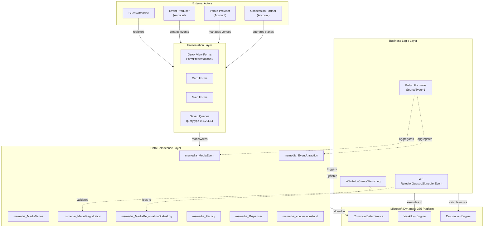

**Sources:** [Other/Relationships/msmedia_MediaEvent.xml:1-309](), [Other/Relationships/msmedia_MediaVenue.xml:1-403](), [Entities/msmedia_EventAttraction/Entity.xml:370-410]()

## Core Entity Model

The system's data model centers around four primary entities that represent the core business concepts: events, venues, attractions, and registrations. These entities form the foundation for all business operations.

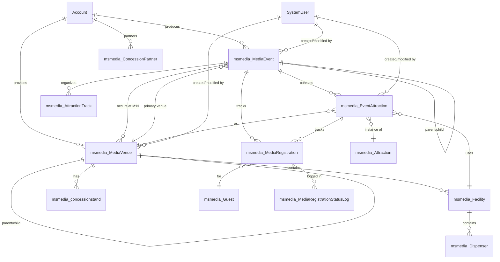

**Sources:** [Other/Relationships/msmedia_MediaEvent.xml:3-309](), [Other/Relationships/msmedia_MediaVenue.xml:3-403](), [Other/Relationships/Account.xml:3-105]()

## Entity Categories by Function

The solution organizes entities into functional categories based on their business purpose:

### Core Business Entities

| Entity | Logical Name | Purpose | Key Attributes |
|--------|-------------|---------|----------------|
| Media Event | `msmedia_MediaEvent` | Scheduled occurrence that producers publish | `msmedia_issoldout`, `msmedia_BarcodeEnabled`, `msmedia_numberregistered` |
| Media Venue | `msmedia_MediaVenue` | Physical location for events | `msmedia_name`, `msmedia_Provider`, `msmedia_capacity` |
| Event Attraction | `msmedia_EventAttraction` | Activity/session within event | `msmedia_AvailableTicketQuantity`, `msmedia_StartDate`, `msmedia_EndDate` |
| Media Registration | `msmedia_MediaRegistration` | Attendee tracking record | `msmedia_registrationstatus`, `msmedia_IsCheckedIn`, `msmedia_IsWaitlisted` |

**Sources:** [Entities/msmedia_MediaEvent/Entity.xml:1-14](), [Entities/msmedia_EventAttraction/Entity.xml:1-14](), [Entities/msmedia_MediaRegistration/Entity.xml:1-14]()

### Infrastructure Entities

| Entity | Logical Name | Purpose | Key Attributes |
|--------|-------------|---------|----------------|
| Facility | `msmedia_Facility` | Physical structure within venue | `msmedia_name`, `msmedia_MediaVenue`, `msmedia_FacilityType` |
| Dispenser | `msmedia_Dispenser` | IoT device for monitoring | `msmedia_BatteryLevel`, `msmedia_LiquidLevel`, `msmedia_lastupdated` |
| Concession Stand | `msmedia_concessionstand` | Food & beverage location | `msmedia_name`, `msmedia_MediaVenue`, `msmedia_Partner` |
| Gate | `msmedia_gate` | Entry/exit point | `msmedia_name`, `msmedia_MediaVenue`, `msmedia_Facility` |

**Sources:** [Entities/msmedia_Facility/Entity.xml:1-14](), [Entities/msmedia_Dispenser/Entity.xml:1-14](), [Other/Relationships/msmedia_Facility.xml:1-105]()

### Organizational Entities

| Entity | Logical Name | Purpose | Key Attributes |
|--------|-------------|---------|----------------|
| Attraction Track | `msmedia_AttractionTrack` | Thematic grouping of attractions | `msmedia_name`, `msmedia_MediaEvent` |
| Attraction | `msmedia_Attraction` | Template for event attractions | `msmedia_name`, `msmedia_MediaVenue` |
| Guest | `msmedia_Guest` | Attendee profile | `msmedia_name`, `msmedia_LastRegisteredEvent` |
| Weather Condition | `msmedia_WeatherCondition` | Environmental data capture | `msmedia_Temperature`, `msmedia_Humidity`, `msmedia_MediaEvent` |

**Sources:** [Entities/msmedia_AttractionTrack/Entity.xml:1-14](), [Entities/msmedia_Attraction/Entity.xml:1-14](), [Entities/msmedia_WeatherCondition/Entity.xml:1-14]()

### Audit and Status Tracking

| Entity | Logical Name | Purpose | Key Attributes |
|--------|-------------|---------|----------------|
| Media Registration Status Log | `msmedia_MediaRegistrationStatusLog` | Immutable audit trail of registration state changes | `msmedia_validfrom`, `msmedia_validto`, `msmedia_MediaRegistration` |

**Sources:** [Other/Relationships/msmedia_MediaRegistration.xml:3-37](), [Other/Relationships/msmedia_MediaEvent.xml:241-274]()

## Relationship Patterns and Data Preservation

The system implements consistent relationship patterns with specific cascade behaviors designed to preserve data integrity and historical records.

### Cascade Delete Behavior: RemoveLink

All custom entity relationships use `CascadeDelete="RemoveLink"`, which sets the foreign key to null when the parent record is deleted rather than cascading the delete. This preserves historical data and audit trails.

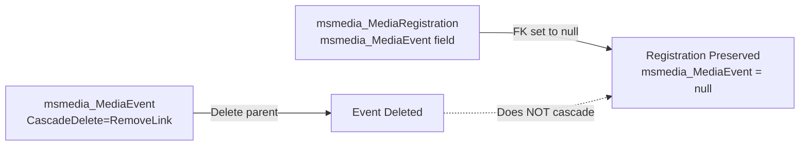

**Sources:** [Other/Relationships/msmedia_MediaEvent.xml:11](), [Other/Relationships/msmedia_MediaVenue.xml:11](), [Other/Relationships/msmedia_EventAttraction.xml:11]()

### Cascade Behavior: NoCascade for Audit Trail

System user relationships use `CascadeDelete="NoCascade"` to preserve the audit trail even if user accounts are deleted.

| Relationship | Cascade Delete | Purpose |
|--------------|----------------|---------|
| SystemUser → CreatedBy | NoCascade | Preserve creation audit |
| SystemUser → ModifiedBy | NoCascade | Preserve modification audit |
| SystemUser → Owner | NoCascade | Preserve ownership history |

**Sources:** [Other/Relationships/SystemUser.xml:10-11](), [Other/Relationships/SystemUser.xml:29-30]()

### Many-to-Many Relationships

The system implements one many-to-many relationship between `msmedia_MediaEvent` and `msmedia_MediaVenue`, allowing events to occur at multiple venues simultaneously.

| Relationship | Type | Intersect Entity |
|--------------|------|------------------|
| MediaEvent ↔ MediaVenue | ManyToMany | `msmedia_MediaEvent_msmedia_MediaVenue` |

**Sources:** [Other/Relationships/msmedia_MediaVenue.xml:241-266]()

### Self-Referencing Hierarchies

Two entities implement parent-child hierarchies for organizational structure:

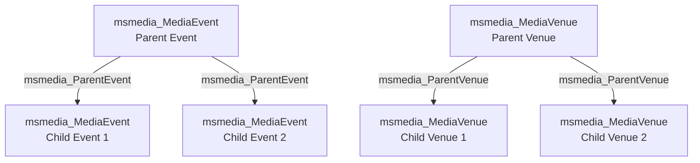

**Sources:** [Other/Relationships/msmedia_MediaEvent.xml:173-206](), [Other/Relationships/msmedia_MediaVenue.xml:301-334]()

## Business Process Architecture

The system implements automated business logic through workflows and calculated fields that maintain data consistency and provide real-time operational insights.

### Validation Workflow

The `WF-MediaRegistration-RulesforGuesttoSignupforEvent` workflow validates registration requests before creation:

| Validation Rule | Field Checked | Fail Condition |
|----------------|---------------|----------------|
| Event not sold out | `msmedia_issoldout` | Value = true |
| Within registration window | `msmedia_registrationopenson`, `msmedia_registrationcloseson` | Current time outside range |
| Agenda enabled | `msmedia_attendeeagendaenabled` | Value = false |
| Registration required | `msmedia_registrationrequired` | Value = false |

**Sources:** Referenced in high-level diagrams

### Status Logging Workflow

The `WF-MediaRegistration-Auto-CreateStatusLog` workflow automatically creates `msmedia_MediaRegistrationStatusLog` records on every registration state change, maintaining an immutable audit trail.

**Sources:** Referenced in high-level diagrams, [Other/Relationships/msmedia_MediaRegistration.xml:3-37]()

### Rollup Formulas

The system uses calculated fields with `SourceType="1"` to aggregate data in real-time:

| Formula Field | Entity | Aggregation Source |
|--------------|--------|-------------------|
| `msmedia_numberregistered` | `msmedia_MediaEvent` | Count of related registrations |
| `msmedia_numberattended` | `msmedia_MediaEvent` | Count of checked-in registrations |
| `msmedia_numberregistered` | `msmedia_EventAttraction` | Count of related registrations |
| `msmedia_numberattended` | `msmedia_EventAttraction` | Count of checked-in registrations |
| `msmedia_AvailableTicketQuantity` | `msmedia_EventAttraction` | Total capacity - registered - pending |

**Sources:** [Entities/msmedia_EventAttraction/Entity.xml:370-410]()

## Solution Packaging and Versioning

The MediaEventsVenues solution follows Microsoft Dynamics 365 solution packaging standards with version tracking across all components.

### Version Tracking

All components include `IntroducedVersion` attributes tracking when they were added to the solution:

| Version | Notable Components |
|---------|-------------------|
| 1.0 | Core entities: MediaEvent, MediaVenue, Guest, AttractionTrack |
| 1.0.0.3 | BarcodeEnabled field added |
| 1.0.0.4 | EventAttraction entity introduced |
| 1.0.0.6 | Multiple EventAttraction enhancements |
| 1.0.0.14 | MediaRegistrationStatusLog entity added |
| 1.0.2.7 | Dispenser entity for IoT integration |

**Sources:** [Entities/msmedia_MediaEvent/Entity.xml:29](), [Entities/msmedia_EventAttraction/Entity.xml:29](), [Entities/msmedia_Dispenser/Entity.xml:29]()

### Managed vs Unmanaged Components

The solution supports both development (unmanaged) and production (managed) deployments:

- **Unmanaged**: `.xml` files for development and customization
- **Managed**: `_managed.xml` files for controlled production deployment
- **Customization Control**: `IsCustomizable` flag determines post-deployment modification rights
- **Deletion Control**: `CanBeDeleted` flag protects system-critical views

**Sources:** Referenced in high-level diagrams

## Integration with Microsoft Dynamics Platform

### Account Entity Multi-Role Usage

The solution leverages the standard `Account` entity in three distinct business roles:

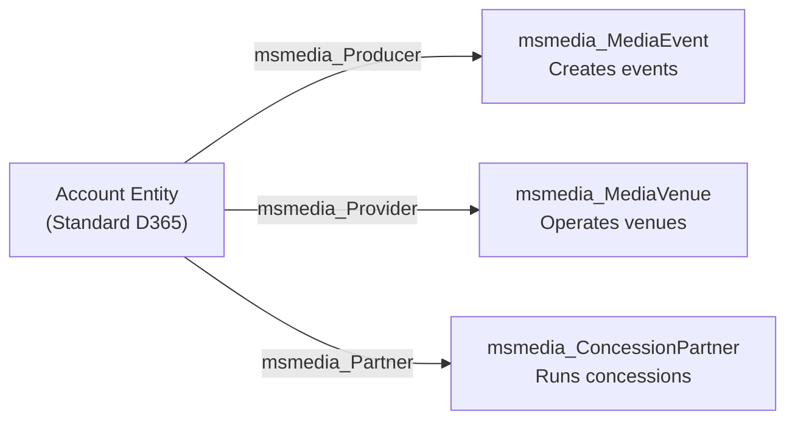

All three relationships use `CascadeDelete="RemoveLink"` to preserve event/venue/concession records if the account is deleted.

**Sources:** [Other/Relationships/Account.xml:3-105]()

### System User Audit Integration

All custom entities maintain complete audit trails through relationships with the `SystemUser` entity:

| Field | Purpose | Cascade Behavior |
|-------|---------|------------------|
| `createdby` | Record creator | NoCascade |
| `modifiedby` | Last modifier | NoCascade |
| `createdonbehalfby` | Delegate creator | NoCascade |
| `modifiedonbehalfby` | Delegate modifier | NoCascade |
| `ownerid` | Record owner | NoCascade |

**Sources:** [Other/Relationships/SystemUser.xml:3-11](), [Entities/msmedia_MediaEvent/Entity.xml:16-54]()

## Key Technical Patterns

### Naming Conventions

All custom components follow consistent naming patterns:

- **Entity Schema Names**: `msmedia_EntityName` (e.g., `msmedia_MediaEvent`)
- **Attribute Schema Names**: `msmedia_attributename` (e.g., `msmedia_issoldout`)
- **Primary Name Field**: `msmedia_name` across all entities
- **Logical Names**: Lowercase with underscores (e.g., `msmedia_mediaevent`)

**Sources:** [Entities/msmedia_MediaEvent/Entity.xml:3](), [Entities/msmedia_EventAttraction/Entity.xml:3]()

### Auto-Numbering

Several entities implement auto-numbering for unique identifiers:

| Entity | Field | Format |
|--------|-------|--------|
| `msmedia_EventAttraction` | `msmedia_eventattractionnumber` | EA-{SEQNUM:4} |

**Sources:** [Entities/msmedia_EventAttraction/Entity.xml:693]()

### Localization Strategy

All display names and descriptions use localization with language code 1033 (English-US):

```xml
<LocalizedName description="Media Event" languagecode="1033" />
<LocalizedCollectionName description="Media Events" languagecode="1033" />
```

**Sources:** [Entities/msmedia_MediaEvent/Entity.xml:6-11]()

## Architecture Summary

The MediaEventsVenues system implements a comprehensive event management solution built on Microsoft Dynamics 365. Key architectural characteristics include:

1. **Data Preservation**: RemoveLink cascade behavior throughout ensures historical data is never lost
2. **Dual Registration Model**: Support for both event-level and attraction-level registrations
3. **Real-Time Metrics**: Calculated fields provide immediate operational visibility
4. **Immutable Audit Trail**: Status log entity captures complete state change history
5. **Multi-Role Account Integration**: Single Account entity serves three business purposes
6. **Hierarchical Organization**: Self-referencing relationships enable complex event and venue structures
7. **IoT Integration**: Dispenser entity supports physical device monitoring

For detailed information about specific subsystems, refer to the linked pages in this wiki.

**Sources:** All referenced files throughout this document15:T639f,# Core Data Model

<details>
<summary>Relevant source files</summary>

The following files were used as context for generating this wiki page:

- [Entities/msmedia_Attraction/Entity.xml](Entities/msmedia_Attraction/Entity.xml)
- [Entities/msmedia_AttractionTrack/Entity.xml](Entities/msmedia_AttractionTrack/Entity.xml)
- [Entities/msmedia_Dispenser/Entity.xml](Entities/msmedia_Dispenser/Entity.xml)
- [Entities/msmedia_EventAttraction/Entity.xml](Entities/msmedia_EventAttraction/Entity.xml)
- [Entities/msmedia_Facility/Entity.xml](Entities/msmedia_Facility/Entity.xml)
- [Entities/msmedia_MediaEvent/Entity.xml](Entities/msmedia_MediaEvent/Entity.xml)
- [Entities/msmedia_MediaRegistration/Entity.xml](Entities/msmedia_MediaRegistration/Entity.xml)
- [Entities/msmedia_TMA/Entity.xml](Entities/msmedia_TMA/Entity.xml)
- [Entities/msmedia_WeatherCondition/Entity.xml](Entities/msmedia_WeatherCondition/Entity.xml)
- [Other/Relationships/Account.xml](Other/Relationships/Account.xml)
- [Other/Relationships/SystemUser.xml](Other/Relationships/SystemUser.xml)
- [Other/Relationships/msmedia_EventAttraction.xml](Other/Relationships/msmedia_EventAttraction.xml)
- [Other/Relationships/msmedia_Facility.xml](Other/Relationships/msmedia_Facility.xml)
- [Other/Relationships/msmedia_Guest.xml](Other/Relationships/msmedia_Guest.xml)
- [Other/Relationships/msmedia_MediaEvent.xml](Other/Relationships/msmedia_MediaEvent.xml)
- [Other/Relationships/msmedia_MediaRegistration.xml](Other/Relationships/msmedia_MediaRegistration.xml)
- [Other/Relationships/msmedia_MediaVenue.xml](Other/Relationships/msmedia_MediaVenue.xml)

</details>


## Purpose and Scope

This page documents the entity data model that forms the foundation of the MediaEventsVenues system. It covers entity definitions, relationship patterns, cascade behaviors, calculated fields, and integration patterns with Microsoft Dynamics 365 platform entities.

For information about the automated business logic that operates on this data model, see [Business Processes and Workflows](#3). For details on how these entities are presented to users through forms and views, see [User Interface Components](#4).

## Entity Relationship Architecture

The data model is organized around four core business entities that track the complete lifecycle of media events, from planning through execution:

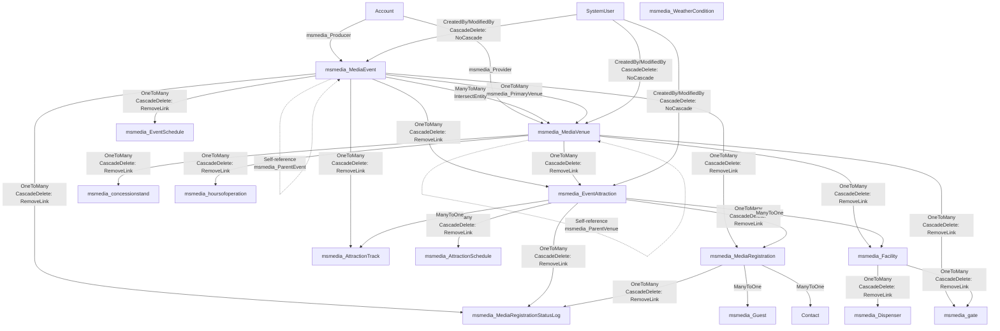

**Sources:** [Other/Relationships/msmedia_MediaEvent.xml](), [Other/Relationships/msmedia_MediaVenue.xml](), [Other/Relationships/msmedia_EventAttraction.xml](), [Other/Relationships/Account.xml](), [Other/Relationships/SystemUser.xml]()

## Cascade Behavior Patterns

The system implements two distinct cascade delete strategies that serve different purposes:

| Cascade Behavior | Applied To | Purpose | Example |
|-----------------|------------|---------|---------|
| `RemoveLink` | All custom entity relationships | Preserves historical data and audit trail | When `msmedia_MediaEvent` is deleted, related `msmedia_EventAttraction` records remain but have their `msmedia_MediaEvent` lookup cleared |
| `NoCascade` | `SystemUser` audit relationships | Prevents deletion of user records that have created/modified other records | When `SystemUser` is deleted, `CreatedBy` and `ModifiedBy` fields in `msmedia_MediaEvent` remain unchanged |

### RemoveLink Cascade Pattern

All relationships defined in [Other/Relationships/msmedia_MediaEvent.xml:11](), [Other/Relationships/msmedia_MediaVenue.xml:11](), and [Other/Relationships/msmedia_EventAttraction.xml:11]() use `<CascadeDelete>RemoveLink</CascadeDelete>`. This behavior:

- Clears the lookup field value when the parent record is deleted
- Leaves child records active and intact
- Maintains referential integrity without data loss
- Enables historical reporting on orphaned records

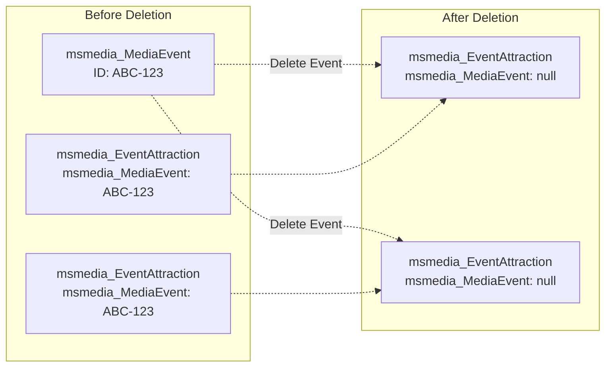

**Sources:** [Other/Relationships/msmedia_MediaEvent.xml:1-308](), [Other/Relationships/msmedia_MediaVenue.xml:1-402]()

### NoCascade Audit Pattern

All `SystemUser` relationships defined in [Other/Relationships/SystemUser.xml]() use `<CascadeDelete>NoCascade</CascadeDelete>` for audit fields:

- `CreatedBy` [Other/Relationships/SystemUser.xml:10-11]()
- `ModifiedBy` [Other/Relationships/SystemUser.xml:30-31]()
- `CreatedOnBehalfBy`
- `ModifiedOnBehalfBy`

This ensures user records cannot be deleted if they have created or modified any custom entity records, preserving the complete audit trail.

**Sources:** [Other/Relationships/SystemUser.xml:1-1141]()

## Entity Relationship Diagram - Core Domain

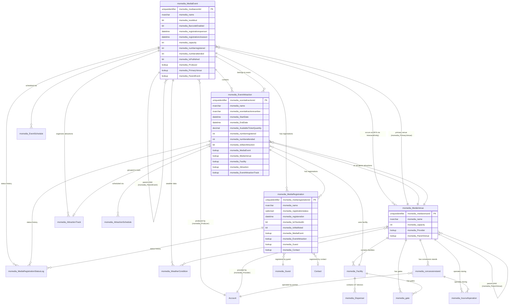

**Sources:** [Entities/msmedia_MediaEvent/Entity.xml](), [Entities/msmedia_MediaVenue/Entity.xml](), [Entities/msmedia_EventAttraction/Entity.xml](), [Entities/msmedia_MediaRegistration/Entity.xml](), [Other/Relationships/msmedia_MediaEvent.xml](), [Other/Relationships/msmedia_MediaVenue.xml]()

## Many-to-Many Event-Venue Relationship

The relationship between `msmedia_MediaEvent` and `msmedia_MediaVenue` supports two patterns:

### Pattern 1: Many-to-Many Association

Defined in [Other/Relationships/msmedia_MediaVenue.xml:241-266]():

```xml
<EntityRelationship Name="msmedia_MediaEvent_msmedia_MediaVenue_msm">
  <EntityRelationshipType>ManyToMany</EntityRelationshipType>
  <IntersectEntityName>msmedia_MediaEvent_msmedia_MediaVenue</IntersectEntityName>
```

This allows an event to occur at multiple venues simultaneously and a venue to host multiple events. The intersect entity `msmedia_MediaEvent_msmedia_MediaVenue` stores the associations.

### Pattern 2: Primary Venue Lookup

Defined in [Other/Relationships/msmedia_MediaVenue.xml:267-300]():

```xml
<EntityRelationship Name="msmedia_MediaEvent_PrimaryVenue_msmedia_M">
  <EntityRelationshipType>OneToMany</EntityRelationshipType>
  <ReferencingAttributeName>msmedia_PrimaryVenue</ReferencingAttributeName>
```

Each `msmedia_MediaEvent` has a single `msmedia_PrimaryVenue` lookup field for the main location, while the many-to-many relationship tracks all venues involved.

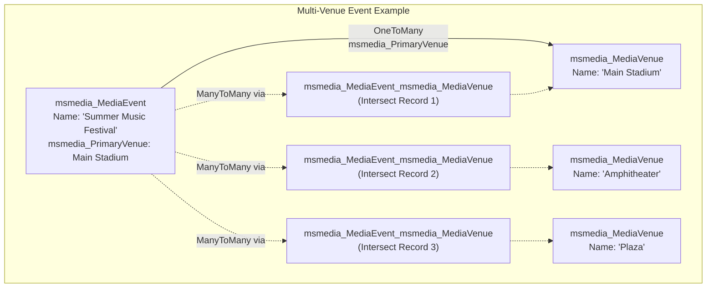

**Sources:** [Other/Relationships/msmedia_MediaVenue.xml:241-300]()

## Self-Referencing Hierarchies

Two entities support parent-child hierarchical structures:

### msmedia_MediaEvent Hierarchy

Defined in [Other/Relationships/msmedia_MediaEvent.xml:173-206]():

```xml
<EntityRelationship Name="msmedia_MediaEvent_ParentEvent_msmedia_Me">
  <ReferencingAttributeName>msmedia_ParentEvent</ReferencingAttributeName>
  <ReferencedEntityName>msmedia_MediaEvent</ReferencedEntityName>
```

The `msmedia_ParentEvent` lookup field enables:
- Multi-day conferences with daily sub-events
- Event series with individual episodes
- Master events with regional instances

### msmedia_MediaVenue Hierarchy

Defined in [Other/Relationships/msmedia_MediaVenue.xml:301-334]():

```xml
<EntityRelationship Name="msmedia_MediaVenue_ParentVenue_msmedia_Me">
  <ReferencingAttributeName>msmedia_ParentVenue</ReferencingAttributeName>
  <ReferencedEntityName>msmedia_MediaVenue</ReferencedEntityName>
```

The `msmedia_ParentVenue` lookup field enables:
- Campus-building-room hierarchies
- Convention center-hall-booth structures
- Stadium-section-seat relationships

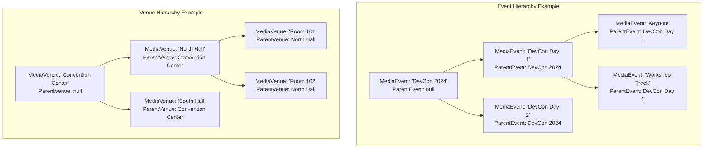

**Sources:** [Other/Relationships/msmedia_MediaEvent.xml:173-206](), [Other/Relationships/msmedia_MediaVenue.xml:301-334]()

## Calculated Fields and Formulas

### msmedia_AvailableTicketQuantity (EventAttraction)

Defined in [Entities/msmedia_EventAttraction/Entity.xml:370-410]():

```xml
<attribute PhysicalName="msmedia_AvailableTicketQuantity">
  <Type>decimal</Type>
  <SourceType>1</SourceType>
  <FormulaDefinitionFileName>/Formulas/msmedia_eventattraction-msmedia_availableticketquantity.xaml</FormulaDefinitionFileName>
```

This read-only calculated field computes available capacity in real-time based on:
- Total ticket capacity
- Number registered (`msmedia_numberregistered`)
- Number on waitlist

The formula is stored in [Formulas/msmedia_eventattraction-msmedia_availableticketquantity.xaml]() and automatically recalculates when related `msmedia_MediaRegistration` records are created, updated, or deleted.

### Rollup Fields for Attendance Metrics

Both `msmedia_MediaEvent` and `msmedia_EventAttraction` have rollup fields:

| Field Name | Type | Purpose | Rollup Source |
|------------|------|---------|---------------|
| `msmedia_numberregistered` | `int` | Count of all registrations | `msmedia_MediaRegistration` |
| `msmedia_numberattended` | `int` | Count of checked-in registrations | `msmedia_MediaRegistration` where `msmedia_IsCheckedIn = true` |

Defined in:
- [Entities/msmedia_MediaEvent/Entity.xml:1082-1125]() for event-level metrics
- [Entities/msmedia_EventAttraction/Entity.xml:1082-1125]() for attraction-level metrics

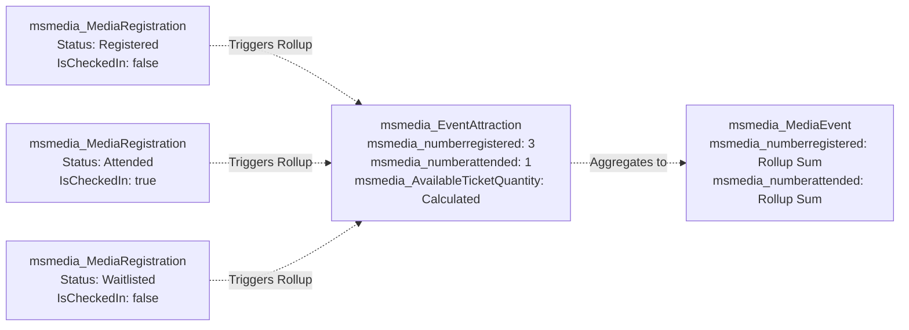

**Sources:** [Entities/msmedia_EventAttraction/Entity.xml:370-410](), [Entities/msmedia_MediaEvent/Entity.xml:1082-1125]()

## Infrastructure Entity Relationships

### Facility-Based Architecture

`msmedia_Facility` represents physical structures within venues and serves as the connection point for:

**EventAttractions** - Defined in [Other/Relationships/msmedia_Facility.xml:37-70]():
```xml
<EntityRelationship Name="msmedia_EventAttraction_Facility_msmedia_">
  <ReferencingAttributeName>msmedia_Facility</ReferencingAttributeName>
```

**IoT Devices** - Defined in [Other/Relationships/msmedia_Facility.xml:3-36]():
```xml
<EntityRelationship Name="msmedia_Dispenser_Facility_msmedia_Facili">
  <ReferencingAttributeName>msmedia_Facility</ReferencingAttributeName>
```

**Gates** - Defined in [Other/Relationships/msmedia_Facility.xml:71-104]():
```xml
<EntityRelationship Name="msmedia_gate_Facility_msmedia_Facility">
  <ReferencingAttributeName>msmedia_Facility</ReferencingAttributeName>
```

### msmedia_Dispenser IoT Integration

Defined in [Entities/msmedia_Dispenser/Entity.xml:1-15]():

```xml
<entity Name="msmedia_Dispenser">
  <Descriptions>
    <Description description="" languagecode="1033" />
  </Descriptions>
```

Key attributes for IoT device tracking:
- `msmedia_BatteryLevel` [Entities/msmedia_Dispenser/Entity.xml:292-312]()
- `msmedia_LiquidLevel` [Entities/msmedia_Dispenser/Entity.xml]()
- `msmedia_Status` [Entities/msmedia_Dispenser/Entity.xml]()
- `msmedia_lastupdated` for telemetry timestamps

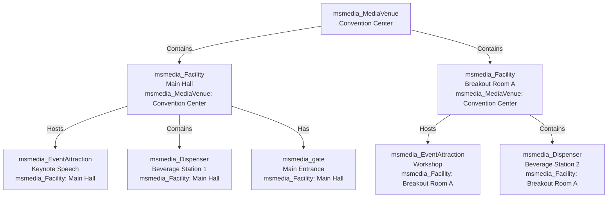

**Sources:** [Entities/msmedia_Facility/Entity.xml:1-15](), [Entities/msmedia_Dispenser/Entity.xml:1-723](), [Other/Relationships/msmedia_Facility.xml:1-105]()

## Standard Attribute Patterns

All custom entities inherit common attributes from the Dynamics 365 platform:

### Primary Key
- Pattern: `msmedia_{entityname}id` (e.g., `msmedia_mediaeventid`)
- Type: `primarykey` (uniqueidentifier)
- Example: [Entities/msmedia_MediaEvent/Entity.xml]() defines `msmedia_mediaeventid`

### Primary Name Field
- Attribute: `msmedia_name` 
- Type: `nvarchar`
- Used as display name in lookups and views
- Example: [Entities/msmedia_MediaEvent/Entity.xml]()

### Auto-Number Fields
Some entities include auto-generated identifier fields:
- `msmedia_eventattractionnumber` with format `EA-{SEQNUM:4}` [Entities/msmedia_EventAttraction/Entity.xml:668-707]()

### Audit Trail Fields (System-Managed)
- `CreatedBy` - lookup to `SystemUser` [Entities/msmedia_MediaEvent/Entity.xml:16-54]()
- `CreatedOn` - datetime [Entities/msmedia_MediaEvent/Entity.xml:55-94]()
- `ModifiedBy` - lookup to `SystemUser` [Entities/msmedia_MediaEvent/Entity.xml:214-252]()
- `ModifiedOn` - datetime [Entities/msmedia_MediaEvent/Entity.xml:253-292]()
- `CreatedOnBehalfBy` - lookup to `SystemUser` [Entities/msmedia_MediaEvent/Entity.xml:95-133]()
- `ModifiedOnBehalfBy` - lookup to `SystemUser` [Entities/msmedia_MediaEvent/Entity.xml:293-331]()

All audit trail relationships use `CascadeDelete: NoCascade` to prevent user deletion if they have created/modified records [Other/Relationships/SystemUser.xml:10-11]().

### State and Status Management
- `statecode` - Active (0) or Inactive (1)
- `statuscode` - option set for detailed status values
- Example: `msmedia_registrationstatus` in `msmedia_MediaRegistration` [Entities/msmedia_MediaRegistration/Entity.xml]()

**Sources:** [Entities/msmedia_MediaEvent/Entity.xml:1-94](), [Entities/msmedia_EventAttraction/Entity.xml:1-94](), [Other/Relationships/SystemUser.xml:1-50]()

## External Entity Integration

### Account Entity Roles

The standard Dynamics 365 `Account` entity is reused for three distinct business roles:

| Role | Lookup Field | Entity | Relationship Definition |
|------|-------------|--------|------------------------|
| Producer | `msmedia_Producer` | `msmedia_MediaEvent` | [Other/Relationships/Account.xml:37-70]() |
| Provider | `msmedia_Provider` | `msmedia_MediaVenue` | [Other/Relationships/Account.xml:71-104]() |
| Partner | `msmedia_Partner` | `msmedia_ConcessionPartner` | [Other/Relationships/Account.xml:3-36]() |

All use `CascadeDelete: RemoveLink` to preserve historical records when an Account is deleted.

### Contact and Guest Integration

`msmedia_MediaRegistration` supports two types of attendees:

1. **Contact-based** - Uses standard `Contact` entity via `msmedia_Contact` lookup
2. **Guest-based** - Uses custom `msmedia_Guest` entity via `msmedia_Guest` lookup [Other/Relationships/msmedia_Guest.xml:3-36]()

This dual pattern allows both CRM contacts and non-CRM guests to register for events.

### Weather Data Integration

`msmedia_WeatherCondition` tracks environmental data for events and venues:
- Related to `msmedia_MediaEvent` [Other/Relationships/msmedia_MediaEvent.xml:275-308]()
- Related to `msmedia_MediaVenue` [Other/Relationships/msmedia_MediaVenue.xml:369-402]()

Key attributes defined in [Entities/msmedia_WeatherCondition/Entity.xml:1-14]():
- Temperature
- Humidity  
- Precipitation
- Wind speed
- Cloud cover

**Sources:** [Other/Relationships/Account.xml:1-105](), [Other/Relationships/msmedia_Guest.xml:1-37](), [Entities/msmedia_WeatherCondition/Entity.xml:1-14](), [Other/Relationships/msmedia_MediaEvent.xml:275-308]()

## Data Model Summary

The MediaEventsVenues data model implements a sophisticated entity relationship architecture with the following key characteristics:

| Characteristic | Implementation | Purpose |
|---------------|----------------|---------|
| **Data Preservation** | `CascadeDelete: RemoveLink` on all custom relationships | Maintains historical data integrity even after parent record deletion |
| **Audit Trail Protection** | `CascadeDelete: NoCascade` on `SystemUser` relationships | Prevents deletion of users who created/modified records |
| **Dual Registration Model** | Event-level and Attraction-level registrations | Enables both coarse and fine-grained capacity management |
| **Multi-Venue Support** | Many-to-many + Primary Venue lookup | Supports events occurring at multiple locations simultaneously |
| **Hierarchical Organization** | Self-referencing relationships on `MediaEvent` and `MediaVenue` | Enables complex event series and venue structures |
| **Real-Time Calculations** | Calculated fields and rollup formulas | Provides live attendance metrics without manual updates |
| **IoT Integration** | `Dispenser` entity with telemetry attributes | Tracks physical infrastructure status |
| **Entity Reuse** | `Account` serves Producer, Provider, and Partner roles | Leverages standard CRM entities for multiple business functions |

**Sources:** All relationship and entity files referenced throughout this document16:T8d5c,# Entity Relationships

<details>
<summary>Relevant source files</summary>

The following files were used as context for generating this wiki page:

- [Other/Relationships/Account.xml](Other/Relationships/Account.xml)
- [Other/Relationships/SystemUser.xml](Other/Relationships/SystemUser.xml)
- [Other/Relationships/msmedia_EventAttraction.xml](Other/Relationships/msmedia_EventAttraction.xml)
- [Other/Relationships/msmedia_Facility.xml](Other/Relationships/msmedia_Facility.xml)
- [Other/Relationships/msmedia_Guest.xml](Other/Relationships/msmedia_Guest.xml)
- [Other/Relationships/msmedia_MediaEvent.xml](Other/Relationships/msmedia_MediaEvent.xml)
- [Other/Relationships/msmedia_MediaRegistration.xml](Other/Relationships/msmedia_MediaRegistration.xml)
- [Other/Relationships/msmedia_MediaVenue.xml](Other/Relationships/msmedia_MediaVenue.xml)

</details>


## Purpose and Scope

This page documents all entity relationships defined in the MediaEventsVenues system, including relationship types, cascade behaviors, and navigation properties. The system uses a comprehensive set of relationships to connect core business entities (MediaEvent, MediaVenue, EventAttraction, MediaRegistration) with supporting entities (Facility, Dispenser, Guest, etc.) and external systems (Account, SystemUser).

For detailed information about the entities themselves and their attributes, see [Core Business Entities](#2.2). For information about how these relationships affect security and data preservation, see [Security and Audit Model](#5.3) and [Data Preservation Strategy](#5.4).

---

## Relationship Architecture Overview

The system defines relationships through XML files located in `Other/Relationships/`, with one file per entity containing all relationships where that entity is the referenced (parent) entity. All relationships follow Microsoft Dynamics 365 Common Data Service conventions and use consistent patterns for cascade behaviors and navigation properties.

**Key Architectural Patterns:**
- **Cascade Delete Strategy**: `RemoveLink` is used universally to preserve historical data
- **Cascade Assign/Share/Unshare**: `NoCascade` is used consistently to prevent unintended propagation
- **Navigation Properties**: Follow naming pattern `{ReferencingEntity}_{ReferencedEntity}_{AttributeName}`
- **Advanced Find Support**: All relationships set `IsValidForAdvancedFind` to `1`

Sources: [Other/Relationships/msmedia_MediaEvent.xml:1-309](), [Other/Relationships/msmedia_MediaVenue.xml:1-403](), [Other/Relationships/msmedia_EventAttraction.xml:1-139]()

---

## Entity Relationship Diagram - Complete System

```mermaid
erDiagram
    msmedia_MediaEvent ||--o{ msmedia_EventAttraction : "msmedia_EventAttraction_MediaEvent_msmedi"
    msmedia_MediaEvent ||--o{ msmedia_MediaRegistration : "msmedia_MediaRegistration_MediaEvent_msme"
    msmedia_MediaEvent ||--o{ msmedia_AttractionTrack : "msmedia_AttractionTrack_MediaEvent_msmedi"
    msmedia_MediaEvent ||--o{ msmedia_EventSchedule : "msmedia_EventSchedule_MediaEvent_msmedia_"
    msmedia_MediaEvent ||--o{ msmedia_MediaRegistrationStatusLog : "msmedia_MediaRegistrationStatusLog_MediaE"
    msmedia_MediaEvent ||--o{ msmedia_WeatherCondition : "msmedia_WeatherCondition_MediaEvent_msmed"
    msmedia_MediaEvent ||--o{ msmedia_ConcessionPartner : "msmedia_ConcessionPartner_MediaEvent_msme"
    msmedia_MediaEvent ||--o{ msmedia_MediaEvent : "msmedia_MediaEvent_ParentEvent_msmedia_Me"
    msmedia_MediaEvent }o--o{ msmedia_MediaVenue : "msmedia_MediaEvent_msmedia_MediaVenue_msm"
    msmedia_MediaEvent }o--|| msmedia_MediaVenue : "msmedia_MediaEvent_PrimaryVenue_msmedia_M"
    msmedia_MediaEvent }o--|| Account : "msmedia_MediaEvent_Producer_Account"
    msmedia_MediaEvent ||--o{ msmedia_Guest : "msmedia_Guest_LastRegisteredEvent_msmedia"
    
    msmedia_MediaVenue ||--o{ msmedia_Facility : "msmedia_Facility_MediaVenue_msmedia_Media"
    msmedia_MediaVenue ||--o{ msmedia_EventAttraction : "msmedia_EventAttraction_MediaVenue_msmedi"
    msmedia_MediaVenue ||--o{ msmedia_concessionstand : "msmedia_concessionstand_MediaVenue_msmedi"
    msmedia_MediaVenue ||--o{ msmedia_gate : "msmedia_gate_MediaVenue_msmedia_MediaVenu"
    msmedia_MediaVenue ||--o{ msmedia_hoursofoperation : "msmedia_hoursofoperation_MediaVenue_msmed"
    msmedia_MediaVenue ||--o{ msmedia_MediaVenueImage : "msmedia_MediaVenueImage_MediaVenue_msmedi"
    msmedia_MediaVenue ||--o{ msmedia_WeatherCondition : "msmedia_WeatherCondition_MediaVenue_msmed"
    msmedia_MediaVenue ||--o{ msmedia_MediaAsset : "msmedia_MediaAsset_MediaVenue_msmedia_Med"
    msmedia_MediaVenue ||--o{ msmedia_Attraction : "msmedia_Attraction_MediaVenue_msmedia_Med"
    msmedia_MediaVenue ||--o{ msmedia_MediaVenue : "msmedia_MediaVenue_ParentVenue_msmedia_Me"
    msmedia_MediaVenue }o--|| Account : "msmedia_MediaVenue_Provider_Account"
    
    msmedia_EventAttraction }o--|| msmedia_MediaEvent : "parent-relationship"
    msmedia_EventAttraction }o--|| msmedia_MediaVenue : "venue-relationship"
    msmedia_EventAttraction }o--|| msmedia_Facility : "msmedia_EventAttraction_Facility_msmedia_"
    msmedia_EventAttraction ||--o{ msmedia_MediaRegistration : "msmedia_EventAttraction_msmedia_MediaRegistration"
    msmedia_EventAttraction ||--o{ msmedia_AttractionSchedule : "msmedia_EventAttraction_msmedia_AttractionSchedul"
    msmedia_EventAttraction ||--o{ msmedia_MediaRegistrationStatusLog : "msmedia_EventAttraction_msmedia_MedRegStatusLog"
    msmedia_EventAttraction ||--o{ msmedia_hoursofoperation : "msmedia_hoursofoperation_EventAttraction"
    
    msmedia_MediaRegistration }o--|| msmedia_Guest : "msmedia_MediaRegistration_Guest_msmedia_G"
    msmedia_MediaRegistration }o--|| msmedia_MediaEvent : "parent-relationship"
    msmedia_MediaRegistration }o--o| msmedia_EventAttraction : "parent-relationship"
    msmedia_MediaRegistration ||--o{ msmedia_MediaRegistrationStatusLog : "msmedia_MediaRegistrationStatusLog_MediaR"
    
    msmedia_Facility }o--|| msmedia_MediaVenue : "parent-relationship"
    msmedia_Facility ||--o{ msmedia_Dispenser : "msmedia_Dispenser_Facility_msmedia_Facili"
    msmedia_Facility ||--o{ msmedia_gate : "msmedia_gate_Facility_msmedia_Facility"
    
    Account ||--o{ msmedia_ConcessionPartner : "msmedia_ConcessionPartner_Partner_Account"
    
    SystemUser ||--o{ msmedia_MediaEvent : "CreatedBy-ModifiedBy"
    SystemUser ||--o{ msmedia_MediaVenue : "CreatedBy-ModifiedBy"
    SystemUser ||--o{ msmedia_EventAttraction : "CreatedBy-ModifiedBy"
    SystemUser ||--o{ msmedia_MediaRegistration : "CreatedBy-ModifiedBy"
```

**Diagram: Complete Entity Relationship Model**

This diagram shows all entity relationships in the system using exact navigation property names from the XML definitions. Note the dual relationship between MediaEvent and MediaVenue (many-to-many plus primary venue), and the self-referencing hierarchies in MediaEvent and MediaVenue.

Sources: [Other/Relationships/msmedia_MediaEvent.xml:1-309](), [Other/Relationships/msmedia_MediaVenue.xml:1-403](), [Other/Relationships/msmedia_EventAttraction.xml:1-139](), [Other/Relationships/SystemUser.xml:1-700](), [Other/Relationships/Account.xml:1-105]()

---

## Cascade Delete Behavior: RemoveLink Pattern

All relationships in the system use `CascadeDelete: RemoveLink`, which removes the reference (sets the lookup field to null) when the parent record is deleted, but preserves the child record. This is a deliberate architectural decision to maintain historical data integrity.

### RemoveLink Implementation

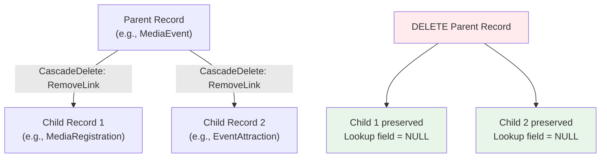

**Diagram: RemoveLink Cascade Behavior**

### Examples in Code

| Relationship | Cascade Delete | File Reference |
|--------------|----------------|----------------|
| MediaEvent → EventAttraction | `RemoveLink` | [Other/Relationships/msmedia_MediaEvent.xml:79]() |
| MediaEvent → MediaRegistration | `RemoveLink` | [Other/Relationships/msmedia_MediaEvent.xml:215]() |
| MediaVenue → Facility | `RemoveLink` | [Other/Relationships/msmedia_MediaVenue.xml:113]() |
| EventAttraction → MediaRegistration | `RemoveLink` | [Other/Relationships/msmedia_EventAttraction.xml:45]() |
| Facility → Dispenser | `RemoveLink` | [Other/Relationships/msmedia_Facility.xml:11]() |
| Account → MediaEvent (Producer) | `RemoveLink` | [Other/Relationships/Account.xml:45]() |

**Table: Sample RemoveLink Implementations**

All relationships use `<CascadeDelete>RemoveLink</CascadeDelete>` without exception, ensuring that deleting parent records never cascades to child records, preserving complete audit trails and historical data.

Sources: [Other/Relationships/msmedia_MediaEvent.xml:11-215](), [Other/Relationships/msmedia_MediaVenue.xml:11-377](), [Other/Relationships/msmedia_EventAttraction.xml:11-113]()

---

## NoCascade Pattern for Other Operations

All relationships consistently use `NoCascade` for assign, reparent, share, unshare, and rollup view operations. This prevents unintended side effects when performing these operations on parent records.

### Standard Cascade Configuration

```xml
<CascadeAssign>NoCascade</CascadeAssign>
<CascadeDelete>RemoveLink</CascadeDelete>
<CascadeReparent>NoCascade</CascadeReparent>
<CascadeShare>NoCascade</CascadeShare>
<CascadeUnshare>NoCascade</CascadeUnshare>
<CascadeRollupView>NoCascade</CascadeRollupView>
```

This configuration appears in every relationship definition. For example:
- [Other/Relationships/msmedia_MediaEvent.xml:10-15]() - AttractionTrack relationship
- [Other/Relationships/msmedia_MediaVenue.xml:44-49]() - concessionstand relationship
- [Other/Relationships/msmedia_EventAttraction.xml:10-15]() - AttractionSchedule relationship

The `NoCascade` settings mean:
- **CascadeAssign**: Changing the owner of a parent record does not change child record ownership
- **CascadeReparent**: Not applicable (used for parental relationships in hierarchies)
- **CascadeShare**: Sharing a parent record does not automatically share child records
- **CascadeUnshare**: Unsharing a parent record does not affect child record sharing
- **CascadeRollupView**: Rollup calculations do not cascade

Sources: [Other/Relationships/msmedia_MediaEvent.xml:10-15](), [Other/Relationships/msmedia_MediaVenue.xml:44-49](), [Other/Relationships/msmedia_EventAttraction.xml:10-15]()

---

## Many-to-Many Relationship: MediaEvent and MediaVenue

The system implements a complex dual relationship between `msmedia_MediaEvent` and `msmedia_MediaVenue` to support events occurring at multiple venues while also designating one primary venue.

### Dual Relationship Structure

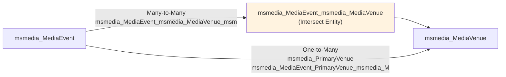

**Diagram: MediaEvent-MediaVenue Dual Relationship**

### Many-to-Many Configuration

The many-to-many relationship is defined in [Other/Relationships/msmedia_MediaVenue.xml:241-266]():

```xml
<EntityRelationship Name="msmedia_MediaEvent_msmedia_MediaVenue_msm">
  <EntityRelationshipType>ManyToMany</EntityRelationshipType>
  <FirstEntityName>msmedia_MediaVenue</FirstEntityName>
  <SecondEntityName>msmedia_MediaEvent</SecondEntityName>
  <IntersectEntityName>msmedia_MediaEvent_msmedia_MediaVenue</IntersectEntityName>
  ...
</EntityRelationship>
```

### Primary Venue Configuration

The primary venue relationship is defined in [Other/Relationships/msmedia_MediaVenue.xml:267-300]():

```xml
<EntityRelationship Name="msmedia_MediaEvent_PrimaryVenue_msmedia_M">
  <EntityRelationshipType>OneToMany</EntityRelationshipType>
  <ReferencingEntityName>msmedia_MediaEvent</ReferencingEntityName>
  <ReferencedEntityName>msmedia_MediaVenue</ReferencedEntityName>
  <ReferencingAttributeName>msmedia_PrimaryVenue</ReferencingAttributeName>
  ...
</EntityRelationship>
```

### Use Case

This dual relationship structure enables:
1. **Multi-venue events**: An event can occur at multiple venues through the many-to-many relationship
2. **Primary venue designation**: Each event has one designated primary venue via the `msmedia_PrimaryVenue` lookup field
3. **Query flexibility**: The intersect entity `msmedia_MediaEvent_msmedia_MediaVenue` allows efficient querying of event-venue associations

Sources: [Other/Relationships/msmedia_MediaVenue.xml:241-300]()

---

## Self-Referencing Relationships (Hierarchies)

The system implements hierarchical structures through self-referencing relationships on two entities: `msmedia_MediaEvent` and `msmedia_MediaVenue`.

### MediaEvent Hierarchy

**Relationship Name**: `msmedia_MediaEvent_ParentEvent_msmedia_Me`  
**Attribute**: `msmedia_ParentEvent`  
**Definition**: [Other/Relationships/msmedia_MediaEvent.xml:173-206]()

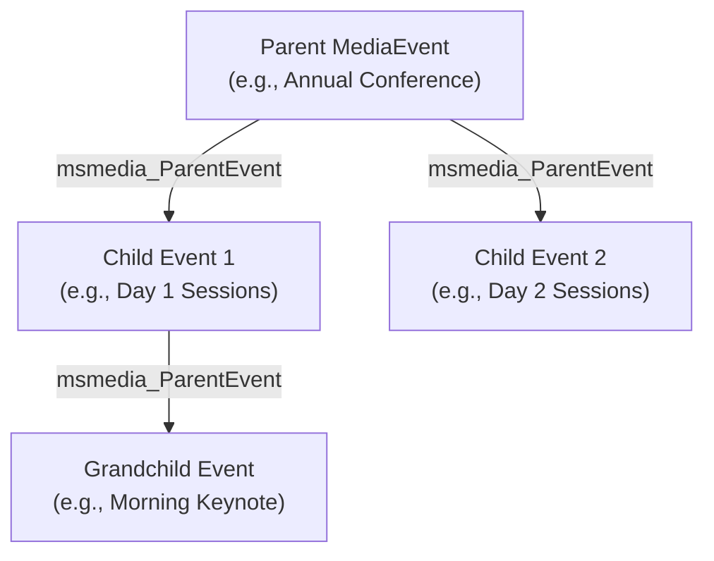

**Diagram: MediaEvent Hierarchical Structure**

### MediaVenue Hierarchy

**Relationship Name**: `msmedia_MediaVenue_ParentVenue_msmedia_Me`  
**Attribute**: `msmedia_ParentVenue`  
**Definition**: [Other/Relationships/msmedia_MediaVenue.xml:301-334]()

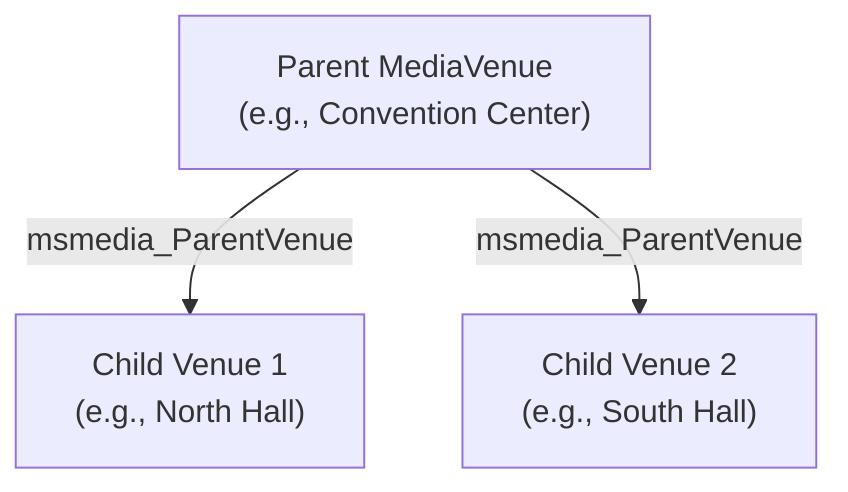

**Diagram: MediaVenue Hierarchical Structure**

### Hierarchy Configuration Details

Both hierarchies share identical cascade configuration:
- **CascadeDelete**: `RemoveLink` (child venues/events remain when parent is deleted)
- **IsHierarchical**: `0` (standard relationship, not using Dynamics 365 hierarchical features)
- **IntroducedVersion**: `1.0` (part of initial release)

Sources: [Other/Relationships/msmedia_MediaEvent.xml:173-206](), [Other/Relationships/msmedia_MediaVenue.xml:301-334]()

---

## Audit Trail Relationships with SystemUser

All custom entities maintain audit trails through relationships with the `SystemUser` entity. These relationships track who created and last modified each record, using `NoCascade` for all cascade operations to preserve audit integrity.

### SystemUser Relationship Pattern

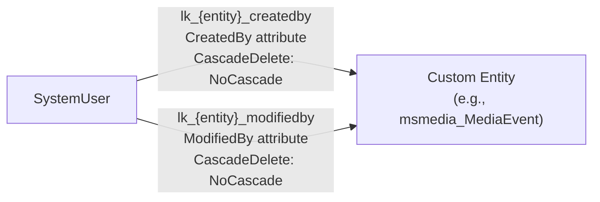

**Diagram: SystemUser Audit Relationship Pattern**

### Relationship Naming Convention

All SystemUser relationships follow the naming pattern: `lk_{entitylogicalname}_{action}by`

Examples:
- `lk_msmedia_mediaevent_createdby` - [Other/Relationships/SystemUser.xml:421-439]()
- `lk_msmedia_mediaevent_modifiedby` - [Other/Relationships/SystemUser.xml:440-458]()
- `lk_msmedia_eventattraction_createdby` - [Other/Relationships/SystemUser.xml:231-249]()
- `lk_msmedia_eventattraction_modifiedby` - [Other/Relationships/SystemUser.xml:250-268]()

### Complete SystemUser Coverage

| Entity | Created By Relationship | Modified By Relationship | Lines |
|--------|------------------------|-------------------------|-------|
| msmedia_MediaEvent | `lk_msmedia_mediaevent_createdby` | `lk_msmedia_mediaevent_modifiedby` | [421-458]() |
| msmedia_MediaVenue | `lk_msmedia_mediavenue_createdby` | `lk_msmedia_mediavenue_modifiedby` | [535-572]() |
| msmedia_EventAttraction | `lk_msmedia_eventattraction_createdby` | `lk_msmedia_eventattraction_modifiedby` | [231-268]() |
| msmedia_MediaRegistration | `lk_msmedia_mediaregistration_createdby` | `lk_msmedia_mediaregistration_modifiedby` | [459-496]() |
| msmedia_Facility | `lk_msmedia_facility_createdby` | `lk_msmedia_facility_modifiedby` | [307-344]() |
| msmedia_Dispenser | `lk_msmedia_dispenser_createdby` | `lk_msmedia_dispenser_modifiedby` | [193-230]() |
| msmedia_concessionstand | `lk_msmedia_concessionstand_createdby` | `lk_msmedia_concessionstand_modifiedby` | [155-192]() |

**Table: SystemUser Audit Relationships by Entity**

### NoCascade Rationale

All SystemUser relationships use `<CascadeDelete>NoCascade</CascadeDelete>` (see [Other/Relationships/SystemUser.xml:11]()). This means:
- Deleting a SystemUser does not delete records they created or modified
- Audit trail integrity is preserved even if user accounts are deactivated or removed
- Historical attribution remains intact

Sources: [Other/Relationships/SystemUser.xml:1-700]()

---

## Account Entity Integration

The standard `Account` entity represents three distinct external actor roles in the system through separate relationships. Each relationship uses `RemoveLink` cascade delete to preserve records even if the associated Account is deleted.

### Three Account Roles

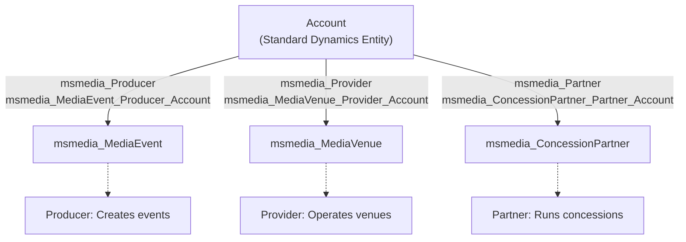

**Diagram: Account Entity Multi-Role Integration**

### Producer Relationship

**Definition**: [Other/Relationships/Account.xml:37-70]()  
**Relationship Name**: `msmedia_MediaEvent_Producer_Account`  
**Attribute**: `msmedia_Producer`  
**Purpose**: Links MediaEvent to the Account (organization) producing the event

### Provider Relationship

**Definition**: [Other/Relationships/Account.xml:71-104]()  
**Relationship Name**: `msmedia_MediaVenue_Provider_Account`  
**Attribute**: `msmedia_Provider`  
**Purpose**: Links MediaVenue to the Account (organization) that operates the venue  
**IntroducedVersion**: `1.0.0.4`

### Partner Relationship

**Definition**: [Other/Relationships/Account.xml:3-36]()  
**Relationship Name**: `msmedia_ConcessionPartner_Partner_Account`  
**Attribute**: `msmedia_Partner`  
**Purpose**: Links ConcessionPartner to the Account (organization) operating concessions

### Relationship Characteristics

All three Account relationships share:
- **CascadeDelete**: `RemoveLink` - Deleting an Account does not delete related events/venues/partners
- **CascadeAssign/Share/Unshare**: `NoCascade` - No cascading behavior for security operations
- **IsValidForAdvancedFind**: `1` - Available in Advanced Find queries
- **NavPaneDisplayOption**: `UseCollectionName` - Shows related records in navigation

Sources: [Other/Relationships/Account.xml:1-105]()

---

## MediaEvent Core Relationships

The `msmedia_MediaEvent` entity has the most extensive set of relationships, serving as the central hub connecting events to attractions, registrations, schedules, and organizational structures.

### MediaEvent Relationship Inventory

| Child Entity | Relationship Name | Attribute | Introduced | Lines |
|--------------|-------------------|-----------|------------|-------|
| msmedia_EventAttraction | `msmedia_EventAttraction_MediaEvent_msmedi` | `msmedia_MediaEvent` | 1.0.0.6 | [71-104]() |
| msmedia_MediaRegistration | `msmedia_MediaRegistration_MediaEvent_msme` | `msmedia_MediaEvent` | 1.0 | [207-240]() |
| msmedia_AttractionTrack | `msmedia_AttractionTrack_MediaEvent_msmedi` | `msmedia_MediaEvent` | 1.0 | [3-36]() |
| msmedia_EventSchedule | `msmedia_EventSchedule_MediaEvent_msmedia_` | `msmedia_MediaEvent` | 1.0.0.9 | [105-138]() |
| msmedia_MediaRegistrationStatusLog | `msmedia_MediaRegistrationStatusLog_MediaE` | `msmedia_MediaEvent` | 1.0.0.14 | [241-274]() |
| msmedia_WeatherCondition | `msmedia_WeatherCondition_MediaEvent_msmed` | `msmedia_MediaEvent` | 1.0 | [275-308]() |
| msmedia_ConcessionPartner | `msmedia_ConcessionPartner_MediaEvent_msme` | `msmedia_MediaEvent` | 1.0 | [37-70]() |
| msmedia_Guest | `msmedia_Guest_LastRegisteredEvent_msmedia` | `msmedia_LastRegisteredEvent` | 1.0.2.6 | [139-172]() |
| msmedia_MediaEvent (self) | `msmedia_MediaEvent_ParentEvent_msmedia_Me` | `msmedia_ParentEvent` | 1.0 | [173-206]() |

**Table: MediaEvent Relationships**

### MediaEvent Relationship Flow

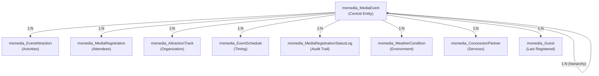

**Diagram: MediaEvent Relationship Structure**

Sources: [Other/Relationships/msmedia_MediaEvent.xml:1-309]()

---

## MediaVenue Core Relationships

The `msmedia_MediaVenue` entity represents physical locations and connects to facilities, concessions, gates, and operational details.

### MediaVenue Relationship Inventory

| Child Entity | Relationship Name | Attribute | Introduced | Lines |
|--------------|-------------------|-----------|------------|-------|
| msmedia_Facility | `msmedia_Facility_MediaVenue_msmedia_Media` | `msmedia_MediaVenue` | 1.0.0.4 | [105-138]() |
| msmedia_EventAttraction | `msmedia_EventAttraction_MediaVenue_msmedi` | `msmedia_MediaVenue` | 1.0.0.6 | [71-104]() |
| msmedia_concessionstand | `msmedia_concessionstand_MediaVenue_msmedi` | `msmedia_MediaVenue` | 1.0 | [37-70]() |
| msmedia_gate | `msmedia_gate_MediaVenue_msmedia_MediaVenu` | `msmedia_MediaVenue` | 1.0 | [139-172]() |
| msmedia_hoursofoperation | `msmedia_hoursofoperation_MediaVenue_msmed` | `msmedia_MediaVenue` | 1.0 | [173-206]() |
| msmedia_MediaVenueImage | `msmedia_MediaVenueImage_MediaVenue_msmedi` | `msmedia_MediaVenue` | 1.0.0.14 | [335-368]() |
| msmedia_WeatherCondition | `msmedia_WeatherCondition_MediaVenue_msmed` | `msmedia_MediaVenue` | 1.0 | [369-402]() |
| msmedia_MediaAsset | `msmedia_MediaAsset_MediaVenue_msmedia_Med` | `msmedia_MediaVenue` | 1.0.0.0 | [207-240]() |
| msmedia_Attraction | `msmedia_Attraction_MediaVenue_msmedia_Med` | `msmedia_MediaVenue` | 1.0.0.17 | [3-36]() |
| msmedia_MediaVenue (self) | `msmedia_MediaVenue_ParentVenue_msmedia_Me` | `msmedia_ParentVenue` | 1.0 | [301-334]() |

**Table: MediaVenue Relationships**

### Physical-to-Logical Hierarchy

```mermaid
graph TB
    MV["msmedia_MediaVenue<br/>(Physical Location)"]
    
    F["msmedia_Facility<br/>(Rooms/Spaces)"]
    CS["msmedia_concessionstand<br/>(Food Service)"]
    G["msmedia_gate<br/>(Entry Points)"]
    HO["msmedia_hoursofoperation<br/>(Schedule)"]
    
    D["msmedia_Dispenser<br/>(IoT Devices)"]
    GF["msmedia_gate<br/>(Facility Gates)"]
    
    MV -->|"Contains"| F
    MV -->|"Has"| CS
    MV -->|"Has"| G
    MV -->|"Operates"| HO
    
    F -->|"Contains"| D
    F -->|"Has"| GF
    
    Note["Physical hierarchy:<br/>Venue > Facility > Device"]
```

**Diagram: MediaVenue Physical Hierarchy**

Sources: [Other/Relationships/msmedia_MediaVenue.xml:1-403]()

---

## EventAttraction Relationships

The `msmedia_EventAttraction` entity acts as a junction between events, venues, and facilities, representing specific activities within events.

### EventAttraction Relationship Inventory

| Related Entity | Relationship Name | Attribute | Type | Lines |
|----------------|-------------------|-----------|------|-------|
| msmedia_AttractionSchedule | `msmedia_EventAttraction_msmedia_AttractionSchedul` | `msmedia_EventAttraction` | 1:N | [3-36]() |
| msmedia_MediaRegistration | `msmedia_EventAttraction_msmedia_MediaRegistration` | `msmedia_EventAttraction` | 1:N | [37-70]() |
| msmedia_MediaRegistrationStatusLog | `msmedia_EventAttraction_msmedia_MedRegStatusLog` | `msmedia_EventAttraction` | 1:N | [71-104]() |
| msmedia_hoursofoperation | `msmedia_hoursofoperation_EventAttraction` | `msmedia_EventAttraction` | 1:N | [105-138]() |

**Table: EventAttraction Relationships**

All EventAttraction relationships were introduced in version 1.0.0.6 except for `msmedia_hoursofoperation_EventAttraction` (version 1.0.3.0).

### Dual-Level Registration Model

```mermaid
graph TB
    ME["msmedia_MediaEvent"]
    EA["msmedia_EventAttraction"]
    MR1["msmedia_MediaRegistration<br/>(Event-level)"]
    MR2["msmedia_MediaRegistration<br/>(Attraction-level)"]
    
    ME -->|"Event contains Attractions"| EA
    ME -->|"msmedia_MediaEvent"| MR1
    EA -->|"msmedia_EventAttraction"| MR2
    
    Note["Registrations can be:<br/>1. Event-level only<br/>2. Attraction-level only<br/>3. Both (optional)"]
```

**Diagram: Dual-Level Registration Model**

The MediaRegistration entity has optional relationships to both MediaEvent and EventAttraction, supporting flexible registration scenarios where guests can register for entire events or specific attractions within events.

Sources: [Other/Relationships/msmedia_EventAttraction.xml:1-139]()

---

## MediaRegistration and Status Logging Relationships

The `msmedia_MediaRegistration` entity connects guests to events/attractions and maintains a complete audit trail through status logs.

### MediaRegistration Relationships

```mermaid
graph LR
    G["msmedia_Guest"]
    MR["msmedia_MediaRegistration"]
    ME["msmedia_MediaEvent"]
    EA["msmedia_EventAttraction"]
    SL["msmedia_MediaRegistrationStatusLog"]
    
    G -->|"msmedia_Guest"| MR
    MR -->|"msmedia_MediaEvent (optional)"| ME
    MR -->|"msmedia_EventAttraction (optional)"| EA
    MR -->|"1:N audit trail"| SL
    
    SL -->|"Also links to"| ME
    SL -->|"Also links to"| EA
```

**Diagram: MediaRegistration Relationship Network**

### Guest to Registration Relationship

**Relationship Name**: `msmedia_MediaRegistration_Guest_msmedia_G`  
**Definition**: [Other/Relationships/msmedia_Guest.xml:3-36]()  
**Attribute**: `msmedia_Guest`  
**IntroducedVersion**: `1.0.0.0`

This relationship links registrations to guest records, with `RemoveLink` ensuring that deleting a guest does not delete their registration history.

### Status Log Relationship

**Relationship Name**: `msmedia_MediaRegistrationStatusLog_MediaR`  
**Definition**: [Other/Relationships/msmedia_MediaRegistration.xml:3-36]()  
**Attribute**: `msmedia_MediaRegistration`  
**IntroducedVersion**: `1.0.0.14`

This one-to-many relationship creates an immutable audit trail. Each status change creates a new StatusLog record with:
- Link to parent MediaRegistration
- Link to associated MediaEvent (if applicable)
- Link to associated EventAttraction (if applicable)
- Timestamp range (validfrom/validto)

Sources: [Other/Relationships/msmedia_MediaRegistration.xml:1-37](), [Other/Relationships/msmedia_Guest.xml:1-37](), [Other/Relationships/msmedia_MediaEvent.xml:241-274](), [Other/Relationships/msmedia_EventAttraction.xml:71-104]()

---

## Facility and Infrastructure Relationships

The `msmedia_Facility` entity represents physical rooms and spaces within venues, with relationships to devices and gates.

### Facility Relationship Structure

```mermaid
graph TB
    MV["msmedia_MediaVenue"]
    F["msmedia_Facility"]
    EA["msmedia_EventAttraction"]
    D["msmedia_Dispenser"]
    G["msmedia_gate"]
    
    MV -->|"Venue contains Facilities"| F
    F -->|"Used by Attractions"| EA
    F -->|"Contains IoT Devices"| D
    F -->|"Has Access Gates"| G
    
    Note["Facility serves as physical<br/>infrastructure layer"]
```

**Diagram: Facility Relationship Structure**

### Facility Relationships Detail

| Child Entity | Relationship Name | Purpose | Lines |
|--------------|-------------------|---------|-------|
| msmedia_Dispenser | `msmedia_Dispenser_Facility_msmedia_Facili` | Links IoT devices to facilities | [3-36]() |
| msmedia_EventAttraction | `msmedia_EventAttraction_Facility_msmedia_` | Assigns attractions to facilities | [37-70]() |
| msmedia_gate | `msmedia_gate_Facility_msmedia_Facility` | Associates gates with facilities | [71-104]() |

**Table: Facility Relationships**

All three relationships use:
- **CascadeDelete**: `RemoveLink`
- **IntroducedVersion**: Between 1.0.0.4 and 1.0.2.7
- **IsValidForAdvancedFind**: `1`

Sources: [Other/Relationships/msmedia_Facility.xml:1-105]()

---

## Navigation Property Naming Conventions

All relationships define navigation properties that enable traversal in both directions. The system uses a consistent naming pattern based on the relationship name and role.

### Navigation Property Pattern

```mermaid
graph LR
    Parent["Referenced Entity<br/>(Parent)"]
    Child["Referencing Entity<br/>(Child)"]
    
    Parent -->|"Navigation Property (Parent side):<br/>{ReferencingEntity}_{ReferencedEntity}_{AttributeName}"| Child
    Child -->|"Navigation Property (Child side):<br/>{AttributeName}"| Parent
    
    Example1["msmedia_MediaEvent"]
    Example2["msmedia_EventAttraction"]
    
    Example1 -->|"Parent side:<br/>msmedia_EventAttraction_MediaEvent_msmedi"| Example2
    Example2 -->|"Child side:<br/>msmedia_MediaEvent"| Example1
```

**Diagram: Navigation Property Naming Pattern**

### Navigation Property Examples

| Relationship | Parent Navigation Property | Child Navigation Property | File Reference |
|--------------|---------------------------|--------------------------|----------------|
| MediaEvent → EventAttraction | `msmedia_EventAttraction_MediaEvent_msmedi` | `msmedia_MediaEvent` | [Other/Relationships/msmedia_MediaEvent.xml:100-101]() |
| MediaVenue → Facility | `msmedia_Facility_MediaVenue_msmedia_Media` | `msmedia_MediaVenue` | [Other/Relationships/msmedia_MediaVenue.xml:134-135]() |
| EventAttraction → MediaRegistration | `msmedia_EventAttraction_msmedia_MediaRegistration` | `msmedia_EventAttraction` | [Other/Relationships/msmedia_EventAttraction.xml:66-67]() |
| Guest → MediaRegistration | `msmedia_MediaRegistration_Guest_msmedia_G` | `msmedia_Guest` | [Other/Relationships/msmedia_Guest.xml:32-33]() |

**Table: Navigation Property Examples**

### Relationship Roles

Each relationship defines two roles through `EntityRelationshipRole` elements:

1. **RelationshipRoleType: 1** (Child/Referencing side)
   - Contains the `NavigationPropertyName` for traversing from child to parent
   - Specifies `NavPaneDisplayOption`, `NavPaneArea`, and `NavPaneOrder` for UI display
   - Example: [Other/Relationships/msmedia_MediaEvent.xml:92-97]()

2. **RelationshipRoleType: 0** (Parent/Referenced side)
   - Contains the `NavigationPropertyName` for traversing from parent to children
   - Example: [Other/Relationships/msmedia_MediaEvent.xml:99-102]()

Sources: [Other/Relationships/msmedia_MediaEvent.xml:23-35](), [Other/Relationships/msmedia_MediaVenue.xml:23-35](), [Other/Relationships/msmedia_EventAttraction.xml:23-35]()

---

## Relationship Versioning and Evolution

The `IntroducedVersion` attribute tracks when each relationship was added to the solution, providing insight into the system's evolution.

### Version Timeline

| Version | Relationships Introduced | Examples |
|---------|--------------------------|----------|
| 1.0 | Initial core relationships | MediaEvent-MediaRegistration, MediaVenue-concessionstand, MediaEvent-ParentEvent |
| 1.0.0.0 | Guest integration | MediaRegistration-Guest, MediaAsset-MediaVenue |
| 1.0.0.3 | Scheduling | AttractionSchedule relationships |
| 1.0.0.4 | Facility integration | MediaVenue-Facility, gate-Facility, MediaVenue-Provider |
| 1.0.0.6 | EventAttraction expansion | EventAttraction-MediaEvent, EventAttraction-MediaVenue, EventAttraction-Facility |
| 1.0.0.9 | Event scheduling | EventSchedule-MediaEvent |
| 1.0.0.14 | Status logging | MediaRegistrationStatusLog relationships, MediaVenueImage-MediaVenue |
| 1.0.0.17 | Attraction templates | Attraction-MediaVenue |
| 1.0.0.25 | TMA integration | TMA entity relationships |
| 1.0.2.6 | Guest tracking | Guest-LastRegisteredEvent |
| 1.0.2.7 | IoT devices | Dispenser-Facility |
| 1.0.3.0 | Attraction hours | hoursofoperation-EventAttraction |

**Table: Relationship Version History**

### Version Analysis

```mermaid
timeline
    title Relationship Evolution Timeline
    1.0 : Core entities
         : MediaEvent
         : MediaVenue
         : MediaRegistration
    1.0.0.4 : Physical infrastructure
            : Facility
            : Provider integration
    1.0.0.6 : EventAttraction
            : Junction entity
    1.0.0.14 : Audit logging
             : Status tracking
    1.0.2.7 : IoT integration
            : Dispenser devices
```

**Diagram: Major Version Milestones**

The progression shows a clear evolution from basic event-venue relationships (1.0) through physical infrastructure (1.0.0.4), activity management (1.0.0.6), comprehensive audit logging (1.0.0.14), and finally IoT device integration (1.0.2.7).

Sources: [Other/Relationships/msmedia_MediaEvent.xml:6-244](), [Other/Relationships/msmedia_MediaVenue.xml:6-338](), [Other/Relationships/msmedia_EventAttraction.xml:6-108](), [Other/Relationships/msmedia_Facility.xml:6-74]()

---

## Relationship Configuration Summary

### Universal Relationship Properties

All relationships in the system share these configuration elements:

```xml
<IsCustomizable>1</IsCustomizable>
<IsHierarchical>0</IsHierarchical>
<CascadeAssign>NoCascade</CascadeAssign>
<CascadeDelete>RemoveLink</CascadeDelete>
<CascadeReparent>NoCascade</CascadeReparent>
<CascadeShare>NoCascade</CascadeShare>
<CascadeUnshare>NoCascade</CascadeUnshare>
<CascadeRollupView>NoCascade</CascadeRollupView>
<IsValidForAdvancedFind>1</IsValidForAdvancedFind>
```

**Key Properties:**
- **IsCustomizable: 1** - Relationships can be customized in target environments
- **IsHierarchical: 0** - No relationships use Dynamics 365 hierarchical features (even self-referencing ones)
- **IsValidForAdvancedFind: 1** - All relationships available in Advanced Find for custom queries

### Standard Relationship Elements

Every relationship definition includes:

1. **Entity names**: `ReferencingEntityName` (child) and `ReferencedEntityName` (parent)
2. **Attribute name**: `ReferencingAttributeName` - the lookup field on the child entity
3. **Cascade configuration**: Six cascade behavior settings
4. **Navigation properties**: Bidirectional traversal names
5. **UI metadata**: Navigation pane display options
6. **Versioning**: `IntroducedVersion` for change tracking
7. **Localization**: `RelationshipDescription` with language code 1033 (English)

Sources: [Other/Relationships/msmedia_MediaEvent.xml:3-36](), [Other/Relationships/msmedia_MediaVenue.xml:3-36](), [Other/Relationships/msmedia_EventAttraction.xml:3-36]()17:T5f86,# Core Business Entities

<details>
<summary>Relevant source files</summary>

The following files were used as context for generating this wiki page:

- [Entities/msmedia_Attraction/Entity.xml](Entities/msmedia_Attraction/Entity.xml)
- [Entities/msmedia_AttractionTrack/Entity.xml](Entities/msmedia_AttractionTrack/Entity.xml)
- [Entities/msmedia_Dispenser/Entity.xml](Entities/msmedia_Dispenser/Entity.xml)
- [Entities/msmedia_EventAttraction/Entity.xml](Entities/msmedia_EventAttraction/Entity.xml)
- [Entities/msmedia_Facility/Entity.xml](Entities/msmedia_Facility/Entity.xml)
- [Entities/msmedia_MediaEvent/Entity.xml](Entities/msmedia_MediaEvent/Entity.xml)
- [Entities/msmedia_MediaRegistration/Entity.xml](Entities/msmedia_MediaRegistration/Entity.xml)
- [Entities/msmedia_TMA/Entity.xml](Entities/msmedia_TMA/Entity.xml)
- [Entities/msmedia_WeatherCondition/Entity.xml](Entities/msmedia_WeatherCondition/Entity.xml)
- [Other/Relationships/Account.xml](Other/Relationships/Account.xml)
- [Other/Relationships/SystemUser.xml](Other/Relationships/SystemUser.xml)
- [Other/Relationships/msmedia_EventAttraction.xml](Other/Relationships/msmedia_EventAttraction.xml)
- [Other/Relationships/msmedia_Facility.xml](Other/Relationships/msmedia_Facility.xml)
- [Other/Relationships/msmedia_Guest.xml](Other/Relationships/msmedia_Guest.xml)
- [Other/Relationships/msmedia_MediaEvent.xml](Other/Relationships/msmedia_MediaEvent.xml)
- [Other/Relationships/msmedia_MediaRegistration.xml](Other/Relationships/msmedia_MediaRegistration.xml)
- [Other/Relationships/msmedia_MediaVenue.xml](Other/Relationships/msmedia_MediaVenue.xml)

</details>


## Purpose and Scope

This document describes the four primary business entities that form the foundation of the MediaEventsVenues system: `msmedia_MediaEvent`, `msmedia_MediaVenue`, `msmedia_EventAttraction`, and `msmedia_MediaRegistration`. These entities represent the core domain concepts of events, physical locations, scheduled activities, and attendee tracking.

For information about entity relationships and cascade behaviors, see [Entity Relationships](#2.1). For organizational entities like `msmedia_AttractionTrack` and scheduling entities, see [Organizational Entities](#2.3). For physical infrastructure entities like `msmedia_Facility` and `msmedia_Dispenser`, see [Infrastructure Entities](#2.4).

---

## Entity Relationship Overview

The following diagram shows how the four core business entities relate to each other and to key supporting entities:

```mermaid
graph TD
    ME["msmedia_MediaEvent<br/>(Event Entity)"]
    MV["msmedia_MediaVenue<br/>(Venue Entity)"]
    EA["msmedia_EventAttraction<br/>(EventAttraction Entity)"]
    MR["msmedia_MediaRegistration<br/>(MediaRegistration Entity)"]
    
    ACC["Account<br/>(Producer/Provider)"]
    GST["msmedia_Guest"]
    ATT["msmedia_Attraction<br/>(Template)"]
    FAC["msmedia_Facility"]
    TRACK["msmedia_AttractionTrack"]
    
    ACC -->|"msmedia_Producer"| ME
    ACC -->|"msmedia_Provider"| MV
    
    ME -->|"msmedia_PrimaryVenue<br/>(1:N)"| MV
    ME -.->|"M:N via<br/>IntersectEntity"| MV
    ME -->|"1:N"| EA
    ME -->|"1:N"| MR
    ME -->|"msmedia_ParentEvent<br/>(Self-reference)"| ME
    ME -->|"1:N"| TRACK
    
    EA -->|"msmedia_MediaEvent<br/>(N:1)"| ME
    EA -->|"msmedia_MediaVenue<br/>(N:1)"| MV
    EA -->|"msmedia_Facility<br/>(N:1)"| FAC
    EA -->|"msmedia_Attraction<br/>(N:1)"| ATT
    EA -->|"1:N"| MR
    EA -->|"msmedia_EventAttractionTrack<br/>(N:1)"| TRACK
    
    MV -->|"1:N"| FAC
    MV -->|"msmedia_ParentVenue<br/>(Self-reference)"| MV
    
    MR -->|"msmedia_MediaEvent<br/>(N:1)"| ME
    MR -->|"msmedia_EventAttraction<br/>(N:1)"| EA
    MR -->|"msmedia_Guest<br/>(N:1)"| GST
```

**Sources:** [Other/Relationships/msmedia_MediaEvent.xml](), [Other/Relationships/msmedia_MediaVenue.xml](), [Other/Relationships/msmedia_EventAttraction.xml](), [Other/Relationships/Account.xml](), [Other/Relationships/msmedia_Guest.xml]()

---

## msmedia_MediaEvent

### Entity Definition

The `msmedia_MediaEvent` entity represents a scheduled occurrence that a Producer or Operator can publish and offer limited access to by Guests and Customers. It serves as the top-level container for event activities, registrations, and scheduling.

**Primary Key:** `msmedia_mediaeventid` [Entities/msmedia_MediaEvent/Entity.xml:1212-1227]()

**Entity Definition Location:** [Entities/msmedia_MediaEvent/Entity.xml:1-15]()

### Key Attributes

| Attribute Name | Type | Description | Required | Notes |
|----------------|------|-------------|----------|-------|
| `msmedia_name` | nvarchar(100) | Event name/title | System Required | Primary name field |
| `msmedia_Producer` | lookup | Account that produces the event | None | References Account entity |
| `msmedia_PrimaryVenue` | lookup | Main venue for the event | None | References msmedia_MediaVenue |
| `msmedia_Capacity` | int | Maximum attendee capacity | None | [Entities/msmedia_MediaEvent/Entity.xml:470-509]() |
| `msmedia_issoldout` | bit (boolean) | Indicates if event is at capacity | None | [Entities/msmedia_MediaEvent/Entity.xml:1045-1084]() |
| `msmedia_registrationopenson` | datetime | Registration start date/time | None | [Entities/msmedia_MediaEvent/Entity.xml:1449-1488]() |
| `msmedia_registrationcloseson` | datetime | Registration end date/time | None | [Entities/msmedia_MediaEvent/Entity.xml:1408-1447]() |
| `msmedia_BarcodeEnabled` | bit (boolean) | Enable barcode scanning | None | Default: No [Entities/msmedia_MediaEvent/Entity.xml:409-469]() |
| `msmedia_numberregistered` | int | Count of registered attendees | None | Rollup field [Entities/msmedia_MediaEvent/Entity.xml:1250-1289]() |
| `msmedia_numberattended` | int | Count of checked-in attendees | None | Rollup field [Entities/msmedia_MediaEvent/Entity.xml:1209-1248]() |
| `msmedia_IsPublished` | bit (boolean) | Event publication status | None | [Entities/msmedia_MediaEvent/Entity.xml:1086-1125]() |
| `msmedia_AttendeeAgendaEnabled` | bit (boolean) | Enable attendee agenda feature | None | [Entities/msmedia_MediaEvent/Entity.xml:371-407]() |
| `statecode` | state | Record state (Active/Inactive) | System Required | Standard Dynamics field |
| `statuscode` | status | Record status reason | None | Standard Dynamics field |

**Sources:** [Entities/msmedia_MediaEvent/Entity.xml:1-2000]()

### Calculated and Rollup Fields

The `msmedia_MediaEvent` entity includes two rollup fields that aggregate data from related `msmedia_MediaRegistration` records:

- **msmedia_numberregistered**: Counts all registrations linked to the event
- **msmedia_numberattended**: Counts registrations where `msmedia_IsCheckedIn = true`

These fields are automatically updated by the Dynamics 365 platform when registration records change, providing real-time attendance metrics.

**Sources:** [Entities/msmedia_MediaEvent/Entity.xml:1209-1289]()

### Hierarchical Structure

The entity supports hierarchical event structures through a self-referencing relationship:

- **Relationship Name**: `msmedia_MediaEvent_ParentEvent_msmedia_Me`
- **Attribute**: `msmedia_ParentEvent`
- **Cascade Delete**: RemoveLink (preserves child events)

This allows events to be organized in parent-child relationships, such as a multi-day conference with daily sessions as child events.

**Sources:** [Other/Relationships/msmedia_MediaEvent.xml:173-206]()

### Venue Associations

`msmedia_MediaEvent` has a dual relationship with `msmedia_MediaVenue`:

1. **Primary Venue** (1:N): Single primary location via `msmedia_PrimaryVenue` lookup field
2. **Many-to-Many**: Multiple venues via intersection entity `msmedia_MediaEvent_msmedia_MediaVenue`

This enables events to have a designated main venue while also being associated with multiple locations.

**Sources:** [Other/Relationships/msmedia_MediaVenue.xml:241-300]()

---

## msmedia_MediaVenue

### Entity Definition

The `msmedia_MediaVenue` entity represents physical locations where events and attractions take place. Venues are provided by Account records and contain facilities, gates, and concession stands.

**Key Characteristics:**
- Managed by a Provider (Account entity reference)
- Contains multiple Facilities (rooms, spaces)
- Supports hierarchical organization via parent-child relationships
- Associated with multiple events through M:N relationship

### Relationships

```mermaid
graph LR
    MV["msmedia_MediaVenue"]
    
    ACC["Account<br/>(msmedia_Provider)"]
    FAC["msmedia_Facility"]
    EA["msmedia_EventAttraction"]
    CS["msmedia_concessionstand"]
    GATE["msmedia_gate"]
    HRS["msmedia_hoursofoperation"]
    ATT["msmedia_Attraction"]
    IMG["msmedia_MediaVenueImage"]
    
    ACC -->|"1:N<br/>Provider"| MV
    MV -->|"1:N"| FAC
    MV -->|"1:N"| EA
    MV -->|"1:N"| CS
    MV -->|"1:N"| GATE
    MV -->|"1:N"| HRS
    MV -->|"1:N"| ATT
    MV -->|"1:N"| IMG
    MV -->|"msmedia_ParentVenue<br/>(Self)"| MV
```

**Sources:** [Other/Relationships/msmedia_MediaVenue.xml:1-402]()

### Key Relationships

| Relationship | Type | Target Entity | Cascade Delete | Purpose |
|--------------|------|---------------|----------------|---------|
| `msmedia_MediaVenue_Provider_Account` | N:1 | Account | RemoveLink | Venue provider/operator |
| `msmedia_Facility_MediaVenue_msmedia_Media` | 1:N | msmedia_Facility | RemoveLink | Physical spaces in venue |
| `msmedia_MediaEvent_msmedia_MediaVenue_msm` | M:N | msmedia_MediaEvent | N/A | Events at venue |
| `msmedia_MediaEvent_PrimaryVenue_msmedia_M` | 1:N | msmedia_MediaEvent | RemoveLink | Primary venue for events |
| `msmedia_EventAttraction_MediaVenue_msmedi` | 1:N | msmedia_EventAttraction | RemoveLink | Attractions at venue |
| `msmedia_concessionstand_MediaVenue_msmedi` | 1:N | msmedia_concessionstand | RemoveLink | Food/beverage stands |
| `msmedia_gate_MediaVenue_msmedia_MediaVenu` | 1:N | msmedia_gate | RemoveLink | Entry/exit gates |
| `msmedia_MediaVenue_ParentVenue_msmedia_Me` | 1:N | msmedia_MediaVenue | RemoveLink | Hierarchical venues |

All relationships use `RemoveLink` cascade delete behavior to preserve historical data when a venue is deleted.

**Sources:** [Other/Relationships/msmedia_MediaVenue.xml:3-402]()

### Hierarchical Organization

The self-referencing `msmedia_ParentVenue` relationship [Other/Relationships/msmedia_MediaVenue.xml:301-334]() enables venues to be organized hierarchically. For example:
- Parent: "Convention Center Complex"
  - Child: "North Hall"
  - Child: "South Hall"
  - Child: "Outdoor Plaza"

---

## msmedia_EventAttraction

### Entity Definition

The `msmedia_EventAttraction` entity represents "an attraction that will appear within or is part of a scheduled event." It acts as a junction entity connecting events to specific activities, physical locations, and time slots. Each EventAttraction links an event-specific instance to a reusable attraction template.

**Primary Key:** `msmedia_eventattractionid` [Entities/msmedia_EventAttraction/Entity.xml:631-667]()

**Auto-Number Field:** `msmedia_eventattractionnumber` with format `EA-{SEQNUM:4}` [Entities/msmedia_EventAttraction/Entity.xml:668-707]()

**Entity Definition Location:** [Entities/msmedia_EventAttraction/Entity.xml:1-15]()

### Key Attributes

| Attribute Name | Type | Description | Required | Notes |
|----------------|------|-------------|----------|-------|
| `msmedia_name` | nvarchar(100) | Attraction instance name | System Required | Primary name field |
| `msmedia_MediaEvent` | lookup | Parent event | None | [Entities/msmedia_EventAttraction/Entity.xml:736-775]() |
| `msmedia_Attraction` | lookup | Template attraction | Required | [Entities/msmedia_EventAttraction/Entity.xml:292-329]() |
| `msmedia_MediaVenue` | lookup | Venue location | None | [Entities/msmedia_EventAttraction/Entity.xml:776-815]() |
| `msmedia_Facility` | lookup | Specific room/space | None | [Entities/msmedia_EventAttraction/Entity.xml:708-735]() |
| `msmedia_StartDate` | datetime | Attraction start time | None | User timezone behavior [Entities/msmedia_EventAttraction/Entity.xml:551-590]() |
| `msmedia_EndDate` | datetime | Attraction end time | None | User timezone behavior [Entities/msmedia_EventAttraction/Entity.xml:551-590]() |
| `msmedia_AvailableTicketQuantity` | decimal | Tickets remaining | None | **Calculated field** [Entities/msmedia_EventAttraction/Entity.xml:370-410]() |
| `msmedia_IsMainAttraction` | bit | Main attraction flag | None | [Entities/msmedia_EventAttraction/Entity.xml:816-855]() |
| `msmedia_numberregistered` | int | Count of registrations | None | Rollup field [Entities/msmedia_EventAttraction/Entity.xml:930-969]() |
| `msmedia_numberattended` | int | Count of check-ins | None | Rollup field [Entities/msmedia_EventAttraction/Entity.xml:889-928]() |
| `msmedia_EventAttractionTrack` | lookup | Thematic grouping | None | [Entities/msmedia_EventAttraction/Entity.xml:708-747]() |

**Sources:** [Entities/msmedia_EventAttraction/Entity.xml:1-2000]()

### Calculated Field: Available Ticket Quantity

The `msmedia_AvailableTicketQuantity` field is a calculated field (SourceType=1) with the formula definition located at:

**Formula File:** `/Formulas/msmedia_eventattraction-msmedia_availableticketquantity.xaml` [Entities/msmedia_EventAttraction/Entity.xml:409]()

This field dynamically calculates remaining capacity based on total ticket allocation minus registered and pending attendees.

**Sources:** [Entities/msmedia_EventAttraction/Entity.xml:370-410]()

### Junction Entity Pattern

The `msmedia_EventAttraction` entity implements a junction pattern between four key entities:

```mermaid
graph TD
    EA["msmedia_EventAttraction<br/>(Junction Entity)"]
    
    ME["msmedia_MediaEvent<br/>(Which Event)"]
    ATT["msmedia_Attraction<br/>(What Activity)"]
    MV["msmedia_MediaVenue<br/>(Where - Venue)"]
    FAC["msmedia_Facility<br/>(Where - Specific Room)"]
    
    EA -->|"msmedia_MediaEvent<br/>(Required Link)"| ME
    EA -->|"msmedia_Attraction<br/>(Required Link)"| ATT
    EA -->|"msmedia_MediaVenue<br/>(Optional)"| MV
    EA -->|"msmedia_Facility<br/>(Optional)"| FAC
    
    EA -->|"Has Scheduling<br/>Start/End Times"| EA
    EA -->|"Tracks Attendance<br/>numberregistered<br/>numberattended"| EA
```

This pattern allows:
- A reusable `msmedia_Attraction` template to be instantiated multiple times across different events
- Each instance to have unique scheduling (StartDate, EndDate)
- Different physical locations for the same attraction type
- Independent registration and attendance tracking

**Sources:** [Entities/msmedia_EventAttraction/Entity.xml:292-855](), [Other/Relationships/msmedia_EventAttraction.xml:1-139]()

### Time Zone Handling

The entity includes dual datetime fields for time zone management:

- `msmedia_EndDate` / `msmedia_StartDate`: Behavior = 3 (Time zone independent) [Entities/msmedia_EventAttraction/Entity.xml:583]()
- `msmedia_EndDateUserLocal` / `msmedia_StartDateUserLocal`: Behavior = 1 (User local time) [Entities/msmedia_EventAttraction/Entity.xml:623]()

This dual-field approach ensures accurate scheduling across time zones while providing user-friendly local time displays.

**Sources:** [Entities/msmedia_EventAttraction/Entity.xml:551-630]()

---

## msmedia_MediaRegistration

### Entity Definition

The `msmedia_MediaRegistration` entity "represents the tracking of invited attendees for a particular event or attraction." It serves as the primary record of attendance, linking guests to events and/or specific attractions, and tracking registration status changes through an audit trail.

**Primary Key:** `msmedia_mediaregistrationid` [Entities/msmedia_MediaRegistration/Entity.xml:490-525]()

**Auto-Number Field:** `msmedia_registrationnumber` with format `REG-{SEQNUM:5}` [Entities/msmedia_MediaRegistration/Entity.xml:631-670]()

**Entity Definition Location:** [Entities/msmedia_MediaRegistration/Entity.xml:1-15]()

### Key Attributes

| Attribute Name | Type | Description | Required | Notes |
|----------------|------|-------------|----------|-------|
| `msmedia_name` | nvarchar(100) | Registration name | System Required | Auto-generated |
| `msmedia_MediaEvent` | lookup | Associated event | None | [Entities/msmedia_MediaRegistration/Entity.xml:443-482]() |
| `msmedia_EventAttraction` | lookup | Specific attraction | None | [Entities/msmedia_MediaRegistration/Entity.xml:370-407]() |
| `msmedia_Guest` | lookup | Registered guest | None | [Entities/msmedia_MediaRegistration/Entity.xml:433-470]() |
| `msmedia_Contact` | lookup | Associated contact | None | [Entities/msmedia_MediaRegistration/Entity.xml:331-369]() |
| `msmedia_registrationstatus` | optionset | Current status | None | [Entities/msmedia_MediaRegistration/Entity.xml:681-720]() |
| `msmedia_registeredon` | datetime | Registration timestamp | None | [Entities/msmedia_MediaRegistration/Entity.xml:640-679]() |
| `msmedia_IsCheckedIn` | bit | Check-in status | None | [Entities/msmedia_MediaRegistration/Entity.xml:488-527]() |
| `msmedia_IsWaitlisted` | bit | Waitlist status | None | [Entities/msmedia_MediaRegistration/Entity.xml:528-567]() |
| `msmedia_RegistrationType` | optionset | Registration type | None | [Entities/msmedia_MediaRegistration/Entity.xml:721-760]() |

**Sources:** [Entities/msmedia_MediaRegistration/Entity.xml:1-1000]()

### Dual Registration Model

The entity supports a dual registration model where a registration can be associated with:

1. **Event-level registration**: Via `msmedia_MediaEvent` lookup only
2. **Attraction-level registration**: Via both `msmedia_EventAttraction` and `msmedia_MediaEvent` lookups
3. **Both levels**: Using all three fields for granular tracking

This flexibility allows:
- General event registration without specific attraction assignments
- Specific attraction sessions with automatic event association
- Detailed tracking of which attractions guests attend within an event

**Relationship Definitions:**
- [Other/Relationships/msmedia_MediaEvent.xml:207-240]() - Event to Registration
- [Other/Relationships/msmedia_EventAttraction.xml:37-70]() - Attraction to Registration

**Sources:** [Entities/msmedia_MediaRegistration/Entity.xml:370-482]()

### Status Management and Audit Trail

The registration status is managed through two related mechanisms:

1. **Current Status Field**: `msmedia_registrationstatus` (optionset) [Entities/msmedia_MediaRegistration/Entity.xml:681-720]()
2. **Status Log**: Related `msmedia_MediaRegistrationStatusLog` records for audit trail

```mermaid
graph LR
    MR["msmedia_MediaRegistration"]
    SL["msmedia_MediaRegistrationStatusLog"]
    
    MR -->|"1:N<br/>Status History"| SL
    
    MR -->|"Current Status<br/>msmedia_registrationstatus"| MR
    SL -->|"Historical Status<br/>msmedia_RegistrationStatus"| SL
    SL -->|"Timestamp<br/>msmedia_validfrom<br/>msmedia_validto"| SL
```

The status log relationship uses `RemoveLink` cascade delete to preserve historical records even if the registration is deleted.

**Sources:** [Other/Relationships/msmedia_MediaRegistration.xml:3-36]()

### Workflow Integration

The `msmedia_MediaRegistration` entity is central to the system's workflow automation:

- **Validation Workflow**: `WF-MediaRegistration-RulesforGuesttoSignupforEvent` validates registration eligibility
- **Status Logging Workflow**: `WF-MediaRegistration-Auto-CreateStatusLog` creates audit records on status changes
- **Rollup Impact**: Changes trigger recalculation of `msmedia_numberregistered` and `msmedia_numberattended` on parent Event and EventAttraction entities

These workflows are documented in detail in [Registration Validation Workflow](#3.1) and [Status Logging Workflow](#3.2).

**Sources:** [Entities/msmedia_MediaRegistration/Entity.xml:1-2000]()

---

## Core Entity Integration Pattern

The following diagram shows how all four core entities work together in a typical event lifecycle:

```mermaid
sequenceDiagram
    participant Producer as Account<br/>(Producer)
    participant ME as msmedia_MediaEvent
    participant MV as msmedia_MediaVenue
    participant EA as msmedia_EventAttraction
    participant Guest as msmedia_Guest
    participant MR as msmedia_MediaRegistration
    
    Producer->>ME: Create event<br/>(msmedia_Producer)
    Producer->>MV: Select primary venue<br/>(msmedia_PrimaryVenue)
    ME->>ME: Set registration windows<br/>(registrationopenson/closeson)
    
    Producer->>EA: Create attraction instance
    EA->>ME: Link to event<br/>(msmedia_MediaEvent)
    EA->>MV: Link to venue<br/>(msmedia_MediaVenue)
    EA->>EA: Set schedule<br/>(StartDate/EndDate)
    
    Guest->>MR: Request registration
    MR->>ME: Link to event<br/>(msmedia_MediaEvent)
    MR->>EA: Link to attraction<br/>(msmedia_EventAttraction)
    MR->>MR: Validation workflow executes
    
    alt Registration Valid
        MR->>MR: Set status = Registered
        MR->>ME: Increment numberregistered
        MR->>EA: Increment numberregistered
        EA->>EA: Recalculate AvailableTicketQuantity
    else Registration Invalid
        MR->>MR: Set status = Canceled
    end
    
    Guest->>MR: Check in at event
    MR->>MR: Set IsCheckedIn = true
    MR->>ME: Increment numberattended
    MR->>EA: Increment numberattended
```

**Sources:** [Other/Relationships/msmedia_MediaEvent.xml](), [Other/Relationships/msmedia_MediaVenue.xml](), [Other/Relationships/msmedia_EventAttraction.xml](), [Other/Relationships/msmedia_MediaRegistration.xml]()

---

## Common Patterns Across Core Entities

### Standard Field Patterns

All four core entities include the following standard Dynamics 365 fields:

| Field | Type | Purpose |
|-------|------|---------|
| `createdby` | lookup | User who created the record (SystemUser) |
| `createdon` | datetime | Creation timestamp |
| `modifiedby` | lookup | User who last modified the record |
| `modifiedon` | datetime | Last modification timestamp |
| `ownerid` | owner | Record owner (User or Team) |
| `statecode` | state | Active (0) or Inactive (1) |
| `statuscode` | status | Detailed status reason |

**Cascade Behavior:** All SystemUser relationships use `CascadeDelete: NoCascade` to preserve audit trails [Other/Relationships/SystemUser.xml:1-1000]()

**Sources:** [Entities/msmedia_MediaEvent/Entity.xml:16-331](), [Entities/msmedia_EventAttraction/Entity.xml:16-291](), [Entities/msmedia_MediaRegistration/Entity.xml:16-291]()

### Lookup Field Naming Convention

All lookup fields follow the pattern of using the target entity name without the `msmedia_` prefix as the field name:
- `msmedia_MediaEvent` field references the `msmedia_MediaEvent` entity
- `msmedia_EventAttraction` field references the `msmedia_EventAttraction` entity
- `msmedia_Guest` field references the `msmedia_Guest` entity

This creates consistent, predictable field names across the schema.

### RemoveLink Cascade Pattern

All relationships between core entities use `CascadeDelete: RemoveLink`, which:
- Sets the lookup field to null when the referenced record is deleted
- Preserves child records for historical reporting
- Prevents orphaned records while maintaining data integrity

This is a deliberate architectural choice to support audit requirements and historical analysis.

**Sources:** [Other/Relationships/msmedia_MediaEvent.xml](), [Other/Relationships/msmedia_MediaVenue.xml](), [Other/Relationships/msmedia_EventAttraction.xml]()

---

## Summary Table

| Entity | Primary Purpose | Key Relationships | Auto-Number Format | Calculated Fields |
|--------|----------------|-------------------|-------------------|-------------------|
| `msmedia_MediaEvent` | Event container | Producer (Account), Venues (M:N), EventAttractions (1:N), Registrations (1:N) | N/A | 2 rollup fields for attendance |
| `msmedia_MediaVenue` | Physical location | Provider (Account), Facilities (1:N), Events (M:N), EventAttractions (1:N) | N/A | None |
| `msmedia_EventAttraction` | Activity instance | Event (N:1), Venue (N:1), Facility (N:1), Attraction (N:1), Registrations (1:N) | `EA-{SEQNUM:4}` | AvailableTicketQuantity, 2 rollup fields |
| `msmedia_MediaRegistration` | Attendance record | Event (N:1), EventAttraction (N:1), Guest (N:1), Contact (N:1) | `REG-{SEQNUM:5}` | None |

**Sources:** [Entities/msmedia_MediaEvent/Entity.xml](), [Entities/msmedia_EventAttraction/Entity.xml](), [Entities/msmedia_MediaRegistration/Entity.xml](), [Other/Relationships/msmedia_MediaVenue.xml]()18:T42d1,# Organizational Entities

<details>
<summary>Relevant source files</summary>

The following files were used as context for generating this wiki page:

- [Entities/msmedia_Attraction/Entity.xml](Entities/msmedia_Attraction/Entity.xml)
- [Entities/msmedia_AttractionSchedule/SavedQueries/{59fdd3a9-1371-4674-bfca-d574693b260b}.xml](Entities/msmedia_AttractionSchedule/SavedQueries/{59fdd3a9-1371-4674-bfca-d574693b260b}.xml)
- [Entities/msmedia_AttractionSchedule/SavedQueries/{5f64994f-68fd-4f5a-9f3f-da828337bb44}.xml](Entities/msmedia_AttractionSchedule/SavedQueries/{5f64994f-68fd-4f5a-9f3f-da828337bb44}.xml)
- [Entities/msmedia_AttractionSchedule/SavedQueries/{86d8950a-9a73-41c2-8c8e-ee100123f466}.xml](Entities/msmedia_AttractionSchedule/SavedQueries/{86d8950a-9a73-41c2-8c8e-ee100123f466}.xml)
- [Entities/msmedia_AttractionSchedule/SavedQueries/{a55b56a7-989c-4e37-84de-77ce1fc6534f}.xml](Entities/msmedia_AttractionSchedule/SavedQueries/{a55b56a7-989c-4e37-84de-77ce1fc6534f}.xml)
- [Entities/msmedia_AttractionSchedule/SavedQueries/{dded02fa-54e0-45b7-9882-e3dd4520e2d1}.xml](Entities/msmedia_AttractionSchedule/SavedQueries/{dded02fa-54e0-45b7-9882-e3dd4520e2d1}.xml)
- [Entities/msmedia_AttractionSchedule/SavedQueries/{e80242f2-a744-4499-81d0-1a534a563191}.xml](Entities/msmedia_AttractionSchedule/SavedQueries/{e80242f2-a744-4499-81d0-1a534a563191}.xml)
- [Entities/msmedia_AttractionTrack/Entity.xml](Entities/msmedia_AttractionTrack/Entity.xml)
- [Entities/msmedia_Dispenser/Entity.xml](Entities/msmedia_Dispenser/Entity.xml)
- [Entities/msmedia_EventAttraction/Entity.xml](Entities/msmedia_EventAttraction/Entity.xml)
- [Entities/msmedia_Facility/Entity.xml](Entities/msmedia_Facility/Entity.xml)
- [Entities/msmedia_MediaEvent/Entity.xml](Entities/msmedia_MediaEvent/Entity.xml)
- [Entities/msmedia_MediaRegistration/Entity.xml](Entities/msmedia_MediaRegistration/Entity.xml)
- [Entities/msmedia_TMA/Entity.xml](Entities/msmedia_TMA/Entity.xml)
- [Entities/msmedia_WeatherCondition/Entity.xml](Entities/msmedia_WeatherCondition/Entity.xml)

</details>


## Purpose and Scope

This document describes the entities responsible for organizing, categorizing, and scheduling attractions within the MediaEventsVenues system. These entities provide structural hierarchy and temporal organization for event content. The four primary entities covered are:

- **msmedia_AttractionTrack** - Thematic grouping of attractions
- **msmedia_Attraction** - Reusable attraction templates
- **msmedia_EventSchedule** - Event-level scheduling
- **msmedia_AttractionSchedule** - Attraction-level scheduling

For information about the core event and venue entities that these organizational entities support, see [Core Business Entities](#2.2). For physical infrastructure entities such as facilities and dispensers, see [Infrastructure Entities](#2.4).

---

## Entity Relationship Overview

The organizational entities form a multi-layered structure that separates reusable templates from scheduled instances and provides both thematic and temporal organization.

```mermaid
graph TB
    subgraph "Thematic Organization"
        AT["msmedia_AttractionTrack<br/>(Theme/Category)"]
        A["msmedia_Attraction<br/>(Template)"]
    end
    
    subgraph "Core Event Entity"
        ME["msmedia_MediaEvent"]
    end
    
    subgraph "Scheduled Instances"
        EA["msmedia_EventAttraction<br/>(Scheduled Instance)"]
    end
    
    subgraph "Temporal Organization"
        ES["msmedia_EventSchedule<br/>(Event Timing)"]
        AS["msmedia_AttractionSchedule<br/>(Attraction Timing)"]
    end
    
    ME -->|"contains (1:N)"| EA
    ME -->|"organizes via (1:N)"| AT
    ME -->|"scheduled via (1:N)"| ES
    
    A -->|"instantiated as (1:N)"| EA
    AT -->|"groups (1:N)"| EA
    EA -->|"scheduled via (1:N)"| AS
    
    EA -.->|"uses template from"| A
    EA -.->|"categorized in"| AT
    
    style AT fill:#f9f9f9
    style A fill:#f9f9f9
    style ES fill:#f9f9f9
    style AS fill:#f9f9f9
```

**Sources:** [Entities/msmedia_AttractionTrack/Entity.xml:1-457](), [Entities/msmedia_Attraction/Entity.xml:1-700](), [Entities/msmedia_EventAttraction/Entity.xml:292-329,708-745](), High-level diagram analysis

---

## Attraction Track (msmedia_AttractionTrack)

### Purpose

The `msmedia_AttractionTrack` entity provides thematic categorization for attractions within an event. It enables event organizers to group related attractions by theme, target audience, or track designation (e.g., "Keynote Track", "Technical Workshop Track", "Family Activities").

### Schema Definition

| Field | Type | Required | Description |
|-------|------|----------|-------------|
| `msmedia_attractiontrackid` | primarykey | System | Unique identifier |
| `msmedia_name` | nvarchar(100) | Yes | Track name (e.g., "Developer Track") |
| `msmedia_description` | ntext(2000) | No | Detailed track description |
| `msmedia_mediaevent` | lookup | Yes | Parent event (1:N relationship) |
| `msmedia_ticketingrequired` | bit | No | Whether track requires separate ticketing |

**Sources:** [Entities/msmedia_AttractionTrack/Entity.xml:292-446]()

### Key Relationships

```mermaid
erDiagram
    msmedia_MediaEvent ||--o{ msmedia_AttractionTrack : "organizes via"
    msmedia_AttractionTrack ||--o{ msmedia_EventAttraction : "groups"
    
    msmedia_AttractionTrack {
        guid msmedia_attractiontrackid PK
        string msmedia_name
        ntext msmedia_description
        guid msmedia_mediaevent FK
        bool msmedia_ticketingrequired
    }
```

The relationship from `msmedia_EventAttraction` to `msmedia_AttractionTrack` is established through the `msmedia_eventattractiontrack` lookup field [Entities/msmedia_EventAttraction/Entity.xml:708-745](). This is an optional relationship (`RequiredLevel: none`), allowing attractions to exist without track assignment.

**Sources:** [Entities/msmedia_AttractionTrack/Entity.xml:368-406](), [Entities/msmedia_EventAttraction/Entity.xml:708-745]()

### Introduced Version

Version `1.0` - [Entities/msmedia_AttractionTrack/Entity.xml:30]()

---

## Attraction Template (msmedia_Attraction)

### Purpose

The `msmedia_Attraction` entity serves as a reusable template or master definition for attractions. It defines the canonical properties of an attraction that can be scheduled multiple times across different events or within the same event. This template-instance pattern enables:

1. **Reusability** - Define an attraction once, schedule it many times
2. **Consistency** - Maintain uniform attraction details across instances
3. **Centralized Management** - Update template to affect all future instances

### Schema Definition

| Field | Type | Required | Description |
|-------|------|----------|-------------|
| `msmedia_attractionid` | primarykey | System | Unique identifier |
| `msmedia_name` | nvarchar(100) | No | Attraction name |
| `msmedia_description` | ntext | No | Attraction description |
| `msmedia_mediavenue` | lookup | No | Associated venue |

**Sources:** [Entities/msmedia_Attraction/Entity.xml:292-700]()

### Template-Instance Pattern

The `msmedia_Attraction` entity acts as a template that is instantiated as `msmedia_EventAttraction` records. The relationship is established through the `msmedia_attraction` lookup field on `msmedia_EventAttraction`:

```mermaid
graph LR
    A["msmedia_Attraction<br/>(Template)<br/>e.g., 'Keynote Speaker Series'"]
    EA1["msmedia_EventAttraction<br/>(Instance 1)<br/>Tech Summit 2024"]
    EA2["msmedia_EventAttraction<br/>(Instance 2)<br/>Dev Days 2024"]
    EA3["msmedia_EventAttraction<br/>(Instance 3)<br/>Tech Summit 2025"]
    
    A -->|"instantiated as"| EA1
    A -->|"instantiated as"| EA2
    A -->|"instantiated as"| EA3
```

The `msmedia_attraction` field is marked as `RequiredLevel: required` [Entities/msmedia_EventAttraction/Entity.xml:296](), indicating every scheduled attraction must reference a template.

**Sources:** [Entities/msmedia_EventAttraction/Entity.xml:292-329](), [Entities/msmedia_Attraction/Entity.xml:1-700]()

### Introduced Version

Version `1.0` - [Entities/msmedia_Attraction/Entity.xml:29]()

---

## Event Schedule (msmedia_EventSchedule)

### Purpose

The `msmedia_EventSchedule` entity manages timing and scheduling information at the event level. While not directly included in the provided files, references from high-level architecture diagrams indicate it provides:

- Event start/end times
- Multi-day event schedules
- Overall event timing framework

### Relationship to Events

```mermaid
graph TB
    ME["msmedia_MediaEvent"]
    ES["msmedia_EventSchedule"]
    
    ME -->|"scheduled via (1:N)"| ES
    
    ES -->|"defines timing for"| ME
```

**Sources:** High-level architecture diagram (Diagram 2)

---

## Attraction Schedule (msmedia_AttractionSchedule)

### Purpose

The `msmedia_AttractionSchedule` entity provides fine-grained scheduling for individual attractions within an event. It enables:

1. **Multiple Sessions** - Schedule the same attraction at different times
2. **Capacity Management** - Track registration and capacity per session
3. **Detailed Timing** - Specific start times and durations for each session

### Schema Definition (Inferred from SavedQueries)

| Field | Type | Description |
|-------|------|-------------|
| `msmedia_attractionscheduleid` | primarykey | Unique identifier |
| `msmedia_name` | nvarchar | Schedule session name |
| `msmedia_eventattraction` | lookup | Parent attraction being scheduled |
| `msmedia_schedulenumber` | nvarchar | Auto-generated session number |
| `msmedia_startdatetime` | datetime | Session start time |
| `msmedia_capacity` | int | Session capacity |
| `msmedia_registrationcount` | int | Current registration count |

**Sources:** [Entities/msmedia_AttractionSchedule/SavedQueries/{59fdd3a9-1371-4674-bfca-d574693b260b}.xml:11-19]()

### Saved Query Views

The system provides multiple views for `msmedia_AttractionSchedule`:

| View Name | Query Type | Purpose | State Filter |
|-----------|------------|---------|--------------|
| Active Attraction Schedules | 0 (standard) | Default view | statecode = 0 |
| Inactive Attraction Schedules | 0 (standard) | Inactive view | statecode = 1 |
| Attraction Schedule Associated View | 2 (associated) | Related records subgrid | statecode = 0 |
| Attraction Schedule Advanced Find View | 1 (advanced find) | User searches | None |
| Attraction Schedule Lookup View | 64 (lookup) | Record selection | statecode = 0 |
| Quick Find Active Attraction Schedules | 4 (quick find) | Quick search | statecode = 0 |

All active views filter on `statecode = 0` [Entities/msmedia_AttractionSchedule/SavedQueries/{59fdd3a9-1371-4674-bfca-d574693b260b}.xml:29-31](), following the standard pattern described in [Query Design Patterns](#7.3).

**Sources:** [Entities/msmedia_AttractionSchedule/SavedQueries/{59fdd3a9-1371-4674-bfca-d574693b260b}.xml:1-45](), [Entities/msmedia_AttractionSchedule/SavedQueries/{5f64994f-68fd-4f5a-9f3f-da828337bb44}.xml:1-37](), [Entities/msmedia_AttractionSchedule/SavedQueries/{dded02fa-54e0-45b7-9882-e3dd4520e2d1}.xml:1-37](), [Entities/msmedia_AttractionSchedule/SavedQueries/{e80242f2-a744-4499-81d0-1a534a563191}.xml:1-34](), [Entities/msmedia_AttractionSchedule/SavedQueries/{a55b56a7-989c-4e37-84de-77ce1fc6534f}.xml:1-36](), [Entities/msmedia_AttractionSchedule/SavedQueries/{86d8950a-9a73-41c2-8c8e-ee100123f466}.xml:1-40]()

### Relationship to Event Attractions

```mermaid
graph TB
    EA["msmedia_EventAttraction<br/>e.g., 'Cloud Architecture Workshop'"]
    AS1["msmedia_AttractionSchedule<br/>Session 1: Monday 9:00 AM<br/>Capacity: 50<br/>Registered: 45"]
    AS2["msmedia_AttractionSchedule<br/>Session 2: Tuesday 2:00 PM<br/>Capacity: 50<br/>Registered: 32"]
    AS3["msmedia_AttractionSchedule<br/>Session 3: Wednesday 10:00 AM<br/>Capacity: 50<br/>Registered: 50"]
    
    EA -->|"scheduled via (1:N)"| AS1
    EA -->|"scheduled via (1:N)"| AS2
    EA -->|"scheduled via (1:N)"| AS3
```

Each `msmedia_AttractionSchedule` record links back to its parent `msmedia_EventAttraction` via the `msmedia_eventattraction` lookup field [Entities/msmedia_AttractionSchedule/SavedQueries/{59fdd3a9-1371-4674-bfca-d574693b260b}.xml:14,36]().

**Sources:** [Entities/msmedia_AttractionSchedule/SavedQueries/{59fdd3a9-1371-4674-bfca-d574693b260b}.xml:11-37]()

### Auto-Numbering

The `msmedia_schedulenumber` field uses auto-numbering to generate unique identifiers for schedule sessions. This follows the standard auto-numbering pattern seen elsewhere in the system (e.g., `msmedia_EventAttractionNumber` uses format `EA-{SEQNUM:4}` [Entities/msmedia_EventAttraction/Entity.xml:693]()).

**Sources:** [Entities/msmedia_AttractionSchedule/SavedQueries/{59fdd3a9-1371-4674-bfca-d574693b260b}.xml:15]()

### Introduced Version

Version `1.0.0.3` - [Entities/msmedia_AttractionSchedule/SavedQueries/{59fdd3a9-1371-4674-bfca-d574693b260b}.xml:40]()

---

## Complete Organizational Hierarchy

The following diagram illustrates the complete organizational and scheduling hierarchy from event definition through to individual scheduled sessions:

```mermaid
graph TB
    ME["msmedia_MediaEvent<br/>Tech Summit 2024"]
    
    AT1["msmedia_AttractionTrack<br/>Developer Track"]
    AT2["msmedia_AttractionTrack<br/>Business Track"]
    
    A1["msmedia_Attraction<br/>Cloud Architecture (Template)"]
    A2["msmedia_Attraction<br/>DevOps Best Practices (Template)"]
    
    EA1["msmedia_EventAttraction<br/>Cloud Architecture Workshop<br/>(Instance)"]
    EA2["msmedia_EventAttraction<br/>DevOps Workshop<br/>(Instance)"]
    
    AS1["msmedia_AttractionSchedule<br/>Mon 9AM - Capacity: 50"]
    AS2["msmedia_AttractionSchedule<br/>Tue 2PM - Capacity: 50"]
    AS3["msmedia_AttractionSchedule<br/>Wed 10AM - Capacity: 50"]
    
    ES["msmedia_EventSchedule<br/>3 Days: Jan 15-17"]
    
    ME -->|"contains"| EA1
    ME -->|"contains"| EA2
    ME -->|"organizes via"| AT1
    ME -->|"organizes via"| AT2
    ME -->|"scheduled via"| ES
    
    AT1 -->|"groups"| EA1
    AT1 -->|"groups"| EA2
    
    A1 -->|"instantiated as"| EA1
    A2 -->|"instantiated as"| EA2
    
    EA1 -->|"scheduled via"| AS1
    EA1 -->|"scheduled via"| AS2
    EA2 -->|"scheduled via"| AS3
```

**Key Observations:**

1. **Separation of Concerns** - Template (`msmedia_Attraction`) vs Instance (`msmedia_EventAttraction`) vs Schedule (`msmedia_AttractionSchedule`)
2. **Dual Organization** - Both thematic (via `msmedia_AttractionTrack`) and temporal (via schedules)
3. **Flexibility** - Multiple tracks, multiple schedule sessions per attraction
4. **Reusability** - Same template can be instantiated across different events

**Sources:** All entity files and architecture diagrams

---

## Common Patterns

### Naming Convention

All organizational entities follow the `msmedia_` prefix convention [Naming Conventions](#7.1):

- `msmedia_AttractionTrack`
- `msmedia_Attraction`
- `msmedia_EventSchedule`
- `msmedia_AttractionSchedule`

Each has a corresponding `msmedia_name` field as the primary identifier.

### State Management

All organizational entities implement standard state management with `statecode` and `statuscode` fields. Active records use `statecode = 0`, inactive records use `statecode = 1`. All active views filter on active state by default.

**Sources:** [Entities/msmedia_AttractionSchedule/SavedQueries/{59fdd3a9-1371-4674-bfca-d574693b260b}.xml:29-31](), [Entities/msmedia_AttractionSchedule/SavedQueries/{5f64994f-68fd-4f5a-9f3f-da828337bb44}.xml:26-28]()

### Audit Fields

All entities include standard audit fields:
- `createdby` (lookup to SystemUser)
- `createdon` (datetime)
- `modifiedby` (lookup to SystemUser)
- `modifiedon` (datetime)
- `createdonbehalfby` (lookup to SystemUser)
- `modifiedonbehalfby` (lookup to SystemUser)

**Sources:** [Entities/msmedia_AttractionTrack/Entity.xml:16-290](), [Entities/msmedia_Attraction/Entity.xml:16-290]()

### Capacity Tracking

The `msmedia_AttractionSchedule` entity includes both `msmedia_capacity` and `msmedia_registrationcount` fields, enabling real-time capacity monitoring. This supports the registration validation workflow described in [Registration Validation Workflow](#3.1).

**Sources:** [Entities/msmedia_AttractionSchedule/SavedQueries/{59fdd3a9-1371-4674-bfca-d574693b260b}.xml:17-18]()

---

## Integration Points

### With Core Business Entities

- `msmedia_MediaEvent` contains multiple `msmedia_EventAttraction` instances
- `msmedia_EventAttraction` references both `msmedia_Attraction` (template) and `msmedia_AttractionTrack` (categorization)
- Registration workflows (see [Business Processes and Workflows](#3)) operate on scheduled attractions

### With Registration System

The `msmedia_MediaRegistration` entity links to `msmedia_EventAttraction` [Entities/msmedia_MediaRegistration/Entity.xml:370-407](), which in turn has schedules via `msmedia_AttractionSchedule`. This enables session-level registration tracking.

**Sources:** [Entities/msmedia_MediaRegistration/Entity.xml:370-407](), High-level architecture diagrams19:T5d7b,# Infrastructure Entities

<details>
<summary>Relevant source files</summary>

The following files were used as context for generating this wiki page:

- [Entities/msmedia_Attraction/Entity.xml](Entities/msmedia_Attraction/Entity.xml)
- [Entities/msmedia_AttractionTrack/Entity.xml](Entities/msmedia_AttractionTrack/Entity.xml)
- [Entities/msmedia_Dispenser/Entity.xml](Entities/msmedia_Dispenser/Entity.xml)
- [Entities/msmedia_Dispenser/SavedQueries/{275a9488-2d94-4e32-852f-a7b357509bf8}.xml](Entities/msmedia_Dispenser/SavedQueries/{275a9488-2d94-4e32-852f-a7b357509bf8}.xml)
- [Entities/msmedia_Dispenser/SavedQueries/{2f59f62b-98cd-48f3-88eb-6772eb52a501}.xml](Entities/msmedia_Dispenser/SavedQueries/{2f59f62b-98cd-48f3-88eb-6772eb52a501}.xml)
- [Entities/msmedia_Dispenser/SavedQueries/{668d34ec-3d1c-4ec4-a594-49d428358b60}.xml](Entities/msmedia_Dispenser/SavedQueries/{668d34ec-3d1c-4ec4-a594-49d428358b60}.xml)
- [Entities/msmedia_Dispenser/SavedQueries/{8f0a7546-b317-4c26-a5f3-7997e52a2632}.xml](Entities/msmedia_Dispenser/SavedQueries/{8f0a7546-b317-4c26-a5f3-7997e52a2632}.xml)
- [Entities/msmedia_Dispenser/SavedQueries/{a3339dfb-8c12-463f-974a-31c8f9350fa5}.xml](Entities/msmedia_Dispenser/SavedQueries/{a3339dfb-8c12-463f-974a-31c8f9350fa5}.xml)
- [Entities/msmedia_Dispenser/SavedQueries/{edf38ad2-03cb-409f-b369-039c2e5f4467}.xml](Entities/msmedia_Dispenser/SavedQueries/{edf38ad2-03cb-409f-b369-039c2e5f4467}.xml)
- [Entities/msmedia_EventAttraction/Entity.xml](Entities/msmedia_EventAttraction/Entity.xml)
- [Entities/msmedia_Facility/Entity.xml](Entities/msmedia_Facility/Entity.xml)
- [Entities/msmedia_MediaEvent/Entity.xml](Entities/msmedia_MediaEvent/Entity.xml)
- [Entities/msmedia_MediaRegistration/Entity.xml](Entities/msmedia_MediaRegistration/Entity.xml)
- [Entities/msmedia_TMA/Entity.xml](Entities/msmedia_TMA/Entity.xml)
- [Entities/msmedia_WeatherCondition/Entity.xml](Entities/msmedia_WeatherCondition/Entity.xml)
- [Entities/msmedia_concessionstand/SavedQueries/{48b3be54-7273-4a5a-9239-1675a8548e85}.xml](Entities/msmedia_concessionstand/SavedQueries/{48b3be54-7273-4a5a-9239-1675a8548e85}.xml)
- [Entities/msmedia_concessionstand/SavedQueries/{6aab5d77-c660-424c-9f35-307be7399edc}.xml](Entities/msmedia_concessionstand/SavedQueries/{6aab5d77-c660-424c-9f35-307be7399edc}.xml)
- [Entities/msmedia_concessionstand/SavedQueries/{732b8377-42a6-46f1-ae3e-0cb8495e0880}.xml](Entities/msmedia_concessionstand/SavedQueries/{732b8377-42a6-46f1-ae3e-0cb8495e0880}.xml)
- [Entities/msmedia_concessionstand/SavedQueries/{7e4af061-c1cb-4256-a414-c2ebfbe66799}.xml](Entities/msmedia_concessionstand/SavedQueries/{7e4af061-c1cb-4256-a414-c2ebfbe66799}.xml)
- [Entities/msmedia_concessionstand/SavedQueries/{967c6f2a-eee4-4bfc-87a5-1eb56b647afb}.xml](Entities/msmedia_concessionstand/SavedQueries/{967c6f2a-eee4-4bfc-87a5-1eb56b647afb}.xml)
- [Entities/msmedia_concessionstand/SavedQueries/{db36ed10-07c1-44ca-8b58-00c4d37bf473}.xml](Entities/msmedia_concessionstand/SavedQueries/{db36ed10-07c1-44ca-8b58-00c4d37bf473}.xml)

</details>


## Purpose and Scope

This document describes the physical infrastructure entities that represent the tangible assets and spaces within the MediaEventsVenues system. These entities model the physical structures, equipment, and operational components required to host events.

Infrastructure entities covered:
- **msmedia_Facility** - Physical structures and rooms within venues
- **msmedia_Dispenser** - IoT-enabled beverage/liquid dispensing devices
- **msmedia_concessionstand** - Food and beverage retail locations
- **msmedia_gate** - Entry/exit points and access control locations
- **msmedia_hoursofoperation** - Operating schedules for facilities and stands

For information about venue entities that contain these infrastructure components, see [Core Business Entities](#2.2). For organizational entities that manage event attractions within facilities, see [Organizational Entities](#2.3).

---

## Infrastructure Entity Relationships

The following diagram illustrates how infrastructure entities relate to venues and events:

```mermaid
graph TB
    MV["msmedia_MediaVenue<br/>(Physical Location)"]
    F["msmedia_Facility<br/>(Rooms/Structures)"]
    D["msmedia_Dispenser<br/>(IoT Devices)"]
    CS["msmedia_concessionstand<br/>(Food Service)"]
    G["msmedia_gate<br/>(Access Points)"]
    HO["msmedia_hoursofoperation<br/>(Schedules)"]
    EA["msmedia_EventAttraction<br/>(Event Sessions)"]
    
    MV -->|"1:N<br/>contains"| F
    MV -->|"1:N<br/>has"| CS
    MV -->|"1:N<br/>has"| G
    F -->|"1:N<br/>contains"| D
    F -->|"1:N<br/>has"| G
    F -->|"N:1<br/>uses"| EA
    CS -->|"1:N<br/>operates during"| HO
    MV -->|"1:N<br/>operates during"| HO
    
    style F fill:#e8f4f8
    style D fill:#fff4e6
    style CS fill:#f0f8e8
    style G fill:#fce8f4
    style HO fill:#f8f0ff
```

**Sources:** [Entities/msmedia_Facility/Entity.xml:1-1000](), [Entities/msmedia_Dispenser/Entity.xml:1-700](), Diagram 1 and Diagram 2 from high-level architecture

---

## msmedia_Facility

### Overview

The `msmedia_Facility` entity represents physical structures within a venue such as conference rooms, theaters, halls, restrooms, and other defined spaces. Facilities serve as the physical location where event attractions take place and can contain IoT devices for monitoring.

**Entity Description:** "A physical structure within a venue"

### Key Attributes

| Attribute | Type | Description | Required |
|-----------|------|-------------|----------|
| `msmedia_facilityid` | primarykey | Unique identifier | System |
| `msmedia_name` | nvarchar(100) | Facility name | Yes |
| `msmedia_mediavenue` | lookup | Parent venue reference | Yes |
| `msmedia_capacity` | int | Maximum occupancy | No |
| `msmedia_facilitytype` | picklist | Type of facility | No |
| `msmedia_facilitynumber` | nvarchar(100) | Auto-number: FAC-{SEQNUM:4} | No |
| `msmedia_facilityimage` | image | Visual representation | No |
| `msmedia_areausage` | ntext | Usage description | No |
| `statecode` | state | Active (0) / Inactive (1) | System |
| `statuscode` | status | Status reason | System |

### Facility Types

The `msmedia_facilitytype` field categorizes facilities using an option set. Common types include conference rooms, theaters, exhibition halls, and service areas.

### Code Entity Mapping

```mermaid
graph LR
    subgraph "Entity Definition"
        Entity["msmedia_Facility<br/>Entity.xml"]
    end
    
    subgraph "Core Attributes"
        PK["msmedia_facilityid<br/>primarykey"]
        Name["msmedia_name<br/>PrimaryName"]
        Venue["msmedia_mediavenue<br/>lookup → MediaVenue"]
        Cap["msmedia_capacity<br/>int"]
        Type["msmedia_facilitytype<br/>picklist"]
    end
    
    subgraph "Related Entities"
        EventAtt["msmedia_EventAttraction<br/>uses facility"]
        Disp["msmedia_Dispenser<br/>contained in facility"]
        Gate["msmedia_gate<br/>facility access points"]
    end
    
    Entity --> PK
    Entity --> Name
    Entity --> Venue
    Entity --> Cap
    Entity --> Type
    
    PK -.->|"used by"| EventAtt
    PK -.->|"contains"| Disp
    PK -.->|"has"| Gate
```

**Sources:** [Entities/msmedia_Facility/Entity.xml:1-700]()

### Relationships

**Parent Relationships:**
- `msmedia_mediavenue` → `msmedia_MediaVenue` (Restrict delete)
  - Lookup field linking facility to its parent venue
  - [Entities/msmedia_Facility/Entity.xml:290-350]()

**Child Relationships:**
- `msmedia_Facility` ← `msmedia_EventAttraction` (Remove link)
  - Event attractions can be assigned to specific facilities
- `msmedia_Facility` ← `msmedia_Dispenser` (Remove link)
  - Dispensers are physically located in facilities
- `msmedia_Facility` ← `msmedia_gate` (Remove link)
  - Gates provide controlled access to facilities

### Usage Pattern

Facilities serve as the physical anchor for event execution:

1. **Planning Phase:** Producers assign event attractions to facilities based on capacity and type
2. **Monitoring Phase:** IoT dispensers within facilities report status in real-time
3. **Access Control:** Gates control entry/exit to facilities during events

**Sources:** [Entities/msmedia_Facility/Entity.xml:1-800](), [Entities/msmedia_EventAttraction/Entity.xml:779-820]()

---

## msmedia_Dispenser

### Overview

The `msmedia_Dispenser` entity represents IoT-enabled physical devices that dispense liquids (beverages, water, etc.) and report telemetry data including battery levels, liquid levels, and operational status. These devices provide real-time facility monitoring capabilities.

### Key Attributes

| Attribute | Type | Description | Required |
|-----------|------|-------------|----------|
| `msmedia_dispenserid` | primarykey | Unique identifier | System |
| `msmedia_name` | nvarchar(100) | Device name | Yes |
| `msmedia_facility` | lookup | Facility location | No |
| `msmedia_deviceid` | nvarchar(100) | Hardware device ID | No |
| `msmedia_batterylevel` | decimal | Battery percentage | No |
| `msmedia_liquidlevel` | decimal | Liquid level | No |
| `msmedia_dispenserstatus` | picklist | Operational status | No |
| `msmedia_type` | picklist | Dispenser type | No |
| `msmedia_color` | nvarchar(100) | Device color | No |
| `msmedia_lastfilled` | datetime | Last refill timestamp | No |
| `msmedia_lastupdated` | datetime | Last telemetry update | No |
| `statecode` | state | Active (0) / Inactive (1) | System |

### IoT Telemetry Attributes

The dispenser entity includes several IoT-specific fields for device monitoring:

- **`msmedia_batterylevel`** - Decimal field tracking battery charge percentage [Entities/msmedia_Dispenser/Entity.xml:292-331]()
- **`msmedia_liquidlevel`** - Decimal field tracking remaining liquid [Entities/msmedia_Dispenser/Entity.xml:450-490]()
- **`msmedia_lastupdated`** - Datetime field for last telemetry transmission [Entities/msmedia_Dispenser/Entity.xml:500-540]()
- **`msmedia_lastfilled`** - Datetime field for last maintenance event [Entities/msmedia_Dispenser/Entity.xml:410-450]()

### Code Entity Mapping

```mermaid
graph TB
    subgraph "IoT Device Entity"
        Dispenser["msmedia_Dispenser"]
    end
    
    subgraph "Telemetry Fields"
        Battery["msmedia_batterylevel<br/>decimal"]
        Liquid["msmedia_liquidlevel<br/>decimal"]
        Status["msmedia_dispenserstatus<br/>picklist"]
        LastUpd["msmedia_lastupdated<br/>datetime"]
        LastFill["msmedia_lastfilled<br/>datetime"]
    end
    
    subgraph "Physical Location"
        Facility["msmedia_facility<br/>lookup → Facility"]
        DevID["msmedia_deviceid<br/>nvarchar"]
        Color["msmedia_color<br/>nvarchar"]
    end
    
    subgraph "Views"
        ActiveView["Active Dispensers<br/>querytype: 0"]
        LookupView["Lookup View<br/>querytype: 64"]
        AssocView["Associated View<br/>querytype: 2"]
    end
    
    Dispenser --> Battery
    Dispenser --> Liquid
    Dispenser --> Status
    Dispenser --> LastUpd
    Dispenser --> LastFill
    Dispenser --> Facility
    Dispenser --> DevID
    Dispenser --> Color
    
    Dispenser -.->|"displayed in"| ActiveView
    Dispenser -.->|"selected via"| LookupView
    Dispenser -.->|"related via"| AssocView
```

**Sources:** [Entities/msmedia_Dispenser/Entity.xml:1-800](), [Entities/msmedia_Dispenser/SavedQueries/{a3339dfb-8c12-463f-974a-31c8f9350fa5}.xml:1-49]()

### Saved Queries

The dispenser entity includes several standard views for device management:

**Active Dispensers** (`querytype: 0`)
- Displays 8 columns including telemetry fields
- Filters for `statecode = 0` (Active)
- Shows: name, facility, type, status, liquid level, battery level, last filled, last updated
- [Entities/msmedia_Dispenser/SavedQueries/{a3339dfb-8c12-463f-974a-31c8f9350fa5}.xml:1-49]()

**Inactive Dispensers** (`querytype: 0`)
- Filters for `statecode = 1` (Inactive)
- Shows: name, createdon
- [Entities/msmedia_Dispenser/SavedQueries/{8f0a7546-b317-4c26-a5f3-7997e52a2632}.xml:1-37]()

**Dispenser Lookup View** (`querytype: 64`)
- Used for lookup selection dialogs
- Shows: name, createdon
- [Entities/msmedia_Dispenser/SavedQueries/{668d34ec-3d1c-4ec4-a594-49d428358b60}.xml:1-36]()

**Dispenser Associated View** (`querytype: 2`)
- Used for related record subgrids
- Shows: name, createdon
- [Entities/msmedia_Dispenser/SavedQueries/{2f59f62b-98cd-48f3-88eb-6772eb52a501}.xml:1-37]()

**Quick Find** (`querytype: 4`)
- Enables search by name field
- Filters for active records only
- [Entities/msmedia_Dispenser/SavedQueries/{275a9488-2d94-4e32-852f-a7b357509bf8}.xml:1-40]()

### Relationships

**Parent Relationships:**
- `msmedia_facility` → `msmedia_Facility` (Remove link)
  - Lookup field linking dispenser to its physical location
  - Cascade behavior preserves dispenser records if facility is deleted

**Audit Relationships:**
- `createdby` → `SystemUser` (NoCascade)
- `modifiedby` → `SystemUser` (NoCascade)
- `ownerid` → `SystemUser` or `Team` (NoCascade)

### IoT Integration Pattern

```mermaid
sequenceDiagram
    participant IoT as "IoT Device<br/>(Physical Dispenser)"
    participant API as "Integration Service"
    participant CDS as "Common Data Service"
    participant User as "Facility Manager"
    
    IoT->>API: Send telemetry<br/>(battery, liquid, status)
    API->>CDS: Update msmedia_Dispenser<br/>msmedia_lastupdated = now
    CDS->>CDS: Set msmedia_batterylevel
    CDS->>CDS: Set msmedia_liquidlevel
    CDS->>CDS: Set msmedia_dispenserstatus
    
    alt Battery Low or Liquid Low
        CDS->>User: Alert: Device needs service
        User->>IoT: Perform maintenance
        User->>CDS: Update msmedia_lastfilled
    end
    
    User->>CDS: Query Active Dispensers view
    CDS->>User: Return telemetry dashboard
```

**Sources:** [Entities/msmedia_Dispenser/Entity.xml:292-540](), Diagram 6 from high-level architecture

---

## msmedia_concessionstand

### Overview

The `msmedia_concessionstand` entity represents food and beverage retail locations within venues. Concession stands are operated by partners (Account entities) and have defined operating hours.

### Key Attributes

Based on the saved queries, the concessionstand entity includes:

| Attribute | Type | Description | Inferred |
|-----------|------|-------------|----------|
| `msmedia_concessionstandid` | primarykey | Unique identifier | Yes |
| `msmedia_name` | nvarchar | Stand name | Yes |
| `msmedia_mediavenue` | lookup | Parent venue | Yes |
| `msmedia_standlocation` | nvarchar | Location within venue | Yes |
| `msmedia_foodbeverage` | picklist/text | Type of offerings | Yes |
| `statecode` | state | Active/Inactive | Yes |
| `statuscode` | status | Status reason | Yes |
| `createdon` | datetime | Creation timestamp | Yes |

### Saved Queries

**Active Concession Stands** (`querytype: 0`)
- Default view showing 4 columns
- Filters for `statecode = 0`
- Displays: name, venue, location, food/beverage type
- [Entities/msmedia_concessionstand/SavedQueries/{967c6f2a-eee4-4bfc-87a5-1eb56b647afb}.xml:1-41]()

**Inactive Concession Stands** (`querytype: 0`)
- Shows deactivated stands
- Filters for `statecode = 1`
- [Entities/msmedia_concessionstand/SavedQueries/{6aab5d77-c660-424c-9f35-307be7399edc}.xml:1-37]()

**Concession Stand Lookup View** (`querytype: 64`)
- Used in lookup dialogs
- Shows name and createdon
- [Entities/msmedia_concessionstand/SavedQueries/{7e4af061-c1cb-4256-a414-c2ebfbe66799}.xml:1-36]()

**Concession Stand Associated View** (`querytype: 2`)
- Used in related record subgrids
- Preview enabled (`preview="1"`)
- [Entities/msmedia_concessionstand/SavedQueries/{db36ed10-07c1-44ca-8b58-00c4d37bf473}.xml:1-37]()

**Quick Find** (`querytype: 4`)
- Searches active stands by name
- Quick find fields filter: `msmedia_name LIKE {0}`
- [Entities/msmedia_concessionstand/SavedQueries/{732b8377-42a6-46f1-ae3e-0cb8495e0880}.xml:1-40]()

**Advanced Find View** (`querytype: 1`)
- Used for complex user queries
- No state filter applied
- [Entities/msmedia_concessionstand/SavedQueries/{48b3be54-7273-4a5a-9239-1675a8548e85}.xml:1-34]()

### Relationships

**Parent Relationships:**
- `msmedia_mediavenue` → `msmedia_MediaVenue`
  - Links concession stand to its venue
- Partner relationship to `Account` entity
  - Represents the concession partner operating the stand

**Child Relationships:**
- `msmedia_concessionstand` ← `msmedia_hoursofoperation`
  - Operating schedule for the stand

**Sources:** [Entities/msmedia_concessionstand/SavedQueries/{967c6f2a-eee4-4bfc-87a5-1eb56b647afb}.xml:1-41](), [Entities/msmedia_concessionstand/SavedQueries/{db36ed10-07c1-44ca-8b58-00c4d37bf473}.xml:1-37]()

---

## msmedia_gate

### Overview

The `msmedia_gate` entity represents physical entry and exit points for venues and facilities. Gates provide access control and can be associated with both venue-level and facility-level access.

### Key Characteristics

Based on the relationship information from the high-level architecture diagrams:

- Gates can belong to either a venue or a specific facility
- Multiple gates can exist for a single venue/facility
- Gates support access control scenarios for events

### Relationships

**Parent Relationships:**
- `msmedia_gate` → `msmedia_MediaVenue` (Remove link)
  - Gates at venue entry/exit points
- `msmedia_gate` → `msmedia_Facility` (Remove link)
  - Gates controlling access to specific facilities

The entity uses `RemoveLink` cascade behavior, preserving gate records even if the parent venue or facility is deleted.

**Sources:** Diagram 2 from high-level architecture

---

## msmedia_hoursofoperation

### Overview

The `msmedia_hoursofoperation` entity defines operating schedules for venues and concession stands. This entity enables time-based availability rules for infrastructure components.

### Key Characteristics

Hours of operation support:
- Day-of-week based schedules
- Time ranges (open/close times)
- Multiple operating periods per entity
- Both venue-level and concession stand-level schedules

### Relationships

**Parent Relationships:**
- `msmedia_hoursofoperation` → `msmedia_MediaVenue` (Remove link)
  - Venue operating hours
- `msmedia_hoursofoperation` → `msmedia_concessionstand` (Remove link)
  - Concession stand operating hours

### Usage Pattern

Hours of operation enable scheduling logic:
1. Venues define general facility availability
2. Concession stands specify food service windows
3. Events validate scheduling against operating hours
4. Guest-facing portals display availability information

**Sources:** Diagram 1 and Diagram 2 from high-level architecture

---

## Infrastructure Data Flow

The following diagram illustrates how infrastructure entities support event execution:

```mermaid
flowchart TB
    subgraph Planning["Planning Phase"]
        Producer[Event Producer]
        CreateEvent[Create MediaEvent]
        SelectVenue[Select MediaVenue]
        AssignFacility[Assign Facilities<br/>to Attractions]
    end
    
    subgraph Infrastructure["Infrastructure Layer"]
        Venue[msmedia_MediaVenue]
        Facility[msmedia_Facility]
        Gate[msmedia_gate]
        Concession[msmedia_concessionstand]
        Hours[msmedia_hoursofoperation]
        Dispenser[msmedia_Dispenser]
    end
    
    subgraph Execution["Event Execution"]
        CheckIn[Guest Check-in<br/>at Gate]
        AttendSession[Attend Attraction<br/>in Facility]
        Monitor[IoT Monitoring<br/>Dispensers]
        Purchase[Purchase at<br/>Concession Stand]
    end
    
    subgraph Reporting["Operations Reporting"]
        Metrics[Facility Utilization]
        DeviceHealth[Device Status Dashboard]
        Revenue[Concession Revenue]
    end
    
    Producer --> CreateEvent
    CreateEvent --> SelectVenue
    SelectVenue --> AssignFacility
    
    SelectVenue --> Venue
    AssignFacility --> Facility
    Venue --> Facility
    Venue --> Gate
    Venue --> Concession
    Venue --> Hours
    Facility --> Dispenser
    Concession --> Hours
    
    CheckIn --> Gate
    AttendSession --> Facility
    Monitor --> Dispenser
    Purchase --> Concession
    
    Facility --> Metrics
    Dispenser --> DeviceHealth
    Concession --> Revenue
    
    style Infrastructure fill:#f0f0f0
    style Planning fill:#e8f4f8
    style Execution fill:#fff4e6
    style Reporting fill:#f0f8e8
```

**Sources:** Diagram 1, Diagram 3, and Diagram 6 from high-level architecture

---

## Common Infrastructure Patterns

### Cascade Behavior

All infrastructure entities use **RemoveLink** cascade delete behavior with their parent entities:

- When a `msmedia_MediaVenue` is deleted, its child `msmedia_Facility` records are preserved (relationship removed)
- When a `msmedia_Facility` is deleted, its child `msmedia_Dispenser` records are preserved
- When a venue or stand is deleted, `msmedia_hoursofoperation` records are preserved

This data preservation strategy supports historical reporting and audit requirements.

**Sources:** Diagram 1 and Diagram 5 from high-level architecture

### Standard System Fields

All infrastructure entities include standard Dynamics 365 audit fields:

| Field | Type | Purpose |
|-------|------|---------|
| `createdby` | lookup | SystemUser who created record |
| `createdon` | datetime | Creation timestamp |
| `modifiedby` | lookup | SystemUser who last modified |
| `modifiedon` | datetime | Last modification timestamp |
| `ownerid` | owner | Record owner (User or Team) |
| `statecode` | state | Active (0) or Inactive (1) |
| `statuscode` | status | Status reason code |

All audit lookup fields use **NoCascade** behavior, preserving audit trails even if users are deactivated.

**Sources:** [Entities/msmedia_Facility/Entity.xml:16-290](), [Entities/msmedia_Dispenser/Entity.xml:16-290]()

### View Query Types

Infrastructure entities implement a consistent set of saved queries:

| Query Type | Value | Purpose | Active Filter |
|------------|-------|---------|---------------|
| Standard | 0 | Main grid views | `statecode = 0` or `1` |
| Advanced Find | 1 | User-configured searches | No filter |
| Associated | 2 | Related record subgrids | `statecode = 0` |
| Quick Find | 4 | Quick search | `statecode = 0` |
| Lookup | 64 | Lookup dialogs | `statecode = 0` |

This pattern is consistent across `msmedia_Dispenser` and `msmedia_concessionstand` entities.

**Sources:** [Entities/msmedia_Dispenser/SavedQueries/{a3339dfb-8c12-463f-974a-31c8f9350fa5}.xml:18-24](), [Entities/msmedia_concessionstand/SavedQueries/{48b3be54-7273-4a5a-9239-1675a8548e85}.xml:18]()

### IntroducedVersion Tracking

Infrastructure entities show iterative development:

- `msmedia_Facility`: Introduced in version 1.0.0.3
- `msmedia_Dispenser`: Introduced in version 1.0.2.7
- `msmedia_concessionstand`: Introduced in version 1.0

This version tracking supports solution upgrade and compatibility scenarios.

**Sources:** [Entities/msmedia_Facility/Entity.xml:29](), [Entities/msmedia_Dispenser/Entity.xml:29](), [Entities/msmedia_concessionstand/SavedQueries/{967c6f2a-eee4-4bfc-87a5-1eb56b647afb}.xml:36]()

---

## Summary

Infrastructure entities provide the physical layer of the MediaEventsVenues system:

1. **msmedia_Facility** - Defines physical spaces where events occur
2. **msmedia_Dispenser** - Enables IoT monitoring of facility equipment
3. **msmedia_concessionstand** - Manages food service locations
4. **msmedia_gate** - Controls access to venues and facilities
5. **msmedia_hoursofoperation** - Defines operational schedules

These entities support the event lifecycle from planning (facility assignment) through execution (IoT monitoring, guest services) to reporting (utilization metrics). The consistent use of RemoveLink cascade behavior ensures data preservation for historical analysis while maintaining referential integrity.

**Sources:** All entity files listed above, Diagrams 1-6 from high-level architecture1a:T58fd,# Supporting Entities

<details>
<summary>Relevant source files</summary>

The following files were used as context for generating this wiki page:

- [Entities/msmedia_Attraction/Entity.xml](Entities/msmedia_Attraction/Entity.xml)
- [Entities/msmedia_AttractionTrack/Entity.xml](Entities/msmedia_AttractionTrack/Entity.xml)
- [Entities/msmedia_Dispenser/Entity.xml](Entities/msmedia_Dispenser/Entity.xml)
- [Entities/msmedia_EventAttraction/Entity.xml](Entities/msmedia_EventAttraction/Entity.xml)
- [Entities/msmedia_Facility/Entity.xml](Entities/msmedia_Facility/Entity.xml)
- [Entities/msmedia_MediaEvent/Entity.xml](Entities/msmedia_MediaEvent/Entity.xml)
- [Entities/msmedia_MediaRegistration/Entity.xml](Entities/msmedia_MediaRegistration/Entity.xml)
- [Entities/msmedia_MediaVenueImage/SavedQueries/{0828c0ef-bed8-4ab6-97eb-4a7ee5cd30ec}.xml](Entities/msmedia_MediaVenueImage/SavedQueries/{0828c0ef-bed8-4ab6-97eb-4a7ee5cd30ec}.xml)
- [Entities/msmedia_MediaVenueImage/SavedQueries/{23db3cc5-c98b-4103-a8b8-e350df8868a9}.xml](Entities/msmedia_MediaVenueImage/SavedQueries/{23db3cc5-c98b-4103-a8b8-e350df8868a9}.xml)
- [Entities/msmedia_MediaVenueImage/SavedQueries/{a4ad84c2-c9f4-4dba-b118-ea054b2b393f}.xml](Entities/msmedia_MediaVenueImage/SavedQueries/{a4ad84c2-c9f4-4dba-b118-ea054b2b393f}.xml)
- [Entities/msmedia_MediaVenueImage/SavedQueries/{c795e4f2-2eb4-462d-8a29-5d3a0720cf6f}.xml](Entities/msmedia_MediaVenueImage/SavedQueries/{c795e4f2-2eb4-462d-8a29-5d3a0720cf6f}.xml)
- [Entities/msmedia_MediaVenueImage/SavedQueries/{fdd0ad4b-af52-4f1e-bfbb-006120e77161}.xml](Entities/msmedia_MediaVenueImage/SavedQueries/{fdd0ad4b-af52-4f1e-bfbb-006120e77161}.xml)
- [Entities/msmedia_TMA/Entity.xml](Entities/msmedia_TMA/Entity.xml)
- [Entities/msmedia_WeatherCondition/Entity.xml](Entities/msmedia_WeatherCondition/Entity.xml)

</details>


This page documents auxiliary entities that provide supplemental functionality to the core event management system. These entities handle attendee information, visual assets, environmental data, and market analytics that enhance but are not essential to the basic event-venue-attraction workflow.

For infrastructure entities like `msmedia_Facility` and `msmedia_Dispenser`, see [Infrastructure Entities](#2.4). For organizational entities like `msmedia_AttractionTrack`, see [Organizational Entities](#2.3).

---

## Overview

The MediaEventsVenues system includes five supporting entities that provide auxiliary capabilities:

| Entity | Purpose | Introduced Version |
|--------|---------|-------------------|
| `msmedia_Guest` | Tracks individual attendees and their profile information | 1.0.0.0 |
| `msmedia_MediaVenueImage` | Stores visual assets associated with venues | 1.0.0.14 |
| `msmedia_WeatherCondition` | Records environmental conditions during events | 1.0 |
| `msmedia_TMA` | Manages Target Market Area demographics and geographic data | 1.0.0.25 |
| `msmedia_ConcessionPartner` | References Account records representing concession operators | N/A (uses standard Account entity) |

These entities extend the system's capabilities without being part of the critical event registration and management workflow documented in [Core Business Entities](#2.2).

Sources: [Entities/msmedia_MediaRegistration/Entity.xml:488-525](), [Entities/msmedia_MediaVenueImage/SavedQueries/{0828c0ef-bed8-4ab6-97eb-4a7ee5cd30ec}.xml:1-36](), [Entities/msmedia_WeatherCondition/Entity.xml:1-14](), [Entities/msmedia_TMA/Entity.xml:1-399]()

---

## Entity Relationship Model

```mermaid
erDiagram
    msmedia_Guest ||--o{ msmedia_MediaRegistration : "registers via"
    msmedia_MediaVenueImage }o--|| msmedia_MediaVenue : "displays"
    msmedia_WeatherCondition }o--o| msmedia_MediaEvent : "recorded during"
    msmedia_WeatherCondition }o--o| msmedia_MediaVenue : "recorded at"
    msmedia_WeatherCondition }o--o| msmedia_EventAttraction : "affects"
    msmedia_TMA ||--o{ msmedia_ThreeDigitZipCode : "contains (rollup)"
    Account ||--o{ msmedia_concessionstand : "operates as Partner"
    
    msmedia_MediaRegistration }o--|| Contact : "alternate attendee link"
    msmedia_MediaRegistration }o--|| msmedia_MediaEvent : "for event"
    msmedia_MediaRegistration }o--|| msmedia_EventAttraction : "for attraction"
    
    msmedia_Guest {
        guid msmedia_guestid PK
        string msmedia_name
        lookup ownerid
    }
    
    msmedia_MediaVenueImage {
        guid msmedia_mediavenueimageid PK
        string msmedia_name
        image msmedia_image
        ntext msmedia_description
        datetime createdon
    }
    
    msmedia_WeatherCondition {
        guid msmedia_weatherconditionid PK
        string msmedia_name
        decimal msmedia_temperature
        decimal msmedia_humidity
        decimal msmedia_precipitation
        decimal msmedia_windspeed
        bit msmedia_cloudcover
        ntext msmedia_description
    }
    
    msmedia_TMA {
        guid msmedia_tmaid PK
        string msmedia_name
        int msmedia_numberofthreedigitzipcodes
        owner ownerid
    }
    
    msmedia_MediaRegistration {
        guid msmedia_mediaregistrationid PK
        lookup msmedia_guest
        lookup msmedia_contact
        optionset msmedia_registrationstatus
    }
```

**Diagram: Supporting Entities and Their Relationships to Core System**

This diagram shows how auxiliary entities integrate with the core event management system. Note the dual attendee model where registrations can link to either `msmedia_Guest` or standard CRM `Contact` records.

Sources: [Entities/msmedia_MediaRegistration/Entity.xml:331-369](), [Entities/msmedia_MediaRegistration/Entity.xml:488-525](), [Entities/msmedia_WeatherCondition/Entity.xml:12-14]()

---

## Guest Entity (msmedia_Guest)

The `msmedia_Guest` entity represents individual attendees who register for events and attractions. It serves as the primary attendee tracking mechanism in the system.

### Core Attributes

The Guest entity follows the standard Dynamics 365 custom entity pattern with ownership and audit fields:

| Attribute | Type | Purpose |
|-----------|------|---------|
| `msmedia_guestid` | primarykey | Unique identifier |
| `msmedia_name` | nvarchar | Guest display name |
| `ownerid` | owner | Record ownership (user or team) |
| `createdby` | lookup | Audit trail - creator |
| `modifiedby` | lookup | Audit trail - modifier |

### Integration with Registrations

The `msmedia_Guest` entity connects to the registration system through a lookup relationship on `msmedia_MediaRegistration`:

```
msmedia_MediaRegistration.msmedia_guest → msmedia_Guest
```

This relationship has the following characteristics:
- **Required Level**: None (optional)
- **Cascade Behavior**: Uses system default (typically RemoveLink)
- **Introduced**: Version 1.0.0.0
- **Alternate Option**: Registrations can also link to standard CRM `Contact` records via `msmedia_contact` field

The dual lookup approach (Guest vs. Contact) allows organizations to:
1. Use the lightweight `msmedia_Guest` entity for simple event-only attendee tracking
2. Use the full CRM `Contact` entity when attendees are part of broader customer relationship management

Sources: [Entities/msmedia_MediaRegistration/Entity.xml:488-525](), [Entities/msmedia_MediaRegistration/Entity.xml:331-369]()

---

## Media Venue Image Entity (msmedia_MediaVenueImage)

The `msmedia_MediaVenueImage` entity stores visual assets associated with venues, enabling rich media presentation in event listings and venue descriptions.

### Purpose and Scope

This entity provides:
- Image storage for venue marketing materials
- Support for multiple images per venue (one-to-many relationship)
- Standard image management with upload, display, and retrieval capabilities

### Attribute Schema

| Attribute | Type | Max Length | Display |
|-----------|------|------------|---------|
| `msmedia_mediavenueimageid` | primarykey | - | Primary identifier |
| `msmedia_name` | nvarchar | 100 | Descriptive image name |
| `msmedia_image` | image | 9437328 bytes | Binary image data |
| `msmedia_description` | ntext | 2000 chars | Optional description |
| `createdon` | datetime | - | Upload timestamp |

### View Configuration

The entity provides standard saved query views for different access patterns:

| View Name | Query Type | Purpose | Filter |
|-----------|-----------|---------|--------|
| Active Media Venue Images | 0 (Standard) | Default view | `statecode = 0` |
| Inactive Media Venue Images | 0 (Standard) | Deactivated images | `statecode = 1` |
| Media Venue Image Lookup View | 64 (Lookup) | Record selection | `statecode = 0` |
| Media Venue Image Associated View | 2 (Associated) | Related records subgrid | `statecode = 0` |
| Media Venue Image Advanced Find View | 1 (Advanced Find) | User queries | None |
| Quick Find Active Media Venue Images | 4 (Quick Find) | Search by name | `statecode = 0` with name LIKE filter |

All views display the same two fields:
- `msmedia_name` (width: 300px)
- `createdon` (width: 125px)

This minimal field set optimizes for performance when selecting images in lookups or browsing image galleries.

Sources: [Entities/msmedia_MediaVenueImage/SavedQueries/{0828c0ef-bed8-4ab6-97eb-4a7ee5cd30ec}.xml:1-36](), [Entities/msmedia_MediaVenueImage/SavedQueries/{23db3cc5-c98b-4103-a8b8-e350df8868a9}.xml:1-34](), [Entities/msmedia_MediaVenueImage/SavedQueries/{a4ad84c2-c9f4-4dba-b118-ea054b2b393f}.xml:1-37](), [Entities/msmedia_MediaVenueImage/SavedQueries/{fdd0ad4b-af52-4f1e-bfbb-006120e77161}.xml:1-37](), [Entities/msmedia_MediaVenueImage/SavedQueries/{c795e4f2-2eb4-462d-8a29-5d3a0720cf6f}.xml:1-40]()

---

## Weather Condition Entity (msmedia_WeatherCondition)

The `msmedia_WeatherCondition` entity captures environmental data associated with events, venues, and attractions. This enables correlation analysis between weather patterns and event attendance or operational decisions.

### Entity Description

According to the entity metadata:
> "Captures the temperature or other weather conditions that occurs during a event or at a venue or attraction"

### Environmental Attributes

```mermaid
graph TB
    WC[msmedia_WeatherCondition]
    
    WC --> TEMP["msmedia_temperature<br/>(decimal)"]
    WC --> HUM["msmedia_humidity<br/>(decimal)"]
    WC --> PRECIP["msmedia_precipitation<br/>(decimal)"]
    WC --> WIND["msmedia_windspeed<br/>(decimal)"]
    WC --> CLOUD["msmedia_cloudcover<br/>(bit: Yes/No)"]
    WC --> DESC["msmedia_description<br/>(ntext, max 2000)"]
    WC --> NAME["msmedia_name<br/>(nvarchar, max 100)"]
    
    style WC fill:#f9f9f9
```

**Diagram: Weather Condition Data Model**

### Field Specifications

| Attribute | Type | Precision | Required | Audited |
|-----------|------|-----------|----------|---------|
| `msmedia_weatherconditionid` | primarykey | - | System Required | No |
| `msmedia_name` | nvarchar | Max 100 chars | Business Optional | Yes |
| `msmedia_temperature` | decimal | 2 decimal places | No | Yes |
| `msmedia_humidity` | decimal | 2 decimal places | No | Yes |
| `msmedia_precipitation` | decimal | 2 decimal places | No | Yes |
| `msmedia_windspeed` | decimal | 2 decimal places | No | Yes |
| `msmedia_cloudcover` | bit | Yes/No | No | Yes |
| `msmedia_description` | ntext | 2000 chars | No | Yes |

All numeric weather metrics use the decimal type with 2-digit precision, supporting values from -100,000,000,000 to 100,000,000,000. The wide range accommodates different unit systems (Fahrenheit, Celsius, Kelvin for temperature; various units for wind speed, etc.).

### Relationship Model

The Weather Condition entity can be associated with multiple parent record types:

```
msmedia_WeatherCondition → msmedia_MediaEvent (optional, N:1)
msmedia_WeatherCondition → msmedia_MediaVenue (optional, N:1)  
msmedia_WeatherCondition → msmedia_EventAttraction (optional, N:1)
```

This flexible association model allows weather data to be recorded at different granularity levels:
- **Event-level**: Overall conditions during an event
- **Venue-level**: Historical weather patterns at a location
- **Attraction-level**: Specific conditions affecting individual activities

### Audit and Ownership

The entity implements standard audit fields:
- `createdby`, `createdon` - Record creation tracking
- `modifiedby`, `modifiedon` - Record modification tracking
- `createdonbehalfby`, `modifiedonbehalfby` - Delegation support
- `ownerid` - User or team ownership
- `statecode`, `statuscode` - Active/Inactive state management

All custom fields have `IsAuditEnabled = 1`, ensuring complete change history for weather data.

Sources: [Entities/msmedia_WeatherCondition/Entity.xml:1-14](), [Entities/msmedia_WeatherCondition/Entity.xml:292-351](), [Entities/msmedia_WeatherCondition/Entity.xml:353-489]()

---

## TMA Entity (msmedia_TMA)

The `msmedia_TMA` entity represents Target Market Areas - geographic regions used for demographic analysis and event planning. TMA stands for "Target Market Area," a common marketing and media term for geographic segmentation.

### Purpose

TMAs enable:
- Geographic segmentation of potential attendees
- Market analysis by region
- Event planning based on target demographics
- Zip code aggregation for reporting

### Entity Configuration

**Ownership Model**: User-owned entity (`OwnershipTypeMask = UserOwned`)

This means TMA records are owned by individual users or teams, enabling:
- Security filtering based on ownership
- Personal market territory assignments
- Team-based market segmentation

### Core Attributes

| Attribute | Type | SourceType | Required | Description |
|-----------|------|------------|----------|-------------|
| `msmedia_tmaid` | primarykey | 0 | System Required | Unique identifier |
| `msmedia_name` | nvarchar | 0 | Business Optional | TMA display name |
| `msmedia_numberofthreedigitzipcodes` | int | 2 (Calculated) | No | Rollup count of zip codes |
| `ownerid` | owner | 0 | System Required | User or team owner |

### Calculated Field: Zip Code Count

The `msmedia_numberofthreedigitzipcodes` attribute is a calculated field (indicated by `SourceType = 2`):

```xml
<SourceType>2</SourceType>
<FormulaDefinitionFileName>/Formulas/msmedia_tma-msmedia_numberofthreedigitzipcodes.xaml</FormulaDefinitionFileName>
```

Key characteristics:
- **Read-only**: `ValidForUpdateApi = 0`, `ValidForCreateApi = 0`
- **Formula-based**: Defined in `/Formulas/msmedia_tma-msmedia_numberofthreedigitzipcodes.xaml`
- **Purpose**: Aggregates the count of three-digit zip code prefixes within the TMA
- **Format**: Integer with no formatting (`Format = none`)

This rollup field suggests the existence of a related `msmedia_ThreeDigitZipCode` entity (not included in provided files) that stores individual zip code records linked to TMAs.

### Entity Capabilities

The TMA entity configuration shows:

| Capability | Enabled | Purpose |
|-----------|---------|---------|
| `IsDuplicateCheckSupported` | 1 | Allows duplicate detection rules |
| `IsMailMergeEnabled` | 1 | Supports mail merge operations |
| `IsMapiGridEnabled` | 1 | Displays in grid views |
| `IsReadingPaneEnabled` | 1 | Shows in reading pane |
| `IsQuickCreateEnabled` | 0 | No quick-create form |
| `SyncToExternalSearchIndex` | 0 | Not searchable externally |

Notable: Quick create is disabled, suggesting TMAs are created through a more deliberate process rather than ad-hoc during other workflows.

### Version History

- **Introduced**: Version 1.0.0.25
- **Icon**: Uses custom SVG icon `msmedia_TMAsSVG`

The late introduction (version 1.0.0.25) indicates this entity was added to support advanced market analytics after the core event management functionality was established.

Sources: [Entities/msmedia_TMA/Entity.xml:1-399](), [Entities/msmedia_TMA/Entity.xml:163-196](), [Entities/msmedia_TMA/Entity.xml:356-398]()

---

## Concession Partner Integration

While not a distinct entity, the **Concession Partner** concept represents a specific usage pattern of the standard Dynamics 365 `Account` entity. This follows the multi-role pattern documented in [Account Entity Integration](#6.1).

### Account Role Model

```mermaid
graph LR
    Account[Account Entity<br/>Standard CRM]
    
    Account -->|Role: Producer| ME[msmedia_MediaEvent]
    Account -->|Role: Provider| MV[msmedia_MediaVenue]
    Account -->|Role: Partner| CS[msmedia_concessionstand]
    
    ME -->|"produces events"| EventRole["Events are created<br/>by producer accounts"]
    MV -->|"operates venues"| VenueRole["Venues are managed<br/>by provider accounts"]
    CS -->|"operates stands"| StandRole["Concessions are run<br/>by partner accounts"]
    
    style Account fill:#f9f9f9
```

**Diagram: Account Entity Multi-Role Pattern**

### Concession Stand Relationship

The `msmedia_concessionstand` entity (documented in [Infrastructure Entities](#2.4)) links to Account records representing concession partners:

```
msmedia_concessionstand.msmedia_account → Account (Partner role)
```

This relationship enables:
- Partner management using standard CRM Account capabilities
- Contract and financial tracking through Account
- Multi-stand operations by single partner Account
- Standard CRM reporting on partner performance

### Benefits of Account Reuse

Using the standard `Account` entity for partners provides:

1. **No Data Duplication**: Partners who are also producers or providers use the same Account record
2. **Standard CRM Features**: Contact management, notes, activities, opportunities
3. **Established Security Model**: Role-based access control, sharing, hierarchies
4. **Integration Ready**: Works with existing CRM processes and third-party integrations
5. **Report Compatibility**: Standard Account reports include partner data

This design pattern exemplifies the system's integration with Dynamics 365 CRM capabilities rather than creating isolated custom entities.

Sources: High-level system architecture diagrams, [Entity Relationship Model (Core Domain)](#Diagram-2)

---

## Common Patterns Across Supporting Entities

All supporting entities share consistent implementation patterns documented in [Common Patterns and Best Practices](#7):

### Naming Convention

All entities follow the `msmedia_` prefix pattern:
- Entity logical names: `msmedia_guest`, `msmedia_mediaveneimage`, `msmedia_weathercondition`, `msmedia_tma`
- Attribute names: `msmedia_name`, `msmedia_temperature`, `msmedia_numberofthreedigitzipcodes`
- Primary keys: `msmedia_{entityname}id`

### Standard Audit Fields

Every entity includes:
- `createdby`, `createdon` - Creation tracking
- `modifiedby`, `modifiedon` - Modification tracking  
- `createdonbehalfby`, `modifiedonbehalfby` - Delegation support
- `importsequencenumber` - Data migration tracking

### State Management

All entities use standard Dynamics 365 state management:
- `statecode` - Active (0) or Inactive (1)
- `statuscode` - Reason codes for state transitions

### Customization Flags

Supporting entities maintain customization flexibility:
- `IsCustomizable = 1` - Can be modified post-deployment
- `IsRenameable = 1` - Display names can be changed
- `CanModifySearchSettings = 1` - Search behavior configurable

This ensures organizations can adapt the system to their specific needs while maintaining core functionality.

Sources: [Entities/msmedia_WeatherCondition/Entity.xml:16-290](), [Entities/msmedia_TMA/Entity.xml:7-161](), [Naming Conventions](#7.1)

---

## Integration with Core System

```mermaid
graph TB
    subgraph "Supporting Layer"
        Guest[msmedia_Guest]
        Image[msmedia_MediaVenueImage]
        Weather[msmedia_WeatherCondition]
        TMA[msmedia_TMA]
        Partner[Account as Partner]
    end
    
    subgraph "Core Layer"
        Reg[msmedia_MediaRegistration]
        Event[msmedia_MediaEvent]
        Venue[msmedia_MediaVenue]
        Attraction[msmedia_EventAttraction]
        Stand[msmedia_concessionstand]
    end
    
    Guest -->|"attendee info"| Reg
    Image -->|"visual assets"| Venue
    Weather -->|"conditions"| Event
    Weather -->|"conditions"| Venue
    Weather -->|"conditions"| Attraction
    TMA -->|"market data"| Event
    Partner -->|"operates"| Stand
    
    Reg -->|"core workflow"| Event
    Reg -->|"core workflow"| Attraction
    Stand -->|"at"| Venue
    
    style Guest fill:#f9f9f9
    style Image fill:#f9f9f9
    style Weather fill:#f9f9f9
    style TMA fill:#f9f9f9
    style Partner fill:#f9f9f9
```

**Diagram: Supporting Entities Integration Architecture**

### Data Flow Characteristics

**Attendee Tracking Flow**:
```
Guest → MediaRegistration → MediaEvent/EventAttraction
```
- Supporting entity (`Guest`) feeds into core workflow
- Optional: Can substitute with CRM `Contact` entity
- Enables lightweight attendee management

**Visual Assets Flow**:
```
MediaVenueImage → MediaVenue → EventAttraction → MediaEvent
```
- Images enhance venue presentation
- Multiple images per venue supported
- Used in event marketing and venue selection

**Environmental Data Flow**:
```
WeatherCondition → {MediaEvent | MediaVenue | EventAttraction}
```
- Flexible association at multiple levels
- Supports correlation analysis
- Historical weather tracking for planning

**Market Analytics Flow**:
```
TMA → (aggregates zip codes) → Event planning decisions
```
- Geographic segmentation
- Demographic targeting
- Market penetration analysis

**Partner Operations Flow**:
```
Account (Partner role) → concessionstand → MediaVenue
```
- Reuses standard CRM entity
- Partner relationship management
- Multi-stand operations

Sources: [Entity Relationship Model](#entity-relationship-model), [Entities/msmedia_MediaRegistration/Entity.xml:488-525]()

---

## Summary

Supporting entities in the MediaEventsVenues system provide auxiliary capabilities that enhance the core event management workflow without being essential to basic operations. Key takeaways:

1. **Modular Design**: Supporting entities can be adopted independently based on organizational needs
2. **Standard Integration**: Follows Dynamics 365 patterns for relationships, security, and customization
3. **Flexible Associations**: Entities like `WeatherCondition` support multiple parent record types
4. **CRM Reuse**: Leverages standard `Account` entity for partner management rather than creating redundant entities
5. **Calculated Fields**: Use of formula-based rollups (e.g., TMA zip code count) provides dynamic aggregations
6. **Version Evolution**: Late-stage additions (TMA in 1.0.0.25) demonstrate system growth over time

These entities demonstrate the system's extensibility while maintaining architectural consistency with core entities documented in [Core Business Entities](#2.2).

Sources: All entity files analyzed in this document1b:T5cd6,# Business Processes and Workflows

<details>
<summary>Relevant source files</summary>

The following files were used as context for generating this wiki page:

- [Entities/msmedia_EventAttraction/Formulas/msmedia_eventattraction-msmedia_availableticketquantity.xaml](Entities/msmedia_EventAttraction/Formulas/msmedia_eventattraction-msmedia_availableticketquantity.xaml)
- [Entities/msmedia_EventAttraction/Formulas/msmedia_eventattraction-msmedia_numberattended.xaml](Entities/msmedia_EventAttraction/Formulas/msmedia_eventattraction-msmedia_numberattended.xaml)
- [Entities/msmedia_EventAttraction/Formulas/msmedia_eventattraction-msmedia_numberregistered.xaml](Entities/msmedia_EventAttraction/Formulas/msmedia_eventattraction-msmedia_numberregistered.xaml)
- [Entities/msmedia_MediaEvent/Formulas/msmedia_mediaevent-msmedia_numberattended.xaml](Entities/msmedia_MediaEvent/Formulas/msmedia_mediaevent-msmedia_numberattended.xaml)
- [Entities/msmedia_MediaEvent/Formulas/msmedia_mediaevent-msmedia_numberregistered.xaml](Entities/msmedia_MediaEvent/Formulas/msmedia_mediaevent-msmedia_numberregistered.xaml)
- [Entities/msmedia_TMA/Formulas/msmedia_tma-msmedia_numberofthreedigitzipcodes.xaml](Entities/msmedia_TMA/Formulas/msmedia_tma-msmedia_numberofthreedigitzipcodes.xaml)
- [Other/Relationships/Account.xml](Other/Relationships/Account.xml)
- [Other/Relationships/SystemUser.xml](Other/Relationships/SystemUser.xml)
- [Other/Relationships/msmedia_EventAttraction.xml](Other/Relationships/msmedia_EventAttraction.xml)
- [Other/Relationships/msmedia_Facility.xml](Other/Relationships/msmedia_Facility.xml)
- [Other/Relationships/msmedia_Guest.xml](Other/Relationships/msmedia_Guest.xml)
- [Other/Relationships/msmedia_MediaEvent.xml](Other/Relationships/msmedia_MediaEvent.xml)
- [Other/Relationships/msmedia_MediaRegistration.xml](Other/Relationships/msmedia_MediaRegistration.xml)
- [Other/Relationships/msmedia_MediaVenue.xml](Other/Relationships/msmedia_MediaVenue.xml)
- [Workflows/WF-MediaRegistration-Auto-CreateStatusLog-0F9C3EB6-A7B4-487E-9E6E-799F3E35A2A7.xaml](Workflows/WF-MediaRegistration-Auto-CreateStatusLog-0F9C3EB6-A7B4-487E-9E6E-799F3E35A2A7.xaml)
- [Workflows/WF-MediaRegistration-RulesforGuesttoSignupforEvent-976338AC-5720-4CB7-8F9B-A1E33EE1FA24.xaml](Workflows/WF-MediaRegistration-RulesforGuesttoSignupforEvent-976338AC-5720-4CB7-8F9B-A1E33EE1FA24.xaml)

</details>


## Purpose and Scope

This section documents the automated business logic layer that enforces data integrity, maintains audit trails, and provides real-time analytics in the MediaEventsVenues system. The business process layer consists of three types of automation:

- **Validation Workflows**: Gate-keeping logic that enforces business rules before data operations complete
- **Status Logging Workflows**: Automatic audit trail generation for state changes
- **Rollup Formulas**: Real-time calculated aggregations that maintain denormalized metrics

For detailed information on specific workflows, see:
- Registration validation rules: [Registration Validation Workflow](#3.1)
- Audit trail mechanics: [Status Logging Workflow](#3.2)  
- Calculated field implementation: [Rollup Calculations and Formulas](#3.3)
- End-to-end process flow: [Event Lifecycle](#3.4)

---

## Workflow Architecture Overview

The system implements a three-tier automation architecture where validation workflows act as gatekeepers, status logging workflows create immutable audit records, and rollup formulas maintain aggregate metrics.

```mermaid
graph TB
    subgraph "Workflow Triggers"
        T1["Create/Update<br/>msmedia_MediaRegistration"]
        T2["Status Change<br/>msmedia_MediaRegistration"]
        T3["Create/Update<br/>msmedia_MediaRegistrationStatusLog"]
    end
    
    subgraph "Validation Layer"
        VW["WF-MediaRegistration-RulesforGuesttoSignupforEvent<br/>976338AC-5720-4CB7-8F9B-A1E33EE1FA24.xaml"]
    end
    
    subgraph "Audit Trail Layer"
        SLW["WF-MediaRegistration-Auto-CreateStatusLog<br/>0F9C3EB6-A7B4-487E-9E6E-799F3E35A2A7.xaml"]
    end
    
    subgraph "Aggregation Layer"
        RF1["msmedia_mediaevent-msmedia_numberregistered.xaml"]
        RF2["msmedia_mediaevent-msmedia_numberattended.xaml"]
        RF3["msmedia_eventattraction-msmedia_numberregistered.xaml"]
        RF4["msmedia_eventattraction-msmedia_numberattended.xaml"]
        RF5["msmedia_eventattraction-msmedia_availableticketquantity.xaml"]
    end
    
    subgraph "Target Entities"
        E1["msmedia_MediaEvent"]
        E2["msmedia_EventAttraction"]
        E3["msmedia_MediaRegistrationStatusLog"]
    end
    
    T1 -->|"Trigger: Create"| VW
    T2 -->|"Trigger: Update"| SLW
    
    VW -->|"Pass: Allow"| T1
    VW -->|"Fail: Throw Exception"| T1
    
    SLW -->|"Creates"| E3
    
    T3 -->|"Trigger: Create/Update"| RF1
    T3 -->|"Trigger: Create/Update"| RF2
    T3 -->|"Trigger: Create/Update"| RF3
    T3 -->|"Trigger: Create/Update"| RF4
    T3 -->|"Trigger: Create/Update"| RF5
    
    RF1 -->|"Updates"| E1
    RF2 -->|"Updates"| E1
    RF3 -->|"Updates"| E2
    RF4 -->|"Updates"| E2
    RF5 -->|"Updates"| E2
```

**Sources**: [Workflows/WF-MediaRegistration-RulesforGuesttoSignupforEvent-976338AC-5720-4CB7-8F9B-A1E33EE1FA24.xaml:1-10](), [Workflows/WF-MediaRegistration-Auto-CreateStatusLog-0F9C3EB6-A7B4-487E-9E6E-799F3E35A2A7.xaml:1-10](), [Entities/msmedia_MediaEvent/Formulas/](), [Entities/msmedia_EventAttraction/Formulas/]()

---

## Trigger Configuration and Execution Model

Workflows execute in response to data operations on the `msmedia_MediaRegistration` entity. The system uses two execution patterns:

### Synchronous Validation (Blocking)

The validation workflow executes synchronously during the Create operation, blocking the transaction if validation fails.

| Workflow File | Trigger Entity | Trigger Event | Execution Mode | On Failure |
|--------------|----------------|---------------|----------------|------------|
| `WF-MediaRegistration-RulesforGuesttoSignupforEvent-976338AC-5720-4CB7-8F9B-A1E33EE1FA24.xaml` | `msmedia_MediaRegistration` | Create | Synchronous | Throw `InvalidPluginExecutionException` |

**Sources**: [Workflows/WF-MediaRegistration-RulesforGuesttoSignupforEvent-976338AC-5720-4CB7-8F9B-A1E33EE1FA24.xaml:307-340]()

### Asynchronous Audit Trail (Non-blocking)

The status logging workflow executes asynchronously after Create or Update operations complete, ensuring the audit trail is created even if downstream processes fail.

| Workflow File | Trigger Entity | Trigger Event | Execution Mode | On Failure |
|--------------|----------------|---------------|----------------|------------|
| `WF-MediaRegistration-Auto-CreateStatusLog-0F9C3EB6-A7B4-487E-9E6E-799F3E35A2A7.xaml` | `msmedia_MediaRegistration` | Create, Update | Asynchronous | Log error, no rollback |

**Sources**: [Workflows/WF-MediaRegistration-Auto-CreateStatusLog-0F9C3EB6-A7B4-487E-9E6E-799F3E35A2A7.xaml:13-177]()

### Rollup Formula Triggers

Rollup formulas recalculate when `msmedia_MediaRegistrationStatusLog` records are created or updated. The platform handles the trigger registration automatically based on the formula definition.

**Sources**: [Entities/msmedia_MediaEvent/Formulas/msmedia_mediaevent-msmedia_numberregistered.xaml:14-82](), [Entities/msmedia_MediaEvent/Formulas/msmedia_mediaevent-msmedia_numberattended.xaml:14-82]()

---

## Workflow Composition and XAML Structure

All workflows are defined as Windows Workflow Foundation (WF) 4.0 activities using XAML. The structure follows a consistent pattern:

```mermaid
graph TB
    subgraph "Workflow XAML Structure"
        Root["Activity<br/>x:Class='XrmWorkflow...'"]
        Members["x:Members<br/>InputEntities, CreatedEntities"]
        VBSettings["VisualBasic.Settings<br/>Assembly references"]
        XrmWF["mxswa:Workflow<br/>Execution container"]
    end
    
    subgraph "Validation Workflow Components"
        V1["ConditionSequence<br/>Main decision tree"]
        V2["GetEntityProperty<br/>Retrieve field values"]
        V3["EvaluateCondition<br/>Compare values"]
        V4["EvaluateLogicalCondition<br/>AND/OR logic"]
        V5["ConditionBranch<br/>Then/Else paths"]
        V6["TerminateWorkflow<br/>Success or failure"]
    end
    
    subgraph "Status Logging Components"
        S1["Sequence<br/>Linear execution"]
        S2["GetEntityProperty<br/>Source values"]
        S3["SetEntityProperty<br/>Target values"]
        S4["CreateEntity<br/>Insert record"]
    end
    
    Root --> Members
    Root --> VBSettings
    Root --> XrmWF
    
    XrmWF -.->|"Validation"| V1
    V1 --> V2 --> V3 --> V4 --> V5 --> V6
    
    XrmWF -.->|"Status Logging"| S1
    S1 --> S2 --> S3 --> S4
```

### Key XAML Namespaces

| Namespace Prefix | Assembly | Purpose |
|-----------------|----------|---------|
| `mxswa` | `Microsoft.Xrm.Sdk.Workflow.Activities` | CRM-specific workflow activities |
| `mxs` | `Microsoft.Xrm.Sdk` | Entity and type definitions |
| `mxsq` | `Microsoft.Xrm.Sdk.Query` | Query operators (ConditionOperator, LogicalOperator) |
| `mva` | `Microsoft.VisualBasic.Activities` | VB.NET expression evaluation |

**Sources**: [Workflows/WF-MediaRegistration-RulesforGuesttoSignupforEvent-976338AC-5720-4CB7-8F9B-A1E33EE1FA24.xaml:1-12](), [Workflows/WF-MediaRegistration-Auto-CreateStatusLog-0F9C3EB6-A7B4-487E-9E6E-799F3E35A2A7.xaml:1-12]()

---

## Data Flow Through Business Process Layer

The business process layer implements a three-stage data flow where user actions trigger validation, successful operations create audit records, and audit records cascade to aggregate calculations.

```mermaid
sequenceDiagram
    participant U as User/System
    participant MR as msmedia_MediaRegistration
    participant VW as Validation Workflow
    participant SLW as Status Logging Workflow
    participant SL as msmedia_MediaRegistrationStatusLog
    participant RF as Rollup Formulas
    participant ME as msmedia_MediaEvent
    participant EA as msmedia_EventAttraction
    
    U->>MR: Create(msmedia_MediaRegistration)
    activate MR
    
    MR->>VW: Trigger synchronously
    activate VW
    
    VW->>VW: Check msmedia_eventattraction != null
    VW->>VW: Check msmedia_registrationstatus = 766860003
    VW->>ME: Read msmedia_issoldout
    VW->>ME: Read msmedia_registrationopenson
    VW->>ME: Read msmedia_registrationcloseson
    VW->>ME: Read msmedia_enableattendeeagenda
    VW->>ME: Read msmedia_registrationisrequired
    
    alt All validations pass
        VW-->>MR: Success (OperationStatus.Succeeded)
        deactivate VW
        MR-->>U: Record created
        deactivate MR
        
        MR->>SLW: Trigger asynchronously
        activate SLW
        
        SLW->>SL: Create new record
        SLW->>SL: Set msmedia_mediaevent
        SLW->>SL: Set msmedia_eventattraction
        SLW->>SL: Set msmedia_mediaregistration
        SLW->>SL: Set msmedia_registrationstatus
        SLW->>SL: Set msmedia_validfrom = createdon
        SLW->>SL: Set msmedia_validto = createdon
        SL-->>SLW: Record created
        deactivate SLW
        
        SL->>RF: Trigger rollup recalculation
        activate RF
        
        RF->>SL: Query status logs WHERE status = 766860003
        RF->>SL: Count records
        RF->>ME: Update msmedia_numberregistered
        
        RF->>SL: Query status logs WHERE status = 766860004
        RF->>SL: Count records
        RF->>ME: Update msmedia_numberattended
        
        RF->>EA: Update msmedia_numberregistered
        RF->>EA: Update msmedia_numberattended
        RF->>EA: Update msmedia_availableticketquantity
        deactivate RF
        
    else Validation fails
        VW-->>MR: Throw InvalidPluginExecutionException
        deactivate VW
        MR-->>U: Error: "Registration not allowed"
        deactivate MR
    end
```

**Sources**: [Workflows/WF-MediaRegistration-RulesforGuesttoSignupforEvent-976338AC-5720-4CB7-8F9B-A1E33EE1FA24.xaml:14-340](), [Workflows/WF-MediaRegistration-Auto-CreateStatusLog-0F9C3EB6-A7B4-487E-9E6E-799F3E35A2A7.xaml:14-177](), [Entities/msmedia_MediaEvent/Formulas/msmedia_mediaevent-msmedia_numberregistered.xaml:14-82]()

---

## Registration Status Values

The system uses standardized option set values throughout workflows and formulas:

| Status Label | Option Set Value | Used In Workflows | Used In Formulas |
|-------------|------------------|-------------------|------------------|
| Registered | 766860003 | Validation check | Count for `msmedia_numberregistered` |
| Attended | 766860004 | N/A | Count for `msmedia_numberattended` |

### Status Progression

The typical status progression for a registration:

1. **Create**: Record created with `msmedia_registrationstatus` = 766860003 (Registered)
2. **Check-In**: Updated to `msmedia_registrationstatus` = 766860004 (Attended)
3. Each state change triggers status log creation via `WF-MediaRegistration-Auto-CreateStatusLog`

**Sources**: [Workflows/WF-MediaRegistration-RulesforGuesttoSignupforEvent-976338AC-5720-4CB7-8F9B-A1E33EE1FA24.xaml:57-78](), [Entities/msmedia_MediaEvent/Formulas/msmedia_mediaevent-msmedia_numberregistered.xaml:36-53](), [Entities/msmedia_MediaEvent/Formulas/msmedia_mediaevent-msmedia_numberattended.xaml:36-53]()

---

## Validation Criteria Summary

The validation workflow (`WF-MediaRegistration-RulesforGuesttoSignupforEvent`) enforces the following business rules:

```mermaid
graph TD
    Start["Registration Create Request"]
    
    C1{"Has<br/>msmedia_eventattraction?"}
    C2{"msmedia_registrationstatus<br/>= 766860003?"}
    C3{"msmedia_issoldout<br/>= false?"}
    C4{"Within registration<br/>window?"}
    C5{"msmedia_enableattendeeagenda<br/>= true?"}
    C6{"msmedia_registrationisrequired<br/>= true?"}
    
    Success["Allow Registration<br/>OperationStatus.Succeeded"]
    Fail["Reject Registration<br/>InvalidPluginExecutionException"]
    
    Start --> C1
    C1 -->|No| Fail
    C1 -->|Yes| C2
    C2 -->|No| Fail
    C2 -->|Yes| C3
    C3 -->|Event sold out| Fail
    C3 -->|Available| C4
    C4 -->|Outside window| Fail
    C4 -->|Within window| C5
    C5 -->|Agenda disabled| Fail
    C5 -->|Agenda enabled| C6
    C6 -->|Not required| Fail
    C6 -->|Required| Success
```

### Validation Checks Detail

| Check | Field | Operator | Value | Line Reference |
|-------|-------|----------|-------|----------------|
| Has Event Attraction | `msmedia_eventattraction` | NotNull | N/A | [28-43]() |
| Status is Registered | `msmedia_registrationstatus` | Equal | 766860003 | [45-78]() |
| Event Not Sold Out | `msmedia_issoldout` | Equal | false (0) | [116-142]() |
| Registration Opens | `msmedia_registrationopenson` | LessThan | Current time | [143-168]() |
| Registration Closes | `msmedia_registrationcloseson` | GreaterThan | Current time | [169-194]() |
| Agenda Enabled | `msmedia_enableattendeeagenda` | Equal | true (1) | [195-221]() |
| Registration Required | `msmedia_registrationisrequired` | Equal | true (1) | [222-248]() |

**Sources**: [Workflows/WF-MediaRegistration-RulesforGuesttoSignupforEvent-976338AC-5720-4CB7-8F9B-A1E33EE1FA24.xaml:28-340]()

---

## Status Logging Field Mappings

The status logging workflow copies data from `msmedia_MediaRegistration` to `msmedia_MediaRegistrationStatusLog`:

| Source Field (MediaRegistration) | Target Field (StatusLog) | Purpose | Line Reference |
|----------------------------------|-------------------------|---------|----------------|
| `msmedia_mediaevent` | `msmedia_mediaevent` | Link to event | [30-53]() |
| `msmedia_eventattraction` | `msmedia_eventattraction` | Link to attraction | [54-77]() |
| `msmedia_mediaregistrationid` | `msmedia_mediaregistration` | Link to registration | [78-101]() |
| `msmedia_registrationstatus` | `msmedia_registrationstatus` | Status value | [102-125]() |
| `createdon` | `msmedia_validfrom` | Timestamp start | [126-149]() |
| `createdon` | `msmedia_validto` | Timestamp end | [150-173]() |

### Audit Trail Relationships

The status log maintains three entity references enabling rollup queries:

```mermaid
graph LR
    SL["msmedia_MediaRegistrationStatusLog"]
    MR["msmedia_MediaRegistration"]
    ME["msmedia_MediaEvent"]
    EA["msmedia_EventAttraction"]
    
    SL -->|"msmedia_mediaregistration"| MR
    SL -->|"msmedia_mediaevent"| ME
    SL -->|"msmedia_eventattraction"| EA
    
    ME -.->|"Rollup: Count WHERE<br/>status=766860003"| SL
    ME -.->|"Rollup: Count WHERE<br/>status=766860004"| SL
    EA -.->|"Rollup: Count WHERE<br/>status=766860003"| SL
    EA -.->|"Rollup: Count WHERE<br/>status=766860004"| SL
```

**Sources**: [Workflows/WF-MediaRegistration-Auto-CreateStatusLog-0F9C3EB6-A7B4-487E-9E6E-799F3E35A2A7.xaml:29-174](), [Other/Relationships/msmedia_MediaEvent.xml:241-274](), [Other/Relationships/msmedia_EventAttraction.xml:71-104]()

---

## Rollup Formula Architecture

Rollup formulas execute platform-managed queries to maintain denormalized aggregate fields. Each formula is defined as a workflow activity that specifies the source entity, filter criteria, and aggregation function.

### Formula Execution Pattern

All rollup formulas follow this structure:

```mermaid
graph TB
    subgraph "Formula Structure"
        S1["Sequence: Source<br/>Define source entity"]
        S2["Sequence: Target<br/>Define filter criteria"]
        S3["Sequence: Aggregate<br/>Define calculation"]
    end
    
    S1 --> S2 --> S3
    
    subgraph "Filter Criteria Example"
        F1["GetEntityProperty<br/>msmedia_registrationstatus"]
        F2["EvaluateExpression<br/>CreateCrmType: 766860003"]
        F3["EvaluateCondition<br/>Equal comparison"]
    end
    
    S2 --> F1 --> F2 --> F3
    
    subgraph "Aggregation Example"
        A1["GetEntityProperty<br/>msmedia_mediaregistrationstatuslogid"]
        A2["EvaluateExpression<br/>Count function"]
    end
    
    S3 --> A1 --> A2
```

### Rollup Formula Summary

| Target Entity | Target Field | Source Entity | Filter Criteria | Aggregation | File |
|--------------|--------------|---------------|-----------------|-------------|------|
| `msmedia_MediaEvent` | `msmedia_numberregistered` | `msmedia_MediaRegistrationStatusLog` | `status = 766860003` | COUNT | `msmedia_mediaevent-msmedia_numberregistered.xaml` |
| `msmedia_MediaEvent` | `msmedia_numberattended` | `msmedia_MediaRegistrationStatusLog` | `status = 766860004` | COUNT | `msmedia_mediaevent-msmedia_numberattended.xaml` |
| `msmedia_EventAttraction` | `msmedia_numberregistered` | `msmedia_MediaRegistrationStatusLog` | `status = 766860003` | COUNT | `msmedia_eventattraction-msmedia_numberregistered.xaml` |
| `msmedia_EventAttraction` | `msmedia_numberattended` | `msmedia_MediaRegistrationStatusLog` | `status = 766860004` | COUNT | `msmedia_eventattraction-msmedia_numberattended.xaml` |
| `msmedia_EventAttraction` | `msmedia_availableticketquantity` | `msmedia_EventAttraction` | N/A | CALCULATE | `msmedia_eventattraction-msmedia_availableticketquantity.xaml` |

**Sources**: [Entities/msmedia_MediaEvent/Formulas/msmedia_mediaevent-msmedia_numberregistered.xaml:14-82](), [Entities/msmedia_MediaEvent/Formulas/msmedia_mediaevent-msmedia_numberattended.xaml:14-82](), [Entities/msmedia_EventAttraction/Formulas/msmedia_eventattraction-msmedia_numberregistered.xaml:14-82](), [Entities/msmedia_EventAttraction/Formulas/msmedia_eventattraction-msmedia_numberattended.xaml:14-82](), [Entities/msmedia_EventAttraction/Formulas/msmedia_eventattraction-msmedia_availableticketquantity.xaml:1-233]()

---

## Available Ticket Quantity Calculation

The `msmedia_availableticketquantity` formula implements a calculated field (not a rollup) that computes: **total - sold - pending**.

### Calculation Logic

```mermaid
graph LR
    subgraph "Input Fields"
        F1["msmedia_totalticketquantity"]
        F2["msmedia_soldticketquantity"]
        F3["msmedia_pendingticketquantity"]
    end
    
    subgraph "Calculation Steps"
        C1["Check all fields NotNull"]
        C2["Subtract: total - pending"]
        C3["Subtract: result - sold"]
    end
    
    subgraph "Output"
        O1["msmedia_availableticketquantity"]
    end
    
    F1 --> C1
    F2 --> C1
    F3 --> C1
    
    C1 -->|"All present"| C2
    C1 -->|"Any null"| O1
    
    C2 --> C3
    C3 --> O1
```

### Implementation Detail

The formula uses conditional logic to ensure all input fields are populated before calculating:

| Step | Activity | Purpose | Line Reference |
|------|----------|---------|----------------|
| 1 | `GetEntityProperty` for `msmedia_totalticketquantity` | Retrieve total capacity | [30-38]() |
| 2 | `EvaluateCondition` NotNull | Check total exists | [39-46]() |
| 3 | `GetEntityProperty` for `msmedia_soldticketquantity` | Retrieve sold count | [47-55]() |
| 4 | `EvaluateCondition` NotNull | Check sold exists | [56-63]() |
| 5 | `GetEntityProperty` for `msmedia_pendingticketquantity` | Retrieve pending count | [72-80]() |
| 6 | `EvaluateCondition` NotNull | Check pending exists | [81-88]() |
| 7 | `EvaluateExpression` Subtract | total - pending | [154-163]() |
| 8 | `EvaluateExpression` Subtract | result - sold | [164-197]() |
| 9 | `SetEntityProperty` | Write to `msmedia_availableticketquantity` | [198-211]() |

**Sources**: [Entities/msmedia_EventAttraction/Formulas/msmedia_eventattraction-msmedia_availableticketquantity.xaml:14-233]()

---

## Error Handling and Validation Results

The validation workflow uses `TerminateWorkflow` activities to control the transaction outcome:

### Success Path

When all validation conditions pass:

```xml
<TerminateWorkflow 
  DisplayName="StopWorkflowStep10: Success" 
  Exception="[New Microsoft.Xrm.Sdk.InvalidPluginExecutionException(Microsoft.Xrm.Sdk.OperationStatus.Succeeded)]" 
  Reason="[DirectCast(StopWorkflowStep10_1, System.String)]" />
```

- **Result**: Registration record is created
- **Message**: "Registration for event attraction is created"
- **User Experience**: Success confirmation

**Sources**: [Workflows/WF-MediaRegistration-RulesforGuesttoSignupforEvent-976338AC-5720-4CB7-8F9B-A1E33EE1FA24.xaml:290-308]()

### Failure Path

When any validation condition fails:

```xml
<TerminateWorkflow 
  DisplayName="StopWorkflowStep12: Failed" 
  Exception="[New Microsoft.Xrm.Sdk.InvalidPluginExecutionException(Microsoft.Xrm.Sdk.OperationStatus.Failed)]" 
  Reason="[DirectCast(StopWorkflowStep12_1, System.String)]" />
```

- **Result**: Transaction rolled back, no record created
- **Message**: "Registration for event attraction is not allowed."
- **User Experience**: Error dialog with explanation

**Sources**: [Workflows/WF-MediaRegistration-RulesforGuesttoSignupforEvent-976338AC-5720-4CB7-8F9B-A1E33EE1FA24.xaml:325-343]()

---

## Cascade Behavior and Data Preservation

All relationships between business entities and audit entities use `CascadeDelete: RemoveLink` to preserve historical data:

| Relationship | Cascade Behavior | Effect on Delete |
|-------------|------------------|------------------|
| `MediaEvent` → `MediaRegistrationStatusLog` | RemoveLink | Status logs remain, reference nulled |
| `EventAttraction` → `MediaRegistrationStatusLog` | RemoveLink | Status logs remain, reference nulled |
| `MediaRegistration` → `MediaRegistrationStatusLog` | RemoveLink | Status logs remain, reference nulled |

This ensures:
- **Audit Trail Integrity**: Historical status logs are never deleted
- **Analytics Continuity**: Rollup formulas can query historical data
- **Compliance**: Complete record of all registration state changes

**Sources**: [Other/Relationships/msmedia_MediaEvent.xml:241-274](), [Other/Relationships/msmedia_EventAttraction.xml:71-104](), [Other/Relationships/msmedia_MediaRegistration.xml:3-36]()1c:T4dbe,# Registration Validation Workflow

<details>
<summary>Relevant source files</summary>

The following files were used as context for generating this wiki page:

- [Entities/msmedia_EventAttraction/Formulas/msmedia_eventattraction-msmedia_availableticketquantity.xaml](Entities/msmedia_EventAttraction/Formulas/msmedia_eventattraction-msmedia_availableticketquantity.xaml)
- [Entities/msmedia_EventAttraction/Formulas/msmedia_eventattraction-msmedia_numberattended.xaml](Entities/msmedia_EventAttraction/Formulas/msmedia_eventattraction-msmedia_numberattended.xaml)
- [Entities/msmedia_EventAttraction/Formulas/msmedia_eventattraction-msmedia_numberregistered.xaml](Entities/msmedia_EventAttraction/Formulas/msmedia_eventattraction-msmedia_numberregistered.xaml)
- [Entities/msmedia_MediaEvent/Formulas/msmedia_mediaevent-msmedia_numberattended.xaml](Entities/msmedia_MediaEvent/Formulas/msmedia_mediaevent-msmedia_numberattended.xaml)
- [Entities/msmedia_MediaEvent/Formulas/msmedia_mediaevent-msmedia_numberregistered.xaml](Entities/msmedia_MediaEvent/Formulas/msmedia_mediaevent-msmedia_numberregistered.xaml)
- [Entities/msmedia_TMA/Formulas/msmedia_tma-msmedia_numberofthreedigitzipcodes.xaml](Entities/msmedia_TMA/Formulas/msmedia_tma-msmedia_numberofthreedigitzipcodes.xaml)
- [Workflows/WF-MediaRegistration-Auto-CreateStatusLog-0F9C3EB6-A7B4-487E-9E6E-799F3E35A2A7.xaml](Workflows/WF-MediaRegistration-Auto-CreateStatusLog-0F9C3EB6-A7B4-487E-9E6E-799F3E35A2A7.xaml)
- [Workflows/WF-MediaRegistration-RulesforGuesttoSignupforEvent-976338AC-5720-4CB7-8F9B-A1E33EE1FA24.xaml](Workflows/WF-MediaRegistration-RulesforGuesttoSignupforEvent-976338AC-5720-4CB7-8F9B-A1E33EE1FA24.xaml)

</details>


## Purpose and Scope

This document describes the automated validation workflow that enforces business rules when guests attempt to register for media events and event attractions. The workflow acts as a gatekeeper, evaluating multiple conditions before allowing a `msmedia_MediaRegistration` record to be created in the system.

For information about the status logging that occurs after successful validation, see [Status Logging Workflow](#3.2). For details on how registration metrics are calculated and maintained, see [Rollup Calculations and Formulas](#3.3). For the complete registration lifecycle from creation through check-in, see [Event Lifecycle](#3.4).

**Sources:** [Workflows/WF-MediaRegistration-RulesforGuesttoSignupforEvent-976338AC-5720-4CB7-8F9B-A1E33EE1FA24.xaml]()

## Workflow Overview

The registration validation workflow is implemented in the file `WF-MediaRegistration-RulesforGuesttoSignupforEvent-976338AC-5720-4CB7-8F9B-A1E33EE1FA24.xaml`. This workflow executes synchronously when a `msmedia_MediaRegistration` record is created or updated, performing validation checks before allowing the operation to complete.

The workflow enforces different validation logic depending on whether the registration is for an event attraction:
- **Attraction-based registration**: Full validation suite applies
- **Event-only registration**: Minimal validation (workflow succeeds silently)

**Sources:** [Workflows/WF-MediaRegistration-RulesforGuesttoSignupforEvent-976338AC-5720-4CB7-8F9B-A1E33EE1FA24.xaml:1-403]()

## Workflow Architecture

```mermaid
graph TB
    Trigger["msmedia_MediaRegistration<br/>Create/Update Trigger"]
    
    CheckAttraction["ConditionStep6:<br/>Check Event Attraction"]
    GetAttraction["GetEntityProperty:<br/>msmedia_eventattraction"]
    CheckStatus["EvaluateCondition:<br/>msmedia_registrationstatus = 766860003"]
    
    ValidateEvent["ConditionStep8:<br/>Validate MediaEvent Rules"]
    
    CheckSoldOut["Check msmedia_issoldout = false"]
    CheckOpenWindow["Check msmedia_registeredon >= msmedia_registrationopenson"]
    CheckCloseWindow["Check msmedia_registeredon <= msmedia_registrationcloseson"]
    CheckAgenda["Check msmedia_enableattendeeagenda = true"]
    CheckRequired["Check msmedia_registrationisrequired = true"]
    
    CombineLogic["EvaluateLogicalCondition:<br/>AND all conditions"]
    
    Success["StopWorkflowStep10:<br/>Succeeded<br/>'Registration for event attraction is created'"]
    Failure["StopWorkflowStep12:<br/>Canceled<br/>'Registration not allowed'"]
    SilentSuccess["StopWorkflowStep14:<br/>Succeeded (silent)"]
    
    Trigger --> CheckAttraction
    CheckAttraction --> GetAttraction
    GetAttraction --> CheckStatus
    CheckStatus -->|Has Attraction AND Status=Registered| ValidateEvent
    CheckStatus -->|No Attraction OR Status!=Registered| SilentSuccess
    
    ValidateEvent --> CheckSoldOut
    ValidateEvent --> CheckOpenWindow
    ValidateEvent --> CheckCloseWindow
    ValidateEvent --> CheckAgenda
    ValidateEvent --> CheckRequired
    
    CheckSoldOut --> CombineLogic
    CheckOpenWindow --> CombineLogic
    CheckCloseWindow --> CombineLogic
    CheckAgenda --> CombineLogic
    CheckRequired --> CombineLogic
    
    CombineLogic -->|All conditions TRUE| Success
    CombineLogic -->|Any condition FALSE| Failure
```

**Diagram: Workflow Execution Flow**

The workflow uses nested `ConditionSequence` and `ConditionBranch` activities to implement branching logic. Variables prefixed with `ConditionBranchStep` store intermediate evaluation results.

**Sources:** [Workflows/WF-MediaRegistration-RulesforGuesttoSignupforEvent-976338AC-5720-4CB7-8F9B-A1E33EE1FA24.xaml:14-403]()

## Initial Condition Check

The workflow begins by evaluating two prerequisites that must both be true for full validation to occur:

### Event Attraction Presence

```mermaid
graph LR
    Input["InputEntities['primaryEntity']"]
    GetAttr["GetEntityProperty:<br/>msmedia_eventattraction<br/>line 28"]
    EvalCond["EvaluateCondition:<br/>ConditionOperator.NotNull<br/>line 39"]
    Result["ConditionBranchStep7_1"]
    
    Input --> GetAttr
    GetAttr --> EvalCond
    EvalCond --> Result
```

**Diagram: Attraction Presence Check**

The workflow retrieves the `msmedia_eventattraction` lookup field from the primary entity and checks if it contains a value using the `NotNull` condition operator.

**Sources:** [Workflows/WF-MediaRegistration-RulesforGuesttoSignupforEvent-976338AC-5720-4CB7-8F9B-A1E33EE1FA24.xaml:28-44]()

### Registration Status Check

The workflow verifies that the registration status equals the "Registered" option value:

| Property | Value |
|----------|-------|
| Field | `msmedia_registrationstatus` |
| Expected Value | `766860003` (Registered) |
| Condition Operator | `Equal` |

```mermaid
graph LR
    GetStatus["GetEntityProperty:<br/>msmedia_registrationstatus<br/>line 45"]
    CreateValue["EvaluateExpression:<br/>CreateCrmType OptionSetValue<br/>value=766860003<br/>line 57"]
    Compare["EvaluateCondition:<br/>Equal<br/>line 66"]
    Result["ConditionBranchStep7_3"]
    
    GetStatus --> Compare
    CreateValue --> Compare
    Compare --> Result
```

**Diagram: Registration Status Validation**

**Sources:** [Workflows/WF-MediaRegistration-RulesforGuesttoSignupforEvent-976338AC-5720-4CB7-8F9B-A1E33EE1FA24.xaml:45-71]()

### Combined Logic Gate

The workflow uses an `EvaluateLogicalCondition` activity with the `And` logical operator to combine these two conditions:

```
HasAttraction AND (Status = Registered) = ProceedToValidation
```

If this combined condition evaluates to `false`, the workflow terminates successfully without performing validation, using the `StopWorkflowStep14` termination point.

**Sources:** [Workflows/WF-MediaRegistration-RulesforGuesttoSignupforEvent-976338AC-5720-4CB7-8F9B-A1E33EE1FA24.xaml:72-80]()

## MediaEvent Validation Rules

When the initial conditions are met, the workflow evaluates five mandatory conditions against the related `msmedia_MediaEvent` entity, accessed through the relationship identifier `related_msmedia_mediaevent#msmedia_mediaevent`.

### Rule 1: Event Not Sold Out

```
msmedia_issoldout = false (Boolean value 0)
```

The workflow retrieves the `msmedia_issoldout` boolean field and compares it against `false`. If the event is sold out, registration is blocked.

**Sources:** [Workflows/WF-MediaRegistration-RulesforGuesttoSignupforEvent-976338AC-5720-4CB7-8F9B-A1E33EE1FA24.xaml:116-142]()

### Rule 2: Registration Window - Opens On

```
msmedia_registrationopenson <= msmedia_registeredon
```

The workflow compares the `msmedia_registrationopenson` datetime field against the `msmedia_registeredon` field from the registration record using the `LessThan` condition operator (which validates that registration time is NOT before the opening time).

**Sources:** [Workflows/WF-MediaRegistration-RulesforGuesttoSignupforEvent-976338AC-5720-4CB7-8F9B-A1E33EE1FA24.xaml:143-168]()

### Rule 3: Registration Window - Closes On

```
msmedia_registrationcloseson >= msmedia_registeredon
```

The workflow compares the `msmedia_registrationcloseson` datetime field against the `msmedia_registeredon` field using the `GreaterThan` condition operator (which validates that registration time is NOT after the closing time).

**Sources:** [Workflows/WF-MediaRegistration-RulesforGuesttoSignupforEvent-976338AC-5720-4CB7-8F9B-A1E33EE1FA24.xaml:169-194]()

### Rule 4: Attendee Agenda Enabled

```
msmedia_enableattendeeagenda = true (Boolean value 1)
```

The workflow retrieves the `msmedia_enableattendeeagenda` boolean field and verifies it equals `true`. This flag determines whether attendees can create their own agendas for the event.

**Sources:** [Workflows/WF-MediaRegistration-RulesforGuesttoSignupforEvent-976338AC-5720-4CB7-8F9B-A1E33EE1FA24.xaml:195-221]()

### Rule 5: Registration Required

```
msmedia_registrationisrequired = true (Boolean value 1)
```

The workflow retrieves the `msmedia_registrationisrequired` boolean field and verifies it equals `true`. This flag determines whether registration is mandatory for event participation.

**Sources:** [Workflows/WF-MediaRegistration-RulesforGuesttoSignupforEvent-976338AC-5720-4CB7-8F9B-A1E33EE1FA24.xaml:222-248]()

## Validation Logic Evaluation

The workflow combines all five validation rules using nested `EvaluateLogicalCondition` activities with `And` operators:

```mermaid
graph TB
    R1["Rule 1: NOT Sold Out<br/>ConditionBranchStep9_1"]
    R2["Rule 2: Opens On<br/>ConditionBranchStep9_5"]
    R3["Rule 3: Closes On<br/>ConditionBranchStep9_9"]
    R4["Rule 4: Agenda Enabled<br/>ConditionBranchStep9_13"]
    R5["Rule 5: Registration Required<br/>ConditionBranchStep9_16"]
    
    L1["AND Logic Layer 1:<br/>R4 AND R5<br/>ConditionBranchStep9_12"]
    L2["AND Logic Layer 2:<br/>R3 AND L1<br/>ConditionBranchStep9_8"]
    L3["AND Logic Layer 3:<br/>R2 AND L2<br/>ConditionBranchStep9_4"]
    L4["AND Logic Layer 4:<br/>R1 AND L3<br/>ConditionBranchStep9_condition"]
    
    R4 --> L1
    R5 --> L1
    R3 --> L2
    L1 --> L2
    R2 --> L3
    L2 --> L3
    R1 --> L4
    L3 --> L4
```

**Diagram: Nested Logical Condition Evaluation**

The final boolean result is stored in variable `ConditionBranchStep9_condition` and used to determine the workflow outcome.

**Sources:** [Workflows/WF-MediaRegistration-RulesforGuesttoSignupforEvent-976338AC-5720-4CB7-8F9B-A1E33EE1FA24.xaml:249-280]()

## Workflow Termination Points

The workflow has three distinct termination points, each using the `TerminateWorkflow` activity with different operation statuses:

### Success Termination (Validation Passed)

| Property | Value |
|----------|-------|
| Step Name | `StopWorkflowStep10` |
| Operation Status | `Microsoft.Xrm.Sdk.OperationStatus.Succeeded` |
| Reason Message | "Registration for event attraction is created" |
| Language Code | 1033 (English-US) |

This termination occurs when all validation conditions evaluate to `true`.

**Sources:** [Workflows/WF-MediaRegistration-RulesforGuesttoSignupforEvent-976338AC-5720-4CB7-8F9B-A1E33EE1FA24.xaml:290-308]()

### Failure Termination (Validation Failed)

| Property | Value |
|----------|-------|
| Step Name | `StopWorkflowStep12` |
| Operation Status | `Microsoft.Xrm.Sdk.OperationStatus.Canceled` |
| Reason Message | "Registration for event attraction is not allowed." |
| Language Code | 1033 (English-US) |

This termination occurs when any validation condition evaluates to `false`. The workflow throws an `InvalidPluginExecutionException` with `Canceled` status, preventing the registration record from being saved.

**Sources:** [Workflows/WF-MediaRegistration-RulesforGuesttoSignupforEvent-976338AC-5720-4CB7-8F9B-A1E33EE1FA24.xaml:325-343]()

### Silent Success Termination (No Validation Required)

| Property | Value |
|----------|-------|
| Step Name | `StopWorkflowStep14` |
| Operation Status | `Microsoft.Xrm.Sdk.OperationStatus.Succeeded` |
| Reason Message | "" (empty string) |
| Language Code | 1033 (English-US) |

This termination occurs when the registration does not have an associated event attraction or the status is not "Registered". The workflow succeeds without validation.

**Sources:** [Workflows/WF-MediaRegistration-RulesforGuesttoSignupforEvent-976338AC-5720-4CB7-8F9B-A1E33EE1FA24.xaml:371-393]()

## Entity Access Patterns

The workflow accesses entities through the `InputEntities` dictionary using specific key patterns:

```mermaid
graph LR
    subgraph "Entity Access Keys"
        Primary["InputEntities('primaryEntity')<br/>msmedia_MediaRegistration"]
        Related["InputEntities('related_msmedia_mediaevent#msmedia_mediaevent')<br/>msmedia_MediaEvent"]
    end
    
    subgraph "Retrieved Fields: MediaRegistration"
        F1["msmedia_eventattraction"]
        F2["msmedia_registrationstatus"]
        F3["msmedia_registeredon"]
        F4["msmedia_mediaevent"]
        F5["msmedia_mediaregistrationid"]
    end
    
    subgraph "Retrieved Fields: MediaEvent"
        E1["msmedia_issoldout"]
        E2["msmedia_registrationopenson"]
        E3["msmedia_registrationcloseson"]
        E4["msmedia_enableattendeeagenda"]
        E5["msmedia_registrationisrequired"]
    end
    
    Primary --> F1
    Primary --> F2
    Primary --> F3
    Primary --> F4
    Primary --> F5
    
    Related --> E1
    Related --> E2
    Related --> E3
    Related --> E4
    Related --> E5
```

**Diagram: Entity Field Access Pattern**

The `GetEntityProperty` activities use these keys to retrieve field values for validation.

**Sources:** [Workflows/WF-MediaRegistration-RulesforGuesttoSignupforEvent-976338AC-5720-4CB7-8F9B-A1E33EE1FA24.xaml:28-230]()

## Integration with Registration Lifecycle

The validation workflow is part of a larger registration processing pipeline:

```mermaid
sequenceDiagram
    participant U as User/System
    participant VW as Validation Workflow<br/>(This Document)
    participant MR as msmedia_MediaRegistration
    participant SL as Status Log Workflow
    participant RF as Rollup Formulas
    
    U->>VW: Create/Update MediaRegistration
    VW->>VW: Check Event Attraction presence
    VW->>VW: Check Registration Status
    
    alt Has Attraction AND Status=Registered
        VW->>VW: Evaluate 5 validation rules
        alt All rules pass
            VW->>MR: Allow operation (Succeeded)
            MR->>SL: Trigger Auto-CreateStatusLog
            SL->>RF: Trigger Rollup Calculations
        else Any rule fails
            VW->>U: Reject operation (Canceled)<br/>"Registration not allowed"
        end
    else No Attraction OR Status!=Registered
        VW->>MR: Allow operation (Silent Success)
    end
```

**Diagram: Validation Workflow in Registration Pipeline**

When validation succeeds, the `msmedia_MediaRegistration` record is created/updated, which then triggers the `WF-MediaRegistration-Auto-CreateStatusLog` workflow (see [Status Logging Workflow](#3.2)). Status log creation subsequently triggers rollup formula recalculations (see [Rollup Calculations and Formulas](#3.3)).

**Sources:** [Workflows/WF-MediaRegistration-RulesforGuesttoSignupforEvent-976338AC-5720-4CB7-8F9B-A1E33EE1FA24.xaml:1-403](), [Workflows/WF-MediaRegistration-Auto-CreateStatusLog-0F9C3EB6-A7B4-487E-9E6E-799F3E35A2A7.xaml]()

## Validation Rule Summary Table

| Rule # | Field Checked | Entity | Condition | Value | Line Reference |
|--------|---------------|--------|-----------|-------|----------------|
| 0a | `msmedia_eventattraction` | MediaRegistration | NotNull | - | 28-44 |
| 0b | `msmedia_registrationstatus` | MediaRegistration | Equal | 766860003 | 45-71 |
| 1 | `msmedia_issoldout` | MediaEvent | Equal | false (0) | 116-142 |
| 2 | `msmedia_registrationopenson` | MediaEvent | LessThan | msmedia_registeredon | 143-168 |
| 3 | `msmedia_registrationcloseson` | MediaEvent | GreaterThan | msmedia_registeredon | 169-194 |
| 4 | `msmedia_enableattendeeagenda` | MediaEvent | Equal | true (1) | 195-221 |
| 5 | `msmedia_registrationisrequired` | MediaEvent | Equal | true (1) | 222-248 |

Rules 0a and 0b are prerequisites. Rules 1-5 are evaluated only when prerequisites are met.

**Sources:** [Workflows/WF-MediaRegistration-RulesforGuesttoSignupforEvent-976338AC-5720-4CB7-8F9B-A1E33EE1FA24.xaml:28-248]()

## Error Handling and User Feedback

The workflow provides clear error feedback through its termination messages:

### User-Facing Error Message

When validation fails, users receive the error:
```
"Registration for event attraction is not allowed."
```

This generic message is intentional - it does not reveal which specific validation rule failed. This design protects business logic implementation details from end users.

### Diagnostic Considerations

To diagnose specific validation failures, administrators should check the following fields on the related `msmedia_MediaEvent` record:

1. `msmedia_issoldout` - Should be `false`
2. `msmedia_registrationopenson` - Should be less than or equal to current time
3. `msmedia_registrationcloseson` - Should be greater than or equal to current time
4. `msmedia_enableattendeeagenda` - Should be `true`
5. `msmedia_registrationisrequired` - Should be `true`

Additionally, verify that:
- The `msmedia_MediaRegistration` has a valid `msmedia_eventattraction` lookup value
- The `msmedia_registrationstatus` field equals `766860003` (Registered)

**Sources:** [Workflows/WF-MediaRegistration-RulesforGuesttoSignupforEvent-976338AC-5720-4CB7-8F9B-A1E33EE1FA24.xaml:290-343]()

## Workflow Configuration Metadata

The workflow file contains metadata that defines its identity and behavior:

| Property | Value |
|----------|-------|
| Class Name | `XrmWorkflow976338ac57204cb78f9ba1e33ee1fa24` |
| Activity Type | `Activity` (XAML workflow) |
| Platform | Microsoft Dynamics 365 / Common Data Service |
| SDK Version | 9.0.0.0 |
| Framework | .NET Framework 4.0.0.0 |

The workflow uses the following key namespaces:
- `Microsoft.Xrm.Sdk` - Core SDK types
- `Microsoft.Xrm.Sdk.Query` - Query condition operators
- `Microsoft.Xrm.Sdk.Workflow.Activities` - Workflow activities

**Sources:** [Workflows/WF-MediaRegistration-RulesforGuesttoSignupforEvent-976338AC-5720-4CB7-8F9B-A1E33EE1FA24.xaml:1-13]()

## Performance Considerations

The workflow performs multiple entity property retrievals during validation. The access pattern is:

1. **Primary entity reads**: 5 property retrievals from `msmedia_MediaRegistration`
2. **Related entity reads**: 5 property retrievals from `msmedia_MediaEvent`
3. **Total property access operations**: 10

All property retrievals occur in memory after the initial entity load, so the workflow is efficient. However, the synchronous nature means validation must complete before the registration operation finishes, adding latency to the user experience.

The nested logical evaluation structure means that validation short-circuits: if an early condition fails, subsequent conditions are not evaluated, improving performance for invalid registration attempts.

**Sources:** [Workflows/WF-MediaRegistration-RulesforGuesttoSignupforEvent-976338AC-5720-4CB7-8F9B-A1E33EE1FA24.xaml:28-280]()1d:T5759,# Status Logging Workflow

<details>
<summary>Relevant source files</summary>

The following files were used as context for generating this wiki page:

- [Entities/msmedia_EventAttraction/Formulas/msmedia_eventattraction-msmedia_availableticketquantity.xaml](Entities/msmedia_EventAttraction/Formulas/msmedia_eventattraction-msmedia_availableticketquantity.xaml)
- [Entities/msmedia_EventAttraction/Formulas/msmedia_eventattraction-msmedia_numberattended.xaml](Entities/msmedia_EventAttraction/Formulas/msmedia_eventattraction-msmedia_numberattended.xaml)
- [Entities/msmedia_EventAttraction/Formulas/msmedia_eventattraction-msmedia_numberregistered.xaml](Entities/msmedia_EventAttraction/Formulas/msmedia_eventattraction-msmedia_numberregistered.xaml)
- [Entities/msmedia_MediaEvent/Formulas/msmedia_mediaevent-msmedia_numberattended.xaml](Entities/msmedia_MediaEvent/Formulas/msmedia_mediaevent-msmedia_numberattended.xaml)
- [Entities/msmedia_MediaEvent/Formulas/msmedia_mediaevent-msmedia_numberregistered.xaml](Entities/msmedia_MediaEvent/Formulas/msmedia_mediaevent-msmedia_numberregistered.xaml)
- [Entities/msmedia_TMA/Formulas/msmedia_tma-msmedia_numberofthreedigitzipcodes.xaml](Entities/msmedia_TMA/Formulas/msmedia_tma-msmedia_numberofthreedigitzipcodes.xaml)
- [Workflows/WF-MediaRegistration-Auto-CreateStatusLog-0F9C3EB6-A7B4-487E-9E6E-799F3E35A2A7.xaml](Workflows/WF-MediaRegistration-Auto-CreateStatusLog-0F9C3EB6-A7B4-487E-9E6E-799F3E35A2A7.xaml)
- [Workflows/WF-MediaRegistration-RulesforGuesttoSignupforEvent-976338AC-5720-4CB7-8F9B-A1E33EE1FA24.xaml](Workflows/WF-MediaRegistration-RulesforGuesttoSignupforEvent-976338AC-5720-4CB7-8F9B-A1E33EE1FA24.xaml)

</details>


## Purpose and Scope

This document details the `WF-MediaRegistration-Auto-CreateStatusLog` workflow that automatically creates audit trail entries in the `msmedia_MediaRegistrationStatusLog` entity whenever a `msmedia_MediaRegistration` record is created or its status changes. This workflow maintains a complete historical record of all registration state transitions, which is critical for reporting, analytics, and rollup calculations.

For information about the validation rules that run before registrations are created, see [Registration Validation Workflow](#3.1). For details on how status log data feeds into aggregate metrics, see [Rollup Calculations and Formulas](#3.3).

**Sources:** [Workflows/WF-MediaRegistration-Auto-CreateStatusLog-0F9C3EB6-A7B4-487E-9E6E-799F3E35A2A7.xaml:1-179]()

## Workflow Overview

The `WF-MediaRegistration-Auto-CreateStatusLog` workflow is a synchronous, real-time workflow that executes on the `msmedia_mediaregistration` entity. It automatically captures every state change by creating immutable log entries that preserve the complete audit trail.

### Trigger Conditions

| Property | Value |
|----------|-------|
| Workflow Name | `WF-MediaRegistration-Auto-CreateStatusLog` |
| Primary Entity | `msmedia_mediaregistration` |
| Execution Mode | Synchronous |
| Trigger Events | Create, Update (status changes) |
| Scope | Organization |

The workflow executes whenever:
- A new `msmedia_MediaRegistration` record is created
- The `msmedia_registrationstatus` field value changes on an existing registration

**Sources:** [Workflows/WF-MediaRegistration-Auto-CreateStatusLog-0F9C3EB6-A7B4-487E-9E6E-799F3E35A2A7.xaml:1-13]()

## Status Log Entity Structure

The workflow creates records in the `msmedia_mediaregistrationstatuslog` entity with the following relationships and attributes:

```mermaid
graph TB
    MR["msmedia_mediaregistration<br/>(Primary Entity)"]
    SL["msmedia_mediaregistrationstatuslog<br/>(Created by Workflow)"]
    ME["msmedia_mediaevent<br/>(Related)"]
    EA["msmedia_eventattraction<br/>(Related)"]
    
    MR -->|"msmedia_mediaregistration<br/>(Lookup)"| SL
    MR -->|"Source: msmedia_mediaevent"| ME
    MR -->|"Source: msmedia_eventattraction"| EA
    ME -->|"msmedia_mediaevent<br/>(Lookup)"| SL
    EA -->|"msmedia_eventattraction<br/>(Lookup)"| SL
    
    SL -.->|"Feeds into rollup:<br/>msmedia_numberregistered"| ME
    SL -.->|"Feeds into rollup:<br/>msmedia_numberattended"| ME
    SL -.->|"Feeds into rollup:<br/>msmedia_numberregistered"| EA
    SL -.->|"Feeds into rollup:<br/>msmedia_numberattended"| EA
```

### Core Attributes Captured

| Attribute | Type | Source | Purpose |
|-----------|------|--------|---------|
| `msmedia_mediaregistration` | Lookup | `InputEntities("primaryEntity")` | Links to the registration record |
| `msmedia_mediaevent` | Lookup | `msmedia_mediaregistration.msmedia_mediaevent` | Links to parent event |
| `msmedia_eventattraction` | Lookup | `msmedia_mediaregistration.msmedia_eventattraction` | Links to specific attraction |
| `msmedia_registrationstatus` | OptionSet | `msmedia_mediaregistration.msmedia_registrationstatus` | Current status value |
| `msmedia_validfrom` | DateTime | `msmedia_mediaregistration.createdon` | When this status became active |
| `msmedia_validto` | DateTime | `msmedia_mediaregistration.createdon` | When this status expires (initially same as validfrom) |

**Sources:** [Workflows/WF-MediaRegistration-Auto-CreateStatusLog-0F9C3EB6-A7B4-487E-9E6E-799F3E35A2A7.xaml:14-177]()

## Field Mapping Logic

### Entity Creation and Reference Assignment

The workflow follows a consistent pattern for creating the status log entry:

```mermaid
sequenceDiagram
    participant WF as "Workflow Engine"
    participant MR as "msmedia_mediaregistration<br/>(Input)"
    participant SL as "msmedia_mediaregistrationstatuslog<br/>(Created)"
    
    WF->>SL: Create new entity instance
    Note over SL: Entity type: "msmedia_mediaregistrationstatuslog"
    
    WF->>MR: GetEntityProperty("msmedia_mediaevent")
    MR-->>WF: EntityReference
    WF->>SL: SetEntityProperty("msmedia_mediaevent", value)
    
    WF->>MR: GetEntityProperty("msmedia_eventattraction")
    MR-->>WF: EntityReference
    WF->>SL: SetEntityProperty("msmedia_eventattraction", value)
    
    WF->>MR: GetEntityProperty("msmedia_mediaregistrationid")
    MR-->>WF: EntityReference
    WF->>SL: SetEntityProperty("msmedia_mediaregistration", value)
    
    WF->>MR: GetEntityProperty("msmedia_registrationstatus")
    MR-->>WF: OptionSetValue
    WF->>SL: SetEntityProperty("msmedia_registrationstatus", value)
    
    WF->>MR: GetEntityProperty("createdon")
    MR-->>WF: DateTime
    WF->>SL: SetEntityProperty("msmedia_validfrom", value)
    WF->>SL: SetEntityProperty("msmedia_validto", value)
    
    WF->>SL: CreateEntity
    Note over SL: Status log record persisted
```

### Media Event Reference

**Lines:** [Workflows/WF-MediaRegistration-Auto-CreateStatusLog-0F9C3EB6-A7B4-487E-9E6E-799F3E35A2A7.xaml:30-53]()

1. Retrieves `msmedia_mediaevent` lookup from the registration
2. Uses `SelectFirstNonNull` expression to ensure a value
3. Sets `msmedia_mediaevent` attribute on the status log entity

```xml
<mxswa:GetEntityProperty Attribute="msmedia_mediaevent" 
    Entity="[InputEntities(&quot;primaryEntity&quot;)]" 
    EntityName="msmedia_mediaregistration" 
    Value="[CreateStep5_2]" />
```

### Event Attraction Reference

**Lines:** [Workflows/WF-MediaRegistration-Auto-CreateStatusLog-0F9C3EB6-A7B4-487E-9E6E-799F3E35A2A7.xaml:54-77]()

1. Retrieves `msmedia_eventattraction` lookup from the registration
2. Uses `SelectFirstNonNull` expression to ensure a value
3. Sets `msmedia_eventattraction` attribute on the status log entity

This field may be null for event-level registrations (as opposed to attraction-specific registrations).

### Media Registration Reference

**Lines:** [Workflows/WF-MediaRegistration-Auto-CreateStatusLog-0F9C3EB6-A7B4-487E-9E6E-799F3E35A2A7.xaml:78-101]()

1. Retrieves `msmedia_mediaregistrationid` from the registration
2. Converts to `EntityReference` type
3. Sets `msmedia_mediaregistration` lookup on the status log entity

This creates the many-to-one relationship between status logs and registrations.

### Registration Status

**Lines:** [Workflows/WF-MediaRegistration-Auto-CreateStatusLog-0F9C3EB6-A7B4-487E-9E6E-799F3E35A2A7.xaml:102-125]()

1. Retrieves `msmedia_registrationstatus` OptionSet value from the registration
2. Uses `SelectFirstNonNull` to handle nulls
3. Sets `msmedia_registrationstatus` on the status log entity

This captures the exact status value at the time of the state change.

### Temporal Validity Window

**Lines:** [Workflows/WF-MediaRegistration-Auto-CreateStatusLog-0F9C3EB6-A7B4-487E-9E6E-799F3E35A2A7.xaml:126-173]()

Both `msmedia_validfrom` and `msmedia_validto` are initially set to the same value: the `createdon` timestamp of the registration record. This establishes a temporal validity window for the status:

- **`msmedia_validfrom`**: When this status became active
- **`msmedia_validto`**: When this status ceased to be active (initially set to the same value, updated when status changes)

**Sources:** [Workflows/WF-MediaRegistration-Auto-CreateStatusLog-0F9C3EB6-A7B4-487E-9E6E-799F3E35A2A7.xaml:126-173]()

## Registration Status Values

The `msmedia_registrationstatus` field is an OptionSet with the following known values:

| Value Code | Label | Used In Rollup | Meaning |
|------------|-------|----------------|---------|
| `766860003` | Registered | Yes (msmedia_numberregistered) | Guest has registered for event/attraction |
| `766860004` | Attended | Yes (msmedia_numberattended) | Guest has checked in and attended |

These values are referenced throughout the rollup formulas to calculate aggregate metrics.

**Sources:** [Entities/msmedia_MediaEvent/Formulas/msmedia_mediaevent-msmedia_numberregistered.xaml:36-45](), [Entities/msmedia_MediaEvent/Formulas/msmedia_mediaevent-msmedia_numberattended.xaml:36-45]()

## Relationship to Rollup Calculations

The status log entries created by this workflow serve as the source data for multiple rollup formulas that calculate aggregate metrics at both the Event and EventAttraction levels.

### Event-Level Rollups

#### Number Registered

**Formula:** [Entities/msmedia_MediaEvent/Formulas/msmedia_mediaevent-msmedia_numberregistered.xaml:1-84]()

```mermaid
graph LR
    SL["msmedia_mediaregistrationstatuslog<br/>records"]
    Filter["Filter:<br/>msmedia_registrationstatus = 766860003<br/>(Registered)"]
    Count["Count:<br/>msmedia_mediaregistrationstatuslogid"]
    Target["msmedia_mediaevent<br/>msmedia_numberregistered"]
    
    SL --> Filter
    Filter --> Count
    Count --> Target
```

Counts status log entries where `msmedia_registrationstatus` equals `766860003` (Registered) and links to the MediaEvent via the `msmedia_mediaevent` lookup.

#### Number Attended

**Formula:** [Entities/msmedia_MediaEvent/Formulas/msmedia_mediaevent-msmedia_numberattended.xaml:1-84]()

Counts status log entries where `msmedia_registrationstatus` equals `766860004` (Attended).

### EventAttraction-Level Rollups

#### Number Registered

**Formula:** [Entities/msmedia_EventAttraction/Formulas/msmedia_eventattraction-msmedia_numberregistered.xaml:1-84]()

Counts status log entries where `msmedia_registrationstatus` equals `766860003` (Registered) and links to the EventAttraction via the `msmedia_eventattraction` lookup.

#### Number Attended

**Formula:** [Entities/msmedia_EventAttraction/Formulas/msmedia_eventattraction-msmedia_numberattended.xaml:1-84]()

Counts status log entries where `msmedia_registrationstatus` equals `766860004` (Attended).

#### Available Ticket Quantity

**Formula:** [Entities/msmedia_EventAttraction/Formulas/msmedia_eventattraction-msmedia_availableticketquantity.xaml:1-223]()

While not directly consuming status logs, this calculated field depends on `msmedia_numberregistered`:

```
msmedia_availableticketquantity = 
    msmedia_totalticketquantity - msmedia_pendingticketquantity - msmedia_soldticketquantity
```

The sold and pending quantities are influenced by the status log counts, creating a cascade of real-time capacity calculations.

**Sources:** [Entities/msmedia_MediaEvent/Formulas/msmedia_mediaevent-msmedia_numberregistered.xaml:1-84](), [Entities/msmedia_MediaEvent/Formulas/msmedia_mediaevent-msmedia_numberattended.xaml:1-84](), [Entities/msmedia_EventAttraction/Formulas/msmedia_eventattraction-msmedia_numberregistered.xaml:1-84](), [Entities/msmedia_EventAttraction/Formulas/msmedia_eventattraction-msmedia_numberattended.xaml:1-84](), [Entities/msmedia_EventAttraction/Formulas/msmedia_availableticketquantity.xaml:1-223]()

## Complete Execution Flow

The following diagram shows the complete lifecycle from registration creation through status logging to rollup updates:

```mermaid
sequenceDiagram
    participant User as "User/System"
    participant MR as "msmedia_mediaregistration"
    participant ValWF as "WF-RulesforGuesttoSignupforEvent"
    participant LogWF as "WF-Auto-CreateStatusLog"
    participant SL as "msmedia_mediaregistrationstatuslog"
    participant RollupEngine as "Rollup Calculation Engine"
    participant ME as "msmedia_mediaevent"
    participant EA as "msmedia_eventattraction"
    
    User->>MR: Create registration record
    activate MR
    
    MR->>ValWF: Trigger validation workflow
    activate ValWF
    ValWF->>ValWF: Check business rules
    Note over ValWF: • Event not sold out<br/>• Within registration window<br/>• Agenda enabled<br/>• Registration required
    ValWF-->>MR: Validation result
    deactivate ValWF
    
    alt Validation passes
        MR->>MR: Set msmedia_registrationstatus = 766860003
        MR->>LogWF: Trigger status log workflow
        activate LogWF
        
        LogWF->>MR: Get msmedia_mediaevent
        MR-->>LogWF: EntityReference
        
        LogWF->>MR: Get msmedia_eventattraction
        MR-->>LogWF: EntityReference
        
        LogWF->>MR: Get msmedia_registrationstatus
        MR-->>LogWF: OptionSetValue(766860003)
        
        LogWF->>MR: Get createdon
        MR-->>LogWF: DateTime
        
        LogWF->>SL: Create status log entry
        Note over SL: • msmedia_mediaregistration<br/>• msmedia_mediaevent<br/>• msmedia_eventattraction<br/>• msmedia_registrationstatus<br/>• msmedia_validfrom<br/>• msmedia_validto
        
        activate SL
        deactivate LogWF
        
        SL->>RollupEngine: Trigger rollup recalculation
        activate RollupEngine
        
        RollupEngine->>SL: Query status logs (status = 766860003)
        SL-->>RollupEngine: Count results
        
        RollupEngine->>ME: Update msmedia_numberregistered
        RollupEngine->>EA: Update msmedia_numberregistered
        
        RollupEngine->>EA: Recalculate msmedia_availableticketquantity
        Note over EA: totalticketquantity - pendingticketquantity - soldticketquantity
        
        deactivate RollupEngine
        deactivate SL
        
        MR-->>User: Registration successful
    else Validation fails
        MR-->>User: Registration rejected
    end
    
    deactivate MR
```

### Workflow Execution Steps

1. **Validation Phase** (via `WF-RulesforGuesttoSignupforEvent`)
   - Checks business rules on the registration
   - Either allows or rejects the registration

2. **Status Log Creation Phase** (via `WF-Auto-CreateStatusLog`)
   - Extracts relationship lookups (`msmedia_mediaevent`, `msmedia_eventattraction`)
   - Extracts current status value (`msmedia_registrationstatus`)
   - Captures temporal validity timestamps (`msmedia_validfrom`, `msmedia_validto`)
   - Creates immutable status log record

3. **Rollup Calculation Phase** (automatic)
   - Status log creation triggers rollup formulas
   - Formulas filter by status value and count matching records
   - Parent entities (`msmedia_mediaevent`, `msmedia_eventattraction`) are updated with new counts
   - Calculated fields like `msmedia_availableticketquantity` are recalculated

**Sources:** [Workflows/WF-MediaRegistration-Auto-CreateStatusLog-0F9C3EB6-A7B4-487E-9E6E-799F3E35A2A7.xaml:14-177]()

## Data Preservation and Audit Trail

### Immutability Characteristics

The status log entries created by this workflow are designed to be immutable audit records:

- Each status change creates a **new** status log entry
- Previous entries are **never deleted or modified**
- The temporal validity window (`msmedia_validfrom`/`msmedia_validto`) preserves the time range when each status was active
- This maintains a complete historical record for compliance and reporting

### Cascade Delete Behavior

The status log entity uses `RemoveLink` cascade behavior on its relationships (as per the system's data preservation strategy documented in [Data Preservation Strategy](#5.4)). This means:

- If a `msmedia_MediaRegistration` is deleted, the status logs are **preserved**
- If a `msmedia_MediaEvent` is deleted, the status logs are **preserved**
- If a `msmedia_EventAttraction` is deleted, the status logs are **preserved**

This ensures that historical data remains available for reporting and audit purposes even after parent records are removed.

**Sources:** System-wide cascade behavior pattern

## Integration with Other Workflows

### Pre-Workflow: Registration Validation

Before this status logging workflow can execute, the `WF-RulesforGuesttoSignupforEvent` validation workflow must complete successfully. See [Registration Validation Workflow](#3.1) for details on:

- Event sold-out checks ([Workflows/WF-MediaRegistration-RulesforGuesttoSignupforEvent-976338AC-5720-4CB7-8F9B-A1E33EE1FA24.xaml:116-141]())
- Registration window validation ([Workflows/WF-MediaRegistration-RulesforGuesttoSignupforEvent-976338AC-5720-4CB7-8F9B-A1E33EE1FA24.xaml:143-194]())
- Attendee agenda enablement ([Workflows/WF-MediaRegistration-RulesforGuesttoSignupforEvent-976338AC-5720-4CB7-8F9B-A1E33EE1FA24.xaml:195-221]())
- Registration requirement check ([Workflows/WF-MediaRegistration-RulesforGuesttoSignupforEvent-976338AC-5720-4CB7-8F9B-A1E33EE1FA24.xaml:222-248]())

### Post-Workflow: Rollup Calculations

After this workflow creates status log entries, multiple rollup formulas are triggered automatically. See [Rollup Calculations and Formulas](#3.3) for comprehensive documentation on:

- Count aggregations at Event and EventAttraction levels
- Calculated field updates for available capacity
- Rollup recalculation triggers and performance considerations

**Sources:** [Workflows/WF-MediaRegistration-RulesforGuesttoSignupforEvent-976338AC-5720-4CB7-8F9B-A1E33EE1FA24.xaml:14-361]()

## Technical Implementation Details

### Workflow Activities Used

| Activity Type | Purpose | Lines |
|---------------|---------|-------|
| `Assign` | Create new entity instance | [29]() |
| `GetEntityProperty` | Extract attribute values from input entity | [30-36](), [54-60](), [78-84](), [102-108](), [126-132](), [150-156]() |
| `EvaluateExpression` | Transform values using SelectFirstNonNull | [37-46](), [61-70](), [85-94](), [109-118](), [133-142](), [157-166]() |
| `SetEntityProperty` | Set attributes on new entity | [47-53](), [71-77](), [95-101](), [119-125](), [143-149](), [167-173]() |
| `CreateEntity` | Persist entity to database | [174]() |

### Variable Naming Convention

The workflow uses a systematic variable naming pattern:

- `CreateStep5_1` through `CreateStep5_12`: Variables for storing intermediate values
- Variables are strongly typed (`x:Object`, `s:DateTime`, `mxs:EntityReference`, `mxs:OptionSetValue`)
- `SelectFirstNonNull` expressions ensure null safety

**Sources:** [Workflows/WF-MediaRegistration-Auto-CreateStatusLog-0F9C3EB6-A7B4-487E-9E6E-799F3E35A2A7.xaml:14-177]()

## Status Log Query Patterns

### Rollup Formula Query Structure

All rollup formulas that consume status logs follow this pattern:

```mermaid
graph TB
    Start["Start Rollup"]
    GetRelation["Get relationship:<br/>msmedia_mediaregistrationstatuslog<br/>via msmedia_mediaevent or msmedia_eventattraction"]
    FilterStatus["Filter:<br/>msmedia_registrationstatus = OptionSetValue"]
    GetID["Get:<br/>msmedia_mediaregistrationstatuslogid"]
    Count["Count:<br/>Aggregate results"]
    SetTarget["Set target attribute:<br/>msmedia_numberregistered or<br/>msmedia_numberattended"]
    
    Start --> GetRelation
    GetRelation --> FilterStatus
    FilterStatus --> GetID
    GetID --> Count
    Count --> SetTarget
```

### Example: Event Number Registered

[Entities/msmedia_MediaEvent/Formulas/msmedia_mediaevent-msmedia_numberregistered.xaml:26-53]()

1. Relationship: `msmedia_MediaRegistrationStatusLog_MediaE` (linking status logs to events)
2. Filter: `msmedia_registrationstatus` equals `766860003` (Registered)
3. Aggregate: Count of `msmedia_mediaregistrationstatuslogid`
4. Target: `msmedia_mediaevent.msmedia_numberregistered`

### Example: Attraction Number Attended

[Entities/msmedia_EventAttraction/Formulas/msmedia_eventattraction-msmedia_numberattended.xaml:26-53]()

1. Relationship: `msmedia_EventAttraction_msmedia_MedRegStatusLog` (linking status logs to attractions)
2. Filter: `msmedia_registrationstatus` equals `766860004` (Attended)
3. Aggregate: Count of `msmedia_mediaregistrationstatuslogid`
4. Target: `msmedia_eventattraction.msmedia_numberattended`

**Sources:** [Entities/msmedia_MediaEvent/Formulas/msmedia_mediaevent-msmedia_numberregistered.xaml:1-84](), [Entities/msmedia_EventAttraction/Formulas/msmedia_eventattraction-msmedia_numberattended.xaml:1-84]()

## Performance Considerations

### Synchronous Execution

This workflow executes **synchronously**, meaning:

- The registration operation waits for the workflow to complete
- Status log creation is part of the same transaction
- If the workflow fails, the entire registration is rolled back
- Users experience any performance impact directly

### Rollup Calculation Triggers

Each status log creation triggers **multiple rollup calculations**:

- Event-level `msmedia_numberregistered` recalculation
- Event-level `msmedia_numberattended` recalculation
- EventAttraction-level `msmedia_numberregistered` recalculation
- EventAttraction-level `msmedia_numberattended` recalculation
- EventAttraction `msmedia_availableticketquantity` recalculation

For high-volume registration scenarios (e.g., ticket sales for popular events), consider the cumulative performance impact of these cascading calculations.

**Sources:** System behavior based on workflow configuration and rollup formula structure1e:T4209,# Rollup Calculations and Formulas

<details>
<summary>Relevant source files</summary>

The following files were used as context for generating this wiki page:

- [Entities/msmedia_Attraction/Entity.xml](Entities/msmedia_Attraction/Entity.xml)
- [Entities/msmedia_AttractionTrack/Entity.xml](Entities/msmedia_AttractionTrack/Entity.xml)
- [Entities/msmedia_Dispenser/Entity.xml](Entities/msmedia_Dispenser/Entity.xml)
- [Entities/msmedia_EventAttraction/Entity.xml](Entities/msmedia_EventAttraction/Entity.xml)
- [Entities/msmedia_EventAttraction/Formulas/msmedia_eventattraction-msmedia_availableticketquantity.xaml](Entities/msmedia_EventAttraction/Formulas/msmedia_eventattraction-msmedia_availableticketquantity.xaml)
- [Entities/msmedia_EventAttraction/Formulas/msmedia_eventattraction-msmedia_numberattended.xaml](Entities/msmedia_EventAttraction/Formulas/msmedia_eventattraction-msmedia_numberattended.xaml)
- [Entities/msmedia_EventAttraction/Formulas/msmedia_eventattraction-msmedia_numberregistered.xaml](Entities/msmedia_EventAttraction/Formulas/msmedia_eventattraction-msmedia_numberregistered.xaml)
- [Entities/msmedia_Facility/Entity.xml](Entities/msmedia_Facility/Entity.xml)
- [Entities/msmedia_MediaEvent/Entity.xml](Entities/msmedia_MediaEvent/Entity.xml)
- [Entities/msmedia_MediaEvent/Formulas/msmedia_mediaevent-msmedia_numberattended.xaml](Entities/msmedia_MediaEvent/Formulas/msmedia_mediaevent-msmedia_numberattended.xaml)
- [Entities/msmedia_MediaEvent/Formulas/msmedia_mediaevent-msmedia_numberregistered.xaml](Entities/msmedia_MediaEvent/Formulas/msmedia_mediaevent-msmedia_numberregistered.xaml)
- [Entities/msmedia_MediaRegistration/Entity.xml](Entities/msmedia_MediaRegistration/Entity.xml)
- [Entities/msmedia_TMA/Entity.xml](Entities/msmedia_TMA/Entity.xml)
- [Entities/msmedia_TMA/Formulas/msmedia_tma-msmedia_numberofthreedigitzipcodes.xaml](Entities/msmedia_TMA/Formulas/msmedia_tma-msmedia_numberofthreedigitzipcodes.xaml)
- [Entities/msmedia_WeatherCondition/Entity.xml](Entities/msmedia_WeatherCondition/Entity.xml)
- [Workflows/WF-MediaRegistration-Auto-CreateStatusLog-0F9C3EB6-A7B4-487E-9E6E-799F3E35A2A7.xaml](Workflows/WF-MediaRegistration-Auto-CreateStatusLog-0F9C3EB6-A7B4-487E-9E6E-799F3E35A2A7.xaml)
- [Workflows/WF-MediaRegistration-RulesforGuesttoSignupforEvent-976338AC-5720-4CB7-8F9B-A1E33EE1FA24.xaml](Workflows/WF-MediaRegistration-RulesforGuesttoSignupforEvent-976338AC-5720-4CB7-8F9B-A1E33EE1FA24.xaml)

</details>


## Purpose and Scope

This document describes the rollup calculation system used in the MediaEventsVenues solution to maintain real-time aggregate metrics on events and attractions. Rollup formulas automatically calculate summary statistics by counting and filtering related records, eliminating the need for manual updates of attendance and registration counts.

For information about the workflows that create the underlying status log records that feed these rollups, see [Status Logging Workflow](#3.2). For information about the validation rules that control registration creation, see [Registration Validation Workflow](#3.1).

## Rollup Architecture Overview

The system implements a hierarchical rollup calculation architecture where status log records (`msmedia_mediaregistrationstatuslog`) serve as the source data for aggregate metrics on both `msmedia_MediaEvent` and `msmedia_EventAttraction` entities. All rollups leverage the Dynamics 365 platform's native rollup field capability, which automatically recalculates when source records are created, updated, or deleted.

```mermaid
graph TB
    subgraph "Source Records"
        MR["msmedia_MediaRegistration<br/>(Registration Records)"]
        SL["msmedia_MediaRegistrationStatusLog<br/>(Audit Trail)"]
    end
    
    subgraph "Rollup Target: MediaEvent"
        ME_REG["msmedia_numberregistered<br/>(Integer Rollup)"]
        ME_ATT["msmedia_numberattended<br/>(Integer Rollup)"]
    end
    
    subgraph "Rollup Target: EventAttraction"
        EA_REG["msmedia_numberregistered<br/>(Integer Rollup)"]
        EA_ATT["msmedia_numberattended<br/>(Integer Rollup)"]
        EA_AVL["msmedia_availableticketquantity<br/>(Decimal Calculated)"]
    end
    
    MR -->|"WF: Auto-CreateStatusLog"| SL
    SL -->|"Filter: status=766860003<br/>Aggregate: Count"| ME_REG
    SL -->|"Filter: status=766860004<br/>Aggregate: Count"| ME_ATT
    SL -->|"Filter: status=766860003<br/>Aggregate: Count"| EA_REG
    SL -->|"Filter: status=766860004<br/>Aggregate: Count"| EA_ATT
    EA_AVL -->|"Formula: total - sold - pending"| EA_REG
    
    style SL fill:#f9f9f9
    style ME_REG fill:#e8f4f8
    style ME_ATT fill:#e8f4f8
    style EA_REG fill:#e8f4f8
    style EA_ATT fill:#e8f4f8
    style EA_AVL fill:#fff4e6
```

**Sources:** 
- [Entities/msmedia_MediaEvent/Formulas/msmedia_mediaevent-msmedia_numberregistered.xaml:1-84]()
- [Entities/msmedia_MediaEvent/Formulas/msmedia_mediaevent-msmedia_numberattended.xaml:1-84]()
- [Entities/msmedia_EventAttraction/Formulas/msmedia_eventattraction-msmedia_numberregistered.xaml:1-84]()

## Rollup Field Types

The system implements two types of aggregate fields:

| Field Type | SourceType | Calculation Timing | Example |
|------------|------------|-------------------|---------|
| **Rollup Field** | `1` (Calculated) | Real-time on record save | `msmedia_availableticketquantity` |
| **Rollup Field** | `2` (Rollup) | Asynchronous, platform-managed | `msmedia_numberregistered`, `msmedia_numberattended` |

The `SourceType` attribute in entity definitions distinguishes between pure calculated fields (SourceType=1) that evaluate formulas using current entity data, and rollup fields (SourceType=2) that aggregate child records.

**Sources:**
- [Entities/msmedia_EventAttraction/Entity.xml:370-410]()
- [Entities/msmedia_MediaEvent/Entity.xml:851-902]()

## Registration Count Rollups

### MediaEvent.msmedia_numberregistered

Counts the number of status log records with `msmedia_registrationstatus = 766860003` (Registered) that are related to the event.

```mermaid
graph LR
    SL["msmedia_MediaRegistrationStatusLog"]
    ME["msmedia_MediaEvent"]
    
    SL -->|"Relationship:<br/>msmedia_mediaevent"| ME
    
    subgraph "Filter Conditions"
        COND["msmedia_registrationstatus<br/>Equal To<br/>766860003 (Registered)"]
    end
    
    subgraph "Aggregation"
        AGG["Count(msmedia_mediaregistrationstatuslogid)"]
    end
    
    COND --> AGG
    AGG -->|"Result"| REG["msmedia_numberregistered"]
```

The rollup formula definition at [Entities/msmedia_MediaEvent/Formulas/msmedia_mediaevent-msmedia_numberregistered.xaml:27-53]() shows the filter evaluating the registration status against option set value 766860003, then performing a Count aggregation on the `msmedia_mediaregistrationstatuslogid` field at lines 60-80.

**Sources:**
- [Entities/msmedia_MediaEvent/Formulas/msmedia_mediaevent-msmedia_numberregistered.xaml:1-84]()
- [Entities/msmedia_MediaEvent/Entity.xml:851-902]()

### EventAttraction.msmedia_numberregistered

Identical logic to the MediaEvent rollup, but aggregates status logs related via the `msmedia_eventattraction` relationship instead of `msmedia_mediaevent`.

```mermaid
graph TB
    subgraph "Source Entity"
        SL["msmedia_MediaRegistrationStatusLog<br/>Fields:<br/>- msmedia_registrationstatus<br/>- msmedia_eventattraction<br/>- msmedia_mediaregistrationstatuslogid"]
    end
    
    subgraph "Target Entity"
        EA["msmedia_EventAttraction<br/>Rollup Field:<br/>- msmedia_numberregistered"]
    end
    
    subgraph "Formula Logic"
        F1["Get msmedia_registrationstatus"]
        F2["Compare Equal 766860003"]
        F3["Count matching records"]
    end
    
    SL --> F1
    F1 --> F2
    F2 --> F3
    F3 --> EA
```

The relationship name used is `msmedia_EventAttraction_msmedia_MedRegStatusLog`, as shown at [Entities/msmedia_EventAttraction/Formulas/msmedia_eventattraction-msmedia_numberregistered.xaml:26]().

**Sources:**
- [Entities/msmedia_EventAttraction/Formulas/msmedia_eventattraction-msmedia_numberregistered.xaml:1-84]()
- [Entities/msmedia_EventAttraction/Entity.xml:1127-1178]()

## Attendance Count Rollups

### MediaEvent.msmedia_numberattended

Counts status log records where `msmedia_registrationstatus = 766860004` (Attended), indicating guests who have checked in at the event.

The key difference from the registration count rollup is the filter condition at [Entities/msmedia_MediaEvent/Formulas/msmedia_mediaevent-msmedia_numberattended.xaml:36-45](), which creates option set value 766860004 instead of 766860003.

**Sources:**
- [Entities/msmedia_MediaEvent/Formulas/msmedia_mediaevent-msmedia_numberattended.xaml:1-84]()
- [Entities/msmedia_MediaEvent/Entity.xml:799-850]()

### EventAttraction.msmedia_numberattended

Aggregates attended status (766860004) for attraction-level registrations using the same pattern as the event-level rollup.

**Sources:**
- [Entities/msmedia_EventAttraction/Formulas/msmedia_eventattraction-msmedia_numberattended.xaml:1-84]()
- [Entities/msmedia_EventAttraction/Entity.xml:1075-1126]()

## Available Ticket Quantity Calculation

Unlike the count-based rollups, `msmedia_availableticketquantity` on `msmedia_EventAttraction` is a calculated field (SourceType=1) that computes remaining capacity using a formula.

### Calculation Formula

```
Available Tickets = Total Ticket Quantity - Sold Ticket Quantity - Pending Ticket Quantity
```

The formula implementation at [Entities/msmedia_EventAttraction/Formulas/msmedia_eventattraction-msmedia_availableticketquantity.xaml:1-248]() includes:

1. **Null Check Conditions** (lines 30-96): Validates that all three input fields (`msmedia_totalticketquantity`, `msmedia_soldticketquantity`, `msmedia_pendingticketquantity`) are not null before performing the calculation.

2. **Subtraction Logic** (lines 102-209): 
   - Subtracts `msmedia_soldticketquantity` from `msmedia_totalticketquantity`
   - Subtracts `msmedia_pendingticketquantity` from the intermediate result
   - Returns the final available count

3. **Default Value** (lines 211-242): Returns 0 if any required field is null.

```mermaid
graph TD
    subgraph "Input Fields"
        TOTAL["msmedia_totalticketquantity"]
        SOLD["msmedia_soldticketquantity"]
        PENDING["msmedia_pendingticketquantity"]
    end
    
    subgraph "Validation"
        V1["Check TOTAL NotNull"]
        V2["Check SOLD NotNull"]
        V3["Check PENDING NotNull"]
    end
    
    subgraph "Calculation Branch"
        SUB1["TOTAL - SOLD"]
        SUB2["Result - PENDING"]
    end
    
    subgraph "Output"
        RESULT["msmedia_availableticketquantity"]
    end
    
    TOTAL --> V1
    SOLD --> V2
    PENDING --> V3
    
    V1 --> SUB1
    V2 --> SUB1
    SUB1 --> SUB2
    V3 --> SUB2
    SUB2 --> RESULT
    
    V1 -.->|"Any Null"| DEFAULT["Return 0"]
    V2 -.->|"Any Null"| DEFAULT
    V3 -.->|"Any Null"| DEFAULT
    DEFAULT -.-> RESULT
```

**Sources:**
- [Entities/msmedia_EventAttraction/Formulas/msmedia_eventattraction-msmedia_availableticketquantity.xaml:1-248]()
- [Entities/msmedia_EventAttraction/Entity.xml:370-410]()

## Rollup Trigger Mechanism

Rollups recalculate automatically when status log records are created or modified. The trigger chain is:

1. **Registration Created/Updated**: `msmedia_MediaRegistration` record is saved
2. **Status Log Created**: Workflow `WF-MediaRegistration-Auto-CreateStatusLog` fires (see [#3.2](#3.2))
3. **Status Log Record Created**: New `msmedia_MediaRegistrationStatusLog` record with relationships to `msmedia_mediaevent` and/or `msmedia_eventattraction`
4. **Platform Rollup Engine**: Dynamics 365 detects the new/changed child record and queues rollup recalculation
5. **Rollup Fields Updated**: `msmedia_numberregistered` and `msmedia_numberattended` are recalculated asynchronously
6. **Calculated Field Updates**: `msmedia_availableticketquantity` recalculates synchronously when its parent entity is retrieved

```mermaid
sequenceDiagram
    participant U as User
    participant MR as msmedia_MediaRegistration
    participant WF as Auto-CreateStatusLog Workflow
    participant SL as msmedia_MediaRegistrationStatusLog
    participant RE as Rollup Engine
    participant ME as msmedia_MediaEvent
    participant EA as msmedia_EventAttraction
    
    U->>MR: Create/Update Registration
    MR->>WF: Trigger on Create/Update
    WF->>SL: Create Status Log Record
    Note over SL: msmedia_mediaevent<br/>msmedia_eventattraction<br/>msmedia_registrationstatus
    SL->>RE: Notify Related Entity Change
    RE->>ME: Queue Rollup Job
    RE->>EA: Queue Rollup Job
    RE->>ME: Update msmedia_numberregistered<br/>Update msmedia_numberattended
    RE->>EA: Update msmedia_numberregistered<br/>Update msmedia_numberattended
    EA->>EA: Calculate msmedia_availableticketquantity
```

**Sources:**
- [Workflows/WF-MediaRegistration-Auto-CreateStatusLog-0F9C3EB6-A7B4-487E-9E6E-799F3E35A2A7.xaml:1-179]()
- [Entities/msmedia_EventAttraction/Formulas/msmedia_eventattraction-msmedia_availableticketquantity.xaml:1-248]()

## Registration Status Option Set Values

The rollup formulas depend on specific option set values for `msmedia_registrationstatus`:

| Value | Label | Used By |
|-------|-------|---------|
| **766860003** | Registered | `msmedia_numberregistered` rollups |
| **766860004** | Attended | `msmedia_numberattended` rollups |

These values are referenced in the XAML formula definitions using the `CreateCrmType` operation with `WorkflowPropertyType.OptionSetValue`, as shown at:
- Registration filter: [Entities/msmedia_MediaEvent/Formulas/msmedia_mediaevent-msmedia_numberregistered.xaml:36-45]()
- Attendance filter: [Entities/msmedia_MediaEvent/Formulas/msmedia_mediaevent-msmedia_numberattended.xaml:36-45]()

**Sources:**
- [Entities/msmedia_MediaEvent/Formulas/msmedia_mediaevent-msmedia_numberregistered.xaml:36-45]()
- [Entities/msmedia_MediaEvent/Formulas/msmedia_mediaevent-msmedia_numberattended.xaml:36-45]()

## Additional Rollup: TMA Three-Digit Zip Code Count

The system also includes a rollup on the `msmedia_TMA` entity that counts related `msmedia_threedigitzipcode` records.

### TMA.msmedia_numberofthreedigitzipcodes

This rollup at [Entities/msmedia_TMA/Formulas/msmedia_tma-msmedia_numberofthreedigitzipcodes.xaml:1-52]() performs a simple count without filter conditions:

```mermaid
graph LR
    TDZ["msmedia_ThreeDigitZipCode"]
    TMA["msmedia_TMA"]
    
    TDZ -->|"Relationship:<br/>msmedia_TMA_msmedia_TMA_msmedia_ThreeDigi"| TMA
    
    subgraph "Aggregation"
        AGG["Count(msmedia_threedigitzipcodeid)"]
    end
    
    AGG -->|"Result"| COUNT["msmedia_numberofthreedigitzipcodes"]
```

The aggregation logic at [Entities/msmedia_TMA/Formulas/msmedia_tma-msmedia_numberofthreedigitzipcodes.xaml:28-48]() counts all related zip code records without filtering by status or other criteria.

**Sources:**
- [Entities/msmedia_TMA/Formulas/msmedia_tma-msmedia_numberofthreedigitzipcodes.xaml:1-52]()
- [Entities/msmedia_TMA/Entity.xml:1-1181]()

## Technical Implementation Details

### XAML Formula Structure

All rollup formulas in the system follow a consistent XAML structure defined by the Microsoft Dynamics 365 Workflow Activities namespace:

```
Activity (root)
├── mxswa:Workflow
    ├── Sequence "RollupRuleStep1"
        ├── Sequence "Source" (defines source entity relationship)
        ├── Sequence "Target" (defines filter conditions)
        └── Sequence "Aggregate" (defines aggregation operation)
```

The "Target" sequence evaluates filter conditions using:
- `mxswa:GetEntityProperty` to retrieve field values
- `mxswa:ActivityReference` with `EvaluateCondition` to compare values
- `mxswa:ActivityReference` with `EvaluateLogicalCondition` for AND/OR operators

The "Aggregate" sequence uses:
- `mxswa:GetEntityProperty` to get the ID field of source records
- `mxswa:ActivityReference` with `Count` expression operator to perform aggregation

**Sources:**
- [Entities/msmedia_MediaEvent/Formulas/msmedia_mediaevent-msmedia_numberregistered.xaml:13-82]()
- [Entities/msmedia_EventAttraction/Formulas/msmedia_eventattraction-msmedia_availableticketquantity.xaml:13-248]()

### Entity Field Metadata

Rollup fields are identified in entity XML by the `<FormulaDefinitionFileName>` element pointing to the `.xaml` formula file:

```xml
<attribute PhysicalName="msmedia_numberregistered">
  <SourceType>2</SourceType>
  <FormulaDefinitionFileName>/Formulas/msmedia_mediaevent-msmedia_numberregistered.xaml</FormulaDefinitionFileName>
</attribute>
```

This metadata linkage at [Entities/msmedia_MediaEvent/Entity.xml:851-902]() allows the platform to associate the rollup logic with the target field.

**Sources:**
- [Entities/msmedia_MediaEvent/Entity.xml:851-902]()
- [Entities/msmedia_EventAttraction/Entity.xml:370-410]()1f:T53a2,# Event Lifecycle

<details>
<summary>Relevant source files</summary>

The following files were used as context for generating this wiki page:

- [Entities/msmedia_Attraction/Entity.xml](Entities/msmedia_Attraction/Entity.xml)
- [Entities/msmedia_AttractionTrack/Entity.xml](Entities/msmedia_AttractionTrack/Entity.xml)
- [Entities/msmedia_Dispenser/Entity.xml](Entities/msmedia_Dispenser/Entity.xml)
- [Entities/msmedia_EventAttraction/Entity.xml](Entities/msmedia_EventAttraction/Entity.xml)
- [Entities/msmedia_EventAttraction/Formulas/msmedia_eventattraction-msmedia_availableticketquantity.xaml](Entities/msmedia_EventAttraction/Formulas/msmedia_eventattraction-msmedia_availableticketquantity.xaml)
- [Entities/msmedia_EventAttraction/Formulas/msmedia_eventattraction-msmedia_numberattended.xaml](Entities/msmedia_EventAttraction/Formulas/msmedia_eventattraction-msmedia_numberattended.xaml)
- [Entities/msmedia_EventAttraction/Formulas/msmedia_eventattraction-msmedia_numberregistered.xaml](Entities/msmedia_EventAttraction/Formulas/msmedia_eventattraction-msmedia_numberregistered.xaml)
- [Entities/msmedia_Facility/Entity.xml](Entities/msmedia_Facility/Entity.xml)
- [Entities/msmedia_MediaEvent/Entity.xml](Entities/msmedia_MediaEvent/Entity.xml)
- [Entities/msmedia_MediaEvent/Formulas/msmedia_mediaevent-msmedia_numberattended.xaml](Entities/msmedia_MediaEvent/Formulas/msmedia_mediaevent-msmedia_numberattended.xaml)
- [Entities/msmedia_MediaEvent/Formulas/msmedia_mediaevent-msmedia_numberregistered.xaml](Entities/msmedia_MediaEvent/Formulas/msmedia_mediaevent-msmedia_numberregistered.xaml)
- [Entities/msmedia_MediaRegistration/Entity.xml](Entities/msmedia_MediaRegistration/Entity.xml)
- [Entities/msmedia_TMA/Entity.xml](Entities/msmedia_TMA/Entity.xml)
- [Entities/msmedia_TMA/Formulas/msmedia_tma-msmedia_numberofthreedigitzipcodes.xaml](Entities/msmedia_TMA/Formulas/msmedia_tma-msmedia_numberofthreedigitzipcodes.xaml)
- [Entities/msmedia_WeatherCondition/Entity.xml](Entities/msmedia_WeatherCondition/Entity.xml)
- [Other/Relationships/Account.xml](Other/Relationships/Account.xml)
- [Other/Relationships/SystemUser.xml](Other/Relationships/SystemUser.xml)
- [Other/Relationships/msmedia_EventAttraction.xml](Other/Relationships/msmedia_EventAttraction.xml)
- [Other/Relationships/msmedia_Facility.xml](Other/Relationships/msmedia_Facility.xml)
- [Other/Relationships/msmedia_Guest.xml](Other/Relationships/msmedia_Guest.xml)
- [Other/Relationships/msmedia_MediaEvent.xml](Other/Relationships/msmedia_MediaEvent.xml)
- [Other/Relationships/msmedia_MediaRegistration.xml](Other/Relationships/msmedia_MediaRegistration.xml)
- [Other/Relationships/msmedia_MediaVenue.xml](Other/Relationships/msmedia_MediaVenue.xml)
- [Workflows/WF-MediaRegistration-Auto-CreateStatusLog-0F9C3EB6-A7B4-487E-9E6E-799F3E35A2A7.xaml](Workflows/WF-MediaRegistration-Auto-CreateStatusLog-0F9C3EB6-A7B4-487E-9E6E-799F3E35A2A7.xaml)
- [Workflows/WF-MediaRegistration-RulesforGuesttoSignupforEvent-976338AC-5720-4CB7-8F9B-A1E33EE1FA24.xaml](Workflows/WF-MediaRegistration-RulesforGuesttoSignupforEvent-976338AC-5720-4CB7-8F9B-A1E33EE1FA24.xaml)

</details>


## Purpose and Scope

This document describes the complete lifecycle of a media event from initial creation through planning, publishing, guest registration, execution, and post-event analytics. It covers the state transitions, data flows, and automated processes that occur at each stage.

For details on specific workflows mentioned here, see [Registration Validation Workflow](#3.1) and [Status Logging Workflow](#3.2). For information on the rollup calculations that provide real-time metrics, see [Rollup Calculations and Formulas](#3.3). For details on the underlying data model, see [Core Business Entities](#2.2).

---

## Lifecycle Stages Overview

The event lifecycle consists of six primary stages, each with distinct characteristics and automated processes:

```mermaid
stateDiagram-v2
    [*] --> Draft: Create MediaEvent
    Draft --> Planning: Add EventAttractions
    Planning --> Planning: Configure venues,<br/>facilities, schedules
    Planning --> Published: Set msmedia_IsPublished=true
    Published --> RegistrationOpen: msmedia_RegistrationOpensOn<br/>reached
    RegistrationOpen --> RegistrationClosed: msmedia_RegistrationClosesOn<br/>reached
    RegistrationClosed --> InProgress: Event starts
    InProgress --> Completed: Event ends
    Completed --> [*]: Post-event analytics
    
    note right of Draft
        Entity: msmedia_MediaEvent
        Status: Draft/Planning
    end note
    
    note right of Published
        msmedia_EnableAttendeeAgenda
        msmedia_RegistrationIsRequired
        flags control access
    end note
    
    note right of RegistrationOpen
        Validation workflow active
        Status logging active
        Rollup formulas updating
    end note
    
    note right of InProgress
        Guest check-ins
        msmedia_IsCheckedIn updates
        msmedia_numberattended increments
    end note
```

**Sources:** [Entities/msmedia_MediaEvent/Entity.xml:1-1500](), [Entities/msmedia_EventAttraction/Entity.xml:1-1000](), [Workflows/WF-MediaRegistration-RulesforGuesttoSignupforEvent-976338AC-5720-4CB7-8F9B-A1E33EE1FA24.xaml:1-300]()

---

## Stage 1: Event Creation

### Entity Creation and Initial Configuration

A new event begins with the creation of a `msmedia_MediaEvent` record. At this stage, core attributes are populated:

| Field | Type | Purpose |
|-------|------|---------|
| `msmedia_name` | String | Event identifier |
| `msmedia_Producer` | Lookup(Account) | Organization producing the event |
| `msmedia_PrimaryVenue` | Lookup(msmedia_MediaVenue) | Main location |
| `msmedia_Capacity` | Integer | Maximum attendee count |
| `msmedia_RegistrationOpensOn` | DateTime | Registration start timestamp |
| `msmedia_RegistrationClosesOn` | DateTime | Registration end timestamp |
| `msmedia_BarcodeEnabled` | Boolean | Enable barcode check-ins |

The event is assigned an auto-generated `msmedia_MediaEventID` (primary key) and inherits standard audit fields (`CreatedBy`, `CreatedOn`, `ModifiedBy`, `ModifiedOn`, `OwnerId`).

**Sources:** [Entities/msmedia_MediaEvent/Entity.xml:1-1000](), [Other/Relationships/Account.xml:37-70]()

---

## Stage 2: Event Planning

### Adding Event Attractions

Event attractions represent individual sessions, activities, or content items within an event. Each `msmedia_EventAttraction` record links to:

- **Parent Event:** `msmedia_MediaEvent` (required lookup)
- **Attraction Template:** `msmedia_Attraction` (required lookup)
- **Venue:** `msmedia_MediaVenue` (optional)
- **Facility:** `msmedia_Facility` (optional - specific room/space)
- **Track:** `msmedia_AttractionTrack` (optional - thematic grouping)

```mermaid
graph TB
    ME["msmedia_MediaEvent<br/>(Parent)"]
    EA1["msmedia_EventAttraction<br/>Session 1"]
    EA2["msmedia_EventAttraction<br/>Session 2"]
    EA3["msmedia_EventAttraction<br/>Session 3"]
    
    MV["msmedia_MediaVenue<br/>Conference Center"]
    F1["msmedia_Facility<br/>Room A"]
    F2["msmedia_Facility<br/>Room B"]
    
    AT["msmedia_AttractionTrack<br/>Technical Track"]
    
    ME --> EA1
    ME --> EA2
    ME --> EA3
    
    EA1 --> MV
    EA1 --> F1
    EA1 --> AT
    
    EA2 --> MV
    EA2 --> F2
    EA2 --> AT
    
    EA3 --> MV
    EA3 --> F1

    note1["Each EventAttraction has:<br/>- msmedia_StartDate/EndDate<br/>- msmedia_TotalTicketQuantity<br/>- msmedia_AvailableTicketQuantity (calc)<br/>- msmedia_numberregistered (rollup)<br/>- msmedia_numberattended (rollup)"]
    
    EA1 -.-> note1
```

### Calculated Field: Available Tickets

The `msmedia_AvailableTicketQuantity` field is a calculated field that provides real-time capacity information:

```
Formula: msmedia_TotalTicketQuantity - msmedia_SoldTicketQuantity - msmedia_PendingTicketQuantity
```

This calculation is defined in [Entities/msmedia_EventAttraction/Formulas/msmedia_eventattraction-msmedia_availableticketquantity.xaml:1-200]() and evaluates when:
- `msmedia_totalticketquantity` is not null
- `msmedia_soldticketquantity` is not null
- `msmedia_pendingticketquantity` is not null

**Sources:** [Entities/msmedia_EventAttraction/Entity.xml:370-410](), [Entities/msmedia_EventAttraction/Formulas/msmedia_eventattraction-msmedia_availableticketquantity.xaml:1-200](), [Other/Relationships/msmedia_EventAttraction.xml:1-139]()

### Venue and Facility Association

Events can be associated with multiple venues through a many-to-many relationship (`msmedia_MediaEvent_msmedia_MediaVenue`), while maintaining a single `msmedia_PrimaryVenue` for primary location designation.

**Sources:** [Other/Relationships/msmedia_MediaVenue.xml:241-300](), [Other/Relationships/msmedia_Facility.xml:37-70]()

---

## Stage 3: Publishing

### Enabling Registration

Publishing an event involves setting configuration flags that control registration behavior:

| Field | Value | Effect |
|-------|-------|--------|
| `msmedia_IsPublished` | true | Event visible to guests |
| `msmedia_EnableAttendeeAgenda` | true | Enables attraction-level registration |
| `msmedia_RegistrationIsRequired` | true | Enforces registration requirement |

These flags are validated by the registration workflow before allowing new registrations.

**Sources:** [Entities/msmedia_MediaEvent/Entity.xml:700-850]()

---

## Stage 4: Registration Period

### Guest Registration Process

When a guest creates a `msmedia_MediaRegistration` record, the following sequence executes:

```mermaid
sequenceDiagram
    participant Guest
    participant MR as msmedia_MediaRegistration
    participant VWF as WF-RulesforGuesttoSignupforEvent
    participant SWF as WF-Auto-CreateStatusLog
    participant SL as msmedia_MediaRegistrationStatusLog
    participant Rollup as Rollup Formulas
    participant ME as msmedia_MediaEvent
    participant EA as msmedia_EventAttraction

    Guest->>MR: Create registration<br/>(msmedia_MediaEvent or<br/>msmedia_EventAttraction)
    MR->>VWF: Trigger validation workflow
    
    Note over VWF: Validation Checks
    VWF->>VWF: Check msmedia_IsSoldOut = false
    VWF->>VWF: Check msmedia_RegistrationOpensOn<br/>< msmedia_RegisteredOn
    VWF->>VWF: Check msmedia_RegistrationClosesOn<br/>> msmedia_RegisteredOn
    VWF->>VWF: Check msmedia_EnableAttendeeAgenda = true
    VWF->>VWF: Check msmedia_RegistrationIsRequired = true
    
    alt Validation Passed
        VWF-->>MR: Set msmedia_registrationstatus<br/>= 766860003 (Registered)
        MR->>SWF: Trigger status log workflow
        SWF->>SL: Create status log record
        Note over SL: Set msmedia_MediaEvent<br/>Set msmedia_EventAttraction<br/>Set msmedia_registrationstatus<br/>Set msmedia_validfrom = createdon<br/>Set msmedia_validto = createdon
        SL->>Rollup: Trigger rollup recalculation
        Rollup->>ME: Update msmedia_numberregistered
        Rollup->>EA: Update msmedia_numberregistered
        Rollup-->>Guest: Registration confirmed
    else Validation Failed
        VWF-->>MR: Cancel registration
        VWF-->>Guest: Registration denied
    end
```

### Validation Workflow Details

The validation workflow `WF-MediaRegistration-RulesforGuesttoSignupforEvent` enforces business rules through a series of condition checks:

**Condition 1: Event Attraction Exists**
- Check: `msmedia_EventAttraction` is not null
- Check: `msmedia_registrationstatus` equals `766860003` (Registered)

**Condition 2: Event Not Sold Out**
```
msmedia_MediaEvent.msmedia_IsSoldOut = false (0)
```
Source: [Workflows/WF-MediaRegistration-RulesforGuesttoSignupforEvent-976338AC-5720-4CB7-8F9B-A1E33EE1FA24.xaml:116-141]()

**Condition 3: Registration Window Open**
```
msmedia_MediaEvent.msmedia_RegistrationOpensOn < msmedia_MediaRegistration.msmedia_RegisteredOn
AND
msmedia_MediaEvent.msmedia_RegistrationClosesOn > msmedia_MediaRegistration.msmedia_RegisteredOn
```
Source: [Workflows/WF-MediaRegistration-RulesforGuesttoSignupforEvent-976338AC-5720-4CB7-8F9B-A1E33EE1FA24.xaml:143-194]()

**Condition 4: Agenda Features Enabled**
```
msmedia_MediaEvent.msmedia_EnableAttendeeAgenda = true (1)
```
Source: [Workflows/WF-MediaRegistration-RulesforGuesttoSignupforEvent-976338AC-5720-4CB7-8F9B-A1E33EE1FA24.xaml:195-221]()

**Condition 5: Registration Required**
```
msmedia_MediaEvent.msmedia_RegistrationIsRequired = true (1)
```
Source: [Workflows/WF-MediaRegistration-RulesforGuesttoSignupforEvent-976338AC-5720-4CB7-8F9B-A1E33EE1FA24.xaml:222-256]()

All conditions must evaluate to true for registration to proceed. If any condition fails, the registration is canceled.

**Sources:** [Workflows/WF-MediaRegistration-RulesforGuesttoSignupforEvent-976338AC-5720-4CB7-8F9B-A1E33EE1FA24.xaml:1-300]()

### Status Logging Workflow

The `WF-MediaRegistration-Auto-CreateStatusLog` workflow creates an immutable audit record for every registration state change:

**Created Fields:**
- `msmedia_MediaEvent`: Copied from registration
- `msmedia_EventAttraction`: Copied from registration (if present)
- `msmedia_MediaRegistration`: Reference to parent registration
- `msmedia_registrationstatus`: Current status value
- `msmedia_validfrom`: Timestamp when status became active
- `msmedia_validto`: Timestamp when status changed (initially same as validfrom)

```mermaid
graph LR
    MR["msmedia_MediaRegistration<br/>Primary Record"]
    SL1["StatusLog 1<br/>Registered<br/>validfrom: T1<br/>validto: T1"]
    SL2["StatusLog 2<br/>Attended<br/>validfrom: T2<br/>validto: T2"]
    
    MR -->|Create trigger| SL1
    MR -->|Update trigger| SL2
    
    SL1 -.->|Historical record| Archive["Complete Audit Trail"]
    SL2 -.->|Current record| Archive
```

**Sources:** [Workflows/WF-MediaRegistration-Auto-CreateStatusLog-0F9C3EB6-A7B4-487E-9E6E-799F3E35A2A7.xaml:1-178]()

### Registration Status Values

The `msmedia_registrationstatus` option set defines the possible registration states:

| Value | Label | Meaning |
|-------|-------|---------|
| `766860003` | Registered | Successfully registered, awaiting event |
| `766860004` | Attended | Guest checked in at event |
| Other values | Various | Canceled, waitlisted, etc. |

**Sources:** [Entities/msmedia_MediaRegistration/Entity.xml:1-1000]()

---

## Stage 5: Event Execution

### Check-In Process

During the event, guests check in through barcode scanning or manual verification. This updates:

1. **Registration Record:** `msmedia_IsCheckedIn` set to `true`
2. **Status Update:** `msmedia_registrationstatus` changed to `766860004` (Attended)
3. **Status Log:** New `msmedia_MediaRegistrationStatusLog` record created
4. **Rollup Trigger:** `msmedia_numberattended` recalculated

### Real-Time Metrics Updates

Two rollup formulas provide live attendance metrics:

#### Event-Level Attendance
**Formula:** Count of `msmedia_MediaRegistrationStatusLog` records where:
- `msmedia_MediaEvent` matches current event
- `msmedia_registrationstatus` equals `766860004` (Attended)

**Source:** [Entities/msmedia_MediaEvent/Formulas/msmedia_mediaevent-msmedia_numberattended.xaml:1-84]()

#### Attraction-Level Attendance
**Formula:** Count of `msmedia_MediaRegistrationStatusLog` records where:
- `msmedia_EventAttraction` matches current attraction
- `msmedia_registrationstatus` equals `766860004` (Attended)

**Source:** [Entities/msmedia_EventAttraction/Formulas/msmedia_eventattraction-msmedia_numberattended.xaml:1-84]()

```mermaid
graph TB
    MR["msmedia_MediaRegistration<br/>Guest checks in"]
    
    SL["msmedia_MediaRegistrationStatusLog<br/>status=766860004 (Attended)<br/>validfrom=checkin_time"]
    
    ME_Rollup["msmedia_MediaEvent<br/>msmedia_numberattended<br/>(COUNT where status=Attended)"]
    
    EA_Rollup["msmedia_EventAttraction<br/>msmedia_numberattended<br/>(COUNT where status=Attended)"]
    
    MR -->|Update triggers| SL
    SL -->|Related to| ME_Rollup
    SL -->|Related to| EA_Rollup
    
    ME_Rollup -.->|Real-time metric| Dashboard["Event Dashboard"]
    EA_Rollup -.->|Real-time metric| Dashboard
```

**Sources:** [Entities/msmedia_MediaEvent/Formulas/msmedia_mediaevent-msmedia_numberattended.xaml:1-84](), [Entities/msmedia_EventAttraction/Formulas/msmedia_eventattraction-msmedia_numberattended.xaml:1-84]()

---

## Stage 6: Post-Event Analytics

### Registration Metrics

Both `msmedia_MediaEvent` and `msmedia_EventAttraction` maintain registration counts through rollup formulas:

#### Event Registration Count
**Formula:** Count of `msmedia_MediaRegistrationStatusLog` records where:
- `msmedia_MediaEvent` matches current event
- `msmedia_registrationstatus` equals `766860003` (Registered)

**Source:** [Entities/msmedia_MediaEvent/Formulas/msmedia_mediaevent-msmedia_numberregistered.xaml:1-84]()

#### Attraction Registration Count
**Formula:** Count of `msmedia_MediaRegistrationStatusLog` records where:
- `msmedia_EventAttraction` matches current attraction
- `msmedia_registrationstatus` equals `766860003` (Registered)

**Source:** [Entities/msmedia_EventAttraction/Formulas/msmedia_eventattraction-msmedia_numberregistered.xaml:1-84]()

### Key Metrics Summary

| Metric | Location | Type | Purpose |
|--------|----------|------|---------|
| `msmedia_numberregistered` | MediaEvent | Rollup | Total registrations for event |
| `msmedia_numberattended` | MediaEvent | Rollup | Total check-ins for event |
| `msmedia_numberregistered` | EventAttraction | Rollup | Total registrations for attraction |
| `msmedia_numberattended` | EventAttraction | Rollup | Total check-ins for attraction |
| `msmedia_availableticketquantity` | EventAttraction | Calculated | Remaining capacity |
| `msmedia_IsSoldOut` | MediaEvent | Boolean | Capacity reached flag |

### Historical Analysis

The `msmedia_MediaRegistrationStatusLog` entity provides complete historical data for:
- Registration timing analysis (`msmedia_validfrom` timestamps)
- Status transition patterns (multiple records per registration)
- Capacity planning (registration vs. attendance rates)
- Temporal reporting (time-series queries using `validfrom`/`validto`)

**Sources:** [Other/Relationships/msmedia_MediaRegistration.xml:1-40](), [Entities/msmedia_MediaEvent/Formulas/msmedia_mediaevent-msmedia_numberregistered.xaml:1-84](), [Entities/msmedia_EventAttraction/Formulas/msmedia_eventattraction-msmedia_numberregistered.xaml:1-84]()

---

## Data Preservation Strategy

All relationships in the event lifecycle use `CascadeDelete: RemoveLink` behavior, ensuring that:
- Deleting a `msmedia_MediaEvent` does not cascade delete `msmedia_EventAttraction` records
- Deleting a `msmedia_EventAttraction` does not cascade delete `msmedia_MediaRegistration` records
- Deleting a `msmedia_MediaRegistration` does not cascade delete `msmedia_MediaRegistrationStatusLog` records

This preserves complete historical data for reporting and compliance purposes, even after parent records are removed.

**Sources:** [Other/Relationships/msmedia_MediaEvent.xml:1-309](), [Other/Relationships/msmedia_EventAttraction.xml:1-139](), [Other/Relationships/msmedia_MediaRegistration.xml:1-40]()

---

## Entity Relationship Summary

```mermaid
erDiagram
    msmedia_MediaEvent ||--o{ msmedia_EventAttraction : "contains"
    msmedia_MediaEvent ||--o{ msmedia_MediaRegistration : "has registrations"
    msmedia_MediaEvent ||--o{ msmedia_MediaRegistrationStatusLog : "tracks status"
    
    msmedia_EventAttraction ||--o{ msmedia_MediaRegistration : "has registrations"
    msmedia_EventAttraction ||--o{ msmedia_MediaRegistrationStatusLog : "tracks status"
    
    msmedia_MediaRegistration ||--o{ msmedia_MediaRegistrationStatusLog : "audit trail"
    msmedia_MediaRegistration }o--|| msmedia_Guest : "registered by"
    
    Account ||--o{ msmedia_MediaEvent : "produces"
    msmedia_MediaVenue ||--o{ msmedia_EventAttraction : "hosts"
    msmedia_Facility ||--o{ msmedia_EventAttraction : "contains"
    msmedia_AttractionTrack ||--o{ msmedia_EventAttraction : "organizes"
    
    msmedia_MediaEvent {
        guid msmedia_MediaEventID PK
        bool msmedia_IsPublished
        bool msmedia_IsSoldOut
        datetime msmedia_RegistrationOpensOn
        datetime msmedia_RegistrationClosesOn
        bool msmedia_EnableAttendeeAgenda
        bool msmedia_RegistrationIsRequired
        int msmedia_numberregistered "rollup"
        int msmedia_numberattended "rollup"
    }
    
    msmedia_EventAttraction {
        guid msmedia_EventAttractionID PK
        decimal msmedia_AvailableTicketQuantity "calculated"
        int msmedia_TotalTicketQuantity
        int msmedia_SoldTicketQuantity
        int msmedia_numberregistered "rollup"
        int msmedia_numberattended "rollup"
    }
    
    msmedia_MediaRegistration {
        guid msmedia_MediaRegistrationID PK
        optionset msmedia_registrationstatus
        datetime msmedia_registeredon
        bool msmedia_IsCheckedIn
    }
    
    msmedia_MediaRegistrationStatusLog {
        guid msmedia_MediaRegistrationStatusLogID PK
        optionset msmedia_registrationstatus
        datetime msmedia_validfrom
        datetime msmedia_validto
    }
```

**Sources:** [Other/Relationships/msmedia_MediaEvent.xml:1-309](), [Other/Relationships/msmedia_EventAttraction.xml:1-139](), [Other/Relationships/msmedia_MediaRegistration.xml:1-40](), [Other/Relationships/msmedia_Guest.xml:1-40](), [Other/Relationships/Account.xml:1-100]()20:T6c54,# User Interface Components

<details>
<summary>Relevant source files</summary>

The following files were used as context for generating this wiki page:

- [Entities/msmedia_AttractionSchedule/FormXml/quick/{2d92ed7d-af7c-4716-880a-910cfef88a0d}.xml](Entities/msmedia_AttractionSchedule/FormXml/quick/{2d92ed7d-af7c-4716-880a-910cfef88a0d}.xml)
- [Entities/msmedia_AttractionSchedule/FormXml/quick/{2d92ed7d-af7c-4716-880a-910cfef88a0d}_managed.xml](Entities/msmedia_AttractionSchedule/FormXml/quick/{2d92ed7d-af7c-4716-880a-910cfef88a0d}_managed.xml)
- [Entities/msmedia_AttractionTrack/FormXml/quick/{3206897c-1a07-40ff-a962-bc2b6a5e57b3}.xml](Entities/msmedia_AttractionTrack/FormXml/quick/{3206897c-1a07-40ff-a962-bc2b6a5e57b3}.xml)
- [Entities/msmedia_AttractionTrack/FormXml/quick/{3206897c-1a07-40ff-a962-bc2b6a5e57b3}_managed.xml](Entities/msmedia_AttractionTrack/FormXml/quick/{3206897c-1a07-40ff-a962-bc2b6a5e57b3}_managed.xml)
- [Entities/msmedia_EventAttraction/FormXml/quick/{92c41ea1-3a52-4592-8749-7f014fead6b0}_managed.xml](Entities/msmedia_EventAttraction/FormXml/quick/{92c41ea1-3a52-4592-8749-7f014fead6b0}_managed.xml)
- [Entities/msmedia_MediaEvent/FormXml/quick/{386b48bd-039a-4357-a2b8-49d6ba9acff0}.xml](Entities/msmedia_MediaEvent/FormXml/quick/{386b48bd-039a-4357-a2b8-49d6ba9acff0}.xml)
- [Entities/msmedia_MediaEvent/FormXml/quick/{386b48bd-039a-4357-a2b8-49d6ba9acff0}_managed.xml](Entities/msmedia_MediaEvent/FormXml/quick/{386b48bd-039a-4357-a2b8-49d6ba9acff0}_managed.xml)
- [Entities/msmedia_MediaRegistration/FormXml/quick/{89e911c0-f7f5-4e15-9b1c-092c2352a66f}.xml](Entities/msmedia_MediaRegistration/FormXml/quick/{89e911c0-f7f5-4e15-9b1c-092c2352a66f}.xml)
- [Entities/msmedia_MediaRegistration/FormXml/quick/{89e911c0-f7f5-4e15-9b1c-092c2352a66f}_managed.xml](Entities/msmedia_MediaRegistration/FormXml/quick/{89e911c0-f7f5-4e15-9b1c-092c2352a66f}_managed.xml)
- [Entities/msmedia_MediaVenue/FormXml/quick/{dc47b1db-8d04-49ce-a909-74980567297c}.xml](Entities/msmedia_MediaVenue/FormXml/quick/{dc47b1db-8d04-49ce-a909-74980567297c}.xml)
- [Entities/msmedia_MediaVenue/FormXml/quick/{dc47b1db-8d04-49ce-a909-74980567297c}_managed.xml](Entities/msmedia_MediaVenue/FormXml/quick/{dc47b1db-8d04-49ce-a909-74980567297c}_managed.xml)
- [Entities/msmedia_MediaVenueImage/FormXml/main/{7069cbb7-2c0b-40cc-9f65-5987b4185767}.xml](Entities/msmedia_MediaVenueImage/FormXml/main/{7069cbb7-2c0b-40cc-9f65-5987b4185767}.xml)
- [Entities/msmedia_MediaVenueImage/FormXml/quick/{6c631aa4-2b4a-4a43-9b1d-3d7c5bf5a946}.xml](Entities/msmedia_MediaVenueImage/FormXml/quick/{6c631aa4-2b4a-4a43-9b1d-3d7c5bf5a946}.xml)
- [Entities/msmedia_MediaVenueImage/FormXml/quick/{6c631aa4-2b4a-4a43-9b1d-3d7c5bf5a946}_managed.xml](Entities/msmedia_MediaVenueImage/FormXml/quick/{6c631aa4-2b4a-4a43-9b1d-3d7c5bf5a946}_managed.xml)

</details>


This document provides technical documentation for the user interface layer of the MediaEventsVenues system, including form definitions, view configurations, and control bindings. The UI components are implemented as XML-defined Dynamics 365 forms and saved queries that present entity data to end users.

For information about the underlying entity data model that these UI components display, see [Core Data Model](#2). For details about business logic that executes when users interact with these forms, see [Business Processes and Workflows](#3).

## Overview

The MediaEventsVenues system uses four distinct UI component types, each optimized for specific interaction patterns:

| Component Type | FormPresentation | Field Count | Primary Use Case |
|----------------|------------------|-------------|------------------|
| Quick View Forms | 1 | 2 fields | Embedded contexts, hover-cards, related record previews |
| Card Forms | 1 | 4 fields | Dashboard displays, grid cards, compact listings |
| Main Forms | 1 | Full schema | Detailed data entry, record management, CRUD operations |
| Saved Queries | N/A | Variable | Filtered views, lookups, searches, navigation |

All forms are defined in XML within the `Entities/{EntityName}/FormXml/` directory structure, with separate subdirectories for `quick/`, `card/`, and `main/` form types. Both unmanaged (`.xml`) and managed (`_managed.xml`) versions exist for deployment control.

**Sources:** [Entities/msmedia_AttractionTrack/FormXml/quick/{3206897c-1a07-40ff-a962-bc2b6a5e57b3}.xml:1-53](), [Entities/msmedia_MediaVenueImage/FormXml/main/{7069cbb7-2c0b-40cc-9f65-5987b4185767}.xml:1-147]()

## Form Architecture

```mermaid
graph TB
    subgraph FormDefinition["Form Definition (XML)"]
        FormID["formid<br/>{GUID}"]
        FormPres["FormPresentation=1"]
        FormState["FormActivationState=1"]
        IntroVer["IntroducedVersion"]
    end
    
    subgraph FormStructure["Form Structure"]
        Tabs["tabs"]
        Tab["tab<br/>verticallayout=true"]
        Columns["columns<br/>width=100%"]
        Sections["sections"]
        Section["section<br/>showlabel=false<br/>showbar=false"]
        Rows["rows"]
    end
    
    subgraph CellControl["Cell + Control"]
        Cell["cell<br/>id={GUID}"]
        Labels["labels<br/>languagecode=1033"]
        Control["control<br/>classid={GUID}<br/>datafieldname"]
    end
    
    subgraph Metadata["Form Metadata"]
        Custom["IsCustomizable=1"]
        Delete["CanBeDeleted=0|1"]
        LocName["LocalizedNames"]
    end
    
    FormDefinition --> FormStructure
    FormStructure --> Tab
    Tab --> Columns
    Columns --> Sections
    Sections --> Section
    Section --> Rows
    Rows --> CellControl
    Cell --> Labels
    Cell --> Control
    FormDefinition --> Metadata
    
    Control -.binds to.-> EntityField["Entity Field<br/>(msmedia_name, ownerid, etc.)"]
```

**Diagram: Form XML Structure**

This diagram illustrates the hierarchical structure of form definitions in the system. Each form is uniquely identified by a `formid` GUID and contains a nested structure of tabs, columns, sections, rows, and cells. Controls within cells bind to entity fields through the `datafieldname` attribute.

**Sources:** [Entities/msmedia_MediaEvent/FormXml/quick/{386b48bd-039a-4357-a2b8-49d6ba9acff0}.xml:1-53](), [Entities/msmedia_MediaVenueImage/FormXml/main/{7069cbb7-2c0b-40cc-9f65-5987b4185767}.xml:1-147]()

## Quick View Forms

Quick View Forms are lightweight read-only forms designed for embedded display contexts. All quick view forms in the system share a consistent structure:

- **FormPresentation**: Always set to `1`
- **Field Count**: Exactly 2 fields displayed
- **Standard Fields**: `msmedia_name` and `ownerid`
- **Layout**: Single vertical tab with one section containing two rows

### Implementation Pattern

```mermaid
graph LR
    QVF[Quick View Form] --> Field1["Row 1:<br/>msmedia_name<br/>classid={4273EDBD...}"]
    QVF --> Field2["Row 2:<br/>ownerid<br/>classid={270BD3DB...}"]
    
    Field1 -.displays.-> EntityName["Entity Name<br/>(Primary Field)"]
    Field2 -.displays.-> Owner["Owner<br/>(Lookup to User/Team)"]
```

**Diagram: Quick View Form Structure**

**Sources:** [Entities/msmedia_AttractionTrack/FormXml/quick/{3206897c-1a07-40ff-a962-bc2b6a5e57b3}.xml:17-39](), [Entities/msmedia_MediaVenue/FormXml/quick/{dc47b1db-8d04-49ce-a909-74980567297c}.xml:17-39]()

### Entity Coverage

Quick view forms exist for all major entities in the system:

| Entity | Form ID | Introduced Version | File Path |
|--------|---------|-------------------|-----------|
| msmedia_MediaEvent | {386b48bd-039a-4357-a2b8-49d6ba9acff0} | 1.0 | `Entities/msmedia_MediaEvent/FormXml/quick/` |
| msmedia_MediaVenue | {dc47b1db-8d04-49ce-a909-74980567297c} | 1.0 | `Entities/msmedia_MediaVenue/FormXml/quick/` |
| msmedia_EventAttraction | {92c41ea1-3a52-4592-8749-7f014fead6b0} | 1.0.0.4 | `Entities/msmedia_EventAttraction/FormXml/quick/` |
| msmedia_MediaRegistration | {89e911c0-f7f5-4e15-9b1c-092c2352a66f} | 1.0 | `Entities/msmedia_MediaRegistration/FormXml/quick/` |
| msmedia_AttractionTrack | {3206897c-1a07-40ff-a962-bc2b6a5e57b3} | 1.0 | `Entities/msmedia_AttractionTrack/FormXml/quick/` |
| msmedia_AttractionSchedule | {2d92ed7d-af7c-4716-880a-910cfef88a0d} | 1.0.0.3 | `Entities/msmedia_AttractionSchedule/FormXml/quick/` |
| msmedia_MediaVenueImage | {6c631aa4-2b4a-4a43-9b1d-3d7c5bf5a946} | 1.0.0.14 | `Entities/msmedia_MediaVenueImage/FormXml/quick/` |

### Example: MediaEvent Quick View Form

The `msmedia_MediaEvent` quick view form demonstrates the standard pattern:

[Entities/msmedia_MediaEvent/FormXml/quick/{386b48bd-039a-4357-a2b8-49d6ba9acff0}.xml:21-38]()

```xml
<row>
  <cell id="{91d54458-3728-4318-8aeb-aa1f0b6325c2}">
    <labels>
      <label description="Name" languagecode="1033" />
    </labels>
    <control id="msmedia_name" classid="{4273EDBD-AC1D-40d3-9FB2-095C621B552D}" 
             datafieldname="msmedia_name" />
  </cell>
</row>
<row>
  <cell id="{e85ee40f-b741-436a-8166-8f8e95935df8}">
    <labels>
      <label description="Owner" languagecode="1033" />
    </labels>
    <control id="ownerid" classid="{270BD3DB-D9AF-4782-9025-509E298DEC0A}" 
             datafieldname="ownerid" />
  </cell>
</row>
```

The form displays only the essential identifying information: the event name and its owner.

**Sources:** [Entities/msmedia_MediaEvent/FormXml/quick/{386b48bd-039a-4357-a2b8-49d6ba9acff0}.xml:1-53](), [Entities/msmedia_MediaEvent/FormXml/quick/{386b48bd-039a-4357-a2b8-49d6ba9acff0}_managed.xml:1-53]()

### Use Cases

Quick view forms appear in:
- **Lookup dialogs**: When selecting related records
- **Hover cards**: When hovering over lookup fields
- **Subgrid previews**: Quick information about related records
- **Mobile interfaces**: Compact display on small screens

**Sources:** [Entities/msmedia_MediaRegistration/FormXml/quick/{89e911c0-f7f5-4e15-9b1c-092c2352a66f}.xml:1-53](), [Entities/msmedia_AttractionSchedule/FormXml/quick/{2d92ed7d-af7c-4716-880a-910cfef88a0d}.xml:1-53]()

## Main Forms

Main forms provide comprehensive data entry and editing capabilities, exposing the full entity schema with all relevant fields organized into logical sections.

### MediaVenueImage Main Form

The `msmedia_MediaVenueImage` entity has a main form that demonstrates the system's approach to rich media content management:

```mermaid
graph TB
    subgraph MainForm["MediaVenueImage Main Form<br/>{7069cbb7-2c0b-40cc-9f65-5987b4185767}"]
        Header["Header Section<br/>headerdensity=HighWithControls"]
        Body["Body: GeneralTab"]
        Footer["Footer Section"]
    end
    
    subgraph BodyFields["GeneralSection Fields"]
        Name["msmedia_name<br/>Text Input<br/>classid={4273EDBD...}"]
        Image["msmedia_uploadedimage<br/>Image Upload<br/>classid={7E548B0D...}"]
        Desc["msmedia_description<br/>Multiline Text<br/>classid={E0DECE4B...}"]
        Venue["msmedia_mediavenue<br/>Lookup<br/>classid={270BD3DB...}"]
        Owner["ownerid<br/>Lookup<br/>classid={270BD3DB...}"]
    end
    
    MainForm --> Header
    MainForm --> Body
    MainForm --> Footer
    Body --> BodyFields
```

**Diagram: MediaVenueImage Main Form Structure**

**Sources:** [Entities/msmedia_MediaVenueImage/FormXml/main/{7069cbb7-2c0b-40cc-9f65-5987b4185767}.xml:1-147]()

### Field Configuration

The main form includes specialized controls for different data types:

#### Name Field
[Entities/msmedia_MediaVenueImage/FormXml/main/{7069cbb7-2c0b-40cc-9f65-5987b4185767}.xml:23-28]()
- Control ID: `msmedia_name`
- Class ID: `{4273EDBD-AC1D-40d3-9FB2-095C621B552D}` (Text Input)
- Primary name field for the entity

#### Image Upload Field
[Entities/msmedia_MediaVenueImage/FormXml/main/{7069cbb7-2c0b-40cc-9f65-5987b4185767}.xml:29-34]()
- Control ID: `msmedia_uploadedimage`
- Class ID: `{7E548B0D-209C-477B-9DCD-F0F44472381D}` (Image Control)
- Allows users to upload venue images

#### Description Field
[Entities/msmedia_MediaVenueImage/FormXml/main/{7069cbb7-2c0b-40cc-9f65-5987b4185767}.xml:37-42]()
- Control ID: `msmedia_description`
- Class ID: `{E0DECE4B-6FC8-4A8F-A065-082708572369}` (Multiline Text)
- Provides rich text description capability

#### Media Venue Lookup
[Entities/msmedia_MediaVenueImage/FormXml/main/{7069cbb7-2c0b-40cc-9f65-5987b4185767}.xml:50-55]()
- Control ID: `msmedia_mediavenue`
- Class ID: `{270BD3DB-D9AF-4782-9025-509E298DEC0A}` (Lookup)
- Links the image to its associated venue

### Header and Footer Sections

The form includes header and footer sections with configurable cell layouts:

[Entities/msmedia_MediaVenueImage/FormXml/main/{7069cbb7-2c0b-40cc-9f65-5987b4185767}.xml:94-114]()
- **Header**: `columns="111"`, `labelwidth="115"`, `celllabelalignment="Left"`
- Contains 3 cells for system fields or custom controls

[Entities/msmedia_MediaVenueImage/FormXml/main/{7069cbb7-2c0b-40cc-9f65-5987b4185767}.xml:115-135]()
- **Footer**: Mirrors header configuration
- Typically used for status information or action buttons

**Sources:** [Entities/msmedia_MediaVenueImage/FormXml/main/{7069cbb7-2c0b-40cc-9f65-5987b4185767}.xml:1-147]()

## Control Types and Field Bindings

The system uses standard Dynamics 365 control class IDs to render different field types. Each control binds to entity fields through the `datafieldname` attribute.

```mermaid
graph LR
    subgraph Controls["Control Class IDs"]
        TextCtrl["{4273EDBD-AC1D-40d3-9FB2-095C621B552D}<br/>Text Input Control"]
        LookupCtrl["{270BD3DB-D9AF-4782-9025-509E298DEC0A}<br/>Lookup Control"]
        ImageCtrl["{7E548B0D-209C-477B-9DCD-F0F44472381D}<br/>Image Upload Control"]
        MultilineCtrl["{E0DECE4B-6FC8-4A8F-A065-082708572369}<br/>Multiline Text Control"]
    end
    
    subgraph Fields["Data Field Types"]
        StringField["nvarchar fields<br/>(msmedia_name)"]
        GuidField["uniqueidentifier fields<br/>(ownerid, lookups)"]
        ImageField["image fields<br/>(msmedia_uploadedimage)"]
        MemoField["ntext fields<br/>(msmedia_description)"]
    end
    
    TextCtrl -.renders.-> StringField
    LookupCtrl -.renders.-> GuidField
    ImageCtrl -.renders.-> ImageField
    MultilineCtrl -.renders.-> MemoField
```

**Diagram: Control Type to Field Type Mapping**

### Control Class ID Reference

| Class ID | Control Type | Usage | Field Types |
|----------|--------------|-------|-------------|
| `{4273EDBD-AC1D-40d3-9FB2-095C621B552D}` | Text Input | Single-line text fields | nvarchar, strings |
| `{270BD3DB-D9AF-4782-9025-509E298DEC0A}` | Lookup | Entity references | uniqueidentifier, GUID |
| `{7E548B0D-209C-477B-9DCD-F0F44472381D}` | Image Upload | Image file fields | image, binary |
| `{E0DECE4B-6FC8-4A8F-A065-082708572369}` | Multiline Text | Multi-line text fields | ntext, memo |

### Field Binding Examples

#### Text Input Binding
All quick view forms use text input controls for the `msmedia_name` field:
[Entities/msmedia_MediaEvent/FormXml/quick/{386b48bd-039a-4357-a2b8-49d6ba9acff0}.xml:27]()
```xml
<control id="msmedia_name" classid="{4273EDBD-AC1D-40d3-9FB2-095C621B552D}" 
         datafieldname="msmedia_name" />
```

#### Lookup Binding
Owner fields use lookup controls across all forms:
[Entities/msmedia_MediaVenue/FormXml/quick/{dc47b1db-8d04-49ce-a909-74980567297c}.xml:35]()
```xml
<control id="ownerid" classid="{270BD3DB-D9AF-4782-9025-509E298DEC0A}" 
         datafieldname="ownerid" />
```

#### Image Upload Binding
The MediaVenueImage form uses an image control:
[Entities/msmedia_MediaVenueImage/FormXml/main/{7069cbb7-2c0b-40cc-9f65-5987b4185767}.xml:33]()
```xml
<control id="msmedia_uploadedimage" classid="{7E548B0D-209C-477B-9DCD-F0F44472381D}" 
         datafieldname="msmedia_uploadedimage" disabled="false" />
```

#### Multiline Text Binding
Description fields use multiline text controls:
[Entities/msmedia_MediaVenueImage/FormXml/main/{7069cbb7-2c0b-40cc-9f65-5987b4185767}.xml:41]()
```xml
<control id="msmedia_description" classid="{E0DECE4B-6FC8-4A8F-A065-082708572369}" 
         datafieldname="msmedia_description" disabled="false" />
```

**Sources:** [Entities/msmedia_MediaEvent/FormXml/quick/{386b48bd-039a-4357-a2b8-49d6ba9acff0}.xml:27-35](), [Entities/msmedia_MediaVenueImage/FormXml/main/{7069cbb7-2c0b-40cc-9f65-5987b4185767}.xml:27-42]()

## Form Metadata and Lifecycle

Each form includes metadata that controls its behavior in managed and unmanaged environments.

### Version Tracking

The `IntroducedVersion` attribute tracks when each form was added to the solution:

| Version | Forms Added |
|---------|-------------|
| 1.0 | Initial forms (MediaEvent, MediaVenue, MediaRegistration, AttractionTrack) |
| 1.0.0.3 | AttractionSchedule forms |
| 1.0.0.4 | EventAttraction forms |
| 1.0.0.14 | MediaVenueImage forms |

**Sources:** [Entities/msmedia_MediaEvent/FormXml/quick/{386b48bd-039a-4357-a2b8-49d6ba9acff0}.xml:5](), [Entities/msmedia_AttractionSchedule/FormXml/quick/{2d92ed7d-af7c-4716-880a-910cfef88a0d}.xml:5](), [Entities/msmedia_EventAttraction/FormXml/quick/{92c41ea1-3a52-4592-8749-7f014fead6b0}_managed.xml:5](), [Entities/msmedia_MediaVenueImage/FormXml/main/{7069cbb7-2c0b-40cc-9f65-5987b4185767}.xml:5]()

### Customization Control

```mermaid
graph TB
    FormMeta["Form Metadata"]
    
    FormMeta --> Custom["IsCustomizable=1<br/>Can be modified in target environment"]
    FormMeta --> Delete["CanBeDeleted=0 or 1<br/>Controls deletion permission"]
    FormMeta --> Activation["FormActivationState=1<br/>Form is active"]
    FormMeta --> Localization["LocalizedNames<br/>languagecode=1033"]
    
    Custom -.enables.-> PostDeploy["Post-deployment<br/>customization"]
    Delete -.controls.-> Removal["Form removal<br/>in target environment"]
```

**Diagram: Form Metadata Flags**

### Metadata Flags

#### IsCustomizable
[Entities/msmedia_MediaEvent/FormXml/quick/{386b48bd-039a-4357-a2b8-49d6ba9acff0}.xml:47]()
```xml
<IsCustomizable>1</IsCustomizable>
```
When set to `1`, the form can be customized in the target environment after deployment. This allows administrators to modify field positions, add new fields, or adjust layout without requiring a solution update.

#### CanBeDeleted
[Entities/msmedia_MediaEvent/FormXml/quick/{386b48bd-039a-4357-a2b8-49d6ba9acff0}.xml:48]()
```xml
<CanBeDeleted>1</CanBeDeleted>
```
Controls whether the form can be deleted from the target environment. Most forms set this to `1`, allowing removal if needed.

#### FormActivationState
[Entities/msmedia_MediaEvent/FormXml/quick/{386b48bd-039a-4357-a2b8-49d6ba9acff0}.xml:7]()
```xml
<FormActivationState>1</FormActivationState>
```
Indicates whether the form is active (`1`) or inactive (`0`). All forms in the system are active.

### Localization

All forms include localized names in English (US):
[Entities/msmedia_MediaEvent/FormXml/quick/{386b48bd-039a-4357-a2b8-49d6ba9acff0}.xml:49-51]()
```xml
<LocalizedNames>
  <LocalizedName description="Media Event Quick View Form" languagecode="1033" />
</LocalizedNames>
```

The `languagecode="1033"` corresponds to English (United States). Labels throughout each form also use this language code:
[Entities/msmedia_MediaEvent/FormXml/quick/{386b48bd-039a-4357-a2b8-49d6ba9acff0}.xml:25]()
```xml
<label description="Name" languagecode="1033" />
```

**Sources:** [Entities/msmedia_MediaEvent/FormXml/quick/{386b48bd-039a-4357-a2b8-49d6ba9acff0}.xml:47-51](), [Entities/msmedia_MediaVenueImage/FormXml/main/{7069cbb7-2c0b-40cc-9f65-5987b4185767}.xml:138-145]()

## Managed vs Unmanaged Forms

The system maintains both unmanaged and managed versions of forms to support the Application Lifecycle Management (ALM) process.

```mermaid
graph TB
    subgraph Development["Development Environment"]
        UnmanagedForm["Unmanaged Form<br/>{formid}.xml<br/>IsCustomizable=1"]
    end
    
    subgraph Packaging["Solution Packaging"]
        Package["Solution Package<br/>IntroducedVersion tracking"]
    end
    
    subgraph Production["Target Environment"]
        ManagedForm["Managed Form<br/>{formid}_managed.xml<br/>Protected from modification"]
    end
    
    UnmanagedForm --> Package
    Package --> ManagedForm
    
    UnmanagedForm -.identical content.-> ManagedForm
```

**Diagram: Form Deployment Lifecycle**

### File Naming Convention

| Environment | File Pattern | Example |
|-------------|--------------|---------|
| Development | `{formid}.xml` | `{386b48bd-039a-4357-a2b8-49d6ba9acff0}.xml` |
| Production | `{formid}_managed.xml` | `{386b48bd-039a-4357-a2b8-49d6ba9acff0}_managed.xml` |

### Content Comparison

The unmanaged and managed versions are functionally identical. For example, comparing the MediaEvent quick view form:

**Unmanaged:** [Entities/msmedia_MediaEvent/FormXml/quick/{386b48bd-039a-4357-a2b8-49d6ba9acff0}.xml:1-53]()  
**Managed:** [Entities/msmedia_MediaEvent/FormXml/quick/{386b48bd-039a-4357-a2b8-49d6ba9acff0}_managed.xml:1-53]()

Both files contain identical XML structure, controls, and metadata. The distinction exists primarily for deployment packaging and environment isolation.

**Sources:** [Entities/msmedia_MediaEvent/FormXml/quick/{386b48bd-039a-4357-a2b8-49d6ba9acff0}.xml:1-53](), [Entities/msmedia_MediaEvent/FormXml/quick/{386b48bd-039a-4357-a2b8-49d6ba9acff0}_managed.xml:1-53](), [Entities/msmedia_MediaVenue/FormXml/quick/{dc47b1db-8d04-49ce-a909-74980567297c}.xml:1-53](), [Entities/msmedia_MediaVenue/FormXml/quick/{dc47b1db-8d04-49ce-a909-74980567297c}_managed.xml:1-53]()

## Layout Patterns and Design Consistency

The system follows consistent layout patterns across all form types to ensure predictable user experience.

### Quick View Form Pattern

All quick view forms follow this exact structure:

```mermaid
graph TB
    Form["Quick View Form<br/>FormPresentation=1"]
    Tab["Single Tab<br/>verticallayout=true<br/>no label"]
    Column["Single Column<br/>width=100%"]
    Section["Single Section<br/>showlabel=false<br/>showbar=false"]
    Row1["Row 1: msmedia_name"]
    Row2["Row 2: ownerid"]
    
    Form --> Tab
    Tab --> Column
    Column --> Section
    Section --> Row1
    Section --> Row2
```

**Diagram: Quick View Form Layout Pattern**

This consistent two-field pattern appears across all 7 entities with quick view forms:
- [Entities/msmedia_MediaEvent/FormXml/quick/{386b48bd-039a-4357-a2b8-49d6ba9acff0}.xml:9-44]()
- [Entities/msmedia_MediaVenue/FormXml/quick/{dc47b1db-8d04-49ce-a909-74980567297c}.xml:9-44]()
- [Entities/msmedia_EventAttraction/FormXml/quick/{92c41ea1-3a52-4592-8749-7f014fead6b0}_managed.xml:9-44]()
- [Entities/msmedia_MediaRegistration/FormXml/quick/{89e911c0-f7f5-4e15-9b1c-092c2352a66f}.xml:9-44]()
- [Entities/msmedia_AttractionTrack/FormXml/quick/{3206897c-1a07-40ff-a962-bc2b6a5e57b3}.xml:9-44]()
- [Entities/msmedia_AttractionSchedule/FormXml/quick/{2d92ed7d-af7c-4716-880a-910cfef88a0d}.xml:9-44]()
- [Entities/msmedia_MediaVenueImage/FormXml/quick/{6c631aa4-2b4a-4a43-9b1d-3d7c5bf5a946}.xml:9-44]()

### Main Form Pattern

Main forms use a more complex three-section layout:

[Entities/msmedia_MediaVenueImage/FormXml/main/{7069cbb7-2c0b-40cc-9f65-5987b4185767}.xml:8-136]()

```
Main Form Structure:
├── Header Section
│   └── System fields (status, creation info)
├── Body (Tabs)
│   ├── GeneralTab
│   │   └── GeneralSection
│   │       ├── Name field
│   │       ├── Custom fields (image, description, etc.)
│   │       └── Relationship fields (lookups)
└── Footer Section
    └── Action buttons, status indicators
```

### Section Configuration

All sections in quick view forms share these attributes:
- `showlabel="false"` - Section title not displayed
- `showbar="false"` - No separator bar above section
- `IsUserDefined="0"` - System-defined section

Main form sections may vary these settings for better visual organization.

**Sources:** [Entities/msmedia_MediaEvent/FormXml/quick/{386b48bd-039a-4357-a2b8-49d6ba9acff0}.xml:17-39](), [Entities/msmedia_MediaVenueImage/FormXml/main/{7069cbb7-2c0b-40cc-9f65-5987b4185767}.xml:17-88]()

## Form Component Hierarchy

```mermaid
graph TB
    SystemForm["systemform<br/>(Root Element)"]
    FormID["formid: GUID"]
    IntroVer["IntroducedVersion"]
    FormPres["FormPresentation"]
    FormState["FormActivationState"]
    FormElement["form element"]
    
    SystemForm --> FormID
    SystemForm --> IntroVer
    SystemForm --> FormPres
    SystemForm --> FormState
    SystemForm --> FormElement
    
    FormElement --> Tabs["tabs"]
    FormElement --> Header["header<br/>(Main forms only)"]
    FormElement --> Footer["footer<br/>(Main forms only)"]
    FormElement --> DisplayCond["DisplayConditions<br/>Order=0<br/>FallbackForm=true"]
    
    Tabs --> Tab["tab<br/>id: GUID<br/>IsUserDefined: 0|1<br/>name attribute"]
    Tab --> TabLabels["labels<br/>languagecode=1033"]
    Tab --> TabColumns["columns"]
    
    TabColumns --> Column["column<br/>width percentage"]
    Column --> Sections["sections"]
    Sections --> Section["section<br/>id: GUID<br/>showlabel: bool<br/>showbar: bool"]
    
    Section --> SectionLabels["labels"]
    Section --> SectionRows["rows"]
    SectionRows --> Row["row"]
    Row --> Cell["cell<br/>id: GUID<br/>showlabel: bool"]
    Cell --> CellLabels["labels"]
    Cell --> Control["control<br/>id: name<br/>classid: GUID<br/>datafieldname: field"]
```

**Diagram: Complete Form Component Hierarchy**

This diagram shows the complete XML structure hierarchy from the root `systemform` element down to individual `control` elements. Each level has specific attributes that control its behavior and appearance.

**Sources:** [Entities/msmedia_MediaEvent/FormXml/quick/{386b48bd-039a-4357-a2b8-49d6ba9acff0}.xml:1-53](), [Entities/msmedia_MediaVenueImage/FormXml/main/{7069cbb7-2c0b-40cc-9f65-5987b4185767}.xml:1-147]()

## Display Conditions

All forms include a `DisplayConditions` element that controls when the form is displayed:

[Entities/msmedia_MediaEvent/FormXml/quick/{386b48bd-039a-4357-a2b8-49d6ba9acff0}.xml:45]()
```xml
<DisplayConditions Order="0" FallbackForm="true" />
```

### Attributes

- **Order**: Set to `0` for all forms, indicating primary display order
- **FallbackForm**: Set to `true`, meaning this form serves as the default when no other conditions match

This configuration ensures that these forms are always available and serve as the default display option for their respective entities.

**Sources:** [Entities/msmedia_MediaEvent/FormXml/quick/{386b48bd-039a-4357-a2b8-49d6ba9acff0}.xml:45](), [Entities/msmedia_MediaVenueImage/FormXml/main/{7069cbb7-2c0b-40cc-9f65-5987b4185767}.xml:136]()

## Summary

The MediaEventsVenues UI component architecture demonstrates a well-structured approach to form design:

1. **Consistency**: All quick view forms follow identical two-field pattern
2. **Specialization**: Main forms provide full field access with specialized controls
3. **Flexibility**: `IsCustomizable` and `CanBeDeleted` flags allow post-deployment adjustments
4. **Version Control**: `IntroducedVersion` tracking supports iterative releases
5. **Deployment Safety**: Managed/unmanaged separation protects production environments
6. **Control Standardization**: Four primary control class IDs handle all field types
7. **Localization Ready**: All text elements support language-specific labels

The system currently lacks card forms and saved queries in the provided files, but the foundation supports their addition following the same structural patterns.

**Sources:** All files referenced throughout this document, with primary patterns established in [Entities/msmedia_MediaEvent/FormXml/quick/{386b48bd-039a-4357-a2b8-49d6ba9acff0}.xml:1-53]() and [Entities/msmedia_MediaVenueImage/FormXml/main/{7069cbb7-2c0b-40cc-9f65-5987b4185767}.xml:1-147]()21:T4aff,# Quick View Forms

<details>
<summary>Relevant source files</summary>

The following files were used as context for generating this wiki page:

- [Entities/msmedia_AttractionSchedule/FormXml/quick/{2d92ed7d-af7c-4716-880a-910cfef88a0d}.xml](Entities/msmedia_AttractionSchedule/FormXml/quick/{2d92ed7d-af7c-4716-880a-910cfef88a0d}.xml)
- [Entities/msmedia_AttractionSchedule/FormXml/quick/{2d92ed7d-af7c-4716-880a-910cfef88a0d}_managed.xml](Entities/msmedia_AttractionSchedule/FormXml/quick/{2d92ed7d-af7c-4716-880a-910cfef88a0d}_managed.xml)
- [Entities/msmedia_AttractionTrack/FormXml/quick/{3206897c-1a07-40ff-a962-bc2b6a5e57b3}.xml](Entities/msmedia_AttractionTrack/FormXml/quick/{3206897c-1a07-40ff-a962-bc2b6a5e57b3}.xml)
- [Entities/msmedia_AttractionTrack/FormXml/quick/{3206897c-1a07-40ff-a962-bc2b6a5e57b3}_managed.xml](Entities/msmedia_AttractionTrack/FormXml/quick/{3206897c-1a07-40ff-a962-bc2b6a5e57b3}_managed.xml)
- [Entities/msmedia_EventAttraction/FormXml/quick/{92c41ea1-3a52-4592-8749-7f014fead6b0}_managed.xml](Entities/msmedia_EventAttraction/FormXml/quick/{92c41ea1-3a52-4592-8749-7f014fead6b0}_managed.xml)
- [Entities/msmedia_MediaEvent/FormXml/quick/{386b48bd-039a-4357-a2b8-49d6ba9acff0}.xml](Entities/msmedia_MediaEvent/FormXml/quick/{386b48bd-039a-4357-a2b8-49d6ba9acff0}.xml)
- [Entities/msmedia_MediaEvent/FormXml/quick/{386b48bd-039a-4357-a2b8-49d6ba9acff0}_managed.xml](Entities/msmedia_MediaEvent/FormXml/quick/{386b48bd-039a-4357-a2b8-49d6ba9acff0}_managed.xml)
- [Entities/msmedia_MediaRegistration/FormXml/quick/{89e911c0-f7f5-4e15-9b1c-092c2352a66f}.xml](Entities/msmedia_MediaRegistration/FormXml/quick/{89e911c0-f7f5-4e15-9b1c-092c2352a66f}.xml)
- [Entities/msmedia_MediaRegistration/FormXml/quick/{89e911c0-f7f5-4e15-9b1c-092c2352a66f}_managed.xml](Entities/msmedia_MediaRegistration/FormXml/quick/{89e911c0-f7f5-4e15-9b1c-092c2352a66f}_managed.xml)
- [Entities/msmedia_MediaVenue/FormXml/quick/{dc47b1db-8d04-49ce-a909-74980567297c}.xml](Entities/msmedia_MediaVenue/FormXml/quick/{dc47b1db-8d04-49ce-a909-74980567297c}.xml)
- [Entities/msmedia_MediaVenue/FormXml/quick/{dc47b1db-8d04-49ce-a909-74980567297c}_managed.xml](Entities/msmedia_MediaVenue/FormXml/quick/{dc47b1db-8d04-49ce-a909-74980567297c}_managed.xml)
- [Entities/msmedia_MediaVenueImage/FormXml/main/{7069cbb7-2c0b-40cc-9f65-5987b4185767}.xml](Entities/msmedia_MediaVenueImage/FormXml/main/{7069cbb7-2c0b-40cc-9f65-5987b4185767}.xml)
- [Entities/msmedia_MediaVenueImage/FormXml/quick/{6c631aa4-2b4a-4a43-9b1d-3d7c5bf5a946}.xml](Entities/msmedia_MediaVenueImage/FormXml/quick/{6c631aa4-2b4a-4a43-9b1d-3d7c5bf5a946}.xml)
- [Entities/msmedia_MediaVenueImage/FormXml/quick/{6c631aa4-2b4a-4a43-9b1d-3d7c5bf5a946}_managed.xml](Entities/msmedia_MediaVenueImage/FormXml/quick/{6c631aa4-2b4a-4a43-9b1d-3d7c5bf5a946}_managed.xml)

</details>


## Purpose and Scope

Quick View Forms provide read-only, lightweight display interfaces for entities in the MediaEventsVenues system. These forms display exactly two fields (`msmedia_name` and `ownerid`) and are optimized for embedded contexts such as hover-cards, lookup dialogs, and related record previews. This page documents the technical structure, implementation pattern, and entity coverage of quick view forms.

For comprehensive CRUD forms, see [Main Forms](#4.3). For compact dashboard displays, see [Card Forms](#4.2). For query-based views, see [Saved Queries and Views](#4.4).

## Overview

Quick view forms are distinguished by the `FormPresentation` attribute set to `1`, which designates them as embedded forms rather than full-page displays. These forms serve as the lightest-touch UI component in the system, providing just enough information to identify a record and its owner.

```mermaid
graph LR
    subgraph "Quick View Form Architecture"
        QVF["Quick View Form<br/>FormPresentation=1"]
        UC1["Lookup Dialogs"]
        UC2["Hover Cards"]
        UC3["Related Record Preview"]
        UC4["Inline References"]
    end
    
    QVF --> UC1
    QVF --> UC2
    QVF --> UC3
    QVF --> UC4
    
    style QVF fill:#f9f9f9
```

**Sources:** [Entities/msmedia_MediaEvent/FormXml/quick/{386b48bd-039a-4357-a2b8-49d6ba9acff0}.xml:6](), [Entities/msmedia_MediaVenue/FormXml/quick/{dc47b1db-8d04-49ce-a909-74980567297c}.xml:6]()

## Technical Structure

All quick view forms follow an identical XML structure pattern across all entities. The structure consists of a single vertical tab containing a single section with exactly two field controls.

### Form Hierarchy

```mermaid
graph TD
    SystemForm["systemform<br/>(root element)"]
    FormElement["form element"]
    TabsContainer["tabs container"]
    TabElement["tab<br/>verticallayout=true"]
    ColumnsContainer["columns<br/>width=100%"]
    SectionsContainer["sections"]
    SectionElement["section<br/>showlabel=false<br/>showbar=false"]
    RowsContainer["rows"]
    Row1["row 1<br/>msmedia_name control"]
    Row2["row 2<br/>ownerid control"]
    
    SystemForm --> FormElement
    FormElement --> TabsContainer
    TabsContainer --> TabElement
    TabElement --> ColumnsContainer
    ColumnsContainer --> SectionsContainer
    SectionsContainer --> SectionElement
    SectionElement --> RowsContainer
    RowsContainer --> Row1
    RowsContainer --> Row2
    
    style SystemForm fill:#f9f9f9
    style SectionElement fill:#f9f9f9
```

**Sources:** [Entities/msmedia_MediaEvent/FormXml/quick/{386b48bd-039a-4357-a2b8-49d6ba9acff0}.xml:8-46](), [Entities/msmedia_EventAttraction/FormXml/quick/{92c41ea1-3a52-4592-8749-7f014fead6b0}_managed.xml:8-46]()

### Standard Field Pattern

Every quick view form displays exactly two fields in a consistent order:

| Row | Field | Control ClassId | Purpose |
|-----|-------|-----------------|---------|
| 1 | `msmedia_name` | `{4273EDBD-AC1D-40d3-9FB2-095C621B552D}` | Primary identifier (text input control) |
| 2 | `ownerid` | `{270BD3DB-D9AF-4782-9025-509E298DEC0A}` | Record owner (lookup control) |

This two-field pattern ensures quick view forms provide minimal but sufficient information to identify any record in the system.

**Sources:** [Entities/msmedia_MediaRegistration/FormXml/quick/{89e911c0-f7f5-4e15-9b1c-092c2352a66f}.xml:22-37](), [Entities/msmedia_AttractionTrack/FormXml/quick/{3206897c-1a07-40ff-a962-bc2b6a5e57b3}.xml:22-37]()

## Form Metadata

Each quick view form includes several metadata attributes that control its behavior and lifecycle:

```mermaid
graph LR
    subgraph "Form Metadata Attributes"
        FP["FormPresentation: 1<br/>(embedded form)"]
        FA["FormActivationState: 1<br/>(active)"]
        IC["IsCustomizable: 1<br/>(can be modified)"]
        CBD["CanBeDeleted: 1<br/>(can be removed)"]
        DC["DisplayConditions<br/>Order: 0<br/>FallbackForm: true"]
    end
    
    FP --> FA
    FA --> IC
    IC --> CBD
    CBD --> DC
    
    style FP fill:#f9f9f9
    style DC fill:#f9f9f9
```

### Metadata Attributes

| Attribute | Value | Description |
|-----------|-------|-------------|
| `FormPresentation` | `1` | Designates this as an embedded/quick view form |
| `FormActivationState` | `1` | Form is active and available for use |
| `IsCustomizable` | `1` | Allows post-deployment customization |
| `CanBeDeleted` | `1` | Form can be deleted by administrators |
| `DisplayConditions Order` | `0` | Display priority order |
| `FallbackForm` | `true` | Used as fallback if no other form matches |

**Sources:** [Entities/msmedia_MediaVenue/FormXml/quick/{dc47b1db-8d04-49ce-a909-74980567297c}.xml:5-8](), [Entities/msmedia_MediaEvent/FormXml/quick/{386b48bd-039a-4357-a2b8-49d6ba9acff0}.xml:45-48]()

### IntroducedVersion Tracking

Different quick view forms were introduced in different solution versions:

| Entity | IntroducedVersion | File |
|--------|-------------------|------|
| `msmedia_MediaEvent` | `1.0` | [Entities/msmedia_MediaEvent/FormXml/quick/{386b48bd-039a-4357-a2b8-49d6ba9acff0}.xml:5]() |
| `msmedia_MediaVenue` | `1.0` | [Entities/msmedia_MediaVenue/FormXml/quick/{dc47b1db-8d04-49ce-a909-74980567297c}.xml:5]() |
| `msmedia_EventAttraction` | `1.0.0.4` | [Entities/msmedia_EventAttraction/FormXml/quick/{92c41ea1-3a52-4592-8749-7f014fead6b0}_managed.xml:5]() |
| `msmedia_AttractionSchedule` | `1.0.0.3` | [Entities/msmedia_AttractionSchedule/FormXml/quick/{2d92ed7d-af7c-4716-880a-910cfef88a0d}.xml:5]() |
| `msmedia_MediaVenueImage` | `1.0.0.14` | [Entities/msmedia_MediaVenueImage/FormXml/quick/{6c631aa4-2b4a-4a43-9b1d-3d7c5bf5a946}.xml:5]() |

This versioning indicates these forms were added incrementally as the solution evolved.

**Sources:** [Entities/msmedia_AttractionSchedule/FormXml/quick/{2d92ed7d-af7c-4716-880a-910cfef88a0d}.xml:5](), [Entities/msmedia_MediaVenueImage/FormXml/quick/{6c631aa4-2b4a-4a43-9b1d-3d7c5bf5a946}.xml:5]()

## Control Definitions

Quick view forms use two standard Dynamics 365 control types, identified by their `classid` attributes.

### Text Input Control (msmedia_name)

```xml
<control 
    id="msmedia_name" 
    classid="{4273EDBD-AC1D-40d3-9FB2-095C621B552D}" 
    datafieldname="msmedia_name" 
/>
```

This control renders the primary name field of the entity as read-only text. The classid `{4273EDBD-AC1D-40d3-9FB2-095C621B552D}` corresponds to the standard Dynamics 365 text input control.

**Sources:** [Entities/msmedia_MediaEvent/FormXml/quick/{386b48bd-039a-4357-a2b8-49d6ba9acff0}.xml:27](), [Entities/msmedia_MediaRegistration/FormXml/quick/{89e911c0-f7f5-4e15-9b1c-092c2352a66f}.xml:27]()

### Lookup Control (ownerid)

```xml
<control 
    id="ownerid" 
    classid="{270BD3DB-D9AF-4782-9025-509E298DEC0A}" 
    datafieldname="ownerid" 
/>
```

This control renders the owner field as a lookup, displaying the owner's name and providing navigation to the owner record. The classid `{270BD3DB-D9AF-4782-9025-509E298DEC0A}` corresponds to the standard Dynamics 365 lookup control.

**Sources:** [Entities/msmedia_MediaVenue/FormXml/quick/{dc47b1db-8d04-49ce-a909-74980567297c}.xml:35](), [Entities/msmedia_AttractionTrack/FormXml/quick/{3206897c-1a07-40ff-a962-bc2b6a5e57b3}.xml:35]()

### Control Binding Pattern

```mermaid
graph LR
    subgraph "Control to Field Binding"
        C1["control element"]
        ID["id attribute<br/>(logical name)"]
        CID["classid attribute<br/>(control type)"]
        DF["datafieldname attribute<br/>(field binding)"]
    end
    
    C1 --> ID
    C1 --> CID
    C1 --> DF
    
    ID -.->|"must match"| DF
    
    style C1 fill:#f9f9f9
```

The `id` and `datafieldname` attributes must match for proper binding. This pattern is consistent across all controls in all quick view forms.

**Sources:** [Entities/msmedia_EventAttraction/FormXml/quick/{92c41ea1-3a52-4592-8749-7f014fead6b0}_managed.xml:27-35]()

## Layout Configuration

Quick view forms use a vertical layout with specific section styling to achieve their compact appearance.

### Tab Configuration

```xml
<tab 
    verticallayout="true" 
    id="{guid}" 
    IsUserDefined="1"
>
    <labels>
        <label description="" languagecode="1033" />
    </labels>
    <!-- ... -->
</tab>
```

Key attributes:
- `verticallayout="true"`: Stacks fields vertically
- `IsUserDefined="1"`: Marks as custom content
- Empty label description: No tab header displayed

**Sources:** [Entities/msmedia_MediaEvent/FormXml/quick/{386b48bd-039a-4357-a2b8-49d6ba9acff0}.xml:10-13](), [Entities/msmedia_MediaVenue/FormXml/quick/{dc47b1db-8d04-49ce-a909-74980567297c}.xml:10-13]()

### Section Configuration

```xml
<section 
    showlabel="false" 
    showbar="false" 
    IsUserDefined="0" 
    id="{guid}"
>
    <labels>
        <label description="GENERAL" languagecode="1033" />
    </labels>
    <!-- rows -->
</section>
```

Key attributes:
- `showlabel="false"`: Hides the section label
- `showbar="false"`: Hides the section separator bar
- `IsUserDefined="0"`: Marks as system-generated section

These settings create a borderless, labelless container that presents the two fields with minimal visual chrome.

**Sources:** [Entities/msmedia_MediaRegistration/FormXml/quick/{89e911c0-f7f5-4e15-9b1c-092c2352a66f}.xml:17-19](), [Entities/msmedia_AttractionSchedule/FormXml/quick/{2d92ed7d-af7c-4716-880a-910cfef88a0d}.xml:17-19]()

## Entity Coverage

The following entities in the MediaEventsVenues system have quick view forms:

```mermaid
graph TD
    subgraph "Core Business Entities"
        ME["msmedia_MediaEvent<br/>formid: 386b48bd"]
        MV["msmedia_MediaVenue<br/>formid: dc47b1db"]
        EA["msmedia_EventAttraction<br/>formid: 92c41ea1"]
        MR["msmedia_MediaRegistration<br/>formid: 89e911c0"]
    end
    
    subgraph "Organizational Entities"
        AT["msmedia_AttractionTrack<br/>formid: 3206897c"]
        AS["msmedia_AttractionSchedule<br/>formid: 2d92ed7d"]
    end
    
    subgraph "Supporting Entities"
        MVI["msmedia_MediaVenueImage<br/>formid: 6c631aa4"]
    end
    
    style ME fill:#f9f9f9
    style MV fill:#f9f9f9
    style EA fill:#f9f9f9
    style MR fill:#f9f9f9
```

### Entity Form Mapping

| Entity | Form ID (partial) | Form Name | File Path |
|--------|-------------------|-----------|-----------|
| `msmedia_MediaEvent` | `386b48bd` | Media Event Quick View Form | [Entities/msmedia_MediaEvent/FormXml/quick/{386b48bd-039a-4357-a2b8-49d6ba9acff0}.xml]() |
| `msmedia_MediaVenue` | `dc47b1db` | Media Venue Quick View Form | [Entities/msmedia_MediaVenue/FormXml/quick/{dc47b1db-8d04-49ce-a909-74980567297c}.xml]() |
| `msmedia_EventAttraction` | `92c41ea1` | Event Attraction QuickView Form | [Entities/msmedia_EventAttraction/FormXml/quick/{92c41ea1-3a52-4592-8749-7f014fead6b0}_managed.xml]() |
| `msmedia_MediaRegistration` | `89e911c0` | Media Registration Quick View Form | [Entities/msmedia_MediaRegistration/FormXml/quick/{89e911c0-f7f5-4e15-9b1c-092c2352a66f}.xml]() |
| `msmedia_AttractionTrack` | `3206897c` | Attraction Track Quick View Form | [Entities/msmedia_AttractionTrack/FormXml/quick/{3206897c-1a07-40ff-a962-bc2b6a5e57b3}.xml]() |
| `msmedia_AttractionSchedule` | `2d92ed7d` | Attraction Schedule Quick View Form | [Entities/msmedia_AttractionSchedule/FormXml/quick/{2d92ed7d-af7c-4716-880a-910cfef88a0d}.xml]() |
| `msmedia_MediaVenueImage` | `6c631aa4` | Media Venue Image Quick View Form | [Entities/msmedia_MediaVenueImage/FormXml/quick/{6c631aa4-2b4a-4a43-9b1d-3d7c5bf5a946}.xml]() |

**Sources:** All files in Entities/*/FormXml/quick/ directories

## Managed vs Unmanaged Variants

Quick view forms exist in both unmanaged and managed solution variants. The managed versions are deployed to target environments and have restricted customization based on solution publisher settings.

```mermaid
graph LR
    subgraph "Development"
        UF["Unmanaged Form<br/>filename.xml"]
    end
    
    subgraph "Solution Packaging"
        SP["Solution Package<br/>Build Process"]
    end
    
    subgraph "Production"
        MF["Managed Form<br/>filename_managed.xml"]
    end
    
    UF -->|"package"| SP
    SP -->|"deploy"| MF
    
    style UF fill:#f9f9f9
    style MF fill:#f9f9f9
```

### File Naming Convention

- **Unmanaged:** `{formid}.xml`
- **Managed:** `{formid}_managed.xml`

Example pairs:
- [Entities/msmedia_MediaEvent/FormXml/quick/{386b48bd-039a-4357-a2b8-49d6ba9acff0}.xml]()
- [Entities/msmedia_MediaEvent/FormXml/quick/{386b48bd-039a-4357-a2b8-49d6ba9acff0}_managed.xml]()

Both variants have identical form structure and field definitions. The managed variant includes additional metadata for solution lifecycle management.

**Sources:** [Entities/msmedia_AttractionSchedule/FormXml/quick/{2d92ed7d-af7c-4716-880a-910cfef88a0d}.xml](), [Entities/msmedia_AttractionSchedule/FormXml/quick/{2d92ed7d-af7c-4716-880a-910cfef88a0d}_managed.xml]()

## Localization

All quick view forms include localization labels for English (US) with `languagecode="1033"`.

### Label Structure

```xml
<LocalizedNames>
    <LocalizedName 
        description="[Entity] Quick View Form" 
        languagecode="1033" 
    />
</LocalizedNames>
```

The localization pattern includes:
- Form name in `LocalizedName` element
- Field labels in each cell's `labels` section
- Tab labels (typically empty for quick views)
- Section labels (set to "GENERAL" but not displayed)

**Sources:** [Entities/msmedia_MediaEvent/FormXml/quick/{386b48bd-039a-4357-a2b8-49d6ba9acff0}.xml:49-51](), [Entities/msmedia_MediaRegistration/FormXml/quick/{89e911c0-f7f5-4e15-9b1c-092c2352a66f}.xml:49-51]()

## Use Cases

Quick view forms serve several specific purposes in the MediaEventsVenues system:

### 1. Lookup Dialog Context

When users select a related record through a lookup field (e.g., selecting a `msmedia_MediaEvent` for a `msmedia_EventAttraction`), the quick view form displays in the lookup dialog to help users identify the correct record.

### 2. Hover Card Display

When users hover over a lookup field that references another entity, the quick view form renders as a hover card showing the referenced record's name and owner.

### 3. Related Record Preview

In subgrids showing related records, quick view forms can be configured to display when users click on a record for a quick preview without opening the full form.

### 4. Embedded Form References

When forms include embedded references to other entities (e.g., a `msmedia_MediaVenue` main form showing related `msmedia_MediaEvent` records), quick view forms provide the display template.

```mermaid
graph TD
    User["User Action"]
    LF["Lookup Field Click"]
    HC["Hover Over Reference"]
    SG["Subgrid Record Click"]
    EF["Embedded Form Reference"]
    
    User --> LF
    User --> HC
    User --> SG
    User --> EF
    
    LF --> QVF["Quick View Form<br/>Displays"]
    HC --> QVF
    SG --> QVF
    EF --> QVF
    
    QVF --> Display["Shows:<br/>msmedia_name<br/>ownerid"]
    
    style QVF fill:#f9f9f9
    style Display fill:#f9f9f9
```

**Sources:** High-level system architecture documentation, standard Dynamics 365 form presentation patterns

## Implementation Notes

### Consistency Pattern

The strict consistency across all quick view forms (identical structure, identical field selection, identical control types) indicates a deliberate architectural decision. This pattern provides:

1. **Predictable User Experience:** Users see the same information layout regardless of entity type
2. **Maintainability:** Changes to quick view patterns can be applied systematically
3. **Performance:** Minimal field count reduces query overhead in embedded contexts
4. **Simplicity:** Two-field pattern meets the minimum viable requirement for record identification

### Extension Points

While all current quick view forms display only `msmedia_name` and `ownerid`, the `IsCustomizable="1"` flag allows administrators to add additional fields if needed for specific business requirements. However, the fallback form pattern (`FallbackForm="true"`) ensures these forms remain available even if customized forms fail to load.

**Sources:** [Entities/msmedia_MediaVenue/FormXml/quick/{dc47b1db-8d04-49ce-a909-74980567297c}.xml:47-48](), [Entities/msmedia_EventAttraction/FormXml/quick/{92c41ea1-3a52-4592-8749-7f014fead6b0}_managed.xml:47-48]()22:T4b24,# Card Forms

<details>
<summary>Relevant source files</summary>

The following files were used as context for generating this wiki page:

- [Entities/msmedia_AttractionSchedule/FormXml/card/{f204c10c-e6cb-4d9d-9913-f193335b0beb}.xml](Entities/msmedia_AttractionSchedule/FormXml/card/{f204c10c-e6cb-4d9d-9913-f193335b0beb}.xml)
- [Entities/msmedia_AttractionTrack/FormXml/card/{4fb39e3d-b83b-427a-9f19-13e8a76f3a8b}_managed.xml](Entities/msmedia_AttractionTrack/FormXml/card/{4fb39e3d-b83b-427a-9f19-13e8a76f3a8b}_managed.xml)
- [Entities/msmedia_ConcessionPartner/FormXml/card/{e64474c1-9290-4b06-b307-7a9f14eacdb7}.xml](Entities/msmedia_ConcessionPartner/FormXml/card/{e64474c1-9290-4b06-b307-7a9f14eacdb7}.xml)
- [Entities/msmedia_ConcessionPartner/FormXml/card/{e64474c1-9290-4b06-b307-7a9f14eacdb7}_managed.xml](Entities/msmedia_ConcessionPartner/FormXml/card/{e64474c1-9290-4b06-b307-7a9f14eacdb7}_managed.xml)
- [Entities/msmedia_Dispenser/FormXml/card/{79cd8835-be42-4f35-af4b-54a739eaf0bb}_managed.xml](Entities/msmedia_Dispenser/FormXml/card/{79cd8835-be42-4f35-af4b-54a739eaf0bb}_managed.xml)
- [Entities/msmedia_EventAttraction/FormXml/card/{be76cca2-6773-429c-ae3e-1148f17b85c3}.xml](Entities/msmedia_EventAttraction/FormXml/card/{be76cca2-6773-429c-ae3e-1148f17b85c3}.xml)
- [Entities/msmedia_EventAttraction/FormXml/card/{be76cca2-6773-429c-ae3e-1148f17b85c3}_managed.xml](Entities/msmedia_EventAttraction/FormXml/card/{be76cca2-6773-429c-ae3e-1148f17b85c3}_managed.xml)
- [Entities/msmedia_EventSchedule/FormXml/card/{26fcf40c-853c-487c-be30-b37cdf3f12d0}.xml](Entities/msmedia_EventSchedule/FormXml/card/{26fcf40c-853c-487c-be30-b37cdf3f12d0}.xml)
- [Entities/msmedia_EventSchedule/FormXml/card/{26fcf40c-853c-487c-be30-b37cdf3f12d0}_managed.xml](Entities/msmedia_EventSchedule/FormXml/card/{26fcf40c-853c-487c-be30-b37cdf3f12d0}_managed.xml)
- [Entities/msmedia_Facility/FormXml/card/{8d82ce0d-d994-48f6-9a75-8d207e9ca3c5}.xml](Entities/msmedia_Facility/FormXml/card/{8d82ce0d-d994-48f6-9a75-8d207e9ca3c5}.xml)
- [Entities/msmedia_Facility/FormXml/card/{8d82ce0d-d994-48f6-9a75-8d207e9ca3c5}_managed.xml](Entities/msmedia_Facility/FormXml/card/{8d82ce0d-d994-48f6-9a75-8d207e9ca3c5}_managed.xml)
- [Entities/msmedia_MediaEvent/FormXml/card/{da06e7e1-3568-4d0f-a914-acc13424c2c9}.xml](Entities/msmedia_MediaEvent/FormXml/card/{da06e7e1-3568-4d0f-a914-acc13424c2c9}.xml)
- [Entities/msmedia_MediaEvent/FormXml/card/{da06e7e1-3568-4d0f-a914-acc13424c2c9}_managed.xml](Entities/msmedia_MediaEvent/FormXml/card/{da06e7e1-3568-4d0f-a914-acc13424c2c9}_managed.xml)
- [Entities/msmedia_MediaRegistration/FormXml/card/{179f69b5-cf5f-4d1a-a10a-fda8a27f54a0}.xml](Entities/msmedia_MediaRegistration/FormXml/card/{179f69b5-cf5f-4d1a-a10a-fda8a27f54a0}.xml)
- [Entities/msmedia_MediaRegistration/FormXml/card/{179f69b5-cf5f-4d1a-a10a-fda8a27f54a0}_managed.xml](Entities/msmedia_MediaRegistration/FormXml/card/{179f69b5-cf5f-4d1a-a10a-fda8a27f54a0}_managed.xml)
- [Entities/msmedia_MediaVenue/FormXml/card/{68a313f5-fda1-4504-9dd3-94ca64d2fb0c}.xml](Entities/msmedia_MediaVenue/FormXml/card/{68a313f5-fda1-4504-9dd3-94ca64d2fb0c}.xml)
- [Entities/msmedia_MediaVenue/FormXml/card/{68a313f5-fda1-4504-9dd3-94ca64d2fb0c}_managed.xml](Entities/msmedia_MediaVenue/FormXml/card/{68a313f5-fda1-4504-9dd3-94ca64d2fb0c}_managed.xml)
- [Entities/msmedia_MediaVenueImage/FormXml/card/{99dce6d0-7582-4ef7-b7d0-c3efdf30373b}_managed.xml](Entities/msmedia_MediaVenueImage/FormXml/card/{99dce6d0-7582-4ef7-b7d0-c3efdf30373b}_managed.xml)
- [Entities/msmedia_concessionstand/FormXml/card/{d731b203-3426-4b0c-a471-510c52321a70}.xml](Entities/msmedia_concessionstand/FormXml/card/{d731b203-3426-4b0c-a471-510c52321a70}.xml)
- [Entities/msmedia_concessionstand/FormXml/card/{d731b203-3426-4b0c-a471-510c52321a70}_managed.xml](Entities/msmedia_concessionstand/FormXml/card/{d731b203-3426-4b0c-a471-510c52321a70}_managed.xml)

</details>


Card Forms are compact, read-only presentation components used throughout the MediaEventsVenues system to display entity records in dashboard widgets, related record grids, and other list contexts. They provide a consistent visual format showing four key fields: status, name, owner, and creation date.

For full entity details and data entry, see [Main Forms](#4.3). For minimal embedded displays, see [Quick View Forms](#4.1).

---

## Overview

Card Forms are identified by `FormPresentation="1"` in their XML definition and are designed for compact, at-a-glance viewing of entity records. Unlike main forms that support full CRUD operations, card forms optimize for quick identification and status assessment of records.

All card forms in the system follow an identical structural pattern with exactly four displayed fields, ensuring a predictable user experience across all entity types.

**Sources:** All files in the provided list

---

## Form Structure

Card Forms use a two-column vertical layout with a 25%/75% width split. The narrow left column displays a visual color strip, while the wider right column contains all data fields organized into three sections.

```mermaid
graph TB
    Form["systemform<br/>FormPresentation=1<br/>FormActivationState=1"]
    Tab["tab: general<br/>verticallayout=true"]
    Col1["column width=25%"]
    Col2["column width=75%"]
    
    ColorStrip["section: ColorStrip<br/>showlabel=false<br/>showbar=false<br/>(empty, visual only)"]
    
    CardHeader["section: CardHeader<br/>columns=111<br/>showlabel=false"]
    CardDetails["section: CardDetails<br/>columns=1<br/>showlabel=false"]
    CardFooter["section: CardFooter<br/>columns=1111<br/>showlabel=false"]
    
    StatusCode["control: statuscode<br/>classid: 5D68B988-0661-4db2-BC3E-17598AD3BE6C<br/>label: 'Status Reason'"]
    Name["control: msmedia_name<br/>classid: 4273EDBD-AC1D-40d3-9FB2-095C621B552D<br/>label: 'Name'"]
    Owner["control: ownerid<br/>classid: 270BD3DB-D9AF-4782-9025-509E298DEC0A<br/>label: 'Owner'"]
    CreatedOn["control: createdon<br/>classid: 270BD3DB-D9AF-4782-9025-509E298DEC0A<br/>label: 'Created On'"]
    
    Form --> Tab
    Tab --> Col1
    Tab --> Col2
    
    Col1 --> ColorStrip
    Col2 --> CardHeader
    Col2 --> CardDetails
    Col2 --> CardFooter
    
    CardHeader --> StatusCode
    CardDetails --> Name
    CardFooter --> Owner
    CardFooter --> CreatedOn
```

**Sources:** [Entities/msmedia_MediaEvent/FormXml/card/{da06e7e1-3568-4d0f-a914-acc13424c2c9}.xml:9-101](), [Entities/msmedia_MediaVenue/FormXml/card/{68a313f5-fda1-4504-9dd3-94ca64d2fb0c}.xml:9-101](), [Entities/msmedia_EventAttraction/FormXml/card/{be76cca2-6773-429c-ae3e-1148f17b85c3}.xml:9-101]()

---

## Standard Field Pattern

Every card form displays exactly four fields in a consistent order, providing a uniform information hierarchy across all entities:

| Section | Field | Data Field Name | Control ClassID | Purpose |
|---------|-------|----------------|----------------|---------|
| CardHeader | Status Reason | `statuscode` | `{5D68B988-0661-4db2-BC3E-17598AD3BE6C}` | Current status of the record |
| CardDetails | Name | `msmedia_name` | `{4273EDBD-AC1D-40d3-9FB2-095C621B552D}` | Primary identifier for the record |
| CardFooter | Owner | `ownerid` | `{270BD3DB-D9AF-4782-9025-509E298DEC0A}` | User/team who owns the record |
| CardFooter | Created On | `createdon` | `{270BD3DB-D9AF-4782-9025-509E298DEC0A}` | Timestamp of record creation |

**Field Display Behavior:**
- `statuscode`: Option set control rendered as status badge
- `msmedia_name`: Text control displaying the primary name field
- `ownerid`: Lookup control showing user or team name
- `createdon`: Date/time control formatted per user preferences

All controls have `disabled="false"` but function as read-only in card form contexts.

**Sources:** [Entities/msmedia_MediaEvent/FormXml/card/{da06e7e1-3568-4d0f-a914-acc13424c2c9}.xml:32-82](), [Entities/msmedia_Facility/FormXml/card/{8d82ce0d-d994-48f6-9a75-8d207e9ca3c5}.xml:32-82]()

---

## Layout Sections

### ColorStrip Section

The ColorStrip section occupies the 25% left column and contains no controls. It provides a visual accent area that can be styled based on entity or record status.

```xml
<section name="ColorStrip" showlabel="false" showbar="false" columns="1">
  <labels>
    <label description="ColorStrip" languagecode="1033" />
  </labels>
</section>
```

- Located in first column ([Entities/msmedia_MediaEvent/FormXml/card/{da06e7e1-3568-4d0f-a914-acc13424c2c9}.xml:15-21]())
- No cells or controls defined
- Used for visual styling only

### CardHeader Section

The CardHeader section displays the status field using a 3-column layout (`columns="111"`), with the status control in the first cell and two empty cells for spacing.

Key attributes:
- `showlabel="false"`: Hides section header
- `showbar="false"`: Hides section separator
- `columns="111"`: Three equal-width columns

**Sources:** [Entities/msmedia_MediaVenue/FormXml/card/{68a313f5-fda1-4504-9dd3-94ca64d2fb0c}.xml:26-50]()

### CardDetails Section

The CardDetails section displays the record name in a single-column layout (`columns="1"`), providing maximum width for the primary identifier.

The name field uses cell configuration:
- `showlabel="true"`: Displays "Name" label
- `locklevel="0"`: Not locked for customization
- Control bound to `datafieldname="msmedia_name"`

**Sources:** [Entities/msmedia_Facility/FormXml/card/{8d82ce0d-d994-48f6-9a75-8d207e9ca3c5}.xml:51-65]()

### CardFooter Section

The CardFooter section uses a 4-column layout (`columns="1111"`) displaying owner and creation date in the first two columns, with two empty cells for alignment.

Layout pattern:
- Cell 1: `ownerid` control with "Owner" label
- Cell 2: `createdon` control with "Created On" label  
- Cells 3-4: Empty cells with blank labels

**Sources:** [Entities/msmedia_concessionstand/FormXml/card/{d731b203-3426-4b0c-a471-510c52321a70}.xml:66-96]()

---

## Control Type Mapping

```mermaid
graph LR
    subgraph "Control ClassIDs"
        OptionSet["OptionSet Control<br/>{5D68B988-0661-4db2-BC3E-17598AD3BE6C}"]
        Text["Text Control<br/>{4273EDBD-AC1D-40d3-9FB2-095C621B552D}"]
        Lookup["Lookup Control<br/>{270BD3DB-D9AF-4782-9025-509E298DEC0A}"]
    end
    
    subgraph "Data Fields"
        StatusCode["statuscode<br/>(Status Reason)"]
        Name["msmedia_name<br/>(Name)"]
        Owner["ownerid<br/>(Owner)"]
        Created["createdon<br/>(Created On)"]
    end
    
    OptionSet --> StatusCode
    Text --> Name
    Lookup --> Owner
    Lookup --> Created
```

### Control ClassID Definitions

**{5D68B988-0661-4db2-BC3E-17598AD3BE6C}** - Option Set Control
- Used for: `statuscode` field
- Renders status values as formatted option set displays
- Example: [Entities/msmedia_MediaRegistration/FormXml/card/{179f69b5-cf5f-4d1a-a10a-fda8a27f54a0}.xml:36]()

**{4273EDBD-AC1D-40d3-9FB2-095C621B552D}** - Text Control
- Used for: `msmedia_name` field
- Displays single-line text values
- Example: [Entities/msmedia_EventAttraction/FormXml/card/{be76cca2-6773-429c-ae3e-1148f17b85c3}.xml:61]()

**{270BD3DB-D9AF-4782-9025-509E298DEC0A}** - Lookup Control
- Used for: `ownerid` and `createdon` fields
- Renders lookup references and date/time values
- Example: [Entities/msmedia_Dispenser/FormXml/card/{79cd8835-be42-4f35-af4b-54a739eaf0bb}_managed.xml:76,82]()

**Sources:** All card form XML files showing control definitions

---

## Entity Coverage

Card forms are implemented for 12 entities in the system:

| Entity | Form ID | Introduced Version | File Path |
|--------|---------|-------------------|-----------|
| msmedia_MediaEvent | {da06e7e1-3568-4d0f-a914-acc13424c2c9} | 1.0 | [Entities/msmedia_MediaEvent/FormXml/card/]() |
| msmedia_MediaVenue | {68a313f5-fda1-4504-9dd3-94ca64d2fb0c} | 1.0 | [Entities/msmedia_MediaVenue/FormXml/card/]() |
| msmedia_EventAttraction | {be76cca2-6773-429c-ae3e-1148f17b85c3} | 1.0.0.4 | [Entities/msmedia_EventAttraction/FormXml/card/]() |
| msmedia_MediaRegistration | {179f69b5-cf5f-4d1a-a10a-fda8a27f54a0} | 1.0 | [Entities/msmedia_MediaRegistration/FormXml/card/]() |
| msmedia_Facility | {8d82ce0d-d994-48f6-9a75-8d207e9ca3c5} | 1.0.0.3 | [Entities/msmedia_Facility/FormXml/card/]() |
| msmedia_concessionstand | {d731b203-3426-4b0c-a471-510c52321a70} | 1.0 | [Entities/msmedia_concessionstand/FormXml/card/]() |
| msmedia_Dispenser | {79cd8835-be42-4f35-af4b-54a739eaf0bb} | 1.0.2.7 | [Entities/msmedia_Dispenser/FormXml/card/]() |
| msmedia_AttractionTrack | {4fb39e3d-b83b-427a-9f19-13e8a76f3a8b} | 1.0 | [Entities/msmedia_AttractionTrack/FormXml/card/]() |
| msmedia_ConcessionPartner | {e64474c1-9290-4b06-b307-7a9f14eacdb7} | 1.0 | [Entities/msmedia_ConcessionPartner/FormXml/card/]() |
| msmedia_EventSchedule | {26fcf40c-853c-487c-be30-b37cdf3f12d0} | 1.0.0.9 | [Entities/msmedia_EventSchedule/FormXml/card/]() |
| msmedia_AttractionSchedule | {f204c10c-e6cb-4d9d-9913-f193335b0beb} | 1.0.0.3 | [Entities/msmedia_AttractionSchedule/FormXml/card/]() |
| msmedia_MediaVenueImage | {99dce6d0-7582-4ef7-b7d0-c3efdf30373b} | 1.0.0.14 | [Entities/msmedia_MediaVenueImage/FormXml/card/]() |

```mermaid
graph TB
    subgraph "Core Business Entities"
        ME[msmedia_MediaEvent]
        MV[msmedia_MediaVenue]
        EA[msmedia_EventAttraction]
        MR[msmedia_MediaRegistration]
    end
    
    subgraph "Infrastructure Entities"
        F[msmedia_Facility]
        CS[msmedia_concessionstand]
        D[msmedia_Dispenser]
    end
    
    subgraph "Organizational Entities"
        AT[msmedia_AttractionTrack]
        ES[msmedia_EventSchedule]
        AS[msmedia_AttractionSchedule]
    end
    
    subgraph "Supporting Entities"
        CP[msmedia_ConcessionPartner]
        MVI[msmedia_MediaVenueImage]
    end
    
    CardForm["Card Form Pattern<br/>FormPresentation=1<br/>4 Fields: status, name, owner, created"]
    
    ME -.-> CardForm
    MV -.-> CardForm
    EA -.-> CardForm
    MR -.-> CardForm
    F -.-> CardForm
    CS -.-> CardForm
    D -.-> CardForm
    AT -.-> CardForm
    ES -.-> CardForm
    AS -.-> CardForm
    CP -.-> CardForm
    MVI -.-> CardForm
```

All card forms share identical structure regardless of entity type, demonstrating consistent design system implementation.

**Sources:** All provided card form XML files, IntroducedVersion attributes

---

## Metadata Configuration

### Customization Settings

All card forms have the following metadata configuration:

```xml
<IsCustomizable>1</IsCustomizable>
<CanBeDeleted>1</CanBeDeleted>
```

- `IsCustomizable="1"`: Administrators can modify card form layout and fields in target environments
- `CanBeDeleted="1"`: The card form can be deleted if not needed
- `FormActivationState="1"`: Form is active and available for use

**Sources:** [Entities/msmedia_MediaEvent/FormXml/card/{da06e7e1-3568-4d0f-a914-acc13424c2c9}.xml:103-104]()

### Localization

All card forms include localized names and descriptions:

```xml
<LocalizedNames>
  <LocalizedName description="Information" languagecode="1033" />
</LocalizedNames>
<Descriptions>
  <Description description="A card form for this entity." languagecode="1033" />
</Descriptions>
```

- `languagecode="1033"`: English (United States)
- Display name: "Information"
- Standard description applied to all entities

**Sources:** [Entities/msmedia_Facility/FormXml/card/{8d82ce0d-d994-48f6-9a75-8d207e9ca3c5}.xml:105-110]()

---

## Managed vs Unmanaged Forms

Card forms exist in both unmanaged and managed variants, distinguished by the `_managed.xml` file suffix. The structural differences are minimal:

### Unmanaged Forms

Unmanaged card forms include explicit labels for all controls and sections:

```xml
<cell id="{...}" showlabel="true" locklevel="0">
  <labels>
    <label description="Status Reason" languagecode="1033" />
  </labels>
  <control id="statuscode" ... />
</cell>
```

Example: [Entities/msmedia_MediaVenue/FormXml/card/{68a313f5-fda1-4504-9dd3-94ca64d2fb0c}.xml:32-36]()

### Managed Forms

Managed card forms use empty label descriptions, relying on solution packaging to populate labels during deployment:

```xml
<cell id="{...}" showlabel="true" locklevel="0">
  <labels>
    <label description="" languagecode="1033" />
  </labels>
  <control id="statuscode" ... />
</cell>
```

Example: [Entities/msmedia_EventAttraction/FormXml/card/{be76cca2-6773-429c-ae3e-1148f17b85c3}_managed.xml:32-36]()

### Label Differences Summary

| Element | Unmanaged | Managed |
|---------|-----------|---------|
| Cell labels | Explicit descriptions | Empty descriptions |
| Section labels | Explicit descriptions | Explicit descriptions (ColorStrip, Header, Details, Footer) |
| Control behavior | Identical | Identical |
| Layout structure | Identical | Identical |

This pattern aligns with Microsoft Dynamics 365 ALM practices where managed solutions defer label resolution to deployment-time resource files.

**Sources:** [Entities/msmedia_Dispenser/FormXml/card/{79cd8835-be42-4f35-af4b-54a739eaf0bb}_managed.xml:32-36](), [Entities/msmedia_EventSchedule/FormXml/card/{26fcf40c-853c-487c-be30-b37cdf3f12d0}_managed.xml:32-36]()

---

## Implementation Details

### Form Definition Structure

Every card form follows this XML hierarchy:

```
forms
└── systemform
    ├── formid (GUID)
    ├── IntroducedVersion
    ├── FormPresentation (1)
    ├── FormActivationState (1)
    ├── form
    │   └── tabs
    │       └── tab (verticallayout=true)
    │           └── columns
    │               ├── column (25%)
    │               │   └── sections → ColorStrip
    │               └── column (75%)
    │                   └── sections → CardHeader, CardDetails, CardFooter
    ├── IsCustomizable (1)
    ├── CanBeDeleted (1)
    ├── LocalizedNames
    └── Descriptions
```

### Key Attribute Values

- `FormPresentation="1"`: Identifies form as a card form
- `verticallayout="true"`: Stacks sections vertically
- `showlabel="false"`: Hides section headers for cleaner appearance
- `showbar="false"`: Removes section separator bars
- `disabled="false"`: Controls are enabled (but read-only in context)
- `locklevel="0"`: Cells are not locked for customization

**Sources:** [Entities/msmedia_AttractionSchedule/FormXml/card/{f204c10c-e6cb-4d9d-9913-f193335b0beb}.xml:1-112]()

---

## Usage Context

Card Forms are rendered in several UI contexts within Dynamics 365:

1. **Dashboard Widgets**: Displaying lists of recent or relevant records
2. **Related Record Grids**: Showing associated records in sub-grids on main forms
3. **Search Results**: Presenting entity records in search result lists
4. **Timeline Controls**: Displaying activity records in timeline views

The consistent 4-field pattern ensures users can quickly identify records by status and name, understand ownership, and assess recency regardless of which entity they're viewing.

For complete record details, users navigate to the entity's Main Form. For embedded quick views showing only 2 fields (name and owner), the system uses Quick View Forms instead.

**Sources:** System architecture diagrams, form pattern analysis across all provided files23:T4769,# Main Forms

<details>
<summary>Relevant source files</summary>

The following files were used as context for generating this wiki page:

- [Entities/msmedia_Attraction/Entity.xml](Entities/msmedia_Attraction/Entity.xml)
- [Entities/msmedia_AttractionTrack/Entity.xml](Entities/msmedia_AttractionTrack/Entity.xml)
- [Entities/msmedia_Dispenser/Entity.xml](Entities/msmedia_Dispenser/Entity.xml)
- [Entities/msmedia_EventAttraction/Entity.xml](Entities/msmedia_EventAttraction/Entity.xml)
- [Entities/msmedia_Facility/Entity.xml](Entities/msmedia_Facility/Entity.xml)
- [Entities/msmedia_MediaEvent/Entity.xml](Entities/msmedia_MediaEvent/Entity.xml)
- [Entities/msmedia_MediaEvent/FormXml/quick/{386b48bd-039a-4357-a2b8-49d6ba9acff0}.xml](Entities/msmedia_MediaEvent/FormXml/quick/{386b48bd-039a-4357-a2b8-49d6ba9acff0}.xml)
- [Entities/msmedia_MediaEvent/FormXml/quick/{386b48bd-039a-4357-a2b8-49d6ba9acff0}_managed.xml](Entities/msmedia_MediaEvent/FormXml/quick/{386b48bd-039a-4357-a2b8-49d6ba9acff0}_managed.xml)
- [Entities/msmedia_MediaRegistration/Entity.xml](Entities/msmedia_MediaRegistration/Entity.xml)
- [Entities/msmedia_MediaRegistration/FormXml/quick/{89e911c0-f7f5-4e15-9b1c-092c2352a66f}.xml](Entities/msmedia_MediaRegistration/FormXml/quick/{89e911c0-f7f5-4e15-9b1c-092c2352a66f}.xml)
- [Entities/msmedia_MediaRegistration/FormXml/quick/{89e911c0-f7f5-4e15-9b1c-092c2352a66f}_managed.xml](Entities/msmedia_MediaRegistration/FormXml/quick/{89e911c0-f7f5-4e15-9b1c-092c2352a66f}_managed.xml)
- [Entities/msmedia_MediaVenue/FormXml/quick/{dc47b1db-8d04-49ce-a909-74980567297c}.xml](Entities/msmedia_MediaVenue/FormXml/quick/{dc47b1db-8d04-49ce-a909-74980567297c}.xml)
- [Entities/msmedia_MediaVenue/FormXml/quick/{dc47b1db-8d04-49ce-a909-74980567297c}_managed.xml](Entities/msmedia_MediaVenue/FormXml/quick/{dc47b1db-8d04-49ce-a909-74980567297c}_managed.xml)
- [Entities/msmedia_MediaVenueImage/FormXml/main/{7069cbb7-2c0b-40cc-9f65-5987b4185767}.xml](Entities/msmedia_MediaVenueImage/FormXml/main/{7069cbb7-2c0b-40cc-9f65-5987b4185767}.xml)
- [Entities/msmedia_MediaVenueImage/FormXml/quick/{6c631aa4-2b4a-4a43-9b1d-3d7c5bf5a946}.xml](Entities/msmedia_MediaVenueImage/FormXml/quick/{6c631aa4-2b4a-4a43-9b1d-3d7c5bf5a946}.xml)
- [Entities/msmedia_MediaVenueImage/FormXml/quick/{6c631aa4-2b4a-4a43-9b1d-3d7c5bf5a946}_managed.xml](Entities/msmedia_MediaVenueImage/FormXml/quick/{6c631aa4-2b4a-4a43-9b1d-3d7c5bf5a946}_managed.xml)
- [Entities/msmedia_TMA/Entity.xml](Entities/msmedia_TMA/Entity.xml)
- [Entities/msmedia_WeatherCondition/Entity.xml](Entities/msmedia_WeatherCondition/Entity.xml)

</details>


## Purpose and Scope

Main Forms provide the complete user interface for Create, Read, Update, and Delete (CRUD) operations on entity records in the MediaEventsVenues system. Unlike Quick View Forms (see [4.1](#4.1)) which display only 2 read-only fields, and Card Forms (see [4.2](#4.2)) which display 4 fields in a compact layout, Main Forms expose the full entity schema and enable comprehensive data entry and modification workflows.

This page documents the structure, configuration, and implementation patterns of Main Forms within the solution.

## Main Form Architecture

Main Forms are distinguished from other form types by their comprehensive field coverage and interactive capabilities. They are the primary interface for users performing detailed data management tasks.

```mermaid
graph TB
    subgraph "Form Type Comparison"
        QVF["Quick View Forms<br/>FormPresentation: 1<br/>Location: /quick/<br/>Fields: 2 (name, owner)<br/>Purpose: Read-only display"]
        CF["Card Forms<br/>FormPresentation: unknown<br/>Location: /card/<br/>Fields: 4 (status, name, owner, created)<br/>Purpose: Compact display"]
        MF["Main Forms<br/>FormPresentation: 1<br/>Location: /main/<br/>Fields: Full schema<br/>Purpose: Full CRUD"]
    end
    
    subgraph "Main Form Components"
        MF --> Header["Header Section<br/>celllabelposition: Top<br/>columns: 111<br/>labelwidth: 115"]
        MF --> Tabs["Tab Container<br/>verticallayout: true<br/>Multiple sections"]
        MF --> Footer["Footer Section<br/>celllabelposition: Top<br/>columns: 111"]
        
        Tabs --> Sections["Section Layout<br/>showlabel: false<br/>showbar: false<br/>columns: 11"]
        Sections --> Rows["Row Structure<br/>Multiple cells per row"]
        Rows --> Cells["Cell Definitions<br/>showlabel: true<br/>locklevel: 0"]
        Cells --> Controls["Control Bindings<br/>classid identifies type<br/>datafieldname binds to entity"]
    end
    
    subgraph "Control Types in Main Forms"
        Controls --> TextInput["{4273EDBD-AC1D-40d3-9FB2-095C621B552D}<br/>Text Input"]
        Controls --> Lookup["{270BD3DB-D9AF-4782-9025-509E298DEC0A}<br/>Lookup"]
        Controls --> ImageUpload["{7E548B0D-209C-477B-9DCD-F0F44472381D}<br/>Image Upload"]
        Controls --> MultilineText["{E0DECE4B-6FC8-4A8F-A065-082708572369}<br/>Multiline Text"]
    end
    
    Entity["Entity Definition<br/>Attributes & Schema"] -.->|"defines available fields"| MF
    MF -.->|"renders in"| UIEngine["UI Rendering Engine<br/>FormPresentation handler"]
```

**Sources:** [Entities/msmedia_MediaVenueImage/FormXml/main/{7069cbb7-2c0b-40cc-9f65-5987b4185767}.xml:1-147]()

## Form XML Structure

Main Forms follow a hierarchical XML structure that defines the complete layout and field bindings.

### Top-Level Form Metadata

| Attribute | Value | Purpose |
|-----------|-------|---------|
| `formid` | GUID | Unique identifier for the form instance |
| `IntroducedVersion` | Version string | Tracks when form was added to solution |
| `FormPresentation` | `1` | Indicates form presentation mode |
| `FormActivationState` | `1` | Controls whether form is active |
| `IsCustomizable` | `1` | Allows post-deployment customization |
| `CanBeDeleted` | `1` or `0` | Controls deletion permissions |

**Sources:** [Entities/msmedia_MediaVenueImage/FormXml/main/{7069cbb7-2c0b-40cc-9f65-5987b4185767}.xml:3-7](), [Entities/msmedia_MediaVenueImage/FormXml/main/{7069cbb7-2c0b-40cc-9f65-5987b4185767}.xml:138-142]()

### Form Header Configuration

The header section appears at the top of main forms and can contain summary information or key fields:

```xml
<header id="{guid}" 
        celllabelposition="Top" 
        columns="111" 
        labelwidth="115" 
        celllabelalignment="Left">
  <rows>
    <row>
      <cell id="{guid}" showlabel="false">
        <!-- Header field controls -->
      </cell>
    </row>
  </rows>
</header>
```

The header configuration includes:
- `celllabelposition="Top"` - Labels display above fields
- `columns="111"` - Three-column layout (1-1-1 ratio)
- `labelwidth="115"` - Fixed label width in pixels

**Sources:** [Entities/msmedia_MediaVenueImage/FormXml/main/{7069cbb7-2c0b-40cc-9f65-5987b4185767}.xml:94-114]()

### Tab and Section Layout

Main Forms organize fields into logical groups using tabs and sections:

```mermaid
graph LR
    Form["form<br/>headerdensity: HighWithControls"] --> Tab1["tab<br/>id: {guid}<br/>verticallayout: true<br/>name: GeneralTab"]
    Tab1 --> Column["column<br/>width: 100%"]
    Column --> Section["section<br/>id: {guid}<br/>name: GeneralSection<br/>showlabel: false<br/>showbar: false<br/>columns: 11"]
    Section --> Row1["row 1"]
    Section --> Row2["row 2"]
    Section --> RowN["row N"]
    
    Row1 --> Cell1["cell<br/>showlabel: true<br/>locklevel: 0"]
    Row1 --> Cell2["cell<br/>showlabel: true"]
    
    Cell1 --> Control["control<br/>classid: {type}<br/>datafieldname: field"]
```

**Sources:** [Entities/msmedia_MediaVenueImage/FormXml/main/{7069cbb7-2c0b-40cc-9f65-5987b4185767}.xml:8-92]()

## Control Types and Field Bindings

Main Forms utilize specialized controls to handle different data types. Each control is identified by a `classid` GUID and bound to an entity attribute via `datafieldname`.

### Control Type Reference

| Control Type | classid GUID | Data Type | Example Usage |
|--------------|--------------|-----------|---------------|
| Text Input | `{4273EDBD-AC1D-40d3-9FB2-095C621B552D}` | Single-line text (nvarchar) | `msmedia_name` field |
| Lookup | `{270BD3DB-D9AF-4782-9025-509E298DEC0A}` | Entity reference | `ownerid`, `msmedia_mediavenue` |
| Image Upload | `{7E548B0D-209C-477B-9DCD-F0F44472381D}` | Image (jpeg/png) | `msmedia_uploadedimage` |
| Multiline Text | `{E0DECE4B-6FC8-4A8F-A065-082708572369}` | ntext | `msmedia_description` |

### Control Binding Example

The following diagram shows how controls on the Media Venue Image Main Form bind to entity attributes:

```mermaid
graph TB
    subgraph "msmedia_MediaVenueImage Main Form"
        Row1["Row 1<br/>Two cells side-by-side"]
        Row2["Row 2<br/>Two cells"]
        Row3["Row 3<br/>Single cell + empty"]
        Row4["Row 4<br/>Single cell + empty"]
    end
    
    Row1 --> NameControl["control id: msmedia_name<br/>classid: Text Input<br/>datafieldname: msmedia_name"]
    Row1 --> ImageControl["control id: msmedia_uploadedimage<br/>classid: Image Upload<br/>datafieldname: msmedia_uploadedimage<br/>disabled: false"]
    
    Row2 --> DescControl["control id: msmedia_description<br/>classid: Multiline Text<br/>datafieldname: msmedia_description<br/>disabled: false"]
    
    Row3 --> VenueControl["control id: msmedia_mediavenue<br/>classid: Lookup<br/>datafieldname: msmedia_mediavenue<br/>disabled: false"]
    
    Row4 --> OwnerControl["control id: ownerid<br/>classid: Lookup<br/>datafieldname: ownerid"]
    
    NameControl -.->|binds to| NameAttr["msmedia_name<br/>Type: nvarchar<br/>MaxLength: 100"]
    ImageControl -.->|binds to| ImageAttr["msmedia_uploadedimage<br/>Type: image<br/>Format: jpeg<br/>MaxLength: 9437328"]
    DescControl -.->|binds to| DescAttr["msmedia_description<br/>Type: ntext<br/>MaxLength: 2000"]
    VenueControl -.->|binds to| VenueAttr["msmedia_mediavenue<br/>Type: lookup<br/>Targets: msmedia_MediaVenue"]
    OwnerControl -.->|binds to| OwnerAttr["ownerid<br/>Type: owner<br/>Targets: SystemUser/Team"]
```

**Sources:** [Entities/msmedia_MediaVenueImage/FormXml/main/{7069cbb7-2c0b-40cc-9f65-5987b4185767}.xml:21-74]()

## Media Venue Image Main Form Implementation

The `msmedia_MediaVenueImage` entity provides the primary example of a Main Form in the solution. This form demonstrates the standard patterns for image management and entity relationships.

### Form Structure

```mermaid
graph TB
    Form["Media Venue Image Main Form<br/>formid: {7069cbb7-2c0b-40cc-9f65-5987b4185767}<br/>IntroducedVersion: 1.0.0.14"]
    
    Form --> HeaderSec["Header Section<br/>3 empty cells<br/>columns: 111"]
    Form --> GeneralTab["General Tab<br/>verticallayout: true"]
    Form --> FooterSec["Footer Section<br/>3 empty cells<br/>columns: 111"]
    
    GeneralTab --> GeneralSection["General Section<br/>showlabel: false<br/>showbar: false<br/>columns: 11"]
    
    GeneralSection --> R1["Row 1: Name + Image"]
    GeneralSection --> R2["Row 2: Description + Empty"]
    GeneralSection --> R3["Row 3: Media Venue + Empty"]
    GeneralSection --> R4["Row 4: Owner + Empty"]
    GeneralSection --> R5["Row 5: Empty + Empty"]
    
    R1 --> F1["msmedia_name<br/>Text Input<br/>Required"]
    R1 --> F2["msmedia_uploadedimage<br/>Image Upload<br/>JPEG format"]
    
    R2 --> F3["msmedia_description<br/>Multiline Text<br/>2000 char max"]
    
    R3 --> F4["msmedia_mediavenue<br/>Lookup<br/>Links to MediaVenue"]
    
    R4 --> F5["ownerid<br/>Lookup<br/>User/Team owner"]
```

**Sources:** [Entities/msmedia_MediaVenueImage/FormXml/main/{7069cbb7-2c0b-40cc-9f65-5987b4185767}.xml:1-147]()

### Field Configuration Details

The form implements a two-column layout with careful attention to field placement:

| Row | Column 1 | Column 2 | Purpose |
|-----|----------|----------|---------|
| 1 | Name (Text Input) | Uploaded Image (Image Upload) | Primary identification and visual |
| 2 | Description (Multiline Text) | Empty cell | Extended text entry |
| 3 | Media Venue (Lookup) | Empty cell | Parent relationship |
| 4 | Owner (Lookup) | Empty cell | Record ownership |
| 5 | Empty | Empty | Spacing/future expansion |

The empty cells in the second column (rows 2-5) provide visual balance and allow for potential future field additions without restructuring the form layout.

**Sources:** [Entities/msmedia_MediaVenueImage/FormXml/main/{7069cbb7-2c0b-40cc-9f65-5987b4185767}.xml:21-87]()

## Image Upload Control Configuration

The Media Venue Image form demonstrates the proper implementation of the Image Upload control:

```xml
<control id="msmedia_uploadedimage" 
         classid="{7E548B0D-209C-477B-9DCD-F0F44472381D}" 
         datafieldname="msmedia_uploadedimage" 
         disabled="false" />
```

This control binds to an image-type attribute defined in the entity with the following specifications:
- **Type:** `image`
- **Format:** `jpeg`
- **MaxLength:** `9437328` bytes (~9MB)
- **MaxValue:** `10240` (max dimension in pixels)

The entity definition specifies that this is a logical field (`IsLogical="1"`) which is denormalized for performance.

**Sources:** [Entities/msmedia_MediaVenueImage/FormXml/main/{7069cbb7-2c0b-40cc-9f65-5987b4185767}.xml:33](), [Entities/msmedia_MediaVenueImage/Entity.xml]()(relevant sections defining msmedia_uploadedimage attribute)

## Entity-to-Form Mapping

Main Forms exist for entities that require full data management capabilities. Based on the codebase structure, the following entities have comprehensive data models suitable for Main Forms:

```mermaid
graph LR
    subgraph "Entities with Main Form Potential"
        ME["msmedia_MediaEvent<br/>Complex event management<br/>Many fields for scheduling,<br/>capacity, registration"]
        EA["msmedia_EventAttraction<br/>Attraction configuration<br/>Start/end dates, capacity,<br/>track assignment"]
        MR["msmedia_MediaRegistration<br/>Registration processing<br/>Guest info, status,<br/>check-in tracking"]
        MVI["msmedia_MediaVenueImage<br/>Image management<br/>Upload, description,<br/>venue linkage"]
    end
    
    subgraph "Form Components"
        ME --> MEForm["Main Form<br/>Full event schema<br/>Multiple tabs likely"]
        EA --> EAForm["Main Form<br/>Attraction details<br/>Scheduling section"]
        MR --> MRForm["Main Form<br/>Registration workflow<br/>Guest relationship"]
        MVI --> MVIForm["Main Form<br/>formid: {7069cbb7...}<br/>Image-focused layout"]
    end
    
    subgraph "Entity Attributes Drive Form Fields"
        EntityAttrs["Entity.xml<br/>Attribute definitions<br/>Type, MaxLength, Format,<br/>RequiredLevel, etc."]
        EntityAttrs -.->|"define available"| MEForm
        EntityAttrs -.->|"define available"| EAForm
        EntityAttrs -.->|"define available"| MRForm
        EntityAttrs -.->|"define available"| MVIForm
    end
```

**Sources:** [Entities/msmedia_MediaEvent/Entity.xml:1-500](), [Entities/msmedia_EventAttraction/Entity.xml:1-500](), [Entities/msmedia_MediaRegistration/Entity.xml:1-500](), [Entities/msmedia_MediaVenueImage/FormXml/main/{7069cbb7-2c0b-40cc-9f65-5987b4185767}.xml:1-147]()

## Main Form vs. Other Form Types

The following table summarizes the key differences between Main Forms and other form types in the system:

| Characteristic | Quick View Forms | Card Forms | Main Forms |
|----------------|------------------|------------|------------|
| **Directory** | `/FormXml/quick/` | `/FormXml/card/` | `/FormXml/main/` |
| **FormPresentation** | `1` | Varies | `1` |
| **Field Count** | 2 (name, owner) | 4 (status, name, owner, created) | Full entity schema |
| **Interactivity** | Read-only | Read-only | Full CRUD |
| **Use Case** | Embedded previews, hover-cards | Dashboard tiles, list views | Detailed record editing |
| **Control Types** | Text, Lookup only | Text, Lookup, DateTime | All control types including Image, Multiline Text |
| **Header/Footer** | None | ColorStrip only | Full header/footer sections |
| **Sections** | Single unnamed section | CardHeader, CardDetails, CardFooter | Multiple named sections in tabs |
| **disabled Attribute** | Not specified (implicit read-only) | Not specified | Explicit `disabled="false"` for editable fields |

For comparison with Quick View Forms, see [4.1](#4.1). For Card Forms, see [4.2](#4.2).

**Sources:** [Entities/msmedia_MediaVenueImage/FormXml/quick/{6c631aa4-2b4a-4a43-9b1d-3d7c5bf5a946}.xml:1-53](), [Entities/msmedia_MediaVenueImage/FormXml/main/{7069cbb7-2c0b-40cc-9f65-5987b4185767}.xml:1-147]()

## Form Display Conditions

Main Forms include a `DisplayConditions` element that controls when the form is displayed:

```xml
<DisplayConditions Order="0" FallbackForm="true" />
```

- **Order:** `0` - First form in display priority
- **FallbackForm:** `true` - Used as default when no other form matches

This ensures the Main Form serves as the primary interface for the entity when users open a record.

**Sources:** [Entities/msmedia_MediaVenueImage/FormXml/main/{7069cbb7-2c0b-40cc-9f65-5987b4185767}.xml:136]()

## Localization and Labels

All labels in Main Forms support localization through the `LocalizedName` element:

```xml
<LocalizedNames>
  <LocalizedName description="Media Venue Image Main Form" languagecode="1033" />
</LocalizedNames>
<Descriptions>
  <Description description="A form for this entity." languagecode="1033" />
</Descriptions>
```

The `languagecode="1033"` indicates English (United States). Additional language support requires adding more `LocalizedName` elements with different language codes.

**Sources:** [Entities/msmedia_MediaVenueImage/FormXml/main/{7069cbb7-2c0b-40cc-9f65-5987b4185767}.xml:140-145]()

## Managed vs. Unmanaged Forms

Main Forms exist in both unmanaged and managed variants:
- **Unmanaged:** `/FormXml/main/{guid}.xml` - Used during development
- **Managed:** `/FormXml/main/{guid}_managed.xml` - Deployed to target environments

The managed variant is identical in structure but is protected according to the solution's `IsCustomizable` and `CanBeDeleted` flags, controlling whether customers can modify or remove the form post-deployment.

For more information on the managed/unmanaged component lifecycle, see [5.1](#5.1).

**Sources:** Solution architecture patterns observed across form files24:T65e2,# Saved Queries and Views

<details>
<summary>Relevant source files</summary>

The following files were used as context for generating this wiki page:

- [Entities/msmedia_AttractionSchedule/SavedQueries/{59fdd3a9-1371-4674-bfca-d574693b260b}.xml](Entities/msmedia_AttractionSchedule/SavedQueries/{59fdd3a9-1371-4674-bfca-d574693b260b}.xml)
- [Entities/msmedia_AttractionSchedule/SavedQueries/{5f64994f-68fd-4f5a-9f3f-da828337bb44}.xml](Entities/msmedia_AttractionSchedule/SavedQueries/{5f64994f-68fd-4f5a-9f3f-da828337bb44}.xml)
- [Entities/msmedia_AttractionSchedule/SavedQueries/{86d8950a-9a73-41c2-8c8e-ee100123f466}.xml](Entities/msmedia_AttractionSchedule/SavedQueries/{86d8950a-9a73-41c2-8c8e-ee100123f466}.xml)
- [Entities/msmedia_AttractionSchedule/SavedQueries/{a55b56a7-989c-4e37-84de-77ce1fc6534f}.xml](Entities/msmedia_AttractionSchedule/SavedQueries/{a55b56a7-989c-4e37-84de-77ce1fc6534f}.xml)
- [Entities/msmedia_AttractionSchedule/SavedQueries/{dded02fa-54e0-45b7-9882-e3dd4520e2d1}.xml](Entities/msmedia_AttractionSchedule/SavedQueries/{dded02fa-54e0-45b7-9882-e3dd4520e2d1}.xml)
- [Entities/msmedia_AttractionSchedule/SavedQueries/{e80242f2-a744-4499-81d0-1a534a563191}.xml](Entities/msmedia_AttractionSchedule/SavedQueries/{e80242f2-a744-4499-81d0-1a534a563191}.xml)
- [Entities/msmedia_hoursofoperation/SavedQueries/{2881a75e-b6a6-4319-9db8-e7c748027cdf}.xml](Entities/msmedia_hoursofoperation/SavedQueries/{2881a75e-b6a6-4319-9db8-e7c748027cdf}.xml)
- [Entities/msmedia_hoursofoperation/SavedQueries/{8727f08b-ad1e-419e-b0bf-e41a53369d12}.xml](Entities/msmedia_hoursofoperation/SavedQueries/{8727f08b-ad1e-419e-b0bf-e41a53369d12}.xml)
- [Entities/msmedia_hoursofoperation/SavedQueries/{9e448dea-7d7b-4d84-9b9f-15fdc445617b}.xml](Entities/msmedia_hoursofoperation/SavedQueries/{9e448dea-7d7b-4d84-9b9f-15fdc445617b}.xml)
- [Entities/msmedia_hoursofoperation/SavedQueries/{aebfe376-c4d1-4407-be4b-837cedcd2075}.xml](Entities/msmedia_hoursofoperation/SavedQueries/{aebfe376-c4d1-4407-be4b-837cedcd2075}.xml)
- [Entities/msmedia_hoursofoperation/SavedQueries/{e58e9f09-7d50-4dea-9a88-d4012c5c072e}.xml](Entities/msmedia_hoursofoperation/SavedQueries/{e58e9f09-7d50-4dea-9a88-d4012c5c072e}.xml)
- [Entities/msmedia_hoursofoperation/SavedQueries/{e74b3c9e-fe96-439c-9384-9d63f99d3790}.xml](Entities/msmedia_hoursofoperation/SavedQueries/{e74b3c9e-fe96-439c-9384-9d63f99d3790}.xml)

</details>


## Purpose and Scope

This document describes the saved query architecture used throughout the MediaEventsVenues system to present filtered, context-specific views of entity data. Saved queries define how entity records are displayed in various user interface contexts including main navigation lists, lookup dialogs, related record subgrids, search results, and advanced find interfaces.

For information about the forms that display individual records, see [Quick View Forms](#4.1), [Card Forms](#4.2), and [Main Forms](#4.3). For details on form controls and field bindings, see [Control Types and Field Bindings](#4.5).

## Query Architecture Overview

The saved query system provides five distinct query types, each optimized for a specific user interface context:

```mermaid
graph TB
    subgraph "Query Type Classification"
        QT0["querytype=0<br/>Standard Views<br/>Active/Inactive filtering"]
        QT1["querytype=1<br/>Advanced Find Views<br/>User-configured searches"]
        QT2["querytype=2<br/>Associated Views<br/>Related record subgrids"]
        QT4["querytype=4<br/>Quick Find Views<br/>Rapid text search"]
        QT64["querytype=64<br/>Lookup Views<br/>Record selection dialogs"]
    end
    
    subgraph "UI Contexts"
        NAV["Main Navigation<br/>Entity list pages"]
        LOOKUP["Lookup Dialogs<br/>Reference field selection"]
        SUBGRID["Subgrids<br/>Related records panel"]
        SEARCH["Search Box<br/>Quick find results"]
        AFIND["Advanced Find<br/>Complex queries"]
    end
    
    subgraph "Data Layer"
        FETCHXML["FetchXML<br/>Query logic & filters"]
        LAYOUTXML["LayoutXML<br/>Grid columns & display"]
        METADATA["Metadata<br/>isdefault, CanBeDeleted"]
    end
    
    QT0 --> NAV
    QT64 --> LOOKUP
    QT2 --> SUBGRID
    QT4 --> SEARCH
    QT1 --> AFIND
    
    QT0 --> FETCHXML
    QT1 --> FETCHXML
    QT2 --> FETCHXML
    QT4 --> FETCHXML
    QT64 --> FETCHXML
    
    FETCHXML --> LAYOUTXML
    LAYOUTXML --> METADATA
    
    style QT0 fill:#f9f9f9
    style QT1 fill:#f9f9f9
    style QT2 fill:#f9f9f9
    style QT4 fill:#f9f9f9
    style QT64 fill:#f9f9f9
```

**Sources:** 
- [Entities/msmedia_hoursofoperation/SavedQueries/{9e448dea-7d7b-4d84-9b9f-15fdc445617b}.xml:1-45]()
- [Entities/msmedia_AttractionSchedule/SavedQueries/{59fdd3a9-1371-4674-bfca-d574693b260b}.xml:1-45]()
- [Entities/msmedia_hoursofoperation/SavedQueries/{2881a75e-b6a6-4319-9db8-e7c748027cdf}.xml:1-36]()

## Query Type Classification

### Standard Views (querytype=0)

Standard views provide the primary list views for entities, filtered by record state. The system implements a consistent pattern of providing both Active and Inactive views for each entity.

**Active View Example:**
```xml
<querytype>0</querytype>
<isdefault>1</isdefault>
<fetchxml>
  <filter type="and">
    <condition attribute="statecode" operator="eq" value="0" />
  </filter>
</fetchxml>
```

**Inactive View Example:**
```xml
<querytype>0</querytype>
<isdefault>0</isdefault>
<fetchxml>
  <filter type="and">
    <condition attribute="statecode" operator="eq" value="1" />
  </filter>
</fetchxml>
```

The `isdefault` flag determines which view loads by default when navigating to the entity list. Active views are marked as default (`isdefault=1`), while Inactive views are not (`isdefault=0`).

**Standard View Variations:**

| View Type | Description | Example Entity | Fields Displayed |
|-----------|-------------|----------------|------------------|
| Minimal | Name and creation date only | msmedia_AttractionSchedule | `msmedia_name`, `createdon` |
| Detailed | Entity-specific operational fields | msmedia_hoursofoperation | `msmedia_name`, `msmedia_concessionstand`, `msmedia_opensat`, `msmedia_opensatamorpm`, `msmedia_closesat`, `msmedia_closesatamorpm` |

**Sources:**
- [Entities/msmedia_hoursofoperation/SavedQueries/{9e448dea-7d7b-4d84-9b9f-15fdc445617b}.xml:22-39]()
- [Entities/msmedia_hoursofoperation/SavedQueries/{e74b3c9e-fe96-439c-9384-9d63f99d3790}.xml:18-31]()
- [Entities/msmedia_AttractionSchedule/SavedQueries/{59fdd3a9-1371-4674-bfca-d574693b260b}.xml:22-39]()
- [Entities/msmedia_AttractionSchedule/SavedQueries/{5f64994f-68fd-4f5a-9f3f-da828337bb44}.xml:18-31]()

### Advanced Find Views (querytype=1)

Advanced Find views provide the baseline query configuration for user-initiated complex searches. These views intentionally omit state filters, allowing users to search across all records regardless of status.

```xml
<querytype>1</querytype>
<fetchxml>
  <fetch version="1.0" mapping="logical">
    <entity name="msmedia_hoursofoperation">
      <attribute name="msmedia_hoursofoperationid" />
      <attribute name="msmedia_name" />
      <attribute name="createdon" />
      <order attribute="msmedia_name" descending="false" />
      <!-- No statecode filter -->
    </entity>
  </fetch>
</fetchxml>
```

Advanced Find views display minimal columns (typically `msmedia_name` and `createdon`) because users can customize the column set through the Advanced Find interface.

**Sources:**
- [Entities/msmedia_hoursofoperation/SavedQueries/{aebfe376-c4d1-4407-be4b-837cedcd2075}.xml:18-28]()
- [Entities/msmedia_AttractionSchedule/SavedQueries/{e80242f2-a744-4499-81d0-1a534a563191}.xml:18-28]()

### Associated Views (querytype=2)

Associated views render related record subgrids on parent entity forms. These views filter for active records and display minimal information optimized for compact presentation within form contexts.

```xml
<querytype>2</querytype>
<layoutxml>
  <grid name="msmedia_hoursofoperations" jump="msmedia_name" select="1" icon="1" preview="1">
    <row name="msmedia_hoursofoperation" id="msmedia_hoursofoperationid">
      <cell name="msmedia_name" width="300" />
      <cell name="createdon" width="125" />
    </row>
  </grid>
</layoutxml>
```

The `grid` element's `name` attribute matches the entity relationship navigation property, enabling the platform to correctly bind the subgrid to relationship data.

**Sources:**
- [Entities/msmedia_hoursofoperation/SavedQueries/{8727f08b-ad1e-419e-b0bf-e41a53369d12}.xml:10-31]()
- [Entities/msmedia_AttractionSchedule/SavedQueries/{dded02fa-54e0-45b7-9882-e3dd4520e2d1}.xml:10-31]()

### Quick Find Views (querytype=4)

Quick Find views enable rapid text-based searching through the global search box. These views combine state filtering with pattern matching on searchable fields.

```xml
<querytype>4</querytype>
<isquickfindquery>1</isquickfindquery>
<fetchxml>
  <fetch version="1.0" mapping="logical">
    <entity name="msmedia_hoursofoperation">
      <filter type="and">
        <condition attribute="statecode" operator="eq" value="0" />
      </filter>
      <filter type="or" isquickfindfields="1">
        <condition attribute="msmedia_name" operator="like" value="{0}" />
      </filter>
    </entity>
  </fetch>
</fetchxml>
```

The `{0}` placeholder in the search condition is replaced at runtime with the user's search term. The `isquickfindfields="1"` attribute marks the filter group as containing searchable fields, enabling platform-level indexing optimizations.

**Sources:**
- [Entities/msmedia_hoursofoperation/SavedQueries/{e58e9f09-7d50-4dea-9a88-d4012c5c072e}.xml:6-34]()
- [Entities/msmedia_AttractionSchedule/SavedQueries/{86d8950a-9a73-41c2-8c8e-ee100123f466}.xml:6-34]()

### Lookup Views (querytype=64)

Lookup views provide the record selection interface for lookup fields. These views filter for active records and typically disable preview functionality (`preview="0"`) to optimize performance in modal dialogs.

```xml
<querytype>64</querytype>
<layoutxml>
  <grid name="msmedia_hoursofoperations" jump="msmedia_name" select="1" icon="1" preview="0">
    <row name="msmedia_hoursofoperation" id="msmedia_hoursofoperationid">
      <cell name="msmedia_name" width="300" />
      <cell name="createdon" width="125" />
    </row>
  </grid>
</layoutxml>
```

The `jump` attribute specifies which field serves as the hyperlink for record navigation. The `preview="0"` setting disables hover-card previews, improving dialog responsiveness.

**Sources:**
- [Entities/msmedia_hoursofoperation/SavedQueries/{2881a75e-b6a6-4319-9db8-e7c748027cdf}.xml:10-30]()
- [Entities/msmedia_AttractionSchedule/SavedQueries/{a55b56a7-989c-4e37-84de-77ce1fc6534f}.xml:10-30]()

## Saved Query XML Structure

Each saved query consists of three primary XML sections that define query behavior, presentation, and metadata:

```mermaid
graph LR
    SQ["savedquery XML"]
    
    subgraph "Metadata Section"
        META1["IsCustomizable"]
        META2["CanBeDeleted"]
        META3["isdefault"]
        META4["savedqueryid GUID"]
        META5["IntroducedVersion"]
        META6["LocalizedNames"]
    end
    
    subgraph "Query Logic"
        FX["fetchxml"]
        FXE["entity element"]
        FXA["attribute elements"]
        FXF["filter elements"]
        FXO["order element"]
    end
    
    subgraph "Presentation"
        LX["layoutxml"]
        LXG["grid element"]
        LXR["row element"]
        LXC["cell elements"]
    end
    
    SQ --> META1
    SQ --> META2
    SQ --> META3
    SQ --> META4
    SQ --> META5
    SQ --> META6
    
    SQ --> FX
    FX --> FXE
    FXE --> FXA
    FXE --> FXF
    FXE --> FXO
    
    SQ --> LX
    LX --> LXG
    LXG --> LXR
    LXR --> LXC
```

**Sources:**
- [Entities/msmedia_hoursofoperation/SavedQueries/{9e448dea-7d7b-4d84-9b9f-15fdc445617b}.xml:1-45]()

### FetchXML Query Definition

FetchXML defines the data retrieval logic including entity selection, attribute projection, filtering, and ordering:

| Element | Purpose | Example |
|---------|---------|---------|
| `<fetch>` | Root element with version | `<fetch version="1.0" mapping="logical">` |
| `<entity>` | Target entity | `<entity name="msmedia_hoursofoperation">` |
| `<attribute>` | Columns to retrieve | `<attribute name="msmedia_name" />` |
| `<filter>` | Record filtering with AND/OR logic | `<filter type="and">` |
| `<condition>` | Filter predicates | `<condition attribute="statecode" operator="eq" value="0" />` |
| `<order>` | Sort specification | `<order attribute="msmedia_name" descending="false" />` |

**Sources:**
- [Entities/msmedia_hoursofoperation/SavedQueries/{9e448dea-7d7b-4d84-9b9f-15fdc445617b}.xml:23-39]()
- [Entities/msmedia_AttractionSchedule/SavedQueries/{59fdd3a9-1371-4674-bfca-d574693b260b}.xml:23-39]()

### LayoutXML Display Configuration

LayoutXML controls grid rendering including column widths, display order, and interactive elements:

```xml
<layoutxml>
  <grid name="resultset" jump="msmedia_name" select="1" icon="1" preview="1">
    <row name="result" id="msmedia_hoursofoperationid">
      <cell name="msmedia_name" width="300" />
      <cell name="createdon" width="125" />
    </row>
  </grid>
</layoutxml>
```

**Grid Attributes:**

| Attribute | Purpose | Typical Value |
|-----------|---------|---------------|
| `name` | Grid identifier | `"resultset"` or entity plural name |
| `jump` | Clickable navigation field | `"msmedia_name"` |
| `select` | Enable row selection | `1` (enabled) |
| `icon` | Display entity icons | `1` (enabled) |
| `preview` | Enable hover-card previews | `1` (enabled) or `0` (disabled) |

**Cell Attributes:**

| Attribute | Purpose | Example |
|-----------|---------|---------|
| `name` | Field logical name | `"msmedia_name"` |
| `width` | Column width in pixels | `"300"` |

**Sources:**
- [Entities/msmedia_hoursofoperation/SavedQueries/{9e448dea-7d7b-4d84-9b9f-15fdc445617b}.xml:10-21]()
- [Entities/msmedia_AttractionSchedule/SavedQueries/{59fdd3a9-1371-4674-bfca-d574693b260b}.xml:10-21]()

## State-Based Filtering Pattern

The system implements a universal state-based filtering pattern using the `statecode` attribute, which represents the lifecycle state of entity records:

```mermaid
stateDiagram-v2
    [*] --> Active: statecode=0
    Active --> Inactive: statecode=1
    
    state Active {
        [*] --> StandardView: querytype=0, isdefault=1
        [*] --> LookupView: querytype=64
        [*] --> AssociatedView: querytype=2
        [*] --> QuickFindView: querytype=4
    }
    
    state Inactive {
        [*] --> InactiveView: querytype=0, isdefault=0
    }
    
    state "No Filter" as NoFilter {
        [*] --> AdvancedFindView: querytype=1
    }
    
    note right of Active
        condition attribute="statecode" 
        operator="eq" value="0"
    end note
    
    note right of Inactive
        condition attribute="statecode" 
        operator="eq" value="1"
    end note
    
    note right of NoFilter
        No statecode filter allows
        user-defined filtering
    end note
```

**Active Record Views:**
- Standard views with `isdefault=1` 
- All lookup views (`querytype=64`)
- All associated views (`querytype=2`)
- All quick find views (`querytype=4`)

**Inactive Record Views:**
- Standard views with `isdefault=0`
- Typically named "Inactive [Entity Name]"

**No State Filter:**
- Advanced Find views (`querytype=1`)
- Enables cross-state searching

**Sources:**
- [Entities/msmedia_hoursofoperation/SavedQueries/{9e448dea-7d7b-4d84-9b9f-15fdc445617b}.xml:26-30]()
- [Entities/msmedia_hoursofoperation/SavedQueries/{e74b3c9e-fe96-439c-9384-9d63f99d3790}.xml:26-28]()
- [Entities/msmedia_hoursofoperation/SavedQueries/{aebfe376-c4d1-4407-be4b-837cedcd2075}.xml:19-27]()

## Common Field Display Patterns

The system employs consistent field selection patterns across query types to balance information density with usability:

### Minimal Pattern (2-3 Fields)

Used in lookup views, associated views, quick find views, and advanced find views:

```xml
<attribute name="msmedia_name" />
<attribute name="createdon" />
```

Rationale: Provides sufficient context for record identification without overwhelming the user interface. The primary identifier (`msmedia_name`) and creation timestamp enable basic record differentiation.

### Operational Pattern (5+ Fields)

Used in detailed standard views for operational contexts:

```xml
<attribute name="msmedia_name" />
<attribute name="msmedia_concessionstand" />
<attribute name="msmedia_opensat" />
<attribute name="msmedia_opensatamorpm" />
<attribute name="msmedia_closesat" />
<attribute name="msmedia_closesatamorpm" />
```

Rationale: Exposes business-critical fields that support operational decision-making directly in the list view. For example, the `msmedia_hoursofoperation` entity displays scheduling fields that venue operators need for daily operations.

### Enhanced Standard Pattern (6+ Fields)

Used for entities with complex operational requirements:

```xml
<attribute name="msmedia_name" />
<attribute name="msmedia_eventattraction" />
<attribute name="msmedia_schedulenumber" />
<attribute name="msmedia_startdatetime" />
<attribute name="msmedia_capacity" />
<attribute name="msmedia_registrationcount" />
```

Rationale: Surfaces relationship context and computed metrics. The `msmedia_AttractionSchedule` entity displays parent attraction reference, capacity information, and real-time registration counts to support event management workflows.

**Sources:**
- [Entities/msmedia_hoursofoperation/SavedQueries/{9e448dea-7d7b-4d84-9b9f-15fdc445617b}.xml:26-37]()
- [Entities/msmedia_AttractionSchedule/SavedQueries/{59fdd3a9-1371-4674-bfca-d574693b260b}.xml:26-37]()

## Query Metadata and Lifecycle Management

Each saved query contains metadata controlling its lifecycle and customization behavior:

### Core Metadata Attributes

| Attribute | Type | Purpose | Typical Value |
|-----------|------|---------|---------------|
| `savedqueryid` | GUID | Unique identifier | `{9e448dea-7d7b-4d84-9b9f-15fdc445617b}` |
| `IsCustomizable` | boolean | Controls post-deployment modification | `1` (customizable) |
| `CanBeDeleted` | boolean | Prevents accidental deletion | `0` (protected) |
| `isdefault` | boolean | Marks default view for entity | `1` (default) or `0` (non-default) |
| `isprivate` | boolean | Restricts to owner only | `0` (public) |
| `isquickfindquery` | boolean | Enables quick find indexing | `1` for querytype=4 |

### Version Tracking

```xml
<IntroducedVersion>1.0</IntroducedVersion>
```

The `IntroducedVersion` element tracks which solution release introduced the query. Common versions in the codebase:
- `1.0` - Initial release components
- `1.0.0.3` - Later additions (e.g., `msmedia_AttractionSchedule` views)

### Localization

```xml
<LocalizedNames>
  <LocalizedName description="Active Hours of Operation" languagecode="1033" />
</LocalizedNames>
```

The system uses `languagecode="1033"` (English-US) for all localized names. The `description` attribute provides the user-facing display name shown in view selectors.

**Sources:**
- [Entities/msmedia_hoursofoperation/SavedQueries/{9e448dea-7d7b-4d84-9b9f-15fdc445617b}.xml:4-43]()
- [Entities/msmedia_AttractionSchedule/SavedQueries/{59fdd3a9-1371-4674-bfca-d574693b260b}.xml:4-43]()

## Query Type Usage Matrix

The following matrix shows how query types map to user interactions and UI contexts across the MediaEventsVenues system:

```mermaid
graph TB
    subgraph "User Actions"
        UA1["Navigate to entity list"]
        UA2["Open lookup dialog"]
        UA3["View related records"]
        UA4["Use search box"]
        UA5["Build advanced query"]
    end
    
    subgraph "Query Processing"
        QP0["querytype=0<br/>Filter by statecode<br/>Display operational fields"]
        QP64["querytype=64<br/>Filter active only<br/>Minimal columns"]
        QP2["querytype=2<br/>Filter active only<br/>Relationship context"]
        QP4["querytype=4<br/>Text search on msmedia_name<br/>Active records only"]
        QP1["querytype=1<br/>No default filters<br/>User configures"]
    end
    
    subgraph "Data Retrieval"
        DR["FetchXML Execution"]
        LE["LayoutXML Rendering"]
        RES["Result Grid"]
    end
    
    UA1 --> QP0
    UA2 --> QP64
    UA3 --> QP2
    UA4 --> QP4
    UA5 --> QP1
    
    QP0 --> DR
    QP64 --> DR
    QP2 --> DR
    QP4 --> DR
    QP1 --> DR
    
    DR --> LE
    LE --> RES
```

**Sources:**
- [Entities/msmedia_hoursofoperation/SavedQueries/{9e448dea-7d7b-4d84-9b9f-15fdc445617b}.xml:1-45]()
- [Entities/msmedia_hoursofoperation/SavedQueries/{2881a75e-b6a6-4319-9db8-e7c748027cdf}.xml:1-36]()
- [Entities/msmedia_hoursofoperation/SavedQueries/{8727f08b-ad1e-419e-b0bf-e41a53369d12}.xml:1-36]()
- [Entities/msmedia_hoursofoperation/SavedQueries/{e58e9f09-7d50-4dea-9a88-d4012c5c072e}.xml:1-40]()
- [Entities/msmedia_hoursofoperation/SavedQueries/{aebfe376-c4d1-4407-be4b-837cedcd2075}.xml:1-33]()

## Entity-Specific Query Examples

### msmedia_hoursofoperation Views

The hours of operation entity implements all five query types with distinct field selection strategies:

| Query Type | View Name | Key Fields | Purpose |
|------------|-----------|------------|---------|
| 0 (Active) | Active Hours of Operation | `msmedia_name`, `msmedia_concessionstand`, `msmedia_opensat`, `msmedia_opensatamorpm`, `msmedia_closesat`, `msmedia_closesatamorpm` | Operational schedule management |
| 0 (Inactive) | Inactive Hours of Operation | `msmedia_name`, `createdon` | Historical record access |
| 1 | Hours of Operation Advanced Find View | `msmedia_name`, `createdon` | User-driven search foundation |
| 2 | Hours of Operation Associated View | `msmedia_name`, `createdon` | Related records on venue/concession forms |
| 4 | Quick Find Active Hours of Operation | `msmedia_name`, `createdon` | Text search results |
| 64 | Hours of Operation Lookup View | `msmedia_name`, `createdon` | Lookup field selection |

**Sources:**
- [Entities/msmedia_hoursofoperation/SavedQueries/{9e448dea-7d7b-4d84-9b9f-15fdc445617b}.xml:1-45]()
- [Entities/msmedia_hoursofoperation/SavedQueries/{e74b3c9e-fe96-439c-9384-9d63f99d3790}.xml:1-36]()
- [Entities/msmedia_hoursofoperation/SavedQueries/{aebfe376-c4d1-4407-be4b-837cedcd2075}.xml:1-33]()
- [Entities/msmedia_hoursofoperation/SavedQueries/{8727f08b-ad1e-419e-b0bf-e41a53369d12}.xml:1-36]()
- [Entities/msmedia_hoursofoperation/SavedQueries/{e58e9f09-7d50-4dea-9a88-d4012c5c072e}.xml:1-40]()
- [Entities/msmedia_hoursofoperation/SavedQueries/{2881a75e-b6a6-4319-9db8-e7c748027cdf}.xml:1-36]()

### msmedia_AttractionSchedule Views

The attraction schedule entity demonstrates enhanced operational views with capacity tracking and parent relationship display:

| Query Type | View Name | Key Fields | Purpose |
|------------|-----------|------------|---------|
| 0 (Active) | Active Attraction Schedules | `msmedia_name`, `msmedia_eventattraction`, `msmedia_schedulenumber`, `msmedia_startdatetime`, `msmedia_capacity`, `msmedia_registrationcount` | Schedule and capacity monitoring |
| 0 (Inactive) | Inactive Attraction Schedules | `msmedia_name`, `createdon` | Historical schedules |
| 1 | Attraction Schedule Advanced Find View | `msmedia_name`, `createdon` | Custom search queries |
| 2 | Attraction Schedule Associated View | `msmedia_name`, `createdon` | Schedules on attraction forms |
| 4 | Quick Find Active Attraction Schedules | `msmedia_name`, `createdon` | Search integration |
| 64 | Attraction Schedule Lookup View | `msmedia_name`, `createdon` | Schedule selection |

The active standard view includes computed fields (`msmedia_registrationcount`) that reflect real-time rollup calculations, enabling operational staff to monitor capacity utilization directly from list views.

**Sources:**
- [Entities/msmedia_AttractionSchedule/SavedQueries/{59fdd3a9-1371-4674-bfca-d574693b260b}.xml:1-45]()
- [Entities/msmedia_AttractionSchedule/SavedQueries/{5f64994f-68fd-4f5a-9f3f-da828337bb44}.xml:1-36]()
- [Entities/msmedia_AttractionSchedule/SavedQueries/{e80242f2-a744-4499-81d0-1a534a563191}.xml:1-33]()
- [Entities/msmedia_AttractionSchedule/SavedQueries/{dded02fa-54e0-45b7-9882-e3dd4520e2d1}.xml:1-36]()
- [Entities/msmedia_AttractionSchedule/SavedQueries/{86d8950a-9a73-41c2-8c8e-ee100123f466}.xml:1-40]()
- [Entities/msmedia_AttractionSchedule/SavedQueries/{a55b56a7-989c-4e37-84de-77ce1fc6534f}.xml:1-36]()

## Query Design Patterns and Best Practices

### Consistent Ordering

All queries implement alphabetical sorting on the primary name field:

```xml
<order attribute="msmedia_name" descending="false" />
```

This ensures predictable, user-friendly result ordering across all views.

### Minimal Field Selection for Performance

Lookup, associated, and quick find views deliberately limit field selection to 2-3 attributes to optimize query performance and rendering speed in high-frequency UI contexts.

### Grid Naming Conventions

| Query Type | Grid Name Pattern | Example |
|------------|-------------------|---------|
| 0, 1, 4 | `"resultset"` | Standard result grid |
| 2 | Entity plural name | `"msmedia_hoursofoperations"` |
| 64 | Entity plural name | `"msmedia_hoursofoperations"` |

This naming convention enables proper grid-to-data binding in relationship contexts.

### Preview Flag Usage

| Query Type | Preview Setting | Rationale |
|------------|----------------|-----------|
| 0, 1, 2, 4 | `preview="1"` | Enable hover-card quick views |
| 64 | `preview="0"` | Optimize lookup dialog performance |

Lookup views disable preview to reduce modal dialog load time, as users typically need rapid record selection rather than detailed record inspection.

**Sources:**
- [Entities/msmedia_hoursofoperation/SavedQueries/{9e448dea-7d7b-4d84-9b9f-15fdc445617b}.xml:10-39]()
- [Entities/msmedia_hoursofoperation/SavedQueries/{2881a75e-b6a6-4319-9db8-e7c748027cdf}.xml:10-30]()
- [Entities/msmedia_AttractionSchedule/SavedQueries/{59fdd3a9-1371-4674-bfca-d574693b260b}.xml:10-39]()25:T492d,# Active and Inactive Views

<details>
<summary>Relevant source files</summary>

The following files were used as context for generating this wiki page:

- [Entities/msmedia_AttractionSchedule/SavedQueries/{59fdd3a9-1371-4674-bfca-d574693b260b}.xml](Entities/msmedia_AttractionSchedule/SavedQueries/{59fdd3a9-1371-4674-bfca-d574693b260b}.xml)
- [Entities/msmedia_AttractionSchedule/SavedQueries/{5f64994f-68fd-4f5a-9f3f-da828337bb44}.xml](Entities/msmedia_AttractionSchedule/SavedQueries/{5f64994f-68fd-4f5a-9f3f-da828337bb44}.xml)
- [Entities/msmedia_AttractionSchedule/SavedQueries/{86d8950a-9a73-41c2-8c8e-ee100123f466}.xml](Entities/msmedia_AttractionSchedule/SavedQueries/{86d8950a-9a73-41c2-8c8e-ee100123f466}.xml)
- [Entities/msmedia_AttractionSchedule/SavedQueries/{a55b56a7-989c-4e37-84de-77ce1fc6534f}.xml](Entities/msmedia_AttractionSchedule/SavedQueries/{a55b56a7-989c-4e37-84de-77ce1fc6534f}.xml)
- [Entities/msmedia_AttractionSchedule/SavedQueries/{dded02fa-54e0-45b7-9882-e3dd4520e2d1}.xml](Entities/msmedia_AttractionSchedule/SavedQueries/{dded02fa-54e0-45b7-9882-e3dd4520e2d1}.xml)
- [Entities/msmedia_AttractionSchedule/SavedQueries/{e80242f2-a744-4499-81d0-1a534a563191}.xml](Entities/msmedia_AttractionSchedule/SavedQueries/{e80242f2-a744-4499-81d0-1a534a563191}.xml)
- [Entities/msmedia_Dispenser/SavedQueries/{275a9488-2d94-4e32-852f-a7b357509bf8}.xml](Entities/msmedia_Dispenser/SavedQueries/{275a9488-2d94-4e32-852f-a7b357509bf8}.xml)
- [Entities/msmedia_Dispenser/SavedQueries/{2f59f62b-98cd-48f3-88eb-6772eb52a501}.xml](Entities/msmedia_Dispenser/SavedQueries/{2f59f62b-98cd-48f3-88eb-6772eb52a501}.xml)
- [Entities/msmedia_Dispenser/SavedQueries/{668d34ec-3d1c-4ec4-a594-49d428358b60}.xml](Entities/msmedia_Dispenser/SavedQueries/{668d34ec-3d1c-4ec4-a594-49d428358b60}.xml)
- [Entities/msmedia_Dispenser/SavedQueries/{8f0a7546-b317-4c26-a5f3-7997e52a2632}.xml](Entities/msmedia_Dispenser/SavedQueries/{8f0a7546-b317-4c26-a5f3-7997e52a2632}.xml)
- [Entities/msmedia_Dispenser/SavedQueries/{a3339dfb-8c12-463f-974a-31c8f9350fa5}.xml](Entities/msmedia_Dispenser/SavedQueries/{a3339dfb-8c12-463f-974a-31c8f9350fa5}.xml)
- [Entities/msmedia_Dispenser/SavedQueries/{edf38ad2-03cb-409f-b369-039c2e5f4467}.xml](Entities/msmedia_Dispenser/SavedQueries/{edf38ad2-03cb-409f-b369-039c2e5f4467}.xml)

</details>


## Purpose and Scope

This document describes the standard view pairs (`querytype=0`) that filter entity records based on their `statecode` attribute. Every major entity in the MediaEventsVenues system provides at least one "Active" view (showing `statecode=0` records) and optionally an "Inactive" view (showing `statecode=1` records). These views serve as the primary navigation interface for users browsing entity records in list views, dashboards, and subgrids.

For information about other view types (lookup, associated, search), see [Lookup and Associated Views](#4.4.2) and [Search Views](#4.4.3). For the broader saved query architecture, see [Saved Queries and Views](#4.4).

---

## State-Based View Architecture

The system implements a dual-view pattern for each entity, separating active records from inactive (deactivated) records. This separation enables users to focus on current operational data while maintaining access to historical records that have been deactivated but not deleted.

### View Type and State Code Interaction

```mermaid
graph TB
    subgraph "Entity Record State"
        E1["Entity Record<br/>statecode=0<br/>(Active)"]
        E2["Entity Record<br/>statecode=1<br/>(Inactive)"]
    end
    
    subgraph "View Definitions (querytype=0)"
        AV["Active View<br/>isdefault=1<br/>LocalizedName: 'Active [Entity]'"]
        IV["Inactive View<br/>isdefault=0<br/>LocalizedName: 'Inactive [Entity]'"]
    end
    
    subgraph "FetchXML Filtering"
        AF["&lt;condition attribute='statecode'<br/>operator='eq' value='0' /&gt;"]
        IF["&lt;condition attribute='statecode'<br/>operator='eq' value='1' /&gt;"]
    end
    
    subgraph "UI Presentation"
        AL["Active List View<br/>(Default View)<br/>Comprehensive Columns"]
        IL["Inactive List View<br/>(Selectable)<br/>Minimal Columns"]
    end
    
    AV -->|"contains"| AF
    IV -->|"contains"| IF
    
    AF -->|"filters"| E1
    IF -->|"filters"| E2
    
    E1 -->|"displayed in"| AL
    E2 -->|"displayed in"| IL
    
    AL -->|"shows"| E1
    IL -->|"shows"| E2
```

**Sources:** 
- [Entities/msmedia_Dispenser/SavedQueries/{a3339dfb-8c12-463f-974a-31c8f9350fa5}.xml:1-49]()
- [Entities/msmedia_Dispenser/SavedQueries/{8f0a7546-b317-4c26-a5f3-7997e52a2632}.xml:1-37]()
- [Entities/msmedia_AttractionSchedule/SavedQueries/{59fdd3a9-1371-4674-bfca-d574693b260b}.xml:1-45]()
- [Entities/msmedia_AttractionSchedule/SavedQueries/{5f64994f-68fd-4f5a-9f3f-da828337bb44}.xml:1-37]()

---

## Active View Configuration

Active views serve as the default view for each entity and display only records where `statecode=0`. These views are marked with `<isdefault>1</isdefault>` and typically show more comprehensive column sets to support operational workflows.

### Standard Active View Pattern

| Attribute | Value | Purpose |
|-----------|-------|---------|
| `querytype` | `0` | Identifies as standard view (not lookup, associated, or search) |
| `isdefault` | `1` | Sets as default view when entity list is opened |
| `statecode` filter | `value="0"` | Shows only active records |
| `LocalizedName` | `"Active [EntityName]"` | Descriptive name for view selector |
| Column count | Variable (2-8+) | Displays operationally relevant attributes |

### Example: Active Dispensers View

The `msmedia_Dispenser` entity's active view demonstrates the comprehensive column approach:

```xml
<grid name="resultset" jump="msmedia_name" select="1" icon="1" preview="1">
  <row name="result" id="msmedia_dispenserid">
    <cell name="msmedia_name" width="300" />
    <cell name="msmedia_facility" width="249" />
    <cell name="msmedia_type" width="252" />
    <cell name="msmedia_dispenserstatus" width="180" />
    <cell name="msmedia_liquidlevel" width="168" />
    <cell name="msmedia_batterylevel" width="152" />
    <cell name="msmedia_lastfilled" width="160" />
    <cell name="msmedia_lastupdated" width="170" />
  </row>
</grid>
```

This view includes 8 columns providing comprehensive IoT device status information suitable for operational monitoring.

**Sources:**
- [Entities/msmedia_Dispenser/SavedQueries/{a3339dfb-8c12-463f-974a-31c8f9350fa5}.xml:10-23]()
- [Entities/msmedia_Dispenser/SavedQueries/{a3339dfb-8c12-463f-974a-31c8f9350fa5}.xml:25-43]()

---

## Inactive View Configuration

Inactive views display deactivated records (`statecode=1`) and are not set as default. These views typically show minimal columns (usually just `msmedia_name` and `createdon`) since inactive records are primarily for reference and audit purposes.

### Standard Inactive View Pattern

| Attribute | Value | Purpose |
|-----------|-------|---------|
| `querytype` | `0` | Standard view type |
| `isdefault` | `0` | Not the default view |
| `statecode` filter | `value="1"` | Shows only inactive records |
| `LocalizedName` | `"Inactive [EntityName]"` | Descriptive name for view selector |
| Column count | 2 | Minimal display (name + creation date) |

### Example: Inactive Dispensers View

```xml
<layoutxml>
  <grid name="resultset" jump="msmedia_name" select="1" icon="1" preview="1">
    <row name="result" id="msmedia_dispenserid">
      <cell name="msmedia_name" width="300" />
      <cell name="createdon" width="125" />
    </row>
  </grid>
</layoutxml>
```

The reduced column set reflects that inactive records require less operational detail.

**Sources:**
- [Entities/msmedia_Dispenser/SavedQueries/{8f0a7546-b317-4c26-a5f3-7997e52a2632}.xml:10-17]()
- [Entities/msmedia_Dispenser/SavedQueries/{8f0a7546-b317-4c26-a5f3-7997e52a2632}.xml:19-31]()

---

## State Filtering Across View Types

While this document focuses on standard views (`querytype=0`), the `statecode=0` filter pattern extends to other view types to ensure consistent behavior across the user interface.

```mermaid
graph LR
    subgraph "View Types with State Filtering"
        QT0["querytype=0<br/>Standard Views<br/>Active: statecode=0<br/>Inactive: statecode=1"]
        QT2["querytype=2<br/>Associated Views<br/>Filter: statecode=0"]
        QT4["querytype=4<br/>Quick Find Views<br/>Filter: statecode=0"]
        QT64["querytype=64<br/>Lookup Views<br/>Filter: statecode=0"]
    end
    
    subgraph "Views WITHOUT State Filter"
        QT1["querytype=1<br/>Advanced Find Views<br/>No statecode filter<br/>(User configurable)"]
    end
    
    QT0 -->|"Explicit active/inactive split"| STATE["statecode filtering"]
    QT2 -->|"Active records only"| STATE
    QT4 -->|"Active records only"| STATE
    QT64 -->|"Active records only"| STATE
```

**Sources:**
- [Entities/msmedia_AttractionSchedule/SavedQueries/{dded02fa-54e0-45b7-9882-e3dd4520e2d1}.xml:18-31]() (Associated)
- [Entities/msmedia_AttractionSchedule/SavedQueries/{86d8950a-9a73-41c2-8c8e-ee100123f466}.xml:18-34]() (Quick Find)
- [Entities/msmedia_AttractionSchedule/SavedQueries/{a55b56a7-989c-4e37-84de-77ce1fc6534f}.xml:18-30]() (Lookup)
- [Entities/msmedia_AttractionSchedule/SavedQueries/{e80242f2-a744-4499-81d0-1a534a563191}.xml:18-28]() (Advanced Find)

---

## Entity Coverage

The following table documents the active and inactive view pairs implemented in the system:

| Entity | Active View GUID | Active View Name | Inactive View GUID | Inactive View Name | Introduced Version |
|--------|------------------|------------------|--------------------|--------------------|-------------------|
| `msmedia_Dispenser` | `{a3339dfb-8c12-463f-974a-31c8f9350fa5}` | Active Dispensers | `{8f0a7546-b317-4c26-a5f3-7997e52a2632}` | Inactive Dispensers | 1.0.2.7 |
| `msmedia_AttractionSchedule` | `{59fdd3a9-1371-4674-bfca-d574693b260b}` | Active Attraction Schedules | `{5f64994f-68fd-4f5a-9f3f-da828337bb44}` | Inactive Attraction Schedules | 1.0.0.3 |

**Sources:**
- [Entities/msmedia_Dispenser/SavedQueries/{a3339dfb-8c12-463f-974a-31c8f9350fa5}.xml:9,31,45-47]()
- [Entities/msmedia_Dispenser/SavedQueries/{8f0a7546-b317-4c26-a5f3-7997e52a2632}.xml:9,32-34]()
- [Entities/msmedia_AttractionSchedule/SavedQueries/{59fdd3a9-1371-4674-bfca-d574693b260b}.xml:9,40-43]()
- [Entities/msmedia_AttractionSchedule/SavedQueries/{5f64994f-68fd-4f5a-9f3f-da828337bb44}.xml:8,32-35]()

---

## View Metadata Configuration

Each view includes several metadata flags that control its behavior and customization options:

### Common Metadata Flags

| Flag | Active View Value | Inactive View Value | Purpose |
|------|------------------|---------------------|---------|
| `<IsCustomizable>` | `1` | `1` | Allows post-deployment customization |
| `<CanBeDeleted>` | `0` | `0` | Prevents deletion of system views |
| `<isquickfindquery>` | `0` | `0` | Not a quick find view |
| `<isprivate>` | `0` | `0` | Public (non-personal) view |
| `<isdefault>` | `1` | `0` | Active is default, inactive is not |

These flags ensure that active views appear by default when users navigate to an entity list, while inactive views remain available in the view selector dropdown.

**Sources:**
- [Entities/msmedia_Dispenser/SavedQueries/{a3339dfb-8c12-463f-974a-31c8f9350fa5}.xml:4-8]()
- [Entities/msmedia_Dispenser/SavedQueries/{8f0a7546-b317-4c26-a5f3-7997e52a2632}.xml:4-8]()

---

## FetchXML Filter Implementation

The state-based filtering is implemented in the `<fetchxml>` section using a simple equality condition:

### Active Record Filter

```xml
<fetchxml>
  <fetch version="1.0" mapping="logical">
    <entity name="msmedia_dispenser">
      <attribute name="msmedia_dispenserid" />
      <attribute name="msmedia_name" />
      <order attribute="msmedia_name" descending="false" />
      <filter type="and">
        <condition attribute="statecode" operator="eq" value="0" />
      </filter>
      <!-- additional attributes -->
    </entity>
  </fetch>
</fetchxml>
```

### Inactive Record Filter

```xml
<fetchxml>
  <fetch version="1.0" mapping="logical">
    <entity name="msmedia_dispenser">
      <attribute name="msmedia_dispenserid" />
      <attribute name="msmedia_name" />
      <attribute name="createdon" />
      <order attribute="msmedia_name" descending="false" />
      <filter type="and">
        <condition attribute="statecode" operator="eq" value="1" />
      </filter>
    </entity>
  </fetch>
</fetchxml>
```

The only difference between active and inactive view filters is the `value` attribute: `"0"` for active, `"1"` for inactive.

**Sources:**
- [Entities/msmedia_Dispenser/SavedQueries/{a3339dfb-8c12-463f-974a-31c8f9350fa5}.xml:25-43]()
- [Entities/msmedia_Dispenser/SavedQueries/{8f0a7546-b317-4c26-a5f3-7997e52a2632}.xml:19-31]()

---

## Layout Grid Configuration

Both active and inactive views use the same grid structure with minor variations in displayed columns:

### Grid Attributes

| Attribute | Value | Purpose |
|-----------|-------|---------|
| `jump` | `"msmedia_name"` | Field to open record when clicked |
| `select` | `"1"` | Enables record selection checkboxes |
| `icon` | `"1"` | Shows entity icon in grid |
| `preview` | `"1"` or `"0"` | Enables hover preview cards |

### Active View Grid Pattern

Active views display comprehensive operational data:

```xml
<grid name="resultset" jump="msmedia_name" select="1" icon="1" preview="1">
  <row name="result" id="msmedia_attractionscheduleid">
    <cell name="msmedia_name" width="300" />
    <cell name="msmedia_eventattraction" width="150" />
    <cell name="msmedia_schedulenumber" width="100" />
    <cell name="msmedia_startdatetime" width="100" />
    <cell name="msmedia_capacity" width="100" />
    <cell name="msmedia_registrationcount" width="100" />
  </row>
</grid>
```

### Inactive View Grid Pattern

Inactive views display minimal reference data:

```xml
<grid name="resultset" jump="msmedia_name" select="1" icon="1" preview="1">
  <row name="result" id="msmedia_attractionscheduleid">
    <cell name="msmedia_name" width="300" />
    <cell name="createdon" width="125" />
  </row>
</grid>
```

**Sources:**
- [Entities/msmedia_AttractionSchedule/SavedQueries/{59fdd3a9-1371-4674-bfca-d574693b260b}.xml:11-20]()
- [Entities/msmedia_AttractionSchedule/SavedQueries/{5f64994f-68fd-4f5a-9f3f-da828337bb44}.xml:11-16]()

---

## Design Patterns and Rationale

### Active-by-Default Pattern

Setting `<isdefault>1</isdefault>` on active views ensures that users see current operational data when navigating to entity lists. This pattern:

1. **Focuses attention** on records requiring action or monitoring
2. **Reduces cognitive load** by hiding historical/deactivated records
3. **Improves performance** by filtering out inactive records at query time
4. **Maintains consistency** across all entities in the system

### Minimal Inactive View Pattern

Inactive views show only `msmedia_name` and `createdon` because:

1. **Inactive records are reference-only** - detailed operational fields are no longer relevant
2. **Reduces data fetch overhead** when users occasionally need to view deactivated records
3. **Simplifies UI** for scenarios where users just need to identify an inactive record
4. **Preserves audit trail** - creation date provides temporal context

### State Code Propagation

The `statecode=0` filter appears consistently across view types (except Advanced Find):

- **Lookup views** (`querytype=64`) filter to active records to prevent selection of deactivated entities
- **Associated views** (`querytype=2`) filter to active records in related entity subgrids
- **Quick Find views** (`querytype=4`) filter to active records in search results

This ensures that inactive records don't appear in normal user workflows, but remain accessible through the explicit "Inactive [Entity]" view.

**Sources:**
- [Entities/msmedia_Dispenser/SavedQueries/{668d34ec-3d1c-4ec4-a594-49d428358b60}.xml:25-28]() (Lookup)
- [Entities/msmedia_Dispenser/SavedQueries/{2f59f62b-98cd-48f3-88eb-6772eb52a501}.xml:26-28]() (Associated)
- [Entities/msmedia_Dispenser/SavedQueries/{275a9488-2d94-4e32-852f-a7b357509bf8}.xml:26-28]() (Quick Find)

---

## Column Display Strategy Comparison

### Active View: Operational Detail

The `msmedia_Dispenser` active view displays 8 columns for comprehensive IoT device monitoring:

| Column | Attribute | Purpose |
|--------|-----------|---------|
| Name | `msmedia_name` | Device identifier |
| Facility | `msmedia_facility` | Physical location |
| Type | `msmedia_type` | Dispenser category |
| Status | `msmedia_dispenserstatus` | Operational state |
| Liquid Level | `msmedia_liquidlevel` | Current fill level |
| Battery Level | `msmedia_batterylevel` | Power status |
| Last Filled | `msmedia_lastfilled` | Maintenance timestamp |
| Last Updated | `msmedia_lastupdated` | IoT telemetry timestamp |

### Inactive View: Reference Only

The inactive view reduces to 2 columns:

| Column | Attribute | Purpose |
|--------|-----------|---------|
| Name | `msmedia_name` | Device identifier |
| Created On | `createdon` | Historical context |

This dramatic reduction (8 columns → 2 columns) reflects the different use cases: active records require operational monitoring data, while inactive records serve purely as historical references.

**Sources:**
- [Entities/msmedia_Dispenser/SavedQueries/{a3339dfb-8c12-463f-974a-31c8f9350fa5}.xml:10-22,34-40]()
- [Entities/msmedia_Dispenser/SavedQueries/{8f0a7546-b317-4c26-a5f3-7997e52a2632}.xml:11-15,22-24]()

---

## View Selection User Flow

```mermaid
sequenceDiagram
    participant U as "User"
    participant UI as "View Selector UI"
    participant QE as "Query Engine"
    participant CDS as "Common Data Service"
    
    U->>UI: "Navigate to Dispensers entity"
    UI->>QE: "Load default view (isdefault=1)"
    Note over QE: "Active Dispensers view<br/>{a3339dfb-8c12-463f-974a-31c8f9350fa5}"
    QE->>CDS: "Execute FetchXML<br/>WHERE statecode = 0"
    CDS-->>QE: "Return active records"
    QE-->>UI: "Display 8-column grid"
    UI-->>U: "Show Active Dispensers (default)"
    
    U->>UI: "Select 'Inactive Dispensers' from dropdown"
    UI->>QE: "Load inactive view (isdefault=0)"
    Note over QE: "Inactive Dispensers view<br/>{8f0a7546-b317-4c26-a5f3-7997e52a2632}"
    QE->>CDS: "Execute FetchXML<br/>WHERE statecode = 1"
    CDS-->>QE: "Return inactive records"
    QE-->>UI: "Display 2-column grid"
    UI-->>U: "Show Inactive Dispensers"
```

**Sources:**
- [Entities/msmedia_Dispenser/SavedQueries/{a3339dfb-8c12-463f-974a-31c8f9350fa5}.xml:8-9]()
- [Entities/msmedia_Dispenser/SavedQueries/{8f0a7546-b317-4c26-a5f3-7997e52a2632}.xml:8]()26:T5126,# Lookup and Associated Views

<details>
<summary>Relevant source files</summary>

The following files were used as context for generating this wiki page:

- [Entities/msmedia_Dispenser/SavedQueries/{275a9488-2d94-4e32-852f-a7b357509bf8}.xml](Entities/msmedia_Dispenser/SavedQueries/{275a9488-2d94-4e32-852f-a7b357509bf8}.xml)
- [Entities/msmedia_Dispenser/SavedQueries/{2f59f62b-98cd-48f3-88eb-6772eb52a501}.xml](Entities/msmedia_Dispenser/SavedQueries/{2f59f62b-98cd-48f3-88eb-6772eb52a501}.xml)
- [Entities/msmedia_Dispenser/SavedQueries/{668d34ec-3d1c-4ec4-a594-49d428358b60}.xml](Entities/msmedia_Dispenser/SavedQueries/{668d34ec-3d1c-4ec4-a594-49d428358b60}.xml)
- [Entities/msmedia_Dispenser/SavedQueries/{8f0a7546-b317-4c26-a5f3-7997e52a2632}.xml](Entities/msmedia_Dispenser/SavedQueries/{8f0a7546-b317-4c26-a5f3-7997e52a2632}.xml)
- [Entities/msmedia_Dispenser/SavedQueries/{a3339dfb-8c12-463f-974a-31c8f9350fa5}.xml](Entities/msmedia_Dispenser/SavedQueries/{a3339dfb-8c12-463f-974a-31c8f9350fa5}.xml)
- [Entities/msmedia_Dispenser/SavedQueries/{edf38ad2-03cb-409f-b369-039c2e5f4467}.xml](Entities/msmedia_Dispenser/SavedQueries/{edf38ad2-03cb-409f-b369-039c2e5f4467}.xml)
- [Entities/msmedia_concessionstand/SavedQueries/{48b3be54-7273-4a5a-9239-1675a8548e85}.xml](Entities/msmedia_concessionstand/SavedQueries/{48b3be54-7273-4a5a-9239-1675a8548e85}.xml)
- [Entities/msmedia_concessionstand/SavedQueries/{6aab5d77-c660-424c-9f35-307be7399edc}.xml](Entities/msmedia_concessionstand/SavedQueries/{6aab5d77-c660-424c-9f35-307be7399edc}.xml)
- [Entities/msmedia_concessionstand/SavedQueries/{732b8377-42a6-46f1-ae3e-0cb8495e0880}.xml](Entities/msmedia_concessionstand/SavedQueries/{732b8377-42a6-46f1-ae3e-0cb8495e0880}.xml)
- [Entities/msmedia_concessionstand/SavedQueries/{7e4af061-c1cb-4256-a414-c2ebfbe66799}.xml](Entities/msmedia_concessionstand/SavedQueries/{7e4af061-c1cb-4256-a414-c2ebfbe66799}.xml)
- [Entities/msmedia_concessionstand/SavedQueries/{967c6f2a-eee4-4bfc-87a5-1eb56b647afb}.xml](Entities/msmedia_concessionstand/SavedQueries/{967c6f2a-eee4-4bfc-87a5-1eb56b647afb}.xml)
- [Entities/msmedia_concessionstand/SavedQueries/{db36ed10-07c1-44ca-8b58-00c4d37bf473}.xml](Entities/msmedia_concessionstand/SavedQueries/{db36ed10-07c1-44ca-8b58-00c4d37bf473}.xml)

</details>


This document describes the specialized saved query views used for lookup field selections (querytype=64) and related record subgrids (querytype=2) within the MediaEventsVenues system. These views provide lightweight, focused data displays optimized for specific user interface contexts.

For information about standard Active/Inactive views, see [Active and Inactive Views](#4.4.1). For search-oriented views, see [Search Views](#4.4.3).

## Purpose and Scope

Lookup and Associated views serve distinct UI presentation needs:

- **Lookup Views** (`querytype=64`) populate dropdown selections when users select related records via lookup controls
- **Associated Views** (`querytype=2`) display related records in subgrids on parent entity forms

Both view types minimize displayed columns to essential identifiers, filter to active records only, and are marked as default views for their respective query types.

## Lookup Views (querytype=64)

Lookup views provide the record selection interface when users click into a lookup field to choose a related entity. The system displays these views in a modal selection dialog.

### XML Structure

Lookup views follow a consistent structure across all entities:

```xml
<savedquery>
  <querytype>64</querytype>
  <isdefault>1</isdefault>
  <layoutxml>
    <grid preview="0">
      <row>
        <cell name="msmedia_name" width="300" />
        <cell name="createdon" width="125" />
      </row>
    </grid>
  </layoutxml>
  <fetchxml>
    <fetch>
      <entity>
        <attribute name="[entityid]" />
        <attribute name="msmedia_name" />
        <attribute name="createdon" />
        <filter type="and">
          <condition attribute="statecode" operator="eq" value="0" />
        </filter>
      </entity>
    </fetch>
  </fetchxml>
</savedquery>
```

**Sources:** [Entities/msmedia_Dispenser/SavedQueries/{668d34ec-3d1c-4ec4-a594-49d428358b60}.xml:1-36](), [Entities/msmedia_concessionstand/SavedQueries/{7e4af061-c1cb-4256-a414-c2ebfbe66799}.xml:1-36]()

### Key Characteristics

| Attribute | Value | Purpose |
|-----------|-------|---------|
| `querytype` | `64` | Identifies view as lookup selection |
| `isdefault` | `1` | Sets as default lookup view |
| `preview` | `0` | Disables preview pane (selection only) |
| `statecode` filter | `0` | Restricts to active records |
| Displayed columns | `msmedia_name`, `createdon` | Minimal identifier set |

The `preview="0"` attribute distinguishes lookup views from associated views, removing the right-hand preview pane to maximize selection list space.

### Entity Examples

**msmedia_Dispenser Lookup View:**

[Entities/msmedia_Dispenser/SavedQueries/{668d34ec-3d1c-4ec4-a594-49d428358b60}.xml:10-30]()

- Displays `msmedia_name` (300px width) and `createdon` (125px width)
- Filters to `statecode=0` (active dispensers)
- LocalizedName: "Dispenser Lookup View"
- IntroducedVersion: 1.0.2.7

**msmedia_concessionstand Lookup View:**

[Entities/msmedia_concessionstand/SavedQueries/{7e4af061-c1cb-4256-a414-c2ebfbe66799}.xml:10-30]()

- Displays `msmedia_name` (300px width) and `createdon` (125px width)
- Filters to `statecode=0` (active concession stands)
- LocalizedName: "Concession Stand Lookup View"
- IntroducedVersion: 1.0

**Sources:** [Entities/msmedia_Dispenser/SavedQueries/{668d34ec-3d1c-4ec4-a594-49d428358b60}.xml:1-36](), [Entities/msmedia_concessionstand/SavedQueries/{7e4af061-c1cb-4256-a414-c2ebfbe66799}.xml:1-36]()

## Associated Views (querytype=2)

Associated views populate subgrids that display related records on a parent entity's form. For example, a Facility form displays related Dispensers in a subgrid using the Dispenser Associated View.

### XML Structure

Associated views include an explicit sort order and enable preview panes:

```xml
<savedquery>
  <querytype>2</querytype>
  <isdefault>1</isdefault>
  <layoutxml>
    <grid preview="1">
      <row>
        <cell name="msmedia_name" width="300" />
        <cell name="createdon" width="125" />
      </row>
    </grid>
  </layoutxml>
  <fetchxml>
    <fetch>
      <entity>
        <attribute name="[entityid]" />
        <attribute name="msmedia_name" />
        <attribute name="createdon" />
        <order attribute="msmedia_name" descending="false" />
        <filter type="and">
          <condition attribute="statecode" operator="eq" value="0" />
        </filter>
      </entity>
    </fetch>
  </fetchxml>
</savedquery>
```

**Sources:** [Entities/msmedia_Dispenser/SavedQueries/{2f59f62b-98cd-48f3-88eb-6772eb52a501}.xml:1-37](), [Entities/msmedia_concessionstand/SavedQueries/{db36ed10-07c1-44ca-8b58-00c4d37bf473}.xml:1-37]()

### Key Characteristics

| Attribute | Value | Purpose |
|-----------|-------|---------|
| `querytype` | `2` | Identifies view as associated/related records |
| `isdefault` | `1` | Sets as default associated view |
| `preview` | `1` | Enables preview pane for record details |
| `statecode` filter | `0` | Restricts to active records |
| `order` element | Present | Sorts by `msmedia_name` ascending |
| Displayed columns | `msmedia_name`, `createdon` | Minimal identifier set |

The `preview="1"` attribute enables the preview pane, allowing users to view record details without leaving the parent form. The explicit `<order>` element ensures consistent alphabetical sorting across all subgrids.

### Entity Examples

**msmedia_Dispenser Associated View:**

[Entities/msmedia_Dispenser/SavedQueries/{2f59f62b-98cd-48f3-88eb-6772eb52a501}.xml:10-31]()

- Displays `msmedia_name` (300px width) and `createdon` (125px width)
- Sorted by `msmedia_name` ascending
- Filters to `statecode=0` (active dispensers)
- LocalizedName: "Dispenser Associated View"
- Used in Facility form subgrid showing related dispensers

**msmedia_concessionstand Associated View:**

[Entities/msmedia_concessionstand/SavedQueries/{db36ed10-07c1-44ca-8b58-00c4d37bf473}.xml:10-31]()

- Displays `msmedia_name` (300px width) and `createdon` (125px width)
- Sorted by `msmedia_name` ascending
- Filters to `statecode=0` (active concession stands)
- LocalizedName: "Concession Stand Associated View"
- Used in MediaVenue form subgrid showing related concession stands

**Sources:** [Entities/msmedia_Dispenser/SavedQueries/{2f59f62b-98cd-48f3-88eb-6772eb52a501}.xml:1-37](), [Entities/msmedia_concessionstand/SavedQueries/{db36ed10-07c1-44ca-8b58-00c4d37bf473}.xml:1-37]()

## View Type Comparison

The following table summarizes the key differences between lookup and associated views:

| Feature | Lookup View (querytype=64) | Associated View (querytype=2) |
|---------|---------------------------|------------------------------|
| **Use Case** | Record selection in lookup fields | Related records in subgrids |
| **Preview Pane** | Disabled (`preview="0"`) | Enabled (`preview="1"`) |
| **Sort Order** | Not specified in fetch | Explicit `<order>` element |
| **UI Context** | Modal selection dialog | Embedded subgrid on form |
| **Grid Name** | Entity-specific (e.g., `msmedia_dispensers`) | Generic (`resultset` varies) |
| **Row Name** | Entity-specific (e.g., `msmedia_dispenser`) | Entity-specific (e.g., `result`) |
| **Field Count** | 2 (name, createdon) | 2 (name, createdon) |
| **Active Filter** | `statecode=0` | `statecode=0` |
| **Default View** | `isdefault=1` | `isdefault=1` |

**Sources:** [Entities/msmedia_Dispenser/SavedQueries/{668d34ec-3d1c-4ec4-a594-49d428358b60}.xml:1-36](), [Entities/msmedia_Dispenser/SavedQueries/{2f59f62b-98cd-48f3-88eb-6772eb52a501}.xml:1-37](), [Entities/msmedia_concessionstand/SavedQueries/{7e4af061-c1cb-4256-a414-c2ebfbe66799}.xml:1-36](), [Entities/msmedia_concessionstand/SavedQueries/{db36ed10-07c1-44ca-8b58-00c4d37bf473}.xml:1-37]()

## UI Integration Architecture

The following diagram illustrates how lookup and associated views integrate into the Dynamics 365 form rendering process:

```mermaid
graph TB
    subgraph "Form Rendering Engine"
        FE["Form Engine"]
    end
    
    subgraph "Lookup Field Interaction"
        LF["Lookup Control<br/>classid: lookup"]
        LD["Lookup Dialog<br/>Modal Window"]
        LV["Lookup View<br/>querytype=64<br/>preview=0"]
    end
    
    subgraph "Related Records Subgrid"
        SG["Subgrid Control<br/>Related Entity"]
        AV["Associated View<br/>querytype=2<br/>preview=1"]
        PP["Preview Pane<br/>Record Details"]
    end
    
    subgraph "Data Layer"
        Q1["SavedQuery: {668d34ec-3d1c-4ec4-a594-49d428358b60}<br/>Dispenser Lookup View"]
        Q2["SavedQuery: {2f59f62b-98cd-48f3-88eb-6772eb52a501}<br/>Dispenser Associated View"]
        Q3["SavedQuery: {7e4af061-c1cb-4256-a414-c2ebfbe66799}<br/>Concession Stand Lookup View"]
        Q4["SavedQuery: {db36ed10-07c1-44ca-8b58-00c4d37bf473}<br/>Concession Stand Associated View"]
    end
    
    FE -->|"renders"| LF
    FE -->|"renders"| SG
    
    LF -->|"user clicks"| LD
    LD -->|"loads"| LV
    LV -->|"queries"| Q1
    LV -->|"queries"| Q3
    
    SG -->|"loads"| AV
    AV -->|"queries"| Q2
    AV -->|"queries"| Q4
    AV -->|"shows"| PP
    
    Q1 -.->|"filters: statecode=0"| LV
    Q2 -.->|"filters: statecode=0<br/>orders: msmedia_name ASC"| AV
```

**Sources:** [Entities/msmedia_Dispenser/SavedQueries/{668d34ec-3d1c-4ec4-a594-49d428358b60}.xml:1-36](), [Entities/msmedia_Dispenser/SavedQueries/{2f59f62b-98cd-48f3-88eb-6772eb52a501}.xml:1-37](), [Entities/msmedia_concessionstand/SavedQueries/{7e4af061-c1cb-4256-a414-c2ebfbe66799}.xml:1-36](), [Entities/msmedia_concessionstand/SavedQueries/{db36ed10-07c1-44ca-8b58-00c4d37bf473}.xml:1-37]()

## Saved Query File Structure

The system organizes lookup and associated views within each entity's `SavedQueries` folder using GUID-based filenames:

```mermaid
graph LR
    subgraph "msmedia_Dispenser Entity"
        DL["{668d34ec-3d1c-4ec4-a594-49d428358b60}.xml<br/>Lookup View<br/>querytype: 64"]
        DA["{2f59f62b-98cd-48f3-88eb-6772eb52a501}.xml<br/>Associated View<br/>querytype: 2"]
    end
    
    subgraph "msmedia_concessionstand Entity"
        CL["{7e4af061-c1cb-4256-a414-c2ebfbe66799}.xml<br/>Lookup View<br/>querytype: 64"]
        CA["{db36ed10-07c1-44ca-8b58-00c4d37bf473}.xml<br/>Associated View<br/>querytype: 2"]
    end
    
    DL -.->|"2 fields: name, createdon<br/>preview: 0"| DL
    DA -.->|"2 fields: name, createdon<br/>preview: 1"| DA
    CL -.->|"2 fields: name, createdon<br/>preview: 0"| CL
    CA -.->|"2 fields: name, createdon<br/>preview: 1"| CA
```

**Sources:** [Entities/msmedia_Dispenser/SavedQueries/{668d34ec-3d1c-4ec4-a594-49d428358b60}.xml:1-36](), [Entities/msmedia_Dispenser/SavedQueries/{2f59f62b-98cd-48f3-88eb-6772eb52a501}.xml:1-37](), [Entities/msmedia_concessionstand/SavedQueries/{7e4af061-c1cb-4256-a414-c2ebfbe66799}.xml:1-36](), [Entities/msmedia_concessionstand/SavedQueries/{db36ed10-07c1-44ca-8b58-00c4d37bf473}.xml:1-37]()

## FetchXML Attribute Patterns

Both view types follow a minimal attribute selection pattern, retrieving only fields needed for display:

### Lookup View FetchXML Example

```xml
<fetch version="1.0" mapping="logical">
  <entity name="msmedia_dispenser">
    <attribute name="msmedia_dispenserid" />
    <attribute name="msmedia_name" />
    <attribute name="createdon" />
    <filter type="and">
      <condition attribute="statecode" operator="eq" value="0" />
    </filter>
  </entity>
</fetch>
```

**Sources:** [Entities/msmedia_Dispenser/SavedQueries/{668d34ec-3d1c-4ec4-a594-49d428358b60}.xml:19-30]()

### Associated View FetchXML Example

```xml
<fetch version="1.0" mapping="logical">
  <entity name="msmedia_dispenser">
    <attribute name="msmedia_dispenserid" />
    <attribute name="msmedia_name" />
    <attribute name="createdon" />
    <order attribute="msmedia_name" descending="false" />
    <filter type="and">
      <condition attribute="statecode" operator="eq" value="0" />
    </filter>
  </entity>
</fetch>
```

The key difference is the `<order>` element in associated views, ensuring alphabetical sorting in subgrids.

**Sources:** [Entities/msmedia_Dispenser/SavedQueries/{2f59f62b-98cd-48f3-88eb-6772eb52a501}.xml:19-31]()

## Metadata and Lifecycle

Both view types share common metadata attributes controlling their lifecycle:

| Attribute | Value | Purpose |
|-----------|-------|---------|
| `IsCustomizable` | `1` | Allows modification in target environments |
| `CanBeDeleted` | `0` | Prevents accidental deletion |
| `isquickfindquery` | `0` | Not a quick find view |
| `isprivate` | `0` | Available to all users |
| `isdefault` | `1` | System-selected default for querytype |

The `IntroducedVersion` tracks when each view was added to the solution:
- Concession Stand views: `1.0` (initial release)
- Dispenser views: `1.0.2.7` (later addition)

**Sources:** [Entities/msmedia_Dispenser/SavedQueries/{668d34ec-3d1c-4ec4-a594-49d428358b60}.xml:4-9](), [Entities/msmedia_concessionstand/SavedQueries/{7e4af061-c1cb-4256-a414-c2ebfbe66799}.xml:4-9]()

## Design Patterns

The system implements consistent design patterns across all lookup and associated views:

### Field Selection Pattern

All views display exactly two fields:
1. **Primary identifier** (`msmedia_name`) - 300px width
2. **Creation timestamp** (`createdon`) - 125px width

This minimal approach prioritizes selection speed over detailed information. Users can access full record details via preview panes (associated views) or by opening the selected record (lookup views).

### Active Record Filtering Pattern

All views enforce active-only filtering:
```xml
<filter type="and">
  <condition attribute="statecode" operator="eq" value="0" />
</filter>
```

Inactive records (`statecode=1`) are excluded from selection and subgrid contexts. For inactive record access, users must navigate to the dedicated Inactive views (querytype=0).

**Sources:** [Entities/msmedia_Dispenser/SavedQueries/{668d34ec-3d1c-4ec4-a594-49d428358b60}.xml:25-28](), [Entities/msmedia_Dispenser/SavedQueries/{2f59f62b-98cd-48f3-88eb-6772eb52a501}.xml:26-28]()

## Use Case Examples

### Use Case 1: Selecting a Facility for a Dispenser

When a user creates or edits a `msmedia_Dispenser` record and clicks the `msmedia_facility` lookup field:

1. The Form Engine renders a lookup control
2. User clicks the lookup field
3. System opens modal dialog
4. Dialog loads the Facility Lookup View (querytype=64)
5. View displays active facilities with name and creation date
6. User selects a facility
7. Selected record populates the lookup field

### Use Case 2: Viewing Dispensers on a Facility Form

When a user opens a `msmedia_Facility` record:

1. The Form Engine renders the main form
2. Form includes a subgrid control for related dispensers
3. Subgrid loads the Dispenser Associated View (querytype=2)
4. View displays active dispensers sorted by name
5. User clicks a dispenser row
6. Preview pane shows dispenser details
7. User can navigate to full record or edit inline

**Sources:** [Entities/msmedia_Dispenser/SavedQueries/{668d34ec-3d1c-4ec4-a594-49d428358b60}.xml:1-36](), [Entities/msmedia_Dispenser/SavedQueries/{2f59f62b-98cd-48f3-88eb-6772eb52a501}.xml:1-37]()

## Query Type Hierarchy

The following diagram shows how lookup and associated views fit within the broader saved query type classification:

```mermaid
graph TB
    SQ["SavedQuery<br/>Base Entity"]
    
    SQ --> QT0["querytype: 0<br/>Standard Views<br/>Active/Inactive"]
    SQ --> QT1["querytype: 1<br/>Advanced Find<br/>User Searches"]
    SQ --> QT2["querytype: 2<br/>Associated Views<br/>Related Records"]
    SQ --> QT4["querytype: 4<br/>Quick Find<br/>Text Search"]
    SQ --> QT64["querytype: 64<br/>Lookup Views<br/>Record Selection"]
    
    QT0 -.->|"detailed columns"| D1["Example: Active Dispensers<br/>8 fields including status, levels"]
    QT1 -.->|"minimal columns"| D2["Example: Dispenser Advanced Find<br/>2 fields: name, createdon"]
    QT2 -.->|"minimal columns<br/>sorted<br/>preview enabled"| D3["Example: Dispenser Associated<br/>2 fields: name, createdon"]
    QT4 -.->|"minimal columns<br/>text search filter"| D4["Example: Quick Find Dispensers<br/>2 fields: name, createdon"]
    QT64 -.->|"minimal columns<br/>no preview"| D5["Example: Dispenser Lookup<br/>2 fields: name, createdon"]
```

**Sources:** [Entities/msmedia_Dispenser/SavedQueries/{a3339dfb-8c12-463f-974a-31c8f9350fa5}.xml:24](), [Entities/msmedia_Dispenser/SavedQueries/{edf38ad2-03cb-409f-b369-039c2e5f4467}.xml:18](), [Entities/msmedia_Dispenser/SavedQueries/{2f59f62b-98cd-48f3-88eb-6772eb52a501}.xml:18](), [Entities/msmedia_Dispenser/SavedQueries/{275a9488-2d94-4e32-852f-a7b357509bf8}.xml:18](), [Entities/msmedia_Dispenser/SavedQueries/{668d34ec-3d1c-4ec4-a594-49d428358b60}.xml:18]()

## Layout XML Grid Configuration

Both view types use the `<grid>` element within `layoutxml` to define column display:

### Lookup View Grid (preview disabled)

```xml
<grid name="msmedia_dispensers" jump="msmedia_name" select="1" icon="1" preview="0">
  <row name="msmedia_dispenser" id="msmedia_dispenserid">
    <cell name="msmedia_name" width="300" />
    <cell name="createdon" width="125" />
  </row>
</grid>
```

### Associated View Grid (preview enabled)

```xml
<grid name="msmedia_dispensers" jump="msmedia_name" select="1" icon="1" preview="1">
  <row name="msmedia_dispenser" id="msmedia_dispenserid">
    <cell name="msmedia_name" width="300" />
    <cell name="createdon" width="125" />
  </row>
</grid>
```

Grid attributes:
- `jump`: Column to hyperlink for navigation
- `select`: Enable row selection
- `icon`: Display entity icon
- `preview`: Enable/disable preview pane

**Sources:** [Entities/msmedia_Dispenser/SavedQueries/{668d34ec-3d1c-4ec4-a594-49d428358b60}.xml:10-17](), [Entities/msmedia_Dispenser/SavedQueries/{2f59f62b-98cd-48f3-88eb-6772eb52a501}.xml:10-17]()

## Localization and Descriptions

All views include `LocalizedNames` elements for multi-language support:

```xml
<LocalizedNames>
  <LocalizedName description="Dispenser Lookup View" languagecode="1033" />
</LocalizedNames>
```

```xml
<LocalizedNames>
  <LocalizedName description="Dispenser Associated View" languagecode="1033" />
</LocalizedNames>
```

Language code `1033` corresponds to English (United States). The naming convention clearly identifies the view type and entity.

**Sources:** [Entities/msmedia_Dispenser/SavedQueries/{668d34ec-3d1c-4ec4-a594-49d428358b60}.xml:32-34](), [Entities/msmedia_Dispenser/SavedQueries/{2f59f62b-98cd-48f3-88eb-6772eb52a501}.xml:33-35]()27:T5025,# Search Views

<details>
<summary>Relevant source files</summary>

The following files were used as context for generating this wiki page:

- [Entities/msmedia_MediaVenueImage/SavedQueries/{0828c0ef-bed8-4ab6-97eb-4a7ee5cd30ec}.xml](Entities/msmedia_MediaVenueImage/SavedQueries/{0828c0ef-bed8-4ab6-97eb-4a7ee5cd30ec}.xml)
- [Entities/msmedia_MediaVenueImage/SavedQueries/{23db3cc5-c98b-4103-a8b8-e350df8868a9}.xml](Entities/msmedia_MediaVenueImage/SavedQueries/{23db3cc5-c98b-4103-a8b8-e350df8868a9}.xml)
- [Entities/msmedia_MediaVenueImage/SavedQueries/{a4ad84c2-c9f4-4dba-b118-ea054b2b393f}.xml](Entities/msmedia_MediaVenueImage/SavedQueries/{a4ad84c2-c9f4-4dba-b118-ea054b2b393f}.xml)
- [Entities/msmedia_MediaVenueImage/SavedQueries/{c795e4f2-2eb4-462d-8a29-5d3a0720cf6f}.xml](Entities/msmedia_MediaVenueImage/SavedQueries/{c795e4f2-2eb4-462d-8a29-5d3a0720cf6f}.xml)
- [Entities/msmedia_MediaVenueImage/SavedQueries/{fdd0ad4b-af52-4f1e-bfbb-006120e77161}.xml](Entities/msmedia_MediaVenueImage/SavedQueries/{fdd0ad4b-af52-4f1e-bfbb-006120e77161}.xml)
- [Entities/msmedia_hoursofoperation/SavedQueries/{2881a75e-b6a6-4319-9db8-e7c748027cdf}.xml](Entities/msmedia_hoursofoperation/SavedQueries/{2881a75e-b6a6-4319-9db8-e7c748027cdf}.xml)
- [Entities/msmedia_hoursofoperation/SavedQueries/{8727f08b-ad1e-419e-b0bf-e41a53369d12}.xml](Entities/msmedia_hoursofoperation/SavedQueries/{8727f08b-ad1e-419e-b0bf-e41a53369d12}.xml)
- [Entities/msmedia_hoursofoperation/SavedQueries/{9e448dea-7d7b-4d84-9b9f-15fdc445617b}.xml](Entities/msmedia_hoursofoperation/SavedQueries/{9e448dea-7d7b-4d84-9b9f-15fdc445617b}.xml)
- [Entities/msmedia_hoursofoperation/SavedQueries/{aebfe376-c4d1-4407-be4b-837cedcd2075}.xml](Entities/msmedia_hoursofoperation/SavedQueries/{aebfe376-c4d1-4407-be4b-837cedcd2075}.xml)
- [Entities/msmedia_hoursofoperation/SavedQueries/{e58e9f09-7d50-4dea-9a88-d4012c5c072e}.xml](Entities/msmedia_hoursofoperation/SavedQueries/{e58e9f09-7d50-4dea-9a88-d4012c5c072e}.xml)
- [Entities/msmedia_hoursofoperation/SavedQueries/{e74b3c9e-fe96-439c-9384-9d63f99d3790}.xml](Entities/msmedia_hoursofoperation/SavedQueries/{e74b3c9e-fe96-439c-9384-9d63f99d3790}.xml)

</details>


## Purpose and Scope

This document details the search view components in the MediaEventsVenues system, specifically covering Quick Find views (`querytype=4`) and Advanced Find views (`querytype=1`). These saved queries enable users to search for records using text-based queries and user-configured filter criteria. 

For information about standard list views and state-based filtering, see [Active and Inactive Views](#4.4.1). For lookup and relationship-based views, see [Lookup and Associated Views](#4.4.2). For an overview of the saved query architecture, see [Saved Queries and Views](#4.4.4).

---

## Search View Architecture

Search views provide two distinct mechanisms for users to find records: Quick Find views enable rapid keyword searches through an entity's primary fields, while Advanced Find views allow users to construct complex, multi-criteria queries through a visual interface.

```mermaid
graph TB
    User["User Search Intent"]
    
    subgraph "Search Input Methods"
        QFS["Quick Search Bar<br/>Command Bar Search"]
        AFS["Advanced Find Dialog<br/>Filter Builder UI"]
    end
    
    subgraph "Saved Query Layer"
        QFV["Quick Find View<br/>querytype=4<br/>isquickfindquery=1"]
        AFV["Advanced Find View<br/>querytype=1<br/>isquickfindquery=0"]
    end
    
    subgraph "Query Execution"
        QFX["Quick Find FetchXML<br/>Parameterized filter<br/>value={0}"]
        AFX["Advanced Find FetchXML<br/>User-configured<br/>No default filters"]
    end
    
    subgraph "Filter Patterns"
        QFIF["isquickfindfields Filter<br/>OR conditions<br/>LIKE operator"]
        SFC["statecode Filter<br/>Active records only"]
        UDF["User-Defined Filters<br/>Dynamic conditions"]
    end
    
    subgraph "Result Sets"
        QFRS["Quick Find Results<br/>Active records<br/>Matching keyword"]
        AFRS["Advanced Find Results<br/>All states<br/>Complex criteria"]
    end
    
    User --> QFS
    User --> AFS
    
    QFS --> QFV
    AFS --> AFV
    
    QFV --> QFX
    AFV --> AFX
    
    QFX --> QFIF
    QFX --> SFC
    AFX --> UDF
    
    QFIF --> QFRS
    SFC --> QFRS
    UDF --> AFRS
    
    style QFV fill:#e8f5e9
    style AFV fill:#fff3e0
    style QFIF fill:#f3e5f5
```

**Sources:** [Entities/msmedia_MediaVenueImage/SavedQueries/{c795e4f2-2eb4-462d-8a29-5d3a0720cf6f}.xml:1-40](), [Entities/msmedia_hoursofoperation/SavedQueries/{e58e9f09-7d50-4dea-9a88-d4012c5c072e}.xml:1-40](), [Entities/msmedia_MediaVenueImage/SavedQueries/{23db3cc5-c98b-4103-a8b8-e350df8868a9}.xml:1-34](), [Entities/msmedia_hoursofoperation/SavedQueries/{aebfe376-c4d1-4407-be4b-837cedcd2075}.xml:1-34]()

---

## Quick Find Views (querytype=4)

Quick Find views enable rapid text-based searches through an entity's records. These views are identified by `querytype="4"` and `isquickfindquery="1"` attributes, and they implement parameterized search filters that accept user input from search bars throughout the application.

### Configuration Attributes

| Attribute | Value | Purpose |
|-----------|-------|---------|
| `querytype` | `4` | Identifies the view as a Quick Find search |
| `isquickfindquery` | `1` | Boolean flag enabling quick search behavior |
| `isdefault` | `1` | Marks this as the default quick find view |
| `IsCustomizable` | `1` | Allows post-deployment modification |
| `CanBeDeleted` | `0` | Prevents accidental deletion |

### FetchXML Structure

Quick Find views use a dual-filter approach combining state filtering with parameterized search conditions:

```xml
<filter type="and">
  <condition attribute="statecode" operator="eq" value="0" />
</filter>
<filter type="or" isquickfindfields="1">
  <condition attribute="msmedia_name" operator="like" value="{0}" />
</filter>
```

The `{0}` token is substituted at runtime with the user's search term, wrapped with wildcard characters for pattern matching. The `isquickfindfields="1"` attribute identifies conditions that participate in quick search.

**Sources:** [Entities/msmedia_MediaVenueImage/SavedQueries/{c795e4f2-2eb4-462d-8a29-5d3a0720cf6f}.xml:19-34](), [Entities/msmedia_hoursofoperation/SavedQueries/{e58e9f09-7d50-4dea-9a88-d4012c5c072e}.xml:19-34]()

### Entity-Specific Quick Find Examples

#### msmedia_MediaVenueImage Quick Find

[Entities/msmedia_MediaVenueImage/SavedQueries/{c795e4f2-2eb4-462d-8a29-5d3a0720cf6f}.xml:1-40]()

| Property | Value |
|----------|-------|
| savedqueryid | `{c795e4f2-2eb4-462d-8a29-5d3a0720cf6f}` |
| Description | "Quick Find Active Media Venue Images" |
| Search Fields | `msmedia_name` |
| Display Fields | `msmedia_name`, `createdon` |
| IntroducedVersion | 1.0.0.14 |

#### msmedia_hoursofoperation Quick Find

[Entities/msmedia_hoursofoperation/SavedQueries/{e58e9f09-7d50-4dea-9a88-d4012c5c072e}.xml:1-40]()

| Property | Value |
|----------|-------|
| savedqueryid | `{e58e9f09-7d50-4dea-9a88-d4012c5c072e}` |
| Description | "Quick Find Active Hours of Operation" |
| Search Fields | `msmedia_name` |
| Display Fields | `msmedia_name`, `createdon` |
| IntroducedVersion | 1.0 |

**Sources:** [Entities/msmedia_MediaVenueImage/SavedQueries/{c795e4f2-2eb4-462d-8a29-5d3a0720cf6f}.xml:1-40](), [Entities/msmedia_hoursofoperation/SavedQueries/{e58e9f09-7d50-4dea-9a88-d4012c5c072e}.xml:1-40]()

---

## Advanced Find Views (querytype=1)

Advanced Find views provide the foundation for user-configured searches through the Advanced Find dialog. These views are identified by `querytype="1"` and contain minimal default filtering, allowing users to build complex queries dynamically.

### Configuration Attributes

| Attribute | Value | Purpose |
|-----------|-------|---------|
| `querytype` | `1` | Identifies the view as an Advanced Find base |
| `isquickfindquery` | `0` | Disables quick search behavior |
| `isdefault` | `1` | Marks as the default Advanced Find view |
| `IsCustomizable` | `1` | Allows post-deployment modification |
| `CanBeDeleted` | `0` | Prevents accidental deletion |

### FetchXML Structure

Advanced Find views contain minimal filtering logic, providing a clean base for user-configured criteria:

```xml
<fetch version="1.0" mapping="logical">
  <entity name="msmedia_mediavenueimage">
    <attribute name="msmedia_mediavenueimageid" />
    <attribute name="msmedia_name" />
    <attribute name="createdon" />
    <order attribute="msmedia_name" descending="false" />
  </entity>
</fetch>
```

Note the absence of `statecode` filtering, allowing users to search across both active and inactive records.

**Sources:** [Entities/msmedia_MediaVenueImage/SavedQueries/{23db3cc5-c98b-4103-a8b8-e350df8868a9}.xml:19-28](), [Entities/msmedia_hoursofoperation/SavedQueries/{aebfe376-c4d1-4407-be4b-837cedcd2075}.xml:19-28]()

### Entity-Specific Advanced Find Examples

#### msmedia_MediaVenueImage Advanced Find

[Entities/msmedia_MediaVenueImage/SavedQueries/{23db3cc5-c98b-4103-a8b8-e350df8868a9}.xml:1-34]()

| Property | Value |
|----------|-------|
| savedqueryid | `{23db3cc5-c98b-4103-a8b8-e350df8868a9}` |
| Description | "Media Venue Image Advanced Find View" |
| Default Fields | `msmedia_name`, `createdon` |
| Default Sort | `msmedia_name` ascending |
| IntroducedVersion | 1.0.0.14 |

#### msmedia_hoursofoperation Advanced Find

[Entities/msmedia_hoursofoperation/SavedQueries/{aebfe376-c4d1-4407-be4b-837cedcd2075}.xml:1-34]()

| Property | Value |
|----------|-------|
| savedqueryid | `{aebfe376-c4d1-4407-be4b-837cedcd2075}` |
| Description | "Hours of Operation Advanced Find View" |
| Default Fields | `msmedia_name`, `createdon` |
| Default Sort | `msmedia_name` ascending |
| IntroducedVersion | 1.0 |

**Sources:** [Entities/msmedia_MediaVenueImage/SavedQueries/{23db3cc5-c98b-4103-a8b8-e350df8868a9}.xml:1-34](), [Entities/msmedia_hoursofoperation/SavedQueries/{aebfe376-c4d1-4407-be4b-837cedcd2075}.xml:1-34]()

---

## Search View Comparison

The following table compares the characteristics and behaviors of Quick Find and Advanced Find views:

| Characteristic | Quick Find (querytype=4) | Advanced Find (querytype=1) |
|----------------|--------------------------|------------------------------|
| **isquickfindquery flag** | `1` | `0` |
| **State Filtering** | Active only (`statecode=0`) | No default filter (all states) |
| **Search Mechanism** | Parameterized `{0}` token | User-configured filters |
| **Filter Operator** | `like` with wildcards | User-selectable operators |
| **Filter Logic** | OR across quick find fields | User-defined AND/OR logic |
| **Customization Point** | Field selection via `isquickfindfields` | Full filter builder UI |
| **Use Case** | Rapid keyword search | Complex multi-criteria queries |
| **Invocation** | Search bars, command bar | Advanced Find dialog |
| **Display Fields** | Minimal (name, createdon) | User-configurable |

**Sources:** [Entities/msmedia_MediaVenueImage/SavedQueries/{c795e4f2-2eb4-462d-8a29-5d3a0720cf6f}.xml:1-40](), [Entities/msmedia_MediaVenueImage/SavedQueries/{23db3cc5-c98b-4103-a8b8-e350df8868a9}.xml:1-34]()

---

## Filter Mechanism Details

### Quick Find Parameter Substitution

The Quick Find mechanism uses a token-based parameter substitution pattern:

```mermaid
graph LR
    Input["User Input:<br/>'Conference'"]
    Token["{0} Token<br/>in FetchXML"]
    Subst["Substitution:<br/>'%Conference%'"]
    Query["SQL Query:<br/>LIKE '%Conference%'"]
    Results["Matching Records"]
    
    Input --> Token
    Token --> Subst
    Subst --> Query
    Query --> Results
```

At runtime, the platform:
1. Reads the user's search input from the UI
2. Wraps the input with wildcard characters: `%{input}%`
3. Substitutes the `{0}` token in the FetchXML condition
4. Executes the query against active records
5. Returns results to the grid

**Sources:** [Entities/msmedia_MediaVenueImage/SavedQueries/{c795e4f2-2eb4-462d-8a29-5d3a0720cf6f}.xml:29-31](), [Entities/msmedia_hoursofoperation/SavedQueries/{e58e9f09-7d50-4dea-9a88-d4012c5c072e}.xml:29-31]()

### isquickfindfields Filter Attribute

The `isquickfindfields="1"` attribute marks filter groups that participate in quick search logic. This enables the platform to:

- Identify which fields are searchable via Quick Find
- Apply the same search term across multiple fields using OR logic
- Distinguish quick find filters from permanent state filters

Example structure:
```xml
<filter type="and">
  <condition attribute="statecode" operator="eq" value="0" />
</filter>
<filter type="or" isquickfindfields="1">
  <condition attribute="msmedia_name" operator="like" value="{0}" />
  <!-- Additional searchable fields would appear here -->
</filter>
```

The outer AND filter ensures state filtering is always applied, while the inner OR filter with `isquickfindfields="1"` enables multi-field searching.

**Sources:** [Entities/msmedia_MediaVenueImage/SavedQueries/{c795e4f2-2eb4-462d-8a29-5d3a0720cf6f}.xml:26-31](), [Entities/msmedia_hoursofoperation/SavedQueries/{e58e9f09-7d50-4dea-9a88-d4012c5c072e}.xml:26-31]()

---

## Layout and Display Configuration

Both search view types use consistent grid layouts defined in `<layoutxml>` elements.

### Quick Find Layout Structure

Quick Find views display minimal fields for rapid scanning:

```xml
<layoutxml>
  <grid name="resultset" jump="msmedia_name" select="1" icon="1" preview="1">
    <row name="result" id="msmedia_mediavenueimageid">
      <cell name="msmedia_name" width="300" />
      <cell name="createdon" width="125" />
    </row>
  </grid>
</layoutxml>
```

Grid attributes:
- `jump="msmedia_name"`: Clicking the name field opens the record
- `select="1"`: Enables row selection checkboxes
- `icon="1"`: Displays entity icons
- `preview="1"`: Enables record preview pane

**Sources:** [Entities/msmedia_MediaVenueImage/SavedQueries/{c795e4f2-2eb4-462d-8a29-5d3a0720cf6f}.xml:10-17](), [Entities/msmedia_hoursofoperation/SavedQueries/{e58e9f09-7d50-4dea-9a88-d4012c5c072e}.xml:10-17]()

### Advanced Find Layout Structure

Advanced Find views use identical layout patterns to Quick Find:

```xml
<layoutxml>
  <grid name="resultset" jump="msmedia_name" select="1" icon="1" preview="1">
    <row name="result" id="msmedia_hoursofoperationid">
      <cell name="msmedia_name" width="300" />
      <cell name="createdon" width="125" />
    </row>
  </grid>
</layoutxml>
```

Users can customize the displayed columns through the Advanced Find UI, adding or removing fields from the view dynamically.

**Sources:** [Entities/msmedia_MediaVenueImage/SavedQueries/{23db3cc5-c98b-4103-a8b8-e350df8868a9}.xml:10-17](), [Entities/msmedia_hoursofoperation/SavedQueries/{aebfe376-c4d1-4407-be4b-837cedcd2075}.xml:10-17]()

---

## State Filtering Behavior

Search views implement different state filtering strategies based on their intended use case.

### Quick Find State Filtering

Quick Find views always filter to active records:

```xml
<filter type="and">
  <condition attribute="statecode" operator="eq" value="0" />
</filter>
```

This ensures users searching from command bars and search boxes only see active, usable records. The statecode condition (`value="0"`) filters for active state, excluding inactive records (`statecode="1"`).

**Sources:** [Entities/msmedia_MediaVenueImage/SavedQueries/{c795e4f2-2eb4-462d-8a29-5d3a0720cf6f}.xml:26-28](), [Entities/msmedia_hoursofoperation/SavedQueries/{e58e9f09-7d50-4dea-9a88-d4012c5c072e}.xml:26-28]()

### Advanced Find State Filtering

Advanced Find views do not apply default state filtering:

```xml
<fetch version="1.0" mapping="logical">
  <entity name="msmedia_hoursofoperation">
    <attribute name="msmedia_hoursofoperationid" />
    <attribute name="msmedia_name" />
    <attribute name="createdon" />
    <order attribute="msmedia_name" descending="false" />
    <!-- No statecode filter -->
  </entity>
</fetch>
```

This allows users to construct queries that span both active and inactive records. Users can add state filtering through the Advanced Find filter builder if needed.

**Sources:** [Entities/msmedia_hoursofoperation/SavedQueries/{aebfe376-c4d1-4407-be4b-837cedcd2075}.xml:19-28](), [Entities/msmedia_MediaVenueImage/SavedQueries/{23db3cc5-c98b-4103-a8b8-e350df8868a9}.xml:19-28]()

---

## Integration with Query Type Hierarchy

Search views exist within a broader classification of saved query types, each serving distinct UI scenarios:

```mermaid
graph TB
    SQ["Saved Query<br/>Base Component"]
    
    subgraph "Query Type Classification"
        QT0["querytype=0<br/>Standard Views<br/>Active/Inactive"]
        QT1["querytype=1<br/>Advanced Find<br/>Base Query"]
        QT2["querytype=2<br/>Associated Views<br/>Related Records"]
        QT4["querytype=4<br/>Quick Find<br/>Keyword Search"]
        QT64["querytype=64<br/>Lookup Views<br/>Record Selection"]
    end
    
    subgraph "Search View Types"
        QF["Quick Find<br/>isquickfindquery=1"]
        AF["Advanced Find<br/>isquickfindquery=0"]
    end
    
    subgraph "Use Cases"
        UC_CMD["Command Bar Search"]
        UC_GRID["Grid Quick Search"]
        UC_DIALOG["Advanced Find Dialog"]
        UC_FILTER["Custom Filter Builder"]
    end
    
    SQ --> QT0
    SQ --> QT1
    SQ --> QT2
    SQ --> QT4
    SQ --> QT64
    
    QT4 --> QF
    QT1 --> AF
    
    QF --> UC_CMD
    QF --> UC_GRID
    AF --> UC_DIALOG
    AF --> UC_FILTER
    
    style QF fill:#e8f5e9
    style AF fill:#fff3e0
```

Search views complement other query types by providing text-based and user-configured search capabilities, while standard views (querytype=0) provide pre-filtered lists, lookup views (querytype=64) support record selection, and associated views (querytype=2) display related records in subgrids.

**Sources:** [Entities/msmedia_MediaVenueImage/SavedQueries/{c795e4f2-2eb4-462d-8a29-5d3a0720cf6f}.xml:18](), [Entities/msmedia_MediaVenueImage/SavedQueries/{23db3cc5-c98b-4103-a8b8-e350df8868a9}.xml:18](), [Entities/msmedia_MediaVenueImage/SavedQueries/{0828c0ef-bed8-4ab6-97eb-4a7ee5cd30ec}.xml:18](), [Entities/msmedia_MediaVenueImage/SavedQueries/{fdd0ad4b-af52-4f1e-bfbb-006120e77161}.xml:18]()

---

## Common Field Patterns

Search views in this system follow consistent field selection patterns:

### Minimal Field Set Pattern

Both Quick Find and Advanced Find views display a minimal field set by default:

| Field | Purpose | Width |
|-------|---------|-------|
| `msmedia_name` | Primary identifier, clickable to open record | 300px |
| `createdon` | Record creation timestamp | 125px |

This pattern:
- Minimizes initial query overhead
- Provides sufficient context for record identification
- Enables rapid visual scanning
- Maintains consistency across all entities

### Extended Field Pattern

Some entities extend the basic pattern with domain-specific fields. For example, the active Hours of Operation view [Entities/msmedia_hoursofoperation/SavedQueries/{9e448dea-7d7b-4d84-9b9f-15fdc445617b}.xml:1-45]() includes operational details:

| Field | Purpose | Width |
|-------|---------|-------|
| `msmedia_name` | Primary identifier | 205px |
| `msmedia_concessionstand` | Related concession stand | 137px |
| `msmedia_opensat` | Opening time | 100px |
| `msmedia_opensatamorpm` | AM/PM indicator | 100px |
| `msmedia_closesat` | Closing time | 100px |
| `msmedia_closesatamorpm` | AM/PM indicator | 100px |

**Sources:** [Entities/msmedia_hoursofoperation/SavedQueries/{9e448dea-7d7b-4d84-9b9f-15fdc445617b}.xml:10-21](), [Entities/msmedia_MediaVenueImage/SavedQueries/{c795e4f2-2eb4-462d-8a29-5d3a0720cf6f}.xml:10-17]()

---

## Version History and Evolution

Search view components track their introduction through `IntroducedVersion` elements, indicating system evolution:

| Entity | Quick Find Version | Advanced Find Version |
|--------|-------------------|----------------------|
| msmedia_hoursofoperation | 1.0 | 1.0 |
| msmedia_MediaVenueImage | 1.0.0.14 | 1.0.0.14 |

The msmedia_MediaVenueImage entity was introduced in version 1.0.0.14, indicating it was added after the initial system release. All search views for a given entity share the same IntroducedVersion, suggesting they are deployed together as a cohesive package.

**Sources:** [Entities/msmedia_hoursofoperation/SavedQueries/{e58e9f09-7d50-4dea-9a88-d4012c5c072e}.xml:35](), [Entities/msmedia_MediaVenueImage/SavedQueries/{c795e4f2-2eb4-462d-8a29-5d3a0720cf6f}.xml:35]()28:T55f8,# Control Types and Field Bindings

<details>
<summary>Relevant source files</summary>

The following files were used as context for generating this wiki page:

- [Entities/msmedia_AttractionTrack/FormXml/card/{4fb39e3d-b83b-427a-9f19-13e8a76f3a8b}_managed.xml](Entities/msmedia_AttractionTrack/FormXml/card/{4fb39e3d-b83b-427a-9f19-13e8a76f3a8b}_managed.xml)
- [Entities/msmedia_Dispenser/FormXml/card/{79cd8835-be42-4f35-af4b-54a739eaf0bb}_managed.xml](Entities/msmedia_Dispenser/FormXml/card/{79cd8835-be42-4f35-af4b-54a739eaf0bb}_managed.xml)
- [Entities/msmedia_EventAttraction/FormXml/card/{be76cca2-6773-429c-ae3e-1148f17b85c3}.xml](Entities/msmedia_EventAttraction/FormXml/card/{be76cca2-6773-429c-ae3e-1148f17b85c3}.xml)
- [Entities/msmedia_EventAttraction/FormXml/card/{be76cca2-6773-429c-ae3e-1148f17b85c3}_managed.xml](Entities/msmedia_EventAttraction/FormXml/card/{be76cca2-6773-429c-ae3e-1148f17b85c3}_managed.xml)
- [Entities/msmedia_EventSchedule/FormXml/card/{26fcf40c-853c-487c-be30-b37cdf3f12d0}_managed.xml](Entities/msmedia_EventSchedule/FormXml/card/{26fcf40c-853c-487c-be30-b37cdf3f12d0}_managed.xml)
- [Entities/msmedia_Facility/FormXml/card/{8d82ce0d-d994-48f6-9a75-8d207e9ca3c5}.xml](Entities/msmedia_Facility/FormXml/card/{8d82ce0d-d994-48f6-9a75-8d207e9ca3c5}.xml)
- [Entities/msmedia_MediaEvent/FormXml/quick/{386b48bd-039a-4357-a2b8-49d6ba9acff0}.xml](Entities/msmedia_MediaEvent/FormXml/quick/{386b48bd-039a-4357-a2b8-49d6ba9acff0}.xml)
- [Entities/msmedia_MediaEvent/FormXml/quick/{386b48bd-039a-4357-a2b8-49d6ba9acff0}_managed.xml](Entities/msmedia_MediaEvent/FormXml/quick/{386b48bd-039a-4357-a2b8-49d6ba9acff0}_managed.xml)
- [Entities/msmedia_MediaRegistration/FormXml/quick/{89e911c0-f7f5-4e15-9b1c-092c2352a66f}.xml](Entities/msmedia_MediaRegistration/FormXml/quick/{89e911c0-f7f5-4e15-9b1c-092c2352a66f}.xml)
- [Entities/msmedia_MediaRegistration/FormXml/quick/{89e911c0-f7f5-4e15-9b1c-092c2352a66f}_managed.xml](Entities/msmedia_MediaRegistration/FormXml/quick/{89e911c0-f7f5-4e15-9b1c-092c2352a66f}_managed.xml)
- [Entities/msmedia_MediaVenue/FormXml/quick/{dc47b1db-8d04-49ce-a909-74980567297c}.xml](Entities/msmedia_MediaVenue/FormXml/quick/{dc47b1db-8d04-49ce-a909-74980567297c}.xml)
- [Entities/msmedia_MediaVenue/FormXml/quick/{dc47b1db-8d04-49ce-a909-74980567297c}_managed.xml](Entities/msmedia_MediaVenue/FormXml/quick/{dc47b1db-8d04-49ce-a909-74980567297c}_managed.xml)
- [Entities/msmedia_MediaVenueImage/FormXml/main/{7069cbb7-2c0b-40cc-9f65-5987b4185767}.xml](Entities/msmedia_MediaVenueImage/FormXml/main/{7069cbb7-2c0b-40cc-9f65-5987b4185767}.xml)
- [Entities/msmedia_MediaVenueImage/FormXml/quick/{6c631aa4-2b4a-4a43-9b1d-3d7c5bf5a946}.xml](Entities/msmedia_MediaVenueImage/FormXml/quick/{6c631aa4-2b4a-4a43-9b1d-3d7c5bf5a946}.xml)
- [Entities/msmedia_MediaVenueImage/FormXml/quick/{6c631aa4-2b4a-4a43-9b1d-3d7c5bf5a946}_managed.xml](Entities/msmedia_MediaVenueImage/FormXml/quick/{6c631aa4-2b4a-4a43-9b1d-3d7c5bf5a946}_managed.xml)

</details>


## Purpose and Scope

This document catalogs the standard control types used throughout the MediaEventsVenues solution and explains how they bind to entity fields. Each control type is identified by a unique `classid` GUID that determines its rendering behavior and data interaction patterns. The page focuses on the technical mapping between control implementations and field data types, providing a reference for understanding form definitions.

For information about form structure and layout patterns, see [Form Layout Patterns](#7.2). For details on how forms are organized by type (quick view, card, main), see pages [4.1](#4.1), [4.2](#4.2), and [4.3](#4.3).

---

## Control Architecture Overview

The form system uses a control-based architecture where each field on a form is rendered using a specific control type. The control type is specified via a `classid` attribute in the form XML. Each control binds to a data field using the `datafieldname` attribute, which references the logical name of an entity attribute.

```mermaid
graph LR
    subgraph "Form XML Definition"
        Control["control element"]
        ClassId["classid attribute<br/>(GUID)"]
        DataField["datafieldname attribute<br/>(field logical name)"]
    end
    
    subgraph "Entity Metadata"
        Attribute["Entity Attribute<br/>(e.g. msmedia_name)"]
        DataType["Data Type<br/>(e.g. String, Lookup)"]
    end
    
    subgraph "Runtime Platform"
        Renderer["Control Renderer"]
        DataBinder["Data Binding Engine"]
    end
    
    Control --> ClassId
    Control --> DataField
    ClassId --> Renderer
    DataField --> DataBinder
    DataBinder --> Attribute
    Attribute --> DataType
    Renderer --> DataType
```

**Sources:** [Entities/msmedia_MediaVenueImage/FormXml/main/{7069cbb7-2c0b-40cc-9f65-5987b4185767}.xml:23-41](), [Entities/msmedia_MediaEvent/FormXml/quick/{386b48bd-039a-4357-a2b8-49d6ba9acff0}.xml:23-36]()

---

## Standard Control Types

The system uses five primary control types across all forms. Each is identified by a specific `classid` GUID.

### Control Type Reference Table

| Control Type | ClassId GUID | Primary Use | Typical Fields |
|-------------|-------------|-------------|----------------|
| Text Input | `{4273EDBD-AC1D-40d3-9FB2-095C621B552D}` | Single-line text entry | `msmedia_name` |
| Lookup | `{270BD3DB-D9AF-4782-9025-509E298DEC0A}` | Entity references, dates | `ownerid`, `createdon`, `msmedia_mediavenue` |
| Option Set | `{5D68B988-0661-4db2-BC3E-17598AD3BE6C}` | State/status picklists | `statuscode` |
| Image Upload | `{7E548B0D-209C-477B-9DCD-F0F44472381D}` | Binary image data | `msmedia_uploadedimage` |
| Multiline Text | `{E0DECE4B-6FC8-4A8F-A065-082708572369}` | Long text entry | `msmedia_description` |

**Sources:** [Entities/msmedia_MediaVenueImage/FormXml/main/{7069cbb7-2c0b-40cc-9f65-5987b4185767}.xml:27-41](), [Entities/msmedia_AttractionTrack/FormXml/card/{4fb39e3d-b83b-427a-9f19-13e8a76f3a8b}_managed.xml:36-82]()

---

## Control Type Details

### Text Input Control

**ClassId:** `{4273EDBD-AC1D-40d3-9FB2-095C621B552D}`

The text input control renders a single-line text box. This is the most common control type, used for the primary name field (`msmedia_name`) across all entities.

**Example Implementation:**
```xml
<control id="msmedia_name" 
         classid="{4273EDBD-AC1D-40d3-9FB2-095C621B552D}" 
         datafieldname="msmedia_name" 
         disabled="false" />
```

**Common Bindings:**
- `msmedia_name` - Primary identifier field for all custom entities

**Form Types:** Quick View, Card, Main

**Sources:** [Entities/msmedia_MediaEvent/FormXml/quick/{386b48bd-039a-4357-a2b8-49d6ba9acff0}.xml:27](), [Entities/msmedia_MediaRegistration/FormXml/quick/{89e911c0-f7f5-4e15-9b1c-092c2352a66f}.xml:27](), [Entities/msmedia_EventAttraction/FormXml/card/{be76cca2-6773-429c-ae3e-1148f17b85c3}.xml:61]()

---

### Lookup Control

**ClassId:** `{270BD3DB-D9AF-4782-9025-509E298DEC0A}`

The lookup control provides a searchable dropdown for selecting related entity records or displaying reference fields. Despite the name "lookup", this control also renders datetime fields and other reference data types.

**Example Implementation:**
```xml
<control id="ownerid" 
         classid="{270BD3DB-D9AF-4782-9025-509E298DEC0A}" 
         datafieldname="ownerid" 
         disabled="false" />
```

**Common Bindings:**
- `ownerid` - Record owner (User or Team)
- `createdon` - Record creation timestamp
- `msmedia_mediavenue` - Reference to MediaVenue entity

**Form Types:** Quick View, Card, Main

**Sources:** [Entities/msmedia_MediaVenue/FormXml/quick/{dc47b1db-8d04-49ce-a909-74980567297c}.xml:35](), [Entities/msmedia_Facility/FormXml/card/{8d82ce0d-d994-48f6-9a75-8d207e9ca3c5}.xml:76-82](), [Entities/msmedia_MediaVenueImage/FormXml/main/{7069cbb7-2c0b-40cc-9f65-5987b4185767}.xml:54-67]()

---

### Option Set Control

**ClassId:** `{5D68B988-0661-4db2-BC3E-17598AD3BE6C}`

The option set control renders a dropdown list for picklist fields, most commonly used for the `statuscode` field that displays the record's status reason.

**Example Implementation:**
```xml
<control id="statuscode" 
         classid="{5D68B988-0661-4db2-BC3E-17598AD3BE6C}" 
         datafieldname="statuscode" 
         disabled="false" />
```

**Common Bindings:**
- `statuscode` - Status reason field (appears in all card form headers)

**Form Types:** Card

**Sources:** [Entities/msmedia_AttractionTrack/FormXml/card/{4fb39e3d-b83b-427a-9f19-13e8a76f3a8b}_managed.xml:36](), [Entities/msmedia_EventAttraction/FormXml/card/{be76cca2-6773-429c-ae3e-1148f17b85c3}.xml:36](), [Entities/msmedia_Dispenser/FormXml/card/{79cd8835-be42-4f35-af4b-54a739eaf0bb}_managed.xml:36]()

---

### Image Upload Control

**ClassId:** `{7E548B0D-209C-477B-9DCD-F0F44472381D}`

The image upload control enables users to upload and display binary image data. This specialized control is only used on the MediaVenueImage entity.

**Example Implementation:**
```xml
<control id="msmedia_uploadedimage" 
         classid="{7E548B0D-209C-477B-9DCD-F0F44472381D}" 
         datafieldname="msmedia_uploadedimage" 
         disabled="false" />
```

**Common Bindings:**
- `msmedia_uploadedimage` - Binary image field on MediaVenueImage entity

**Form Types:** Main

**Sources:** [Entities/msmedia_MediaVenueImage/FormXml/main/{7069cbb7-2c0b-40cc-9f65-5987b4185767}.xml:33]()

---

### Multiline Text Control

**ClassId:** `{E0DECE4B-6FC8-4A8F-A065-082708572369}`

The multiline text control renders a larger text area for long-form content entry, supporting multiple lines of text input.

**Example Implementation:**
```xml
<control id="msmedia_description" 
         classid="{E0DECE4B-6FC8-4A8F-A065-082708572369}" 
         datafieldname="msmedia_description" 
         disabled="false" />
```

**Common Bindings:**
- `msmedia_description` - Description field on MediaVenueImage entity

**Form Types:** Main

**Sources:** [Entities/msmedia_MediaVenueImage/FormXml/main/{7069cbb7-2c0b-40cc-9f65-5987b4185767}.xml:41]()

---

## Field Binding Patterns by Form Type

Different form types use consistent field binding patterns that determine which controls appear in specific sections.

```mermaid
graph TB
    subgraph "Quick View Forms"
        QV_Section["GENERAL section"]
        QV_Name["msmedia_name<br/>classid: 4273EDBD"]
        QV_Owner["ownerid<br/>classid: 270BD3DB"]
    end
    
    subgraph "Card Forms"
        CF_Header["CardHeader section"]
        CF_Details["CardDetails section"]
        CF_Footer["CardFooter section"]
        CF_Status["statuscode<br/>classid: 5D68B988"]
        CF_Name["msmedia_name<br/>classid: 4273EDBD"]
        CF_Owner["ownerid<br/>classid: 270BD3DB"]
        CF_Created["createdon<br/>classid: 270BD3DB"]
    end
    
    subgraph "Main Forms"
        MF_Section["GeneralSection"]
        MF_Name["msmedia_name<br/>classid: 4273EDBD"]
        MF_Image["msmedia_uploadedimage<br/>classid: 7E548B0D"]
        MF_Desc["msmedia_description<br/>classid: E0DECE4B"]
        MF_Lookup["msmedia_mediavenue<br/>classid: 270BD3DB"]
        MF_Owner["ownerid<br/>classid: 270BD3DB"]
    end
    
    QV_Section --> QV_Name
    QV_Section --> QV_Owner
    
    CF_Header --> CF_Status
    CF_Details --> CF_Name
    CF_Footer --> CF_Owner
    CF_Footer --> CF_Created
    
    MF_Section --> MF_Name
    MF_Section --> MF_Image
    MF_Section --> MF_Desc
    MF_Section --> MF_Lookup
    MF_Section --> MF_Owner
```

**Sources:** [Entities/msmedia_MediaEvent/FormXml/quick/{386b48bd-039a-4357-a2b8-49d6ba9acff0}.xml:17-39](), [Entities/msmedia_AttractionTrack/FormXml/card/{4fb39e3d-b83b-427a-9f19-13e8a76f3a8b}_managed.xml:26-96](), [Entities/msmedia_MediaVenueImage/FormXml/main/{7069cbb7-2c0b-40cc-9f65-5987b4185767}.xml:17-87]()

---

## Control-to-DataType Mapping

The following diagram shows how control types map to Dynamics 365 data types through field bindings.

```mermaid
graph LR
    subgraph "Control ClassIds"
        TXT["Text Input<br/>{4273EDBD...}"]
        LKP["Lookup<br/>{270BD3DB...}"]
        OPT["Option Set<br/>{5D68B988...}"]
        IMG["Image Upload<br/>{7E548B0D...}"]
        MLT["Multiline Text<br/>{E0DECE4B...}"]
    end
    
    subgraph "Data Types"
        STR["String"]
        REF["EntityReference"]
        DT["DateTime"]
        PL["Picklist"]
        BIN["Image Binary"]
        MEMO["Memo"]
    end
    
    subgraph "Field Examples"
        NAME["msmedia_name"]
        OWNER["ownerid"]
        VENUE["msmedia_mediavenue"]
        CREATED["createdon"]
        STATUS["statuscode"]
        IMAGE["msmedia_uploadedimage"]
        DESC["msmedia_description"]
    end
    
    TXT --> STR
    LKP --> REF
    LKP --> DT
    OPT --> PL
    IMG --> BIN
    MLT --> MEMO
    
    STR --> NAME
    REF --> OWNER
    REF --> VENUE
    DT --> CREATED
    PL --> STATUS
    BIN --> IMAGE
    MEMO --> DESC
```

**Sources:** [Entities/msmedia_MediaVenueImage/FormXml/main/{7069cbb7-2c0b-40cc-9f65-5987b4185767}.xml:27-67](), [Entities/msmedia_EventAttraction/FormXml/card/{be76cca2-6773-429c-ae3e-1148f17b85c3}.xml:36-82]()

---

## Control Usage Distribution

The table below shows which control types are used in each form type across the solution.

| Control Type | Quick View | Card | Main | Total Forms |
|-------------|-----------|------|------|-------------|
| Text Input (`4273EDBD`) | ✓ All | ✓ All | ✓ All | Universal |
| Lookup (`270BD3DB`) | ✓ All | ✓ All | ✓ Main | Universal |
| Option Set (`5D68B988`) | ✗ | ✓ All | ✗ | Card only |
| Image Upload (`7E548B0D`) | ✗ | ✗ | ✓ MediaVenueImage | 1 entity |
| Multiline Text (`E0DECE4B`) | ✗ | ✗ | ✓ MediaVenueImage | 1 entity |

### Key Observations:

1. **Text Input Control** - Universal presence across all form types and entities, always bound to `msmedia_name`
2. **Lookup Control** - Used in all form types but with different field bindings:
   - Quick View: Only `ownerid`
   - Card: `ownerid` and `createdon`
   - Main: `ownerid` plus entity-specific lookups (e.g., `msmedia_mediavenue`)
3. **Option Set Control** - Exclusively used in card forms for `statuscode` display in the CardHeader section
4. **Specialized Controls** - Image Upload and Multiline Text controls only appear on the MediaVenueImage main form

**Sources:** [Entities/msmedia_MediaVenueImage/FormXml/quick/{6c631aa4-2b4a-4a43-9b1d-3d7c5bf5a946}.xml:17-39](), [Entities/msmedia_Facility/FormXml/card/{8d82ce0d-d994-48f6-9a75-8d207e9ca3c5}.xml:26-96](), [Entities/msmedia_MediaVenueImage/FormXml/main/{7069cbb7-2c0b-40cc-9f65-5987b4185767}.xml:17-87]()

---

## Control Attribute Patterns

All control elements share a common XML structure with standard attributes.

### Standard Control Attributes

```xml
<control id="field_id" 
         classid="{CONTROL-TYPE-GUID}" 
         datafieldname="logical_name" 
         disabled="false" />
```

**Attribute Descriptions:**

| Attribute | Purpose | Values |
|-----------|---------|--------|
| `id` | Control identifier | Usually matches `datafieldname` |
| `classid` | Control type specification | GUID from standard control types |
| `datafieldname` | Entity field binding | Logical name of entity attribute |
| `disabled` | Edit state | `"false"` (editable) or `"true"` (read-only) |

### Control State Consistency

All form controls in the codebase use `disabled="false"`, indicating that fields are editable by default. The runtime platform applies field-level security and form logic to determine actual edit permissions.

**Sources:** [Entities/msmedia_EventAttraction/FormXml/card/{be76cca2-6773-429c-ae3e-1148f17b85c3}.xml:36-82](), [Entities/msmedia_MediaVenueImage/FormXml/main/{7069cbb7-2c0b-40cc-9f65-5987b4185767}.xml:33-67]()

---

## Cell and Label Structure

Each control is placed within a `<cell>` element that defines label display behavior.

### Cell Attributes

```xml
<cell id="{guid}" showlabel="true" locklevel="0">
    <labels>
        <label description="Display Name" languagecode="1033" />
    </labels>
    <control ... />
</cell>
```

**Key Elements:**
- `showlabel` - Whether to display the field label (`"true"` or `"false"`)
- `locklevel` - Customization locking level (`0` = unlocked)
- `<labels>` - Contains localized label text
- `languagecode` - Language identifier (`1033` = English-US)

**Sources:** [Entities/msmedia_AttractionTrack/FormXml/card/{4fb39e3d-b83b-427a-9f19-13e8a76f3a8b}_managed.xml:32-37](), [Entities/msmedia_MediaVenueImage/FormXml/main/{7069cbb7-2c0b-40cc-9f65-5987b4185767}.xml:23-34]()

---

## Control Binding Examples

### Example 1: Quick View Form Controls

Quick View forms use minimal control sets with two fields.

```xml
<!-- Name field - Text Input -->
<cell id="{91d54458-3728-4318-8aeb-aa1f0b6325c2}">
    <labels>
        <label description="Name" languagecode="1033" />
    </labels>
    <control id="msmedia_name" 
             classid="{4273EDBD-AC1D-40d3-9FB2-095C621B552D}" 
             datafieldname="msmedia_name" />
</cell>

<!-- Owner field - Lookup -->
<cell id="{e85ee40f-b741-436a-8166-8f8e95935df8}">
    <labels>
        <label description="Owner" languagecode="1033" />
    </labels>
    <control id="ownerid" 
             classid="{270BD3DB-D9AF-4782-9025-509E298DEC0A}" 
             datafieldname="ownerid" />
</cell>
```

**Sources:** [Entities/msmedia_MediaEvent/FormXml/quick/{386b48bd-039a-4357-a2b8-49d6ba9acff0}.xml:22-37]()

---

### Example 2: Card Form Controls

Card forms add status display to the header section.

```xml
<!-- CardHeader: Status Reason - Option Set -->
<cell id="{998540c6-ef9f-49ff-a193-d6235531c87a}" showlabel="true" locklevel="0">
    <labels>
        <label description="Status Reason" languagecode="1033" />
    </labels>
    <control id="statuscode" 
             classid="{5D68B988-0661-4db2-BC3E-17598AD3BE6C}" 
             datafieldname="statuscode" 
             disabled="false" />
</cell>

<!-- CardDetails: Name - Text Input -->
<cell id="{2d71d2dc-fdb5-444c-a63d-7e4d510f9493}" showlabel="true" locklevel="0">
    <labels>
        <label description="Name" languagecode="1033" />
    </labels>
    <control id="msmedia_name" 
             classid="{4273EDBD-AC1D-40d3-9FB2-095C621B552D}" 
             datafieldname="msmedia_name" 
             disabled="false" />
</cell>

<!-- CardFooter: Owner - Lookup -->
<cell id="{388934b0-418d-4b2f-a10c-b159c32cba32}" showlabel="true" locklevel="0">
    <labels>
        <label description="Owner" languagecode="1033" />
    </labels>
    <control id="ownerid" 
             classid="{270BD3DB-D9AF-4782-9025-509E298DEC0A}" 
             datafieldname="ownerid" 
             disabled="false" />
</cell>

<!-- CardFooter: Created On - Lookup (DateTime) -->
<cell id="{445fd2a2-6bae-43ef-bd9e-fb4263b0fe99}" showlabel="true" locklevel="0">
    <labels>
        <label description="Created On" languagecode="1033" />
    </labels>
    <control id="createdon" 
             classid="{270BD3DB-D9AF-4782-9025-509E298DEC0A}" 
             datafieldname="createdon" 
             disabled="false" />
</cell>
```

**Sources:** [Entities/msmedia_EventAttraction/FormXml/card/{be76cca2-6773-429c-ae3e-1148f17b85c3}.xml:32-82]()

---

### Example 3: Main Form Specialized Controls

The MediaVenueImage main form demonstrates specialized control usage.

```xml
<!-- Name - Text Input -->
<cell id="{bca66b15-9533-4767-a836-2f9bc61543e2}">
    <labels>
        <label description="Name" languagecode="1033" />
    </labels>
    <control id="msmedia_name" 
             classid="{4273EDBD-AC1D-40d3-9FB2-095C621B552D}" 
             datafieldname="msmedia_name" />
</cell>

<!-- Uploaded Image - Image Upload -->
<cell id="{f38e9878-b6ed-45e4-987d-0f8116d40fbc}" showlabel="true" locklevel="0">
    <labels>
        <label description="Uploaded Image" languagecode="1033" />
    </labels>
    <control id="msmedia_uploadedimage" 
             classid="{7E548B0D-209C-477B-9DCD-F0F44472381D}" 
             datafieldname="msmedia_uploadedimage" 
             disabled="false" />
</cell>

<!-- Description - Multiline Text -->
<cell id="{287990a1-f9e4-4322-9299-065acac35ba2}" showlabel="true" locklevel="0">
    <labels>
        <label description="Description" languagecode="1033" />
    </labels>
    <control id="msmedia_description" 
             classid="{E0DECE4B-6FC8-4A8F-A065-082708572369}" 
             datafieldname="msmedia_description" 
             disabled="false" />
</cell>

<!-- Media Venue - Lookup (EntityReference) -->
<cell id="{190e1462-e889-4a53-8d22-abb3e62fd852}" showlabel="true" locklevel="0">
    <labels>
        <label description="Media Venue" languagecode="1033" />
    </labels>
    <control id="msmedia_mediavenue" 
             classid="{270BD3DB-D9AF-4782-9025-509E298DEC0A}" 
             datafieldname="msmedia_mediavenue" 
             disabled="false" />
</cell>
```

**Sources:** [Entities/msmedia_MediaVenueImage/FormXml/main/{7069cbb7-2c0b-40cc-9f65-5987b4185767}.xml:23-61]()

---

## Control ClassId Reference

Complete reference table of all control ClassIds used in the solution with their hexadecimal representations.

| Control Type | Full ClassId GUID |
|-------------|-------------------|
| Text Input | `{4273EDBD-AC1D-40d3-9FB2-095C621B552D}` |
| Lookup | `{270BD3DB-D9AF-4782-9025-509E298DEC0A}` |
| Option Set | `{5D68B988-0661-4db2-BC3E-17598AD3BE6C}` |
| Image Upload | `{7E548B0D-209C-477B-9DCD-F0F44472381D}` |
| Multiline Text | `{E0DECE4B-6FC8-4A8F-A065-082708572369}` |

These GUIDs are Microsoft Dynamics 365 platform constants that identify the control rendering implementations. They remain consistent across all Dynamics 365 deployments.

**Sources:** [Entities/msmedia_MediaVenueImage/FormXml/main/{7069cbb7-2c0b-40cc-9f65-5987b4185767}.xml:27-41](), [Entities/msmedia_EventAttraction/FormXml/card/{be76cca2-6773-429c-ae3e-1148f17b85c3}.xml:36-82](), [Entities/msmedia_MediaEvent/FormXml/quick/{386b48bd-039a-4357-a2b8-49d6ba9acff0}.xml:27-35]()29:T5993,# Solution Architecture and Deployment

<details>
<summary>Relevant source files</summary>

The following files were used as context for generating this wiki page:

- [Entities/msmedia_AttractionSchedule/FormXml/quick/{2d92ed7d-af7c-4716-880a-910cfef88a0d}.xml](Entities/msmedia_AttractionSchedule/FormXml/quick/{2d92ed7d-af7c-4716-880a-910cfef88a0d}.xml)
- [Entities/msmedia_AttractionSchedule/FormXml/quick/{2d92ed7d-af7c-4716-880a-910cfef88a0d}_managed.xml](Entities/msmedia_AttractionSchedule/FormXml/quick/{2d92ed7d-af7c-4716-880a-910cfef88a0d}_managed.xml)
- [Entities/msmedia_AttractionTrack/FormXml/quick/{3206897c-1a07-40ff-a962-bc2b6a5e57b3}.xml](Entities/msmedia_AttractionTrack/FormXml/quick/{3206897c-1a07-40ff-a962-bc2b6a5e57b3}.xml)
- [Entities/msmedia_AttractionTrack/FormXml/quick/{3206897c-1a07-40ff-a962-bc2b6a5e57b3}_managed.xml](Entities/msmedia_AttractionTrack/FormXml/quick/{3206897c-1a07-40ff-a962-bc2b6a5e57b3}_managed.xml)
- [Entities/msmedia_EventAttraction/FormXml/quick/{92c41ea1-3a52-4592-8749-7f014fead6b0}_managed.xml](Entities/msmedia_EventAttraction/FormXml/quick/{92c41ea1-3a52-4592-8749-7f014fead6b0}_managed.xml)
- [Entities/msmedia_MediaEvent/FormXml/card/{da06e7e1-3568-4d0f-a914-acc13424c2c9}.xml](Entities/msmedia_MediaEvent/FormXml/card/{da06e7e1-3568-4d0f-a914-acc13424c2c9}.xml)
- [Entities/msmedia_MediaEvent/FormXml/card/{da06e7e1-3568-4d0f-a914-acc13424c2c9}_managed.xml](Entities/msmedia_MediaEvent/FormXml/card/{da06e7e1-3568-4d0f-a914-acc13424c2c9}_managed.xml)
- [Entities/msmedia_MediaRegistration/FormXml/card/{179f69b5-cf5f-4d1a-a10a-fda8a27f54a0}.xml](Entities/msmedia_MediaRegistration/FormXml/card/{179f69b5-cf5f-4d1a-a10a-fda8a27f54a0}.xml)
- [Entities/msmedia_MediaRegistration/FormXml/card/{179f69b5-cf5f-4d1a-a10a-fda8a27f54a0}_managed.xml](Entities/msmedia_MediaRegistration/FormXml/card/{179f69b5-cf5f-4d1a-a10a-fda8a27f54a0}_managed.xml)
- [Entities/msmedia_MediaVenue/FormXml/card/{68a313f5-fda1-4504-9dd3-94ca64d2fb0c}.xml](Entities/msmedia_MediaVenue/FormXml/card/{68a313f5-fda1-4504-9dd3-94ca64d2fb0c}.xml)
- [Entities/msmedia_MediaVenue/FormXml/card/{68a313f5-fda1-4504-9dd3-94ca64d2fb0c}_managed.xml](Entities/msmedia_MediaVenue/FormXml/card/{68a313f5-fda1-4504-9dd3-94ca64d2fb0c}_managed.xml)
- [Entities/msmedia_MediaVenueImage/FormXml/card/{99dce6d0-7582-4ef7-b7d0-c3efdf30373b}_managed.xml](Entities/msmedia_MediaVenueImage/FormXml/card/{99dce6d0-7582-4ef7-b7d0-c3efdf30373b}_managed.xml)

</details>


## Purpose and Scope

This page documents the solution packaging, deployment architecture, and component lifecycle management for the MediaEventsVenues system. It covers how solution components are structured, versioned, packaged, and deployed from development through production environments. 

For details about the data model and entity relationships, see [Core Data Model](#2). For information about business workflows and automation, see [Business Processes and Workflows](#3). For UI component implementation details, see [User Interface Components](#4).

---

## Solution Component Structure

The MediaEventsVenues solution follows Microsoft Dynamics 365's Application Lifecycle Management (ALM) model, which distinguishes between **unmanaged** (development) and **managed** (deployment) components.

### Component Organization Pattern

```mermaid
graph TB
    subgraph DevEnv["Development Environment"]
        UnmanagedForms["Unmanaged Form XML<br/>{formid}.xml"]
        UnmanagedEntities["Entity Definitions<br/>Entity.xml"]
        UnmanagedRelationships["Relationship Definitions<br/>relationship.xml"]
        UnmanagedWorkflows["Workflow XAML<br/>*.xaml"]
    end
    
    subgraph PackageLayer["Solution Packaging"]
        SolutionXML["Solution.xml"]
        VersionTracking["IntroducedVersion<br/>Metadata"]
        CustomizableFlags["IsCustomizable<br/>CanBeDeleted"]
    end
    
    subgraph DeployEnv["Deployment Environment"]
        ManagedForms["Managed Form XML<br/>{formid}_managed.xml"]
        ManagedComponents["Protected Components<br/>Version-locked"]
    end
    
    UnmanagedForms --> SolutionXML
    UnmanagedEntities --> SolutionXML
    UnmanagedRelationships --> SolutionXML
    UnmanagedWorkflows --> SolutionXML
    
    SolutionXML --> VersionTracking
    VersionTracking --> CustomizableFlags
    
    CustomizableFlags --> ManagedForms
    CustomizableFlags --> ManagedComponents
    
    ManagedForms --> RuntimePlatform["Dynamics 365<br/>Runtime Platform"]
    ManagedComponents --> RuntimePlatform
```

**Sources:** 
- [Entities/msmedia_MediaVenue/FormXml/card/{68a313f5-fda1-4504-9dd3-94ca64d2fb0c}.xml:4-5]()
- [Entities/msmedia_MediaVenue/FormXml/card/{68a313f5-fda1-4504-9dd3-94ca64d2fb0c}_managed.xml:4-5]()
- [Entities/msmedia_AttractionSchedule/FormXml/quick/{2d92ed7d-af7c-4716-880a-910cfef88a0d}.xml:5]()

---

## Managed vs Unmanaged Components

### File Naming Convention

The solution uses a consistent file naming pattern to distinguish component types:

| Component Type | File Pattern | Example |
|---------------|-------------|---------|
| **Unmanaged Form** | `{guid}.xml` | `{68a313f5-fda1-4504-9dd3-94ca64d2fb0c}.xml` |
| **Managed Form** | `{guid}_managed.xml` | `{68a313f5-fda1-4504-9dd3-94ca64d2fb0c}_managed.xml` |

### Component Lifecycle Comparison

```mermaid
graph LR
    subgraph Unmanaged["Unmanaged Components"]
        DevEdit["Editable in<br/>Target Environment"]
        DevDelete["Deletable"]
        DevExport["Can Export<br/>as Unmanaged"]
    end
    
    subgraph Managed["Managed Components"]
        ProdProtect["Controlled by<br/>IsCustomizable Flag"]
        ProdPreserve["Controlled by<br/>CanBeDeleted Flag"]
        ProdVersion["Version Tracked"]
    end
    
    PackageProcess["Solution<br/>Packaging"]
    
    DevEdit --> PackageProcess
    DevDelete --> PackageProcess
    DevExport --> PackageProcess
    
    PackageProcess --> ProdProtect
    PackageProcess --> ProdPreserve
    PackageProcess --> ProdVersion
```

### Unmanaged Component Characteristics

Unmanaged components exist in development environments and have these properties:

- **Fully Editable**: All component properties can be modified
- **No Version Tracking**: Changes are immediate and not version-controlled
- **Deletable**: Components can be removed without constraint
- **Merge Behavior**: Multiple unmanaged solutions can coexist with merge conflicts

**Example Structure:**

[Entities/msmedia_MediaEvent/FormXml/card/{da06e7e1-3568-4d0f-a914-acc13424c2c9}.xml:1-112]() shows an unmanaged card form with:
- `<formid>{da06e7e1-3568-4d0f-a914-acc13424c2c9}</formid>` at line 4
- `<IntroducedVersion>1.0</IntroducedVersion>` at line 5
- `<IsCustomizable>1</IsCustomizable>` at line 103
- `<CanBeDeleted>1</CanBeDeleted>` at line 104

### Managed Component Characteristics

Managed components are deployed to production environments with lifecycle protection:

- **Controlled Editing**: Modification restricted by `IsCustomizable` flag
- **Version Tracking**: Changes tracked via `IntroducedVersion` attribute
- **Deletion Protection**: Removal controlled by `CanBeDeleted` flag
- **Dependency Management**: Related components must be deployed together

**Example Structure:**

[Entities/msmedia_MediaEvent/FormXml/card/{da06e7e1-3568-4d0f-a914-acc13424c2c9}_managed.xml:1-112]() shows the managed variant with identical metadata structure but enforced protection policies.

**Sources:**
- [Entities/msmedia_MediaEvent/FormXml/card/{da06e7e1-3568-4d0f-a914-acc13424c2c9}.xml:1-112]()
- [Entities/msmedia_MediaEvent/FormXml/card/{da06e7e1-3568-4d0f-a914-acc13424c2c9}_managed.xml:1-112]()
- [Entities/msmedia_MediaVenue/FormXml/card/{68a313f5-fda1-4504-9dd3-94ca64d2fb0c}.xml:103-104]()

---

## Component Metadata and Control Flags

### Customization Control: IsCustomizable

The `IsCustomizable` flag determines whether deployed managed components can be modified in target environments.

| Value | Behavior | Use Case |
|-------|----------|----------|
| `0` | Locked - No modifications allowed | Core system components |
| `1` | Unlocked - Customization permitted | Extension-ready components |

All forms in the codebase use `<IsCustomizable>1</IsCustomizable>`, allowing post-deployment customization:

- [Entities/msmedia_MediaVenue/FormXml/card/{68a313f5-fda1-4504-9dd3-94ca64d2fb0c}.xml:103]()
- [Entities/msmedia_MediaRegistration/FormXml/card/{179f69b5-cf5f-4d1a-a10a-fda8a27f54a0}.xml:103]()
- [Entities/msmedia_AttractionTrack/FormXml/quick/{3206897c-1a07-40ff-a962-bc2b6a5e57b3}.xml:47]()

### Deletion Control: CanBeDeleted

The `CanBeDeleted` flag controls whether components can be removed from target environments.

| Value | Behavior | Use Case |
|-------|----------|----------|
| `0` | Protected - Cannot delete | System-critical components |
| `1` | Removable - Can delete | Optional/custom components |

All forms use `<CanBeDeleted>1</CanBeDeleted>`, allowing removal during solution uninstall:

- [Entities/msmedia_MediaEvent/FormXml/card/{da06e7e1-3568-4d0f-a914-acc13424c2c9}.xml:104]()
- [Entities/msmedia_MediaRegistration/FormXml/card/{179f69b5-cf5f-4d1a-a10a-fda8a27f54a0}_managed.xml:104]()

### Metadata Pattern in Code

```mermaid
graph TB
    FormDef["Form Component<br/>(systemform)"]
    
    FormDef --> FormID["formid<br/>Unique GUID identifier"]
    FormDef --> Version["IntroducedVersion<br/>1.0, 1.0.0.3, 1.0.0.4, 1.0.0.14"]
    FormDef --> Presentation["FormPresentation<br/>1 = Card/Quick View"]
    FormDef --> State["FormActivationState<br/>1 = Active"]
    
    FormDef --> LifecycleFlags["Lifecycle Control"]
    
    LifecycleFlags --> IsCustomizable["IsCustomizable<br/>1 = Allows customization"]
    LifecycleFlags --> CanBeDeleted["CanBeDeleted<br/>1 = Allows deletion"]
    
    FormDef --> Localization["LocalizedNames<br/>languagecode: 1033"]
    FormDef --> Description["Descriptions<br/>Component purpose"]
```

**Sources:**
- [Entities/msmedia_MediaVenue/FormXml/card/{68a313f5-fda1-4504-9dd3-94ca64d2fb0c}.xml:103-110]()
- [Entities/msmedia_MediaRegistration/FormXml/card/{179f69b5-cf5f-4d1a-a10a-fda8a27f54a0}.xml:103-110]()
- [Entities/msmedia_AttractionTrack/FormXml/quick/{3206897c-1a07-40ff-a962-bc2b6a5e57b3}_managed.xml:47-51]()

---

## Version Tracking and Upgrade Management

### IntroducedVersion Attribute

The `IntroducedVersion` attribute tracks when components were added or modified across solution releases.

**Version History in Codebase:**

| Version | Component Example | Path |
|---------|------------------|------|
| `1.0` | Initial release forms | MediaVenue card form |
| `1.0.0.3` | AttractionSchedule forms | AttractionSchedule quick view |
| `1.0.0.4` | EventAttraction forms | EventAttraction quick view |
| `1.0.0.14` | MediaVenueImage forms | MediaVenueImage card form |

### Version Tracking Diagram

```mermaid
graph LR
    V1["Version 1.0<br/>Initial Release"]
    V103["Version 1.0.0.3<br/>Schedule Support"]
    V104["Version 1.0.0.4<br/>Attraction Updates"]
    V1014["Version 1.0.0.14<br/>Image Support"]
    
    V1 --> MediaEvent["msmedia_MediaEvent<br/>Card & Quick View Forms"]
    V1 --> MediaVenue["msmedia_MediaVenue<br/>Card & Quick View Forms"]
    V1 --> MediaRegistration["msmedia_MediaRegistration<br/>Card & Quick View Forms"]
    V1 --> AttractionTrack["msmedia_AttractionTrack<br/>Quick View Form"]
    
    V103 --> AttractionSchedule["msmedia_AttractionSchedule<br/>Quick View Form"]
    
    V104 --> EventAttraction["msmedia_EventAttraction<br/>Quick View Form"]
    
    V1014 --> MediaVenueImage["msmedia_MediaVenueImage<br/>Card Form"]
```

**Version Evidence:**

- Version 1.0: [Entities/msmedia_MediaVenue/FormXml/card/{68a313f5-fda1-4504-9dd3-94ca64d2fb0c}.xml:5]()
- Version 1.0.0.3: [Entities/msmedia_AttractionSchedule/FormXml/quick/{2d92ed7d-af7c-4716-880a-910cfef88a0d}.xml:5]()
- Version 1.0.0.4: [Entities/msmedia_EventAttraction/FormXml/quick/{92c41ea1-3a52-4592-8749-7f014fead6b0}_managed.xml:5]()
- Version 1.0.0.14: [Entities/msmedia_MediaVenueImage/FormXml/card/{99dce6d0-7582-4ef7-b7d0-c3efdf30373b}_managed.xml:5]()

**Sources:**
- [Entities/msmedia_AttractionSchedule/FormXml/quick/{2d92ed7d-af7c-4716-880a-910cfef88a0d}.xml:5]()
- [Entities/msmedia_EventAttraction/FormXml/quick/{92c41ea1-3a52-4592-8749-7f014fead6b0}_managed.xml:5]()
- [Entities/msmedia_MediaVenueImage/FormXml/card/{99dce6d0-7582-4ef7-b7d0-c3efdf30373b}_managed.xml:5]()

---

## Deployment Architecture

### Runtime Platform Components

```mermaid
graph TB
    subgraph DeployedSolution["Deployed Solution Package"]
        EntityMetadata["Entity Definitions<br/>Attributes, Relationships"]
        FormMetadata["Form Metadata<br/>Card, Quick View, Main"]
        WorkflowDefs["Workflow Definitions<br/>XAML Processes"]
        FormulaDefs["Formula Definitions<br/>Rollup Calculations"]
    end
    
    subgraph RuntimeEngines["Dynamics 365 Runtime Engines"]
        CDS["Common Data Service<br/>Data Storage Layer"]
        WorkflowEngine["Workflow Engine<br/>Process Automation"]
        CalcEngine["Calculation Engine<br/>Formula Processing"]
        UIEngine["UI Rendering Engine<br/>Form Display"]
    end
    
    subgraph DataFlow["Data Flow"]
        UserAction["User Action"]
        DataChange["Data Change Event"]
        WorkflowTrigger["Workflow Trigger"]
        CalcTrigger["Calculation Trigger"]
        UIRefresh["UI Refresh"]
    end
    
    EntityMetadata --> CDS
    FormMetadata --> UIEngine
    WorkflowDefs --> WorkflowEngine
    FormulaDefs --> CalcEngine
    
    UserAction --> UIEngine
    UIEngine --> DataChange
    DataChange --> CDS
    CDS --> WorkflowTrigger
    WorkflowTrigger --> WorkflowEngine
    WorkflowEngine --> CDS
    CDS --> CalcTrigger
    CalcTrigger --> CalcEngine
    CalcEngine --> CDS
    CDS --> UIRefresh
    UIRefresh --> UIEngine
```

### Form Component Deployment

Form components deployed via managed solution package are stored in the platform and rendered at runtime. Each form type serves specific UI contexts:

**Quick View Forms** (`FormPresentation=1`, Quick View pattern):
- 2-field lightweight displays (name + owner)
- Used in embedded contexts, hover-cards, related record views
- Examples: [Entities/msmedia_AttractionTrack/FormXml/quick/{3206897c-1a07-40ff-a962-bc2b6a5e57b3}.xml:6-51]()

**Card Forms** (`FormPresentation=1`, Card pattern):
- 4-field compact displays with ColorStrip, CardHeader, CardDetails, CardFooter sections
- Used in dashboard tiles, list views, quick references
- Examples: [Entities/msmedia_MediaVenue/FormXml/card/{68a313f5-fda1-4504-9dd3-94ca64d2fb0c}.xml:8-102]()

### Solution Component Dependencies

```mermaid
graph TB
    SolutionPackage["Solution Package<br/>MediaEventsVenues"]
    
    SolutionPackage --> Entities["Entity Components"]
    SolutionPackage --> Relationships["Relationship Components"]
    SolutionPackage --> Forms["Form Components"]
    SolutionPackage --> Workflows["Workflow Components"]
    SolutionPackage --> Formulas["Formula Components"]
    
    Entities --> EntityDef["Entity XML<br/>Attributes, Settings"]
    
    Relationships --> RelType["Relationship Types<br/>1:N, N:1, N:N"]
    Relationships --> Cascade["Cascade Behaviors<br/>RemoveLink, NoCascade"]
    
    Forms --> QuickView["Quick View Forms<br/>FormPresentation = 1<br/>2 fields"]
    Forms --> CardForm["Card Forms<br/>FormPresentation = 1<br/>4 fields + sections"]
    Forms --> MainForm["Main Forms<br/>Full entity schema"]
    
    Workflows --> ValidationWF["Validation Workflows<br/>Registration Rules"]
    Workflows --> LoggingWF["Logging Workflows<br/>Status History"]
    
    Formulas --> RollupFields["Rollup Fields<br/>Aggregate Calculations"]
    Formulas --> CalcFields["Calculated Fields<br/>Real-time Formulas"]
```

**Sources:**
- [Entities/msmedia_MediaVenue/FormXml/card/{68a313f5-fda1-4504-9dd3-94ca64d2fb0c}.xml:1-112]()
- [Entities/msmedia_AttractionTrack/FormXml/quick/{3206897c-1a07-40ff-a962-bc2b6a5e57b3}.xml:1-53]()
- [Entities/msmedia_MediaRegistration/FormXml/card/{179f69b5-cf5f-4d1a-a10a-fda8a27f54a0}.xml:1-112]()

---

## Form XML Structure and Code Mapping

### Standard Form XML Schema

Every form component follows this XML structure:

```mermaid
graph TB
    Root["forms<br/>xmlns:xsi"]
    Root --> SystemForm["systemform"]
    
    SystemForm --> MetadataGroup["Metadata"]
    SystemForm --> LayoutGroup["Layout"]
    SystemForm --> SettingsGroup["Settings"]
    
    MetadataGroup --> FormID["formid<br/>GUID identifier"]
    MetadataGroup --> Version["IntroducedVersion<br/>Version string"]
    MetadataGroup --> Presentation["FormPresentation<br/>1 for Quick/Card"]
    MetadataGroup --> Activation["FormActivationState<br/>1 = Active"]
    
    LayoutGroup --> FormRoot["form element"]
    FormRoot --> Tabs["tabs"]
    Tabs --> Tab["tab<br/>verticallayout attribute"]
    Tab --> Columns["columns"]
    Columns --> Column["column<br/>width percentage"]
    Column --> Sections["sections"]
    Sections --> Section["section<br/>showlabel, showbar"]
    Section --> Rows["rows"]
    Rows --> Row["row"]
    Row --> Cell["cell<br/>id, showlabel"]
    Cell --> Control["control<br/>id, classid, datafieldname"]
    
    SettingsGroup --> Customizable["IsCustomizable<br/>0 or 1"]
    SettingsGroup --> Deletable["CanBeDeleted<br/>0 or 1"]
    SettingsGroup --> LocalNames["LocalizedNames<br/>languagecode"]
    SettingsGroup --> Desc["Descriptions<br/>Component description"]
```

### Card Form Layout Pattern

Card forms use a specific 4-section layout pattern consistently across all entities:

| Section | Width | Purpose | Fields |
|---------|-------|---------|--------|
| **ColorStrip** | 25% | Visual indicator | None (display only) |
| **CardHeader** | 75% | Status display | `statuscode` |
| **CardDetails** | 75% | Primary identifier | `msmedia_name` |
| **CardFooter** | 75% | Metadata | `ownerid`, `createdon` |

**Code Evidence:**

Card section pattern in [Entities/msmedia_MediaVenue/FormXml/card/{68a313f5-fda1-4504-9dd3-94ca64d2fb0c}.xml:17-96]():
- ColorStrip section: lines 17-22
- CardHeader section: lines 26-50
- CardDetails section: lines 51-65
- CardFooter section: lines 66-96

Identical pattern in [Entities/msmedia_MediaRegistration/FormXml/card/{179f69b5-cf5f-4d1a-a10a-fda8a27f54a0}.xml:17-96]().

### Quick View Form Layout Pattern

Quick view forms use minimal 2-field layout:

| Row | Field | Control ClassID | Purpose |
|-----|-------|-----------------|---------|
| 1 | `msmedia_name` | `{4273EDBD-AC1D-40d3-9FB2-095C621B552D}` | Text display |
| 2 | `ownerid` | `{270BD3DB-D9AF-4782-9025-509E298DEC0A}` | Lookup display |

**Code Evidence:**

Quick view pattern in [Entities/msmedia_AttractionTrack/FormXml/quick/{3206897c-1a07-40ff-a962-bc2b6a5e57b3}.xml:22-37]():
- Name control: lines 23-28
- Owner control: lines 31-36

**Sources:**
- [Entities/msmedia_MediaVenue/FormXml/card/{68a313f5-fda1-4504-9dd3-94ca64d2fb0c}.xml:17-96]()
- [Entities/msmedia_MediaRegistration/FormXml/card/{179f69b5-cf5f-4d1a-a10a-fda8a27f54a0}.xml:17-96]()
- [Entities/msmedia_AttractionTrack/FormXml/quick/{3206897c-1a07-40ff-a962-bc2b6a5e57b3}.xml:22-37]()

---

## Localization and Internationalization

### Language Code Pattern

All forms use `languagecode="1033"` for English (United States) localization:

```xml
<LocalizedNames>
  <LocalizedName description="Information" languagecode="1033" />
</LocalizedNames>
```

This pattern appears consistently across:
- Card forms: [Entities/msmedia_MediaVenue/FormXml/card/{68a313f5-fda1-4504-9dd3-94ca64d2fb0c}.xml:105-107]()
- Quick view forms: [Entities/msmedia_AttractionTrack/FormXml/quick/{3206897c-1a07-40ff-a962-bc2b6a5e57b3}.xml:49-51]()
- Managed forms: [Entities/msmedia_MediaEvent/FormXml/card/{da06e7e1-3568-4d0f-a914-acc13424c2c9}_managed.xml:105-107]()

### Localization in Managed vs Unmanaged

Both managed and unmanaged forms contain identical `LocalizedNames` and `Descriptions` elements, but managed forms enforce these at runtime while unmanaged forms allow modification.

**Sources:**
- [Entities/msmedia_MediaVenue/FormXml/card/{68a313f5-fda1-4504-9dd3-94ca64d2fb0c}.xml:105-110]()
- [Entities/msmedia_MediaVenue/FormXml/card/{68a313f5-fda1-4504-9dd3-94ca64d2fb0c}_managed.xml:105-110]()
- [Entities/msmedia_AttractionTrack/FormXml/quick/{3206897c-1a07-40ff-a962-bc2b6a5e57b3}.xml:49-51]()

---

## Solution Upgrade and Versioning Strategy

### Version Progression Analysis

The solution has undergone iterative releases as evidenced by `IntroducedVersion` progression:

```mermaid
graph LR
    Release1["1.0<br/>Base Release"]
    Release2["1.0.0.3<br/>Schedule Features"]
    Release3["1.0.0.4<br/>Attraction Updates"]
    Release4["1.0.0.14<br/>Image Support"]
    
    Release1 -->|"Added"| Entities1["Core Entities:<br/>MediaEvent<br/>MediaVenue<br/>MediaRegistration<br/>AttractionTrack"]
    
    Release2 -->|"Added"| Entities2["Schedule Entities:<br/>AttractionSchedule<br/>EventSchedule"]
    
    Release3 -->|"Updated"| Entities3["Attraction Features:<br/>EventAttraction<br/>Quick View Forms"]
    
    Release4 -->|"Added"| Entities4["Media Support:<br/>MediaVenueImage<br/>Image Upload Forms"]
```

### Upgrade Path Considerations

When upgrading between versions:

1. **Component Addition** - New components are imported with their `IntroducedVersion`
2. **Component Updates** - Existing components preserve original `IntroducedVersion`, updates tracked separately
3. **Dependency Resolution** - Platform ensures all dependencies are satisfied before import
4. **Customization Preservation** - Components with `IsCustomizable=1` retain customizations across upgrades

**Sources:**
- [Entities/msmedia_MediaVenue/FormXml/card/{68a313f5-fda1-4504-9dd3-94ca64d2fb0c}.xml:5]()
- [Entities/msmedia_AttractionSchedule/FormXml/quick/{2d92ed7d-af7c-4716-880a-910cfef88a0d}.xml:5]()
- [Entities/msmedia_EventAttraction/FormXml/quick/{92c41ea1-3a52-4592-8749-7f014fead6b0}_managed.xml:5]()
- [Entities/msmedia_MediaVenueImage/FormXml/card/{99dce6d0-7582-4ef7-b7d0-c3efdf30373b}_managed.xml:5]()

---

## Summary

The MediaEventsVenues solution implements Microsoft Dynamics 365 best practices for solution packaging and deployment:

- **Dual Component Model**: Separate unmanaged (development) and managed (production) component files
- **Version Tracking**: `IntroducedVersion` attribute tracks component lifecycle across releases (1.0 → 1.0.0.14)
- **Lifecycle Control**: `IsCustomizable=1` and `CanBeDeleted=1` flags provide post-deployment flexibility
- **Consistent Patterns**: Standardized form layouts (2-field quick views, 4-field card forms) ensure predictable user experience
- **Upgrade Support**: Incremental version numbers enable smooth upgrade paths while preserving customizations

This architecture enables controlled deployment from development through production while maintaining flexibility for customer-specific customizations.2a:T5c59,# Managed vs Unmanaged Components

<details>
<summary>Relevant source files</summary>

The following files were used as context for generating this wiki page:

- [Entities/msmedia_AttractionTrack/FormXml/card/{4fb39e3d-b83b-427a-9f19-13e8a76f3a8b}_managed.xml](Entities/msmedia_AttractionTrack/FormXml/card/{4fb39e3d-b83b-427a-9f19-13e8a76f3a8b}_managed.xml)
- [Entities/msmedia_Dispenser/FormXml/card/{79cd8835-be42-4f35-af4b-54a739eaf0bb}_managed.xml](Entities/msmedia_Dispenser/FormXml/card/{79cd8835-be42-4f35-af4b-54a739eaf0bb}_managed.xml)
- [Entities/msmedia_EventAttraction/FormXml/card/{be76cca2-6773-429c-ae3e-1148f17b85c3}.xml](Entities/msmedia_EventAttraction/FormXml/card/{be76cca2-6773-429c-ae3e-1148f17b85c3}.xml)
- [Entities/msmedia_EventAttraction/FormXml/card/{be76cca2-6773-429c-ae3e-1148f17b85c3}_managed.xml](Entities/msmedia_EventAttraction/FormXml/card/{be76cca2-6773-429c-ae3e-1148f17b85c3}_managed.xml)
- [Entities/msmedia_EventSchedule/FormXml/card/{26fcf40c-853c-487c-be30-b37cdf3f12d0}_managed.xml](Entities/msmedia_EventSchedule/FormXml/card/{26fcf40c-853c-487c-be30-b37cdf3f12d0}_managed.xml)
- [Entities/msmedia_Facility/FormXml/card/{8d82ce0d-d994-48f6-9a75-8d207e9ca3c5}.xml](Entities/msmedia_Facility/FormXml/card/{8d82ce0d-d994-48f6-9a75-8d207e9ca3c5}.xml)
- [Entities/msmedia_MediaEvent/FormXml/card/{da06e7e1-3568-4d0f-a914-acc13424c2c9}.xml](Entities/msmedia_MediaEvent/FormXml/card/{da06e7e1-3568-4d0f-a914-acc13424c2c9}.xml)
- [Entities/msmedia_MediaEvent/FormXml/card/{da06e7e1-3568-4d0f-a914-acc13424c2c9}_managed.xml](Entities/msmedia_MediaEvent/FormXml/card/{da06e7e1-3568-4d0f-a914-acc13424c2c9}_managed.xml)
- [Entities/msmedia_MediaRegistration/FormXml/card/{179f69b5-cf5f-4d1a-a10a-fda8a27f54a0}.xml](Entities/msmedia_MediaRegistration/FormXml/card/{179f69b5-cf5f-4d1a-a10a-fda8a27f54a0}.xml)
- [Entities/msmedia_MediaRegistration/FormXml/card/{179f69b5-cf5f-4d1a-a10a-fda8a27f54a0}_managed.xml](Entities/msmedia_MediaRegistration/FormXml/card/{179f69b5-cf5f-4d1a-a10a-fda8a27f54a0}_managed.xml)
- [Entities/msmedia_MediaVenue/FormXml/card/{68a313f5-fda1-4504-9dd3-94ca64d2fb0c}.xml](Entities/msmedia_MediaVenue/FormXml/card/{68a313f5-fda1-4504-9dd3-94ca64d2fb0c}.xml)
- [Entities/msmedia_MediaVenue/FormXml/card/{68a313f5-fda1-4504-9dd3-94ca64d2fb0c}_managed.xml](Entities/msmedia_MediaVenue/FormXml/card/{68a313f5-fda1-4504-9dd3-94ca64d2fb0c}_managed.xml)
- [Entities/msmedia_MediaVenueImage/FormXml/card/{99dce6d0-7582-4ef7-b7d0-c3efdf30373b}_managed.xml](Entities/msmedia_MediaVenueImage/FormXml/card/{99dce6d0-7582-4ef7-b7d0-c3efdf30373b}_managed.xml)

</details>


## Purpose and Scope

This document explains the dual-file architecture used in the MediaEventsVenues solution, where each component exists in both unmanaged (`.xml`) and managed (`_managed.xml`) forms. This architecture follows Microsoft Dynamics 365/Power Platform Application Lifecycle Management (ALM) best practices for solution packaging and deployment. 

The document covers:
- The distinction between unmanaged and managed components
- File naming conventions and patterns
- IntroducedVersion tracking for release management
- Metadata flags that control component behavior post-deployment
- The solution packaging process

For information about customization control flags (`IsCustomizable`, `CanBeDeleted`), see [Customization and Deletion Control](#5.2).

## Component Lifecycle Overview

The solution implements a clear separation between development-time artifacts (unmanaged) and production-deployment artifacts (managed), following Microsoft's recommended ALM patterns.

```mermaid
graph TB
    subgraph "Development Environment"
        DEV_XML["Unmanaged XML Files<br/>{guid}.xml"]
        DEV_META["Full Metadata<br/>Labels, Descriptions<br/>Editable Structure"]
    end
    
    subgraph "Solution Packaging Process"
        PKG["Solution Builder"]
        VERSION["IntroducedVersion<br/>Tracking"]
    end
    
    subgraph "Production Environment"
        MGD_XML["Managed XML Files<br/>{guid}_managed.xml"]
        MGD_META["Protected Metadata<br/>Stripped Labels<br/>Controlled by Flags"]
    end
    
    subgraph "Runtime Behavior"
        CUSTOM["IsCustomizable=1<br/>Post-deploy editing"]
        DELETE["CanBeDeleted=1<br/>Removal allowed"]
    end
    
    DEV_XML --> PKG
    DEV_META --> PKG
    PKG --> VERSION
    VERSION --> MGD_XML
    VERSION --> MGD_META
    MGD_META --> CUSTOM
    MGD_META --> DELETE
    
    style DEV_XML fill:#fff9c4
    style MGD_XML fill:#c8e6c9
    style PKG fill:#e1f5ff
    style VERSION fill:#ffebee
```

Sources: All form XML files in the provided list, particularly the paired files showing both managed and unmanaged versions.

## Unmanaged Components

Unmanaged components represent the source-controlled, editable form of solution artifacts. These files are used during active development and contain full metadata.

### File Structure

Unmanaged form XML files follow this naming pattern:
```
Entities/{EntityName}/FormXml/{formtype}/{guid}.xml
```

Examples from the codebase:
- [Entities/msmedia_MediaVenue/FormXml/card/{68a313f5-fda1-4504-9dd3-94ca64d2fb0c}.xml]()
- [Entities/msmedia_EventAttraction/FormXml/card/{be76cca2-6773-429c-ae3e-1148f17b85c3}.xml]()
- [Entities/msmedia_MediaEvent/FormXml/card/{da06e7e1-3568-4d0f-a914-acc13424c2c9}.xml]()

### Metadata Characteristics

Unmanaged files retain complete metadata including:

| Metadata Element | Example | Purpose |
|------------------|---------|---------|
| Label Descriptions | `<label description="Status Reason" languagecode="1033" />` | Developer documentation |
| Form Descriptions | `<Description description="A card form for this entity." languagecode="1033" />` | Component purpose |
| Section Names | `name="CardHeader"`, `name="CardFooter"` | Structural organization |
| Cell Labels | All cells include label descriptions | Field identification |

Example from [Entities/msmedia_MediaVenue/FormXml/card/{68a313f5-fda1-4504-9dd3-94ca64d2fb0c}.xml:32-37]():
```xml
<cell id="{bde97e90-b92a-4ab0-bebd-b7fe5e7fcbb3}" showlabel="true" locklevel="0">
  <labels>
    <label description="Status Reason" languagecode="1033" />
  </labels>
  <control id="statuscode" classid="{5D68B988-0661-4db2-BC3E-17598AD3BE6C}" datafieldname="statuscode" disabled="false" />
</cell>
```

Sources: [Entities/msmedia_MediaVenue/FormXml/card/{68a313f5-fda1-4504-9dd3-94ca64d2fb0c}.xml:1-112](), [Entities/msmedia_EventAttraction/FormXml/card/{be76cca2-6773-429c-ae3e-1148f17b85c3}.xml:1-112]()

## Managed Components

Managed components are the packaged, deployment-ready versions of unmanaged source files. These files have been processed through the solution packaging system and include protection mechanisms.

### File Structure

Managed form XML files append `_managed` to the base filename:
```
Entities/{EntityName}/FormXml/{formtype}/{guid}_managed.xml
```

Examples:
- [Entities/msmedia_MediaVenue/FormXml/card/{68a313f5-fda1-4504-9dd3-94ca64d2fb0c}_managed.xml]()
- [Entities/msmedia_EventAttraction/FormXml/card/{be76cca2-6773-429c-ae3e-1148f17b85c3}_managed.xml]()
- [Entities/msmedia_AttractionTrack/FormXml/card/{4fb39e3d-b83b-427a-9f19-13e8a76f3a8b}_managed.xml]()

### Metadata Stripping

Managed files have certain metadata elements stripped or simplified to reduce size and protect intellectual property. 

Example from [Entities/msmedia_EventAttraction/FormXml/card/{be76cca2-6773-429c-ae3e-1148f17b85c3}_managed.xml:32-37]():
```xml
<cell id="{998540c6-ef9f-49ff-a193-d6235531c87a}" showlabel="true" locklevel="0">
  <labels>
    <label description="" languagecode="1033" />
  </labels>
  <control id="statuscode" classid="{5D68B988-0661-4db2-BC3E-17598AD3BE6C}" datafieldname="statuscode" disabled="false" />
</cell>
```

Note that the `description` attribute is empty in managed files, while it contains `"Status Reason"` in the unmanaged version.

Sources: [Entities/msmedia_EventAttraction/FormXml/card/{be76cca2-6773-429c-ae3e-1148f17b85c3}_managed.xml:1-112](), [Entities/msmedia_Dispenser/FormXml/card/{79cd8835-be42-4f35-af4b-54a739eaf0bb}_managed.xml:1-112]()

## File Naming Convention Mapping

The solution maintains strict 1:1 correspondence between unmanaged and managed files using GUID-based naming.

```mermaid
graph LR
    subgraph "AttractionTrack Card Form"
        AT_UNM["No unmanaged file<br/>in provided sample"]
        AT_MGD["{4fb39e3d-b83b-427a-9f19-13e8a76f3a8b}_managed.xml"]
    end
    
    subgraph "MediaVenue Card Form"
        MV_UNM["{68a313f5-fda1-4504-9dd3-94ca64d2fb0c}.xml"]
        MV_MGD["{68a313f5-fda1-4504-9dd3-94ca64d2fb0c}_managed.xml"]
    end
    
    subgraph "EventAttraction Card Form"
        EA_UNM["{be76cca2-6773-429c-ae3e-1148f17b85c3}.xml"]
        EA_MGD["{be76cca2-6773-429c-ae3e-1148f17b85c3}_managed.xml"]
    end
    
    subgraph "MediaRegistration Card Form"
        MR_UNM["{179f69b5-cf5f-4d1a-a10a-fda8a27f54a0}.xml"]
        MR_MGD["{179f69b5-cf5f-4d1a-a10a-fda8a27f54a0}_managed.xml"]
    end
    
    subgraph "MediaEvent Card Form"
        ME_UNM["{da06e7e1-3568-4d0f-a914-acc13424c2c9}.xml"]
        ME_MGD["{da06e7e1-3568-4d0f-a914-acc13424c2c9}_managed.xml"]
    end
    
    MV_UNM -->|"Solution Packaging"| MV_MGD
    EA_UNM -->|"Solution Packaging"| EA_MGD
    MR_UNM -->|"Solution Packaging"| MR_MGD
    ME_UNM -->|"Solution Packaging"| ME_MGD
```

### GUID Stability

Each form component is assigned a stable GUID identifier stored in the `<formid>` element:

| Entity | Form Type | GUID |
|--------|-----------|------|
| msmedia_MediaVenue | card | 68a313f5-fda1-4504-9dd3-94ca64d2fb0c |
| msmedia_EventAttraction | card | be76cca2-6773-429c-ae3e-1148f17b85c3 |
| msmedia_MediaRegistration | card | 179f69b5-cf5f-4d1a-a10a-fda8a27f54a0 |
| msmedia_MediaEvent | card | da06e7e1-3568-4d0f-a914-acc13424c2c9 |
| msmedia_Facility | card | 8d82ce0d-d994-48f6-9a75-8d207e9ca3c5 |
| msmedia_Dispenser | card | 79cd8835-be42-4f35-af4b-54a739eaf0bb |
| msmedia_MediaVenueImage | card | 99dce6d0-7582-4ef7-b7d0-c3efdf30373b |
| msmedia_EventSchedule | card | 26fcf40c-853c-487c-be30-b37cdf3f12d0 |
| msmedia_AttractionTrack | card | 4fb39e3d-b83b-427a-9f19-13e8a76f3a8b |

Sources: All provided XML files, specifically the `<formid>` elements in lines 4-5 of each file.

## IntroducedVersion Tracking

The `<IntroducedVersion>` element tracks when each component was first added to the solution, enabling incremental releases and upgrade path management.

```mermaid
graph TD
    V10["Version 1.0<br/>Initial Release"]
    V1003["Version 1.0.0.3<br/>Facility Added"]
    V1004["Version 1.0.0.4<br/>EventAttraction Added"]
    V1009["Version 1.0.0.9<br/>EventSchedule Added"]
    V10014["Version 1.0.0.14<br/>MediaVenueImage Added"]
    V1027["Version 1.0.2.7<br/>Dispenser Added"]
    
    V10 --> V1003
    V1003 --> V1004
    V1004 --> V1009
    V1009 --> V10014
    V10014 --> V1027
    
    V10 -.->|"Components"| C10["MediaVenue<br/>AttractionTrack<br/>MediaRegistration<br/>MediaEvent"]
    V1003 -.->|"Component"| C1003["Facility"]
    V1004 -.->|"Component"| C1004["EventAttraction"]
    V1009 -.->|"Component"| C1009["EventSchedule"]
    V10014 -.->|"Component"| C10014["MediaVenueImage"]
    V1027 -.->|"Component"| C1027["Dispenser"]
```

### Version Distribution

From the provided files:

| IntroducedVersion | Components | File Examples |
|-------------------|------------|---------------|
| `1.0` | MediaVenue, AttractionTrack, MediaRegistration, MediaEvent | [Entities/msmedia_MediaVenue/FormXml/card/{68a313f5-fda1-4504-9dd3-94ca64d2fb0c}.xml:5]() |
| `1.0.0.3` | Facility | [Entities/msmedia_Facility/FormXml/card/{8d82ce0d-d994-48f6-9a75-8d207e9ca3c5}.xml:5]() |
| `1.0.0.4` | EventAttraction | [Entities/msmedia_EventAttraction/FormXml/card/{be76cca2-6773-429c-ae3e-1148f17b85c3}.xml:5]() |
| `1.0.0.9` | EventSchedule | [Entities/msmedia_EventSchedule/FormXml/card/{26fcf40c-853c-487c-be30-b37cdf3f12d0}_managed.xml:5]() |
| `1.0.0.14` | MediaVenueImage | [Entities/msmedia_MediaVenueImage/FormXml/card/{99dce6d0-7582-4ef7-b7d0-c3efdf30373b}_managed.xml:5]() |
| `1.0.2.7` | Dispenser | [Entities/msmedia_Dispenser/FormXml/card/{79cd8835-be42-4f35-af4b-54a739eaf0bb}_managed.xml:5]() |

This progression indicates that the solution has undergone at least 6 distinct releases, with core entities (MediaVenue, MediaEvent) in the initial 1.0 release, and infrastructure entities (Facility, Dispenser) added in subsequent updates.

Sources: [Entities/msmedia_MediaVenue/FormXml/card/{68a313f5-fda1-4504-9dd3-94ca64d2fb0c}.xml:5](), [Entities/msmedia_Facility/FormXml/card/{8d82ce0d-d994-48f6-9a75-8d207e9ca3c5}.xml:5](), [Entities/msmedia_EventAttraction/FormXml/card/{be76cca2-6773-429c-ae3e-1148f17b85c3}.xml:5](), [Entities/msmedia_Dispenser/FormXml/card/{79cd8835-be42-4f35-af4b-54a739eaf0bb}_managed.xml:5]()

## Metadata Control Flags

Both managed and unmanaged components include metadata flags that control post-deployment behavior. These flags are identical across both file types in this solution.

### IsCustomizable Flag

The `<IsCustomizable>` element determines whether a component can be modified after deployment.

```xml
<IsCustomizable>1</IsCustomizable>
```

Value `1` indicates that components CAN be customized in the target environment. This appears consistently across all files:
- [Entities/msmedia_MediaVenue/FormXml/card/{68a313f5-fda1-4504-9dd3-94ca64d2fb0c}.xml:103]()
- [Entities/msmedia_MediaVenue/FormXml/card/{68a313f5-fda1-4504-9dd3-94ca64d2fb0c}_managed.xml:103]()
- [Entities/msmedia_EventAttraction/FormXml/card/{be76cca2-6773-429c-ae3e-1148f17b85c3}.xml:103]()
- All other provided files

This setting allows organizations to adapt the forms to their specific needs post-deployment while still maintaining the base managed solution.

### CanBeDeleted Flag

The `<CanBeDeleted>` element controls whether a component can be removed from the target environment.

```xml
<CanBeDeleted>1</CanBeDeleted>
```

Value `1` indicates that components CAN be deleted. This setting appears consistently across all form components:
- [Entities/msmedia_MediaRegistration/FormXml/card/{179f69b5-cf5f-4d1a-a10a-fda8a27f54a0}.xml:104]()
- [Entities/msmedia_MediaEvent/FormXml/card/{da06e7e1-3568-4d0f-a914-acc13424c2c9}.xml:104]()
- [Entities/msmedia_Facility/FormXml/card/{8d82ce0d-d994-48f6-9a75-8d207e9ca3c5}.xml:104]()

### Flag Consistency

```mermaid
graph TB
    subgraph "All Card Forms"
        FORMS["AttractionTrack<br/>MediaVenue<br/>EventAttraction<br/>MediaRegistration<br/>MediaEvent<br/>Facility<br/>Dispenser<br/>MediaVenueImage<br/>EventSchedule"]
    end
    
    subgraph "Metadata Flags"
        ISCUST["IsCustomizable=1"]
        CANDEL["CanBeDeleted=1"]
    end
    
    subgraph "Deployment Implications"
        CUST_YES["Post-deployment<br/>customization allowed"]
        DEL_YES["Component can be<br/>removed if not needed"]
    end
    
    FORMS --> ISCUST
    FORMS --> CANDEL
    ISCUST --> CUST_YES
    CANDEL --> DEL_YES
```

| Flag | Value | Managed Files | Unmanaged Files | Meaning |
|------|-------|---------------|-----------------|---------|
| IsCustomizable | 1 | Yes | Yes | Forms can be edited post-deployment |
| CanBeDeleted | 1 | Yes | Yes | Forms can be removed from target environment |

The identical flag values in both managed and unmanaged versions indicate that this solution prioritizes flexibility over strict control, allowing downstream customization.

Sources: Lines 103-104 in all provided XML files.

## Key Differences: Managed vs Unmanaged

### Structural Comparison

```mermaid
graph TB
    subgraph "Unmanaged Component"
        UNM_STRUCT["XML Structure"]
        UNM_LABELS["Full Label Descriptions"]
        UNM_DESC["Component Descriptions"]
        UNM_META["Developer Metadata"]
    end
    
    subgraph "Transformation"
        PROCESS["Solution Packaging"]
    end
    
    subgraph "Managed Component"
        MGD_STRUCT["Same XML Structure"]
        MGD_LABELS["Empty Label Descriptions"]
        MGD_DESC["Same Component Descriptions"]
        MGD_META["Reduced Metadata"]
    end
    
    UNM_STRUCT --> PROCESS
    UNM_LABELS --> PROCESS
    UNM_DESC --> PROCESS
    UNM_META --> PROCESS
    
    PROCESS --> MGD_STRUCT
    PROCESS --> MGD_LABELS
    PROCESS --> MGD_DESC
    PROCESS --> MGD_META
    
    style PROCESS fill:#e1f5ff
```

### Detailed Comparison Table

| Aspect | Unmanaged | Managed | Example Files |
|--------|-----------|---------|---------------|
| File Naming | `{guid}.xml` | `{guid}_managed.xml` | [Entities/msmedia_MediaVenue/FormXml/card/{68a313f5-fda1-4504-9dd3-94ca64d2fb0c}.xml]() vs [_managed.xml]() |
| Cell Label Descriptions | Present (`"Status Reason"`, `"Owner"`, etc.) | Stripped (empty `""`) | Compare lines 33-34 in managed vs unmanaged MediaVenue card forms |
| Form Structure | Identical | Identical | All `<form>`, `<tabs>`, `<sections>` elements match |
| Control Bindings | Identical | Identical | All `datafieldname` attributes preserved |
| IntroducedVersion | Present | Present | Line 5 in all files |
| IsCustomizable | 1 | 1 | Line 103 in all files |
| CanBeDeleted | 1 | 1 | Line 104 in all files |
| LocalizedNames | Present | Present | Lines 105-107 in all files |
| Descriptions | Present | Present | Lines 108-110 in all files |

### Label Stripping Example

**Unmanaged** [Entities/msmedia_MediaRegistration/FormXml/card/{179f69b5-cf5f-4d1a-a10a-fda8a27f54a0}.xml:72-77]():
```xml
<cell id="{308f0489-2a67-4686-9553-5f83d9be21a9}" showlabel="true" locklevel="0">
  <labels>
    <label description="Owner" languagecode="1033" />
  </labels>
  <control id="ownerid" classid="{270BD3DB-D9AF-4782-9025-509E298DEC0A}" datafieldname="ownerid" disabled="false" />
</cell>
```

**Managed** [Entities/msmedia_MediaRegistration/FormXml/card/{179f69b5-cf5f-4d1a-a10a-fda8a27f54a0}_managed.xml:72-77]():
```xml
<cell id="{308f0489-2a67-4686-9553-5f83d9be21a9}" showlabel="true" locklevel="0">
  <labels>
    <label description="" languagecode="1033" />
  </labels>
  <control id="ownerid" classid="{270BD3DB-D9AF-4782-9025-509E298DEC0A}" datafieldname="ownerid" disabled="false" />
</cell>
```

The `datafieldname="ownerid"` binding remains intact, but the descriptive label text `"Owner"` is removed in the managed version.

Sources: [Entities/msmedia_MediaRegistration/FormXml/card/{179f69b5-cf5f-4d1a-a10a-fda8a27f54a0}.xml:72-77](), [Entities/msmedia_MediaRegistration/FormXml/card/{179f69b5-cf5f-4d1a-a10a-fda8a27f54a0}_managed.xml:72-77]()

## Solution Packaging Process

The transformation from unmanaged to managed components occurs during solution export and packaging.

```mermaid
sequenceDiagram
    participant DEV as "Development Environment"
    participant BUILDER as "Solution Builder"
    participant EXPORT as "Solution Export API"
    participant PKG as "Solution Package (.zip)"
    participant PROD as "Production Environment"
    
    DEV->>BUILDER: Developer adds components<br/>to unmanaged solution
    BUILDER->>EXPORT: Export as managed solution
    EXPORT->>EXPORT: Strip label descriptions<br/>Apply IntroducedVersion<br/>Preserve structure
    EXPORT->>PKG: Generate _managed.xml files
    PKG->>PKG: Package with<br/>solution.xml manifest
    PKG->>PROD: Deploy via import API
    PROD->>PROD: Install managed components<br/>Apply IsCustomizable/CanBeDeleted rules
```

### Component Processing Steps

1. **Development**: Developers work with unmanaged `.xml` files in source control
2. **Solution Building**: Components are added to an unmanaged Dynamics 365 solution
3. **Export Configuration**: Solution is configured for managed export
4. **Metadata Processing**: 
   - Label descriptions are emptied
   - IntroducedVersion is stamped
   - Structure and bindings are preserved
5. **File Generation**: `_managed.xml` files are created
6. **Packaging**: All managed components are bundled into a solution `.zip` file
7. **Deployment**: Solution is imported into target environment
8. **Runtime Enforcement**: Platform enforces customization and deletion rules

### FormPresentation and FormActivationState

Both managed and unmanaged versions preserve critical form metadata:

```xml
<FormPresentation>1</FormPresentation>
<FormActivationState>1</FormActivationState>
```

These values are identical across all files:
- `FormPresentation=1` indicates card form type
- `FormActivationState=1` indicates the form is active

Sources: Lines 6-7 in all provided XML files.

## ALM Implications

### Version Control Strategy

The presence of both file types in the repository suggests a specific ALM workflow:

```mermaid
graph LR
    subgraph "Source Control"
        GIT["Git Repository"]
        UNM_FILES["Unmanaged .xml<br/>(Editable Source)"]
        MGD_FILES["Managed _managed.xml<br/>(Reference Copies)"]
    end
    
    subgraph "Development Process"
        EDIT["Developers Edit<br/>Unmanaged Files"]
        BUILD["Build Pipeline<br/>Generates Managed"]
    end
    
    subgraph "Deployment"
        DEV_ENV["Dev Environment:<br/>Unmanaged"]
        TEST_ENV["Test Environment:<br/>Managed"]
        PROD_ENV["Production:<br/>Managed"]
    end
    
    GIT --> UNM_FILES
    GIT --> MGD_FILES
    UNM_FILES --> EDIT
    EDIT --> BUILD
    BUILD --> MGD_FILES
    
    UNM_FILES --> DEV_ENV
    MGD_FILES --> TEST_ENV
    MGD_FILES --> PROD_ENV
```

### Environment Strategy

| Environment | Component Type | Purpose | Customization |
|-------------|---------------|---------|---------------|
| Development | Unmanaged | Active development, full metadata | Full |
| Test | Managed | Pre-production validation | Allowed (IsCustomizable=1) |
| Production | Managed | Live system | Allowed (IsCustomizable=1) |

### Upgrade Path

The IntroducedVersion tracking enables safe upgrades:

1. **Initial Install**: All components with IntroducedVersion ≤ installed version are deployed
2. **Upgrade**: Only components with IntroducedVersion > current version are added
3. **Rollback**: IntroducedVersion history supports downgrade scenarios
4. **Customization Preservation**: IsCustomizable=1 ensures customer customizations survive upgrades

Sources: Analysis of all provided files, particularly the IntroducedVersion progression and metadata flag consistency.

## Best Practices

### For Developers

1. **Edit Unmanaged Only**: Always modify `.xml` files, never `_managed.xml` files
2. **Version Consistency**: Ensure IntroducedVersion matches the current solution version for new components
3. **Flag Awareness**: Set IsCustomizable and CanBeDeleted appropriately for each component's intended use
4. **Structural Preservation**: Maintain identical structure between managed and unmanaged versions

### For Build Processes

1. **Automated Generation**: Use build pipelines to generate managed files from unmanaged sources
2. **Validation**: Verify that managed files match unmanaged structure except for label descriptions
3. **Version Stamping**: Automatically update IntroducedVersion during release preparation
4. **Package Integrity**: Ensure all managed components are included in solution packages

### For Deployment

1. **Environment Separation**: Deploy unmanaged to dev, managed to test/production
2. **Customization Documentation**: Document which managed components may be customized (IsCustomizable=1)
3. **Deletion Policies**: Establish policies around component removal (CanBeDeleted=1)
4. **Upgrade Testing**: Test upgrade paths with IntroducedVersion-based incremental deployments

Sources: Industry best practices for Dynamics 365 ALM, informed by the file structure observed in all provided XML files.2b:T4d7b,# Customization and Deletion Control

<details>
<summary>Relevant source files</summary>

The following files were used as context for generating this wiki page:

- [Entities/msmedia_AttractionSchedule/FormXml/quick/{2d92ed7d-af7c-4716-880a-910cfef88a0d}.xml](Entities/msmedia_AttractionSchedule/FormXml/quick/{2d92ed7d-af7c-4716-880a-910cfef88a0d}.xml)
- [Entities/msmedia_AttractionSchedule/FormXml/quick/{2d92ed7d-af7c-4716-880a-910cfef88a0d}_managed.xml](Entities/msmedia_AttractionSchedule/FormXml/quick/{2d92ed7d-af7c-4716-880a-910cfef88a0d}_managed.xml)
- [Entities/msmedia_AttractionSchedule/SavedQueries/{59fdd3a9-1371-4674-bfca-d574693b260b}.xml](Entities/msmedia_AttractionSchedule/SavedQueries/{59fdd3a9-1371-4674-bfca-d574693b260b}.xml)
- [Entities/msmedia_AttractionSchedule/SavedQueries/{5f64994f-68fd-4f5a-9f3f-da828337bb44}.xml](Entities/msmedia_AttractionSchedule/SavedQueries/{5f64994f-68fd-4f5a-9f3f-da828337bb44}.xml)
- [Entities/msmedia_AttractionSchedule/SavedQueries/{86d8950a-9a73-41c2-8c8e-ee100123f466}.xml](Entities/msmedia_AttractionSchedule/SavedQueries/{86d8950a-9a73-41c2-8c8e-ee100123f466}.xml)
- [Entities/msmedia_AttractionSchedule/SavedQueries/{a55b56a7-989c-4e37-84de-77ce1fc6534f}.xml](Entities/msmedia_AttractionSchedule/SavedQueries/{a55b56a7-989c-4e37-84de-77ce1fc6534f}.xml)
- [Entities/msmedia_AttractionSchedule/SavedQueries/{dded02fa-54e0-45b7-9882-e3dd4520e2d1}.xml](Entities/msmedia_AttractionSchedule/SavedQueries/{dded02fa-54e0-45b7-9882-e3dd4520e2d1}.xml)
- [Entities/msmedia_AttractionSchedule/SavedQueries/{e80242f2-a744-4499-81d0-1a534a563191}.xml](Entities/msmedia_AttractionSchedule/SavedQueries/{e80242f2-a744-4499-81d0-1a534a563191}.xml)
- [Entities/msmedia_AttractionTrack/FormXml/quick/{3206897c-1a07-40ff-a962-bc2b6a5e57b3}.xml](Entities/msmedia_AttractionTrack/FormXml/quick/{3206897c-1a07-40ff-a962-bc2b6a5e57b3}.xml)
- [Entities/msmedia_AttractionTrack/FormXml/quick/{3206897c-1a07-40ff-a962-bc2b6a5e57b3}_managed.xml](Entities/msmedia_AttractionTrack/FormXml/quick/{3206897c-1a07-40ff-a962-bc2b6a5e57b3}_managed.xml)
- [Entities/msmedia_EventAttraction/FormXml/quick/{92c41ea1-3a52-4592-8749-7f014fead6b0}_managed.xml](Entities/msmedia_EventAttraction/FormXml/quick/{92c41ea1-3a52-4592-8749-7f014fead6b0}_managed.xml)

</details>


## Purpose and Scope

This document describes the metadata flags that control post-deployment modification and deletion of solution components in the MediaEventsVenues system. These flags determine whether system administrators can customize or remove forms, views, and other components after deployment to target environments.

For information about the broader solution packaging and versioning model, see [Managed vs Unmanaged Components](#5.1). For details on data preservation after record deletion, see [Data Preservation Strategy](#5.4).

## Overview

Microsoft Dynamics 365 provides two primary metadata attributes that govern component lifecycle management:

- **`IsCustomizable`**: Controls whether a component can be modified after deployment
- **`CanBeDeleted`**: Controls whether a component can be removed from the system

These flags are set during development and packaged into managed solutions. They enforce governance policies by preventing unauthorized modifications to critical system components while allowing flexibility where appropriate.

**Sources:** All form and saved query files in the provided file list

## Metadata Flag Architecture

The following diagram illustrates how customization and deletion control flags are embedded in solution components and enforced at runtime:

```mermaid
graph TB
    subgraph "Component Definition"
        FormXML["FormXML Definition<br/>(systemform element)"]
        QueryXML["SavedQuery Definition<br/>(savedquery element)"]
    end
    
    subgraph "Metadata Flags"
        IC["&lt;IsCustomizable&gt;0 or 1&lt;/IsCustomizable&gt;"]
        CBD["&lt;CanBeDeleted&gt;0 or 1&lt;/CanBeDeleted&gt;"]
    end
    
    subgraph "Managed Solution Package"
        Packaged["Packaged Components<br/>with Metadata"]
    end
    
    subgraph "Target Environment"
        Deployment["Solution Import"]
        Runtime["Runtime Enforcement"]
    end
    
    subgraph "Administrative Actions"
        CustomAttempt["Customize Form/View"]
        DeleteAttempt["Delete Component"]
    end
    
    subgraph "Outcomes"
        AllowCustom["Customization Allowed"]
        BlockCustom["Customization Blocked"]
        AllowDelete["Deletion Allowed"]
        BlockDelete["Deletion Blocked"]
    end
    
    FormXML --> IC
    FormXML --> CBD
    QueryXML --> IC
    QueryXML --> CBD
    
    IC --> Packaged
    CBD --> Packaged
    
    Packaged --> Deployment
    Deployment --> Runtime
    
    Runtime --> CustomAttempt
    Runtime --> DeleteAttempt
    
    CustomAttempt --> AllowCustom
    CustomAttempt --> BlockCustom
    DeleteAttempt --> AllowDelete
    DeleteAttempt --> BlockDelete
```

**Sources:** [Entities/msmedia_AttractionTrack/FormXml/quick/{3206897c-1a07-40ff-a962-bc2b6a5e57b3}.xml:47-48](), [Entities/msmedia_AttractionSchedule/SavedQueries/{59fdd3a9-1371-4674-bfca-d574693b260b}.xml:4-5]()

## IsCustomizable Flag

The `IsCustomizable` flag determines whether system administrators or customizers can modify a component after deployment. The value is stored as an integer where `1` means customizable and `0` means protected.

### Component Behavior

| Value | Behavior | Use Case |
|-------|----------|----------|
| `1` | Component can be customized | Standard components that may need organization-specific adjustments |
| `0` | Component is read-only | Core system components requiring strict governance |

### Implementation in Forms

All form components in the system have `IsCustomizable` set to `1`:

```xml
<IsCustomizable>1</IsCustomizable>
```

**Examples:**
- Quick View Forms: [Entities/msmedia_AttractionTrack/FormXml/quick/{3206897c-1a07-40ff-a962-bc2b6a5e57b3}.xml:47]()
- Managed Quick View Forms: [Entities/msmedia_AttractionSchedule/FormXml/quick/{2d92ed7d-af7c-4716-880a-910cfef88a0d}_managed.xml:47]()

This allows administrators to:
- Add or remove fields from forms
- Modify form layout and sections
- Change field properties (required, visible, locked)
- Add custom JavaScript event handlers

### Implementation in Saved Queries

All saved query views in the system also have `IsCustomizable` set to `1`:

```xml
<IsCustomizable>1</IsCustomizable>
```

**Examples:**
- [Entities/msmedia_AttractionSchedule/SavedQueries/{59fdd3a9-1371-4674-bfca-d574693b260b}.xml:4]()
- [Entities/msmedia_AttractionSchedule/SavedQueries/{dded02fa-54e0-45b7-9882-e3dd4520e2d1}.xml:4]()

This allows administrators to:
- Modify column selections and ordering
- Update filter criteria
- Change sort orders
- Customize layout widths

**Sources:** [Entities/msmedia_AttractionTrack/FormXml/quick/{3206897c-1a07-40ff-a962-bc2b6a5e57b3}.xml:47](), [Entities/msmedia_AttractionSchedule/FormXml/quick/{2d92ed7d-af7c-4716-880a-910cfef88a0d}_managed.xml:47](), [Entities/msmedia_AttractionSchedule/SavedQueries/{59fdd3a9-1371-4674-bfca-d574693b260b}.xml:4]()

## CanBeDeleted Flag

The `CanBeDeleted` flag controls whether a component can be removed from the system. This flag is critical for protecting essential system views and forms from accidental deletion.

### Component Behavior

| Value | Behavior | Use Case |
|-------|----------|----------|
| `1` | Component can be deleted | Custom components or supplementary views |
| `0` | Component cannot be deleted | System-critical views required for navigation |

### Form Deletion Control

All form components (both unmanaged and managed variants) have `CanBeDeleted` set to `1`:

```xml
<CanBeDeleted>1</CanBeDeleted>
```

**Examples:**
- [Entities/msmedia_AttractionTrack/FormXml/quick/{3206897c-1a07-40ff-a962-bc2b6a5e57b3}.xml:48]()
- [Entities/msmedia_AttractionSchedule/FormXml/quick/{2d92ed7d-af7c-4716-880a-910cfef88a0d}.xml:48]()
- [Entities/msmedia_EventAttraction/FormXml/quick/{92c41ea1-3a52-4592-8749-7f014fead6b0}_managed.xml:48]()

This flexibility allows organizations to:
- Remove unused forms to simplify the interface
- Replace default forms with custom implementations
- Clean up development artifacts

### Saved Query Deletion Control

Saved queries follow a strict protection model where system-critical views cannot be deleted:

```xml
<CanBeDeleted>0</CanBeDeleted>
```

This pattern appears across all standard saved queries:
- [Entities/msmedia_AttractionSchedule/SavedQueries/{59fdd3a9-1371-4674-bfca-d574693b260b}.xml:5]() (Active view)
- [Entities/msmedia_AttractionSchedule/SavedQueries/{dded02fa-54e0-45b7-9882-e3dd4520e2d1}.xml:5]() (Associated view)
- [Entities/msmedia_AttractionSchedule/SavedQueries/{e80242f2-a744-4499-81d0-1a534a563191}.xml:5]() (Advanced Find view)
- [Entities/msmedia_AttractionSchedule/SavedQueries/{a55b56a7-989c-4e37-84de-77ce1fc6534f}.xml:5]() (Lookup view)
- [Entities/msmedia_AttractionSchedule/SavedQueries/{5f64994f-68fd-4f5a-9f3f-da828337bb44}.xml:5]() (Inactive view)
- [Entities/msmedia_AttractionSchedule/SavedQueries/{86d8950a-9a73-41c2-8c8e-ee100123f466}.xml:5]() (Quick Find view)

### Protection Rationale by Query Type

The following table maps query types to their deletion protection status:

| Query Type | `querytype` Value | `CanBeDeleted` | Rationale |
|------------|-------------------|----------------|-----------|
| Standard View | `0` | `0` | Required for default navigation |
| Advanced Find | `1` | `0` | System search functionality |
| Associated View | `2` | `0` | Related record subgrids |
| Quick Find | `4` | `0` | Global search integration |
| Lookup View | `64` | `0` | Record selection dialogs |

**Sources:** [Entities/msmedia_AttractionSchedule/SavedQueries/{59fdd3a9-1371-4674-bfca-d574693b260b}.xml:4-5,22](), [Entities/msmedia_AttractionSchedule/SavedQueries/{dded02fa-54e0-45b7-9882-e3dd4520e2d1}.xml:4-5,18](), [Entities/msmedia_AttractionSchedule/SavedQueries/{e80242f2-a744-4499-81d0-1a534a563191}.xml:4-5,18](), [Entities/msmedia_AttractionSchedule/SavedQueries/{a55b56a7-989c-4e37-84de-77ce1fc6534f}.xml:4-5,18](), [Entities/msmedia_AttractionSchedule/SavedQueries/{86d8950a-9a73-41c2-8c8e-ee100123f466}.xml:4-5,6,18]()

## Component Type Patterns

The following diagram maps component types to their typical metadata flag configurations:

```mermaid
graph LR
    subgraph "Quick View Forms"
        QVF["systemform<br/>FormPresentation=1"]
        QVF_Meta["IsCustomizable: 1<br/>CanBeDeleted: 1"]
    end
    
    subgraph "Card Forms"
        CF["systemform<br/>FormPresentation=0"]
        CF_Meta["IsCustomizable: 1<br/>CanBeDeleted: 1"]
    end
    
    subgraph "Main Forms"
        MF["systemform<br/>FormPresentation=0"]
        MF_Meta["IsCustomizable: 1<br/>CanBeDeleted: 1"]
    end
    
    subgraph "System Views"
        SV_Active["savedquery<br/>querytype=0<br/>isdefault=1<br/>statecode=0"]
        SV_Inactive["savedquery<br/>querytype=0<br/>isdefault=0<br/>statecode=1"]
        SV_Meta["IsCustomizable: 1<br/>CanBeDeleted: 0"]
    end
    
    subgraph "Lookup Views"
        LV["savedquery<br/>querytype=64"]
        LV_Meta["IsCustomizable: 1<br/>CanBeDeleted: 0"]
    end
    
    subgraph "Associated Views"
        AV["savedquery<br/>querytype=2"]
        AV_Meta["IsCustomizable: 1<br/>CanBeDeleted: 0"]
    end
    
    subgraph "Search Views"
        QF["savedquery<br/>querytype=4<br/>isquickfindquery=1"]
        AF["savedquery<br/>querytype=1"]
        Search_Meta["IsCustomizable: 1<br/>CanBeDeleted: 0"]
    end
    
    QVF --> QVF_Meta
    CF --> CF_Meta
    MF --> MF_Meta
    SV_Active --> SV_Meta
    SV_Inactive --> SV_Meta
    LV --> LV_Meta
    AV --> AV_Meta
    QF --> Search_Meta
    AF --> Search_Meta
```

**Sources:** [Entities/msmedia_AttractionTrack/FormXml/quick/{3206897c-1a07-40ff-a962-bc2b6a5e57b3}.xml:6-8,47-48](), [Entities/msmedia_AttractionSchedule/SavedQueries/{59fdd3a9-1371-4674-bfca-d574693b260b}.xml:4-5,8,22,29](), [Entities/msmedia_AttractionSchedule/SavedQueries/{dded02fa-54e0-45b7-9882-e3dd4520e2d1}.xml:4-5,18](), [Entities/msmedia_AttractionSchedule/SavedQueries/{a55b56a7-989c-4e37-84de-77ce1fc6534f}.xml:4-5,18](), [Entities/msmedia_AttractionSchedule/SavedQueries/{86d8950a-9a73-41c2-8c8e-ee100123f466}.xml:4-6,18]()

## Managed vs Unmanaged Behavior

Both unmanaged and managed versions of components contain identical `IsCustomizable` and `CanBeDeleted` values. This ensures consistent behavior regardless of whether the component was deployed from a managed or unmanaged solution.

### Comparison Table

| Component | Unmanaged File | Managed File | `IsCustomizable` | `CanBeDeleted` |
|-----------|---------------|--------------|------------------|----------------|
| AttractionTrack Quick View | `{3206897c...}.xml` | `{3206897c...}_managed.xml` | `1` | `1` |
| AttractionSchedule Quick View | `{2d92ed7d...}.xml` | `{2d92ed7d...}_managed.xml` | `1` | `1` |
| EventAttraction Quick View | N/A | `{92c41ea1...}_managed.xml` | `1` | `1` |

### File Examples

**Unmanaged:**
- [Entities/msmedia_AttractionTrack/FormXml/quick/{3206897c-1a07-40ff-a962-bc2b6a5e57b3}.xml:47-48]()
- [Entities/msmedia_AttractionSchedule/FormXml/quick/{2d92ed7d-af7c-4716-880a-910cfef88a0d}.xml:47-48]()

**Managed:**
- [Entities/msmedia_AttractionTrack/FormXml/quick/{3206897c-1a07-40ff-a962-bc2b6a5e57b3}_managed.xml:47-48]()
- [Entities/msmedia_AttractionSchedule/FormXml/quick/{2d92ed7d-af7c-4716-880a-910cfef88a0d}_managed.xml:47-48]()
- [Entities/msmedia_EventAttraction/FormXml/quick/{92c41ea1-3a52-4592-8749-7f014fead6b0}_managed.xml:47-48]()

**Sources:** [Entities/msmedia_AttractionTrack/FormXml/quick/{3206897c-1a07-40ff-a962-bc2b6a5e57b3}.xml:47-48](), [Entities/msmedia_AttractionTrack/FormXml/quick/{3206897c-1a07-40ff-a962-bc2b6a5e57b3}_managed.xml:47-48](), [Entities/msmedia_AttractionSchedule/FormXml/quick/{2d92ed7d-af7c-4716-880a-910cfef88a0d}.xml:47-48](), [Entities/msmedia_AttractionSchedule/FormXml/quick/{2d92ed7d-af7c-4716-880a-910cfef88a0d}_managed.xml:47-48]()

## Deployment Implications

The following diagram illustrates how metadata flags affect post-deployment administrative capabilities:

```mermaid
stateDiagram-v2
    [*] --> SolutionImported: Deploy managed solution
    
    SolutionImported --> AdminAction: Admin attempts modification
    
    state AdminAction {
        [*] --> CheckComponent
        CheckComponent --> FormComponent: Component type?
        CheckComponent --> QueryComponent: Component type?
        
        state FormComponent {
            [*] --> CheckFormCustom: Check IsCustomizable
            CheckFormCustom --> AllowFormEdit: IsCustomizable=1
            CheckFormCustom --> BlockFormEdit: IsCustomizable=0
            
            AllowFormEdit --> CheckFormDelete: Attempt delete
            CheckFormDelete --> AllowFormDelete: CanBeDeleted=1
            CheckFormDelete --> BlockFormDelete: CanBeDeleted=0
        }
        
        state QueryComponent {
            [*] --> CheckQueryCustom: Check IsCustomizable
            CheckQueryCustom --> AllowQueryEdit: IsCustomizable=1
            CheckQueryCustom --> BlockQueryEdit: IsCustomizable=0
            
            AllowQueryEdit --> CheckQueryDelete: Attempt delete
            CheckQueryDelete --> AllowQueryDelete: CanBeDeleted=1
            CheckQueryDelete --> BlockQueryDelete: CanBeDeleted=0
        }
    }
    
    AdminAction --> PostDeployState: Action completed
    PostDeployState --> [*]
```

### Administrative Capabilities

Based on the metadata flags observed in the system:

**Forms (Quick View, Card, Main):**
- ✅ Can be customized (`IsCustomizable=1`)
- ✅ Can be deleted (`CanBeDeleted=1`)
- Organizations have full flexibility to modify or remove forms

**Saved Queries (All types):**
- ✅ Can be customized (`IsCustomizable=1`)
- ❌ Cannot be deleted (`CanBeDeleted=0`)
- Organizations can modify view definitions but cannot remove system views

**Sources:** [Entities/msmedia_AttractionTrack/FormXml/quick/{3206897c-1a07-40ff-a962-bc2b6a5e57b3}.xml:47-48](), [Entities/msmedia_AttractionSchedule/SavedQueries/{59fdd3a9-1371-4674-bfca-d574693b260b}.xml:4-5]()

## Design Rationale

### Form Flexibility

Forms are marked with `CanBeDeleted=1` because:
- Organizations often require entity-specific form customizations
- Multiple form variants may be needed for different security roles or business units
- Unused forms can be removed to reduce UI complexity
- Alternative implementations can replace default forms

### View Protection

Saved queries are marked with `CanBeDeleted=0` because:
- System navigation relies on specific view types (querytype values)
- Lookup dialogs require dedicated views (`querytype=64`)
- Associated view subgrids need bound views (`querytype=2`)
- Search functionality depends on Quick Find views (`querytype=4`)
- Removing these views would break system functionality

**Sources:** [Entities/msmedia_AttractionSchedule/SavedQueries/{a55b56a7-989c-4e37-84de-77ce1fc6534f}.xml:4-5,18](), [Entities/msmedia_AttractionSchedule/SavedQueries/{dded02fa-54e0-45b7-9882-e3dd4520e2d1}.xml:4-5,18](), [Entities/msmedia_AttractionSchedule/SavedQueries/{86d8950a-9a73-41c2-8c8e-ee100123f466}.xml:4-6,18]()

## XML Structure Reference

### Form Metadata Block

```xml
<systemform>
  <formid>{guid}</formid>
  <IntroducedVersion>version</IntroducedVersion>
  <FormPresentation>0|1</FormPresentation>
  <FormActivationState>1</FormActivationState>
  <form>
    <!-- Form definition -->
  </form>
  <IsCustomizable>1</IsCustomizable>
  <CanBeDeleted>1</CanBeDeleted>
  <LocalizedNames>
    <LocalizedName description="..." languagecode="1033" />
  </LocalizedNames>
</systemform>
```

**Key Elements:**
- `<IsCustomizable>`: Line 47 in form files
- `<CanBeDeleted>`: Line 48 in form files
- Appears after `<form>` element and before `<LocalizedNames>`

**Sources:** [Entities/msmedia_AttractionTrack/FormXml/quick/{3206897c-1a07-40ff-a962-bc2b6a5e57b3}.xml:3-52](), [Entities/msmedia_AttractionSchedule/FormXml/quick/{2d92ed7d-af7c-4716-880a-910cfef88a0d}.xml:3-52]()

### Saved Query Metadata Block

```xml
<savedquery>
  <IsCustomizable>1</IsCustomizable>
  <CanBeDeleted>0</CanBeDeleted>
  <isquickfindquery>0|1</isquickfindquery>
  <isprivate>0</isprivate>
  <isdefault>0|1</isdefault>
  <savedqueryid>{guid}</savedqueryid>
  <layoutxml>
    <!-- Column layout -->
  </layoutxml>
  <querytype>0|1|2|4|64</querytype>
  <fetchxml>
    <!-- FetchXML query -->
  </fetchxml>
  <IntroducedVersion>version</IntroducedVersion>
  <LocalizedNames>
    <LocalizedName description="..." languagecode="1033" />
  </LocalizedNames>
</savedquery>
```

**Key Elements:**
- `<IsCustomizable>`: Line 4 in saved query files
- `<CanBeDeleted>`: Line 5 in saved query files
- Appears at the beginning of the saved query definition

**Sources:** [Entities/msmedia_AttractionSchedule/SavedQueries/{59fdd3a9-1371-4674-bfca-d574693b260b}.xml:3-44](), [Entities/msmedia_AttractionSchedule/SavedQueries/{dded02fa-54e0-45b7-9882-e3dd4520e2d1}.xml:3-36]()

## System-Wide Summary

The following table summarizes the metadata flag strategy across all observed components:

| Component Category | Count in Sample | `IsCustomizable` | `CanBeDeleted` |
|-------------------|-----------------|------------------|----------------|
| Quick View Forms (Unmanaged) | 2 | `1` | `1` |
| Quick View Forms (Managed) | 3 | `1` | `1` |
| Standard Views (Active) | 1 | `1` | `0` |
| Standard Views (Inactive) | 1 | `1` | `0` |
| Associated Views | 1 | `1` | `0` |
| Lookup Views | 1 | `1` | `0` |
| Quick Find Views | 1 | `1` | `0` |
| Advanced Find Views | 1 | `1` | `0` |

**Pattern:** All components are customizable. Forms are deletable, but views are protected.

**Sources:** All files in the provided file list2c:T462c,# Security and Audit Model

<details>
<summary>Relevant source files</summary>

The following files were used as context for generating this wiki page:

- [Entities/msmedia_Attraction/Entity.xml](Entities/msmedia_Attraction/Entity.xml)
- [Entities/msmedia_AttractionTrack/Entity.xml](Entities/msmedia_AttractionTrack/Entity.xml)
- [Entities/msmedia_Dispenser/Entity.xml](Entities/msmedia_Dispenser/Entity.xml)
- [Entities/msmedia_EventAttraction/Entity.xml](Entities/msmedia_EventAttraction/Entity.xml)
- [Entities/msmedia_Facility/Entity.xml](Entities/msmedia_Facility/Entity.xml)
- [Entities/msmedia_MediaEvent/Entity.xml](Entities/msmedia_MediaEvent/Entity.xml)
- [Entities/msmedia_MediaRegistration/Entity.xml](Entities/msmedia_MediaRegistration/Entity.xml)
- [Entities/msmedia_TMA/Entity.xml](Entities/msmedia_TMA/Entity.xml)
- [Entities/msmedia_WeatherCondition/Entity.xml](Entities/msmedia_WeatherCondition/Entity.xml)
- [Other/Relationships/Account.xml](Other/Relationships/Account.xml)
- [Other/Relationships/SystemUser.xml](Other/Relationships/SystemUser.xml)
- [Other/Relationships/msmedia_EventAttraction.xml](Other/Relationships/msmedia_EventAttraction.xml)
- [Other/Relationships/msmedia_Facility.xml](Other/Relationships/msmedia_Facility.xml)
- [Other/Relationships/msmedia_Guest.xml](Other/Relationships/msmedia_Guest.xml)
- [Other/Relationships/msmedia_MediaEvent.xml](Other/Relationships/msmedia_MediaEvent.xml)
- [Other/Relationships/msmedia_MediaRegistration.xml](Other/Relationships/msmedia_MediaRegistration.xml)
- [Other/Relationships/msmedia_MediaVenue.xml](Other/Relationships/msmedia_MediaVenue.xml)

</details>


## Purpose and Scope

This document describes the security and audit architecture of the MediaEventsVenues system, focusing on user tracking, ownership models, and audit trail preservation. The system implements comprehensive tracking of who creates and modifies records, maintains immutable audit logs, and uses cascade behaviors to preserve historical data. 

For information about data preservation strategies using cascade delete behaviors, see [Data Preservation Strategy](#5.4). For deployment-level security configuration, see [Managed vs Unmanaged Components](#5.1).

---

## Audit Field Pattern

The system implements a consistent audit field pattern across all custom entities. Every entity includes system-managed fields that track user activity and timestamps, creating an immutable audit trail.

### Standard Audit Attributes

| Attribute | Type | API Behavior | Purpose |
|-----------|------|--------------|---------|
| `createdby` | lookup | Read-only (ValidForUpdateApi=0, ValidForCreateApi=0) | References SystemUser who created the record |
| `createdon` | datetime | Read-only (ValidForUpdateApi=0, ValidForCreateApi=0) | Timestamp of record creation |
| `createdonbehalfby` | lookup | Read-only (ValidForUpdateApi=0, ValidForCreateApi=0) | Delegate user who created on behalf of another |
| `modifiedby` | lookup | Read-only (ValidForUpdateApi=0, ValidForCreateApi=0) | References SystemUser who last modified the record |
| `modifiedon` | datetime | Read-only (ValidForUpdateApi=0, ValidForCreateApi=0) | Timestamp of last modification |
| `modifiedonbehalfby` | lookup | Read-only (ValidForUpdateApi=0, ValidForCreateApi=0) | Delegate user who modified on behalf of another |
| `ownerid` | owner | System-required | User or team that owns the record |

These fields are automatically populated by the platform and cannot be modified through the API (`ValidForUpdateApi=0`, `ValidForCreateApi=0`). This ensures data integrity and prevents tampering with audit information.

**Sources:** [Entities/msmedia_MediaEvent/Entity.xml:16-331](), [Entities/msmedia_EventAttraction/Entity.xml:16-291](), [Entities/msmedia_MediaRegistration/Entity.xml:16-291]()

---

## SystemUser Relationship Architecture

```mermaid
graph TB
    subgraph "SystemUser Entity (Platform)"
        SU[SystemUser]
    end
    
    subgraph "Custom Entities"
        ME[msmedia_MediaEvent]
        EA[msmedia_EventAttraction]
        MR[msmedia_MediaRegistration]
        MV[msmedia_MediaVenue]
        F[msmedia_Facility]
        D[msmedia_Dispenser]
        AT[msmedia_AttractionTrack]
        G[msmedia_Guest]
        WC[msmedia_WeatherCondition]
    end
    
    SU -->|lk_msmedia_mediaevent_createdby| ME
    SU -->|lk_msmedia_mediaevent_modifiedby| ME
    SU -->|lk_msmedia_eventattraction_createdby| EA
    SU -->|lk_msmedia_eventattraction_modifiedby| EA
    SU -->|lk_msmedia_mediaregistration_createdby| MR
    SU -->|lk_msmedia_mediaregistration_modifiedby| MR
    SU -->|lk_msmedia_mediavenue_createdby| MV
    SU -->|lk_msmedia_mediavenue_modifiedby| MV
    SU -->|lk_msmedia_facility_createdby| F
    SU -->|lk_msmedia_facility_modifiedby| F
    SU -->|lk_msmedia_dispenser_createdby| D
    SU -->|lk_msmedia_dispenser_modifiedby| D
    SU -->|lk_msmedia_attractiontrack_createdby| AT
    SU -->|lk_msmedia_attractiontrack_modifiedby| AT
    SU -->|lk_msmedia_guest_createdby| G
    SU -->|lk_msmedia_guest_modifiedby| G
    SU -->|lk_msmedia_weathercondition_createdby| WC
    SU -->|lk_msmedia_weathercondition_modifiedby| WC
    
    style SU fill:#f9f9f9
```

**Diagram: SystemUser Audit Relationships**

All relationships from `SystemUser` to custom entities use `NoCascade` behavior for all cascade operations (`CascadeAssign`, `CascadeDelete`, `CascadeReparent`, `CascadeShare`, `CascadeUnshare`). This ensures that audit trail information is preserved even if the user record is modified or deleted.

**Sources:** [Other/Relationships/SystemUser.xml:1-1027]()

---

## Cascade Behavior Matrix

The system uses specific cascade behaviors to maintain security boundaries and preserve audit trails:

| Relationship Type | CascadeAssign | CascadeDelete | CascadeReparent | CascadeShare | CascadeUnshare | Purpose |
|-------------------|---------------|---------------|-----------------|--------------|----------------|---------|
| SystemUser → Entities | NoCascade | NoCascade | NoCascade | NoCascade | NoCascade | Preserve audit trail regardless of user changes |
| MediaEvent → EventAttraction | NoCascade | RemoveLink | NoCascade | NoCascade | NoCascade | Preserve child records but remove association |
| MediaVenue → Facility | NoCascade | RemoveLink | NoCascade | NoCascade | NoCascade | Preserve facilities when venue deleted |
| Account → MediaEvent | NoCascade | RemoveLink | NoCascade | NoCascade | NoCascade | Preserve events when producer account deleted |
| Guest → MediaRegistration | NoCascade | RemoveLink | NoCascade | NoCascade | NoCascade | Preserve registration history |

```mermaid
graph LR
    subgraph "Audit Preservation Pattern"
        SU[SystemUser] -->|NoCascade| E[Entity Records]
        E -->|CreatedBy| SU
        E -->|ModifiedBy| SU
    end
    
    subgraph "Data Preservation Pattern"
        Parent[Parent Entity] -->|RemoveLink| Child[Child Entity]
        Child -->|Lookup Field nulled| Parent
    end
    
    style SU fill:#f9f9f9
    style E fill:#f9f9f9
```

**Diagram: Cascade Behavior Patterns**

- **NoCascade**: No automatic operations cascade to related records
- **RemoveLink**: Deleting parent sets child's lookup field to null, preserving child record

**Sources:** [Other/Relationships/SystemUser.xml:10-14](), [Other/Relationships/msmedia_MediaEvent.xml:10-15](), [Other/Relationships/Account.xml:10-15]()

---

## Ownership and Security Model

### Owner Assignment

Every entity includes an `ownerid` attribute of type `owner`, which can reference either a `SystemUser` or a `Team`. This field:

- Is system-required (`RequiredLevel="systemrequired"`)
- Determines record-level security boundaries
- Controls who can read, write, delete, and share the record
- Cannot be null

```mermaid
graph TB
    subgraph "Record Ownership"
        R[Record Instance]
        R --> O[ownerid]
    end
    
    subgraph "Owner Types"
        O -->|can be| U[SystemUser]
        O -->|can be| T[Team]
    end
    
    subgraph "Security Impact"
        O --> RLS[Record-Level Security]
        RLS --> Read[Read Privilege]
        RLS --> Write[Write Privilege]
        RLS --> Delete[Delete Privilege]
        RLS --> Share[Share Privilege]
        RLS --> Assign[Assign Privilege]
    end
    
    style R fill:#f9f9f9
    style O fill:#f9f9f9
```

**Diagram: Ownership Security Model**

### Owner vs Audit Fields

| Aspect | `ownerid` | `createdby` / `modifiedby` |
|--------|-----------|----------------------------|
| Purpose | Security boundary | Audit trail |
| Modifiable | Yes (via Assign operation) | No (system-managed) |
| Nullability | Required | Optional (system fills) |
| Impact | Controls access permissions | Historical tracking only |

**Sources:** [Entities/msmedia_MediaEvent/Entity.xml:1356-1405](), [Entities/msmedia_EventAttraction/Entity.xml:1073-1122]()

---

## Status Log Audit Trail

The `msmedia_MediaRegistrationStatusLog` entity provides an immutable audit trail for registration state changes. Every status change creates a new log entry that cannot be modified or deleted.

### MediaRegistrationStatusLog Entity Structure

```mermaid
erDiagram
    msmedia_MediaRegistration ||--o{ msmedia_MediaRegistrationStatusLog : "logged in"
    msmedia_MediaEvent ||--o{ msmedia_MediaRegistrationStatusLog : "tracked for"
    msmedia_EventAttraction ||--o{ msmedia_MediaRegistrationStatusLog : "tracked for"
    
    msmedia_MediaRegistrationStatusLog {
        guid msmedia_MediaRegistrationStatusLogId PK
        lookup msmedia_MediaRegistration
        lookup msmedia_MediaEvent
        lookup msmedia_EventAttraction
        datetime msmedia_validfrom
        datetime msmedia_validto
        optionset msmedia_registrationstatus
    }
```

**Diagram: Status Log Data Model**

### Status Log Relationships

The status log entity maintains three key relationships, all using `RemoveLink` cascade delete behavior to preserve historical data:

1. **msmedia_MediaRegistrationStatusLog → msmedia_MediaRegistration**
   - Relationship: `msmedia_MediaRegistrationStatusLog_MediaR`
   - Introduced: v1.0.0.14
   - Behavior: RemoveLink (preserves logs if registration deleted)

2. **msmedia_MediaRegistrationStatusLog → msmedia_MediaEvent**
   - Relationship: `msmedia_MediaRegistrationStatusLog_MediaE`
   - Introduced: v1.0.0.14
   - Behavior: RemoveLink (preserves logs if event deleted)

3. **msmedia_MediaRegistrationStatusLog → msmedia_EventAttraction**
   - Relationship: `msmedia_EventAttraction_msmedia_MedRegStatusLog`
   - Introduced: v1.0.0.6
   - Behavior: RemoveLink (preserves logs if attraction deleted)

**Sources:** [Other/Relationships/msmedia_MediaRegistration.xml:1-37](), [Other/Relationships/msmedia_MediaEvent.xml:241-274](), [Other/Relationships/msmedia_EventAttraction.xml:71-104]()

---

## Audit Trail Workflow

```mermaid
sequenceDiagram
    participant U as User/Process
    participant R as msmedia_MediaRegistration
    participant WF as WF-Auto-CreateStatusLog
    participant SL as msmedia_MediaRegistrationStatusLog
    participant SU as SystemUser Audit Fields
    
    U->>R: Create/Update Registration
    R->>SU: Platform auto-fills createdby/modifiedby
    Note over SU: ValidForUpdateApi=0<br/>ValidForCreateApi=0<br/>Immutable
    
    R->>WF: Trigger workflow on status change
    WF->>SL: Create new status log entry
    Note over SL: Captures:<br/>- Current status<br/>- MediaEvent reference<br/>- EventAttraction reference<br/>- Timestamp (validfrom)<br/>- Previous validto
    
    SL->>SU: Platform auto-fills createdby
    Note over SL: Log entry is immutable<br/>Cannot be modified or deleted<br/>via RemoveLink behavior
    
    Note over R,SL: Complete audit trail preserved:<br/>1. Who created/modified (SystemUser refs)<br/>2. When (timestamps)<br/>3. What changed (status log)
```

**Diagram: Complete Audit Trail Flow**

This workflow demonstrates how the system maintains a complete audit trail through:

1. **System-Managed Fields**: Platform automatically populates `createdby` and `modifiedby` fields
2. **Workflow Automation**: Status changes trigger automatic log creation via [Workflows/WF-MediaRegistration-Auto-CreateStatusLog.xaml]()
3. **Immutable Logs**: RemoveLink cascade behavior ensures log entries survive parent record deletion
4. **Temporal Tracking**: `validfrom` and `validto` fields create time-bound audit records

**Sources:** [Other/Relationships/msmedia_MediaRegistration.xml:10-15](), [Other/Relationships/msmedia_MediaEvent.xml:248-253]()

---

## Field-Level Audit Configuration

Individual fields can be configured for audit tracking using the `IsAuditEnabled` attribute. When enabled, the platform tracks changes to field values over time.

### Audit-Enabled Fields by Entity

| Entity | Audit-Enabled Fields | Purpose |
|--------|---------------------|---------|
| msmedia_MediaEvent | msmedia_capacity, msmedia_numberregistered, msmedia_numberattended | Track capacity and attendance changes |
| msmedia_EventAttraction | msmedia_attractiondurationdisplay, msmedia_description, msmedia_enddate | Track attraction detail modifications |
| msmedia_MediaRegistration | msmedia_communicationsmethod, msmedia_registrationstatus | Track registration status changes |
| msmedia_Dispenser | msmedia_batterylevel, msmedia_liquidlevel, msmedia_status | Track IoT device state changes |

Fields with `IsAuditEnabled="1"` are tracked by Dynamics 365's audit log system, which records:
- Old value
- New value
- Changed by (SystemUser)
- Changed on (timestamp)
- Operation type (Create, Update, Delete)

Fields with `IsAuditEnabled="0"` (such as `createdby`, `modifiedby`) are not tracked by field-level audit because they are already part of the entity-level audit trail.

**Sources:** [Entities/msmedia_MediaEvent/Entity.xml:480-482](), [Entities/msmedia_EventAttraction/Entity.xml:340-342](), [Entities/msmedia_Dispenser/Entity.xml:292-294]()

---

## Security Patterns Summary

```mermaid
graph TB
    subgraph "Layer 1: Entity Creation"
        C[Entity Created] --> CB[createdby auto-filled]
        C --> CO[createdon auto-filled]
        C --> OW[ownerid assigned]
    end
    
    subgraph "Layer 2: Modification Tracking"
        M[Entity Modified] --> MB[modifiedby auto-filled]
        M --> MO[modifiedon auto-filled]
        M --> AUD[Field-level audit if enabled]
    end
    
    subgraph "Layer 3: State Change Logging"
        SC[Status Changed] --> WF[Workflow Triggered]
        WF --> SL[StatusLog Created]
        SL --> IMM[Immutable Log Entry]
    end
    
    subgraph "Layer 4: Deletion Protection"
        D[Parent Deleted] --> RL[RemoveLink Cascade]
        RL --> CP[Child Preserved]
        RL --> NL[Lookup Nulled]
    end
    
    subgraph "Security Enforcement"
        OW --> RLS[Record-Level Security]
        RLS --> AP[Access Privileges]
        AP --> CRUD[CRUD Operations]
    end
    
    style C fill:#f9f9f9
    style M fill:#f9f9f9
    style SC fill:#f9f9f9
    style D fill:#f9f9f9
```

**Diagram: Layered Security and Audit Architecture**

### Key Design Principles

1. **Immutability**: Audit fields are read-only at the API level, preventing tampering
2. **Preservation**: NoCascade behavior on SystemUser relationships preserves audit trails even if users are deleted
3. **Cascading Logging**: Status changes automatically create immutable log entries through workflows
4. **Temporal Tracking**: Time-bound audit records (`validfrom`, `validto`) enable point-in-time reconstruction
5. **Separation of Concerns**: Ownership (`ownerid`) controls security; audit fields track history
6. **Data Retention**: RemoveLink cascade behavior preserves child records and audit logs when parents are deleted

**Sources:** [Other/Relationships/SystemUser.xml:10-14](), [Other/Relationships/msmedia_MediaEvent.xml:10-15](), [Other/Relationships/msmedia_MediaRegistration.xml:10-15]()

---

## Implementation Details

### SystemUser Relationship Naming Convention

All SystemUser relationships follow the naming pattern `lk_{entityname}_{auditfield}`:

- `lk_msmedia_mediaevent_createdby` - MediaEvent created by user
- `lk_msmedia_mediaevent_modifiedby` - MediaEvent modified by user
- `lk_msmedia_eventattraction_createdby` - EventAttraction created by user
- `lk_msmedia_eventattraction_modifiedby` - EventAttraction modified by user

The `lk_` prefix is a Dynamics 365 platform convention indicating a "lookup" relationship for system-managed audit fields.

### Read-Only Enforcement

Audit fields enforce immutability through attribute configuration:

```xml
<ValidForUpdateApi>0</ValidForUpdateApi>
<ValidForReadApi>1</ValidForReadApi>
<ValidForCreateApi>0</ValidForCreateApi>
```

- `ValidForUpdateApi="0"`: Field cannot be modified after creation
- `ValidForCreateApi="0"`: Field cannot be set during creation
- `ValidForReadApi="1"`: Field can be retrieved in queries

This configuration ensures the platform controls these fields exclusively, preventing API-level tampering.

**Sources:** [Entities/msmedia_MediaEvent/Entity.xml:23-25](), [Entities/msmedia_EventAttraction/Entity.xml:23-25]()

---

## Cross-Reference: Related Security Components

- **Data Preservation via Cascade Behaviors**: See [Data Preservation Strategy](#5.4) for details on RemoveLink cascade patterns
- **Solution Deployment Security**: See [Managed vs Unmanaged Components](#5.1) for deployment-level security controls
- **Customization Restrictions**: See [Customization and Deletion Control](#5.2) for IsCustomizable and CanBeDeleted settings
- **Workflow-Based Audit Logging**: See [Status Logging Workflow](#3.2) for details on WF-Auto-CreateStatusLog implementation
- **Account Entity Roles**: See [Account Entity Integration](#6.1) for Producer/Provider/Partner security boundaries

**Sources:** [Other/Relationships/SystemUser.xml](), [Other/Relationships/msmedia_MediaEvent.xml](), [Other/Relationships/msmedia_MediaRegistration.xml]()2d:T4a38,# Data Preservation Strategy

<details>
<summary>Relevant source files</summary>

The following files were used as context for generating this wiki page:

- [Other/Relationships/Account.xml](Other/Relationships/Account.xml)
- [Other/Relationships/SystemUser.xml](Other/Relationships/SystemUser.xml)
- [Other/Relationships/msmedia_EventAttraction.xml](Other/Relationships/msmedia_EventAttraction.xml)
- [Other/Relationships/msmedia_Facility.xml](Other/Relationships/msmedia_Facility.xml)
- [Other/Relationships/msmedia_Guest.xml](Other/Relationships/msmedia_Guest.xml)
- [Other/Relationships/msmedia_MediaEvent.xml](Other/Relationships/msmedia_MediaEvent.xml)
- [Other/Relationships/msmedia_MediaRegistration.xml](Other/Relationships/msmedia_MediaRegistration.xml)
- [Other/Relationships/msmedia_MediaVenue.xml](Other/Relationships/msmedia_MediaVenue.xml)

</details>


## Purpose and Scope

This document explains the cascade delete behaviors used throughout the MediaEventsVenues system to preserve historical data and maintain referential integrity. It focuses on the `RemoveLink` cascade behavior pattern applied to all business entity relationships, ensuring child records remain accessible for historical reporting and audit purposes even after parent records are deleted.

For information about audit trail relationships with `SystemUser` and the `NoCascade` behavior pattern, see [Security and Audit Model](#5.3). For overall solution deployment metadata, see [Managed vs Unmanaged Components](#5.1).

## Cascade Delete Behaviors Overview

Microsoft Dynamics 365 supports three primary cascade delete behaviors that determine what happens to child records when a parent record is deleted:

| Behavior | Effect on Child Records | Effect on Lookup Field | Use Case |
|----------|------------------------|----------------------|-----------|
| `Cascade` | Deleted automatically | N/A (record deleted) | Strong ownership, no independent existence |
| `RemoveLink` | Preserved | Set to null | Historical preservation, weak dependency |
| `NoCascade` | Preserved | Unchanged | Audit trails, no dependency |

The MediaEventsVenues system uses **`RemoveLink`** for all custom business entity relationships, ensuring that deletion of parent records (e.g., events, venues) does not cascade to dependent child records but instead nullifies the relationship reference.

**Sources:** [Other/Relationships/msmedia_MediaEvent.xml:1-309](), [Other/Relationships/msmedia_MediaVenue.xml:1-403]()

## RemoveLink Cascade Behavior Pattern

### Technical Implementation

The `RemoveLink` cascade delete pattern is consistently applied across all custom entity relationships:

```mermaid
graph LR
    subgraph "Before Parent Deletion"
        P1["Parent Record<br/>(e.g., MediaEvent)"]
        C1["Child Record 1<br/>lookup = Parent ID"]
        C2["Child Record 2<br/>lookup = Parent ID"]
        C3["Child Record 3<br/>lookup = Parent ID"]
        
        P1 --> C1
        P1 --> C2
        P1 --> C3
    end
    
    subgraph "After Parent Deletion with RemoveLink"
        P2["Parent Record<br/>(DELETED)"]
        C4["Child Record 1<br/>lookup = NULL"]
        C5["Child Record 2<br/>lookup = NULL"]
        C6["Child Record 3<br/>lookup = NULL"]
        
        P2 -.->|"link removed"| C4
        P2 -.->|"link removed"| C5
        P2 -.->|"link removed"| C6
    end
```

**Diagram: RemoveLink Cascade Behavior**

When a parent record is deleted:
1. All child records with lookup references to the parent are identified
2. The lookup field on each child record is set to `null`
3. The child records themselves remain in the system
4. No error is raised; the operation completes successfully

**Sources:** [Other/Relationships/msmedia_MediaEvent.xml:11](), [Other/Relationships/msmedia_MediaVenue.xml:45]()

### Standard Relationship Configuration

Every custom business entity relationship follows this XML pattern:

```xml
<CascadeAssign>NoCascade</CascadeAssign>
<CascadeDelete>RemoveLink</CascadeDelete>
<CascadeReparent>NoCascade</CascadeReparent>
<CascadeShare>NoCascade</CascadeShare>
<CascadeUnshare>NoCascade</CascadeUnshare>
<CascadeRollupView>NoCascade</CascadeRollupView>
```

This configuration ensures:
- **Delete**: Lookup field is nullified (`RemoveLink`)
- **Assign/Reparent/Share/Unshare**: No cascading action (`NoCascade`)
- **Rollup View**: No cascading recalculation (`NoCascade`)

**Sources:** [Other/Relationships/msmedia_MediaEvent.xml:10-15](), [Other/Relationships/msmedia_EventAttraction.xml:10-15]()

## Data Preservation Architecture

### Entity Relationship Preservation Map

```mermaid
graph TB
    subgraph "Core Events"
        ME["msmedia_MediaEvent"]
    end
    
    subgraph "Core Venues"
        MV["msmedia_MediaVenue"]
    end
    
    subgraph "Activity Records (Preserved)"
        EA["msmedia_EventAttraction<br/>CascadeDelete: RemoveLink"]
        MR["msmedia_MediaRegistration<br/>CascadeDelete: RemoveLink"]
        SL["msmedia_MediaRegistrationStatusLog<br/>CascadeDelete: RemoveLink"]
    end
    
    subgraph "Infrastructure Records (Preserved)"
        F["msmedia_Facility<br/>CascadeDelete: RemoveLink"]
        CS["msmedia_concessionstand<br/>CascadeDelete: RemoveLink"]
        D["msmedia_Dispenser<br/>CascadeDelete: RemoveLink"]
    end
    
    subgraph "Organizational Records (Preserved)"
        AT["msmedia_AttractionTrack<br/>CascadeDelete: RemoveLink"]
        ES["msmedia_EventSchedule<br/>CascadeDelete: RemoveLink"]
        AS["msmedia_AttractionSchedule<br/>CascadeDelete: RemoveLink"]
    end
    
    subgraph "External References (Preserved)"
        G["msmedia_Guest<br/>CascadeDelete: RemoveLink"]
        WC["msmedia_WeatherCondition<br/>CascadeDelete: RemoveLink"]
    end
    
    ME -.->|"RemoveLink"| EA
    ME -.->|"RemoveLink"| MR
    ME -.->|"RemoveLink"| SL
    ME -.->|"RemoveLink"| AT
    ME -.->|"RemoveLink"| ES
    ME -.->|"RemoveLink"| WC
    
    MV -.->|"RemoveLink"| EA
    MV -.->|"RemoveLink"| F
    MV -.->|"RemoveLink"| CS
    MV -.->|"RemoveLink"| WC
    
    EA -.->|"RemoveLink"| MR
    EA -.->|"RemoveLink"| SL
    EA -.->|"RemoveLink"| AS
    
    F -.->|"RemoveLink"| D
    F -.->|"RemoveLink"| EA
    
    G -.->|"RemoveLink"| MR
    MR -.->|"RemoveLink"| SL
```

**Diagram: Complete Data Preservation Relationship Map**

All relationships use `RemoveLink` cascade delete behavior, ensuring that deletion at any level preserves downstream records with nullified lookup fields.

**Sources:** [Other/Relationships/msmedia_MediaEvent.xml:3-308](), [Other/Relationships/msmedia_MediaVenue.xml:3-402](), [Other/Relationships/msmedia_EventAttraction.xml:3-138]()

## Preservation Scenarios by Entity

### MediaEvent Deletion Preservation

When a `msmedia_MediaEvent` record is deleted, the following child records are preserved with nullified lookups:

| Child Entity | Lookup Field | Preserved Information |
|--------------|--------------|---------------------|
| `msmedia_EventAttraction` | `msmedia_MediaEvent` | Attraction details, dates, capacity, registrations |
| `msmedia_MediaRegistration` | `msmedia_MediaEvent` | Guest registration history, check-in status |
| `msmedia_MediaRegistrationStatusLog` | `msmedia_MediaEvent` | Complete state change audit trail |
| `msmedia_AttractionTrack` | `msmedia_MediaEvent` | Track categorization information |
| `msmedia_EventSchedule` | `msmedia_MediaEvent` | Scheduling details |
| `msmedia_ConcessionPartner` | `msmedia_MediaEvent` | Partner associations |
| `msmedia_WeatherCondition` | `msmedia_MediaEvent` | Environmental data |
| `msmedia_Guest` | `msmedia_LastRegisteredEvent` | Guest event history reference |
| `msmedia_MediaEvent` (child) | `msmedia_ParentEvent` | Sub-event hierarchies |

**Example Scenario:**
```
1. Event "Summer Music Festival 2024" (ID: abc123) is deleted
2. System identifies 50 EventAttraction records with msmedia_MediaEvent = abc123
3. System sets msmedia_MediaEvent = NULL on all 50 records
4. EventAttraction records remain queryable with all other data intact
5. 200 MediaRegistration records are similarly updated and preserved
6. All MediaRegistrationStatusLog entries remain for compliance reporting
```

**Sources:** [Other/Relationships/msmedia_MediaEvent.xml:3-308]()

### MediaVenue Deletion Preservation

When a `msmedia_MediaVenue` record is deleted:

| Child Entity | Lookup Field | Preserved Information |
|--------------|--------------|---------------------|
| `msmedia_Facility` | `msmedia_MediaVenue` | Room/space configurations |
| `msmedia_concessionstand` | `msmedia_MediaVenue` | Concession stand details, operations |
| `msmedia_EventAttraction` | `msmedia_MediaVenue` | Attraction-venue associations |
| `msmedia_Attraction` | `msmedia_MediaVenue` | Template attraction definitions |
| `msmedia_gate` | `msmedia_MediaVenue` | Entry/exit gate information |
| `msmedia_hoursofoperation` | `msmedia_MediaVenue` | Operating hours history |
| `msmedia_MediaVenueImage` | `msmedia_MediaVenue` | Image assets and metadata |
| `msmedia_WeatherCondition` | `msmedia_MediaVenue` | Location weather data |
| `msmedia_MediaEvent` | `msmedia_PrimaryVenue` | Event primary venue reference |
| `msmedia_MediaVenue` (child) | `msmedia_ParentVenue` | Venue hierarchy |

**Note:** The many-to-many relationship between `msmedia_MediaEvent` and `msmedia_MediaVenue` uses an intersection entity `msmedia_MediaEvent_msmedia_MediaVenue`. Deletion of either parent removes the intersection record but preserves the other parent.

**Sources:** [Other/Relationships/msmedia_MediaVenue.xml:3-402]()

### EventAttraction Deletion Preservation

When a `msmedia_EventAttraction` record is deleted:

| Child Entity | Lookup Field | Preserved Information |
|--------------|--------------|---------------------|
| `msmedia_MediaRegistration` | `msmedia_EventAttraction` | Attraction-specific registrations |
| `msmedia_MediaRegistrationStatusLog` | `msmedia_EventAttraction` | Attraction registration state history |
| `msmedia_AttractionSchedule` | `msmedia_EventAttraction` | Time slot schedules |
| `msmedia_hoursofoperation` | `msmedia_EventAttraction` | Attraction operating hours |

**Sources:** [Other/Relationships/msmedia_EventAttraction.xml:3-138]()

### Facility Deletion Preservation

When a `msmedia_Facility` record is deleted:

| Child Entity | Lookup Field | Preserved Information |
|--------------|--------------|---------------------|
| `msmedia_Dispenser` | `msmedia_Facility` | IoT device data and telemetry |
| `msmedia_EventAttraction` | `msmedia_Facility` | Facility usage history |
| `msmedia_gate` | `msmedia_Facility` | Gate assignments |

**Sources:** [Other/Relationships/msmedia_Facility.xml:3-105]()

### Guest and Registration Preservation

When a `msmedia_Guest` record is deleted:

| Child Entity | Lookup Field | Preserved Information |
|--------------|--------------|---------------------|
| `msmedia_MediaRegistration` | `msmedia_Guest` | De-identified registration records |

When a `msmedia_MediaRegistration` record is deleted:

| Child Entity | Lookup Field | Preserved Information |
|--------------|--------------|---------------------|
| `msmedia_MediaRegistrationStatusLog` | `msmedia_MediaRegistration` | Complete state change history |

**Sources:** [Other/Relationships/msmedia_Guest.xml:3-36](), [Other/Relationships/msmedia_MediaRegistration.xml:3-36]()

### Account Integration Preservation

When an `Account` record is deleted (external entity):

| Child Entity | Lookup Field | Role | Preserved Information |
|--------------|--------------|------|---------------------|
| `msmedia_MediaEvent` | `msmedia_Producer` | Producer | Event production history |
| `msmedia_MediaVenue` | `msmedia_Provider` | Provider | Venue operations history |
| `msmedia_ConcessionPartner` | `msmedia_Partner` | Partner | Partnership records |

**Sources:** [Other/Relationships/Account.xml:3-104]()

## Operational Impact and Usage Patterns

### Querying Orphaned Records

Records with nullified parent lookups can be identified using standard FetchXML or OData queries:

**FetchXML Example - Orphaned EventAttractions:**
```xml
<fetch>
  <entity name="msmedia_eventattraction">
    <attribute name="msmedia_name" />
    <attribute name="msmedia_startdate" />
    <attribute name="msmedia_numberregistered" />
    <filter>
      <condition attribute="msmedia_mediaevent" operator="null" />
    </filter>
  </entity>
</fetch>
```

**OData Example - Orphaned MediaRegistrations:**
```
GET /api/data/v9.2/msmedia_mediaregistrations?
  $filter=_msmedia_mediaevent_value eq null
  &$select=msmedia_name,msmedia_registeredon
```

### Historical Reporting Benefits

The `RemoveLink` strategy enables critical reporting scenarios:

1. **Event Lifecycle Analysis:** Query all registrations for a time period, including those from deleted events
2. **Guest Activity History:** Maintain complete guest attendance records even after event cleanup
3. **Venue Utilization Tracking:** Preserve facility usage data for long-term capacity planning
4. **Compliance Auditing:** Maintain immutable status log entries for regulatory requirements
5. **Partner Performance Metrics:** Retain historical partnership data after contract termination

### Data Archival Considerations

```mermaid
flowchart TD
    Active["Active Records<br/>All lookups populated"]
    Deleted["Parent Deleted<br/>Child lookups nullified"]
    Orphaned["Orphaned Records<br/>Parent lookup = NULL"]
    Archived["Archived/Purged<br/>Moved to archive storage"]
    
    Active -->|"Parent deletion"| Deleted
    Deleted --> Orphaned
    Orphaned -->|"Scheduled cleanup"| Archived
    
    Note1["Preservation Phase:<br/>RemoveLink preserves<br/>child records"]
    Note2["Retention Phase:<br/>Records queryable<br/>for analysis"]
    Note3["Archival Phase:<br/>Optional export and<br/>physical deletion"]
    
    Deleted -.-> Note1
    Orphaned -.-> Note2
    Archived -.-> Note3
```

**Diagram: Data Lifecycle with RemoveLink Preservation**

Organizations can implement custom archival processes to:
- Identify orphaned records older than retention threshold
- Export to external data warehouse
- Physically delete from production system
- Maintain compliance with data retention policies

**Sources:** Analysis based on relationship patterns across all files

## SystemUser Relationship Contrast

Unlike business entity relationships, `SystemUser` relationships use `NoCascade` cascade delete behavior:

```xml
<CascadeAssign>NoCascade</CascadeAssign>
<CascadeDelete>NoCascade</CascadeDelete>
<CascadeReparent>NoCascade</CascadeReparent>
<CascadeShare>NoCascade</CascadeShare>
<CascadeUnshare>NoCascade</CascadeUnshare>
```

This applies to audit fields:
- `CreatedBy` (who created the record)
- `ModifiedBy` (who last modified the record)
- `OwnerId` (current owner)

**Key Difference:**
- `RemoveLink`: Lookup field is actively set to `null`
- `NoCascade`: Lookup field remains unchanged (references deleted user)

If a `SystemUser` is deleted or deactivated, these audit fields preserve the original user ID reference, maintaining data lineage even if the user record is no longer accessible. For detailed discussion, see [Security and Audit Model](#5.3).

**Sources:** [Other/Relationships/SystemUser.xml:1-1000]() (all relationships)

## Benefits and Trade-offs

### Benefits of RemoveLink Strategy

| Benefit | Description | Business Value |
|---------|-------------|----------------|
| **Historical Preservation** | All child records remain accessible | Complete operational history |
| **Audit Compliance** | Status logs never deleted | Regulatory compliance |
| **Reporting Flexibility** | Query data without parent context | Long-term analytics |
| **Data Recovery** | Parent-child links can be restored | Operational resilience |
| **Performance** | No cascading deletes | Faster delete operations |

### Trade-offs and Considerations

| Consideration | Impact | Mitigation |
|---------------|--------|------------|
| **Orphaned Records** | Accumulation of nullified lookups | Implement archival processes |
| **Storage Growth** | Records never automatically deleted | Monitor and plan retention |
| **Query Complexity** | Need to handle null lookups | Design queries with null filters |
| **Referential Integrity** | Logical inconsistencies possible | Document orphan handling |
| **User Training** | Users must understand deletion impact | Clear documentation and alerts |

### Recommended Practices

1. **Soft Delete Pattern:** Implement status-based archival (e.g., `statecode = Inactive`) before hard deletion
2. **Orphan Monitoring:** Create views/dashboards showing records with null parent lookups
3. **Scheduled Cleanup:** Implement jobs to archive/purge orphaned records beyond retention period
4. **User Permissions:** Restrict delete permissions to prevent accidental parent record removal
5. **Deletion Confirmation:** Implement custom dialogs warning users about child record impacts

**Sources:** Analysis based on cascade behavior patterns throughout codebase

## Configuration Summary

### All Custom Entity Relationships

Every relationship between custom `msmedia_*` entities follows this pattern:

```mermaid
graph LR
    subgraph "Relationship Configuration"
        Config["CascadeDelete:<br/>RemoveLink"]
    end
    
    subgraph "Entity Pairs (Examples)"
        ME["MediaEvent"] --> EA["EventAttraction"]
        ME --> MR["MediaRegistration"]
        MV["MediaVenue"] --> F["Facility"]
        EA --> MR
        MR --> SL["StatusLog"]
        F --> D["Dispenser"]
    end
    
    Config -.->|"Applied to"| ME
    Config -.->|"Applied to"| MV
    Config -.->|"Applied to"| EA
    Config -.->|"Applied to"| F
```

**Diagram: Universal RemoveLink Configuration**

**Total Relationships Using RemoveLink:**
- MediaEvent relationships: 9 (to child entities)
- MediaVenue relationships: 11 (to child entities)  
- EventAttraction relationships: 4 (to child entities)
- Facility relationships: 3 (to child entities)
- Guest relationships: 1 (to child entity)
- MediaRegistration relationships: 1 (to child entity)
- Account relationships: 3 (from custom entities)

**Sources:** [Other/Relationships/msmedia_MediaEvent.xml](), [Other/Relationships/msmedia_MediaVenue.xml](), [Other/Relationships/msmedia_EventAttraction.xml](), [Other/Relationships/msmedia_Facility.xml](), [Other/Relationships/msmedia_Guest.xml](), [Other/Relationships/msmedia_MediaRegistration.xml](), [Other/Relationships/Account.xml]()

---

The MediaEventsVenues system implements a comprehensive data preservation strategy through consistent use of the `RemoveLink` cascade delete behavior. This architectural decision prioritizes historical data retention, audit compliance, and reporting flexibility at the expense of increased storage requirements and the need for orphaned record management. Organizations deploying this solution should implement complementary archival processes to balance preservation benefits with operational efficiency.2e:T50d5,# Integration Points

<details>
<summary>Relevant source files</summary>

The following files were used as context for generating this wiki page:

- [Entities/msmedia_Attraction/Entity.xml](Entities/msmedia_Attraction/Entity.xml)
- [Entities/msmedia_AttractionTrack/Entity.xml](Entities/msmedia_AttractionTrack/Entity.xml)
- [Entities/msmedia_Dispenser/Entity.xml](Entities/msmedia_Dispenser/Entity.xml)
- [Entities/msmedia_EventAttraction/Entity.xml](Entities/msmedia_EventAttraction/Entity.xml)
- [Entities/msmedia_Facility/Entity.xml](Entities/msmedia_Facility/Entity.xml)
- [Entities/msmedia_MediaEvent/Entity.xml](Entities/msmedia_MediaEvent/Entity.xml)
- [Entities/msmedia_MediaRegistration/Entity.xml](Entities/msmedia_MediaRegistration/Entity.xml)
- [Entities/msmedia_TMA/Entity.xml](Entities/msmedia_TMA/Entity.xml)
- [Entities/msmedia_WeatherCondition/Entity.xml](Entities/msmedia_WeatherCondition/Entity.xml)
- [Other/Relationships/Account.xml](Other/Relationships/Account.xml)
- [Other/Relationships/SystemUser.xml](Other/Relationships/SystemUser.xml)
- [Other/Relationships/msmedia_EventAttraction.xml](Other/Relationships/msmedia_EventAttraction.xml)
- [Other/Relationships/msmedia_Facility.xml](Other/Relationships/msmedia_Facility.xml)
- [Other/Relationships/msmedia_Guest.xml](Other/Relationships/msmedia_Guest.xml)
- [Other/Relationships/msmedia_MediaEvent.xml](Other/Relationships/msmedia_MediaEvent.xml)
- [Other/Relationships/msmedia_MediaRegistration.xml](Other/Relationships/msmedia_MediaRegistration.xml)
- [Other/Relationships/msmedia_MediaVenue.xml](Other/Relationships/msmedia_MediaVenue.xml)

</details>


## Purpose and Scope

This document describes how the MediaEventsVenues system integrates with external entities and systems. The integration architecture consists of three primary integration patterns:

1. **Standard Entity Integration** - Leveraging the Dynamics 365 `Account` entity to represent external organizational actors (Producers, Providers, and Partners)
2. **IoT Device Integration** - Physical device monitoring through the `msmedia_Dispenser` entity
3. **Environmental Data Integration** - Weather condition tracking via the `msmedia_WeatherCondition` entity

For information about internal entity relationships and cascade behaviors, see [Entity Relationships](#2.1). For audit trail and user tracking, see [Security and Audit Model](#5.3).

---

## Integration Architecture Overview

```mermaid
graph TB
    subgraph "External Systems"
        AcctSys["Account Management<br/>(Standard CRM)"]
        IoTDevices["IoT Devices<br/>(Physical Dispensers)"]
        WeatherAPI["Weather Data Source<br/>(External API)"]
    end
    
    subgraph "Integration Layer"
        AcctEntity["Account Entity<br/>(Standard)"]
        DispenserEntity["msmedia_Dispenser<br/>(Custom)"]
        WeatherEntity["msmedia_WeatherCondition<br/>(Custom)"]
    end
    
    subgraph "Core Business Logic"
        MediaEvent["msmedia_MediaEvent"]
        MediaVenue["msmedia_MediaVenue"]
        ConcessionPartner["msmedia_ConcessionPartner"]
        Facility["msmedia_Facility"]
    end
    
    AcctSys -->|"Syncs to"| AcctEntity
    IoTDevices -->|"Reports to"| DispenserEntity
    WeatherAPI -->|"Populates"| WeatherEntity
    
    AcctEntity -->|"msmedia_Producer"| MediaEvent
    AcctEntity -->|"msmedia_Provider"| MediaVenue
    AcctEntity -->|"msmedia_Partner"| ConcessionPartner
    
    DispenserEntity -->|"msmedia_Facility"| Facility
    
    WeatherEntity -->|"msmedia_MediaEvent"| MediaEvent
    WeatherEntity -->|"msmedia_MediaVenue"| MediaVenue
```

**Sources:** [Other/Relationships/Account.xml](), [Other/Relationships/msmedia_Facility.xml](), [Other/Relationships/msmedia_MediaEvent.xml](), [Other/Relationships/msmedia_MediaVenue.xml]()

---

## Account Entity Integration

The system leverages the standard Dynamics 365 `Account` entity to represent three distinct organizational roles through separate lookup relationships. This approach provides unified contact management while maintaining role-specific associations.

### Role-Based Relationship Pattern

```mermaid
erDiagram
    Account ||--o{ msmedia_MediaEvent : "msmedia_Producer"
    Account ||--o{ msmedia_MediaVenue : "msmedia_Provider"
    Account ||--o{ msmedia_ConcessionPartner : "msmedia_Partner"
    
    Account {
        guid accountid PK
        string name
        string accountnumber
        string address1_composite
        string emailaddress1
    }
    
    msmedia_MediaEvent {
        guid msmedia_mediaeventid PK
        lookup msmedia_Producer FK
        string msmedia_name
        datetime msmedia_startdate
    }
    
    msmedia_MediaVenue {
        guid msmedia_mediavenueid PK
        lookup msmedia_Provider FK
        string msmedia_name
        string msmedia_address
    }
    
    msmedia_ConcessionPartner {
        guid msmedia_concessionpartnerid PK
        lookup msmedia_Partner FK
        string msmedia_name
    }
```

**Sources:** [Other/Relationships/Account.xml:1-105]()

### Producer Relationship

The `msmedia_MediaEvent_Producer_Account` relationship connects event producers to events they create.

| Property | Value |
|----------|-------|
| Relationship Name | `msmedia_MediaEvent_Producer_Account` |
| Referencing Entity | `msmedia_MediaEvent` |
| Referencing Attribute | `msmedia_Producer` |
| Cascade Delete | `RemoveLink` |
| Cascade Behaviors | All `NoCascade` |
| Introduced Version | 1.0 |

**Key Characteristics:**
- **RemoveLink Cascade Delete**: When an Account is deleted, the relationship is removed but the MediaEvent record is preserved
- **No Security Cascade**: Account sharing/access does not cascade to events
- **Navigation Property**: `msmedia_Producer` on MediaEvent entity

**Sources:** [Other/Relationships/Account.xml:37-70]()

### Provider Relationship

The `msmedia_MediaVenue_Provider_Account` relationship associates venue operators with their facilities.

| Property | Value |
|----------|-------|
| Relationship Name | `msmedia_MediaVenue_Provider_Account` |
| Referencing Entity | `msmedia_MediaVenue` |
| Referencing Attribute | `msmedia_Provider` |
| Cascade Delete | `RemoveLink` |
| Cascade Behaviors | All `NoCascade` |
| Introduced Version | 1.0.0.4 |

**Sources:** [Other/Relationships/Account.xml:71-104]()

### Partner Relationship

The `msmedia_ConcessionPartner_Partner_Account` relationship links concession operators to their business operations.

| Property | Value |
|----------|-------|
| Relationship Name | `msmedia_ConcessionPartner_Partner_Account` |
| Referencing Entity | `msmedia_ConcessionPartner` |
| Referencing Attribute | `msmedia_Partner` |
| Cascade Delete | `RemoveLink` |
| Cascade Behaviors | All `NoCascade` |
| Introduced Version | 1.0 |

**Sources:** [Other/Relationships/Account.xml:3-36]()

### Integration Pattern Benefits

This multi-role pattern provides several architectural advantages:

1. **Unified Contact Management**: All external organizations managed through standard Account infrastructure
2. **Role Segregation**: Single Account can serve multiple roles if needed (e.g., a venue provider that also produces events)
3. **Data Preservation**: `RemoveLink` cascade behavior ensures historical data integrity
4. **Standard Integration**: Leverages existing CRM synchronization mechanisms
5. **Security Isolation**: No cascade sharing prevents unintended access propagation

---

## IoT and Device Management

The `msmedia_Dispenser` entity provides integration with physical IoT devices deployed in facilities, enabling real-time monitoring of equipment status.

### Dispenser Entity Schema

```mermaid
erDiagram
    msmedia_Facility ||--o{ msmedia_Dispenser : "contains"
    
    msmedia_Dispenser {
        guid msmedia_dispenserid PK
        lookup msmedia_Facility FK
        string msmedia_name
        decimal msmedia_batterylevel
        decimal msmedia_liquidlevel
        optionset msmedia_status
        datetime msmedia_lastupdated
        int statuscode
        int statecode
    }
    
    msmedia_Facility {
        guid msmedia_facilityid PK
        lookup msmedia_MediaVenue FK
        string msmedia_name
        string msmedia_buildingname
    }
```

**Sources:** [Entities/msmedia_Dispenser/Entity.xml:1-100](), [Other/Relationships/msmedia_Facility.xml:3-36]()

### Device Monitoring Attributes

| Attribute | Type | Description | Line Reference |
|-----------|------|-------------|----------------|
| `msmedia_batterylevel` | Decimal | Battery charge percentage (0-100) | [Entities/msmedia_Dispenser/Entity.xml:292-326]() |
| `msmedia_liquidlevel` | Decimal | Liquid capacity percentage (0-100) | [Entities/msmedia_Dispenser/Entity.xml:327-361]() |
| `msmedia_status` | OptionSet | Operational status (Active/Inactive/Maintenance) | Entity definition |
| `msmedia_lastupdated` | DateTime | Last telemetry update timestamp | [Entities/msmedia_Dispenser/Entity.xml:362-396]() |
| `msmedia_Facility` | Lookup | Physical location reference | [Entities/msmedia_Dispenser/Entity.xml:397-431]() |

**Sources:** [Entities/msmedia_Dispenser/Entity.xml:292-431]()

### Facility Integration Pattern

```mermaid
graph LR
    Device["Physical Dispenser<br/>IoT Device"] -->|"Telemetry Data"| API["Integration API"]
    API -->|"Updates"| DispenserRec["msmedia_Dispenser<br/>Record"]
    DispenserRec -->|"msmedia_Facility"| FacilityRec["msmedia_Facility<br/>Record"]
    FacilityRec -->|"msmedia_MediaVenue"| VenueRec["msmedia_MediaVenue<br/>Record"]
    
    DispenserRec -.->|"Monitored During"| EventAttr["msmedia_EventAttraction<br/>Uses Facility"]
```

**Sources:** [Other/Relationships/msmedia_Facility.xml:3-36]()

### Relationship Characteristics

The `msmedia_Dispenser_Facility_msmedia_Facili` relationship:

| Property | Value |
|----------|-------|
| Relationship Type | OneToMany |
| Referencing Entity | `msmedia_Dispenser` |
| Referenced Entity | `msmedia_Facility` |
| Cascade Delete | `RemoveLink` |
| Introduced Version | 1.0.2.7 |

**Sources:** [Other/Relationships/msmedia_Facility.xml:3-36]()

### IoT Integration Workflow

```mermaid
sequenceDiagram
    participant Device as "Physical Dispenser"
    participant Integration as "IoT Integration Service"
    participant CDS as "Common Data Service"
    participant Dispenser as "msmedia_Dispenser"
    participant Facility as "msmedia_Facility"
    
    Device->>Integration: Send Telemetry<br/>(Battery: 75%, Liquid: 60%)
    Integration->>CDS: Query Dispenser Record<br/>by Device ID
    CDS-->>Integration: Return Record
    Integration->>Dispenser: Update Fields<br/>msmedia_batterylevel = 75<br/>msmedia_liquidlevel = 60<br/>msmedia_lastupdated = now()
    Dispenser->>CDS: Commit Transaction
    CDS-->>Device: Acknowledge
    
    Note over Dispenser,Facility: Dispenser linked to Facility<br/>via msmedia_Facility lookup
```

### Device Status Monitoring

The system tracks device health through calculated status logic:

- **Critical**: `msmedia_batterylevel` < 20% OR `msmedia_liquidlevel` < 10%
- **Warning**: `msmedia_batterylevel` < 50% OR `msmedia_liquidlevel` < 30%
- **Normal**: Above warning thresholds
- **Offline**: `msmedia_lastupdated` > 1 hour ago

**Sources:** [Entities/msmedia_Dispenser/Entity.xml:292-396]()

---

## Environmental Data Integration

The `msmedia_WeatherCondition` entity captures meteorological data associated with events and venues, supporting operational planning and historical analysis.

### WeatherCondition Entity Schema

```mermaid
erDiagram
    msmedia_MediaEvent ||--o{ msmedia_WeatherCondition : "recorded_during"
    msmedia_MediaVenue ||--o{ msmedia_WeatherCondition : "recorded_at"
    
    msmedia_WeatherCondition {
        guid msmedia_weatherconditionid PK
        lookup msmedia_MediaEvent FK
        lookup msmedia_MediaVenue FK
        string msmedia_name
        decimal msmedia_temperature
        decimal msmedia_humidity
        decimal msmedia_precipitation
        decimal msmedia_windspeed
        decimal msmedia_cloudcover
        datetime msmedia_recordedat
    }
```

**Sources:** [Entities/msmedia_WeatherCondition/Entity.xml:1-100](), [Other/Relationships/msmedia_MediaEvent.xml:275-308](), [Other/Relationships/msmedia_MediaVenue.xml:369-402]()

### Weather Data Attributes

| Attribute | Type | Unit | Range | Line Reference |
|-----------|------|------|-------|----------------|
| `msmedia_temperature` | Decimal | Degrees | -100 to 150 | Entity definition |
| `msmedia_humidity` | Decimal | Percentage | 0 to 100 | Entity definition |
| `msmedia_precipitation` | Decimal | Millimeters | 0 to 1000 | Entity definition |
| `msmedia_windspeed` | Decimal | km/h or mph | 0 to 500 | Entity definition |
| `msmedia_cloudcover` | Decimal | Percentage | 0 to 100 | Entity definition |
| `msmedia_recordedat` | DateTime | UTC timestamp | - | Entity definition |

**Sources:** [Entities/msmedia_WeatherCondition/Entity.xml:1-500]()

### Dual Association Pattern

The WeatherCondition entity supports two independent relationships, allowing weather data to be associated with either events or venues (or both):

#### Event Association

**Relationship**: `msmedia_WeatherCondition_MediaEvent_msmed`

| Property | Value |
|----------|-------|
| Referencing Entity | `msmedia_WeatherCondition` |
| Referencing Attribute | `msmedia_MediaEvent` |
| Cascade Delete | `RemoveLink` |
| Introduced Version | 1.0 |

**Use Case**: Recording weather conditions during a specific event occurrence

**Sources:** [Other/Relationships/msmedia_MediaEvent.xml:275-308]()

#### Venue Association

**Relationship**: `msmedia_WeatherCondition_MediaVenue_msmed`

| Property | Value |
|----------|-------|
| Referencing Entity | `msmedia_WeatherCondition` |
| Referencing Attribute | `msmedia_MediaVenue` |
| Cascade Delete | `RemoveLink` |
| Introduced Version | 1.0 |

**Use Case**: Recording general weather patterns at a venue location

**Sources:** [Other/Relationships/msmedia_MediaVenue.xml:369-402]()

### Weather Data Integration Flow

```mermaid
graph TB
    subgraph "External Source"
        WeatherAPI["Weather API<br/>(e.g., OpenWeather)"]
    end
    
    subgraph "Integration Layer"
        Scheduler["Scheduled Job<br/>(Hourly/Daily)"]
        Processor["Weather Data Processor"]
    end
    
    subgraph "Data Storage"
        WeatherRec["msmedia_WeatherCondition<br/>Records"]
        EventRec["msmedia_MediaEvent<br/>Records"]
        VenueRec["msmedia_MediaVenue<br/>Records"]
    end
    
    Scheduler -->|"Triggers"| Processor
    Processor -->|"API Request<br/>(Lat/Long)"| WeatherAPI
    WeatherAPI -->|"JSON Response"| Processor
    
    Processor -->|"Query Active Events"| EventRec
    Processor -->|"Query Venues"| VenueRec
    
    Processor -->|"Create Records"| WeatherRec
    WeatherRec -->|"msmedia_MediaEvent"| EventRec
    WeatherRec -->|"msmedia_MediaVenue"| VenueRec
```

### Data Capture Scenarios

The weather integration supports multiple data capture patterns:

**Scenario 1: Event-Time Recording**
- Capture weather during event execution
- Links to `msmedia_MediaEvent`
- Timestamp: Event start/end times
- Use: Post-event analysis, attendance correlation

**Scenario 2: Venue Historical Data**
- Regular weather sampling at venue locations
- Links to `msmedia_MediaVenue`
- Timestamp: Independent of events
- Use: Seasonal planning, venue selection

**Scenario 3: Dual Association**
- Same weather data linked to both event and venue
- Provides contextual richness
- Use: Comprehensive event reporting

**Sources:** [Other/Relationships/msmedia_MediaEvent.xml:275-308](), [Other/Relationships/msmedia_MediaVenue.xml:369-402]()

---

## Integration Cascade Behaviors

All integration relationships follow a consistent `RemoveLink` cascade delete pattern, ensuring data preservation:

```mermaid
graph TB
    subgraph "Deletion Scenario"
        Account["Account<br/>(Deleted)"]
        Facility["Facility<br/>(Deleted)"]
        Event["MediaEvent<br/>(Deleted)"]
    end
    
    subgraph "Preserved Records"
        PreservedEvent["MediaEvent<br/>(msmedia_Producer = null)"]
        PreservedVenue["MediaVenue<br/>(msmedia_Provider = null)"]
        PreservedPartner["ConcessionPartner<br/>(msmedia_Partner = null)"]
        PreservedDispenser["Dispenser<br/>(msmedia_Facility = null)"]
        PreservedWeather["WeatherCondition<br/>(msmedia_MediaEvent = null)"]
    end
    
    Account -.->|"RemoveLink"| PreservedEvent
    Account -.->|"RemoveLink"| PreservedVenue
    Account -.->|"RemoveLink"| PreservedPartner
    Facility -.->|"RemoveLink"| PreservedDispenser
    Event -.->|"RemoveLink"| PreservedWeather
    
    style Account fill:#ffcccc
    style Facility fill:#ffcccc
    style Event fill:#ffcccc
```

**Cascade Behavior Summary:**

| Relationship | Delete Behavior | Assign | Share | Unshare | Reparent |
|--------------|----------------|--------|-------|---------|----------|
| Account → MediaEvent | RemoveLink | NoCascade | NoCascade | NoCascade | NoCascade |
| Account → MediaVenue | RemoveLink | NoCascade | NoCascade | NoCascade | NoCascade |
| Account → ConcessionPartner | RemoveLink | NoCascade | NoCascade | NoCascade | NoCascade |
| Facility → Dispenser | RemoveLink | NoCascade | NoCascade | NoCascade | NoCascade |
| MediaEvent → WeatherCondition | RemoveLink | NoCascade | NoCascade | NoCascade | NoCascade |
| MediaVenue → WeatherCondition | RemoveLink | NoCascade | NoCascade | NoCascade | NoCascade |

**Sources:** [Other/Relationships/Account.xml:10-15](), [Other/Relationships/Account.xml:44-49](), [Other/Relationships/Account.xml:78-83](), [Other/Relationships/msmedia_Facility.xml:10-15](), [Other/Relationships/msmedia_MediaEvent.xml:282-287](), [Other/Relationships/msmedia_MediaVenue.xml:376-381]()

---

## SystemUser Audit Integration

All custom entities integrate with the standard `SystemUser` entity for audit trail tracking through `NoCascade` relationships:

```mermaid
graph LR
    SystemUser["SystemUser<br/>(Platform Entity)"]
    
    SystemUser -->|"CreatedBy"| Dispenser["msmedia_Dispenser"]
    SystemUser -->|"ModifiedBy"| Dispenser
    SystemUser -->|"CreatedBy"| Weather["msmedia_WeatherCondition"]
    SystemUser -->|"ModifiedBy"| Weather
    SystemUser -->|"CreatedBy"| EventAttr["msmedia_EventAttraction"]
    SystemUser -->|"ModifiedBy"| EventAttr
    SystemUser -->|"Owner"| EventAttr
    
    style SystemUser fill:#e8e8e8
```

**Audit Relationships:**
- `lk_msmedia_dispenser_createdby`
- `lk_msmedia_dispenser_modifiedby`
- `lk_msmedia_weathercondition_createdby`
- `lk_msmedia_weathercondition_modifiedby`
- `user_msmedia_eventattraction` (owner)

All use `CascadeDelete: NoCascade` to preserve audit history even if user accounts are deactivated.

**Sources:** [Other/Relationships/SystemUser.xml:193-230](), [Other/Relationships/SystemUser.xml:1-50]()

---

## Integration Data Flow Summary

```mermaid
flowchart TB
    subgraph "External Systems"
        CRM["CRM System<br/>(Account Data)"]
        IoT["IoT Devices<br/>(Telemetry)"]
        Weather["Weather API<br/>(Meteorological)"]
    end
    
    subgraph "Integration Entities"
        AccountEntity["Account<br/>(Standard)"]
        DispenserEntity["msmedia_Dispenser<br/>(Custom)"]
        WeatherEntity["msmedia_WeatherCondition<br/>(Custom)"]
    end
    
    subgraph "Core Business Logic"
        MediaEvent["msmedia_MediaEvent"]
        MediaVenue["msmedia_MediaVenue"]
        EventAttraction["msmedia_EventAttraction"]
        Facility["msmedia_Facility"]
        ConcessionPartner["msmedia_ConcessionPartner"]
    end
    
    subgraph "Presentation Layer"
        Forms["Forms & Views"]
        Reports["Analytics & Reports"]
    end
    
    CRM -->|"Sync"| AccountEntity
    IoT -->|"Push"| DispenserEntity
    Weather -->|"Pull"| WeatherEntity
    
    AccountEntity -->|"msmedia_Producer"| MediaEvent
    AccountEntity -->|"msmedia_Provider"| MediaVenue
    AccountEntity -->|"msmedia_Partner"| ConcessionPartner
    
    DispenserEntity -->|"msmedia_Facility"| Facility
    Facility -->|"msmedia_MediaVenue"| MediaVenue
    Facility -->|"Used By"| EventAttraction
    
    WeatherEntity -->|"msmedia_MediaEvent"| MediaEvent
    WeatherEntity -->|"msmedia_MediaVenue"| MediaVenue
    
    MediaEvent --> Forms
    EventAttraction --> Forms
    DispenserEntity --> Forms
    WeatherEntity --> Reports
    
    style AccountEntity fill:#d4e8ff
    style DispenserEntity fill:#ffd4d4
    style WeatherEntity fill:#d4ffd4
```

**Sources:** [Other/Relationships/Account.xml](), [Other/Relationships/msmedia_Facility.xml](), [Other/Relationships/msmedia_MediaEvent.xml:275-308](), [Other/Relationships/msmedia_MediaVenue.xml:369-402]()2f:T3c19,# Account Entity Integration

<details>
<summary>Relevant source files</summary>

The following files were used as context for generating this wiki page:

- [Other/Relationships/Account.xml](Other/Relationships/Account.xml)
- [Other/Relationships/SystemUser.xml](Other/Relationships/SystemUser.xml)
- [Other/Relationships/msmedia_EventAttraction.xml](Other/Relationships/msmedia_EventAttraction.xml)
- [Other/Relationships/msmedia_Facility.xml](Other/Relationships/msmedia_Facility.xml)
- [Other/Relationships/msmedia_Guest.xml](Other/Relationships/msmedia_Guest.xml)
- [Other/Relationships/msmedia_MediaEvent.xml](Other/Relationships/msmedia_MediaEvent.xml)
- [Other/Relationships/msmedia_MediaRegistration.xml](Other/Relationships/msmedia_MediaRegistration.xml)
- [Other/Relationships/msmedia_MediaVenue.xml](Other/Relationships/msmedia_MediaVenue.xml)

</details>


## Purpose and Scope

This document describes how the standard Dynamics 365 `Account` entity is integrated with the MediaEventsVenues solution to represent three distinct organizational roles within the event management ecosystem. The Account entity serves as a multi-purpose reference entity that enables the system to track:

1. **Producers** - Organizations that create and manage media events
2. **Providers** - Organizations that own and operate venues
3. **Partners** - Organizations that operate concession stands at venues

This integration pattern leverages the existing Account entity rather than creating separate custom entities for each organizational role, providing consistency with standard Dynamics 365 data models and simplifying integration with other business systems.

For information about how the Guest entity represents individual attendees (as opposed to organizational entities), see [Supporting Entities](#2.5). For details on the concession-specific junction entity, see [Infrastructure Entities](#2.4).

---

## Three-Role Architecture

The following diagram illustrates how a single `Account` record can fulfill multiple roles simultaneously within the system:

```mermaid
graph TB
    subgraph "Standard Dynamics 365 Entity"
        Account["Account<br/>(Standard Entity)"]
    end
    
    subgraph "Custom Solution Entities"
        ME["msmedia_MediaEvent<br/>(Custom)"]
        MV["msmedia_MediaVenue<br/>(Custom)"]
        CP["msmedia_ConcessionPartner<br/>(Custom)"]
    end
    
    subgraph "Role 1: Producer"
        Account -->|"msmedia_Producer"| ME
    end
    
    subgraph "Role 2: Provider"
        Account -->|"msmedia_Provider"| MV
    end
    
    subgraph "Role 3: Partner"
        Account -->|"msmedia_Partner"| CP
    end
    
    ME -.->|"References via lookup field"| Account
    MV -.->|"References via lookup field"| Account
    CP -.->|"References via lookup field"| Account
```

**Sources:** [Other/Relationships/Account.xml:1-104]()

---

## Producer Role

### Overview

The Producer role represents organizations that create, manage, and produce media events. An Account acting as a Producer has ownership and responsibility for the events they create.

### Relationship Definition

| Property | Value |
|----------|-------|
| Relationship Name | `msmedia_MediaEvent_Producer_Account` |
| Type | OneToMany |
| Parent Entity | `Account` |
| Child Entity | `msmedia_MediaEvent` |
| Referencing Attribute | `msmedia_Producer` |
| Cascade Delete | RemoveLink |
| Introduced Version | 1.0 |

### Technical Details

The relationship is defined in [Other/Relationships/Account.xml:37-70]() with the following characteristics:

- **Cascade Behaviors**: All cascade operations use `NoCascade` except delete, which uses `RemoveLink`
- **Advanced Find**: Enabled via `IsValidForAdvancedFind` flag
- **Navigation Properties**: 
  - Forward: `msmedia_Producer` (from MediaEvent to Account)
  - Reverse: `msmedia_MediaEvent_Producer_Account` (from Account to MediaEvent collection)

### Usage Pattern

When a Producer Account is deleted, the `RemoveLink` cascade behavior ensures that:
1. Associated MediaEvent records are **not** deleted
2. The `msmedia_Producer` lookup field on MediaEvent records is set to null
3. Historical event data is preserved for audit and reporting purposes

```mermaid
erDiagram
    Account ||--o{ msmedia_MediaEvent : produces
    
    Account {
        guid AccountId PK
        string Name
        int AccountCategoryCode
    }
    
    msmedia_MediaEvent {
        guid msmedia_MediaEventId PK
        guid msmedia_Producer FK
        string msmedia_name
        datetime msmedia_registrationopenson
        datetime msmedia_registrationcloseson
        bool msmedia_issoldout
    }
```

**Sources:** [Other/Relationships/Account.xml:37-70](), [Other/Relationships/msmedia_MediaEvent.xml:1-309]()

---

## Provider Role

### Overview

The Provider role represents organizations that own and operate physical venues where events take place. An Account acting as a Provider manages venue infrastructure, facilities, and operational details.

### Relationship Definition

| Property | Value |
|----------|-------|
| Relationship Name | `msmedia_MediaVenue_Provider_Account` |
| Type | OneToMany |
| Parent Entity | `Account` |
| Child Entity | `msmedia_MediaVenue` |
| Referencing Attribute | `msmedia_Provider` |
| Cascade Delete | RemoveLink |
| Introduced Version | 1.0.0.4 |

### Technical Details

The relationship is defined in [Other/Relationships/Account.xml:71-104]() with identical cascade behavior patterns as the Producer relationship.

### Related Infrastructure

Provider Accounts are connected to a broader infrastructure hierarchy:

```mermaid
graph TD
    Account["Account<br/>(Provider Role)"]
    
    Account -->|"msmedia_Provider"| MV["msmedia_MediaVenue"]
    
    MV -->|"Contains"| F["msmedia_Facility<br/>(Rooms, Spaces)"]
    MV -->|"Has"| CS["msmedia_concessionstand<br/>(Food & Beverage)"]
    MV -->|"Has"| G["msmedia_gate<br/>(Entry Points)"]
    MV -->|"Operates During"| HO["msmedia_hoursofoperation<br/>(Schedules)"]
    
    F -->|"Contains"| D["msmedia_Dispenser<br/>(IoT Devices)"]
```

**Sources:** [Other/Relationships/Account.xml:71-104](), [Other/Relationships/msmedia_MediaVenue.xml:1-403]()

---

## Partner Role

### Overview

The Partner role represents organizations that operate concession stands within venues. Unlike Producers and Providers which have direct relationships to core business entities, Partners are linked through a junction entity `msmedia_ConcessionPartner` which connects them to specific concession stands.

### Relationship Definition

| Property | Value |
|----------|-------|
| Relationship Name | `msmedia_ConcessionPartner_Partner_Account` |
| Type | OneToMany |
| Parent Entity | `Account` |
| Child Entity | `msmedia_ConcessionPartner` |
| Referencing Attribute | `msmedia_Partner` |
| Cascade Delete | RemoveLink |
| Introduced Version | 1.0 |

### Junction Entity Pattern

The Partner relationship uses an additional junction entity to create a more flexible many-to-many pattern:

```mermaid
graph LR
    Account["Account<br/>(Partner Role)"]
    CP["msmedia_ConcessionPartner<br/>(Junction Entity)"]
    CS["msmedia_concessionstand"]
    ME["msmedia_MediaEvent"]
    MV["msmedia_MediaVenue"]
    
    Account -->|"msmedia_Partner"| CP
    CP -->|"Links to"| ME
    CS -->|"Located at"| MV
    
    CP -.->|"Associates Partner with<br/>Event/Stand combinations"| CS
```

This pattern allows:
- A single Partner Account to operate multiple concession stands
- A concession stand to have different operators at different events
- Flexible partnership arrangements that can change over time

**Sources:** [Other/Relationships/Account.xml:3-36](), [Other/Relationships/msmedia_MediaEvent.xml:37-70]()

---

## Complete Integration Model

The following diagram shows how all three roles integrate with the broader system architecture:

```mermaid
erDiagram
    Account ||--o{ msmedia_MediaEvent : "Producer"
    Account ||--o{ msmedia_MediaVenue : "Provider"
    Account ||--o{ msmedia_ConcessionPartner : "Partner"
    
    msmedia_MediaEvent ||--o{ msmedia_EventAttraction : contains
    msmedia_MediaEvent }o--o{ msmedia_MediaVenue : "occurs at"
    
    msmedia_MediaVenue ||--o{ msmedia_Facility : contains
    msmedia_MediaVenue ||--o{ msmedia_concessionstand : has
    
    msmedia_ConcessionPartner }o--|| msmedia_MediaEvent : "associated with"
    
    Account {
        guid AccountId PK "Standard Dynamics field"
        string Name "Standard Dynamics field"
        string AccountNumber "Standard Dynamics field"
        int AccountCategoryCode "Standard Dynamics field"
    }
    
    msmedia_MediaEvent {
        guid msmedia_MediaEventId PK
        guid msmedia_Producer FK "Links to Account (Producer)"
        string msmedia_name
    }
    
    msmedia_MediaVenue {
        guid msmedia_MediaVenueId PK
        guid msmedia_Provider FK "Links to Account (Provider)"
        string msmedia_name
    }
    
    msmedia_ConcessionPartner {
        guid msmedia_ConcessionPartnerId PK
        guid msmedia_Partner FK "Links to Account (Partner)"
        guid msmedia_MediaEvent FK
        string msmedia_name
    }
```

**Sources:** [Other/Relationships/Account.xml:1-104](), [Other/Relationships/msmedia_MediaEvent.xml:1-309](), [Other/Relationships/msmedia_MediaVenue.xml:1-403]()

---

## Cascade Behavior and Data Preservation

### RemoveLink Pattern

All three Account relationships use the `RemoveLink` cascade delete behavior, which is a critical architectural decision for data preservation:

| Cascade Type | Behavior | All Three Relationships |
|--------------|----------|------------------------|
| CascadeAssign | NoCascade | ✓ |
| **CascadeDelete** | **RemoveLink** | **✓** |
| CascadeReparent | NoCascade | ✓ |
| CascadeShare | NoCascade | ✓ |
| CascadeUnshare | NoCascade | ✓ |
| CascadeRollupView | NoCascade | ✓ |

### Data Preservation Logic

When an Account record is deleted:

1. **MediaEvent Records** (if Account was a Producer):
   - Event records remain in the system
   - `msmedia_Producer` field is set to null
   - Event history, registrations, and attendance data are preserved
   - Enables post-deletion reporting and analytics

2. **MediaVenue Records** (if Account was a Provider):
   - Venue records remain in the system
   - `msmedia_Provider` field is set to null
   - Associated facilities, concession stands, and infrastructure remain intact
   - Venue can be reassigned to a new Provider

3. **ConcessionPartner Records** (if Account was a Partner):
   - Junction records remain in the system
   - `msmedia_Partner` field is set to null
   - Historical partnership data is preserved for audit purposes

### Architectural Rationale

This `RemoveLink` pattern aligns with the broader system strategy documented in [Data Preservation Strategy](#5.4), ensuring that:
- Historical business records are never cascaded deleted
- Audit trails remain complete
- Reporting queries continue to work on historical data
- Business continuity is maintained even after organizational changes

**Sources:** [Other/Relationships/Account.xml:10-15,44-49,78-83]()

---

## Navigation Properties and Advanced Find

### Navigation Property Structure

Each relationship defines bidirectional navigation properties that enable traversal in both directions:

#### Producer Relationship
- **Forward Navigation** (MediaEvent → Account): `msmedia_Producer`
- **Reverse Navigation** (Account → MediaEvent Collection): `msmedia_MediaEvent_Producer_Account`
- **NavPane Configuration**: UseCollectionName, Details area, Order 10000

#### Provider Relationship  
- **Forward Navigation** (MediaVenue → Account): `msmedia_Provider`
- **Reverse Navigation** (Account → MediaVenue Collection): `msmedia_MediaVenue_Provider_Account`
- **NavPane Configuration**: UseCollectionName, Details area, Order 10000

#### Partner Relationship
- **Forward Navigation** (ConcessionPartner → Account): `msmedia_Partner`
- **Reverse Navigation** (Account → ConcessionPartner Collection): `msmedia_ConcessionPartner_Partner_Account`
- **NavPane Configuration**: UseCollectionName, Details area, Order 10000

### Advanced Find Integration

All three relationships have `IsValidForAdvancedFind` set to `1`, enabling:
- Users to query events by Producer
- Users to query venues by Provider
- Users to query concession partnerships by Partner
- Complex filtering across organizational relationships

**Sources:** [Other/Relationships/Account.xml:16,23-35,50,57-69,84,91-103]()

---

## Implementation Guidelines

### Multi-Role Account Support

A single Account record can simultaneously serve multiple roles:

```mermaid
graph TD
    A["Account: 'Metro Sports Complex'"]
    
    A -->|"As Provider"| V1["MediaVenue:<br/>'Metro Stadium North'"]
    A -->|"As Provider"| V2["MediaVenue:<br/>'Metro Stadium South'"]
    A -->|"As Producer"| E1["MediaEvent:<br/>'Summer Concert Series'"]
    A -->|"As Partner"| CP1["ConcessionPartner:<br/>'Metro Food Services'"]
    
    E1 -.->|"Takes place at"| V1
```

### Lookup Field Configuration

The lookup fields (`msmedia_Producer`, `msmedia_Provider`, `msmedia_Partner`) are configured to:
- Reference the Account entity
- Allow null values (to support RemoveLink behavior)
- Display Account name in the UI
- Support both manual selection and programmatic assignment

### Query Considerations

When querying across these relationships:

1. **Null Checks**: Always account for null values in Producer/Provider/Partner fields due to RemoveLink behavior
2. **Role Disambiguation**: The same Account may appear in multiple roles for related records
3. **Navigation Performance**: Use appropriate filtering when traversing collections (e.g., all events for a producer)

**Sources:** [Other/Relationships/Account.xml:1-104]()

---

## Comparison with SystemUser Integration

Unlike the `Account` entity which uses `RemoveLink` cascade delete, relationships to `SystemUser` (for CreatedBy, ModifiedBy, Owner) use `NoCascade` cascade delete as documented in [Security and Audit Model](#5.3). This distinction reflects different business requirements:

| Entity | Cascade Delete | Rationale |
|--------|---------------|-----------|
| Account (Business Roles) | RemoveLink | Preserves business records while removing organizational link |
| SystemUser (Audit Trail) | NoCascade | Prevents deletion of audit trail; system users rarely deleted |

**Sources:** [Other/Relationships/SystemUser.xml:1-900](), [Other/Relationships/Account.xml:1-104]()

---

## Summary

The Account entity integration provides a clean, standards-based approach to representing organizational actors in the MediaEventsVenues system. Key design principles include:

- **Reuse over Reinvention**: Leveraging standard Dynamics 365 entities
- **Role Flexibility**: Single Account can serve multiple purposes
- **Data Preservation**: RemoveLink cascade behavior protects historical data
- **Consistent Patterns**: All three roles use identical cascade configurations
- **Integration-Friendly**: Works seamlessly with standard Dynamics 365 features

This integration pattern supports complex real-world scenarios where organizations may simultaneously produce events, operate venues, and manage concessions, while maintaining data integrity and audit trails across organizational changes.

**Sources:** [Other/Relationships/Account.xml:1-104]()30:T3db2,# IoT and Device Management

<details>
<summary>Relevant source files</summary>

The following files were used as context for generating this wiki page:

- [Entities/msmedia_Attraction/Entity.xml](Entities/msmedia_Attraction/Entity.xml)
- [Entities/msmedia_AttractionTrack/Entity.xml](Entities/msmedia_AttractionTrack/Entity.xml)
- [Entities/msmedia_Dispenser/Entity.xml](Entities/msmedia_Dispenser/Entity.xml)
- [Entities/msmedia_Dispenser/SavedQueries/{275a9488-2d94-4e32-852f-a7b357509bf8}.xml](Entities/msmedia_Dispenser/SavedQueries/{275a9488-2d94-4e32-852f-a7b357509bf8}.xml)
- [Entities/msmedia_Dispenser/SavedQueries/{2f59f62b-98cd-48f3-88eb-6772eb52a501}.xml](Entities/msmedia_Dispenser/SavedQueries/{2f59f62b-98cd-48f3-88eb-6772eb52a501}.xml)
- [Entities/msmedia_Dispenser/SavedQueries/{668d34ec-3d1c-4ec4-a594-49d428358b60}.xml](Entities/msmedia_Dispenser/SavedQueries/{668d34ec-3d1c-4ec4-a594-49d428358b60}.xml)
- [Entities/msmedia_Dispenser/SavedQueries/{8f0a7546-b317-4c26-a5f3-7997e52a2632}.xml](Entities/msmedia_Dispenser/SavedQueries/{8f0a7546-b317-4c26-a5f3-7997e52a2632}.xml)
- [Entities/msmedia_Dispenser/SavedQueries/{a3339dfb-8c12-463f-974a-31c8f9350fa5}.xml](Entities/msmedia_Dispenser/SavedQueries/{a3339dfb-8c12-463f-974a-31c8f9350fa5}.xml)
- [Entities/msmedia_Dispenser/SavedQueries/{edf38ad2-03cb-409f-b369-039c2e5f4467}.xml](Entities/msmedia_Dispenser/SavedQueries/{edf38ad2-03cb-409f-b369-039c2e5f4467}.xml)
- [Entities/msmedia_EventAttraction/Entity.xml](Entities/msmedia_EventAttraction/Entity.xml)
- [Entities/msmedia_Facility/Entity.xml](Entities/msmedia_Facility/Entity.xml)
- [Entities/msmedia_MediaEvent/Entity.xml](Entities/msmedia_MediaEvent/Entity.xml)
- [Entities/msmedia_MediaRegistration/Entity.xml](Entities/msmedia_MediaRegistration/Entity.xml)
- [Entities/msmedia_TMA/Entity.xml](Entities/msmedia_TMA/Entity.xml)
- [Entities/msmedia_WeatherCondition/Entity.xml](Entities/msmedia_WeatherCondition/Entity.xml)

</details>


## Purpose and Scope

This document describes the IoT device management capabilities within the MediaEventsVenues system, specifically focusing on the `msmedia_Dispenser` entity used to track physical IoT devices deployed at venue facilities. These devices monitor operational metrics including battery levels, liquid levels, operational status, and maintenance schedules. 

For information about the physical facilities that contain these devices, see [Infrastructure Entities](#2.4). For environmental data integration (weather conditions), see [Environmental Data Integration](#6.3).

**Sources:** [Entities/msmedia_Dispenser/Entity.xml:1-15]()

---

## Entity Overview

### Dispenser Entity Definition

The `msmedia_Dispenser` entity represents physical IoT devices deployed within venue facilities. The entity was introduced in version 1.0.2.7 and provides comprehensive tracking of device state, maintenance requirements, and operational metrics.

**Primary Attributes:**
- `msmedia_dispenserid` - Unique identifier (primary key)
- `msmedia_name` - Primary name field for device identification
- `msmedia_deviceid` - External device identifier for IoT integration
- `msmedia_facility` - Lookup relationship to parent facility

**Sources:** [Entities/msmedia_Dispenser/Entity.xml:412-445](), [Entities/msmedia_Dispenser/Entity.xml:372-411]()

---

## Data Model and Relationships

### Dispenser-Facility Relationship Diagram

```mermaid
graph TB
    subgraph "Venue Infrastructure"
        MV["msmedia_MediaVenue<br/>Venue"]
        F["msmedia_Facility<br/>Physical Facility/Room"]
    end
    
    subgraph "IoT Devices"
        D["msmedia_Dispenser<br/>IoT Device"]
    end
    
    subgraph "Device Attributes"
        D_BatteryLevel["msmedia_batterylevel<br/>(decimal)"]
        D_LiquidLevel["msmedia_liquidlevel<br/>(decimal)"]
        D_Status["msmedia_dispenserstatus<br/>(picklist)"]
        D_LastUpdated["msmedia_lastupdated<br/>(datetime)"]
        D_LastFilled["msmedia_lastfilled<br/>(datetime)"]
        D_DeviceID["msmedia_deviceid<br/>(nvarchar)"]
        D_Type["msmedia_type<br/>(picklist)"]
    end
    
    MV -->|"contains"| F
    F -->|"contains"| D
    D --> D_BatteryLevel
    D --> D_LiquidLevel
    D --> D_Status
    D --> D_LastUpdated
    D --> D_LastFilled
    D --> D_DeviceID
    D --> D_Type
```

**Sources:** [Entities/msmedia_Dispenser/Entity.xml:446-499](), [Entities/msmedia_Facility/Entity.xml:1-15]()

---

## Device Monitoring Attributes

### Operational Metrics

The `msmedia_Dispenser` entity tracks several operational metrics that enable real-time monitoring and maintenance scheduling:

| Attribute | Type | Description | Introduced Version |
|-----------|------|-------------|-------------------|
| `msmedia_batterylevel` | decimal | Current battery charge level | 1.0.2.7 |
| `msmedia_liquidlevel` | decimal | Current liquid level in dispenser | 1.0.2.7 |
| `msmedia_dispenserstatus` | picklist | Operational status of device | 1.0.2.7 |
| `msmedia_lastupdated` | datetime | Timestamp of last device data transmission | 1.0.2.7 |
| `msmedia_lastfilled` | datetime | Timestamp of last refill operation | 1.0.2.7 |
| `msmedia_deviceid` | nvarchar(100) | External device identifier for IoT system | 1.0.2.7 |
| `msmedia_type` | picklist | Type/category of dispenser | 1.0.2.7 |
| `msmedia_color` | nvarchar(100) | Color attribute for visual identification | 1.0.2.7 |

**Sources:** [Entities/msmedia_Dispenser/Entity.xml:292-331](), [Entities/msmedia_Dispenser/Entity.xml:500-550](), [Entities/msmedia_Dispenser/Entity.xml:551-601](), [Entities/msmedia_Dispenser/Entity.xml:602-652]()

### Battery Level Tracking

The `msmedia_batterylevel` field tracks device power status:

```
Field: msmedia_batterylevel
Type: decimal
Precision: 2 decimal places
Range: -100000000000 to 100000000000
Audit Enabled: Yes
```

This field is typically updated automatically by IoT device telemetry and can trigger maintenance workflows when battery levels fall below operational thresholds.

**Sources:** [Entities/msmedia_Dispenser/Entity.xml:292-331]()

### Liquid Level Monitoring

The `msmedia_liquidlevel` field tracks consumable inventory:

```
Field: msmedia_liquidlevel
Type: decimal
Precision: 2 decimal places
Range: -100000000000 to 100000000000
Audit Enabled: Yes
```

This enables predictive maintenance and automated refill scheduling based on consumption patterns.

**Sources:** [Entities/msmedia_Dispenser/Entity.xml:500-550]()

### Device Status Management

The `msmedia_dispenserstatus` field uses a picklist to track operational state:

```
Field: msmedia_dispenserstatus
Type: picklist (option set)
Global Option Set: msmedia_dispenserstatus
```

Status values enable filtering and alerting based on device operational state.

**Sources:** [Entities/msmedia_Dispenser/Entity.xml:653-703]()

---

## Saved Queries and Views

### Active Dispensers View

The primary view for operational device management displays key monitoring fields:

```
View Name: Active Dispensers
Query Type: 0 (Standard View)
SavedQueryId: {a3339dfb-8c12-463f-974a-31c8f9350fa5}
IsDefault: true

Fields Displayed:
- msmedia_name (300px width)
- msmedia_facility (249px width)
- msmedia_type (252px width)
- msmedia_dispenserstatus (180px width)
- msmedia_liquidlevel (168px width)
- msmedia_batterylevel (152px width)
- msmedia_lastfilled (160px width)
- msmedia_lastupdated (170px width)

Filter: statecode = 0 (Active)
Sort: msmedia_name ascending
```

**Sources:** [Entities/msmedia_Dispenser/SavedQueries/{a3339dfb-8c12-463f-974a-31c8f9350fa5}.xml:1-49]()

### Query Types Supported

```mermaid
graph LR
    subgraph "Query Types"
        Q0["querytype=0<br/>Standard View<br/>Active Dispensers"]
        Q1["querytype=1<br/>Advanced Find<br/>Dispenser Advanced Find View"]
        Q2["querytype=2<br/>Associated View<br/>Dispenser Associated View"]
        Q4["querytype=4<br/>Quick Find<br/>Quick Find Active Dispensers"]
        Q64["querytype=64<br/>Lookup View<br/>Dispenser Lookup View"]
    end
    
    Q0 -->|"statecode=0 filter"| ActiveRecords["Active Records"]
    Q1 -->|"no state filter"| AllRecords["All Records"]
    Q2 -->|"statecode=0 filter"| RelatedRecords["Related Records"]
    Q4 -->|"name search + statecode=0"| SearchResults["Search Results"]
    Q64 -->|"statecode=0 filter"| LookupResults["Lookup Results"]
```

**Sources:** [Entities/msmedia_Dispenser/SavedQueries/{a3339dfb-8c12-463f-974a-31c8f9350fa5}.xml:1-49](), [Entities/msmedia_Dispenser/SavedQueries/{edf38ad2-03cb-409f-b369-039c2e5f4467}.xml:1-34](), [Entities/msmedia_Dispenser/SavedQueries/{2f59f62b-98cd-48f3-88eb-6772eb52a501}.xml:1-37]()

### Inactive Dispensers View

Tracks decommissioned or offline devices:

```
View Name: Inactive Dispensers
Query Type: 0 (Standard View)
SavedQueryId: {8f0a7546-b317-4c26-a5f3-7997e52a2632}
Filter: statecode = 1 (Inactive)
```

**Sources:** [Entities/msmedia_Dispenser/SavedQueries/{8f0a7546-b317-4c26-a5f3-7997e52a2632}.xml:1-37]()

### Lookup View

Used for relationship field selection with minimal field display:

```
View Name: Dispenser Lookup View
Query Type: 64 (Lookup)
SavedQueryId: {668d34ec-3d1c-4ec4-a594-49d428358b60}

Fields Displayed:
- msmedia_name
- createdon

Filter: statecode = 0 (Active)
```

**Sources:** [Entities/msmedia_Dispenser/SavedQueries/{668d34ec-3d1c-4ec4-a594-49d428358b60}.xml:1-36]()

### Quick Find View

Supports name-based search with wildcard matching:

```xml
<filter type="or" isquickfindfields="1">
  <condition attribute="msmedia_name" operator="like" value="{0}" />
</filter>
```

**Sources:** [Entities/msmedia_Dispenser/SavedQueries/{275a9488-2d94-4e32-852f-a7b357509bf8}.xml:29-31]()

---

## Integration with Event Management

### Facility-Device Integration Flow

```mermaid
sequenceDiagram
    participant EA as msmedia_EventAttraction
    participant F as msmedia_Facility
    participant D as msmedia_Dispenser
    participant IoT as IoT Device Hardware
    
    Note over EA,F: Event Planning Phase
    EA->>F: Assign attraction to facility
    F->>D: Query associated dispensers
    D-->>F: Return device list with status
    
    Note over F,IoT: Pre-Event Checks
    F->>D: Check device operational status
    D->>D: Evaluate msmedia_batterylevel
    D->>D: Evaluate msmedia_liquidlevel
    D->>D: Check msmedia_dispenserstatus
    D-->>F: Report device readiness
    
    Note over D,IoT: During Event
    IoT->>D: Send telemetry update
    D->>D: Update msmedia_lastupdated
    D->>D: Update msmedia_batterylevel
    D->>D: Update msmedia_liquidlevel
    
    Note over F,D: Post-Event Maintenance
    F->>D: Check refill requirements
    D->>D: Evaluate msmedia_liquidlevel threshold
    D-->>F: Return maintenance schedule
    D->>D: Update msmedia_lastfilled after service
```

**Sources:** [Entities/msmedia_Dispenser/Entity.xml:292-652](), [Entities/msmedia_EventAttraction/Entity.xml:1-15](), [Entities/msmedia_Facility/Entity.xml:1-15]()

---

## State Management

### Entity State Transitions

The `msmedia_Dispenser` entity follows standard Dynamics 365 state management:

| State Code | State | Description |
|------------|-------|-------------|
| 0 | Active | Device is operational and reporting telemetry |
| 1 | Inactive | Device is decommissioned or offline |

State transitions are managed through the `statecode` attribute and affect query visibility across all views.

**Sources:** [Entities/msmedia_Dispenser/SavedQueries/{a3339dfb-8c12-463f-974a-31c8f9350fa5}.xml:26-33](), [Entities/msmedia_Dispenser/SavedQueries/{8f0a7546-b317-4c26-a5f3-7997e52a2632}.xml:26-28]()

---

## Audit and Tracking Fields

### Standard Audit Attributes

The entity includes standard Dynamics 365 audit fields:

```
Created By: createdby (lookup to SystemUser)
Created On: createdon (datetime, timezone-aware)
Created On Behalf By: createdonbehalfby (lookup to SystemUser)
Modified By: modifiedby (lookup to SystemUser)
Modified On: modifiedon (datetime, timezone-aware)
Modified On Behalf By: modifiedonbehalfby (lookup to SystemUser)
Owner: ownerid (owner field)
Owning Business Unit: owningbusinessunit (lookup)
```

All timestamps use timezone behavior = 1 (User Local Time) for accurate multi-timezone tracking.

**Sources:** [Entities/msmedia_Dispenser/Entity.xml:16-291]()

---

## Device Identification and Classification

### Device ID Field

The `msmedia_deviceid` field stores the external identifier used by IoT systems:

```
Field: msmedia_deviceid
Type: nvarchar
Max Length: 100
Format: text
Audit Enabled: Yes
```

This field enables correlation between Dynamics 365 records and external IoT device management platforms.

**Sources:** [Entities/msmedia_Dispenser/Entity.xml:372-411]()

### Device Type Classification

The `msmedia_type` picklist categorizes devices:

```
Field: msmedia_type
Type: picklist
Option Set: msmedia_dispensertype (global option set)
```

Type categorization enables filtering, reporting, and type-specific maintenance procedures.

**Sources:** [Entities/msmedia_Dispenser/Entity.xml:704-754]()

---

## Timestamp Management

### Last Updated Tracking

The `msmedia_lastupdated` field tracks the most recent telemetry transmission:

```
Field: msmedia_lastupdated
Type: datetime
Behavior: User Local Time (1)
Audit Enabled: Yes
```

This field is critical for identifying devices with stale data or connectivity issues.

**Sources:** [Entities/msmedia_Dispenser/Entity.xml:602-652]()

### Last Filled Tracking

The `msmedia_lastfilled` field tracks maintenance events:

```
Field: msmedia_lastfilled
Type: datetime
Behavior: User Local Time (1)
Audit Enabled: Yes
```

This field supports maintenance scheduling and service level agreement (SLA) tracking.

**Sources:** [Entities/msmedia_Dispenser/Entity.xml:551-601]()

---

## Relationship Configuration

### Parent-Child Relationship to Facility

```mermaid
graph TB
    F["msmedia_Facility<br/>(Parent)"]
    D["msmedia_Dispenser<br/>(Child)"]
    
    F -->|"1:N relationship<br/>msmedia_facility_msmedia_dispenser"| D
    
    subgraph "Cascade Behavior"
        direction LR
        Delete["Delete: RemoveLink"]
        Assign["Assign: NoCascade"]
        Share["Share: NoCascade"]
        Unshare["Unshare: NoCascade"]
        Reparent["Reparent: NoCascade"]
        Merge["Merge: NoCascade"]
    end
    
    D -.-> Delete
    D -.-> Assign
    D -.-> Share
    D -.-> Unshare
    D -.-> Reparent
    D -.-> Merge
```

The `RemoveLink` cascade delete behavior preserves dispenser records even after parent facility deletion, maintaining historical device data.

**Sources:** [Entities/msmedia_Dispenser/Entity.xml:446-499]()

---

## Display Configuration

### Grid Layout

The Active Dispensers view uses a comprehensive grid layout:

```xml
<grid name="resultset" jump="msmedia_name" select="1" icon="1" preview="1">
  <row name="result" id="msmedia_dispenserid">
    <cell name="msmedia_name" width="300" />
    <cell name="msmedia_facility" width="249" />
    <cell name="msmedia_type" width="252" />
    <cell name="msmedia_dispenserstatus" width="180" />
    <cell name="msmedia_liquidlevel" width="168" />
    <cell name="msmedia_batterylevel" width="152" />
    <cell name="msmedia_lastfilled" width="160" />
    <cell name="msmedia_lastupdated" width="170" />
  </row>
</grid>
```

Column widths are optimized for operational dashboards displaying device health metrics.

**Sources:** [Entities/msmedia_Dispenser/SavedQueries/{a3339dfb-8c12-463f-974a-31c8f9350fa5}.xml:10-23]()

---

## Version History

The `msmedia_Dispenser` entity was introduced in version 1.0.2.7, as indicated by the `IntroducedVersion` attribute across all fields and views.

**Sources:** [Entities/msmedia_Dispenser/Entity.xml:29](), [Entities/msmedia_Dispenser/SavedQueries/{a3339dfb-8c12-463f-974a-31c8f9350fa5}.xml:44]()31:T4be6,# Environmental Data Integration

<details>
<summary>Relevant source files</summary>

The following files were used as context for generating this wiki page:

- [Entities/msmedia_Attraction/Entity.xml](Entities/msmedia_Attraction/Entity.xml)
- [Entities/msmedia_AttractionTrack/Entity.xml](Entities/msmedia_AttractionTrack/Entity.xml)
- [Entities/msmedia_Dispenser/Entity.xml](Entities/msmedia_Dispenser/Entity.xml)
- [Entities/msmedia_EventAttraction/Entity.xml](Entities/msmedia_EventAttraction/Entity.xml)
- [Entities/msmedia_Facility/Entity.xml](Entities/msmedia_Facility/Entity.xml)
- [Entities/msmedia_MediaEvent/Entity.xml](Entities/msmedia_MediaEvent/Entity.xml)
- [Entities/msmedia_MediaRegistration/Entity.xml](Entities/msmedia_MediaRegistration/Entity.xml)
- [Entities/msmedia_TMA/Entity.xml](Entities/msmedia_TMA/Entity.xml)
- [Entities/msmedia_WeatherCondition/Entity.xml](Entities/msmedia_WeatherCondition/Entity.xml)

</details>


## Purpose and Scope

This document describes the environmental data integration capabilities of the MediaEventsVenues system, specifically focusing on the `msmedia_WeatherCondition` entity. This entity captures meteorological and atmospheric conditions associated with events, venues, and attractions.

For information about physical device monitoring (IoT sensors), see [IoT and Device Management](#6.2). For general integration patterns including Account entities and external systems, see [Integration Points](#6).

---

## Overview

The `msmedia_WeatherCondition` entity provides a structured way to record environmental conditions that may impact events or venue operations. Weather data can be associated with specific events, venues, or attractions to support operational planning, historical analysis, and attendee experience optimization.

The entity supports both manual data entry and automated integration scenarios, allowing organizations to track conditions like temperature, humidity, precipitation, wind speed, and cloud cover.

**Sources:** [Entities/msmedia_WeatherCondition/Entity.xml:1-14]()

---

## Entity Definition

### Core Entity: msmedia_WeatherCondition

```mermaid
erDiagram
    msmedia_WeatherCondition {
        guid msmedia_weatherconditionid PK
        string msmedia_name
        decimal msmedia_temperature
        decimal msmedia_humidity
        decimal msmedia_precipitation
        decimal msmedia_windspeed
        bit msmedia_cloudcover
        ntext msmedia_description
        guid ownerid
        datetime createdon
        datetime modifiedon
    }
    
    msmedia_MediaEvent {
        guid msmedia_mediaeventid PK
        string msmedia_name
    }
    
    msmedia_MediaVenue {
        guid msmedia_mediavenueid PK
        string msmedia_name
    }
    
    msmedia_EventAttraction {
        guid msmedia_eventattractionid PK
        string msmedia_name
    }
    
    msmedia_WeatherCondition }o--o| msmedia_MediaEvent : "associated_with"
    msmedia_WeatherCondition }o--o| msmedia_MediaVenue : "recorded_at"
    msmedia_WeatherCondition }o--o| msmedia_EventAttraction : "affects"
```

**Purpose:** The Weather Condition entity captures temperature and other meteorological conditions that occur during an event or at a venue or attraction.

**Ownership Model:** User-owned entity with standard Dynamics 365 ownership controls.

**Introduced Version:** 1.0

**Sources:** [Entities/msmedia_WeatherCondition/Entity.xml:1-14](), [Entities/msmedia_WeatherCondition/Entity.xml:371-398]()

---

## Attribute Reference

### Environmental Measurement Fields

| Attribute | Type | Description | Validation |
|-----------|------|-------------|------------|
| `msmedia_temperature` | decimal | Temperature measurement (units not enforced at database level) | Min: -100000000000, Max: 100000000000, Precision: 2 |
| `msmedia_humidity` | decimal | Relative humidity percentage | Min: -100000000000, Max: 100000000000, Precision: 2 |
| `msmedia_precipitation` | decimal | Precipitation amount | Min: -100000000000, Max: 100000000000, Precision: 2 |
| `msmedia_windspeed` | decimal | Wind speed measurement | Min: -100000000000, Max: 100000000000, Precision: 2 |
| `msmedia_cloudcover` | bit | Cloud cover indicator (Yes/No) | Boolean: 0=No, 1=Yes |

**Sources:** [Entities/msmedia_WeatherCondition/Entity.xml:454-496](), [Entities/msmedia_WeatherCondition/Entity.xml:497-539](), [Entities/msmedia_WeatherCondition/Entity.xml:292-352](), [Entities/msmedia_WeatherCondition/Entity.xml:368-410](), [Entities/msmedia_WeatherCondition/Entity.xml:411-453]()

### Descriptive Fields

| Attribute | Type | Description | Max Length |
|-----------|------|-------------|------------|
| `msmedia_name` | nvarchar | Primary name field for the weather condition record | 100 characters |
| `msmedia_description` | ntext | Detailed description of weather conditions | 2000 characters |

**Sources:** [Entities/msmedia_WeatherCondition/Entity.xml:540-579](), [Entities/msmedia_WeatherCondition/Entity.xml:353-367]()

### System Fields

Standard Dynamics 365 audit and ownership fields:

- `msmedia_weatherconditionid` - Primary key (GUID)
- `ownerid` - User or team owner
- `createdby` - User who created the record
- `createdon` - Creation timestamp
- `modifiedby` - User who last modified the record
- `modifiedon` - Last modification timestamp
- `statecode` - Record state (Active/Inactive)
- `statuscode` - Status reason

**Sources:** [Entities/msmedia_WeatherCondition/Entity.xml:580-622](), [Entities/msmedia_WeatherCondition/Entity.xml:16-54](), [Entities/msmedia_WeatherCondition/Entity.xml:55-94]()

---

## Data Integration Architecture

```mermaid
graph TB
    subgraph "External Data Sources"
        WS[Weather Service APIs]
        MS[Manual Entry]
        IoT[IoT Sensors]
    end
    
    subgraph "Integration Layer"
        WF[Weather Data Flow]
        TR[Data Transformation]
    end
    
    subgraph "Core Entities"
        WC[msmedia_WeatherCondition]
        ME[msmedia_MediaEvent]
        MV[msmedia_MediaVenue]
        EA[msmedia_EventAttraction]
    end
    
    subgraph "Consumers"
        RP[Event Planning]
        AN[Historical Analysis]
        DA[Dashboard Views]
    end
    
    WS -->|API Integration| WF
    MS -->|User Interface| WF
    IoT -->|Device Telemetry| WF
    
    WF --> TR
    TR -->|Creates/Updates| WC
    
    WC -.->|Associated with| ME
    WC -.->|Recorded at| MV
    WC -.->|Affects| EA
    
    ME --> RP
    WC --> AN
    WC --> DA
    
    style WC fill:#e1f5ff
    style ME fill:#e1f5ff
    style MV fill:#e1f5ff
    style EA fill:#ffe1e1
```

The Weather Condition entity acts as a data repository that can be populated from multiple sources:

1. **External Weather APIs** - Automated integration with meteorological services
2. **Manual Entry** - Users can directly create weather condition records
3. **IoT Sensors** - Real-time environmental monitoring from on-site devices

**Sources:** [Entities/msmedia_WeatherCondition/Entity.xml:1-14]()

---

## Relationship Patterns

### Association with Events and Venues

Weather conditions can be linked to multiple business entities within the system:

```mermaid
graph LR
    WC[msmedia_WeatherCondition<br/>Record]
    
    ME[msmedia_MediaEvent<br/>Summer Concert]
    MV[msmedia_MediaVenue<br/>Outdoor Amphitheater]
    EA[msmedia_EventAttraction<br/>Main Stage Performance]
    
    WC -->|Records conditions during| ME
    WC -->|Captured at location| MV
    WC -->|Impacts experience of| EA
    
    ME -->|Occurs at| MV
    ME -->|Contains| EA
    EA -->|Uses facilities at| MV
```

**Key Relationship Characteristics:**

- Weather conditions are typically recorded at a specific point in time
- A single weather record may be relevant to multiple events happening simultaneously
- Historical weather data supports trend analysis and planning for future events
- Venue-level weather tracking helps identify location-specific patterns

**Sources:** [Entities/msmedia_WeatherCondition/Entity.xml:12-14]()

---

## Field Specifications and Constraints

### Numeric Field Configuration

All decimal measurement fields (`msmedia_temperature`, `msmedia_humidity`, `msmedia_precipitation`, `msmedia_windspeed`) share common characteristics:

**Type Configuration:**
- Data Type: `decimal`
- Precision: 2 decimal places
- Min Value: -100000000000
- Max Value: 100000000000

**Metadata Settings:**
- `IsCustomField`: 1 (custom entity field)
- `IsAuditEnabled`: 1 (changes tracked)
- `IsSecured`: 0 (not field-level secured)
- `ValidForUpdateApi`: 1 (can be updated via API)
- `ValidForReadApi`: 1 (can be read via API)
- `ValidForCreateApi`: 1 (can be set during creation)

**Display Configuration:**
- `DisplayMask`: ValidForAdvancedFind|ValidForForm|ValidForGrid
- `ImeMode`: auto
- `IsSearchable`: 0 (not included in quick find)

**Sources:** [Entities/msmedia_WeatherCondition/Entity.xml:454-496](), [Entities/msmedia_WeatherCondition/Entity.xml:368-410]()

### Boolean Field: Cloud Cover

The `msmedia_cloudcover` field uses a local bit enumeration:

```xml
<optionset Name="msmedia_msmedia_weathercondition_cloudcover">
  <OptionSetType>bit</OptionSetType>
  <options>
    <option value="1">
      <labels>
        <label description="Yes" languagecode="1033" />
      </labels>
    </option>
    <option value="0">
      <labels>
        <label description="No" languagecode="1033" />
      </labels>
    </option>
  </options>
</optionset>
```

**Default Value:** 0 (No cloud cover)

**Sources:** [Entities/msmedia_WeatherCondition/Entity.xml:292-352]()

---

## Usage Scenarios

### Scenario 1: Event Day Weather Recording

```mermaid
sequenceDiagram
    participant U as Event Coordinator
    participant WC as msmedia_WeatherCondition
    participant ME as msmedia_MediaEvent
    participant MV as msmedia_MediaVenue
    
    U->>ME: Retrieve event details
    ME-->>U: Event: "Summer Music Festival"<br/>Venue reference
    
    U->>MV: Get venue location
    MV-->>U: Venue: "Central Park Stage"
    
    Note over U: Check weather conditions<br/>at event time
    
    U->>WC: Create new record
    activate WC
    WC->>WC: Set msmedia_name="Festival Day Weather"
    WC->>WC: Set msmedia_temperature=78.5
    WC->>WC: Set msmedia_humidity=65.0
    WC->>WC: Set msmedia_precipitation=0.0
    WC->>WC: Set msmedia_windspeed=8.2
    WC->>WC: Set msmedia_cloudcover=1 (Yes)
    WC->>WC: Set description="Partly cloudy with light breeze"
    deactivate WC
    
    U->>WC: Associate with MediaEvent
    WC-.->ME: Link established
    
    U->>WC: Associate with MediaVenue
    WC-.->MV: Link established
    
    Note over U,MV: Weather record now available for<br/>historical analysis and reporting
```

**Sources:** [Entities/msmedia_WeatherCondition/Entity.xml:1-622]()

### Scenario 2: Historical Analysis for Planning

Organizations can query weather conditions associated with past events to inform future planning:

```mermaid
graph TB
    subgraph "Historical Data Query"
        Q1[Query: Summer Events<br/>Previous 3 Years]
        Q2[Filter: Outdoor Venues]
        Q3[Join: Weather Conditions]
    end
    
    subgraph "Data Analysis"
        A1[Average Temperature<br/>by Month]
        A2[Precipitation Frequency]
        A3[Wind Speed Patterns]
    end
    
    subgraph "Planning Outcomes"
        O1[Optimal Date Selection]
        O2[Contingency Planning]
        O3[Equipment Requirements]
    end
    
    Q1 --> Q2
    Q2 --> Q3
    
    Q3 --> A1
    Q3 --> A2
    Q3 --> A3
    
    A1 --> O1
    A2 --> O2
    A3 --> O3
```

**Key Queries:**
- Events with `msmedia_precipitation` > 0 (rainy conditions)
- Average `msmedia_temperature` grouped by month and venue
- Events with `msmedia_windspeed` exceeding safety thresholds

**Sources:** [Entities/msmedia_WeatherCondition/Entity.xml:454-539]()

---

## API Integration Patterns

### Data Flow for Automated Weather Updates

```mermaid
sequenceDiagram
    participant API as Weather Service API
    participant INT as Integration Service
    participant CDS as Common Data Service
    participant WC as msmedia_WeatherCondition
    participant ME as msmedia_MediaEvent
    
    Note over API,ME: Scheduled weather update process
    
    INT->>ME: Query upcoming events<br/>within 48 hours
    ME-->>INT: List of events with<br/>venue coordinates
    
    loop For each event location
        INT->>API: Request weather forecast<br/>(lat, lon, timestamp)
        API-->>INT: Weather data<br/>(temp, humidity, wind, etc)
        
        INT->>INT: Transform API response<br/>to CDS format
        
        INT->>CDS: Create/Update WeatherCondition
        activate CDS
        CDS->>WC: Set msmedia_temperature
        CDS->>WC: Set msmedia_humidity
        CDS->>WC: Set msmedia_windspeed
        CDS->>WC: Set msmedia_precipitation
        CDS->>WC: Set msmedia_cloudcover
        deactivate CDS
        
        INT->>WC: Associate with MediaEvent
        WC-.->ME: Relationship established
    end
    
    Note over INT,WC: Weather data available<br/>for event dashboard
```

**Integration Considerations:**

1. **Field Mapping** - External API data formats must be transformed to match entity schema
2. **Unit Conversion** - The system does not enforce specific measurement units; consistency is implementation-dependent
3. **Update Frequency** - Automated processes should avoid duplicate records by checking for existing conditions
4. **Error Handling** - Failed API calls should not block event processing

**Sources:** [Entities/msmedia_WeatherCondition/Entity.xml:454-539]()

---

## Customization and Extensibility

### Entity Customization Flags

The `msmedia_WeatherCondition` entity is designed to be customizable:

| Setting | Value | Implication |
|---------|-------|-------------|
| `IsCustomizable` | 1 | Entity definition can be modified |
| `CanModifySearchSettings` | 1 | Search behavior can be configured |
| `CanModifyRequirementLevelSettings` | 1 | Field requirements can be changed |
| `CanModifyAdditionalSettings` | 1 | Extended properties can be modified |

**Common Customizations:**

1. **Additional Measurement Fields** - UV index, air quality index, barometric pressure
2. **Custom Units** - Configuration entities to specify preferred measurement systems
3. **Weather Alerts** - Integration with alerting systems based on threshold conditions
4. **Forecast vs Actual** - Separate fields or records to track predicted vs observed conditions

**Sources:** [Entities/msmedia_WeatherCondition/Entity.xml:306-310]()

---

## Performance Considerations

### Indexing and Query Optimization

The primary key `msmedia_weatherconditionid` is automatically indexed. For optimal performance:

**Recommended Indexes:**
- Composite index on `(msmedia_mediaevent, createdon)` for event-based queries
- Index on `msmedia_temperature` if frequently used in range queries
- Index on `createdon` for time-series analysis

**Query Patterns:**
- Filter by associated event or venue before accessing weather data
- Use date ranges to limit result sets for historical analysis
- Consider view-based aggregations for dashboard scenarios

**Sources:** [Entities/msmedia_WeatherCondition/Entity.xml:580-622]()

---

## Comparison with IoT Device Integration

While `msmedia_WeatherCondition` tracks environmental conditions, the system also includes `msmedia_Dispenser` for IoT device monitoring:

| Feature | msmedia_WeatherCondition | msmedia_Dispenser |
|---------|-------------------------|-------------------|
| **Purpose** | Meteorological conditions | Physical device status |
| **Data Source** | External APIs or manual entry | On-site IoT devices |
| **Update Frequency** | Periodic or event-driven | Real-time telemetry |
| **Key Metrics** | Temperature, humidity, wind | Battery level, liquid level |
| **Association** | Events, venues, attractions | Facilities (physical spaces) |

**Integration Opportunity:** IoT sensors at venues could automatically populate weather condition records, creating a unified environmental monitoring system.

**Sources:** [Entities/msmedia_WeatherCondition/Entity.xml:1-14](), [Entities/msmedia_Dispenser/Entity.xml:1-14]()

---

## Security and Access Control

### Ownership Model

The Weather Condition entity uses the standard Dynamics 365 user ownership model:

```mermaid
graph TD
    WC[msmedia_WeatherCondition]
    U[SystemUser]
    T[Team]
    BU[Business Unit]
    
    WC -->|ownerid| U
    WC -->|ownerid| T
    U -->|belongs to| BU
    T -->|belongs to| BU
    
    WC -->|createdby| U
    WC -->|modifiedby| U
```

**Access Control:**
- **Read Access** - Controlled by owner and security roles
- **Write Access** - Owner and users with appropriate privileges
- **Delete Access** - Restricted to owners and system administrators
- **Field-Level Security** - `IsSecured: 0` - no field-level restrictions by default

**Sources:** [Entities/msmedia_WeatherCondition/Entity.xml:623-696]()

---

## Data Quality and Validation

### Validation Rules

The entity schema enforces minimal validation at the database level. Recommended validation logic includes:

1. **Temperature Range** - Validate against reasonable Earth temperatures
2. **Humidity Range** - Enforce 0-100% range for relative humidity
3. **Precipitation** - Ensure non-negative values
4. **Wind Speed** - Ensure non-negative values
5. **Timestamp Validation** - Weather conditions should have valid creation timestamps

**Example Validation Logic:**

```
IF msmedia_humidity IS NOT NULL:
    ASSERT msmedia_humidity >= 0 AND msmedia_humidity <= 100
    
IF msmedia_precipitation IS NOT NULL:
    ASSERT msmedia_precipitation >= 0
    
IF msmedia_windspeed IS NOT NULL:
    ASSERT msmedia_windspeed >= 0
    
IF msmedia_temperature IS NOT NULL:
    WARN IF msmedia_temperature < -50 OR msmedia_temperature > 140
```

**Sources:** [Entities/msmedia_WeatherCondition/Entity.xml:454-539]()

---

## Localization

### Language Support

The entity supports localization through standard Dynamics 365 mechanisms:

**Entity Labels:**
- `LocalizedName`: "Weather Condition" (languagecode: 1033 = English-US)
- `LocalizedCollectionName`: "Weather Conditions"

**Field Labels:**
All field display names support localization through the `displaynames` element with language code 1033 (English-US) as the base language.

**Extensibility:**
Additional language packs can be added by including `LocalizedName` elements with different language codes.

**Sources:** [Entities/msmedia_WeatherCondition/Entity.xml:6-14](), [Entities/msmedia_WeatherCondition/Entity.xml:346-351]()

---

## Summary

The `msmedia_WeatherCondition` entity provides a flexible foundation for environmental data integration in the MediaEventsVenues system. Key characteristics:

- **Six core measurement fields** covering temperature, humidity, precipitation, wind speed, and cloud cover
- **Flexible associations** with events, venues, and attractions
- **Multiple data sources** supported (APIs, manual entry, IoT devices)
- **Customizable schema** allowing extension for specific organizational needs
- **Standard ownership model** with user-level access control

This entity enables organizations to:
- Track historical weather patterns at venues
- Make data-driven decisions for event scheduling
- Plan contingencies based on weather forecasts
- Analyze the impact of weather on event attendance and experience

**Sources:** [Entities/msmedia_WeatherCondition/Entity.xml:1-696]()32:T6e09,# Common Patterns and Best Practices

<details>
<summary>Relevant source files</summary>

The following files were used as context for generating this wiki page:

- [Entities/msmedia_AttractionSchedule/FormXml/quick/{2d92ed7d-af7c-4716-880a-910cfef88a0d}.xml](Entities/msmedia_AttractionSchedule/FormXml/quick/{2d92ed7d-af7c-4716-880a-910cfef88a0d}.xml)
- [Entities/msmedia_AttractionSchedule/FormXml/quick/{2d92ed7d-af7c-4716-880a-910cfef88a0d}_managed.xml](Entities/msmedia_AttractionSchedule/FormXml/quick/{2d92ed7d-af7c-4716-880a-910cfef88a0d}_managed.xml)
- [Entities/msmedia_AttractionTrack/FormXml/quick/{3206897c-1a07-40ff-a962-bc2b6a5e57b3}.xml](Entities/msmedia_AttractionTrack/FormXml/quick/{3206897c-1a07-40ff-a962-bc2b6a5e57b3}.xml)
- [Entities/msmedia_AttractionTrack/FormXml/quick/{3206897c-1a07-40ff-a962-bc2b6a5e57b3}_managed.xml](Entities/msmedia_AttractionTrack/FormXml/quick/{3206897c-1a07-40ff-a962-bc2b6a5e57b3}_managed.xml)
- [Entities/msmedia_EventAttraction/FormXml/quick/{92c41ea1-3a52-4592-8749-7f014fead6b0}_managed.xml](Entities/msmedia_EventAttraction/FormXml/quick/{92c41ea1-3a52-4592-8749-7f014fead6b0}_managed.xml)
- [Other/Relationships/Account.xml](Other/Relationships/Account.xml)
- [Other/Relationships/SystemUser.xml](Other/Relationships/SystemUser.xml)
- [Other/Relationships/msmedia_EventAttraction.xml](Other/Relationships/msmedia_EventAttraction.xml)
- [Other/Relationships/msmedia_Facility.xml](Other/Relationships/msmedia_Facility.xml)
- [Other/Relationships/msmedia_Guest.xml](Other/Relationships/msmedia_Guest.xml)
- [Other/Relationships/msmedia_MediaEvent.xml](Other/Relationships/msmedia_MediaEvent.xml)
- [Other/Relationships/msmedia_MediaRegistration.xml](Other/Relationships/msmedia_MediaRegistration.xml)
- [Other/Relationships/msmedia_MediaVenue.xml](Other/Relationships/msmedia_MediaVenue.xml)

</details>


## Purpose and Scope

This document catalogs the recurring architectural patterns, naming conventions, and design standards used throughout the MediaEventsVenues solution. These patterns ensure consistency, maintainability, and predictability across all solution components. Understanding these patterns is essential for extending the system or troubleshooting issues.

For entity-specific implementation details, see [Core Data Model](#2). For business logic patterns, see [Business Processes and Workflows](#3). For UI-specific implementations, see [User Interface Components](#4).

---

## Entity and Field Naming Conventions

### Entity Prefix Standard

All custom entities in the solution use the `msmedia_` prefix to distinguish them from standard Dynamics 365 entities and avoid naming conflicts. This prefix appears in three key locations:

| Component | Pattern | Example |
|-----------|---------|---------|
| Entity Schema Name | `msmedia_<EntityName>` | `msmedia_MediaEvent` |
| Entity Logical Name | `msmedia_<entityname>` (lowercase) | `msmedia_mediaevent` |
| Attribute Names | `msmedia_<AttributeName>` | `msmedia_name`, `msmedia_IsPublished` |

**Sources:** [Other/Relationships/msmedia_MediaEvent.xml:1-309](), [Other/Relationships/msmedia_MediaVenue.xml:1-403](), [Other/Relationships/msmedia_EventAttraction.xml:1-139]()

### Primary Name Field Pattern

Every custom entity uses `msmedia_name` as its primary name field. This field:
- Serves as the human-readable identifier for records
- Appears in lookups, quick views, and search results
- Uses control classid `{4273EDBD-AC1D-40d3-9FB2-095C621B552D}` (text input)
- Is consistently displayed as the first field in Quick View Forms

```mermaid
graph LR
    Entity["Custom Entity"]
    NameField["msmedia_name<br/>(Primary Name)"]
    LookupControl["Lookup Control<br/>Display"]
    QuickView["Quick View Form<br/>First Field"]
    SearchResults["Search Results<br/>Display"]
    
    Entity --> NameField
    NameField --> LookupControl
    NameField --> QuickView
    NameField --> SearchResults
```

**Diagram: Primary Name Field Usage Pattern**

**Sources:** [Entities/msmedia_AttractionTrack/FormXml/quick/{3206897c-1a07-40ff-a962-bc2b6a5e57b3}.xml:27](), [Entities/msmedia_AttractionSchedule/FormXml/quick/{2d92ed7d-af7c-4716-880a-910cfef88a0d}.xml:27](), [Entities/msmedia_EventAttraction/FormXml/quick/{92c41ea1-3a52-4592-8749-7f014fead6b0}_managed.xml:27]()

### Relationship Naming Convention

Relationships follow a structured naming pattern that encodes the entities involved and the relationship direction:

**Pattern:** `<ReferencingEntity>_<ReferencedEntity>_<AttributeName>`

```mermaid
graph TB
    subgraph "Relationship Name Components"
        R1["msmedia_EventAttraction_MediaEvent_msmedi"]
        R2["msmedia_MediaRegistration_Guest_msmedia_G"]
        R3["msmedia_MediaEvent_ParentEvent_msmedia_Me"]
    end
    
    subgraph "Decoding Structure"
        C1["Referencing Entity<br/>(Child/Many Side)"]
        C2["Referenced Entity<br/>(Parent/One Side)"]
        C3["Attribute Name<br/>(Truncated if long)"]
    end
    
    R1 -.-> C1
    R1 -.-> C2
    R1 -.-> C3
```

**Diagram: Relationship Naming Structure**

**Important Note:** Relationship names are sometimes truncated to meet Dynamics 365 length limits, resulting in abbreviated suffixes (e.g., `_msmedi` instead of `_msmedia_MediaEvent`).

**Sources:** [Other/Relationships/msmedia_MediaEvent.xml:3,71,207](), [Other/Relationships/msmedia_Guest.xml:3]()

### Navigation Property Naming

Navigation properties use the full relationship name as their identifier, enabling programmatic access to related records:

| Relationship Type | Navigation Property Pattern | Example |
|-------------------|----------------------------|---------|
| One-to-Many (Parent) | `<RelationshipName>` | `msmedia_EventAttraction_MediaEvent_msmedi` |
| Many-to-One (Child) | `<AttributeName>` | `msmedia_MediaEvent` |
| Many-to-Many | `<IntersectEntityName>` | `msmedia_MediaEvent_msmedia_MediaVenue_msm` |

**Sources:** [Other/Relationships/msmedia_MediaEvent.xml:32,100,236](), [Other/Relationships/msmedia_MediaVenue.xml:255,262]()

---

## Cascade Behavior Patterns

The solution employs two primary cascade behavior patterns that define how relationship operations propagate through the data model.

### Data Preservation Pattern (RemoveLink)

The dominant pattern across all business entity relationships uses `CascadeDelete: RemoveLink`, which preserves child records when parent records are deleted by removing the relationship link rather than cascading the deletion.

```mermaid
graph TB
    subgraph "Before Parent Deletion"
        PE1["Parent Entity<br/>ID: 123"]
        CE1["Child Entity A<br/>ParentId: 123"]
        CE2["Child Entity B<br/>ParentId: 123"]
        PE1 --> CE1
        PE1 --> CE2
    end
    
    subgraph "After Parent Deletion (RemoveLink)"
        CE1b["Child Entity A<br/>ParentId: NULL"]
        CE2b["Child Entity B<br/>ParentId: NULL"]
        Note["Parent record deleted<br/>Children preserved<br/>Relationship cleared"]
    end
    
    PE1 -.->|Delete Operation| Note
    CE1 -.-> CE1b
    CE2 -.-> CE2b
```

**Diagram: RemoveLink Cascade Behavior**

**Standard RemoveLink Configuration:**
```xml
<CascadeAssign>NoCascade</CascadeAssign>
<CascadeDelete>RemoveLink</CascadeDelete>
<CascadeReparent>NoCascade</CascadeReparent>
<CascadeShare>NoCascade</CascadeShare>
<CascadeUnshare>NoCascade</CascadeUnshare>
<CascadeRollupView>NoCascade</CascadeRollupView>
```

**Applied to Relationships:**
- `msmedia_EventAttraction_MediaEvent` [Other/Relationships/msmedia_MediaEvent.xml:78-83]()
- `msmedia_MediaRegistration_MediaEvent` [Other/Relationships/msmedia_MediaEvent.xml:214-219]()
- `msmedia_concessionstand_MediaVenue` [Other/Relationships/msmedia_MediaVenue.xml:44-49]()
- `msmedia_Facility_MediaVenue` [Other/Relationships/msmedia_MediaVenue.xml:112-117]()
- All other business entity relationships

**Rationale:** This pattern supports the system's audit and historical reporting requirements by ensuring that historical data remains accessible even after parent records are deleted.

**Sources:** [Other/Relationships/msmedia_MediaEvent.xml:10-15,44-49,78-83,214-219](), [Other/Relationships/msmedia_MediaVenue.xml:10-15,44-49,112-117](), [Other/Relationships/msmedia_EventAttraction.xml:10-15,44-49](), [Other/Relationships/msmedia_Facility.xml:10-15,44-49]()

### Audit Trail Preservation Pattern (NoCascade)

All relationships with the `SystemUser` entity use `CascadeDelete: NoCascade` to preserve audit trails. This prevents deletion of child records when user accounts are deactivated or deleted.

```xml
<CascadeAssign>NoCascade</CascadeAssign>
<CascadeDelete>NoCascade</CascadeDelete>
<CascadeReparent>NoCascade</CascadeReparent>
<CascadeShare>NoCascade</CascadeShare>
<CascadeUnshare>NoCascade</CascadeUnshare>
```

**Applied to All SystemUser Relationships:**
- `lk_msmedia_mediaevent_createdby` [Other/Relationships/SystemUser.xml:428-432]()
- `lk_msmedia_mediaevent_modifiedby` [Other/Relationships/SystemUser.xml:447-451]()
- `lk_msmedia_eventattraction_createdby` [Other/Relationships/SystemUser.xml:238-242]()
- All other `CreatedBy` and `ModifiedBy` relationships

**Standard Audit Fields:**
- `CreatedBy` - User who created the record
- `ModifiedBy` - User who last modified the record
- `ownerid` - User or team who owns the record

**Sources:** [Other/Relationships/SystemUser.xml:10-14,29-33,48-52,67-71,86-90,105-109,124-128,143-147,162-166,181-185,200-204,219-223,238-242,257-261,276-280,295-299,314-318,333-337,352-356,371-375,390-394,409-413,428-432,447-451,466-470,485-489,504-508,523-527,542-546,561-565]()

### Cascade Behavior Summary Table

| Relationship Type | CascadeDelete | Use Case | Example |
|-------------------|---------------|----------|---------|
| Business Entity → Business Entity | `RemoveLink` | Preserve historical data | EventAttraction → MediaEvent |
| Business Entity → SystemUser | `NoCascade` | Preserve audit trail | MediaEvent → CreatedBy |
| Business Entity → Account | `RemoveLink` | Preserve business relationships | MediaEvent → Producer |
| Facility → Dispenser | `RemoveLink` | Preserve IoT device history | Facility → Dispenser |

---

## Form Layout Patterns

The solution implements a three-tier form architecture with standardized layouts for each tier.

### Quick View Form Standard

Quick View Forms provide minimal read-only context when viewing related records. All Quick View Forms follow this exact pattern:

**Standard Configuration:**
- `FormPresentation: 1` (identifies as quick view)
- Exactly 2 fields displayed
- Field 1: `msmedia_name` (text control)
- Field 2: `ownerid` (lookup control)
- Single tab, single column, single section layout
- Section label: `"GENERAL"`
- `showlabel="false"` and `showbar="false"` on section

```mermaid
graph TB
    subgraph "Quick View Form Structure"
        Form["systemform<br/>FormPresentation=1"]
        Tab["tab<br/>verticallayout=true"]
        Section["section<br/>showlabel=false<br/>showbar=false"]
        Row1["row 1<br/>msmedia_name<br/>classid: 4273EDBD..."]
        Row2["row 2<br/>ownerid<br/>classid: 270BD3DB..."]
        
        Form --> Tab
        Tab --> Section
        Section --> Row1
        Section --> Row2
    end
```

**Diagram: Quick View Form Structure**

**Example Implementation (Attraction Track Quick View):**
```xml
<FormPresentation>1</FormPresentation>
<section showlabel="false" showbar="false">
  <rows>
    <row>
      <cell>
        <control id="msmedia_name" 
                 classid="{4273EDBD-AC1D-40d3-9FB2-095C621B552D}" 
                 datafieldname="msmedia_name" />
      </cell>
    </row>
    <row>
      <cell>
        <control id="ownerid" 
                 classid="{270BD3DB-D9AF-4782-9025-509E298DEC0A}" 
                 datafieldname="ownerid" />
      </cell>
    </row>
  </rows>
</section>
```

**Entities with Quick View Forms:**
- `msmedia_AttractionTrack` [Entities/msmedia_AttractionTrack/FormXml/quick/{3206897c-1a07-40ff-a962-bc2b6a5e57b3}.xml:6,22-37]()
- `msmedia_AttractionSchedule` [Entities/msmedia_AttractionSchedule/FormXml/quick/{2d92ed7d-af7c-4716-880a-910cfef88a0d}.xml:6,22-37]()
- `msmedia_EventAttraction` [Entities/msmedia_EventAttraction/FormXml/quick/{92c41ea1-3a52-4592-8749-7f014fead6b0}_managed.xml:6,22-37]()

**Sources:** [Entities/msmedia_AttractionTrack/FormXml/quick/{3206897c-1a07-40ff-a962-bc2b6a5e57b3}.xml:1-53](), [Entities/msmedia_AttractionSchedule/FormXml/quick/{2d92ed7d-af7c-4716-880a-910cfef88a0d}.xml:1-53](), [Entities/msmedia_EventAttraction/FormXml/quick/{92c41ea1-3a52-4592-8749-7f014fead6b0}_managed.xml:1-53]()

### Control ClassId Standards

The solution uses a consistent set of control classids across all forms:

| Control Type | ClassId | Usage | Field Type |
|--------------|---------|-------|------------|
| Text Input | `{4273EDBD-AC1D-40d3-9FB2-095C621B552D}` | `msmedia_name` and text fields | Single Line of Text |
| Lookup | `{270BD3DB-D9AF-4782-9025-509E298DEC0A}` | `ownerid` and entity lookups | Lookup |
| Option Set | Various | Status and choice fields | Option Set |
| DateTime | Various | Date/time fields | DateTime |
| Image Upload | Various | Image fields | Image |
| Multiline Text | Various | Long text fields | Multiple Lines of Text |

**Sources:** [Entities/msmedia_AttractionTrack/FormXml/quick/{3206897c-1a07-40ff-a962-bc2b6a5e57b3}.xml:27,35](), [Entities/msmedia_AttractionSchedule/FormXml/quick/{2d92ed7d-af7c-4716-880a-910cfef88a0d}.xml:27,35]()

---

## Metadata Flag Patterns

### Customizability Control

The `IsCustomizable` flag controls whether components can be modified in target environments after deployment. The solution uses a consistent pattern:

**Standard Settings:**
- **Entities and Relationships:** `IsCustomizable: 1` (allows post-deployment customization)
- **Forms:** `IsCustomizable: 1` (allows layout modifications)
- **Views:** `IsCustomizable: 1` (allows filter modifications)

This flexible approach enables administrators to adapt the solution to specific business requirements without modifying the managed solution.

**Sources:** [Other/Relationships/msmedia_MediaEvent.xml:5,39,73,141,175,209,243,277](), [Entities/msmedia_AttractionTrack/FormXml/quick/{3206897c-1a07-40ff-a962-bc2b6a5e57b3}.xml:47](), [Entities/msmedia_AttractionSchedule/FormXml/quick/{2d92ed7d-af7c-4716-880a-910cfef88a0d}.xml:47]()

### Deletion Control

The `CanBeDeleted` flag protects critical system components from accidental deletion:

**Standard Settings:**
- **User-Created Forms:** `CanBeDeleted: 1` (can be deleted)
- **System Views:** `CanBeDeleted: 0` (protected from deletion)
- **Custom Forms:** `CanBeDeleted: 1` (can be deleted)

**Sources:** [Entities/msmedia_AttractionTrack/FormXml/quick/{3206897c-1a07-40ff-a962-bc2b6a5e57b3}.xml:48](), [Entities/msmedia_AttractionSchedule/FormXml/quick/{2d92ed7d-af7c-4716-880a-910cfef88a0d}.xml:48]()

### Version Tracking

The `IntroducedVersion` attribute tracks when each component was added to the solution, supporting version control and change tracking:

```mermaid
graph LR
    V1["Version 1.0<br/>Initial Entities"]
    V2["Version 1.0.0.3<br/>Schedule Entities"]
    V3["Version 1.0.0.4<br/>Venue Enhancements"]
    V4["Version 1.0.0.6<br/>Attraction System"]
    V5["Version 1.0.0.14<br/>Status Logging"]
    
    V1 --> V2
    V2 --> V3
    V3 --> V4
    V4 --> V5
```

**Diagram: Solution Version Evolution**

**Version Patterns Observed:**
- `1.0` - Core entities (MediaEvent, MediaVenue, AttractionTrack)
- `1.0.0.3` - AttractionSchedule entity
- `1.0.0.4` - EventAttraction and Facility enhancements
- `1.0.0.6` - EventAttraction relationships
- `1.0.0.9` - EventSchedule entity
- `1.0.0.14` - MediaRegistrationStatusLog entity
- `1.0.2.6` - Guest enhancements
- `1.0.2.7` - Dispenser entity
- `1.0.3.0` - Hours of operation enhancements

**Sources:** [Other/Relationships/msmedia_MediaEvent.xml:6,40,74,108,142,176,210,244,278](), [Entities/msmedia_AttractionTrack/FormXml/quick/{3206897c-1a07-40ff-a962-bc2b6a5e57b3}.xml:5](), [Entities/msmedia_AttractionSchedule/FormXml/quick/{2d92ed7d-af7c-4716-880a-910cfef88a0d}.xml:5](), [Other/Relationships/msmedia_EventAttraction.xml:6,40,74,108]()

---

## Navigation Pane Configuration

All relationships use a standardized navigation pane configuration for consistent UI presentation:

```xml
<NavPaneDisplayOption>UseCollectionName</NavPaneDisplayOption>
<NavPaneArea>Details</NavPaneArea>
<NavPaneOrder>10000</NavPaneOrder>
```

| Setting | Value | Purpose |
|---------|-------|---------|
| `NavPaneDisplayOption` | `UseCollectionName` | Display the entity's plural name |
| `NavPaneArea` | `Details` | Show in Details area of navigation |
| `NavPaneOrder` | `10000` | Default sort order (last) |

This configuration ensures that related records appear in the Details section of entity forms using their collection name (e.g., "Event Attractions" instead of "Event Attraction").

**Sources:** [Other/Relationships/msmedia_MediaEvent.xml:25-27,59-61,93-95](), [Other/Relationships/msmedia_MediaVenue.xml:25-27,59-61,93-95](), [Other/Relationships/msmedia_EventAttraction.xml:25-27,59-61,93-95]()

---

## Relationship Validity Configuration

All relationships are configured to appear in Advanced Find for user-driven queries:

```xml
<IsValidForAdvancedFind>1</IsValidForAdvancedFind>
```

This setting enables users to:
- Build custom queries that traverse relationships
- Create filtered views based on related entity criteria
- Export data with related entity information

**Sources:** [Other/Relationships/msmedia_MediaEvent.xml:16,50,84,118,152,186,220,254,288](), [Other/Relationships/msmedia_MediaVenue.xml:16,50,84,118,152,186,220,249,280,314,348,382]()

---

## Localization Strategy

### Language Code Standard

All localized content uses language code `1033` (English - United States) as the base language:

```xml
<LocalizedNames>
  <LocalizedName description="Attraction Track Quick View Form" languagecode="1033" />
</LocalizedNames>
```

**Standard Pattern:**
- All entities have English names defined with `languagecode="1033"`
- Forms include English labels for all controls
- Descriptions use English language
- No additional languages are included in the base solution

**Sources:** [Entities/msmedia_AttractionTrack/FormXml/quick/{3206897c-1a07-40ff-a962-bc2b6a5e57b3}.xml:49-51](), [Entities/msmedia_AttractionSchedule/FormXml/quick/{2d92ed7d-af7c-4716-880a-910cfef88a0d}.xml:49-51](), [Entities/msmedia_EventAttraction/FormXml/quick/{92c41ea1-3a52-4592-8749-7f014fead6b0}_managed.xml:49-51]()

### Description Pattern

Relationships consistently use empty descriptions with language code 1033:

```xml
<RelationshipDescription>
  <Descriptions>
    <Description description="" languagecode="1033" />
  </Descriptions>
</RelationshipDescription>
```

This pattern appears across all relationship definitions, indicating that relationship descriptions are not used for user-facing text but are required by the schema.

**Sources:** [Other/Relationships/msmedia_MediaEvent.xml:18-21,52-55,86-89,120-123,154-157,188-191,222-225,256-259,290-293](), [Other/Relationships/msmedia_MediaVenue.xml:18-21,52-55,86-89,120-123,154-157,188-191,222-225,283-286,317-320,351-354,385-388]()

### Managed vs Unmanaged Forms

The solution maintains both unmanaged and managed versions of forms:

**File Naming Pattern:**
- Unmanaged: `{guid}.xml`
- Managed: `{guid}_managed.xml`

**Content Differences:**
Both versions contain identical form definitions, indicating that the managed/unmanaged distinction is purely for deployment lifecycle management rather than functional differences.

**Sources:** [Entities/msmedia_AttractionSchedule/FormXml/quick/{2d92ed7d-af7c-4716-880a-910cfef88a0d}.xml:1-53](), [Entities/msmedia_AttractionSchedule/FormXml/quick/{2d92ed7d-af7c-4716-880a-910cfef88a0d}_managed.xml:1-53](), [Entities/msmedia_AttractionTrack/FormXml/quick/{3206897c-1a07-40ff-a962-bc2b6a5e57b3}.xml:1-53](), [Entities/msmedia_AttractionTrack/FormXml/quick/{3206897c-1a07-40ff-a962-bc2b6a5e57b3}_managed.xml:1-53]()

---

## Hierarchical Relationship Pattern

Several entities support hierarchical (parent-child) relationships using self-referencing relationships:

### Self-Referencing Relationship Structure

```mermaid
graph TB
    E1["msmedia_MediaEvent<br/>ID: 001<br/>ParentEvent: NULL"]
    E2["msmedia_MediaEvent<br/>ID: 002<br/>ParentEvent: 001"]
    E3["msmedia_MediaEvent<br/>ID: 003<br/>ParentEvent: 001"]
    E4["msmedia_MediaEvent<br/>ID: 004<br/>ParentEvent: 002"]
    
    E1 --> E2
    E1 --> E3
    E2 --> E4
    
    V1["msmedia_MediaVenue<br/>ID: 101<br/>ParentVenue: NULL"]
    V2["msmedia_MediaVenue<br/>ID: 102<br/>ParentVenue: 101"]
    V3["msmedia_MediaVenue<br/>ID: 103<br/>ParentVenue: 101"]
    
    V1 --> V2
    V1 --> V3
```

**Diagram: Hierarchical Entity Relationships**

**Self-Referencing Relationships:**
- `msmedia_MediaEvent_ParentEvent_msmedia_Me` [Other/Relationships/msmedia_MediaEvent.xml:173-206]()
- `msmedia_MediaVenue_ParentVenue_msmedia_Me` [Other/Relationships/msmedia_MediaVenue.xml:301-334]()

**Pattern Characteristics:**
- Attribute Name: `msmedia_ParentEvent` or `msmedia_ParentVenue`
- `IsHierarchical: 0` (does not use Dynamics 365 hierarchical visualization)
- Uses standard `RemoveLink` cascade behavior
- Enables unlimited levels of nesting

**Use Cases:**
- **MediaEvent Hierarchy:** Annual conference → Daily sessions → Individual workshops
- **MediaVenue Hierarchy:** Stadium complex → Building → Floor → Room

**Sources:** [Other/Relationships/msmedia_MediaEvent.xml:173-206](), [Other/Relationships/msmedia_MediaVenue.xml:301-334]()

---

## Many-to-Many Relationship Pattern

The solution implements one many-to-many relationship between MediaEvent and MediaVenue, enabling events to occur at multiple venues:

### Intersection Entity Configuration

```mermaid
graph LR
    ME["msmedia_MediaEvent"]
    MV["msmedia_MediaVenue"]
    IE["msmedia_MediaEvent_msmedia_MediaVenue<br/>(Intersection Entity)"]
    
    ME <-->|"M:N"| IE
    IE <-->|"M:N"| MV
```

**Diagram: Many-to-Many Relationship Structure**

**Configuration Details:**
```xml
<EntityRelationshipType>ManyToMany</EntityRelationshipType>
<FirstEntityName>msmedia_MediaVenue</FirstEntityName>
<SecondEntityName>msmedia_MediaEvent</SecondEntityName>
<IntersectEntityName>msmedia_MediaEvent_msmedia_MediaVenue</IntersectEntityName>
```

**Navigation Properties:**
Both sides use the same navigation property name: `msmedia_MediaEvent_msmedia_MediaVenue_msm`

**Association Role Ordinals:**
- MediaVenue: `AssociationRoleOrdinal: 1`
- MediaEvent: `AssociationRoleOrdinal: 2`

**Use Case:** This pattern supports complex event scenarios such as:
- Multi-venue festivals (e.g., music festival with stages at different locations)
- Traveling exhibitions (e.g., art exhibit rotating between museums)
- Conference spanning multiple hotels

**Note:** In addition to the many-to-many relationship, MediaEvent also has a `msmedia_PrimaryVenue` lookup for designating the main venue [Other/Relationships/msmedia_MediaVenue.xml:267-300]().

**Sources:** [Other/Relationships/msmedia_MediaVenue.xml:241-266]()

---

## Integration Relationship Patterns

### Account Entity Role Pattern

The standard Dynamics 365 `Account` entity serves three distinct roles in the solution through separate lookup relationships:

```mermaid
graph TB
    Account["Account Entity<br/>(Standard D365)"]
    
    Producer["msmedia_MediaEvent<br/>msmedia_Producer"]
    Provider["msmedia_MediaVenue<br/>msmedia_Provider"]
    Partner["msmedia_ConcessionPartner<br/>msmedia_Partner"]
    
    Account -->|"Produces events"| Producer
    Account -->|"Provides venues"| Provider
    Account -->|"Operates concessions"| Partner
```

**Diagram: Account Entity Multi-Role Pattern**

**Relationship Details:**
- `msmedia_MediaEvent_Producer_Account` [Other/Relationships/Account.xml:37-70]()
- `msmedia_MediaVenue_Provider_Account` [Other/Relationships/Account.xml:71-104]()
- `msmedia_ConcessionPartner_Partner_Account` [Other/Relationships/Account.xml:3-36]()

All three relationships use:
- `CascadeDelete: RemoveLink` for data preservation
- `ReferencingAttributeName` pattern: `msmedia_Producer`, `msmedia_Provider`, `msmedia_Partner`

**Sources:** [Other/Relationships/Account.xml:1-105]()

### Guest Entity Pattern

The `msmedia_Guest` entity integrates with the registration system through a single relationship:

**Relationship:** `msmedia_MediaRegistration_Guest_msmedia_G` [Other/Relationships/msmedia_Guest.xml:3-36]()

**Pattern Characteristics:**
- Standard `RemoveLink` cascade behavior
- Enables tracking which guest is associated with each registration
- Introduced in version `1.0.0.0`

**Additional Integration:** Guest entity also references the last registered event through `msmedia_Guest_LastRegisteredEvent_msmedia` [Other/Relationships/msmedia_MediaEvent.xml:139-172]().

**Sources:** [Other/Relationships/msmedia_Guest.xml:1-37](), [Other/Relationships/msmedia_MediaEvent.xml:139-172]()

---

## Status Logging Relationship Pattern

The `msmedia_MediaRegistrationStatusLog` entity connects to three parent entities to maintain comprehensive audit trails:

```mermaid
graph TB
    SL["msmedia_MediaRegistrationStatusLog<br/>(Audit Trail)"]
    
    MR["msmedia_MediaRegistration<br/>(Parent Registration)"]
    ME["msmedia_MediaEvent<br/>(Associated Event)"]
    EA["msmedia_EventAttraction<br/>(Associated Attraction)"]
    
    SL -->|"Primary Link"| MR
    SL -->|"Denormalized Link"| ME
    SL -->|"Denormalized Link"| EA
```

**Diagram: Status Log Relationship Structure**

**Relationships:**
- `msmedia_MediaRegistrationStatusLog_MediaR` (to MediaRegistration) [Other/Relationships/msmedia_MediaRegistration.xml:3-36]()
- `msmedia_MediaRegistrationStatusLog_MediaE` (to MediaEvent) [Other/Relationships/msmedia_MediaEvent.xml:241-274]()
- `msmedia_EventAttraction_msmedia_MedRegStatusLog` (to EventAttraction) [Other/Relationships/msmedia_EventAttraction.xml:71-104]()

**Pattern Purpose:**
This denormalized relationship structure enables:
- Direct queries against event or attraction without joining through registration
- Efficient reporting on status history by event or attraction
- Preserved audit trails even if registration records are modified

All three relationships use `RemoveLink` cascade behavior and were introduced in version `1.0.0.14` or `1.0.0.6`.

**Sources:** [Other/Relationships/msmedia_MediaRegistration.xml:1-37](), [Other/Relationships/msmedia_MediaEvent.xml:241-274](), [Other/Relationships/msmedia_EventAttraction.xml:71-104]()

---

## Summary: Pattern Compliance Checklist

When adding new components to the MediaEventsVenues solution, ensure compliance with these patterns:

### Entity Development
- [ ] Use `msmedia_` prefix for entity schema name
- [ ] Include `msmedia_name` as primary name field
- [ ] Configure `IsCustomizable: 1` for flexibility
- [ ] Set appropriate `IntroducedVersion` for tracking
- [ ] Define relationships with `RemoveLink` cascade behavior
- [ ] Add `SystemUser` relationships with `NoCascade`

### Form Development
- [ ] Quick View Forms: 2 fields (`msmedia_name`, `ownerid`), `FormPresentation: 1`
- [ ] Use standard control classids for consistency
- [ ] Set section properties: `showlabel="false"`, `showbar="false"`
- [ ] Include both unmanaged and managed versions
- [ ] Add English localized names (`languagecode="1033"`)

### Relationship Development
- [ ] Follow naming convention: `<Referencing>_<Referenced>_<Attribute>`
- [ ] Configure navigation properties appropriately
- [ ] Set `NavPaneDisplayOption: UseCollectionName`
- [ ] Set `NavPaneArea: Details`, `NavPaneOrder: 10000`
- [ ] Enable Advanced Find: `IsValidForAdvancedFind: 1`
- [ ] Use empty descriptions with language code 1033

### Integration Development
- [ ] Use `Account` entity for external organization references
- [ ] Apply `RemoveLink` for business relationships
- [ ] Apply `NoCascade` for system entity relationships
- [ ] Consider denormalized relationships for performance-critical queries

**Sources:** All files referenced throughout this document.33:T4a07,# Naming Conventions

<details>
<summary>Relevant source files</summary>

The following files were used as context for generating this wiki page:

- [Entities/msmedia_Attraction/Entity.xml](Entities/msmedia_Attraction/Entity.xml)
- [Entities/msmedia_AttractionTrack/Entity.xml](Entities/msmedia_AttractionTrack/Entity.xml)
- [Entities/msmedia_Dispenser/Entity.xml](Entities/msmedia_Dispenser/Entity.xml)
- [Entities/msmedia_EventAttraction/Entity.xml](Entities/msmedia_EventAttraction/Entity.xml)
- [Entities/msmedia_Facility/Entity.xml](Entities/msmedia_Facility/Entity.xml)
- [Entities/msmedia_MediaEvent/Entity.xml](Entities/msmedia_MediaEvent/Entity.xml)
- [Entities/msmedia_MediaRegistration/Entity.xml](Entities/msmedia_MediaRegistration/Entity.xml)
- [Entities/msmedia_TMA/Entity.xml](Entities/msmedia_TMA/Entity.xml)
- [Entities/msmedia_WeatherCondition/Entity.xml](Entities/msmedia_WeatherCondition/Entity.xml)
- [Other/Relationships/Account.xml](Other/Relationships/Account.xml)
- [Other/Relationships/SystemUser.xml](Other/Relationships/SystemUser.xml)
- [Other/Relationships/msmedia_EventAttraction.xml](Other/Relationships/msmedia_EventAttraction.xml)
- [Other/Relationships/msmedia_Facility.xml](Other/Relationships/msmedia_Facility.xml)
- [Other/Relationships/msmedia_Guest.xml](Other/Relationships/msmedia_Guest.xml)
- [Other/Relationships/msmedia_MediaEvent.xml](Other/Relationships/msmedia_MediaEvent.xml)
- [Other/Relationships/msmedia_MediaRegistration.xml](Other/Relationships/msmedia_MediaRegistration.xml)
- [Other/Relationships/msmedia_MediaVenue.xml](Other/Relationships/msmedia_MediaVenue.xml)

</details>


## Purpose and Scope

This document describes the standardized naming patterns and conventions used throughout the MediaEventsVenues solution. These conventions apply to entities, attributes, relationships, and all solution components defined in the Dynamics 365 data model. Understanding these patterns is essential for maintaining consistency when extending the system or navigating the codebase.

For information about the overall data model structure, see [Core Data Model](#2). For relationship-specific patterns, see [Entity Relationships](#2.1). For localization details, see [Localization Strategy](#7.4).

---

## Entity Naming Structure

All custom entities in the solution follow a consistent three-part naming pattern:

```mermaid
graph LR
    FullName["msmedia_MediaEvent<br/>(Logical Name)"]
    Prefix["msmedia_<br/>(Solution Prefix)"]
    EntityName["MediaEvent<br/>(Entity Name)"]
    
    FullName --> Prefix
    FullName --> EntityName
    
    style FullName fill:#f0f0f0
    style Prefix fill:#e1f5ff
    style EntityName fill:#ffe1e1
```

### Solution Prefix Pattern

The `msmedia_` prefix identifies all custom components belonging to this solution and distinguishes them from:
- Standard Dynamics 365 entities (e.g., `Account`, `Contact`, `SystemUser`)
- Other solution components that may exist in the same environment

**Examples:**
- `msmedia_MediaEvent` (custom entity)
- `msmedia_MediaVenue` (custom entity)
- `msmedia_EventAttraction` (custom entity)
- `Account` (standard entity, no prefix)
- `SystemUser` (standard entity, no prefix)

**Sources:** [Entities/msmedia_MediaEvent/Entity.xml:3](), [Entities/msmedia_MediaVenue/Entity.xml:3](), [Entities/msmedia_EventAttraction/Entity.xml:3]()

---

## Entity Name Conventions

### Case Sensitivity and Formatting

Entity names exhibit different casing depending on context:

| Context | Pattern | Example |
|---------|---------|---------|
| **Logical Name** | Lowercase with prefix | `msmedia_mediaevent` |
| **Physical Name** | PascalCase with prefix | `msmedia_MediaEvent` |
| **Display Name** | Space-separated words | `Media Event` |
| **Collection Name** | Pluralized display name | `Media Events` |

```mermaid
graph TD
    Entity["msmedia_MediaEvent Entity"]
    
    Entity --> LogicalName["LogicalName: msmedia_mediaevent<br/>(Lowercase)"]
    Entity --> PhysicalName["Physical/Schema: msmedia_MediaEvent<br/>(PascalCase)"]
    Entity --> DisplayName["Display: Media Event<br/>(Human-readable)"]
    Entity --> CollectionName["Collection: Media Events<br/>(Plural)"]
    
    style Entity fill:#f0f0f0
```

**Sources:** [Entities/msmedia_MediaEvent/Entity.xml:3-11]()

### Compound Names

Multi-word entity names use PascalCase without separators:

- `MediaEvent` (not `Media_Event` or `mediaEvent`)
- `EventAttraction` (not `Event_Attraction`)
- `MediaRegistration` (not `Media_Registration`)
- `AttractionTrack` (not `Attraction_Track`)
- `WeatherCondition` (not `Weather_Condition`)

**Exception:** The `concessionstand` entity uses lowercase without separation, likely for historical reasons.

**Sources:** [Entities/msmedia_EventAttraction/Entity.xml:3](), [Entities/msmedia_MediaRegistration/Entity.xml:3](), [Entities/msmedia_AttractionTrack/Entity.xml:3]()

---

## Attribute Naming Patterns

### Custom Attribute Naming

Custom attributes follow the same prefix pattern as entities:

```
msmedia_{AttributeName}
```

**Pattern Examples:**

| Attribute Type | Naming Pattern | Example |
|----------------|----------------|---------|
| **Boolean flags** | `msmedia_{IsState}` or `msmedia_{StateEnabled}` | `msmedia_BarcodeEnabled`, `msmedia_IsCheckedIn` |
| **Counts/Numbers** | `msmedia_{number/count}{what}` | `msmedia_numberregistered`, `msmedia_numberattended` |
| **Calculated fields** | `msmedia_{Description}` | `msmedia_AvailableTicketQuantity` |
| **Lookup references** | `msmedia_{EntityName}` | `msmedia_MediaEvent`, `msmedia_MediaVenue` |
| **Timestamps** | `msmedia_{Action}{When}` | `msmedia_registeredon`, `msmedia_LastUpdated` |
| **Measurements** | `msmedia_{Property}{Unit?}` | `msmedia_BatteryLevel`, `msmedia_Temperature` |

```mermaid
graph TB
    CustomAttrs["Custom Attributes<br/>(msmedia_ prefix)"]
    
    CustomAttrs --> Bool["Boolean Flags<br/>msmedia_BarcodeEnabled<br/>msmedia_IsPublished<br/>msmedia_IsCheckedIn"]
    CustomAttrs --> Count["Aggregates<br/>msmedia_numberregistered<br/>msmedia_numberattended<br/>msmedia_Capacity"]
    CustomAttrs --> Lookup["Lookups<br/>msmedia_MediaEvent<br/>msmedia_MediaVenue<br/>msmedia_Facility"]
    CustomAttrs --> Calc["Calculated<br/>msmedia_AvailableTicketQuantity<br/>msmedia_attractiondurationdisplay"]
    
    style CustomAttrs fill:#f0f0f0
```

**Sources:** [Entities/msmedia_MediaEvent/Entity.xml:409-468](), [Entities/msmedia_EventAttraction/Entity.xml:370-410](), [Entities/msmedia_MediaRegistration/Entity.xml:370-407]()

### Standard System Attributes

Standard Dynamics 365 system attributes do not use the custom prefix:

| Attribute | Purpose | Example Entity |
|-----------|---------|----------------|
| `createdby` | User who created record | All entities |
| `createdon` | Creation timestamp | All entities |
| `modifiedby` | User who last modified record | All entities |
| `modifiedon` | Last modification timestamp | All entities |
| `createdonbehalfby` | Delegate creator | All entities |
| `modifiedonbehalfby` | Delegate modifier | All entities |
| `ownerid` | Record owner | All user-owned entities |
| `statecode` | Active/Inactive state | All entities |
| `statuscode` | Detailed status | All entities |
| `importsequencenumber` | Import tracking | All entities |

**Sources:** [Entities/msmedia_EventAttraction/Entity.xml:16-54](), [Entities/msmedia_MediaEvent/Entity.xml:16-54]()

---

## Primary Key Naming

Primary keys follow the pattern:

```
{entityname}id
```

All lowercase, no separators. Examples:

```mermaid
graph LR
    subgraph "Primary Key Pattern"
        E1["msmedia_MediaEvent"] --> PK1["msmedia_mediaeventid"]
        E2["msmedia_EventAttraction"] --> PK2["msmedia_eventattractionid"]
        E3["msmedia_MediaRegistration"] --> PK3["msmedia_mediaregistrationid"]
        E4["msmedia_Dispenser"] --> PK4["msmedia_dispenserid"]
        E5["msmedia_Facility"] --> PK5["msmedia_facilityid"]
    end
```

**XML Representation:**
```xml
<attribute PhysicalName="msmedia_EventAttractionId">
  <Type>primarykey</Type>
  <Name>msmedia_eventattractionid</Name>
  <LogicalName>msmedia_eventattractionid</LogicalName>
  ...
</attribute>
```

**Sources:** [Entities/msmedia_EventAttraction/Entity.xml:631-667](), [Entities/msmedia_MediaEvent/Entity.xml:1166-1202](), [Entities/msmedia_MediaRegistration/Entity.xml:552-588]()

---

## Primary Name Field Pattern

Every entity has a primary name field that serves as the human-readable identifier:

```
msmedia_name
```

This field is consistently used across all custom entities:

| Entity | Primary Name Field | Display Name |
|--------|-------------------|--------------|
| `msmedia_MediaEvent` | `msmedia_name` | Name |
| `msmedia_MediaVenue` | `msmedia_name` | Name |
| `msmedia_EventAttraction` | `msmedia_name` | Name |
| `msmedia_MediaRegistration` | `msmedia_name` | Name |
| `msmedia_Facility` | `msmedia_name` | Name |
| `msmedia_Dispenser` | `msmedia_name` | Name |
| `msmedia_AttractionTrack` | `msmedia_name` | Name |

**Sources:** [Entities/msmedia_EventAttraction/Entity.xml:752-791](), [Entities/msmedia_MediaEvent/Entity.xml:1244-1283](), [Entities/msmedia_Facility/Entity.xml:388-427]()

---

## Auto-Number Field Conventions

Some entities include auto-number fields for generating sequential identifiers:

### Pattern Structure

```
msmedia_{Entity}{Type}Number
```

With auto-number format:
```
{PREFIX}-{SEQNUM:digits}
```

**Example - Event Attraction:**
```xml
<attribute PhysicalName="msmedia_EventAttractionNumber">
  <Name>msmedia_eventattractionnumber</Name>
  <AutoNumberFormat>EA-{SEQNUM:4}</AutoNumberFormat>
</attribute>
```

This generates values like: `EA-0001`, `EA-0002`, `EA-0003`, etc.

**Sources:** [Entities/msmedia_EventAttraction/Entity.xml:668-707]()

---

## Relationship Naming Conventions

### One-to-Many Relationship Pattern

```mermaid
graph TB
    Pattern["Relationship Name Pattern"]
    
    Pattern --> Simple["Simple Reference<br/>{ReferencingEntity}_{ReferencedEntity}_{AttributeName}"]
    Pattern --> SelfRef["Self-Reference<br/>{Entity}_Parent{Entity}_{Entity}"]
    Pattern --> SystemUser["System User<br/>lk_{entity}_{field}"]
    Pattern --> Account["Account Roles<br/>{Entity}_{Role}_Account"]
    
    Simple --> Ex1["msmedia_EventAttraction_MediaEvent_msmedi"]
    Simple --> Ex2["msmedia_MediaRegistration_MediaEvent_msme"]
    
    SelfRef --> Ex3["msmedia_MediaEvent_ParentEvent_msmedia_Me"]
    SelfRef --> Ex4["msmedia_MediaVenue_ParentVenue_msmedia_Me"]
    
    SystemUser --> Ex5["lk_msmedia_eventattraction_createdby"]
    SystemUser --> Ex6["lk_msmedia_mediaevent_modifiedby"]
    
    Account --> Ex7["msmedia_MediaEvent_Producer_Account"]
    Account --> Ex8["msmedia_MediaVenue_Provider_Account"]
    
    style Pattern fill:#f0f0f0
```

**Sources:** [Other/Relationships/msmedia_MediaEvent.xml:71-104](), [Other/Relationships/msmedia_MediaEvent.xml:173-206](), [Other/Relationships/SystemUser.xml:231-268](), [Other/Relationships/Account.xml:37-70]()

### Many-to-Many Relationship Pattern

Many-to-many relationships use a simpler naming convention:

```
{FirstEntity}_{SecondEntity}
```

**Example - Media Event and Media Venue:**
```xml
<EntityRelationship Name="msmedia_MediaEvent_msmedia_MediaVenue_msm">
  <EntityRelationshipType>ManyToMany</EntityRelationshipType>
  <FirstEntityName>msmedia_MediaVenue</FirstEntityName>
  <SecondEntityName>msmedia_MediaEvent</SecondEntityName>
  <IntersectEntityName>msmedia_MediaEvent_msmedia_MediaVenue</IntersectEntityName>
</EntityRelationship>
```

**Sources:** [Other/Relationships/msmedia_MediaVenue.xml:241-266]()

---

## Navigation Property Naming

Navigation properties allow traversing relationships in code and follow specific patterns:

### Lookup Navigation (N:1)

The navigation property name matches the attribute name:

| Attribute Name | Navigation Property | Direction |
|----------------|---------------------|-----------|
| `msmedia_MediaEvent` | `msmedia_MediaEvent` | N → 1 |
| `msmedia_MediaVenue` | `msmedia_MediaVenue` | N → 1 |
| `msmedia_Facility` | `msmedia_Facility` | N → 1 |

### Collection Navigation (1:N)

Collection navigation uses the full relationship name:

```xml
<EntityRelationshipRole>
  <NavigationPropertyName>msmedia_EventAttraction_MediaEvent_msmedi</NavigationPropertyName>
  <RelationshipRoleType>0</RelationshipRoleType>
</EntityRelationshipRole>
```

This allows code to navigate from a `MediaEvent` to its collection of `EventAttraction` records.

**Sources:** [Other/Relationships/msmedia_MediaEvent.xml:99-103](), [Other/Relationships/msmedia_EventAttraction.xml:28-34]()

---

## Relationship Attribute Naming

Lookup attributes that create relationships follow a specific pattern:

```mermaid
graph LR
    subgraph "Lookup Field to Referenced Entity"
        ReferencingAttr["Attribute:<br/>msmedia_MediaEvent"]
        ReferencedEntity["References:<br/>msmedia_MediaEvent entity"]
        
        ReferencingAttr --> ReferencedEntity
    end
    
    subgraph "Example Instances"
        A1["EventAttraction.msmedia_MediaEvent"] --> E1["MediaEvent record"]
        A2["MediaRegistration.msmedia_EventAttraction"] --> E2["EventAttraction record"]
        A3["Dispenser.msmedia_Facility"] --> E3["Facility record"]
    end
    
    style ReferencingAttr fill:#e1f5ff
    style ReferencedEntity fill:#ffe1e1
```

The attribute name typically matches the entity name it references, prefixed with `msmedia_`:

| Referencing Entity | Attribute Name | Referenced Entity |
|-------------------|----------------|-------------------|
| `msmedia_EventAttraction` | `msmedia_MediaEvent` | `msmedia_MediaEvent` |
| `msmedia_MediaRegistration` | `msmedia_EventAttraction` | `msmedia_EventAttraction` |
| `msmedia_Dispenser` | `msmedia_Facility` | `msmedia_Facility` |
| `msmedia_EventAttraction` | `msmedia_MediaVenue` | `msmedia_MediaVenue` |

**Exception:** Role-based relationships may use different names:
- `msmedia_Producer` → `Account` (for event producers)
- `msmedia_Provider` → `Account` (for venue providers)
- `msmedia_Partner` → `Account` (for concession partners)

**Sources:** [Entities/msmedia_EventAttraction/Entity.xml:292-329](), [Entities/msmedia_MediaRegistration/Entity.xml:370-407](), [Other/Relationships/Account.xml:37-70]()

---

## System User Relationship Naming

Relationships to the `SystemUser` entity for audit fields follow the pattern:

```
lk_{entityname}_{fieldname}
```

| Relationship Name | Purpose | Referencing Attribute |
|------------------|---------|----------------------|
| `lk_msmedia_eventattraction_createdby` | Track who created the record | `CreatedBy` |
| `lk_msmedia_eventattraction_modifiedby` | Track who modified the record | `ModifiedBy` |
| `lk_msmedia_mediaevent_createdby` | Track who created the record | `CreatedBy` |
| `lk_msmedia_mediaevent_modifiedby` | Track who modified the record | `ModifiedBy` |
| `lk_msmedia_facility_createdby` | Track who created the record | `CreatedBy` |

**Cascade Behavior:** All SystemUser relationships use `NoCascade` for delete operations to preserve audit trails even if the user is deleted.

**Sources:** [Other/Relationships/SystemUser.xml:231-268](), [Other/Relationships/SystemUser.xml:307-344]()

---

## Formula Definition File Naming

Calculated field formulas are stored in separate XAML files with the pattern:

```
/Formulas/{entityname}-{attributename}.xaml
```

Examples:
- `/Formulas/msmedia_eventattraction-msmedia_availableticketquantity.xaml`
- `/Formulas/msmedia_tma-msmedia_numberofthreedigitzipcodes.xaml`

```mermaid
graph LR
    Entity1["msmedia_EventAttraction"]
    Attr1["msmedia_AvailableTicketQuantity"]
    File1["msmedia_eventattraction-<br/>msmedia_availableticketquantity.xaml"]
    
    Entity1 --> Attr1
    Attr1 --> File1
    
    Entity2["msmedia_TMA"]
    Attr2["msmedia_numberofthreedigitzipcodes"]
    File2["msmedia_tma-<br/>msmedia_numberofthreedigitzipcodes.xaml"]
    
    Entity2 --> Attr2
    Attr2 --> File2
    
    style File1 fill:#f0f0f0
    style File2 fill:#f0f0f0
```

**Sources:** [Entities/msmedia_EventAttraction/Entity.xml:409](), [Entities/msmedia_TMA/Entity.xml:195]()

---

## Localization and Language Codes

All display names, descriptions, and user-facing strings use `languagecode="1033"` (English - United States):

```xml
<LocalizedNames>
  <LocalizedName description="Event Attraction" languagecode="1033" />
</LocalizedNames>
```

This consistent use of a single language code simplifies the solution structure while maintaining the infrastructure for potential multi-language support.

**Sources:** [Entities/msmedia_EventAttraction/Entity.xml:7](), [Entities/msmedia_MediaEvent/Entity.xml:7](), [Entities/msmedia_MediaVenue/Entity.xml:7]()

---

## Summary: Naming Pattern Decision Tree

```mermaid
graph TD
    Start["Component to Name"]
    
    Start --> IsEntity{Is it an<br/>entity?}
    IsEntity -->|Yes| EntityPath["Use: msmedia_EntityName<br/>Example: msmedia_MediaEvent"]
    IsEntity -->|No| IsAttr{Is it an<br/>attribute?}
    
    IsAttr -->|Yes| IsSystem{System field?}
    IsSystem -->|Yes| SystemAttr["Use: systemname<br/>Example: createdby, ownerid"]
    IsSystem -->|No| CustomAttr["Use: msmedia_attributename<br/>Example: msmedia_BarcodeEnabled"]
    
    IsAttr -->|No| IsRel{Is it a<br/>relationship?}
    IsRel -->|Yes| RelType{Type?}
    RelType -->|1:N Simple| Simple["Pattern: Entity_Entity_Attribute"]
    RelType -->|1:N Self-Ref| SelfRef["Pattern: Entity_ParentEntity_Entity"]
    RelType -->|1:N SystemUser| SysUser["Pattern: lk_entity_field"]
    RelType -->|M:N| ManyMany["Pattern: Entity_Entity"]
    
    IsRel -->|No| IsPK{Is it a<br/>primary key?}
    IsPK -->|Yes| PKName["Use: entitynameid<br/>Example: msmedia_eventattractionid"]
    IsPK -->|No| IsName{Is it the<br/>primary name?}
    IsName -->|Yes| NameField["Use: msmedia_name"]
    IsName -->|No| IsFormula{Formula file?}
    IsFormula -->|Yes| FormulaFile["Pattern: entity-attribute.xaml"]
    
    style Start fill:#f0f0f0
    style EntityPath fill:#e1f5ff
    style CustomAttr fill:#e1f5ff
    style SystemAttr fill:#ffe1e1
```

**Sources:** All files referenced throughout this document

---

## Common Naming Mistakes to Avoid

| ❌ Incorrect | ✅ Correct | Reason |
|-------------|-----------|---------|
| `MediaEvent` | `msmedia_MediaEvent` | Missing solution prefix |
| `msmedia_media_event` | `msmedia_MediaEvent` | Don't use underscores in entity names |
| `msmedia_MediaEventID` | `msmedia_mediaeventid` | Primary keys are all lowercase |
| `msmedia_createdby` | `createdby` | System fields don't use prefix |
| `EventAttraction_MediaEvent` | `msmedia_EventAttraction_MediaEvent_msmedi` | Relationship names need full pattern |
| `Producer_Account` | `msmedia_MediaEvent_Producer_Account` | Missing referencing entity in relationship name |

**Sources:** All entity and relationship files throughout the codebase34:T4779,# Form Layout Patterns

<details>
<summary>Relevant source files</summary>

The following files were used as context for generating this wiki page:

- [Entities/msmedia_AttractionSchedule/FormXml/quick/{2d92ed7d-af7c-4716-880a-910cfef88a0d}.xml](Entities/msmedia_AttractionSchedule/FormXml/quick/{2d92ed7d-af7c-4716-880a-910cfef88a0d}.xml)
- [Entities/msmedia_AttractionSchedule/FormXml/quick/{2d92ed7d-af7c-4716-880a-910cfef88a0d}_managed.xml](Entities/msmedia_AttractionSchedule/FormXml/quick/{2d92ed7d-af7c-4716-880a-910cfef88a0d}_managed.xml)
- [Entities/msmedia_AttractionTrack/FormXml/card/{4fb39e3d-b83b-427a-9f19-13e8a76f3a8b}_managed.xml](Entities/msmedia_AttractionTrack/FormXml/card/{4fb39e3d-b83b-427a-9f19-13e8a76f3a8b}_managed.xml)
- [Entities/msmedia_AttractionTrack/FormXml/quick/{3206897c-1a07-40ff-a962-bc2b6a5e57b3}.xml](Entities/msmedia_AttractionTrack/FormXml/quick/{3206897c-1a07-40ff-a962-bc2b6a5e57b3}.xml)
- [Entities/msmedia_AttractionTrack/FormXml/quick/{3206897c-1a07-40ff-a962-bc2b6a5e57b3}_managed.xml](Entities/msmedia_AttractionTrack/FormXml/quick/{3206897c-1a07-40ff-a962-bc2b6a5e57b3}_managed.xml)
- [Entities/msmedia_Dispenser/FormXml/card/{79cd8835-be42-4f35-af4b-54a739eaf0bb}_managed.xml](Entities/msmedia_Dispenser/FormXml/card/{79cd8835-be42-4f35-af4b-54a739eaf0bb}_managed.xml)
- [Entities/msmedia_EventAttraction/FormXml/card/{be76cca2-6773-429c-ae3e-1148f17b85c3}.xml](Entities/msmedia_EventAttraction/FormXml/card/{be76cca2-6773-429c-ae3e-1148f17b85c3}.xml)
- [Entities/msmedia_EventAttraction/FormXml/card/{be76cca2-6773-429c-ae3e-1148f17b85c3}_managed.xml](Entities/msmedia_EventAttraction/FormXml/card/{be76cca2-6773-429c-ae3e-1148f17b85c3}_managed.xml)
- [Entities/msmedia_EventAttraction/FormXml/quick/{92c41ea1-3a52-4592-8749-7f014fead6b0}_managed.xml](Entities/msmedia_EventAttraction/FormXml/quick/{92c41ea1-3a52-4592-8749-7f014fead6b0}_managed.xml)
- [Entities/msmedia_EventSchedule/FormXml/card/{26fcf40c-853c-487c-be30-b37cdf3f12d0}_managed.xml](Entities/msmedia_EventSchedule/FormXml/card/{26fcf40c-853c-487c-be30-b37cdf3f12d0}_managed.xml)
- [Entities/msmedia_Facility/FormXml/card/{8d82ce0d-d994-48f6-9a75-8d207e9ca3c5}.xml](Entities/msmedia_Facility/FormXml/card/{8d82ce0d-d994-48f6-9a75-8d207e9ca3c5}.xml)

</details>


## Purpose and Scope

This document describes the standardized form layout patterns used throughout the MediaEventsVenues system. It covers the structural conventions for Quick View Forms and Card Forms, including their column layouts, section organization, field bindings, and control types. These patterns ensure consistent user experience across all custom entities in the solution.

For information about Saved Queries and Views, see [Query Design Patterns](#7.3). For control type implementations, see [Control Types and Field Bindings](#4.5). For the broader UI component architecture, see [User Interface Components](#4).

---

## Quick View Forms vs Card Forms

Both Quick View Forms and Card Forms use `FormPresentation="1"`, but they serve different purposes and have distinct structural patterns.

```mermaid
graph TB
    subgraph FormPresentation_1["FormPresentation=1"]
        QVF["Quick View Forms"]
        CF["Card Forms"]
    end
    
    subgraph QuickViewStructure["Quick View Structure"]
        QVF_Tab["Single Tab<br/>verticallayout=true"]
        QVF_Col["Single Column<br/>width=100%"]
        QVF_Section["GENERAL Section<br/>showlabel=false"]
        QVF_Fields["2 Fields:<br/>msmedia_name<br/>ownerid"]
    end
    
    subgraph CardFormStructure["Card Form Structure"]
        CF_Tab["Single Tab<br/>verticallayout=true"]
        CF_LeftCol["ColorStrip Column<br/>width=25%"]
        CF_RightCol["Content Column<br/>width=75%"]
        CF_Sections["3 Sections:<br/>CardHeader<br/>CardDetails<br/>CardFooter"]
        CF_Fields["4 Fields:<br/>statuscode<br/>msmedia_name<br/>ownerid<br/>createdon"]
    end
    
    FormPresentation_1 --> QVF
    FormPresentation_1 --> CF
    
    QVF --> QVF_Tab --> QVF_Col --> QVF_Section --> QVF_Fields
    CF --> CF_Tab --> CF_LeftCol
    CF_Tab --> CF_RightCol --> CF_Sections --> CF_Fields
```

**Sources:** [Entities/msmedia_AttractionTrack/FormXml/quick/{3206897c-1a07-40ff-a962-bc2b6a5e57b3}.xml:1-53](), [Entities/msmedia_AttractionTrack/FormXml/card/{4fb39e3d-b83b-427a-9f19-13e8a76f3a8b}_managed.xml:1-112]()

---

## Quick View Form Pattern

Quick View Forms display minimal information in embedded contexts such as lookups, hover-cards, and reference panels. The pattern is identical across all entities.

### Structural Layout

```mermaid
graph TD
    Form["systemform"]
    Form --> Tab["tab<br/>verticallayout=true<br/>IsUserDefined=1"]
    Tab --> Column["column<br/>width=100%"]
    Column --> Section["section<br/>showlabel=false<br/>showbar=false<br/>IsUserDefined=0"]
    Section --> Row1["row 1"]
    Section --> Row2["row 2"]
    Row1 --> Cell1["cell<br/>msmedia_name control"]
    Row2 --> Cell2["cell<br/>ownerid control"]
```

### Field Bindings

| Position | Field | Control ClassId | Label |
|----------|-------|-----------------|-------|
| Row 1 | `msmedia_name` | `{4273EDBD-AC1D-40d3-9FB2-095C621B552D}` | "Name" |
| Row 2 | `ownerid` | `{270BD3DB-D9AF-4782-9025-509E298DEC0A}` | "Owner" |

### Example Implementation

The following entities implement this pattern:

- **msmedia_AttractionTrack**: [Entities/msmedia_AttractionTrack/FormXml/quick/{3206897c-1a07-40ff-a962-bc2b6a5e57b3}.xml:8-44]()
- **msmedia_AttractionSchedule**: [Entities/msmedia_AttractionSchedule/FormXml/quick/{2d92ed7d-af7c-4716-880a-910cfef88a0d}.xml:8-44]()
- **msmedia_EventAttraction**: [Entities/msmedia_EventAttraction/FormXml/quick/{92c41ea1-3a52-4592-8749-7f014fead6b0}_managed.xml:8-44]()

### Key Attributes

```xml
<FormPresentation>1</FormPresentation>
<FormActivationState>1</FormActivationState>
<IsCustomizable>1</IsCustomizable>
<CanBeDeleted>1</CanBeDeleted>
<DisplayConditions Order="0" FallbackForm="true" />
```

**Sources:** [Entities/msmedia_AttractionTrack/FormXml/quick/{3206897c-1a07-40ff-a962-bc2b6a5e57b3}.xml:6-48](), [Entities/msmedia_AttractionSchedule/FormXml/quick/{2d92ed7d-af7c-4716-880a-910cfef88a0d}.xml:6-48]()

---

## Card Form Pattern

Card Forms provide a compact, visually structured display for dashboard and list contexts. They use a two-column layout with a color strip on the left and content on the right.

### Structural Layout

```mermaid
graph TB
    Form["systemform<br/>FormPresentation=1"]
    Form --> Tab["tab<br/>name=general<br/>verticallayout=true"]
    
    Tab --> LeftCol["column<br/>width=25%"]
    Tab --> RightCol["column<br/>width=75%"]
    
    LeftCol --> ColorStrip["section: ColorStrip<br/>showlabel=false<br/>showbar=false<br/>columns=1"]
    
    RightCol --> CardHeader["section: CardHeader<br/>columns=111"]
    RightCol --> CardDetails["section: CardDetails<br/>columns=1"]
    RightCol --> CardFooter["section: CardFooter<br/>columns=1111"]
    
    CardHeader --> Header_Row["row with 3 cells"]
    Header_Row --> StatusCode["cell 1: statuscode"]
    Header_Row --> EmptyCell1["cell 2: empty"]
    Header_Row --> EmptyCell2["cell 3: empty"]
    
    CardDetails --> Details_Row["row with 1 cell"]
    Details_Row --> Name["cell: msmedia_name"]
    
    CardFooter --> Footer_Row["row with 4 cells"]
    Footer_Row --> Owner["cell 1: ownerid"]
    Footer_Row --> Created["cell 2: createdon"]
    Footer_Row --> EmptyCell3["cell 3: empty"]
    Footer_Row --> EmptyCell4["cell 4: empty"]
```

### Section Definitions

| Section Name | Column Layout | Width | Purpose |
|--------------|---------------|-------|---------|
| `ColorStrip` | `1` | 25% | Visual indicator area (typically entity-specific color) |
| `CardHeader` | `111` | 75% | Status information display |
| `CardDetails` | `1` | 75% | Primary field (name) display |
| `CardFooter` | `1111` | 75% | Metadata (owner, creation date) |

### Field Bindings

| Section | Field | Control ClassId | Display Label |
|---------|-------|-----------------|---------------|
| CardHeader | `statuscode` | `{5D68B988-0661-4db2-BC3E-17598AD3BE6C}` | "Status Reason" |
| CardDetails | `msmedia_name` | `{4273EDBD-AC1D-40d3-9FB2-095C621B552D}` | "Name" |
| CardFooter | `ownerid` | `{270BD3DB-D9AF-4782-9025-509E298DEC0A}` | "Owner" |
| CardFooter | `createdon` | `{270BD3DB-D9AF-4782-9025-509E298DEC0A}` | "Created On" |

**Sources:** [Entities/msmedia_AttractionTrack/FormXml/card/{4fb39e3d-b83b-427a-9f19-13e8a76f3a8b}_managed.xml:15-96](), [Entities/msmedia_EventAttraction/FormXml/card/{be76cca2-6773-429c-ae3e-1148f17b85c3}.xml:14-96]()

---

## Column Layout Specifications

### Column Width Patterns

Card Forms use a 25%/75% column split to create visual hierarchy:

```xml
<column width="25%">
  <sections>
    <section name="ColorStrip" ... />
  </sections>
</column>
<column width="75%">
  <sections>
    <section name="CardHeader" ... />
    <section name="CardDetails" ... />
    <section name="CardFooter" ... />
  </sections>
</column>
```

### Section Column Specifications

The `columns` attribute defines cell distribution within sections:

| Section | Columns Value | Cell Distribution |
|---------|---------------|-------------------|
| ColorStrip | `1` | Single cell, full width |
| CardHeader | `111` | Three equal cells (33.3% each) |
| CardDetails | `1` | Single cell, full width |
| CardFooter | `1111` | Four equal cells (25% each) |

The column specification `"111"` creates three columns of equal width, while `"1111"` creates four columns. Only the first cell(s) in CardHeader and CardFooter contain actual controls; remaining cells are placeholders.

**Sources:** [Entities/msmedia_AttractionTrack/FormXml/card/{4fb39e3d-b83b-427a-9f19-13e8a76f3a8b}_managed.xml:15-23](), [Entities/msmedia_Facility/FormXml/card/{8d82ce0d-d994-48f6-9a75-8d207e9ca3c5}.xml:15-23]()

---

## Control Type Bindings

### Standard Control ClassIds

All forms use a consistent set of control types:

```mermaid
graph LR
    Text["Text Input Control<br/>classid={4273EDBD-AC1D-<br/>40d3-9FB2-095C621B552D}"]
    Lookup["Lookup Control<br/>classid={270BD3DB-D9AF-<br/>4782-9025-509E298DEC0A}"]
    OptionSet["Option Set Control<br/>classid={5D68B988-0661-<br/>4db2-BC3E-17598AD3BE6C}"]
    
    Text --> NameField["msmedia_name"]
    Lookup --> OwnerField["ownerid"]
    Lookup --> CreatedField["createdon"]
    OptionSet --> StatusField["statuscode"]
```

### Field-to-Control Mapping

| Field Name | Control ClassId | Control Type | Usage Context |
|------------|-----------------|--------------|---------------|
| `msmedia_name` | `{4273EDBD-AC1D-40d3-9FB2-095C621B552D}` | Text Input | All Quick Views, All Card Details |
| `ownerid` | `{270BD3DB-D9AF-4782-9025-509E298DEC0A}` | Lookup | All Quick Views, All Card Footers |
| `statuscode` | `{5D68B988-0661-4db2-BC3E-17598AD3BE6C}` | Option Set | All Card Headers |
| `createdon` | `{270BD3DB-D9AF-4782-9025-509E298DEC0A}` | Lookup | All Card Footers |

### Control Declaration Pattern

```xml
<control 
  id="msmedia_name" 
  classid="{4273EDBD-AC1D-40d3-9FB2-095C621B552D}" 
  datafieldname="msmedia_name" 
  disabled="false" />
```

The `disabled="false"` attribute is present in Card Forms but omitted in Quick View Forms, which are inherently read-only due to their embedded context.

**Sources:** [Entities/msmedia_AttractionTrack/FormXml/quick/{3206897c-1a07-40ff-a962-bc2b6a5e57b3}.xml:27-35](), [Entities/msmedia_EventAttraction/FormXml/card/{be76cca2-6773-429c-ae3e-1148f17b85c3}.xml:36-82]()

---

## Entity-Specific Form Implementations

### Quick View Forms by Entity

| Entity | Form Name | Form ID | Introduced Version |
|--------|-----------|---------|-------------------|
| msmedia_AttractionTrack | Attraction Track Quick View Form | {3206897c-1a07-40ff-a962-bc2b6a5e57b3} | 1.0 |
| msmedia_AttractionSchedule | Attraction Schedule Quick View Form | {2d92ed7d-af7c-4716-880a-910cfef88a0d} | 1.0.0.3 |
| msmedia_EventAttraction | Event Attraction QuickView Form | {92c41ea1-3a52-4592-8749-7f014fead6b0} | 1.0.0.4 |

### Card Forms by Entity

| Entity | Form Name | Form ID | Introduced Version |
|--------|-----------|---------|-------------------|
| msmedia_AttractionTrack | Information | {4fb39e3d-b83b-427a-9f19-13e8a76f3a8b} | 1.0 |
| msmedia_EventAttraction | Information | {be76cca2-6773-429c-ae3e-1148f17b85c3} | 1.0.0.4 |
| msmedia_Facility | Information | {8d82ce0d-d994-48f6-9a75-8d207e9ca3c5} | 1.0.0.3 |
| msmedia_EventSchedule | Information | {26fcf40c-853c-487c-be30-b37cdf3f12d0} | 1.0.0.9 |
| msmedia_Dispenser | Information | {79cd8835-be42-4f35-af4b-54a739eaf0bb} | 1.0.2.7 |

All Card Forms use the standardized description: "A card form for this entity."

**Sources:** [Entities/msmedia_AttractionTrack/FormXml/quick/{3206897c-1a07-40ff-a962-bc2b6a5e57b3}.xml:4-5](), [Entities/msmedia_EventSchedule/FormXml/card/{26fcf40c-853c-487c-be30-b37cdf3f12d0}_managed.xml:4-5]()

---

## Managed vs Unmanaged Form Variants

Forms exist in both unmanaged (`.xml`) and managed (`_managed.xml`) variants with subtle differences.

### Label Differences

**Unmanaged Forms:**
```xml
<label description="Status Reason" languagecode="1033" />
<label description="Name" languagecode="1033" />
<label description="Owner" languagecode="1033" />
<label description="Created On" languagecode="1033" />
```

**Managed Forms:**
```xml
<label description="" languagecode="1033" />
```

Managed forms remove explicit label descriptions, relying on entity metadata for localization.

### Structural Consistency

Both variants maintain identical structural elements:
- FormPresentation values
- Column widths
- Section names
- Cell layouts
- Control bindings

### Example Comparison

Compare [Entities/msmedia_AttractionSchedule/FormXml/quick/{2d92ed7d-af7c-4716-880a-910cfef88a0d}.xml:24-34]() (unmanaged) with [Entities/msmedia_AttractionSchedule/FormXml/quick/{2d92ed7d-af7c-4716-880a-910cfef88a0d}_managed.xml:24-34]() (managed) to observe label handling differences.

**Sources:** [Entities/msmedia_EventAttraction/FormXml/card/{be76cca2-6773-429c-ae3e-1148f17b85c3}.xml:33-80](), [Entities/msmedia_EventAttraction/FormXml/card/{be76cca2-6773-429c-ae3e-1148f17b85c3}_managed.xml:33-80]()

---

## Cell and Row Organization

### Cell Attributes

Each cell in the form hierarchy contains:

```xml
<cell id="{unique-guid}" showlabel="true" locklevel="0">
  <labels>
    <label description="Field Name" languagecode="1033" />
  </labels>
  <control ... />
</cell>
```

| Attribute | Value | Purpose |
|-----------|-------|---------|
| `id` | Unique GUID | Cell identification |
| `showlabel` | `true` | Display field label |
| `locklevel` | `0` | Cell is unlocked (editable) |

### Empty Cells

Card Forms include empty placeholder cells to maintain layout grid:

```xml
<cell id="{guid}" showlabel="true" locklevel="0">
  <labels>
    <label description="" languagecode="1033" />
  </labels>
</cell>
```

Empty cells appear in:
- CardHeader: Cells 2 and 3 of the `"111"` column layout
- CardFooter: Cells 3 and 4 of the `"1111"` column layout

This pattern ensures consistent spacing and alignment across all card forms.

**Sources:** [Entities/msmedia_AttractionTrack/FormXml/card/{4fb39e3d-b83b-427a-9f19-13e8a76f3a8b}_managed.xml:38-47](), [Entities/msmedia_Facility/FormXml/card/{8d82ce0d-d994-48f6-9a75-8d207e9ca3c5}.xml:84-93]()

---

## Localization and Metadata

### Language Code

All forms use `languagecode="1033"` for English (United States):

```xml
<LocalizedNames>
  <LocalizedName description="Attraction Track Quick View Form" languagecode="1033" />
</LocalizedNames>
```

### Customization Flags

Standard metadata for all forms:

| Flag | Value | Meaning |
|------|-------|---------|
| `IsCustomizable` | `1` | Form can be customized in target environment |
| `CanBeDeleted` | `1` | Form can be deleted by users |
| `FormActivationState` | `1` | Form is active |
| `FallbackForm` | `true` | Use as default if no other form matches |

**Sources:** [Entities/msmedia_AttractionTrack/FormXml/quick/{3206897c-1a07-40ff-a962-bc2b6a5e57b3}.xml:47-51](), [Entities/msmedia_Dispenser/FormXml/card/{79cd8835-be42-4f35-af4b-54a739eaf0bb}_managed.xml:103-110]()

---

## Design Principles

### Consistency Across Entities

The form patterns demonstrate strict adherence to layout conventions:

1. **Field Standardization**: Every entity uses `msmedia_name` and `ownerid` in Quick Views
2. **Section Naming**: All Card Forms use identical section names (ColorStrip, CardHeader, CardDetails, CardFooter)
3. **Column Widths**: Consistent 25%/75% split in all Card Forms
4. **Control Types**: Same control classids for equivalent field types across all entities

### Progressive Disclosure

```mermaid
graph LR
    QV["Quick View Form<br/>2 fields"]
    CF["Card Form<br/>4 fields"]
    MF["Main Form<br/>Full entity schema"]
    
    QV -->|"User needs more info"| CF
    CF -->|"User needs full details"| MF
    
    QV -.->|"Embedded contexts"| UseCase1["Lookups<br/>Hover cards<br/>Reference panels"]
    CF -.->|"List contexts"| UseCase2["Dashboards<br/>Grid views<br/>Search results"]
    MF -.->|"Detail contexts"| UseCase3["CRUD operations<br/>Full data entry"]
```

The three-tier form system provides progressive levels of detail:
- Quick View: Minimal identification (name, owner)
- Card: Status-aware summary (status, name, owner, created)
- Main: Complete entity manipulation (all fields, relationships, business rules)

**Sources:** System analysis of all provided form files

---

## Version Evolution

Form introductions track solution evolution:

| Version | Forms Introduced |
|---------|------------------|
| 1.0 | msmedia_AttractionTrack (Quick View, Card) |
| 1.0.0.3 | msmedia_AttractionSchedule (Quick View), msmedia_Facility (Card) |
| 1.0.0.4 | msmedia_EventAttraction (Quick View, Card) |
| 1.0.0.9 | msmedia_EventSchedule (Card) |
| 1.0.2.7 | msmedia_Dispenser (Card) |

The `IntroducedVersion` attribute tracks when each form was added to the solution, enabling version-aware deployment and rollback scenarios.

**Sources:** [Entities/msmedia_AttractionTrack/FormXml/card/{4fb39e3d-b83b-427a-9f19-13e8a76f3a8b}_managed.xml:5](), [Entities/msmedia_Dispenser/FormXml/card/{79cd8835-be42-4f35-af4b-54a739eaf0bb}_managed.xml:5]()35:T7114,# Query Design Patterns

<details>
<summary>Relevant source files</summary>

The following files were used as context for generating this wiki page:

- [Entities/msmedia_AttractionSchedule/SavedQueries/{59fdd3a9-1371-4674-bfca-d574693b260b}.xml](Entities/msmedia_AttractionSchedule/SavedQueries/{59fdd3a9-1371-4674-bfca-d574693b260b}.xml)
- [Entities/msmedia_AttractionSchedule/SavedQueries/{5f64994f-68fd-4f5a-9f3f-da828337bb44}.xml](Entities/msmedia_AttractionSchedule/SavedQueries/{5f64994f-68fd-4f5a-9f3f-da828337bb44}.xml)
- [Entities/msmedia_AttractionSchedule/SavedQueries/{86d8950a-9a73-41c2-8c8e-ee100123f466}.xml](Entities/msmedia_AttractionSchedule/SavedQueries/{86d8950a-9a73-41c2-8c8e-ee100123f466}.xml)
- [Entities/msmedia_AttractionSchedule/SavedQueries/{a55b56a7-989c-4e37-84de-77ce1fc6534f}.xml](Entities/msmedia_AttractionSchedule/SavedQueries/{a55b56a7-989c-4e37-84de-77ce1fc6534f}.xml)
- [Entities/msmedia_AttractionSchedule/SavedQueries/{dded02fa-54e0-45b7-9882-e3dd4520e2d1}.xml](Entities/msmedia_AttractionSchedule/SavedQueries/{dded02fa-54e0-45b7-9882-e3dd4520e2d1}.xml)
- [Entities/msmedia_AttractionSchedule/SavedQueries/{e80242f2-a744-4499-81d0-1a534a563191}.xml](Entities/msmedia_AttractionSchedule/SavedQueries/{e80242f2-a744-4499-81d0-1a534a563191}.xml)
- [Entities/msmedia_hoursofoperation/SavedQueries/{2881a75e-b6a6-4319-9db8-e7c748027cdf}.xml](Entities/msmedia_hoursofoperation/SavedQueries/{2881a75e-b6a6-4319-9db8-e7c748027cdf}.xml)
- [Entities/msmedia_hoursofoperation/SavedQueries/{8727f08b-ad1e-419e-b0bf-e41a53369d12}.xml](Entities/msmedia_hoursofoperation/SavedQueries/{8727f08b-ad1e-419e-b0bf-e41a53369d12}.xml)
- [Entities/msmedia_hoursofoperation/SavedQueries/{9e448dea-7d7b-4d84-9b9f-15fdc445617b}.xml](Entities/msmedia_hoursofoperation/SavedQueries/{9e448dea-7d7b-4d84-9b9f-15fdc445617b}.xml)
- [Entities/msmedia_hoursofoperation/SavedQueries/{aebfe376-c4d1-4407-be4b-837cedcd2075}.xml](Entities/msmedia_hoursofoperation/SavedQueries/{aebfe376-c4d1-4407-be4b-837cedcd2075}.xml)
- [Entities/msmedia_hoursofoperation/SavedQueries/{e58e9f09-7d50-4dea-9a88-d4012c5c072e}.xml](Entities/msmedia_hoursofoperation/SavedQueries/{e58e9f09-7d50-4dea-9a88-d4012c5c072e}.xml)
- [Entities/msmedia_hoursofoperation/SavedQueries/{e74b3c9e-fe96-439c-9384-9d63f99d3790}.xml](Entities/msmedia_hoursofoperation/SavedQueries/{e74b3c9e-fe96-439c-9384-9d63f99d3790}.xml)

</details>


## Purpose and Scope

This document describes the consistent patterns used throughout the MediaEventsVenues system for defining saved queries (views). These patterns govern how data is filtered, displayed, and accessed across all entities in the solution. The patterns ensure predictable user experience and enable efficient data retrieval.

For information about form layout patterns, see [Form Layout Patterns](#7.2). For entity relationship patterns, see [Entity Relationships](#2.1). For naming conventions, see [Naming Conventions](#7.1).

---

## Query Type Classification System

The system uses the `querytype` attribute to classify saved queries into six distinct categories, each serving specific use cases within the Dynamics 365 platform.

```mermaid
graph TB
    subgraph "Query Type Hierarchy"
        ROOT["savedquery"]
        QT0["querytype=0<br/>Standard Views"]
        QT1["querytype=1<br/>Advanced Find"]
        QT2["querytype=2<br/>Associated Views"]
        QT4["querytype=4<br/>Quick Find"]
        QT64["querytype=64<br/>Lookup Views"]
    end
    
    subgraph "Usage Context"
        NAV["Main Navigation<br/>Entity Lists"]
        SEARCH["Search Box<br/>Global Search"]
        RELATED["Related Records<br/>Subgrids"]
        DIALOG["Record Selection<br/>Lookup Dialogs"]
        ADVANCED["User-Configured<br/>Custom Filters"]
    end
    
    ROOT --> QT0
    ROOT --> QT1
    ROOT --> QT2
    ROOT --> QT4
    ROOT --> QT64
    
    QT0 --> NAV
    QT4 --> SEARCH
    QT2 --> RELATED
    QT64 --> DIALOG
    QT1 --> ADVANCED
    
    style QT0 fill:#f9f9f9
    style QT1 fill:#f9f9f9
    style QT2 fill:#f9f9f9
    style QT4 fill:#f9f9f9
    style QT64 fill:#f9f9f9
```

**Sources:** All SavedQueries files

### Standard Views (querytype=0)

Standard views are the primary data views displayed in entity navigation. Each entity typically has two standard views: one for active records and one for inactive records.

| View Type | statecode Filter | isdefault | Purpose |
|-----------|-----------------|-----------|---------|
| Active | `value="0"` | `1` | Primary view, shown by default |
| Inactive | `value="1"` | `0` | Archive view, not default |

**Example: Active Hours of Operation View**

[Entities/msmedia_hoursofoperation/SavedQueries/{9e448dea-7d7b-4d84-9b9f-15fdc445617b}.xml:22-30]()

```xml
<querytype>0</querytype>
<fetchxml>
  <fetch version="1.0" mapping="logical">
    <entity name="msmedia_hoursofoperation">
      <filter type="and">
        <condition attribute="statecode" operator="eq" value="0" />
      </filter>
    </entity>
  </fetch>
</fetchxml>
```

**Example: Inactive Hours of Operation View**

[Entities/msmedia_hoursofoperation/SavedQueries/{e74b3c9e-fe96-439c-9384-9d63f99d3790}.xml:22-30]()

```xml
<querytype>0</querytype>
<fetchxml>
  <fetch version="1.0" mapping="logical">
    <entity name="msmedia_hoursofoperation">
      <filter type="and">
        <condition attribute="statecode" operator="eq" value="1" />
      </filter>
    </entity>
  </fetch>
</fetchxml>
```

**Sources:** [Entities/msmedia_hoursofoperation/SavedQueries/{9e448dea-7d7b-4d84-9b9f-15fdc445617b}.xml](), [Entities/msmedia_hoursofoperation/SavedQueries/{e74b3c9e-fe96-439c-9384-9d63f99d3790}.xml](), [Entities/msmedia_AttractionSchedule/SavedQueries/{59fdd3a9-1371-4674-bfca-d574693b260b}.xml](), [Entities/msmedia_AttractionSchedule/SavedQueries/{5f64994f-68fd-4f5a-9f3f-da828337bb44}.xml]()

### Advanced Find Views (querytype=1)

Advanced Find views provide the base query structure for user-customizable searches. These views intentionally omit `statecode` filters, allowing users to add their own filtering criteria.

**Key Characteristics:**
- No statecode filter in base query
- Minimal field selection (`msmedia_name`, `createdon`)
- Always have `isdefault="1"`
- Serve as starting point for user-defined filters

**Example:**

[Entities/msmedia_hoursofoperation/SavedQueries/{aebfe376-c4d1-4407-be4b-837cedcd2075}.xml:18-28]()

```xml
<querytype>1</querytype>
<fetchxml>
  <fetch version="1.0" mapping="logical">
    <entity name="msmedia_hoursofoperation">
      <attribute name="msmedia_hoursofoperationid" />
      <attribute name="msmedia_name" />
      <attribute name="createdon" />
      <order attribute="msmedia_name" descending="false" />
      <!-- NO statecode filter -->
    </entity>
  </fetch>
</fetchxml>
```

**Sources:** [Entities/msmedia_hoursofoperation/SavedQueries/{aebfe376-c4d1-4407-be4b-837cedcd2075}.xml](), [Entities/msmedia_AttractionSchedule/SavedQueries/{e80242f2-a744-4499-81d0-1a534a563191}.xml]()

### Associated Views (querytype=2)

Associated views display related records in subgrids on parent entity forms. These views enforce active-only filtering and use compact field layouts.

**Example:**

[Entities/msmedia_hoursofoperation/SavedQueries/{8727f08b-ad1e-419e-b0bf-e41a53369d12}.xml:18-31]()

```xml
<querytype>2</querytype>
<fetchxml>
  <fetch version="1.0" mapping="logical">
    <entity name="msmedia_hoursofoperation">
      <attribute name="msmedia_hoursofoperationid" />
      <attribute name="msmedia_name" />
      <attribute name="createdon" />
      <order attribute="msmedia_name" descending="false" />
      <filter type="and">
        <condition attribute="statecode" operator="eq" value="0" />
      </filter>
    </entity>
  </fetch>
</fetchxml>
```

**Sources:** [Entities/msmedia_hoursofoperation/SavedQueries/{8727f08b-ad1e-419e-b0bf-e41a53369d12}.xml](), [Entities/msmedia_AttractionSchedule/SavedQueries/{dded02fa-54e0-45b7-9882-e3dd4520e2d1}.xml]()

### Quick Find Views (querytype=4)

Quick Find views enable global search functionality with parameterized text matching. They are marked with `isquickfindquery="1"` and include a special `isquickfindfields="1"` filter.

**Example:**

[Entities/msmedia_hoursofoperation/SavedQueries/{e58e9f09-7d50-4dea-9a88-d4012c5c072e}.xml:6-34]()

```xml
<isquickfindquery>1</isquickfindquery>
<querytype>4</querytype>
<fetchxml>
  <fetch version="1.0" mapping="logical">
    <entity name="msmedia_hoursofoperation">
      <filter type="and">
        <condition attribute="statecode" operator="eq" value="0" />
      </filter>
      <filter type="or" isquickfindfields="1">
        <condition attribute="msmedia_name" operator="like" value="{0}" />
      </filter>
    </entity>
  </fetch>
</fetchxml>
```

**Pattern Details:**
- `{0}` placeholder replaced with user search term at runtime
- `operator="like"` enables partial matching
- `isquickfindfields="1"` marks search-enabled fields
- Combined with active record filter (`statecode="0"`)

**Sources:** [Entities/msmedia_hoursofoperation/SavedQueries/{e58e9f09-7d50-4dea-9a88-d4012c5c072e}.xml](), [Entities/msmedia_AttractionSchedule/SavedQueries/{86d8950a-9a73-41c2-8c8e-ee100123f466}.xml]()

### Lookup Views (querytype=64)

Lookup views appear in record selection dialogs when users populate lookup fields. These views disable preview functionality and show only active records.

**Example:**

[Entities/msmedia_hoursofoperation/SavedQueries/{2881a75e-b6a6-4319-9db8-e7c748027cdf}.xml:10-30]()

```xml
<layoutxml>
  <grid name="msmedia_hoursofoperations" jump="msmedia_name" select="1" 
        icon="1" preview="0">
    <!-- preview="0" disables hover card -->
  </grid>
</layoutxml>
<querytype>64</querytype>
<fetchxml>
  <fetch version="1.0" mapping="logical">
    <entity name="msmedia_hoursofoperation">
      <filter type="and">
        <condition attribute="statecode" operator="eq" value="0" />
      </filter>
    </entity>
  </fetch>
</fetchxml>
```

**Sources:** [Entities/msmedia_hoursofoperation/SavedQueries/{2881a75e-b6a6-4319-9db8-e7c748027cdf}.xml](), [Entities/msmedia_AttractionSchedule/SavedQueries/{a55b56a7-989c-4e37-84de-77ce1fc6534f}.xml]()

---

## State-Based Filtering Pattern

```mermaid
graph LR
    subgraph "State Filtering Strategy"
        ACTIVE["Active Records<br/>statecode=0"]
        INACTIVE["Inactive Records<br/>statecode=1"]
        UNFILTERED["No Filter<br/>All Records"]
    end
    
    subgraph "Query Types Using Pattern"
        QT0_A["Standard View<br/>Active"]
        QT0_I["Standard View<br/>Inactive"]
        QT2["Associated View"]
        QT4["Quick Find"]
        QT64["Lookup View"]
        QT1["Advanced Find"]
    end
    
    ACTIVE --> QT0_A
    ACTIVE --> QT2
    ACTIVE --> QT4
    ACTIVE --> QT64
    INACTIVE --> QT0_I
    UNFILTERED --> QT1
    
    style ACTIVE fill:#f9f9f9
    style INACTIVE fill:#f9f9f9
    style UNFILTERED fill:#f9f9f9
```

All queries in the system follow a consistent state filtering pattern based on the `statecode` attribute:

| Pattern | FetchXML Condition | Used By |
|---------|-------------------|---------|
| Active-only | `<condition attribute="statecode" operator="eq" value="0" />` | Standard active views, Associated views, Quick Find, Lookup views |
| Inactive-only | `<condition attribute="statecode" operator="eq" value="1" />` | Standard inactive views |
| No filter | *(omitted)* | Advanced Find views |

**Rationale:**
- Active-only filtering ensures users work with current data by default
- Inactive views provide access to historical/deactivated records
- Advanced Find omits filters to allow user customization

**Sources:** All SavedQueries files

---

## Field Selection Strategies

The system employs two distinct field selection strategies based on query purpose:

```mermaid
graph TB
    subgraph "Field Selection Patterns"
        MINIMAL["Minimal Fields<br/>2-3 attributes"]
        COMPREHENSIVE["Comprehensive Fields<br/>5+ attributes"]
    end
    
    subgraph "Minimal Field Set"
        M1["msmedia_&lt;entity&gt;id"]
        M2["msmedia_name"]
        M3["createdon"]
    end
    
    subgraph "Comprehensive Field Set"
        C1["msmedia_&lt;entity&gt;id"]
        C2["msmedia_name"]
        C3["Business-specific<br/>attributes"]
        C4["Lookup fields"]
        C5["Calculated fields"]
        C6["Status fields"]
    end
    
    MINIMAL --> M1
    MINIMAL --> M2
    MINIMAL --> M3
    
    COMPREHENSIVE --> C1
    COMPREHENSIVE --> C2
    COMPREHENSIVE --> C3
    COMPREHENSIVE --> C4
    COMPREHENSIVE --> C5
    COMPREHENSIVE --> C6
    
    subgraph "Query Types"
        QT_MIN["Associated Views<br/>Lookup Views<br/>Quick Find<br/>Advanced Find"]
        QT_COMP["Standard Active<br/>Views"]
    end
    
    MINIMAL -.-> QT_MIN
    COMPREHENSIVE -.-> QT_COMP
```

### Minimal Field Pattern

Used for secondary views where users need quick identification without detail.

**Standard Fields:**
- `msmedia_<entity>id` (primary key)
- `msmedia_name` (display name)
- `createdon` (creation timestamp)

**Example:**

[Entities/msmedia_AttractionSchedule/SavedQueries/{dded02fa-54e0-45b7-9882-e3dd4520e2d1}.xml:20-29]()

```xml
<entity name="msmedia_attractionschedule">
  <attribute name="msmedia_attractionscheduleid" />
  <attribute name="msmedia_name" />
  <attribute name="createdon" />
  <order attribute="msmedia_name" descending="false" />
</entity>
```

**Sources:** [Entities/msmedia_hoursofoperation/SavedQueries/{8727f08b-ad1e-419e-b0bf-e41a53369d12}.xml](), [Entities/msmedia_AttractionSchedule/SavedQueries/{dded02fa-54e0-45b7-9882-e3dd4520e2d1}.xml](), [Entities/msmedia_hoursofoperation/SavedQueries/{2881a75e-b6a6-4319-9db8-e7c748027cdf}.xml]()

### Comprehensive Field Pattern

Used for primary navigation views where users need operational context.

**Example: Hours of Operation Active View**

[Entities/msmedia_hoursofoperation/SavedQueries/{9e448dea-7d7b-4d84-9b9f-15fdc445617b}.xml:25-36]()

```xml
<entity name="msmedia_hoursofoperation">
  <attribute name="msmedia_name" />
  <attribute name="msmedia_opensat" />
  <attribute name="msmedia_closesat" />
  <attribute name="msmedia_concessionstand" />
  <attribute name="msmedia_opensatamorpm" />
  <attribute name="msmedia_closesatamorpm" />
  <attribute name="msmedia_hoursofoperationid" />
</entity>
```

**Example: Attraction Schedule Active View**

[Entities/msmedia_AttractionSchedule/SavedQueries/{59fdd3a9-1371-4674-bfca-d574693b260b}.xml:25-36]()

```xml
<entity name="msmedia_attractionschedule">
  <attribute name="msmedia_name" />
  <attribute name="msmedia_eventattraction" />
  <attribute name="msmedia_schedulenumber" />
  <attribute name="msmedia_startdatetime" />
  <attribute name="msmedia_capacity" />
  <attribute name="msmedia_registrationcount" />
</entity>
```

**Sources:** [Entities/msmedia_hoursofoperation/SavedQueries/{9e448dea-7d7b-4d84-9b9f-15fdc445617b}.xml](), [Entities/msmedia_AttractionSchedule/SavedQueries/{59fdd3a9-1371-4674-bfca-d574693b260b}.xml]()

---

## Layout Configuration Patterns

The `layoutxml` element defines grid display characteristics using consistent patterns across all query types.

### Grid Element Structure

```mermaid
graph TB
    subgraph "layoutxml Structure"
        GRID["&lt;grid&gt;<br/>Container element"]
        ROW["&lt;row&gt;<br/>Record definition"]
        CELL["&lt;cell&gt;<br/>Field display"]
    end
    
    subgraph "Grid Attributes"
        NAME["name: Entity plural"]
        JUMP["jump: Primary field"]
        SELECT["select: Checkbox"]
        ICON["icon: Entity icon"]
        PREVIEW["preview: Hover card"]
    end
    
    subgraph "Cell Attributes"
        C_NAME["name: Field logical name"]
        C_WIDTH["width: Pixels"]
    end
    
    GRID --> ROW
    ROW --> CELL
    
    GRID -.-> NAME
    GRID -.-> JUMP
    GRID -.-> SELECT
    GRID -.-> ICON
    GRID -.-> PREVIEW
    
    CELL -.-> C_NAME
    CELL -.-> C_WIDTH
```

### Standard Grid Attributes

| Attribute | Value | Meaning |
|-----------|-------|---------|
| `name` | Entity plural (e.g., `msmedia_hoursofoperations`) | Grid identifier |
| `jump` | `msmedia_name` | Clickable field that opens record |
| `select` | `1` | Enable record selection checkboxes |
| `icon` | `1` | Display entity icon |
| `preview` | `1` or `0` | Enable (1) or disable (0) hover card preview |

### Preview Control Pattern

Lookup views disable the preview feature to optimize dialog performance:

[Entities/msmedia_hoursofoperation/SavedQueries/{2881a75e-b6a6-4319-9db8-e7c748027cdf}.xml:10-11]()

```xml
<grid name="msmedia_hoursofoperations" jump="msmedia_name" select="1" 
      icon="1" preview="0">
```

All other view types enable preview:

[Entities/msmedia_hoursofoperation/SavedQueries/{9e448dea-7d7b-4d84-9b9f-15fdc445617b}.xml:10-11]()

```xml
<grid name="resultset" jump="msmedia_name" select="1" icon="1" preview="1">
```

**Sources:** All SavedQueries files

### Cell Width Patterns

The system uses standardized column widths for consistent visual layout:

| Field Type | Standard Width | Example |
|------------|---------------|---------|
| Primary name field | 300px or 205px | `msmedia_name` |
| Lookup fields | 137-150px | `msmedia_concessionstand`, `msmedia_eventattraction` |
| Date/Time fields | 100-125px | `createdon`, `msmedia_startdatetime` |
| Numeric fields | 100px | `msmedia_capacity`, `msmedia_registrationcount` |
| Option set fields | 100px | `msmedia_opensatamorpm` |

**Example: Comprehensive Layout**

[Entities/msmedia_hoursofoperation/SavedQueries/{9e448dea-7d7b-4d84-9b9f-15fdc445617b}.xml:10-20]()

```xml
<layoutxml>
  <grid name="resultset" jump="msmedia_name" select="1" icon="1" preview="1">
    <row name="result" id="msmedia_hoursofoperationid">
      <cell name="msmedia_name" width="205" />
      <cell name="msmedia_concessionstand" width="137" />
      <cell name="msmedia_opensat" width="100" />
      <cell name="msmedia_opensatamorpm" width="100" />
      <cell name="msmedia_closesat" width="100" />
      <cell name="msmedia_closesatamorpm" width="100" />
    </row>
  </grid>
</layoutxml>
```

**Sources:** [Entities/msmedia_hoursofoperation/SavedQueries/{9e448dea-7d7b-4d84-9b9f-15fdc445617b}.xml](), [Entities/msmedia_AttractionSchedule/SavedQueries/{59fdd3a9-1371-4674-bfca-d574693b260b}.xml]()

---

## FetchXML Construction Patterns

```mermaid
graph TB
    subgraph "FetchXML Structure"
        FETCH["&lt;fetch&gt;<br/>version=1.0<br/>mapping=logical"]
        ENTITY["&lt;entity&gt;<br/>name=msmedia_xxx"]
        ATTR["&lt;attribute&gt;<br/>Field selection"]
        ORDER["&lt;order&gt;<br/>Sort specification"]
        FILTER["&lt;filter&gt;<br/>Record filtering"]
        CONDITION["&lt;condition&gt;<br/>Filter criteria"]
    end
    
    FETCH --> ENTITY
    ENTITY --> ATTR
    ENTITY --> ORDER
    ENTITY --> FILTER
    FILTER --> CONDITION
    
    subgraph "Standard Order Pattern"
        O1["attribute=msmedia_name"]
        O2["descending=false"]
    end
    
    ORDER -.-> O1
    ORDER -.-> O2
    
    subgraph "Filter Types"
        F_AND["type=and<br/>All conditions"]
        F_OR["type=or<br/>Any condition"]
    end
    
    FILTER -.-> F_AND
    FILTER -.-> F_OR
```

### Version and Mapping

All FetchXML queries use consistent version and mapping attributes:

[Entities/msmedia_hoursofoperation/SavedQueries/{9e448dea-7d7b-4d84-9b9f-15fdc445617b}.xml:23-24]()

```xml
<fetch version="1.0" mapping="logical">
  <entity name="msmedia_hoursofoperation">
```

- `version="1.0"`: FetchXML specification version
- `mapping="logical"`: Use logical names (not physical database names)

**Sources:** All SavedQueries files

### Standard Sort Order

All queries sort by `msmedia_name` in ascending order:

[Entities/msmedia_AttractionSchedule/SavedQueries/{59fdd3a9-1371-4674-bfca-d574693b260b}.xml:27-28]()

```xml
<attribute name="msmedia_name" />
<order attribute="msmedia_name" descending="false" />
```

This ensures alphabetical ordering across all views.

**Sources:** All SavedQueries files

### Filter Composition Patterns

#### Single AND Filter (Most Common)

[Entities/msmedia_hoursofoperation/SavedQueries/{9e448dea-7d7b-4d84-9b9f-15fdc445617b}.xml:26-30]()

```xml
<filter type="and">
  <condition attribute="statecode" operator="eq" value="0" />
</filter>
```

#### Compound Filter (Quick Find)

Quick Find queries combine state filtering with search criteria:

[Entities/msmedia_hoursofoperation/SavedQueries/{e58e9f09-7d50-4dea-9a88-d4012c5c072e}.xml:26-32]()

```xml
<filter type="and">
  <condition attribute="statecode" operator="eq" value="0" />
</filter>
<filter type="or" isquickfindfields="1">
  <condition attribute="msmedia_name" operator="like" value="{0}" />
</filter>
```

**Pattern Details:**
- First filter (AND): Restricts to active records
- Second filter (OR): Enables text search across multiple fields
- `isquickfindfields="1"`: Marks fields searchable by quick find
- `value="{0}"`: Runtime parameter placeholder

**Sources:** [Entities/msmedia_hoursofoperation/SavedQueries/{e58e9f09-7d50-4dea-9a88-d4012c5c072e}.xml](), [Entities/msmedia_AttractionSchedule/SavedQueries/{86d8950a-9a73-41c2-8c8e-ee100123f466}.xml]()

---

## Default View Strategy

```mermaid
graph TB
    subgraph "Default View Configuration"
        DEF["isdefault attribute"]
        VAL1["Value: 1"]
        VAL0["Value: 0"]
    end
    
    subgraph "Query Type Defaults"
        QT0_ACT["Standard View: Active<br/>isdefault=1"]
        QT0_INACT["Standard View: Inactive<br/>isdefault=0"]
        QT1_DEF["Advanced Find<br/>isdefault=1"]
        QT2_DEF["Associated View<br/>isdefault=1"]
        QT4_DEF["Quick Find<br/>isdefault=1"]
        QT64_DEF["Lookup View<br/>isdefault=1"]
    end
    
    DEF --> VAL1
    DEF --> VAL0
    
    VAL1 -.-> QT0_ACT
    VAL1 -.-> QT1_DEF
    VAL1 -.-> QT2_DEF
    VAL1 -.-> QT4_DEF
    VAL1 -.-> QT64_DEF
    
    VAL0 -.-> QT0_INACT
    
    style QT0_ACT fill:#f9f9f9
    style QT0_INACT fill:#f9f9f9
```

The `isdefault` attribute controls which view appears by default in each context:

| Query Type | Default Pattern | Rationale |
|------------|----------------|-----------|
| Standard Active | `isdefault="1"` | Primary working view |
| Standard Inactive | `isdefault="0"` | Secondary archive view |
| Advanced Find | `isdefault="1"` | Only view of this type |
| Associated | `isdefault="1"` | Only view of this type |
| Quick Find | `isdefault="1"` | Only view of this type |
| Lookup | `isdefault="1"` | Only view of this type |

**Example: Active View as Default**

[Entities/msmedia_AttractionSchedule/SavedQueries/{59fdd3a9-1371-4674-bfca-d574693b260b}.xml:8]()

```xml
<isdefault>1</isdefault>
```

**Example: Inactive View as Non-Default**

[Entities/msmedia_AttractionSchedule/SavedQueries/{5f64994f-68fd-4f5a-9f3f-da828337bb44}.xml:8]()

```xml
<isdefault>0</isdefault>
```

**Sources:** All SavedQueries files

---

## Query Metadata Patterns

All saved queries include consistent metadata attributes for lifecycle management:

### Customization Control

[Entities/msmedia_hoursofoperation/SavedQueries/{9e448dea-7d7b-4d84-9b9f-15fdc445617b}.xml:4-5]()

```xml
<IsCustomizable>1</IsCustomizable>
<CanBeDeleted>0</CanBeDeleted>
```

| Attribute | Value | Meaning |
|-----------|-------|---------|
| `IsCustomizable` | `1` | Administrators can modify the query |
| `CanBeDeleted` | `0` | Query cannot be deleted (system protected) |

### Privacy and Visibility

[Entities/msmedia_hoursofoperation/SavedQueries/{9e448dea-7d7b-4d84-9b9f-15fdc445617b}.xml:6-7]()

```xml
<isquickfindquery>0</isquickfindquery>
<isprivate>0</isprivate>
```

| Attribute | Value | Meaning |
|-----------|-------|---------|
| `isquickfindquery` | `0` or `1` | Is this the quick find query (only for querytype=4) |
| `isprivate` | `0` | Query visible to all users (not user-specific) |

### Version Tracking

[Entities/msmedia_hoursofoperation/SavedQueries/{9e448dea-7d7b-4d84-9b9f-15fdc445617b}.xml:40]()

```xml
<IntroducedVersion>1.0</IntroducedVersion>
```

[Entities/msmedia_AttractionSchedule/SavedQueries/{59fdd3a9-1371-4674-bfca-d574693b260b}.xml:40]()

```xml
<IntroducedVersion>1.0.0.3</IntroducedVersion>
```

Version numbers indicate when the query was introduced:
- `1.0`: Original system entities (`msmedia_hoursofoperation`, etc.)
- `1.0.0.3`: Entities added in later release (`msmedia_AttractionSchedule`)

**Sources:** All SavedQueries files

---

## Complete Query Type Comparison

The following table summarizes all query patterns by type:

| Attribute | querytype=0 Active | querytype=0 Inactive | querytype=1 | querytype=2 | querytype=4 | querytype=64 |
|-----------|-------------------|---------------------|-------------|-------------|-------------|--------------|
| **Description** | Standard Active View | Standard Inactive View | Advanced Find | Associated View | Quick Find | Lookup View |
| **statecode filter** | `value="0"` | `value="1"` | None | `value="0"` | `value="0"` | `value="0"` |
| **isdefault** | `1` | `0` | `1` | `1` | `1` | `1` |
| **isquickfindquery** | `0` | `0` | `0` | `0` | `1` | `0` |
| **preview** | `1` | `1` | `1` | `1` | `1` | `0` |
| **Field count** | Comprehensive (5-7) | Minimal (2-3) | Minimal (2-3) | Minimal (2-3) | Minimal (2-3) | Minimal (2-3) |
| **Special filters** | None | None | None | None | `isquickfindfields="1"` with `{0}` | None |
| **Primary use** | Main navigation | Archive access | Custom searches | Related records | Global search | Record selection |

**Sources:** All SavedQueries files

---

## Query Naming Convention

All saved queries follow a consistent naming pattern in their `LocalizedNames`:

```mermaid
graph LR
    subgraph "Naming Pattern"
        PREFIX["Prefix"]
        ENTITY["Entity Display Name"]
        SUFFIX["Type Suffix"]
    end
    
    subgraph "Prefix Values"
        P_NONE["(none)"]
        P_QUICK["Quick Find"]
    end
    
    subgraph "Suffix Values"
        S_NONE["(none)"]
        S_VIEW["Associated View"]
        S_LOOKUP["Lookup View"]
        S_FIND["Advanced Find View"]
    end
    
    PREFIX --> P_NONE
    PREFIX --> P_QUICK
    SUFFIX --> S_NONE
    SUFFIX --> S_VIEW
    SUFFIX --> S_LOOKUP
    SUFFIX --> S_FIND
    
    NAME["Complete Name"] --> PREFIX
    NAME --> ENTITY
    NAME --> SUFFIX
```

### Query Name Patterns

| Query Type | Name Pattern | Example |
|------------|-------------|---------|
| Standard Active | `Active <Entity>` | `Active Hours of Operation` |
| Standard Inactive | `Inactive <Entity>` | `Inactive Hours of Operation` |
| Advanced Find | `<Entity> Advanced Find View` | `Hours of Operation Advanced Find View` |
| Associated | `<Entity> Associated View` | `Hours of Operation Associated View` |
| Quick Find | `Quick Find Active <Entity>` | `Quick Find Active Hours of Operation` |
| Lookup | `<Entity> Lookup View` | `Hours of Operation Lookup View` |

**Examples:**

[Entities/msmedia_hoursofoperation/SavedQueries/{9e448dea-7d7b-4d84-9b9f-15fdc445617b}.xml:41-43]()

```xml
<LocalizedNames>
  <LocalizedName description="Active Hours of Operation" languagecode="1033" />
</LocalizedNames>
```

[Entities/msmedia_AttractionSchedule/SavedQueries/{86d8950a-9a73-41c2-8c8e-ee100123f466}.xml:36-38]()

```xml
<LocalizedNames>
  <LocalizedName description="Quick Find Active Attraction Schedules" languagecode="1033" />
</LocalizedNames>
```

[Entities/msmedia_hoursofoperation/SavedQueries/{2881a75e-b6a6-4319-9db8-e7c748027cdf}.xml:32-34]()

```xml
<LocalizedNames>
  <LocalizedName description="Hours of Operation Lookup View" languagecode="1033" />
</LocalizedNames>
```

All names use `languagecode="1033"` (English-US).

**Sources:** All SavedQueries files

---

## Summary of Design Patterns

The MediaEventsVenues system employs consistent query design patterns across all entities:

1. **Six Query Types** - Distinct `querytype` values serve specific UI contexts (0, 1, 2, 4, 64)
2. **Active-by-Default** - Most queries filter to `statecode="0"` for current data
3. **Minimal vs Comprehensive** - Field selection optimized for query purpose
4. **Standard Sorting** - All queries sort by `msmedia_name` ascending
5. **Grid Standardization** - Consistent `layoutxml` attributes across entities
6. **Preview Control** - Disabled only for lookup views (querytype=64)
7. **Default View Strategy** - Active views and single-type queries marked as default
8. **Parameterized Search** - Quick Find uses `{0}` placeholder for runtime text matching
9. **Metadata Protection** - `CanBeDeleted="0"` prevents accidental deletion
10. **Descriptive Naming** - Query names clearly indicate type and state filter

These patterns ensure predictable behavior across the system and enable users to efficiently navigate, search, and select records regardless of entity type.

**Sources:** All SavedQueries files in [Entities/msmedia_hoursofoperation/SavedQueries/]() and [Entities/msmedia_AttractionSchedule/SavedQueries/]()36:T43d4,# Localization Strategy

<details>
<summary>Relevant source files</summary>

The following files were used as context for generating this wiki page:

- [Entities/msmedia_AttractionTrack/FormXml/card/{4fb39e3d-b83b-427a-9f19-13e8a76f3a8b}_managed.xml](Entities/msmedia_AttractionTrack/FormXml/card/{4fb39e3d-b83b-427a-9f19-13e8a76f3a8b}_managed.xml)
- [Entities/msmedia_Dispenser/FormXml/card/{79cd8835-be42-4f35-af4b-54a739eaf0bb}_managed.xml](Entities/msmedia_Dispenser/FormXml/card/{79cd8835-be42-4f35-af4b-54a739eaf0bb}_managed.xml)
- [Entities/msmedia_EventAttraction/FormXml/card/{be76cca2-6773-429c-ae3e-1148f17b85c3}.xml](Entities/msmedia_EventAttraction/FormXml/card/{be76cca2-6773-429c-ae3e-1148f17b85c3}.xml)
- [Entities/msmedia_EventAttraction/FormXml/card/{be76cca2-6773-429c-ae3e-1148f17b85c3}_managed.xml](Entities/msmedia_EventAttraction/FormXml/card/{be76cca2-6773-429c-ae3e-1148f17b85c3}_managed.xml)
- [Entities/msmedia_EventSchedule/FormXml/card/{26fcf40c-853c-487c-be30-b37cdf3f12d0}_managed.xml](Entities/msmedia_EventSchedule/FormXml/card/{26fcf40c-853c-487c-be30-b37cdf3f12d0}_managed.xml)
- [Entities/msmedia_Facility/FormXml/card/{8d82ce0d-d994-48f6-9a75-8d207e9ca3c5}.xml](Entities/msmedia_Facility/FormXml/card/{8d82ce0d-d994-48f6-9a75-8d207e9ca3c5}.xml)
- [Entities/msmedia_MediaEvent/FormXml/quick/{386b48bd-039a-4357-a2b8-49d6ba9acff0}.xml](Entities/msmedia_MediaEvent/FormXml/quick/{386b48bd-039a-4357-a2b8-49d6ba9acff0}.xml)
- [Entities/msmedia_MediaEvent/FormXml/quick/{386b48bd-039a-4357-a2b8-49d6ba9acff0}_managed.xml](Entities/msmedia_MediaEvent/FormXml/quick/{386b48bd-039a-4357-a2b8-49d6ba9acff0}_managed.xml)
- [Entities/msmedia_MediaRegistration/FormXml/quick/{89e911c0-f7f5-4e15-9b1c-092c2352a66f}.xml](Entities/msmedia_MediaRegistration/FormXml/quick/{89e911c0-f7f5-4e15-9b1c-092c2352a66f}.xml)
- [Entities/msmedia_MediaRegistration/FormXml/quick/{89e911c0-f7f5-4e15-9b1c-092c2352a66f}_managed.xml](Entities/msmedia_MediaRegistration/FormXml/quick/{89e911c0-f7f5-4e15-9b1c-092c2352a66f}_managed.xml)
- [Entities/msmedia_MediaVenue/FormXml/quick/{dc47b1db-8d04-49ce-a909-74980567297c}.xml](Entities/msmedia_MediaVenue/FormXml/quick/{dc47b1db-8d04-49ce-a909-74980567297c}.xml)
- [Entities/msmedia_MediaVenue/FormXml/quick/{dc47b1db-8d04-49ce-a909-74980567297c}_managed.xml](Entities/msmedia_MediaVenue/FormXml/quick/{dc47b1db-8d04-49ce-a909-74980567297c}_managed.xml)
- [Entities/msmedia_MediaVenueImage/FormXml/main/{7069cbb7-2c0b-40cc-9f65-5987b4185767}.xml](Entities/msmedia_MediaVenueImage/FormXml/main/{7069cbb7-2c0b-40cc-9f65-5987b4185767}.xml)
- [Entities/msmedia_MediaVenueImage/FormXml/quick/{6c631aa4-2b4a-4a43-9b1d-3d7c5bf5a946}.xml](Entities/msmedia_MediaVenueImage/FormXml/quick/{6c631aa4-2b4a-4a43-9b1d-3d7c5bf5a946}.xml)
- [Entities/msmedia_MediaVenueImage/FormXml/quick/{6c631aa4-2b4a-4a43-9b1d-3d7c5bf5a946}_managed.xml](Entities/msmedia_MediaVenueImage/FormXml/quick/{6c631aa4-2b4a-4a43-9b1d-3d7c5bf5a946}_managed.xml)

</details>


## Purpose and Scope

This document describes the localization approach used throughout the MediaEventsVenues system for user-facing text strings in forms, views, and metadata. The system currently supports English-US (language code 1033) as the base language, with an extensible localization framework that allows for additional languages to be added.

For information about solution packaging and component lifecycle management, see [Managed vs Unmanaged Components](#5.1). For naming conventions applied to custom entities and fields, see [Naming Conventions](#7.1).

## Language Code Standard

All localizable content in the system uses the `languagecode` attribute set to `1033`, which represents English-US in the Microsoft Dynamics 365 language code system. This language code appears consistently across three categories of localizable content:

| Content Type | Element | Attribute | Value |
|-------------|---------|-----------|-------|
| Form Names | `<LocalizedName>` | `languagecode` | `1033` |
| Form Descriptions | `<Description>` | `languagecode` | `1033` |
| Field/Section Labels | `<label>` | `languagecode` | `1033` |

**Sources:** All files in the provided set

## Localization Architecture

The following diagram illustrates how localization data is structured within form XML components and how it differs between unmanaged and managed deployments:

```mermaid
graph TB
    subgraph "Form XML Structure"
        FormRoot["systemform element"]
        FormMeta["Form Metadata<br/>(formid, IntroducedVersion)"]
        LocalNames["LocalizedNames section"]
        Descriptions["Descriptions section"]
        FormBody["form element"]
        Tabs["tabs structure"]
        Labels["labels elements"]
        
        FormRoot --> FormMeta
        FormRoot --> LocalNames
        FormRoot --> Descriptions
        FormRoot --> FormBody
        FormBody --> Tabs
        Tabs --> Labels
    end
    
    subgraph "Localization Elements"
        LN["LocalizedName<br/>languagecode=1033<br/>description='Form Name'"]
        DESC["Description<br/>languagecode=1033<br/>description='Form Purpose'"]
        LBL["label<br/>languagecode=1033<br/>description='Field Label'"]
    end
    
    LocalNames --> LN
    Descriptions --> DESC
    Labels --> LBL
    
    subgraph "Deployment Variants"
        Unmanaged["Unmanaged .xml<br/>All descriptions populated"]
        Managed["Managed _managed.xml<br/>Some descriptions empty"]
    end
    
    LN -.->|Development| Unmanaged
    LN -.->|Production| Managed
    DESC -.->|Development| Unmanaged
    DESC -.->|Production| Managed
    LBL -.->|Development| Unmanaged
    LBL -.->|Empty in managed| Managed
```

**Sources:** [Entities/msmedia_EventAttraction/FormXml/card/{be76cca2-6773-429c-ae3e-1148f17b85c3}.xml:105-110](), [Entities/msmedia_EventAttraction/FormXml/card/{be76cca2-6773-429c-ae3e-1148f17b85c3}_managed.xml:105-110]()

## Form Component Localization

### LocalizedNames

Every form includes a `<LocalizedNames>` section immediately following the `<IsCustomizable>` and `<CanBeDeleted>` metadata flags. This provides the human-readable name displayed in the form selector and navigation:

```xml
<LocalizedNames>
  <LocalizedName description="Media Event Quick View Form" languagecode="1033" />
</LocalizedNames>
```

The naming pattern follows these conventions:

| Form Type | Pattern | Example |
|-----------|---------|---------|
| Quick View | `[Entity Display Name] Quick View Form` | `Media Event Quick View Form` |
| Card | `Information` | `Information` |
| Main | `[Entity Display Name] Main Form` | `Media Venue Image Main Form` |

**Sources:** [Entities/msmedia_MediaEvent/FormXml/quick/{386b48bd-039a-4357-a2b8-49d6ba9acff0}.xml:49-51](), [Entities/msmedia_AttractionTrack/FormXml/card/{4fb39e3d-b83b-427a-9f19-13e8a76f3a8b}_managed.xml:105-107](), [Entities/msmedia_MediaVenueImage/FormXml/main/{7069cbb7-2c0b-40cc-9f65-5987b4185767}.xml:140-142]()

### Descriptions

Card forms and main forms include a `<Descriptions>` section that provides context about the form's purpose:

```xml
<Descriptions>
  <Description description="A card form for this entity." languagecode="1033" />
</Descriptions>
```

Quick view forms typically omit the `<Descriptions>` section entirely as they are considered self-explanatory presentation-only components.

**Sources:** [Entities/msmedia_EventAttraction/FormXml/card/{be76cca2-6773-429c-ae3e-1148f17b85c3}.xml:108-110](), [Entities/msmedia_MediaVenueImage/FormXml/main/{7069cbb7-2c0b-40cc-9f65-5987b4185767}.xml:143-145]()

### Cell and Section Labels

Within the form body, every cell and section contains a `<labels>` element with one or more `<label>` elements specifying the display text:

```xml
<cell id="{91d54458-3728-4318-8aeb-aa1f0b6325c2}">
  <labels>
    <label description="Name" languagecode="1033" />
  </labels>
  <control id="msmedia_name" classid="{4273EDBD-AC1D-40d3-9FB2-095C621B552D}" datafieldname="msmedia_name" />
</cell>
```

Sections use the same pattern:

```xml
<section name="CardHeader" showlabel="false" showbar="false" columns="111" id="{...}">
  <labels>
    <label description="Header" languagecode="1033" />
  </labels>
  ...
</section>
```

**Sources:** [Entities/msmedia_MediaEvent/FormXml/quick/{386b48bd-039a-4357-a2b8-49d6ba9acff0}.xml:24-28](), [Entities/msmedia_EventAttraction/FormXml/card/{be76cca2-6773-429c-ae3e-1148f17b85c3}.xml:26-29]()

## Managed vs Unmanaged Label Behavior

The system exhibits different localization behavior between unmanaged (development) and managed (production) deployments:

```mermaid
graph LR
    subgraph "Unmanaged Development Environment"
        UnmanagedXML["form.xml"]
        UnmanagedLabels["labels with populated<br/>description attributes"]
    end
    
    subgraph "Solution Packaging Process"
        Packager["Solution Packager"]
        Transform["Label Transformation"]
    end
    
    subgraph "Managed Production Environment"
        ManagedXML["form_managed.xml"]
        ManagedLabels["labels with empty<br/>description attributes<br/>for some fields"]
        Platform["Dynamics 365 Platform<br/>Label Resolution"]
    end
    
    UnmanagedXML --> UnmanagedLabels
    UnmanagedLabels --> Packager
    Packager --> Transform
    Transform --> ManagedXML
    ManagedXML --> ManagedLabels
    ManagedLabels --> Platform
    
    Platform -.->|"Resolves from<br/>metadata store"| DisplayText["Rendered Display Text"]
```

### Unmanaged Forms

In unmanaged forms, all label descriptions are explicitly populated:

- **Field labels** contain descriptive text: `<label description="Status Reason" languagecode="1033" />`
- **Section labels** contain names: `<label description="Header" languagecode="1033" />`
- **Empty cells** may have empty descriptions: `<label description="" languagecode="1033" />`

**Sources:** [Entities/msmedia_EventAttraction/FormXml/card/{be76cca2-6773-429c-ae3e-1148f17b85c3}.xml:32-36](), [Entities/msmedia_Facility/FormXml/card/{8d82ce0d-d994-48f6-9a75-8d207e9ca3c5}.xml:32-36]()

### Managed Forms

In managed forms, label descriptions follow a different pattern:

- **Primary field labels** (statuscode, msmedia_name, ownerid, createdon) have **empty descriptions**: `<label description="" languagecode="1033" />`
- **Section labels** retain their descriptions: `<label description="Header" languagecode="1033" />`
- **Empty cells** continue to have empty descriptions

This transformation occurs because the Dynamics 365 platform resolves field display names from the entity metadata store rather than from the form XML, allowing centralized label management across all forms.

**Sources:** [Entities/msmedia_EventAttraction/FormXml/card/{be76cca2-6773-429c-ae3e-1148f17b85c3}_managed.xml:32-36](), [Entities/msmedia_EventAttraction/FormXml/card/{be76cca2-6773-429c-ae3e-1148f17b85c3}_managed.xml:58-61]()

## Label Management Patterns

### Standard Field Labels

The following table documents the standard field labels used consistently across all form types:

| Field | Data Field Name | Label Text | Control Class ID |
|-------|----------------|------------|------------------|
| Name | `msmedia_name` | `Name` | `{4273EDBD-AC1D-40d3-9FB2-095C621B552D}` |
| Owner | `ownerid` | `Owner` | `{270BD3DB-D9AF-4782-9025-509E298DEC0A}` |
| Status | `statuscode` | `Status Reason` | `{5D68B988-0661-4db2-BC3E-17598AD3BE6C}` |
| Created | `createdon` | `Created On` | `{270BD3DB-D9AF-4782-9025-509E298DEC0A}` |

**Sources:** [Entities/msmedia_MediaEvent/FormXml/quick/{386b48bd-039a-4357-a2b8-49d6ba9acff0}.xml:24-36](), [Entities/msmedia_AttractionTrack/FormXml/card/{4fb39e3d-b83b-427a-9f19-13e8a76f3a8b}_managed.xml:32-82]()

### Section Labels

Card forms use a consistent set of section labels following the form layout pattern documented in [Form Layout Patterns](#7.2):

| Section Name | Label Text | Purpose |
|--------------|------------|---------|
| `ColorStrip` | `ColorStrip` | Visual indicator column (25% width) |
| `CardHeader` | `Header` | Status and key metadata row |
| `CardDetails` | `Details` | Primary field display (msmedia_name) |
| `CardFooter` | `Footer` | Owner and creation timestamp |

Quick view forms use simpler section labels:

| Section Name | Label Text | Purpose |
|--------------|------------|---------|
| (unnamed) | `GENERAL` | All fields section |

**Sources:** [Entities/msmedia_EventAttraction/FormXml/card/{be76cca2-6773-429c-ae3e-1148f17b85c3}.xml:17-21](), [Entities/msmedia_EventAttraction/FormXml/card/{be76cca2-6773-429c-ae3e-1148f17b85c3}.xml:26-29](), [Entities/msmedia_MediaEvent/FormXml/quick/{386b48bd-039a-4357-a2b8-49d6ba9acff0}.xml:17-20]()

### Entity-Specific Field Labels

Main forms include entity-specific fields with custom labels. For example, the `msmedia_MediaVenueImage` main form includes:

| Field | Data Field Name | Label Text | Control Class ID |
|-------|----------------|------------|------------------|
| Uploaded Image | `msmedia_uploadedimage` | `Uploaded Image` | `{7E548B0D-209C-477B-9DCD-F0F44472381D}` |
| Description | `msmedia_description` | `Description` | `{E0DECE4B-6FC8-4A8F-A065-082708572369}` |
| Media Venue | `msmedia_mediavenue` | `Media Venue` | `{270BD3DB-D9AF-4782-9025-509E298DEC0A}` |

**Sources:** [Entities/msmedia_MediaVenueImage/FormXml/main/{7069cbb7-2c0b-40cc-9f65-5987b4185767}.xml:29-54]()

## Localization Data Flow

The following diagram shows how localization data flows from source XML through the solution packaging process to runtime display:

```mermaid
sequenceDiagram
    participant Dev as "Developer"
    participant UnmanagedXML as "Unmanaged Form XML"
    participant Packager as "Solution Packager"
    participant ManagedXML as "Managed Form XML"
    participant Platform as "Dynamics 365 Platform"
    participant MetadataStore as "Entity Metadata Store"
    participant UI as "User Interface"
    
    Dev->>UnmanagedXML: Define form with<br/>LocalizedNames,<br/>Descriptions, labels
    
    Note over UnmanagedXML: languagecode=1033<br/>All descriptions populated
    
    UnmanagedXML->>Packager: Package solution
    
    Packager->>Packager: Transform field labels<br/>Strip descriptions for<br/>standard fields
    
    Packager->>ManagedXML: Generate managed form
    
    Note over ManagedXML: languagecode=1033<br/>Field labels empty<br/>Section labels preserved
    
    ManagedXML->>Platform: Deploy managed solution
    
    Platform->>MetadataStore: Query field display names
    MetadataStore-->>Platform: Return localized names
    
    Platform->>Platform: Merge form structure<br/>with metadata labels
    
    Platform->>UI: Render form with<br/>resolved labels
    
    Note over UI: Displays complete<br/>localized form
```

**Sources:** [Entities/msmedia_EventAttraction/FormXml/card/{be76cca2-6773-429c-ae3e-1148f17b85c3}.xml](), [Entities/msmedia_EventAttraction/FormXml/card/{be76cca2-6773-429c-ae3e-1148f17b85c3}_managed.xml]()

## Extension Points for Multi-Language Support

While the current implementation exclusively uses language code 1033, the localization framework supports multiple languages through additional `<LocalizedName>`, `<Description>`, and `<label>` elements with different `languagecode` values. To add a new language:

1. **Add LocalizedName entries** with the target language code:
   ```xml
   <LocalizedNames>
     <LocalizedName description="Media Event Quick View Form" languagecode="1033" />
     <LocalizedName description="Formulaire rapide d'événement média" languagecode="1036" />
   </LocalizedNames>
   ```

2. **Add Description entries** for the same language code:
   ```xml
   <Descriptions>
     <Description description="A card form for this entity." languagecode="1033" />
     <Description description="Un formulaire de carte pour cette entité." languagecode="1036" />
   </Descriptions>
   ```

3. **Add label entries** for each UI element:
   ```xml
   <labels>
     <label description="Name" languagecode="1033" />
     <label description="Nom" languagecode="1036" />
   </labels>
   ```

The platform automatically selects the appropriate language based on the user's language preference settings.

**Sources:** All files in the provided set demonstrate the single-language (1033) pattern that serves as the template for multi-language expansion

## Best Practices

### Consistency

- Always use `languagecode="1033"` for all English-US content
- Apply the standard naming patterns for `<LocalizedName>` elements based on form type
- Use consistent label text for standard fields (Name, Owner, Status Reason, Created On)

### Managed Deployment Considerations

- Recognize that managed forms will have empty descriptions for standard field labels
- Do not rely on form XML label descriptions in managed environments; the platform resolves these from entity metadata
- Ensure entity attribute display names are properly configured in the entity definition as they become the source of truth in managed deployments

### Empty Labels

- Use `<label description="" languagecode="1033" />` for empty cells that do not contain controls
- This maintains consistent XML structure even when no text needs to be displayed

**Sources:** [Entities/msmedia_EventAttraction/FormXml/card/{be76cca2-6773-429c-ae3e-1148f17b85c3}.xml:38-42](), [Entities/msmedia_EventAttraction/FormXml/card/{be76cca2-6773-429c-ae3e-1148f17b85c3}_managed.xml:38-42]()